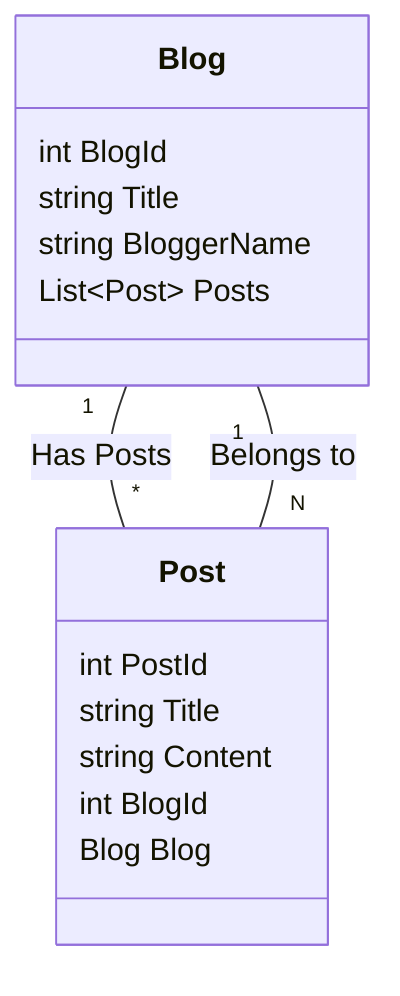

# Entity Framework Core (EF Core) 상세 가이드

### 1\. Entity Framework Core (EF Core) 란 무엇일까요? (What is Entity Framework Core?)

가장 먼저 EF Core가 무엇인지부터 알아봅시다. EF Core는 **ORM (Object-Relational Mapper)** 이라고 불리는 기술입니다.  ORM은 **객체(Object)** 와 **관계형 데이터베이스(Relational Database)** 사이의 **불일치(Impedance Mismatch)** 문제를 해결해 주는 역할을 합니다.

**잠깐\! 불일치 문제 (Impedance Mismatch)가 뭐죠?**

관계형 데이터베이스는 데이터를 **테이블(Table)** 과 **행(Row), 열(Column)** 의 형태로 저장합니다. 반면, 우리가 사용하는 프로그래밍 언어 (C\# 등)는 데이터를 **객체(Object)** 라는 형태로 다룹니다. 객체는 속성(Property)과 메서드(Method)를 가지는 복잡한 구조를 가질 수 있습니다.

이 둘 사이에는 데이터 구조와 조작 방식에 차이가 있어서, 직접 데이터베이스 코드를 작성하면 번거롭고 오류가 발생하기 쉽습니다. 마치 서로 다른 언어를 사용하는 사람과 대화하는 것처럼 어렵다고 생각하면 됩니다.

**EF Core는 바로 이 문제를 해결해 줍니다\!**  EF Core를 사용하면 개발자는 데이터베이스 테이블을 직접 조작하는 SQL 쿼리 대신, 객체를 사용하여 데이터를 다룰 수 있게 됩니다. EF Core가 객체를 데이터베이스 테이블과 자동으로 연결해 주고, 데이터베이스 작업 (저장, 조회, 수정, 삭제) 을 대신 처리해 줍니다. 마치 번역가가 있어서, 다른 언어를 사용하는 사람과 쉽게 대화할 수 있게 되는 것과 같습니다.

**핵심 요약:**

  * **ORM (Object-Relational Mapper) 이다:** 객체와 관계형 데이터베이스 사이의 다리 역할
  * **.NET 개발을 위한 ORM:** C\# 과 같은 .NET 언어에서 데이터베이스 작업 간편화
  * **SQL 쿼리 대신 객체 중심 프로그래밍:** 개발 생산성 향상 및 코드 가독성 증가

### 2\. EF Core의 특징 (Characteristics of EF Core)

EF Core는 여러 가지 강력한 특징을 가지고 있습니다. 주요 특징들을 하나씩 살펴볼까요?

#### 2.1. 가볍고 확장 가능 (Lightweight and Extensible)

EF Core는 이전 버전인 Entity Framework (EF6) 보다 훨씬 가볍고 모듈화된 구조를 가집니다. 필요한 기능만 선택적으로 NuGet 패키지를 통해 설치하여 사용할 수 있으며,  개발자의 필요에 따라 기능을 확장하거나 커스터마이징하기 용이합니다.

#### 2.2. 크로스 플랫폼 (Cross-Platform)

가장 큰 특징 중 하나는 **크로스 플랫폼**을 지원한다는 점입니다. 즉, Windows 뿐만 아니라 macOS, Linux 등 다양한 운영체제에서 .NET Core (현재 .NET) 응용 프로그램을 개발하고 실행할 수 있으며, EF Core 역시 이러한 환경을 완벽하게 지원합니다.

#### 2.3. 다양한 데이터베이스 지원 (Supports Multiple Database Providers)

EF Core는 다양한 종류의 데이터베이스 시스템을 지원합니다.  각 데이터베이스 벤더에서 제공하는 **Provider** 를 설치하면, EF Core를 통해 해당 데이터베이스와 연동할 수 있습니다.  주요 지원 데이터베이스는 다음과 같습니다.

  * **SQL Server:** Microsoft SQL Server
  * **SQLite:**  파일 기반의 경량 데이터베이스, 개발 및 테스트 환경에 유용
  * **MySQL:**  오픈 소스 데이터베이스, 웹 개발에 많이 사용
  * **PostgreSQL:** 오픈 소스 데이터베이스, 강력한 기능과 안정성 제공
  * **Oracle:**  기업 환경에서 많이 사용되는 상용 데이터베이스
  * **기타:** Azure Cosmos DB, Firebird, IBM DB2 등 다양한 데이터베이스 지원

#### 2.4. 다양한 개발 방식 지원 (Supports Different Development Approaches)

EF Core는 데이터베이스와 객체 모델을 설계하는 다양한 방식을 지원합니다. 개발 방식에 따라 **Code First**, **Database First**, **Model First**  세 가지 접근 방식을 제공합니다.

**[Table of 개발 방식 비교]**

| 개발 방식         | 설명                                                                                                                                 | 장점                                                                                                                                                                | 단점                                                                                                                                                                |
| :---------------- | :----------------------------------------------------------------------------------------------------------------------------------- | :------------------------------------------------------------------------------------------------------------------------------------------------------------------ | :------------------------------------------------------------------------------------------------------------------------------------------------------------------ |
| **Code First**     | 코드로 객체 모델 (Entity 클래스) 를 먼저 정의하고, EF Core가 이를 기반으로 데이터베이스 스키마를 생성합니다.                                                                                              | 객체 모델 중심으로 개발 가능, 코드 변경에 따른 데이터베이스 스키마 변경 용이 (Migrations 사용),  데이터베이스 스키마를 코드와 함께 버전 관리 가능, 깔끔하고 직관적인 개발 방식 | 객체 모델 설계에 대한 이해 필요,  기존 데이터베이스에 적용하기 어려울 수 있음,  데이터베이스 스키마를 세밀하게 제어하기 어려울 수 있음                                                                                               |
| **Database First** | 기존 데이터베이스 스키마를 기반으로 EF Core가 객체 모델 (Entity 클래스, DbContext) 을 자동으로 생성합니다.                                                                                         | 기존 데이터베이스 활용 용이,  데이터베이스 스키마가 이미 정의된 경우 빠르게 개발 시작 가능,  데이터베이스 전문가와 협업 용이                                                                                                   | 데이터베이스 스키마 변경 시 객체 모델을 다시 생성해야 함,  객체 모델을 직접 수정하기 어려움,  데이터베이스 스키마에 종속적인 개발 방식                                                                                                 |
| **Model First**    | 다이어그램 도구를 사용하여 시각적으로 객체 모델을 설계하고, 이를 기반으로 데이터베이스 스키마와 객체 모델 코드를 모두 생성합니다. (EF6에서 지원, EF Core에서는 지원 중단)                                                                          | 시각적인 모델링 도구 활용 가능,  객체 모델과 데이터베이스 스키마를 동시에 설계 가능                                                                                                   | Code First 와 Database First 방식에 비해 유연성 부족,  EF Core에서 더 이상 권장되지 않는 방식                                                                                                  |

*EF Core에서는 **Code First 방식** 을 가장 권장하며, 실무에서도 가장 많이 사용됩니다. Database First 방식은 기존 데이터베이스를 활용해야 하는 경우에 유용합니다.*

#### 2.5. LINQ 지원 (LINQ Support)

EF Core는 **LINQ (Language Integrated Query)** 를 완벽하게 지원합니다. LINQ를 사용하면 SQL 쿼리 대신 C\# 코드로 데이터베이스를 쿼리할 수 있습니다.  LINQ 쿼리는 컴파일 타임에 타입 체크가 가능하여 오류를 줄여주고, 코드 가독성을 높여줍니다.

**예시:**

```csharp
// LINQ 쿼리 (C# 코드)
var blogs = context.Blogs
    .Where(b => b.Rating > 3)
    .OrderByDescending(b => b.CreatedAt)
    .ToList();

// SQL 쿼리 (EF Core가 LINQ 쿼리를 SQL로 변환하여 실행)
SELECT *
FROM Blogs
WHERE Rating > 3
ORDER BY CreatedAt DESC
```

*위 예시처럼 LINQ 쿼리를 작성하면, EF Core가 자동으로 해당 LINQ 쿼리를 데이터베이스에 맞는 SQL 쿼리로 변환하여 실행해 줍니다.*

#### 2.6. 변경 감지 (Change Tracking)

EF Core는 **변경 감지 (Change Tracking)** 기능을 통해 객체의 변경 사항을 자동으로 추적합니다.  데이터베이스에서 조회한 객체를 수정하고 `SaveChanges()` 메서드를 호출하면, EF Core는 변경된 속성만 자동으로 데이터베이스에 업데이트 쿼리를 생성하여 실행합니다.  개발자는 변경 사항을 직접 추적하고 업데이트 쿼리를 작성할 필요가 없습니다.

#### 2.7. 마이그레이션 (Migrations)

**마이그레이션 (Migrations)** 은 데이터베이스 스키마를 코드와 함께 버전 관리할 수 있도록 해주는 강력한 기능입니다.  Code First 방식으로 개발할 때, 객체 모델 (Entity 클래스) 을 수정하면 데이터베이스 스키마도 함께 변경해야 합니다.  마이그레이션을 사용하면 객체 모델 변경 사항을 기반으로 데이터베이스 스키마 변경 스크립트를 자동으로 생성하고, 데이터베이스에 적용할 수 있습니다.  이를 통해 개발, 테스트, 운영 환경에서 데이터베이스 스키마를 일관성 있게 관리할 수 있습니다.

### 3\. EF Core 사용 방법 (How to Use EF Core)

이제 실제로 EF Core를 사용하는 방법을 단계별로 알아봅시다. Code First 방식을 기준으로 설명합니다.

#### 3.1. EF Core 설정 (Setting up EF Core)

1.  **NuGet 패키지 설치:** 프로젝트에 필요한 EF Core NuGet 패키지를 설치합니다.  최소한 다음 패키지들이 필요합니다.

      * `Microsoft.EntityFrameworkCore`: EF Core 기본 패키지
      * `Microsoft.EntityFrameworkCore.SqlServer` (SQL Server 사용 시) 또는 다른 데이터베이스 Provider 패키지 (예: `Microsoft.EntityFrameworkCore.Sqlite`, `Microsoft.EntityFrameworkCore.MySql.Pomelo`)

    **Package Manager Console (PMC) 또는 .NET CLI 사용:**

    ```powershell
    # Package Manager Console (PMC)
    Install-Package Microsoft.EntityFrameworkCore.SqlServer
    Install-Package Microsoft.EntityFrameworkCore.Tools

    # .NET CLI
    dotnet add package Microsoft.EntityFrameworkCore.SqlServer
    dotnet add package Microsoft.EntityFrameworkCore.Tools
    ```

2.  **DbContext 클래스 생성:**  `DbContext` 클래스는 EF Core와 데이터베이스 사이의 **컨텍스트** 역할을 합니다.  데이터베이스 연결 정보, Entity 클래스 정보 등을 관리하고, 데이터베이스 작업을 수행하는 데 사용됩니다.  `DbContext` 클래스를 상속받아 프로젝트에 맞는 컨텍스트 클래스를 생성합니다.

    ```csharp
    using Microsoft.EntityFrameworkCore;

    public class BloggingContext : DbContext
    {
        public BloggingContext(DbContextOptions<BloggingContext> options)
            : base(options)
        { }

        public DbSet<Blog> Blogs { get; set; } // Entity 클래스 등록 (Blogs 테이블과 매핑)
        public DbSet<Post> Posts { get; set; } // Entity 클래스 등록 (Posts 테이블과 매핑)
    }
    ```

3.  **DbContext 구성 (Configure DbContext):**  `DbContext` 를 구성하기 위해 `Startup.cs` (또는 `Program.cs` in .NET 6+) 파일의 `ConfigureServices` 메서드 (또는 `Program.cs`의 builder.Services) 에서 `AddDbContext` 메서드를 사용하여 데이터베이스 연결 문자열과 사용할 데이터베이스 Provider를 설정합니다.

    ```csharp
    // Startup.cs (ConfigureServices 메서드)
    public void ConfigureServices(IServiceCollection services)
    {
        services.AddDbContext<BloggingContext>(options =>
            options.UseSqlServer(Configuration.GetConnectionString("DefaultConnection"))); // SQL Server 사용, 연결 문자열 설정
    }

    // Program.cs (.NET 6+ 이상)
    builder.Services.AddDbContext<BloggingContext>(options =>
        options.UseSqlServer(builder.Configuration.GetConnectionString("DefaultConnection"))); // SQL Server 사용, 연결 문자열 설정
    ```

      * `UseSqlServer()` 대신 다른 데이터베이스 Provider 메서드 (`UseSqlite()`, `UseMySql()`, `UseNpgsql()` 등) 를 사용할 수 있습니다.
      * `Configuration.GetConnectionString("DefaultConnection")` 은 `appsettings.json` 파일 등에 정의된 연결 문자열을 가져오는 코드입니다.

4.  **Entity 클래스 정의 (Define Entity Classes):** 데이터베이스 테이블과 매핑될 **Entity 클래스 (POCO 클래스)** 를 정의합니다.  Entity 클래스는 데이터베이스 테이블의 컬럼에 해당하는 속성 (Property) 들을 가집니다.

    ```csharp
    public class Blog
    {
        public int BlogId { get; set; } // Primary Key, 테이블의 BlogId 컬럼과 매핑
        public string Url { get; set; }   // 테이블의 Url 컬럼과 매핑
        public int Rating { get; set; } // 테이블의 Rating 컬럼과 매핑

        public List<Post> Posts { get; set; } // Navigation Property, Blog - Post 관계 설정
    }

    public class Post
    {
        public int PostId { get; set; }   // Primary Key, 테이블의 PostId 컬럼과 매핑
        public string Title { get; set; }  // 테이블의 Title 컬럼과 매핑
        public string Content { get; set; } // 테이블의 Content 컬럼과 매핑

        public int BlogId { get; set; }    // Foreign Key, 테이블의 BlogId 컬럼과 매핑, Blog 테이블과의 관계 설정
        public Blog Blog { get; set; }     // Navigation Property, Post - Blog 관계 설정
    }
    ```

      * Entity 클래스는 Plain Old CLR Object (POCO) 클래스라고도 불립니다.  특별한 인터페이스를 구현하거나 특정 클래스를 상속받을 필요 없이, 일반적인 C\# 클래스로 정의할 수 있습니다.
      * **Primary Key:** Entity 클래스의 속성 중 하나를 Primary Key로 지정해야 합니다.  일반적으로 `Id` 또는 `ClassNameId` 와 같은 이름의 속성을 Primary Key로 사용하는 규칙이 있습니다.
      * **Navigation Property:** Entity 클래스 간의 관계를 설정하기 위해 사용되는 속성입니다.  위 예시에서 `Blog` 클래스의 `Posts` 속성과 `Post` 클래스의 `Blog` 속성은 Navigation Property입니다.

5.  **Entity 관계 설정 (Configure Entity Relationships):** Entity 클래스 간의 관계 (One-to-One, One-to-Many, Many-to-Many) 를 설정합니다.  Code First 방식에서는 주로 **Convention (규칙)** 과 **Fluent API** 를 사용하여 관계를 설정합니다.

      * **Convention:**  EF Core는 미리 정의된 규칙에 따라 Entity 클래스 간의 관계를 자동으로 설정합니다.  예를 들어, `Post` 클래스에 `BlogId` 속성과 `Blog` Navigation Property가 있으면, EF Core는 자동으로 Post 와 Blog 사이에 One-to-Many 관계를 설정합니다.
      * **Fluent API:** Convention으로 설정할 수 없는 복잡한 관계나 세밀한 설정을 해야 할 경우, Fluent API를 사용합니다.  `DbContext` 클래스의 `OnModelCreating` 메서드를 오버라이드하여 Fluent API를 설정할 수 있습니다.

    <!-- end list -->

    ```csharp
    public class BloggingContext : DbContext
    {
        public BloggingContext(DbContextOptions<BloggingContext> options)
            : base(options)
        { }

        public DbSet<Blog> Blogs { get; set; }
        public DbSet<Post> Posts { get; set; }

        protected override void OnModelCreating(ModelBuilder modelBuilder)
        {
            // Fluent API 설정 예시: Blog - Post 관계 설정 (One-to-Many, Post.BlogId 를 Foreign Key로 사용)
            modelBuilder.Entity<Post>()
                .HasOne(p => p.Blog) // Post는 하나의 Blog를 가진다 (One-to-One 또는 One-to-Many 관계의 'One' 쪽)
                .WithMany(b => b.Posts) // Blog는 여러 개의 Post를 가질 수 있다 (One-to-Many 또는 Many-to-Many 관계의 'Many' 쪽)
                .HasForeignKey(p => p.BlogId); // Post 의 BlogId 속성을 Foreign Key 로 사용
        }
    }
    ```

#### 3.2. CRUD 연산 수행 (Performing CRUD Operations)

EF Core를 사용하여 데이터베이스에 데이터를 저장, 조회, 수정, 삭제하는 CRUD (Create, Read, Update, Delete) 연산을 수행하는 방법을 알아봅시다.

1.  **Create (생성):**  새로운 Entity 객체를 생성하고, `DbContext` 를 통해 데이터베이스에 저장합니다.

    ```csharp
    using (var context = new BloggingContext(options)) // DbContext 인스턴스 생성 (using 블록 안에서 생성하여 Dispose 되도록 함)
    {
        var blog = new Blog { Url = "http://example.com/new-blog", Rating = 5 }; // 새로운 Blog Entity 객체 생성

        context.Blogs.Add(blog); // DbContext 의 Blogs DbSet 에 Entity 객체 추가 (Entity State: Added)
        context.SaveChanges();    // 변경 사항을 데이터베이스에 저장 (INSERT 쿼리 실행)

        Console.WriteLine($"Blog added with ID: {blog.BlogId}"); // 데이터베이스에서 자동 생성된 Primary Key 값 확인
    }
    ```

      * `context.Blogs.Add(blog)`:  새로운 `Blog` Entity 객체를 `DbContext` 의 `Blogs` DbSet 에 추가합니다.  이때 Entity 객체의 상태는 **Added** 로 변경됩니다.
      * `context.SaveChanges()`:  `DbContext` 에 추적되고 있는 모든 Entity 객체의 변경 사항을 데이터베이스에 저장합니다.  Added 상태의 Entity 객체는 INSERT 쿼리를 통해 데이터베이스에 새로운 행으로 추가됩니다.

2.  **Read (조회):** LINQ 쿼리 또는 `Find()` 메서드를 사용하여 데이터베이스에서 데이터를 조회합니다.

    ```csharp
    using (var context = new BloggingContext(options))
    {
        // 1. Find() 메서드 사용 (Primary Key 값으로 조회)
        var blog1 = context.Blogs.Find(1); // BlogId 가 1 인 Blog 조회
        if (blog1 != null)
        {
            Console.WriteLine($"Blog URL (Find): {blog1.Url}");
        }

        // 2. LINQ 쿼리 사용 (다양한 조건으로 조회 가능)
        var blog2 = context.Blogs
            .Where(b => b.Rating > 4)     // Rating 이 4 보다 큰 Blog 만 필터링
            .OrderByDescending(b => b.Rating) // Rating 내림차순으로 정렬
            .FirstOrDefault();           // 첫 번째 결과만 가져옴 (없으면 null)
        if (blog2 != null)
        {
            Console.WriteLine($"Blog URL (LINQ): {blog2.Url}, Rating: {blog2.Rating}");
        }

        // 3. ToList() 를 사용하여 모든 결과 가져오기
        var allBlogs = context.Blogs.ToList(); // 모든 Blog 조회
        Console.WriteLine($"Total Blogs: {allBlogs.Count}");
    }
    ```

      * `context.Blogs.Find(1)`:  Primary Key 값 (여기서는 `BlogId` 가 1) 으로 Entity 객체를 조회합니다.  Find() 메서드는 Primary Key 값으로만 조회할 수 있으며, 조회 결과가 없으면 `null` 을 반환합니다.
      * `context.Blogs.Where(...).OrderByDescending(...).FirstOrDefault()`: LINQ 쿼리를 사용하여 다양한 조건으로 데이터를 조회할 수 있습니다.  `Where()`, `OrderBy()`, `FirstOrDefault()`, `ToList()` 등 다양한 LINQ 연산자를 사용하여 원하는 데이터를 필터링, 정렬, 프로젝션 할 수 있습니다.

3.  **Update (수정):** 데이터베이스에서 조회한 Entity 객체의 속성을 변경하고, `SaveChanges()` 메서드를 호출하여 변경 사항을 데이터베이스에 반영합니다.

    ```csharp
    using (var context = new BloggingContext(options))
    {
        var blog = context.Blogs.Find(1); // 수정할 Blog 조회
        if (blog != null)
        {
            blog.Url = "http://example.com/updated-blog"; // Blog 객체의 Url 속성 변경 (Entity State: Modified)
            context.SaveChanges();                         // 변경 사항을 데이터베이스에 저장 (UPDATE 쿼리 실행)
            Console.WriteLine($"Blog URL updated to: {blog.Url}");
        }
    }
    ```

      * EF Core는 **변경 감지 (Change Tracking)** 기능을 통해 Entity 객체의 변경 사항을 자동으로 추적합니다.  데이터베이스에서 조회한 Entity 객체의 속성을 변경하면, EF Core는 해당 Entity 객체의 상태를 **Modified** 로 변경합니다.
      * `context.SaveChanges()`:  Modified 상태의 Entity 객체는 UPDATE 쿼리를 통해 데이터베이스에 변경 사항이 반영됩니다.

4.  **Delete (삭제):**  삭제할 Entity 객체를 조회하고, `DbContext` 를 통해 데이터베이스에서 삭제합니다.

    ```csharp
    using (var context = new BloggingContext(options))
    {
        var blog = context.Blogs.Find(1); // 삭제할 Blog 조회
        if (blog != null)
        {
            context.Blogs.Remove(blog); // DbContext 의 Blogs DbSet 에서 Entity 객체 제거 (Entity State: Deleted)
            context.SaveChanges();        // 변경 사항을 데이터베이스에 저장 (DELETE 쿼리 실행)
            Console.WriteLine($"Blog deleted with ID: {blog.BlogId}");
        }
    }
    ```

      * `context.Blogs.Remove(blog)`:  삭제할 `Blog` Entity 객체를 `DbContext` 의 `Blogs` DbSet 에서 제거합니다. 이때 Entity 객체의 상태는 **Deleted** 로 변경됩니다.
      * `context.SaveChanges()`:  Deleted 상태의 Entity 객체는 DELETE 쿼리를 통해 데이터베이스에서 해당 행이 삭제됩니다.

#### 3.3. 마이그레이션 사용 (Using Migrations)

마이그레이션을 사용하여 데이터베이스 스키마를 관리하는 방법을 알아봅시다.

1.  **마이그레이션 추가 (Add Migration):**  Entity 클래스 (객체 모델) 를 변경한 후, `Add-Migration` 명령어를 사용하여 마이그레이션 파일을 생성합니다.

    **Package Manager Console (PMC) 또는 .NET CLI 사용:**

    ```powershell
    # Package Manager Console (PMC)
    Add-Migration InitialCreate // 마이그레이션 이름 지정 (예: InitialCreate, AddRatingColumn 등)

    # .NET CLI
    dotnet ef migrations add InitialCreate
    ```

      * `Add-Migration` 명령어는 현재 객체 모델과 데이터베이스 스키마를 비교하여 변경 사항을 감지하고, 데이터베이스 스키마를 업데이트하는 마이그레이션 파일을 생성합니다.  마이그레이션 파일은 `Migrations` 폴더 아래에 생성됩니다.

2.  **데이터베이스 업데이트 (Update Database):**  `Update-Database` 명령어를 사용하여 마이그레이션 파일을 데이터베이스에 적용합니다.

    **Package Manager Console (PMC) 또는 .NET CLI 사용:**

    ```powershell
    # Package Manager Console (PMC)
    Update-Database

    # .NET CLI
    dotnet ef database update
    ```

      * `Update-Database` 명령어는 `Migrations` 폴더 아래의 마이그레이션 파일을 순서대로 데이터베이스에 적용하여 데이터베이스 스키마를 업데이트합니다.

**마이그레이션 명령어 요약:**

  * `Add-Migration <MigrationName>`:  새로운 마이그레이션 파일 생성
  * `Update-Database`:  마이그레이션 파일을 데이터베이스에 적용
  * `Remove-Migration`:  가장 최근에 생성된 마이그레이션 파일 삭제 (되돌리기)
  * `Script-Migration`:  마이그레이션 스크립트 (SQL) 생성 (데이터베이스 관리자가 직접 스크립트 실행 가능)
  * `Get-DbContextInfo`:  DbContext 정보 확인

### 4\. 참고 웹사이트 (References)

EF Core를 더 자세히 배우고 싶다면 다음 웹사이트들을 참고해 보세요.

  * **Microsoft 공식 Entity Framework Core 문서:** [https://docs.microsoft.com/ko-kr/ef/core/](https://learn.microsoft.com/ko-kr/ef/core/)  (가장 정확하고 최신 정보 제공)
  * **EF Core 자습서 - Microsoft Learn:** [https://learn.microsoft.com/ko-kr/ef/core/get-started/overview/first-app?tabs=net-core-cli](https://www.google.com/search?q=https://learn.microsoft.com/ko-kr/ef/core/get-started/overview/first-app%3Ftabs%3Dnet-core-cli) (단계별 자습서, 초보자에게 유용)
  * **Entity Framework Core in Action (책):** [https://www.manning.com/books/entity-framework-core-in-action-second-edition](https://www.google.com/url?sa=E&source=gmail&q=https://www.manning.com/books/entity-framework-core-in-action-second-edition) (EF Core 전문가가 쓴 깊이 있는 내용, 중급 이상 개발자에게 추천)
  * **Stack Overflow (ef-core 태그):** [https://stackoverflow.com/questions/tagged/ef-core](https://www.google.com/url?sa=E&source=gmail&q=https://stackoverflow.com/questions/tagged/ef-core) (EF Core 관련 질문/답변, 문제 해결에 도움)

---
# .NET CLI 상세 가이드

### 1\. .NET CLI 란 무엇일까요? (What is .NET CLI?)
.NET CLI (Command-Line Interface)는 윈도우, macOS, Linux 등 다양한 운영체제에서 .NET 개발을 위한 핵심적인 도구입니다.  텍스트 기반의 명령어를 사용하여 .NET 프로젝트를 생성, 빌드, 실행, 테스트, 패키징하고 관리하는 데 사용됩니다.

**잠깐\! CLI (Command-Line Interface) 가 뭐죠?**

CLI는 텍스트 명령어를 입력하여 컴퓨터를 제어하는 방식입니다.  마우스 클릭이나 GUI (Graphical User Interface) 대신, 키보드로 명령어를 입력하여 작업을 수행합니다.  과거에는 컴퓨터와 소통하는 주요 방식이었으며, 개발 환경에서는 여전히 강력하고 효율적인 도구로 사용됩니다.

**.NET CLI는 .NET 개발의 '만능 도구' 입니다\!**  .NET CLI를 사용하면 다음과 같은 다양한 작업을 할 수 있습니다.

  * **프로젝트 생성:**  새로운 .NET 프로젝트 (콘솔 앱, 웹 API, 웹 앱, 클래스 라이브러리 등) 를 템플릿 기반으로 빠르게 생성
  * **코드 빌드:**  작성한 C\# 코드를 실행 가능한 형태로 컴파일 (빌드)
  * **프로그램 실행:**  빌드된 프로그램을 실행
  * **테스트 실행:**  작성한 테스트 코드를 실행하여 코드의 품질 검증
  * **NuGet 패키지 관리:**  프로젝트에 필요한 외부 라이브러리 (NuGet 패키지) 를 추가, 제거, 업데이트
  * **게시 (Publish):**  개발 완료된 애플리케이션을 배포 가능한 형태로 패키징

**핵심 요약:**

  * **.NET 개발을 위한 명령줄 인터페이스 (CLI) 이다:** 텍스트 기반 명령어로 .NET 개발 작업 수행
  * **크로스 플랫폼 지원:** Windows, macOS, Linux 등 다양한 운영체제에서 사용 가능
  * **.NET 개발의 핵심 워크플로우 지원:** 프로젝트 생성, 빌드, 실행, 테스트, 패키징, 배포 등

### 2\. .NET CLI의 특징 (Characteristics of .NET CLI)

.NET CLI는 강력하고 편리한 개발 경험을 제공하는 다양한 특징을 가지고 있습니다. 주요 특징들을 하나씩 살펴볼까요?

#### 2.1. 크로스 플랫폼 (Cross-Platform)

가장 중요한 특징 중 하나는 **크로스 플랫폼**을 완벽하게 지원한다는 점입니다.  .NET CLI는 Windows, macOS, Linux 등 다양한 운영체제에서 동일하게 작동합니다.  즉, 운영체제에 종속되지 않고, 개발 환경을 자유롭게 선택할 수 있습니다.

#### 2.2. 명령 기반 작업 (Command-Based Operations)

.NET CLI는 텍스트 명령어 기반으로 작동합니다.  명령어를 통해 프로젝트를 생성하고 관리하며, 빌드, 실행, 테스트 등 모든 개발 작업을 명령어로 수행할 수 있습니다.  명령어 기반 작업은 자동화, 스크립팅에 용이하며, 반복적인 작업을 효율적으로 처리할 수 있도록 해줍니다.

#### 2.3. 템플릿 기반 프로젝트 생성 (Template-Based Project Creation)

.NET CLI는 다양한 프로젝트 템플릿을 제공합니다.  `dotnet new` 명령어를 사용하면 콘솔 앱, 웹 API, 웹 앱, 클래스 라이브러리 등 다양한 유형의 프로젝트를 템플릿 기반으로 빠르게 생성할 수 있습니다.  템플릿은 프로젝트의 기본적인 구조와 필요한 파일들을 자동으로 구성해 줍니다.

#### 2.4. NuGet 패키지 관리 (NuGet Package Management)

.NET CLI는 NuGet 패키지 관리를 위한 기능을 내장하고 있습니다.  `dotnet add package`, `dotnet remove package`, `dotnet list package` 등의 명령어를 사용하여 프로젝트에 필요한 NuGet 패키지를 쉽게 추가, 제거, 관리할 수 있습니다.  NuGet 패키지는 .NET 개발 생태계의 핵심이며, .NET CLI를 통해 풍부한 라이브러리들을 편리하게 활용할 수 있습니다.

#### 2.5. 빌드 및 실행 (Build and Run)

.NET CLI는 소스 코드를 빌드하고 실행하는 기능을 제공합니다.  `dotnet build` 명령어를 사용하여 소스 코드를 컴파일하고 실행 가능한 형태로 만들 수 있으며, `dotnet run` 명령어를 사용하여 빌드된 프로그램을 바로 실행할 수 있습니다.  빌드 및 실행 과정은 .NET 개발의 핵심이며, .NET CLI를 통해 간단하게 수행할 수 있습니다.

#### 2.6. 테스트 실행 (Test Execution)

.NET CLI는 테스트 프레임워크와 통합되어 테스트 코드를 실행하는 기능을 제공합니다.  `dotnet test` 명령어를 사용하면 프로젝트 내의 테스트 프로젝트를 찾아서 자동으로 테스트를 실행하고 결과를 보여줍니다.  테스트 주도 개발 (TDD) 또는 단위 테스트를 중요하게 생각하는 개발 방식에서 .NET CLI의 테스트 실행 기능은 매우 유용합니다.

#### 2.7. 게시 (Publish)

.NET CLI는 개발 완료된 애플리케이션을 배포 가능한 형태로 패키징하는 게시 기능을 제공합니다.  `dotnet publish` 명령어를 사용하면 애플리케이션을 특정 플랫폼 (Windows, Linux, macOS) 또는 배포 환경 (Docker, Azure 등) 에 맞게 패키징할 수 있습니다.  게시 기능은 애플리케이션 배포 과정을 간소화하고 자동화하는 데 도움을 줍니다.

#### 2.8. 확장성 (Extensibility)

.NET CLI는 확장 가능한 구조를 가지고 있습니다.  필요한 기능을 확장하거나 커스터마이징하기 위해 도구를 추가하거나 기능을 확장할 수 있습니다.  .NET SDK 및 도구를 업데이트하여 최신 기능과 개선 사항을 쉽게 적용할 수 있습니다.

### 3\. .NET CLI 사용 방법 (How to Use .NET CLI)

이제 실제로 .NET CLI를 사용하는 방법을 단계별로 알아봅시다. 기본적인 명령어와 함께 예시를 들어 설명합니다.

#### 3.1. .NET CLI 설치 확인 (Verify .NET CLI Installation)

먼저 .NET CLI가 제대로 설치되었는지 확인해 보겠습니다. 터미널 (명령 프롬프트, PowerShell, 터미널 앱 등) 을 열고 다음 명령어를 입력해 보세요.

```bash
dotnet --version
```

정상적으로 설치되었다면, .NET SDK 버전 정보가 출력될 것입니다.  만약 `dotnet` 명령어를 찾을 수 없다는 오류 메시지가 나타난다면, .NET SDK를 설치해야 합니다.  .NET 다운로드 페이지 ([https://dotnet.microsoft.com/download](https://www.google.com/url?sa=E&source=gmail&q=https://dotnet.microsoft.com/download)) 에서 운영체제에 맞는 SDK를 다운로드하여 설치하세요.

#### 3.2. 새로운 프로젝트 생성 (`dotnet new`)

새로운 .NET 프로젝트를 생성하려면 `dotnet new` 명령어를 사용합니다.  `dotnet new <템플릿_이름> -o <프로젝트_이름>` 형식으로 명령어를 입력합니다.

**자주 사용되는 템플릿:**

  * `console`: 콘솔 응용 프로그램
  * `webapi`: 웹 API 응용 프로그램
  * `webapp`: 웹 응용 프로그램 (Razor Pages)
  * `mvc`: 웹 응용 프로그램 (MVC)
  * `classlib`: 클래스 라이브러리

**예시:**

1.  **콘솔 앱 프로젝트 생성:** `MyConsoleApp` 이라는 이름의 콘솔 앱 프로젝트를 생성합니다.

    ```bash
    dotnet new console -o MyConsoleApp
    cd MyConsoleApp  # 프로젝트 폴더로 이동
    ```

      * `dotnet new console`: 콘솔 앱 템플릿을 사용하여 프로젝트 생성
      * `-o MyConsoleApp`:  `MyConsoleApp` 이라는 이름의 폴더에 프로젝트 생성

    생성된 `MyConsoleApp` 폴더에는 기본적인 콘솔 앱 프로젝트 구조와 파일 (`Program.cs`, `.csproj` 등) 이 자동으로 구성됩니다.

2.  **웹 API 프로젝트 생성:** `MyWebApi` 이라는 이름의 웹 API 프로젝트를 생성합니다.

    ```bash
    dotnet new webapi -o MyWebApi
    cd MyWebApi   # 프로젝트 폴더로 이동
    ```

      * `dotnet new webapi`: 웹 API 템플릿을 사용하여 프로젝트 생성
      * `-o MyWebApi`: `MyWebApi` 이라는 이름의 폴더에 프로젝트 생성

    `MyWebApi` 폴더에는 웹 API 프로젝트에 필요한 컨트롤러, 모델, 설정 파일 등이 템플릿에 따라 구성됩니다.

#### 3.3. 프로젝트 빌드 (`dotnet build`)

프로젝트를 빌드하려면 프로젝트 폴더로 이동한 후 `dotnet build` 명령어를 실행합니다.

```bash
cd MyConsoleApp  # 프로젝트 폴더로 이동 (예시)
dotnet build
```

`dotnet build` 명령어는 프로젝트 파일 (`.csproj`) 을 분석하고, 소스 코드를 컴파일하여 실행 가능한 바이너리 파일 (`.dll` 또는 `.exe`) 을 생성합니다. 빌드 결과는 프로젝트 폴더 아래의 `bin` 폴더에 저장됩니다.

#### 3.4. 프로그램 실행 (`dotnet run`)

빌드된 프로그램을 실행하려면 프로젝트 폴더에서 `dotnet run` 명령어를 실행합니다.

```bash
cd MyConsoleApp  # 프로젝트 폴더로 이동 (예시)
dotnet run
```

`dotnet run` 명령어는 프로젝트를 빌드하고, 빌드된 결과물을 바로 실행합니다.  콘솔 앱의 경우 콘솔 창에 프로그램 실행 결과가 출력됩니다. 웹 API 또는 웹 앱의 경우, 웹 서버가 실행되고 브라우저를 통해 애플리케이션에 접근할 수 있습니다.

#### 3.5. NuGet 패키지 관리

1.  **NuGet 패키지 추가 (`dotnet add package`)**

    프로젝트에 NuGet 패키지를 추가하려면 `dotnet add package <패키지_이름>` 명령어를 사용합니다.

    **예시:**  `Newtonsoft.Json` 패키지를 현재 프로젝트에 추가합니다.

    ```bash
    dotnet add package Newtonsoft.Json
    ```

      * `dotnet add package Newtonsoft.Json`:  `Newtonsoft.Json` NuGet 패키지를 프로젝트에 추가

2.  **NuGet 패키지 제거 (`dotnet remove package`)**

    프로젝트에서 NuGet 패키지를 제거하려면 `dotnet remove package <패키지_이름>` 명령어를 사용합니다.

    **예시:** `Newtonsoft.Json` 패키지를 현재 프로젝트에서 제거합니다.

    ```bash
    dotnet remove package Newtonsoft.Json
    ```

      * `dotnet remove package Newtonsoft.Json`:  `Newtonsoft.Json` NuGet 패키지를 프로젝트에서 제거

3.  **NuGet 패키지 목록 확인 (`dotnet list package`)**

    프로젝트에 추가된 NuGet 패키지 목록을 확인하려면 `dotnet list package` 명령어를 사용합니다.

    ```bash
    dotnet list package
    ```

      * `dotnet list package`:  프로젝트에 추가된 NuGet 패키지 목록을 출력

#### 3.6. 테스트 실행 (`dotnet test`)

프로젝트 내의 테스트 프로젝트를 실행하려면 프로젝트 루트 폴더 또는 테스트 프로젝트 폴더에서 `dotnet test` 명령어를 실행합니다.

```bash
dotnet test
```

`dotnet test` 명령어는 프로젝트를 빌드하고, 테스트 프로젝트를 찾아서 자동으로 테스트를 실행합니다.  테스트 결과 (성공, 실패, 건너뜀) 와 함께 테스트 커버리지 정보를 콘솔에 출력합니다.

#### 3.7. 게시 (`dotnet publish`)

애플리케이션을 게시하려면 프로젝트 폴더에서 `dotnet publish` 명령어를 실행합니다.

```bash
dotnet publish -c Release -r win-x64  # Windows 64비트 릴리즈 버전으로 게시 (예시)
```

  * `dotnet publish`: 게시 명령어
  * `-c Release`: 릴리즈 빌드 구성으로 게시 (최적화, 디버깅 정보 제거)
  * `-r win-x64`:  Windows 64비트 플랫폼으로 게시 (Self-Contained Deployment, SCD 방식)

`dotnet publish` 명령어는 프로젝트를 빌드하고, 지정된 구성 및 런타임에 맞게 애플리케이션을 게시 폴더 (`bin\Release\net8.0\win-x64\publish` 와 유사한 경로) 에 생성합니다. 게시된 폴더에는 실행에 필요한 모든 파일 (실행 파일, DLL, 설정 파일, 런타임 라이브러리 등) 이 포함되어 있습니다.

#### 3.8. 유용한 .NET CLI 명령어 요약

**[Table of 자주 사용하는 .NET CLI 명령어]**

| 명령어               | 설명                                                                                                                               | 예시                                                                 |
| :--------------------- | :--------------------------------------------------------------------------------------------------------------------------------- | :------------------------------------------------------------------- |
| `dotnet --version`      | 설치된 .NET SDK 버전 확인                                                                                                          | `dotnet --version`                                                    |
| `dotnet new <템플릿> -o <이름>` | 새 프로젝트 생성 (템플릿: console, webapi, webapp, classlib 등)                                                                                 | `dotnet new console -o MyConsoleApp`                                 |
| `dotnet build`         | 프로젝트 빌드                                                                                                                        | `dotnet build`                                                       |
| `dotnet run`           | 프로그램 실행                                                                                                                        | `dotnet run`                                                         |
| `dotnet add package <패키지>` | NuGet 패키지 추가                                                                                                               | `dotnet add package Newtonsoft.Json`                                 |
| `dotnet remove package <패키지>`| NuGet 패키지 제거                                                                                                               | `dotnet remove package Newtonsoft.Json`                                 |
| `dotnet list package`    | NuGet 패키지 목록 확인                                                                                                               | `dotnet list package`                                                |
| `dotnet test`          | 테스트 실행                                                                                                                          | `dotnet test`                                                        |
| `dotnet publish`       | 애플리케이션 게시                                                                                                                    | `dotnet publish -c Release -r win-x64`                              |
| `dotnet help <명령어>`    | 특정 명령어 도움말 보기                                                                                                            | `dotnet help new`                                                     |

*위 표는 .NET CLI에서 자주 사용되는 명령어들을 요약한 것입니다. 더 자세한 내용은 `dotnet help` 명령어를 통해 확인할 수 있습니다.*

---
# Code First vs Database First 개발 방식 상세 가이드 
### 1\. Code First 와 Database First 란 무엇일까요? (What are Code First and Database First?)

.NET 개발에서 데이터베이스와 연동하는 방식은 크게 **Code First** 와 **Database First** 두 가지로 나눌 수 있습니다. 이 두 방식은 데이터베이스와 애플리케이션의 객체 모델을 연결하는 EF Core를 사용할 때, 개발 시작점을 어디에 두느냐에 따라 구분됩니다.

#### 1.1. Code First 방식 (Code First Approach)

**Code First 방식** 은 말 그대로 **코드를 먼저 작성하는 방식** 입니다.  개발자가 C\# 코드로 **Entity 클래스 (데이터베이스 테이블과 매핑될 클래스)** 와 `DbContext` 클래스 (데이터베이스 컨텍스트) 를 먼저 정의합니다.  EF Core는 이 코드를 기반으로 **데이터베이스 스키마를 자동으로 생성** 하고, 객체 모델과 데이터베이스를 매핑합니다.

**핵심:**

  * **개발 시작점:** C\# 코드 (Entity 클래스, DbContext)
  * **데이터베이스 생성:** EF Core가 코드 기반으로 데이터베이스 스키마 자동 생성
  * **객체 모델 중심 개발:** 객체 모델 설계를 우선시하고, 데이터베이스는 객체 모델에 맞춰 생성

#### 1.2. Database First 방식 (Database First Approach)

**Database First 방식** 은 **기존 데이터베이스가 이미 존재하는 경우** 에 유용한 방식입니다.  개발자는 **기존 데이터베이스 스키마를 먼저 설계** 하거나, 이미 존재하는 데이터베이스를 활용합니다.  EF Core는 이 데이터베이스 스키마를 분석하여 **Entity 클래스, DbContext 클래스 등 코드를 자동으로 생성** 해 줍니다.

**핵심:**

  * **개발 시작점:** 기존 데이터베이스 스키마
  * **코드 생성:** EF Core가 데이터베이스 스키마 기반으로 코드 자동 생성 (Entity 클래스, DbContext)
  * **데이터베이스 중심 개발:** 데이터베이스 스키마를 우선시하고, 코드는 데이터베이스 스키마에 맞춰 생성

### 2\. Code First vs Database First 특징 비교 (Characteristics Comparison)

Code First 와 Database First 방식은 각각 장단점을 가지고 있으며, 프로젝트의 특성과 개발 상황에 따라 적합한 방식이 다릅니다. 주요 특징들을 비교해 보겠습니다.

**[Table of Code First vs Database First 특징 비교]**

| 특징                 | Code First                                                                                                                               | Database First                                                                                                                               |
| :--------------------- | :------------------------------------------------------------------------------------------------------------------------------------- | :------------------------------------------------------------------------------------------------------------------------------------- |
| **개발 시작점**        | C\# 코드 (Entity 클래스, DbContext)                                                                                                      | 기존 데이터베이스 스키마                                                                                                                      |
| **데이터베이스 스키마 생성** | EF Core 자동 생성 (Migrations 사용)                                                                                                  | 기존 데이터베이스 활용, 스키마 직접 설계 또는 DBA 협업                                                                                                 |
| **코드 생성**          | 개발자가 직접 Entity 클래스, DbContext 코드 작성                                                                                             | EF Core가 데이터베이스 스키마 기반으로 Entity 클래스, DbContext 코드 자동 생성 (Scaffolding)                                                                    |
| **객체 모델 vs 데이터베이스 스키마** | 객체 모델 중심 설계, 데이터베이스 스키마는 객체 모델에 맞춰 생성                                                                                              | 데이터베이스 스키마 중심 설계, 코드는 데이터베이스 스키마에 맞춰 생성                                                                                               |
| **유연성**             | 높음: 객체 모델 변경에 따른 데이터베이스 스키마 변경 용이 (Migrations), 코드 변경에 유연하게 대응 가능                                                                                            | 낮음: 데이터베이스 스키마 변경 시 코드 다시 생성 필요, 코드 수정이 제한적일 수 있음                                                                                              |
| **데이터베이스 제어**     | 보통: EF Core가 대부분의 데이터베이스 스키마 관리, 세밀한 제어는 Fluent API 활용                                                                                              | 높음: 데이터베이스 스키마를 직접 설계하고 완벽하게 제어 가능,  데이터베이스 전문가에게 유리                                                                                               |
| **학습 곡선**          | 비교적 낮음: C\# 코드 작성에 익숙한 개발자에게 친숙, 객체 모델 중심 개발 방식 이해 용이                                                                                                | 비교적 높음: 기존 데이터베이스 스키마에 대한 이해 필요,  데이터베이스 스키마와 코드 생성 과정 이해 필요                                                                                                |
| **개발 속도 (초기)**     | 비교적 느림: Entity 클래스, DbContext 코드 직접 작성 필요, 초기 데이터베이스 스키마 설계 시간 소요                                                                                             | 비교적 빠름: 기존 데이터베이스 활용 또는 스키마 설계 완료된 경우 빠르게 개발 시작 가능,  코드 자동 생성으로 개발 시간 단축                                                                                              |
| **개발 속도 (유지보수)** | 빠름: 객체 모델 변경 및 코드 수정 용이,  Migrations 를 통한 데이터베이스 스키마 변경 관리 효율적                                                                                                | 느림: 데이터베이스 스키마 변경 시 코드 다시 생성 및 수정 필요,  코드와 데이터베이스 스키마 불일치 문제 발생 가능성 증가                                                                                              |
| **적합한 프로젝트**     | \* 새로운 프로젝트, 객체 모델 중심으로 개발하는 프로젝트,  데이터베이스 스키마를 유연하게 변경해야 하는 프로젝트,  애자일 개발 방식, DDD (Domain-Driven Design) 방식 적용 프로젝트                                                                            | \* 기존 데이터베이스를 활용해야 하는 프로젝트, 데이터베이스 스키마가 이미 확정된 프로젝트, 데이터베이스 중심 개발 방식 선호, DBA 와 협업이 중요한 프로젝트,  대규모 엔터프라이즈 시스템, 레거시 시스템 연동                                                                 |

### 3\. Code First 방식 사용 방법 상세 (How to Use Code First Approach)

Code First 방식으로 .NET 개발을 시작하는 방법을 단계별로 자세하게 알아보겠습니다.

#### 3.1. Entity 클래스 정의 (Define Entity Classes)

가장 먼저 데이터베이스 테이블과 매핑될 **Entity 클래스** 를 C\# 코드로 정의합니다.  Entity 클래스는 테이블의 컬럼에 해당하는 속성 (Property) 들을 가지며, 클래스 이름은 테이블 이름, 속성 이름은 컬럼 이름과 매핑됩니다.

**예시: `Blog` 와 `Post` Entity 클래스 정의**

```csharp
public class Blog
{
    public int BlogId { get; set; } // Primary Key, Blogs 테이블의 BlogId 컬럼과 매핑
    public string Url { get; set; }   // Blogs 테이블의 Url 컬럼과 매핑
    public int Rating { get; set; } // Blogs 테이블의 Rating 컬럼과 매핑

    public List<Post> Posts { get; set; } // Navigation Property, Blog - Post 관계 설정 (One-to-Many)
}

public class Post
{
    public int PostId { get; set; }   // Primary Key, Posts 테이블의 PostId 컬럼과 매핑
    public string Title { get; set; }  // Posts 테이블의 Title 컬럼과 매핑
    public string Content { get; set; } // Posts 테이블의 Content 컬럼과 매핑

    public int BlogId { get; set; }    // Foreign Key, Posts 테이블의 BlogId 컬럼과 매핑, Blog 테이블과의 관계 설정
    public Blog Blog { get; set; }     // Navigation Property, Post - Blog 관계 설정 (Many-to-One)
}
```

#### 3.2. DbContext 클래스 생성 및 구성 (Create and Configure DbContext Class)

`DbContext` 클래스를 상속받아 프로젝트에 맞는 **데이터베이스 컨텍스트 클래스** 를 생성합니다.  `DbContext` 클래스는 Entity 클래스를 `DbSet<T>` 속성으로 등록하고, 데이터베이스 연결 설정 및 Fluent API 설정을 담당합니다.

**예시: `BloggingContext` 클래스 생성 및 구성**

```csharp
using Microsoft.EntityFrameworkCore;

public class BloggingContext : DbContext
{
    public BloggingContext(DbContextOptions<BloggingContext> options)
        : base(options)
    { }

    public DbSet<Blog> Blogs { get; set; } // Blog Entity 클래스를 Blogs 테이블과 매핑
    public DbSet<Post> Posts { get; set; } // Post Entity 클래스를 Posts 테이블과 매핑

    protected override void OnModelCreating(ModelBuilder modelBuilder)
    {
        // Fluent API 설정: Blog - Post 관계 설정 (One-to-Many)
        modelBuilder.Entity<Post>()
            .HasOne(p => p.Blog)
            .WithMany(b => b.Posts)
            .HasForeignKey(p => p.BlogId);
    }
}
```

`Startup.cs` (또는 `Program.cs` in .NET 6+) 파일에서 `AddDbContext<T>` 메서드를 사용하여 `DbContext` 를 구성하고 데이터베이스 연결 문자열 및 Provider 를 설정합니다.

```csharp
// Startup.cs (ConfigureServices 메서드)
public void ConfigureServices(IServiceCollection services)
{
    services.AddDbContext<BloggingContext>(options =>
        options.UseSqlServer(Configuration.GetConnectionString("DefaultConnection"))); // SQL Server 사용, 연결 문자열 설정
}

// Program.cs (.NET 6+ 이상)
builder.Services.AddDbContext<BloggingContext>(options =>
    options.UseSqlServer(builder.Configuration.GetConnectionString("DefaultConnection"))); // SQL Server 사용, 연결 문자열 설정
```

#### 3.3. 마이그레이션 생성 및 데이터베이스 업데이트 (Create Migrations and Update Database)

**마이그레이션 (Migrations)** 을 사용하여 Entity 클래스 변경 사항을 데이터베이스 스키마에 반영합니다.

1.  **마이그레이션 생성:** `Add-Migration` 명령어를 사용하여 마이그레이션 파일을 생성합니다.

    ```powershell
    # Package Manager Console (PMC)
    Add-Migration InitialCreate

    # .NET CLI
    dotnet ef migrations add InitialCreate
    ```

2.  **데이터베이스 업데이트:** `Update-Database` 명령어를 사용하여 마이그레이션 파일을 데이터베이스에 적용하고 데이터베이스 스키마를 생성하거나 업데이트합니다.

    ```powershell
    # Package Manager Console (PMC)
    Update-Database

    # .NET CLI
    dotnet ef database update
    ```

#### 3.4. CRUD 연산 수행 (Perform CRUD Operations)

EF Core를 사용하여 데이터를 생성, 조회, 수정, 삭제하는 CRUD 연산을 수행합니다. (CRUD 연산 예시는 앞선 EF Core 가이드 참고)

### 4\. Database First 방식 사용 방법 상세 (How to Use Database First Approach)

Database First 방식으로 .NET 개발을 시작하는 방법을 단계별로 자세하게 알아보겠습니다.

#### 4.1. 데이터베이스 스키마 준비 (Prepare Database Schema)

기존 데이터베이스를 사용하거나, 데이터베이스 스키마를 먼저 설계합니다.  Database First 방식은 이미 데이터베이스 스키마가 확정된 경우에 적합합니다.

#### 4.2. Scaffolding 명령어 실행 (Execute Scaffolding Command)

**Scaffolding** 이란, 기존 데이터베이스 스키마를 기반으로 Entity 클래스, DbContext 클래스 등 코드를 자동으로 생성하는 과정입니다.  **`Scaffold-DbContext`** 명령어를 사용하여 Scaffolding 을 수행합니다.

**Package Manager Console (PMC) 또는 .NET CLI 사용:**

```powershell
# Package Manager Console (PMC)
Scaffold-DbContext "Server=(localdb)\mssqllocaldb;Database=Blogging;Trusted_Connection=True;" Microsoft.EntityFrameworkCore.SqlServer -OutputDir Models -ContextDir Context

# .NET CLI
dotnet ef dbcontext scaffold "Server=(localdb)\mssqllocaldb;Database=Blogging;Trusted_Connection=True;" Microsoft.EntityFrameworkCore.SqlServer -o Models -c Context
```

  * **`"Server=(localdb)\mssqllocaldb;Database=Blogging;Trusted_Connection=True;"`**: 데이터베이스 연결 문자열 (사용하는 데이터베이스에 맞게 수정)
  * **`Microsoft.EntityFrameworkCore.SqlServer`**: 데이터베이스 Provider (SQL Server 사용 시)
  * **`-OutputDir Models`**: Entity 클래스 생성 폴더 (Models 폴더)
  * **`-ContextDir Context`**: DbContext 클래스 생성 폴더 (Context 폴더)

`Scaffold-DbContext` 명령어 실행 후, 지정된 폴더 (`Models`, `Context`) 에 Entity 클래스와 DbContext 클래스 코드가 자동으로 생성됩니다.

#### 4.3. 생성된 코드 확인 및 활용 (Verify and Utilize Generated Code)

Scaffolding 으로 생성된 코드를 확인하고, 필요에 따라 수정하거나 확장합니다.  DbContext 와 Entity 클래스를 사용하여 CRUD 연산을 수행합니다.  Database First 방식에서는 데이터베이스 스키마 변경 시 Scaffolding 명령어를 다시 실행하여 코드를 업데이트해야 합니다.

### 5\. 어떤 방식을 선택해야 할까요? (Which Approach Should You Choose?)

Code First 와 Database First 방식 중 어떤 방식을 선택해야 할지는 프로젝트의 특성과 개발 상황에 따라 달라집니다.  일반적으로 다음과 같은 기준으로 선택을 고려할 수 있습니다.

**Code First 방식 선택이 유리한 경우:**

  * **새로운 프로젝트 시작:**  새로운 프로젝트를 시작하고 객체 모델 설계를 우선시하는 경우
  * **객체 모델 중심 개발:**  애플리케이션의 도메인 모델 (객체 모델) 이 데이터베이스 스키마보다 중요한 경우
  * **애자일 개발 방식:**  요구사항 변화에 유연하게 대응하고 데이터베이스 스키마를 자주 변경해야 하는 경우
  * **DDD (Domain-Driven Design) 적용:**  도메인 모델링에 집중하고 코드 중심으로 개발하는 경우
  * **데이터베이스 스키마 자동 관리:**  EF Core Migrations 를 통해 데이터베이스 스키마를 코드로 관리하고 싶을 때

**Database First 방식 선택이 유리한 경우:**

  * **기존 데이터베이스 활용:**  이미 존재하는 데이터베이스를 활용해야 하는 경우 (레거시 시스템 연동, 기존 데이터베이스 기반 시스템 개발)
  * **데이터베이스 중심 개발:**  데이터베이스 스키마가 이미 확정되었거나 데이터베이스 설계가 중요한 경우
  * **DBA 협업 중요:**  데이터베이스 전문가 (DBA) 와 협업하여 데이터베이스 스키마를 설계하고 관리하는 경우
  * **대규모 엔터프라이즈 시스템:**  데이터베이스 성능 및 안정성이 매우 중요하고 데이터베이스를 세밀하게 제어해야 하는 경우

**Tip:** 최근 .NET 개발 트렌드는 **Code First 방식** 을 더 선호하는 경향이 있습니다.  Code First 방식은 객체 모델 중심의 개발, 유연한 데이터베이스 스키마 관리, 개발 생산성 향상 등 다양한 장점을 제공합니다.  새로운 프로젝트를 시작하거나 특별한 제약 조건이 없다면 Code First 방식을 우선적으로 고려해 보는 것을 추천합니다.

### 6\. 참고 웹사이트 (References)

Code First 와 Database First 방식에 대해 더 자세히 배우고 싶다면 다음 웹사이트들을 참고해 보세요.

  * **Microsoft 공식 Entity Framework Core 문서 - Code First:** [https://docs.microsoft.com/ko-kr/ef/core/get-started/code-first](https://learn.microsoft.com/ko-kr/ef/ef6/modeling/code-first/migrations/) (Code First 방식에 대한 공식 문서)
  * **Microsoft 공식 Entity Framework Core 문서 - Database First:** [https://docs.microsoft.com/ko-kr/ef/core/managing-schemas/scaffolding](https://www.google.com/search?q=https://www.google.com/url%3Fsa%3DE%26source%3Dgmail%26q%3Dhttps://docs.microsoft.com/ko-kr/ef/core/managing-schemas/scaffolding) (Database First (Scaffolding) 방식에 대한 공식 문서)

---
# 데이터베이스 마이그레이션과 데이터 시딩 상세 가이드 

### 1\. 데이터베이스 마이그레이션 (Database Migrations) 이란 무엇일까요? (What is Database Migrations?)

**데이터베이스 마이그레이션** 은 애플리케이션의 **데이터베이스 스키마를 변경하고 관리하는 체계적인 방법** 입니다.  애플리케이션 개발 과정에서 Entity 클래스 (데이터 모델) 가 변경되면, 데이터베이스 테이블 구조도 이에 맞춰 변경되어야 합니다. 마이그레이션은 이러한 변경 사항을 추적하고 데이터베이스에 반영하는 과정을 자동화하고 관리하기 쉽게 만들어줍니다.

**잠깐\! 데이터베이스 스키마 변경 관리가 왜 필요하죠?**

애플리케이션은 끊임없이 진화합니다. 새로운 기능이 추가되거나 기존 기능이 변경될 때, 데이터 모델 (Entity 클래스) 도 함께 수정되는 경우가 많습니다.  예를 들어, 블로그 애플리케이션을 개발한다고 가정해 봅시다.

*   **초기 버전:** 블로그 제목(`Title`), 내용(`Content`), 작성일(`CreatedAt`) 만 저장하는 `Post` Entity 클래스를 정의했습니다.
*   **기능 추가:** 블로그 게시글에 '좋아요' 기능을 추가하고 싶어졌습니다. `Post` Entity 클래스에 `LikeCount` 속성을 추가해야 합니다.
*   **데이터베이스 변경:** `Post` Entity 클래스에 `LikeCount` 속성이 추가되었으니, 실제 데이터베이스의 `Posts` 테이블에도 `LikeCount` 컬럼을 추가해야 합니다.

만약 마이그레이션 없이 데이터베이스 스키마를 직접 변경하려고 한다면 다음과 같은 문제점이 발생할 수 있습니다.

*   **수동 작업의 번거로움:** 데이터베이스 스키마 변경 SQL 스크립트를 직접 작성하고 실행해야 합니다. 수동 작업은 실수가 발생하기 쉽고 시간이 오래 걸립니다.
*   **환경별 불일치:** 개발 환경, 테스트 환경, 운영 환경 데이터베이스 스키마를 일관성 있게 관리하기 어렵습니다. 환경별 스키마 불일치로 인해 예상치 못한 오류가 발생할 수 있습니다.
*   **협업의 어려움:** 여러 개발자가 동시에 데이터베이스 스키마를 변경하는 경우, 변경 사항을 추적하고 관리하기 어렵습니다.

**데이터베이스 마이그레이션은 이러한 문제점을 해결해 줍니다\!**  마이그레이션을 사용하면 Entity 클래스 변경 사항을 코드로 기록하고, 이 코드를 사용하여 데이터베이스 스키마를 자동으로 업데이트할 수 있습니다. 마치 데이터베이스 스키마 변경을 위한 **'버전 관리 시스템'** 과 같다고 생각하면 됩니다.

**핵심 요약:**

*   **데이터베이스 스키마 변경 관리:** 애플리케이션 변경에 따른 데이터베이스 스키마 변경을 체계적으로 관리
*   **.NET 개발 필수 기능:** EF Core (Entity Framework Core) 에서 제공하는 강력한 기능
*   **자동화 및 효율성 증대:** 데이터베이스 스키마 변경 작업을 자동화하여 개발 생산성 향상
*   **환경 일관성 유지:** 개발, 테스트, 운영 환경 데이터베이스 스키마를 일관성 있게 관리하여 안정성 확보

### 2\. 데이터베이스 마이그레이션의 특징 (Characteristics of Database Migrations)

데이터베이스 마이그레이션은 다양한 장점과 특징을 가지고 있습니다. 주요 특징들을 자세히 살펴볼까요?

#### 2.1. 코드 기반 스키마 관리 (Code-Based Schema Management)

마이그레이션은 데이터베이스 스키마 변경 사항을 **C\# 코드** 로 표현합니다.  Entity 클래스 변경 사항을 기반으로 마이그레이션 코드를 생성하고, 이 코드를 실행하여 데이터베이스 스키마를 업데이트합니다. 코드 기반으로 스키마를 관리함으로써 다음과 같은 이점을 얻을 수 있습니다.

*   **버전 관리 용이:** 마이그레이션 코드를 Git 과 같은 버전 관리 시스템으로 관리하여 데이터베이스 스키마 변경 이력을 추적하고 롤백할 수 있습니다.
*   **협업 효율성 증대:** 여러 개발자가 동시에 데이터베이스 스키마 변경 작업을 할 때, 코드 리뷰 및 병합을 통해 변경 사항을 효과적으로 관리할 수 있습니다.
*   **자동화된 배포:** 마이그레이션 코드를 배포 파이프라인에 통합하여 데이터베이스 스키마 업데이트를 자동화할 수 있습니다.

#### 2.2. 마이그레이션 파일 (Migration Files)

마이그레이션을 생성하면 **마이그레이션 파일** 이라는 C\# 코드 파일이 생성됩니다.  각 마이그레이션 파일은 데이터베이스 스키마 변경 사항을 **Up()** 메서드와 **Down()** 메서드로 정의합니다.

*   **Up() 메서드:** 데이터베이스 스키마를 **업데이트 (변경 적용)** 하는 코드를 정의합니다. 예를 들어, 테이블 생성, 컬럼 추가, 인덱스 생성 등의 코드를 작성합니다.
*   **Down() 메서드:** 데이터베이스 스키마를 **롤백 (변경 취소)** 하는 코드를 정의합니다. Up() 메서드에서 수행한 변경 사항을 반대로 되돌리는 코드를 작성합니다. 예를 들어, 테이블 삭제, 컬럼 삭제, 인덱스 삭제 등의 코드를 작성합니다.

마이그레이션 파일을 통해 데이터베이스 스키마 변경과 롤백을 코드로 명확하게 정의하고 관리할 수 있습니다.

**[Code Snippet of Migration File Example (C#)]**

```csharp
using Microsoft.EntityFrameworkCore.Migrations;

/// <inheritdoc />
public partial class AddLikeCountToPosts : Migration
{
    /// <inheritdoc />
    protected override void Up(MigrationBuilder migrationBuilder)
    {
        migrationBuilder.AddColumn<int>(
            name: "LikeCount",
            table: "Posts",
            type: "int",
            nullable: false,
            defaultValue: 0); // Posts 테이블에 LikeCount 컬럼 추가 (int, not null, 기본값 0)
    }

    /// <inheritdoc />
    protected override void Down(MigrationBuilder migrationBuilder)
    {
        migrationBuilder.DropColumn(
            name: "LikeCount",
            table: "Posts"); // Posts 테이블에서 LikeCount 컬럼 삭제 (Up() 메서드 반대 작업)
    }
}
```

*위 코드는 "AddLikeCountToPosts" 라는 이름의 마이그레이션 파일 예시입니다. `Up()` 메서드는 `Posts` 테이블에 `LikeCount` 컬럼을 추가하고, `Down()` 메서드는 `LikeCount` 컬럼을 삭제합니다.*

#### 2.3. 순차적인 마이그레이션 적용 및 롤백 (Sequential Migration Application and Rollback)

마이그레이션은 생성된 순서대로 데이터베이스에 적용됩니다.  각 마이그레이션은 고유한 ID (타임스탬프 기반) 를 가지며, EF Core는 적용된 마이그레이션 목록을 데이터베이스에 별도로 관리합니다.  이를 통해 다음과 같은 기능을 제공합니다.

*   **데이터베이스 업데이트:** `Update-Database` 명령어를 실행하면, 아직 데이터베이스에 적용되지 않은 마이그레이션 파일들을 순차적으로 실행하여 데이터베이스 스키마를 최신 상태로 업데이트합니다.
*   **데이터베이스 롤백:** `Update-Database -TargetMigration <마이그레이션_이름>` 명령어를 실행하면, 특정 마이그레이션 시점까지 데이터베이스 스키마를 롤백할 수 있습니다.  문제가 발생했을 때, 이전 상태로 빠르게 되돌릴 수 있습니다.

#### 2.4. 다양한 데이터베이스 지원 (Supports Multiple Databases)

EF Core 마이그레이션은 다양한 데이터베이스 시스템을 지원합니다.  각 데이터베이스 Provider 에 따라 마이그레이션 코드가 데이터베이스에 맞는 SQL 스크립트로 변환되어 실행됩니다.  따라서, 개발 환경에서는 SQLite 를 사용하고 운영 환경에서는 SQL Server 를 사용하는 등, 다양한 환경에서 마이그레이션을 일관성 있게 사용할 수 있습니다.

#### 2.5. 개발, 테스트, 운영 환경 지원 (Supports Development, Testing, and Production Environments)

마이그레이션은 개발, 테스트, 운영 환경에서 데이터베이스 스키마를 일관성 있게 관리하는 데 유용합니다.

*   **개발 환경:** 개발자는 Entity 클래스를 변경하고 마이그레이션을 생성/적용하여 개발 데이터베이스 스키마를 빠르게 업데이트할 수 있습니다.
*   **테스트 환경:** 테스트 환경을 구축할 때, 마이그레이션을 통해 최신 데이터베이스 스키마를 자동으로 배포할 수 있습니다.
*   **운영 환경:** 애플리케이션 배포 시, 마이그레이션 스크립트를 사용하여 운영 데이터베이스 스키마를 안전하게 업데이트할 수 있습니다.  다운타임을 최소화하고 안정적인 배포를 지원합니다.

### 3\. 데이터베이스 마이그레이션 사용 방법 (How to Use Database Migrations)

이제 실제로 .NET 개발에서 데이터베이스 마이그레이션을 사용하는 방법을 단계별로 알아봅시다. Code First 방식을 기준으로 설명합니다.

#### 3.1. 마이그레이션 활성화 (Enable Migrations)

EF Core 프로젝트에서 마이그레이션을 사용하기 위해서는 **`Microsoft.EntityFrameworkCore.Tools`** NuGet 패키지가 설치되어 있어야 합니다.  프로젝트 파일 (`.csproj`) 에 해당 패키지가 추가되어 있는지 확인하거나, 다음 명령어로 패키지를 설치합니다.

**Package Manager Console (PMC) 또는 .NET CLI 사용:**

```powershell
# Package Manager Console (PMC)
Install-Package Microsoft.EntityFrameworkCore.Tools

# .NET CLI
dotnet add package Microsoft.EntityFrameworkCore.Tools
```

#### 3.2. 첫 번째 마이그레이션 생성 (Create Initial Migration)

프로젝트를 처음 시작하거나, 마이그레이션을 처음 사용하는 경우 **초기 마이그레이션** 을 생성해야 합니다.  `Add-Migration <마이그레이션_이름>` 명령어를 사용하여 초기 마이그레이션 파일을 생성합니다.  마이그레이션 이름은 마이그레이션의 목적이나 내용을 간략하게 설명하는 이름으로 짓는 것이 좋습니다.

**Package Manager Console (PMC) 또는 .NET CLI 사용:**

```powershell
# Package Manager Console (PMC)
Add-Migration InitialCreate

# .NET CLI
dotnet ef migrations add InitialCreate
```

*   **`Add-Migration InitialCreate`**: "InitialCreate" 라는 이름의 마이그레이션 파일 생성

`Add-Migration` 명령어를 실행하면, `Migrations` 폴더가 프로젝트에 생성되고, 그 안에 `InitialCreate.cs` 와 같은 마이그레이션 파일이 생성됩니다.  `InitialCreate.cs` 파일의 `Up()` 메서드에는 Entity 클래스 정의를 기반으로 데이터베이스 테이블을 생성하는 코드가 자동으로 생성되어 있습니다. `Down()` 메서드에는 테이블을 삭제하는 코드가 생성되어 있습니다.

#### 3.3. 데이터베이스 업데이트 (Update Database)

마이그레이션 파일을 데이터베이스에 적용하여 데이터베이스 스키마를 생성하거나 업데이트하려면 **`Update-Database`** 명령어를 실행합니다.

**Package Manager Console (PMC) 또는 .NET CLI 사용:**

```powershell
# Package Manager Console (PMC)
Update-Database

# .NET CLI
dotnet ef database update
```

*   **`Update-Database`**: 아직 데이터베이스에 적용되지 않은 마이그레이션 파일을 모두 순차적으로 적용하여 데이터베이스 스키마 업데이트

`Update-Database` 명령어를 실행하면, EF Core 는 데이터베이스 연결 정보를 사용하여 데이터베이스에 접속하고, `Migrations` 폴더의 마이그레이션 파일들을 순서대로 실행합니다.  처음 실행하는 경우, 마이그레이션 파일에 정의된 테이블 생성 코드를 실행하여 데이터베이스 스키마를 생성합니다.  이후 마이그레이션 파일을 추가하고 `Update-Database` 를 실행하면, 변경된 스키마를 데이터베이스에 반영합니다.

#### 3.4. 마이그레이션 추가 및 데이터베이스 업데이트 반복 (Add Migrations and Update Database Iteratively)

애플리케이션 개발 과정에서 Entity 클래스를 변경할 때마다, 다음과 같은 단계를 반복합니다.

1.  **Entity 클래스 변경:**  Entity 클래스에 새로운 속성을 추가하거나, 기존 속성을 수정하거나, 관계를 변경합니다.
2.  **마이그레이션 추가:** `Add-Migration <마이그레이션_이름>` 명령어를 실행하여 새로운 마이그레이션 파일을 생성합니다.  마이그레이션 이름은 변경 내용을 설명하는 이름으로 짓습니다 (예: `AddLikeCountToPosts`, `ChangeBlogUrlMaxLength`, `CreateIndexesForPosts` 등).
3.  **데이터베이스 업데이트:** `Update-Database` 명령어를 실행하여 데이터베이스 스키마를 최신 상태로 업데이트합니다.

이 과정을 반복함으로써 Entity 모델 변경 사항을 데이터베이스 스키마에 체계적으로 반영하고 관리할 수 있습니다.

#### 3.5. 마이그레이션 롤백 (Rollback Migrations)

만약 데이터베이스 스키마를 이전 상태로 되돌려야 하는 경우 (예: 배포 실패, 오류 발생 등), 마이그레이션 롤백 기능을 사용할 수 있습니다.  `Update-Database -TargetMigration <마이그레이션_이름>` 명령어를 사용하여 특정 마이그레이션 시점까지 데이터베이스 스키마를 롤백합니다.

**예시:**

*   **`Update-Database -TargetMigration InitialCreate`**: "InitialCreate" 마이그레이션 시점까지 롤백합니다.  "InitialCreate" 마이그레이션 이후에 적용된 모든 마이그레이션이 취소됩니다.
*   **`Update-Database -TargetMigration 0`**:  모든 마이그레이션을 롤백합니다. 데이터베이스 스키마가 초기 상태 (마이그레이션 적용 전 상태) 로 되돌아갑니다.

롤백 기능을 통해 데이터베이스 스키마 변경으로 인한 문제를 빠르게 해결하고, 이전 상태로 복구할 수 있습니다.

#### 3.6. 마이그레이션 스크립트 생성 (Generate Migration Scripts)

운영 환경에 데이터베이스 스키마를 배포할 때, 마이그레이션 파일을 직접 실행하는 대신 **마이그레이션 스크립트 (SQL 스크립트)** 를 생성하여 데이터베이스 관리자 (DBA) 에게 전달하고, DBA가 직접 스크립트를 실행하도록 할 수 있습니다.  `Script-Migration` 명령어를 사용하여 마이그레이션 스크립트를 생성합니다.

**Package Manager Console (PMC) 또는 .NET CLI 사용:**

```powershell
# Package Manager Console (PMC)
Script-Migration -Idempotent -Output Script.sql

# .NET CLI
dotnet ef migrations script -i -o Script.sql
```

*   **`Script-Migration -Idempotent -Output Script.sql`**:  멱등성 (Idempotent) 을 보장하는 마이그레이션 스크립트를 `Script.sql` 파일로 생성합니다.  멱등성 스크립트는 여러 번 실행해도 동일한 결과를 보장하므로, 배포 안정성을 높일 수 있습니다.
*   **`-Idempotent` (또는 `-i`)**: 멱등성 스크립트 생성 옵션
*   **`-Output Script.sql` (또는 `-o Script.sql`)**: 스크립트 파일 경로 및 이름 지정

생성된 `Script.sql` 파일은 데이터베이스 스키마를 업데이트하는 SQL 쿼리들을 포함하고 있습니다.  DBA는 이 스크립트를 검토하고, 운영 데이터베이스에 안전하게 실행할 수 있습니다.

#### 3.7. 유용한 마이그레이션 명령어 요약

**[Table of 자주 사용하는 마이그레이션 명령어]**

| 명령어               | 설명                                                                                                                               | 예시                                                                 |
| :--------------------- | :--------------------------------------------------------------------------------------------------------------------------------- | :------------------------------------------------------------------- |
| `Add-Migration <이름>`    | 새로운 마이그레이션 파일 생성 (Entity 모델 변경 후 실행)                                                                                              | `Add-Migration AddLikeCountToPosts`                                 |
| `Update-Database`      | 아직 적용되지 않은 마이그레이션 파일을 모두 데이터베이스에 적용 (데이터베이스 스키마 업데이트)                                                                                      | `Update-Database`                                                    |
| `Update-Database -TargetMigration <이름>` | 특정 마이그레이션 시점까지 데이터베이스 스키마 롤백                                                                                                | `Update-Database -TargetMigration InitialCreate`                    |
| `Script-Migration -Idempotent -Output <파일>` | 멱등성 (Idempotent) 마이그레이션 스크립트 생성 (운영 환경 배포용)                                                                                              | `Script-Migration -Idempotent -Output DeployScript.sql`             |
| `Remove-Migration`     | 가장 최근에 생성된 마이그레이션 파일 삭제 (마이그레이션 생성 취소, 개발 환경에서 유용)                                                                                           | `Remove-Migration`                                                   |
| `Get-Migration`        | 현재 프로젝트에 생성된 마이그레이션 목록 확인                                                                                             | `Get-Migration`                                                      |
| `Get-DbContextInfo`    | DbContext 정보 확인 (데이터베이스 연결 정보, 모델 정보 등)                                                                                            | `Get-DbContextInfo`                                                  |

*위 표는 .NET CLI (Package Manager Console) 에서 사용 가능한 주요 마이그레이션 명령어들을 요약한 것입니다.  `.NET CLI` 명령어도 동일한 기능을 제공합니다.  자세한 내용은 각 명령어의 도움말 (`Get-Help <명령어>` 또는 `dotnet ef <명령어> --help`) 을 참고하세요.*

### 4\. 데이터 시딩 (Seeding Data) 이란 무엇일까요? (What is Seeding Data?)

**데이터 시딩 (Seeding Data)** 은 데이터베이스에 **초기 데이터 또는 샘플 데이터** 를 미리 채워 넣는 작업입니다.  애플리케이션을 처음 실행하거나, 테스트 환경을 구축할 때, 미리 정의된 데이터를 데이터베이스에 자동으로 추가하여 편리하게 사용할 수 있도록 해줍니다.

**잠깐\! 데이터 시딩은 언제, 왜 필요하죠?**

데이터 시딩은 다음과 같은 상황에서 유용합니다.

*   **초기 데이터 설정:** 애플리케이션이 정상적으로 작동하기 위해 반드시 필요한 **초기 데이터** (Initial Data) 를 데이터베이스에 미리 넣어둘 수 있습니다.  예를 들어, 사용자 권한 정보, 시스템 설정 값, 공통 코드 (국가 코드, 카테고리 코드 등) 와 같은 데이터를 시딩할 수 있습니다.
*   **데모 데이터 제공:** 개발 및 테스트 환경에서 애플리케이션 기능을 테스트하고 시연하기 위한 **샘플 데이터** (Demo Data) 를 데이터베이스에 미리 채워 넣을 수 있습니다.  샘플 데이터를 통해 UI/UX 를 미리 확인하고, 다양한 시나리오를 테스트할 수 있습니다.
*   **테스트 환경 초기화:** 테스트를 수행하기 전에, 데이터베이스를 미리 정의된 상태로 **초기화** 할 수 있습니다.  각 테스트가 독립적인 환경에서 실행되도록 보장하고, 테스트 결과의 일관성을 유지할 수 있습니다.

**데이터 시딩은 애플리케이션의 초기 상태를 구성하고, 개발 및 테스트 효율성을 높여줍니다\!**  마이그레이션과 함께 사용하면, 데이터베이스 스키마와 초기 데이터를 함께 관리하고 배포할 수 있습니다.

**핵심 요약:**

*   **데이터베이스 초기 데이터 설정:** 애플리케이션 시작 시 필요한 초기 데이터 또는 샘플 데이터를 데이터베이스에 미리 채워 넣는 작업
*   **개발 및 테스트 효율성 증대:** 초기 데이터 설정 및 테스트 환경 구축 간소화
*   **애플리케이션 초기 상태 구성:** 애플리케이션이 정상적으로 작동하기 위한 기반 데이터 제공
*   **마이그레이션과 함께 사용 가능:** 데이터베이스 스키마와 초기 데이터를 함께 관리하고 배포

### 5\. 데이터 시딩 구현 방법 (How to Implement Seeding Data)

EF Core 에서 데이터 시딩을 구현하는 방법은 여러 가지가 있습니다. 주요 방법들을 살펴보고, 각 방법의 장단점과 사용 시나리오를 알아보겠습니다.

#### 5.1. `HasData()` 메서드 사용 (Using `HasData()` Method)

가장 일반적이고 권장되는 데이터 시딩 방법은 **`HasData()` 메서드** 를 사용하는 것입니다.  `HasData()` 메서드는 **모델 빌더 (ModelBuilder)** 에서 Entity 타입에 대해 호출하여, 시딩할 데이터를 정의합니다.  `HasData()` 로 정의된 데이터는 마이그레이션을 통해 데이터베이스에 적용됩니다.

**구현 단계:**

1.  **DbContext 클래스 수정:** `DbContext` 클래스의 `OnModelCreating()` 메서드를 오버라이드하고, `ModelBuilder` 를 사용하여 시딩할 데이터를 정의합니다.  `HasData()` 메서드는 Entity 타입 (`modelBuilder.Entity<TEntity>()`) 에 대해 호출하며, 시딩할 Entity 객체 배열을 인수로 전달합니다.

    **예시: `Blog` 와 `Post` 테이블에 초기 데이터 시딩**

    ```csharp
    using Microsoft.EntityFrameworkCore;

    public class BloggingContext : DbContext
    {
        public BloggingContext(DbContextOptions<BloggingContext> options)
            : base(options)
        { }

        public DbSet<Blog> Blogs { get; set; }
        public DbSet<Post> Posts { get; set; }

        protected override void OnModelCreating(ModelBuilder modelBuilder)
        {
            modelBuilder.Entity<Post>()
                .HasOne(p => p.Blog)
                .WithMany(b => b.Posts)
                .HasForeignKey(p => p.BlogId);

            // Blog 테이블 시딩 데이터 정의
            modelBuilder.Entity<Blog>().HasData(
                new Blog { BlogId = 1, Url = "http://example.com/blog1", Rating = 4 },
                new Blog { BlogId = 2, Url = "http://example.com/blog2", Rating = 5 }
            );

            // Post 테이블 시딩 데이터 정의
            modelBuilder.Entity<Post>().HasData(
                new Post { PostId = 1, BlogId = 1, Title = "Blog 1 - Post 1", Content = "Content of Blog 1 - Post 1" },
                new Post { PostId = 2, BlogId = 1, Title = "Blog 1 - Post 2", Content = "Content of Blog 1 - Post 2" },
                new Post { PostId = 3, BlogId = 2, Title = "Blog 2 - Post 1", Content = "Content of Blog 2 - Post 1" }
            );
        }
    }
    ```

      * `modelBuilder.Entity<Blog>().HasData(...)`: `Blog` Entity 타입에 대한 시딩 데이터 정의
      * `modelBuilder.Entity<Post>().HasData(...)`: `Post` Entity 타입에 대한 시딩 데이터 정의
      * `HasData()` 메서드 인수로 시딩할 `Blog` 와 `Post` 객체 배열 전달

2.  **마이그레이션 생성 및 데이터베이스 업데이트:**  Entity 모델 (DbContext 구성) 을 변경했으므로, 마이그레이션을 새로 생성하고 데이터베이스를 업데이트합니다.

    ```powershell
    # Package Manager Console (PMC) 또는 .NET CLI
    Add-Migration AddInitialBlogAndPostData
    Update-Database
    ```

`Update-Database` 명령어를 실행하면, 마이그레이션 파일에 정의된 시딩 데이터가 데이터베이스 테이블에 INSERT 됩니다.  `HasData()` 로 시딩된 데이터는 마이그레이션을 통해서만 데이터베이스에 적용되며, 애플리케이션 실행 시에는 자동으로 시딩되지 않습니다.

**`HasData()` 메서드 장점:**

*   **마이그레이션 기반 관리:** 데이터 시딩도 마이그레이션과 함께 버전 관리되고, 환경별 배포가 용이합니다.
*   **성능 효율성:** 애플리케이션 시작 시 매번 시딩하는 방식보다 효율적입니다.  데이터베이스 업데이트 시점에만 시딩이 수행됩니다.
*   **관계형 데이터 시딩 용이:**  `HasData()` 를 사용하여 Entity 간의 관계 (FK 관계) 를 고려하여 데이터를 시딩할 수 있습니다.  위 예시에서 `Post` 데이터 시딩 시 `BlogId` 값을 명시적으로 지정하여 `Blog` 와 `Post` 간의 관계를 설정했습니다.
*   **업데이트 및 삭제 용이:** `HasData()` 로 시딩된 데이터를 수정하거나 삭제하려면, 마이그레이션 파일을 수정하고 다시 `Update-Database` 를 실행하면 됩니다.  데이터 시딩 관리 및 유지보수가 용이합니다.

**`HasData()` 메서드 단점:**

*   **초기 데이터 및 고정 데이터 시딩에 적합:** `HasData()` 는 주로 초기 데이터 또는 고정 데이터 (코드 테이블, 설정 값 등) 시딩에 적합합니다.  동적으로 생성되거나 자주 변경되는 데이터를 시딩하는 데는 적합하지 않습니다.
*   **대량 데이터 시딩에는 부적합:** `HasData()` 로 대량의 데이터를 시딩하는 것은 성능상의 문제가 발생할 수 있습니다.  대량 데이터 시딩은 별도의 방법을 사용하는 것이 좋습니다 (예: SQL 스크립트 실행).

#### 5.2. `EnsureCreated()` 및 `EnsureSchemaCreated()` 메서드 (Using `EnsureCreated()` and `EnsureSchemaCreated()` Methods - 주의!)

`DbContext` 클래스의 **`Database.EnsureCreated()`** 또는 **`Database.EnsureSchemaCreated()`** 메서드를 사용하여 데이터베이스를 생성하고 초기 데이터를 시딩할 수 있습니다.  이 메서드들은 애플리케이션 시작 시 데이터베이스가 존재하지 않으면 데이터베이스를 생성하고, `OnModelCreating()` 메서드에서 `HasData()` 로 정의한 시딩 데이터를 데이터베이스에 삽입합니다.

**구현 단계:**

1.  **DbContext 구성:** `DbContext` 클래스를 구성하고, `OnModelCreating()` 메서드에서 `HasData()` 를 사용하여 시딩 데이터를 정의합니다. (위 `HasData()` 예시 참고)
2.  **애플리케이션 시작 시 데이터베이스 생성 및 시딩:** `Startup.cs` (또는 `Program.cs` in .NET 6+) 파일에서 애플리케이션 시작 시 `EnsureCreated()` 또는 `EnsureSchemaCreated()` 메서드를 호출합니다.

    **예시: `EnsureCreated()` 를 사용하여 데이터베이스 생성 및 시딩**

    ```csharp
    // Program.cs (.NET 6+ 이상)
    using (var scope = builder.Services.BuildServiceProvider().CreateScope())
    {
        var context = scope.ServiceProvider.GetRequiredService<BloggingContext>();
        context.Database.EnsureCreated(); // 데이터베이스 생성 및 시딩 데이터 적용 (데이터베이스가 없으면 생성, 있으면 무시)
    }
    ```

**`EnsureCreated()` 및 `EnsureSchemaCreated()` 메서드 장점:**

*   **간편한 사용법:** 코드를 몇 줄 추가하는 것만으로 데이터베이스 생성 및 시딩을 구현할 수 있습니다.  간단한 프로젝트나 PoC (Proof of Concept) 개발 시 유용합니다.

**`EnsureCreated()` 및 `EnsureSchemaCreated()` 메서드 단점 (주의 사항):**

*   **마이그레이션 미지원:** `EnsureCreated()` 및 `EnsureSchemaCreated()` 는 **마이그레이션을 사용하지 않습니다.**  데이터베이스 스키마를 코드로 관리하는 마이그레이션의 장점을 활용할 수 없습니다.
*   **운영 환경 부적합:** 운영 환경에서 `EnsureCreated()` 를 사용하는 것은 **매우 위험합니다.**  데이터베이스 스키마 변경 관리가 어렵고, 데이터 손실 위험이 있습니다.  **개발 및 테스트 환경에서만 제한적으로 사용해야 합니다.**
*   **데이터베이스 삭제 후 재시작 시 데이터 중복 문제:** `EnsureCreated()` 는 데이터베이스가 존재하면 아무런 작업을 수행하지 않습니다.  데이터베이스를 삭제하고 다시 시작하는 경우, `HasData()` 로 정의한 데이터가 다시 시딩되지 않습니다.  데이터를 다시 시딩하려면 데이터베이스를 삭제하고 다시 생성해야 하는 번거로움이 있습니다.
*   **세밀한 스키마 제어 어려움:** `EnsureCreated()` 는 EF Core 의 기본 스키마 생성 규칙을 따릅니다.  데이터베이스 스키마를 세밀하게 제어하기 어렵고, 특정 데이터베이스 기능 (예: 인덱스, 제약 조건 등) 을 설정하기 어려울 수 있습니다.

**결론:** `EnsureCreated()` 및 `EnsureSchemaCreated()` 는 **간단한 테스트 또는 PoC 환경에서만** 사용하는 것을 권장하며, **실제 프로젝트 또는 운영 환경에서는 절대로 사용하지 않아야 합니다.**  **마이그레이션 기반의 `HasData()` 메서드를 사용하는 것이 훨씬 안전하고 효율적인 방법입니다.**

#### 5.3. 마이그레이션 파일에 데이터 시딩 코드 추가 (Adding Seeding Code to Migration Files)

`HasData()` 메서드 대신, **마이그레이션 파일의 `Up()` 메서드에 데이터 시딩 코드를 직접 작성** 할 수도 있습니다.  이 방법은 `HasData()` 메서드보다 더 세밀하게 데이터 시딩 과정을 제어할 수 있으며, 복잡한 데이터 시딩 로직을 구현해야 하는 경우 유용합니다.

**구현 단계:**

1.  **마이그레이션 파일 수정:**  `Add-Migration` 명령어로 마이그레이션 파일을 생성하거나, 기존 마이그레이션 파일을 수정합니다.  마이그레이션 파일의 `Up()` 메서드에 데이터 시딩 코드를 작성합니다.  데이터 시딩 코드는 **`migrationBuilder.InsertData()`** 메서드를 사용하여 작성합니다.

    **예시: 마이그레이션 파일에 `Blog` 테이블 초기 데이터 시딩 코드 추가**

    ```csharp
    using Microsoft.EntityFrameworkCore.Migrations;

    /// <inheritdoc />
    public partial class AddInitialBlogData : Migration
    {
        /// <inheritdoc />
        protected override void Up(MigrationBuilder migrationBuilder)
        {
            migrationBuilder.InsertData( // InsertData() 메서드 사용하여 데이터 시딩
                table: "Blogs", // 시딩할 테이블 이름
                columns: new[] { "BlogId", "Url", "Rating" }, // 테이블 컬럼 목록
                values: new object[] { 1, "http://example.com/blog1", 4 }); // 시딩할 데이터 값 (object 배열)

            migrationBuilder.InsertData(
                table: "Blogs",
                columns: new[] { "BlogId", "Url", "Rating" },
                values: new object[] { 2, "http://example.com/blog2", 5 });
        }

        /// <inheritdoc />
        protected override void Down(MigrationBuilder migrationBuilder)
        {
            migrationBuilder.Sql("DELETE FROM Blogs"); // 롤백 시 Blogs 테이블 데이터 전체 삭제 (주의!)
        }
    }
    ```

      * `migrationBuilder.InsertData(...)`:  `InsertData()` 메서드를 사용하여 데이터 시딩
      * `table: "Blogs"`: 시딩할 테이블 이름 지정
      * `columns: new[] { "BlogId", "Url", "Rating" }`: 시딩할 컬럼 목록 지정
      * `values: new object[] { 1, "http://example.com/blog1", 4 }`: 시딩할 데이터 값 지정 (object 배열)
      * `Down()` 메서드: 롤백 시 데이터 삭제 SQL 쿼리 작성 (`migrationBuilder.Sql()`)

2.  **데이터베이스 업데이트:** `Update-Database` 명령어를 실행하여 마이그레이션 파일을 데이터베이스에 적용합니다.

**마이그레이션 파일에 데이터 시딩 코드 추가 방법 장점:**

*   **세밀한 제어 가능:** `InsertData()` 메서드를 사용하여 데이터 시딩 과정을 세밀하게 제어할 수 있습니다.  조건부 시딩, 복잡한 데이터 변환 로직 등을 구현할 수 있습니다.
*   **대량 데이터 시딩에 유리:** `InsertData()` 메서드를 반복적으로 호출하거나, SQL 쿼리를 직접 작성하여 대량 데이터를 효율적으로 시딩할 수 있습니다.

**마이그레이션 파일에 데이터 시딩 코드 추가 방법 단점:**

*   **코드 복잡도 증가:** `HasData()` 메서드보다 코드량이 많아지고, 복잡한 데이터 시딩 로직을 구현할 경우 코드 가독성이 떨어질 수 있습니다.
*   **유지보수 어려움:** 데이터 시딩 로직이 마이그레이션 파일에 섞여 있어, 데이터 시딩 로직만 별도로 관리하기 어려울 수 있습니다.
*   **데이터 롤백 주의:** `Down()` 메서드에서 데이터 롤백을 구현할 때, 데이터 삭제 SQL 쿼리를 신중하게 작성해야 합니다. 잘못 작성하면 데이터 손실이 발생할 수 있습니다.

#### 5.4. 프로그램적으로 데이터 시딩 (Programmatically Seeding Data)

애플리케이션 실행 시 특정 조건 (예: 데이터베이스가 비어있는 경우, 특정 설정 값이 없는 경우 등) 에 따라 **프로그램적으로 데이터 시딩** 을 수행할 수 있습니다.  이 방법은 동적으로 데이터를 생성하거나, 애플리케이션 로직에 따라 데이터 시딩 여부를 결정해야 하는 경우 유용합니다.

**구현 단계:**

1.  **DbContext 인스턴스 생성:** `DbContext` 인스턴스를 생성합니다.
2.  **데이터베이스 존재 여부 확인:** `Database.EnsureCreated()` 또는 `Database.CanConnectAsync()` 메서드를 사용하여 데이터베이스가 존재하는지 확인합니다.
3.  **데이터베이스가 없거나 초기 데이터가 필요한 경우:** `DbContext` 를 사용하여 데이터베이스에 데이터를 삽입합니다.  `Add()`, `AddRange()`, `SaveChanges()` 메서드 등을 사용하여 데이터를 추가합니다.

    **예시: 애플리케이션 시작 시 `Blog` 테이블 데이터가 없으면 초기 데이터 시딩**

    ```csharp
    // Program.cs (.NET 6+ 이상)
    using (var scope = builder.Services.BuildServiceProvider().CreateScope())
    {
        var context = scope.ServiceProvider.GetRequiredService<BloggingContext>();

        // 데이터베이스에 Blog 데이터가 하나도 없으면 초기 데이터 시딩
        if (!context.Blogs.Any())
        {
            context.Blogs.AddRange(
                new Blog { BlogId = 1, Url = "http://example.com/blog1", Rating = 4 },
                new Blog { BlogId = 2, Url = "http://example.com/blog2", Rating = 5 }
            );
            context.SaveChanges(); // 데이터베이스에 변경 사항 저장 (INSERT 쿼리 실행)
            Console.WriteLine("Initial Blog data seeded.");
        }
    }
    ```

**프로그램적으로 데이터 시딩 방법 장점:**

*   **동적 데이터 시딩 가능:** 애플리케이션 로직, 설정 값, 외부 데이터 소스 등에 따라 동적으로 데이터를 생성하고 시딩할 수 있습니다.
*   **조건부 시딩 구현 용이:** 데이터베이스 상태, 환경 변수 등 특정 조건을 만족하는 경우에만 데이터 시딩을 수행할 수 있습니다.

**프로그램적으로 데이터 시딩 방법 단점:**

*   **마이그레이션 미지원:** 프로그램적인 데이터 시딩은 마이그레이션과 별개로 동작합니다.  데이터 시딩 코드를 버전 관리하거나, 마이그레이션과 함께 배포하기 어렵습니다.
*   **애플리케이션 시작 성능 저하 가능성:** 애플리케이션 시작 시 데이터베이스 연결 및 데이터 시딩 작업으로 인해 애플리케이션 시작 시간이 늘어날 수 있습니다.
*   **데이터 중복 문제 발생 가능성:** 프로그램적인 시딩 로직이 잘못 구현된 경우, 애플리케이션을 재시작할 때마다 데이터가 중복해서 시딩될 수 있습니다.

**[Table of 데이터 시딩 방법 비교]**

| 방법                                   | 장점                                                                                                                             | 단점                                                                                                                              | 적합한 시나리오                                                                                                                               |
| :--------------------------------------- | :------------------------------------------------------------------------------------------------------------------------------- | :--------------------------------------------------------------------------------------------------------------------------------- | :------------------------------------------------------------------------------------------------------------------------------------------------- |
| `HasData()` 메서드                       | \* 마이그레이션 기반 관리 용이, \* 성능 효율적, \* 관계형 데이터 시딩 용이, \* 업데이트/삭제 용이                                                                                                 | \* 초기/고정 데이터 시딩에 적합, \* 대량 데이터 시딩 부적합                                                                                               | \* 초기 데이터, 설정 값, 공통 코드 등 고정된 데이터를 시딩해야 하는 경우, \* 마이그레이션을 통해 데이터 시딩을 관리하고 싶은 경우                                                                                               |
| `EnsureCreated()`/`EnsureSchemaCreated()` | \* 간편한 사용법                                                                                                                            | \* 마이그레이션 미지원, \* 운영 환경 부적합, \* 데이터 중복 문제 가능성, \* 세밀한 스키마 제어 어려움                                                                                                | \* 간단한 테스트 또는 PoC 환경, \* 마이그레이션 없이 간단하게 데이터베이스를 생성하고 시딩하고 싶은 경우 (운영 환경 절대 금지!)                                                                                               |
| 마이그레이션 파일에 시딩 코드 추가          | \* 세밀한 제어 가능, \* 대량 데이터 시딩 유리                                                                                                    | \* 코드 복잡도 증가, \* 유지보수 어려움, \* 데이터 롤백 주의                                                                                                | \* 복잡한 데이터 시딩 로직 필요, \* 대량 데이터 시딩 필요, \* 데이터 시딩 과정을 마이그레이션과 함께 관리하고 싶은 경우                                                                                              |
| 프로그램적으로 데이터 시딩                  | \* 동적 데이터 시딩 가능, \* 조건부 시딩 구현 용이                                                                                                 | \* 마이그레이션 미지원, \* 애플리케이션 시작 성능 저하 가능성, \* 데이터 중복 문제 발생 가능성                                                                                                | \* 동적으로 데이터를 생성하고 시딩해야 하는 경우, \* 애플리케이션 로직에 따라 데이터 시딩 여부를 결정해야 하는 경우, \* 마이그레이션과 독립적으로 데이터 시딩을 관리하고 싶은 경우 (마이그레이션과 함께 사용하는 것은 권장되지 않음) |

### 6\. 데이터베이스 마이그레이션과 데이터 시딩 함께 사용하기 (Using Database Migrations and Seeding Together)

데이터베이스 마이그레이션과 데이터 시딩은 **함께 사용하는 것이 일반적** 이며, 매우 효과적입니다.  마이그레이션을 통해 데이터베이스 스키마를 관리하고, `HasData()` 메서드 또는 마이그레이션 파일에 데이터 시딩 코드를 추가하여 초기 데이터를 함께 배포할 수 있습니다.

**데이터베이스 배포 워크플로우 (마이그레이션 + 시딩):**

1.  **개발 환경:** Entity 모델 변경 및 데이터 시딩 코드 (`HasData()` 또는 마이그레이션 파일) 작성
2.  **마이그레이션 생성:** `Add-Migration <마이그레이션_이름>` 명령어 실행 (스키마 변경 및 데이터 시딩 내용 포함)
3.  **개발 데이터베이스 업데이트:** `Update-Database` 명령어 실행 (개발 데이터베이스 스키마 및 초기 데이터 업데이트)
4.  **테스트 환경:**  마이그레이션 스크립트 또는 `Update-Database` 명령어를 사용하여 테스트 데이터베이스 스키마 및 초기 데이터 배포
5.  **운영 환경:** 마이그레이션 스크립트 (`Script-Migration`) 를 생성하여 DBA에게 전달, DBA가 운영 데이터베이스에 스크립트 실행 (운영 데이터베이스 스키마 및 초기 데이터 배포)

**마이그레이션과 시딩을 함께 사용하면 다음과 같은 장점을 얻을 수 있습니다.**

*   **데이터베이스 배포 자동화:** 마이그레이션과 시딩을 함께 배포 파이프라인에 통합하여 데이터베이스 배포 과정을 자동화할 수 있습니다.
*   **환경 일관성 유지:** 개발, 테스트, 운영 환경에서 데이터베이스 스키마와 초기 데이터를 일관성 있게 유지할 수 있습니다.
*   **데이터베이스 관리 효율성 증대:** 데이터베이스 스키마 변경 및 초기 데이터 관리를 코드로 체계적으로 관리하여 개발 생산성을 향상시킬 수 있습니다.

### 7\. 참고 웹사이트 (References)
데이터베이스 마이그레이션과 데이터 시딩에 대해 더 자세히 배우고 싶다면 다음 웹사이트들을 참고해 보세요.
*   **Microsoft 공식 Entity Framework Core 문서 - Migrations:** [https://docs.microsoft.com/ko-kr/ef/core/managing-schemas/migrations/](https://www.google.com/search?q=https://www.google.com/url%3Fsa%3DE%26source%3Dgmail%26q%3Dhttps://docs.microsoft.com/ko-kr/ef/core/managing-schemas/migrations/) (마이그레이션에 대한 공식 문서)
*   **Microsoft 공식 Entity Framework Core 문서 - Seeding Data:** [https://docs.microsoft.com/ko-kr/ef/core/modeling/data-seeding](https://www.google.com/search?q=https://www.google.com/url%3Fsa%3DE%26source%3Dgmail%26q%3Dhttps://docs.microsoft.com/ko-kr/ef/core/modeling/data-seeding) (데이터 시딩에 대한 공식 문서)

---
# .NET 데이터 모델 완벽 분석 가이드
### 1\. 데이터 모델이란 무엇일까요? (데이터 모델의 정의)

데이터 모델을 이해하기 위해 먼저 \*\*모델(Model)\*\*이라는 단어의 의미부터 생각해 봅시다. 모델은 현실 세계의 어떤 대상을 단순화하거나 추상화하여 표현한 것을 의미합니다. 

**데이터 모델**도 마찬가지입니다. **데이터 모델은 프로그램에서 사용될 데이터를 체계적으로 구조화하고 표현하는 도구**입니다.  즉, 현실 세계의 정보를 컴퓨터 시스템에 저장하고 관리하기 쉽도록 **데이터의 구조, 관계, 그리고 규칙**을 정의하는 것이죠.

좀 더 쉽게 비유하자면, 데이터 모델은 **데이터를 담는 그릇을 디자인하는 과정**과 같습니다. 어떤 종류의 데이터를 담을 것인지, 데이터를 어떻게 정리하고 연결할 것인지, 데이터를 어떻게 사용할 것인지 등을 미리 계획하는 것이죠.

### 2\. 데이터 모델은 왜 중요할까요? (데이터 모델의 필요성)

데이터 모델링은 .NET 개발을 포함한 모든 소프트웨어 개발 과정에서 매우 중요한 단계입니다. 데이터 모델링을 제대로 하지 않으면 다음과 같은 문제점이 발생할 수 있습니다.

  * **데이터 관리의 어려움**: 데이터가 체계 없이 흩어져 있어 데이터를 찾고 이해하고 관리하기 어려워집니다. 마치 옷장 정리가 안 되어 옷을 찾기 힘든 상황과 비슷하죠.
  * **개발 및 유지보수 비용 증가**: 데이터 구조가 복잡하고 비효율적이면 코드 작성 및 유지보수가 어려워지고, 개발 시간이 늘어나고 오류 발생 가능성이 높아집니다.
  * **데이터 불일치 및 오류 발생**: 데이터 모델이 잘못 설계되면 데이터 간의 관계가 명확하지 않아 데이터 불일치 문제가 발생하고, 잘못된 정보가 시스템에 저장될 수 있습니다.
  * **성능 저하**: 비효율적인 데이터 구조는 데이터 접근 속도를 느리게 하고, 시스템 성능을 저하시킬 수 있습니다.

반대로, 데이터 모델링을 잘하면 다음과 같은 장점을 얻을 수 있습니다.

  * **데이터의 효율적인 관리**: 데이터를 체계적으로 관리하여 데이터를 쉽게 찾고 이해하고 활용할 수 있습니다. 마치 잘 정리된 옷장처럼 필요한 옷을 바로 찾을 수 있는 것과 같습니다.
  * **개발 생산성 향상 및 비용 절감**: 명확하게 정의된 데이터 모델은 개발 과정을 단순화하고 코드를 재사용 가능하게 만들어 개발 생산성을 높이고 비용을 절감합니다.
  * **데이터 품질 향상**: 데이터 모델링 과정에서 데이터의 정확성, 일관성, 무결성을 검증하여 데이터 품질을 높일 수 있습니다.
  * **시스템 성능 향상**: 효율적인 데이터 구조는 데이터 접근 속도를 높이고 시스템 성능을 향상시킵니다.

### 3\. .NET 개발에서의 데이터 모델 (특징 및 사용법)

.NET 개발에서 데이터 모델은 주로 다음과 같은 목적으로 사용됩니다.

  * **데이터베이스 연동**: 데이터 모델은 데이터베이스 테이블 구조를 정의하고, .NET 애플리케이션과 데이터베이스 간의 데이터 교환을 용이하게 합니다. 특히 **ORM (Object-Relational Mapping)** 기술인 **Entity Framework Core (EF Core)** 와 함께 사용되어 데이터베이스 작업을 효율적으로 수행할 수 있습니다.
  * **비즈니스 로직 구현**: 데이터 모델은 애플리케이션의 핵심 비즈니스 로직을 표현하는 데 사용됩니다. 예를 들어, 쇼핑몰 애플리케이션에서 `Product`, `Order`, `Customer` 와 같은 데이터 모델을 정의하여 상품 관리, 주문 처리, 고객 관리 등의 기능을 구현할 수 있습니다.
  * **데이터 전송 및 표현**: 데이터 모델은 API를 통해 데이터를 주고받거나, 사용자 인터페이스 (UI) 에 데이터를 표시할 때 데이터 구조를 정의하는 데 사용됩니다. **DTO (Data Transfer Object)** 라는 디자인 패턴을 사용하여 데이터 전송 효율성을 높일 수 있습니다.

#### 3.1. 데이터 모델의 종류

.NET 개발에서 주로 사용되는 데이터 모델은 다음과 같습니다.

  * **클래스 (Class)**: C\# 클래스는 가장 기본적인 데이터 모델링 방법입니다. 클래스를 사용하여 데이터의 속성(Property)과 행위(Method)를 정의하고, 객체(Object)를 생성하여 데이터를 표현합니다.

    ```csharp
    public class Product
    {
        public int ProductId { get; set; }
        public string ProductName { get; set; }
        public decimal Price { get; set; }
    }
    ```

  * **구조체 (Struct)**: 구조체는 클래스와 유사하지만 값 형식(Value Type)으로, 간단한 데이터 구조를 표현할 때 사용됩니다. 클래스보다 메모리 효율성이 높지만, 상속과 같은 기능은 지원하지 않습니다.

    ```csharp
    public struct Point
    {
        public int X { get; set; }
        public int Y { get; set; }
    }
    ```

  * **인터페이스 (Interface)**: 인터페이스는 클래스가 구현해야 하는 속성과 메서드의 규약을 정의합니다. 데이터 모델의 행동을 정의하거나, 다양한 데이터 모델을 일관된 방식으로 처리하기 위해 사용됩니다.

    ```csharp
    public interface IOrder
    {
        int OrderId { get; set; }
        DateTime OrderDate { get; set; }
        decimal TotalAmount { get; }
    }
    ```

  * **Entity Framework Core (EF Core) Entity**: EF Core를 사용할 때, 데이터베이스 테이블과 매핑되는 클래스를 Entity라고 부릅니다. Entity는 데이터베이스 테이블의 컬럼에 해당하는 속성을 가지고 있으며, EF Core를 통해 데이터베이스와 상호작용합니다.

    ```csharp
    public class Customer
    {
        public int CustomerId { get; set; } // Primary Key
        public string Name { get; set; }
        public string Email { get; set; }
        public List<Order> Orders { get; set; } // Navigation Property (One-to-Many Relationship)
    }
    ```

#### 3.2. 데이터 모델의 특징 (Characteristic)

잘 설계된 데이터 모델은 다음과 같은 특징을 가집니다.

  * **정확성 (Accuracy)**: 현실 세계의 정보를 정확하게 반영해야 합니다. 데이터 모델은 실제 비즈니스 요구사항과 데이터의 의미를 제대로 표현해야 합니다.
  * **일관성 (Consistency)**: 데이터 모델 내에서 데이터 정의와 규칙이 일관성을 유지해야 합니다. 예를 들어, 동일한 데이터 속성은 항상 같은 의미와 데이터 타입을 가져야 합니다.
  * **무결성 (Integrity)**: 데이터의 유효성과 신뢰성을 보장해야 합니다. 데이터 모델은 데이터 타입, 필수 값, 데이터 관계 등을 통해 데이터 무결성을 유지해야 합니다.
  * **확장성 (Extensibility)**: 변화하는 비즈니스 요구사항에 유연하게 대응할 수 있도록 확장 가능해야 합니다. 새로운 데이터 속성이나 관계를 쉽게 추가하거나 수정할 수 있어야 합니다.
  * **효율성 (Efficiency)**: 데이터 접근 및 처리 성능을 고려하여 효율적으로 설계되어야 합니다. 불필요한 데이터 중복을 줄이고, 최적화된 데이터 구조를 가져야 합니다.
  * **이해 용이성 (Understandability)**: 개발자와 사용자가 쉽게 이해하고 사용할 수 있도록 명확하고 간결하게 설계되어야 합니다. 명명 규칙을 잘 지키고, 문서화를 통해 데이터 모델을 설명해야 합니다.

#### 3.3. 데이터 모델 사용 예시 및 방법 (How to use)

##### 예시 1: 간단한 상품 데이터 모델 (클래스 활용)

쇼핑몰에서 상품 정보를 관리하는 간단한 데이터 모델을 클래스로 구현해 보겠습니다.

```csharp
using System;

public class Product
{
    // 속성 (Properties)
    public int ProductId { get; set; }        // 상품 ID (정수)
    public string ProductName { get; set; }     // 상품 이름 (문자열)
    public string Description { get; set; }     // 상품 설명 (문자열)
    public decimal Price { get; set; }         // 상품 가격 (소수)
    public int StockQuantity { get; set; }     // 재고 수량 (정수)
    public DateTime CreatedDate { get; set; }   // 등록일 (날짜/시간)

    // 생성자 (Constructor) - 객체 생성 시 초기화
    public Product(int productId, string productName, decimal price, int stockQuantity)
    {
        ProductId = productId;
        ProductName = productName;
        Price = price;
        StockQuantity = stockQuantity;
        CreatedDate = DateTime.Now; // 현재 시간으로 등록일 초기화
    }

    // 메서드 (Method) - 상품 정보 출력 기능
    public void PrintProductInfo()
    {
        Console.WriteLine($"상품 ID: {ProductId}");
        Console.WriteLine($"상품 이름: {ProductName}");
        Console.WriteLine($"가격: {Price:C}"); // 통화 형식으로 출력
        Console.WriteLine($"재고 수량: {StockQuantity}");
        Console.WriteLine($"등록일: {CreatedDate}");
    }
}

public class Example
{
    public static void Main(string[] args)
    {
        // Product 객체 생성
        Product product1 = new Product(101, "노트북", 1200000, 10);
        Product product2 = new Product(102, "마우스", 35000, 50);

        // 상품 정보 출력
        Console.WriteLine("--- 상품 1 정보 ---");
        product1.PrintProductInfo();

        Console.WriteLine("\n--- 상품 2 정보 ---");
        product2.PrintProductInfo();
    }
}
```

**[실행 결과 예시]**

```
--- 상품 1 정보 ---
상품 ID: 101
상품 이름: 노트북
가격: ₩1,200,000.00
재고 수량: 10
등록일: 2025-11-19 오전 10:30:00
--- 상품 2 정보 ---
상품 ID: 102
상품 이름: 마우스
가격: ₩35,000.00
재고 수량: 50
등록일: 2025-11-19 오전 10:30:00
```

**설명:**

  * `Product` 클래스는 상품 정보를 담는 데이터 모델입니다.
  * `ProductId`, `ProductName`, `Price` 와 같은 속성들은 상품의 특징을 나타냅니다.
  * `PrintProductInfo()` 메서드는 상품 정보를 콘솔에 출력하는 기능을 제공합니다.
  * `Example` 클래스의 `Main` 메서드에서는 `Product` 객체를 생성하고, `PrintProductInfo()` 메서드를 호출하여 상품 정보를 출력하는 예시를 보여줍니다.

##### 예시 2: Entity Framework Core를 사용한 데이터 모델 (Entity 활용)

EF Core를 사용하여 데이터베이스와 연동되는 데이터 모델을 만들어 보겠습니다. 간단한 블로그 시스템을 예시로 사용하고, `Blog` 와 `Post` 라는 Entity를 정의하고 관계를 설정합니다.

**1. 프로젝트 생성 및 EF Core NuGet 패키지 설치:**
새로운 .NET 콘솔 애플리케이션 프로젝트를 생성하고, EF Core 관련 NuGet 패키지 (`Microsoft.EntityFrameworkCore.SqlServer`, `Microsoft.EntityFrameworkCore.Tools`) 를 설치합니다.

**2. Entity 클래스 정의:**

```csharp
using System.Collections.Generic;
using System.ComponentModel.DataAnnotations; // Data Annotations 사용

public class Blog
{
    public int BlogId { get; set; } // Primary Key, 규칙에 따라 EF Core가 자동 생성
    [Required] // 필수 속성 설정 (Data Annotation)
    public string Title { get; set; }
    public string BloggerName { get; set; }

    public List<Post> Posts { get; set; } // Navigation Property - 1:N 관계 (Blog 1개 - Post 여러 개)
}

public class Post
{
    public int PostId { get; set; } // Primary Key, 규칙에 따라 EF Core가 자동 생성
    [Required] // 필수 속성 설정 (Data Annotation)
    public string Title { get; set; }
    public string Content { get; set; }

    public int BlogId { get; set; } // Foreign Key - Blog 테이블의 Primary Key 참조
    public Blog Blog { get; set; } // Navigation Property - Post 1개 - Blog 1개
}
```

**설명:**

  * `Blog` 와 `Post` 클래스는 각각 블로그와 게시글 정보를 나타내는 Entity입니다.
  * `BlogId` 와 `PostId` 는 Primary Key이며, EF Core 규칙에 따라 자동으로 데이터베이스에서 생성됩니다.
  * `[Required]` 와 같은 Data Annotation을 사용하여 데이터 유효성 검증 규칙을 설정할 수 있습니다.
  * `Blog` 클래스의 `Posts` 속성과 `Post` 클래스의 `Blog` 속성은 Navigation Property이며, Blog 와 Post 간의 1:N 관계를 정의합니다.

**3. DbContext 클래스 정의:**

```csharp
using Microsoft.EntityFrameworkCore;

public class BloggingContext : DbContext
{
    public DbSet<Blog> Blogs { get; set; } // DbSet: Entity 집합 (테이블 매핑)
    public DbSet<Post> Posts { get; set; }

    protected override void OnConfiguring(DbContextOptionsBuilder optionsBuilder)
    {
        // SQL Server 데이터베이스 연결 설정 (connection string)
        optionsBuilder.UseSqlServer(@"Server=(localdb)\mssqllocaldb;Database=Blogging;Trusted_Connection=True;");
    }
}
```

**설명:**

  * `BloggingContext` 클래스는 EF Core의 `DbContext` 를 상속받아 데이터베이스 컨텍스트를 정의합니다.
  * `DbSet<Blog>` 와 `DbSet<Post>` 속성은 각각 `Blog` Entity 와 `Post` Entity 의 집합을 나타내며, 데이터베이스 테이블과 매핑됩니다.
  * `OnConfiguring` 메서드에서는 데이터베이스 연결 설정을 합니다. 여기서는 SQL Server LocalDB 를 사용하도록 설정되어 있습니다.

**4. 데이터베이스 생성 및 데이터 조작:**

```csharp
using System;
using System.Linq;

public class Example
{
    public static void Main(string[] args)
    {
        using (var context = new BloggingContext())
        {
            // 1. 데이터베이스 생성 (최초 실행 시)
            context.Database.EnsureCreated();

            // 2. 새 블로그 추가
            var blog = new Blog { Title = "C# 블로그", BloggerName = "John Doe" };
            context.Blogs.Add(blog);
            context.SaveChanges(); // 변경 내용 데이터베이스에 저장
            Console.WriteLine($"블로그 추가 완료. BlogId: {blog.BlogId}");

            // 3. 새 게시글 추가 (블로그와 연결)
            var post = new Post
            {
                BlogId = blog.BlogId, // BlogId를 외래 키로 설정
                Title = "EF Core 시작하기",
                Content = "Entity Framework Core는..."
            };
            context.Posts.Add(post);
            context.SaveChanges();
            Console.WriteLine($"게시글 추가 완료. PostId: {post.PostId}");

            // 4. 블로그 및 게시글 조회 (LINQ 사용)
            var query = context.Blogs.Where(b => b.Title.Contains("C#"))
                                     .Include(b => b.Posts); // Posts Navigation Property 로딩 (Lazy Loading 방지)

            var cSharpBlog = query.FirstOrDefault();
            if (cSharpBlog != null)
            {
                Console.WriteLine($"\n--- 블로그 정보 ---");
                Console.WriteLine($"블로그 제목: {cSharpBlog.Title}");
                Console.WriteLine($"블로거 이름: {cSharpBlog.BloggerName}");

                Console.WriteLine("\n--- 게시글 목록 ---");
                foreach (var p in cSharpBlog.Posts)
                {
                    Console.WriteLine($"- {p.Title}");
                }
            }
        }
    }
}
```

**[실행 결과 예시]**

```
데이터베이스 생성 완료.
블로그 추가 완료. BlogId: 1
게시글 추가 완료. PostId: 1

--- 블로그 정보 ---
블로그 제목: C# 블로그
블로거 이름: John Doe

--- 게시글 목록 ---
- EF Core 시작하기
```

**설명:**

  * `Example` 클래스의 `Main` 메서드에서는 `BloggingContext` 를 사용하여 데이터베이스를 생성하고, 데이터를 추가, 조회하는 예시를 보여줍니다.
  * `context.Database.EnsureCreated()` 는 데이터베이스가 존재하지 않으면 생성하고, 존재하면 아무 작업도 하지 않습니다. (최초 실행 시에만 데이터베이스 생성)
  * `context.Blogs.Add(blog)` 와 `context.Posts.Add(post)` 는 Entity를 DbSet에 추가하는 메서드입니다.
  * `context.SaveChanges()` 는 변경 내용을 데이터베이스에 저장하는 중요한 메서드입니다.
  * `context.Blogs.Where(...)` 와 `Include(...)` 는 LINQ 쿼리를 사용하여 데이터를 조회하는 예시입니다. `Include(b => b.Posts)` 는 Lazy Loading 을 방지하고 Blog 와 관련된 Post 데이터를 함께 로딩하기 위해 사용됩니다.

**[다이어그램 - Blog 와 Post Entity 관계]**



**표 - Blog 테이블 구조 예시**

| Column Name  | Data Type | 속성          | 설명                                   |
|--------------|-----------|---------------|----------------------------------------|
| BlogId       | INT       | Primary Key, Identity | 블로그 ID (자동 증가)                    |
| Title        | NVARCHAR  | Not Null      | 블로그 제목                                |
| BloggerName  | NVARCHAR  | Nullable      | 블로거 이름                               |

**표 - Post 테이블 구조 예시**

| Column Name  | Data Type | 속성          | 설명                                   |
|--------------|-----------|---------------|----------------------------------------|
| PostId       | INT       | Primary Key, Identity | 게시글 ID (자동 증가)                    |
| Title        | NVARCHAR  | Not Null      | 게시글 제목                                |
| Content      | NVARCHAR  | Nullable      | 게시글 내용                               |
| BlogId       | INT       | Foreign Key, Not Null | 블로그 ID (Blog 테이블의 BlogId 참조) |

---
# Database Context 상세 가이드
### 1\. Database Context 란 무엇일까요? (What is Database Context?)

**Database Context** 는 .NET 개발, 특히 **Entity Framework Core (EF Core)** 를 사용할 때 핵심적인 역할을 하는 클래스입니다.  DbContext는 애플리케이션과 데이터베이스 사이의 **'다리'** 또는 **'창구'** 와 같은 역할을 하며, 다음과 같은 중요한 기능들을 수행합니다.

**.NET 애플리케이션과 데이터베이스 사이의 통로 역할:**

*   DbContext는 애플리케이션이 데이터베이스에 연결하고 데이터를 주고받을 수 있도록 **연결 통로** 를 제공합니다.
*   DbContext를 통해 데이터베이스에 쿼리를 보내 데이터를 조회하거나, 새로운 데이터를 저장하고, 기존 데이터를 수정하거나 삭제하는 등 **모든 데이터베이스 작업** 을 수행할 수 있습니다.

**데이터베이스와의 상호작용 관리:**

*   DbContext는 데이터베이스 연결 관리, 트랜잭션 관리, 변경 내용 추적, 쿼리 실행 등 **데이터베이스와의 모든 상호작용** 을 중앙 집중적으로 관리합니다.
*   개발자는 DbContext를 통해 **데이터베이스 작업을 추상화** 하여, 복잡한 데이터베이스 코드를 직접 작성할 필요 없이, 객체 중심으로 데이터베이스를 다룰 수 있습니다.

**Entity Framework Core의 핵심 구성 요소:**

*   DbContext는 EF Core의 핵심 구성 요소이며, EF Core를 사용하여 데이터베이스와 연동하는 모든 .NET 애플리케이션에서 필수적으로 사용됩니다.
*   DbContext를 통해 **Entity 클래스 (데이터 모델)** 와 데이터베이스 테이블을 매핑하고, 데이터베이스 작업을 객체 중심으로 수행할 수 있도록 지원합니다.

**핵심 요약:**

*   **.NET 애플리케이션과 데이터베이스를 연결하는 '다리' 또는 '창구' 역할:** 데이터 통신 및 상호작용 관리
*   **EF Core의 핵심 클래스:** EF Core 기반 데이터베이스 연동의 필수 구성 요소
*   **데이터베이스 작업 추상화:** 복잡한 데이터베이스 코드를 대신 처리, 객체 중심 개발 가능
*   **데이터베이스 연결, 쿼리, 트랜잭션, 변경 추적 등 관리:** 효율적이고 안정적인 데이터베이스 관리 지원

### 2\. Database Context의 특징 (Characteristics of Database Context)

DbContext는 강력하고 효율적인 데이터베이스 관리를 위해 다양한 특징을 가지고 있습니다. 주요 특징들을 자세히 살펴볼까요?

#### 2.1. 데이터베이스 연결 관리 (Database Connection Management)

DbContext는 데이터베이스 연결을 설정하고 관리하는 역할을 합니다.  DbContext 인스턴스를 생성할 때, 데이터베이스 연결 문자열 (Connection String) 을 설정하여 어떤 데이터베이스에 연결할지 지정합니다.

*   **데이터베이스 연결 풀링 (Connection Pooling):** DbContext는 내부적으로 데이터베이스 연결 풀링을 사용하여 데이터베이스 연결 생성/해제 비용을 줄이고 성능을 향상시킵니다.
*   **데이터베이스 연결 생명주기 관리:** DbContext 인스턴스가 생성될 때 데이터베이스 연결을 열고, DbContext 인스턴스가 소멸될 때 데이터베이스 연결을 자동으로 닫아줍니다.  개발자는 데이터베이스 연결 관리에 직접 신경 쓸 필요가 없습니다.

#### 2.2. DbSet\<TEntity> 속성 (DbSet\<TEntity> Properties)

DbContext는 **`DbSet<TEntity>`** 타입의 속성을 제공합니다.  `DbSet<TEntity>` 는 특정 Entity 타입 (예: `Blog`, `Post`) 에 대한 **데이터 집합 (Collection)** 을 나타내며, 데이터베이스 테이블과 매핑됩니다.

*   **테이블 접근:** 각 `DbSet<TEntity>` 속성은 데이터베이스의 특정 테이블에 대한 접근을 제공합니다.  예를 들어, `context.Blogs` 는 `Blogs` 테이블에 대한 데이터 집합을 나타냅니다.
*   **LINQ 쿼리:** `DbSet<TEntity>` 를 통해 LINQ (Language Integrated Query) 를 사용하여 데이터베이스를 쿼리할 수 있습니다.  LINQ 쿼리를 통해 원하는 데이터를 효율적으로 조회할 수 있습니다.
*   **CRUD 연산:** `DbSet<TEntity>` 를 통해 새로운 Entity 객체를 추가 (`Add`), 조회 (`Find`, `Where`), 수정 (`Update`), 삭제 (`Remove`) 하는 CRUD (Create, Read, Update, Delete) 연산을 수행할 수 있습니다.

**예시: `DbContext` 내의 `DbSet<Blog>` 및 `DbSet<Post>` 속성**

```csharp
using Microsoft.EntityFrameworkCore;

public class BloggingContext : DbContext // DbContext 상속
{
    public BloggingContext(DbContextOptions<BloggingContext> options)
        : base(options)
    { }

    public DbSet<Blog> Blogs { get; set; } // Blogs 테이블에 대한 DbSet<Blog> 속성
    public DbSet<Post> Posts { get; set; } // Posts 테이블에 대한 DbSet<Post> 속성
}
```

*위 코드는 `BloggingContext` 클래스 내에 `Blogs` 와 `Posts` 라는 두 개의 `DbSet<TEntity>` 속성을 정의한 예시입니다. `Blogs` 속성은 `Blog` Entity 타입의 데이터 집합 (Blogs 테이블), `Posts` 속성은 `Post` Entity 타입의 데이터 집합 (Posts 테이블) 을 나타냅니다.*

#### 2.3. 변경 내용 추적 (Change Tracking)

DbContext는 **변경 내용 추적 (Change Tracking)** 기능을 통해 Entity 객체의 변경 사항을 자동으로 추적합니다.

*   **Entity 상태 관리:** DbContext는 Entity 객체의 상태를 **Added**, **Modified**, **Deleted**, **Unchanged** 와 같이 추적합니다.  데이터베이스에서 조회한 Entity 객체는 **Unchanged** 상태로 관리됩니다.
*   **변경 감지:** Entity 객체의 속성 값이 변경되면, DbContext는 변경 사항을 자동으로 감지하고 Entity 객체의 상태를 **Modified** 로 변경합니다.
*   **업데이트 쿼리 생성:** `SaveChanges()` 메서드를 호출하면, DbContext는 변경 내용을 분석하여 Modified 상태의 Entity 객체에 대해 **UPDATE 쿼리** 를 생성하고 데이터베이스에 변경 사항을 반영합니다.

변경 내용 추적 기능을 통해 개발자는 변경 사항을 직접 추적하고 업데이트 쿼리를 작성할 필요 없이, 객체 중심으로 데이터베이스 업데이트 작업을 간편하게 처리할 수 있습니다.

#### 2.4. 저장 (SaveChanges)

DbContext의 **`SaveChanges()`** 메서드는 **현재 컨텍스트에서 추적하고 있는 모든 변경 사항을 데이터베이스에 영구적으로 저장** 하는 역할을 합니다.

*   **트랜잭션 처리:** `SaveChanges()` 메서드는 내부적으로 트랜잭션을 사용하여 데이터베이스 변경 작업을 **원자적으로 처리** 합니다.  즉, 모든 변경 작업이 성공적으로 완료되거나, 실패하는 경우 롤백되어 데이터의 일관성을 보장합니다.
*   **INSERT, UPDATE, DELETE 쿼리 실행:** `SaveChanges()` 메서드는 추적하고 있는 Entity 객체의 상태에 따라 INSERT, UPDATE, DELETE 쿼리를 자동으로 생성하고 실행합니다.
    *   **Added 상태:** 새로운 Entity 객체를 데이터베이스에 삽입 (INSERT 쿼리 실행)
    *   **Modified 상태:** 변경된 Entity 객체의 속성을 데이터베이스에 업데이트 (UPDATE 쿼리 실행)
    *   **Deleted 상태:** 삭제된 Entity 객체를 데이터베이스에서 제거 (DELETE 쿼리 실행)
*   **관계형 데이터 처리:** `SaveChanges()` 메서드는 Entity 객체 간의 관계 (Relationships) 를 고려하여 변경 사항을 데이터베이스에 저장합니다.  예를 들어, 부모 Entity 와 자식 Entity 가 함께 변경된 경우, 관계에 따라 INSERT, UPDATE, DELETE 쿼리를 순서를 맞춰 실행합니다.

`SaveChanges()` 메서드는 데이터베이스 변경 작업을 한 번에 처리하고 데이터 일관성을 보장하는 중요한 메서드입니다.

#### 2.5. 쿼리 (Querying)

DbContext는 LINQ (Language Integrated Query) 를 사용하여 데이터베이스를 쿼리하는 강력한 기능을 제공합니다.

*   **DbSet\<TEntity> 와 LINQ:** `DbSet<TEntity>` 속성을 통해 LINQ 쿼리를 작성하여 데이터베이스 테이블에서 원하는 데이터를 조회할 수 있습니다.
*   **다양한 쿼리 방식 지원:** DbContext는 LINQ 쿼리 외에도 **SQL 쿼리 직접 실행 (FromSqlRaw, ExecuteSqlRaw)**, **저장 프로시저 실행** 등 다양한 쿼리 방식을 지원합니다.  복잡한 쿼리나 성능 최적화가 필요한 경우 유연하게 대처할 수 있습니다.
*   **No-tracking 쿼리 (AsNoTracking):**  조회된 Entity 객체의 변경 내용을 추적하지 않는 **No-tracking 쿼리** 를 사용하여 읽기 전용 시나리오에서 성능을 향상시킬 수 있습니다.

**예시: LINQ 쿼리를 사용하여 `Blogs` 테이블에서 특정 조건에 맞는 데이터 조회**

```csharp
using (var context = new BloggingContext(options))
{
    // 1. LINQ 쿼리 (Where 조건, OrderBy 정렬)
    var blogs = context.Blogs
        .Where(b => b.Rating > 3) // Rating 이 3보다 큰 Blog 만 필터링
        .OrderByDescending(b => b.Rating) // Rating 내림차순으로 정렬
        .ToList(); // 쿼리 결과를 List<Blog> 로 반환

    foreach (var blog in blogs)
    {
        Console.WriteLine($"Blog URL: {blog.Url}, Rating: {blog.Rating}");
    }

    // 2. Find() 메서드 (Primary Key 로 조회)
    var blogById = context.Blogs.Find(1); // BlogId 가 1인 Blog 조회
    if (blogById != null)
    {
        Console.WriteLine($"Blog URL (Find): {blogById.Url}");
    }
}
```

*위 코드는 LINQ 쿼리와 `Find()` 메서드를 사용하여 `Blogs` 테이블에서 데이터를 조회하는 예시입니다. LINQ 쿼리를 통해 다양한 조건으로 데이터를 필터링하고 정렬할 수 있으며, `Find()` 메서드를 사용하여 Primary Key 값으로 빠르게 데이터를 조회할 수 있습니다.*

#### 2.6. 트랜잭션 관리 (Transaction Management)

DbContext는 데이터베이스 트랜잭션을 관리하는 기능을 제공합니다. 트랜잭션을 사용하여 **여러 데이터베이스 작업을 하나의 논리적인 작업 단위로 묶을 수 있습니다.**

*   **ACID 속성 보장:** DbContext 트랜잭션은 ACID (Atomicity, Consistency, Isolation, Durability) 속성을 보장하여 데이터베이스 트랜잭션의 신뢰성을 높입니다.
*   **자동 트랜잭션:** `SaveChanges()` 메서드는 기본적으로 트랜잭션 내에서 실행됩니다.  `SaveChanges()` 호출 중에 오류가 발생하면, 트랜잭션이 롤백되어 데이터베이스가 이전 상태로 복구됩니다.
*   **명시적 트랜잭션:**  `Database.BeginTransaction()` , `transaction.Commit()` , `transaction.Rollback()` 메서드를 사용하여 명시적으로 트랜잭션을 시작하고 제어할 수 있습니다.  여러 `SaveChanges()` 호출을 하나의 트랜잭션으로 묶거나, 복잡한 트랜잭션 로직을 구현해야 하는 경우 유용합니다.

**예시: 명시적 트랜잭션을 사용하여 데이터베이스 작업 처리**

```csharp
using (var context = new BloggingContext(options))
{
    using (var transaction = context.Database.BeginTransaction()) // 트랜잭션 시작
    {
        try
        {
            // 1. Blog 데이터 추가
            var blog = new Blog { Url = "http://example.com/transaction-blog", Rating = 4 };
            context.Blogs.Add(blog);
            context.SaveChanges();

            // 2. Post 데이터 추가 (Blog 데이터와 관계 설정)
            var post = new Post { BlogId = blog.BlogId, Title = "Transaction Post", Content = "This post is added within a transaction." };
            context.Posts.Add(post);
            context.SaveChanges();

            transaction.Commit(); // 트랜잭션 커밋 (모든 작업 성공적으로 완료)
            Console.WriteLine("Transaction committed.");
        }
        catch (Exception ex)
        {
            transaction.Rollback(); // 트랜잭션 롤백 (오류 발생 시 모든 변경 사항 취소)
            Console.WriteLine($"Transaction rolled back: {ex.Message}");
        }
    } // 트랜잭션 종료 (Dispose)
}
```

*위 코드는 명시적 트랜잭션을 사용하여 `Blog` 와 `Post` 데이터를 추가하는 예시입니다. `BeginTransaction()`, `Commit()`, `Rollback()` 메서드를 사용하여 트랜잭션을 제어하고, 예외 처리 블록 (`try-catch`) 을 사용하여 트랜잭션 실패 시 롤백 처리를 합니다.*

#### 2.7. 구성 (Configuration)

DbContext는 다양한 방법으로 구성할 수 있습니다.  DbContext 구성은 데이터베이스 연결, 데이터베이스 Provider, 모델 설정 등 EF Core 동작 방식을 제어하는 데 중요한 역할을 합니다.

*   **DbContextOptions:** `DbContextOptions` 를 사용하여 DbContext 를 구성합니다. `DbContextOptions` 는 데이터베이스 연결 문자열, Provider, 로깅, 캐싱 등 다양한 설정 옵션을 제공합니다.
*   **생성자 주입 (Constructor Injection):**  DbContext는 생성자 주입을 통해 `DbContextOptions` 를 주입받아 구성됩니다.  ASP.NET Core 와 같은 DI (Dependency Injection) 컨테이너 환경에서 DbContext 를 효율적으로 관리할 수 있습니다.
*   **`OnConfiguring()` 메서드 오버라이드:**  `DbContext` 클래스의 `OnConfiguring()` 메서드를 오버라이드하여 DbContext 를 구성할 수도 있습니다.  하지만, 생성자 주입 방식이 더 권장되는 방식입니다.

**예시: `Startup.cs` (또는 `Program.cs`) 에서 `AddDbContext` 를 사용하여 DbContext 구성**

```csharp
// Startup.cs (ConfigureServices 메서드)
public void ConfigureServices(IServiceCollection services)
{
    services.AddDbContext<BloggingContext>(options => // BloggingContext 등록
        options.UseSqlServer(Configuration.GetConnectionString("DefaultConnection"))); // SQL Server Provider, 연결 문자열 설정
}

// Program.cs (.NET 6+ 이상)
builder.Services.AddDbContext<BloggingContext>(options => // BloggingContext 등록
    options.UseSqlServer(builder.Configuration.GetConnectionString("DefaultConnection"))); // SQL Server Provider, 연결 문자열 설정
```

*위 코드는 `Startup.cs` 파일의 `ConfigureServices` 메서드에서 `AddDbContext<BloggingContext>()` 메서드를 사용하여 `BloggingContext` 를 DI 컨테이너에 등록하고, 데이터베이스 Provider 와 연결 문자열을 설정하는 예시입니다.*

#### 2.8. 생명주기 관리 (Lifecycle Management)

DbContext는 **비용이 많이 드는 리소스 (데이터베이스 연결, 내부 캐시 등) 를 사용하므로, 적절한 생명주기 관리가 중요합니다.**

*   **using 문 (using statement):**  DbContext 인스턴스를 `using` 문 블록 내에서 생성하여 사용하는 것이 일반적입니다.  `using` 문 블록을 벗어나면 DbContext 인스턴스가 자동으로 `Dispose` 되어 리소스를 해제합니다.
*   **Dependency Injection (DI):**  ASP.NET Core 와 같은 DI 컨테이너 환경에서는 DbContext 를 **Scoped** 또는 **Transient** 생명주기로 등록하여 사용하는 것이 권장됩니다.  DI 컨테이너가 DbContext 인스턴스의 생명주기를 자동으로 관리해 줍니다.

**[Table of Database Context Characteristics Summary]**

| 특징                     | 설명                                                                                                                               |
| :------------------------- | :--------------------------------------------------------------------------------------------------------------------------------- |
| 데이터베이스 연결 관리       | 데이터베이스 연결 설정, 풀링, 생명주기 관리                                                                                              |
| DbSet\<TEntity> 속성      | 특정 Entity 타입의 데이터 집합 (테이블) 에 대한 접근 제공, LINQ 쿼리, CRUD 연산 지원                                                                                 |
| 변경 내용 추적             | Entity 객체의 변경 사항 자동 추적, UPDATE 쿼리 자동 생성                                                                                              |
| 저장 (SaveChanges)          | 현재 컨텍스트의 모든 변경 사항을 데이터베이스에 영구 저장, 트랜잭션 처리, INSERT/UPDATE/DELETE 쿼리 실행                                                                    |
| 쿼리 (Querying)            | LINQ 쿼리, SQL 쿼리 직접 실행, 저장 프로시저 실행 등 다양한 쿼리 방식 지원, No-tracking 쿼리 지원                                                                               |
| 트랜잭션 관리             | 데이터베이스 트랜잭션 관리 기능 제공, 자동 트랜잭션, 명시적 트랜잭션 지원                                                                                            |
| 구성 (Configuration)       | `DbContextOptions` 를 통한 다양한 구성 옵션 제공, 생성자 주입 방식 권장, `OnConfiguring()` 메서드 오버라이드 가능                                                                       |
| 생명주기 관리             | 리소스 관리를 위해 `using` 문 또는 DI 컨테이너를 통해 생명주기 관리, Scoped 또는 Transient 생명주기 권장                                                                             |

### 3\. Database Context 사용 방법 (How to Use Database Context)

이제 실제로 .NET 개발에서 Database Context 를 사용하는 방법을 단계별로 알아봅시다.

#### 3.1. DbContext 클래스 생성 (Creating DbContext Class)

가장 먼저 `DbContext` 클래스를 상속받아 프로젝트에 맞는 **데이터베이스 컨텍스트 클래스** 를 생성해야 합니다.  데이터베이스 컨텍스트 클래스는 Entity 클래스를 `DbSet<TEntity>` 속성으로 등록하고, 데이터베이스 연결 설정을 담당합니다.

**예시: `BloggingContext` 클래스 생성**

```csharp
using Microsoft.EntityFrameworkCore;

public class BloggingContext : DbContext // DbContext 상속
{
    public BloggingContext(DbContextOptions<BloggingContext> options)
        : base(options)
    { }

    public DbSet<Blog> Blogs { get; set; } // Blog Entity 등록 (Blogs 테이블과 매핑)
    public DbSet<Post> Posts { get; set; } // Post Entity 등록 (Posts 테이블과 매핑)
}
```

*위 코드는 `BloggingContext` 라는 이름의 데이터베이스 컨텍스트 클래스를 생성하는 예시입니다. `DbContext` 클래스를 상속받고, 생성자를 정의하며, `DbSet<Blog>` 와 `DbSet<Post>` 속성을 통해 `Blog` 와 `Post` Entity 를 등록합니다.*

#### 3.2. DbContext 구성 (Configuring DbContext)

생성한 DbContext 클래스를 구성해야 합니다.  DbContext 구성은 주로 `Startup.cs` (또는 `Program.cs` in .NET 6+) 파일에서 **`AddDbContext<TContext>()`** 메서드를 사용하여 DI 컨테이너에 등록하고, 데이터베이스 Provider 와 연결 문자열을 설정합니다.

**예시: `Startup.cs` 에서 `AddDbContext` 를 사용하여 `BloggingContext` 구성**

```csharp
// Startup.cs (ConfigureServices 메서드)
public void ConfigureServices(IServiceCollection services)
{
    services.AddDbContext<BloggingContext>(options => // BloggingContext 등록
        options.UseSqlServer(Configuration.GetConnectionString("DefaultConnection"))); // SQL Server Provider, 연결 문자열 설정
}
```

*위 코드는 `Startup.cs` 파일에서 `AddDbContext<BloggingContext>()` 메서드를 사용하여 `BloggingContext` 를 DI 컨테이너에 등록하고, SQL Server Provider 를 사용하며, `appsettings.json` 파일에 정의된 "DefaultConnection" 연결 문자열을 사용하도록 구성하는 예시입니다.*

#### 3.3. DbContext 인스턴스 생성 및 사용 (Creating and Using DbContext Instance)

DbContext 인스턴스를 생성하고 사용하는 일반적인 방법은 다음과 같습니다.

1.  **using 문 사용:**  DbContext 인스턴스를 `using` 문 블록 내에서 생성하여 사용하는 것이 권장됩니다.  `using` 문 블록을 벗어나면 DbContext 인스턴스가 자동으로 `Dispose` 되어 리소스를 해제합니다.

    ```csharp
    using (var context = new BloggingContext(options)) // DbContext 인스턴스 생성 (using 블록 시작)
    {
        // DbContext 를 사용하여 데이터베이스 작업 수행 (쿼리, CRUD 연산 등)
        var blogs = context.Blogs.ToList();
        // ...
    } // using 블록 종료, context.Dispose() 자동 호출
    ```

2.  **Dependency Injection (DI) 사용:** ASP.NET Core 와 같은 DI 컨테이너 환경에서는 생성자 주입을 통해 DbContext 인스턴스를 주입받아 사용하는 것이 권장됩니다. DI 컨테이너가 DbContext 인스턴스의 생명주기를 자동으로 관리해 줍니다.

    ```csharp
    // 생성자 주입을 통해 DbContext 인스턴스 주입 받기
    public class BlogController : ControllerBase
    {
        private readonly BloggingContext _context;

        public BlogController(BloggingContext context)
        {
            _context = context;
        }

        [HttpGet]
        public IActionResult GetBlogs()
        {
            var blogs = _context.Blogs.ToList(); // 주입받은 _context 를 사용하여 데이터베이스 작업 수행
            return Ok(blogs);
        }
    }
    ```

#### 3.4. CRUD 연산 수행 (Performing CRUD Operations)

DbContext 의 `DbSet<TEntity>` 속성과 메서드를 사용하여 데이터베이스 CRUD (Create, Read, Update, Delete) 연산을 수행합니다.

*   **Create (생성):** `DbSet<TEntity>.Add()` 메서드를 사용하여 새로운 Entity 객체를 DbContext 에 추가하고, `SaveChanges()` 메서드를 호출하여 데이터베이스에 저장합니다.
*   **Read (조회):** `DbSet<TEntity>.Find()`, `DbSet<TEntity>.Where()`, `DbSet<TEntity>.ToList()` 등 다양한 쿼리 메서드를 사용하여 데이터를 조회합니다.
*   **Update (수정):** 데이터베이스에서 조회한 Entity 객체의 속성을 변경하고, `SaveChanges()` 메서드를 호출하여 변경 사항을 데이터베이스에 반영합니다.
*   **Delete (삭제):** `DbSet<TEntity>.Remove()` 메서드를 사용하여 삭제할 Entity 객체를 DbContext 에서 제거하고, `SaveChanges()` 메서드를 호출하여 데이터베이스에서 삭제합니다.

(CRUD 연산에 대한 자세한 예시는 앞선 Database Context 특징 설명 부분의 예시 코드들을 참고하세요.)

### 4\. 참고 웹사이트 (References)
Database Context 에 대해 더 자세히 배우고 싶다면 다음 웹사이트들을 참고해 보세요.
*   **Microsoft 공식 Entity Framework Core 문서 - DbContext:** [https://docs.microsoft.com/ko-kr/dotnet/api/microsoft.entityframeworkcore.dbcontext](https://www.google.com/search?q=https://www.google.com/url%3Fsa%3DE%26source%3Dgmail%26q%3Dhttps://docs.microsoft.com/ko-kr/dotnet/api/microsoft.entityframeworkcore.dbcontext) (DbContext 클래스에 대한 공식 API 문서)
*   **Microsoft Learn - EF Core 시작:** [https://learn.microsoft.com/ko-kr/ef/core/get-started/overview/first-app?tabs=net-core-cli](https://www.google.com/search?q=https://learn.microsoft.com/ko-kr/ef/core/get-started/overview/first-app%3Ftabs%3Dnet-core-cli) (EF Core 시작 가이드, DbContext 사용법 포함)

---
# .NET 개발에서 데이터베이스 지원 (Database Support) 상세 가이드
### 1\. 데이터베이스 지원 (Database Support) 이란 무엇일까요? (What is Database Support?)

**.NET 개발에서 데이터베이스 지원** 이란, .NET 프레임워크와 다양한 기술들을 활용하여 애플리케이션이 데이터베이스와 효과적으로 상호 작용할 수 있도록 하는 **총체적인 기능과 환경** 을 의미합니다. 이는 단순히 데이터베이스에 연결하는 것을 넘어, 데이터를 효율적으로 관리하고, 안정적으로 운영하며, 다양한 데이터베이스 시스템과의 호환성을 확보하는 모든 과정을 포함합니다.

**데이터베이스 지원은 .NET 애플리케이션 개발의 핵심 기반입니다\!** 대부분의 엔터프라이즈 애플리케이션은 데이터를 영구적으로 저장하고 관리하기 위해 데이터베이스를 사용합니다. .NET 은 강력한 데이터베이스 지원 기능을 통해 다음과 같은 목표를 달성할 수 있도록 돕습니다.

  * **데이터 영속성 (Data Persistence):** 애플리케이션 데이터를 데이터베이스에 안전하게 저장하고, 필요할 때 다시 불러올 수 있도록 보장합니다.
  * **데이터 관리 효율성:**  데이터베이스 시스템의 강력한 기능을 활용하여 데이터를 효율적으로 검색, 정렬, 필터링, 집계할 수 있도록 지원합니다.
  * **데이터 무결성 및 보안:** 데이터베이스 시스템의 트랜잭션, 제약 조건, 보안 기능 등을 활용하여 데이터의 무결성을 유지하고, 데이터 접근 권한을 관리할 수 있도록 돕습니다.
  * **다양한 데이터베이스 시스템 지원:**  SQL Server, PostgreSQL, MySQL, Oracle, SQLite, NoSQL 데이터베이스 등 다양한 데이터베이스 시스템과 연동할 수 있도록 폭넓은 호환성을 제공합니다.
  * **개발 생산성 향상:**  ORM (Object-Relational Mapper) 과 같은 기술을 통해 데이터베이스 작업을 추상화하고, 개발자가 데이터베이스 코딩에 쏟는 노력을 줄여 개발 생산성을 높입니다.

**핵심 요약:**

  * **.NET 애플리케이션이 데이터베이스와 상호작용하는 데 필요한 모든 기술과 기능:** 데이터 저장, 검색, 관리, 보안, 호환성, 개발 효율성 등 포괄
  * **.NET 개발의 핵심 기반:** 대부분의 애플리케이션에서 필수적으로 요구되는 기능
  * **데이터 영속성, 효율성, 무결성, 보안, 호환성, 생산성 향상 목표:** 안정적이고 효율적인 애플리케이션 개발 지원
  * **다양한 기술과 도구 포함:** .NET Data Providers, ORM (Entity Framework Core), 데이터베이스 연결, 쿼리, 트랜잭션, 마이그레이션, 시딩 등

### 2\. 데이터베이스 지원의 구성 요소 및 특징 (Components and Characteristics of Database Support)

.NET 데이터베이스 지원은 여러 가지 중요한 구성 요소와 특징들을 포함하고 있습니다. 주요 요소들을 자세히 살펴보고, 각 요소가 데이터베이스 지원에서 어떤 역할을 하는지 알아보겠습니다.

#### 2.1. .NET 데이터 접근 기술 (Data Access Technologies)

.NET 은 다양한 데이터 접근 기술을 제공하여 개발자가 필요에 따라 적절한 기술을 선택하여 사용할 수 있도록 지원합니다. 주요 데이터 접근 기술은 다음과 같습니다.

  * **ADO.NET (ActiveX Data Objects .NET):**  .NET 프레임워크 초창기부터 제공된 **로우 레벨 데이터 접근 기술** 입니다.  데이터베이스 연결, 명령어 실행, 데이터 리더, 데이터 어댑터 등 데이터베이스 작업에 필요한 기본적인 구성 요소를 제공합니다.  세밀한 제어가 가능하지만, 코드량이 많고 개발 생산성이 낮은 단점이 있습니다.
  * **Entity Framework Core (EF Core):**  마이크로소프트에서 공식적으로 지원하는 **ORM (Object-Relational Mapper)** 입니다.  Entity 클래스 (데이터 모델) 를 사용하여 데이터베이스 테이블을 추상화하고, LINQ 쿼리, 변경 내용 추적, 마이그레이션, 트랜잭션 관리 등 다양한 기능을 제공하여 개발 생산성을 크게 향상시킵니다.  최근 .NET 개발에서 **가장 널리 사용되는 데이터 접근 기술** 입니다.
  * **Dapper:**  **경량 ORM** 으로, ADO.NET 기반으로 구축되었지만, ORM 의 장점을 살리면서도 ADO.NET 에 가까운 성능을 제공합니다.  복잡한 ORM 기능은 없지만, SQL 쿼리 직접 작성에 익숙하고 성능이 중요한 애플리케이션에 적합합니다.
  * **기타 ORM 및 데이터 매퍼:**  NHibernate, LINQ to DB 등 다양한 오픈소스 ORM 및 데이터 매퍼 라이브러리도 .NET 생태계에서 활용될 수 있습니다.

**[Table of .NET Data Access Technologies Comparison]**

| 기술                     | 특징                                                                                                                               | 장점                                                                                                                                 | 단점                                                                                                                               | 적합한 시나리오                                                                                                                                |
| :------------------------- | :--------------------------------------------------------------------------------------------------------------------------------- | :------------------------------------------------------------------------------------------------------------------------------------- | :------------------------------------------------------------------------------------------------------------------------------------- | :------------------------------------------------------------------------------------------------------------------------------------------------- |
| **ADO.NET**              | 로우 레벨 데이터 접근 기술, 데이터베이스 연결, 명령어 실행, 데이터 리더 등 기본 기능 제공                                                                                                | 세밀한 제어 가능, 높은 성능                                                                                                                     | 코드량 증가, 개발 생산성 낮음, ORM 기능 부족                                                                                               | 복잡한 데이터베이스 작업, 높은 성능 요구, 세밀한 제어 필요, ORM 불필요 또는 성능 병목 구간에 ADO.NET 직접 사용                                                                                                   |
| **Entity Framework Core (EF Core)** | 고성능 ORM, Entity 모델 기반 데이터베이스 매핑, LINQ 쿼리, 변경 내용 추적, 마이그레이션, 트랜잭션 관리 등 다양한 기능 제공                                                                                                | 높은 개발 생산성, 객체 중심 개발, 다양한 기능 제공, 활발한 커뮤니티 지원, 최신 .NET 개발 표준 기술                                                                                              | 복잡한 쿼리 또는 성능 최적화 시 어려움 발생 가능, 러닝 커브 존재                                                                                               | 대부분의 엔터프라이즈 애플리케이션 개발, 웹 API, 웹 앱, 백엔드 시스템 등 일반적인 데이터베이스 연동 시나리오, Code First 개발 방식                                                                                                  |
| **Dapper**                 | 경량 ORM, ADO.NET 기반, 높은 성능, SQL 쿼리 직접 작성 용이, 기본적인 ORM 기능 제공 (매핑, 파라미터 처리 등)                                                                                                | 높은 성능, ADO.NET 에 가까운 성능, SQL 쿼리 직접 제어 용이, 간단한 ORM 기능 제공, 쉬운 학습 곡선                                                                                               | ORM 기능 제한적, 복잡한 ORM 기능 (마이그레이션, 변경 내용 추적 등) 부족, Entity 관계 매핑 기능 제한적                                                                                              | 높은 성능 요구, SQL 쿼리 직접 제어 선호, 간단한 ORM 기능으로 충분한 경우, 기존 ADO.NET 코드 마이그레이션, 읽기 위주 데이터 처리                                                                                                  |

*위 표는 .NET 의 주요 데이터 접근 기술들을 비교 분석한 것입니다. 프로젝트의 요구사항, 개발팀 숙련도, 성능 요구사항 등을 고려하여 적절한 기술을 선택해야 합니다. 일반적으로 **새로운 프로젝트** 나 **웹 기반 애플리케이션** 개발에는 **EF Core** 가 가장 적합하며, **성능이 매우 중요하거나 복잡한 데이터베이스 제어가 필요한 경우** 에는 **ADO.NET** 또는 **Dapper** 를 고려할 수 있습니다.*

#### 2.2. 데이터베이스 프로바이더 (Database Providers)

.NET 데이터베이스 지원의 핵심 구성 요소 중 하나는 **데이터베이스 프로바이더 (Database Providers)** 입니다.  데이터베이스 프로바이더는 특정 데이터베이스 시스템과의 통신을 담당하는 **라이브러리 또는 드라이버** 입니다.

  * **데이터베이스 시스템 추상화:** 프로바이더는 .NET 애플리케이션이 특정 데이터베이스 시스템에 종속되지 않고, 다양한 데이터베이스 시스템과 연동할 수 있도록 **추상화 계층** 을 제공합니다.
  * **데이터베이스 시스템별 구현 제공:**  각 데이터베이스 시스템 (SQL Server, PostgreSQL, MySQL, Oracle, SQLite 등) 에 맞는 프로바이더가 별도로 제공됩니다.  프로바이더는 해당 데이터베이스 시스템의 고유한 기능 및 SQL 문법을 .NET 에서 사용할 수 있도록 구현합니다.
  * **Provider 선택:**  .NET 애플리케이션에서 어떤 데이터베이스를 사용할지에 따라 **해당 데이터베이스의 프로바이더를 선택하여 설치하고 구성** 해야 합니다.  예를 들어, SQL Server 를 사용하는 경우 `Microsoft.EntityFrameworkCore.SqlServer` 프로바이더를 설치해야 합니다.

**주요 데이터베이스 프로바이더:**

  * **SQL Server:** `Microsoft.EntityFrameworkCore.SqlServer`
  * **PostgreSQL:** `Npgsql.EntityFrameworkCore.PostgreSQL`
  * **MySQL:** `MySql.EntityFrameworkCore` 또는 `Pomelo.EntityFrameworkCore.MySql`
  * **SQLite:** `Microsoft.EntityFrameworkCore.Sqlite`
  * **Oracle:** `Oracle.EntityFrameworkCore`
  * **InMemory Database (테스트용):** `Microsoft.EntityFrameworkCore.InMemory`

**프로바이더 선택 및 구성 예시 (EF Core):**

```csharp
// Startup.cs (ConfigureServices 메서드) 또는 Program.cs
public void ConfigureServices(IServiceCollection services)
{
    services.AddDbContext<BloggingContext>(options =>
        options.UseSqlServer(Configuration.GetConnectionString("DefaultConnection"))); // SQL Server 프로바이더 사용
        // 또는
        // options.UseNpgsql(Configuration.GetConnectionString("PostgreSQLConnection"))); // PostgreSQL 프로바이더 사용
        // 또는
        // options.UseMySql(Configuration.GetConnectionString("MySQLConnection"))); // MySQL 프로바이더 사용
        // ...
    );
}
```

*위 코드는 `AddDbContext` 메서드 내에서 `UseSqlServer`, `UseNpgsql`, `UseMySql` 등의 메서드를 사용하여 사용할 데이터베이스 프로바이더를 선택하고 구성하는 방법을 보여줍니다.  `Configuration.GetConnectionString()` 를 통해 연결 문자열을 설정하여 데이터베이스 연결 정보를 지정합니다.*

#### 2.3. 연결 (Connection) 및 연결 문자열 (Connection String)

.NET 애플리케이션이 데이터베이스와 통신하기 위해서는 **데이터베이스 연결 (Database Connection)** 을 설정해야 합니다.  데이터베이스 연결은 **연결 문자열 (Connection String)** 을 통해 구성됩니다.

  * **연결 문자열:**  데이터베이스 서버 주소, 데이터베이스 이름, 인증 정보 (사용자 ID, 비밀번호) 등 데이터베이스 연결에 필요한 모든 정보를 담고 있는 문자열입니다.  연결 문자열 형식은 사용하는 데이터베이스 시스템 및 프로바이더에 따라 다릅니다.
  * **보안상의 주의:** 연결 문자열에는 데이터베이스 인증 정보가 포함될 수 있으므로, **소스 코드 또는 공개된 설정 파일에 직접 노출시키지 않도록 주의해야 합니다.**  환경 변수, 보안 설정 파일, Key Vault 와 같은 안전한 방법으로 연결 문자열을 관리하는 것이 중요합니다.
  * **Configuration 관리:** ASP.NET Core 와 같은 .NET 환경에서는 `appsettings.json` 또는 환경 변수 등을 통해 연결 문자열을 구성하고, `Configuration` API 를 통해 연결 문자열을 안전하게 관리하는 것이 일반적입니다.

**연결 문자열 예시 (SQL Server):**

```
Server=myServerAddress;Database=myDataBase;User Id=myUsername;Password=myPassword;
```

**Configuration 에서 연결 문자열 관리 예시 (ASP.NET Core):**

```json
// appsettings.json
{
  "ConnectionStrings": {
    "DefaultConnection": "Server=(localdb)\\mssqllocaldb;Database=Blogging;Trusted_Connection=True;MultipleActiveResultSets=true"
  },
  // ...
}
```

```csharp
// Startup.cs 또는 Program.cs
public void ConfigureServices(IServiceCollection services)
{
    services.AddDbContext<BloggingContext>(options =>
        options.UseSqlServer(Configuration.GetConnectionString("DefaultConnection"))); // Configuration 에서 연결 문자열 가져오기
}
```

*위 코드는 `appsettings.json` 파일에 연결 문자열을 정의하고, `Configuration.GetConnectionString("DefaultConnection")` 를 통해 연결 문자열을 안전하게 가져와 DbContext 를 구성하는 방법을 보여줍니다.*

#### 2.4. 쿼리 (Querying)

.NET 데이터베이스 지원은 다양한 쿼리 기능을 제공하여 데이터베이스에서 원하는 데이터를 효율적으로 조회할 수 있도록 돕습니다.

  * **LINQ (Language Integrated Query):**  .NET 언어 (C\#, VB.NET) 에 통합된 강력한 쿼리 기능입니다.  **타입 안전성 (Type Safety)** 을 보장하며, 컴파일 시점에 쿼리 오류를 미리 발견할 수 있습니다.  EF Core 와 함께 사용하여 데이터베이스 쿼리를 작성하는 데 널리 사용됩니다.
  * **SQL 쿼리 (Raw SQL Queries):**  SQL 문법에 익숙한 개발자를 위해 **SQL 쿼리를 직접 작성하고 실행하는 기능** 도 제공합니다.  복잡한 쿼리나 특정 데이터베이스 시스템의 고유 기능을 사용해야 하는 경우 유용합니다.  ADO.NET 의 `SqlCommand`, EF Core 의 `FromSqlRaw`, `ExecuteSqlRaw` 메서드 등을 통해 SQL 쿼리를 실행할 수 있습니다.
  * **저장 프로시저 (Stored Procedures):**  데이터베이스에 미리 정의된 저장 프로시저를 호출하여 데이터베이스 작업을 수행할 수 있습니다.  성능 향상, 보안 강화, 복잡한 비즈니스 로직 구현 등에 활용됩니다.
  * **동적 쿼리 (Dynamic Queries):**  런타임에 조건에 따라 쿼리를 동적으로 생성해야 하는 경우, 동적 쿼리 기능을 사용할 수 있습니다.  하지만, 동적 쿼리는 SQL Injection 공격에 취약할 수 있으므로, 파라미터화된 쿼리 (Parameterized Queries) 를 사용하여 보안에 유의해야 합니다.

**예시: EF Core 와 LINQ 를 사용한 데이터 조회**

```csharp
using (var context = new BloggingContext())
{
    // 1. LINQ 쿼리 (Where 조건, OrderBy 정렬)
    var blogs = context.Blogs
        .Where(b => b.Rating > 3) // Rating 이 3보다 큰 Blog 필터링
        .OrderByDescending(b => b.Rating) // Rating 내림차순 정렬
        .ToList(); // 쿼리 실행 및 결과 List 로 반환

    foreach (var blog in blogs)
    {
        Console.WriteLine($"Blog URL: {blog.Url}, Rating: {blog.Rating}");
    }
}
```

*위 코드는 EF Core 와 LINQ 를 사용하여 `Blogs` 테이블에서 특정 조건에 맞는 데이터를 조회하고 결과를 출력하는 예시입니다.  LINQ 쿼리를 통해 데이터베이스 쿼리를 직관적이고 타입 안전하게 작성할 수 있습니다.*

#### 2.5. 데이터 모델링 (Data Modeling)

**데이터 모델링 (Data Modeling)** 은 애플리케이션에서 사용할 데이터를 추상화하고 구조화하는 과정입니다. .NET 개발에서 데이터 모델링은 데이터베이스 지원의 핵심적인 부분이며, 효율적인 데이터 관리 및 애플리케이션 설계를 위해 매우 중요합니다.

  * **Entity 클래스:** .NET 에서 데이터 모델은 주로 **Entity 클래스** 형태로 C\# 코드로 표현됩니다.  Entity 클래스는 데이터베이스 테이블과 매핑되며, 클래스 속성은 테이블 컬럼과 매핑됩니다.
  * **관계 정의:** Entity 클래스 간의 관계 (Relationships - One-to-One, One-to-Many, Many-to-Many) 를 정의하여 데이터 간의 연관성을 표현합니다.  EF Core 는 이러한 관계 정의를 기반으로 데이터베이스 스키마를 생성하고, 데이터 조회 및 관리 기능을 제공합니다.
  * **데이터 어노테이션 및 Fluent API:** 데이터 어노테이션 (Data Annotations) 또는 Fluent API 를 사용하여 Entity 클래스 속성에 제약 조건 (Constraints), 유효성 검증 규칙, 매핑 정보 등을 설정할 수 있습니다.

**데이터 모델링의 중요성:**

  * **데이터 구조 명확화:**  데이터 모델링을 통해 애플리케이션에서 사용하는 데이터의 구조를 명확하게 정의하고 문서화할 수 있습니다.
  * **데이터베이스 설계 기반:**  데이터 모델은 데이터베이스 스키마 설계의 기반이 됩니다.  잘 설계된 데이터 모델은 효율적인 데이터베이스 설계로 이어집니다.
  * **개발 효율성 및 유지보수성 향상:**  객체 중심의 데이터 모델링은 개발 생산성을 높이고, 코드 가독성을 향상시켜 유지보수를 용이하게 합니다.

#### 2.6. 데이터 유효성 검증 (Data Validation)

.NET 데이터베이스 지원은 데이터 유효성 검증 기능을 제공하여 데이터의 품질을 향상시키고, 데이터베이스 무결성을 유지할 수 있도록 돕습니다.

  * **데이터 어노테이션:** Entity 클래스 속성에 데이터 어노테이션 (Data Annotations) 을 적용하여 유효성 검증 규칙을 선언적으로 정의할 수 있습니다.  `[Required]`, `[MaxLength]`, `[EmailAddress]`, `[Range]`, `[RegularExpression]` 등 다양한 유효성 검증 어노테이션이 제공됩니다.
  * **Fluent Validation:**  더 복잡하고 사용자 정의된 유효성 검증 로직을 구현하기 위해 **FluentValidation** 과 같은 별도의 유효성 검증 라이브러리를 사용할 수 있습니다.
  * **클라이언트 측/서버 측 검증:**  유효성 검증은 클라이언트 측 (웹 브라우저) 과 서버 측 (.NET 애플리케이션) 모두에서 수행될 수 있습니다.  클라이언트 측 검증은 사용자 경험을 향상시키고, 서버 측 검증은 데이터 보안 및 무결성을 보장합니다.

**예시: Entity 클래스에 데이터 유효성 검증 규칙 적용**

```csharp
public class Blog
{
    [Key]
    public int BlogId { get; set; }

    [Required(ErrorMessage = "URL은 필수 입력 항목입니다.")] // 필수 입력 체크, 에러 메시지 설정
    [MaxLength(200, ErrorMessage = "URL은 최대 200자까지 입력 가능합니다.")] // 최대 길이 체크, 에러 메시지 설정
    public string Url { get; set; }

    [Range(0, 5, ErrorMessage = "평점은 0점에서 5점 사이여야 합니다.")] // 값 범위 체크, 에러 메시지 설정
    public int Rating { get; set; }

    public List<Post> Posts { get; set; }
}
```

*위 코드는 `Blog` Entity 클래스의 속성에 데이터 어노테이션을 적용하여 유효성 검증 규칙을 설정하는 예시입니다.  `Required`, `MaxLength`, `Range` 어노테이션을 사용하여 데이터의 필수 입력 여부, 최대 길이, 값 범위 등을 검증할 수 있습니다.*

#### 2.7. 트랜잭션 (Transactions)

.NET 데이터베이스 지원은 **트랜잭션 (Transactions)** 기능을 제공하여 데이터베이스 작업의 **원자성 (Atomicity)**, **일관성 (Consistency)**, **격리성 (Isolation)**, **지속성 (Durability) (ACID)** 을 보장합니다.

  * **ACID 속성 보장:** 트랜잭션은 ACID 속성을 보장하여 데이터베이스 작업의 신뢰성을 높입니다.  여러 데이터베이스 작업을 하나의 논리적인 단위로 묶고, 모든 작업이 성공적으로 완료되거나, 실패하는 경우 롤백하여 데이터의 일관성을 유지합니다.
  * **데이터 일관성 유지:** 트랜잭션을 사용하여 여러 테이블에 걸친 데이터 변경 작업을 원자적으로 처리하여 데이터 일관성을 유지할 수 있습니다.  예를 들어, 주문 생성 시 주문 정보, 주문 항목 정보, 재고 정보 등을 하나의 트랜잭션으로 묶어 처리하면, 데이터 불일치 문제를 방지할 수 있습니다.
  * **격리 수준 (Isolation Level) 설정:** 트랜잭션 격리 수준을 설정하여 동시성 제어를 할 수 있습니다.  격리 수준을 높이면 동시성 성능은 낮아지지만, 데이터 격리성은 높아집니다.  격리 수준은 프로젝트 요구사항에 따라 적절하게 선택해야 합니다.

**예시: 명시적 트랜잭션을 사용한 데이터베이스 작업 (EF Core)**

```csharp
using (var context = new BloggingContext())
{
    using (var transaction = context.Database.BeginTransaction()) // 트랜잭션 시작
    {
        try
        {
            // 1. Blog 데이터 추가
            var blog = new Blog { Url = "http://example.com/transaction-blog", Rating = 4 };
            context.Blogs.Add(blog);
            context.SaveChanges();

            // 2. Post 데이터 추가 (Blog 데이터와 관계 설정)
            var post = new Post { BlogId = blog.BlogId, Title = "Transaction Post", Content = "This post is added within a transaction." };
            context.Posts.Add(post);
            context.SaveChanges();

            transaction.Commit(); // 트랜잭션 커밋 (모든 작업 성공적으로 완료)
        }
        catch (Exception ex)
        {
            transaction.Rollback(); // 트랜잭션 롤백 (오류 발생 시 모든 변경 사항 취소)
        }
    } // 트랜잭션 종료 (Dispose)
}
```

*위 코드는 EF Core 에서 명시적 트랜잭션을 사용하여 `Blog` 와 `Post` 데이터를 추가하는 예시입니다. `BeginTransaction()`, `Commit()`, `Rollback()` 메서드를 사용하여 트랜잭션을 제어하고, 오류 발생 시 롤백 처리를 합니다.*

#### 2.8. 데이터베이스 마이그레이션 (Database Migrations)

**데이터베이스 마이그레이션 (Database Migrations)** 은 애플리케이션의 데이터 모델 변경 사항을 데이터베이스 스키마에 체계적으로 반영하고 관리하는 기능입니다.  .NET 데이터베이스 지원에서 매우 중요한 역할을 합니다.

  * **스키마 변경 관리:**  Entity 모델 (Entity 클래스) 변경 시, 데이터베이스 스키마 (테이블 구조, 컬럼, 관계 등) 도 함께 변경해야 합니다. 마이그레이션은 이러한 스키마 변경 과정을 자동화하고 관리합니다.
  * **마이그레이션 파일:**  마이그레이션은 C\# 코드 파일 형태로 관리됩니다. 각 마이그레이션 파일은 데이터베이스 스키마 변경 사항을 정의하는 `Up()` 메서드와 롤백을 위한 `Down()` 메서드를 포함합니다.
  * **환경별 배포:**  마이그레이션을 통해 개발 환경, 테스트 환경, 운영 환경 데이터베이스 스키마를 일관성 있게 유지하고, 애플리케이션 배포 시 데이터베이스 스키마를 자동으로 업데이트할 수 있습니다.
  * **버전 관리:**  마이그레이션 파일을 버전 관리 시스템 (Git 등) 으로 관리하여 데이터베이스 스키마 변경 이력을 추적하고 롤백할 수 있습니다.

#### 2.9. 데이터 시딩 (Data Seeding)

**데이터 시딩 (Data Seeding)** 은 데이터베이스에 초기 데이터 또는 샘플 데이터를 미리 채워 넣는 기능입니다. .NET 데이터베이스 지원은 데이터 시딩을 위한 다양한 방법을 제공합니다.

  * **초기 데이터 설정:**  애플리케이션 시작 시 필요한 초기 데이터 (예: 사용자 권한 정보, 공통 코드, 설정 값 등) 를 데이터베이스에 미리 넣어둘 수 있습니다.
  * **테스트 데이터 제공:**  개발 및 테스트 환경에서 애플리케이션 기능을 테스트하고 시연하기 위한 샘플 데이터를 데이터베이스에 미리 채워 넣을 수 있습니다.
  * **`HasData()` 메서드:**  EF Core 의 `HasData()` 메서드를 사용하여 Entity 모델 구성 시 시딩 데이터를 정의할 수 있습니다.  마이그레이션을 통해 시딩 데이터를 데이터베이스에 적용할 수 있습니다.
  * **마이그레이션 파일에 시딩 코드 추가:**  마이그레이션 파일의 `Up()` 메서드에 `InsertData()` 메서드 또는 SQL 쿼리를 사용하여 데이터 시딩 코드를 직접 작성할 수 있습니다.
  * **프로그램적인 시딩:**  애플리케이션 시작 시 특정 조건에 따라 프로그램적으로 데이터 시딩을 수행할 수 있습니다.

### 3\. .NET 데이터베이스 지원 활용 방법 (How to Use Database Support in .NET Development)

.NET 데이터베이스 지원을 효과적으로 활용하기 위한 몇 가지 방법을 제시합니다.

#### 3.1. 프로젝트 요구사항에 맞는 데이터 접근 기술 선택

프로젝트의 특성, 규모, 성능 요구사항, 개발팀 숙련도 등을 고려하여 **가장 적합한 데이터 접근 기술을 선택** 해야 합니다.  새로운 프로젝트나 웹 기반 애플리케이션 개발에는 **EF Core** 가 가장 적합하며, 성능이 매우 중요하거나 복잡한 데이터베이스 제어가 필요한 경우에는 **ADO.NET** 또는 **Dapper** 를 고려할 수 있습니다.

#### 3.2. EF Core Code First 방식 적극 활용 (Utilize EF Core Code First Approach)

최근 .NET 개발 트렌드는 **EF Core Code First 방식** 을 선호하는 경향이 있습니다. Code First 방식은 Entity 모델 중심으로 개발하고, 데이터베이스 스키마를 마이그레이션을 통해 관리하는 방식으로, 개발 생산성 및 유지보수성을 크게 향상시킬 수 있습니다.  새로운 프로젝트를 시작하거나 특별한 제약 조건이 없다면 Code First 방식을 우선적으로 고려하는 것이 좋습니다.

#### 3.3. 데이터 모델링에 시간 투자 및 Entity 클래스 설계에 심혈 기울이기

데이터 모델링은 데이터베이스 기반 애플리케이션 개발의 **핵심** 입니다.  초기에 데이터 모델링에 충분한 시간을 투자하고, Entity 클래스를 신중하게 설계해야 합니다.  잘 설계된 데이터 모델은 애플리케이션 전체 구조를 견고하게 만들고, 개발 과정에서 발생할 수 있는 많은 문제점을 예방할 수 있습니다.

#### 3.4. 데이터 유효성 검증 적극 활용 및 데이터 품질 확보

데이터 유효성 검증은 데이터 품질을 확보하고, 애플리케이션의 안정성을 높이는 데 매우 중요합니다.  데이터 어노테이션 또는 FluentValidation 과 같은 라이브러리를 사용하여 Entity 클래스에 유효성 검증 규칙을 적극적으로 적용하고, 데이터 유효성을 철저히 검사해야 합니다.

#### 3.5. 트랜잭션 적절히 활용하여 데이터 일관성 유지

데이터베이스 트랜잭션은 데이터 일관성을 유지하고, 데이터베이스 작업의 신뢰성을 높이는 데 필수적인 기능입니다.  데이터 변경 작업 시 트랜잭션을 적절히 활용하여 데이터 일관성을 유지하고, 오류 발생 시 데이터 롤백 처리를 통해 데이터 손실을 방지해야 합니다.

#### 3.6. 데이터베이스 마이그레이션 및 시딩을 활용한 효율적인 데이터베이스 관리

데이터베이스 마이그레이션과 데이터 시딩은 데이터베이스 스키마 변경 관리, 환경별 배포, 초기 데이터 설정, 테스트 환경 구축 등 다양한 측면에서 개발 효율성을 높여줍니다.  마이그레이션과 시딩 기능을 적극적으로 활용하여 데이터베이스를 체계적으로 관리하고, 개발 및 배포 프로세스를 자동화하는 것이 중요합니다.

---
# .NET 개발에서 마이그레이션 (Migrations) 상세 가이드 
### 1\. 마이그레이션 (Migrations) 이란 무엇일까요? (What are Migrations?)

**마이그레이션 (Migrations)** 은 애플리케이션의 **데이터 모델 (Entity 클래스)** 변경 사항을 **데이터베이스 스키마** 에 반영하는 과정을 자동화하고 관리하는 기술입니다.  애플리케이션 개발 과정에서 데이터 모델은 지속적으로 변경될 수 있습니다. 예를 들어, 새로운 기능을 추가하거나 기존 기능을 수정하면서 Entity 클래스에 속성이 추가되거나 수정될 수 있습니다.  이러한 **Entity 모델의 변경 사항** 을 데이터베이스에 **수동으로 반영하는 것은 번거롭고 오류가 발생하기 쉽습니다.**  마이그레이션은 이러한 문제를 해결하고, 데이터베이스 스키마 변경을 안전하고 효율적으로 관리할 수 있도록 도와줍니다.

**잠깐\! 데이터 모델 변경과 데이터베이스 스키마 변경은 무슨 관계죠?**

.NET 개발에서 **Code First** 방식을 사용하는 경우, **Entity 클래스** 는 데이터베이스 테이블 구조를 정의하는 역할을 합니다.  Entity 클래스를 수정하면, 데이터베이스 테이블 구조도 그에 맞춰 변경되어야 합니다.

  * **Entity 클래스 변경 (코드 변경):**  `Post` 클래스에 `LikeCount` 속성을 추가하는 경우
  * **데이터베이스 스키마 변경:**  `Posts` 테이블에 `LikeCount` 컬럼을 추가해야 함

**마이그레이션은 Entity 클래스 변경 사항을 감지하고, 데이터베이스 스키마를 자동으로 업데이트해 줍니다\!**  마치 코드 변경 사항을 Git 으로 버전 관리하듯이, 데이터베이스 스키마 변경 사항을 마이그레이션으로 버전 관리한다고 생각하면 이해하기 쉬울 것입니다.

**마이그레이션이 필요한 이유:**

  * **데이터베이스 스키마 변경 관리 자동화:** Entity 모델 변경에 따른 데이터베이스 스키마 변경 작업을 자동화하여 개발 생산성을 높입니다.
  * **개발, 테스트, 운영 환경 데이터베이스 일관성 유지:** 마이그레이션을 통해 각 환경의 데이터베이스 스키마를 동일하게 유지하여 환경 간 불일치로 인한 오류를 방지합니다.
  * **협업 환경에서의 데이터베이스 스키마 변경 관리 용이:** 여러 개발자가 동시에 데이터베이스 스키마를 변경하는 경우, 마이그레이션을 통해 변경 사항을 추적하고 관리하기 용이합니다.
  * **데이터베이스 롤백 (Rollback) 기능 제공:**  마이그레이션을 잘못 적용하거나 문제가 발생했을 때, 이전 마이그레이션 시점으로 데이터베이스 스키마를 롤백하여 빠르게 복구할 수 있습니다.

**핵심 요약:**

  * **데이터 모델 변경 사항을 데이터베이스 스키마에 반영하는 과정 자동화:** 개발 생산성 향상
  * **데이터베이스 스키마 버전 관리:** 변경 이력 추적 및 관리 용이
  * **환경별 데이터베이스 스키마 일관성 유지:** 개발, 테스트, 운영 환경 일치
  * **데이터베이스 롤백 기능:** 오류 발생 시 빠른 복구 지원

### 2\. 마이그레이션의 특징 (Characteristics of Migrations)

마이그레이션은 다음과 같은 다양한 특징들을 가지고 있습니다.

#### 2.1. 코드 기반 스키마 정의 (Code-Based Schema Definition)

마이그레이션은 데이터베이스 스키마를 **C\# 코드** 로 정의합니다.  Entity Framework Core (EF Core) 에서 마이그레이션은 Entity 클래스 정의를 기반으로 생성되며, 데이터베이스 스키마 변경 사항을 C\# 코드로 표현합니다.  코드 기반으로 스키마를 정의함으로써 다음과 같은 장점을 얻을 수 있습니다.

  * **버전 관리 시스템 (Git 등) 과 통합 용이:** 마이그레이션 코드를 소스 코드와 함께 버전 관리 시스템으로 관리하여 데이터베이스 스키마 변경 이력을 추적하고 관리할 수 있습니다.
  * **협업 효율성 증대:**  여러 개발자가 동시에 데이터베이스 스키마를 변경하는 경우, 코드 리뷰 및 병합을 통해 변경 사항을 효과적으로 공유하고 관리할 수 있습니다.
  * **자동화된 배포 프로세스 구축 용이:** 마이그레이션 코드를 배포 파이프라인에 통합하여 데이터베이스 스키마 업데이트를 자동화할 수 있습니다.

#### 2.2. 마이그레이션 파일 (Migration Files)

마이그레이션을 생성하면 **마이그레이션 파일** 이라는 C\# 코드 파일이 생성됩니다.  각 마이그레이션 파일은 데이터베이스 스키마 변경 작업과 롤백 작업을 정의하는 **`Up()` 메서드** 와 **`Down()` 메서드** 를 포함합니다.

  * **`Up()` 메서드:** 데이터베이스 스키마를 **업데이트 (변경 적용)** 하는 코드를 작성합니다. 예를 들어, 테이블 생성, 컬럼 추가, 제약 조건 추가 등의 코드를 작성합니다.
  * **`Down()` 메서드:**  `Up()` 메서드에서 수행한 데이터베이스 스키마 변경 작업을 **롤백 (변경 취소)** 하는 코드를 작성합니다.  `Up()` 메서드에서 생성한 테이블을 삭제하거나, 추가한 컬럼을 삭제하는 등의 코드를 작성합니다.

**[Code Snippet of Migration File Example (C\#)]**

```csharp
using Microsoft.EntityFrameworkCore.Migrations;

/// <inheritdoc />
public partial class AddBlogTable : Migration // "AddBlogTable" 마이그레이션 클래스
{
    /// <inheritdoc />
    protected override void Up(MigrationBuilder migrationBuilder) // Up() 메서드: 데이터베이스 스키마 업데이트 작업 정의
    {
        migrationBuilder.CreateTable( // Table 생성
            name: "Blogs", // Table 이름
            columns: table => new
            {
                BlogId = table.Column<int>(type: "int", nullable: false) // BlogId 컬럼 정의
                    .Annotation("SqlServer:Identity", "1, 1"), // SQL Server Identity 설정
                Url = table.Column<string>(type: "nvarchar(max)", nullable: false) // Url 컬럼 정의
            },
            constraints: table =>
            {
                table.PrimaryKey("PK_Blogs", x => x.BlogId); // Primary Key 제약 조건 정의
            });
    }

    /// <inheritdoc />
    protected override void Down(MigrationBuilder migrationBuilder) // Down() 메서드: 데이터베이스 스키마 롤백 작업 정의
    {
        migrationBuilder.DropTable( // Table 삭제
            name: "Blogs"); // 삭제할 Table 이름
    }
}
```

*위 코드는 "AddBlogTable" 이라는 이름의 마이그레이션 파일 예시입니다. `Up()` 메서드는 "Blogs" 테이블을 생성하고, `Down()` 메서드는 "Blogs" 테이블을 삭제합니다.*

#### 2.3. 순차적인 마이그레이션 적용 및 관리 (Sequential Migration Application and Management)

마이그레이션은 생성된 순서대로 데이터베이스에 적용됩니다. EF Core는 적용된 마이그레이션 목록을 데이터베이스에 별도로 관리하며, 이를 통해 다음과 같은 기능을 제공합니다.

  * **데이터베이스 업데이트:** `Update-Database` 명령어를 실행하면, 아직 데이터베이스에 적용되지 않은 마이그레이션 파일들을 순차적으로 실행하여 데이터베이스 스키마를 최신 상태로 업데이트합니다.
  * **마이그레이션 이력 관리:** 데이터베이스에 적용된 마이그레이션 이력을 관리하여, 어떤 마이그레이션이 이미 적용되었는지, 아직 적용되지 않았는지 추적할 수 있습니다.
  * **특정 시점으로 롤백:** `Update-Database -TargetMigration <마이그레이션_이름>` 명령어를 사용하여 특정 마이그레이션 시점까지 데이터베이스 스키마를 롤백할 수 있습니다.

#### 2.4. 다양한 데이터베이스 시스템 지원 (Supports Multiple Database Systems)

EF Core 마이그레이션은 다양한 데이터베이스 시스템을 지원합니다.  데이터베이스 프로바이더 (Database Provider) 를 통해 각 데이터베이스 시스템에 맞는 마이그레이션 코드를 생성하고 실행할 수 있습니다.  따라서, 애플리케이션 개발 시 특정 데이터베이스 시스템에 종속되지 않고, 다양한 데이터베이스 시스템을 유연하게 선택하여 사용할 수 있습니다.

**주요 지원 데이터베이스 시스템:**

  * SQL Server
  * PostgreSQL
  * MySQL
  * SQLite
  * Oracle
  * ...

#### 2.5. 개발, 테스트, 운영 환경 지원 (Supports Development, Testing, and Production Environments)

마이그레이션은 개발 환경뿐만 아니라, 테스트 환경, 운영 환경에서도 데이터베이스 스키마를 일관성 있게 관리하는 데 유용합니다.

  * **개발 환경:** 개발자는 Entity 모델을 변경하고 마이그레이션을 생성/적용하여 개발 데이터베이스 스키마를 빠르게 업데이트할 수 있습니다.
  * **테스트 환경:**  테스트 환경을 구축할 때, 마이그레이션을 통해 최신 데이터베이스 스키마를 자동으로 배포할 수 있습니다.
  * **운영 환경:** 애플리케이션 배포 시, 마이그레이션 스크립트를 사용하여 운영 데이터베이스 스키마를 안전하게 업데이트할 수 있습니다.  다운타임을 최소화하고 안정적인 배포를 지원합니다.

### 3\. 마이그레이션 사용 방법 (How to Use Migrations)

이제 실제로 .NET 개발에서 마이그레이션을 사용하는 방법을 단계별로 알아봅시다.

#### 3.1. 마이그레이션 활성화 (Enable Migrations)

EF Core 프로젝트에서 마이그레이션을 사용하기 위해서는 **`Microsoft.EntityFrameworkCore.Tools`** NuGet 패키지가 설치되어 있어야 합니다.  프로젝트 파일 (`.csproj`) 에 해당 패키지가 추가되어 있는지 확인하거나, 다음 명령어로 패키지를 설치합니다.

**Package Manager Console (PMC) 또는 .NET CLI 사용:**

```powershell
# Package Manager Console (PMC)
Install-Package Microsoft.EntityFrameworkCore.Tools

# .NET CLI
dotnet add package Microsoft.EntityFrameworkCore.Tools
```

#### 3.2. 첫 번째 마이그레이션 생성 (Create Initial Migration)

프로젝트를 처음 시작하거나, 마이그레이션을 처음 사용하는 경우 **초기 마이그레이션** 을 생성해야 합니다.  `Add-Migration <마이그레이션_이름>` 명령어를 사용하여 초기 마이그레이션 파일을 생성합니다.  마이그레이션 이름은 마이그레이션의 목적이나 내용을 간략하게 설명하는 이름으로 짓는 것이 좋습니다.

**Package Manager Console (PMC) 또는 .NET CLI 사용:**

```powershell
# Package Manager Console (PMC)
Add-Migration InitialCreate

# .NET CLI
dotnet ef migrations add InitialCreate
```

  * **`Add-Migration InitialCreate`**: "InitialCreate" 라는 이름의 마이그레이션 파일 생성

`Add-Migration` 명령어를 실행하면, `Migrations` 폴더가 프로젝트에 생성되고, 그 안에 `InitialCreate.cs` 와 같은 마이그레이션 파일이 생성됩니다.  `InitialCreate.cs` 파일의 `Up()` 메서드에는 Entity 클래스 정의를 기반으로 데이터베이스 테이블을 생성하는 코드가 자동으로 생성되어 있습니다. `Down()` 메서드에는 테이블을 삭제하는 코드가 생성되어 있습니다.

#### 3.3. 데이터베이스 업데이트 (Update Database)

마이그레이션 파일을 데이터베이스에 적용하여 데이터베이스 스키마를 생성하거나 업데이트하려면 **`Update-Database`** 명령어를 실행합니다.

**Package Manager Console (PMC) 또는 .NET CLI 사용:**

```powershell
# Package Manager Console (PMC)
Update-Database

# .NET CLI
dotnet ef database update
```

  * **`Update-Database`**: 아직 데이터베이스에 적용되지 않은 마이그레이션 파일을 모두 순차적으로 적용하여 데이터베이스 스키마 업데이트

`Update-Database` 명령어를 실행하면, EF Core 는 데이터베이스 연결 정보를 사용하여 데이터베이스에 접속하고, `Migrations` 폴더의 마이그레이션 파일들을 순서대로 실행합니다.  처음 실행하는 경우, 마이그레이션 파일에 정의된 테이블 생성 코드를 실행하여 데이터베이스 스키마를 생성합니다.  이후 마이그레이션 파일을 추가하고 `Update-Database` 를 실행하면, 변경된 스키마를 데이터베이스에 반영합니다.

#### 3.4. 마이그레이션 추가 및 데이터베이스 업데이트 반복 (Add Migrations and Update Database Iteratively)

애플리케이션 개발 과정에서 Entity 클래스를 변경할 때마다, 다음과 같은 단계를 반복합니다.

1.  **Entity 클래스 변경:**  Entity 클래스에 새로운 속성을 추가하거나, 기존 속성을 수정하거나, 관계를 변경합니다.
2.  **마이그레이션 추가:** `Add-Migration <마이그레이션_이름>` 명령어를 실행하여 새로운 마이그레이션 파일을 생성합니다.  마이그레이션 이름은 변경 내용을 설명하는 이름으로 짓습니다 (예: `AddLikeCountToPosts`, `ChangeBlogUrlMaxLength`, `CreateIndexesForPosts` 등).
3.  **데이터베이스 업데이트:** `Update-Database` 명령어를 실행하여 데이터베이스 스키마를 최신 상태로 업데이트합니다.

이 과정을 반복함으로써 Entity 모델 변경 사항을 데이터베이스 스키마에 체계적으로 반영하고 관리할 수 있습니다.

#### 3.5. 마이그레이션 롤백 (Rollback Migrations)

만약 데이터베이스 스키마를 이전 상태로 되돌려야 하는 경우 (예: 배포 실패, 오류 발생 등), 마이그레이션 롤백 기능을 사용할 수 있습니다.  `Update-Database -TargetMigration <마이그레이션_이름>` 명령어를 사용하여 특정 마이그레이션 시점까지 데이터베이스 스키마를 롤백합니다.

**예시:**

  * **`Update-Database -TargetMigration InitialCreate`**: "InitialCreate" 마이그레이션 시점까지 롤백합니다.  "InitialCreate" 마이그레이션 이후에 적용된 모든 마이그레이션이 취소됩니다.
  * **`Update-Database -TargetMigration 0`**:  모든 마이그레이션을 롤백합니다. 데이터베이스 스키마가 초기 상태 (마이그레이션 적용 전 상태) 로 되돌아갑니다.

롤백 기능을 통해 데이터베이스 스키마 변경으로 인한 문제를 빠르게 해결하고, 이전 상태로 복구할 수 있습니다.

#### 3.6. 마이그레이션 스크립트 생성 (Generate Migration Scripts)

운영 환경에 데이터베이스 스키마를 배포할 때, 마이그레이션 파일을 직접 실행하는 대신 **마이그레이션 스크립트 (SQL 스크립트)** 를 생성하여 데이터베이스 관리자 (DBA) 에게 전달하고, DBA가 직접 스크립트를 실행하도록 할 수 있습니다.  `Script-Migration` 명령어를 사용하여 마이그레이션 스크립트를 생성합니다.

**Package Manager Console (PMC) 또는 .NET CLI 사용:**

```powershell
# Package Manager Console (PMC)
Script-Migration -Idempotent -Output Script.sql

# .NET CLI
dotnet ef migrations script -i -o Script.sql
```

  * **`Script-Migration -Idempotent -Output Script.sql`**:  멱등성 (Idempotent) 을 보장하는 마이그레이션 스크립트를 `Script.sql` 파일로 생성합니다.  멱등성 스크립트는 여러 번 실행해도 동일한 결과를 보장하므로, 배포 안정성을 높일 수 있습니다.
  * **`-Idempotent` (또는 `-i`)**: 멱등성 스크립트 생성 옵션
  * **`-Output Script.sql` (또는 `-o Script.sql`)**: 스크립트 파일 경로 및 이름 지정

생성된 `Script.sql` 파일은 데이터베이스 스키마를 업데이트하는 SQL 쿼리들을 포함하고 있습니다.  DBA는 이 스크립트를 검토하고, 운영 데이터베이스에 안전하게 실행할 수 있습니다.

#### 3.7. 유용한 마이그레이션 명령어 요약

**[Table of 자주 사용하는 마이그레이션 명령어]**

| 명령어               | 설명                                                                                                                               | 예시                                                                 |
| :--------------------- | :--------------------------------------------------------------------------------------------------------------------------------- | :------------------------------------------------------------------- |
| `Add-Migration <이름>`    | 새로운 마이그레이션 파일 생성 (Entity 모델 변경 후 실행)                                                                                              | `Add-Migration AddLikeCountToPosts`                                 |
| `Update-Database`      | 아직 적용되지 않은 마이그레이션 파일을 모두 데이터베이스에 적용 (데이터베이스 스키마 업데이트)                                                                                      | `Update-Database`                                                    |
| `Update-Database -TargetMigration <이름>` | 특정 마이그레이션 시점까지 데이터베이스 스키마 롤백                                                                                                | `Update-Database -TargetMigration InitialCreate`                    |
| `Script-Migration -Idempotent -Output <파일>` | 멱등성 (Idempotent) 마이그레이션 스크립트 생성 (운영 환경 배포용)                                                                                              | `Script-Migration -Idempotent -Output DeployScript.sql`             |
| `Remove-Migration`     | 가장 최근에 생성된 마이그레이션 파일 삭제 (마이그레이션 생성 취소, 개발 환경에서 유용)                                                                                           | `Remove-Migration`                                                   |
| `Get-Migration`        | 현재 프로젝트에 생성된 마이그레이션 목록 확인                                                                                             | `Get-Migration`                                                      |
| `Get-DbContextInfo`    | DbContext 정보 확인 (데이터베이스 연결 정보, 모델 정보 등)                                                                                            | `Get-DbContextInfo`                                                  |

*위 표는 .NET CLI (Package Manager Console) 에서 사용 가능한 주요 마이그레이션 명령어들을 요약한 것입니다.  `.NET CLI` 명령어도 동일한 기능을 제공합니다.  자세한 내용은 각 명령어의 도움말 (`Get-Help <명령어>` 또는 `dotnet ef <명령어> --help`) 을 참고하세요.*

---
# .NET 개발에서 마이그레이션의 Up() 메서드와 Down() 메서드 상세 가이드 
### 1\. 마이그레이션 Up() 메서드와 Down() 메서드란 무엇일까요? (What are Up() and Down() Methods in Migrations?)

마이그레이션 파일은 데이터베이스 스키마 변경 단위를 나타내는 C\# 코드 파일입니다. 각 마이그레이션 파일 안에는 **`Up()` 메서드** 와 **`Down()` 메서드** 라는 두 개의 중요한 메서드가 정의되어 있습니다. 이 두 메서드는 데이터베이스 스키마를 변경하고 롤백하는 핵심적인 로직을 담고 있습니다.

**[Up() and Down() Methods Analogy]**
  * **`Up()` 메서드 (스키마 업데이트 - 앞으로 감기):**  `Up()` 메서드는 **데이터베이스 스키마를 최신 상태로 업데이트** 하는 로직을 정의합니다.  마이그레이션을 적용할 때 (`Update-Database` 명령어 실행 시), EF Core는 각 마이그레이션 파일의 `Up()` 메서드를 순서대로 실행하여 데이터베이스 스키마를 변경합니다.  `Up()` 메서드 안에는 주로 테이블 생성, 컬럼 추가, 인덱스 생성, 제약 조건 추가 등 **데이터베이스 스키마를 '진화' 시키는 작업** 에 대한 코드가 작성됩니다.  마치 시계를 앞으로 감아서 시간을 진행시키는 것처럼, `Up()` 메서드는 데이터베이스 스키마를 다음 버전으로 '진행' 시킵니다.

  * **`Down()` 메서드 (스키마 롤백 - 뒤로 감기):** `Down()` 메서드는 `Up()` 메서드에서 수행한 **스키마 변경 작업을 반대로 되돌리는 (롤백)** 로직을 정의합니다.  특정 마이그레이션 시점으로 롤백할 때 (`Update-Database -TargetMigration <마이그레이션_이름>` 명령어 실행 시), EF Core는 해당 마이그레이션부터 이전 마이그레이션까지의 `Down()` 메서드를 역순으로 실행하여 데이터베이스 스키마를 이전 상태로 되돌립니다.  `Down()` 메서드 안에는 주로 테이블 삭제, 컬럼 삭제, 인덱스 삭제, 제약 조건 삭제 등 **데이터베이스 스키마를 이전 상태로 '후퇴' 시키는 작업** 에 대한 코드가 작성됩니다. 마치 시계를 뒤로 감아서 시간을 되돌리는 것처럼, `Down()` 메서드는 데이터베이스 스키마를 이전 버전으로 '되돌립니다'.

**핵심 요약:**

  * **`Up()` 메서드:** 데이터베이스 스키마를 **업데이트 (진화)** 하는 로직 정의, 마이그레이션 **적용 시 실행**
  * **`Down()` 메서드:** `Up()` 메서드의 스키마 변경을 **롤백 (되돌리기)** 하는 로직 정의, 마이그레이션 **롤백 시 실행**
  * **데이터베이스 스키마 변경 및 롤백 작업 정의:** 마이그레이션의 핵심 기능 구현
  * **코드 기반 스키마 관리:** C\# 코드로 데이터베이스 스키마 변경 및 롤백 작업 정의

### 2\. Up() 메서드의 상세 분석 및 사용법 (Detailed Analysis and Usage of Up() Method)

`Up()` 메서드는 데이터베이스 스키마를 변경하는 핵심 로직을 담고 있습니다.  주로 `MigrationBuilder` 라는 API를 사용하여 데이터베이스 스키마를 조작하는 코드를 작성합니다.

#### 2.1. Up() 메서드의 역할 (Role of Up() Method)

`Up()` 메서드의 주요 역할은 다음과 같습니다.

  * **데이터베이스 스키마 업데이트**:  데이터베이스에 새로운 테이블을 생성하거나, 기존 테이블에 컬럼을 추가하거나, 데이터베이스 제약 조건 (Primary Key, Foreign Key, Unique Key, Index 등) 을 추가하는 등 데이터베이스 스키마를 변경합니다.
  * **다음 버전의 데이터베이스 스키마로 '진화'**: `Up()` 메서드는 데이터베이스 스키마를 현재 버전에서 다음 버전으로 진행시키는 역할을 합니다.  각 마이그레이션의 `Up()` 메서드를 순차적으로 실행하면, 데이터베이스 스키마는 개발 과정에 따라 지속적으로 '진화' 하게 됩니다.
  * **`MigrationBuilder` API 활용**: `Up()` 메서드 안에서는 `MigrationBuilder` 라는 API를 사용하여 데이터베이스 스키마를 조작합니다.  `MigrationBuilder` 는 테이블 생성, 컬럼 추가/삭제, 인덱스 생성/삭제, 제약 조건 추가/삭제 등 다양한 데이터베이스 스키마 변경 작업을 위한 메서드를 제공합니다.

#### 2.2. Up() 메서드 예시 코드 및 설명 (Example Code and Explanation of Up() Method)

다음은 `Up()` 메서드의 예시 코드와 각 코드 라인에 대한 상세 설명입니다.  이 예시는 `Blogs` 테이블과 `Posts` 테이블을 생성하고, 테이블 간의 관계 및 제약 조건을 설정하는 마이그레이션 파일의 `Up()` 메서드입니다.

```csharp
using Microsoft.EntityFrameworkCore.Migrations;

/// <inheritdoc />
public partial class CreateBlogAndPostTables : Migration // 마이그레이션 클래스 이름 (CreateBlogAndPostTables)
{
    /// <inheritdoc />
    protected override void Up(MigrationBuilder migrationBuilder) // Up() 메서드 시작
    {
        migrationBuilder.CreateTable( // Table 생성 시작 (Blogs 테이블)
            name: "Blogs", // 생성할 테이블 이름: "Blogs"
            columns: table => new // 테이블 컬럼 정의 시작
            {
                BlogId = table.Column<int>(type: "int", nullable: false) // BlogId 컬럼 정의 (정수형, 필수 값)
                    .Annotation("SqlServer:Identity", "1, 1"), // SQL Server Identity 속성 설정 (자동 증가, 시작 값 1, 증가 값 1)
                Url = table.Column<string>(type: "nvarchar(max)", nullable: false), // Url 컬럼 정의 (문자열, 필수 값, 최대 길이)
                Rating = table.Column<int>(type: "int", nullable: false, defaultValue: 0) // Rating 컬럼 정의 (정수형, 필수 값, 기본 값 0)
            },
            constraints: table => // 테이블 제약 조건 정의 시작
            {
                table.PrimaryKey("PK_Blogs", x => x.BlogId); // Primary Key 제약 조건 정의 (PK_Blogs 이름, BlogId 컬럼)
            }); // Table 생성 종료 (Blogs 테이블)

        migrationBuilder.CreateTable( // Table 생성 시작 (Posts 테이블)
            name: "Posts", // 생성할 테이블 이름: "Posts"
            columns: table => new // 테이블 컬럼 정의 시작
            {
                PostId = table.Column<int>(type: "int", nullable: false) // PostId 컬럼 정의 (정수형, 필수 값)
                    .Annotation("SqlServer:Identity", "1, 1"), // SQL Server Identity 속성 설정 (자동 증가, 시작 값 1, 증가 값 1)
                Title = table.Column<string>(type: "nvarchar(max)", nullable: false), // Title 컬럼 정의 (문자열, 필수 값, 최대 길이)
                Content = table.Column<string>(type: "nvarchar(max)", nullable: false), // Content 컬럼 정의 (문자열, 필수 값, 최대 길이)
                BlogId = table.Column<int>(type: "int", nullable: false) // BlogId 컬럼 정의 (정수형, 필수 값) - Foreign Key
            },
            constraints: table => // 테이블 제약 조건 정의 시작
            {
                table.PrimaryKey("PK_Posts", x => x.PostId); // Primary Key 제약 조건 정의 (PK_Posts 이름, PostId 컬럼)
                table.ForeignKey( // Foreign Key 제약 조건 정의 (FK_Posts_Blogs 이름, BlogId 컬럼 -> Blogs 테이블의 BlogId 컬럼 참조)
                    name: "FK_Posts_Blogs", // Foreign Key 제약 조건 이름
                    column: x => x.BlogId, // Foreign Key 컬럼 (Posts 테이블의 BlogId 컬럼)
                    principalTable: "Blogs", // 참조할 부모 테이블: "Blogs" 테이블
                    principalColumn: "BlogId", // 참조할 부모 테이블 컬럼: "Blogs" 테이블의 BlogId 컬럼
                    onDelete: ReferentialAction.Cascade); // 삭제 규칙 설정: 부모 테이블 Blog 삭제 시, 자식 테이블 Post 도 함께 삭제 (Cascade)
            }); // Table 생성 종료 (Posts 테이블)

        migrationBuilder.CreateIndex( // Index 생성 시작 (IX_Posts_BlogId 인덱스)
            name: "IX_Posts_BlogId", // 생성할 인덱스 이름: "IX_Posts_BlogId"
            table: "Posts", // 인덱스를 생성할 테이블: "Posts"
            column: "BlogId"); // 인덱스를 생성할 컬럼: "BlogId" (Foreign Key 컬럼에 인덱스 생성 - 성능 향상)
    } // Up() 메서드 종료
}
```

*위 코드는 `MigrationBuilder` API를 사용하여 `Blogs` 테이블과 `Posts` 테이블을 생성하고, 테이블 간의 관계 (Foreign Key), 제약 조건 (Primary Key, Not Null), 인덱스 등을 정의하는 `Up()` 메서드의 예시입니다.  `CreateTable()`, `Column<T>()`, `PrimaryKey()`, `ForeignKey()`, `CreateIndex()` 등 다양한 `MigrationBuilder` 메서드를 사용하여 데이터베이스 스키마를 조작할 수 있습니다.*

#### 2.3. 주요 MigrationBuilder API 메서드 (Key MigrationBuilder API Methods)

`Up()` 메서드 (및 `Down()` 메서드) 에서 주로 사용되는 `MigrationBuilder` API 메서드는 다음과 같습니다.

  * **테이블 조작:**
      * `CreateTable(string name, TableBuilder tableBuilder)`: 테이블 생성
      * `DropTable(string name)`: 테이블 삭제
      * `RenameTable(string name, string newName)`: 테이블 이름 변경
      * `AddColumn<T>(string table, string name, ...)`: 컬럼 추가
      * `DropColumn(string table, string name)`: 컬럼 삭제
      * `RenameColumn(string table, string name, string newName)`: 컬럼 이름 변경
      * `AlterColumn<T>(string table, string name, ...)`: 컬럼 속성 변경 (데이터 형식, Nullable, Default Value 등)
  * **제약 조건 조작:**
      * `AddPrimaryKey(string name, string table, string[] columns)`: Primary Key 제약 조건 추가
      * `DropPrimaryKey(string name, string table)`: Primary Key 제약 조건 삭제
      * `AddForeignKey(string name, string table, string[] columns, string principalTable, string[] principalColumns, ...)`: Foreign Key 제약 조건 추가
      * `DropForeignKey(string name, string table, string name)`: Foreign Key 제약 조건 삭제
      * `AddUniqueConstraint(string name, string table, string[] columns)`: Unique Key 제약 조건 추가
      * `DropUniqueConstraint(string name, string table, string name)`: Unique Key 제약 조건 삭제
      * `AddCheckConstraint(string name, string table, string sql)`: Check 제약 조건 추가 (SQL 식 기반)
      * `DropCheckConstraint(string name, string table, string name)`: Check 제약 조건 삭제
      * `AddDefaultConstraint(string name, string table, string column, object value)`: Default Constraint (기본 값 제약 조건) 추가
      * `DropDefaultConstraint(string name, string table, string name)`: Default Constraint 삭제
  * **인덱스 조작:**
      * `CreateIndex(string name, string table, string[] columns, ...)`: 인덱스 생성
      * `DropIndex(string name, string table)`: 인덱스 삭제
      * `RenameIndex(string name, string table, string newName)`: 인덱스 이름 변경
  * **데이터 조작 (초기 데이터 시딩 - Seed Data):**
      * `InsertData(string table, string[] columns, object[][] values)`: 초기 데이터 삽입 (테스트 데이터, 공통 코드 등)
      * `DeleteData(string table, string keyName, object[] keyValues)`: 데이터 삭제
      * `UpdateData(string table, string keyName, object[] keyValues, string column, object value)`: 데이터 업데이트
  * **SQL 직접 실행:**
      * `Sql(string sql)`: SQL 쿼리 직접 실행 (복잡한 스키마 변경, 데이터 마이그레이션 등)

### 3\. Down() 메서드의 상세 분석 및 사용법 (Detailed Analysis and Usage of Down() Method)

`Down()` 메서드는 `Up()` 메서드에서 수행한 데이터베이스 스키마 변경 작업을 **정확하게 반대로 되돌리는 롤백 로직** 을 정의합니다.  `Up()` 메서드와 마찬가지로 `MigrationBuilder` API를 사용하여 롤백 코드를 작성합니다.

#### 3.1. Down() 메서드의 역할 (Role of Down() Method)

`Down()` 메서드의 주요 역할은 다음과 같습니다.

  * **`Up()` 메서드 변경 사항 롤백**: `Up()` 메서드에서 생성한 테이블을 삭제하거나, 추가한 컬럼을 삭제하거나, 추가한 제약 조건을 삭제하는 등 `Up()` 메서드에서 수행한 모든 데이터베이스 스키마 변경 작업을 반대로 되돌립니다.
  * **이전 버전의 데이터베이스 스키마로 '후퇴'**: `Down()` 메서드는 데이터베이스 스키마를 현재 버전에서 이전 버전으로 되돌리는 역할을 합니다. 마이그레이션 롤백 시, EF Core는 롤백 대상 마이그레이션부터 이전 마이그레이션까지의 `Down()` 메서드를 역순으로 실행하여 데이터베이스 스키마를 이전 상태로 복구합니다.
  * **데이터 손실 방지 및 안전한 롤백**: `Down()` 메서드는 데이터베이스 스키마 롤백 과정에서 데이터 손실이 발생하지 않도록 안전하게 롤백 작업을 수행해야 합니다.  `Up()` 메서드에서 생성한 테이블을 삭제하기 전에, 해당 테이블을 참조하는 Foreign Key 제약 조건을 먼저 삭제하는 등의 순서를 고려해야 합니다.

#### 3.2. Down() 메서드 예시 코드 및 설명 (Example Code and Explanation of Down() Method)

다음은 앞서 예시로 사용한 `CreateBlogAndPostTables` 마이그레이션 파일의 `Down()` 메서드 예시 코드와 설명입니다.  `Down()` 메서드는 `Up()` 메서드에서 생성한 `Posts` 테이블과 `Blogs` 테이블을 삭제하고, 생성한 인덱스를 삭제하는 롤백 작업을 수행합니다.

```csharp
using Microsoft.EntityFrameworkCore.Migrations;

/// <inheritdoc />
public partial class CreateBlogAndPostTables : Migration // 마이그레이션 클래스 이름 (CreateBlogAndPostTables)
{
    /// <inheritdoc />
    protected override void Up(MigrationBuilder migrationBuilder)
    {
        // ... Up() 메서드 코드는 위 예시와 동일 ...
    }

    /// <inheritdoc />
    protected override void Down(MigrationBuilder migrationBuilder) // Down() 메서드 시작
    {
        migrationBuilder.DropIndex( // Index 삭제 시작 (IX_Posts_BlogId 인덱스)
            name: "IX_Posts_BlogId", // 삭제할 인덱스 이름: "IX_Posts_BlogId"
            table: "Posts"); // 인덱스가 생성된 테이블: "Posts"

        migrationBuilder.DropTable( // Table 삭제 시작 (Posts 테이블)
            name: "Posts"); // 삭제할 테이블 이름: "Posts"

        migrationBuilder.DropTable( // Table 삭제 시작 (Blogs 테이블)
            name: "Blogs"); // 삭제할 테이블 이름: "Blogs"
    } // Down() 메서드 종료
}
```

*위 코드는 `Down()` 메서드의 예시입니다. `DropIndex()`, `DropTable()` 메서드를 사용하여 `Up()` 메서드에서 생성한 인덱스와 테이블을 삭제합니다.  **주의할 점은 테이블 삭제 순서입니다.** `Posts` 테이블은 `Blogs` 테이블을 Foreign Key 로 참조하고 있으므로, `Posts` 테이블을 먼저 삭제한 후 `Blogs` 테이블을 삭제해야 Foreign Key 제약 조건 위반 오류를 방지할 수 있습니다.  롤백 시에는 `Up()` 메서드에서 수행한 작업의 역순으로 작업을 수행해야 합니다.*

#### 3.3. Down() 메서드 작성 시 주의 사항 (Cautions When Writing Down() Method)

`Down()` 메서드는 데이터베이스 스키마 롤백 기능을 안전하게 구현하는 데 매우 중요합니다.  `Down()` 메서드를 작성할 때 다음 사항들을 주의해야 합니다.

  * **`Up()` 메서드의 정확한 반대 작업 구현**: `Down()` 메서드는 `Up()` 메서드에서 수행한 모든 데이터베이스 스키마 변경 작업을 정확하게 반대로 되돌리는 코드를 작성해야 합니다.  테이블 생성은 테이블 삭제로, 컬럼 추가는 컬럼 삭제로, 제약 조건 추가는 제약 조건 삭제로 정확하게 매핑되는 롤백 코드를 작성해야 합니다.
  * **작업 순서 고려**:  `Up()` 메서드에서 여러 데이터베이스 스키마 변경 작업을 수행한 경우, `Down()` 메서드에서는 **반드시 역순으로 롤백 작업을 수행해야 합니다.**  예를 들어, `Up()` 메서드에서 테이블 A를 생성하고, 테이블 B를 생성하고, 테이블 B에 테이블 A를 참조하는 Foreign Key 제약 조건을 추가했다면, `Down()` 메서드에서는 Foreign Key 제약 조건을 삭제하고, 테이블 B를 삭제하고, 테이블 A를 삭제하는 순서로 롤백해야 합니다.  순서가 잘못되면 Foreign Key 제약 조건 위반 등의 오류가 발생하여 롤백이 실패할 수 있습니다.
  * **데이터 손실 방지**: `Down()` 메서드는 데이터베이스 스키마 롤백 과정에서 데이터 손실이 발생하지 않도록 주의해야 합니다.  테이블 삭제 전에 테이블 데이터를 백업하거나, 필요한 데이터를 다른 테이블로 옮기는 등의 안전 장치를 마련해야 할 수 있습니다.  (일반적으로 스키마 변경만 롤백하고 데이터는 유지하는 경우가 많지만, 상황에 따라 데이터 롤백도 고려해야 할 수 있습니다.)
  * **테스트 및 검증**: `Down()` 메서드를 작성한 후에는 반드시 **롤백 테스트를 수행하여 롤백 기능이 제대로 작동하는지 확인해야 합니다.**  개발 환경 또는 테스트 환경에서 마이그레이션을 롤백하고, 데이터베이스 스키마가 이전 상태로 정확하게 되돌아가는지 검증해야 합니다.

### 4\. Up() 메서드와 Down() 메서드의 중요성 및 특징 (Importance and Characteristics of Up() and Down() Methods)

`Up()` 메서드와 `Down()` 메서드는 마이그레이션의 핵심 기능을 담당하며, 다음과 같은 중요한 특징과 장점을 제공합니다.

#### 4.1. 쌍으로 존재하여 가역적인 마이그레이션 구현 (Paired Methods for Reversible Migrations)

`Up()` 메서드와 `Down()` 메서드가 쌍으로 존재하기 때문에, **마이그레이션을 가역적으로 (Reversible)** 관리할 수 있습니다.  언제든지 마이그레이션을 적용하여 데이터베이스 스키마를 최신 상태로 업데이트할 수 있으며, 문제가 발생하거나 이전 상태로 되돌려야 하는 경우 마이그레이션을 롤백하여 데이터베이스 스키마를 이전 상태로 복구할 수 있습니다.  가역적인 마이그레이션은 데이터베이스 스키마 관리를 안전하고 유연하게 만들어줍니다.

#### 4.2. 순차적인 스키마 변경 및 롤백 관리 (Sequential Schema Changes and Rollback Management)

마이그레이션은 순차적으로 관리됩니다.  각 마이그레이션은 이전 마이그레이션의 변경 사항을 기반으로 데이터베이스 스키마를 업데이트합니다.  마찬가지로 롤백 시에도 마이그레이션들을 역순으로 롤백하여 데이터베이스 스키마를 이전 상태로 되돌립니다.  순차적인 마이그레이션 관리를 통해 데이터베이스 스키마 변경 이력을 체계적으로 관리하고, 특정 시점으로 롤백하는 기능을 제공할 수 있습니다.

#### 4.3. 데이터베이스 스키마 버전 관리 및 협업 효율성 향상 (Database Schema Version Control and Improved Collaboration)

마이그레이션은 데이터베이스 스키마를 코드 형태로 버전 관리 시스템 (Git 등) 으로 관리할 수 있도록 해줍니다.  마이그레이션 파일을 소스 코드와 함께 버전 관리함으로써, 데이터베이스 스키마 변경 이력을 추적하고, 여러 개발자가 동시에 데이터베이스 스키마를 변경하는 협업 환경에서 효율적으로 스키마 변경 사항을 공유하고 관리할 수 있습니다.

#### 4.4. 안전한 배포 및 롤백 기능 제공 (Safe Deployment and Rollback Capabilities)

마이그레이션은 데이터베이스 스키마를 안전하게 배포하고 관리하는 데 필수적인 기능입니다.  운영 환경에 애플리케이션 배포 시, 마이그레이션 스크립트를 사용하여 데이터베이스 스키마를 자동으로 업데이트하고, 배포 실패 또는 오류 발생 시 마이그레이션 롤백 기능을 사용하여 빠르게 이전 상태로 복구할 수 있습니다.  마이그레이션은 애플리케이션 배포 안정성을 크게 향상시켜줍니다.

**[Table of Up() and Down() Methods Characteristics Summary]**

| 특징                     | 설명                                                                                                                               | Up() 메서드                                                                                                                            | Down() 메서드                                                                                                                          |
| :------------------------- | :--------------------------------------------------------------------------------------------------------------------------------- | :------------------------------------------------------------------------------------------------------------------------------------- | :------------------------------------------------------------------------------------------------------------------------------------- |
| 역할                     | 데이터베이스 스키마 변경 및 롤백 로직 정의                                                                                              | 데이터베이스 스키마 업데이트 (진화)                                                                                                        | 데이터베이스 스키마 롤백 (후퇴)                                                                                                        |
| 메서드 내용                 | `MigrationBuilder` API 를 사용하여 데이터베이스 스키마 조작 (C\# 코드)                                                                                        | 테이블 생성, 컬럼 추가, 제약 조건 추가, 인덱스 생성, 초기 데이터 시딩 등                                                                                             | 테이블 삭제, 컬럼 삭제, 제약 조건 삭제, 인덱스 삭제 등 `Up()` 메서드 작업의 반대 작업                                                                                    |
| 중요성                   | 가역적인 마이그레이션, 순차적인 스키마 관리, 데이터베이스 버전 관리, 안전한 배포 및 롤백 기능 구현의 핵심                                                                                     | 데이터베이스 스키마를 최신 상태로 업데이트                                                                                                    | 데이터베이스 스키마를 이전 상태로 롤백 (복구)                                                                                                 |
| 특징                     | 쌍으로 존재 (가역성), 순차적 관리, 코드 기반 스키마 정의, 다양한 데이터베이스 시스템 지원, 개발/테스트/운영 환경 지원                                                                               | 데이터베이스 스키마 '진화'                                                                                                                   | 데이터베이스 스키마 '후퇴', 데이터 손실 방지 및 작업 순서 고려 중요                                                                                             |

### 5\. Up() 메서드와 Down() 메서드 사용 방법 (How to Use Up() and Down() Methods)

`Up()` 메서드와 `Down()` 메서드는 마이그레이션을 생성하고 적용/롤백하는 과정에서 자동으로 실행됩니다.  개발자는 `Up()` 메서드와 `Down()` 메서드 안에 데이터베이스 스키마 변경 및 롤백 로직을 **정확하게** 작성하는 데 집중해야 합니다.

#### 5.1. 마이그레이션 생성 시 Up() 및 Down() 메서드 자동 생성

`Add-Migration <마이그레이션_이름>` 명령어를 실행하면, EF Core 는 현재 Entity 모델 상태를 분석하여 이전 마이그레이션과 비교하고, 변경된 내용을 기반으로 새로운 마이그레이션 파일을 생성합니다.  이때, `Up()` 메서드와 `Down()` 메서드 코드가 **자동으로 생성** 됩니다.

  * **자동 생성된 `Up()` 메서드:**  Entity 모델 변경 사항을 데이터베이스에 반영하는 코드가 자동으로 생성됩니다.  예를 들어, Entity 클래스에 새로운 속성이 추가되면, `Up()` 메서드에는 해당 속성에 해당하는 컬럼을 데이터베이스 테이블에 추가하는 코드가 생성됩니다.
  * **자동 생성된 `Down()` 메서드:**  `Up()` 메서드에서 수행할 스키마 변경 작업의 반대 작업을 수행하는 코드가 자동으로 생성됩니다.  예를 들어, `Up()` 메서드에서 새로운 컬럼을 추가하는 코드가 생성되었다면, `Down()` 메서드에는 해당 컬럼을 삭제하는 코드가 자동으로 생성됩니다.

**[Code Snippet of Automatically Generated Up() and Down() Methods]**

```csharp
using Microsoft.EntityFrameworkCore.Migrations;

/// <inheritdoc />
public partial class AddLikeCountToPosts : Migration // 마이그레이션 클래스 이름 (AddLikeCountToPosts)
{
    /// <inheritdoc />
    protected override void Up(MigrationBuilder migrationBuilder) // 자동 생성된 Up() 메서드
    {
        migrationBuilder.AddColumn<int>( // 컬럼 추가 코드 자동 생성
            name: "LikeCount", // 추가할 컬럼 이름: "LikeCount"
            table: "Posts", // 컬럼을 추가할 테이블: "Posts"
            type: "int", // 컬럼 데이터 형식: int (정수형)
            nullable: false, // 필수 값 여부: false (필수 값)
            defaultValue: 0); // 기본 값: 0
    }

    /// <inheritdoc />
    protected override void Down(MigrationBuilder migrationBuilder) // 자동 생성된 Down() 메서드
    {
        migrationBuilder.DropColumn( // 컬럼 삭제 코드 자동 생성
            name: "LikeCount", // 삭제할 컬럼 이름: "LikeCount"
            table: "Posts"); // 컬럼을 삭제할 테이블: "Posts"
    }
}
```

*위 코드는 `Add-Migration AddLikeCountToPosts` 명령어를 실행했을 때 EF Core 가 자동으로 생성한 마이그레이션 파일의 `Up()` 메서드와 `Down()` 메서드 예시입니다.  Entity 모델에 `Post` 클래스에 `LikeCount` 속성을 추가한 변경 사항을 감지하여, `Up()` 메서드에는 `Posts` 테이블에 `LikeCount` 컬럼을 추가하는 `AddColumn` 코드를, `Down()` 메서드에는 `LikeCount` 컬럼을 삭제하는 `DropColumn` 코드를 자동으로 생성해 줍니다.*

#### 5.2. 필요에 따라 Up() 및 Down() 메서드 코드 수정

EF Core 가 자동으로 생성해주는 `Up()` 메서드와 `Down()` 메서드 코드는 대부분의 경우 잘 작동하지만, **복잡한 스키마 변경 작업** 또는 **데이터 마이그레이션 작업** 이 필요한 경우에는 **`Up()` 메서드와 `Down()` 메서드 코드를 직접 수정해야 할 수 있습니다.**

  * **데이터 마이그레이션 (Data Migration):**  데이터베이스 스키마 변경과 함께 기존 데이터를 새로운 스키마에 맞춰 변환하거나 이동해야 하는 경우 (데이터 마이그레이션), `Up()` 메서드에 데이터 마이그레이션 코드를 직접 추가해야 합니다.  `Sql()` 메서드를 사용하여 SQL 쿼리를 직접 실행하거나, ADO.NET 코드를 사용하여 데이터를 조작할 수 있습니다.  `Down()` 메서드에는 데이터 마이그레이션 작업을 롤백하는 코드를 작성해야 합니다 (데이터를 이전 테이블로 복사하거나, 변환된 데이터를 롤백하는 등).
  * **복잡한 스키마 변경**:  EF Core 가 자동으로 생성하지 못하는 복잡한 스키마 변경 작업 (예: 테이블 분할, 테이블 병합, 복잡한 데이터 변환 로직 등) 은 `Sql()` 메서드를 사용하여 SQL 쿼리를 직접 작성하여 `Up()` 메서드와 `Down()` 메서드에 추가해야 할 수 있습니다.
  * **성능 최적화**:  자동 생성된 마이그레이션 코드가 성능상 비효율적인 경우, SQL 쿼리를 직접 작성하여 `Up()` 메서드와 `Down()` 메서드 코드를 최적화할 수 있습니다.

**[Code Snippet of Manually Modified Up() Method for Data Migration]**

```csharp
using Microsoft.EntityFrameworkCore.Migrations;

/// <inheritdoc />
public partial class MigrateBlogUrlToNewTable : Migration
{
    /// <inheritdoc />
    protected override void Up(MigrationBuilder migrationBuilder)
    {
        // 1. NewBlogUrls 테이블 생성 (새로운 URL 관리 테이블)
        migrationBuilder.CreateTable(
            name: "NewBlogUrls",
            columns: table => new
            {
                BlogId = table.Column<int>(type: "int", nullable: false),
                Url = table.Column<string>(type: "nvarchar(max)", nullable: false)
            },
            constraints: table =>
            {
                table.PrimaryKey("PK_NewBlogUrls", x => x.BlogId);
                table.ForeignKey(
                    name: "FK_NewBlogUrls_Blogs_BlogId",
                    column: x => x.BlogId,
                    principalTable: "Blogs",
                    principalColumn: "BlogId",
                    onDelete: ReferentialAction.Cascade);
            });

        // 2. 데이터 마이그레이션: Blogs 테이블의 Url 컬럼 데이터를 NewBlogUrls 테이블로 복사 (SQL 직접 실행)
        migrationBuilder.Sql(@"
            INSERT INTO NewBlogUrls (BlogId, Url)
            SELECT BlogId, Url
            FROM Blogs;
        ");

        // 3. Blogs 테이블의 Url 컬럼 삭제 (더 이상 사용하지 않는 기존 컬럼)
        migrationBuilder.DropColumn(
            name: "Url",
            table: "Blogs");
    }

    /// <inheritdoc />
    protected override void Down(MigrationBuilder migrationBuilder)
    {
        // 1. Blogs 테이블에 Url 컬럼 다시 추가 (롤백)
        migrationBuilder.AddColumn<string>(
            name: "Url",
            table: "Blogs",
            type: "nvarchar(max)",
            nullable: false,
            defaultValue: ""); // or 기존 Default 값 설정

        // 2. 데이터 롤백: NewBlogUrls 테이블의 데이터를 Blogs 테이블의 Url 컬럼으로 복사 (SQL 직접 실행)
        migrationBuilder.Sql(@"
            UPDATE Blogs
            SET Url = NewBlogUrls.Url
            FROM NewBlogUrls
            WHERE Blogs.BlogId = NewBlogUrls.BlogId;
        ");

        // 3. NewBlogUrls 테이블 삭제 (롤백)
        migrationBuilder.DropTable(
            name: "NewBlogUrls");
    }
}
```

*위 코드는 `Up()` 메서드와 `Down()` 메서드를 **직접 수정하여 데이터 마이그레이션 작업을 수행하는 예시** 입니다.  `Blogs` 테이블의 `Url` 컬럼을 `NewBlogUrls` 라는 새로운 테이블로 분리하는 마이그레이션으로, `Up()` 메서드에서는 `NewBlogUrls` 테이블을 생성하고, `Blogs` 테이블의 `Url` 데이터를 `NewBlogUrls` 테이블로 복사한 후, `Blogs` 테이블의 `Url` 컬럼을 삭제합니다.  `Down()` 메서드에서는 이 작업을 반대로 롤백합니다.  `migrationBuilder.Sql()` 메서드를 사용하여 SQL 쿼리를 직접 실행하여 데이터 마이그레이션 작업을 수행합니다.*

#### 5.3. Up() 및 Down() 메서드 실행 시점

`Up()` 메서드와 `Down()` 메서드는 다음과 같은 시점에 EF Core 에 의해 자동으로 실행됩니다.

  * **`Up()` 메서드 실행 시점**:

      * **`Update-Database` 명령어 실행 시**: `Update-Database` 명령어를 실행하면, EF Core 는 아직 데이터베이스에 적용되지 않은 마이그레이션 파일들을 순서대로 찾아 `Up()` 메서드를 실행하여 데이터베이스 스키마를 업데이트합니다.
      * **애플리케이션 시작 시 자동 마이그레이션 (선택적)**:  애플리케이션 시작 시점에 `context.Database.Migrate()` 메서드를 호출하여 데이터베이스 스키마를 자동으로 최신 상태로 마이그레이션하도록 설정할 수 있습니다. (운영 환경에서는 권장되지 않으며, 개발/테스트 환경에서 유용합니다.)

  * **`Down()` 메서드 실행 시점**:

      * **`Update-Database -TargetMigration <마이그레이션_이름>` 명령어 실행 시**: `Update-Database -TargetMigration <마이그레이션_이름>` 명령어를 실행하면, EF Core 는 지정된 마이그레이션부터 최신 마이그레이션까지의 `Down()` 메서드를 **역순으로 실행** 하여 데이터베이스 스키마를 롤백합니다.

---
