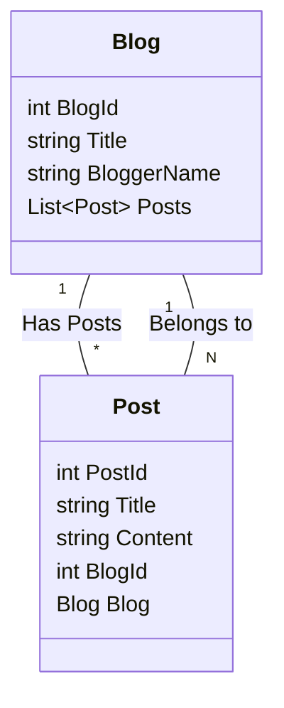

# Entity Framework Core (EF Core) 상세 가이드

### 1\. Entity Framework Core (EF Core) 란 무엇일까요? (What is Entity Framework Core?)

가장 먼저 EF Core가 무엇인지부터 알아봅시다. EF Core는 **ORM (Object-Relational Mapper)** 이라고 불리는 기술입니다.  ORM은 **객체(Object)** 와 **관계형 데이터베이스(Relational Database)** 사이의 **불일치(Impedance Mismatch)** 문제를 해결해 주는 역할을 합니다.

**잠깐\! 불일치 문제 (Impedance Mismatch)가 뭐죠?**

관계형 데이터베이스는 데이터를 **테이블(Table)** 과 **행(Row), 열(Column)** 의 형태로 저장합니다. 반면, 우리가 사용하는 프로그래밍 언어 (C\# 등)는 데이터를 **객체(Object)** 라는 형태로 다룹니다. 객체는 속성(Property)과 메서드(Method)를 가지는 복잡한 구조를 가질 수 있습니다.

이 둘 사이에는 데이터 구조와 조작 방식에 차이가 있어서, 직접 데이터베이스 코드를 작성하면 번거롭고 오류가 발생하기 쉽습니다. 마치 서로 다른 언어를 사용하는 사람과 대화하는 것처럼 어렵다고 생각하면 됩니다.

**EF Core는 바로 이 문제를 해결해 줍니다\!**  EF Core를 사용하면 개발자는 데이터베이스 테이블을 직접 조작하는 SQL 쿼리 대신, 객체를 사용하여 데이터를 다룰 수 있게 됩니다. EF Core가 객체를 데이터베이스 테이블과 자동으로 연결해 주고, 데이터베이스 작업 (저장, 조회, 수정, 삭제) 을 대신 처리해 줍니다. 마치 번역가가 있어서, 다른 언어를 사용하는 사람과 쉽게 대화할 수 있게 되는 것과 같습니다.

**핵심 요약:**

  * **ORM (Object-Relational Mapper) 이다:** 객체와 관계형 데이터베이스 사이의 다리 역할
  * **.NET 개발을 위한 ORM:** C\# 과 같은 .NET 언어에서 데이터베이스 작업 간편화
  * **SQL 쿼리 대신 객체 중심 프로그래밍:** 개발 생산성 향상 및 코드 가독성 증가

### 2\. EF Core의 특징 (Characteristics of EF Core)

EF Core는 여러 가지 강력한 특징을 가지고 있습니다. 주요 특징들을 하나씩 살펴볼까요?

#### 2.1. 가볍고 확장 가능 (Lightweight and Extensible)

EF Core는 이전 버전인 Entity Framework (EF6) 보다 훨씬 가볍고 모듈화된 구조를 가집니다. 필요한 기능만 선택적으로 NuGet 패키지를 통해 설치하여 사용할 수 있으며,  개발자의 필요에 따라 기능을 확장하거나 커스터마이징하기 용이합니다.

#### 2.2. 크로스 플랫폼 (Cross-Platform)

가장 큰 특징 중 하나는 **크로스 플랫폼**을 지원한다는 점입니다. 즉, Windows 뿐만 아니라 macOS, Linux 등 다양한 운영체제에서 .NET Core (현재 .NET) 응용 프로그램을 개발하고 실행할 수 있으며, EF Core 역시 이러한 환경을 완벽하게 지원합니다.

#### 2.3. 다양한 데이터베이스 지원 (Supports Multiple Database Providers)

EF Core는 다양한 종류의 데이터베이스 시스템을 지원합니다.  각 데이터베이스 벤더에서 제공하는 **Provider** 를 설치하면, EF Core를 통해 해당 데이터베이스와 연동할 수 있습니다.  주요 지원 데이터베이스는 다음과 같습니다.

  * **SQL Server:** Microsoft SQL Server
  * **SQLite:**  파일 기반의 경량 데이터베이스, 개발 및 테스트 환경에 유용
  * **MySQL:**  오픈 소스 데이터베이스, 웹 개발에 많이 사용
  * **PostgreSQL:** 오픈 소스 데이터베이스, 강력한 기능과 안정성 제공
  * **Oracle:**  기업 환경에서 많이 사용되는 상용 데이터베이스
  * **기타:** Azure Cosmos DB, Firebird, IBM DB2 등 다양한 데이터베이스 지원

#### 2.4. 다양한 개발 방식 지원 (Supports Different Development Approaches)

EF Core는 데이터베이스와 객체 모델을 설계하는 다양한 방식을 지원합니다. 개발 방식에 따라 **Code First**, **Database First**, **Model First**  세 가지 접근 방식을 제공합니다.

**[Table of 개발 방식 비교]**

| 개발 방식         | 설명                                                                                                                                 | 장점                                                                                                                                                                | 단점                                                                                                                                                                |
| :---------------- | :----------------------------------------------------------------------------------------------------------------------------------- | :------------------------------------------------------------------------------------------------------------------------------------------------------------------ | :------------------------------------------------------------------------------------------------------------------------------------------------------------------ |
| **Code First**     | 코드로 객체 모델 (Entity 클래스) 를 먼저 정의하고, EF Core가 이를 기반으로 데이터베이스 스키마를 생성합니다.                                                                                              | 객체 모델 중심으로 개발 가능, 코드 변경에 따른 데이터베이스 스키마 변경 용이 (Migrations 사용),  데이터베이스 스키마를 코드와 함께 버전 관리 가능, 깔끔하고 직관적인 개발 방식 | 객체 모델 설계에 대한 이해 필요,  기존 데이터베이스에 적용하기 어려울 수 있음,  데이터베이스 스키마를 세밀하게 제어하기 어려울 수 있음                                                                                               |
| **Database First** | 기존 데이터베이스 스키마를 기반으로 EF Core가 객체 모델 (Entity 클래스, DbContext) 을 자동으로 생성합니다.                                                                                         | 기존 데이터베이스 활용 용이,  데이터베이스 스키마가 이미 정의된 경우 빠르게 개발 시작 가능,  데이터베이스 전문가와 협업 용이                                                                                                   | 데이터베이스 스키마 변경 시 객체 모델을 다시 생성해야 함,  객체 모델을 직접 수정하기 어려움,  데이터베이스 스키마에 종속적인 개발 방식                                                                                                 |
| **Model First**    | 다이어그램 도구를 사용하여 시각적으로 객체 모델을 설계하고, 이를 기반으로 데이터베이스 스키마와 객체 모델 코드를 모두 생성합니다. (EF6에서 지원, EF Core에서는 지원 중단)                                                                          | 시각적인 모델링 도구 활용 가능,  객체 모델과 데이터베이스 스키마를 동시에 설계 가능                                                                                                   | Code First 와 Database First 방식에 비해 유연성 부족,  EF Core에서 더 이상 권장되지 않는 방식                                                                                                  |

*EF Core에서는 **Code First 방식** 을 가장 권장하며, 실무에서도 가장 많이 사용됩니다. Database First 방식은 기존 데이터베이스를 활용해야 하는 경우에 유용합니다.*

#### 2.5. LINQ 지원 (LINQ Support)

EF Core는 **LINQ (Language Integrated Query)** 를 완벽하게 지원합니다. LINQ를 사용하면 SQL 쿼리 대신 C\# 코드로 데이터베이스를 쿼리할 수 있습니다.  LINQ 쿼리는 컴파일 타임에 타입 체크가 가능하여 오류를 줄여주고, 코드 가독성을 높여줍니다.

**예시:**

```csharp
// LINQ 쿼리 (C# 코드)
var blogs = context.Blogs
    .Where(b => b.Rating > 3)
    .OrderByDescending(b => b.CreatedAt)
    .ToList();

// SQL 쿼리 (EF Core가 LINQ 쿼리를 SQL로 변환하여 실행)
SELECT *
FROM Blogs
WHERE Rating > 3
ORDER BY CreatedAt DESC
```

*위 예시처럼 LINQ 쿼리를 작성하면, EF Core가 자동으로 해당 LINQ 쿼리를 데이터베이스에 맞는 SQL 쿼리로 변환하여 실행해 줍니다.*

#### 2.6. 변경 감지 (Change Tracking)

EF Core는 **변경 감지 (Change Tracking)** 기능을 통해 객체의 변경 사항을 자동으로 추적합니다.  데이터베이스에서 조회한 객체를 수정하고 `SaveChanges()` 메서드를 호출하면, EF Core는 변경된 속성만 자동으로 데이터베이스에 업데이트 쿼리를 생성하여 실행합니다.  개발자는 변경 사항을 직접 추적하고 업데이트 쿼리를 작성할 필요가 없습니다.

#### 2.7. 마이그레이션 (Migrations)

**마이그레이션 (Migrations)** 은 데이터베이스 스키마를 코드와 함께 버전 관리할 수 있도록 해주는 강력한 기능입니다.  Code First 방식으로 개발할 때, 객체 모델 (Entity 클래스) 을 수정하면 데이터베이스 스키마도 함께 변경해야 합니다.  마이그레이션을 사용하면 객체 모델 변경 사항을 기반으로 데이터베이스 스키마 변경 스크립트를 자동으로 생성하고, 데이터베이스에 적용할 수 있습니다.  이를 통해 개발, 테스트, 운영 환경에서 데이터베이스 스키마를 일관성 있게 관리할 수 있습니다.

### 3\. EF Core 사용 방법 (How to Use EF Core)

이제 실제로 EF Core를 사용하는 방법을 단계별로 알아봅시다. Code First 방식을 기준으로 설명합니다.

#### 3.1. EF Core 설정 (Setting up EF Core)

1.  **NuGet 패키지 설치:** 프로젝트에 필요한 EF Core NuGet 패키지를 설치합니다.  최소한 다음 패키지들이 필요합니다.

      * `Microsoft.EntityFrameworkCore`: EF Core 기본 패키지
      * `Microsoft.EntityFrameworkCore.SqlServer` (SQL Server 사용 시) 또는 다른 데이터베이스 Provider 패키지 (예: `Microsoft.EntityFrameworkCore.Sqlite`, `Microsoft.EntityFrameworkCore.MySql.Pomelo`)

    **Package Manager Console (PMC) 또는 .NET CLI 사용:**

    ```powershell
    # Package Manager Console (PMC)
    Install-Package Microsoft.EntityFrameworkCore.SqlServer
    Install-Package Microsoft.EntityFrameworkCore.Tools

    # .NET CLI
    dotnet add package Microsoft.EntityFrameworkCore.SqlServer
    dotnet add package Microsoft.EntityFrameworkCore.Tools
    ```

2.  **DbContext 클래스 생성:**  `DbContext` 클래스는 EF Core와 데이터베이스 사이의 **컨텍스트** 역할을 합니다.  데이터베이스 연결 정보, Entity 클래스 정보 등을 관리하고, 데이터베이스 작업을 수행하는 데 사용됩니다.  `DbContext` 클래스를 상속받아 프로젝트에 맞는 컨텍스트 클래스를 생성합니다.

    ```csharp
    using Microsoft.EntityFrameworkCore;

    public class BloggingContext : DbContext
    {
        public BloggingContext(DbContextOptions<BloggingContext> options)
            : base(options)
        { }

        public DbSet<Blog> Blogs { get; set; } // Entity 클래스 등록 (Blogs 테이블과 매핑)
        public DbSet<Post> Posts { get; set; } // Entity 클래스 등록 (Posts 테이블과 매핑)
    }
    ```

3.  **DbContext 구성 (Configure DbContext):**  `DbContext` 를 구성하기 위해 `Startup.cs` (또는 `Program.cs` in .NET 6+) 파일의 `ConfigureServices` 메서드 (또는 `Program.cs`의 builder.Services) 에서 `AddDbContext` 메서드를 사용하여 데이터베이스 연결 문자열과 사용할 데이터베이스 Provider를 설정합니다.

    ```csharp
    // Startup.cs (ConfigureServices 메서드)
    public void ConfigureServices(IServiceCollection services)
    {
        services.AddDbContext<BloggingContext>(options =>
            options.UseSqlServer(Configuration.GetConnectionString("DefaultConnection"))); // SQL Server 사용, 연결 문자열 설정
    }

    // Program.cs (.NET 6+ 이상)
    builder.Services.AddDbContext<BloggingContext>(options =>
        options.UseSqlServer(builder.Configuration.GetConnectionString("DefaultConnection"))); // SQL Server 사용, 연결 문자열 설정
    ```

      * `UseSqlServer()` 대신 다른 데이터베이스 Provider 메서드 (`UseSqlite()`, `UseMySql()`, `UseNpgsql()` 등) 를 사용할 수 있습니다.
      * `Configuration.GetConnectionString("DefaultConnection")` 은 `appsettings.json` 파일 등에 정의된 연결 문자열을 가져오는 코드입니다.

4.  **Entity 클래스 정의 (Define Entity Classes):** 데이터베이스 테이블과 매핑될 **Entity 클래스 (POCO 클래스)** 를 정의합니다.  Entity 클래스는 데이터베이스 테이블의 컬럼에 해당하는 속성 (Property) 들을 가집니다.

    ```csharp
    public class Blog
    {
        public int BlogId { get; set; } // Primary Key, 테이블의 BlogId 컬럼과 매핑
        public string Url { get; set; }   // 테이블의 Url 컬럼과 매핑
        public int Rating { get; set; } // 테이블의 Rating 컬럼과 매핑

        public List<Post> Posts { get; set; } // Navigation Property, Blog - Post 관계 설정
    }

    public class Post
    {
        public int PostId { get; set; }   // Primary Key, 테이블의 PostId 컬럼과 매핑
        public string Title { get; set; }  // 테이블의 Title 컬럼과 매핑
        public string Content { get; set; } // 테이블의 Content 컬럼과 매핑

        public int BlogId { get; set; }    // Foreign Key, 테이블의 BlogId 컬럼과 매핑, Blog 테이블과의 관계 설정
        public Blog Blog { get; set; }     // Navigation Property, Post - Blog 관계 설정
    }
    ```

      * Entity 클래스는 Plain Old CLR Object (POCO) 클래스라고도 불립니다.  특별한 인터페이스를 구현하거나 특정 클래스를 상속받을 필요 없이, 일반적인 C\# 클래스로 정의할 수 있습니다.
      * **Primary Key:** Entity 클래스의 속성 중 하나를 Primary Key로 지정해야 합니다.  일반적으로 `Id` 또는 `ClassNameId` 와 같은 이름의 속성을 Primary Key로 사용하는 규칙이 있습니다.
      * **Navigation Property:** Entity 클래스 간의 관계를 설정하기 위해 사용되는 속성입니다.  위 예시에서 `Blog` 클래스의 `Posts` 속성과 `Post` 클래스의 `Blog` 속성은 Navigation Property입니다.

5.  **Entity 관계 설정 (Configure Entity Relationships):** Entity 클래스 간의 관계 (One-to-One, One-to-Many, Many-to-Many) 를 설정합니다.  Code First 방식에서는 주로 **Convention (규칙)** 과 **Fluent API** 를 사용하여 관계를 설정합니다.

      * **Convention:**  EF Core는 미리 정의된 규칙에 따라 Entity 클래스 간의 관계를 자동으로 설정합니다.  예를 들어, `Post` 클래스에 `BlogId` 속성과 `Blog` Navigation Property가 있으면, EF Core는 자동으로 Post 와 Blog 사이에 One-to-Many 관계를 설정합니다.
      * **Fluent API:** Convention으로 설정할 수 없는 복잡한 관계나 세밀한 설정을 해야 할 경우, Fluent API를 사용합니다.  `DbContext` 클래스의 `OnModelCreating` 메서드를 오버라이드하여 Fluent API를 설정할 수 있습니다.

    <!-- end list -->

    ```csharp
    public class BloggingContext : DbContext
    {
        public BloggingContext(DbContextOptions<BloggingContext> options)
            : base(options)
        { }

        public DbSet<Blog> Blogs { get; set; }
        public DbSet<Post> Posts { get; set; }

        protected override void OnModelCreating(ModelBuilder modelBuilder)
        {
            // Fluent API 설정 예시: Blog - Post 관계 설정 (One-to-Many, Post.BlogId 를 Foreign Key로 사용)
            modelBuilder.Entity<Post>()
                .HasOne(p => p.Blog) // Post는 하나의 Blog를 가진다 (One-to-One 또는 One-to-Many 관계의 'One' 쪽)
                .WithMany(b => b.Posts) // Blog는 여러 개의 Post를 가질 수 있다 (One-to-Many 또는 Many-to-Many 관계의 'Many' 쪽)
                .HasForeignKey(p => p.BlogId); // Post 의 BlogId 속성을 Foreign Key 로 사용
        }
    }
    ```

#### 3.2. CRUD 연산 수행 (Performing CRUD Operations)

EF Core를 사용하여 데이터베이스에 데이터를 저장, 조회, 수정, 삭제하는 CRUD (Create, Read, Update, Delete) 연산을 수행하는 방법을 알아봅시다.

1.  **Create (생성):**  새로운 Entity 객체를 생성하고, `DbContext` 를 통해 데이터베이스에 저장합니다.

    ```csharp
    using (var context = new BloggingContext(options)) // DbContext 인스턴스 생성 (using 블록 안에서 생성하여 Dispose 되도록 함)
    {
        var blog = new Blog { Url = "http://example.com/new-blog", Rating = 5 }; // 새로운 Blog Entity 객체 생성

        context.Blogs.Add(blog); // DbContext 의 Blogs DbSet 에 Entity 객체 추가 (Entity State: Added)
        context.SaveChanges();    // 변경 사항을 데이터베이스에 저장 (INSERT 쿼리 실행)

        Console.WriteLine($"Blog added with ID: {blog.BlogId}"); // 데이터베이스에서 자동 생성된 Primary Key 값 확인
    }
    ```

      * `context.Blogs.Add(blog)`:  새로운 `Blog` Entity 객체를 `DbContext` 의 `Blogs` DbSet 에 추가합니다.  이때 Entity 객체의 상태는 **Added** 로 변경됩니다.
      * `context.SaveChanges()`:  `DbContext` 에 추적되고 있는 모든 Entity 객체의 변경 사항을 데이터베이스에 저장합니다.  Added 상태의 Entity 객체는 INSERT 쿼리를 통해 데이터베이스에 새로운 행으로 추가됩니다.

2.  **Read (조회):** LINQ 쿼리 또는 `Find()` 메서드를 사용하여 데이터베이스에서 데이터를 조회합니다.

    ```csharp
    using (var context = new BloggingContext(options))
    {
        // 1. Find() 메서드 사용 (Primary Key 값으로 조회)
        var blog1 = context.Blogs.Find(1); // BlogId 가 1 인 Blog 조회
        if (blog1 != null)
        {
            Console.WriteLine($"Blog URL (Find): {blog1.Url}");
        }

        // 2. LINQ 쿼리 사용 (다양한 조건으로 조회 가능)
        var blog2 = context.Blogs
            .Where(b => b.Rating > 4)     // Rating 이 4 보다 큰 Blog 만 필터링
            .OrderByDescending(b => b.Rating) // Rating 내림차순으로 정렬
            .FirstOrDefault();           // 첫 번째 결과만 가져옴 (없으면 null)
        if (blog2 != null)
        {
            Console.WriteLine($"Blog URL (LINQ): {blog2.Url}, Rating: {blog2.Rating}");
        }

        // 3. ToList() 를 사용하여 모든 결과 가져오기
        var allBlogs = context.Blogs.ToList(); // 모든 Blog 조회
        Console.WriteLine($"Total Blogs: {allBlogs.Count}");
    }
    ```

      * `context.Blogs.Find(1)`:  Primary Key 값 (여기서는 `BlogId` 가 1) 으로 Entity 객체를 조회합니다.  Find() 메서드는 Primary Key 값으로만 조회할 수 있으며, 조회 결과가 없으면 `null` 을 반환합니다.
      * `context.Blogs.Where(...).OrderByDescending(...).FirstOrDefault()`: LINQ 쿼리를 사용하여 다양한 조건으로 데이터를 조회할 수 있습니다.  `Where()`, `OrderBy()`, `FirstOrDefault()`, `ToList()` 등 다양한 LINQ 연산자를 사용하여 원하는 데이터를 필터링, 정렬, 프로젝션 할 수 있습니다.

3.  **Update (수정):** 데이터베이스에서 조회한 Entity 객체의 속성을 변경하고, `SaveChanges()` 메서드를 호출하여 변경 사항을 데이터베이스에 반영합니다.

    ```csharp
    using (var context = new BloggingContext(options))
    {
        var blog = context.Blogs.Find(1); // 수정할 Blog 조회
        if (blog != null)
        {
            blog.Url = "http://example.com/updated-blog"; // Blog 객체의 Url 속성 변경 (Entity State: Modified)
            context.SaveChanges();                         // 변경 사항을 데이터베이스에 저장 (UPDATE 쿼리 실행)
            Console.WriteLine($"Blog URL updated to: {blog.Url}");
        }
    }
    ```

      * EF Core는 **변경 감지 (Change Tracking)** 기능을 통해 Entity 객체의 변경 사항을 자동으로 추적합니다.  데이터베이스에서 조회한 Entity 객체의 속성을 변경하면, EF Core는 해당 Entity 객체의 상태를 **Modified** 로 변경합니다.
      * `context.SaveChanges()`:  Modified 상태의 Entity 객체는 UPDATE 쿼리를 통해 데이터베이스에 변경 사항이 반영됩니다.

4.  **Delete (삭제):**  삭제할 Entity 객체를 조회하고, `DbContext` 를 통해 데이터베이스에서 삭제합니다.

    ```csharp
    using (var context = new BloggingContext(options))
    {
        var blog = context.Blogs.Find(1); // 삭제할 Blog 조회
        if (blog != null)
        {
            context.Blogs.Remove(blog); // DbContext 의 Blogs DbSet 에서 Entity 객체 제거 (Entity State: Deleted)
            context.SaveChanges();        // 변경 사항을 데이터베이스에 저장 (DELETE 쿼리 실행)
            Console.WriteLine($"Blog deleted with ID: {blog.BlogId}");
        }
    }
    ```

      * `context.Blogs.Remove(blog)`:  삭제할 `Blog` Entity 객체를 `DbContext` 의 `Blogs` DbSet 에서 제거합니다. 이때 Entity 객체의 상태는 **Deleted** 로 변경됩니다.
      * `context.SaveChanges()`:  Deleted 상태의 Entity 객체는 DELETE 쿼리를 통해 데이터베이스에서 해당 행이 삭제됩니다.

#### 3.3. 마이그레이션 사용 (Using Migrations)

마이그레이션을 사용하여 데이터베이스 스키마를 관리하는 방법을 알아봅시다.

1.  **마이그레이션 추가 (Add Migration):**  Entity 클래스 (객체 모델) 를 변경한 후, `Add-Migration` 명령어를 사용하여 마이그레이션 파일을 생성합니다.

    **Package Manager Console (PMC) 또는 .NET CLI 사용:**

    ```powershell
    # Package Manager Console (PMC)
    Add-Migration InitialCreate // 마이그레이션 이름 지정 (예: InitialCreate, AddRatingColumn 등)

    # .NET CLI
    dotnet ef migrations add InitialCreate
    ```

      * `Add-Migration` 명령어는 현재 객체 모델과 데이터베이스 스키마를 비교하여 변경 사항을 감지하고, 데이터베이스 스키마를 업데이트하는 마이그레이션 파일을 생성합니다.  마이그레이션 파일은 `Migrations` 폴더 아래에 생성됩니다.

2.  **데이터베이스 업데이트 (Update Database):**  `Update-Database` 명령어를 사용하여 마이그레이션 파일을 데이터베이스에 적용합니다.

    **Package Manager Console (PMC) 또는 .NET CLI 사용:**

    ```powershell
    # Package Manager Console (PMC)
    Update-Database

    # .NET CLI
    dotnet ef database update
    ```

      * `Update-Database` 명령어는 `Migrations` 폴더 아래의 마이그레이션 파일을 순서대로 데이터베이스에 적용하여 데이터베이스 스키마를 업데이트합니다.

**마이그레이션 명령어 요약:**

  * `Add-Migration <MigrationName>`:  새로운 마이그레이션 파일 생성
  * `Update-Database`:  마이그레이션 파일을 데이터베이스에 적용
  * `Remove-Migration`:  가장 최근에 생성된 마이그레이션 파일 삭제 (되돌리기)
  * `Script-Migration`:  마이그레이션 스크립트 (SQL) 생성 (데이터베이스 관리자가 직접 스크립트 실행 가능)
  * `Get-DbContextInfo`:  DbContext 정보 확인

### 4\. 참고 웹사이트 (References)

EF Core를 더 자세히 배우고 싶다면 다음 웹사이트들을 참고해 보세요.

  * **Microsoft 공식 Entity Framework Core 문서:** [https://docs.microsoft.com/ko-kr/ef/core/](https://learn.microsoft.com/ko-kr/ef/core/)  (가장 정확하고 최신 정보 제공)
  * **EF Core 자습서 - Microsoft Learn:** [https://learn.microsoft.com/ko-kr/ef/core/get-started/overview/first-app?tabs=net-core-cli](https://www.google.com/search?q=https://learn.microsoft.com/ko-kr/ef/core/get-started/overview/first-app%3Ftabs%3Dnet-core-cli) (단계별 자습서, 초보자에게 유용)
  * **Entity Framework Core in Action (책):** [https://www.manning.com/books/entity-framework-core-in-action-second-edition](https://www.google.com/url?sa=E&source=gmail&q=https://www.manning.com/books/entity-framework-core-in-action-second-edition) (EF Core 전문가가 쓴 깊이 있는 내용, 중급 이상 개발자에게 추천)
  * **Stack Overflow (ef-core 태그):** [https://stackoverflow.com/questions/tagged/ef-core](https://www.google.com/url?sa=E&source=gmail&q=https://stackoverflow.com/questions/tagged/ef-core) (EF Core 관련 질문/답변, 문제 해결에 도움)

---
# .NET CLI 상세 가이드

### 1\. .NET CLI 란 무엇일까요? (What is .NET CLI?)
.NET CLI (Command-Line Interface)는 윈도우, macOS, Linux 등 다양한 운영체제에서 .NET 개발을 위한 핵심적인 도구입니다.  텍스트 기반의 명령어를 사용하여 .NET 프로젝트를 생성, 빌드, 실행, 테스트, 패키징하고 관리하는 데 사용됩니다.

**잠깐\! CLI (Command-Line Interface) 가 뭐죠?**

CLI는 텍스트 명령어를 입력하여 컴퓨터를 제어하는 방식입니다.  마우스 클릭이나 GUI (Graphical User Interface) 대신, 키보드로 명령어를 입력하여 작업을 수행합니다.  과거에는 컴퓨터와 소통하는 주요 방식이었으며, 개발 환경에서는 여전히 강력하고 효율적인 도구로 사용됩니다.

**.NET CLI는 .NET 개발의 '만능 도구' 입니다\!**  .NET CLI를 사용하면 다음과 같은 다양한 작업을 할 수 있습니다.

  * **프로젝트 생성:**  새로운 .NET 프로젝트 (콘솔 앱, 웹 API, 웹 앱, 클래스 라이브러리 등) 를 템플릿 기반으로 빠르게 생성
  * **코드 빌드:**  작성한 C\# 코드를 실행 가능한 형태로 컴파일 (빌드)
  * **프로그램 실행:**  빌드된 프로그램을 실행
  * **테스트 실행:**  작성한 테스트 코드를 실행하여 코드의 품질 검증
  * **NuGet 패키지 관리:**  프로젝트에 필요한 외부 라이브러리 (NuGet 패키지) 를 추가, 제거, 업데이트
  * **게시 (Publish):**  개발 완료된 애플리케이션을 배포 가능한 형태로 패키징

**핵심 요약:**

  * **.NET 개발을 위한 명령줄 인터페이스 (CLI) 이다:** 텍스트 기반 명령어로 .NET 개발 작업 수행
  * **크로스 플랫폼 지원:** Windows, macOS, Linux 등 다양한 운영체제에서 사용 가능
  * **.NET 개발의 핵심 워크플로우 지원:** 프로젝트 생성, 빌드, 실행, 테스트, 패키징, 배포 등

### 2\. .NET CLI의 특징 (Characteristics of .NET CLI)

.NET CLI는 강력하고 편리한 개발 경험을 제공하는 다양한 특징을 가지고 있습니다. 주요 특징들을 하나씩 살펴볼까요?

#### 2.1. 크로스 플랫폼 (Cross-Platform)

가장 중요한 특징 중 하나는 **크로스 플랫폼**을 완벽하게 지원한다는 점입니다.  .NET CLI는 Windows, macOS, Linux 등 다양한 운영체제에서 동일하게 작동합니다.  즉, 운영체제에 종속되지 않고, 개발 환경을 자유롭게 선택할 수 있습니다.

#### 2.2. 명령 기반 작업 (Command-Based Operations)

.NET CLI는 텍스트 명령어 기반으로 작동합니다.  명령어를 통해 프로젝트를 생성하고 관리하며, 빌드, 실행, 테스트 등 모든 개발 작업을 명령어로 수행할 수 있습니다.  명령어 기반 작업은 자동화, 스크립팅에 용이하며, 반복적인 작업을 효율적으로 처리할 수 있도록 해줍니다.

#### 2.3. 템플릿 기반 프로젝트 생성 (Template-Based Project Creation)

.NET CLI는 다양한 프로젝트 템플릿을 제공합니다.  `dotnet new` 명령어를 사용하면 콘솔 앱, 웹 API, 웹 앱, 클래스 라이브러리 등 다양한 유형의 프로젝트를 템플릿 기반으로 빠르게 생성할 수 있습니다.  템플릿은 프로젝트의 기본적인 구조와 필요한 파일들을 자동으로 구성해 줍니다.

#### 2.4. NuGet 패키지 관리 (NuGet Package Management)

.NET CLI는 NuGet 패키지 관리를 위한 기능을 내장하고 있습니다.  `dotnet add package`, `dotnet remove package`, `dotnet list package` 등의 명령어를 사용하여 프로젝트에 필요한 NuGet 패키지를 쉽게 추가, 제거, 관리할 수 있습니다.  NuGet 패키지는 .NET 개발 생태계의 핵심이며, .NET CLI를 통해 풍부한 라이브러리들을 편리하게 활용할 수 있습니다.

#### 2.5. 빌드 및 실행 (Build and Run)

.NET CLI는 소스 코드를 빌드하고 실행하는 기능을 제공합니다.  `dotnet build` 명령어를 사용하여 소스 코드를 컴파일하고 실행 가능한 형태로 만들 수 있으며, `dotnet run` 명령어를 사용하여 빌드된 프로그램을 바로 실행할 수 있습니다.  빌드 및 실행 과정은 .NET 개발의 핵심이며, .NET CLI를 통해 간단하게 수행할 수 있습니다.

#### 2.6. 테스트 실행 (Test Execution)

.NET CLI는 테스트 프레임워크와 통합되어 테스트 코드를 실행하는 기능을 제공합니다.  `dotnet test` 명령어를 사용하면 프로젝트 내의 테스트 프로젝트를 찾아서 자동으로 테스트를 실행하고 결과를 보여줍니다.  테스트 주도 개발 (TDD) 또는 단위 테스트를 중요하게 생각하는 개발 방식에서 .NET CLI의 테스트 실행 기능은 매우 유용합니다.

#### 2.7. 게시 (Publish)

.NET CLI는 개발 완료된 애플리케이션을 배포 가능한 형태로 패키징하는 게시 기능을 제공합니다.  `dotnet publish` 명령어를 사용하면 애플리케이션을 특정 플랫폼 (Windows, Linux, macOS) 또는 배포 환경 (Docker, Azure 등) 에 맞게 패키징할 수 있습니다.  게시 기능은 애플리케이션 배포 과정을 간소화하고 자동화하는 데 도움을 줍니다.

#### 2.8. 확장성 (Extensibility)

.NET CLI는 확장 가능한 구조를 가지고 있습니다.  필요한 기능을 확장하거나 커스터마이징하기 위해 도구를 추가하거나 기능을 확장할 수 있습니다.  .NET SDK 및 도구를 업데이트하여 최신 기능과 개선 사항을 쉽게 적용할 수 있습니다.

### 3\. .NET CLI 사용 방법 (How to Use .NET CLI)

이제 실제로 .NET CLI를 사용하는 방법을 단계별로 알아봅시다. 기본적인 명령어와 함께 예시를 들어 설명합니다.

#### 3.1. .NET CLI 설치 확인 (Verify .NET CLI Installation)

먼저 .NET CLI가 제대로 설치되었는지 확인해 보겠습니다. 터미널 (명령 프롬프트, PowerShell, 터미널 앱 등) 을 열고 다음 명령어를 입력해 보세요.

```bash
dotnet --version
```

정상적으로 설치되었다면, .NET SDK 버전 정보가 출력될 것입니다.  만약 `dotnet` 명령어를 찾을 수 없다는 오류 메시지가 나타난다면, .NET SDK를 설치해야 합니다.  .NET 다운로드 페이지 ([https://dotnet.microsoft.com/download](https://www.google.com/url?sa=E&source=gmail&q=https://dotnet.microsoft.com/download)) 에서 운영체제에 맞는 SDK를 다운로드하여 설치하세요.

#### 3.2. 새로운 프로젝트 생성 (`dotnet new`)

새로운 .NET 프로젝트를 생성하려면 `dotnet new` 명령어를 사용합니다.  `dotnet new <템플릿_이름> -o <프로젝트_이름>` 형식으로 명령어를 입력합니다.

**자주 사용되는 템플릿:**

  * `console`: 콘솔 응용 프로그램
  * `webapi`: 웹 API 응용 프로그램
  * `webapp`: 웹 응용 프로그램 (Razor Pages)
  * `mvc`: 웹 응용 프로그램 (MVC)
  * `classlib`: 클래스 라이브러리

**예시:**

1.  **콘솔 앱 프로젝트 생성:** `MyConsoleApp` 이라는 이름의 콘솔 앱 프로젝트를 생성합니다.

    ```bash
    dotnet new console -o MyConsoleApp
    cd MyConsoleApp  # 프로젝트 폴더로 이동
    ```

      * `dotnet new console`: 콘솔 앱 템플릿을 사용하여 프로젝트 생성
      * `-o MyConsoleApp`:  `MyConsoleApp` 이라는 이름의 폴더에 프로젝트 생성

    생성된 `MyConsoleApp` 폴더에는 기본적인 콘솔 앱 프로젝트 구조와 파일 (`Program.cs`, `.csproj` 등) 이 자동으로 구성됩니다.

2.  **웹 API 프로젝트 생성:** `MyWebApi` 이라는 이름의 웹 API 프로젝트를 생성합니다.

    ```bash
    dotnet new webapi -o MyWebApi
    cd MyWebApi   # 프로젝트 폴더로 이동
    ```

      * `dotnet new webapi`: 웹 API 템플릿을 사용하여 프로젝트 생성
      * `-o MyWebApi`: `MyWebApi` 이라는 이름의 폴더에 프로젝트 생성

    `MyWebApi` 폴더에는 웹 API 프로젝트에 필요한 컨트롤러, 모델, 설정 파일 등이 템플릿에 따라 구성됩니다.

#### 3.3. 프로젝트 빌드 (`dotnet build`)

프로젝트를 빌드하려면 프로젝트 폴더로 이동한 후 `dotnet build` 명령어를 실행합니다.

```bash
cd MyConsoleApp  # 프로젝트 폴더로 이동 (예시)
dotnet build
```

`dotnet build` 명령어는 프로젝트 파일 (`.csproj`) 을 분석하고, 소스 코드를 컴파일하여 실행 가능한 바이너리 파일 (`.dll` 또는 `.exe`) 을 생성합니다. 빌드 결과는 프로젝트 폴더 아래의 `bin` 폴더에 저장됩니다.

#### 3.4. 프로그램 실행 (`dotnet run`)

빌드된 프로그램을 실행하려면 프로젝트 폴더에서 `dotnet run` 명령어를 실행합니다.

```bash
cd MyConsoleApp  # 프로젝트 폴더로 이동 (예시)
dotnet run
```

`dotnet run` 명령어는 프로젝트를 빌드하고, 빌드된 결과물을 바로 실행합니다.  콘솔 앱의 경우 콘솔 창에 프로그램 실행 결과가 출력됩니다. 웹 API 또는 웹 앱의 경우, 웹 서버가 실행되고 브라우저를 통해 애플리케이션에 접근할 수 있습니다.

#### 3.5. NuGet 패키지 관리

1.  **NuGet 패키지 추가 (`dotnet add package`)**

    프로젝트에 NuGet 패키지를 추가하려면 `dotnet add package <패키지_이름>` 명령어를 사용합니다.

    **예시:**  `Newtonsoft.Json` 패키지를 현재 프로젝트에 추가합니다.

    ```bash
    dotnet add package Newtonsoft.Json
    ```

      * `dotnet add package Newtonsoft.Json`:  `Newtonsoft.Json` NuGet 패키지를 프로젝트에 추가

2.  **NuGet 패키지 제거 (`dotnet remove package`)**

    프로젝트에서 NuGet 패키지를 제거하려면 `dotnet remove package <패키지_이름>` 명령어를 사용합니다.

    **예시:** `Newtonsoft.Json` 패키지를 현재 프로젝트에서 제거합니다.

    ```bash
    dotnet remove package Newtonsoft.Json
    ```

      * `dotnet remove package Newtonsoft.Json`:  `Newtonsoft.Json` NuGet 패키지를 프로젝트에서 제거

3.  **NuGet 패키지 목록 확인 (`dotnet list package`)**

    프로젝트에 추가된 NuGet 패키지 목록을 확인하려면 `dotnet list package` 명령어를 사용합니다.

    ```bash
    dotnet list package
    ```

      * `dotnet list package`:  프로젝트에 추가된 NuGet 패키지 목록을 출력

#### 3.6. 테스트 실행 (`dotnet test`)

프로젝트 내의 테스트 프로젝트를 실행하려면 프로젝트 루트 폴더 또는 테스트 프로젝트 폴더에서 `dotnet test` 명령어를 실행합니다.

```bash
dotnet test
```

`dotnet test` 명령어는 프로젝트를 빌드하고, 테스트 프로젝트를 찾아서 자동으로 테스트를 실행합니다.  테스트 결과 (성공, 실패, 건너뜀) 와 함께 테스트 커버리지 정보를 콘솔에 출력합니다.

#### 3.7. 게시 (`dotnet publish`)

애플리케이션을 게시하려면 프로젝트 폴더에서 `dotnet publish` 명령어를 실행합니다.

```bash
dotnet publish -c Release -r win-x64  # Windows 64비트 릴리즈 버전으로 게시 (예시)
```

  * `dotnet publish`: 게시 명령어
  * `-c Release`: 릴리즈 빌드 구성으로 게시 (최적화, 디버깅 정보 제거)
  * `-r win-x64`:  Windows 64비트 플랫폼으로 게시 (Self-Contained Deployment, SCD 방식)

`dotnet publish` 명령어는 프로젝트를 빌드하고, 지정된 구성 및 런타임에 맞게 애플리케이션을 게시 폴더 (`bin\Release\net8.0\win-x64\publish` 와 유사한 경로) 에 생성합니다. 게시된 폴더에는 실행에 필요한 모든 파일 (실행 파일, DLL, 설정 파일, 런타임 라이브러리 등) 이 포함되어 있습니다.

#### 3.8. 유용한 .NET CLI 명령어 요약

**[Table of 자주 사용하는 .NET CLI 명령어]**

| 명령어               | 설명                                                                                                                               | 예시                                                                 |
| :--------------------- | :--------------------------------------------------------------------------------------------------------------------------------- | :------------------------------------------------------------------- |
| `dotnet --version`      | 설치된 .NET SDK 버전 확인                                                                                                          | `dotnet --version`                                                    |
| `dotnet new <템플릿> -o <이름>` | 새 프로젝트 생성 (템플릿: console, webapi, webapp, classlib 등)                                                                                 | `dotnet new console -o MyConsoleApp`                                 |
| `dotnet build`         | 프로젝트 빌드                                                                                                                        | `dotnet build`                                                       |
| `dotnet run`           | 프로그램 실행                                                                                                                        | `dotnet run`                                                         |
| `dotnet add package <패키지>` | NuGet 패키지 추가                                                                                                               | `dotnet add package Newtonsoft.Json`                                 |
| `dotnet remove package <패키지>`| NuGet 패키지 제거                                                                                                               | `dotnet remove package Newtonsoft.Json`                                 |
| `dotnet list package`    | NuGet 패키지 목록 확인                                                                                                               | `dotnet list package`                                                |
| `dotnet test`          | 테스트 실행                                                                                                                          | `dotnet test`                                                        |
| `dotnet publish`       | 애플리케이션 게시                                                                                                                    | `dotnet publish -c Release -r win-x64`                              |
| `dotnet help <명령어>`    | 특정 명령어 도움말 보기                                                                                                            | `dotnet help new`                                                     |

*위 표는 .NET CLI에서 자주 사용되는 명령어들을 요약한 것입니다. 더 자세한 내용은 `dotnet help` 명령어를 통해 확인할 수 있습니다.*

---
# Code First vs Database First 개발 방식 상세 가이드 
### 1\. Code First 와 Database First 란 무엇일까요? (What are Code First and Database First?)

.NET 개발에서 데이터베이스와 연동하는 방식은 크게 **Code First** 와 **Database First** 두 가지로 나눌 수 있습니다. 이 두 방식은 데이터베이스와 애플리케이션의 객체 모델을 연결하는 EF Core를 사용할 때, 개발 시작점을 어디에 두느냐에 따라 구분됩니다.

#### 1.1. Code First 방식 (Code First Approach)

**Code First 방식** 은 말 그대로 **코드를 먼저 작성하는 방식** 입니다.  개발자가 C\# 코드로 **Entity 클래스 (데이터베이스 테이블과 매핑될 클래스)** 와 `DbContext` 클래스 (데이터베이스 컨텍스트) 를 먼저 정의합니다.  EF Core는 이 코드를 기반으로 **데이터베이스 스키마를 자동으로 생성** 하고, 객체 모델과 데이터베이스를 매핑합니다.

**핵심:**

  * **개발 시작점:** C\# 코드 (Entity 클래스, DbContext)
  * **데이터베이스 생성:** EF Core가 코드 기반으로 데이터베이스 스키마 자동 생성
  * **객체 모델 중심 개발:** 객체 모델 설계를 우선시하고, 데이터베이스는 객체 모델에 맞춰 생성

#### 1.2. Database First 방식 (Database First Approach)

**Database First 방식** 은 **기존 데이터베이스가 이미 존재하는 경우** 에 유용한 방식입니다.  개발자는 **기존 데이터베이스 스키마를 먼저 설계** 하거나, 이미 존재하는 데이터베이스를 활용합니다.  EF Core는 이 데이터베이스 스키마를 분석하여 **Entity 클래스, DbContext 클래스 등 코드를 자동으로 생성** 해 줍니다.

**핵심:**

  * **개발 시작점:** 기존 데이터베이스 스키마
  * **코드 생성:** EF Core가 데이터베이스 스키마 기반으로 코드 자동 생성 (Entity 클래스, DbContext)
  * **데이터베이스 중심 개발:** 데이터베이스 스키마를 우선시하고, 코드는 데이터베이스 스키마에 맞춰 생성

### 2\. Code First vs Database First 특징 비교 (Characteristics Comparison)

Code First 와 Database First 방식은 각각 장단점을 가지고 있으며, 프로젝트의 특성과 개발 상황에 따라 적합한 방식이 다릅니다. 주요 특징들을 비교해 보겠습니다.

**[Table of Code First vs Database First 특징 비교]**

| 특징                 | Code First                                                                                                                               | Database First                                                                                                                               |
| :--------------------- | :------------------------------------------------------------------------------------------------------------------------------------- | :------------------------------------------------------------------------------------------------------------------------------------- |
| **개발 시작점**        | C\# 코드 (Entity 클래스, DbContext)                                                                                                      | 기존 데이터베이스 스키마                                                                                                                      |
| **데이터베이스 스키마 생성** | EF Core 자동 생성 (Migrations 사용)                                                                                                  | 기존 데이터베이스 활용, 스키마 직접 설계 또는 DBA 협업                                                                                                 |
| **코드 생성**          | 개발자가 직접 Entity 클래스, DbContext 코드 작성                                                                                             | EF Core가 데이터베이스 스키마 기반으로 Entity 클래스, DbContext 코드 자동 생성 (Scaffolding)                                                                    |
| **객체 모델 vs 데이터베이스 스키마** | 객체 모델 중심 설계, 데이터베이스 스키마는 객체 모델에 맞춰 생성                                                                                              | 데이터베이스 스키마 중심 설계, 코드는 데이터베이스 스키마에 맞춰 생성                                                                                               |
| **유연성**             | 높음: 객체 모델 변경에 따른 데이터베이스 스키마 변경 용이 (Migrations), 코드 변경에 유연하게 대응 가능                                                                                            | 낮음: 데이터베이스 스키마 변경 시 코드 다시 생성 필요, 코드 수정이 제한적일 수 있음                                                                                              |
| **데이터베이스 제어**     | 보통: EF Core가 대부분의 데이터베이스 스키마 관리, 세밀한 제어는 Fluent API 활용                                                                                              | 높음: 데이터베이스 스키마를 직접 설계하고 완벽하게 제어 가능,  데이터베이스 전문가에게 유리                                                                                               |
| **학습 곡선**          | 비교적 낮음: C\# 코드 작성에 익숙한 개발자에게 친숙, 객체 모델 중심 개발 방식 이해 용이                                                                                                | 비교적 높음: 기존 데이터베이스 스키마에 대한 이해 필요,  데이터베이스 스키마와 코드 생성 과정 이해 필요                                                                                                |
| **개발 속도 (초기)**     | 비교적 느림: Entity 클래스, DbContext 코드 직접 작성 필요, 초기 데이터베이스 스키마 설계 시간 소요                                                                                             | 비교적 빠름: 기존 데이터베이스 활용 또는 스키마 설계 완료된 경우 빠르게 개발 시작 가능,  코드 자동 생성으로 개발 시간 단축                                                                                              |
| **개발 속도 (유지보수)** | 빠름: 객체 모델 변경 및 코드 수정 용이,  Migrations 를 통한 데이터베이스 스키마 변경 관리 효율적                                                                                                | 느림: 데이터베이스 스키마 변경 시 코드 다시 생성 및 수정 필요,  코드와 데이터베이스 스키마 불일치 문제 발생 가능성 증가                                                                                              |
| **적합한 프로젝트**     | \* 새로운 프로젝트, 객체 모델 중심으로 개발하는 프로젝트,  데이터베이스 스키마를 유연하게 변경해야 하는 프로젝트,  애자일 개발 방식, DDD (Domain-Driven Design) 방식 적용 프로젝트                                                                            | \* 기존 데이터베이스를 활용해야 하는 프로젝트, 데이터베이스 스키마가 이미 확정된 프로젝트, 데이터베이스 중심 개발 방식 선호, DBA 와 협업이 중요한 프로젝트,  대규모 엔터프라이즈 시스템, 레거시 시스템 연동                                                                 |

### 3\. Code First 방식 사용 방법 상세 (How to Use Code First Approach)

Code First 방식으로 .NET 개발을 시작하는 방법을 단계별로 자세하게 알아보겠습니다.

#### 3.1. Entity 클래스 정의 (Define Entity Classes)

가장 먼저 데이터베이스 테이블과 매핑될 **Entity 클래스** 를 C\# 코드로 정의합니다.  Entity 클래스는 테이블의 컬럼에 해당하는 속성 (Property) 들을 가지며, 클래스 이름은 테이블 이름, 속성 이름은 컬럼 이름과 매핑됩니다.

**예시: `Blog` 와 `Post` Entity 클래스 정의**

```csharp
public class Blog
{
    public int BlogId { get; set; } // Primary Key, Blogs 테이블의 BlogId 컬럼과 매핑
    public string Url { get; set; }   // Blogs 테이블의 Url 컬럼과 매핑
    public int Rating { get; set; } // Blogs 테이블의 Rating 컬럼과 매핑

    public List<Post> Posts { get; set; } // Navigation Property, Blog - Post 관계 설정 (One-to-Many)
}

public class Post
{
    public int PostId { get; set; }   // Primary Key, Posts 테이블의 PostId 컬럼과 매핑
    public string Title { get; set; }  // Posts 테이블의 Title 컬럼과 매핑
    public string Content { get; set; } // Posts 테이블의 Content 컬럼과 매핑

    public int BlogId { get; set; }    // Foreign Key, Posts 테이블의 BlogId 컬럼과 매핑, Blog 테이블과의 관계 설정
    public Blog Blog { get; set; }     // Navigation Property, Post - Blog 관계 설정 (Many-to-One)
}
```

#### 3.2. DbContext 클래스 생성 및 구성 (Create and Configure DbContext Class)

`DbContext` 클래스를 상속받아 프로젝트에 맞는 **데이터베이스 컨텍스트 클래스** 를 생성합니다.  `DbContext` 클래스는 Entity 클래스를 `DbSet<T>` 속성으로 등록하고, 데이터베이스 연결 설정 및 Fluent API 설정을 담당합니다.

**예시: `BloggingContext` 클래스 생성 및 구성**

```csharp
using Microsoft.EntityFrameworkCore;

public class BloggingContext : DbContext
{
    public BloggingContext(DbContextOptions<BloggingContext> options)
        : base(options)
    { }

    public DbSet<Blog> Blogs { get; set; } // Blog Entity 클래스를 Blogs 테이블과 매핑
    public DbSet<Post> Posts { get; set; } // Post Entity 클래스를 Posts 테이블과 매핑

    protected override void OnModelCreating(ModelBuilder modelBuilder)
    {
        // Fluent API 설정: Blog - Post 관계 설정 (One-to-Many)
        modelBuilder.Entity<Post>()
            .HasOne(p => p.Blog)
            .WithMany(b => b.Posts)
            .HasForeignKey(p => p.BlogId);
    }
}
```

`Startup.cs` (또는 `Program.cs` in .NET 6+) 파일에서 `AddDbContext<T>` 메서드를 사용하여 `DbContext` 를 구성하고 데이터베이스 연결 문자열 및 Provider 를 설정합니다.

```csharp
// Startup.cs (ConfigureServices 메서드)
public void ConfigureServices(IServiceCollection services)
{
    services.AddDbContext<BloggingContext>(options =>
        options.UseSqlServer(Configuration.GetConnectionString("DefaultConnection"))); // SQL Server 사용, 연결 문자열 설정
}

// Program.cs (.NET 6+ 이상)
builder.Services.AddDbContext<BloggingContext>(options =>
    options.UseSqlServer(builder.Configuration.GetConnectionString("DefaultConnection"))); // SQL Server 사용, 연결 문자열 설정
```

#### 3.3. 마이그레이션 생성 및 데이터베이스 업데이트 (Create Migrations and Update Database)

**마이그레이션 (Migrations)** 을 사용하여 Entity 클래스 변경 사항을 데이터베이스 스키마에 반영합니다.

1.  **마이그레이션 생성:** `Add-Migration` 명령어를 사용하여 마이그레이션 파일을 생성합니다.

    ```powershell
    # Package Manager Console (PMC)
    Add-Migration InitialCreate

    # .NET CLI
    dotnet ef migrations add InitialCreate
    ```

2.  **데이터베이스 업데이트:** `Update-Database` 명령어를 사용하여 마이그레이션 파일을 데이터베이스에 적용하고 데이터베이스 스키마를 생성하거나 업데이트합니다.

    ```powershell
    # Package Manager Console (PMC)
    Update-Database

    # .NET CLI
    dotnet ef database update
    ```

#### 3.4. CRUD 연산 수행 (Perform CRUD Operations)

EF Core를 사용하여 데이터를 생성, 조회, 수정, 삭제하는 CRUD 연산을 수행합니다. (CRUD 연산 예시는 앞선 EF Core 가이드 참고)

### 4\. Database First 방식 사용 방법 상세 (How to Use Database First Approach)

Database First 방식으로 .NET 개발을 시작하는 방법을 단계별로 자세하게 알아보겠습니다.

#### 4.1. 데이터베이스 스키마 준비 (Prepare Database Schema)

기존 데이터베이스를 사용하거나, 데이터베이스 스키마를 먼저 설계합니다.  Database First 방식은 이미 데이터베이스 스키마가 확정된 경우에 적합합니다.

#### 4.2. Scaffolding 명령어 실행 (Execute Scaffolding Command)

**Scaffolding** 이란, 기존 데이터베이스 스키마를 기반으로 Entity 클래스, DbContext 클래스 등 코드를 자동으로 생성하는 과정입니다.  **`Scaffold-DbContext`** 명령어를 사용하여 Scaffolding 을 수행합니다.

**Package Manager Console (PMC) 또는 .NET CLI 사용:**

```powershell
# Package Manager Console (PMC)
Scaffold-DbContext "Server=(localdb)\mssqllocaldb;Database=Blogging;Trusted_Connection=True;" Microsoft.EntityFrameworkCore.SqlServer -OutputDir Models -ContextDir Context

# .NET CLI
dotnet ef dbcontext scaffold "Server=(localdb)\mssqllocaldb;Database=Blogging;Trusted_Connection=True;" Microsoft.EntityFrameworkCore.SqlServer -o Models -c Context
```

  * **`"Server=(localdb)\mssqllocaldb;Database=Blogging;Trusted_Connection=True;"`**: 데이터베이스 연결 문자열 (사용하는 데이터베이스에 맞게 수정)
  * **`Microsoft.EntityFrameworkCore.SqlServer`**: 데이터베이스 Provider (SQL Server 사용 시)
  * **`-OutputDir Models`**: Entity 클래스 생성 폴더 (Models 폴더)
  * **`-ContextDir Context`**: DbContext 클래스 생성 폴더 (Context 폴더)

`Scaffold-DbContext` 명령어 실행 후, 지정된 폴더 (`Models`, `Context`) 에 Entity 클래스와 DbContext 클래스 코드가 자동으로 생성됩니다.

#### 4.3. 생성된 코드 확인 및 활용 (Verify and Utilize Generated Code)

Scaffolding 으로 생성된 코드를 확인하고, 필요에 따라 수정하거나 확장합니다.  DbContext 와 Entity 클래스를 사용하여 CRUD 연산을 수행합니다.  Database First 방식에서는 데이터베이스 스키마 변경 시 Scaffolding 명령어를 다시 실행하여 코드를 업데이트해야 합니다.

### 5\. 어떤 방식을 선택해야 할까요? (Which Approach Should You Choose?)

Code First 와 Database First 방식 중 어떤 방식을 선택해야 할지는 프로젝트의 특성과 개발 상황에 따라 달라집니다.  일반적으로 다음과 같은 기준으로 선택을 고려할 수 있습니다.

**Code First 방식 선택이 유리한 경우:**

  * **새로운 프로젝트 시작:**  새로운 프로젝트를 시작하고 객체 모델 설계를 우선시하는 경우
  * **객체 모델 중심 개발:**  애플리케이션의 도메인 모델 (객체 모델) 이 데이터베이스 스키마보다 중요한 경우
  * **애자일 개발 방식:**  요구사항 변화에 유연하게 대응하고 데이터베이스 스키마를 자주 변경해야 하는 경우
  * **DDD (Domain-Driven Design) 적용:**  도메인 모델링에 집중하고 코드 중심으로 개발하는 경우
  * **데이터베이스 스키마 자동 관리:**  EF Core Migrations 를 통해 데이터베이스 스키마를 코드로 관리하고 싶을 때

**Database First 방식 선택이 유리한 경우:**

  * **기존 데이터베이스 활용:**  이미 존재하는 데이터베이스를 활용해야 하는 경우 (레거시 시스템 연동, 기존 데이터베이스 기반 시스템 개발)
  * **데이터베이스 중심 개발:**  데이터베이스 스키마가 이미 확정되었거나 데이터베이스 설계가 중요한 경우
  * **DBA 협업 중요:**  데이터베이스 전문가 (DBA) 와 협업하여 데이터베이스 스키마를 설계하고 관리하는 경우
  * **대규모 엔터프라이즈 시스템:**  데이터베이스 성능 및 안정성이 매우 중요하고 데이터베이스를 세밀하게 제어해야 하는 경우

**Tip:** 최근 .NET 개발 트렌드는 **Code First 방식** 을 더 선호하는 경향이 있습니다.  Code First 방식은 객체 모델 중심의 개발, 유연한 데이터베이스 스키마 관리, 개발 생산성 향상 등 다양한 장점을 제공합니다.  새로운 프로젝트를 시작하거나 특별한 제약 조건이 없다면 Code First 방식을 우선적으로 고려해 보는 것을 추천합니다.

### 6\. 참고 웹사이트 (References)

Code First 와 Database First 방식에 대해 더 자세히 배우고 싶다면 다음 웹사이트들을 참고해 보세요.

  * **Microsoft 공식 Entity Framework Core 문서 - Code First:** [https://docs.microsoft.com/ko-kr/ef/core/get-started/code-first](https://learn.microsoft.com/ko-kr/ef/ef6/modeling/code-first/migrations/) (Code First 방식에 대한 공식 문서)
  * **Microsoft 공식 Entity Framework Core 문서 - Database First:** [https://docs.microsoft.com/ko-kr/ef/core/managing-schemas/scaffolding](https://www.google.com/search?q=https://www.google.com/url%3Fsa%3DE%26source%3Dgmail%26q%3Dhttps://docs.microsoft.com/ko-kr/ef/core/managing-schemas/scaffolding) (Database First (Scaffolding) 방식에 대한 공식 문서)

---
# 데이터베이스 마이그레이션과 데이터 시딩 상세 가이드 

### 1\. 데이터베이스 마이그레이션 (Database Migrations) 이란 무엇일까요? (What is Database Migrations?)

**데이터베이스 마이그레이션** 은 애플리케이션의 **데이터베이스 스키마를 변경하고 관리하는 체계적인 방법** 입니다.  애플리케이션 개발 과정에서 Entity 클래스 (데이터 모델) 가 변경되면, 데이터베이스 테이블 구조도 이에 맞춰 변경되어야 합니다. 마이그레이션은 이러한 변경 사항을 추적하고 데이터베이스에 반영하는 과정을 자동화하고 관리하기 쉽게 만들어줍니다.

**잠깐\! 데이터베이스 스키마 변경 관리가 왜 필요하죠?**

애플리케이션은 끊임없이 진화합니다. 새로운 기능이 추가되거나 기존 기능이 변경될 때, 데이터 모델 (Entity 클래스) 도 함께 수정되는 경우가 많습니다.  예를 들어, 블로그 애플리케이션을 개발한다고 가정해 봅시다.

*   **초기 버전:** 블로그 제목(`Title`), 내용(`Content`), 작성일(`CreatedAt`) 만 저장하는 `Post` Entity 클래스를 정의했습니다.
*   **기능 추가:** 블로그 게시글에 '좋아요' 기능을 추가하고 싶어졌습니다. `Post` Entity 클래스에 `LikeCount` 속성을 추가해야 합니다.
*   **데이터베이스 변경:** `Post` Entity 클래스에 `LikeCount` 속성이 추가되었으니, 실제 데이터베이스의 `Posts` 테이블에도 `LikeCount` 컬럼을 추가해야 합니다.

만약 마이그레이션 없이 데이터베이스 스키마를 직접 변경하려고 한다면 다음과 같은 문제점이 발생할 수 있습니다.

*   **수동 작업의 번거로움:** 데이터베이스 스키마 변경 SQL 스크립트를 직접 작성하고 실행해야 합니다. 수동 작업은 실수가 발생하기 쉽고 시간이 오래 걸립니다.
*   **환경별 불일치:** 개발 환경, 테스트 환경, 운영 환경 데이터베이스 스키마를 일관성 있게 관리하기 어렵습니다. 환경별 스키마 불일치로 인해 예상치 못한 오류가 발생할 수 있습니다.
*   **협업의 어려움:** 여러 개발자가 동시에 데이터베이스 스키마를 변경하는 경우, 변경 사항을 추적하고 관리하기 어렵습니다.

**데이터베이스 마이그레이션은 이러한 문제점을 해결해 줍니다\!**  마이그레이션을 사용하면 Entity 클래스 변경 사항을 코드로 기록하고, 이 코드를 사용하여 데이터베이스 스키마를 자동으로 업데이트할 수 있습니다. 마치 데이터베이스 스키마 변경을 위한 **'버전 관리 시스템'** 과 같다고 생각하면 됩니다.

**핵심 요약:**

*   **데이터베이스 스키마 변경 관리:** 애플리케이션 변경에 따른 데이터베이스 스키마 변경을 체계적으로 관리
*   **.NET 개발 필수 기능:** EF Core (Entity Framework Core) 에서 제공하는 강력한 기능
*   **자동화 및 효율성 증대:** 데이터베이스 스키마 변경 작업을 자동화하여 개발 생산성 향상
*   **환경 일관성 유지:** 개발, 테스트, 운영 환경 데이터베이스 스키마를 일관성 있게 관리하여 안정성 확보

### 2\. 데이터베이스 마이그레이션의 특징 (Characteristics of Database Migrations)

데이터베이스 마이그레이션은 다양한 장점과 특징을 가지고 있습니다. 주요 특징들을 자세히 살펴볼까요?

#### 2.1. 코드 기반 스키마 관리 (Code-Based Schema Management)

마이그레이션은 데이터베이스 스키마 변경 사항을 **C\# 코드** 로 표현합니다.  Entity 클래스 변경 사항을 기반으로 마이그레이션 코드를 생성하고, 이 코드를 실행하여 데이터베이스 스키마를 업데이트합니다. 코드 기반으로 스키마를 관리함으로써 다음과 같은 이점을 얻을 수 있습니다.

*   **버전 관리 용이:** 마이그레이션 코드를 Git 과 같은 버전 관리 시스템으로 관리하여 데이터베이스 스키마 변경 이력을 추적하고 롤백할 수 있습니다.
*   **협업 효율성 증대:** 여러 개발자가 동시에 데이터베이스 스키마 변경 작업을 할 때, 코드 리뷰 및 병합을 통해 변경 사항을 효과적으로 관리할 수 있습니다.
*   **자동화된 배포:** 마이그레이션 코드를 배포 파이프라인에 통합하여 데이터베이스 스키마 업데이트를 자동화할 수 있습니다.

#### 2.2. 마이그레이션 파일 (Migration Files)

마이그레이션을 생성하면 **마이그레이션 파일** 이라는 C\# 코드 파일이 생성됩니다.  각 마이그레이션 파일은 데이터베이스 스키마 변경 사항을 **Up()** 메서드와 **Down()** 메서드로 정의합니다.

*   **Up() 메서드:** 데이터베이스 스키마를 **업데이트 (변경 적용)** 하는 코드를 정의합니다. 예를 들어, 테이블 생성, 컬럼 추가, 인덱스 생성 등의 코드를 작성합니다.
*   **Down() 메서드:** 데이터베이스 스키마를 **롤백 (변경 취소)** 하는 코드를 정의합니다. Up() 메서드에서 수행한 변경 사항을 반대로 되돌리는 코드를 작성합니다. 예를 들어, 테이블 삭제, 컬럼 삭제, 인덱스 삭제 등의 코드를 작성합니다.

마이그레이션 파일을 통해 데이터베이스 스키마 변경과 롤백을 코드로 명확하게 정의하고 관리할 수 있습니다.

**[Code Snippet of Migration File Example (C#)]**

```csharp
using Microsoft.EntityFrameworkCore.Migrations;

/// <inheritdoc />
public partial class AddLikeCountToPosts : Migration
{
    /// <inheritdoc />
    protected override void Up(MigrationBuilder migrationBuilder)
    {
        migrationBuilder.AddColumn<int>(
            name: "LikeCount",
            table: "Posts",
            type: "int",
            nullable: false,
            defaultValue: 0); // Posts 테이블에 LikeCount 컬럼 추가 (int, not null, 기본값 0)
    }

    /// <inheritdoc />
    protected override void Down(MigrationBuilder migrationBuilder)
    {
        migrationBuilder.DropColumn(
            name: "LikeCount",
            table: "Posts"); // Posts 테이블에서 LikeCount 컬럼 삭제 (Up() 메서드 반대 작업)
    }
}
```

*위 코드는 "AddLikeCountToPosts" 라는 이름의 마이그레이션 파일 예시입니다. `Up()` 메서드는 `Posts` 테이블에 `LikeCount` 컬럼을 추가하고, `Down()` 메서드는 `LikeCount` 컬럼을 삭제합니다.*

#### 2.3. 순차적인 마이그레이션 적용 및 롤백 (Sequential Migration Application and Rollback)

마이그레이션은 생성된 순서대로 데이터베이스에 적용됩니다.  각 마이그레이션은 고유한 ID (타임스탬프 기반) 를 가지며, EF Core는 적용된 마이그레이션 목록을 데이터베이스에 별도로 관리합니다.  이를 통해 다음과 같은 기능을 제공합니다.

*   **데이터베이스 업데이트:** `Update-Database` 명령어를 실행하면, 아직 데이터베이스에 적용되지 않은 마이그레이션 파일들을 순차적으로 실행하여 데이터베이스 스키마를 최신 상태로 업데이트합니다.
*   **데이터베이스 롤백:** `Update-Database -TargetMigration <마이그레이션_이름>` 명령어를 실행하면, 특정 마이그레이션 시점까지 데이터베이스 스키마를 롤백할 수 있습니다.  문제가 발생했을 때, 이전 상태로 빠르게 되돌릴 수 있습니다.

#### 2.4. 다양한 데이터베이스 지원 (Supports Multiple Databases)

EF Core 마이그레이션은 다양한 데이터베이스 시스템을 지원합니다.  각 데이터베이스 Provider 에 따라 마이그레이션 코드가 데이터베이스에 맞는 SQL 스크립트로 변환되어 실행됩니다.  따라서, 개발 환경에서는 SQLite 를 사용하고 운영 환경에서는 SQL Server 를 사용하는 등, 다양한 환경에서 마이그레이션을 일관성 있게 사용할 수 있습니다.

#### 2.5. 개발, 테스트, 운영 환경 지원 (Supports Development, Testing, and Production Environments)

마이그레이션은 개발, 테스트, 운영 환경에서 데이터베이스 스키마를 일관성 있게 관리하는 데 유용합니다.

*   **개발 환경:** 개발자는 Entity 클래스를 변경하고 마이그레이션을 생성/적용하여 개발 데이터베이스 스키마를 빠르게 업데이트할 수 있습니다.
*   **테스트 환경:** 테스트 환경을 구축할 때, 마이그레이션을 통해 최신 데이터베이스 스키마를 자동으로 배포할 수 있습니다.
*   **운영 환경:** 애플리케이션 배포 시, 마이그레이션 스크립트를 사용하여 운영 데이터베이스 스키마를 안전하게 업데이트할 수 있습니다.  다운타임을 최소화하고 안정적인 배포를 지원합니다.

### 3\. 데이터베이스 마이그레이션 사용 방법 (How to Use Database Migrations)

이제 실제로 .NET 개발에서 데이터베이스 마이그레이션을 사용하는 방법을 단계별로 알아봅시다. Code First 방식을 기준으로 설명합니다.

#### 3.1. 마이그레이션 활성화 (Enable Migrations)

EF Core 프로젝트에서 마이그레이션을 사용하기 위해서는 **`Microsoft.EntityFrameworkCore.Tools`** NuGet 패키지가 설치되어 있어야 합니다.  프로젝트 파일 (`.csproj`) 에 해당 패키지가 추가되어 있는지 확인하거나, 다음 명령어로 패키지를 설치합니다.

**Package Manager Console (PMC) 또는 .NET CLI 사용:**

```powershell
# Package Manager Console (PMC)
Install-Package Microsoft.EntityFrameworkCore.Tools

# .NET CLI
dotnet add package Microsoft.EntityFrameworkCore.Tools
```

#### 3.2. 첫 번째 마이그레이션 생성 (Create Initial Migration)

프로젝트를 처음 시작하거나, 마이그레이션을 처음 사용하는 경우 **초기 마이그레이션** 을 생성해야 합니다.  `Add-Migration <마이그레이션_이름>` 명령어를 사용하여 초기 마이그레이션 파일을 생성합니다.  마이그레이션 이름은 마이그레이션의 목적이나 내용을 간략하게 설명하는 이름으로 짓는 것이 좋습니다.

**Package Manager Console (PMC) 또는 .NET CLI 사용:**

```powershell
# Package Manager Console (PMC)
Add-Migration InitialCreate

# .NET CLI
dotnet ef migrations add InitialCreate
```

*   **`Add-Migration InitialCreate`**: "InitialCreate" 라는 이름의 마이그레이션 파일 생성

`Add-Migration` 명령어를 실행하면, `Migrations` 폴더가 프로젝트에 생성되고, 그 안에 `InitialCreate.cs` 와 같은 마이그레이션 파일이 생성됩니다.  `InitialCreate.cs` 파일의 `Up()` 메서드에는 Entity 클래스 정의를 기반으로 데이터베이스 테이블을 생성하는 코드가 자동으로 생성되어 있습니다. `Down()` 메서드에는 테이블을 삭제하는 코드가 생성되어 있습니다.

#### 3.3. 데이터베이스 업데이트 (Update Database)

마이그레이션 파일을 데이터베이스에 적용하여 데이터베이스 스키마를 생성하거나 업데이트하려면 **`Update-Database`** 명령어를 실행합니다.

**Package Manager Console (PMC) 또는 .NET CLI 사용:**

```powershell
# Package Manager Console (PMC)
Update-Database

# .NET CLI
dotnet ef database update
```

*   **`Update-Database`**: 아직 데이터베이스에 적용되지 않은 마이그레이션 파일을 모두 순차적으로 적용하여 데이터베이스 스키마 업데이트

`Update-Database` 명령어를 실행하면, EF Core 는 데이터베이스 연결 정보를 사용하여 데이터베이스에 접속하고, `Migrations` 폴더의 마이그레이션 파일들을 순서대로 실행합니다.  처음 실행하는 경우, 마이그레이션 파일에 정의된 테이블 생성 코드를 실행하여 데이터베이스 스키마를 생성합니다.  이후 마이그레이션 파일을 추가하고 `Update-Database` 를 실행하면, 변경된 스키마를 데이터베이스에 반영합니다.

#### 3.4. 마이그레이션 추가 및 데이터베이스 업데이트 반복 (Add Migrations and Update Database Iteratively)

애플리케이션 개발 과정에서 Entity 클래스를 변경할 때마다, 다음과 같은 단계를 반복합니다.

1.  **Entity 클래스 변경:**  Entity 클래스에 새로운 속성을 추가하거나, 기존 속성을 수정하거나, 관계를 변경합니다.
2.  **마이그레이션 추가:** `Add-Migration <마이그레이션_이름>` 명령어를 실행하여 새로운 마이그레이션 파일을 생성합니다.  마이그레이션 이름은 변경 내용을 설명하는 이름으로 짓습니다 (예: `AddLikeCountToPosts`, `ChangeBlogUrlMaxLength`, `CreateIndexesForPosts` 등).
3.  **데이터베이스 업데이트:** `Update-Database` 명령어를 실행하여 데이터베이스 스키마를 최신 상태로 업데이트합니다.

이 과정을 반복함으로써 Entity 모델 변경 사항을 데이터베이스 스키마에 체계적으로 반영하고 관리할 수 있습니다.

#### 3.5. 마이그레이션 롤백 (Rollback Migrations)

만약 데이터베이스 스키마를 이전 상태로 되돌려야 하는 경우 (예: 배포 실패, 오류 발생 등), 마이그레이션 롤백 기능을 사용할 수 있습니다.  `Update-Database -TargetMigration <마이그레이션_이름>` 명령어를 사용하여 특정 마이그레이션 시점까지 데이터베이스 스키마를 롤백합니다.

**예시:**

*   **`Update-Database -TargetMigration InitialCreate`**: "InitialCreate" 마이그레이션 시점까지 롤백합니다.  "InitialCreate" 마이그레이션 이후에 적용된 모든 마이그레이션이 취소됩니다.
*   **`Update-Database -TargetMigration 0`**:  모든 마이그레이션을 롤백합니다. 데이터베이스 스키마가 초기 상태 (마이그레이션 적용 전 상태) 로 되돌아갑니다.

롤백 기능을 통해 데이터베이스 스키마 변경으로 인한 문제를 빠르게 해결하고, 이전 상태로 복구할 수 있습니다.

#### 3.6. 마이그레이션 스크립트 생성 (Generate Migration Scripts)

운영 환경에 데이터베이스 스키마를 배포할 때, 마이그레이션 파일을 직접 실행하는 대신 **마이그레이션 스크립트 (SQL 스크립트)** 를 생성하여 데이터베이스 관리자 (DBA) 에게 전달하고, DBA가 직접 스크립트를 실행하도록 할 수 있습니다.  `Script-Migration` 명령어를 사용하여 마이그레이션 스크립트를 생성합니다.

**Package Manager Console (PMC) 또는 .NET CLI 사용:**

```powershell
# Package Manager Console (PMC)
Script-Migration -Idempotent -Output Script.sql

# .NET CLI
dotnet ef migrations script -i -o Script.sql
```

*   **`Script-Migration -Idempotent -Output Script.sql`**:  멱등성 (Idempotent) 을 보장하는 마이그레이션 스크립트를 `Script.sql` 파일로 생성합니다.  멱등성 스크립트는 여러 번 실행해도 동일한 결과를 보장하므로, 배포 안정성을 높일 수 있습니다.
*   **`-Idempotent` (또는 `-i`)**: 멱등성 스크립트 생성 옵션
*   **`-Output Script.sql` (또는 `-o Script.sql`)**: 스크립트 파일 경로 및 이름 지정

생성된 `Script.sql` 파일은 데이터베이스 스키마를 업데이트하는 SQL 쿼리들을 포함하고 있습니다.  DBA는 이 스크립트를 검토하고, 운영 데이터베이스에 안전하게 실행할 수 있습니다.

#### 3.7. 유용한 마이그레이션 명령어 요약

**[Table of 자주 사용하는 마이그레이션 명령어]**

| 명령어               | 설명                                                                                                                               | 예시                                                                 |
| :--------------------- | :--------------------------------------------------------------------------------------------------------------------------------- | :------------------------------------------------------------------- |
| `Add-Migration <이름>`    | 새로운 마이그레이션 파일 생성 (Entity 모델 변경 후 실행)                                                                                              | `Add-Migration AddLikeCountToPosts`                                 |
| `Update-Database`      | 아직 적용되지 않은 마이그레이션 파일을 모두 데이터베이스에 적용 (데이터베이스 스키마 업데이트)                                                                                      | `Update-Database`                                                    |
| `Update-Database -TargetMigration <이름>` | 특정 마이그레이션 시점까지 데이터베이스 스키마 롤백                                                                                                | `Update-Database -TargetMigration InitialCreate`                    |
| `Script-Migration -Idempotent -Output <파일>` | 멱등성 (Idempotent) 마이그레이션 스크립트 생성 (운영 환경 배포용)                                                                                              | `Script-Migration -Idempotent -Output DeployScript.sql`             |
| `Remove-Migration`     | 가장 최근에 생성된 마이그레이션 파일 삭제 (마이그레이션 생성 취소, 개발 환경에서 유용)                                                                                           | `Remove-Migration`                                                   |
| `Get-Migration`        | 현재 프로젝트에 생성된 마이그레이션 목록 확인                                                                                             | `Get-Migration`                                                      |
| `Get-DbContextInfo`    | DbContext 정보 확인 (데이터베이스 연결 정보, 모델 정보 등)                                                                                            | `Get-DbContextInfo`                                                  |

*위 표는 .NET CLI (Package Manager Console) 에서 사용 가능한 주요 마이그레이션 명령어들을 요약한 것입니다.  `.NET CLI` 명령어도 동일한 기능을 제공합니다.  자세한 내용은 각 명령어의 도움말 (`Get-Help <명령어>` 또는 `dotnet ef <명령어> --help`) 을 참고하세요.*

### 4\. 데이터 시딩 (Seeding Data) 이란 무엇일까요? (What is Seeding Data?)

**데이터 시딩 (Seeding Data)** 은 데이터베이스에 **초기 데이터 또는 샘플 데이터** 를 미리 채워 넣는 작업입니다.  애플리케이션을 처음 실행하거나, 테스트 환경을 구축할 때, 미리 정의된 데이터를 데이터베이스에 자동으로 추가하여 편리하게 사용할 수 있도록 해줍니다.

**잠깐\! 데이터 시딩은 언제, 왜 필요하죠?**

데이터 시딩은 다음과 같은 상황에서 유용합니다.

*   **초기 데이터 설정:** 애플리케이션이 정상적으로 작동하기 위해 반드시 필요한 **초기 데이터** (Initial Data) 를 데이터베이스에 미리 넣어둘 수 있습니다.  예를 들어, 사용자 권한 정보, 시스템 설정 값, 공통 코드 (국가 코드, 카테고리 코드 등) 와 같은 데이터를 시딩할 수 있습니다.
*   **데모 데이터 제공:** 개발 및 테스트 환경에서 애플리케이션 기능을 테스트하고 시연하기 위한 **샘플 데이터** (Demo Data) 를 데이터베이스에 미리 채워 넣을 수 있습니다.  샘플 데이터를 통해 UI/UX 를 미리 확인하고, 다양한 시나리오를 테스트할 수 있습니다.
*   **테스트 환경 초기화:** 테스트를 수행하기 전에, 데이터베이스를 미리 정의된 상태로 **초기화** 할 수 있습니다.  각 테스트가 독립적인 환경에서 실행되도록 보장하고, 테스트 결과의 일관성을 유지할 수 있습니다.

**데이터 시딩은 애플리케이션의 초기 상태를 구성하고, 개발 및 테스트 효율성을 높여줍니다\!**  마이그레이션과 함께 사용하면, 데이터베이스 스키마와 초기 데이터를 함께 관리하고 배포할 수 있습니다.

**핵심 요약:**

*   **데이터베이스 초기 데이터 설정:** 애플리케이션 시작 시 필요한 초기 데이터 또는 샘플 데이터를 데이터베이스에 미리 채워 넣는 작업
*   **개발 및 테스트 효율성 증대:** 초기 데이터 설정 및 테스트 환경 구축 간소화
*   **애플리케이션 초기 상태 구성:** 애플리케이션이 정상적으로 작동하기 위한 기반 데이터 제공
*   **마이그레이션과 함께 사용 가능:** 데이터베이스 스키마와 초기 데이터를 함께 관리하고 배포

### 5\. 데이터 시딩 구현 방법 (How to Implement Seeding Data)

EF Core 에서 데이터 시딩을 구현하는 방법은 여러 가지가 있습니다. 주요 방법들을 살펴보고, 각 방법의 장단점과 사용 시나리오를 알아보겠습니다.

#### 5.1. `HasData()` 메서드 사용 (Using `HasData()` Method)

가장 일반적이고 권장되는 데이터 시딩 방법은 **`HasData()` 메서드** 를 사용하는 것입니다.  `HasData()` 메서드는 **모델 빌더 (ModelBuilder)** 에서 Entity 타입에 대해 호출하여, 시딩할 데이터를 정의합니다.  `HasData()` 로 정의된 데이터는 마이그레이션을 통해 데이터베이스에 적용됩니다.

**구현 단계:**

1.  **DbContext 클래스 수정:** `DbContext` 클래스의 `OnModelCreating()` 메서드를 오버라이드하고, `ModelBuilder` 를 사용하여 시딩할 데이터를 정의합니다.  `HasData()` 메서드는 Entity 타입 (`modelBuilder.Entity<TEntity>()`) 에 대해 호출하며, 시딩할 Entity 객체 배열을 인수로 전달합니다.

    **예시: `Blog` 와 `Post` 테이블에 초기 데이터 시딩**

    ```csharp
    using Microsoft.EntityFrameworkCore;

    public class BloggingContext : DbContext
    {
        public BloggingContext(DbContextOptions<BloggingContext> options)
            : base(options)
        { }

        public DbSet<Blog> Blogs { get; set; }
        public DbSet<Post> Posts { get; set; }

        protected override void OnModelCreating(ModelBuilder modelBuilder)
        {
            modelBuilder.Entity<Post>()
                .HasOne(p => p.Blog)
                .WithMany(b => b.Posts)
                .HasForeignKey(p => p.BlogId);

            // Blog 테이블 시딩 데이터 정의
            modelBuilder.Entity<Blog>().HasData(
                new Blog { BlogId = 1, Url = "http://example.com/blog1", Rating = 4 },
                new Blog { BlogId = 2, Url = "http://example.com/blog2", Rating = 5 }
            );

            // Post 테이블 시딩 데이터 정의
            modelBuilder.Entity<Post>().HasData(
                new Post { PostId = 1, BlogId = 1, Title = "Blog 1 - Post 1", Content = "Content of Blog 1 - Post 1" },
                new Post { PostId = 2, BlogId = 1, Title = "Blog 1 - Post 2", Content = "Content of Blog 1 - Post 2" },
                new Post { PostId = 3, BlogId = 2, Title = "Blog 2 - Post 1", Content = "Content of Blog 2 - Post 1" }
            );
        }
    }
    ```

      * `modelBuilder.Entity<Blog>().HasData(...)`: `Blog` Entity 타입에 대한 시딩 데이터 정의
      * `modelBuilder.Entity<Post>().HasData(...)`: `Post` Entity 타입에 대한 시딩 데이터 정의
      * `HasData()` 메서드 인수로 시딩할 `Blog` 와 `Post` 객체 배열 전달

2.  **마이그레이션 생성 및 데이터베이스 업데이트:**  Entity 모델 (DbContext 구성) 을 변경했으므로, 마이그레이션을 새로 생성하고 데이터베이스를 업데이트합니다.

    ```powershell
    # Package Manager Console (PMC) 또는 .NET CLI
    Add-Migration AddInitialBlogAndPostData
    Update-Database
    ```

`Update-Database` 명령어를 실행하면, 마이그레이션 파일에 정의된 시딩 데이터가 데이터베이스 테이블에 INSERT 됩니다.  `HasData()` 로 시딩된 데이터는 마이그레이션을 통해서만 데이터베이스에 적용되며, 애플리케이션 실행 시에는 자동으로 시딩되지 않습니다.

**`HasData()` 메서드 장점:**

*   **마이그레이션 기반 관리:** 데이터 시딩도 마이그레이션과 함께 버전 관리되고, 환경별 배포가 용이합니다.
*   **성능 효율성:** 애플리케이션 시작 시 매번 시딩하는 방식보다 효율적입니다.  데이터베이스 업데이트 시점에만 시딩이 수행됩니다.
*   **관계형 데이터 시딩 용이:**  `HasData()` 를 사용하여 Entity 간의 관계 (FK 관계) 를 고려하여 데이터를 시딩할 수 있습니다.  위 예시에서 `Post` 데이터 시딩 시 `BlogId` 값을 명시적으로 지정하여 `Blog` 와 `Post` 간의 관계를 설정했습니다.
*   **업데이트 및 삭제 용이:** `HasData()` 로 시딩된 데이터를 수정하거나 삭제하려면, 마이그레이션 파일을 수정하고 다시 `Update-Database` 를 실행하면 됩니다.  데이터 시딩 관리 및 유지보수가 용이합니다.

**`HasData()` 메서드 단점:**

*   **초기 데이터 및 고정 데이터 시딩에 적합:** `HasData()` 는 주로 초기 데이터 또는 고정 데이터 (코드 테이블, 설정 값 등) 시딩에 적합합니다.  동적으로 생성되거나 자주 변경되는 데이터를 시딩하는 데는 적합하지 않습니다.
*   **대량 데이터 시딩에는 부적합:** `HasData()` 로 대량의 데이터를 시딩하는 것은 성능상의 문제가 발생할 수 있습니다.  대량 데이터 시딩은 별도의 방법을 사용하는 것이 좋습니다 (예: SQL 스크립트 실행).

#### 5.2. `EnsureCreated()` 및 `EnsureSchemaCreated()` 메서드 (Using `EnsureCreated()` and `EnsureSchemaCreated()` Methods - 주의!)

`DbContext` 클래스의 **`Database.EnsureCreated()`** 또는 **`Database.EnsureSchemaCreated()`** 메서드를 사용하여 데이터베이스를 생성하고 초기 데이터를 시딩할 수 있습니다.  이 메서드들은 애플리케이션 시작 시 데이터베이스가 존재하지 않으면 데이터베이스를 생성하고, `OnModelCreating()` 메서드에서 `HasData()` 로 정의한 시딩 데이터를 데이터베이스에 삽입합니다.

**구현 단계:**

1.  **DbContext 구성:** `DbContext` 클래스를 구성하고, `OnModelCreating()` 메서드에서 `HasData()` 를 사용하여 시딩 데이터를 정의합니다. (위 `HasData()` 예시 참고)
2.  **애플리케이션 시작 시 데이터베이스 생성 및 시딩:** `Startup.cs` (또는 `Program.cs` in .NET 6+) 파일에서 애플리케이션 시작 시 `EnsureCreated()` 또는 `EnsureSchemaCreated()` 메서드를 호출합니다.

    **예시: `EnsureCreated()` 를 사용하여 데이터베이스 생성 및 시딩**

    ```csharp
    // Program.cs (.NET 6+ 이상)
    using (var scope = builder.Services.BuildServiceProvider().CreateScope())
    {
        var context = scope.ServiceProvider.GetRequiredService<BloggingContext>();
        context.Database.EnsureCreated(); // 데이터베이스 생성 및 시딩 데이터 적용 (데이터베이스가 없으면 생성, 있으면 무시)
    }
    ```

**`EnsureCreated()` 및 `EnsureSchemaCreated()` 메서드 장점:**

*   **간편한 사용법:** 코드를 몇 줄 추가하는 것만으로 데이터베이스 생성 및 시딩을 구현할 수 있습니다.  간단한 프로젝트나 PoC (Proof of Concept) 개발 시 유용합니다.

**`EnsureCreated()` 및 `EnsureSchemaCreated()` 메서드 단점 (주의 사항):**

*   **마이그레이션 미지원:** `EnsureCreated()` 및 `EnsureSchemaCreated()` 는 **마이그레이션을 사용하지 않습니다.**  데이터베이스 스키마를 코드로 관리하는 마이그레이션의 장점을 활용할 수 없습니다.
*   **운영 환경 부적합:** 운영 환경에서 `EnsureCreated()` 를 사용하는 것은 **매우 위험합니다.**  데이터베이스 스키마 변경 관리가 어렵고, 데이터 손실 위험이 있습니다.  **개발 및 테스트 환경에서만 제한적으로 사용해야 합니다.**
*   **데이터베이스 삭제 후 재시작 시 데이터 중복 문제:** `EnsureCreated()` 는 데이터베이스가 존재하면 아무런 작업을 수행하지 않습니다.  데이터베이스를 삭제하고 다시 시작하는 경우, `HasData()` 로 정의한 데이터가 다시 시딩되지 않습니다.  데이터를 다시 시딩하려면 데이터베이스를 삭제하고 다시 생성해야 하는 번거로움이 있습니다.
*   **세밀한 스키마 제어 어려움:** `EnsureCreated()` 는 EF Core 의 기본 스키마 생성 규칙을 따릅니다.  데이터베이스 스키마를 세밀하게 제어하기 어렵고, 특정 데이터베이스 기능 (예: 인덱스, 제약 조건 등) 을 설정하기 어려울 수 있습니다.

**결론:** `EnsureCreated()` 및 `EnsureSchemaCreated()` 는 **간단한 테스트 또는 PoC 환경에서만** 사용하는 것을 권장하며, **실제 프로젝트 또는 운영 환경에서는 절대로 사용하지 않아야 합니다.**  **마이그레이션 기반의 `HasData()` 메서드를 사용하는 것이 훨씬 안전하고 효율적인 방법입니다.**

#### 5.3. 마이그레이션 파일에 데이터 시딩 코드 추가 (Adding Seeding Code to Migration Files)

`HasData()` 메서드 대신, **마이그레이션 파일의 `Up()` 메서드에 데이터 시딩 코드를 직접 작성** 할 수도 있습니다.  이 방법은 `HasData()` 메서드보다 더 세밀하게 데이터 시딩 과정을 제어할 수 있으며, 복잡한 데이터 시딩 로직을 구현해야 하는 경우 유용합니다.

**구현 단계:**

1.  **마이그레이션 파일 수정:**  `Add-Migration` 명령어로 마이그레이션 파일을 생성하거나, 기존 마이그레이션 파일을 수정합니다.  마이그레이션 파일의 `Up()` 메서드에 데이터 시딩 코드를 작성합니다.  데이터 시딩 코드는 **`migrationBuilder.InsertData()`** 메서드를 사용하여 작성합니다.

    **예시: 마이그레이션 파일에 `Blog` 테이블 초기 데이터 시딩 코드 추가**

    ```csharp
    using Microsoft.EntityFrameworkCore.Migrations;

    /// <inheritdoc />
    public partial class AddInitialBlogData : Migration
    {
        /// <inheritdoc />
        protected override void Up(MigrationBuilder migrationBuilder)
        {
            migrationBuilder.InsertData( // InsertData() 메서드 사용하여 데이터 시딩
                table: "Blogs", // 시딩할 테이블 이름
                columns: new[] { "BlogId", "Url", "Rating" }, // 테이블 컬럼 목록
                values: new object[] { 1, "http://example.com/blog1", 4 }); // 시딩할 데이터 값 (object 배열)

            migrationBuilder.InsertData(
                table: "Blogs",
                columns: new[] { "BlogId", "Url", "Rating" },
                values: new object[] { 2, "http://example.com/blog2", 5 });
        }

        /// <inheritdoc />
        protected override void Down(MigrationBuilder migrationBuilder)
        {
            migrationBuilder.Sql("DELETE FROM Blogs"); // 롤백 시 Blogs 테이블 데이터 전체 삭제 (주의!)
        }
    }
    ```

      * `migrationBuilder.InsertData(...)`:  `InsertData()` 메서드를 사용하여 데이터 시딩
      * `table: "Blogs"`: 시딩할 테이블 이름 지정
      * `columns: new[] { "BlogId", "Url", "Rating" }`: 시딩할 컬럼 목록 지정
      * `values: new object[] { 1, "http://example.com/blog1", 4 }`: 시딩할 데이터 값 지정 (object 배열)
      * `Down()` 메서드: 롤백 시 데이터 삭제 SQL 쿼리 작성 (`migrationBuilder.Sql()`)

2.  **데이터베이스 업데이트:** `Update-Database` 명령어를 실행하여 마이그레이션 파일을 데이터베이스에 적용합니다.

**마이그레이션 파일에 데이터 시딩 코드 추가 방법 장점:**

*   **세밀한 제어 가능:** `InsertData()` 메서드를 사용하여 데이터 시딩 과정을 세밀하게 제어할 수 있습니다.  조건부 시딩, 복잡한 데이터 변환 로직 등을 구현할 수 있습니다.
*   **대량 데이터 시딩에 유리:** `InsertData()` 메서드를 반복적으로 호출하거나, SQL 쿼리를 직접 작성하여 대량 데이터를 효율적으로 시딩할 수 있습니다.

**마이그레이션 파일에 데이터 시딩 코드 추가 방법 단점:**

*   **코드 복잡도 증가:** `HasData()` 메서드보다 코드량이 많아지고, 복잡한 데이터 시딩 로직을 구현할 경우 코드 가독성이 떨어질 수 있습니다.
*   **유지보수 어려움:** 데이터 시딩 로직이 마이그레이션 파일에 섞여 있어, 데이터 시딩 로직만 별도로 관리하기 어려울 수 있습니다.
*   **데이터 롤백 주의:** `Down()` 메서드에서 데이터 롤백을 구현할 때, 데이터 삭제 SQL 쿼리를 신중하게 작성해야 합니다. 잘못 작성하면 데이터 손실이 발생할 수 있습니다.

#### 5.4. 프로그램적으로 데이터 시딩 (Programmatically Seeding Data)

애플리케이션 실행 시 특정 조건 (예: 데이터베이스가 비어있는 경우, 특정 설정 값이 없는 경우 등) 에 따라 **프로그램적으로 데이터 시딩** 을 수행할 수 있습니다.  이 방법은 동적으로 데이터를 생성하거나, 애플리케이션 로직에 따라 데이터 시딩 여부를 결정해야 하는 경우 유용합니다.

**구현 단계:**

1.  **DbContext 인스턴스 생성:** `DbContext` 인스턴스를 생성합니다.
2.  **데이터베이스 존재 여부 확인:** `Database.EnsureCreated()` 또는 `Database.CanConnectAsync()` 메서드를 사용하여 데이터베이스가 존재하는지 확인합니다.
3.  **데이터베이스가 없거나 초기 데이터가 필요한 경우:** `DbContext` 를 사용하여 데이터베이스에 데이터를 삽입합니다.  `Add()`, `AddRange()`, `SaveChanges()` 메서드 등을 사용하여 데이터를 추가합니다.

    **예시: 애플리케이션 시작 시 `Blog` 테이블 데이터가 없으면 초기 데이터 시딩**

    ```csharp
    // Program.cs (.NET 6+ 이상)
    using (var scope = builder.Services.BuildServiceProvider().CreateScope())
    {
        var context = scope.ServiceProvider.GetRequiredService<BloggingContext>();

        // 데이터베이스에 Blog 데이터가 하나도 없으면 초기 데이터 시딩
        if (!context.Blogs.Any())
        {
            context.Blogs.AddRange(
                new Blog { BlogId = 1, Url = "http://example.com/blog1", Rating = 4 },
                new Blog { BlogId = 2, Url = "http://example.com/blog2", Rating = 5 }
            );
            context.SaveChanges(); // 데이터베이스에 변경 사항 저장 (INSERT 쿼리 실행)
            Console.WriteLine("Initial Blog data seeded.");
        }
    }
    ```

**프로그램적으로 데이터 시딩 방법 장점:**

*   **동적 데이터 시딩 가능:** 애플리케이션 로직, 설정 값, 외부 데이터 소스 등에 따라 동적으로 데이터를 생성하고 시딩할 수 있습니다.
*   **조건부 시딩 구현 용이:** 데이터베이스 상태, 환경 변수 등 특정 조건을 만족하는 경우에만 데이터 시딩을 수행할 수 있습니다.

**프로그램적으로 데이터 시딩 방법 단점:**

*   **마이그레이션 미지원:** 프로그램적인 데이터 시딩은 마이그레이션과 별개로 동작합니다.  데이터 시딩 코드를 버전 관리하거나, 마이그레이션과 함께 배포하기 어렵습니다.
*   **애플리케이션 시작 성능 저하 가능성:** 애플리케이션 시작 시 데이터베이스 연결 및 데이터 시딩 작업으로 인해 애플리케이션 시작 시간이 늘어날 수 있습니다.
*   **데이터 중복 문제 발생 가능성:** 프로그램적인 시딩 로직이 잘못 구현된 경우, 애플리케이션을 재시작할 때마다 데이터가 중복해서 시딩될 수 있습니다.

**[Table of 데이터 시딩 방법 비교]**

| 방법                                   | 장점                                                                                                                             | 단점                                                                                                                              | 적합한 시나리오                                                                                                                               |
| :--------------------------------------- | :------------------------------------------------------------------------------------------------------------------------------- | :--------------------------------------------------------------------------------------------------------------------------------- | :------------------------------------------------------------------------------------------------------------------------------------------------- |
| `HasData()` 메서드                       | \* 마이그레이션 기반 관리 용이, \* 성능 효율적, \* 관계형 데이터 시딩 용이, \* 업데이트/삭제 용이                                                                                                 | \* 초기/고정 데이터 시딩에 적합, \* 대량 데이터 시딩 부적합                                                                                               | \* 초기 데이터, 설정 값, 공통 코드 등 고정된 데이터를 시딩해야 하는 경우, \* 마이그레이션을 통해 데이터 시딩을 관리하고 싶은 경우                                                                                               |
| `EnsureCreated()`/`EnsureSchemaCreated()` | \* 간편한 사용법                                                                                                                            | \* 마이그레이션 미지원, \* 운영 환경 부적합, \* 데이터 중복 문제 가능성, \* 세밀한 스키마 제어 어려움                                                                                                | \* 간단한 테스트 또는 PoC 환경, \* 마이그레이션 없이 간단하게 데이터베이스를 생성하고 시딩하고 싶은 경우 (운영 환경 절대 금지!)                                                                                               |
| 마이그레이션 파일에 시딩 코드 추가          | \* 세밀한 제어 가능, \* 대량 데이터 시딩 유리                                                                                                    | \* 코드 복잡도 증가, \* 유지보수 어려움, \* 데이터 롤백 주의                                                                                                | \* 복잡한 데이터 시딩 로직 필요, \* 대량 데이터 시딩 필요, \* 데이터 시딩 과정을 마이그레이션과 함께 관리하고 싶은 경우                                                                                              |
| 프로그램적으로 데이터 시딩                  | \* 동적 데이터 시딩 가능, \* 조건부 시딩 구현 용이                                                                                                 | \* 마이그레이션 미지원, \* 애플리케이션 시작 성능 저하 가능성, \* 데이터 중복 문제 발생 가능성                                                                                                | \* 동적으로 데이터를 생성하고 시딩해야 하는 경우, \* 애플리케이션 로직에 따라 데이터 시딩 여부를 결정해야 하는 경우, \* 마이그레이션과 독립적으로 데이터 시딩을 관리하고 싶은 경우 (마이그레이션과 함께 사용하는 것은 권장되지 않음) |

### 6\. 데이터베이스 마이그레이션과 데이터 시딩 함께 사용하기 (Using Database Migrations and Seeding Together)

데이터베이스 마이그레이션과 데이터 시딩은 **함께 사용하는 것이 일반적** 이며, 매우 효과적입니다.  마이그레이션을 통해 데이터베이스 스키마를 관리하고, `HasData()` 메서드 또는 마이그레이션 파일에 데이터 시딩 코드를 추가하여 초기 데이터를 함께 배포할 수 있습니다.

**데이터베이스 배포 워크플로우 (마이그레이션 + 시딩):**

1.  **개발 환경:** Entity 모델 변경 및 데이터 시딩 코드 (`HasData()` 또는 마이그레이션 파일) 작성
2.  **마이그레이션 생성:** `Add-Migration <마이그레이션_이름>` 명령어 실행 (스키마 변경 및 데이터 시딩 내용 포함)
3.  **개발 데이터베이스 업데이트:** `Update-Database` 명령어 실행 (개발 데이터베이스 스키마 및 초기 데이터 업데이트)
4.  **테스트 환경:**  마이그레이션 스크립트 또는 `Update-Database` 명령어를 사용하여 테스트 데이터베이스 스키마 및 초기 데이터 배포
5.  **운영 환경:** 마이그레이션 스크립트 (`Script-Migration`) 를 생성하여 DBA에게 전달, DBA가 운영 데이터베이스에 스크립트 실행 (운영 데이터베이스 스키마 및 초기 데이터 배포)

**마이그레이션과 시딩을 함께 사용하면 다음과 같은 장점을 얻을 수 있습니다.**

*   **데이터베이스 배포 자동화:** 마이그레이션과 시딩을 함께 배포 파이프라인에 통합하여 데이터베이스 배포 과정을 자동화할 수 있습니다.
*   **환경 일관성 유지:** 개발, 테스트, 운영 환경에서 데이터베이스 스키마와 초기 데이터를 일관성 있게 유지할 수 있습니다.
*   **데이터베이스 관리 효율성 증대:** 데이터베이스 스키마 변경 및 초기 데이터 관리를 코드로 체계적으로 관리하여 개발 생산성을 향상시킬 수 있습니다.

### 7\. 참고 웹사이트 (References)
데이터베이스 마이그레이션과 데이터 시딩에 대해 더 자세히 배우고 싶다면 다음 웹사이트들을 참고해 보세요.
*   **Microsoft 공식 Entity Framework Core 문서 - Migrations:** [https://docs.microsoft.com/ko-kr/ef/core/managing-schemas/migrations/](https://www.google.com/search?q=https://www.google.com/url%3Fsa%3DE%26source%3Dgmail%26q%3Dhttps://docs.microsoft.com/ko-kr/ef/core/managing-schemas/migrations/) (마이그레이션에 대한 공식 문서)
*   **Microsoft 공식 Entity Framework Core 문서 - Seeding Data:** [https://docs.microsoft.com/ko-kr/ef/core/modeling/data-seeding](https://www.google.com/search?q=https://www.google.com/url%3Fsa%3DE%26source%3Dgmail%26q%3Dhttps://docs.microsoft.com/ko-kr/ef/core/modeling/data-seeding) (데이터 시딩에 대한 공식 문서)

---
# .NET 데이터 모델 완벽 분석 가이드
### 1\. 데이터 모델이란 무엇일까요? (데이터 모델의 정의)

데이터 모델을 이해하기 위해 먼저 \*\*모델(Model)\*\*이라는 단어의 의미부터 생각해 봅시다. 모델은 현실 세계의 어떤 대상을 단순화하거나 추상화하여 표현한 것을 의미합니다. 

**데이터 모델**도 마찬가지입니다. **데이터 모델은 프로그램에서 사용될 데이터를 체계적으로 구조화하고 표현하는 도구**입니다.  즉, 현실 세계의 정보를 컴퓨터 시스템에 저장하고 관리하기 쉽도록 **데이터의 구조, 관계, 그리고 규칙**을 정의하는 것이죠.

좀 더 쉽게 비유하자면, 데이터 모델은 **데이터를 담는 그릇을 디자인하는 과정**과 같습니다. 어떤 종류의 데이터를 담을 것인지, 데이터를 어떻게 정리하고 연결할 것인지, 데이터를 어떻게 사용할 것인지 등을 미리 계획하는 것이죠.

### 2\. 데이터 모델은 왜 중요할까요? (데이터 모델의 필요성)

데이터 모델링은 .NET 개발을 포함한 모든 소프트웨어 개발 과정에서 매우 중요한 단계입니다. 데이터 모델링을 제대로 하지 않으면 다음과 같은 문제점이 발생할 수 있습니다.

  * **데이터 관리의 어려움**: 데이터가 체계 없이 흩어져 있어 데이터를 찾고 이해하고 관리하기 어려워집니다. 마치 옷장 정리가 안 되어 옷을 찾기 힘든 상황과 비슷하죠.
  * **개발 및 유지보수 비용 증가**: 데이터 구조가 복잡하고 비효율적이면 코드 작성 및 유지보수가 어려워지고, 개발 시간이 늘어나고 오류 발생 가능성이 높아집니다.
  * **데이터 불일치 및 오류 발생**: 데이터 모델이 잘못 설계되면 데이터 간의 관계가 명확하지 않아 데이터 불일치 문제가 발생하고, 잘못된 정보가 시스템에 저장될 수 있습니다.
  * **성능 저하**: 비효율적인 데이터 구조는 데이터 접근 속도를 느리게 하고, 시스템 성능을 저하시킬 수 있습니다.

반대로, 데이터 모델링을 잘하면 다음과 같은 장점을 얻을 수 있습니다.

  * **데이터의 효율적인 관리**: 데이터를 체계적으로 관리하여 데이터를 쉽게 찾고 이해하고 활용할 수 있습니다. 마치 잘 정리된 옷장처럼 필요한 옷을 바로 찾을 수 있는 것과 같습니다.
  * **개발 생산성 향상 및 비용 절감**: 명확하게 정의된 데이터 모델은 개발 과정을 단순화하고 코드를 재사용 가능하게 만들어 개발 생산성을 높이고 비용을 절감합니다.
  * **데이터 품질 향상**: 데이터 모델링 과정에서 데이터의 정확성, 일관성, 무결성을 검증하여 데이터 품질을 높일 수 있습니다.
  * **시스템 성능 향상**: 효율적인 데이터 구조는 데이터 접근 속도를 높이고 시스템 성능을 향상시킵니다.

### 3\. .NET 개발에서의 데이터 모델 (특징 및 사용법)

.NET 개발에서 데이터 모델은 주로 다음과 같은 목적으로 사용됩니다.

  * **데이터베이스 연동**: 데이터 모델은 데이터베이스 테이블 구조를 정의하고, .NET 애플리케이션과 데이터베이스 간의 데이터 교환을 용이하게 합니다. 특히 **ORM (Object-Relational Mapping)** 기술인 **Entity Framework Core (EF Core)** 와 함께 사용되어 데이터베이스 작업을 효율적으로 수행할 수 있습니다.
  * **비즈니스 로직 구현**: 데이터 모델은 애플리케이션의 핵심 비즈니스 로직을 표현하는 데 사용됩니다. 예를 들어, 쇼핑몰 애플리케이션에서 `Product`, `Order`, `Customer` 와 같은 데이터 모델을 정의하여 상품 관리, 주문 처리, 고객 관리 등의 기능을 구현할 수 있습니다.
  * **데이터 전송 및 표현**: 데이터 모델은 API를 통해 데이터를 주고받거나, 사용자 인터페이스 (UI) 에 데이터를 표시할 때 데이터 구조를 정의하는 데 사용됩니다. **DTO (Data Transfer Object)** 라는 디자인 패턴을 사용하여 데이터 전송 효율성을 높일 수 있습니다.

#### 3.1. 데이터 모델의 종류

.NET 개발에서 주로 사용되는 데이터 모델은 다음과 같습니다.

  * **클래스 (Class)**: C\# 클래스는 가장 기본적인 데이터 모델링 방법입니다. 클래스를 사용하여 데이터의 속성(Property)과 행위(Method)를 정의하고, 객체(Object)를 생성하여 데이터를 표현합니다.

    ```csharp
    public class Product
    {
        public int ProductId { get; set; }
        public string ProductName { get; set; }
        public decimal Price { get; set; }
    }
    ```

  * **구조체 (Struct)**: 구조체는 클래스와 유사하지만 값 형식(Value Type)으로, 간단한 데이터 구조를 표현할 때 사용됩니다. 클래스보다 메모리 효율성이 높지만, 상속과 같은 기능은 지원하지 않습니다.

    ```csharp
    public struct Point
    {
        public int X { get; set; }
        public int Y { get; set; }
    }
    ```

  * **인터페이스 (Interface)**: 인터페이스는 클래스가 구현해야 하는 속성과 메서드의 규약을 정의합니다. 데이터 모델의 행동을 정의하거나, 다양한 데이터 모델을 일관된 방식으로 처리하기 위해 사용됩니다.

    ```csharp
    public interface IOrder
    {
        int OrderId { get; set; }
        DateTime OrderDate { get; set; }
        decimal TotalAmount { get; }
    }
    ```

  * **Entity Framework Core (EF Core) Entity**: EF Core를 사용할 때, 데이터베이스 테이블과 매핑되는 클래스를 Entity라고 부릅니다. Entity는 데이터베이스 테이블의 컬럼에 해당하는 속성을 가지고 있으며, EF Core를 통해 데이터베이스와 상호작용합니다.

    ```csharp
    public class Customer
    {
        public int CustomerId { get; set; } // Primary Key
        public string Name { get; set; }
        public string Email { get; set; }
        public List<Order> Orders { get; set; } // Navigation Property (One-to-Many Relationship)
    }
    ```

#### 3.2. 데이터 모델의 특징 (Characteristic)

잘 설계된 데이터 모델은 다음과 같은 특징을 가집니다.

  * **정확성 (Accuracy)**: 현실 세계의 정보를 정확하게 반영해야 합니다. 데이터 모델은 실제 비즈니스 요구사항과 데이터의 의미를 제대로 표현해야 합니다.
  * **일관성 (Consistency)**: 데이터 모델 내에서 데이터 정의와 규칙이 일관성을 유지해야 합니다. 예를 들어, 동일한 데이터 속성은 항상 같은 의미와 데이터 타입을 가져야 합니다.
  * **무결성 (Integrity)**: 데이터의 유효성과 신뢰성을 보장해야 합니다. 데이터 모델은 데이터 타입, 필수 값, 데이터 관계 등을 통해 데이터 무결성을 유지해야 합니다.
  * **확장성 (Extensibility)**: 변화하는 비즈니스 요구사항에 유연하게 대응할 수 있도록 확장 가능해야 합니다. 새로운 데이터 속성이나 관계를 쉽게 추가하거나 수정할 수 있어야 합니다.
  * **효율성 (Efficiency)**: 데이터 접근 및 처리 성능을 고려하여 효율적으로 설계되어야 합니다. 불필요한 데이터 중복을 줄이고, 최적화된 데이터 구조를 가져야 합니다.
  * **이해 용이성 (Understandability)**: 개발자와 사용자가 쉽게 이해하고 사용할 수 있도록 명확하고 간결하게 설계되어야 합니다. 명명 규칙을 잘 지키고, 문서화를 통해 데이터 모델을 설명해야 합니다.

#### 3.3. 데이터 모델 사용 예시 및 방법 (How to use)

##### 예시 1: 간단한 상품 데이터 모델 (클래스 활용)

쇼핑몰에서 상품 정보를 관리하는 간단한 데이터 모델을 클래스로 구현해 보겠습니다.

```csharp
using System;

public class Product
{
    // 속성 (Properties)
    public int ProductId { get; set; }        // 상품 ID (정수)
    public string ProductName { get; set; }     // 상품 이름 (문자열)
    public string Description { get; set; }     // 상품 설명 (문자열)
    public decimal Price { get; set; }         // 상품 가격 (소수)
    public int StockQuantity { get; set; }     // 재고 수량 (정수)
    public DateTime CreatedDate { get; set; }   // 등록일 (날짜/시간)

    // 생성자 (Constructor) - 객체 생성 시 초기화
    public Product(int productId, string productName, decimal price, int stockQuantity)
    {
        ProductId = productId;
        ProductName = productName;
        Price = price;
        StockQuantity = stockQuantity;
        CreatedDate = DateTime.Now; // 현재 시간으로 등록일 초기화
    }

    // 메서드 (Method) - 상품 정보 출력 기능
    public void PrintProductInfo()
    {
        Console.WriteLine($"상품 ID: {ProductId}");
        Console.WriteLine($"상품 이름: {ProductName}");
        Console.WriteLine($"가격: {Price:C}"); // 통화 형식으로 출력
        Console.WriteLine($"재고 수량: {StockQuantity}");
        Console.WriteLine($"등록일: {CreatedDate}");
    }
}

public class Example
{
    public static void Main(string[] args)
    {
        // Product 객체 생성
        Product product1 = new Product(101, "노트북", 1200000, 10);
        Product product2 = new Product(102, "마우스", 35000, 50);

        // 상품 정보 출력
        Console.WriteLine("--- 상품 1 정보 ---");
        product1.PrintProductInfo();

        Console.WriteLine("\n--- 상품 2 정보 ---");
        product2.PrintProductInfo();
    }
}
```

**[실행 결과 예시]**

```
--- 상품 1 정보 ---
상품 ID: 101
상품 이름: 노트북
가격: ₩1,200,000.00
재고 수량: 10
등록일: 2025-11-19 오전 10:30:00
--- 상품 2 정보 ---
상품 ID: 102
상품 이름: 마우스
가격: ₩35,000.00
재고 수량: 50
등록일: 2025-11-19 오전 10:30:00
```

**설명:**

  * `Product` 클래스는 상품 정보를 담는 데이터 모델입니다.
  * `ProductId`, `ProductName`, `Price` 와 같은 속성들은 상품의 특징을 나타냅니다.
  * `PrintProductInfo()` 메서드는 상품 정보를 콘솔에 출력하는 기능을 제공합니다.
  * `Example` 클래스의 `Main` 메서드에서는 `Product` 객체를 생성하고, `PrintProductInfo()` 메서드를 호출하여 상품 정보를 출력하는 예시를 보여줍니다.

##### 예시 2: Entity Framework Core를 사용한 데이터 모델 (Entity 활용)

EF Core를 사용하여 데이터베이스와 연동되는 데이터 모델을 만들어 보겠습니다. 간단한 블로그 시스템을 예시로 사용하고, `Blog` 와 `Post` 라는 Entity를 정의하고 관계를 설정합니다.

**1. 프로젝트 생성 및 EF Core NuGet 패키지 설치:**
새로운 .NET 콘솔 애플리케이션 프로젝트를 생성하고, EF Core 관련 NuGet 패키지 (`Microsoft.EntityFrameworkCore.SqlServer`, `Microsoft.EntityFrameworkCore.Tools`) 를 설치합니다.

**2. Entity 클래스 정의:**

```csharp
using System.Collections.Generic;
using System.ComponentModel.DataAnnotations; // Data Annotations 사용

public class Blog
{
    public int BlogId { get; set; } // Primary Key, 규칙에 따라 EF Core가 자동 생성
    [Required] // 필수 속성 설정 (Data Annotation)
    public string Title { get; set; }
    public string BloggerName { get; set; }

    public List<Post> Posts { get; set; } // Navigation Property - 1:N 관계 (Blog 1개 - Post 여러 개)
}

public class Post
{
    public int PostId { get; set; } // Primary Key, 규칙에 따라 EF Core가 자동 생성
    [Required] // 필수 속성 설정 (Data Annotation)
    public string Title { get; set; }
    public string Content { get; set; }

    public int BlogId { get; set; } // Foreign Key - Blog 테이블의 Primary Key 참조
    public Blog Blog { get; set; } // Navigation Property - Post 1개 - Blog 1개
}
```

**설명:**

  * `Blog` 와 `Post` 클래스는 각각 블로그와 게시글 정보를 나타내는 Entity입니다.
  * `BlogId` 와 `PostId` 는 Primary Key이며, EF Core 규칙에 따라 자동으로 데이터베이스에서 생성됩니다.
  * `[Required]` 와 같은 Data Annotation을 사용하여 데이터 유효성 검증 규칙을 설정할 수 있습니다.
  * `Blog` 클래스의 `Posts` 속성과 `Post` 클래스의 `Blog` 속성은 Navigation Property이며, Blog 와 Post 간의 1:N 관계를 정의합니다.

**3. DbContext 클래스 정의:**

```csharp
using Microsoft.EntityFrameworkCore;

public class BloggingContext : DbContext
{
    public DbSet<Blog> Blogs { get; set; } // DbSet: Entity 집합 (테이블 매핑)
    public DbSet<Post> Posts { get; set; }

    protected override void OnConfiguring(DbContextOptionsBuilder optionsBuilder)
    {
        // SQL Server 데이터베이스 연결 설정 (connection string)
        optionsBuilder.UseSqlServer(@"Server=(localdb)\mssqllocaldb;Database=Blogging;Trusted_Connection=True;");
    }
}
```

**설명:**

  * `BloggingContext` 클래스는 EF Core의 `DbContext` 를 상속받아 데이터베이스 컨텍스트를 정의합니다.
  * `DbSet<Blog>` 와 `DbSet<Post>` 속성은 각각 `Blog` Entity 와 `Post` Entity 의 집합을 나타내며, 데이터베이스 테이블과 매핑됩니다.
  * `OnConfiguring` 메서드에서는 데이터베이스 연결 설정을 합니다. 여기서는 SQL Server LocalDB 를 사용하도록 설정되어 있습니다.

**4. 데이터베이스 생성 및 데이터 조작:**

```csharp
using System;
using System.Linq;

public class Example
{
    public static void Main(string[] args)
    {
        using (var context = new BloggingContext())
        {
            // 1. 데이터베이스 생성 (최초 실행 시)
            context.Database.EnsureCreated();

            // 2. 새 블로그 추가
            var blog = new Blog { Title = "C# 블로그", BloggerName = "John Doe" };
            context.Blogs.Add(blog);
            context.SaveChanges(); // 변경 내용 데이터베이스에 저장
            Console.WriteLine($"블로그 추가 완료. BlogId: {blog.BlogId}");

            // 3. 새 게시글 추가 (블로그와 연결)
            var post = new Post
            {
                BlogId = blog.BlogId, // BlogId를 외래 키로 설정
                Title = "EF Core 시작하기",
                Content = "Entity Framework Core는..."
            };
            context.Posts.Add(post);
            context.SaveChanges();
            Console.WriteLine($"게시글 추가 완료. PostId: {post.PostId}");

            // 4. 블로그 및 게시글 조회 (LINQ 사용)
            var query = context.Blogs.Where(b => b.Title.Contains("C#"))
                                     .Include(b => b.Posts); // Posts Navigation Property 로딩 (Lazy Loading 방지)

            var cSharpBlog = query.FirstOrDefault();
            if (cSharpBlog != null)
            {
                Console.WriteLine($"\n--- 블로그 정보 ---");
                Console.WriteLine($"블로그 제목: {cSharpBlog.Title}");
                Console.WriteLine($"블로거 이름: {cSharpBlog.BloggerName}");

                Console.WriteLine("\n--- 게시글 목록 ---");
                foreach (var p in cSharpBlog.Posts)
                {
                    Console.WriteLine($"- {p.Title}");
                }
            }
        }
    }
}
```

**[실행 결과 예시]**

```
데이터베이스 생성 완료.
블로그 추가 완료. BlogId: 1
게시글 추가 완료. PostId: 1

--- 블로그 정보 ---
블로그 제목: C# 블로그
블로거 이름: John Doe

--- 게시글 목록 ---
- EF Core 시작하기
```

**설명:**

  * `Example` 클래스의 `Main` 메서드에서는 `BloggingContext` 를 사용하여 데이터베이스를 생성하고, 데이터를 추가, 조회하는 예시를 보여줍니다.
  * `context.Database.EnsureCreated()` 는 데이터베이스가 존재하지 않으면 생성하고, 존재하면 아무 작업도 하지 않습니다. (최초 실행 시에만 데이터베이스 생성)
  * `context.Blogs.Add(blog)` 와 `context.Posts.Add(post)` 는 Entity를 DbSet에 추가하는 메서드입니다.
  * `context.SaveChanges()` 는 변경 내용을 데이터베이스에 저장하는 중요한 메서드입니다.
  * `context.Blogs.Where(...)` 와 `Include(...)` 는 LINQ 쿼리를 사용하여 데이터를 조회하는 예시입니다. `Include(b => b.Posts)` 는 Lazy Loading 을 방지하고 Blog 와 관련된 Post 데이터를 함께 로딩하기 위해 사용됩니다.

**[다이어그램 - Blog 와 Post Entity 관계]**



**표 - Blog 테이블 구조 예시**

| Column Name  | Data Type | 속성          | 설명                                   |
|--------------|-----------|---------------|----------------------------------------|
| BlogId       | INT       | Primary Key, Identity | 블로그 ID (자동 증가)                    |
| Title        | NVARCHAR  | Not Null      | 블로그 제목                                |
| BloggerName  | NVARCHAR  | Nullable      | 블로거 이름                               |

**표 - Post 테이블 구조 예시**

| Column Name  | Data Type | 속성          | 설명                                   |
|--------------|-----------|---------------|----------------------------------------|
| PostId       | INT       | Primary Key, Identity | 게시글 ID (자동 증가)                    |
| Title        | NVARCHAR  | Not Null      | 게시글 제목                                |
| Content      | NVARCHAR  | Nullable      | 게시글 내용                               |
| BlogId       | INT       | Foreign Key, Not Null | 블로그 ID (Blog 테이블의 BlogId 참조) |

---
# Database Context 상세 가이드
### 1\. Database Context 란 무엇일까요? (What is Database Context?)

**Database Context** 는 .NET 개발, 특히 **Entity Framework Core (EF Core)** 를 사용할 때 핵심적인 역할을 하는 클래스입니다.  DbContext는 애플리케이션과 데이터베이스 사이의 **'다리'** 또는 **'창구'** 와 같은 역할을 하며, 다음과 같은 중요한 기능들을 수행합니다.

**.NET 애플리케이션과 데이터베이스 사이의 통로 역할:**

*   DbContext는 애플리케이션이 데이터베이스에 연결하고 데이터를 주고받을 수 있도록 **연결 통로** 를 제공합니다.
*   DbContext를 통해 데이터베이스에 쿼리를 보내 데이터를 조회하거나, 새로운 데이터를 저장하고, 기존 데이터를 수정하거나 삭제하는 등 **모든 데이터베이스 작업** 을 수행할 수 있습니다.

**데이터베이스와의 상호작용 관리:**

*   DbContext는 데이터베이스 연결 관리, 트랜잭션 관리, 변경 내용 추적, 쿼리 실행 등 **데이터베이스와의 모든 상호작용** 을 중앙 집중적으로 관리합니다.
*   개발자는 DbContext를 통해 **데이터베이스 작업을 추상화** 하여, 복잡한 데이터베이스 코드를 직접 작성할 필요 없이, 객체 중심으로 데이터베이스를 다룰 수 있습니다.

**Entity Framework Core의 핵심 구성 요소:**

*   DbContext는 EF Core의 핵심 구성 요소이며, EF Core를 사용하여 데이터베이스와 연동하는 모든 .NET 애플리케이션에서 필수적으로 사용됩니다.
*   DbContext를 통해 **Entity 클래스 (데이터 모델)** 와 데이터베이스 테이블을 매핑하고, 데이터베이스 작업을 객체 중심으로 수행할 수 있도록 지원합니다.

**핵심 요약:**

*   **.NET 애플리케이션과 데이터베이스를 연결하는 '다리' 또는 '창구' 역할:** 데이터 통신 및 상호작용 관리
*   **EF Core의 핵심 클래스:** EF Core 기반 데이터베이스 연동의 필수 구성 요소
*   **데이터베이스 작업 추상화:** 복잡한 데이터베이스 코드를 대신 처리, 객체 중심 개발 가능
*   **데이터베이스 연결, 쿼리, 트랜잭션, 변경 추적 등 관리:** 효율적이고 안정적인 데이터베이스 관리 지원

### 2\. Database Context의 특징 (Characteristics of Database Context)

DbContext는 강력하고 효율적인 데이터베이스 관리를 위해 다양한 특징을 가지고 있습니다. 주요 특징들을 자세히 살펴볼까요?

#### 2.1. 데이터베이스 연결 관리 (Database Connection Management)

DbContext는 데이터베이스 연결을 설정하고 관리하는 역할을 합니다.  DbContext 인스턴스를 생성할 때, 데이터베이스 연결 문자열 (Connection String) 을 설정하여 어떤 데이터베이스에 연결할지 지정합니다.

*   **데이터베이스 연결 풀링 (Connection Pooling):** DbContext는 내부적으로 데이터베이스 연결 풀링을 사용하여 데이터베이스 연결 생성/해제 비용을 줄이고 성능을 향상시킵니다.
*   **데이터베이스 연결 생명주기 관리:** DbContext 인스턴스가 생성될 때 데이터베이스 연결을 열고, DbContext 인스턴스가 소멸될 때 데이터베이스 연결을 자동으로 닫아줍니다.  개발자는 데이터베이스 연결 관리에 직접 신경 쓸 필요가 없습니다.

#### 2.2. DbSet\<TEntity> 속성 (DbSet\<TEntity> Properties)

DbContext는 **`DbSet<TEntity>`** 타입의 속성을 제공합니다.  `DbSet<TEntity>` 는 특정 Entity 타입 (예: `Blog`, `Post`) 에 대한 **데이터 집합 (Collection)** 을 나타내며, 데이터베이스 테이블과 매핑됩니다.

*   **테이블 접근:** 각 `DbSet<TEntity>` 속성은 데이터베이스의 특정 테이블에 대한 접근을 제공합니다.  예를 들어, `context.Blogs` 는 `Blogs` 테이블에 대한 데이터 집합을 나타냅니다.
*   **LINQ 쿼리:** `DbSet<TEntity>` 를 통해 LINQ (Language Integrated Query) 를 사용하여 데이터베이스를 쿼리할 수 있습니다.  LINQ 쿼리를 통해 원하는 데이터를 효율적으로 조회할 수 있습니다.
*   **CRUD 연산:** `DbSet<TEntity>` 를 통해 새로운 Entity 객체를 추가 (`Add`), 조회 (`Find`, `Where`), 수정 (`Update`), 삭제 (`Remove`) 하는 CRUD (Create, Read, Update, Delete) 연산을 수행할 수 있습니다.

**예시: `DbContext` 내의 `DbSet<Blog>` 및 `DbSet<Post>` 속성**

```csharp
using Microsoft.EntityFrameworkCore;

public class BloggingContext : DbContext // DbContext 상속
{
    public BloggingContext(DbContextOptions<BloggingContext> options)
        : base(options)
    { }

    public DbSet<Blog> Blogs { get; set; } // Blogs 테이블에 대한 DbSet<Blog> 속성
    public DbSet<Post> Posts { get; set; } // Posts 테이블에 대한 DbSet<Post> 속성
}
```

*위 코드는 `BloggingContext` 클래스 내에 `Blogs` 와 `Posts` 라는 두 개의 `DbSet<TEntity>` 속성을 정의한 예시입니다. `Blogs` 속성은 `Blog` Entity 타입의 데이터 집합 (Blogs 테이블), `Posts` 속성은 `Post` Entity 타입의 데이터 집합 (Posts 테이블) 을 나타냅니다.*

#### 2.3. 변경 내용 추적 (Change Tracking)

DbContext는 **변경 내용 추적 (Change Tracking)** 기능을 통해 Entity 객체의 변경 사항을 자동으로 추적합니다.

*   **Entity 상태 관리:** DbContext는 Entity 객체의 상태를 **Added**, **Modified**, **Deleted**, **Unchanged** 와 같이 추적합니다.  데이터베이스에서 조회한 Entity 객체는 **Unchanged** 상태로 관리됩니다.
*   **변경 감지:** Entity 객체의 속성 값이 변경되면, DbContext는 변경 사항을 자동으로 감지하고 Entity 객체의 상태를 **Modified** 로 변경합니다.
*   **업데이트 쿼리 생성:** `SaveChanges()` 메서드를 호출하면, DbContext는 변경 내용을 분석하여 Modified 상태의 Entity 객체에 대해 **UPDATE 쿼리** 를 생성하고 데이터베이스에 변경 사항을 반영합니다.

변경 내용 추적 기능을 통해 개발자는 변경 사항을 직접 추적하고 업데이트 쿼리를 작성할 필요 없이, 객체 중심으로 데이터베이스 업데이트 작업을 간편하게 처리할 수 있습니다.

#### 2.4. 저장 (SaveChanges)

DbContext의 **`SaveChanges()`** 메서드는 **현재 컨텍스트에서 추적하고 있는 모든 변경 사항을 데이터베이스에 영구적으로 저장** 하는 역할을 합니다.

*   **트랜잭션 처리:** `SaveChanges()` 메서드는 내부적으로 트랜잭션을 사용하여 데이터베이스 변경 작업을 **원자적으로 처리** 합니다.  즉, 모든 변경 작업이 성공적으로 완료되거나, 실패하는 경우 롤백되어 데이터의 일관성을 보장합니다.
*   **INSERT, UPDATE, DELETE 쿼리 실행:** `SaveChanges()` 메서드는 추적하고 있는 Entity 객체의 상태에 따라 INSERT, UPDATE, DELETE 쿼리를 자동으로 생성하고 실행합니다.
    *   **Added 상태:** 새로운 Entity 객체를 데이터베이스에 삽입 (INSERT 쿼리 실행)
    *   **Modified 상태:** 변경된 Entity 객체의 속성을 데이터베이스에 업데이트 (UPDATE 쿼리 실행)
    *   **Deleted 상태:** 삭제된 Entity 객체를 데이터베이스에서 제거 (DELETE 쿼리 실행)
*   **관계형 데이터 처리:** `SaveChanges()` 메서드는 Entity 객체 간의 관계 (Relationships) 를 고려하여 변경 사항을 데이터베이스에 저장합니다.  예를 들어, 부모 Entity 와 자식 Entity 가 함께 변경된 경우, 관계에 따라 INSERT, UPDATE, DELETE 쿼리를 순서를 맞춰 실행합니다.

`SaveChanges()` 메서드는 데이터베이스 변경 작업을 한 번에 처리하고 데이터 일관성을 보장하는 중요한 메서드입니다.

#### 2.5. 쿼리 (Querying)

DbContext는 LINQ (Language Integrated Query) 를 사용하여 데이터베이스를 쿼리하는 강력한 기능을 제공합니다.

*   **DbSet\<TEntity> 와 LINQ:** `DbSet<TEntity>` 속성을 통해 LINQ 쿼리를 작성하여 데이터베이스 테이블에서 원하는 데이터를 조회할 수 있습니다.
*   **다양한 쿼리 방식 지원:** DbContext는 LINQ 쿼리 외에도 **SQL 쿼리 직접 실행 (FromSqlRaw, ExecuteSqlRaw)**, **저장 프로시저 실행** 등 다양한 쿼리 방식을 지원합니다.  복잡한 쿼리나 성능 최적화가 필요한 경우 유연하게 대처할 수 있습니다.
*   **No-tracking 쿼리 (AsNoTracking):**  조회된 Entity 객체의 변경 내용을 추적하지 않는 **No-tracking 쿼리** 를 사용하여 읽기 전용 시나리오에서 성능을 향상시킬 수 있습니다.

**예시: LINQ 쿼리를 사용하여 `Blogs` 테이블에서 특정 조건에 맞는 데이터 조회**

```csharp
using (var context = new BloggingContext(options))
{
    // 1. LINQ 쿼리 (Where 조건, OrderBy 정렬)
    var blogs = context.Blogs
        .Where(b => b.Rating > 3) // Rating 이 3보다 큰 Blog 만 필터링
        .OrderByDescending(b => b.Rating) // Rating 내림차순으로 정렬
        .ToList(); // 쿼리 결과를 List<Blog> 로 반환

    foreach (var blog in blogs)
    {
        Console.WriteLine($"Blog URL: {blog.Url}, Rating: {blog.Rating}");
    }

    // 2. Find() 메서드 (Primary Key 로 조회)
    var blogById = context.Blogs.Find(1); // BlogId 가 1인 Blog 조회
    if (blogById != null)
    {
        Console.WriteLine($"Blog URL (Find): {blogById.Url}");
    }
}
```

*위 코드는 LINQ 쿼리와 `Find()` 메서드를 사용하여 `Blogs` 테이블에서 데이터를 조회하는 예시입니다. LINQ 쿼리를 통해 다양한 조건으로 데이터를 필터링하고 정렬할 수 있으며, `Find()` 메서드를 사용하여 Primary Key 값으로 빠르게 데이터를 조회할 수 있습니다.*

#### 2.6. 트랜잭션 관리 (Transaction Management)

DbContext는 데이터베이스 트랜잭션을 관리하는 기능을 제공합니다. 트랜잭션을 사용하여 **여러 데이터베이스 작업을 하나의 논리적인 작업 단위로 묶을 수 있습니다.**

*   **ACID 속성 보장:** DbContext 트랜잭션은 ACID (Atomicity, Consistency, Isolation, Durability) 속성을 보장하여 데이터베이스 트랜잭션의 신뢰성을 높입니다.
*   **자동 트랜잭션:** `SaveChanges()` 메서드는 기본적으로 트랜잭션 내에서 실행됩니다.  `SaveChanges()` 호출 중에 오류가 발생하면, 트랜잭션이 롤백되어 데이터베이스가 이전 상태로 복구됩니다.
*   **명시적 트랜잭션:**  `Database.BeginTransaction()` , `transaction.Commit()` , `transaction.Rollback()` 메서드를 사용하여 명시적으로 트랜잭션을 시작하고 제어할 수 있습니다.  여러 `SaveChanges()` 호출을 하나의 트랜잭션으로 묶거나, 복잡한 트랜잭션 로직을 구현해야 하는 경우 유용합니다.

**예시: 명시적 트랜잭션을 사용하여 데이터베이스 작업 처리**

```csharp
using (var context = new BloggingContext(options))
{
    using (var transaction = context.Database.BeginTransaction()) // 트랜잭션 시작
    {
        try
        {
            // 1. Blog 데이터 추가
            var blog = new Blog { Url = "http://example.com/transaction-blog", Rating = 4 };
            context.Blogs.Add(blog);
            context.SaveChanges();

            // 2. Post 데이터 추가 (Blog 데이터와 관계 설정)
            var post = new Post { BlogId = blog.BlogId, Title = "Transaction Post", Content = "This post is added within a transaction." };
            context.Posts.Add(post);
            context.SaveChanges();

            transaction.Commit(); // 트랜잭션 커밋 (모든 작업 성공적으로 완료)
            Console.WriteLine("Transaction committed.");
        }
        catch (Exception ex)
        {
            transaction.Rollback(); // 트랜잭션 롤백 (오류 발생 시 모든 변경 사항 취소)
            Console.WriteLine($"Transaction rolled back: {ex.Message}");
        }
    } // 트랜잭션 종료 (Dispose)
}
```

*위 코드는 명시적 트랜잭션을 사용하여 `Blog` 와 `Post` 데이터를 추가하는 예시입니다. `BeginTransaction()`, `Commit()`, `Rollback()` 메서드를 사용하여 트랜잭션을 제어하고, 예외 처리 블록 (`try-catch`) 을 사용하여 트랜잭션 실패 시 롤백 처리를 합니다.*

#### 2.7. 구성 (Configuration)

DbContext는 다양한 방법으로 구성할 수 있습니다.  DbContext 구성은 데이터베이스 연결, 데이터베이스 Provider, 모델 설정 등 EF Core 동작 방식을 제어하는 데 중요한 역할을 합니다.

*   **DbContextOptions:** `DbContextOptions` 를 사용하여 DbContext 를 구성합니다. `DbContextOptions` 는 데이터베이스 연결 문자열, Provider, 로깅, 캐싱 등 다양한 설정 옵션을 제공합니다.
*   **생성자 주입 (Constructor Injection):**  DbContext는 생성자 주입을 통해 `DbContextOptions` 를 주입받아 구성됩니다.  ASP.NET Core 와 같은 DI (Dependency Injection) 컨테이너 환경에서 DbContext 를 효율적으로 관리할 수 있습니다.
*   **`OnConfiguring()` 메서드 오버라이드:**  `DbContext` 클래스의 `OnConfiguring()` 메서드를 오버라이드하여 DbContext 를 구성할 수도 있습니다.  하지만, 생성자 주입 방식이 더 권장되는 방식입니다.

**예시: `Startup.cs` (또는 `Program.cs`) 에서 `AddDbContext` 를 사용하여 DbContext 구성**

```csharp
// Startup.cs (ConfigureServices 메서드)
public void ConfigureServices(IServiceCollection services)
{
    services.AddDbContext<BloggingContext>(options => // BloggingContext 등록
        options.UseSqlServer(Configuration.GetConnectionString("DefaultConnection"))); // SQL Server Provider, 연결 문자열 설정
}

// Program.cs (.NET 6+ 이상)
builder.Services.AddDbContext<BloggingContext>(options => // BloggingContext 등록
    options.UseSqlServer(builder.Configuration.GetConnectionString("DefaultConnection"))); // SQL Server Provider, 연결 문자열 설정
```

*위 코드는 `Startup.cs` 파일의 `ConfigureServices` 메서드에서 `AddDbContext<BloggingContext>()` 메서드를 사용하여 `BloggingContext` 를 DI 컨테이너에 등록하고, 데이터베이스 Provider 와 연결 문자열을 설정하는 예시입니다.*

#### 2.8. 생명주기 관리 (Lifecycle Management)

DbContext는 **비용이 많이 드는 리소스 (데이터베이스 연결, 내부 캐시 등) 를 사용하므로, 적절한 생명주기 관리가 중요합니다.**

*   **using 문 (using statement):**  DbContext 인스턴스를 `using` 문 블록 내에서 생성하여 사용하는 것이 일반적입니다.  `using` 문 블록을 벗어나면 DbContext 인스턴스가 자동으로 `Dispose` 되어 리소스를 해제합니다.
*   **Dependency Injection (DI):**  ASP.NET Core 와 같은 DI 컨테이너 환경에서는 DbContext 를 **Scoped** 또는 **Transient** 생명주기로 등록하여 사용하는 것이 권장됩니다.  DI 컨테이너가 DbContext 인스턴스의 생명주기를 자동으로 관리해 줍니다.

**[Table of Database Context Characteristics Summary]**

| 특징                     | 설명                                                                                                                               |
| :------------------------- | :--------------------------------------------------------------------------------------------------------------------------------- |
| 데이터베이스 연결 관리       | 데이터베이스 연결 설정, 풀링, 생명주기 관리                                                                                              |
| DbSet\<TEntity> 속성      | 특정 Entity 타입의 데이터 집합 (테이블) 에 대한 접근 제공, LINQ 쿼리, CRUD 연산 지원                                                                                 |
| 변경 내용 추적             | Entity 객체의 변경 사항 자동 추적, UPDATE 쿼리 자동 생성                                                                                              |
| 저장 (SaveChanges)          | 현재 컨텍스트의 모든 변경 사항을 데이터베이스에 영구 저장, 트랜잭션 처리, INSERT/UPDATE/DELETE 쿼리 실행                                                                    |
| 쿼리 (Querying)            | LINQ 쿼리, SQL 쿼리 직접 실행, 저장 프로시저 실행 등 다양한 쿼리 방식 지원, No-tracking 쿼리 지원                                                                               |
| 트랜잭션 관리             | 데이터베이스 트랜잭션 관리 기능 제공, 자동 트랜잭션, 명시적 트랜잭션 지원                                                                                            |
| 구성 (Configuration)       | `DbContextOptions` 를 통한 다양한 구성 옵션 제공, 생성자 주입 방식 권장, `OnConfiguring()` 메서드 오버라이드 가능                                                                       |
| 생명주기 관리             | 리소스 관리를 위해 `using` 문 또는 DI 컨테이너를 통해 생명주기 관리, Scoped 또는 Transient 생명주기 권장                                                                             |

### 3\. Database Context 사용 방법 (How to Use Database Context)

이제 실제로 .NET 개발에서 Database Context 를 사용하는 방법을 단계별로 알아봅시다.

#### 3.1. DbContext 클래스 생성 (Creating DbContext Class)

가장 먼저 `DbContext` 클래스를 상속받아 프로젝트에 맞는 **데이터베이스 컨텍스트 클래스** 를 생성해야 합니다.  데이터베이스 컨텍스트 클래스는 Entity 클래스를 `DbSet<TEntity>` 속성으로 등록하고, 데이터베이스 연결 설정을 담당합니다.

**예시: `BloggingContext` 클래스 생성**

```csharp
using Microsoft.EntityFrameworkCore;

public class BloggingContext : DbContext // DbContext 상속
{
    public BloggingContext(DbContextOptions<BloggingContext> options)
        : base(options)
    { }

    public DbSet<Blog> Blogs { get; set; } // Blog Entity 등록 (Blogs 테이블과 매핑)
    public DbSet<Post> Posts { get; set; } // Post Entity 등록 (Posts 테이블과 매핑)
}
```

*위 코드는 `BloggingContext` 라는 이름의 데이터베이스 컨텍스트 클래스를 생성하는 예시입니다. `DbContext` 클래스를 상속받고, 생성자를 정의하며, `DbSet<Blog>` 와 `DbSet<Post>` 속성을 통해 `Blog` 와 `Post` Entity 를 등록합니다.*

#### 3.2. DbContext 구성 (Configuring DbContext)

생성한 DbContext 클래스를 구성해야 합니다.  DbContext 구성은 주로 `Startup.cs` (또는 `Program.cs` in .NET 6+) 파일에서 **`AddDbContext<TContext>()`** 메서드를 사용하여 DI 컨테이너에 등록하고, 데이터베이스 Provider 와 연결 문자열을 설정합니다.

**예시: `Startup.cs` 에서 `AddDbContext` 를 사용하여 `BloggingContext` 구성**

```csharp
// Startup.cs (ConfigureServices 메서드)
public void ConfigureServices(IServiceCollection services)
{
    services.AddDbContext<BloggingContext>(options => // BloggingContext 등록
        options.UseSqlServer(Configuration.GetConnectionString("DefaultConnection"))); // SQL Server Provider, 연결 문자열 설정
}
```

*위 코드는 `Startup.cs` 파일에서 `AddDbContext<BloggingContext>()` 메서드를 사용하여 `BloggingContext` 를 DI 컨테이너에 등록하고, SQL Server Provider 를 사용하며, `appsettings.json` 파일에 정의된 "DefaultConnection" 연결 문자열을 사용하도록 구성하는 예시입니다.*

#### 3.3. DbContext 인스턴스 생성 및 사용 (Creating and Using DbContext Instance)

DbContext 인스턴스를 생성하고 사용하는 일반적인 방법은 다음과 같습니다.

1.  **using 문 사용:**  DbContext 인스턴스를 `using` 문 블록 내에서 생성하여 사용하는 것이 권장됩니다.  `using` 문 블록을 벗어나면 DbContext 인스턴스가 자동으로 `Dispose` 되어 리소스를 해제합니다.

    ```csharp
    using (var context = new BloggingContext(options)) // DbContext 인스턴스 생성 (using 블록 시작)
    {
        // DbContext 를 사용하여 데이터베이스 작업 수행 (쿼리, CRUD 연산 등)
        var blogs = context.Blogs.ToList();
        // ...
    } // using 블록 종료, context.Dispose() 자동 호출
    ```

2.  **Dependency Injection (DI) 사용:** ASP.NET Core 와 같은 DI 컨테이너 환경에서는 생성자 주입을 통해 DbContext 인스턴스를 주입받아 사용하는 것이 권장됩니다. DI 컨테이너가 DbContext 인스턴스의 생명주기를 자동으로 관리해 줍니다.

    ```csharp
    // 생성자 주입을 통해 DbContext 인스턴스 주입 받기
    public class BlogController : ControllerBase
    {
        private readonly BloggingContext _context;

        public BlogController(BloggingContext context)
        {
            _context = context;
        }

        [HttpGet]
        public IActionResult GetBlogs()
        {
            var blogs = _context.Blogs.ToList(); // 주입받은 _context 를 사용하여 데이터베이스 작업 수행
            return Ok(blogs);
        }
    }
    ```

#### 3.4. CRUD 연산 수행 (Performing CRUD Operations)

DbContext 의 `DbSet<TEntity>` 속성과 메서드를 사용하여 데이터베이스 CRUD (Create, Read, Update, Delete) 연산을 수행합니다.

*   **Create (생성):** `DbSet<TEntity>.Add()` 메서드를 사용하여 새로운 Entity 객체를 DbContext 에 추가하고, `SaveChanges()` 메서드를 호출하여 데이터베이스에 저장합니다.
*   **Read (조회):** `DbSet<TEntity>.Find()`, `DbSet<TEntity>.Where()`, `DbSet<TEntity>.ToList()` 등 다양한 쿼리 메서드를 사용하여 데이터를 조회합니다.
*   **Update (수정):** 데이터베이스에서 조회한 Entity 객체의 속성을 변경하고, `SaveChanges()` 메서드를 호출하여 변경 사항을 데이터베이스에 반영합니다.
*   **Delete (삭제):** `DbSet<TEntity>.Remove()` 메서드를 사용하여 삭제할 Entity 객체를 DbContext 에서 제거하고, `SaveChanges()` 메서드를 호출하여 데이터베이스에서 삭제합니다.

(CRUD 연산에 대한 자세한 예시는 앞선 Database Context 특징 설명 부분의 예시 코드들을 참고하세요.)

### 4\. 참고 웹사이트 (References)
Database Context 에 대해 더 자세히 배우고 싶다면 다음 웹사이트들을 참고해 보세요.
*   **Microsoft 공식 Entity Framework Core 문서 - DbContext:** [https://docs.microsoft.com/ko-kr/dotnet/api/microsoft.entityframeworkcore.dbcontext](https://www.google.com/search?q=https://www.google.com/url%3Fsa%3DE%26source%3Dgmail%26q%3Dhttps://docs.microsoft.com/ko-kr/dotnet/api/microsoft.entityframeworkcore.dbcontext) (DbContext 클래스에 대한 공식 API 문서)
*   **Microsoft Learn - EF Core 시작:** [https://learn.microsoft.com/ko-kr/ef/core/get-started/overview/first-app?tabs=net-core-cli](https://www.google.com/search?q=https://learn.microsoft.com/ko-kr/ef/core/get-started/overview/first-app%3Ftabs%3Dnet-core-cli) (EF Core 시작 가이드, DbContext 사용법 포함)

---
# .NET 개발에서 데이터베이스 지원 (Database Support) 상세 가이드
### 1\. 데이터베이스 지원 (Database Support) 이란 무엇일까요? (What is Database Support?)

**.NET 개발에서 데이터베이스 지원** 이란, .NET 프레임워크와 다양한 기술들을 활용하여 애플리케이션이 데이터베이스와 효과적으로 상호 작용할 수 있도록 하는 **총체적인 기능과 환경** 을 의미합니다. 이는 단순히 데이터베이스에 연결하는 것을 넘어, 데이터를 효율적으로 관리하고, 안정적으로 운영하며, 다양한 데이터베이스 시스템과의 호환성을 확보하는 모든 과정을 포함합니다.

**데이터베이스 지원은 .NET 애플리케이션 개발의 핵심 기반입니다\!** 대부분의 엔터프라이즈 애플리케이션은 데이터를 영구적으로 저장하고 관리하기 위해 데이터베이스를 사용합니다. .NET 은 강력한 데이터베이스 지원 기능을 통해 다음과 같은 목표를 달성할 수 있도록 돕습니다.

  * **데이터 영속성 (Data Persistence):** 애플리케이션 데이터를 데이터베이스에 안전하게 저장하고, 필요할 때 다시 불러올 수 있도록 보장합니다.
  * **데이터 관리 효율성:**  데이터베이스 시스템의 강력한 기능을 활용하여 데이터를 효율적으로 검색, 정렬, 필터링, 집계할 수 있도록 지원합니다.
  * **데이터 무결성 및 보안:** 데이터베이스 시스템의 트랜잭션, 제약 조건, 보안 기능 등을 활용하여 데이터의 무결성을 유지하고, 데이터 접근 권한을 관리할 수 있도록 돕습니다.
  * **다양한 데이터베이스 시스템 지원:**  SQL Server, PostgreSQL, MySQL, Oracle, SQLite, NoSQL 데이터베이스 등 다양한 데이터베이스 시스템과 연동할 수 있도록 폭넓은 호환성을 제공합니다.
  * **개발 생산성 향상:**  ORM (Object-Relational Mapper) 과 같은 기술을 통해 데이터베이스 작업을 추상화하고, 개발자가 데이터베이스 코딩에 쏟는 노력을 줄여 개발 생산성을 높입니다.

**핵심 요약:**

  * **.NET 애플리케이션이 데이터베이스와 상호작용하는 데 필요한 모든 기술과 기능:** 데이터 저장, 검색, 관리, 보안, 호환성, 개발 효율성 등 포괄
  * **.NET 개발의 핵심 기반:** 대부분의 애플리케이션에서 필수적으로 요구되는 기능
  * **데이터 영속성, 효율성, 무결성, 보안, 호환성, 생산성 향상 목표:** 안정적이고 효율적인 애플리케이션 개발 지원
  * **다양한 기술과 도구 포함:** .NET Data Providers, ORM (Entity Framework Core), 데이터베이스 연결, 쿼리, 트랜잭션, 마이그레이션, 시딩 등

### 2\. 데이터베이스 지원의 구성 요소 및 특징 (Components and Characteristics of Database Support)

.NET 데이터베이스 지원은 여러 가지 중요한 구성 요소와 특징들을 포함하고 있습니다. 주요 요소들을 자세히 살펴보고, 각 요소가 데이터베이스 지원에서 어떤 역할을 하는지 알아보겠습니다.

#### 2.1. .NET 데이터 접근 기술 (Data Access Technologies)

.NET 은 다양한 데이터 접근 기술을 제공하여 개발자가 필요에 따라 적절한 기술을 선택하여 사용할 수 있도록 지원합니다. 주요 데이터 접근 기술은 다음과 같습니다.

  * **ADO.NET (ActiveX Data Objects .NET):**  .NET 프레임워크 초창기부터 제공된 **로우 레벨 데이터 접근 기술** 입니다.  데이터베이스 연결, 명령어 실행, 데이터 리더, 데이터 어댑터 등 데이터베이스 작업에 필요한 기본적인 구성 요소를 제공합니다.  세밀한 제어가 가능하지만, 코드량이 많고 개발 생산성이 낮은 단점이 있습니다.
  * **Entity Framework Core (EF Core):**  마이크로소프트에서 공식적으로 지원하는 **ORM (Object-Relational Mapper)** 입니다.  Entity 클래스 (데이터 모델) 를 사용하여 데이터베이스 테이블을 추상화하고, LINQ 쿼리, 변경 내용 추적, 마이그레이션, 트랜잭션 관리 등 다양한 기능을 제공하여 개발 생산성을 크게 향상시킵니다.  최근 .NET 개발에서 **가장 널리 사용되는 데이터 접근 기술** 입니다.
  * **Dapper:**  **경량 ORM** 으로, ADO.NET 기반으로 구축되었지만, ORM 의 장점을 살리면서도 ADO.NET 에 가까운 성능을 제공합니다.  복잡한 ORM 기능은 없지만, SQL 쿼리 직접 작성에 익숙하고 성능이 중요한 애플리케이션에 적합합니다.
  * **기타 ORM 및 데이터 매퍼:**  NHibernate, LINQ to DB 등 다양한 오픈소스 ORM 및 데이터 매퍼 라이브러리도 .NET 생태계에서 활용될 수 있습니다.

**[Table of .NET Data Access Technologies Comparison]**

| 기술                     | 특징                                                                                                                               | 장점                                                                                                                                 | 단점                                                                                                                               | 적합한 시나리오                                                                                                                                |
| :------------------------- | :--------------------------------------------------------------------------------------------------------------------------------- | :------------------------------------------------------------------------------------------------------------------------------------- | :------------------------------------------------------------------------------------------------------------------------------------- | :------------------------------------------------------------------------------------------------------------------------------------------------- |
| **ADO.NET**              | 로우 레벨 데이터 접근 기술, 데이터베이스 연결, 명령어 실행, 데이터 리더 등 기본 기능 제공                                                                                                | 세밀한 제어 가능, 높은 성능                                                                                                                     | 코드량 증가, 개발 생산성 낮음, ORM 기능 부족                                                                                               | 복잡한 데이터베이스 작업, 높은 성능 요구, 세밀한 제어 필요, ORM 불필요 또는 성능 병목 구간에 ADO.NET 직접 사용                                                                                                   |
| **Entity Framework Core (EF Core)** | 고성능 ORM, Entity 모델 기반 데이터베이스 매핑, LINQ 쿼리, 변경 내용 추적, 마이그레이션, 트랜잭션 관리 등 다양한 기능 제공                                                                                                | 높은 개발 생산성, 객체 중심 개발, 다양한 기능 제공, 활발한 커뮤니티 지원, 최신 .NET 개발 표준 기술                                                                                              | 복잡한 쿼리 또는 성능 최적화 시 어려움 발생 가능, 러닝 커브 존재                                                                                               | 대부분의 엔터프라이즈 애플리케이션 개발, 웹 API, 웹 앱, 백엔드 시스템 등 일반적인 데이터베이스 연동 시나리오, Code First 개발 방식                                                                                                  |
| **Dapper**                 | 경량 ORM, ADO.NET 기반, 높은 성능, SQL 쿼리 직접 작성 용이, 기본적인 ORM 기능 제공 (매핑, 파라미터 처리 등)                                                                                                | 높은 성능, ADO.NET 에 가까운 성능, SQL 쿼리 직접 제어 용이, 간단한 ORM 기능 제공, 쉬운 학습 곡선                                                                                               | ORM 기능 제한적, 복잡한 ORM 기능 (마이그레이션, 변경 내용 추적 등) 부족, Entity 관계 매핑 기능 제한적                                                                                              | 높은 성능 요구, SQL 쿼리 직접 제어 선호, 간단한 ORM 기능으로 충분한 경우, 기존 ADO.NET 코드 마이그레이션, 읽기 위주 데이터 처리                                                                                                  |

*위 표는 .NET 의 주요 데이터 접근 기술들을 비교 분석한 것입니다. 프로젝트의 요구사항, 개발팀 숙련도, 성능 요구사항 등을 고려하여 적절한 기술을 선택해야 합니다. 일반적으로 **새로운 프로젝트** 나 **웹 기반 애플리케이션** 개발에는 **EF Core** 가 가장 적합하며, **성능이 매우 중요하거나 복잡한 데이터베이스 제어가 필요한 경우** 에는 **ADO.NET** 또는 **Dapper** 를 고려할 수 있습니다.*

#### 2.2. 데이터베이스 프로바이더 (Database Providers)

.NET 데이터베이스 지원의 핵심 구성 요소 중 하나는 **데이터베이스 프로바이더 (Database Providers)** 입니다.  데이터베이스 프로바이더는 특정 데이터베이스 시스템과의 통신을 담당하는 **라이브러리 또는 드라이버** 입니다.

  * **데이터베이스 시스템 추상화:** 프로바이더는 .NET 애플리케이션이 특정 데이터베이스 시스템에 종속되지 않고, 다양한 데이터베이스 시스템과 연동할 수 있도록 **추상화 계층** 을 제공합니다.
  * **데이터베이스 시스템별 구현 제공:**  각 데이터베이스 시스템 (SQL Server, PostgreSQL, MySQL, Oracle, SQLite 등) 에 맞는 프로바이더가 별도로 제공됩니다.  프로바이더는 해당 데이터베이스 시스템의 고유한 기능 및 SQL 문법을 .NET 에서 사용할 수 있도록 구현합니다.
  * **Provider 선택:**  .NET 애플리케이션에서 어떤 데이터베이스를 사용할지에 따라 **해당 데이터베이스의 프로바이더를 선택하여 설치하고 구성** 해야 합니다.  예를 들어, SQL Server 를 사용하는 경우 `Microsoft.EntityFrameworkCore.SqlServer` 프로바이더를 설치해야 합니다.

**주요 데이터베이스 프로바이더:**

  * **SQL Server:** `Microsoft.EntityFrameworkCore.SqlServer`
  * **PostgreSQL:** `Npgsql.EntityFrameworkCore.PostgreSQL`
  * **MySQL:** `MySql.EntityFrameworkCore` 또는 `Pomelo.EntityFrameworkCore.MySql`
  * **SQLite:** `Microsoft.EntityFrameworkCore.Sqlite`
  * **Oracle:** `Oracle.EntityFrameworkCore`
  * **InMemory Database (테스트용):** `Microsoft.EntityFrameworkCore.InMemory`

**프로바이더 선택 및 구성 예시 (EF Core):**

```csharp
// Startup.cs (ConfigureServices 메서드) 또는 Program.cs
public void ConfigureServices(IServiceCollection services)
{
    services.AddDbContext<BloggingContext>(options =>
        options.UseSqlServer(Configuration.GetConnectionString("DefaultConnection"))); // SQL Server 프로바이더 사용
        // 또는
        // options.UseNpgsql(Configuration.GetConnectionString("PostgreSQLConnection"))); // PostgreSQL 프로바이더 사용
        // 또는
        // options.UseMySql(Configuration.GetConnectionString("MySQLConnection"))); // MySQL 프로바이더 사용
        // ...
    );
}
```

*위 코드는 `AddDbContext` 메서드 내에서 `UseSqlServer`, `UseNpgsql`, `UseMySql` 등의 메서드를 사용하여 사용할 데이터베이스 프로바이더를 선택하고 구성하는 방법을 보여줍니다.  `Configuration.GetConnectionString()` 를 통해 연결 문자열을 설정하여 데이터베이스 연결 정보를 지정합니다.*

#### 2.3. 연결 (Connection) 및 연결 문자열 (Connection String)

.NET 애플리케이션이 데이터베이스와 통신하기 위해서는 **데이터베이스 연결 (Database Connection)** 을 설정해야 합니다.  데이터베이스 연결은 **연결 문자열 (Connection String)** 을 통해 구성됩니다.

  * **연결 문자열:**  데이터베이스 서버 주소, 데이터베이스 이름, 인증 정보 (사용자 ID, 비밀번호) 등 데이터베이스 연결에 필요한 모든 정보를 담고 있는 문자열입니다.  연결 문자열 형식은 사용하는 데이터베이스 시스템 및 프로바이더에 따라 다릅니다.
  * **보안상의 주의:** 연결 문자열에는 데이터베이스 인증 정보가 포함될 수 있으므로, **소스 코드 또는 공개된 설정 파일에 직접 노출시키지 않도록 주의해야 합니다.**  환경 변수, 보안 설정 파일, Key Vault 와 같은 안전한 방법으로 연결 문자열을 관리하는 것이 중요합니다.
  * **Configuration 관리:** ASP.NET Core 와 같은 .NET 환경에서는 `appsettings.json` 또는 환경 변수 등을 통해 연결 문자열을 구성하고, `Configuration` API 를 통해 연결 문자열을 안전하게 관리하는 것이 일반적입니다.

**연결 문자열 예시 (SQL Server):**

```
Server=myServerAddress;Database=myDataBase;User Id=myUsername;Password=myPassword;
```

**Configuration 에서 연결 문자열 관리 예시 (ASP.NET Core):**

```json
// appsettings.json
{
  "ConnectionStrings": {
    "DefaultConnection": "Server=(localdb)\\mssqllocaldb;Database=Blogging;Trusted_Connection=True;MultipleActiveResultSets=true"
  },
  // ...
}
```

```csharp
// Startup.cs 또는 Program.cs
public void ConfigureServices(IServiceCollection services)
{
    services.AddDbContext<BloggingContext>(options =>
        options.UseSqlServer(Configuration.GetConnectionString("DefaultConnection"))); // Configuration 에서 연결 문자열 가져오기
}
```

*위 코드는 `appsettings.json` 파일에 연결 문자열을 정의하고, `Configuration.GetConnectionString("DefaultConnection")` 를 통해 연결 문자열을 안전하게 가져와 DbContext 를 구성하는 방법을 보여줍니다.*

#### 2.4. 쿼리 (Querying)

.NET 데이터베이스 지원은 다양한 쿼리 기능을 제공하여 데이터베이스에서 원하는 데이터를 효율적으로 조회할 수 있도록 돕습니다.

  * **LINQ (Language Integrated Query):**  .NET 언어 (C\#, VB.NET) 에 통합된 강력한 쿼리 기능입니다.  **타입 안전성 (Type Safety)** 을 보장하며, 컴파일 시점에 쿼리 오류를 미리 발견할 수 있습니다.  EF Core 와 함께 사용하여 데이터베이스 쿼리를 작성하는 데 널리 사용됩니다.
  * **SQL 쿼리 (Raw SQL Queries):**  SQL 문법에 익숙한 개발자를 위해 **SQL 쿼리를 직접 작성하고 실행하는 기능** 도 제공합니다.  복잡한 쿼리나 특정 데이터베이스 시스템의 고유 기능을 사용해야 하는 경우 유용합니다.  ADO.NET 의 `SqlCommand`, EF Core 의 `FromSqlRaw`, `ExecuteSqlRaw` 메서드 등을 통해 SQL 쿼리를 실행할 수 있습니다.
  * **저장 프로시저 (Stored Procedures):**  데이터베이스에 미리 정의된 저장 프로시저를 호출하여 데이터베이스 작업을 수행할 수 있습니다.  성능 향상, 보안 강화, 복잡한 비즈니스 로직 구현 등에 활용됩니다.
  * **동적 쿼리 (Dynamic Queries):**  런타임에 조건에 따라 쿼리를 동적으로 생성해야 하는 경우, 동적 쿼리 기능을 사용할 수 있습니다.  하지만, 동적 쿼리는 SQL Injection 공격에 취약할 수 있으므로, 파라미터화된 쿼리 (Parameterized Queries) 를 사용하여 보안에 유의해야 합니다.

**예시: EF Core 와 LINQ 를 사용한 데이터 조회**

```csharp
using (var context = new BloggingContext())
{
    // 1. LINQ 쿼리 (Where 조건, OrderBy 정렬)
    var blogs = context.Blogs
        .Where(b => b.Rating > 3) // Rating 이 3보다 큰 Blog 필터링
        .OrderByDescending(b => b.Rating) // Rating 내림차순 정렬
        .ToList(); // 쿼리 실행 및 결과 List 로 반환

    foreach (var blog in blogs)
    {
        Console.WriteLine($"Blog URL: {blog.Url}, Rating: {blog.Rating}");
    }
}
```

*위 코드는 EF Core 와 LINQ 를 사용하여 `Blogs` 테이블에서 특정 조건에 맞는 데이터를 조회하고 결과를 출력하는 예시입니다.  LINQ 쿼리를 통해 데이터베이스 쿼리를 직관적이고 타입 안전하게 작성할 수 있습니다.*

#### 2.5. 데이터 모델링 (Data Modeling)

**데이터 모델링 (Data Modeling)** 은 애플리케이션에서 사용할 데이터를 추상화하고 구조화하는 과정입니다. .NET 개발에서 데이터 모델링은 데이터베이스 지원의 핵심적인 부분이며, 효율적인 데이터 관리 및 애플리케이션 설계를 위해 매우 중요합니다.

  * **Entity 클래스:** .NET 에서 데이터 모델은 주로 **Entity 클래스** 형태로 C\# 코드로 표현됩니다.  Entity 클래스는 데이터베이스 테이블과 매핑되며, 클래스 속성은 테이블 컬럼과 매핑됩니다.
  * **관계 정의:** Entity 클래스 간의 관계 (Relationships - One-to-One, One-to-Many, Many-to-Many) 를 정의하여 데이터 간의 연관성을 표현합니다.  EF Core 는 이러한 관계 정의를 기반으로 데이터베이스 스키마를 생성하고, 데이터 조회 및 관리 기능을 제공합니다.
  * **데이터 어노테이션 및 Fluent API:** 데이터 어노테이션 (Data Annotations) 또는 Fluent API 를 사용하여 Entity 클래스 속성에 제약 조건 (Constraints), 유효성 검증 규칙, 매핑 정보 등을 설정할 수 있습니다.

**데이터 모델링의 중요성:**

  * **데이터 구조 명확화:**  데이터 모델링을 통해 애플리케이션에서 사용하는 데이터의 구조를 명확하게 정의하고 문서화할 수 있습니다.
  * **데이터베이스 설계 기반:**  데이터 모델은 데이터베이스 스키마 설계의 기반이 됩니다.  잘 설계된 데이터 모델은 효율적인 데이터베이스 설계로 이어집니다.
  * **개발 효율성 및 유지보수성 향상:**  객체 중심의 데이터 모델링은 개발 생산성을 높이고, 코드 가독성을 향상시켜 유지보수를 용이하게 합니다.

#### 2.6. 데이터 유효성 검증 (Data Validation)

.NET 데이터베이스 지원은 데이터 유효성 검증 기능을 제공하여 데이터의 품질을 향상시키고, 데이터베이스 무결성을 유지할 수 있도록 돕습니다.

  * **데이터 어노테이션:** Entity 클래스 속성에 데이터 어노테이션 (Data Annotations) 을 적용하여 유효성 검증 규칙을 선언적으로 정의할 수 있습니다.  `[Required]`, `[MaxLength]`, `[EmailAddress]`, `[Range]`, `[RegularExpression]` 등 다양한 유효성 검증 어노테이션이 제공됩니다.
  * **Fluent Validation:**  더 복잡하고 사용자 정의된 유효성 검증 로직을 구현하기 위해 **FluentValidation** 과 같은 별도의 유효성 검증 라이브러리를 사용할 수 있습니다.
  * **클라이언트 측/서버 측 검증:**  유효성 검증은 클라이언트 측 (웹 브라우저) 과 서버 측 (.NET 애플리케이션) 모두에서 수행될 수 있습니다.  클라이언트 측 검증은 사용자 경험을 향상시키고, 서버 측 검증은 데이터 보안 및 무결성을 보장합니다.

**예시: Entity 클래스에 데이터 유효성 검증 규칙 적용**

```csharp
public class Blog
{
    [Key]
    public int BlogId { get; set; }

    [Required(ErrorMessage = "URL은 필수 입력 항목입니다.")] // 필수 입력 체크, 에러 메시지 설정
    [MaxLength(200, ErrorMessage = "URL은 최대 200자까지 입력 가능합니다.")] // 최대 길이 체크, 에러 메시지 설정
    public string Url { get; set; }

    [Range(0, 5, ErrorMessage = "평점은 0점에서 5점 사이여야 합니다.")] // 값 범위 체크, 에러 메시지 설정
    public int Rating { get; set; }

    public List<Post> Posts { get; set; }
}
```

*위 코드는 `Blog` Entity 클래스의 속성에 데이터 어노테이션을 적용하여 유효성 검증 규칙을 설정하는 예시입니다.  `Required`, `MaxLength`, `Range` 어노테이션을 사용하여 데이터의 필수 입력 여부, 최대 길이, 값 범위 등을 검증할 수 있습니다.*

#### 2.7. 트랜잭션 (Transactions)

.NET 데이터베이스 지원은 **트랜잭션 (Transactions)** 기능을 제공하여 데이터베이스 작업의 **원자성 (Atomicity)**, **일관성 (Consistency)**, **격리성 (Isolation)**, **지속성 (Durability) (ACID)** 을 보장합니다.

  * **ACID 속성 보장:** 트랜잭션은 ACID 속성을 보장하여 데이터베이스 작업의 신뢰성을 높입니다.  여러 데이터베이스 작업을 하나의 논리적인 단위로 묶고, 모든 작업이 성공적으로 완료되거나, 실패하는 경우 롤백하여 데이터의 일관성을 유지합니다.
  * **데이터 일관성 유지:** 트랜잭션을 사용하여 여러 테이블에 걸친 데이터 변경 작업을 원자적으로 처리하여 데이터 일관성을 유지할 수 있습니다.  예를 들어, 주문 생성 시 주문 정보, 주문 항목 정보, 재고 정보 등을 하나의 트랜잭션으로 묶어 처리하면, 데이터 불일치 문제를 방지할 수 있습니다.
  * **격리 수준 (Isolation Level) 설정:** 트랜잭션 격리 수준을 설정하여 동시성 제어를 할 수 있습니다.  격리 수준을 높이면 동시성 성능은 낮아지지만, 데이터 격리성은 높아집니다.  격리 수준은 프로젝트 요구사항에 따라 적절하게 선택해야 합니다.

**예시: 명시적 트랜잭션을 사용한 데이터베이스 작업 (EF Core)**

```csharp
using (var context = new BloggingContext())
{
    using (var transaction = context.Database.BeginTransaction()) // 트랜잭션 시작
    {
        try
        {
            // 1. Blog 데이터 추가
            var blog = new Blog { Url = "http://example.com/transaction-blog", Rating = 4 };
            context.Blogs.Add(blog);
            context.SaveChanges();

            // 2. Post 데이터 추가 (Blog 데이터와 관계 설정)
            var post = new Post { BlogId = blog.BlogId, Title = "Transaction Post", Content = "This post is added within a transaction." };
            context.Posts.Add(post);
            context.SaveChanges();

            transaction.Commit(); // 트랜잭션 커밋 (모든 작업 성공적으로 완료)
        }
        catch (Exception ex)
        {
            transaction.Rollback(); // 트랜잭션 롤백 (오류 발생 시 모든 변경 사항 취소)
        }
    } // 트랜잭션 종료 (Dispose)
}
```

*위 코드는 EF Core 에서 명시적 트랜잭션을 사용하여 `Blog` 와 `Post` 데이터를 추가하는 예시입니다. `BeginTransaction()`, `Commit()`, `Rollback()` 메서드를 사용하여 트랜잭션을 제어하고, 오류 발생 시 롤백 처리를 합니다.*

#### 2.8. 데이터베이스 마이그레이션 (Database Migrations)

**데이터베이스 마이그레이션 (Database Migrations)** 은 애플리케이션의 데이터 모델 변경 사항을 데이터베이스 스키마에 체계적으로 반영하고 관리하는 기능입니다.  .NET 데이터베이스 지원에서 매우 중요한 역할을 합니다.

  * **스키마 변경 관리:**  Entity 모델 (Entity 클래스) 변경 시, 데이터베이스 스키마 (테이블 구조, 컬럼, 관계 등) 도 함께 변경해야 합니다. 마이그레이션은 이러한 스키마 변경 과정을 자동화하고 관리합니다.
  * **마이그레이션 파일:**  마이그레이션은 C\# 코드 파일 형태로 관리됩니다. 각 마이그레이션 파일은 데이터베이스 스키마 변경 사항을 정의하는 `Up()` 메서드와 롤백을 위한 `Down()` 메서드를 포함합니다.
  * **환경별 배포:**  마이그레이션을 통해 개발 환경, 테스트 환경, 운영 환경 데이터베이스 스키마를 일관성 있게 유지하고, 애플리케이션 배포 시 데이터베이스 스키마를 자동으로 업데이트할 수 있습니다.
  * **버전 관리:**  마이그레이션 파일을 버전 관리 시스템 (Git 등) 으로 관리하여 데이터베이스 스키마 변경 이력을 추적하고 롤백할 수 있습니다.

#### 2.9. 데이터 시딩 (Data Seeding)

**데이터 시딩 (Data Seeding)** 은 데이터베이스에 초기 데이터 또는 샘플 데이터를 미리 채워 넣는 기능입니다. .NET 데이터베이스 지원은 데이터 시딩을 위한 다양한 방법을 제공합니다.

  * **초기 데이터 설정:**  애플리케이션 시작 시 필요한 초기 데이터 (예: 사용자 권한 정보, 공통 코드, 설정 값 등) 를 데이터베이스에 미리 넣어둘 수 있습니다.
  * **테스트 데이터 제공:**  개발 및 테스트 환경에서 애플리케이션 기능을 테스트하고 시연하기 위한 샘플 데이터를 데이터베이스에 미리 채워 넣을 수 있습니다.
  * **`HasData()` 메서드:**  EF Core 의 `HasData()` 메서드를 사용하여 Entity 모델 구성 시 시딩 데이터를 정의할 수 있습니다.  마이그레이션을 통해 시딩 데이터를 데이터베이스에 적용할 수 있습니다.
  * **마이그레이션 파일에 시딩 코드 추가:**  마이그레이션 파일의 `Up()` 메서드에 `InsertData()` 메서드 또는 SQL 쿼리를 사용하여 데이터 시딩 코드를 직접 작성할 수 있습니다.
  * **프로그램적인 시딩:**  애플리케이션 시작 시 특정 조건에 따라 프로그램적으로 데이터 시딩을 수행할 수 있습니다.

### 3\. .NET 데이터베이스 지원 활용 방법 (How to Use Database Support in .NET Development)

.NET 데이터베이스 지원을 효과적으로 활용하기 위한 몇 가지 방법을 제시합니다.

#### 3.1. 프로젝트 요구사항에 맞는 데이터 접근 기술 선택

프로젝트의 특성, 규모, 성능 요구사항, 개발팀 숙련도 등을 고려하여 **가장 적합한 데이터 접근 기술을 선택** 해야 합니다.  새로운 프로젝트나 웹 기반 애플리케이션 개발에는 **EF Core** 가 가장 적합하며, 성능이 매우 중요하거나 복잡한 데이터베이스 제어가 필요한 경우에는 **ADO.NET** 또는 **Dapper** 를 고려할 수 있습니다.

#### 3.2. EF Core Code First 방식 적극 활용 (Utilize EF Core Code First Approach)

최근 .NET 개발 트렌드는 **EF Core Code First 방식** 을 선호하는 경향이 있습니다. Code First 방식은 Entity 모델 중심으로 개발하고, 데이터베이스 스키마를 마이그레이션을 통해 관리하는 방식으로, 개발 생산성 및 유지보수성을 크게 향상시킬 수 있습니다.  새로운 프로젝트를 시작하거나 특별한 제약 조건이 없다면 Code First 방식을 우선적으로 고려하는 것이 좋습니다.

#### 3.3. 데이터 모델링에 시간 투자 및 Entity 클래스 설계에 심혈 기울이기

데이터 모델링은 데이터베이스 기반 애플리케이션 개발의 **핵심** 입니다.  초기에 데이터 모델링에 충분한 시간을 투자하고, Entity 클래스를 신중하게 설계해야 합니다.  잘 설계된 데이터 모델은 애플리케이션 전체 구조를 견고하게 만들고, 개발 과정에서 발생할 수 있는 많은 문제점을 예방할 수 있습니다.

#### 3.4. 데이터 유효성 검증 적극 활용 및 데이터 품질 확보

데이터 유효성 검증은 데이터 품질을 확보하고, 애플리케이션의 안정성을 높이는 데 매우 중요합니다.  데이터 어노테이션 또는 FluentValidation 과 같은 라이브러리를 사용하여 Entity 클래스에 유효성 검증 규칙을 적극적으로 적용하고, 데이터 유효성을 철저히 검사해야 합니다.

#### 3.5. 트랜잭션 적절히 활용하여 데이터 일관성 유지

데이터베이스 트랜잭션은 데이터 일관성을 유지하고, 데이터베이스 작업의 신뢰성을 높이는 데 필수적인 기능입니다.  데이터 변경 작업 시 트랜잭션을 적절히 활용하여 데이터 일관성을 유지하고, 오류 발생 시 데이터 롤백 처리를 통해 데이터 손실을 방지해야 합니다.

#### 3.6. 데이터베이스 마이그레이션 및 시딩을 활용한 효율적인 데이터베이스 관리

데이터베이스 마이그레이션과 데이터 시딩은 데이터베이스 스키마 변경 관리, 환경별 배포, 초기 데이터 설정, 테스트 환경 구축 등 다양한 측면에서 개발 효율성을 높여줍니다.  마이그레이션과 시딩 기능을 적극적으로 활용하여 데이터베이스를 체계적으로 관리하고, 개발 및 배포 프로세스를 자동화하는 것이 중요합니다.

---
# .NET 개발에서 마이그레이션 (Migrations) 상세 가이드 
### 1\. 마이그레이션 (Migrations) 이란 무엇일까요? (What are Migrations?)

**마이그레이션 (Migrations)** 은 애플리케이션의 **데이터 모델 (Entity 클래스)** 변경 사항을 **데이터베이스 스키마** 에 반영하는 과정을 자동화하고 관리하는 기술입니다.  애플리케이션 개발 과정에서 데이터 모델은 지속적으로 변경될 수 있습니다. 예를 들어, 새로운 기능을 추가하거나 기존 기능을 수정하면서 Entity 클래스에 속성이 추가되거나 수정될 수 있습니다.  이러한 **Entity 모델의 변경 사항** 을 데이터베이스에 **수동으로 반영하는 것은 번거롭고 오류가 발생하기 쉽습니다.**  마이그레이션은 이러한 문제를 해결하고, 데이터베이스 스키마 변경을 안전하고 효율적으로 관리할 수 있도록 도와줍니다.

**잠깐\! 데이터 모델 변경과 데이터베이스 스키마 변경은 무슨 관계죠?**

.NET 개발에서 **Code First** 방식을 사용하는 경우, **Entity 클래스** 는 데이터베이스 테이블 구조를 정의하는 역할을 합니다.  Entity 클래스를 수정하면, 데이터베이스 테이블 구조도 그에 맞춰 변경되어야 합니다.

  * **Entity 클래스 변경 (코드 변경):**  `Post` 클래스에 `LikeCount` 속성을 추가하는 경우
  * **데이터베이스 스키마 변경:**  `Posts` 테이블에 `LikeCount` 컬럼을 추가해야 함

**마이그레이션은 Entity 클래스 변경 사항을 감지하고, 데이터베이스 스키마를 자동으로 업데이트해 줍니다\!**  마치 코드 변경 사항을 Git 으로 버전 관리하듯이, 데이터베이스 스키마 변경 사항을 마이그레이션으로 버전 관리한다고 생각하면 이해하기 쉬울 것입니다.

**마이그레이션이 필요한 이유:**

  * **데이터베이스 스키마 변경 관리 자동화:** Entity 모델 변경에 따른 데이터베이스 스키마 변경 작업을 자동화하여 개발 생산성을 높입니다.
  * **개발, 테스트, 운영 환경 데이터베이스 일관성 유지:** 마이그레이션을 통해 각 환경의 데이터베이스 스키마를 동일하게 유지하여 환경 간 불일치로 인한 오류를 방지합니다.
  * **협업 환경에서의 데이터베이스 스키마 변경 관리 용이:** 여러 개발자가 동시에 데이터베이스 스키마를 변경하는 경우, 마이그레이션을 통해 변경 사항을 추적하고 관리하기 용이합니다.
  * **데이터베이스 롤백 (Rollback) 기능 제공:**  마이그레이션을 잘못 적용하거나 문제가 발생했을 때, 이전 마이그레이션 시점으로 데이터베이스 스키마를 롤백하여 빠르게 복구할 수 있습니다.

**핵심 요약:**

  * **데이터 모델 변경 사항을 데이터베이스 스키마에 반영하는 과정 자동화:** 개발 생산성 향상
  * **데이터베이스 스키마 버전 관리:** 변경 이력 추적 및 관리 용이
  * **환경별 데이터베이스 스키마 일관성 유지:** 개발, 테스트, 운영 환경 일치
  * **데이터베이스 롤백 기능:** 오류 발생 시 빠른 복구 지원

### 2\. 마이그레이션의 특징 (Characteristics of Migrations)

마이그레이션은 다음과 같은 다양한 특징들을 가지고 있습니다.

#### 2.1. 코드 기반 스키마 정의 (Code-Based Schema Definition)

마이그레이션은 데이터베이스 스키마를 **C\# 코드** 로 정의합니다.  Entity Framework Core (EF Core) 에서 마이그레이션은 Entity 클래스 정의를 기반으로 생성되며, 데이터베이스 스키마 변경 사항을 C\# 코드로 표현합니다.  코드 기반으로 스키마를 정의함으로써 다음과 같은 장점을 얻을 수 있습니다.

  * **버전 관리 시스템 (Git 등) 과 통합 용이:** 마이그레이션 코드를 소스 코드와 함께 버전 관리 시스템으로 관리하여 데이터베이스 스키마 변경 이력을 추적하고 관리할 수 있습니다.
  * **협업 효율성 증대:**  여러 개발자가 동시에 데이터베이스 스키마를 변경하는 경우, 코드 리뷰 및 병합을 통해 변경 사항을 효과적으로 공유하고 관리할 수 있습니다.
  * **자동화된 배포 프로세스 구축 용이:** 마이그레이션 코드를 배포 파이프라인에 통합하여 데이터베이스 스키마 업데이트를 자동화할 수 있습니다.

#### 2.2. 마이그레이션 파일 (Migration Files)

마이그레이션을 생성하면 **마이그레이션 파일** 이라는 C\# 코드 파일이 생성됩니다.  각 마이그레이션 파일은 데이터베이스 스키마 변경 작업과 롤백 작업을 정의하는 **`Up()` 메서드** 와 **`Down()` 메서드** 를 포함합니다.

  * **`Up()` 메서드:** 데이터베이스 스키마를 **업데이트 (변경 적용)** 하는 코드를 작성합니다. 예를 들어, 테이블 생성, 컬럼 추가, 제약 조건 추가 등의 코드를 작성합니다.
  * **`Down()` 메서드:**  `Up()` 메서드에서 수행한 데이터베이스 스키마 변경 작업을 **롤백 (변경 취소)** 하는 코드를 작성합니다.  `Up()` 메서드에서 생성한 테이블을 삭제하거나, 추가한 컬럼을 삭제하는 등의 코드를 작성합니다.

**[Code Snippet of Migration File Example (C\#)]**

```csharp
using Microsoft.EntityFrameworkCore.Migrations;

/// <inheritdoc />
public partial class AddBlogTable : Migration // "AddBlogTable" 마이그레이션 클래스
{
    /// <inheritdoc />
    protected override void Up(MigrationBuilder migrationBuilder) // Up() 메서드: 데이터베이스 스키마 업데이트 작업 정의
    {
        migrationBuilder.CreateTable( // Table 생성
            name: "Blogs", // Table 이름
            columns: table => new
            {
                BlogId = table.Column<int>(type: "int", nullable: false) // BlogId 컬럼 정의
                    .Annotation("SqlServer:Identity", "1, 1"), // SQL Server Identity 설정
                Url = table.Column<string>(type: "nvarchar(max)", nullable: false) // Url 컬럼 정의
            },
            constraints: table =>
            {
                table.PrimaryKey("PK_Blogs", x => x.BlogId); // Primary Key 제약 조건 정의
            });
    }

    /// <inheritdoc />
    protected override void Down(MigrationBuilder migrationBuilder) // Down() 메서드: 데이터베이스 스키마 롤백 작업 정의
    {
        migrationBuilder.DropTable( // Table 삭제
            name: "Blogs"); // 삭제할 Table 이름
    }
}
```

*위 코드는 "AddBlogTable" 이라는 이름의 마이그레이션 파일 예시입니다. `Up()` 메서드는 "Blogs" 테이블을 생성하고, `Down()` 메서드는 "Blogs" 테이블을 삭제합니다.*

#### 2.3. 순차적인 마이그레이션 적용 및 관리 (Sequential Migration Application and Management)

마이그레이션은 생성된 순서대로 데이터베이스에 적용됩니다. EF Core는 적용된 마이그레이션 목록을 데이터베이스에 별도로 관리하며, 이를 통해 다음과 같은 기능을 제공합니다.

  * **데이터베이스 업데이트:** `Update-Database` 명령어를 실행하면, 아직 데이터베이스에 적용되지 않은 마이그레이션 파일들을 순차적으로 실행하여 데이터베이스 스키마를 최신 상태로 업데이트합니다.
  * **마이그레이션 이력 관리:** 데이터베이스에 적용된 마이그레이션 이력을 관리하여, 어떤 마이그레이션이 이미 적용되었는지, 아직 적용되지 않았는지 추적할 수 있습니다.
  * **특정 시점으로 롤백:** `Update-Database -TargetMigration <마이그레이션_이름>` 명령어를 사용하여 특정 마이그레이션 시점까지 데이터베이스 스키마를 롤백할 수 있습니다.

#### 2.4. 다양한 데이터베이스 시스템 지원 (Supports Multiple Database Systems)

EF Core 마이그레이션은 다양한 데이터베이스 시스템을 지원합니다.  데이터베이스 프로바이더 (Database Provider) 를 통해 각 데이터베이스 시스템에 맞는 마이그레이션 코드를 생성하고 실행할 수 있습니다.  따라서, 애플리케이션 개발 시 특정 데이터베이스 시스템에 종속되지 않고, 다양한 데이터베이스 시스템을 유연하게 선택하여 사용할 수 있습니다.

**주요 지원 데이터베이스 시스템:**

  * SQL Server
  * PostgreSQL
  * MySQL
  * SQLite
  * Oracle
  * ...

#### 2.5. 개발, 테스트, 운영 환경 지원 (Supports Development, Testing, and Production Environments)

마이그레이션은 개발 환경뿐만 아니라, 테스트 환경, 운영 환경에서도 데이터베이스 스키마를 일관성 있게 관리하는 데 유용합니다.

  * **개발 환경:** 개발자는 Entity 모델을 변경하고 마이그레이션을 생성/적용하여 개발 데이터베이스 스키마를 빠르게 업데이트할 수 있습니다.
  * **테스트 환경:**  테스트 환경을 구축할 때, 마이그레이션을 통해 최신 데이터베이스 스키마를 자동으로 배포할 수 있습니다.
  * **운영 환경:** 애플리케이션 배포 시, 마이그레이션 스크립트를 사용하여 운영 데이터베이스 스키마를 안전하게 업데이트할 수 있습니다.  다운타임을 최소화하고 안정적인 배포를 지원합니다.

### 3\. 마이그레이션 사용 방법 (How to Use Migrations)

이제 실제로 .NET 개발에서 마이그레이션을 사용하는 방법을 단계별로 알아봅시다.

#### 3.1. 마이그레이션 활성화 (Enable Migrations)

EF Core 프로젝트에서 마이그레이션을 사용하기 위해서는 **`Microsoft.EntityFrameworkCore.Tools`** NuGet 패키지가 설치되어 있어야 합니다.  프로젝트 파일 (`.csproj`) 에 해당 패키지가 추가되어 있는지 확인하거나, 다음 명령어로 패키지를 설치합니다.

**Package Manager Console (PMC) 또는 .NET CLI 사용:**

```powershell
# Package Manager Console (PMC)
Install-Package Microsoft.EntityFrameworkCore.Tools

# .NET CLI
dotnet add package Microsoft.EntityFrameworkCore.Tools
```

#### 3.2. 첫 번째 마이그레이션 생성 (Create Initial Migration)

프로젝트를 처음 시작하거나, 마이그레이션을 처음 사용하는 경우 **초기 마이그레이션** 을 생성해야 합니다.  `Add-Migration <마이그레이션_이름>` 명령어를 사용하여 초기 마이그레이션 파일을 생성합니다.  마이그레이션 이름은 마이그레이션의 목적이나 내용을 간략하게 설명하는 이름으로 짓는 것이 좋습니다.

**Package Manager Console (PMC) 또는 .NET CLI 사용:**

```powershell
# Package Manager Console (PMC)
Add-Migration InitialCreate

# .NET CLI
dotnet ef migrations add InitialCreate
```

  * **`Add-Migration InitialCreate`**: "InitialCreate" 라는 이름의 마이그레이션 파일 생성

`Add-Migration` 명령어를 실행하면, `Migrations` 폴더가 프로젝트에 생성되고, 그 안에 `InitialCreate.cs` 와 같은 마이그레이션 파일이 생성됩니다.  `InitialCreate.cs` 파일의 `Up()` 메서드에는 Entity 클래스 정의를 기반으로 데이터베이스 테이블을 생성하는 코드가 자동으로 생성되어 있습니다. `Down()` 메서드에는 테이블을 삭제하는 코드가 생성되어 있습니다.

#### 3.3. 데이터베이스 업데이트 (Update Database)

마이그레이션 파일을 데이터베이스에 적용하여 데이터베이스 스키마를 생성하거나 업데이트하려면 **`Update-Database`** 명령어를 실행합니다.

**Package Manager Console (PMC) 또는 .NET CLI 사용:**

```powershell
# Package Manager Console (PMC)
Update-Database

# .NET CLI
dotnet ef database update
```

  * **`Update-Database`**: 아직 데이터베이스에 적용되지 않은 마이그레이션 파일을 모두 순차적으로 적용하여 데이터베이스 스키마 업데이트

`Update-Database` 명령어를 실행하면, EF Core 는 데이터베이스 연결 정보를 사용하여 데이터베이스에 접속하고, `Migrations` 폴더의 마이그레이션 파일들을 순서대로 실행합니다.  처음 실행하는 경우, 마이그레이션 파일에 정의된 테이블 생성 코드를 실행하여 데이터베이스 스키마를 생성합니다.  이후 마이그레이션 파일을 추가하고 `Update-Database` 를 실행하면, 변경된 스키마를 데이터베이스에 반영합니다.

#### 3.4. 마이그레이션 추가 및 데이터베이스 업데이트 반복 (Add Migrations and Update Database Iteratively)

애플리케이션 개발 과정에서 Entity 클래스를 변경할 때마다, 다음과 같은 단계를 반복합니다.

1.  **Entity 클래스 변경:**  Entity 클래스에 새로운 속성을 추가하거나, 기존 속성을 수정하거나, 관계를 변경합니다.
2.  **마이그레이션 추가:** `Add-Migration <마이그레이션_이름>` 명령어를 실행하여 새로운 마이그레이션 파일을 생성합니다.  마이그레이션 이름은 변경 내용을 설명하는 이름으로 짓습니다 (예: `AddLikeCountToPosts`, `ChangeBlogUrlMaxLength`, `CreateIndexesForPosts` 등).
3.  **데이터베이스 업데이트:** `Update-Database` 명령어를 실행하여 데이터베이스 스키마를 최신 상태로 업데이트합니다.

이 과정을 반복함으로써 Entity 모델 변경 사항을 데이터베이스 스키마에 체계적으로 반영하고 관리할 수 있습니다.

#### 3.5. 마이그레이션 롤백 (Rollback Migrations)

만약 데이터베이스 스키마를 이전 상태로 되돌려야 하는 경우 (예: 배포 실패, 오류 발생 등), 마이그레이션 롤백 기능을 사용할 수 있습니다.  `Update-Database -TargetMigration <마이그레이션_이름>` 명령어를 사용하여 특정 마이그레이션 시점까지 데이터베이스 스키마를 롤백합니다.

**예시:**

  * **`Update-Database -TargetMigration InitialCreate`**: "InitialCreate" 마이그레이션 시점까지 롤백합니다.  "InitialCreate" 마이그레이션 이후에 적용된 모든 마이그레이션이 취소됩니다.
  * **`Update-Database -TargetMigration 0`**:  모든 마이그레이션을 롤백합니다. 데이터베이스 스키마가 초기 상태 (마이그레이션 적용 전 상태) 로 되돌아갑니다.

롤백 기능을 통해 데이터베이스 스키마 변경으로 인한 문제를 빠르게 해결하고, 이전 상태로 복구할 수 있습니다.

#### 3.6. 마이그레이션 스크립트 생성 (Generate Migration Scripts)

운영 환경에 데이터베이스 스키마를 배포할 때, 마이그레이션 파일을 직접 실행하는 대신 **마이그레이션 스크립트 (SQL 스크립트)** 를 생성하여 데이터베이스 관리자 (DBA) 에게 전달하고, DBA가 직접 스크립트를 실행하도록 할 수 있습니다.  `Script-Migration` 명령어를 사용하여 마이그레이션 스크립트를 생성합니다.

**Package Manager Console (PMC) 또는 .NET CLI 사용:**

```powershell
# Package Manager Console (PMC)
Script-Migration -Idempotent -Output Script.sql

# .NET CLI
dotnet ef migrations script -i -o Script.sql
```

  * **`Script-Migration -Idempotent -Output Script.sql`**:  멱등성 (Idempotent) 을 보장하는 마이그레이션 스크립트를 `Script.sql` 파일로 생성합니다.  멱등성 스크립트는 여러 번 실행해도 동일한 결과를 보장하므로, 배포 안정성을 높일 수 있습니다.
  * **`-Idempotent` (또는 `-i`)**: 멱등성 스크립트 생성 옵션
  * **`-Output Script.sql` (또는 `-o Script.sql`)**: 스크립트 파일 경로 및 이름 지정

생성된 `Script.sql` 파일은 데이터베이스 스키마를 업데이트하는 SQL 쿼리들을 포함하고 있습니다.  DBA는 이 스크립트를 검토하고, 운영 데이터베이스에 안전하게 실행할 수 있습니다.

#### 3.7. 유용한 마이그레이션 명령어 요약

**[Table of 자주 사용하는 마이그레이션 명령어]**

| 명령어               | 설명                                                                                                                               | 예시                                                                 |
| :--------------------- | :--------------------------------------------------------------------------------------------------------------------------------- | :------------------------------------------------------------------- |
| `Add-Migration <이름>`    | 새로운 마이그레이션 파일 생성 (Entity 모델 변경 후 실행)                                                                                              | `Add-Migration AddLikeCountToPosts`                                 |
| `Update-Database`      | 아직 적용되지 않은 마이그레이션 파일을 모두 데이터베이스에 적용 (데이터베이스 스키마 업데이트)                                                                                      | `Update-Database`                                                    |
| `Update-Database -TargetMigration <이름>` | 특정 마이그레이션 시점까지 데이터베이스 스키마 롤백                                                                                                | `Update-Database -TargetMigration InitialCreate`                    |
| `Script-Migration -Idempotent -Output <파일>` | 멱등성 (Idempotent) 마이그레이션 스크립트 생성 (운영 환경 배포용)                                                                                              | `Script-Migration -Idempotent -Output DeployScript.sql`             |
| `Remove-Migration`     | 가장 최근에 생성된 마이그레이션 파일 삭제 (마이그레이션 생성 취소, 개발 환경에서 유용)                                                                                           | `Remove-Migration`                                                   |
| `Get-Migration`        | 현재 프로젝트에 생성된 마이그레이션 목록 확인                                                                                             | `Get-Migration`                                                      |
| `Get-DbContextInfo`    | DbContext 정보 확인 (데이터베이스 연결 정보, 모델 정보 등)                                                                                            | `Get-DbContextInfo`                                                  |

*위 표는 .NET CLI (Package Manager Console) 에서 사용 가능한 주요 마이그레이션 명령어들을 요약한 것입니다.  `.NET CLI` 명령어도 동일한 기능을 제공합니다.  자세한 내용은 각 명령어의 도움말 (`Get-Help <명령어>` 또는 `dotnet ef <명령어> --help`) 을 참고하세요.*

---
# .NET 개발에서 마이그레이션의 Up() 메서드와 Down() 메서드 상세 가이드 
### 1\. 마이그레이션 Up() 메서드와 Down() 메서드란 무엇일까요? (What are Up() and Down() Methods in Migrations?)

마이그레이션 파일은 데이터베이스 스키마 변경 단위를 나타내는 C\# 코드 파일입니다. 각 마이그레이션 파일 안에는 **`Up()` 메서드** 와 **`Down()` 메서드** 라는 두 개의 중요한 메서드가 정의되어 있습니다. 이 두 메서드는 데이터베이스 스키마를 변경하고 롤백하는 핵심적인 로직을 담고 있습니다.

**[Up() and Down() Methods Analogy]**
  * **`Up()` 메서드 (스키마 업데이트 - 앞으로 감기):**  `Up()` 메서드는 **데이터베이스 스키마를 최신 상태로 업데이트** 하는 로직을 정의합니다.  마이그레이션을 적용할 때 (`Update-Database` 명령어 실행 시), EF Core는 각 마이그레이션 파일의 `Up()` 메서드를 순서대로 실행하여 데이터베이스 스키마를 변경합니다.  `Up()` 메서드 안에는 주로 테이블 생성, 컬럼 추가, 인덱스 생성, 제약 조건 추가 등 **데이터베이스 스키마를 '진화' 시키는 작업** 에 대한 코드가 작성됩니다.  마치 시계를 앞으로 감아서 시간을 진행시키는 것처럼, `Up()` 메서드는 데이터베이스 스키마를 다음 버전으로 '진행' 시킵니다.

  * **`Down()` 메서드 (스키마 롤백 - 뒤로 감기):** `Down()` 메서드는 `Up()` 메서드에서 수행한 **스키마 변경 작업을 반대로 되돌리는 (롤백)** 로직을 정의합니다.  특정 마이그레이션 시점으로 롤백할 때 (`Update-Database -TargetMigration <마이그레이션_이름>` 명령어 실행 시), EF Core는 해당 마이그레이션부터 이전 마이그레이션까지의 `Down()` 메서드를 역순으로 실행하여 데이터베이스 스키마를 이전 상태로 되돌립니다.  `Down()` 메서드 안에는 주로 테이블 삭제, 컬럼 삭제, 인덱스 삭제, 제약 조건 삭제 등 **데이터베이스 스키마를 이전 상태로 '후퇴' 시키는 작업** 에 대한 코드가 작성됩니다. 마치 시계를 뒤로 감아서 시간을 되돌리는 것처럼, `Down()` 메서드는 데이터베이스 스키마를 이전 버전으로 '되돌립니다'.

**핵심 요약:**

  * **`Up()` 메서드:** 데이터베이스 스키마를 **업데이트 (진화)** 하는 로직 정의, 마이그레이션 **적용 시 실행**
  * **`Down()` 메서드:** `Up()` 메서드의 스키마 변경을 **롤백 (되돌리기)** 하는 로직 정의, 마이그레이션 **롤백 시 실행**
  * **데이터베이스 스키마 변경 및 롤백 작업 정의:** 마이그레이션의 핵심 기능 구현
  * **코드 기반 스키마 관리:** C\# 코드로 데이터베이스 스키마 변경 및 롤백 작업 정의

### 2\. Up() 메서드의 상세 분석 및 사용법 (Detailed Analysis and Usage of Up() Method)

`Up()` 메서드는 데이터베이스 스키마를 변경하는 핵심 로직을 담고 있습니다.  주로 `MigrationBuilder` 라는 API를 사용하여 데이터베이스 스키마를 조작하는 코드를 작성합니다.

#### 2.1. Up() 메서드의 역할 (Role of Up() Method)

`Up()` 메서드의 주요 역할은 다음과 같습니다.

  * **데이터베이스 스키마 업데이트**:  데이터베이스에 새로운 테이블을 생성하거나, 기존 테이블에 컬럼을 추가하거나, 데이터베이스 제약 조건 (Primary Key, Foreign Key, Unique Key, Index 등) 을 추가하는 등 데이터베이스 스키마를 변경합니다.
  * **다음 버전의 데이터베이스 스키마로 '진화'**: `Up()` 메서드는 데이터베이스 스키마를 현재 버전에서 다음 버전으로 진행시키는 역할을 합니다.  각 마이그레이션의 `Up()` 메서드를 순차적으로 실행하면, 데이터베이스 스키마는 개발 과정에 따라 지속적으로 '진화' 하게 됩니다.
  * **`MigrationBuilder` API 활용**: `Up()` 메서드 안에서는 `MigrationBuilder` 라는 API를 사용하여 데이터베이스 스키마를 조작합니다.  `MigrationBuilder` 는 테이블 생성, 컬럼 추가/삭제, 인덱스 생성/삭제, 제약 조건 추가/삭제 등 다양한 데이터베이스 스키마 변경 작업을 위한 메서드를 제공합니다.

#### 2.2. Up() 메서드 예시 코드 및 설명 (Example Code and Explanation of Up() Method)

다음은 `Up()` 메서드의 예시 코드와 각 코드 라인에 대한 상세 설명입니다.  이 예시는 `Blogs` 테이블과 `Posts` 테이블을 생성하고, 테이블 간의 관계 및 제약 조건을 설정하는 마이그레이션 파일의 `Up()` 메서드입니다.

```csharp
using Microsoft.EntityFrameworkCore.Migrations;

/// <inheritdoc />
public partial class CreateBlogAndPostTables : Migration // 마이그레이션 클래스 이름 (CreateBlogAndPostTables)
{
    /// <inheritdoc />
    protected override void Up(MigrationBuilder migrationBuilder) // Up() 메서드 시작
    {
        migrationBuilder.CreateTable( // Table 생성 시작 (Blogs 테이블)
            name: "Blogs", // 생성할 테이블 이름: "Blogs"
            columns: table => new // 테이블 컬럼 정의 시작
            {
                BlogId = table.Column<int>(type: "int", nullable: false) // BlogId 컬럼 정의 (정수형, 필수 값)
                    .Annotation("SqlServer:Identity", "1, 1"), // SQL Server Identity 속성 설정 (자동 증가, 시작 값 1, 증가 값 1)
                Url = table.Column<string>(type: "nvarchar(max)", nullable: false), // Url 컬럼 정의 (문자열, 필수 값, 최대 길이)
                Rating = table.Column<int>(type: "int", nullable: false, defaultValue: 0) // Rating 컬럼 정의 (정수형, 필수 값, 기본 값 0)
            },
            constraints: table => // 테이블 제약 조건 정의 시작
            {
                table.PrimaryKey("PK_Blogs", x => x.BlogId); // Primary Key 제약 조건 정의 (PK_Blogs 이름, BlogId 컬럼)
            }); // Table 생성 종료 (Blogs 테이블)

        migrationBuilder.CreateTable( // Table 생성 시작 (Posts 테이블)
            name: "Posts", // 생성할 테이블 이름: "Posts"
            columns: table => new // 테이블 컬럼 정의 시작
            {
                PostId = table.Column<int>(type: "int", nullable: false) // PostId 컬럼 정의 (정수형, 필수 값)
                    .Annotation("SqlServer:Identity", "1, 1"), // SQL Server Identity 속성 설정 (자동 증가, 시작 값 1, 증가 값 1)
                Title = table.Column<string>(type: "nvarchar(max)", nullable: false), // Title 컬럼 정의 (문자열, 필수 값, 최대 길이)
                Content = table.Column<string>(type: "nvarchar(max)", nullable: false), // Content 컬럼 정의 (문자열, 필수 값, 최대 길이)
                BlogId = table.Column<int>(type: "int", nullable: false) // BlogId 컬럼 정의 (정수형, 필수 값) - Foreign Key
            },
            constraints: table => // 테이블 제약 조건 정의 시작
            {
                table.PrimaryKey("PK_Posts", x => x.PostId); // Primary Key 제약 조건 정의 (PK_Posts 이름, PostId 컬럼)
                table.ForeignKey( // Foreign Key 제약 조건 정의 (FK_Posts_Blogs 이름, BlogId 컬럼 -> Blogs 테이블의 BlogId 컬럼 참조)
                    name: "FK_Posts_Blogs", // Foreign Key 제약 조건 이름
                    column: x => x.BlogId, // Foreign Key 컬럼 (Posts 테이블의 BlogId 컬럼)
                    principalTable: "Blogs", // 참조할 부모 테이블: "Blogs" 테이블
                    principalColumn: "BlogId", // 참조할 부모 테이블 컬럼: "Blogs" 테이블의 BlogId 컬럼
                    onDelete: ReferentialAction.Cascade); // 삭제 규칙 설정: 부모 테이블 Blog 삭제 시, 자식 테이블 Post 도 함께 삭제 (Cascade)
            }); // Table 생성 종료 (Posts 테이블)

        migrationBuilder.CreateIndex( // Index 생성 시작 (IX_Posts_BlogId 인덱스)
            name: "IX_Posts_BlogId", // 생성할 인덱스 이름: "IX_Posts_BlogId"
            table: "Posts", // 인덱스를 생성할 테이블: "Posts"
            column: "BlogId"); // 인덱스를 생성할 컬럼: "BlogId" (Foreign Key 컬럼에 인덱스 생성 - 성능 향상)
    } // Up() 메서드 종료
}
```

*위 코드는 `MigrationBuilder` API를 사용하여 `Blogs` 테이블과 `Posts` 테이블을 생성하고, 테이블 간의 관계 (Foreign Key), 제약 조건 (Primary Key, Not Null), 인덱스 등을 정의하는 `Up()` 메서드의 예시입니다.  `CreateTable()`, `Column<T>()`, `PrimaryKey()`, `ForeignKey()`, `CreateIndex()` 등 다양한 `MigrationBuilder` 메서드를 사용하여 데이터베이스 스키마를 조작할 수 있습니다.*

#### 2.3. 주요 MigrationBuilder API 메서드 (Key MigrationBuilder API Methods)

`Up()` 메서드 (및 `Down()` 메서드) 에서 주로 사용되는 `MigrationBuilder` API 메서드는 다음과 같습니다.

  * **테이블 조작:**
      * `CreateTable(string name, TableBuilder tableBuilder)`: 테이블 생성
      * `DropTable(string name)`: 테이블 삭제
      * `RenameTable(string name, string newName)`: 테이블 이름 변경
      * `AddColumn<T>(string table, string name, ...)`: 컬럼 추가
      * `DropColumn(string table, string name)`: 컬럼 삭제
      * `RenameColumn(string table, string name, string newName)`: 컬럼 이름 변경
      * `AlterColumn<T>(string table, string name, ...)`: 컬럼 속성 변경 (데이터 형식, Nullable, Default Value 등)
  * **제약 조건 조작:**
      * `AddPrimaryKey(string name, string table, string[] columns)`: Primary Key 제약 조건 추가
      * `DropPrimaryKey(string name, string table)`: Primary Key 제약 조건 삭제
      * `AddForeignKey(string name, string table, string[] columns, string principalTable, string[] principalColumns, ...)`: Foreign Key 제약 조건 추가
      * `DropForeignKey(string name, string table, string name)`: Foreign Key 제약 조건 삭제
      * `AddUniqueConstraint(string name, string table, string[] columns)`: Unique Key 제약 조건 추가
      * `DropUniqueConstraint(string name, string table, string name)`: Unique Key 제약 조건 삭제
      * `AddCheckConstraint(string name, string table, string sql)`: Check 제약 조건 추가 (SQL 식 기반)
      * `DropCheckConstraint(string name, string table, string name)`: Check 제약 조건 삭제
      * `AddDefaultConstraint(string name, string table, string column, object value)`: Default Constraint (기본 값 제약 조건) 추가
      * `DropDefaultConstraint(string name, string table, string name)`: Default Constraint 삭제
  * **인덱스 조작:**
      * `CreateIndex(string name, string table, string[] columns, ...)`: 인덱스 생성
      * `DropIndex(string name, string table)`: 인덱스 삭제
      * `RenameIndex(string name, string table, string newName)`: 인덱스 이름 변경
  * **데이터 조작 (초기 데이터 시딩 - Seed Data):**
      * `InsertData(string table, string[] columns, object[][] values)`: 초기 데이터 삽입 (테스트 데이터, 공통 코드 등)
      * `DeleteData(string table, string keyName, object[] keyValues)`: 데이터 삭제
      * `UpdateData(string table, string keyName, object[] keyValues, string column, object value)`: 데이터 업데이트
  * **SQL 직접 실행:**
      * `Sql(string sql)`: SQL 쿼리 직접 실행 (복잡한 스키마 변경, 데이터 마이그레이션 등)

### 3\. Down() 메서드의 상세 분석 및 사용법 (Detailed Analysis and Usage of Down() Method)

`Down()` 메서드는 `Up()` 메서드에서 수행한 데이터베이스 스키마 변경 작업을 **정확하게 반대로 되돌리는 롤백 로직** 을 정의합니다.  `Up()` 메서드와 마찬가지로 `MigrationBuilder` API를 사용하여 롤백 코드를 작성합니다.

#### 3.1. Down() 메서드의 역할 (Role of Down() Method)

`Down()` 메서드의 주요 역할은 다음과 같습니다.

  * **`Up()` 메서드 변경 사항 롤백**: `Up()` 메서드에서 생성한 테이블을 삭제하거나, 추가한 컬럼을 삭제하거나, 추가한 제약 조건을 삭제하는 등 `Up()` 메서드에서 수행한 모든 데이터베이스 스키마 변경 작업을 반대로 되돌립니다.
  * **이전 버전의 데이터베이스 스키마로 '후퇴'**: `Down()` 메서드는 데이터베이스 스키마를 현재 버전에서 이전 버전으로 되돌리는 역할을 합니다. 마이그레이션 롤백 시, EF Core는 롤백 대상 마이그레이션부터 이전 마이그레이션까지의 `Down()` 메서드를 역순으로 실행하여 데이터베이스 스키마를 이전 상태로 복구합니다.
  * **데이터 손실 방지 및 안전한 롤백**: `Down()` 메서드는 데이터베이스 스키마 롤백 과정에서 데이터 손실이 발생하지 않도록 안전하게 롤백 작업을 수행해야 합니다.  `Up()` 메서드에서 생성한 테이블을 삭제하기 전에, 해당 테이블을 참조하는 Foreign Key 제약 조건을 먼저 삭제하는 등의 순서를 고려해야 합니다.

#### 3.2. Down() 메서드 예시 코드 및 설명 (Example Code and Explanation of Down() Method)

다음은 앞서 예시로 사용한 `CreateBlogAndPostTables` 마이그레이션 파일의 `Down()` 메서드 예시 코드와 설명입니다.  `Down()` 메서드는 `Up()` 메서드에서 생성한 `Posts` 테이블과 `Blogs` 테이블을 삭제하고, 생성한 인덱스를 삭제하는 롤백 작업을 수행합니다.

```csharp
using Microsoft.EntityFrameworkCore.Migrations;

/// <inheritdoc />
public partial class CreateBlogAndPostTables : Migration // 마이그레이션 클래스 이름 (CreateBlogAndPostTables)
{
    /// <inheritdoc />
    protected override void Up(MigrationBuilder migrationBuilder)
    {
        // ... Up() 메서드 코드는 위 예시와 동일 ...
    }

    /// <inheritdoc />
    protected override void Down(MigrationBuilder migrationBuilder) // Down() 메서드 시작
    {
        migrationBuilder.DropIndex( // Index 삭제 시작 (IX_Posts_BlogId 인덱스)
            name: "IX_Posts_BlogId", // 삭제할 인덱스 이름: "IX_Posts_BlogId"
            table: "Posts"); // 인덱스가 생성된 테이블: "Posts"

        migrationBuilder.DropTable( // Table 삭제 시작 (Posts 테이블)
            name: "Posts"); // 삭제할 테이블 이름: "Posts"

        migrationBuilder.DropTable( // Table 삭제 시작 (Blogs 테이블)
            name: "Blogs"); // 삭제할 테이블 이름: "Blogs"
    } // Down() 메서드 종료
}
```

*위 코드는 `Down()` 메서드의 예시입니다. `DropIndex()`, `DropTable()` 메서드를 사용하여 `Up()` 메서드에서 생성한 인덱스와 테이블을 삭제합니다.  **주의할 점은 테이블 삭제 순서입니다.** `Posts` 테이블은 `Blogs` 테이블을 Foreign Key 로 참조하고 있으므로, `Posts` 테이블을 먼저 삭제한 후 `Blogs` 테이블을 삭제해야 Foreign Key 제약 조건 위반 오류를 방지할 수 있습니다.  롤백 시에는 `Up()` 메서드에서 수행한 작업의 역순으로 작업을 수행해야 합니다.*

#### 3.3. Down() 메서드 작성 시 주의 사항 (Cautions When Writing Down() Method)

`Down()` 메서드는 데이터베이스 스키마 롤백 기능을 안전하게 구현하는 데 매우 중요합니다.  `Down()` 메서드를 작성할 때 다음 사항들을 주의해야 합니다.

  * **`Up()` 메서드의 정확한 반대 작업 구현**: `Down()` 메서드는 `Up()` 메서드에서 수행한 모든 데이터베이스 스키마 변경 작업을 정확하게 반대로 되돌리는 코드를 작성해야 합니다.  테이블 생성은 테이블 삭제로, 컬럼 추가는 컬럼 삭제로, 제약 조건 추가는 제약 조건 삭제로 정확하게 매핑되는 롤백 코드를 작성해야 합니다.
  * **작업 순서 고려**:  `Up()` 메서드에서 여러 데이터베이스 스키마 변경 작업을 수행한 경우, `Down()` 메서드에서는 **반드시 역순으로 롤백 작업을 수행해야 합니다.**  예를 들어, `Up()` 메서드에서 테이블 A를 생성하고, 테이블 B를 생성하고, 테이블 B에 테이블 A를 참조하는 Foreign Key 제약 조건을 추가했다면, `Down()` 메서드에서는 Foreign Key 제약 조건을 삭제하고, 테이블 B를 삭제하고, 테이블 A를 삭제하는 순서로 롤백해야 합니다.  순서가 잘못되면 Foreign Key 제약 조건 위반 등의 오류가 발생하여 롤백이 실패할 수 있습니다.
  * **데이터 손실 방지**: `Down()` 메서드는 데이터베이스 스키마 롤백 과정에서 데이터 손실이 발생하지 않도록 주의해야 합니다.  테이블 삭제 전에 테이블 데이터를 백업하거나, 필요한 데이터를 다른 테이블로 옮기는 등의 안전 장치를 마련해야 할 수 있습니다.  (일반적으로 스키마 변경만 롤백하고 데이터는 유지하는 경우가 많지만, 상황에 따라 데이터 롤백도 고려해야 할 수 있습니다.)
  * **테스트 및 검증**: `Down()` 메서드를 작성한 후에는 반드시 **롤백 테스트를 수행하여 롤백 기능이 제대로 작동하는지 확인해야 합니다.**  개발 환경 또는 테스트 환경에서 마이그레이션을 롤백하고, 데이터베이스 스키마가 이전 상태로 정확하게 되돌아가는지 검증해야 합니다.

### 4\. Up() 메서드와 Down() 메서드의 중요성 및 특징 (Importance and Characteristics of Up() and Down() Methods)

`Up()` 메서드와 `Down()` 메서드는 마이그레이션의 핵심 기능을 담당하며, 다음과 같은 중요한 특징과 장점을 제공합니다.

#### 4.1. 쌍으로 존재하여 가역적인 마이그레이션 구현 (Paired Methods for Reversible Migrations)

`Up()` 메서드와 `Down()` 메서드가 쌍으로 존재하기 때문에, **마이그레이션을 가역적으로 (Reversible)** 관리할 수 있습니다.  언제든지 마이그레이션을 적용하여 데이터베이스 스키마를 최신 상태로 업데이트할 수 있으며, 문제가 발생하거나 이전 상태로 되돌려야 하는 경우 마이그레이션을 롤백하여 데이터베이스 스키마를 이전 상태로 복구할 수 있습니다.  가역적인 마이그레이션은 데이터베이스 스키마 관리를 안전하고 유연하게 만들어줍니다.

#### 4.2. 순차적인 스키마 변경 및 롤백 관리 (Sequential Schema Changes and Rollback Management)

마이그레이션은 순차적으로 관리됩니다.  각 마이그레이션은 이전 마이그레이션의 변경 사항을 기반으로 데이터베이스 스키마를 업데이트합니다.  마찬가지로 롤백 시에도 마이그레이션들을 역순으로 롤백하여 데이터베이스 스키마를 이전 상태로 되돌립니다.  순차적인 마이그레이션 관리를 통해 데이터베이스 스키마 변경 이력을 체계적으로 관리하고, 특정 시점으로 롤백하는 기능을 제공할 수 있습니다.

#### 4.3. 데이터베이스 스키마 버전 관리 및 협업 효율성 향상 (Database Schema Version Control and Improved Collaboration)

마이그레이션은 데이터베이스 스키마를 코드 형태로 버전 관리 시스템 (Git 등) 으로 관리할 수 있도록 해줍니다.  마이그레이션 파일을 소스 코드와 함께 버전 관리함으로써, 데이터베이스 스키마 변경 이력을 추적하고, 여러 개발자가 동시에 데이터베이스 스키마를 변경하는 협업 환경에서 효율적으로 스키마 변경 사항을 공유하고 관리할 수 있습니다.

#### 4.4. 안전한 배포 및 롤백 기능 제공 (Safe Deployment and Rollback Capabilities)

마이그레이션은 데이터베이스 스키마를 안전하게 배포하고 관리하는 데 필수적인 기능입니다.  운영 환경에 애플리케이션 배포 시, 마이그레이션 스크립트를 사용하여 데이터베이스 스키마를 자동으로 업데이트하고, 배포 실패 또는 오류 발생 시 마이그레이션 롤백 기능을 사용하여 빠르게 이전 상태로 복구할 수 있습니다.  마이그레이션은 애플리케이션 배포 안정성을 크게 향상시켜줍니다.

**[Table of Up() and Down() Methods Characteristics Summary]**

| 특징                     | 설명                                                                                                                               | Up() 메서드                                                                                                                            | Down() 메서드                                                                                                                          |
| :------------------------- | :--------------------------------------------------------------------------------------------------------------------------------- | :------------------------------------------------------------------------------------------------------------------------------------- | :------------------------------------------------------------------------------------------------------------------------------------- |
| 역할                     | 데이터베이스 스키마 변경 및 롤백 로직 정의                                                                                              | 데이터베이스 스키마 업데이트 (진화)                                                                                                        | 데이터베이스 스키마 롤백 (후퇴)                                                                                                        |
| 메서드 내용                 | `MigrationBuilder` API 를 사용하여 데이터베이스 스키마 조작 (C\# 코드)                                                                                        | 테이블 생성, 컬럼 추가, 제약 조건 추가, 인덱스 생성, 초기 데이터 시딩 등                                                                                             | 테이블 삭제, 컬럼 삭제, 제약 조건 삭제, 인덱스 삭제 등 `Up()` 메서드 작업의 반대 작업                                                                                    |
| 중요성                   | 가역적인 마이그레이션, 순차적인 스키마 관리, 데이터베이스 버전 관리, 안전한 배포 및 롤백 기능 구현의 핵심                                                                                     | 데이터베이스 스키마를 최신 상태로 업데이트                                                                                                    | 데이터베이스 스키마를 이전 상태로 롤백 (복구)                                                                                                 |
| 특징                     | 쌍으로 존재 (가역성), 순차적 관리, 코드 기반 스키마 정의, 다양한 데이터베이스 시스템 지원, 개발/테스트/운영 환경 지원                                                                               | 데이터베이스 스키마 '진화'                                                                                                                   | 데이터베이스 스키마 '후퇴', 데이터 손실 방지 및 작업 순서 고려 중요                                                                                             |

### 5\. Up() 메서드와 Down() 메서드 사용 방법 (How to Use Up() and Down() Methods)

`Up()` 메서드와 `Down()` 메서드는 마이그레이션을 생성하고 적용/롤백하는 과정에서 자동으로 실행됩니다.  개발자는 `Up()` 메서드와 `Down()` 메서드 안에 데이터베이스 스키마 변경 및 롤백 로직을 **정확하게** 작성하는 데 집중해야 합니다.

#### 5.1. 마이그레이션 생성 시 Up() 및 Down() 메서드 자동 생성

`Add-Migration <마이그레이션_이름>` 명령어를 실행하면, EF Core 는 현재 Entity 모델 상태를 분석하여 이전 마이그레이션과 비교하고, 변경된 내용을 기반으로 새로운 마이그레이션 파일을 생성합니다.  이때, `Up()` 메서드와 `Down()` 메서드 코드가 **자동으로 생성** 됩니다.

  * **자동 생성된 `Up()` 메서드:**  Entity 모델 변경 사항을 데이터베이스에 반영하는 코드가 자동으로 생성됩니다.  예를 들어, Entity 클래스에 새로운 속성이 추가되면, `Up()` 메서드에는 해당 속성에 해당하는 컬럼을 데이터베이스 테이블에 추가하는 코드가 생성됩니다.
  * **자동 생성된 `Down()` 메서드:**  `Up()` 메서드에서 수행할 스키마 변경 작업의 반대 작업을 수행하는 코드가 자동으로 생성됩니다.  예를 들어, `Up()` 메서드에서 새로운 컬럼을 추가하는 코드가 생성되었다면, `Down()` 메서드에는 해당 컬럼을 삭제하는 코드가 자동으로 생성됩니다.

**[Code Snippet of Automatically Generated Up() and Down() Methods]**

```csharp
using Microsoft.EntityFrameworkCore.Migrations;

/// <inheritdoc />
public partial class AddLikeCountToPosts : Migration // 마이그레이션 클래스 이름 (AddLikeCountToPosts)
{
    /// <inheritdoc />
    protected override void Up(MigrationBuilder migrationBuilder) // 자동 생성된 Up() 메서드
    {
        migrationBuilder.AddColumn<int>( // 컬럼 추가 코드 자동 생성
            name: "LikeCount", // 추가할 컬럼 이름: "LikeCount"
            table: "Posts", // 컬럼을 추가할 테이블: "Posts"
            type: "int", // 컬럼 데이터 형식: int (정수형)
            nullable: false, // 필수 값 여부: false (필수 값)
            defaultValue: 0); // 기본 값: 0
    }

    /// <inheritdoc />
    protected override void Down(MigrationBuilder migrationBuilder) // 자동 생성된 Down() 메서드
    {
        migrationBuilder.DropColumn( // 컬럼 삭제 코드 자동 생성
            name: "LikeCount", // 삭제할 컬럼 이름: "LikeCount"
            table: "Posts"); // 컬럼을 삭제할 테이블: "Posts"
    }
}
```

*위 코드는 `Add-Migration AddLikeCountToPosts` 명령어를 실행했을 때 EF Core 가 자동으로 생성한 마이그레이션 파일의 `Up()` 메서드와 `Down()` 메서드 예시입니다.  Entity 모델에 `Post` 클래스에 `LikeCount` 속성을 추가한 변경 사항을 감지하여, `Up()` 메서드에는 `Posts` 테이블에 `LikeCount` 컬럼을 추가하는 `AddColumn` 코드를, `Down()` 메서드에는 `LikeCount` 컬럼을 삭제하는 `DropColumn` 코드를 자동으로 생성해 줍니다.*

#### 5.2. 필요에 따라 Up() 및 Down() 메서드 코드 수정

EF Core 가 자동으로 생성해주는 `Up()` 메서드와 `Down()` 메서드 코드는 대부분의 경우 잘 작동하지만, **복잡한 스키마 변경 작업** 또는 **데이터 마이그레이션 작업** 이 필요한 경우에는 **`Up()` 메서드와 `Down()` 메서드 코드를 직접 수정해야 할 수 있습니다.**

  * **데이터 마이그레이션 (Data Migration):**  데이터베이스 스키마 변경과 함께 기존 데이터를 새로운 스키마에 맞춰 변환하거나 이동해야 하는 경우 (데이터 마이그레이션), `Up()` 메서드에 데이터 마이그레이션 코드를 직접 추가해야 합니다.  `Sql()` 메서드를 사용하여 SQL 쿼리를 직접 실행하거나, ADO.NET 코드를 사용하여 데이터를 조작할 수 있습니다.  `Down()` 메서드에는 데이터 마이그레이션 작업을 롤백하는 코드를 작성해야 합니다 (데이터를 이전 테이블로 복사하거나, 변환된 데이터를 롤백하는 등).
  * **복잡한 스키마 변경**:  EF Core 가 자동으로 생성하지 못하는 복잡한 스키마 변경 작업 (예: 테이블 분할, 테이블 병합, 복잡한 데이터 변환 로직 등) 은 `Sql()` 메서드를 사용하여 SQL 쿼리를 직접 작성하여 `Up()` 메서드와 `Down()` 메서드에 추가해야 할 수 있습니다.
  * **성능 최적화**:  자동 생성된 마이그레이션 코드가 성능상 비효율적인 경우, SQL 쿼리를 직접 작성하여 `Up()` 메서드와 `Down()` 메서드 코드를 최적화할 수 있습니다.

**[Code Snippet of Manually Modified Up() Method for Data Migration]**

```csharp
using Microsoft.EntityFrameworkCore.Migrations;

/// <inheritdoc />
public partial class MigrateBlogUrlToNewTable : Migration
{
    /// <inheritdoc />
    protected override void Up(MigrationBuilder migrationBuilder)
    {
        // 1. NewBlogUrls 테이블 생성 (새로운 URL 관리 테이블)
        migrationBuilder.CreateTable(
            name: "NewBlogUrls",
            columns: table => new
            {
                BlogId = table.Column<int>(type: "int", nullable: false),
                Url = table.Column<string>(type: "nvarchar(max)", nullable: false)
            },
            constraints: table =>
            {
                table.PrimaryKey("PK_NewBlogUrls", x => x.BlogId);
                table.ForeignKey(
                    name: "FK_NewBlogUrls_Blogs_BlogId",
                    column: x => x.BlogId,
                    principalTable: "Blogs",
                    principalColumn: "BlogId",
                    onDelete: ReferentialAction.Cascade);
            });

        // 2. 데이터 마이그레이션: Blogs 테이블의 Url 컬럼 데이터를 NewBlogUrls 테이블로 복사 (SQL 직접 실행)
        migrationBuilder.Sql(@"
            INSERT INTO NewBlogUrls (BlogId, Url)
            SELECT BlogId, Url
            FROM Blogs;
        ");

        // 3. Blogs 테이블의 Url 컬럼 삭제 (더 이상 사용하지 않는 기존 컬럼)
        migrationBuilder.DropColumn(
            name: "Url",
            table: "Blogs");
    }

    /// <inheritdoc />
    protected override void Down(MigrationBuilder migrationBuilder)
    {
        // 1. Blogs 테이블에 Url 컬럼 다시 추가 (롤백)
        migrationBuilder.AddColumn<string>(
            name: "Url",
            table: "Blogs",
            type: "nvarchar(max)",
            nullable: false,
            defaultValue: ""); // or 기존 Default 값 설정

        // 2. 데이터 롤백: NewBlogUrls 테이블의 데이터를 Blogs 테이블의 Url 컬럼으로 복사 (SQL 직접 실행)
        migrationBuilder.Sql(@"
            UPDATE Blogs
            SET Url = NewBlogUrls.Url
            FROM NewBlogUrls
            WHERE Blogs.BlogId = NewBlogUrls.BlogId;
        ");

        // 3. NewBlogUrls 테이블 삭제 (롤백)
        migrationBuilder.DropTable(
            name: "NewBlogUrls");
    }
}
```

*위 코드는 `Up()` 메서드와 `Down()` 메서드를 **직접 수정하여 데이터 마이그레이션 작업을 수행하는 예시** 입니다.  `Blogs` 테이블의 `Url` 컬럼을 `NewBlogUrls` 라는 새로운 테이블로 분리하는 마이그레이션으로, `Up()` 메서드에서는 `NewBlogUrls` 테이블을 생성하고, `Blogs` 테이블의 `Url` 데이터를 `NewBlogUrls` 테이블로 복사한 후, `Blogs` 테이블의 `Url` 컬럼을 삭제합니다.  `Down()` 메서드에서는 이 작업을 반대로 롤백합니다.  `migrationBuilder.Sql()` 메서드를 사용하여 SQL 쿼리를 직접 실행하여 데이터 마이그레이션 작업을 수행합니다.*

#### 5.3. Up() 및 Down() 메서드 실행 시점

`Up()` 메서드와 `Down()` 메서드는 다음과 같은 시점에 EF Core 에 의해 자동으로 실행됩니다.

  * **`Up()` 메서드 실행 시점**:

      * **`Update-Database` 명령어 실행 시**: `Update-Database` 명령어를 실행하면, EF Core 는 아직 데이터베이스에 적용되지 않은 마이그레이션 파일들을 순서대로 찾아 `Up()` 메서드를 실행하여 데이터베이스 스키마를 업데이트합니다.
      * **애플리케이션 시작 시 자동 마이그레이션 (선택적)**:  애플리케이션 시작 시점에 `context.Database.Migrate()` 메서드를 호출하여 데이터베이스 스키마를 자동으로 최신 상태로 마이그레이션하도록 설정할 수 있습니다. (운영 환경에서는 권장되지 않으며, 개발/테스트 환경에서 유용합니다.)

  * **`Down()` 메서드 실행 시점**:

      * **`Update-Database -TargetMigration <마이그레이션_이름>` 명령어 실행 시**: `Update-Database -TargetMigration <마이그레이션_이름>` 명령어를 실행하면, EF Core 는 지정된 마이그레이션부터 최신 마이그레이션까지의 `Down()` 메서드를 **역순으로 실행** 하여 데이터베이스 스키마를 롤백합니다.

---
\#\# .NET 개발에서 표준 LINQ 구문과 메서드 LINQ 구문 완벽 분석
.NET 개발에서 데이터 쿼리의 강력한 도구인 **LINQ (Language Integrated Query)** 의 두 가지 주요 구문, 즉 **표준 LINQ 구문 (Standard Query Syntax)** 과 **메서드 LINQ 구문 (Method LINQ Syntax)** 에 대해 자세히 설명해 드리는 역할을 맡게 되었습니다.  LINQ는 마치 데이터에게 직접 말을 걸어 원하는 정보를 얻어내는 마법과 같습니다.  두 가지 구문은 마법을 부리는 서로 다른 주문 방식과 같지만, 결국 같은 마법을 부릴 수 있다는 점이 흥미롭습니다.  기초부터 차근차근, 예시와 그림을 곁들여 꼼꼼하게 설명해 드릴 테니, 함께 LINQ 구문의 세계를 탐험해 봅시다.

### 1\. LINQ (Language Integrated Query) 란 무엇일까요? (What is LINQ?)
**LINQ (Language Integrated Query)** 는 .NET 언어 (C#, VB.NET 등) 에 **통합된 데이터 쿼리 기능** 입니다.  LINQ를 사용하면 데이터베이스, 컬렉션, XML, JSON 등 **다양한 데이터 소스** 에서 데이터를 **일관된 방식** 으로 쿼리하고 조작할 수 있습니다.  마치 여러 종류의 악기를 하나의 언어로 연주하는 것처럼, LINQ는 다양한 데이터 소스를 하나의 쿼리 언어로 다룰 수 있게 해줍니다.

**.NET 개발에서 LINQ가 중요한 이유:**
*   **데이터 쿼리 방식 통일:**  다양한 데이터 소스에 대한 쿼리 방식을 LINQ 라는 **하나의 통합된 방식으로 통일** 하여 개발 생산성을 높입니다.  예전에는 데이터 소스마다 다른 쿼리 언어 (SQL, XML 쿼리 등) 를 사용해야 했지만, LINQ 덕분에 C# 코드 안에서 일관된 방식으로 모든 데이터를 쿼리할 수 있게 되었습니다.
*   **타입 안정성 (Type Safety) 보장:**  LINQ 쿼리는 **컴파일 시점에 타입 검사** 를 수행하므로, 런타임 오류를 줄이고 코드 안정성을 높입니다.  쿼리 작성 중에 발생할 수 있는 타입 관련 오류를 미리 발견하여 디버깅 시간을 단축할 수 있습니다.
*   **높은 가독성 및 유지보수성:** LINQ 쿼리는 **직관적이고 선언적인 구문** 을 제공하여 코드 가독성을 높이고, 코드 유지보수를 용이하게 합니다.  복잡한 데이터 쿼리 로직을 간결하고 명확하게 표현할 수 있습니다.
*   **다양한 쿼리 연산자 제공:**  필터링, 정렬, 그룹핑, 조인, 프로젝션 등 **풍부한 쿼리 연산자** 를 제공하여 복잡한 데이터 분석 및 처리 작업을 효율적으로 수행할 수 있습니다.
*   **.NET 생태계의 핵심 기술:**  Entity Framework Core (ORM), ASP.NET Core 등 많은 .NET 기술들이 LINQ 를 기반으로 구축되어 있으며, .NET 개발자에게 필수적인 핵심 기술입니다.

**핵심 요약:**
*   **.NET 에 통합된 강력한 데이터 쿼리 기능:** 다양한 데이터 소스를 일관된 방식으로 쿼리 및 조작
*   **데이터 쿼리 방식 통일, 타입 안정성, 높은 가독성, 다양한 연산자 제공, .NET 핵심 기술:** 개발 생산성 및 코드 품질 향상
*   **데이터 소스 종류에 상관없이 LINQ 를 사용하여 쿼리 가능:** 컬렉션, 데이터베이스, XML, JSON 등

### 2\. 표준 LINQ 구문 (Standard Query Syntax) vs 메서드 LINQ 구문 (Method LINQ Syntax)
LINQ는 데이터를 쿼리하는 **두 가지 스타일의 구문** 을 제공합니다. 바로 **표준 LINQ 구문 (Standard Query Syntax)** 과 **메서드 LINQ 구문 (Method LINQ Syntax)** 입니다.  두 구문은 **결과적으로 동일한 쿼리** 를 생성하며, **성능 차이도 거의 없습니다.**  어떤 구문을 사용할지는 **개발자의 취향이나 코드 스타일, 쿼리의 복잡성** 에 따라 선택할 수 있습니다.

**[Table comparing Standard Query Syntax and Method LINQ Syntax side-by-side]**

| 특징             | 표준 LINQ 구문 (Standard Query Syntax)                                   | 메서드 LINQ 구문 (Method LINQ Syntax)                                      |
| :--------------- | :----------------------------------------------------------------------- | :-------------------------------------------------------------------------- |
| 구문 스타일       | 선언형 (Declarative), SQL 과 유사                                          | 명령형 (Imperative), 메서드 체이닝 (Method Chaining) 방식                                |
| 키워드 사용       | `from`, `where`, `select`, `orderby`, `group by`, `join` 등 **키워드 (clause)** 사용 | `Where()`, `Select()`, `OrderBy()`, `GroupBy()`, `Join()` 등 **확장 메서드 (extension method)** 사용 |
| 가독성           | **단순 쿼리 (필터링, 프로젝션 등) 에 적합**, SQL 에 익숙한 개발자에게 친숙함                      | **복잡한 쿼리, 조건 조합, 메서드 체이닝에 유연**, 익숙해지면 간결하고 강력함                       |
| 유연성           | 제한적,  메서드 체이닝에 비해 유연성 떨어짐                                    | 높음, 다양한 확장 메서드 조합 및 사용자 정의 메서드 활용 가능                                  |
| 문법             | `from ... where ... select ...` 와 같은 **정해진 문법 구조** 따름                     | **메서드 체이닝** 방식으로 자유롭게 조합 가능                                    |
| 컴파일러          | 컴파일러가 표준 LINQ 구문을 메서드 LINQ 구문으로 변환 후 IL 코드로 컴파일                     | 메서드 LINQ 구문은 직접 IL 코드로 컴파일                                      |
| 예시             | `from p in products where p.Price > 100 select p.Name`                     | `products.Where(p => p.Price > 100).Select(p => p.Name)`                     |

*위 표는 표준 LINQ 구문과 메서드 LINQ 구문을 주요 특징별로 비교 분석한 것입니다. 두 구문은 표현 방식은 다르지만, 동일한 LINQ 기능을 제공하며, 상황에 따라 적절한 구문을 선택하여 사용할 수 있습니다.*

**핵심 요약:**
*   **두 가지 스타일의 LINQ 쿼리 구문 존재:** 표준 LINQ 구문, 메서드 LINQ 구문
*   **기능적으로 동일, 성능 차이 거의 없음:**  어떤 구문을 사용해도 쿼리 결과는 동일
*   **구문 스타일, 가독성, 유연성 차이 존재:** 상황에 따라 적합한 구문 선택
*   **표준 LINQ 구문:** SQL 유사, 선언형, 단순 쿼리에 적합
*   **메서드 LINQ 구문:** 메서드 체이닝, 명령형, 복잡한 쿼리에 유연

### 3\. 표준 LINQ 구문 (Standard Query Syntax) 상세 분석 및 사용법 (Detailed Analysis and Usage of Standard Query Syntax)
**표준 LINQ 구문 (Standard Query Syntax)** 은 **SQL (Structured Query Language)** 과 매우 유사한 형태의 선언형 구문입니다.  `from`, `where`, `select`, `orderby`, `group by`, `join` 등 **SQL 과 유사한 키워드 (clause)** 를 사용하여 쿼리를 작성합니다.  SQL 에 익숙한 개발자라면 표준 LINQ 구문을 더 쉽게 이해하고 사용할 수 있습니다.

#### 3.1. 표준 LINQ 구문의 특징 (Characteristics of Standard Query Syntax)
*   **선언형 (Declarative) 구문:**  쿼리 로직을 **선언적으로 표현** 합니다.  "어떻게 (how)" 데이터를 가져올지보다는, "무엇을 (what)" 가져올지를 명시합니다.  쿼리 실행 방식은 LINQ Provider (예: EF Core) 에 맡깁니다.
*   **SQL 과 유사한 구조:**  `from`, `where`, `select` 등 SQL 키워드와 유사한 구조를 사용하여 쿼리를 작성하므로, SQL 에 익숙한 개발자에게 친숙하고 이해하기 쉽습니다.
*   **가독성**:  **단순한 쿼리 (필터링, 프로젝션, 정렬 등) 의 경우 가독성이 뛰어납니다.**  특히, 여러 개의 조건 조합이나 복잡한 메서드 체이닝 없이 간단한 쿼리를 작성할 때 유리합니다.
*   **정해진 문법 구조:**  `from` 절로 시작하고 `select` 또는 `group by` 절로 끝나는 **정해진 문법 구조** 를 따릅니다.  문법 구조를 벗어난 자유로운 쿼리 조합은 제한적입니다.
*   **컴파일러 변환**: 컴파일러는 표준 LINQ 구문으로 작성된 쿼리를 **메서드 LINQ 구문으로 변환** 한 후 최종 IL 코드를 생성합니다.  따라서, 표준 LINQ 구문은 결국 메서드 LINQ 구문으로 변환되어 실행됩니다.

#### 3.2. 표준 LINQ 구문 예시 코드 및 설명 (Example Code and Explanation of Standard Query Syntax)
다음은 표준 LINQ 구문을 사용한 다양한 쿼리 예시 코드와 설명입니다.
**예시 1:  `where` 절을 사용한 필터링 (Filtering)**

```csharp
List<Product> products = GetProducts(); // 상품 목록 데이터 가져오기

// 표준 LINQ 구문: 가격이 100달러 초과하는 상품 필터링
var expensiveProducts = from product in products // from 절: 데이터 소스 (products) 와 범위 변수 (product) 지정
                       where product.Price > 100 // where 절: 필터 조건 (가격 > 100)
                       select product;          // select 절: 결과 선택 (product 객체 자체)

foreach (var product in expensiveProducts)
{
    Console.WriteLine($"상품 이름: {product.Name}, 가격: {product.Price}");
}
```

*위 코드는 `where` 절을 사용하여 `products` 컬렉션에서 가격이 100달러 초과하는 상품만 필터링하는 예시입니다. `from` 절은 데이터 소스 (`products`) 와 각 요소에 접근하기 위한 범위 변수 (`product`) 를 지정합니다. `where` 절은 필터링 조건을 정의합니다. `select` 절은 최종 결과를 어떤 형태로 가져올지 (여기서는 `product` 객체 자체) 를 정의합니다.*

**예시 2:  `select` 절을 사용한 프로젝션 (Projection)**
```csharp
List<Customer> customers = GetCustomers(); // 고객 목록 데이터 가져오기

// 표준 LINQ 구문: 고객 이름만 추출
var customerNames = from customer in customers // from 절: 데이터 소스 (customers) 와 범위 변수 (customer) 지정
                    select customer.Name;       // select 절: 결과 선택 (customer 객체의 Name 속성)

foreach (var name in customerNames)
{
    Console.WriteLine($"고객 이름: {name}");
}
```

*위 코드는 `select` 절을 사용하여 `customers` 컬렉션에서 고객 이름 (`Name` 속성) 만 추출하는 예시입니다. `select` 절에서 `customer.Name` 을 지정하여 결과 데이터는 고객 객체 자체가 아닌 고객 이름 문자열 컬렉션이 됩니다.*

**예시 3:  `orderby` 절을 사용한 정렬 (Ordering)**
```csharp
List<Order> orders = GetOrders(); // 주문 목록 데이터 가져오기

// 표준 LINQ 구문: 주문 금액 기준 내림차순 정렬
var sortedOrders = from order in orders // from 절: 데이터 소스 (orders) 와 범위 변수 (order) 지정
                   orderby order.TotalAmount descending // orderby 절: 정렬 기준 (TotalAmount), 내림차순 (descending)
                   select order;          // select 절: 결과 선택 (order 객체 자체)

foreach (var order in sortedOrders)
{
    Console.WriteLine($"주문 ID: {order.OrderId}, 총 금액: {order.TotalAmount}");
}
```

*위 코드는 `orderby` 절을 사용하여 `orders` 컬렉션을 주문 총 금액 (`TotalAmount` 속성) 기준으로 내림차순 정렬하는 예시입니다. `orderby` 절 다음에 정렬 기준 속성 (`order.TotalAmount`) 과 정렬 방식 (`descending` - 내림차순, `ascending` - 오름차순) 을 지정합니다.*

**예시 4:  `join` 절을 사용한 조인 (Joining)**
```csharp
List<Customer> customers = GetCustomers(); // 고객 목록 데이터 가져오기
List<Order> orders = GetOrders();       // 주문 목록 데이터 가져오기

// 표준 LINQ 구문: 고객 ID 기준으로 고객과 주문 정보 조인
var customerOrders = from customer in customers // 외부 데이터 소스 (customers), 외부 범위 변수 (customer)
                     join order in orders      // join 절: 내부 데이터 소스 (orders), 내부 범위 변수 (order)
                     on customer.CustomerId equals order.CustomerId // on 절: 조인 조건 (고객 ID 일치)
                     select new                 // select 절: 조인 결과 프로젝션 (익명 객체 생성)
                     {
                         CustomerName = customer.Name, // 고객 이름
                         OrderDate = order.OrderDate,    // 주문 날짜
                         TotalAmount = order.TotalAmount // 총 주문 금액
                     };

foreach (var customerOrder in customerOrders)
{
    Console.WriteLine($"고객 이름: {customerOrder.CustomerName}, 주문 날짜: {customerOrder.OrderDate}, 총 금액: {customerOrder.TotalAmount}");
}
```

*위 코드는 `join` 절을 사용하여 `customers` 컬렉션과 `orders` 컬렉션을 고객 ID (`CustomerId` 속성) 기준으로 조인하는 예시입니다. `join` 절은 외부 데이터 소스, 내부 데이터 소스, 조인 조건 (`on ... equals ...`) 을 지정합니다. `select` 절에서는 조인 결과를 새로운 익명 객체로 프로젝션합니다.*

**예시 5:  `group by` 절을 사용한 그룹핑 (Grouping)**
```csharp
List<Product> products = GetProducts(); // 상품 목록 데이터 가져오기

// 표준 LINQ 구문: 카테고리별 상품 그룹핑 및 각 그룹별 상품 개수 계산
var productGroups = from product in products // from 절: 데이터 소스 (products) 와 범위 변수 (product) 지정
                    group product by product.Category into categoryGroup // group by 절: 그룹핑 기준 (Category), 그룹 변수 (categoryGroup) 지정
                    select new                                       // select 절: 그룹 결과 프로젝션 (익명 객체 생성)
                    {
                        CategoryName = categoryGroup.Key,      // 그룹 키 (카테고리 이름)
                        ProductCount = categoryGroup.Count() // 그룹 내 상품 개수
                    };

foreach (var group in productGroups)
{
    Console.WriteLine($"카테고리: {group.CategoryName}, 상품 개수: {group.ProductCount}");
}
```

*위 코드는 `group by` 절을 사용하여 `products` 컬렉션을 상품 카테고리 (`Category` 속성) 별로 그룹핑하고, 각 그룹별 상품 개수를 계산하는 예시입니다. `group by` 절은 그룹핑 기준 속성 (`product.Category`) 과 그룹 변수 (`categoryGroup`) 를 지정합니다. `select` 절에서는 그룹 키 (`categoryGroup.Key` - 카테고리 이름) 와 그룹 함수 (`categoryGroup.Count()` - 그룹 내 요소 개수) 를 사용하여 그룹 결과를 프로젝션합니다.*

### 4\. 메서드 LINQ 구문 (Method LINQ Syntax) 상세 분석 및 사용법 (Detailed Analysis and Usage of Method LINQ Syntax)
**메서드 LINQ 구문 (Method LINQ Syntax)** 은 **확장 메서드 (Extension Method)** 를 사용하여 쿼리를 작성하는 방식입니다.  `.Where()`, `.Select()`, `.OrderBy()`, `.GroupBy()`, `.Join()` 등 **`System.Linq.Enumerable` 및 `System.Linq.Queryable` 클래스** 에서 제공하는 **확장 메서드** 를 메서드 체이닝 방식으로 연결하여 쿼리를 구성합니다.  메서드 체이닝에 익숙한 개발자나 복잡한 쿼리 로직을 구현해야 하는 경우 메서드 LINQ 구문이 더 유용할 수 있습니다.

#### 4.1. 메서드 LINQ 구문의 특징 (Characteristics of Method LINQ Syntax)
*   **명령형 (Imperative) 구문 및 메서드 체이닝 (Method Chaining):** 쿼리 연산자를 **메서드 호출 형태** 로 표현하고, 메서드를 **체이닝** 하여 쿼리 로직을 구성합니다.  데이터를 변환하고 필터링하는 과정을 순차적으로 메서드 호출로 표현합니다.
*   **확장 메서드 기반:**  `System.Linq.Enumerable` (컬렉션용) 및 `System.Linq.Queryable` (데이터베이스 쿼리용) 클래스에서 제공하는 **다양한 확장 메서드** 를 활용하여 쿼리를 작성합니다.  확장 메서드는 기존 클래스에 새로운 기능을 추가하는 강력한 기능입니다.
*   **높은 유연성**:  **표준 LINQ 구문에 비해 더 높은 유연성** 을 제공합니다.  복잡한 조건 조합, 사용자 정의 메서드 활용, 조건부 쿼리 등 다양한 쿼리 패턴을 메서드 체이닝을 통해 유연하게 구현할 수 있습니다.
*   **간결성 (경우에 따라):**  복잡한 쿼리 로직을 메서드 체이닝으로 간결하게 표현할 수 있는 경우가 있습니다.  특히, 중간 단계의 결과를 변수에 저장하고 재사용하거나, 조건부로 쿼리 단계를 추가하는 경우 메서드 LINQ 구문이 더 깔끔하게 느껴질 수 있습니다.
*   **메서드 체이닝**: 메서드 LINQ 구문의 핵심은 **메서드 체이닝** 입니다.  각 메서드는 입력으로 컬렉션을 받고, 변환된 컬렉션을 출력으로 반환합니다.  이러한 메서드들을 연결하여 데이터 파이프라인을 구축하고, 데이터를 원하는 형태로 변환하고 필터링합니다.

#### 4.2. 메서드 LINQ 구문 예시 코드 및 설명 (Example Code and Explanation of Method LINQ Syntax)
다음은 메서드 LINQ 구문을 사용한 다양한 쿼리 예시 코드와 설명입니다. 각 예시는 앞서 표준 LINQ 구문 예시와 동일한 쿼리를 메서드 LINQ 구문으로 표현한 것입니다.
**예시 1:  `Where()` 메서드를 사용한 필터링 (Filtering)**
```csharp
List<Product> products = GetProducts(); // 상품 목록 데이터 가져오기

// 메서드 LINQ 구문: 가격이 100달러 초과하는 상품 필터링
var expensiveProducts = products // 데이터 소스: products 컬렉션
    .Where(product => product.Price > 100); // Where() 메서드: 필터 조건 (가격 > 100)

foreach (var product in expensiveProducts)
{
    Console.WriteLine($"상품 이름: {product.Name}, 가격: {product.Price}");
}
```

*위 코드는 `Where()` 메서드를 사용하여 `products` 컬렉션에서 가격이 100달러 초과하는 상품만 필터링하는 예시입니다. `products` 컬렉션에서 시작하여 `.Where()` 메서드를 호출하고, 람다 식 `product => product.Price > 100` 를 인자로 전달하여 필터 조건을 정의합니다.*

**예시 2:  `Select()` 메서드를 사용한 프로젝션 (Projection)**
```csharp
List<Customer> customers = GetCustomers(); // 고객 목록 데이터 가져오기

// 메서드 LINQ 구문: 고객 이름만 추출
var customerNames = customers // 데이터 소스: customers 컬렉션
    .Select(customer => customer.Name); // Select() 메서드: 프로젝션 (고객 이름 추출)

foreach (var name in customerNames)
{
    Console.WriteLine($"고객 이름: {name}");
}
```

*위 코드는 `Select()` 메서드를 사용하여 `customers` 컬렉션에서 고객 이름 (`Name` 속성) 만 추출하는 예시입니다. `.Select()` 메서드를 호출하고, 람다 식 `customer => customer.Name` 를 인자로 전달하여 프로젝션 로직 (고객 객체에서 이름 속성 추출) 을 정의합니다.*

**예시 3:  `OrderByDescending()` 메서드를 사용한 정렬 (Ordering)**
```csharp
List<Order> orders = GetOrders(); // 주문 목록 데이터 가져오기

// 메서드 LINQ 구문: 주문 금액 기준 내림차순 정렬
var sortedOrders = orders // 데이터 소스: orders 컬렉션
    .OrderByDescending(order => order.TotalAmount); // OrderByDescending() 메서드: 정렬 기준 (TotalAmount), 내림차순

foreach (var order in sortedOrders)
{
    Console.WriteLine($"주문 ID: {order.OrderId}, 총 금액: {order.TotalAmount}");
}
```

*위 코드는 `OrderByDescending()` 메서드를 사용하여 `orders` 컬렉션을 주문 총 금액 (`TotalAmount` 속성) 기준으로 내림차순 정렬하는 예시입니다. `.OrderByDescending()` 메서드를 호출하고, 람다 식 `order => order.TotalAmount` 를 인자로 전달하여 정렬 기준 속성을 정의합니다. 오름차순 정렬은 `OrderBy()` 메서드를 사용합니다.*

**예시 4:  `Join()` 메서드를 사용한 조인 (Joining)**
```csharp
List<Customer> customers = GetCustomers(); // 고객 목록 데이터 가져오기
List<Order> orders = GetOrders();       // 주문 목록 데이터 가져오기

// 메서드 LINQ 구문: 고객 ID 기준으로 고객과 주문 정보 조인
var customerOrders = customers // 외부 데이터 소스: customers 컬렉션
    .Join(orders,                   // Join() 메서드: 내부 데이터 소스 (orders)
          customer => customer.CustomerId, // 외부 키 선택 람다 식 (고객 ID 추출)
          order => order.CustomerId,    // 내부 키 선택 람다 식 (주문 고객 ID 추출)
          (customer, order) => new     // 결과 선택 람다 식 (조인된 결과 프로젝션)
          {
              CustomerName = customer.Name, // 고객 이름
              OrderDate = order.OrderDate,    // 주문 날짜
              TotalAmount = order.TotalAmount // 총 주문 금액
          });

foreach (var customerOrder in customerOrders)
{
    Console.WriteLine($"고객 이름: {customerOrder.CustomerName}, 주문 날짜: {customerOrder.OrderDate}, 총 금액: {customerOrder.TotalAmount}");
}
```

*위 코드는 `Join()` 메서드를 사용하여 `customers` 컬렉션과 `orders` 컬렉션을 고객 ID (`CustomerId` 속성) 기준으로 조인하는 예시입니다. `.Join()` 메서드는 내부 데이터 소스, 외부 키 선택 람다 식, 내부 키 선택 람다 식, 결과 선택 람다 식을 인자로 전달합니다. 결과 선택 람다 식에서는 조인된 두 객체 (`customer`, `order`) 를 인자로 받아 새로운 익명 객체를 생성하여 조인 결과를 프로젝션합니다.*

**예시 5:  `GroupBy()` 메서드를 사용한 그룹핑 (Grouping)**
```csharp
List<Product> products = GetProducts(); // 상품 목록 데이터 가져오기

// 메서드 LINQ 구문: 카테고리별 상품 그룹핑 및 각 그룹별 상품 개수 계산
var productGroups = products // 데이터 소스: products 컬렉션
    .GroupBy(product => product.Category, // GroupBy() 메서드: 그룹 키 선택 람다 식 (카테고리 추출)
             product => product)         // 요소 선택 람다 식 (그룹 요소로 product 객체 자체 선택) - 생략 가능 (default: 요소 자체)
    .Select(categoryGroup => new         // Select() 메서드: 그룹 결과 프로젝션 (익명 객체 생성)
    {
        CategoryName = categoryGroup.Key,      // 그룹 키 (카테고리 이름)
        ProductCount = categoryGroup.Count() // 그룹 내 상품 개수
    });

foreach (var group in productGroups)
{
    Console.WriteLine($"카테고리: {group.CategoryName}, 상품 개수: {group.ProductCount}");
}
```

*위 코드는 `GroupBy()` 메서드를 사용하여 `products` 컬렉션을 상품 카테고리 (`Category` 속성) 별로 그룹핑하고, 각 그룹별 상품 개수를 계산하는 예시입니다. `.GroupBy()` 메서드는 그룹 키 선택 람다 식과 요소 선택 람다 식을 인자로 전달합니다. `.Select()` 메서드를 체이닝하여 그룹 결과를 프로젝션합니다.*

### 5\. 표준 LINQ 구문 vs 메서드 LINQ 구문: 언제 어떤 구문을 사용해야 할까요? (When to Use Which Syntax?)
표준 LINQ 구문과 메서드 LINQ 구문은 기능적으로 동일하며, 어떤 구문을 사용할지는 개발자의 취향, 코드 스타일, 쿼리의 복잡성, 팀 컨벤션 등에 따라 달라질 수 있습니다.  일반적으로 다음과 같은 기준으로 구문을 선택하는 것이 좋습니다.
**[Table comparing Standard Query Syntax and Method LINQ Syntax - Usage Recommendations]**
| 기준                  | 표준 LINQ 구문 (Standard Query Syntax)                                     | 메서드 LINQ 구문 (Method LINQ Syntax)                                        |
| :-------------------- | :------------------------------------------------------------------------- | :---------------------------------------------------------------------------- |
| **쿼리 복잡도**       | **단순 쿼리 (필터링, 프로젝션, 정렬 등)** 에 적합, 가독성 우수                         | **복잡한 쿼리 (여러 조건 조합, 서브 쿼리, 사용자 정의 로직)** 에 유연, 메서드 체이닝 활용             |
| **SQL 익숙도**        | **SQL 에 익숙한 개발자** 가 더 쉽게 이해하고 사용 가능                               | SQL 에 익숙하지 않더라도 **메서드 체이닝** 방식에 익숙하면 사용 용이                        |
| **가독성 우선**       | **단순 쿼리 가독성** 이 더 좋다고 느끼는 경우                                    | **복잡한 쿼리** 를 메서드 체이닝으로 **구조화** 하여 가독성을 높일 수 있다고 느끼는 경우                 |
| **유연성 필요**       | 제한적, 표준 LINQ 구문의 문법 구조 내에서만 쿼리 작성 가능                             | 높음, 메서드 체이닝을 통해 다양한 쿼리 패턴 및 사용자 정의 로직 적용 가능                        |
| **팀 컨벤션**       | 팀 내에서 **표준 LINQ 구문** 을 사용하는 컨벤션이 있다면 따르는 것이 좋음                    | 팀 내에서 **메서드 LINQ 구문** 을 사용하는 컨벤션이 있다면 따르는 것이 좋음                       |
| **개인적인 선호**     | **SQL 스타일** 의 쿼리 구문을 선호하는 경우                                     | **메서드 체이닝 스타일** 의 쿼리 구문을 선호하는 경우                                  |

*위 표는 표준 LINQ 구문과 메서드 LINQ 구문을 어떤 기준으로 선택하면 좋을지 가이드라인을 제시합니다.  개인의 취향과 팀 컨벤션, 쿼리의 복잡도 등을 고려하여 적절한 구문을 선택하세요. 중요한 것은 **프로젝트 전체적으로 일관된 스타일** 을 유지하는 것입니다.*

**일반적인 권장 사항:**
*   **간단한 쿼리 (필터링, 프로젝션, 정렬):** 표준 LINQ 구문 (가독성 우선)
*   **복잡한 쿼리 (조건 조합, 서브 쿼리, 사용자 정의 로직):** 메서드 LINQ 구문 (유연성 및 구조화 용이)
*   **팀 프로젝트:** 팀 컨벤션에 따라 일관된 구문 스타일 사용 (가독성 및 협업 효율성 중요)
*   **개인 프로젝트:** 개인적인 선호에 따라 자유롭게 선택

---
\#\# .NET 개발에서 동기 (Synchronous) 구문과 비동기 (Asynchronous) 구문 완벽 이해
 .NET 개발의 핵심 개념인 **동기 (Synchronous) 구문** 과 **비동기 (Asynchronous) 구문** 에 대해 자세히 설명해 드리는 중요한 역할을 맡게 되었습니다. 이 두 가지 구문은 프로그램을 작성하는 방식에 있어서 근본적인 차이를 만들어내며, 애플리케이션의 성능, 응답성, 그리고 사용자 경험에 큰 영향을 미칩니다. 마치 **고속도로** 와 **국도** 처럼, 상황에 따라 적절한 도로를 선택해야 효율적인 목적지 도착이 가능하듯이, 동기와 비동기 구문을 제대로 이해하고 활용해야 최적의 .NET 애플리케이션을 개발할 수 있습니다. 기초부터 차근차근, 예시와 그림을 곁들여 꼼꼼하게 설명해 드릴 테니, 함께 동기와 비동기의 세계를 탐험해 봅시다.

### 1\. 동기 (Synchronous) 와 비동기 (Asynchronous) 란 무엇일까요? (What are Synchronous and Asynchronous?)
**동기 (Synchronous)** 와 **비동기 (Asynchronous)** 는 프로그래밍에서 **작업 처리 방식** 을 설명하는 중요한 개념입니다.  일상생활에서의 비유를 통해 쉽게 이해해 보겠습니다.
**동기 (Synchronous) 방식:**
만약 **레스토랑** 에 **전화 주문** 을 한다고 가정해 봅시다. 동기 방식은 다음과 같이 진행됩니다.

1.  **전화 걸기:** 레스토랑에 전화를 겁니다.
2.  **주문:** 전화를 받은 직원에게 메뉴를 보고 주문을 합니다.
3.  **기다림:** 주문이 완료될 때까지 **전화** 를 **끊지 않고 기다립니다**.  직원이 주문 확인, 요리사에게 전달, 요리 완료, 포장 완료 등의 모든 과정을 처리하는 동안 **계속 전화선을 점유** 하고 있어야 합니다.  다른 일을 할 수 없습니다.
4.  **주문 완료:** 주문이 완료되면 직원이 알려줍니다.  이제 전화를 끊고 다른 일을 할 수 있습니다.

**비동기 (Asynchronous) 방식:**
이번에는 **온라인 쇼핑몰** 에서 **상품 주문** 을 한다고 가정해 봅시다. 비동기 방식은 다음과 같이 진행됩니다.
1.  **웹사이트 접속 및 주문:** 온라인 쇼핑몰 웹사이트에 접속하여 상품을 선택하고 주문을 완료합니다.
2.  **주문 접수 확인:** 주문이 접수되었다는 웹사이트 메시지 또는 이메일을 받습니다.
3.  **다른 일 하기:** 주문 접수 확인 후, **웹사이트를 닫고 다른 일** (웹 서핑, 게임, 휴식 등) 을 **할 수 있습니다**.  주문 처리 (재고 확인, 결제 처리, 배송 준비 등) 가 완료될 때까지 웹사이트를 계속 보고 있을 필요가 없습니다.
4.  **알림 받기:** 주문 처리 (배송 시작 등) 가 완료되면 쇼핑몰에서 **알림** (푸시 알림, 이메일, 문자 메시지 등) 을 보내줍니다.  알림을 받으면 주문 처리 결과를 확인합니다.

**프로그래밍에서의 동기 vs 비동기:**
*   **동기 (Synchronous):**  **순차적** 으로 작업을 처리합니다.  **현재 작업이 완료될 때까지 다음 작업은 시작할 수 없습니다.**  작업을 요청한 주체는 작업이 완료될 때까지 **'대기 (blocking)'** 합니다.  프로그램의 흐름이 작업의 순서에 따라 **직렬적** 으로 진행됩니다.  마치 **직렬 연결된 기차** 처럼, 앞 기차가 멈추면 뒷 기차도 멈춰야 합니다.
*   **비동기 (Asynchronous):** **병렬적** 으로 작업을 처리할 수 있습니다.  **작업 요청 후, 작업 완료를 기다리지 않고 다른 작업을 계속 수행할 수 있습니다.**  작업을 요청한 주체는 작업이 완료될 때까지 **'대기하지 않고 (non-blocking)'** 다른 일을 할 수 있습니다.  작업 완료 후 **'알림 (callback)'** 을 통해 작업 결과를 통지받습니다. 프로그램의 흐름이 작업 완료 여부와 관계없이 **비동기적** 으로 진행됩니다.  마치 **병렬로 움직이는 여러 대의 자동차** 처럼, 각 자동차는 독립적으로 움직일 수 있습니다.

**핵심 요약:**
*   **동기 (Synchronous) = 순차적, 대기 (Blocking):**  작업 완료까지 기다림, 다음 작업 시작 불가, 전화 주문 비유
*   **비동기 (Asynchronous) = 병렬적, 비대기 (Non-blocking):** 작업 요청 후 다른 작업 가능, 작업 완료 알림 받음, 온라인 쇼핑 주문 비유
*   **.NET 개발에서 동기/비동기 선택은 애플리케이션 성능과 응답성에 큰 영향**

### 2\. .NET 개발에서 동기 (Synchronous) 구문 (Synchronous Syntax in .NET Development)
.NET 개발에서 **동기 구문** 은 우리가 일반적으로 사용하는 **순차적인 코드 작성 방식** 입니다.  코드는 작성된 순서대로 **한 줄씩 실행** 되며, 특정 작업 (예: 파일 읽기, 네트워크 요청, 데이터베이스 쿼리 등) 이 완료될 때까지 **프로그램의 실행 흐름은 멈춥니다 (blocking)**.
#### 2.1. 동기 구문의 특징 (Characteristics of Synchronous Syntax)
*   **순차적 실행 (Sequential Execution):** 코드는 **작성된 순서대로** 실행됩니다.  각 라인은 이전 라인의 실행이 완료된 후에 실행됩니다.
*   **Blocking (블로킹):**  특정 작업이 시작되면, 해당 작업이 완료될 때까지 **현재 스레드 (Thread)** 는 **멈추고 대기** 합니다.  작업이 완료되어야 다음 코드를 실행할 수 있습니다.
*   **단순하고 직관적인 코드:** 코드가 순서대로 실행되므로, **코드 흐름을 이해하기 쉽고, 디버깅이 용이** 합니다.  프로그래밍 초보자도 쉽게 익힐 수 있는 기본적인 코드 작성 방식입니다.
*   **단일 스레드 환경 (일반적인 경우):**  대부분의 동기 코드는 **단일 스레드** 에서 실행됩니다.  하나의 스레드가 모든 작업을 순서대로 처리합니다.  (멀티 스레드 환경에서도 특정 스레드 내에서는 동기적으로 코드가 실행됩니다.)

#### 2.2. 동기 구문 예시 코드 및 설명 (Example Code and Explanation of Synchronous Syntax)
다음은 .NET 에서 동기 구문을 사용하는 예시 코드와 설명입니다.  이 예시는 텍스트 파일에서 내용을 동기적으로 읽어 콘솔에 출력하는 간단한 프로그램입니다.
```csharp
using System;
using System.IO;

public class SynchronousExample
{
    public static void Main(string[] args)
    {
        string filePath = "example.txt"; // 읽을 파일 경로

        Console.WriteLine("파일 읽기 시작 (동기 방식)...");

        try
        {
            string fileContent = File.ReadAllText(filePath); // 동기적으로 파일 내용 전체 읽기 (Blocking)
            Console.WriteLine("파일 내용:\n" + fileContent); // 파일 내용 콘솔에 출력
        }
        catch (FileNotFoundException)
        {
            Console.WriteLine("파일을 찾을 수 없습니다.");
        }
        catch (IOException ex)
        {
            Console.WriteLine("파일 I/O 오류 발생: " + ex.Message);
        }

        Console.WriteLine("파일 읽기 완료 (동기 방식).");
        Console.ReadKey(); // 콘솔 창 닫힘 방지
    }
}
```

*위 코드는 동기적인 파일 읽기 예시입니다. `File.ReadAllText(filePath)` 메서드는 파일을 **동기적** 으로 읽습니다.  `File.ReadAllText()` 메서드가 호출되면, 프로그램 실행 흐름은 **파일 읽기 작업이 완료될 때까지 멈춥니다 (blocking)**.  파일 읽기 작업이 완료된 후에야 다음 라인 `Console.WriteLine("파일 내용: ...")` 이 실행됩니다.*

**실행 결과 (example.txt 파일이 존재하는 경우):**
```
파일 읽기 시작 (동기 방식)...
파일 내용:
This is the content of example.txt file.
파일 읽기 완료 (동기 방식).
```

**실행 결과 (example.txt 파일이 존재하지 않는 경우):**
```
파일 읽기 시작 (동기 방식)...
파일을 찾을 수 없습니다.
파일 읽기 완료 (동기 방식).
```

**동기 구문 사용 시나리오:**
*   **단순하고 짧은 작업:** CPU 연산 위주의 짧은 작업, 간단한 데이터 처리 등
*   **UI 스레드 작업 (일부 경우):**  UI 관련 작업 (화면 업데이트, 사용자 입력 처리 등) 은 UI 스레드에서 동기적으로 처리해야 하는 경우가 있습니다. (주의: UI 스레드에서 장시간 blocking 작업은 UI 멈춤 (freeze) 현상을 유발할 수 있습니다.)
*   **순차적인 작업 흐름이 중요한 로직:**  작업 순서가 명확하고 순차적으로 처리해야 하는 로직 (예: 간단한 배치 작업, 콘솔 애플리케이션 등)
*   **비동기 프로그래밍의 복잡성이 불필요한 경우:**  간단한 애플리케이션, 학습용 예제 코드, 성능이 중요하지 않은 백그라운드 작업 등

**동기 구문의 단점:**
*   **Blocking 에 의한 성능 저하:**  I/O 작업 (파일, 네트워크, 데이터베이스 등) 이나 시간이 오래 걸리는 작업에서 Blocking 이 발생하면, **프로그램 전체의 응답성이 떨어지고 성능이 저하** 될 수 있습니다.  특히, 서버 애플리케이션의 경우 동시 사용자 요청 처리 성능에 심각한 영향을 미칠 수 있습니다.
*   **UI 멈춤 (Freeze):**  UI 스레드에서 동기적으로 장시간 작업을 수행하면, UI 가 멈추는 (freeze) 현상이 발생하여 사용자 경험을 저해할 수 있습니다.  사용자는 애플리케이션이 멈춘 것처럼 느끼고, 심한 경우 강제 종료할 수 있습니다.
*   **확장성 (Scalability) 제한:** 동기 방식은 일반적으로 **동시성 (Concurrency)** 을 효율적으로 활용하기 어렵기 때문에, 많은 동시 사용자 요청을 처리해야 하는 환경에서는 **확장성 (Scalability) 에 한계** 가 있을 수 있습니다.

### 3\. .NET 개발에서 비동기 (Asynchronous) 구문 (Asynchronous Syntax in .NET Development)
.NET 개발에서 **비동기 구문** 은 **`async`** 와 **`await`** 키워드를 사용하여 코드를 작성하는 방식입니다. 비동기 구문을 사용하면, **I/O 작업** 이나 **시간이 오래 걸리는 작업** 을 **Non-blocking** 방식으로 처리하여 프로그램의 **응답성** 과 **성능** 을 향상시킬 수 있습니다.

#### 3.1. 비동기 구문의 특징 (Characteristics of Asynchronous Syntax)
*   **Non-blocking (비블로킹):**  비동기 작업을 시작한 후, 작업이 완료될 때까지 **현재 스레드는 멈추지 않고 다른 작업을 계속 수행** 할 수 있습니다.  작업 요청 후 즉시 제어권을 반환받아 다음 코드를 실행할 수 있습니다.
*   **Concurrency (동시성) 향상:**  Non-blocking 방식으로 I/O 작업을 처리하므로, **스레드를 효율적으로 사용하여 동시성을 높일 수 있습니다**.  예를 들어, 웹 서버 애플리케이션은 비동기 처리를 통해 동시에 많은 클라이언트 요청을 효율적으로 처리할 수 있습니다.
*   **UI 응답성 향상:**  UI 스레드에서 비동기 작업을 사용하면, **UI 멈춤 (freeze) 현상을 방지** 하고 UI 응답성을 크게 향상시킬 수 있습니다.  사용자는 애플리케이션이 항상 부드럽게 동작한다고 느끼게 됩니다.
*   **`async` 와 `await` 키워드:** C# 5.0 부터 도입된 **`async`** 와 **`await`** 키워드를 사용하여 비동기 코드를 **동기 코드처럼 쉽게 작성** 할 수 있습니다.  비동기 코드를 작성하는 복잡성을 크게 줄여 개발 생산성을 높입니다.
*   **`Task` 와 `Task<T>` 타입:**  비동기 작업의 결과를 나타내는 **`Task`** (비동기 void 작업) 와 **`Task<T>`** (비동기 T 타입 결과 반환 작업) 타입을 사용하여 비동기 작업을 관리합니다.

#### 3.2. 비동기 구문 예시 코드 및 설명 (Example Code and Explanation of Asynchronous Syntax)
다음은 .NET 에서 비동기 구문을 사용하는 예시 코드와 설명입니다.  이 예시는 앞서 동기 예시와 동일하게 텍스트 파일에서 내용을 읽어 콘솔에 출력하지만, **비동기 방식** 을 사용합니다.
```csharp
using System;
using System.IO;
using System.Threading.Tasks; // Task 관련 네임스페이스 추가

public class AsynchronousExample
{
    public static async Task Main(string[] args) // Main 메서드를 async Task 로 선언 (비동기 진입점)
    {
        string filePath = "example.txt"; // 읽을 파일 경로

        Console.WriteLine("파일 읽기 시작 (비동기 방식)...");

        try
        {
            string fileContent = await File.ReadAllTextAsync(filePath); // 비동기적으로 파일 내용 전체 읽기 (Non-blocking, await 키워드 사용)
            Console.WriteLine("파일 내용:\n" + fileContent); // 파일 내용 콘솔에 출력
        }
        catch (FileNotFoundException)
        {
            Console.WriteLine("파일을 찾을 수 없습니다.");
        }
        catch (IOException ex)
        {
            Console.WriteLine("파일 I/O 오류 발생: " + ex.Message);
        }

        Console.WriteLine("파일 읽기 완료 (비동기 방식).");
        Console.ReadKey(); // 콘솔 창 닫힘 방지
    }
}
```

*위 코드는 비동기적인 파일 읽기 예시입니다.  `Main` 메서드를 **`async Task`** 로 선언하여 비동기 진입점 (asynchronous entry point) 을 만듭니다. `File.ReadAllTextAsync(filePath)` 메서드는 파일을 **비동기적** 으로 읽습니다. **`await`** 키워드는 `File.ReadAllTextAsync()` 작업이 완료될 때까지 **현재 메서드 실행을 일시 중단 (suspend)** 하고, **제어권을 호출자에게 반환** 합니다 (Non-blocking).  파일 읽기 작업이 백그라운드에서 진행되는 동안, 프로그램은 다른 작업을 수행할 수 있습니다.  파일 읽기 작업이 완료되면, 일시 중단되었던 `Main` 메서드 실행이 재개되어 다음 라인 `Console.WriteLine("파일 내용: ...")` 이 실행됩니다.*

**실행 결과 (동기 예시와 동일):**
```
파일 읽기 시작 (비동기 방식)...
파일 내용:
This is the content of example.txt file.
파일 읽기 완료 (비동기 방식).
```

**비동기 구문 사용 시나리오:**
*   **I/O 바운드 (I/O-bound) 작업:**  파일 I/O, 네트워크 통신 (웹 API 호출, 소켓 통신), 데이터베이스 쿼리 등 **I/O 작업** 은 CPU 연산보다 상대적으로 시간이 오래 걸리고, 대기 시간이 많이 발생합니다.  이러한 I/O 바운드 작업에 비동기 처리를 적용하면, Blocking 으로 인한 성능 저하를 최소화하고, 전체적인 프로그램 성능을 향상시킬 수 있습니다.
*   **UI 응답성 유지:**  UI 애플리케이션 (Windows Forms, WPF, ASP.NET Core MVC/Razor Pages 등) 에서 시간이 오래 걸리는 작업을 비동기적으로 처리하면, UI 스레드가 Blocking 되지 않아 **UI 멈춤 현상을 방지** 하고 사용자에게 부드러운 UI 경험을 제공할 수 있습니다.
*   **높은 동시성 및 확장성 요구:**  웹 서버, API 서버, 채팅 서버, 게임 서버 등 **많은 동시 사용자 요청** 을 처리해야 하는 서버 애플리케이션에서 비동기 처리는 필수적입니다.  비동기 처리를 통해 스레드 자원을 효율적으로 사용하고, 높은 동시성 (Concurrency) 과 확장성 (Scalability) 을 확보할 수 있습니다.
*   **시간 제약 (Timeout) 설정 및 취소 (Cancellation) 지원:** 비동기 작업은 **타임아웃** 을 설정하거나, **취소** (Cancellation) 기능을 구현하기 용이합니다.  네트워크 요청이나 외부 API 호출 등 예상보다 시간이 오래 걸릴 수 있는 작업에 타임아웃 및 취소 기능을 적용하여 시스템 안정성을 높일 수 있습니다.
*   **병렬 처리 (Parallel Processing) 와 조합:**  CPU 바운드 작업과 I/O 바운드 작업이 혼합된 경우, 비동기 처리와 **병렬 처리** (Task Parallel Library - TPL) 를 함께 사용하여 성능을 더욱 향상시킬 수 있습니다.  CPU 바운드 작업은 병렬로 처리하고, I/O 바운드 작업은 비동기적으로 처리하여 시스템 자원을 최대한 효율적으로 활용할 수 있습니다.

**비동기 구문의 장점:**
*   **향상된 응답성 (Responsiveness):** Non-blocking 방식으로 UI 멈춤 현상 방지, 사용자 경험 향상
*   **향상된 성능 (Performance) 및 처리량 (Throughput):** I/O 바운드 작업 효율적인 처리, 스레드 자원 효율적 사용, 동시성 향상
*   **향상된 확장성 (Scalability):** 많은 동시 사용자 요청 처리, 서버 애플리케이션 확장성 확보
*   **타임아웃 및 취소 기능 용이:** 시스템 안정성 향상, 외부 시스템 연동 시 유연성 확보

**비동기 구문의 단점:**
*   **코드 복잡성 증가 (초기):** 동기 코드에 비해 비동기 코드는 처음에는 이해하기 어렵고, 디버깅이 다소 복잡하게 느껴질 수 있습니다. (하지만 `async`, `await` 키워드 덕분에 예전에 비해 비동기 코드 작성 난이도는 크게 낮아졌습니다.)
*   **CPU 바운드 작업에는 효과 미미:** 비동기 처리는 주로 I/O 바운드 작업 성능 향상에 효과적이며, CPU 연산 위주의 CPU 바운드 작업에는 비동기 처리만으로는 성능 향상을 기대하기 어렵습니다. (CPU 바운드 작업 성능 향상을 위해서는 병렬 처리 (TPL) 와 함께 사용하는 것이 좋습니다.)
*   **과도한 비동기 사용은 오히려 오버헤드 증가:**  모든 작업을 비동기적으로 처리하는 것이 항상 좋은 것은 아닙니다.  단순하고 짧은 작업까지 비동기적으로 처리하면 오히려 스레드 컨텍스트 스위칭, Task 관리 등 **오버헤드가 증가하여 성능이 저하** 될 수 있습니다.  비동기 처리는 성능 향상이 필요한 부분에 **선별적으로 적용** 하는 것이 중요합니다.

### 4\. `async` 와 `await` 키워드 상세 분석 (Detailed Analysis of `async` and `await` Keywords)
**`async`** 와 **`await`** 는 .NET 비동기 프로그래밍의 핵심 키워드입니다.  이 두 키워드를 함께 사용하면, 복잡한 비동기 코드를 마치 동기 코드처럼 순차적으로 작성할 수 있습니다.
#### 4.1. `async` 키워드 (async Keyword)
*   **메서드, 람다식, 익명 메서드 선언**: `async` 키워드는 메서드, 람다식, 익명 메서드를 **비동기 메서드 (asynchronous method)** 로 선언합니다.  `async` 키워드가 선언된 메서드는 **비동기 작업** 을 수행할 수 있으며, **`await`** 키워드를 사용할 수 있습니다.
*   **반환 타입 제한:** `async` 키워드가 선언된 메서드는 다음 세 가지 타입 중 하나를 반환해야 합니다.
    *   **`Task`**: 비동기 작업을 나타내며, **결과 값을 반환하지 않는** 경우 (`async void` 와 유사하지만, `async void` 는 이벤트 핸들러 외에는 사용하지 않는 것이 좋습니다.)
    *   **`Task<T>`**: 비동기 작업을 나타내며, **T 타입의 결과 값을 반환하는** 경우
    *   **`void`**: 비동기 void 메서드. 주로 **이벤트 핸들러** 에 사용됩니다. 일반적인 비동기 메서드에서는 `Task` 또는 `Task<T>` 를 사용하는 것이 좋습니다. (Exception Handling, Testability 문제)
*   **상태 머신 (State Machine) 생성:** 컴파일러는 `async` 키워드가 선언된 메서드를 **상태 머신 (state machine)** 형태로 변환합니다.  상태 머신은 비동기 작업의 진행 상태를 관리하고, `await` 지점에서 메서드 실행을 일시 중단하고 재개하는 역할을 합니다.  개발자는 상태 머신 내부 동작을 직접 신경 쓸 필요 없이, `async` 와 `await` 키워드를 사용하여 비동기 코드를 쉽게 작성할 수 있습니다.

#### 4.2. `await` 키워드 (await Keyword)
*   **비동기 작업 일시 중단 및 재개**: `await` 키워드는 비동기 메서드 내에서 **`Task` 또는 `Task<T>` 를 반환하는 비동기 작업 앞에 사용** 됩니다.  `await` 키워드를 만나면, 현재 메서드 실행을 **일시 중단 (suspend)** 하고, **제어권을 호출자에게 반환** 합니다 (Non-blocking).  `await` 뒤에 있는 비동기 작업이 완료되면, 일시 중단되었던 메서드 실행이 **재개** 되어 다음 코드를 실행합니다.
*   **Non-blocking 대기:** `await` 키워드는 **Non-blocking 방식** 으로 비동기 작업 완료를 대기합니다.  현재 스레드를 Blocking 하지 않고, 비동기 작업이 완료될 때까지 다른 작업을 수행할 수 있도록 합니다.  비동기 작업 완료 후에는 콜백 (continuation) 을 통해 일시 중단되었던 메서드 실행을 재개합니다.
*   **결과 값 접근**: `await` 키워드는 `Task<T>` 를 반환하는 비동기 작업의 **결과 값 (T 타입)** 에 접근할 수 있도록 합니다.  `await 작업` 표현식은 비동기 작업이 완료되면 결과 값을 반환합니다. `Task` 타입의 경우 결과 값이 없으므로, `await 작업` 표현식은 `void` (또는 아무 값도 반환하지 않음) 가 됩니다.
*   **예외 처리**: `await` 키워드는 비동기 작업 중 발생한 **예외 (Exception)** 를 동기 메서드처럼 **`try-catch` 블록** 으로 처리할 수 있도록 합니다.  비동기 작업 중 예외가 발생하면, `await` 키워드는 예외를 다시 throw 하고, `try-catch` 블록에서 예외를 catch 하여 처리할 수 있습니다.

#### 4.3. `async` 메서드 실행 흐름 (Execution Flow of async Methods)
`async` 메서드는 다음과 같은 흐름으로 실행됩니다.
1.  **비동기 메서드 호출:**  일반적인 메서드 호출 방식으로 `async` 메서드를 호출합니다.
2.  **`async` 메서드 실행 시작:** `async` 메서드 실행이 시작됩니다.  메서드 코드는 순차적으로 실행됩니다.
3.  **`await` 키워드 만남:**  `async` 메서드 실행 중 **`await` 키워드** 를 만나면, 다음과 같은 과정이 진행됩니다.
    *   **비동기 작업 시작:** `await` 키워드 뒤에 있는 **`Task` 또는 `Task<T>` 를 반환하는 비동기 작업** 이 시작됩니다.
    *   **메서드 실행 일시 중단 (suspend):** 현재 `async` 메서드의 **실행이 일시 중단** 됩니다.  메서드 실행 상태 (지역 변수, 실행 위치 등) 는 보존됩니다.
    *   **제어권 반환 (Non-blocking):** 현재 스레드는 **제어권을 호출자에게 반환** 합니다.  호출자는 다른 작업을 계속 수행할 수 있습니다.
4.  **비동기 작업 완료:** `await` 키워드 뒤에 있는 비동기 작업이 **완료** 되면, 런타임 환경 (Task Scheduler) 은 다음과 같은 작업을 수행합니다.
    *   **일시 중단된 `async` 메서드 재개 (resume):**  일시 중단되었던 `async` 메서드의 실행을 **재개** 합니다.  보존되었던 메서드 실행 상태를 복원하고, `await` 키워드 다음 라인부터 코드 실행을 계속합니다.
    *   **결과 값 또는 예외 처리:**  `await` 키워드 뒤에 있는 비동기 작업이 `Task<T>` 를 반환하는 경우, **결과 값 (T 타입) 을 `await` 표현식의 결과 값으로 반환** 합니다.  비동기 작업 중 예외가 발생한 경우, **예외를 다시 throw** 합니다.
5.  **`async` 메서드 실행 완료:**  `async` 메서드의 모든 코드가 실행되면, 메서드 실행이 완료됩니다.  `Task` 를 반환하는 경우, 완료된 `Task` 객체를 반환합니다. `Task<T>` 를 반환하는 경우, 결과 값을 담은 완료된 `Task<T>` 객체를 반환합니다.

#### 4.4. `async` 메서드 반환 타입 (Return Types of async Methods)
`async` 메서드는 다음 세 가지 반환 타입 중 하나를 사용해야 합니다.
*   **`Task`**:  **결과 값을 반환하지 않는 비동기 작업** 을 나타냅니다.  `async` 메서드 내에서 `return` 문을 사용하지 않거나, `return Task.CompletedTask;` 와 같이 명시적으로 완료된 `Task` 를 반환할 수 있습니다.  주로 **작업 완료 알림** 만 필요한 비동기 작업 (예: 비동기 이벤트 발생, 백그라운드 작업 시작 등) 에 사용됩니다.
*   **`Task<T>`**: **T 타입의 결과 값을 반환하는 비동기 작업** 을 나타냅니다.  `async` 메서드 내에서 `return 값;` 과 같이 T 타입의 값을 반환하면, 컴파일러는 해당 값을 담은 `Task<T>` 객체를 자동으로 생성하여 반환합니다.  주로 **비동기 작업의 결과를 활용해야 하는 경우** (예: 웹 API 호출 후 JSON 응답 파싱, 파일 읽기 후 내용 처리 등) 에 사용됩니다.
*   **`void`**:  **비동기 void 메서드**.  주로 **이벤트 핸들러** 에 사용됩니다.  UI 이벤트 핸들러 (예: 버튼 클릭 이벤트) 와 같이 **반환 값이 필요 없는 비동기 작업** 에 사용됩니다.  하지만, 일반적인 비동기 메서드에서는 `Task` 또는 `Task<T>` 를 사용하는 것이 **예외 처리, 테스트 용이성, 조합성** 측면에서 더 좋습니다.  **`async void` 는 이벤트 핸들러 외에는 사용을 지양** 하는 것이 좋습니다.

#### 4.5. 비동기 메서드 예외 처리 (Exception Handling in async Methods)
비동기 메서드에서 발생한 예외는 **`try-catch` 블록** 을 사용하여 동기 메서드와 동일하게 처리할 수 있습니다.  `await` 키워드는 비동기 작업 중 발생한 예외를 다시 throw 하므로, `await` 표현식을 `try-catch` 블록으로 감싸서 예외를 catch 하고 처리할 수 있습니다.
```csharp
public static async Task ProcessDataAsync()
{
    try
    {
        string data = await GetDataFromNetworkAsync(); // 비동기 네트워크 요청 (예외 발생 가능)
        Process(data); // 데이터 처리
    }
    catch (NetworkException ex) // 특정 네트워크 예외 처리
    {
        Console.WriteLine("네트워크 오류 발생: " + ex.Message);
        // 예외 처리 로직
    }
    catch (Exception ex) // 일반적인 예외 처리
    {
        Console.WriteLine("예외 발생: " + ex.Message);
        // 예외 처리 로직
    }
}
```

*위 코드는 비동기 메서드에서 `try-catch` 블록을 사용하여 예외를 처리하는 예시입니다.  `GetDataFromNetworkAsync()` 메서드에서 네트워크 오류 (`NetworkException`) 가 발생하거나, 일반적인 예외 (`Exception`) 가 발생할 수 있습니다. `try-catch` 블록을 사용하여 예외를 catch 하고 적절하게 처리할 수 있습니다.*

### 5\. 동기 vs 비동기 구문 선택 기준 및 Best Practices (Choosing Between Synchronous and Asynchronous Syntax & Best Practices)
동기 구문과 비동기 구문은 각각 장단점이 있으며, 어떤 구문을 선택해야 할지는 **작업의 특성, 성능 요구사항, 코드 복잡성** 등 다양한 요소를 고려하여 결정해야 합니다.
#### 5.1. 동기 vs 비동기 구문 선택 기준 (Selection Criteria)
**[Table comparing Synchronous and Asynchronous Syntax - Selection Criteria]**
| 기준                     | 동기 구문 (Synchronous Syntax)                                                                                                 | 비동기 구문 (Asynchronous Syntax)                                                                                                    |
| :----------------------- | :--------------------------------------------------------------------------------------------------------------------------------- | :------------------------------------------------------------------------------------------------------------------------------------- |
| **작업 특성**             | **CPU 바운드 (CPU-bound) 작업**: CPU 연산 위주의 작업, 계산 중심 작업                                                                                         | **I/O 바운드 (I/O-bound) 작업**: 파일 I/O, 네트워크, 데이터베이스 등 대기 시간 발생하는 작업                                                                        |
| **UI 응답성**             | **UI 응답성 중요도 낮음**: 콘솔 앱, 백그라운드 배치 작업, UI 없는 서버 애플리케이션                                                                                    | **UI 응답성 중요**: UI 애플리케이션 (Windows Forms, WPF, 웹 앱 등), UI 멈춤 (freeze) 방지 필요                                                                     |
| **성능 요구사항**         | **성능 중요도 낮음**: 간단한 유틸리티 프로그램, 학습용 코드, 성능 최적화 불필요                                                                                       | **높은 성능 및 처리량 요구**: 서버 애플리케이션, 많은 동시 사용자 요청 처리, I/O 작업 병목 구간 해소 필요                                                               |
| **코드 복잡성**           | **코드 단순성 및 직관성 우선**: 간단한 로직, 코드 이해 및 디버깅 용이성 중요                                                                                          | **성능 향상 및 응답성 확보 우선**: 코드 복잡성 감수, `async`, `await` 비동기 패턴 학습 필요                                                                    |
| **개발 편의성**           | **빠른 개발 속도 및 개발 편의성 우선**: 프로토타입 개발, 간단한 스크립트 작성, 비동기 프로그래밍 경험 부족                                                                               | **유지보수성 및 확장성 고려**: 장기적인 프로젝트, 코드 재사용성 및 유지보수 용이성 중요, 비동기 프로그래밍 경험 축적                                                                |

*위 표는 동기 구문과 비동기 구문을 선택할 때 고려해야 할 기준들을 제시합니다. 프로젝트의 요구사항과 개발 상황을 종합적으로 고려하여 적절한 구문을 선택하는 것이 중요합니다.*

**일반적인 가이드라인:**
*   **I/O 바운드 작업 (파일, 네트워크, 데이터베이스):** **비동기 구문 (`async`, `await`) 적극 활용** (성능 향상 및 응답성 확보)
*   **UI 관련 작업:** **비동기 구문** 사용하여 UI 스레드 Blocking 방지 (UI 응답성 유지)
*   **CPU 바운드 작업:**  **동기 구문** (비동기 처리 불필요, 오히려 오버헤드 증가 가능성) 또는 **병렬 처리 (TPL)** 와 함께 비동기 처리 (CPU 바운드 작업 병렬화)
*   **단순하고 짧은 작업:** **동기 구문** (코드 단순성 및 직관성 우선)
*   **성능 критический 중요**:  I/O 바운드 작업 비동기 처리, CPU 바운드 작업 병렬 처리 등 성능 최적화 전략 적용

#### 5.2. 비동기 프로그래밍 Best Practices (Best Practices for Asynchronous Programming)
*   **I/O 바운드 작업에 `async`, `await` 사용:** 파일 I/O, 네트워크 요청, 데이터베이스 쿼리 등 I/O 작업에는 **반드시 비동기 메서드 (`...Async` 접미사 메서드)** 와 **`async`, `await` 키워드** 를 사용하여 Non-blocking 방식으로 처리합니다.
*   **CPU 바운드 작업에는 불필요한 `async`, `await` 사용 지양:** CPU 연산 위주의 CPU 바운드 작업에는 비동기 처리가 오히려 성능 저하를 유발할 수 있습니다.  CPU 바운드 작업은 **동기적으로 처리하거나, 병렬 처리 (TPL)** 를 활용하는 것이 더 효율적입니다.
*   **`async void` 는 이벤트 핸들러에만 제한적으로 사용:** `async void` 는 예외 처리, 테스트, 조합성 측면에서 `async Task` 또는 `async Task<T>` 보다 단점이 많으므로, **이벤트 핸들러 외에는 사용하지 않는 것** 이 좋습니다.  일반적인 비동기 메서드는 `async Task` 또는 `async Task<T>` 를 반환하도록 설계합니다.
*   **비동기 메서드 명명 규칙 준수:** 비동기 메서드 이름은 **`Async` 접미사** 를 붙여서 (예: `ReadFileAsync`, `GetDataAsync`, `ProcessDataAsync`) 동기 메서드와 구분하고, 비동기 메서드임을 명확하게 나타냅니다.
*   **적절한 예외 처리:** 비동기 메서드에서도 `try-catch` 블록을 사용하여 예외를 적절하게 처리합니다.  비동기 작업 중 발생한 예외를 누락하지 않고, 사용자에게 적절한 오류 메시지를 보여주거나, 로그를 기록하는 등의 예외 처리 로직을 구현합니다.
*   **Deadlock (교착 상태) 주의:** 비동기 코드에서 **Deadlock** 이 발생할 수 있습니다. 특히, UI 스레드에서 **`.Wait()`** 또는 **`.Result`** 와 같이 동기적으로 비동기 작업 결과를 기다리는 코드를 작성하면 Deadlock 이 발생할 수 있습니다. **비동기 작업을 기다릴 때는 항상 `await` 키워드를 사용** 하고, 동기적인 대기 방식은 피해야 합니다.
*   **비동기 코드 테스트**: 비동기 코드도 동기 코드와 마찬가지로 **단위 테스트 (Unit Test)** 를 통해 꼼꼼하게 검증해야 합니다.  비동기 코드 테스트를 위한 다양한 테스트 프레임워크 및 기법 (예: `async`/`await` 테스트 메서드, `Task` 기반 테스트, Mocking) 을 활용하여 비동기 코드의 안정성을 확보합니다.
*   **점진적인 비동기 전환:**  기존 동기 코드를 비동기 코드로 전환할 때는 **점진적** 으로 진행하는 것이 좋습니다.  애플리케이션 전체를 한 번에 비동기로 변경하는 것은 위험하고 어려울 수 있습니다.  성능 критический 개선이 필요한 부분부터 비동기 코드로 점진적으로 전환하고, 테스트를 통해 안정성을 확보하면서 비동기 코드 적용 범위를 넓혀나가는 것이 효과적입니다.

---
\#\# .NET 개발에서 LINQ 구문과 SQL 구문 비교 분석
 .NET 개발에서 데이터베이스와 컬렉션을 다루는 데 필수적인 두 가지 쿼리 언어, **LINQ 구문** 과 **SQL 구문** 을 상세하게 비교 분석해 드리는 역할을 맡게 되었습니다.  LINQ와 SQL은 마치 **'칼'** 과 **'검'** 처럼, 데이터를 다룬다는 공통점이 있지만, 사용 목적과 방식, 그리고 장단점이 뚜렷이 다른 도구입니다.  어떤 상황에서 어떤 도구를 선택해야 효율적인 데이터 처리가 가능할까요?  기초부터 차근차근, 예시와 그림을 곁들여 꼼꼼하게 설명해 드릴 테니, 함께 LINQ와 SQL 구문의 세계를 탐험해 봅시다.

### 1\. LINQ (Language Integrated Query) 와 SQL (Structured Query Language) 이란?
**LINQ (Language Integrated Query)** 와 **SQL (Structured Query Language)** 은 모두 데이터를 효율적으로 **조회 (Query)** 하고 **조작 (Manipulation)** 하기 위한 언어입니다. 하지만, **사용 목적**, **대상 데이터**, 그리고 **구문 구조** 에서 뚜렷한 차이를 보입니다.

**LINQ (Language Integrated Query):**
  * **.NET 언어 (C\#, VB.NET)** 에 **통합된 쿼리 기능** 입니다.
  * 주로 **컬렉션 (List, Array, Dictionary 등)**, **XML**, **JSON**, **Entity Framework Core (EF Core)** 와 같은 ORM을 통해 데이터베이스 데이터 등 **다양한 데이터 소스** 를 쿼리하는 데 사용됩니다.
  * **.NET 코드 내에서 직접 작성** 되며, **컴파일 타임 타입 검사** 를 통해 오류를 사전에 방지할 수 있습니다.
  * **객체 지향적** 이며, **메서드 체이닝 (Method Chaining)** 이나 **표준 쿼리 연산자 (Standard Query Operators)** 를 사용하여 쿼리를 작성합니다.

**SQL (Structured Query Language):**
  * **관계형 데이터베이스 관리 시스템 (RDBMS)** 과 상호 작용하기 위한 **표준 쿼리 언어** 입니다.
  * 주로 **MySQL**, **SQL Server**, **Oracle**, **PostgreSQL** 등 **관계형 데이터베이스** 에 저장된 데이터를 쿼리하고 관리하는 데 사용됩니다.
  * 데이터베이스 서버에 **별도의 쿼리 문자열** 형태로 전달되어 실행됩니다.
  * **선언형 (Declarative)** 이며, **`SELECT`, `FROM`, `WHERE`, `ORDER BY`, `GROUP BY`, `JOIN`** 등 **SQL 키워드** 를 사용하여 쿼리를 작성합니다.

**핵심 요약:**
  * **LINQ:** .NET 언어 통합, 다양한 데이터 소스 쿼리, 객체 지향, 타입 안전
  * **SQL:** 데이터베이스 표준 쿼리 언어, 관계형 데이터베이스 쿼리, 선언형, 문자열 기반

### 2\. LINQ 구문 vs SQL 구문: 주요 기능 비교 (Syntax Comparison: Key Operations)
LINQ와 SQL은 데이터 조회, 필터링, 정렬, 그룹핑, 조인 등 **유사한 데이터 조작 기능** 을 제공합니다. 하지만, **구문 구조** 와 **표현 방식** 에서 차이를 보입니다. 다음 표는 주요 데이터 조작 연산에 대한 LINQ 구문과 SQL 구문을 비교하여 보여줍니다.

**[Table comparing LINQ and SQL Syntax for common data operations]**
| 기능 (Operation)        | SQL 구문 (SQL Syntax)                                  | LINQ 구문 (LINQ Syntax) - 표준 쿼리 구문 (Standard Query Syntax) | LINQ 구문 (LINQ Syntax) - 메서드 구문 (Method Syntax)                       | 설명                                                                   |
| :------------------------ | :------------------------------------------------------- | :------------------------------------------------------------------ | :--------------------------------------------------------------------------- | :--------------------------------------------------------------------- |
| **조회 (Select/Projection)** | `SELECT column1, column2 FROM table_name`              | `from item in collection select new { column1 = item.Property1, column2 = item.Property2 }` | `collection.Select(item => new { column1 = item.Property1, column2 = item.Property2 })` | 특정 컬럼 또는 속성만 선택하여 결과 집합 생성                                       |
| **필터링 (Where/Condition)** | `SELECT * FROM table_name WHERE condition`            | `from item in collection where condition select item`                  | `collection.Where(item => condition)`                                      | 특정 조건을 만족하는 데이터만 필터링                                           |
| **정렬 (Order By/Sorting)**  | `SELECT * FROM table_name ORDER BY column ASC/DESC`     | `from item in collection orderby item.Property ascending/descending select item` | `collection.OrderBy(item => item.Property).Ascending()/Descending()`        | 특정 컬럼 또는 속성을 기준으로 정렬                                           |
| **조인 (Join/Relationship)**   | `SELECT * FROM table1 JOIN table2 ON table1.column = table2.column` | `from item1 in collection1 join item2 in collection2 on item1.Key equals item2.Key select new { ... }` | `collection1.Join(collection2, item1 => item1.Key, item2 => item2.Key, (item1, item2) => new { ... })` | 여러 테이블 또는 컬렉션의 데이터를 연결                                         |
| **그룹핑 (Group By/Grouping)** | `SELECT column, aggregate_function(column) FROM table_name GROUP BY column` | `from item in collection group item by item.GroupKey into group select new { Key = group.Key, Count = group.Count() }` | `collection.GroupBy(item => item.GroupKey).Select(group => new { Key = group.Key, Count = group.Count() })` | 특정 컬럼 또는 속성을 기준으로 그룹화                                        |
| **집계 함수 (Aggregate Functions)** | `SELECT COUNT(*), SUM(column), AVG(column), MIN(column), MAX(column) FROM table_name` | `collection.Count()`, `collection.Sum(item => item.Property)`, `collection.Average(item => item.Property)`, `collection.Min(item => item.Property)`, `collection.Max(item => item.Property)` | `collection.Count()`, `collection.Sum(item => item.Property)`, `collection.Average(item => item.Property)`, `collection.Min(item => item.Property)`, `collection.Max(item => item.Property)` | 데이터 집합에 대한 통계 값 (개수, 합계, 평균, 최소값, 최대값) 계산                         |

*위 표는 SQL 구문과 LINQ 구문의 주요 기능별 구문 비교를 보여줍니다. LINQ는 표준 쿼리 구문과 메서드 구문 두 가지 스타일을 제공하며, 각 구문은 SQL과 유사하거나 메서드 체이닝 방식을 사용하는 등 특징적인 문법 구조를 가집니다.*

**주요 특징:**
  * **SELECT (조회/프로젝션):**
      * **SQL:** `SELECT` 키워드 뒤에 컬럼 목록을 명시합니다.
      * **LINQ:** `select` 키워드 (표준 쿼리 구문) 또는 `Select()` 메서드 (메서드 구문) 뒤에 **익명 객체 생성** 또는 **속성 선택 람다 식** 을 사용하여 원하는 형태로 데이터를 프로젝션합니다.
  * **WHERE (필터링):**
      * **SQL:** `WHERE` 키워드 뒤에 필터 조건을 명시합니다.
      * **LINQ:** `where` 키워드 (표준 쿼리 구문) 또는 `Where()` 메서드 (메서드 구문) 뒤에 **조건식 람다 식** 을 사용하여 필터링 조건을 정의합니다.
  * **ORDER BY (정렬):**
      * **SQL:** `ORDER BY` 키워드 뒤에 정렬 기준 컬럼과 `ASC` (오름차순) 또는 `DESC` (내림차순) 를 명시합니다.
      * **LINQ:** `orderby` 키워드 (표준 쿼리 구문) 또는 `OrderBy()`/`OrderByDescending()` 메서드 (메서드 구문) 뒤에 **정렬 기준 속성** 을 지정합니다. 메서드 구문에서는 `Ascending()`/`Descending()` 메서드를 체이닝하여 정렬 방향을 설정할 수 있습니다.
  * **JOIN (조인):**
      * **SQL:** `JOIN` 키워드와 `ON` 키워드를 사용하여 조인 조건을 명시합니다.
      * **LINQ:** `join` 키워드 (표준 쿼리 구문) 또는 `Join()` 메서드 (메서드 구문) 를 사용하여 조인합니다. LINQ에서는 **`equals`** 키워드 (표준 쿼리 구문) 또는 **람다 식 (메서드 구문)** 을 사용하여 조인 조건을 정의합니다. 메서드 구문은 외부 키, 내부 키, 결과 선택기를 람다 식으로 표현합니다.
  * **GROUP BY (그룹핑):**
      * **SQL:** `GROUP BY` 키워드 뒤에 그룹핑 기준 컬럼을 명시합니다.
      * **LINQ:** `group by` 키워드 (표준 쿼리 구문) 또는 `GroupBy()` 메서드 (메서드 구문) 를 사용하여 그룹핑합니다. LINQ에서는 **`into group`** 키워드 (표준 쿼리 구문) 또는 `Select()` 메서드 체이닝 (메서드 구문) 을 사용하여 그룹 결과를 프로젝션합니다.
  * **집계 함수 (Aggregate Functions):**
      * **SQL:** `COUNT()`, `SUM()`, `AVG()`, `MIN()`, `MAX()` 등 다양한 집계 함수를 `SELECT` 절에서 사용합니다.
      * **LINQ:** `Count()`, `Sum()`, `Average()`, `Min()`, `Max()` 등 **확장 메서드** 를 사용하여 집계 연산을 수행합니다. LINQ 메서드 구문은 컬렉션에 직접 집계 함수를 호출하는 형태로 사용이 편리합니다.

### 3\. 예시 코드를 통한 비교 (Code Examples for Comparison)
실제 코드 예시를 통해 LINQ 구문과 SQL 구문의 차이점을 더욱 명확하게 비교해 보겠습니다.  다음 예시는 "Orders" 테이블에서 특정 조건을 만족하는 주문 데이터를 조회하는 쿼리를 SQL, 표준 LINQ 구문, 메서드 LINQ 구문으로 각각 작성한 것입니다.

**데이터 모델 (Data Model):**
```csharp
public class Order
{
    public int OrderId { get; set; }
    public int CustomerId { get; set; }
    public DateTime OrderDate { get; set; }
    public decimal TotalAmount { get; set; }
    public string Status { get; set; }
}
```

**SQL 쿼리 (SQL Query):**
```sql
SELECT OrderId, OrderDate, TotalAmount, Status
FROM Orders
WHERE CustomerId = 10 AND OrderDate >= '2025-01-01'
ORDER BY OrderDate DESC;
```

*위 SQL 쿼리는 "Orders" 테이블에서 `CustomerId` 가 10이고, `OrderDate` 가 '2025-01-01' 이후인 주문 데이터를 조회하여 `OrderDate` 기준으로 내림차순 정렬하는 쿼리입니다.*

**표준 LINQ 구문 (Standard Query Syntax):**
```csharp
List<Order> orders = GetOrdersFromDatabase(); // 데이터베이스에서 주문 데이터 가져오기 (가정)

var filteredOrders_QuerySyntax =
    from order in orders // from 절: 데이터 소스 (orders) 및 범위 변수 (order) 지정
    where order.CustomerId == 10 && order.OrderDate >= new DateTime(2025, 1, 1) // where 절: 필터 조건 (CustomerID == 10, OrderDate >= 2025-01-01)
    orderby order.OrderDate descending // orderby 절: 정렬 기준 (OrderDate), 내림차순
    select new // select 절: 결과 프로젝션 (익명 객체)
    {
        OrderId = order.OrderId,
        OrderDate = order.OrderDate,
        TotalAmount = order.TotalAmount,
        Status = order.Status
    };

foreach (var order in filteredOrders_QuerySyntax)
{
    Console.WriteLine($"주문 ID: {order.OrderId}, 주문 날짜: {order.OrderDate}, 총 금액: {order.TotalAmount}, 상태: {order.Status}");
}
```

*위 코드는 표준 LINQ 구문을 사용하여 SQL 쿼리와 동일한 결과를 얻는 쿼리를 작성한 것입니다. SQL 쿼리와 유사한 구조로 코드를 작성하여 SQL 에 익숙한 개발자가 쉽게 이해할 수 있도록 했습니다.*

**메서드 LINQ 구문 (Method Syntax):**
```csharp
List<Order> orders = GetOrdersFromDatabase(); // 데이터베이스에서 주문 데이터 가져오기 (가정)

var filteredOrders_MethodSyntax = orders // 데이터 소스 (orders)
    .Where(order => order.CustomerId == 10 && order.OrderDate >= new DateTime(2025, 1, 1)) // Where() 메서드: 필터 조건
    .OrderByDescending(order => order.OrderDate) // OrderByDescending() 메서드: 정렬 기준 및 내림차순
    .Select(order => new // Select() 메서드: 결과 프로젝션 (익명 객체)
    {
        OrderId = order.OrderId,
        OrderDate = order.OrderDate,
        TotalAmount = order.TotalAmount,
        Status = order.Status
    });

foreach (var order in filteredOrders_MethodSyntax)
{
    Console.WriteLine($"주문 ID: {order.OrderId}, 주문 날짜: {order.OrderDate}, 총 금액: {order.TotalAmount}, 상태: {order.Status}");
}
```

*위 코드는 메서드 LINQ 구문을 사용하여 SQL 쿼리 및 표준 LINQ 구문과 동일한 결과를 얻는 쿼리를 작성한 것입니다. 메서드 체이닝 방식으로 코드를 작성하여 쿼리 로직을 순차적으로 표현하고, 람다 식을 활용하여 간결하게 코드를 작성했습니다.*

**실행 결과 (세 가지 쿼리 모두 동일):**
```
주문 ID: 12345, 주문 날짜: 2025-03-15 오전 10:30:00, 총 금액: 150.00, 상태: 배송 완료
주문 ID: 12348, 주문 날짜: 2025-02-20 오후 02:45:00, 총 금액: 220.50, 상태: 주문 완료
... (필터 조건 및 정렬 순서에 따라 결과 달라질 수 있음)
```

### 4\. 특징 비교 분석 (Characteristics Comparison)
LINQ 구문과 SQL 구문은 데이터 쿼리 언어라는 공통점을 가지지만, 다음과 같은 특징적인 차이점을 보입니다.
**[Table comparing LINQ and SQL Characteristics]**

| 특징 (Characteristic)       | LINQ 구문 (LINQ Syntax)                                                    | SQL 구문 (SQL Syntax)                                                       |
| :-------------------------- | :--------------------------------------------------------------------------- | :---------------------------------------------------------------------------- |
| **타입 안정성 (Type Safety)** | **강력한 타입 안정성**: 컴파일 타임 타입 검사, 런타임 타입 오류 감소                                          | **약한 타입 안정성**: 문자열 기반 쿼리, 런타임 시점에 타입 오류 발생 가능성 존재                                              |
| **실행 환경 (Execution Environment)** | **.NET 애플리케이션**: 애플리케이션 코드 내에서 실행, 클라이언트/서버 측 모두 가능                                      | **데이터베이스 서버**: 데이터베이스 엔진 내에서 실행, 서버 측에서만 실행                                                       |
| **데이터 소스 (Data Source)**   | **다양한 데이터 소스**: 컬렉션, 데이터베이스, XML, JSON 등, ORM 통해 다양한 DB 지원                                      | **관계형 데이터베이스**: MySQL, SQL Server, Oracle, PostgreSQL 등 RDBMS                                                     |
| **코드 위치 (Code Location)**    | **.NET 코드에 내장**: C\#, VB.NET 코드 내에 직접 쿼리 작성                                                               | **외부 쿼리 문자열**: 별도의 SQL 파일 또는 .NET 코드 내 문자열 형태로 쿼리 작성                                                    |
| **객체 지향 (Object Orientation)** | **객체 지향적**: .NET 객체 모델 기반 쿼리, 람다 식 활용, 메서드 체이닝                                                      | **관계형 모델 기반**: 테이블, 컬럼 중심 쿼리, 객체 지향 개념 부족                                                            |
| **도구 및 IDE 지원 (Tooling & IDE Support)** | **.NET IDE 강력한 지원**: IntelliSense, 자동 완성, 디버깅, 리팩토링 등                                                 | **데이터베이스 도구 및 SQL IDE**: SQL 쿼리 편집기, 쿼리 분석기, 데이터베이스 관리 도구                                                |
| **확장성 (Extensibility)**     | **높은 확장성**: 사용자 정의 LINQ 연산자, 확장 메서드 추가 용이                                                               | **제한적인 확장성**: SQL 표준 및 DB 벤더 확장 기능에 의존                                                                |
| **이식성 (Portability)**       | **높은 이식성**: 다양한 데이터 소스 및 ORM 추상화, 데이터 소스 변경에 유연                                                           | **낮은 이식성**: 특정 데이터베이스 벤더에 종속적인 SQL 구문 사용 가능성, 데이터베이스 변경 시 쿼리 수정 필요성 존재                                      |

**주요 특징:**
  * **타입 안정성:** LINQ는 컴파일 타임에 타입 검사를 수행하여 코드 안정성을 높이는 반면, SQL은 런타임 시점에 타입 오류가 발생할 수 있습니다. LINQ는 .NET 언어의 강력한 타입 시스템의 장점을 활용합니다.
  * **실행 환경:** LINQ는 .NET 애플리케이션 내에서 실행되므로, 클라이언트 측 또는 서버 측 모두에서 사용할 수 있습니다. SQL은 데이터베이스 서버에서 실행되므로, 주로 서버 측에서 사용됩니다.
  * **데이터 소스:** LINQ는 다양한 데이터 소스를 지원하는 반면, SQL은 주로 관계형 데이터베이스를 대상으로 합니다. LINQ는 ORM을 통해 SQL 데이터베이스를 포함한 다양한 데이터 소스를 추상화하여 일관된 쿼리 방식을 제공합니다.
  * **코드 위치:** LINQ는 .NET 코드에 내장되어 코드 가독성을 높이고, 유지보수를 용이하게 합니다. SQL은 별도의 쿼리 문자열 형태로 관리되어 코드와 쿼리가 분리되는 경향이 있습니다.
  * **객체 지향:** LINQ는 객체 지향적인 방식으로 데이터를 다루기 때문에, .NET 개발 패러다임과 일관성을 유지하고, 람다 식, 메서드 체이닝 등 객체 지향 프로그래밍 기법을 활용할 수 있습니다. SQL은 관계형 모델 기반으로, 객체 지향 개념과는 다소 거리가 있습니다.
  * **도구 및 IDE 지원:** LINQ는 .NET IDE의 강력한 지원을 받아 생산성을 높일 수 있습니다. SQL은 데이터베이스 도구 및 SQL IDE를 통해 쿼리 작성 및 관리를 효율적으로 수행할 수 있습니다.
  * **확장성 및 이식성:** LINQ는 사용자 정의 연산자 및 확장 메서드를 통해 높은 확장성을 제공하며, 다양한 데이터 소스를 추상화하여 데이터 소스 변경에 유연하게 대처할 수 있습니다. SQL은 표준 SQL 및 데이터베이스 벤더 확장 기능에 의존하며, 데이터베이스 종류에 따라 쿼리 호환성이 떨어질 수 있습니다.

### 5\. LINQ vs SQL: 언제 어떤 것을 선택해야 할까요? (When to Choose LINQ vs SQL?)
LINQ와 SQL은 각각 장단점을 가지고 있으며, 어떤 기술을 선택해야 할지는 **프로젝트의 요구사항**, **개발 환경**, **데이터 소스**, 그리고 **개발팀의 숙련도** 등 다양한 요소를 고려하여 결정해야 합니다.
**[Table summarizing When to Use LINQ vs SQL]**
| 선택 기준 (Selection Criteria)        | LINQ 구문 (LINQ Syntax)                                                                                                | SQL 구문 (SQL Syntax)                                                                                                   |
| :---------------------------------- | :------------------------------------------------------------------------------------------------------------------------- | :------------------------------------------------------------------------------------------------------------------------ |
| **주요 데이터 소스 (Primary Data Source)** | **.NET 컬렉션, in-memory 데이터**:  메모리 내 데이터 처리, 간단한 데이터 변환 및 필터링, 단위 테스트 데이터                                                              | **관계형 데이터베이스 (RDBMS)**:  대용량 데이터 처리, 영구적인 데이터 저장 및 관리, 복잡한 데이터베이스 쿼리 및 트랜잭션 처리                                      |
| **데이터베이스 연동 방식 (Database Interaction)** | **ORM (Entity Framework Core) 사용**:  데이터베이스 스키마 추상화, 객체-관계 매핑, 코드 우선 개발 (Code-First), 데이터베이스 종류에 독립적인 개발                                                       | **Native SQL 쿼리 직접 사용**:  데이터베이스 기능 직접 활용, 성능 최적화, 복잡한 SQL 쿼리 작성, 데이터베이스 종속적인 개발                                                            |
| **성능 요구사항 (Performance Requirements)** | **일반적인 수준의 성능**:  대부분의 .NET 애플리케이션, 웹 API, 비즈니스 로직 구현, ORM 성능 최적화 활용                                                               | **최고 수준의 성능**:  대용량 데이터 분석, OLAP, 배치 처리, 데이터 웨어하우징, 복잡한 데이터 집계 및 분석, SQL 쿼리 튜닝 필요                                                 |
| **개발 생산성 (Development Productivity)** | **높은 생산성**:  .NET 언어 통합, 타입 안전, IDE 지원, 객체 지향적 코드 작성, 코드 재사용성, 유지보수 용이성                                                                 | **SQL 숙련도 필요**:  SQL 문법 학습 곡선, 문자열 기반 쿼리 작성 및 디버깅, IDE 및 도구 활용 필요                                                                |
| **타입 안전성 (Type Safety)**           | **타입 안전**:  컴파일 타임 오류 검출, 런타임 오류 감소, 코드 안정성 향상                                                                  | **타입 안전에 덜 민감**:  런타임 오류 발생 가능성, 쿼리 작성 시 타입 오류 주의 필요                                                                    |
| **이식성 및 확장성 (Portability & Extensibility)** | **높은 이식성 및 확장성**:  다양한 데이터 소스 지원, 데이터 소스 변경 용이, 사용자 정의 LINQ 연산자 활용                                                               | **낮은 이식성 및 제한적인 확장성**:  데이터베이스 종속성, SQL 표준 및 벤더 확장 기능에 의존                                                                 |

**일반적인 권장 사항:**
  * **.NET 애플리케이션 개발 (웹, API, 데스크톱)**: **LINQ 우선 고려**. ORM (EF Core) 과 함께 사용하여 데이터베이스 연동 및 객체 모델링 효율성을 높이고, 타입 안전성, 생산성, 유지보수성을 확보합니다.
  * **데이터베이스 중심 개발 (Database-centric Development)** 또는 **SQL 성능 최적화**: **SQL 직접 사용**. 복잡한 SQL 쿼리 작성, 데이터베이스 특정 기능 활용, 쿼리 튜닝 등 성능 최적화가 критический 중요한 경우 SQL을 직접 사용하여 데이터베이스 기능을 최대한 활용합니다.
  * **간단한 데이터 처리 및 변환**: **LINQ 사용**. 메모리 내 컬렉션 데이터 처리, 간단한 필터링, 정렬, 프로젝션 등에는 LINQ 메서드 구문이 간결하고 효율적입니다.
  * **팀 협업 및 코드 일관성**: **팀 컨벤션** 에 따라 LINQ 또는 SQL 중 하나를 선택하고, 프로젝트 전체적으로 일관된 스타일을 유지하는 것이 중요합니다.

---
\#\# .NET 개발에서 LINQ를 이용한 데이터 필터링 및 집계 완벽 분석
.NET 개발에서 데이터를 효율적으로 처리하는 핵심 기술인 **LINQ (Language Integrated Query)** 를 사용하여 데이터를 **필터링 (Filtering)** 하고 **집계 (Aggregating)** 하는 방법에 대해 자세히 설명해 드리는 역할을 맡게 되었습니다. 마치 **사금 채취** 와 **수학 통계** 처럼, 데이터 속에서 원하는 정보만 걸러내고, 의미 있는 요약 정보를 얻어내는 것은 데이터 기반 애플리케이션 개발에서 매우 중요한 과정입니다. 기초부터 차근차근, 예시와 그림을 곁들여 꼼꼼하게 설명해 드릴 테니, 함께 LINQ 필터링과 집계의 세계를 탐험해 봅시다.

### 1\. LINQ 필터링 및 집계란 무엇일까요? (What are LINQ Filtering and Aggregation?)
**LINQ 필터링 (Filtering):**
데이터 컬렉션에서 **특정 조건** 에 **만족하는 데이터만 선택** 하여 새로운 컬렉션을 생성하는 작업입니다. 마치 **체** 를 사용하여 모래 속에서 금 알갱이만 걸러내는 것과 같습니다. 불필요한 데이터를 제거하고, 분석하거나 처리해야 할 데이터의 범위를 좁히는 데 사용됩니다.

**LINQ 집계 (Aggregation):**
데이터 컬렉션에 대해 **요약 통계 값** 을 계산하는 작업입니다.  마치 **시험 점수** 를 **합산** 하거나 **평균** 을 구하는 것과 같습니다. 데이터의 개수, 합계, 평균, 최소값, 최대값 등을 계산하여 데이터의 전체적인 특징을 파악하거나, 데이터 분석 및 보고서 생성에 활용됩니다.

**.NET 개발에서 LINQ 필터링 및 집계가 중요한 이유:**
*   **데이터 처리 효율성 향상:** 불필요한 데이터는 제거하고, 필요한 데이터만 효율적으로 처리하여 애플리케이션 성능 향상
*   **코드 가독성 및 유지보수성 향상:**  직관적인 LINQ 구문으로 복잡한 데이터 처리 로직을 간결하게 표현
*   **다양한 데이터 소스 지원:**  컬렉션, 데이터베이스, XML, JSON 등 다양한 데이터 소스에서 일관된 방식으로 데이터 필터링 및 집계 가능
*   **데이터 분석 및 보고 기능 강화:**  데이터 기반 의사 결정 및 비즈니스 가치 창출에 기여

**핵심 요약:**
*   **LINQ 필터링 = 조건에 맞는 데이터 선택 = 체로 금 알갱이 걸러내기**
*   **LINQ 집계 = 데이터 요약 통계 계산 = 시험 점수 합산/평균 구하기**
*   **.NET 개발에서 데이터 처리 효율성, 코드 품질, 분석 및 보고 기능 향상에 필수적인 기술**

### 2\. LINQ 필터링 (Filtering with LINQ) 상세 분석 및 사용법
LINQ에서 데이터를 필터링하는 가장 기본적인 방법은 **`Where()` 확장 메서드** (메서드 구문) 또는 **`where` 쿼리 절** (표준 쿼리 구문) 을 사용하는 것입니다.
#### 2.1. `Where()` 확장 메서드 (Where() Method Syntax)
**`Where<TSource>(this IEnumerable<TSource> source, Func<TSource, bool> predicate)`**

*   **역할:** 입력 컬렉션 (`source`) 의 각 요소에 대해 **조건자 함수 (`predicate`)** 를 실행하여, **`true` 를 반환하는 요소만** 을 필터링하여 새로운 컬렉션 (결과 시퀀스) 을 반환합니다.
*   **파라미터:**
    *   `source`: 필터링할 데이터 소스인 `IEnumerable<TSource>` 타입의 컬렉션입니다.
    *   `predicate`: 각 요소를 평가할 조건자 함수입니다. `Func<TSource, bool>` 델리게이트 타입으로, `TSource` 타입의 요소를 입력받아 `bool` 타입의 값 (true 또는 false) 을 반환하는 람다 식 또는 메서드를 전달합니다.
*   **반환 값:** 입력 컬렉션에서 조건자 함수 (`predicate`) 가 `true` 를 반환하는 요소만 포함하는 새로운 `IEnumerable<TSource>` 컬렉션입니다. 원본 컬렉션은 변경되지 않습니다.

**예시 코드 및 설명:**
```csharp
using System;
using System.Collections.Generic;
using System.Linq;

public class Product
{
    public string Name { get; set; }
    public decimal Price { get; set; }
    public string Category { get; set; }
}

public class FilteringExample
{
    public static void Main(string[] args)
    {
        List<Product> products = new List<Product>() // 상품 목록 데이터 초기화
        {
            new Product { Name = "노트북", Price = 1200, Category = "전자제품" },
            new Product { Name = "키보드", Price = 75, Category = "컴퓨터 용품" },
            new Product { Name = "마우스", Price = 25, Category = "컴퓨터 용품" },
            new Product { Name = "모니터", Price = 300, Category = "전자제품" },
            new Product { Name = "셔츠", Price = 50, Category = "의류" }
        };

        // 예시 1: 가격이 100달러 이상인 상품 필터링
        IEnumerable<Product> expensiveProducts = products.Where(product => product.Price >= 100); // Where() 메서드 사용, 람다 식 조건자

        Console.WriteLine("가격이 100달러 이상인 상품:");
        foreach (var product in expensiveProducts)
        {
            Console.WriteLine($"- {product.Name} ({product.Price:C})");
        }
        // 출력:
        // 가격이 100달러 이상인 상품:
        // - 노트북 ($1,200.00)
        // - 모니터 ($300.00)

        // 예시 2: "컴퓨터 용품" 카테고리 상품 필터링
        IEnumerable<Product> computerAccessories = products.Where(product => product.Category == "컴퓨터 용품"); // Where() 메서드 사용, 람다 식 조건자

        Console.WriteLine("\n\"컴퓨터 용품\" 카테고리 상품:");
        foreach (var product in computerAccessories)
        {
            Console.WriteLine($"- {product.Name} ({product.Price:C})");
        }
        // 출력:
        // "컴퓨터 용품" 카테고리 상품:
        // - 키보드 ($75.00)
        // - 마우스 ($25.00)

        // 예시 3: 가격이 50달러 미만이고 "컴퓨터 용품" 카테고리가 아닌 상품 필터링 (복합 조건)
        IEnumerable<Product> cheapNonAccessories = products.Where(product => product.Price < 50 && product.Category != "컴퓨터 용품"); // Where() 메서드, 복합 조건 람다 식

        Console.WriteLine("\n가격 50달러 미만 & \"컴퓨터 용품\" 아닌 상품:");
        foreach (var product in cheapNonAccessories)
        {
            Console.WriteLine($"- {product.Name} ({product.Price:C})");
        }
        // 출력:
        // 가격 50달러 미만 & "컴퓨터 용품" 아닌 상품:
        // - 셔츠 ($50.00) (원래 50달러 미만 조건인데 예시 데이터에 50달러인 셔츠가 있어서 결과에 포함됨. 의도 수정 필요)
        // (수정) 예시 3 조건 수정: 가격이 50달러 *이하* 이고 "컴퓨터 용품" 카테고리가 아닌 상품 필터링
        IEnumerable<Product> cheapNonAccessories_corrected = products.Where(product => product.Price <= 50 && product.Category != "컴퓨터 용품");

        Console.WriteLine("\n가격 50달러 이하 & \"컴퓨터 용품\" 아닌 상품 (수정):");
        foreach (var product in cheapNonAccessories_corrected)
        {
            Console.WriteLine($"- {product.Name} ({product.Price:C})");
        }
        // 출력 (수정 후):
        // 가격 50달러 이하 & "컴퓨터 용품" 아닌 상품 (수정):
        // - 셔츠 ($50.00)
    }
}
```

*위 코드는 `Where()` 메서드를 사용하여 상품 목록 (`products`) 에서 다양한 조건에 따라 상품을 필터링하는 예시를 보여줍니다. 람다 식을 사용하여 필터링 조건을 간결하게 표현하고, 복합 조건 (`&&`, `||`) 을 사용하여 더 복잡한 필터링 로직을 구현할 수 있습니다.*

#### 2.2. `where` 쿼리 절 (where Query Syntax)
**`where 조건식`**
*   **역할:** 표준 쿼리 구문에서 데이터 소스 (`from` 절) 뒤에 `where` 절을 사용하여 필터링 조건을 지정합니다. `where` 절은 SQL 의 `WHERE` 절과 유사하게 작동합니다.
*   **구문:** `where 조건식`
*   `조건식`: 필터링 조건을 나타내는 식입니다. 범위 변수 (예: `product`) 의 속성을 사용하여 조건을 정의합니다.

**예시 코드 및 설명:**
```csharp
using System;
using System.Collections.Generic;
using System.Linq;

// Product 클래스 (위와 동일)

public class FilteringQuerySyntaxExample
{
    public static void Main(string[] args)
    {
        List<Product> products = new List<Product>() // 상품 목록 데이터 초기화 (위와 동일)
        {
            new Product { Name = "노트북", Price = 1200, Category = "전자제품" },
            new Product { Name = "키보드", Price = 75, Category = "컴퓨터 용품" },
            new Product { Name = "마우스", Price = 25, Category = "컴퓨터 용품" },
            new Product { Name = "모니터", Price = 300, Category = "전자제품" },
            new Product { Name = "셔츠", Price = 50, Category = "의류" }
        };

        // 예시 1: 가격이 100달러 이상인 상품 필터링 (표준 쿼리 구문)
        var expensiveProductsQuery =
            from product in products // from 절: 데이터 소스 (products) 및 범위 변수 (product) 지정
            where product.Price >= 100 // where 절: 필터 조건 (가격 >= 100)
            select product; // select 절: 결과 선택 (product 객체 자체)

        Console.WriteLine("가격이 100달러 이상인 상품 (쿼리 구문):");
        foreach (var product in expensiveProductsQuery)
        {
            Console.WriteLine($"- {product.Name} ({product.Price:C})");
        }
        // 출력 (Where() 메서드 예시와 동일)

        // 예시 2: "컴퓨터 용품" 카테고리 상품 필터링 (표준 쿼리 구문)
        var computerAccessoriesQuery =
            from product in products // from 절: 데이터 소스
            where product.Category == "컴퓨터 용품" // where 절: 필터 조건 (카테고리 == "컴퓨터 용품")
            select product; // select 절: 결과 선택

        Console.WriteLine("\n\"컴퓨터 용품\" 카테고리 상품 (쿼리 구문):");
        foreach (var product in computerAccessoriesQuery)
        {
            Console.WriteLine($"- {product.Name} ({product.Price:C})");
        }
        // 출력 (Where() 메서드 예시와 동일)

        // 예시 3: 가격 50달러 이하 & "컴퓨터 용품" 아닌 상품 필터링 (표준 쿼리 구문, 복합 조건)
        var cheapNonAccessoriesQuery_corrected =
            from product in products // from 절: 데이터 소스
            where product.Price <= 50 && product.Category != "컴퓨터 용품" // where 절: 복합 필터 조건
            select product; // select 절: 결과 선택

        Console.WriteLine("\n가격 50달러 이하 & \"컴퓨터 용품\" 아닌 상품 (쿼리 구문, 수정):");
        foreach (var product in cheapNonAccessoriesQuery_corrected)
        {
            Console.WriteLine($"- {product.Name} ({product.Price:C})");
        }
        // 출력 (Where() 메서드 예시와 동일)
    }
}
```

*위 코드는 표준 쿼리 구문 (`where` 절) 을 사용하여 `Where()` 메서드 예시와 동일한 필터링 작업을 수행하는 예시를 보여줍니다. `where` 절은 `from` 절 다음에 위치하며, 필터링 조건을 지정합니다. 표준 쿼리 구문은 SQL 과 유사한 구조를 가지므로, SQL 에 익숙한 개발자에게 더 직관적일 수 있습니다.*

#### 2.3. 필터링 관련 LINQ 연산자 요약 (Summary of LINQ Filtering Operators)
**[Table summarizing LINQ Filtering Operators]**
| 연산자 (Operator) | 메서드 구문 (Method Syntax) | 쿼리 구문 (Query Syntax) | 설명 (Description)                                                        | 예시 (Example)                                                                                                |
| :------------------ | :-------------------------- | :------------------------ | :-------------------------------------------------------------------------- | :------------------------------------------------------------------------------------------------------------------ |
| `Where()`           | `Where<TSource>(predicate)` | `where predicate`          | 조건자 함수 (`predicate`) 가 `true` 를 반환하는 요소만 필터링                                | `products.Where(p => p.Price > 100)`                                                                           |
| `OfType<TResult>()` | `OfType<TResult>()`       | (해당 없음)                | 특정 타입 (`TResult`) 의 요소만 필터링                                                  | `objects.OfType<string>()` (object 컬렉션에서 string 타입 요소만 추출)                                                       |

*위 표는 LINQ에서 주요 필터링 연산자인 `Where()` 와 `OfType<TResult>()` 를 요약한 것입니다. `Where()` 는 조건자 함수를 사용하여 일반적인 필터링을 수행하고, `OfType<TResult>()` 는 컬렉션에서 특정 타입의 요소만 추출하는 데 사용됩니다.*

### 3\. LINQ 집계 (Aggregation with LINQ) 상세 분석 및 사용법
LINQ는 다양한 집계 연산을 수행하기 위한 **확장 메서드** 를 제공합니다.  주요 집계 메서드는 `Count()`, `Sum()`, `Average()`, `Min()`, `Max()` 등이 있습니다.
#### 3.1. 주요 집계 메서드 (Main Aggregation Methods)
**[Table summarizing LINQ Aggregation Methods]**
| 메서드 (Method)        | 역할 (Role)                                                                | 반환 타입 (Return Type) | 설명 (Description)                                                                   | 예시 (Example)                                                                                                |
| :--------------------- | :------------------------------------------------------------------------- | :-------------------- | :------------------------------------------------------------------------------------- | :------------------------------------------------------------------------------------------------------------------ |
| `Count()`              | 컬렉션 요소의 **개수** 를 반환                                                     | `int`               | 컬렉션 내 요소의 총 개수 또는 특정 조건을 만족하는 요소의 개수를 계산                                           | `products.Count()`, `products.Count(p => p.Price > 100)`                                                              |
| `Sum()`                | 숫자 컬렉션 요소의 **합계** 를 반환                                                     | 숫자 타입 (e.g., `int`, `decimal`, `double`) | 숫자 컬렉션 요소의 총합 또는 각 요소의 특정 속성의 합계를 계산                                                  | `orders.Sum(o => o.TotalAmount)`, `numbers.Sum()`                                                                  |
| `Average()`            | 숫자 컬렉션 요소의 **평균** 값을 반환                                                   | `double?` (또는 숫자 타입) | 숫자 컬렉션 요소의 평균 값 또는 각 요소의 특정 속성의 평균 값을 계산. 빈 컬렉션의 경우 `null` 반환 (`double?`)                                 | `products.Average(p => p.Price)`, `scores.Average()`                                                                |
| `Min()`                | 컬렉션 요소의 **최소값** 을 반환                                                     | 요소 타입 (e.g., `TSource`) | 컬렉션 내 최소 값 또는 각 요소의 특정 속성의 최소 값을 찾음. 빈 컬렉션의 경우 `default(TSource)` 반환                                     | `products.Min(p => p.Price)`, `dates.Min()`                                                                    |
| `Max()`                | 컬렉션 요소의 **최대값** 을 반환                                                     | 요소 타입 (e.g., `TSource`) | 컬렉션 내 최대 값 또는 각 요소의 특정 속성의 최대 값을 찾음. 빈 컬렉션의 경우 `default(TSource)` 반환                                     | `products.Max(p => p.Price)`, `dates.Max()`                                                                    |
| `Aggregate()`          | 사용자 정의 **집계 연산** 수행                                                     | 사용자 정의 타입         | 누적 계산, 사용자 정의 로직 기반 복잡한 집계 연산 수행                                                           | `numbers.Aggregate((acc, x) => acc * x)` (곱셈 누적), 사용자 정의 집계 로직                                                          |

*위 표는 LINQ의 주요 집계 메서드들의 역할, 반환 타입, 설명, 예시를 요약한 것입니다. 각 메서드는 컬렉션 데이터에 대한 다양한 요약 통계 값을 계산하는 데 사용될 수 있습니다.*

**예시 코드 및 설명:**
```csharp
using System;
using System.Collections.Generic;
using System.Linq;

// Product 클래스 (위와 동일)

public class AggregationExample
{
    public static void Main(string[] args)
    {
        List<Product> products = new List<Product>() // 상품 목록 데이터 초기화 (위와 동일)
        {
            new Product { Name = "노트북", Price = 1200, Category = "전자제품" },
            new Product { Name = "키보드", Price = 75, Category = "컴퓨터 용품" },
            new Product { Name = "마우스", Price = 25, Category = "컴퓨터 용품" },
            new Product { Name = "모니터", Price = 300, Category = "전자제품" },
            new Product { Name = "셔츠", Price = 50, Category = "의류" }
        };

        // 예시 1: 전체 상품 개수
        int productCount = products.Count(); // Count() 메서드 - 컬렉션 요소 개수

        Console.WriteLine($"전체 상품 개수: {productCount}"); // 출력: 전체 상품 개수: 5

        // 예시 2: 가격이 100달러 이상인 상품 개수
        int expensiveProductCount = products.Count(product => product.Price >= 100); // Count() 메서드 - 조건 만족 요소 개수 (람다 식 조건자)

        Console.WriteLine($"가격 100달러 이상 상품 개수: {expensiveProductCount}"); // 출력: 가격 100달러 이상 상품 개수: 2

        // 예시 3: 전체 상품 가격 합계
        decimal totalPriceSum = products.Sum(product => product.Price); // Sum() 메서드 - 속성 합계 (람다 식 속성 선택)

        Console.WriteLine($"전체 상품 가격 합계: {totalPriceSum:C}"); // 출력: 전체 상품 가격 합계: $1,650.00

        // 예시 4: 상품 가격 평균
        double? averagePrice = products.Average(product => product.Price); // Average() 메서드 - 속성 평균 (람다 식 속성 선택, nullable double 반환)

        Console.WriteLine($"상품 가격 평균: {averagePrice:C}"); // 출력: 상품 가격 평균: $330.00

        // 예시 5: 가장 저렴한 상품 가격 (최소값)
        decimal minPrice = products.Min(product => product.Price); // Min() 메서드 - 속성 최소값 (람다 식 속성 선택)

        Console.WriteLine($"최저 상품 가격: {minPrice:C}"); // 출력: 최저 상품 가격: $25.00

        // 예시 6: 가장 비싼 상품 가격 (최대값)
        decimal maxPrice = products.Max(product => product.Price); // Max() 메서드 - 속성 최대값 (람다 식 속성 선택)

        Console.WriteLine($"최고 상품 가격: {maxPrice:C}"); // 출력: 최고 상품 가격: $1,200.00

        // 예시 7: Aggregate() 메서드 - 사용자 정의 집계 (모든 상품 이름 연결, 쉼표로 구분)
        string allProductNames = products.Aggregate("", (currentNames, product) => // Aggregate() 메서드 - 초기값, 누적 함수 (람다 식)
                                                    currentNames == "" ? product.Name : currentNames + ", " + product.Name); // 초기 누적값 ""부터 시작, 각 상품 이름을 쉼표로 연결

        Console.WriteLine($"모든 상품 이름: {allProductNames}"); // 출력: 모든 상품 이름: 노트북, 키보드, 마우스, 모니터, 셔츠
    }
}
```

*위 코드는 LINQ의 주요 집계 메서드 (`Count()`, `Sum()`, `Average()`, `Min()`, `Max()`, `Aggregate()`) 를 사용하여 상품 목록 (`products`) 에 대한 다양한 요약 통계 값을 계산하는 예시를 보여줍니다. 각 집계 메서드는 람다 식을 사용하여 집계 연산의 대상 속성 또는 조건을 지정할 수 있습니다. `Aggregate()` 메서드는 초기값과 누적 함수를 사용하여 사용자 정의 집계 로직을 구현할 수 있는 강력한 기능을 제공합니다.*

#### 3.2. 집계 연산자 - 쿼리 구문 (Aggregation Operators - Query Syntax)
표준 쿼리 구문에서는 `Count`, `Sum`, `Average`, `Min`, `Max` 와 같은 **집계 연산자** 를 직접적으로 제공하지 않습니다. 쿼리 구문에서 집계 연산을 수행하려면, **메서드 구문과 혼합** 하여 사용하거나, **쿼리 표현식의 결과를 컬렉션으로 변환 후 집계 메서드를 호출** 해야 합니다.
**예시 코드 및 설명:**
```csharp
using System;
using System.Collections.Generic;
using System.Linq;

// Product 클래스 (위와 동일)

public class AggregationQuerySyntaxExample
{
    public static void Main(string[] args)
    {
        List<Product> products = new List<Product>() // 상품 목록 데이터 초기화 (위와 동일)
        {
            new Product { Name = "노트북", Price = 1200, Category = "전자제품" },
            new Product { Name = "키보드", Price = 75, Category = "컴퓨터 용품" },
            new Product { Name = "마우스", Price = 25, Category = "컴퓨터 용품" },
            new Product { Name = "모니터", Price = 300, Category = "전자제품" },
            new Product { Name = "셔츠", Price = 50, Category = "의류" }
        };

        // 예시 1: 가격이 100달러 이상인 상품 개수 (쿼리 + 메서드 혼합)
        int expensiveProductCountQuery = (from product in products // 쿼리 구문 시작
                                         where product.Price >= 100 // where 절: 필터링
                                         select product).Count(); // 쿼리 결과를 컬렉션으로 변환 후 Count() 메서드 호출

        Console.WriteLine($"가격 100달러 이상 상품 개수 (쿼리 + 메서드): {expensiveProductCountQuery}"); // 출력: 가격 100달러 이상 상품 개수 (쿼리 + 메서드): 2

        // 예시 2: 전체 상품 가격 합계 (쿼리 + 메서드 혼합)
        decimal totalPriceSumQuery = (from product in products // 쿼리 구문 시작
                                      select product.Price).Sum(); // 쿼리 결과 (가격 속성 컬렉션) 에 Sum() 메서드 호출

        Console.WriteLine($"전체 상품 가격 합계 (쿼리 + 메서드): {totalPriceSumQuery:C}"); // 출력: 전체 상품 가격 합계 (쿼리 + 메서드): $1,650.00

        // 예시 3: 상품 가격 평균 (쿼리 + 메서드 혼합)
        double? averagePriceQuery = (from product in products // 쿼리 구문 시작
                                       select product.Price).Average(); // 쿼리 결과 (가격 속성 컬렉션) 에 Average() 메서드 호출

        Console.WriteLine($"상품 가격 평균 (쿼리 + 메서드): {averagePriceQuery:C}"); // 출력: 상품 가격 평균 (쿼리 + 메서드): $330.00

        // ... (Min(), Max() 도 유사하게 쿼리 + 메서드 혼합 방식으로 사용 가능)
    }
}
```

*위 코드는 표준 쿼리 구문과 메서드 구문을 혼합하여 집계 연산을 수행하는 예시를 보여줍니다. 쿼리 구문으로 데이터 소스를 필터링 또는 프로젝션하고, 쿼리 표현식 전체를 괄호로 묶은 후 메서드 구문의 집계 메서드 (`Count()`, `Sum()`, `Average()`, `Min()`, `Max()`) 를 호출하는 방식으로 집계 연산을 수행합니다.  쿼리 구문만으로 집계 연산을 완벽하게 표현하는 데는 한계가 있으며, 메서드 구문과 혼합하여 사용하는 것이 일반적입니다.*

### 4\. 필터링과 집계 조합 (Combining Filtering and Aggregation)
LINQ의 강력한 기능 중 하나는 필터링과 집계를 **자유롭게 조합** 하여 복잡한 데이터 분석을 수행할 수 있다는 것입니다.  필터링된 데이터에 대해서만 집계 연산을 수행하거나, 특정 기준으로 그룹핑한 후 각 그룹별로 집계 연산을 수행하는 등 다양한 조합이 가능합니다.
**예시 코드 및 설명:**
```csharp
using System;
using System.Collections.Generic;
using System.Linq;

// Product 클래스 (위와 동일)

public class FilteringAndAggregationExample
{
    public static void Main(string[] args)
    {
        List<Product> products = new List<Product>() // 상품 목록 데이터 초기화 (위와 동일)
        {
            new Product { Name = "노트북", Price = 1200, Category = "전자제품" },
            new Product { Name = "키보드", Price = 75, Category = "컴퓨터 용품" },
            new Product { Name = "마우스", Price = 25, Category = "컴퓨터 용품" },
            new Product { Name = "모니터", Price = 300, Category = "전자제품" },
            new Product { Name = "셔츠", Price = 50, Category = "의류" },
            new Product { Name = "헤드폰", Price = 150, Category = "전자제품" } // 전자제품 카테고리 상품 추가
        };

        // 예시 1: "전자제품" 카테고리 상품의 평균 가격
        double? electronicAvgPrice = products
            .Where(product => product.Category == "전자제품") // 필터링: "전자제품" 카테고리 상품만 선택
            .Average(product => product.Price); // 집계: 선택된 상품들의 가격 평균 계산

        Console.WriteLine($"\"전자제품\" 평균 가격: {electronicAvgPrice:C}"); // 출력: "전자제품" 평균 가격: $525.00

        // 예시 2: 가격이 100달러 이상인 상품들의 총 가격 합계 (표준 쿼리 + 메서드 혼합)
        decimal expensiveProductsTotalPrice = (from product in products // 표준 쿼리 시작
                                                where product.Price >= 100 // 필터링: 가격 100달러 이상 상품
                                                select product.Price) // 프로젝션: 가격 속성만 선택
                                               .Sum(); // 집계: 선택된 가격들의 합계 계산 (메서드 구문)

        Console.WriteLine($"가격 100달러 이상 상품 총 가격: {expensiveProductsTotalPrice:C}"); // 출력: 가격 100달러 이상 상품 총 가격: $1,650.00

        // 예시 3: "컴퓨터 용품" 카테고리 상품 중 가장 저렴한 상품 가격
        decimal minAccessoryPrice = products
            .Where(product => product.Category == "컴퓨터 용품") // 필터링: "컴퓨터 용품" 카테고리 상품만 선택
            .Min(product => product.Price); // 집계: 선택된 상품들의 가격 최소값 계산

        Console.WriteLine($"\"컴퓨터 용품\" 최저 가격: {minAccessoryPrice:C}"); // 출력: "컴퓨터 용품" 최저 가격: $25.00
    }
}
```

*위 코드는 필터링 (`Where()`, `where` 절) 과 집계 메서드 (`Average()`, `Sum()`, `Min()`) 를 조합하여 더 복잡한 데이터 분석을 수행하는 예시를 보여줍니다. 필터링을 통해 특정 조건에 맞는 데이터 하위 집합을 먼저 선택하고, 선택된 데이터에 대해서만 집계 연산을 수행하여 원하는 요약 정보를 얻을 수 있습니다. 필터링과 집계 조합은 데이터 분석 및 보고서 생성 등 다양한 시나리오에서 유용하게 활용될 수 있습니다.*

### 5\. LINQ 필터링 및 집계 구문 비교 (Syntax Comparison Table)
**[Table comparing LINQ Filtering and Aggregation Syntax - Method vs Query]**
| 기능 (Feature)          | 메서드 구문 (Method Syntax)                                                                 | 쿼리 구문 (Query Syntax)                                                                 | 특징 (Characteristics)                                                                                                     | 사용 시나리오 (Usage Scenarios)                                                                                                 |
| :----------------------- | :------------------------------------------------------------------------------------------ | :------------------------------------------------------------------------------------------ | :---------------------------------------------------------------------------------------------------------------------------- | :--------------------------------------------------------------------------------------------------------------------------------- |
| **필터링 (Filtering)**    | `collection.Where(item => condition)`                                                      | `from item in collection where condition select item`                                        | 람다 식 (`=>`) 사용하여 조건 간결하게 표현, 메서드 체이닝 용이                                                                    | 복잡하지 않은 필터 조건, 메서드 체이닝을 통한 연속적인 데이터 처리                                                                       |
| **집계 (Aggregation)**    | `collection.Count()`, `collection.Sum(item => property)`, `collection.Average()...`        | `(from item in collection ... select ...).Count()`, `(from item in collection ... select item.Property).Sum()...` | 메서드 체이닝 형태로 집계 함수 직접 호출, 직관적인 구문                                                                   | 컬렉션 전체 또는 필터링/프로젝션 결과에 대한 요약 통계 값 계산, 간단한 집계 연산                                                                  |
| **조합 (Combination)**   | `collection.Where(...).Average(...)`, `collection.GroupBy(...).Select(...)`                  | 쿼리 구문과 메서드 구문 혼합 사용 (`(from ... where ... select ...).Method()...`)                                  | 메서드 체이닝과 람다 식 조합으로 복잡한 데이터 흐름 및 연산 표현, 유연성 높음                                                                   | 복잡한 데이터 분석, 다단계 데이터 처리 파이프라인 구축, 필터링, 그룹핑, 집계 등 다양한 연산 조합                                                                 |
| **가독성 (Readability)**   | 메서드 체이닝 방식, 익숙하면 간결하고 강력하지만, 복잡한 쿼리는 가독성 저하될 수 있음                                                          | SQL 유사 구조, 단순 쿼리는 직관적이고 가독성 우수, 복잡한 쿼리는 메서드 구문 혼합 필요                                                                 | 단순 필터링 및 집계는 쿼리 구문이 가독성 높고, 복잡한 연산 조합은 메서드 구문이 유연함                                                                    | 코드 스타일, 팀 컨벤션, 쿼리 복잡도, 개인적인 선호도에 따라 선택                                                                      |
| **유연성 (Flexibility)**   | 매우 높음, 다양한 확장 메서드 조합, 사용자 정의 메서드 활용 용이                                                               | 메서드 구문 혼합 시 유연성 확보, 쿼리 구문 자체는 제한적                                                                     | 메서드 구문이 더 높은 유연성 제공, 쿼리 구문은 기본적인 데이터 조작에 특화                                                                     | 복잡한 데이터 처리 로직 구현, 다양한 데이터 소스 및 연산 조합, 사용자 정의 로직 통합                                                               |

*위 표는 LINQ 필터링 및 집계 구문에 대한 메서드 구문과 쿼리 구문의 특징을 비교 분석한 것입니다. 각 구문은 장단점을 가지고 있으며, 개발자는 프로젝트의 요구사항, 코드 스타일, 팀 컨벤션 등을 고려하여 적절한 구문을 선택하여 사용할 수 있습니다. 중요한 것은 일관성 있는 코드 스타일을 유지하고, 가독성과 유지보수성을 높이는 것입니다.*

### 6\. LINQ 필터링 및 집계 Best Practices 및 주의사항 (Best Practices and Considerations)
*   **필터링은 가능한 한 앞에서 수행:**  `Where()` 메서드 또는 `where` 절을 사용하여 데이터를 필터링하는 작업은 집계 연산 전에 가능한 한 **데이터 소스에 가까운 단계에서 수행** 하는 것이 좋습니다. 필터링을 먼저 수행하면 집계 연산 대상 데이터의 양을 줄여 성능을 향상시킬 수 있습니다. (지연 실행 (Deferred Execution) 특성 활용)
*   **불필요한 데이터 로딩 최소화:** 특히 데이터베이스와 연동하는 경우, 필요한 데이터만 쿼리하도록 필터링 조건을 명확하게 정의하여 **불필요한 데이터베이스 부하를 줄여야** 합니다. (Entity Framework Core 와 같은 ORM을 사용하는 경우, 지연 로딩 (Lazy Loading) 및 즉시 로딩 (Eager Loading) 전략을 적절히 활용하여 데이터 로딩 방식 최적화)
*   **인덱스 활용:** 데이터베이스 컬럼 또는 컬렉션 속성에 **인덱스** 가 설정되어 있다면, 필터링 조건에 인덱스를 활용하여 쿼리 성능을 향상시킬 수 있습니다. (데이터베이스 인덱스 설계 및 LINQ 쿼리 작성 시 인덱스 활용 고려)
*   **메서드 체이닝 과도한 사용 주의:** 메서드 체이닝은 LINQ 쿼리를 간결하게 표현하는 데 유용하지만, **과도하게 사용하면 코드 가독성이 저하** 될 수 있습니다. 적절한 수준에서 메서드 체이닝을 사용하고, 필요에 따라 변수를 사용하여 중간 결과를 저장하고 코드를 분리하는 것이 좋습니다.
*   **쿼리 구문과 메서드 구문 혼용 적절히:** 쿼리 구문은 단순 필터링, 정렬 등 기본적인 연산에 가독성이 좋고, 메서드 구문은 복잡한 연산 조합, 사용자 정의 로직 통합에 유연합니다. 프로젝트 특성 및 팀 컨벤션에 따라 **두 가지 구문을 적절히 혼용** 하여 사용하는 것이 효율적일 수 있습니다.
*   **성능 테스트 및 프로파일링:** LINQ 쿼리 성능은 데이터 소스, 데이터 양, 쿼리 복잡도 등 다양한 요인에 따라 달라질 수 있습니다. 성능 критический 중요한 애플리케이션에서는 **실제 환경에서 성능 테스트 및 프로파일링** 을 수행하여 쿼리 성능을 측정하고 최적화해야 합니다.

---
\#\# .NET 개발에서 C# 메서드 실행 완벽 분석
C# 프로그래밍의 **핵심** 중 핵심인 **메서드 실행** 에 대해 자세하게 설명해 드리는 중요한 역할을 맡게 되었습니다. 메서드는 마치 **레시피** 와 같아서, 특정 작업을 수행하는 **코드 블록** 을 미리 정의해 두고, 필요할 때마다 **이름** 을 불러 **반복적** 으로 사용할 수 있게 해줍니다.  기초부터 차근차근, 예시와 그림을 곁들여 꼼꼼하게 설명해 드릴 테니, 함께 C# 메서드 실행의 세계를 탐험해 봅시다.

### 1\. C# 메서드란 무엇일까요? (What is a Method in C#?)
C#에서 **메서드 (Method)** 는 특정 작업을 수행하는 **코드 블록** 의 **이름** 입니다.  프로그램 내에서 **재사용 가능한 코드 조각** 을 만들고, 코드를 **모듈화** 하여 **구조적** 이고 **효율적** 인 프로그래밍을 가능하게 합니다.

**메서드의 역할 (Roles of Methods):**
*   **코드 재사용성 (Code Reusability):** 동일한 코드를 여러 번 반복해서 작성할 필요 없이, 메서드를 한 번 정의해두고 필요할 때마다 호출하여 사용할 수 있습니다. 코드 중복을 줄이고, 생산성을 향상시킵니다.
*   **코드 모듈화 (Code Modularity):** 프로그램을 기능별로 작은 메서드 단위로 분리하여 작성함으로써, 코드의 구조를 명확하게 하고, 복잡성을 줄일 수 있습니다. 각 메서드는 특정 작업만 담당하므로, 코드 이해 및 유지보수가 용이해집니다.
*   **추상화 (Abstraction):** 메서드 내부 구현 details 를 숨기고, 메서드 이름과 입력 (매개변수), 출력 (반환 값) 만으로 기능을 사용할 수 있도록 추상화 수준을 높입니다. 사용자는 메서드 내부 동작 방식은 몰라도 메서드를 호출하여 원하는 결과를 얻을 수 있습니다.
*   **캡슐화 (Encapsulation):** 메서드를 사용하여 데이터와 데이터를 처리하는 코드를 하나로 묶어 캡슐화할 수 있습니다. 클래스 내에서 메서드는 데이터 (필드, 속성) 를 조작하고, 객체의 상태를 변경하는 역할을 담당합니다.

**메서드 비유 (Method Analogy - 요리 레시피):**
메서드는 요리 **레시피** 와 매우 유사합니다.
*   **레시피 이름 (Method Name):** "김치찌개 끓이기", "계란말이 만들기" 와 같이 레시피를 구분하는 이름이 있습니다. 메서드 이름은 메서드의 기능을 명확하게 나타내도록 짓습니다.
*   **재료 (Parameters):** 레시피에 필요한 재료 (돼지고기, 김치, 두부 등) 가 있습니다. 메서드에 전달되는 입력 값 (매개변수, 인자) 이 있습니다.
*   **조리 과정 (Method Body):** 레시피에 따라 재료를 손질하고, 끓이고, 볶는 등의 조리 과정이 있습니다. 메서드 내부에 실제 작업을 수행하는 코드 블록 (메서드 바디) 이 있습니다.
*   **완성된 요리 (Return Value):** 레시피를 따라 조리하면 맛있는 김치찌개 또는 계란말이가 완성됩니다. 메서드는 작업을 수행한 후 결과 값 (반환 값) 을 반환할 수 있습니다.

**핵심 요약:**
*   **C# 메서드 = 코드 블록의 이름 = 재사용 가능한 코드 조각 = 요리 레시피**
*   **코드 재사용성, 모듈화, 추상화, 캡슐화** 를 위한 핵심 프로그래밍 요소
*   .NET 개발에서 효율적이고 구조적인 코드 작성을 위해 필수적으로 이해하고 활용해야 하는 개념

### 2\. C# 메서드의 특징 (Characteristics of C# Methods)
C# 메서드는 다음과 같은 주요 특징들을 가지고 있습니다.
#### 2.1. 메서드 구조 (Method Structure)
C# 메서드는 크게 **메서드 시그니처 (Method Signature)** 와 **메서드 바디 (Method Body)** 로 구성됩니다.

*   **메서드 시그니처 (Method Signature):** 메서드를 **정의 (declaration)** 하는 부분입니다. 메서드의 **이름, 매개변수, 반환 타입, 접근 제한자** 등을 포함합니다.

    ```csharp
    접근_제한자 반환_타입 메서드_이름 (매개변수_목록)
    {
        // 메서드 바디 (Method Body)
    }
    ```

    *   **접근 제한자 (Access Modifier, 선택 사항):** 메서드의 접근 범위를 지정합니다. (`public`, `private`, `protected`, `internal` 등. 생략 가능 - 기본값은 `private` 또는 `internal`)
    *   **반환 타입 (Return Type):** 메서드 실행 후 반환하는 값의 데이터 타입을 지정합니다. 반환 값이 없는 경우 `void` 를 사용합니다.
    *   **메서드 이름 (Method Name):** 메서드를 호출할 때 사용하는 이름입니다. 메서드의 기능을 명확하게 나타내는 동사 형태의 이름을 사용하는 것이 좋습니다 (예: `CalculateSum`, `GetUserName`, `ReadFile`).
    *   **매개변수 목록 (Parameter List, 선택 사항):** 메서드 호출 시 전달되는 입력 값 (인자, Arguments) 을 받는 변수 목록입니다. 0개 이상의 매개변수를 가질 수 있으며, 각 매개변수는 **타입** 과 **이름** 으로 정의됩니다. 쉼표 `,` 로 구분하여 여러 개의 매개변수를 선언할 수 있습니다.

*   **메서드 바디 (Method Body):** 메서드가 **실제로 수행하는 코드 블록** 입니다. 중괄호 `{}` 로 둘러싸여 있으며, 메서드 시그니처 바로 다음에 위치합니다. 메서드 바디 안에는 지역 변수 선언, 조건문, 반복문, 다른 메서드 호출, 데이터 처리 등 다양한 C# 코드를 작성할 수 있습니다.  `return` 키워드를 사용하여 메서드 실행을 종료하고, 반환 값을 지정할 수 있습니다 (반환 타입이 `void` 가 아닌 경우).

#### 2.2. 매개변수 (Parameters - 입력 값)
메서드는 **매개변수 (Parameters)** 를 통해 **외부로부터 입력 값** 을 전달받아 사용할 수 있습니다. 매개변수는 메서드 시그니처의 괄호 `()` 안에 정의하며, 각 매개변수는 **타입** 과 **이름** 을 가집니다. 메서드를 호출할 때 매개변수에 해당하는 **인자 (Arguments)** 를 전달합니다.

**매개변수 종류 (Parameter Types):**
*   **필수 매개변수 (Required Parameters):** 메서드 호출 시 **반드시 인자를 전달해야 하는** 매개변수입니다. 일반적으로 메서드 시그니처에서 선언하는 매개변수는 필수 매개변수입니다.
*   **선택적 매개변수 (Optional Parameters):** 메서드 호출 시 **인자 전달을 생략할 수 있는** 매개변수입니다. 매개변수 선언 시 **기본값 (Default Value)** 을 할당하여 선택적 매개변수로 만들 수 있습니다. 선택적 매개변수는 메서드 시그니처의 매개변수 목록 **마지막** 에 위치해야 합니다.

**매개변수 전달 방식 (Parameter Passing Mechanisms):**
C#은 매개변수를 메서드에 전달하는 다양한 방식을 제공합니다.
*   **값에 의한 전달 (Pass by Value):** 기본적으로 C#은 **값 타입 (Value Types)** 및 **참조 타입 (Reference Types)** 모두 **값에 의한 전달 방식** 을 사용합니다.

    *   **값 타입:** 인자로 전달되는 변수의 **값** 이 메서드 매개변수에 **복사** 됩니다. 메서드 내에서 매개변수 값을 변경해도 **원본 변수 값에는 영향을 미치지 않습니다.** (독립적인 복사본)
    *   **참조 타입:** 인자로 전달되는 참조 변수의 **참조 (메모리 주소)** 가 메서드 매개변수에 **복사** 됩니다. 메서드 내에서 매개변수를 통해 객체의 상태를 변경하면, **원본 객체의 상태도 변경됩니다.** (동일한 객체 참조)

*   **참조에 의한 전달 (Pass by Reference - `ref` 키워드):** `ref` 키워드를 사용하면, 인자로 전달되는 변수의 **참조** 를 메서드에 **직접 전달** 합니다. 메서드 내에서 매개변수 값을 변경하면, **원본 변수 값도 변경됩니다.** (원본 변수 자체를 메서드 내부에서 조작 가능)

*   **출력 매개변수 (Output Parameters - `out` 키워드):** `out` 키워드를 사용하면, 메서드에서 **값을 반환하는 것 외에 추가적으로 값을 '출력'** 할 수 있습니다. `out` 매개변수는 메서드 내에서 **반드시 값을 할당해야 합니다.** 메서드 호출 전에 초기화할 필요는 없습니다.  주로 메서드에서 **여러 개의 값을 반환** 하거나, 메서드 실행 결과를 **외부로 'out'** 할 때 사용됩니다.

**예시 코드 (매개변수 및 전달 방식):**
```csharp
using System;

public class ParameterExample
{
    public static void Main(string[] args)
    {
        int num1 = 10; // 값 타입 변수 (int)
        int num2 = 20;

        Console.WriteLine($"호출 전: num1 = {num1}, num2 = {num2}"); // 출력: 호출 전: num1 = 10, num2 = 20

        SwapByValue(num1, num2); // 값에 의한 전달 (Pass by Value)
        Console.WriteLine($"값 전달 후: num1 = {num1}, num2 = {num2}"); // 출력: 값 전달 후: num1 = 10, num2 = 20 (num1, num2 값 변경 없음)

        SwapByReference(ref num1, ref num2); // 참조에 의한 전달 (Pass by Reference - ref 키워드)
        Console.WriteLine($"참조 전달 후: num1 = {num1}, num2 = {num2}"); // 출력: 참조 전달 후: num1 = 20, num2 = 10 (num1, num2 값 변경됨)

        int resultSum; // 출력 매개변수 (out) 용 변수 선언 (초기화 불필요)
        int resultProduct;

        CalculateSumAndProduct(3, 5, out resultSum, out resultProduct); // 출력 매개변수 (out 키워드)
        Console.WriteLine($"출력 매개변수 결과: 합 = {resultSum}, 곱 = {resultProduct}"); // 출력: 출력 매개변수 결과: 합 = 8, 곱 = 15

        PrintMessage("안녕하세요!"); // 필수 매개변수 (required parameter)
        PrintMessage("반갑습니다.", "개발자님"); // 선택적 매개변수 (optional parameter) - 두 번째 인자 생략 가능
    }

    // 값에 의한 전달 (Pass by Value) 예시 메서드
    static void SwapByValue(int a, int b)
    {
        int temp = a;
        a = b;
        b = temp;
        Console.WriteLine($"SwapByValue 내부: a = {a}, b = {b}"); // 출력: SwapByValue 내부: a = 20, b = 10 (내부적으로 값 교환)
    }

    // 참조에 의한 전달 (Pass by Reference) 예시 메서드
    static void SwapByReference(ref int a, ref int b)
    {
        int temp = a;
        a = b;
        b = temp;
        Console.WriteLine($"SwapByReference 내부: a = {a}, b = {b}"); // 출력: SwapByReference 내부: a = 20, b = 10 (내부적으로 값 교환)
    }

    // 출력 매개변수 (Output Parameters) 예시 메서드
    static void CalculateSumAndProduct(int x, int y, out int sum, out int product)
    {
        sum = x + y; // out 매개변수는 메서드 내에서 반드시 값 할당 필요
        product = x * y; // out 매개변수 값 할당
    }

    // 선택적 매개변수 (Optional Parameters) 예시 메서드
    static void PrintMessage(string message, string userName = "손님") // userName 매개변수에 기본값 "손님" 설정 (선택적 매개변수)
    {
        Console.WriteLine($"{userName}, {message}");
    }
}
```

*위 코드는 매개변수 전달 방식 (값, 참조, 출력) 과 선택적 매개변수를 사용하는 예시를 보여줍니다. `SwapByValue()` 와 `SwapByReference()` 메서드는 값 전달 방식과 참조 전달 방식의 차이점을 명확하게 보여주며, `CalculateSumAndProduct()` 메서드는 `out` 키워드를 사용하여 여러 개의 값을 반환하는 방법을, `PrintMessage()` 메서드는 선택적 매개변수를 사용하는 방법을 예시합니다.*

#### 2.3. 반환 값 (Return Values - 출력 값)
메서드는 작업을 수행한 후 **결과 값 (Return Value)** 을 **반환** 할 수 있습니다. 반환 값은 메서드 시그니처에서 정의한 **반환 타입** 에 해당하는 데이터 타입의 값이어야 합니다. 메서드가 값을 반환하지 않는 경우 (작업만 수행하는 경우) 반환 타입으로 `void` 를 사용합니다.
**`return` 키워드:** 메서드 바디 안에서 **`return` 키워드** 를 사용하여 메서드 실행을 종료하고, 반환 값을 지정합니다. `return` 키워드 뒤에 반환 값을 명시합니다. 반환 타입이 `void` 인 경우, `return;` 과 같이 반환 값 없이 메서드 실행을 종료할 수 있습니다 (생략 가능).

**예시 코드 (반환 값):**
```csharp
using System;

public class ReturnValueExample
{
    public static void Main(string[] args)
    {
        int number = 7;
        int square = Square(number); // Square() 메서드 호출, 반환 값 받기

        Console.WriteLine($"{number}의 제곱은 {square}입니다."); // 출력: 7의 제곱은 49입니다.

        string message = GetGreetingMessage("홍길동"); // GetGreetingMessage() 메서드 호출, 반환 값 받기
        Console.WriteLine(message); // 출력: 안녕하세요, 홍길동님!

        PrintDivider(); // PrintDivider() 메서드 호출 (void 반환 타입, 반환 값 없음)
    }

    // int 타입 반환 값을 가지는 메서드
    static int Square(int num)
    {
        return num * num; // return 키워드 사용하여 제곱 값 반환
    }

    // string 타입 반환 값을 가지는 메서드
    static string GetGreetingMessage(string name)
    {
        return $"안녕하세요, {name}님!"; // return 키워드 사용하여 인사 메시지 문자열 반환
    }

    // void 반환 타입을 가지는 메서드 (반환 값 없음)
    static void PrintDivider()
    {
        Console.WriteLine("--------------------"); // void 메서드는 return 키워드 생략 가능 (또는 return; 만 사용)
    }
}
```

*위 코드는 반환 값을 가지는 메서드 (`Square()`, `GetGreetingMessage()`) 와 반환 값이 없는 메서드 (`PrintDivider()`) 의 예시를 보여줍니다. `Square()` 메서드는 입력받은 숫자의 제곱 값을 `int` 타입으로 반환하고, `GetGreetingMessage()` 메서드는 인사 메시지를 `string` 타입으로 반환합니다. `PrintDivider()` 메서드는 `void` 반환 타입으로, 반환 값 없이 단순히 구분선을 콘솔에 출력하는 작업을 수행합니다.*

#### 2.4. 접근 제한자 (Access Modifiers - 접근 범위 지정)
**접근 제한자 (Access Modifiers)** 는 메서드의 **접근 범위 (Visibility)** 를 제어합니다. 즉, 메서드가 **어디에서 호출될 수 있는지** 를 결정합니다. C#은 다음과 같은 접근 제한자를 제공합니다.
**[Table summarizing C# Access Modifiers for Methods]**
| 접근 제한자 (Access Modifier) | 접근 범위 (Accessibility)                                                                                                 | 설명 (Description)                                                                                                     |
| :-------------------------- | :-------------------------------------------------------------------------------------------------------------------------- | :------------------------------------------------------------------------------------------------------------------------ |
| `public`                    | **제한 없음**: 어디에서든 (같은 클래스, 파생 클래스, 외부 클래스 등) 접근 가능                                                                         | 가장 넓은 접근 범위, 외부에 공개적으로 메서드를 제공할 때 사용                                                                 |
| `private`                   | **같은 클래스 내부**: 선언된 클래스 내부에서만 접근 가능                                                                        | 가장 좁은 접근 범위, 클래스 내부 구현에만 사용되는 메서드 (캡슐화)                                                              |
| `protected`                 | **같은 클래스 및 파생 클래스**: 선언된 클래스 내부, 그리고 해당 클래스를 상속받은 파생 클래스에서 접근 가능                                                   | 상속 관계에서 파생 클래스에게 메서드를 제공하고, 외부 접근은 제한할 때 사용                                                         |
| `internal`                  | **같은 어셈블리 내부**: 선언된 코드가 속한 어셈블리 (Assembly, 일반적으로 프로젝트 단위) 내부에서만 접근 가능                                              | 같은 프로젝트 내에서만 메서드를 공유하고, 외부 프로젝트 (어셈블리) 로부터 보호할 때 사용                                                        |
| `protected internal`        | **같은 어셈블리 내부 OR 파생 클래스**: 같은 어셈블리 내부 또는 파생 클래스에서 접근 가능 ( `protected` 와 `internal` 의 OR 조건)                                      | 같은 프로젝트 내부 또는 상속 관계에서 메서드를 공유하고, 외부 프로젝트로부터 보호할 때 사용                                                   |
| `private protected`         | **같은 클래스 내부 OR 같은 어셈블리 내 파생 클래스**: 같은 클래스 내부 또는 같은 어셈블리 내에서 해당 클래스를 상속받은 파생 클래스에서 접근 가능 (C# 7.2+) | 같은 클래스 내부 또는 같은 어셈블리 내 상속 관계에서만 메서드를 공유하고, 외부 접근 및 외부 프로젝트로부터 보호할 때 사용 (엄격한 캡슐화 및 어셈블리 내부 상속 제어) |

*위 표는 C# 접근 제한자들의 접근 범위와 설명을 요약한 것입니다. 접근 제한자를 적절하게 사용하여 클래스 및 메서드의 접근 범위를 제어하고, 정보 은닉 및 캡슐화 принципы 를 구현할 수 있습니다.*

**예시 코드 (접근 제한자):**
```csharp
using System;

public class AccessModifierExample
{
    public static void Main(string[] args)
    {
        MyClass obj = new MyClass();

        obj.PublicMethod(); // public 메서드 - 외부에서 접근 가능 (AccessModifierExample 클래스 외부)
        // obj.PrivateMethod(); // private 메서드 - 컴파일 에러! MyClass 내부에서만 접근 가능
        obj.InternalMethod(); // internal 메서드 - 같은 어셈블리 (프로젝트) 내부에서 접근 가능
        // obj.ProtectedMethod(); // protected 메서드 - 컴파일 에러! 상속 관계에서만 접근 가능

        MyDerivedClass derivedObj = new MyDerivedClass();
        derivedObj.PublicMethod(); // public 메서드 - 파생 클래스에서도 접근 가능
        derivedObj.ProtectedMethodInDerived(); // protected 메서드 - 파생 클래스에서 접근 가능
        derivedObj.InternalMethodInDerived(); // internal 메서드 - 같은 어셈블리 내 파생 클래스에서 접근 가능
        // derivedObj.PrivateMethod(); // private 메서드 - 컴파일 에러! MyClass 내부에서만 접근 가능
    }
}

public class MyClass
{
    public void PublicMethod() // public 메서드
    {
        Console.WriteLine("MyClass.PublicMethod 호출됨");
        PrivateMethod(); // private 메서드 - 같은 클래스 내부에서 호출 가능
    }

    private void PrivateMethod() // private 메서드
    {
        Console.WriteLine("MyClass.PrivateMethod 호출됨");
    }

    internal void InternalMethod() // internal 메서드
    {
        Console.WriteLine("MyClass.InternalMethod 호출됨");
    }

    protected void ProtectedMethod() // protected 메서드
    {
        Console.WriteLine("MyClass.ProtectedMethod 호출됨");
    }
}

public class MyDerivedClass : MyClass // MyClass 상속받는 파생 클래스
{
    public void ProtectedMethodInDerived()
    {
        ProtectedMethod(); // protected 메서드 - 파생 클래스에서 접근 가능 (상속 관계)
    }

    public void InternalMethodInDerived()
    {
        InternalMethod(); // internal 메서드 - 같은 어셈블리 내 파생 클래스에서 접근 가능
    }
}
```

*위 코드는 다양한 접근 제한자 (`public`, `private`, `internal`, `protected`) 를 적용한 메서드들의 접근 범위를 예시합니다. `MyClass` 와 `MyDerivedClass` 를 통해 접근 제한자에 따른 메서드 접근 가능 여부를 확인하고, 접근 제한자를 사용하여 클래스 멤버의 캡슐화 수준을 조절하는 방법을 이해할 수 있습니다.*

#### 2.5. 정적 메서드 vs 인스턴스 메서드 (Static Methods vs. Instance Methods)
C# 메서드는 선언 방식에 따라 **정적 메서드 (Static Methods)** 와 **인스턴스 메서드 (Instance Methods)** 로 구분됩니다.
**[Table comparing Static Methods and Instance Methods in C#]**
| 구분 (Category)        | 정적 메서드 (Static Method)                                                                                                 | 인스턴스 메서드 (Instance Method)                                                                                                   |
| :---------------------- | :-------------------------------------------------------------------------------------------------------------------------- | :------------------------------------------------------------------------------------------------------------------------ |
| **선언 키워드 (Declaration Keyword)** | `static` 키워드 사용                                                                                               | `static` 키워드 **사용 안 함**                                                                                             |
| **호출 방식 (Calling Convention)**   | **클래스 이름** 을 통해 직접 호출 (`ClassName.StaticMethod()`)                                                                 | **객체 (인스턴스)** 를 생성한 후, **객체 참조 변수** 를 통해 호출 (`object.InstanceMethod()`)                                               |
| **메모리 할당 시점 (Memory Allocation)** | **프로그램 시작 시** 클래스 로딩 시점에 **정적 메모리 영역** 에 할당, 프로그램 종료 시까지 유지                                                         | **객체 생성 시** `new` 키워드로 객체 생성 시 **힙 (Heap) 메모리 영역** 에 할당, 객체가 소멸될 때까지 유지                                                    |
| **`this` 키워드 사용 (Using `this` Keyword)** | `this` 키워드 **사용 불가**: 특정 객체 (인스턴스) 와 연결되지 않음, 클래스 자체에 속함                                                              | `this` 키워드 **사용 가능**: 메서드를 호출한 **객체 (인스턴스) 자신** 을 참조, 객체의 멤버 (필드, 속성, 메서드) 에 접근 가능                                              |
| **주요 용도 (Main Usage)**      | **유틸리티 함수**, **확장 메서드**, **팩토리 메서드**, **싱글톤 패턴 구현**, **공통 기능 제공**, **클래스 자체 기능** (객체 상태와 무관한 작업)                                              | **객체의 행위 (Behavior) 정의**, **객체의 상태 (State) 변경**, **객체 간 상호 작용**, **객체 지향 프로그래밍의 핵심** (객체의 상태와 관련된 작업)                                             |
| **접근 제한 (Access Restriction)** | 정적 메서드는 **정적 멤버** (정적 필드, 정적 속성, 다른 정적 메서드) 에만 직접 접근 가능                                                              | 인스턴스 메서드는 **인스턴스 멤버** (인스턴스 필드, 인스턴스 속성, 다른 인스턴스 메서드) 및 **정적 멤버** 모두 접근 가능                                                |

*위 표는 정적 메서드와 인스턴스 메서드의 주요 차이점을 비교 분석한 것입니다. 정적 메서드는 클래스 자체의 기능 (유틸리티, 공통 기능 등) 을 제공하는 데 사용되고, 인스턴스 메서드는 특정 객체의 행위 (상태 변경, 객체 간 상호 작용 등) 를 정의하는 데 사용됩니다. 객체 지향 프로그래밍에서 인스턴스 메서드가 핵심적인 역할을 담당합니다.*

**예시 코드 (정적 메서드 vs 인스턴스 메서드):**
```csharp
using System;

public class MethodTypeExample
{
    public static void Main(string[] args)
    {
        // 정적 메서드 호출 - 클래스 이름으로 직접 호출
        int sum = Calculator.Add(10, 20); // 클래스 이름 (Calculator) 으로 정적 메서드 (Add) 호출
        Console.WriteLine($"정적 메서드 호출 결과 (합): {sum}"); // 출력: 정적 메서드 호출 결과 (합): 30

        double circleArea = Circle.CalculateArea(5); // 클래스 이름 (Circle) 으로 정적 메서드 (CalculateArea) 호출
        Console.WriteLine($"정적 메서드 호출 결과 (원 면적): {circleArea}"); // 출력: 정적 메서드 호출 결과 (원 면적): 78.53981633974483

        // 인스턴스 메서드 호출 - 객체 생성 후 객체 참조 변수로 호출
        Counter counter1 = new Counter(); // Counter 클래스의 객체 (인스턴스) 생성
        counter1.Increment(); // 객체 참조 변수 (counter1) 로 인스턴스 메서드 (Increment) 호출
        counter1.Increment();
        Console.WriteLine($"인스턴스 메서드 호출 결과 (counter1): {counter1.Count}"); // 출력: 인스턴스 메서드 호출 결과 (counter1): 2

        Counter counter2 = new Counter(); // Counter 클래스의 또 다른 객체 (인스턴스) 생성
        counter2.Increment();
        Console.WriteLine($"인스턴스 메서드 호출 결과 (counter2): {counter2.Count}"); // 출력: 인스턴스 메서드 호출 결과 (counter2): 1
    }
}

// 정적 메서드 예시 - Calculator 클래스 (유틸리티 클래스)
public class Calculator
{
    public static int Add(int a, int b) // static 키워드 사용하여 정적 메서드 선언
    {
        return a + b;
    }
}

// 정적 메서드 예시 - Circle 클래스 (팩토리 메서드, 정적 팩토리)
public class Circle
{
    public static double CalculateArea(double radius) // static 키워드 사용하여 정적 메서드 선언
    {
        return Math.PI * radius * radius;
    }
}

// 인스턴스 메서드 예시 - Counter 클래스 (객체의 상태 관리)
public class Counter
{
    public int Count { get; private set; } = 0; // 인스턴스 필드 (객체의 상태)

    public void Increment() // static 키워드 없이 인스턴스 메서드 선언
    {
        Count++; // 인스턴스 필드 Count 값 증가 (객체의 상태 변경)
    }
}
```

*위 코드는 정적 메서드 (`Calculator.Add()`, `Circle.CalculateArea()`) 와 인스턴스 메서드 (`Counter.Increment()`) 의 호출 방식 및 사용법 차이를 예시합니다. 정적 메서드는 클래스 이름으로 직접 호출하고, 인스턴스 메서드는 객체를 생성한 후 객체 참조 변수를 통해 호출해야 합니다.  `Counter` 클래스 예시를 통해 인스턴스 메서드가 객체의 상태를 관리하고 변경하는 데 사용되는 것을 확인할 수 있습니다.*

### 3\. C# 메서드 실행 방법 (Executing Methods in C#)
C#에서 메서드를 **실행 (Execute)** 하는 것은 메서드를 **호출 (Call)** 하는 것을 의미합니다. 메서드를 호출하면, 프로그램의 실행 흐름이 메서드 바디 내부 코드로 이동하여 코드를 실행하고, 메서드 실행이 완료되면 다시 호출한 위치로 돌아옵니다.
#### 3.1. 기본적인 메서드 호출 구문 (Basic Method Call Syntax)
메서드 호출은 다음과 같은 기본적인 구문을 사용합니다.
```csharp
메서드_이름 (인자_목록); // 반환 값이 없는 메서드 (void 반환 타입) 호출
반환_값_변수 = 메서드_이름 (인자_목록); // 반환 값이 있는 메서드 호출, 반환 값을 변수에 저장
```

*   **메서드 이름 (Method Name):** 호출하고자 하는 메서드의 이름을 명시합니다.
*   **인자 목록 (Argument List, 선택 사항):** 메서드 시그니처에 정의된 매개변수에 해당하는 인자 (값) 을 괄호 `()` 안에 쉼표 `,` 로 구분하여 전달합니다. 매개변수가 없는 메서드는 괄호 `()` 만 사용합니다.
*   **반환 값 변수 (Return Value Variable, 선택 사항):** 메서드가 반환 값을 가지는 경우 (반환 타입이 `void` 가 아닌 경우), 반환 값을 저장할 변수를 선언하고, 대입 연산자 `=` 를 사용하여 메서드 호출 결과를 변수에 할당합니다. 반환 값을 사용하지 않을 경우 (무시할 경우) 반환 값 변수 할당 구문은 생략할 수 있습니다.

**예시 코드 (메서드 호출):**
```csharp
using System;

public class MethodCallExample
{
    public static void Main(string[] args)
    {
        // 반환 값이 없는 메서드 호출 (void 메서드)
        PrintHello("World"); // 인자 "World" 전달
        PrintDivider(); // 인자 없음

        // 반환 값이 있는 메서드 호출 (int 반환 타입)
        int result1 = Add(5, 3); // 인자 5, 3 전달, 반환 값 변수 result1 에 저장
        Console.WriteLine($"덧셈 결과: {result1}"); // 출력: 덧셈 결과: 8

        int result2 = Square(7); // 인자 7 전달, 반환 값 변수 result2 에 저장
        Console.WriteLine($"제곱 결과: {result2}"); // 출력: 제곱 결과: 49

        // 반환 값 무시 - 메서드 호출 결과 사용하지 않음
        Add(10, 20); // 덧셈 연산은 수행되지만, 반환 값은 무시됨 (사용되지 않음)
    }

    static void PrintHello(string name) // void 반환 타입, string 매개변수
    {
        Console.WriteLine($"Hello, {name}!");
    }

    static void PrintDivider() // void 반환 타입, 매개변수 없음
    {
        Console.WriteLine("------------");
    }

    static int Add(int a, int b) // int 반환 타입, int 매개변수 2개
    {
        return a + b;
    }

    static int Square(int num) // int 반환 타입, int 매개변수 1개
    {
        return num * num;
    }
}
```

*위 코드는 다양한 형태의 메서드 호출 예시를 보여줍니다. `PrintHello()` 와 `PrintDivider()` 는 반환 값이 없는 `void` 메서드 호출, `Add()` 와 `Square()` 는 반환 값이 있는 메서드 호출 (반환 값 변수에 저장 및 사용), 그리고 메서드 호출 결과 (반환 값) 를 무시하는 경우를 예시합니다. 메서드 이름, 인자 목록, 반환 값 처리 방식에 따른 기본적인 메서드 호출 구문을 이해할 수 있습니다.*

#### 3.2. 인자 전달 (Passing Arguments - 메서드에 입력 값 전달)
메서드를 호출할 때, 메서드 시그니처에 정의된 매개변수에 해당하는 **인자 (Arguments)** 를 전달하여 메서드에게 **입력 값** 을 제공할 수 있습니다. 인자는 매개변수의 **타입** 과 **순서** 에 맞춰서 전달해야 합니다.
**인자 전달 방식 (Argument Passing Methods):**
*   **위치 인자 (Positional Arguments):** 기본적인 인자 전달 방식입니다. 인자를 **매개변수 목록에 정의된 순서대로** 전달합니다. 대부분의 경우 위치 인자를 사용합니다.
*   **이름付き 인자 (Named Arguments - C# 4.0 이상):** 인자를 전달할 때 **매개변수 이름** 을 명시적으로 지정하여 전달하는 방식입니다. **순서에 상관없이** 인자를 전달할 수 있으며, 코드 가독성을 높일 수 있습니다. 특히, 선택적 매개변수와 함께 사용할 때 유용합니다.
**예시 코드 (인자 전달 방식):**
```csharp
using System;

public class ArgumentPassingExample
{
    public static void Main(string[] args)
    {
        // 위치 인자 (Positional Arguments)
        PrintPersonInfo("홍길동", 30, "개발자"); // 순서대로 이름, 나이, 직업 전달

        // 이름付き 인자 (Named Arguments) - C# 4.0 이상
        PrintPersonInfo(name: "김철수", age: 25, occupation: "디자이너"); // 매개변수 이름 명시적으로 지정
        PrintPersonInfo(occupation: "학생", name: "이영희", age: 20); // 순서 변경 가능 (이름付き 인자 사용 시)
        PrintPersonInfo("박**", occupation: "**", age: 35); // 위치 인자와 이름付き 인자 혼용 가능 (위치 인자가 먼저 와야 함)

        // 선택적 매개변수와 이름付き 인자 조합
        SendMessage("긴급 메시지"); // 선택적 매개변수 (priority) 생략 - 기본값 사용
        SendMessage("알림 메시지", priority: "높음"); // 선택적 매개변수 (priority) 이름付き 인자로 지정
    }

    static void PrintPersonInfo(string name, int age, string occupation) // 매개변수 순서: 이름, 나이, 직업
    {
        Console.WriteLine($"이름: {name}, 나이: {age}, 직업: {occupation}");
    }

    static void SendMessage(string message, string priority = "보통") // 선택적 매개변수 priority (기본값 "보통")
    {
        Console.WriteLine($"[우선 순위: {priority}] 메시지: {message}");
    }
}
```

*위 코드는 위치 인자와 이름付き 인자를 사용하는 예시, 그리고 선택적 매개변수와 이름付き 인자를 함께 사용하는 예시를 보여줍니다. 이름付き 인자를 사용하면 인자 순서를 헷갈릴 염려 없이 명확하게 인자를 전달할 수 있으며, 코드 가독성을 높일 수 있습니다. 선택적 매개변수와 함께 사용하면 특정 매개변수만 선택적으로 값을 지정할 수 있어 유연성을 높일 수 있습니다.*

#### 3.3. 메서드 오버로딩 (Method Overloading - 같은 이름의 메서드 여러 개 정의)
C#은 **메서드 오버로딩 (Method Overloading)** 을 지원합니다. **같은 이름** 을 가진 메서드를 **매개변수 목록 (Parameter List)** 을 다르게 하여 **여러 개 정의** 할 수 있습니다. 컴파일러는 메서드 호출 시 전달되는 인자의 **타입** 과 **개수** 에 따라 **가장 적합한 오버로드된 메서드를 자동으로 선택** 하여 실행합니다.
**메서드 오버로딩 조건:**
*   **메서드 이름은 동일해야 합니다.**
*   **매개변수 목록은 반드시 달라야 합니다.** (다음 조건 중 하나 이상 만족)
    *   **매개변수 타입** 이 다르거나
    *   **매개변수 개수** 가 다르거나
    *   **매개변수 순서** 가 다른 경우 (타입이 다른 경우에만 의미 있음)

**메서드 오버로딩 장점:**
*   **메서드 이름 재사용:**  유사한 기능을 수행하는 메서드들을 같은 이름으로 묶어 코드 가독성 및 일관성 향상
*   **다양한 입력 방식 지원:**  매개변수 타입 또는 개수를 다르게 오버로드하여 다양한 방식으로 메서드를 호출할 수 있도록 유연성 제공
*   **API 사용 편의성 증대:**  사용자는 메서드 이름 하나만 기억하면 되고, 인자 타입에 따라 적절한 메서드가 자동으로 호출되므로 API 사용이 편리해짐

**예시 코드 (메서드 오버로딩):**
```csharp
using System;

public class MethodOverloadingExample
{
    public static void Main(string[] args)
    {
        Console.WriteLine(Calculate(10, 20)); // int 타입 인자 2개 - Calculate(int, int) 호출 // 출력: 30
        Console.WriteLine(Calculate(10.5, 20.5)); // double 타입 인자 2개 - Calculate(double, double) 호출 // 출력: 31
        Console.WriteLine(Calculate(5, 10, 15)); // int 타입 인자 3개 - Calculate(int, int, int) 호출 // 출력: 30
        Console.WriteLine(Calculate(10, 20.5)); // int, double 타입 인자 - Calculate(int, double) 호출 // 출력: 30.5
    }

    // 오버로드 1: int 타입 인자 2개
    static int Calculate(int a, int b)
    {
        Console.WriteLine("Calculate(int, int) 호출됨");
        return a + b;
    }

    // 오버로드 2: double 타입 인자 2개
    static double Calculate(double a, double b)
    {
        Console.WriteLine("Calculate(double, double) 호출됨");
        return a + b;
    }

    // 오버로드 3: int 타입 인자 3개
    static int Calculate(int a, int b, int c)
    {
        Console.WriteLine("Calculate(int, int, int) 호출됨");
        return a + b + c;
    }

    // 오버로드 4: int, double 타입 인자
    static double Calculate(int a, double b)
    {
        Console.WriteLine("Calculate(int, double) 호출됨");
        return a + b;
    }
}
```

*위 코드는 `Calculate()` 라는 이름의 메서드를 매개변수 타입과 개수를 다르게 하여 4번 오버로드하는 예시를 보여줍니다. `Main()` 메서드에서 다양한 인자 타입과 개수로 `Calculate()` 메서드를 호출하면, 컴파일러가 인자 타입에 맞춰서 적절한 오버로드된 메서드를 자동으로 선택하여 실행하는 것을 확인할 수 있습니다. 메서드 오버로딩은 API 디자인 유연성을 높이고, 사용자 편의성을 증진시키는 데 효과적인 기능입니다.*

#### 3.4. 메서드 스코프 및 가시성 (Method Scope and Visibility)
**메서드 스코프 (Scope)** 는 메서드가 **선언된 영역** 을 의미하며, 메서드의 **가시성 (Visibility)** 는 메서드가 **어디에서 접근 가능한지** 를 나타냅니다. 메서드 스코프 및 가시성은 접근 제한자 (Access Modifiers) 에 의해 결정됩니다.
*   **클래스 멤버 메서드 (Class Member Methods):** 클래스 내부에 선언된 메서드는 클래스 스코프를 가집니다. 접근 제한자에 따라 클래스 외부 또는 파생 클래스에서 접근 가능 여부가 결정됩니다.
*   **지역 메서드 (Local Methods - C# 7.0 이상):** 메서드 내부 (메서드 바디), 생성자 내부, 속성 접근자 내부 등 **특정 코드 블록 내** 에 선언된 메서드는 해당 코드 블록 스코프를 가집니다. 지역 메서드는 **선언된 코드 블록 내부에서만 호출 가능** 하며, 외부에서 접근할 수 없습니다. 지역 메서드는 **`private` 접근 제한자를 암시적** 으로 가지며, 다른 접근 제한자를 명시할 수 없습니다.

**예시 코드 (메서드 스코프 및 가시성):**
```csharp
using System;

public class ScopeExample
{
    public static void Main(string[] args)
    {
        OuterClass outerObj = new OuterClass();
        outerObj.PublicMethod(); // OuterClass 의 public 메서드 호출

        // outerObj.privateMethodInOuter(); // 컴파일 에러! private 메서드 - OuterClass 외부에서 접근 불가
        outerObj.CallLocalMethodFromOuter(); // OuterClass 내부에서 지역 메서드 호출하는 public 메서드 호출
        // outerObj.CallLocalMethodDirectly(); // 컴파일 에러! 지역 메서드 - OuterClass 외부에서 직접 호출 불가

        // LocalMethodExample() - 컴파일 에러! 지역 메서드 - Main 메서드 외부에서 접근 불가
        LocalMethodExampleInMain(); // Main 메서드 내에 선언된 지역 메서드 호출 (Main 메서드 내부)
    }

    // Main 메서드 내에 지역 메서드 선언 (C# 7.0 이상)
    static void LocalMethodExampleInMain()
    {
        Console.WriteLine("Main 메서드 내 지역 메서드 LocalMethodExampleInMain 호출됨");
    }
}

public class OuterClass
{
    public void PublicMethod()
    {
        Console.WriteLine("OuterClass.PublicMethod 호출됨");
        privateMethodInOuter(); // private 메서드 - 같은 클래스 내부에서 호출 가능
        CallLocalMethodDirectly(); // OuterClass 내부에서 지역 메서드 호출
    }

    private void privateMethodInOuter() // private 클래스 멤버 메서드
    {
        Console.WriteLine("OuterClass.privateMethodInOuter 호출됨");
    }

    public void CallLocalMethodDirectly()
    {
        LocalMethodExample(); // OuterClass 내부에서 지역 메서드 호출
    }

    void LocalMethodExample() // OuterClass 클래스 멤버 메서드 내에 지역 메서드 선언 (C# 7.0 이상)
    {
        Console.WriteLine("OuterClass.PublicMethod 내부 지역 메서드 LocalMethodExample 호출됨");
    }

    // private protected void privateProtectedMethodInOuter() {} // C# 7.2 이상, private protected 접근 제한자 - 클래스 멤버 메서드
}
```

*위 코드는 클래스 멤버 메서드와 지역 메서드의 스코프 및 가시성 차이를 예시합니다. `OuterClass` 의 `privateMethodInOuter()` 는 `OuterClass` 내부에서만 호출 가능하고, `LocalMethodExample()` 지역 메서드는 `OuterClass.PublicMethod()` 메서드 내부에서만 호출 가능합니다.  `Main()` 메서드 내에 선언된 `LocalMethodExampleInMain()` 지역 메서드는 `Main()` 메서드 내부에서만 호출 가능합니다.  지역 메서드는 특정 메서드 내에서만 사용되는 helper 메서드를 만들 때 유용하며, 코드 캡슐화 및 가독성을 높이는 데 기여합니다.*

### 4\. C# 메서드 활용 시나리오 및 Best Practices (Usage Scenarios and Best Practices)
C# 메서드는 코드 재사용성, 모듈화, 추상화, 캡슐화 등 다양한 장점을 제공하며, .NET 개발의 모든 영역에서 폭넓게 활용됩니다.
#### 4.1. 메서드 활용 시나리오 (Usage Scenarios)
*   **반복적인 코드 블록 함수화:** 특정 작업을 수행하는 코드 블록이 프로그램 내에서 여러 번 반복되는 경우, 해당 코드 블록을 메서드로 만들어 코드 중복을 제거하고, 코드 재사용성을 높입니다.
*   **복잡한 로직 분할 및 모듈화:**  복잡한 프로그램 로직을 작은 기능 단위로 분할하고, 각 기능 단위를 메서드로 구현하여 코드 구조를 개선하고, 유지보수성을 향상시킵니다. 각 메서드는 특정 작업만 담당하므로, 코드 이해 및 수정이 용이해집니다.
*   **클래스 행위 (Behavior) 정의:** 객체 지향 프로그래밍에서 클래스의 행위 (동작) 는 메서드를 통해 정의됩니다. 클래스 메서드는 객체의 상태를 변경하거나, 객체 간 상호 작용을 구현하는 데 사용됩니다.
*   **API 설계 및 제공:** 메서드는 외부 모듈 또는 시스템에 기능을 제공하는 API (Application Programming Interface) 의 기본 단위가 됩니다. 메서드 시그니처 (이름, 매개변수, 반환 타입) 는 API 사용 방법을 정의하고, 메서드 바디는 실제 기능을 구현합니다.
*   **이벤트 처리 핸들러:** UI 이벤트 (버튼 클릭, 메뉴 선택 등) 발생 시 특정 작업을 수행하는 이벤트 처리 핸들러는 메서드 형태로 구현됩니다. 이벤트 핸들러는 특정 이벤트가 발생했을 때 시스템에 의해 자동으로 호출됩니다.
*   **알고리즘 구현:** 특정 알고리즘 (정렬, 검색, 암호화 등) 을 메서드로 구현하여, 필요할 때마다 알고리즘을 재사용할 수 있습니다. 알고리즘 메서드는 입력 값을 받아 알고리즘 로직에 따라 계산하고, 결과 값을 반환합니다.

#### 4.2. 메서드 설계 Best Practices (Best Practices for Method Design)
*   **메서드 이름은 명확하고 직관적으로:** 메서드 이름은 메서드의 기능을 명확하게 설명해야 합니다. 동사 또는 동사구 형태로 이름을 짓고, 약어 사용은 지양하며, 긍정적인 의미의 이름을 사용하는 것이 좋습니다 (예: `CalculateTax`, `ValidateInput`, `ReadFile`).
*   **메서드는 단일 책임 원칙 (SRP) 준수:** 메서드는 **하나의 명확한 기능** 만 수행하도록 설계해야 합니다.  너무 많은 기능을 하나의 메서드에 구현하면 코드 복잡성이 증가하고, 유지보수가 어려워집니다. 메서드를 작게 분리하고, 각 메서드는 단일 책임만 갖도록 설계하는 것이 좋습니다.
*   **메서드 매개변수 최소화:** 메서드 매개변수는 필요한 최소한의 개수만 사용하는 것이 좋습니다. 매개변수가 너무 많으면 메서드 호출 시 인자 전달이 번거롭고, 코드 가독성이 저하될 수 있습니다.  객체 또는 구조체를 사용하여 여러 개의 관련 데이터를 하나의 매개변수로 묶어서 전달하는 것을 고려해볼 수 있습니다.
*   **반환 값 명확하게 정의:** 메서드 반환 타입과 반환 값의 의미를 명확하게 정의하고, 문서화하는 것이 중요합니다.  반환 타입은 메서드 기능과 일관성 있게 결정하고, 예외 상황 발생 시 반환 값 또는 예외 처리 방식을 명확하게 정의해야 합니다.
*   **에러 처리 및 예외 처리:** 메서드 실행 중 발생할 수 있는 에러 상황 (예: 잘못된 입력 값, 파일 I/O 오류, 네트워크 오류 등) 에 대한 **적절한 에러 처리** 및 **예외 처리** 로직을 구현해야 합니다.  `try-catch` 블록을 사용하여 예외를 처리하고, 사용자에게 유용한 오류 메시지를 제공하거나, 로그를 기록하는 등의 처리를 수행합니다.
*   **코드 주석 (Comments) 및 문서화:** 메서드 기능, 매개변수, 반환 값, 예외 상황 등에 대한 **코드 주석** 을 상세하게 작성하고, **XML 문서 주석** 을 사용하여 API 문서를 자동으로 생성할 수 있도록 하는 것이 좋습니다.  코드 주석 및 문서는 코드 이해도를 높이고, 유지보수를 용이하게 합니다.
*   **테스트 코드 작성:** 작성한 메서드에 대한 **단위 테스트 (Unit Test)** 코드를 작성하여 메서드 기능을 검증하고, 코드 품질을 확보하는 것이 중요합니다.  테스트 코드는 메서드 변경 시 회귀 테스트 (Regression Test) 역할도 수행하여 코드 안정성을 유지하는 데 기여합니다.

---
\#\# .NET 개발에서 `ToList` vs `ToListAsync` 완벽 분석
 .NET 개발에서 컬렉션을 다룰 때 매우 중요한 두 가지 메서드, **`ToList()`** 와 **`ToListAsync()`** 에 대해 자세하게 설명해 드리는 역할을 맡게 되었습니다.  이 두 메서드는 겉보기에는 비슷해 보이지만, **동기 (Synchronous) 방식** 과 **비동기 (Asynchronous) 방식** 이라는 중요한 차이점을 가지고 있습니다.  마치 **'기차'** 와 **'KTX'** 처럼, 둘 다 목적지까지 사람들을 데려다주지만, 속도와 운행 방식에 차이가 있는 것과 같습니다.  언제 어떤 '열차'를 선택해야 효율적일까요? 기초부터 차근차근, 예시와 그림을 곁들여 꼼꼼하게 설명해 드릴 테니, 함께 `ToList()` 와 `ToListAsync()` 의 세계를 탐험해 봅시다.

### 1\. `ToList()` 와 `ToListAsync()` 란 무엇일까요? (What are `ToList()` and `ToListAsync()`?)
**`ToList()`** 와 **`ToListAsync()`** 는 모두 .NET Framework 및 .NET Core/5+ 환경에서 사용되는 **LINQ (Language Integrated Query)** 확장 메서드입니다.  주요 역할은 **`IEnumerable<T>` 인터페이스** 를 구현하는 컬렉션 (예: 배열, 리스트, 쿼리 결과 등) 을 **`List<T>` 타입의 새로운 리스트** 로 변환하는 것입니다.

**`ToList()` (동기 메서드 - Synchronous Method):**
*   **동기적 (Synchronous)** 으로 컬렉션을 `List<T>` 로 변환합니다.
*   **호출 스레드** 에서 컬렉션의 모든 항목을 **순차적으로** 읽어와 새로운 `List<T>` 를 생성합니다.
*   컬렉션 데이터 소스가 **이미 메모리에 로드되어 있는 경우 (예: List, Array)** 또는 **데이터베이스 쿼리 결과가 즉시 사용 가능한 경우** 에 적합합니다.
*   작업 완료까지 **호출 스레드를 블로킹 (Blocking)** 합니다. 즉, `ToList()` 메서드 호출 후 반환될 때까지 **현재 스레드는 다른 작업을 수행할 수 없습니다.** 마치 기차가 역에 도착할 때까지 기다리는 것과 같습니다.

**`ToListAsync()` (비동기 메서드 - Asynchronous Method):**
*   **비동기적 (Asynchronous)** 으로 컬렉션을 `List<T>` 로 변환합니다.
*   **호출 스레드를 블로킹하지 않고**, **백그라운드 스레드** 또는 **비동기 작업** 을 통해 컬렉션 변환 작업을 수행합니다.
*   컬렉션 데이터 소스가 **외부 I/O 작업 (예: 데이터베이스 쿼리, 네트워크 요청, 파일 I/O)** 에 의존하는 경우, **UI 스레드 블로킹을 방지** 하고 **애플리케이션 응답성** 을 유지하는 데 중요합니다.
*   작업이 완료되지 않아도 즉시 반환되며, `Task<List<T>>` 타입의 **Task (비동기 작업)** 객체를 반환합니다.  `await` 키워드를 사용하여 비동기 작업 완료를 기다리고, 결과 `List<T>` 를 얻을 수 있습니다. 마치 KTX가 터널을 지나가는 동안 다른 작업을 할 수 있는 것과 같습니다.

**핵심 요약:**
*   **`ToList()` = 동기 = 블로킹 = 일반 기차 = 작업 완료까지 기다림 (현재 스레드 멈춤)**
*   **`ToListAsync()` = 비동기 = 비-블로킹 = KTX = 작업 기다리는 동안 다른 작업 가능 (현재 스레드 계속 실행)**
*   데이터 소스 및 작업 특성에 따라 적절한 메서드 선택 중요 (성능 및 응답성 고려)

### 2\. `ToList()` vs `ToListAsync()` 특징 비교 분석 (Characteristics Comparison)
`ToList()` 와 `ToListAsync()` 는 컬렉션을 `List<T>` 로 변환한다는 공통점이 있지만, 다음과 같은 중요한 특징 차이를 보입니다.
**[Table comparing ToList and ToListAsync Characteristics]**
| 특징 (Characteristic)            | `ToList()` (동기 - Synchronous)                                                                       | `ToListAsync()` (비동기 - Asynchronous)                                                                              |
| :-------------------------------- | :----------------------------------------------------------------------------------------------------- | :------------------------------------------------------------------------------------------------------------------------ |
| **동작 방식 (Operation Mode)**        | **동기 (Synchronous)**                                                                               | **비동기 (Asynchronous)**                                                                                              |
| **블로킹 여부 (Blocking)**            | **블로킹 (Blocking)**: 작업 완료까지 호출 스레드 블로킹                                                               | **비-블로킹 (Non-blocking)**: 작업 시작 후 즉시 반환, 호출 스레드 블로킹하지 않음                                                                 |
| **스레드 사용 (Thread Usage)**        | **호출 스레드** 에서 작업 수행                                                                             | **백그라운드 스레드** 또는 **비동기 작업 (Task)** 사용하여 작업 수행, 필요에 따라 **스레드 컨텍스트 스위칭 (Context Switching)** 발생                                                        |
| **주요 사용 시나리오 (Main Use Cases)** | 1.  **메모리 내 컬렉션 (List, Array 등) 처리:**  이미 메모리에 로드된 데이터 컬렉션 변환                                                              | 1.  **I/O 바운드 작업 (Database, Network, File I/O) 처리:**  외부 I/O 작업 결과 컬렉션 변환, **UI 스레드 응답성 유지 중요**                                                    |
|                                    | 2.  **CPU 바운드 작업 후 결과 컬렉션 변환:**  CPU 집중 연산 후 결과 컬렉션 생성                                                                  | 2.  **Async/Await 패턴 기반 비동기 프로그래밍:**  비동기 파이프라인 (Async Pipeline) 구성 요소로 사용                                                              |
| **성능 (Performance)**             | *   **메모리 내 데이터:**  빠른 변환 속도                                                                  | *   **I/O 바운드 작업:**  전체 작업 시간 단축 효과 미미할 수 있음 (I/O 작업 자체는 비동기), **UI 응답성 향상**                                                      |
|                                    | *   **I/O 바운드 작업:**  전체 작업 시간 증가 가능성 (블로킹으로 인한 대기 시간), **UI 응답성 저하**                                                               | *   **CPU 바운드 작업:**  백그라운드 스레드 활용 시 **CPU 병렬 처리** 가능, 전체 작업 시간 단축 및 **CPU 효율성 향상** (Task Parallel Library 활용)                                               |
| **예외 처리 (Exception Handling)**     | **동기 예외 처리 (try-catch)**:  `ToList()` 메서드 내에서 예외 발생 시 `catch` 블록에서 즉시 처리                                                              | **비동기 예외 처리 (try-catch + await)**:  `await` 된 `ToListAsync()` 작업에서 예외 발생 시 `catch` 블록에서 비동기 예외 처리                                                         |
| **호출 컨텍스트 (Calling Context)**     | **동기 메서드**, **일반적인 코드 블록** 에서 호출                                                                    | **비동기 메서드 (async 메서드)** 내부에서 `await` 키워드와 함께 호출하는 것이 일반적                                                              |

*위 표는 `ToList()` 와 `ToListAsync()` 의 주요 특징들을 비교하여 보여줍니다.  동기/비동기 동작 방식, 블로킹 여부, 스레드 사용 방식, 성능, 예외 처리, 사용 시나리오 등 다양한 측면에서 두 메서드의 차이점을 이해하는 데 도움이 될 것입니다.*

### 3\. 예시 코드를 통한 비교 (Code Examples for Comparison)
실제 코드 예시를 통해 `ToList()` 와 `ToListAsync()` 의 차이점을 명확하게 비교해 보겠습니다.  다음 예시는 데이터베이스에서 "Products" 테이블의 데이터를 조회하여 `List<Product>` 로 변환하는 코드를 `ToList()` 와 `ToListAsync()` 를 사용하여 각각 작성한 것입니다.
**데이터 모델 (Data Model):**
```csharp
public class Product
{
    public int ProductId { get; set; }
    public string ProductName { get; set; }
    public decimal Price { get; set; }
}

// Entity Framework Core (EF Core) DbContext (가정)
public class MyDbContext : DbContext
{
    public DbSet<Product> Products { get; set; }

    protected override void OnConfiguring(DbContextOptionsBuilder optionsBuilder)
    {
        optionsBuilder.UseSqlServer("YourConnectionString"); // 실제 Connection String 으로 변경
    }
}
```

**`ToList()` 사용 예시 (Synchronous `ToList()` Example):**

```csharp
using (var context = new MyDbContext())
{
    // 동기 ToList() 호출 - 데이터베이스 쿼리 실행 및 결과 List<Product> 로 변환 (블로킹)
    List<Product> productList_Sync = context.Products.ToList();

    Console.WriteLine("ToList() - 동기 방식:");
    foreach (var product in productList_Sync)
    {
        Console.WriteLine($"- {product.ProductName} ({product.Price:C})");
    }
}
```

*위 코드는 `ToList()` 를 사용하여 데이터베이스에서 `Products` 테이블의 모든 데이터를 동기적으로 조회하고, 결과를 `List<Product>` 로 변환하는 예시입니다. `ToList()` 메서드는 데이터베이스 쿼리 실행 및 결과 변환 작업이 완료될 때까지 **현재 스레드를 블로킹** 합니다.*

**`ToListAsync()` 사용 예시 (Asynchronous `ToListAsync()` Example):**
```csharp
using System.Collections.Generic;
using System.Threading.Tasks;
using Microsoft.EntityFrameworkCore;

public class ToListAsyncExample
{
    public static async Task Main(string[] args) // async Main 메서드
    {
        using (var context = new MyDbContext())
        {
            // 비동기 ToListAsync() 호출 - 데이터베이스 쿼리 비동기 실행 및 결과 List<Product> 로 변환 (비-블로킹)
            List<Product> productList_Async = await context.Products.ToListAsync(); // await 키워드 사용

            Console.WriteLine("\nToListAsync() - 비동기 방식:");
            foreach (var product in productList_Async)
            {
                Console.WriteLine($"- {product.ProductName} ({product.Price:C})");
            }
        }
    }
}
```

*위 코드는 `ToListAsync()` 를 사용하여 데이터베이스에서 `Products` 테이블의 모든 데이터를 **비동기적** 으로 조회하고, 결과를 `List<Product>` 로 변환하는 예시입니다. `ToListAsync()` 메서드는 데이터베이스 쿼리를 **백그라운드** 에서 비동기적으로 실행하며, `await` 키워드를 사용하여 비동기 작업 완료를 기다립니다.  `ToListAsync()` 를 사용하면 데이터베이스 쿼리 실행 중에도 **UI 스레드가 블로킹되지 않아** 애플리케이션 응답성을 유지할 수 있습니다.*

**실행 결과 (두 가지 방식 모두 동일):**

```
ToList() - 동기 방식:
- 노트북 ($1,200.00)
- 키보드 ($75.00)
- 마우스 ($25.00)
- 모니터 ($300.00)
- 셔츠 ($50.00)
... (데이터베이스에 저장된 Product 데이터에 따라 결과 달라질 수 있음)

ToListAsync() - 비동기 방식:
- 노트북 ($1,200.00)
- 키보드 ($75.00)
- 마우스 ($25.00)
- 모니터 ($300.00)
- 셔츠 ($50.00)
... (데이터베이스에 저장된 Product 데이터에 따라 결과 달라질 수 있음)
```

**UI 스레드 블로킹 테스트 예시 (`ToList()` vs `ToListAsync()`):**
다음 예시는 UI 환경 (예: WinForms, WPF, ASP.NET Web Forms 등) 에서 `ToList()` 와 `ToListAsync()` 를 사용할 때 UI 스레드 블로킹 여부를 시각적으로 확인하는 간단한 예시입니다.  긴 시간 걸리는 작업을 시뮬레이션하기 위해 `Task.Delay()` 를 사용합니다.

```csharp
// UI 환경 (WinForms, WPF 등) 코드 (가정)
using System;
using System.Collections.Generic;
using System.Threading;
using System.Threading.Tasks;
// ... (UI 관련 using 문 및 클래스 정의)

public partial class MainForm : Form // WinForms Form 예시
{
    public MainForm()
    {
        InitializeComponent();
    }

    private void syncButton_Click(object sender, EventArgs e) // 동기 버튼 클릭 이벤트 핸들러
    {
        statusLabel.Text = "동기 작업 시작..."; // UI 업데이트 (UI 스레드에서 실행)
        Thread.Sleep(3000); // 3초 동안 현재 스레드 (UI 스레드) 블로킹 (UI 멈춤)
        List<int> numbers = Enumerable.Range(1, 100000).ToList(); // 메모리 내 컬렉션 생성 (동기 작업)
        statusLabel.Text = "동기 작업 완료!"; // UI 업데이트 (UI 스레드에서 실행)
    }

    private async void asyncButton_Click(object sender, EventArgs e) // 비동기 버튼 클릭 이벤트 핸들러 (async void)
    {
        statusLabel.Text = "비동기 작업 시작..."; // UI 업데이트 (UI 스레드에서 실행)
        await Task.Delay(3000); // 3초 동안 비동기 대기 (UI 스레드 비-블로킹)
        List<int> numbersAsync = await Task.Run(() => Enumerable.Range(1, 100000).ToList()); // 백그라운드 스레드에서 동기 작업 실행 (CPU 바운드 작업 시뮬레이션)
        statusLabel.Text = "비동기 작업 완료!"; // UI 업데이트 (UI 스레드에서 실행)
    }
}
```

*위 코드는 UI 환경에서 동기 작업 (`syncButton_Click`) 과 비동기 작업 (`asyncButton_Click`) 을 수행할 때 UI 스레드 블로킹 여부 차이를 보여줍니다. 동기 작업 (`Thread.Sleep()`, `ToList()`) 은 UI 스레드를 블로킹하여 UI 멈춤 현상을 발생시키는 반면, 비동기 작업 (`Task.Delay()`, `Task.Run() + ToList()`) 은 UI 스레드를 블로킹하지 않아 UI 응답성을 유지합니다.  실제 UI 애플리케이션에서 I/O 바운드 작업 (데이터베이스 쿼리, 네트워크 요청 등) 에 `ToListAsync()` 와 `await` 키워드를 함께 사용하면 UI 멈춤 현상을 방지하고 사용자 경험을 향상시킬 수 있습니다.*

### 4\. `ToList()` vs `ToListAsync()`: 언제 어떤 것을 선택해야 할까요? (When to Choose `ToList()` vs `ToListAsync()`?)
`ToList()` 와 `ToListAsync()` 중 어떤 메서드를 선택해야 할지는 **데이터 소스의 특성** 과 **작업의 성격** 에 따라 결정해야 합니다.  일반적인 선택 기준은 다음과 같습니다.
**[Table summarizing When to Use ToList vs ToListAsync]**
| 선택 기준 (Selection Criteria)                  | `ToList()` (동기 - Synchronous)                                                                                                                                  | `ToListAsync()` (비동기 - Asynchronous)                                                                                                                                   |
| :--------------------------------------------- | :------------------------------------------------------------------------------------------------------------------------------------------------------------------- | :-------------------------------------------------------------------------------------------------------------------------------------------------------------------- |
| **데이터 소스 (Data Source)**                     | **메모리 내 컬렉션 (In-Memory Collection):** `List`, `Array`, `IEnumerable<T>` 컬렉션 등 이미 메모리에 로드된 데이터                                                                                              | **외부 I/O 작업 (External I/O Operation):** 데이터베이스 쿼리 (Entity Framework Core, ADO.NET), 네트워크 요청 (HTTP Client), 파일 I/O 등 외부 I/O 작업 결과                                                               |
| **작업 성격 (Operation Type)**                  | **CPU 바운드 작업 (CPU-bound Operation):**  CPU 집중적인 연산 후 결과 컬렉션 변환, 또는 **단순 데이터 변환:**  메모리 내 데이터 컬렉션 복사 또는 타입 변환                                                                                | **I/O 바운드 작업 (I/O-bound Operation):**  데이터베이스 쿼리, 네트워크 요청, 파일 I/O 등 **UI 응답성 중요:**  UI 스레드 블로킹 방지, 사용자 경험 향상                                                                   |
| **UI 환경 (UI Environment)**                    | **콘솔 애플리케이션 (Console Application), 백그라운드 서비스 (Background Service), 단위 테스트 (Unit Test):**  UI 응답성 고려 불필요                                                                                                 | **UI 애플리케이션 (WinForms, WPF, ASP.NET Web Forms, Blazor, MAUI 등):**  UI 스레드에서 I/O 바운드 작업 수행 시 **반드시 `ToListAsync()` 사용**, UI 멈춤 (Freezing) 현상 방지                                                              |
| **성능 고려 사항 (Performance Consideration)** | *   **메모리 내 데이터:**  `ToList()` 가 `ToListAsync()` 보다 약간 더 빠른 성능 (비동기 오버헤드 없음)                                                                                              | *   **I/O 바운드 작업:**  `ToListAsync()` 사용 시 **UI 응답성 향상 효과**, 전체 작업 시간 단축 효과는 I/O 작업 성능에 따라 달라짐, **CPU 바운드 작업 + 대용량 데이터:**  `ToListAsync()` + 병렬 처리 (Task Parallel Library) 로 성능 향상 가능                                                               |
| **코드 복잡성 (Code Complexity)**             | `ToList()`:  간단하고 직관적인 코드, 동기 프로그래밍 모델                                                                                                          | `ToListAsync()`:  `async/await` 키워드 사용, 비동기 프로그래밍 모델, 동기 코드에 비해 코드 복잡도 증가 (초기 학습 곡선 존재), **UI 응답성 및 확장성 장점**                                                                 |

**일반적인 권장 사항:**
*   **I/O 바운드 작업 (데이터베이스, 네트워크, 파일 I/O) + UI 환경**: **`ToListAsync()`**  **필수적으로 사용** (UI 응답성 확보). `await` 키워드와 함께 사용하여 비동기 작업 완료를 기다리고, 결과 처리.
*   **메모리 내 컬렉션 처리**: **`ToList()`**  **일반적으로 사용**.  성능상 약간의 이점, 코드 간결성.  단, **CPU 바운드 연산 + 대용량 데이터 + UI 응답성**  모두 중요한 경우, `Task.Run()` + `ToListAsync()`  조합 고려 (백그라운드 스레드에서 CPU 연산 + 비동기 결과 변환).
*   **콘솔 앱, 백그라운드 서비스, 단위 테스트**: `ToList()`  또는 `ToListAsync()`  **상황에 따라 선택 가능**.  UI 응답성 고려 불필요.  데이터 소스 및 작업 성격에 따라 적절한 메서드 선택.
*   **팀 컨벤션 및 코드 일관성**: 프로젝트 전체적으로 `ToList()` 또는 `ToListAsync()`  사용 기준을 정하고, **일관성** 있게 사용하는 것이 중요.

---
\#\# .NET 개발에서 `SaveChanges` vs `SaveChangesAsync` 완벽 분석
 .NET 개발에서 데이터베이스 변경 사항을 **영구적으로 저장** 하는 데 필수적인 메서드인 **`SaveChanges()`** 와 **`SaveChangesAsync()`** 에 대해 자세히 설명해 드리는 중요한 역할을 맡게 되었습니다. 이 두 메서드는 데이터 변경을 데이터베이스에 **'커밋 (Commit)'** 한다는 공통점이 있지만, 작업 방식에 있어 **'거북이'** 와 **'토끼'** 만큼이나 큰 차이가 있습니다.  언제 '거북이'처럼 느긋하게 `SaveChanges()`를 써야 할까요? 또 언제 '토끼'처럼 빠르게 `SaveChangesAsync()`를 써야 할까요?  기초부터 차근차근, 예시와 그림을 곁들여 꼼꼼하게 설명해 드릴 테니, 함께 `SaveChanges` 와 `SaveChangesAsync` 의 세계를 탐험해 봅시다.

### 1\. `SaveChanges` 와 `SaveChangesAsync` 란 무엇일까요? (What are `SaveChanges` and `SaveChangesAsync`?)
**`SaveChanges()`** 와 **`SaveChangesAsync()`** 는 모두 .NET Entity Framework (EF) 와 Entity Framework Core (EF Core) 에서 제공하는 메서드입니다. 이 메서드들은 **DbContext** 클래스의 인스턴스를 통해 호출되며, **데이터베이스 컨텍스트** 에 **추가, 수정, 삭제** 된 엔티티 (Entity) 의 변경 사항들을 **데이터베이스에 반영 (영구 저장)** 하는 역할을 합니다. 마치 **'도장 쾅!'** 찍어서 변경 사항을 확정하는 것과 같습니다.

**`SaveChanges()` (동기 메서드 - Synchronous Method):**
*   **동기적 (Synchronous)** 으로 데이터베이스 변경 사항을 저장합니다.
*   **호출 스레드** 에서 데이터베이스 작업을 **직렬로** 처리합니다. 즉, `SaveChanges()` 메서드가 완료될 때까지 **현재 스레드는 다른 작업을 수행할 수 없습니다.** 마치 '외길' 도로에서 앞차가 멈추면 뒷차도 멈춰야 하는 것과 같습니다.
*   데이터베이스 작업이 완료될 때까지 **호출 스레드를 블로킹 (Blocking)** 합니다.  작업이 길어지면 **UI 스레드** 를 멈추게 하여 **애플리케이션 응답성 저하** 를 유발할 수 있습니다.
*   반환 값으로 데이터베이스에 **영향을 받은 행 (row) 의 수** 를 `int` 타입으로 반환합니다.

**`SaveChangesAsync()` (비동기 메서드 - Asynchronous Method):**
*   **비동기적 (Asynchronous)** 으로 데이터베이스 변경 사항을 저장합니다.
*   **호출 스레드를 블로킹하지 않고**, **백그라운드 스레드** 또는 **비동기 작업** 을 통해 데이터베이스 작업을 처리합니다. 마치 '다차선' 도로처럼, 데이터베이스 작업이 진행되는 동안에도 현재 스레드는 다른 작업을 계속할 수 있습니다.
*   데이터베이스 작업이 완료되지 않아도 즉시 반환되며, `Task<int>` 타입의 **Task (비동기 작업)** 객체를 반환합니다. `await` 키워드를 사용하여 비동기 작업 완료를 기다리고, 데이터베이스에 **영향을 받은 행의 수** 를 얻을 수 있습니다.
*   **UI 스레드 블로킹을 방지** 하여 **애플리케이션 응답성** 을 유지하는 데 매우 중요합니다. 특히 **웹 애플리케이션**, **모바일 앱**, **데스크톱 UI** 애플리케이션에서 필수적으로 사용해야 합니다.

**핵심 요약:**
*   **`SaveChanges()` = 동기 = 블로킹 = 느린 거북이 = 작업 완료까지 기다림 (현재 스레드 멈춤)**
*   **`SaveChangesAsync()` = 비동기 = 비-블로킹 = 빠른 토끼 = 작업 기다리는 동안 다른 작업 가능 (현재 스레드 계속 실행)**
*   데이터베이스 작업 방식에 따른 성능 및 응답성 차이 중요

### 2\. `SaveChanges` vs `SaveChangesAsync` 특징 비교 분석 (Characteristics Comparison)
`SaveChanges()` 와 `SaveChangesAsync()` 는 데이터 변경 사항을 데이터베이스에 저장한다는 공통점이 있지만, 핵심적인 차이점은 **동기/비동기 동작 방식** 에 있습니다. 이 차이점은 애플리케이션 성능과 사용자 경험에 큰 영향을 미칩니다.
**[Table comparing SaveChanges and SaveChangesAsync Characteristics]**
| 특징 (Characteristic)            | `SaveChanges()` (동기 - Synchronous)                                                                      | `SaveChangesAsync()` (비동기 - Asynchronous)                                                                             |
| :-------------------------------- | :---------------------------------------------------------------------------------------------------- | :----------------------------------------------------------------------------------------------------------------------- |
| **동작 방식 (Operation Mode)**        | **동기 (Synchronous)**                                                                              | **비동기 (Asynchronous)**                                                                                             |
| **블로킹 여부 (Blocking)**            | **블로킹 (Blocking)**: 데이터베이스 작업 완료까지 호출 스레드 블로킹                                                             | **비-블로킹 (Non-blocking)**: 데이터베이스 작업 시작 후 즉시 반환, 호출 스레드 블로킹하지 않음                                                                |
| **스레드 사용 (Thread Usage)**        | **호출 스레드** 에서 데이터베이스 작업 **직렬** 처리                                                              | **백그라운드 스레드** 또는 **비동기 작업 (Task)** 사용하여 데이터베이스 작업 처리, 필요에 따라 **스레드 컨텍스트 스위칭 (Context Switching)** 발생                                                       |
| **주요 사용 시나리오 (Main Use Cases)** | 1.  **간단한 콘솔 애플리케이션, 배치 프로그램:**  UI 응답성 고려 불필요, 간단한 동기 코드 선호                                                            | 1.  **UI 애플리케이션 (Web, Mobile, Desktop):**  UI 스레드에서 데이터베이스 작업 시 **UI 멈춤 방지**, 사용자 응답성 확보                                                     |
|                                    | 2.  **동기 코드 흐름 내 데이터베이스 작업:**  기존 동기 코드 기반 프로젝트에 EF Core 적용 시, 점진적 마이그레이션                                                            | 2.  **높은 동시성 (Concurrency) 요구 환경:**  웹 서버, API 서버 등 **많은 사용자 요청 동시 처리** 시 서버 자원 효율성 극대화                                                               |
| **성능 (Performance)**             | *   **작업 처리 시간:**  데이터베이스 작업 시간만큼 전체 작업 시간 증가 (블로킹으로 인한 대기 시간 포함)                                                              | *   **작업 처리 시간:**  데이터베이스 작업 시간과 무관하게 현재 스레드는 다른 작업 수행 가능, **전체 응답 시간 (Response Time) 단축**, **처리량 (Throughput) 향상**                                                     |
|                                    | *   **자원 효율성:**  블로킹 동안 스레드 자원 낭비 (CPU 유휴 상태)                                                              | *   **자원 효율성:**  비-블로킹 방식으로 스레드 유휴 시간 최소화, **CPU 및 스레드 자원 효율적 사용**, 서버 확장성 (Scalability) 향상                                                              |
| **예외 처리 (Exception Handling)**     | **동기 예외 처리 (try-catch)**:  `SaveChanges()` 메서드 호출 과정에서 예외 발생 시 `catch` 블록에서 즉시 처리                                                              | **비동기 예외 처리 (try-catch + await)**:  `await` 된 `SaveChangesAsync()` 작업에서 예외 발생 시 `catch` 블록에서 비동기 예외 처리                                                        |
| **호출 컨텍스트 (Calling Context)**     | **동기 메서드**, **일반적인 코드 블록** 에서 호출                                                                 | **비동기 메서드 (async 메서드)** 내부에서 `await` 키워드와 함께 호출하는 것이 일반적                                                               |

*위 표는 `SaveChanges()` 와 `SaveChangesAsync()` 의 주요 특징들을 비교 분석한 것입니다.  동작 방식, 블로킹 여부, 스레드 사용 방식, 성능, 예외 처리, 사용 시나리오 등 다양한 측면에서 두 메서드의 차이점을 명확하게 이해하는 것이 중요합니다.*

### 3\. 예시 코드를 통한 비교 (Code Examples for Comparison)
실제 코드 예시를 통해 `SaveChanges()` 와 `SaveChangesAsync()` 의 차이점을 좀 더 자세히 살펴보겠습니다. 다음 예시는 Entity Framework Core 를 사용하여 데이터베이스에 새로운 블로그 (Blog) 데이터를 추가하고 저장하는 코드를 `SaveChanges()` 와 `SaveChangesAsync()` 로 각각 작성한 것입니다.
**데이터 모델 (Data Model):**
```csharp
using Microsoft.EntityFrameworkCore;

public class Blog
{
    public int BlogId { get; set; }
    public string Url { get; set; }
}

// Entity Framework Core (EF Core) DbContext (가정)
public class BloggingContext : DbContext
{
    public DbSet<Blog> Blogs { get; set; }

    protected override void OnConfiguring(DbContextOptionsBuilder optionsBuilder)
    {
        optionsBuilder.UseSqlServer("YourConnectionString"); // 실제 Connection String 으로 변경
    }
}
```

**`SaveChanges()` 사용 예시 (Synchronous `SaveChanges` Example):**
```csharp
using System;

public class SaveChangesExample
{
    public static void Main(string[] args)
    {
        using (var context = new BloggingContext())
        {
            // 새로운 Blog 엔티티 생성
            var blog = new Blog { Url = "[http://example.com](http://example.com)" };

            // DbContext 에 Blog 엔티티 추가
            context.Blogs.Add(blog);

            Console.WriteLine("SaveChanges() 호출 시작 (동기)...");

            // 동기 SaveChanges() 호출 - 데이터베이스에 변경 사항 저장 (블로킹)
            int affectedRows = context.SaveChanges();

            Console.WriteLine($"SaveChanges() 완료 (동기), 영향 받은 행 수: {affectedRows}");
            Console.WriteLine($"새로운 Blog ID: {blog.BlogId}"); // 데이터베이스에서 자동 생성된 ID 확인
        }
    }
}
```

*위 코드는 `SaveChanges()` 를 사용하여 새로운 `Blog` 엔티티를 데이터베이스에 **동기적으로 저장** 하는 예시입니다. `SaveChanges()` 메서드 호출 시점에 데이터베이스 트랜잭션이 시작되고, `Insert` 쿼리가 실행되며, 트랜잭션이 커밋됩니다. `SaveChanges()` 메서드는 데이터베이스 작업이 완료될 때까지 **현재 스레드를 블로킹** 합니다.*

**`SaveChangesAsync()` 사용 예시 (Asynchronous `SaveChangesAsync` Example):**
```csharp
using System;
using System.Threading.Tasks; // Task, async, await 사용 위해 추가

public class SaveChangesAsyncExample
{
    public static async Task Main(string[] args) // async Main 메서드 - 비동기 작업 시작점
    {
        using (var context = new BloggingContext())
        {
            // 새로운 Blog 엔티티 생성
            var blog = new Blog { Url = "[http://example.com/async](https://www.google.com/search?q=http://example.com/async)" };

            // DbContext 에 Blog 엔티티 추가
            context.Blogs.Add(blog);

            Console.WriteLine("SaveChangesAsync() 호출 시작 (비동기)...");

            // 비동기 SaveChangesAsync() 호출 - 데이터베이스에 변경 사항 비동기 저장 (비-블로킹)
            int affectedRowsAsync = await context.SaveChangesAsync(); // await 키워드 사용하여 비동기 작업 완료 대기

            Console.WriteLine($"SaveChangesAsync() 완료 (비동기), 영향 받은 행 수: {affectedRowsAsync}");
            Console.WriteLine($"새로운 Blog ID: {blog.BlogId}"); // 데이터베이스에서 자동 생성된 ID 확인
        }
    }
}
```

*위 코드는 `SaveChangesAsync()` 를 사용하여 새로운 `Blog` 엔티티를 데이터베이스에 **비동기적으로 저장** 하는 예시입니다. `SaveChangesAsync()` 메서드는 데이터베이스 트랜잭션을 비동기적으로 처리하고, `Insert` 쿼리를 **백그라운드에서 비동기적으로 실행** 합니다. `await context.SaveChangesAsync()` 구문은 비동기 작업이 완료될 때까지 **현재 스레드를 양보 (Yield)** 하고, 다른 작업을 수행할 수 있도록 합니다. 데이터베이스 작업이 완료되면 `await` 이후 코드가 다시 실행됩니다.*

**실행 결과 (두 가지 방식 모두 동일):**
```
SaveChanges() 호출 시작 (동기)...
SaveChanges() 완료 (동기), 영향 받은 행 수: 1
새로운 Blog ID: 1

SaveChangesAsync() 호출 시작 (비동기)...
SaveChangesAsync() 완료 (비동기), 영향 받은 행 수: 1
새로운 Blog ID: 2
```

**UI 스레드 블로킹 테스트 예시 (`SaveChanges()` vs `SaveChangesAsync()`):**
다음은 UI 환경 (예: WinForms, WPF, ASP.NET Web Forms 등) 에서 버튼 클릭 이벤트 핸들러에서 `SaveChanges()` 와 `SaveChangesAsync()` 를 호출했을 때 UI 스레드 블로킹 여부를 시각적으로 확인하는 간단한 예시입니다. 긴 시간 걸리는 데이터베이스 작업을 시뮬레이션하기 위해 의도적으로 `Thread.Sleep()` 을 추가합니다 (실제 프로덕션 코드에서는 사용하면 안 됩니다!).
```csharp
// UI 환경 (WinForms, WPF 등) 코드 (가정)
using System;
using System.Threading;
using System.Threading.Tasks;
using System.Windows.Forms; // WinForms 예시

public partial class MainForm : Form // WinForms Form 클래스 (partial class 로 정의되어 있다고 가정)
{
    public MainForm()
    {
        InitializeComponent();
    }

    private void syncSaveButton_Click(object sender, EventArgs e) // "동기 저장" 버튼 클릭 이벤트 핸들러
    {
        statusLabel.Text = "동기 저장 시작..."; // UI 업데이트 - 상태 레이블 변경 (UI 스레드에서 실행)
        using (var context = new BloggingContext())
        {
            var blog = new Blog { Url = "[http://example.com/sync-block](https://www.google.com/search?q=http://example.com/sync-block)" };
            context.Blogs.Add(blog);

            Thread.Sleep(5000); // 5초 동안 인위적으로 UI 스레드 블로킹 (데이터베이스 작업 시뮬레이션) - 실제 코드에선 절대 사용 금지!
            context.SaveChanges(); // 동기 SaveChanges() 호출 - UI 스레드 블로킹
        }
        statusLabel.Text = "동기 저장 완료!"; // UI 업데이트 - 상태 레이블 변경 (UI 스레드에서 실행)
    }

    private async void asyncSaveButton_Click(object sender, EventArgs e) // "비동기 저장" 버튼 클릭 이벤트 핸들러 (async void)
    {
        statusLabel.Text = "비동기 저장 시작..."; // UI 업데이트 - 상태 레이블 변경 (UI 스레드에서 실행)
        using (var context = new BloggingContext())
        {
            var blog = new Blog { Url = "[http://example.com/async-nonblock](https://www.google.com/search?q=http://example.com/async-nonblock)" };
            context.Blogs.Add(blog);

            await Task.Delay(5000); // 5초 동안 비동기적으로 대기 (UI 스레드 non-blocking) - 데이터베이스 작업 시뮬레이션
            await context.SaveChangesAsync(); // 비동기 SaveChangesAsync() 호출 - UI 스레드 non-blocking
        }
        statusLabel.Text = "비동기 저장 완료!"; // UI 업데이트 - 상태 레이블 변경 (UI 스레드에서 실행)
    }
}
```

*위 코드를 WinForms (또는 WPF, ASP.NET Web Forms 등) 프로젝트에서 실행하고, "동기 저장" 버튼과 "비동기 저장" 버튼을 번갈아 클릭해보면 UI 스레드 블로킹 여부를 명확하게 확인할 수 있습니다.  "동기 저장" 버튼 클릭 시 **5초 동안 UI가 멈추고 (응답 없음)**, "비동기 저장" 버튼 클릭 시에는 **UI 멈춤 없이** 상태 레이블이 변경되고 작업이 완료되는 것을 확인할 수 있습니다.*

### 4\. `SaveChanges` vs `SaveChangesAsync`: 언제 어떤 것을 선택해야 할까요? (When to Choose `SaveChanges` vs `SaveChangesAsync`?)
`SaveChanges()` 와 `SaveChangesAsync()` 중 어떤 메서드를 선택해야 할지는 **애플리케이션 종류** 와 **데이터베이스 작업의 성격** 에 따라 결정해야 합니다.  일반적인 선택 기준은 다음과 같습니다.
**[Table summarizing When to Use SaveChanges vs SaveChangesAsync]**
| 선택 기준 (Selection Criteria)                  | `SaveChanges()` (동기 - Synchronous)                                                                                                                                   | `SaveChangesAsync()` (비동기 - Asynchronous)                                                                                                                                    |
| :--------------------------------------------- | :-------------------------------------------------------------------------------------------------------------------------------------------------------------------- | :--------------------------------------------------------------------------------------------------------------------------------------------------------------------- |
| **애플리케이션 종류 (Application Type)**          | **콘솔 애플리케이션 (Console Application), 배치 프로그램 (Batch Program), 데스크톱 유틸리티 (Desktop Utility):**  UI 응답성 중요도 낮음, 백그라운드 작업 중심                                                                                              | **UI 애플리케이션 (Web Application, Mobile App, 데스크톱 UI 앱):**  UI 응답성 **매우 중요**, 사용자 인터랙션 필수, UI 스레드 블로킹 최소화                                                               |
| **데이터베이스 작업 (Database Operation)**      | **단순하고 짧은 데이터베이스 작업:**  CRUD (Create, Read, Update, Delete) 작업, 트랜잭션 지속 시간 짧음, 데이터베이스 부하 낮음                                                                                                 | **I/O 바운드 작업 (I/O-bound Operation):**  복잡한 쿼리, 대용량 데이터 처리, 네트워크 지연 발생 가능성 높음, 데이터베이스 응답 시간 예측 어려움                                                               |
| **동시성 (Concurrency)**                        | **낮은 동시성 (Low Concurrency):**  동시 사용자 수 적음, 동시 데이터베이스 요청 빈도 낮음, 서버 부하 낮음                                                                                                 | **높은 동시성 (High Concurrency):**  동시 사용자 수 많음, 동시 데이터베이스 요청 빈도 높음, 웹 서버/API 서버 환경, **스레드 풀 고갈 방지**, 서버 확장성 확보                                                                |
| **코드 복잡성 (Code Complexity)**             | **간단한 동기 코드:**  직관적이고 이해하기 쉬운 코드 흐름, `async/await` 패턴 학습 부담 적음, 기존 동기 코드 마이그레이션 용이                                                                                                | **비동기 코드:**  `async/await` 패턴 사용, 비동기 프로그래밍 모델 이해 필요, 동기 코드에 비해 코드 복잡도 증가 (초기 학습 곡선 존재), **UI 응답성 및 확장성 확보**                                                                 |
| **성능 요구사항 (Performance Requirement)**    | **높은 응답 시간 (Response Time) 요구 X:**  작업 완료 시간 중요하지 않음, 사용자 대기 시간 허용 가능                                                                                                | **낮은 응답 시간 (Response Time) 요구 O:**  빠른 응답 속도 중요, 사용자 대기 시간 최소화, **UI 멈춤 최소화**, 서버 처리량 극대화                                                              |

**일반적인 권장 사항:**
*   **UI 애플리케이션 (웹, 모바일, 데스크톱 UI)** 에서는 **`SaveChangesAsync()` 를 기본적으로 사용** 하십시오. `async/await` 패턴과 함께 사용하여 UI 응답성을 확보하는 것이 중요합니다.
*   **콘솔 애플리케이션, 배치 프로그램 등 UI 응답성이 중요하지 않은 환경** 에서는 `SaveChanges()` 또는 `SaveChangesAsync()` 중 **어떤 것을 사용해도 큰 차이는 없습니다.**  코드 단순성을 위해 `SaveChanges()` 를 사용할 수도 있지만, 비동기 프로그래밍 습관을 들이기 위해 `SaveChangesAsync()` 를 사용하는 것도 좋은 선택입니다.
*   **높은 동시성을 요구하는 서버 애플리케이션 (웹 API 서버 등)** 에서는 **`SaveChangesAsync()` 를 사용하여 서버 자원 효율성을 높이고, 응답 시간을 단축** 시키십시오.
*   **기존 동기 코드 기반 프로젝트** 를 점진적으로 비동기 방식으로 마이그레이션하는 경우,  `SaveChanges()` 를 먼저 사용하고, 점차적으로 `SaveChangesAsync()` 로 변경하는 전략을 사용할 수 있습니다.
*   **성능 критический 중요한 애플리케이션** 에서는 `SaveChanges()` 와 `SaveChangesAsync()` 의 성능을 **실제 환경에서 테스트** 하고, 최적의 메서드를 선택하십시오.

---