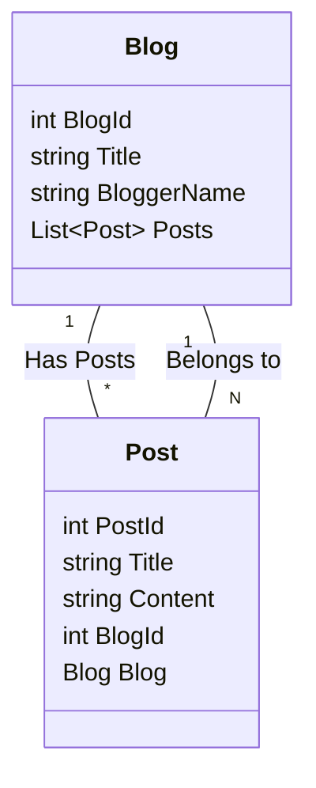

# Entity Framework Core (EF Core) 상세 가이드

### 1\. Entity Framework Core (EF Core) 란 무엇일까요? (What is Entity Framework Core?)

가장 먼저 EF Core가 무엇인지부터 알아봅시다. EF Core는 **ORM (Object-Relational Mapper)** 이라고 불리는 기술입니다.  ORM은 **객체(Object)** 와 **관계형 데이터베이스(Relational Database)** 사이의 **불일치(Impedance Mismatch)** 문제를 해결해 주는 역할을 합니다.

**잠깐\! 불일치 문제 (Impedance Mismatch)가 뭐죠?**

관계형 데이터베이스는 데이터를 **테이블(Table)** 과 **행(Row), 열(Column)** 의 형태로 저장합니다. 반면, 우리가 사용하는 프로그래밍 언어 (C\# 등)는 데이터를 **객체(Object)** 라는 형태로 다룹니다. 객체는 속성(Property)과 메서드(Method)를 가지는 복잡한 구조를 가질 수 있습니다.

이 둘 사이에는 데이터 구조와 조작 방식에 차이가 있어서, 직접 데이터베이스 코드를 작성하면 번거롭고 오류가 발생하기 쉽습니다. 마치 서로 다른 언어를 사용하는 사람과 대화하는 것처럼 어렵다고 생각하면 됩니다.

**EF Core는 바로 이 문제를 해결해 줍니다\!**  EF Core를 사용하면 개발자는 데이터베이스 테이블을 직접 조작하는 SQL 쿼리 대신, 객체를 사용하여 데이터를 다룰 수 있게 됩니다. EF Core가 객체를 데이터베이스 테이블과 자동으로 연결해 주고, 데이터베이스 작업 (저장, 조회, 수정, 삭제) 을 대신 처리해 줍니다. 마치 번역가가 있어서, 다른 언어를 사용하는 사람과 쉽게 대화할 수 있게 되는 것과 같습니다.

**핵심 요약:**

  * **ORM (Object-Relational Mapper) 이다:** 객체와 관계형 데이터베이스 사이의 다리 역할
  * **.NET 개발을 위한 ORM:** C\# 과 같은 .NET 언어에서 데이터베이스 작업 간편화
  * **SQL 쿼리 대신 객체 중심 프로그래밍:** 개발 생산성 향상 및 코드 가독성 증가

### 2\. EF Core의 특징 (Characteristics of EF Core)

EF Core는 여러 가지 강력한 특징을 가지고 있습니다. 주요 특징들을 하나씩 살펴볼까요?

#### 2.1. 가볍고 확장 가능 (Lightweight and Extensible)

EF Core는 이전 버전인 Entity Framework (EF6) 보다 훨씬 가볍고 모듈화된 구조를 가집니다. 필요한 기능만 선택적으로 NuGet 패키지를 통해 설치하여 사용할 수 있으며,  개발자의 필요에 따라 기능을 확장하거나 커스터마이징하기 용이합니다.

#### 2.2. 크로스 플랫폼 (Cross-Platform)

가장 큰 특징 중 하나는 **크로스 플랫폼**을 지원한다는 점입니다. 즉, Windows 뿐만 아니라 macOS, Linux 등 다양한 운영체제에서 .NET Core (현재 .NET) 응용 프로그램을 개발하고 실행할 수 있으며, EF Core 역시 이러한 환경을 완벽하게 지원합니다.

#### 2.3. 다양한 데이터베이스 지원 (Supports Multiple Database Providers)

EF Core는 다양한 종류의 데이터베이스 시스템을 지원합니다.  각 데이터베이스 벤더에서 제공하는 **Provider** 를 설치하면, EF Core를 통해 해당 데이터베이스와 연동할 수 있습니다.  주요 지원 데이터베이스는 다음과 같습니다.

  * **SQL Server:** Microsoft SQL Server
  * **SQLite:**  파일 기반의 경량 데이터베이스, 개발 및 테스트 환경에 유용
  * **MySQL:**  오픈 소스 데이터베이스, 웹 개발에 많이 사용
  * **PostgreSQL:** 오픈 소스 데이터베이스, 강력한 기능과 안정성 제공
  * **Oracle:**  기업 환경에서 많이 사용되는 상용 데이터베이스
  * **기타:** Azure Cosmos DB, Firebird, IBM DB2 등 다양한 데이터베이스 지원

#### 2.4. 다양한 개발 방식 지원 (Supports Different Development Approaches)

EF Core는 데이터베이스와 객체 모델을 설계하는 다양한 방식을 지원합니다. 개발 방식에 따라 **Code First**, **Database First**, **Model First**  세 가지 접근 방식을 제공합니다.

**[Table of 개발 방식 비교]**

| 개발 방식         | 설명                                                                                                                                 | 장점                                                                                                                                                                | 단점                                                                                                                                                                |
| :---------------- | :----------------------------------------------------------------------------------------------------------------------------------- | :------------------------------------------------------------------------------------------------------------------------------------------------------------------ | :------------------------------------------------------------------------------------------------------------------------------------------------------------------ |
| **Code First**     | 코드로 객체 모델 (Entity 클래스) 를 먼저 정의하고, EF Core가 이를 기반으로 데이터베이스 스키마를 생성합니다.                                                                                              | 객체 모델 중심으로 개발 가능, 코드 변경에 따른 데이터베이스 스키마 변경 용이 (Migrations 사용),  데이터베이스 스키마를 코드와 함께 버전 관리 가능, 깔끔하고 직관적인 개발 방식 | 객체 모델 설계에 대한 이해 필요,  기존 데이터베이스에 적용하기 어려울 수 있음,  데이터베이스 스키마를 세밀하게 제어하기 어려울 수 있음                                                                                               |
| **Database First** | 기존 데이터베이스 스키마를 기반으로 EF Core가 객체 모델 (Entity 클래스, DbContext) 을 자동으로 생성합니다.                                                                                         | 기존 데이터베이스 활용 용이,  데이터베이스 스키마가 이미 정의된 경우 빠르게 개발 시작 가능,  데이터베이스 전문가와 협업 용이                                                                                                   | 데이터베이스 스키마 변경 시 객체 모델을 다시 생성해야 함,  객체 모델을 직접 수정하기 어려움,  데이터베이스 스키마에 종속적인 개발 방식                                                                                                 |
| **Model First**    | 다이어그램 도구를 사용하여 시각적으로 객체 모델을 설계하고, 이를 기반으로 데이터베이스 스키마와 객체 모델 코드를 모두 생성합니다. (EF6에서 지원, EF Core에서는 지원 중단)                                                                          | 시각적인 모델링 도구 활용 가능,  객체 모델과 데이터베이스 스키마를 동시에 설계 가능                                                                                                   | Code First 와 Database First 방식에 비해 유연성 부족,  EF Core에서 더 이상 권장되지 않는 방식                                                                                                  |

*EF Core에서는 **Code First 방식** 을 가장 권장하며, 실무에서도 가장 많이 사용됩니다. Database First 방식은 기존 데이터베이스를 활용해야 하는 경우에 유용합니다.*

#### 2.5. LINQ 지원 (LINQ Support)

EF Core는 **LINQ (Language Integrated Query)** 를 완벽하게 지원합니다. LINQ를 사용하면 SQL 쿼리 대신 C\# 코드로 데이터베이스를 쿼리할 수 있습니다.  LINQ 쿼리는 컴파일 타임에 타입 체크가 가능하여 오류를 줄여주고, 코드 가독성을 높여줍니다.

**예시:**

```csharp
// LINQ 쿼리 (C# 코드)
var blogs = context.Blogs
    .Where(b => b.Rating > 3)
    .OrderByDescending(b => b.CreatedAt)
    .ToList();

// SQL 쿼리 (EF Core가 LINQ 쿼리를 SQL로 변환하여 실행)
SELECT *
FROM Blogs
WHERE Rating > 3
ORDER BY CreatedAt DESC
```

*위 예시처럼 LINQ 쿼리를 작성하면, EF Core가 자동으로 해당 LINQ 쿼리를 데이터베이스에 맞는 SQL 쿼리로 변환하여 실행해 줍니다.*

#### 2.6. 변경 감지 (Change Tracking)

EF Core는 **변경 감지 (Change Tracking)** 기능을 통해 객체의 변경 사항을 자동으로 추적합니다.  데이터베이스에서 조회한 객체를 수정하고 `SaveChanges()` 메서드를 호출하면, EF Core는 변경된 속성만 자동으로 데이터베이스에 업데이트 쿼리를 생성하여 실행합니다.  개발자는 변경 사항을 직접 추적하고 업데이트 쿼리를 작성할 필요가 없습니다.

#### 2.7. 마이그레이션 (Migrations)

**마이그레이션 (Migrations)** 은 데이터베이스 스키마를 코드와 함께 버전 관리할 수 있도록 해주는 강력한 기능입니다.  Code First 방식으로 개발할 때, 객체 모델 (Entity 클래스) 을 수정하면 데이터베이스 스키마도 함께 변경해야 합니다.  마이그레이션을 사용하면 객체 모델 변경 사항을 기반으로 데이터베이스 스키마 변경 스크립트를 자동으로 생성하고, 데이터베이스에 적용할 수 있습니다.  이를 통해 개발, 테스트, 운영 환경에서 데이터베이스 스키마를 일관성 있게 관리할 수 있습니다.

### 3\. EF Core 사용 방법 (How to Use EF Core)

이제 실제로 EF Core를 사용하는 방법을 단계별로 알아봅시다. Code First 방식을 기준으로 설명합니다.

#### 3.1. EF Core 설정 (Setting up EF Core)

1.  **NuGet 패키지 설치:** 프로젝트에 필요한 EF Core NuGet 패키지를 설치합니다.  최소한 다음 패키지들이 필요합니다.

      * `Microsoft.EntityFrameworkCore`: EF Core 기본 패키지
      * `Microsoft.EntityFrameworkCore.SqlServer` (SQL Server 사용 시) 또는 다른 데이터베이스 Provider 패키지 (예: `Microsoft.EntityFrameworkCore.Sqlite`, `Microsoft.EntityFrameworkCore.MySql.Pomelo`)

    **Package Manager Console (PMC) 또는 .NET CLI 사용:**

    ```powershell
    # Package Manager Console (PMC)
    Install-Package Microsoft.EntityFrameworkCore.SqlServer
    Install-Package Microsoft.EntityFrameworkCore.Tools

    # .NET CLI
    dotnet add package Microsoft.EntityFrameworkCore.SqlServer
    dotnet add package Microsoft.EntityFrameworkCore.Tools
    ```

2.  **DbContext 클래스 생성:**  `DbContext` 클래스는 EF Core와 데이터베이스 사이의 **컨텍스트** 역할을 합니다.  데이터베이스 연결 정보, Entity 클래스 정보 등을 관리하고, 데이터베이스 작업을 수행하는 데 사용됩니다.  `DbContext` 클래스를 상속받아 프로젝트에 맞는 컨텍스트 클래스를 생성합니다.

    ```csharp
    using Microsoft.EntityFrameworkCore;

    public class BloggingContext : DbContext
    {
        public BloggingContext(DbContextOptions<BloggingContext> options)
            : base(options)
        { }

        public DbSet<Blog> Blogs { get; set; } // Entity 클래스 등록 (Blogs 테이블과 매핑)
        public DbSet<Post> Posts { get; set; } // Entity 클래스 등록 (Posts 테이블과 매핑)
    }
    ```

3.  **DbContext 구성 (Configure DbContext):**  `DbContext` 를 구성하기 위해 `Startup.cs` (또는 `Program.cs` in .NET 6+) 파일의 `ConfigureServices` 메서드 (또는 `Program.cs`의 builder.Services) 에서 `AddDbContext` 메서드를 사용하여 데이터베이스 연결 문자열과 사용할 데이터베이스 Provider를 설정합니다.

    ```csharp
    // Startup.cs (ConfigureServices 메서드)
    public void ConfigureServices(IServiceCollection services)
    {
        services.AddDbContext<BloggingContext>(options =>
            options.UseSqlServer(Configuration.GetConnectionString("DefaultConnection"))); // SQL Server 사용, 연결 문자열 설정
    }

    // Program.cs (.NET 6+ 이상)
    builder.Services.AddDbContext<BloggingContext>(options =>
        options.UseSqlServer(builder.Configuration.GetConnectionString("DefaultConnection"))); // SQL Server 사용, 연결 문자열 설정
    ```

      * `UseSqlServer()` 대신 다른 데이터베이스 Provider 메서드 (`UseSqlite()`, `UseMySql()`, `UseNpgsql()` 등) 를 사용할 수 있습니다.
      * `Configuration.GetConnectionString("DefaultConnection")` 은 `appsettings.json` 파일 등에 정의된 연결 문자열을 가져오는 코드입니다.

4.  **Entity 클래스 정의 (Define Entity Classes):** 데이터베이스 테이블과 매핑될 **Entity 클래스 (POCO 클래스)** 를 정의합니다.  Entity 클래스는 데이터베이스 테이블의 컬럼에 해당하는 속성 (Property) 들을 가집니다.

    ```csharp
    public class Blog
    {
        public int BlogId { get; set; } // Primary Key, 테이블의 BlogId 컬럼과 매핑
        public string Url { get; set; }   // 테이블의 Url 컬럼과 매핑
        public int Rating { get; set; } // 테이블의 Rating 컬럼과 매핑

        public List<Post> Posts { get; set; } // Navigation Property, Blog - Post 관계 설정
    }

    public class Post
    {
        public int PostId { get; set; }   // Primary Key, 테이블의 PostId 컬럼과 매핑
        public string Title { get; set; }  // 테이블의 Title 컬럼과 매핑
        public string Content { get; set; } // 테이블의 Content 컬럼과 매핑

        public int BlogId { get; set; }    // Foreign Key, 테이블의 BlogId 컬럼과 매핑, Blog 테이블과의 관계 설정
        public Blog Blog { get; set; }     // Navigation Property, Post - Blog 관계 설정
    }
    ```

      * Entity 클래스는 Plain Old CLR Object (POCO) 클래스라고도 불립니다.  특별한 인터페이스를 구현하거나 특정 클래스를 상속받을 필요 없이, 일반적인 C\# 클래스로 정의할 수 있습니다.
      * **Primary Key:** Entity 클래스의 속성 중 하나를 Primary Key로 지정해야 합니다.  일반적으로 `Id` 또는 `ClassNameId` 와 같은 이름의 속성을 Primary Key로 사용하는 규칙이 있습니다.
      * **Navigation Property:** Entity 클래스 간의 관계를 설정하기 위해 사용되는 속성입니다.  위 예시에서 `Blog` 클래스의 `Posts` 속성과 `Post` 클래스의 `Blog` 속성은 Navigation Property입니다.

5.  **Entity 관계 설정 (Configure Entity Relationships):** Entity 클래스 간의 관계 (One-to-One, One-to-Many, Many-to-Many) 를 설정합니다.  Code First 방식에서는 주로 **Convention (규칙)** 과 **Fluent API** 를 사용하여 관계를 설정합니다.

      * **Convention:**  EF Core는 미리 정의된 규칙에 따라 Entity 클래스 간의 관계를 자동으로 설정합니다.  예를 들어, `Post` 클래스에 `BlogId` 속성과 `Blog` Navigation Property가 있으면, EF Core는 자동으로 Post 와 Blog 사이에 One-to-Many 관계를 설정합니다.
      * **Fluent API:** Convention으로 설정할 수 없는 복잡한 관계나 세밀한 설정을 해야 할 경우, Fluent API를 사용합니다.  `DbContext` 클래스의 `OnModelCreating` 메서드를 오버라이드하여 Fluent API를 설정할 수 있습니다.

    <!-- end list -->

    ```csharp
    public class BloggingContext : DbContext
    {
        public BloggingContext(DbContextOptions<BloggingContext> options)
            : base(options)
        { }

        public DbSet<Blog> Blogs { get; set; }
        public DbSet<Post> Posts { get; set; }

        protected override void OnModelCreating(ModelBuilder modelBuilder)
        {
            // Fluent API 설정 예시: Blog - Post 관계 설정 (One-to-Many, Post.BlogId 를 Foreign Key로 사용)
            modelBuilder.Entity<Post>()
                .HasOne(p => p.Blog) // Post는 하나의 Blog를 가진다 (One-to-One 또는 One-to-Many 관계의 'One' 쪽)
                .WithMany(b => b.Posts) // Blog는 여러 개의 Post를 가질 수 있다 (One-to-Many 또는 Many-to-Many 관계의 'Many' 쪽)
                .HasForeignKey(p => p.BlogId); // Post 의 BlogId 속성을 Foreign Key 로 사용
        }
    }
    ```

#### 3.2. CRUD 연산 수행 (Performing CRUD Operations)

EF Core를 사용하여 데이터베이스에 데이터를 저장, 조회, 수정, 삭제하는 CRUD (Create, Read, Update, Delete) 연산을 수행하는 방법을 알아봅시다.

1.  **Create (생성):**  새로운 Entity 객체를 생성하고, `DbContext` 를 통해 데이터베이스에 저장합니다.

    ```csharp
    using (var context = new BloggingContext(options)) // DbContext 인스턴스 생성 (using 블록 안에서 생성하여 Dispose 되도록 함)
    {
        var blog = new Blog { Url = "http://example.com/new-blog", Rating = 5 }; // 새로운 Blog Entity 객체 생성

        context.Blogs.Add(blog); // DbContext 의 Blogs DbSet 에 Entity 객체 추가 (Entity State: Added)
        context.SaveChanges();    // 변경 사항을 데이터베이스에 저장 (INSERT 쿼리 실행)

        Console.WriteLine($"Blog added with ID: {blog.BlogId}"); // 데이터베이스에서 자동 생성된 Primary Key 값 확인
    }
    ```

      * `context.Blogs.Add(blog)`:  새로운 `Blog` Entity 객체를 `DbContext` 의 `Blogs` DbSet 에 추가합니다.  이때 Entity 객체의 상태는 **Added** 로 변경됩니다.
      * `context.SaveChanges()`:  `DbContext` 에 추적되고 있는 모든 Entity 객체의 변경 사항을 데이터베이스에 저장합니다.  Added 상태의 Entity 객체는 INSERT 쿼리를 통해 데이터베이스에 새로운 행으로 추가됩니다.

2.  **Read (조회):** LINQ 쿼리 또는 `Find()` 메서드를 사용하여 데이터베이스에서 데이터를 조회합니다.

    ```csharp
    using (var context = new BloggingContext(options))
    {
        // 1. Find() 메서드 사용 (Primary Key 값으로 조회)
        var blog1 = context.Blogs.Find(1); // BlogId 가 1 인 Blog 조회
        if (blog1 != null)
        {
            Console.WriteLine($"Blog URL (Find): {blog1.Url}");
        }

        // 2. LINQ 쿼리 사용 (다양한 조건으로 조회 가능)
        var blog2 = context.Blogs
            .Where(b => b.Rating > 4)     // Rating 이 4 보다 큰 Blog 만 필터링
            .OrderByDescending(b => b.Rating) // Rating 내림차순으로 정렬
            .FirstOrDefault();           // 첫 번째 결과만 가져옴 (없으면 null)
        if (blog2 != null)
        {
            Console.WriteLine($"Blog URL (LINQ): {blog2.Url}, Rating: {blog2.Rating}");
        }

        // 3. ToList() 를 사용하여 모든 결과 가져오기
        var allBlogs = context.Blogs.ToList(); // 모든 Blog 조회
        Console.WriteLine($"Total Blogs: {allBlogs.Count}");
    }
    ```

      * `context.Blogs.Find(1)`:  Primary Key 값 (여기서는 `BlogId` 가 1) 으로 Entity 객체를 조회합니다.  Find() 메서드는 Primary Key 값으로만 조회할 수 있으며, 조회 결과가 없으면 `null` 을 반환합니다.
      * `context.Blogs.Where(...).OrderByDescending(...).FirstOrDefault()`: LINQ 쿼리를 사용하여 다양한 조건으로 데이터를 조회할 수 있습니다.  `Where()`, `OrderBy()`, `FirstOrDefault()`, `ToList()` 등 다양한 LINQ 연산자를 사용하여 원하는 데이터를 필터링, 정렬, 프로젝션 할 수 있습니다.

3.  **Update (수정):** 데이터베이스에서 조회한 Entity 객체의 속성을 변경하고, `SaveChanges()` 메서드를 호출하여 변경 사항을 데이터베이스에 반영합니다.

    ```csharp
    using (var context = new BloggingContext(options))
    {
        var blog = context.Blogs.Find(1); // 수정할 Blog 조회
        if (blog != null)
        {
            blog.Url = "http://example.com/updated-blog"; // Blog 객체의 Url 속성 변경 (Entity State: Modified)
            context.SaveChanges();                         // 변경 사항을 데이터베이스에 저장 (UPDATE 쿼리 실행)
            Console.WriteLine($"Blog URL updated to: {blog.Url}");
        }
    }
    ```

      * EF Core는 **변경 감지 (Change Tracking)** 기능을 통해 Entity 객체의 변경 사항을 자동으로 추적합니다.  데이터베이스에서 조회한 Entity 객체의 속성을 변경하면, EF Core는 해당 Entity 객체의 상태를 **Modified** 로 변경합니다.
      * `context.SaveChanges()`:  Modified 상태의 Entity 객체는 UPDATE 쿼리를 통해 데이터베이스에 변경 사항이 반영됩니다.

4.  **Delete (삭제):**  삭제할 Entity 객체를 조회하고, `DbContext` 를 통해 데이터베이스에서 삭제합니다.

    ```csharp
    using (var context = new BloggingContext(options))
    {
        var blog = context.Blogs.Find(1); // 삭제할 Blog 조회
        if (blog != null)
        {
            context.Blogs.Remove(blog); // DbContext 의 Blogs DbSet 에서 Entity 객체 제거 (Entity State: Deleted)
            context.SaveChanges();        // 변경 사항을 데이터베이스에 저장 (DELETE 쿼리 실행)
            Console.WriteLine($"Blog deleted with ID: {blog.BlogId}");
        }
    }
    ```

      * `context.Blogs.Remove(blog)`:  삭제할 `Blog` Entity 객체를 `DbContext` 의 `Blogs` DbSet 에서 제거합니다. 이때 Entity 객체의 상태는 **Deleted** 로 변경됩니다.
      * `context.SaveChanges()`:  Deleted 상태의 Entity 객체는 DELETE 쿼리를 통해 데이터베이스에서 해당 행이 삭제됩니다.

#### 3.3. 마이그레이션 사용 (Using Migrations)

마이그레이션을 사용하여 데이터베이스 스키마를 관리하는 방법을 알아봅시다.

1.  **마이그레이션 추가 (Add Migration):**  Entity 클래스 (객체 모델) 를 변경한 후, `Add-Migration` 명령어를 사용하여 마이그레이션 파일을 생성합니다.

    **Package Manager Console (PMC) 또는 .NET CLI 사용:**

    ```powershell
    # Package Manager Console (PMC)
    Add-Migration InitialCreate // 마이그레이션 이름 지정 (예: InitialCreate, AddRatingColumn 등)

    # .NET CLI
    dotnet ef migrations add InitialCreate
    ```

      * `Add-Migration` 명령어는 현재 객체 모델과 데이터베이스 스키마를 비교하여 변경 사항을 감지하고, 데이터베이스 스키마를 업데이트하는 마이그레이션 파일을 생성합니다.  마이그레이션 파일은 `Migrations` 폴더 아래에 생성됩니다.

2.  **데이터베이스 업데이트 (Update Database):**  `Update-Database` 명령어를 사용하여 마이그레이션 파일을 데이터베이스에 적용합니다.

    **Package Manager Console (PMC) 또는 .NET CLI 사용:**

    ```powershell
    # Package Manager Console (PMC)
    Update-Database

    # .NET CLI
    dotnet ef database update
    ```

      * `Update-Database` 명령어는 `Migrations` 폴더 아래의 마이그레이션 파일을 순서대로 데이터베이스에 적용하여 데이터베이스 스키마를 업데이트합니다.

**마이그레이션 명령어 요약:**

  * `Add-Migration <MigrationName>`:  새로운 마이그레이션 파일 생성
  * `Update-Database`:  마이그레이션 파일을 데이터베이스에 적용
  * `Remove-Migration`:  가장 최근에 생성된 마이그레이션 파일 삭제 (되돌리기)
  * `Script-Migration`:  마이그레이션 스크립트 (SQL) 생성 (데이터베이스 관리자가 직접 스크립트 실행 가능)
  * `Get-DbContextInfo`:  DbContext 정보 확인

### 4\. 참고 웹사이트 (References)

EF Core를 더 자세히 배우고 싶다면 다음 웹사이트들을 참고해 보세요.

  * **Microsoft 공식 Entity Framework Core 문서:** [https://docs.microsoft.com/ko-kr/ef/core/](https://learn.microsoft.com/ko-kr/ef/core/)  (가장 정확하고 최신 정보 제공)
  * **EF Core 자습서 - Microsoft Learn:** [https://learn.microsoft.com/ko-kr/ef/core/get-started/overview/first-app?tabs=net-core-cli](https://www.google.com/search?q=https://learn.microsoft.com/ko-kr/ef/core/get-started/overview/first-app%3Ftabs%3Dnet-core-cli) (단계별 자습서, 초보자에게 유용)
  * **Entity Framework Core in Action (책):** [https://www.manning.com/books/entity-framework-core-in-action-second-edition](https://www.google.com/url?sa=E&source=gmail&q=https://www.manning.com/books/entity-framework-core-in-action-second-edition) (EF Core 전문가가 쓴 깊이 있는 내용, 중급 이상 개발자에게 추천)
  * **Stack Overflow (ef-core 태그):** [https://stackoverflow.com/questions/tagged/ef-core](https://www.google.com/url?sa=E&source=gmail&q=https://stackoverflow.com/questions/tagged/ef-core) (EF Core 관련 질문/답변, 문제 해결에 도움)

---
# .NET CLI 상세 가이드

### 1\. .NET CLI 란 무엇일까요? (What is .NET CLI?)
.NET CLI (Command-Line Interface)는 윈도우, macOS, Linux 등 다양한 운영체제에서 .NET 개발을 위한 핵심적인 도구입니다.  텍스트 기반의 명령어를 사용하여 .NET 프로젝트를 생성, 빌드, 실행, 테스트, 패키징하고 관리하는 데 사용됩니다.

**잠깐\! CLI (Command-Line Interface) 가 뭐죠?**

CLI는 텍스트 명령어를 입력하여 컴퓨터를 제어하는 방식입니다.  마우스 클릭이나 GUI (Graphical User Interface) 대신, 키보드로 명령어를 입력하여 작업을 수행합니다.  과거에는 컴퓨터와 소통하는 주요 방식이었으며, 개발 환경에서는 여전히 강력하고 효율적인 도구로 사용됩니다.

**.NET CLI는 .NET 개발의 '만능 도구' 입니다\!**  .NET CLI를 사용하면 다음과 같은 다양한 작업을 할 수 있습니다.

  * **프로젝트 생성:**  새로운 .NET 프로젝트 (콘솔 앱, 웹 API, 웹 앱, 클래스 라이브러리 등) 를 템플릿 기반으로 빠르게 생성
  * **코드 빌드:**  작성한 C\# 코드를 실행 가능한 형태로 컴파일 (빌드)
  * **프로그램 실행:**  빌드된 프로그램을 실행
  * **테스트 실행:**  작성한 테스트 코드를 실행하여 코드의 품질 검증
  * **NuGet 패키지 관리:**  프로젝트에 필요한 외부 라이브러리 (NuGet 패키지) 를 추가, 제거, 업데이트
  * **게시 (Publish):**  개발 완료된 애플리케이션을 배포 가능한 형태로 패키징

**핵심 요약:**

  * **.NET 개발을 위한 명령줄 인터페이스 (CLI) 이다:** 텍스트 기반 명령어로 .NET 개발 작업 수행
  * **크로스 플랫폼 지원:** Windows, macOS, Linux 등 다양한 운영체제에서 사용 가능
  * **.NET 개발의 핵심 워크플로우 지원:** 프로젝트 생성, 빌드, 실행, 테스트, 패키징, 배포 등

### 2\. .NET CLI의 특징 (Characteristics of .NET CLI)

.NET CLI는 강력하고 편리한 개발 경험을 제공하는 다양한 특징을 가지고 있습니다. 주요 특징들을 하나씩 살펴볼까요?

#### 2.1. 크로스 플랫폼 (Cross-Platform)

가장 중요한 특징 중 하나는 **크로스 플랫폼**을 완벽하게 지원한다는 점입니다.  .NET CLI는 Windows, macOS, Linux 등 다양한 운영체제에서 동일하게 작동합니다.  즉, 운영체제에 종속되지 않고, 개발 환경을 자유롭게 선택할 수 있습니다.

#### 2.2. 명령 기반 작업 (Command-Based Operations)

.NET CLI는 텍스트 명령어 기반으로 작동합니다.  명령어를 통해 프로젝트를 생성하고 관리하며, 빌드, 실행, 테스트 등 모든 개발 작업을 명령어로 수행할 수 있습니다.  명령어 기반 작업은 자동화, 스크립팅에 용이하며, 반복적인 작업을 효율적으로 처리할 수 있도록 해줍니다.

#### 2.3. 템플릿 기반 프로젝트 생성 (Template-Based Project Creation)

.NET CLI는 다양한 프로젝트 템플릿을 제공합니다.  `dotnet new` 명령어를 사용하면 콘솔 앱, 웹 API, 웹 앱, 클래스 라이브러리 등 다양한 유형의 프로젝트를 템플릿 기반으로 빠르게 생성할 수 있습니다.  템플릿은 프로젝트의 기본적인 구조와 필요한 파일들을 자동으로 구성해 줍니다.

#### 2.4. NuGet 패키지 관리 (NuGet Package Management)

.NET CLI는 NuGet 패키지 관리를 위한 기능을 내장하고 있습니다.  `dotnet add package`, `dotnet remove package`, `dotnet list package` 등의 명령어를 사용하여 프로젝트에 필요한 NuGet 패키지를 쉽게 추가, 제거, 관리할 수 있습니다.  NuGet 패키지는 .NET 개발 생태계의 핵심이며, .NET CLI를 통해 풍부한 라이브러리들을 편리하게 활용할 수 있습니다.

#### 2.5. 빌드 및 실행 (Build and Run)

.NET CLI는 소스 코드를 빌드하고 실행하는 기능을 제공합니다.  `dotnet build` 명령어를 사용하여 소스 코드를 컴파일하고 실행 가능한 형태로 만들 수 있으며, `dotnet run` 명령어를 사용하여 빌드된 프로그램을 바로 실행할 수 있습니다.  빌드 및 실행 과정은 .NET 개발의 핵심이며, .NET CLI를 통해 간단하게 수행할 수 있습니다.

#### 2.6. 테스트 실행 (Test Execution)

.NET CLI는 테스트 프레임워크와 통합되어 테스트 코드를 실행하는 기능을 제공합니다.  `dotnet test` 명령어를 사용하면 프로젝트 내의 테스트 프로젝트를 찾아서 자동으로 테스트를 실행하고 결과를 보여줍니다.  테스트 주도 개발 (TDD) 또는 단위 테스트를 중요하게 생각하는 개발 방식에서 .NET CLI의 테스트 실행 기능은 매우 유용합니다.

#### 2.7. 게시 (Publish)

.NET CLI는 개발 완료된 애플리케이션을 배포 가능한 형태로 패키징하는 게시 기능을 제공합니다.  `dotnet publish` 명령어를 사용하면 애플리케이션을 특정 플랫폼 (Windows, Linux, macOS) 또는 배포 환경 (Docker, Azure 등) 에 맞게 패키징할 수 있습니다.  게시 기능은 애플리케이션 배포 과정을 간소화하고 자동화하는 데 도움을 줍니다.

#### 2.8. 확장성 (Extensibility)

.NET CLI는 확장 가능한 구조를 가지고 있습니다.  필요한 기능을 확장하거나 커스터마이징하기 위해 도구를 추가하거나 기능을 확장할 수 있습니다.  .NET SDK 및 도구를 업데이트하여 최신 기능과 개선 사항을 쉽게 적용할 수 있습니다.

### 3\. .NET CLI 사용 방법 (How to Use .NET CLI)

이제 실제로 .NET CLI를 사용하는 방법을 단계별로 알아봅시다. 기본적인 명령어와 함께 예시를 들어 설명합니다.

#### 3.1. .NET CLI 설치 확인 (Verify .NET CLI Installation)

먼저 .NET CLI가 제대로 설치되었는지 확인해 보겠습니다. 터미널 (명령 프롬프트, PowerShell, 터미널 앱 등) 을 열고 다음 명령어를 입력해 보세요.

```bash
dotnet --version
```

정상적으로 설치되었다면, .NET SDK 버전 정보가 출력될 것입니다.  만약 `dotnet` 명령어를 찾을 수 없다는 오류 메시지가 나타난다면, .NET SDK를 설치해야 합니다.  .NET 다운로드 페이지 ([https://dotnet.microsoft.com/download](https://www.google.com/url?sa=E&source=gmail&q=https://dotnet.microsoft.com/download)) 에서 운영체제에 맞는 SDK를 다운로드하여 설치하세요.

#### 3.2. 새로운 프로젝트 생성 (`dotnet new`)

새로운 .NET 프로젝트를 생성하려면 `dotnet new` 명령어를 사용합니다.  `dotnet new <템플릿_이름> -o <프로젝트_이름>` 형식으로 명령어를 입력합니다.

**자주 사용되는 템플릿:**

  * `console`: 콘솔 응용 프로그램
  * `webapi`: 웹 API 응용 프로그램
  * `webapp`: 웹 응용 프로그램 (Razor Pages)
  * `mvc`: 웹 응용 프로그램 (MVC)
  * `classlib`: 클래스 라이브러리

**예시:**

1.  **콘솔 앱 프로젝트 생성:** `MyConsoleApp` 이라는 이름의 콘솔 앱 프로젝트를 생성합니다.

    ```bash
    dotnet new console -o MyConsoleApp
    cd MyConsoleApp  # 프로젝트 폴더로 이동
    ```

      * `dotnet new console`: 콘솔 앱 템플릿을 사용하여 프로젝트 생성
      * `-o MyConsoleApp`:  `MyConsoleApp` 이라는 이름의 폴더에 프로젝트 생성

    생성된 `MyConsoleApp` 폴더에는 기본적인 콘솔 앱 프로젝트 구조와 파일 (`Program.cs`, `.csproj` 등) 이 자동으로 구성됩니다.

2.  **웹 API 프로젝트 생성:** `MyWebApi` 이라는 이름의 웹 API 프로젝트를 생성합니다.

    ```bash
    dotnet new webapi -o MyWebApi
    cd MyWebApi   # 프로젝트 폴더로 이동
    ```

      * `dotnet new webapi`: 웹 API 템플릿을 사용하여 프로젝트 생성
      * `-o MyWebApi`: `MyWebApi` 이라는 이름의 폴더에 프로젝트 생성

    `MyWebApi` 폴더에는 웹 API 프로젝트에 필요한 컨트롤러, 모델, 설정 파일 등이 템플릿에 따라 구성됩니다.

#### 3.3. 프로젝트 빌드 (`dotnet build`)

프로젝트를 빌드하려면 프로젝트 폴더로 이동한 후 `dotnet build` 명령어를 실행합니다.

```bash
cd MyConsoleApp  # 프로젝트 폴더로 이동 (예시)
dotnet build
```

`dotnet build` 명령어는 프로젝트 파일 (`.csproj`) 을 분석하고, 소스 코드를 컴파일하여 실행 가능한 바이너리 파일 (`.dll` 또는 `.exe`) 을 생성합니다. 빌드 결과는 프로젝트 폴더 아래의 `bin` 폴더에 저장됩니다.

#### 3.4. 프로그램 실행 (`dotnet run`)

빌드된 프로그램을 실행하려면 프로젝트 폴더에서 `dotnet run` 명령어를 실행합니다.

```bash
cd MyConsoleApp  # 프로젝트 폴더로 이동 (예시)
dotnet run
```

`dotnet run` 명령어는 프로젝트를 빌드하고, 빌드된 결과물을 바로 실행합니다.  콘솔 앱의 경우 콘솔 창에 프로그램 실행 결과가 출력됩니다. 웹 API 또는 웹 앱의 경우, 웹 서버가 실행되고 브라우저를 통해 애플리케이션에 접근할 수 있습니다.

#### 3.5. NuGet 패키지 관리

1.  **NuGet 패키지 추가 (`dotnet add package`)**

    프로젝트에 NuGet 패키지를 추가하려면 `dotnet add package <패키지_이름>` 명령어를 사용합니다.

    **예시:**  `Newtonsoft.Json` 패키지를 현재 프로젝트에 추가합니다.

    ```bash
    dotnet add package Newtonsoft.Json
    ```

      * `dotnet add package Newtonsoft.Json`:  `Newtonsoft.Json` NuGet 패키지를 프로젝트에 추가

2.  **NuGet 패키지 제거 (`dotnet remove package`)**

    프로젝트에서 NuGet 패키지를 제거하려면 `dotnet remove package <패키지_이름>` 명령어를 사용합니다.

    **예시:** `Newtonsoft.Json` 패키지를 현재 프로젝트에서 제거합니다.

    ```bash
    dotnet remove package Newtonsoft.Json
    ```

      * `dotnet remove package Newtonsoft.Json`:  `Newtonsoft.Json` NuGet 패키지를 프로젝트에서 제거

3.  **NuGet 패키지 목록 확인 (`dotnet list package`)**

    프로젝트에 추가된 NuGet 패키지 목록을 확인하려면 `dotnet list package` 명령어를 사용합니다.

    ```bash
    dotnet list package
    ```

      * `dotnet list package`:  프로젝트에 추가된 NuGet 패키지 목록을 출력

#### 3.6. 테스트 실행 (`dotnet test`)

프로젝트 내의 테스트 프로젝트를 실행하려면 프로젝트 루트 폴더 또는 테스트 프로젝트 폴더에서 `dotnet test` 명령어를 실행합니다.

```bash
dotnet test
```

`dotnet test` 명령어는 프로젝트를 빌드하고, 테스트 프로젝트를 찾아서 자동으로 테스트를 실행합니다.  테스트 결과 (성공, 실패, 건너뜀) 와 함께 테스트 커버리지 정보를 콘솔에 출력합니다.

#### 3.7. 게시 (`dotnet publish`)

애플리케이션을 게시하려면 프로젝트 폴더에서 `dotnet publish` 명령어를 실행합니다.

```bash
dotnet publish -c Release -r win-x64  # Windows 64비트 릴리즈 버전으로 게시 (예시)
```

  * `dotnet publish`: 게시 명령어
  * `-c Release`: 릴리즈 빌드 구성으로 게시 (최적화, 디버깅 정보 제거)
  * `-r win-x64`:  Windows 64비트 플랫폼으로 게시 (Self-Contained Deployment, SCD 방식)

`dotnet publish` 명령어는 프로젝트를 빌드하고, 지정된 구성 및 런타임에 맞게 애플리케이션을 게시 폴더 (`bin\Release\net8.0\win-x64\publish` 와 유사한 경로) 에 생성합니다. 게시된 폴더에는 실행에 필요한 모든 파일 (실행 파일, DLL, 설정 파일, 런타임 라이브러리 등) 이 포함되어 있습니다.

#### 3.8. 유용한 .NET CLI 명령어 요약

**[Table of 자주 사용하는 .NET CLI 명령어]**

| 명령어               | 설명                                                                                                                               | 예시                                                                 |
| :--------------------- | :--------------------------------------------------------------------------------------------------------------------------------- | :------------------------------------------------------------------- |
| `dotnet --version`      | 설치된 .NET SDK 버전 확인                                                                                                          | `dotnet --version`                                                    |
| `dotnet new <템플릿> -o <이름>` | 새 프로젝트 생성 (템플릿: console, webapi, webapp, classlib 등)                                                                                 | `dotnet new console -o MyConsoleApp`                                 |
| `dotnet build`         | 프로젝트 빌드                                                                                                                        | `dotnet build`                                                       |
| `dotnet run`           | 프로그램 실행                                                                                                                        | `dotnet run`                                                         |
| `dotnet add package <패키지>` | NuGet 패키지 추가                                                                                                               | `dotnet add package Newtonsoft.Json`                                 |
| `dotnet remove package <패키지>`| NuGet 패키지 제거                                                                                                               | `dotnet remove package Newtonsoft.Json`                                 |
| `dotnet list package`    | NuGet 패키지 목록 확인                                                                                                               | `dotnet list package`                                                |
| `dotnet test`          | 테스트 실행                                                                                                                          | `dotnet test`                                                        |
| `dotnet publish`       | 애플리케이션 게시                                                                                                                    | `dotnet publish -c Release -r win-x64`                              |
| `dotnet help <명령어>`    | 특정 명령어 도움말 보기                                                                                                            | `dotnet help new`                                                     |

*위 표는 .NET CLI에서 자주 사용되는 명령어들을 요약한 것입니다. 더 자세한 내용은 `dotnet help` 명령어를 통해 확인할 수 있습니다.*

---
# Code First vs Database First 개발 방식 상세 가이드 
### 1\. Code First 와 Database First 란 무엇일까요? (What are Code First and Database First?)

.NET 개발에서 데이터베이스와 연동하는 방식은 크게 **Code First** 와 **Database First** 두 가지로 나눌 수 있습니다. 이 두 방식은 데이터베이스와 애플리케이션의 객체 모델을 연결하는 EF Core를 사용할 때, 개발 시작점을 어디에 두느냐에 따라 구분됩니다.

#### 1.1. Code First 방식 (Code First Approach)

**Code First 방식** 은 말 그대로 **코드를 먼저 작성하는 방식** 입니다.  개발자가 C\# 코드로 **Entity 클래스 (데이터베이스 테이블과 매핑될 클래스)** 와 `DbContext` 클래스 (데이터베이스 컨텍스트) 를 먼저 정의합니다.  EF Core는 이 코드를 기반으로 **데이터베이스 스키마를 자동으로 생성** 하고, 객체 모델과 데이터베이스를 매핑합니다.

**핵심:**

  * **개발 시작점:** C\# 코드 (Entity 클래스, DbContext)
  * **데이터베이스 생성:** EF Core가 코드 기반으로 데이터베이스 스키마 자동 생성
  * **객체 모델 중심 개발:** 객체 모델 설계를 우선시하고, 데이터베이스는 객체 모델에 맞춰 생성

#### 1.2. Database First 방식 (Database First Approach)

**Database First 방식** 은 **기존 데이터베이스가 이미 존재하는 경우** 에 유용한 방식입니다.  개발자는 **기존 데이터베이스 스키마를 먼저 설계** 하거나, 이미 존재하는 데이터베이스를 활용합니다.  EF Core는 이 데이터베이스 스키마를 분석하여 **Entity 클래스, DbContext 클래스 등 코드를 자동으로 생성** 해 줍니다.

**핵심:**

  * **개발 시작점:** 기존 데이터베이스 스키마
  * **코드 생성:** EF Core가 데이터베이스 스키마 기반으로 코드 자동 생성 (Entity 클래스, DbContext)
  * **데이터베이스 중심 개발:** 데이터베이스 스키마를 우선시하고, 코드는 데이터베이스 스키마에 맞춰 생성

### 2\. Code First vs Database First 특징 비교 (Characteristics Comparison)

Code First 와 Database First 방식은 각각 장단점을 가지고 있으며, 프로젝트의 특성과 개발 상황에 따라 적합한 방식이 다릅니다. 주요 특징들을 비교해 보겠습니다.

**[Table of Code First vs Database First 특징 비교]**

| 특징                 | Code First                                                                                                                               | Database First                                                                                                                               |
| :--------------------- | :------------------------------------------------------------------------------------------------------------------------------------- | :------------------------------------------------------------------------------------------------------------------------------------- |
| **개발 시작점**        | C\# 코드 (Entity 클래스, DbContext)                                                                                                      | 기존 데이터베이스 스키마                                                                                                                      |
| **데이터베이스 스키마 생성** | EF Core 자동 생성 (Migrations 사용)                                                                                                  | 기존 데이터베이스 활용, 스키마 직접 설계 또는 DBA 협업                                                                                                 |
| **코드 생성**          | 개발자가 직접 Entity 클래스, DbContext 코드 작성                                                                                             | EF Core가 데이터베이스 스키마 기반으로 Entity 클래스, DbContext 코드 자동 생성 (Scaffolding)                                                                    |
| **객체 모델 vs 데이터베이스 스키마** | 객체 모델 중심 설계, 데이터베이스 스키마는 객체 모델에 맞춰 생성                                                                                              | 데이터베이스 스키마 중심 설계, 코드는 데이터베이스 스키마에 맞춰 생성                                                                                               |
| **유연성**             | 높음: 객체 모델 변경에 따른 데이터베이스 스키마 변경 용이 (Migrations), 코드 변경에 유연하게 대응 가능                                                                                            | 낮음: 데이터베이스 스키마 변경 시 코드 다시 생성 필요, 코드 수정이 제한적일 수 있음                                                                                              |
| **데이터베이스 제어**     | 보통: EF Core가 대부분의 데이터베이스 스키마 관리, 세밀한 제어는 Fluent API 활용                                                                                              | 높음: 데이터베이스 스키마를 직접 설계하고 완벽하게 제어 가능,  데이터베이스 전문가에게 유리                                                                                               |
| **학습 곡선**          | 비교적 낮음: C\# 코드 작성에 익숙한 개발자에게 친숙, 객체 모델 중심 개발 방식 이해 용이                                                                                                | 비교적 높음: 기존 데이터베이스 스키마에 대한 이해 필요,  데이터베이스 스키마와 코드 생성 과정 이해 필요                                                                                                |
| **개발 속도 (초기)**     | 비교적 느림: Entity 클래스, DbContext 코드 직접 작성 필요, 초기 데이터베이스 스키마 설계 시간 소요                                                                                             | 비교적 빠름: 기존 데이터베이스 활용 또는 스키마 설계 완료된 경우 빠르게 개발 시작 가능,  코드 자동 생성으로 개발 시간 단축                                                                                              |
| **개발 속도 (유지보수)** | 빠름: 객체 모델 변경 및 코드 수정 용이,  Migrations 를 통한 데이터베이스 스키마 변경 관리 효율적                                                                                                | 느림: 데이터베이스 스키마 변경 시 코드 다시 생성 및 수정 필요,  코드와 데이터베이스 스키마 불일치 문제 발생 가능성 증가                                                                                              |
| **적합한 프로젝트**     | \* 새로운 프로젝트, 객체 모델 중심으로 개발하는 프로젝트,  데이터베이스 스키마를 유연하게 변경해야 하는 프로젝트,  애자일 개발 방식, DDD (Domain-Driven Design) 방식 적용 프로젝트                                                                            | \* 기존 데이터베이스를 활용해야 하는 프로젝트, 데이터베이스 스키마가 이미 확정된 프로젝트, 데이터베이스 중심 개발 방식 선호, DBA 와 협업이 중요한 프로젝트,  대규모 엔터프라이즈 시스템, 레거시 시스템 연동                                                                 |

### 3\. Code First 방식 사용 방법 상세 (How to Use Code First Approach)

Code First 방식으로 .NET 개발을 시작하는 방법을 단계별로 자세하게 알아보겠습니다.

#### 3.1. Entity 클래스 정의 (Define Entity Classes)

가장 먼저 데이터베이스 테이블과 매핑될 **Entity 클래스** 를 C\# 코드로 정의합니다.  Entity 클래스는 테이블의 컬럼에 해당하는 속성 (Property) 들을 가지며, 클래스 이름은 테이블 이름, 속성 이름은 컬럼 이름과 매핑됩니다.

**예시: `Blog` 와 `Post` Entity 클래스 정의**

```csharp
public class Blog
{
    public int BlogId { get; set; } // Primary Key, Blogs 테이블의 BlogId 컬럼과 매핑
    public string Url { get; set; }   // Blogs 테이블의 Url 컬럼과 매핑
    public int Rating { get; set; } // Blogs 테이블의 Rating 컬럼과 매핑

    public List<Post> Posts { get; set; } // Navigation Property, Blog - Post 관계 설정 (One-to-Many)
}

public class Post
{
    public int PostId { get; set; }   // Primary Key, Posts 테이블의 PostId 컬럼과 매핑
    public string Title { get; set; }  // Posts 테이블의 Title 컬럼과 매핑
    public string Content { get; set; } // Posts 테이블의 Content 컬럼과 매핑

    public int BlogId { get; set; }    // Foreign Key, Posts 테이블의 BlogId 컬럼과 매핑, Blog 테이블과의 관계 설정
    public Blog Blog { get; set; }     // Navigation Property, Post - Blog 관계 설정 (Many-to-One)
}
```

#### 3.2. DbContext 클래스 생성 및 구성 (Create and Configure DbContext Class)

`DbContext` 클래스를 상속받아 프로젝트에 맞는 **데이터베이스 컨텍스트 클래스** 를 생성합니다.  `DbContext` 클래스는 Entity 클래스를 `DbSet<T>` 속성으로 등록하고, 데이터베이스 연결 설정 및 Fluent API 설정을 담당합니다.

**예시: `BloggingContext` 클래스 생성 및 구성**

```csharp
using Microsoft.EntityFrameworkCore;

public class BloggingContext : DbContext
{
    public BloggingContext(DbContextOptions<BloggingContext> options)
        : base(options)
    { }

    public DbSet<Blog> Blogs { get; set; } // Blog Entity 클래스를 Blogs 테이블과 매핑
    public DbSet<Post> Posts { get; set; } // Post Entity 클래스를 Posts 테이블과 매핑

    protected override void OnModelCreating(ModelBuilder modelBuilder)
    {
        // Fluent API 설정: Blog - Post 관계 설정 (One-to-Many)
        modelBuilder.Entity<Post>()
            .HasOne(p => p.Blog)
            .WithMany(b => b.Posts)
            .HasForeignKey(p => p.BlogId);
    }
}
```

`Startup.cs` (또는 `Program.cs` in .NET 6+) 파일에서 `AddDbContext<T>` 메서드를 사용하여 `DbContext` 를 구성하고 데이터베이스 연결 문자열 및 Provider 를 설정합니다.

```csharp
// Startup.cs (ConfigureServices 메서드)
public void ConfigureServices(IServiceCollection services)
{
    services.AddDbContext<BloggingContext>(options =>
        options.UseSqlServer(Configuration.GetConnectionString("DefaultConnection"))); // SQL Server 사용, 연결 문자열 설정
}

// Program.cs (.NET 6+ 이상)
builder.Services.AddDbContext<BloggingContext>(options =>
    options.UseSqlServer(builder.Configuration.GetConnectionString("DefaultConnection"))); // SQL Server 사용, 연결 문자열 설정
```

#### 3.3. 마이그레이션 생성 및 데이터베이스 업데이트 (Create Migrations and Update Database)

**마이그레이션 (Migrations)** 을 사용하여 Entity 클래스 변경 사항을 데이터베이스 스키마에 반영합니다.

1.  **마이그레이션 생성:** `Add-Migration` 명령어를 사용하여 마이그레이션 파일을 생성합니다.

    ```powershell
    # Package Manager Console (PMC)
    Add-Migration InitialCreate

    # .NET CLI
    dotnet ef migrations add InitialCreate
    ```

2.  **데이터베이스 업데이트:** `Update-Database` 명령어를 사용하여 마이그레이션 파일을 데이터베이스에 적용하고 데이터베이스 스키마를 생성하거나 업데이트합니다.

    ```powershell
    # Package Manager Console (PMC)
    Update-Database

    # .NET CLI
    dotnet ef database update
    ```

#### 3.4. CRUD 연산 수행 (Perform CRUD Operations)

EF Core를 사용하여 데이터를 생성, 조회, 수정, 삭제하는 CRUD 연산을 수행합니다. (CRUD 연산 예시는 앞선 EF Core 가이드 참고)

### 4\. Database First 방식 사용 방법 상세 (How to Use Database First Approach)

Database First 방식으로 .NET 개발을 시작하는 방법을 단계별로 자세하게 알아보겠습니다.

#### 4.1. 데이터베이스 스키마 준비 (Prepare Database Schema)

기존 데이터베이스를 사용하거나, 데이터베이스 스키마를 먼저 설계합니다.  Database First 방식은 이미 데이터베이스 스키마가 확정된 경우에 적합합니다.

#### 4.2. Scaffolding 명령어 실행 (Execute Scaffolding Command)

**Scaffolding** 이란, 기존 데이터베이스 스키마를 기반으로 Entity 클래스, DbContext 클래스 등 코드를 자동으로 생성하는 과정입니다.  **`Scaffold-DbContext`** 명령어를 사용하여 Scaffolding 을 수행합니다.

**Package Manager Console (PMC) 또는 .NET CLI 사용:**

```powershell
# Package Manager Console (PMC)
Scaffold-DbContext "Server=(localdb)\mssqllocaldb;Database=Blogging;Trusted_Connection=True;" Microsoft.EntityFrameworkCore.SqlServer -OutputDir Models -ContextDir Context

# .NET CLI
dotnet ef dbcontext scaffold "Server=(localdb)\mssqllocaldb;Database=Blogging;Trusted_Connection=True;" Microsoft.EntityFrameworkCore.SqlServer -o Models -c Context
```

  * **`"Server=(localdb)\mssqllocaldb;Database=Blogging;Trusted_Connection=True;"`**: 데이터베이스 연결 문자열 (사용하는 데이터베이스에 맞게 수정)
  * **`Microsoft.EntityFrameworkCore.SqlServer`**: 데이터베이스 Provider (SQL Server 사용 시)
  * **`-OutputDir Models`**: Entity 클래스 생성 폴더 (Models 폴더)
  * **`-ContextDir Context`**: DbContext 클래스 생성 폴더 (Context 폴더)

`Scaffold-DbContext` 명령어 실행 후, 지정된 폴더 (`Models`, `Context`) 에 Entity 클래스와 DbContext 클래스 코드가 자동으로 생성됩니다.

#### 4.3. 생성된 코드 확인 및 활용 (Verify and Utilize Generated Code)

Scaffolding 으로 생성된 코드를 확인하고, 필요에 따라 수정하거나 확장합니다.  DbContext 와 Entity 클래스를 사용하여 CRUD 연산을 수행합니다.  Database First 방식에서는 데이터베이스 스키마 변경 시 Scaffolding 명령어를 다시 실행하여 코드를 업데이트해야 합니다.

### 5\. 어떤 방식을 선택해야 할까요? (Which Approach Should You Choose?)

Code First 와 Database First 방식 중 어떤 방식을 선택해야 할지는 프로젝트의 특성과 개발 상황에 따라 달라집니다.  일반적으로 다음과 같은 기준으로 선택을 고려할 수 있습니다.

**Code First 방식 선택이 유리한 경우:**

  * **새로운 프로젝트 시작:**  새로운 프로젝트를 시작하고 객체 모델 설계를 우선시하는 경우
  * **객체 모델 중심 개발:**  애플리케이션의 도메인 모델 (객체 모델) 이 데이터베이스 스키마보다 중요한 경우
  * **애자일 개발 방식:**  요구사항 변화에 유연하게 대응하고 데이터베이스 스키마를 자주 변경해야 하는 경우
  * **DDD (Domain-Driven Design) 적용:**  도메인 모델링에 집중하고 코드 중심으로 개발하는 경우
  * **데이터베이스 스키마 자동 관리:**  EF Core Migrations 를 통해 데이터베이스 스키마를 코드로 관리하고 싶을 때

**Database First 방식 선택이 유리한 경우:**

  * **기존 데이터베이스 활용:**  이미 존재하는 데이터베이스를 활용해야 하는 경우 (레거시 시스템 연동, 기존 데이터베이스 기반 시스템 개발)
  * **데이터베이스 중심 개발:**  데이터베이스 스키마가 이미 확정되었거나 데이터베이스 설계가 중요한 경우
  * **DBA 협업 중요:**  데이터베이스 전문가 (DBA) 와 협업하여 데이터베이스 스키마를 설계하고 관리하는 경우
  * **대규모 엔터프라이즈 시스템:**  데이터베이스 성능 및 안정성이 매우 중요하고 데이터베이스를 세밀하게 제어해야 하는 경우

**Tip:** 최근 .NET 개발 트렌드는 **Code First 방식** 을 더 선호하는 경향이 있습니다.  Code First 방식은 객체 모델 중심의 개발, 유연한 데이터베이스 스키마 관리, 개발 생산성 향상 등 다양한 장점을 제공합니다.  새로운 프로젝트를 시작하거나 특별한 제약 조건이 없다면 Code First 방식을 우선적으로 고려해 보는 것을 추천합니다.

### 6\. 참고 웹사이트 (References)

Code First 와 Database First 방식에 대해 더 자세히 배우고 싶다면 다음 웹사이트들을 참고해 보세요.

  * **Microsoft 공식 Entity Framework Core 문서 - Code First:** [https://docs.microsoft.com/ko-kr/ef/core/get-started/code-first](https://learn.microsoft.com/ko-kr/ef/ef6/modeling/code-first/migrations/) (Code First 방식에 대한 공식 문서)
  * **Microsoft 공식 Entity Framework Core 문서 - Database First:** [https://docs.microsoft.com/ko-kr/ef/core/managing-schemas/scaffolding](https://www.google.com/search?q=https://www.google.com/url%3Fsa%3DE%26source%3Dgmail%26q%3Dhttps://docs.microsoft.com/ko-kr/ef/core/managing-schemas/scaffolding) (Database First (Scaffolding) 방식에 대한 공식 문서)

---
# 데이터베이스 마이그레이션과 데이터 시딩 상세 가이드 

### 1\. 데이터베이스 마이그레이션 (Database Migrations) 이란 무엇일까요? (What is Database Migrations?)

**데이터베이스 마이그레이션** 은 애플리케이션의 **데이터베이스 스키마를 변경하고 관리하는 체계적인 방법** 입니다.  애플리케이션 개발 과정에서 Entity 클래스 (데이터 모델) 가 변경되면, 데이터베이스 테이블 구조도 이에 맞춰 변경되어야 합니다. 마이그레이션은 이러한 변경 사항을 추적하고 데이터베이스에 반영하는 과정을 자동화하고 관리하기 쉽게 만들어줍니다.

**잠깐\! 데이터베이스 스키마 변경 관리가 왜 필요하죠?**

애플리케이션은 끊임없이 진화합니다. 새로운 기능이 추가되거나 기존 기능이 변경될 때, 데이터 모델 (Entity 클래스) 도 함께 수정되는 경우가 많습니다.  예를 들어, 블로그 애플리케이션을 개발한다고 가정해 봅시다.

*   **초기 버전:** 블로그 제목(`Title`), 내용(`Content`), 작성일(`CreatedAt`) 만 저장하는 `Post` Entity 클래스를 정의했습니다.
*   **기능 추가:** 블로그 게시글에 '좋아요' 기능을 추가하고 싶어졌습니다. `Post` Entity 클래스에 `LikeCount` 속성을 추가해야 합니다.
*   **데이터베이스 변경:** `Post` Entity 클래스에 `LikeCount` 속성이 추가되었으니, 실제 데이터베이스의 `Posts` 테이블에도 `LikeCount` 컬럼을 추가해야 합니다.

만약 마이그레이션 없이 데이터베이스 스키마를 직접 변경하려고 한다면 다음과 같은 문제점이 발생할 수 있습니다.

*   **수동 작업의 번거로움:** 데이터베이스 스키마 변경 SQL 스크립트를 직접 작성하고 실행해야 합니다. 수동 작업은 실수가 발생하기 쉽고 시간이 오래 걸립니다.
*   **환경별 불일치:** 개발 환경, 테스트 환경, 운영 환경 데이터베이스 스키마를 일관성 있게 관리하기 어렵습니다. 환경별 스키마 불일치로 인해 예상치 못한 오류가 발생할 수 있습니다.
*   **협업의 어려움:** 여러 개발자가 동시에 데이터베이스 스키마를 변경하는 경우, 변경 사항을 추적하고 관리하기 어렵습니다.

**데이터베이스 마이그레이션은 이러한 문제점을 해결해 줍니다\!**  마이그레이션을 사용하면 Entity 클래스 변경 사항을 코드로 기록하고, 이 코드를 사용하여 데이터베이스 스키마를 자동으로 업데이트할 수 있습니다. 마치 데이터베이스 스키마 변경을 위한 **'버전 관리 시스템'** 과 같다고 생각하면 됩니다.

**핵심 요약:**

*   **데이터베이스 스키마 변경 관리:** 애플리케이션 변경에 따른 데이터베이스 스키마 변경을 체계적으로 관리
*   **.NET 개발 필수 기능:** EF Core (Entity Framework Core) 에서 제공하는 강력한 기능
*   **자동화 및 효율성 증대:** 데이터베이스 스키마 변경 작업을 자동화하여 개발 생산성 향상
*   **환경 일관성 유지:** 개발, 테스트, 운영 환경 데이터베이스 스키마를 일관성 있게 관리하여 안정성 확보

### 2\. 데이터베이스 마이그레이션의 특징 (Characteristics of Database Migrations)

데이터베이스 마이그레이션은 다양한 장점과 특징을 가지고 있습니다. 주요 특징들을 자세히 살펴볼까요?

#### 2.1. 코드 기반 스키마 관리 (Code-Based Schema Management)

마이그레이션은 데이터베이스 스키마 변경 사항을 **C\# 코드** 로 표현합니다.  Entity 클래스 변경 사항을 기반으로 마이그레이션 코드를 생성하고, 이 코드를 실행하여 데이터베이스 스키마를 업데이트합니다. 코드 기반으로 스키마를 관리함으로써 다음과 같은 이점을 얻을 수 있습니다.

*   **버전 관리 용이:** 마이그레이션 코드를 Git 과 같은 버전 관리 시스템으로 관리하여 데이터베이스 스키마 변경 이력을 추적하고 롤백할 수 있습니다.
*   **협업 효율성 증대:** 여러 개발자가 동시에 데이터베이스 스키마 변경 작업을 할 때, 코드 리뷰 및 병합을 통해 변경 사항을 효과적으로 관리할 수 있습니다.
*   **자동화된 배포:** 마이그레이션 코드를 배포 파이프라인에 통합하여 데이터베이스 스키마 업데이트를 자동화할 수 있습니다.

#### 2.2. 마이그레이션 파일 (Migration Files)

마이그레이션을 생성하면 **마이그레이션 파일** 이라는 C\# 코드 파일이 생성됩니다.  각 마이그레이션 파일은 데이터베이스 스키마 변경 사항을 **Up()** 메서드와 **Down()** 메서드로 정의합니다.

*   **Up() 메서드:** 데이터베이스 스키마를 **업데이트 (변경 적용)** 하는 코드를 정의합니다. 예를 들어, 테이블 생성, 컬럼 추가, 인덱스 생성 등의 코드를 작성합니다.
*   **Down() 메서드:** 데이터베이스 스키마를 **롤백 (변경 취소)** 하는 코드를 정의합니다. Up() 메서드에서 수행한 변경 사항을 반대로 되돌리는 코드를 작성합니다. 예를 들어, 테이블 삭제, 컬럼 삭제, 인덱스 삭제 등의 코드를 작성합니다.

마이그레이션 파일을 통해 데이터베이스 스키마 변경과 롤백을 코드로 명확하게 정의하고 관리할 수 있습니다.

**[Code Snippet of Migration File Example (C#)]**

```csharp
using Microsoft.EntityFrameworkCore.Migrations;

/// <inheritdoc />
public partial class AddLikeCountToPosts : Migration
{
    /// <inheritdoc />
    protected override void Up(MigrationBuilder migrationBuilder)
    {
        migrationBuilder.AddColumn<int>(
            name: "LikeCount",
            table: "Posts",
            type: "int",
            nullable: false,
            defaultValue: 0); // Posts 테이블에 LikeCount 컬럼 추가 (int, not null, 기본값 0)
    }

    /// <inheritdoc />
    protected override void Down(MigrationBuilder migrationBuilder)
    {
        migrationBuilder.DropColumn(
            name: "LikeCount",
            table: "Posts"); // Posts 테이블에서 LikeCount 컬럼 삭제 (Up() 메서드 반대 작업)
    }
}
```

*위 코드는 "AddLikeCountToPosts" 라는 이름의 마이그레이션 파일 예시입니다. `Up()` 메서드는 `Posts` 테이블에 `LikeCount` 컬럼을 추가하고, `Down()` 메서드는 `LikeCount` 컬럼을 삭제합니다.*

#### 2.3. 순차적인 마이그레이션 적용 및 롤백 (Sequential Migration Application and Rollback)

마이그레이션은 생성된 순서대로 데이터베이스에 적용됩니다.  각 마이그레이션은 고유한 ID (타임스탬프 기반) 를 가지며, EF Core는 적용된 마이그레이션 목록을 데이터베이스에 별도로 관리합니다.  이를 통해 다음과 같은 기능을 제공합니다.

*   **데이터베이스 업데이트:** `Update-Database` 명령어를 실행하면, 아직 데이터베이스에 적용되지 않은 마이그레이션 파일들을 순차적으로 실행하여 데이터베이스 스키마를 최신 상태로 업데이트합니다.
*   **데이터베이스 롤백:** `Update-Database -TargetMigration <마이그레이션_이름>` 명령어를 실행하면, 특정 마이그레이션 시점까지 데이터베이스 스키마를 롤백할 수 있습니다.  문제가 발생했을 때, 이전 상태로 빠르게 되돌릴 수 있습니다.

#### 2.4. 다양한 데이터베이스 지원 (Supports Multiple Databases)

EF Core 마이그레이션은 다양한 데이터베이스 시스템을 지원합니다.  각 데이터베이스 Provider 에 따라 마이그레이션 코드가 데이터베이스에 맞는 SQL 스크립트로 변환되어 실행됩니다.  따라서, 개발 환경에서는 SQLite 를 사용하고 운영 환경에서는 SQL Server 를 사용하는 등, 다양한 환경에서 마이그레이션을 일관성 있게 사용할 수 있습니다.

#### 2.5. 개발, 테스트, 운영 환경 지원 (Supports Development, Testing, and Production Environments)

마이그레이션은 개발, 테스트, 운영 환경에서 데이터베이스 스키마를 일관성 있게 관리하는 데 유용합니다.

*   **개발 환경:** 개발자는 Entity 클래스를 변경하고 마이그레이션을 생성/적용하여 개발 데이터베이스 스키마를 빠르게 업데이트할 수 있습니다.
*   **테스트 환경:** 테스트 환경을 구축할 때, 마이그레이션을 통해 최신 데이터베이스 스키마를 자동으로 배포할 수 있습니다.
*   **운영 환경:** 애플리케이션 배포 시, 마이그레이션 스크립트를 사용하여 운영 데이터베이스 스키마를 안전하게 업데이트할 수 있습니다.  다운타임을 최소화하고 안정적인 배포를 지원합니다.

### 3\. 데이터베이스 마이그레이션 사용 방법 (How to Use Database Migrations)

이제 실제로 .NET 개발에서 데이터베이스 마이그레이션을 사용하는 방법을 단계별로 알아봅시다. Code First 방식을 기준으로 설명합니다.

#### 3.1. 마이그레이션 활성화 (Enable Migrations)

EF Core 프로젝트에서 마이그레이션을 사용하기 위해서는 **`Microsoft.EntityFrameworkCore.Tools`** NuGet 패키지가 설치되어 있어야 합니다.  프로젝트 파일 (`.csproj`) 에 해당 패키지가 추가되어 있는지 확인하거나, 다음 명령어로 패키지를 설치합니다.

**Package Manager Console (PMC) 또는 .NET CLI 사용:**

```powershell
# Package Manager Console (PMC)
Install-Package Microsoft.EntityFrameworkCore.Tools

# .NET CLI
dotnet add package Microsoft.EntityFrameworkCore.Tools
```

#### 3.2. 첫 번째 마이그레이션 생성 (Create Initial Migration)

프로젝트를 처음 시작하거나, 마이그레이션을 처음 사용하는 경우 **초기 마이그레이션** 을 생성해야 합니다.  `Add-Migration <마이그레이션_이름>` 명령어를 사용하여 초기 마이그레이션 파일을 생성합니다.  마이그레이션 이름은 마이그레이션의 목적이나 내용을 간략하게 설명하는 이름으로 짓는 것이 좋습니다.

**Package Manager Console (PMC) 또는 .NET CLI 사용:**

```powershell
# Package Manager Console (PMC)
Add-Migration InitialCreate

# .NET CLI
dotnet ef migrations add InitialCreate
```

*   **`Add-Migration InitialCreate`**: "InitialCreate" 라는 이름의 마이그레이션 파일 생성

`Add-Migration` 명령어를 실행하면, `Migrations` 폴더가 프로젝트에 생성되고, 그 안에 `InitialCreate.cs` 와 같은 마이그레이션 파일이 생성됩니다.  `InitialCreate.cs` 파일의 `Up()` 메서드에는 Entity 클래스 정의를 기반으로 데이터베이스 테이블을 생성하는 코드가 자동으로 생성되어 있습니다. `Down()` 메서드에는 테이블을 삭제하는 코드가 생성되어 있습니다.

#### 3.3. 데이터베이스 업데이트 (Update Database)

마이그레이션 파일을 데이터베이스에 적용하여 데이터베이스 스키마를 생성하거나 업데이트하려면 **`Update-Database`** 명령어를 실행합니다.

**Package Manager Console (PMC) 또는 .NET CLI 사용:**

```powershell
# Package Manager Console (PMC)
Update-Database

# .NET CLI
dotnet ef database update
```

*   **`Update-Database`**: 아직 데이터베이스에 적용되지 않은 마이그레이션 파일을 모두 순차적으로 적용하여 데이터베이스 스키마 업데이트

`Update-Database` 명령어를 실행하면, EF Core 는 데이터베이스 연결 정보를 사용하여 데이터베이스에 접속하고, `Migrations` 폴더의 마이그레이션 파일들을 순서대로 실행합니다.  처음 실행하는 경우, 마이그레이션 파일에 정의된 테이블 생성 코드를 실행하여 데이터베이스 스키마를 생성합니다.  이후 마이그레이션 파일을 추가하고 `Update-Database` 를 실행하면, 변경된 스키마를 데이터베이스에 반영합니다.

#### 3.4. 마이그레이션 추가 및 데이터베이스 업데이트 반복 (Add Migrations and Update Database Iteratively)

애플리케이션 개발 과정에서 Entity 클래스를 변경할 때마다, 다음과 같은 단계를 반복합니다.

1.  **Entity 클래스 변경:**  Entity 클래스에 새로운 속성을 추가하거나, 기존 속성을 수정하거나, 관계를 변경합니다.
2.  **마이그레이션 추가:** `Add-Migration <마이그레이션_이름>` 명령어를 실행하여 새로운 마이그레이션 파일을 생성합니다.  마이그레이션 이름은 변경 내용을 설명하는 이름으로 짓습니다 (예: `AddLikeCountToPosts`, `ChangeBlogUrlMaxLength`, `CreateIndexesForPosts` 등).
3.  **데이터베이스 업데이트:** `Update-Database` 명령어를 실행하여 데이터베이스 스키마를 최신 상태로 업데이트합니다.

이 과정을 반복함으로써 Entity 모델 변경 사항을 데이터베이스 스키마에 체계적으로 반영하고 관리할 수 있습니다.

#### 3.5. 마이그레이션 롤백 (Rollback Migrations)

만약 데이터베이스 스키마를 이전 상태로 되돌려야 하는 경우 (예: 배포 실패, 오류 발생 등), 마이그레이션 롤백 기능을 사용할 수 있습니다.  `Update-Database -TargetMigration <마이그레이션_이름>` 명령어를 사용하여 특정 마이그레이션 시점까지 데이터베이스 스키마를 롤백합니다.

**예시:**

*   **`Update-Database -TargetMigration InitialCreate`**: "InitialCreate" 마이그레이션 시점까지 롤백합니다.  "InitialCreate" 마이그레이션 이후에 적용된 모든 마이그레이션이 취소됩니다.
*   **`Update-Database -TargetMigration 0`**:  모든 마이그레이션을 롤백합니다. 데이터베이스 스키마가 초기 상태 (마이그레이션 적용 전 상태) 로 되돌아갑니다.

롤백 기능을 통해 데이터베이스 스키마 변경으로 인한 문제를 빠르게 해결하고, 이전 상태로 복구할 수 있습니다.

#### 3.6. 마이그레이션 스크립트 생성 (Generate Migration Scripts)

운영 환경에 데이터베이스 스키마를 배포할 때, 마이그레이션 파일을 직접 실행하는 대신 **마이그레이션 스크립트 (SQL 스크립트)** 를 생성하여 데이터베이스 관리자 (DBA) 에게 전달하고, DBA가 직접 스크립트를 실행하도록 할 수 있습니다.  `Script-Migration` 명령어를 사용하여 마이그레이션 스크립트를 생성합니다.

**Package Manager Console (PMC) 또는 .NET CLI 사용:**

```powershell
# Package Manager Console (PMC)
Script-Migration -Idempotent -Output Script.sql

# .NET CLI
dotnet ef migrations script -i -o Script.sql
```

*   **`Script-Migration -Idempotent -Output Script.sql`**:  멱등성 (Idempotent) 을 보장하는 마이그레이션 스크립트를 `Script.sql` 파일로 생성합니다.  멱등성 스크립트는 여러 번 실행해도 동일한 결과를 보장하므로, 배포 안정성을 높일 수 있습니다.
*   **`-Idempotent` (또는 `-i`)**: 멱등성 스크립트 생성 옵션
*   **`-Output Script.sql` (또는 `-o Script.sql`)**: 스크립트 파일 경로 및 이름 지정

생성된 `Script.sql` 파일은 데이터베이스 스키마를 업데이트하는 SQL 쿼리들을 포함하고 있습니다.  DBA는 이 스크립트를 검토하고, 운영 데이터베이스에 안전하게 실행할 수 있습니다.

#### 3.7. 유용한 마이그레이션 명령어 요약

**[Table of 자주 사용하는 마이그레이션 명령어]**

| 명령어               | 설명                                                                                                                               | 예시                                                                 |
| :--------------------- | :--------------------------------------------------------------------------------------------------------------------------------- | :------------------------------------------------------------------- |
| `Add-Migration <이름>`    | 새로운 마이그레이션 파일 생성 (Entity 모델 변경 후 실행)                                                                                              | `Add-Migration AddLikeCountToPosts`                                 |
| `Update-Database`      | 아직 적용되지 않은 마이그레이션 파일을 모두 데이터베이스에 적용 (데이터베이스 스키마 업데이트)                                                                                      | `Update-Database`                                                    |
| `Update-Database -TargetMigration <이름>` | 특정 마이그레이션 시점까지 데이터베이스 스키마 롤백                                                                                                | `Update-Database -TargetMigration InitialCreate`                    |
| `Script-Migration -Idempotent -Output <파일>` | 멱등성 (Idempotent) 마이그레이션 스크립트 생성 (운영 환경 배포용)                                                                                              | `Script-Migration -Idempotent -Output DeployScript.sql`             |
| `Remove-Migration`     | 가장 최근에 생성된 마이그레이션 파일 삭제 (마이그레이션 생성 취소, 개발 환경에서 유용)                                                                                           | `Remove-Migration`                                                   |
| `Get-Migration`        | 현재 프로젝트에 생성된 마이그레이션 목록 확인                                                                                             | `Get-Migration`                                                      |
| `Get-DbContextInfo`    | DbContext 정보 확인 (데이터베이스 연결 정보, 모델 정보 등)                                                                                            | `Get-DbContextInfo`                                                  |

*위 표는 .NET CLI (Package Manager Console) 에서 사용 가능한 주요 마이그레이션 명령어들을 요약한 것입니다.  `.NET CLI` 명령어도 동일한 기능을 제공합니다.  자세한 내용은 각 명령어의 도움말 (`Get-Help <명령어>` 또는 `dotnet ef <명령어> --help`) 을 참고하세요.*

### 4\. 데이터 시딩 (Seeding Data) 이란 무엇일까요? (What is Seeding Data?)

**데이터 시딩 (Seeding Data)** 은 데이터베이스에 **초기 데이터 또는 샘플 데이터** 를 미리 채워 넣는 작업입니다.  애플리케이션을 처음 실행하거나, 테스트 환경을 구축할 때, 미리 정의된 데이터를 데이터베이스에 자동으로 추가하여 편리하게 사용할 수 있도록 해줍니다.

**잠깐\! 데이터 시딩은 언제, 왜 필요하죠?**

데이터 시딩은 다음과 같은 상황에서 유용합니다.

*   **초기 데이터 설정:** 애플리케이션이 정상적으로 작동하기 위해 반드시 필요한 **초기 데이터** (Initial Data) 를 데이터베이스에 미리 넣어둘 수 있습니다.  예를 들어, 사용자 권한 정보, 시스템 설정 값, 공통 코드 (국가 코드, 카테고리 코드 등) 와 같은 데이터를 시딩할 수 있습니다.
*   **데모 데이터 제공:** 개발 및 테스트 환경에서 애플리케이션 기능을 테스트하고 시연하기 위한 **샘플 데이터** (Demo Data) 를 데이터베이스에 미리 채워 넣을 수 있습니다.  샘플 데이터를 통해 UI/UX 를 미리 확인하고, 다양한 시나리오를 테스트할 수 있습니다.
*   **테스트 환경 초기화:** 테스트를 수행하기 전에, 데이터베이스를 미리 정의된 상태로 **초기화** 할 수 있습니다.  각 테스트가 독립적인 환경에서 실행되도록 보장하고, 테스트 결과의 일관성을 유지할 수 있습니다.

**데이터 시딩은 애플리케이션의 초기 상태를 구성하고, 개발 및 테스트 효율성을 높여줍니다\!**  마이그레이션과 함께 사용하면, 데이터베이스 스키마와 초기 데이터를 함께 관리하고 배포할 수 있습니다.

**핵심 요약:**

*   **데이터베이스 초기 데이터 설정:** 애플리케이션 시작 시 필요한 초기 데이터 또는 샘플 데이터를 데이터베이스에 미리 채워 넣는 작업
*   **개발 및 테스트 효율성 증대:** 초기 데이터 설정 및 테스트 환경 구축 간소화
*   **애플리케이션 초기 상태 구성:** 애플리케이션이 정상적으로 작동하기 위한 기반 데이터 제공
*   **마이그레이션과 함께 사용 가능:** 데이터베이스 스키마와 초기 데이터를 함께 관리하고 배포

### 5\. 데이터 시딩 구현 방법 (How to Implement Seeding Data)

EF Core 에서 데이터 시딩을 구현하는 방법은 여러 가지가 있습니다. 주요 방법들을 살펴보고, 각 방법의 장단점과 사용 시나리오를 알아보겠습니다.

#### 5.1. `HasData()` 메서드 사용 (Using `HasData()` Method)

가장 일반적이고 권장되는 데이터 시딩 방법은 **`HasData()` 메서드** 를 사용하는 것입니다.  `HasData()` 메서드는 **모델 빌더 (ModelBuilder)** 에서 Entity 타입에 대해 호출하여, 시딩할 데이터를 정의합니다.  `HasData()` 로 정의된 데이터는 마이그레이션을 통해 데이터베이스에 적용됩니다.

**구현 단계:**

1.  **DbContext 클래스 수정:** `DbContext` 클래스의 `OnModelCreating()` 메서드를 오버라이드하고, `ModelBuilder` 를 사용하여 시딩할 데이터를 정의합니다.  `HasData()` 메서드는 Entity 타입 (`modelBuilder.Entity<TEntity>()`) 에 대해 호출하며, 시딩할 Entity 객체 배열을 인수로 전달합니다.

    **예시: `Blog` 와 `Post` 테이블에 초기 데이터 시딩**

    ```csharp
    using Microsoft.EntityFrameworkCore;

    public class BloggingContext : DbContext
    {
        public BloggingContext(DbContextOptions<BloggingContext> options)
            : base(options)
        { }

        public DbSet<Blog> Blogs { get; set; }
        public DbSet<Post> Posts { get; set; }

        protected override void OnModelCreating(ModelBuilder modelBuilder)
        {
            modelBuilder.Entity<Post>()
                .HasOne(p => p.Blog)
                .WithMany(b => b.Posts)
                .HasForeignKey(p => p.BlogId);

            // Blog 테이블 시딩 데이터 정의
            modelBuilder.Entity<Blog>().HasData(
                new Blog { BlogId = 1, Url = "http://example.com/blog1", Rating = 4 },
                new Blog { BlogId = 2, Url = "http://example.com/blog2", Rating = 5 }
            );

            // Post 테이블 시딩 데이터 정의
            modelBuilder.Entity<Post>().HasData(
                new Post { PostId = 1, BlogId = 1, Title = "Blog 1 - Post 1", Content = "Content of Blog 1 - Post 1" },
                new Post { PostId = 2, BlogId = 1, Title = "Blog 1 - Post 2", Content = "Content of Blog 1 - Post 2" },
                new Post { PostId = 3, BlogId = 2, Title = "Blog 2 - Post 1", Content = "Content of Blog 2 - Post 1" }
            );
        }
    }
    ```

      * `modelBuilder.Entity<Blog>().HasData(...)`: `Blog` Entity 타입에 대한 시딩 데이터 정의
      * `modelBuilder.Entity<Post>().HasData(...)`: `Post` Entity 타입에 대한 시딩 데이터 정의
      * `HasData()` 메서드 인수로 시딩할 `Blog` 와 `Post` 객체 배열 전달

2.  **마이그레이션 생성 및 데이터베이스 업데이트:**  Entity 모델 (DbContext 구성) 을 변경했으므로, 마이그레이션을 새로 생성하고 데이터베이스를 업데이트합니다.

    ```powershell
    # Package Manager Console (PMC) 또는 .NET CLI
    Add-Migration AddInitialBlogAndPostData
    Update-Database
    ```

`Update-Database` 명령어를 실행하면, 마이그레이션 파일에 정의된 시딩 데이터가 데이터베이스 테이블에 INSERT 됩니다.  `HasData()` 로 시딩된 데이터는 마이그레이션을 통해서만 데이터베이스에 적용되며, 애플리케이션 실행 시에는 자동으로 시딩되지 않습니다.

**`HasData()` 메서드 장점:**

*   **마이그레이션 기반 관리:** 데이터 시딩도 마이그레이션과 함께 버전 관리되고, 환경별 배포가 용이합니다.
*   **성능 효율성:** 애플리케이션 시작 시 매번 시딩하는 방식보다 효율적입니다.  데이터베이스 업데이트 시점에만 시딩이 수행됩니다.
*   **관계형 데이터 시딩 용이:**  `HasData()` 를 사용하여 Entity 간의 관계 (FK 관계) 를 고려하여 데이터를 시딩할 수 있습니다.  위 예시에서 `Post` 데이터 시딩 시 `BlogId` 값을 명시적으로 지정하여 `Blog` 와 `Post` 간의 관계를 설정했습니다.
*   **업데이트 및 삭제 용이:** `HasData()` 로 시딩된 데이터를 수정하거나 삭제하려면, 마이그레이션 파일을 수정하고 다시 `Update-Database` 를 실행하면 됩니다.  데이터 시딩 관리 및 유지보수가 용이합니다.

**`HasData()` 메서드 단점:**

*   **초기 데이터 및 고정 데이터 시딩에 적합:** `HasData()` 는 주로 초기 데이터 또는 고정 데이터 (코드 테이블, 설정 값 등) 시딩에 적합합니다.  동적으로 생성되거나 자주 변경되는 데이터를 시딩하는 데는 적합하지 않습니다.
*   **대량 데이터 시딩에는 부적합:** `HasData()` 로 대량의 데이터를 시딩하는 것은 성능상의 문제가 발생할 수 있습니다.  대량 데이터 시딩은 별도의 방법을 사용하는 것이 좋습니다 (예: SQL 스크립트 실행).

#### 5.2. `EnsureCreated()` 및 `EnsureSchemaCreated()` 메서드 (Using `EnsureCreated()` and `EnsureSchemaCreated()` Methods - 주의!)

`DbContext` 클래스의 **`Database.EnsureCreated()`** 또는 **`Database.EnsureSchemaCreated()`** 메서드를 사용하여 데이터베이스를 생성하고 초기 데이터를 시딩할 수 있습니다.  이 메서드들은 애플리케이션 시작 시 데이터베이스가 존재하지 않으면 데이터베이스를 생성하고, `OnModelCreating()` 메서드에서 `HasData()` 로 정의한 시딩 데이터를 데이터베이스에 삽입합니다.

**구현 단계:**

1.  **DbContext 구성:** `DbContext` 클래스를 구성하고, `OnModelCreating()` 메서드에서 `HasData()` 를 사용하여 시딩 데이터를 정의합니다. (위 `HasData()` 예시 참고)
2.  **애플리케이션 시작 시 데이터베이스 생성 및 시딩:** `Startup.cs` (또는 `Program.cs` in .NET 6+) 파일에서 애플리케이션 시작 시 `EnsureCreated()` 또는 `EnsureSchemaCreated()` 메서드를 호출합니다.

    **예시: `EnsureCreated()` 를 사용하여 데이터베이스 생성 및 시딩**

    ```csharp
    // Program.cs (.NET 6+ 이상)
    using (var scope = builder.Services.BuildServiceProvider().CreateScope())
    {
        var context = scope.ServiceProvider.GetRequiredService<BloggingContext>();
        context.Database.EnsureCreated(); // 데이터베이스 생성 및 시딩 데이터 적용 (데이터베이스가 없으면 생성, 있으면 무시)
    }
    ```

**`EnsureCreated()` 및 `EnsureSchemaCreated()` 메서드 장점:**

*   **간편한 사용법:** 코드를 몇 줄 추가하는 것만으로 데이터베이스 생성 및 시딩을 구현할 수 있습니다.  간단한 프로젝트나 PoC (Proof of Concept) 개발 시 유용합니다.

**`EnsureCreated()` 및 `EnsureSchemaCreated()` 메서드 단점 (주의 사항):**

*   **마이그레이션 미지원:** `EnsureCreated()` 및 `EnsureSchemaCreated()` 는 **마이그레이션을 사용하지 않습니다.**  데이터베이스 스키마를 코드로 관리하는 마이그레이션의 장점을 활용할 수 없습니다.
*   **운영 환경 부적합:** 운영 환경에서 `EnsureCreated()` 를 사용하는 것은 **매우 위험합니다.**  데이터베이스 스키마 변경 관리가 어렵고, 데이터 손실 위험이 있습니다.  **개발 및 테스트 환경에서만 제한적으로 사용해야 합니다.**
*   **데이터베이스 삭제 후 재시작 시 데이터 중복 문제:** `EnsureCreated()` 는 데이터베이스가 존재하면 아무런 작업을 수행하지 않습니다.  데이터베이스를 삭제하고 다시 시작하는 경우, `HasData()` 로 정의한 데이터가 다시 시딩되지 않습니다.  데이터를 다시 시딩하려면 데이터베이스를 삭제하고 다시 생성해야 하는 번거로움이 있습니다.
*   **세밀한 스키마 제어 어려움:** `EnsureCreated()` 는 EF Core 의 기본 스키마 생성 규칙을 따릅니다.  데이터베이스 스키마를 세밀하게 제어하기 어렵고, 특정 데이터베이스 기능 (예: 인덱스, 제약 조건 등) 을 설정하기 어려울 수 있습니다.

**결론:** `EnsureCreated()` 및 `EnsureSchemaCreated()` 는 **간단한 테스트 또는 PoC 환경에서만** 사용하는 것을 권장하며, **실제 프로젝트 또는 운영 환경에서는 절대로 사용하지 않아야 합니다.**  **마이그레이션 기반의 `HasData()` 메서드를 사용하는 것이 훨씬 안전하고 효율적인 방법입니다.**

#### 5.3. 마이그레이션 파일에 데이터 시딩 코드 추가 (Adding Seeding Code to Migration Files)

`HasData()` 메서드 대신, **마이그레이션 파일의 `Up()` 메서드에 데이터 시딩 코드를 직접 작성** 할 수도 있습니다.  이 방법은 `HasData()` 메서드보다 더 세밀하게 데이터 시딩 과정을 제어할 수 있으며, 복잡한 데이터 시딩 로직을 구현해야 하는 경우 유용합니다.

**구현 단계:**

1.  **마이그레이션 파일 수정:**  `Add-Migration` 명령어로 마이그레이션 파일을 생성하거나, 기존 마이그레이션 파일을 수정합니다.  마이그레이션 파일의 `Up()` 메서드에 데이터 시딩 코드를 작성합니다.  데이터 시딩 코드는 **`migrationBuilder.InsertData()`** 메서드를 사용하여 작성합니다.

    **예시: 마이그레이션 파일에 `Blog` 테이블 초기 데이터 시딩 코드 추가**

    ```csharp
    using Microsoft.EntityFrameworkCore.Migrations;

    /// <inheritdoc />
    public partial class AddInitialBlogData : Migration
    {
        /// <inheritdoc />
        protected override void Up(MigrationBuilder migrationBuilder)
        {
            migrationBuilder.InsertData( // InsertData() 메서드 사용하여 데이터 시딩
                table: "Blogs", // 시딩할 테이블 이름
                columns: new[] { "BlogId", "Url", "Rating" }, // 테이블 컬럼 목록
                values: new object[] { 1, "http://example.com/blog1", 4 }); // 시딩할 데이터 값 (object 배열)

            migrationBuilder.InsertData(
                table: "Blogs",
                columns: new[] { "BlogId", "Url", "Rating" },
                values: new object[] { 2, "http://example.com/blog2", 5 });
        }

        /// <inheritdoc />
        protected override void Down(MigrationBuilder migrationBuilder)
        {
            migrationBuilder.Sql("DELETE FROM Blogs"); // 롤백 시 Blogs 테이블 데이터 전체 삭제 (주의!)
        }
    }
    ```

      * `migrationBuilder.InsertData(...)`:  `InsertData()` 메서드를 사용하여 데이터 시딩
      * `table: "Blogs"`: 시딩할 테이블 이름 지정
      * `columns: new[] { "BlogId", "Url", "Rating" }`: 시딩할 컬럼 목록 지정
      * `values: new object[] { 1, "http://example.com/blog1", 4 }`: 시딩할 데이터 값 지정 (object 배열)
      * `Down()` 메서드: 롤백 시 데이터 삭제 SQL 쿼리 작성 (`migrationBuilder.Sql()`)

2.  **데이터베이스 업데이트:** `Update-Database` 명령어를 실행하여 마이그레이션 파일을 데이터베이스에 적용합니다.

**마이그레이션 파일에 데이터 시딩 코드 추가 방법 장점:**

*   **세밀한 제어 가능:** `InsertData()` 메서드를 사용하여 데이터 시딩 과정을 세밀하게 제어할 수 있습니다.  조건부 시딩, 복잡한 데이터 변환 로직 등을 구현할 수 있습니다.
*   **대량 데이터 시딩에 유리:** `InsertData()` 메서드를 반복적으로 호출하거나, SQL 쿼리를 직접 작성하여 대량 데이터를 효율적으로 시딩할 수 있습니다.

**마이그레이션 파일에 데이터 시딩 코드 추가 방법 단점:**

*   **코드 복잡도 증가:** `HasData()` 메서드보다 코드량이 많아지고, 복잡한 데이터 시딩 로직을 구현할 경우 코드 가독성이 떨어질 수 있습니다.
*   **유지보수 어려움:** 데이터 시딩 로직이 마이그레이션 파일에 섞여 있어, 데이터 시딩 로직만 별도로 관리하기 어려울 수 있습니다.
*   **데이터 롤백 주의:** `Down()` 메서드에서 데이터 롤백을 구현할 때, 데이터 삭제 SQL 쿼리를 신중하게 작성해야 합니다. 잘못 작성하면 데이터 손실이 발생할 수 있습니다.

#### 5.4. 프로그램적으로 데이터 시딩 (Programmatically Seeding Data)

애플리케이션 실행 시 특정 조건 (예: 데이터베이스가 비어있는 경우, 특정 설정 값이 없는 경우 등) 에 따라 **프로그램적으로 데이터 시딩** 을 수행할 수 있습니다.  이 방법은 동적으로 데이터를 생성하거나, 애플리케이션 로직에 따라 데이터 시딩 여부를 결정해야 하는 경우 유용합니다.

**구현 단계:**

1.  **DbContext 인스턴스 생성:** `DbContext` 인스턴스를 생성합니다.
2.  **데이터베이스 존재 여부 확인:** `Database.EnsureCreated()` 또는 `Database.CanConnectAsync()` 메서드를 사용하여 데이터베이스가 존재하는지 확인합니다.
3.  **데이터베이스가 없거나 초기 데이터가 필요한 경우:** `DbContext` 를 사용하여 데이터베이스에 데이터를 삽입합니다.  `Add()`, `AddRange()`, `SaveChanges()` 메서드 등을 사용하여 데이터를 추가합니다.

    **예시: 애플리케이션 시작 시 `Blog` 테이블 데이터가 없으면 초기 데이터 시딩**

    ```csharp
    // Program.cs (.NET 6+ 이상)
    using (var scope = builder.Services.BuildServiceProvider().CreateScope())
    {
        var context = scope.ServiceProvider.GetRequiredService<BloggingContext>();

        // 데이터베이스에 Blog 데이터가 하나도 없으면 초기 데이터 시딩
        if (!context.Blogs.Any())
        {
            context.Blogs.AddRange(
                new Blog { BlogId = 1, Url = "http://example.com/blog1", Rating = 4 },
                new Blog { BlogId = 2, Url = "http://example.com/blog2", Rating = 5 }
            );
            context.SaveChanges(); // 데이터베이스에 변경 사항 저장 (INSERT 쿼리 실행)
            Console.WriteLine("Initial Blog data seeded.");
        }
    }
    ```

**프로그램적으로 데이터 시딩 방법 장점:**

*   **동적 데이터 시딩 가능:** 애플리케이션 로직, 설정 값, 외부 데이터 소스 등에 따라 동적으로 데이터를 생성하고 시딩할 수 있습니다.
*   **조건부 시딩 구현 용이:** 데이터베이스 상태, 환경 변수 등 특정 조건을 만족하는 경우에만 데이터 시딩을 수행할 수 있습니다.

**프로그램적으로 데이터 시딩 방법 단점:**

*   **마이그레이션 미지원:** 프로그램적인 데이터 시딩은 마이그레이션과 별개로 동작합니다.  데이터 시딩 코드를 버전 관리하거나, 마이그레이션과 함께 배포하기 어렵습니다.
*   **애플리케이션 시작 성능 저하 가능성:** 애플리케이션 시작 시 데이터베이스 연결 및 데이터 시딩 작업으로 인해 애플리케이션 시작 시간이 늘어날 수 있습니다.
*   **데이터 중복 문제 발생 가능성:** 프로그램적인 시딩 로직이 잘못 구현된 경우, 애플리케이션을 재시작할 때마다 데이터가 중복해서 시딩될 수 있습니다.

**[Table of 데이터 시딩 방법 비교]**

| 방법                                   | 장점                                                                                                                             | 단점                                                                                                                              | 적합한 시나리오                                                                                                                               |
| :--------------------------------------- | :------------------------------------------------------------------------------------------------------------------------------- | :--------------------------------------------------------------------------------------------------------------------------------- | :------------------------------------------------------------------------------------------------------------------------------------------------- |
| `HasData()` 메서드                       | \* 마이그레이션 기반 관리 용이, \* 성능 효율적, \* 관계형 데이터 시딩 용이, \* 업데이트/삭제 용이                                                                                                 | \* 초기/고정 데이터 시딩에 적합, \* 대량 데이터 시딩 부적합                                                                                               | \* 초기 데이터, 설정 값, 공통 코드 등 고정된 데이터를 시딩해야 하는 경우, \* 마이그레이션을 통해 데이터 시딩을 관리하고 싶은 경우                                                                                               |
| `EnsureCreated()`/`EnsureSchemaCreated()` | \* 간편한 사용법                                                                                                                            | \* 마이그레이션 미지원, \* 운영 환경 부적합, \* 데이터 중복 문제 가능성, \* 세밀한 스키마 제어 어려움                                                                                                | \* 간단한 테스트 또는 PoC 환경, \* 마이그레이션 없이 간단하게 데이터베이스를 생성하고 시딩하고 싶은 경우 (운영 환경 절대 금지!)                                                                                               |
| 마이그레이션 파일에 시딩 코드 추가          | \* 세밀한 제어 가능, \* 대량 데이터 시딩 유리                                                                                                    | \* 코드 복잡도 증가, \* 유지보수 어려움, \* 데이터 롤백 주의                                                                                                | \* 복잡한 데이터 시딩 로직 필요, \* 대량 데이터 시딩 필요, \* 데이터 시딩 과정을 마이그레이션과 함께 관리하고 싶은 경우                                                                                              |
| 프로그램적으로 데이터 시딩                  | \* 동적 데이터 시딩 가능, \* 조건부 시딩 구현 용이                                                                                                 | \* 마이그레이션 미지원, \* 애플리케이션 시작 성능 저하 가능성, \* 데이터 중복 문제 발생 가능성                                                                                                | \* 동적으로 데이터를 생성하고 시딩해야 하는 경우, \* 애플리케이션 로직에 따라 데이터 시딩 여부를 결정해야 하는 경우, \* 마이그레이션과 독립적으로 데이터 시딩을 관리하고 싶은 경우 (마이그레이션과 함께 사용하는 것은 권장되지 않음) |

### 6\. 데이터베이스 마이그레이션과 데이터 시딩 함께 사용하기 (Using Database Migrations and Seeding Together)

데이터베이스 마이그레이션과 데이터 시딩은 **함께 사용하는 것이 일반적** 이며, 매우 효과적입니다.  마이그레이션을 통해 데이터베이스 스키마를 관리하고, `HasData()` 메서드 또는 마이그레이션 파일에 데이터 시딩 코드를 추가하여 초기 데이터를 함께 배포할 수 있습니다.

**데이터베이스 배포 워크플로우 (마이그레이션 + 시딩):**

1.  **개발 환경:** Entity 모델 변경 및 데이터 시딩 코드 (`HasData()` 또는 마이그레이션 파일) 작성
2.  **마이그레이션 생성:** `Add-Migration <마이그레이션_이름>` 명령어 실행 (스키마 변경 및 데이터 시딩 내용 포함)
3.  **개발 데이터베이스 업데이트:** `Update-Database` 명령어 실행 (개발 데이터베이스 스키마 및 초기 데이터 업데이트)
4.  **테스트 환경:**  마이그레이션 스크립트 또는 `Update-Database` 명령어를 사용하여 테스트 데이터베이스 스키마 및 초기 데이터 배포
5.  **운영 환경:** 마이그레이션 스크립트 (`Script-Migration`) 를 생성하여 DBA에게 전달, DBA가 운영 데이터베이스에 스크립트 실행 (운영 데이터베이스 스키마 및 초기 데이터 배포)

**마이그레이션과 시딩을 함께 사용하면 다음과 같은 장점을 얻을 수 있습니다.**

*   **데이터베이스 배포 자동화:** 마이그레이션과 시딩을 함께 배포 파이프라인에 통합하여 데이터베이스 배포 과정을 자동화할 수 있습니다.
*   **환경 일관성 유지:** 개발, 테스트, 운영 환경에서 데이터베이스 스키마와 초기 데이터를 일관성 있게 유지할 수 있습니다.
*   **데이터베이스 관리 효율성 증대:** 데이터베이스 스키마 변경 및 초기 데이터 관리를 코드로 체계적으로 관리하여 개발 생산성을 향상시킬 수 있습니다.

### 7\. 참고 웹사이트 (References)
데이터베이스 마이그레이션과 데이터 시딩에 대해 더 자세히 배우고 싶다면 다음 웹사이트들을 참고해 보세요.
*   **Microsoft 공식 Entity Framework Core 문서 - Migrations:** [https://docs.microsoft.com/ko-kr/ef/core/managing-schemas/migrations/](https://www.google.com/search?q=https://www.google.com/url%3Fsa%3DE%26source%3Dgmail%26q%3Dhttps://docs.microsoft.com/ko-kr/ef/core/managing-schemas/migrations/) (마이그레이션에 대한 공식 문서)
*   **Microsoft 공식 Entity Framework Core 문서 - Seeding Data:** [https://docs.microsoft.com/ko-kr/ef/core/modeling/data-seeding](https://www.google.com/search?q=https://www.google.com/url%3Fsa%3DE%26source%3Dgmail%26q%3Dhttps://docs.microsoft.com/ko-kr/ef/core/modeling/data-seeding) (데이터 시딩에 대한 공식 문서)

---
# .NET 데이터 모델 완벽 분석 가이드
### 1\. 데이터 모델이란 무엇일까요? (데이터 모델의 정의)

데이터 모델을 이해하기 위해 먼저 \*\*모델(Model)\*\*이라는 단어의 의미부터 생각해 봅시다. 모델은 현실 세계의 어떤 대상을 단순화하거나 추상화하여 표현한 것을 의미합니다. 

**데이터 모델**도 마찬가지입니다. **데이터 모델은 프로그램에서 사용될 데이터를 체계적으로 구조화하고 표현하는 도구**입니다.  즉, 현실 세계의 정보를 컴퓨터 시스템에 저장하고 관리하기 쉽도록 **데이터의 구조, 관계, 그리고 규칙**을 정의하는 것이죠.

좀 더 쉽게 비유하자면, 데이터 모델은 **데이터를 담는 그릇을 디자인하는 과정**과 같습니다. 어떤 종류의 데이터를 담을 것인지, 데이터를 어떻게 정리하고 연결할 것인지, 데이터를 어떻게 사용할 것인지 등을 미리 계획하는 것이죠.

### 2\. 데이터 모델은 왜 중요할까요? (데이터 모델의 필요성)

데이터 모델링은 .NET 개발을 포함한 모든 소프트웨어 개발 과정에서 매우 중요한 단계입니다. 데이터 모델링을 제대로 하지 않으면 다음과 같은 문제점이 발생할 수 있습니다.

  * **데이터 관리의 어려움**: 데이터가 체계 없이 흩어져 있어 데이터를 찾고 이해하고 관리하기 어려워집니다. 마치 옷장 정리가 안 되어 옷을 찾기 힘든 상황과 비슷하죠.
  * **개발 및 유지보수 비용 증가**: 데이터 구조가 복잡하고 비효율적이면 코드 작성 및 유지보수가 어려워지고, 개발 시간이 늘어나고 오류 발생 가능성이 높아집니다.
  * **데이터 불일치 및 오류 발생**: 데이터 모델이 잘못 설계되면 데이터 간의 관계가 명확하지 않아 데이터 불일치 문제가 발생하고, 잘못된 정보가 시스템에 저장될 수 있습니다.
  * **성능 저하**: 비효율적인 데이터 구조는 데이터 접근 속도를 느리게 하고, 시스템 성능을 저하시킬 수 있습니다.

반대로, 데이터 모델링을 잘하면 다음과 같은 장점을 얻을 수 있습니다.

  * **데이터의 효율적인 관리**: 데이터를 체계적으로 관리하여 데이터를 쉽게 찾고 이해하고 활용할 수 있습니다. 마치 잘 정리된 옷장처럼 필요한 옷을 바로 찾을 수 있는 것과 같습니다.
  * **개발 생산성 향상 및 비용 절감**: 명확하게 정의된 데이터 모델은 개발 과정을 단순화하고 코드를 재사용 가능하게 만들어 개발 생산성을 높이고 비용을 절감합니다.
  * **데이터 품질 향상**: 데이터 모델링 과정에서 데이터의 정확성, 일관성, 무결성을 검증하여 데이터 품질을 높일 수 있습니다.
  * **시스템 성능 향상**: 효율적인 데이터 구조는 데이터 접근 속도를 높이고 시스템 성능을 향상시킵니다.

### 3\. .NET 개발에서의 데이터 모델 (특징 및 사용법)

.NET 개발에서 데이터 모델은 주로 다음과 같은 목적으로 사용됩니다.

  * **데이터베이스 연동**: 데이터 모델은 데이터베이스 테이블 구조를 정의하고, .NET 애플리케이션과 데이터베이스 간의 데이터 교환을 용이하게 합니다. 특히 **ORM (Object-Relational Mapping)** 기술인 **Entity Framework Core (EF Core)** 와 함께 사용되어 데이터베이스 작업을 효율적으로 수행할 수 있습니다.
  * **비즈니스 로직 구현**: 데이터 모델은 애플리케이션의 핵심 비즈니스 로직을 표현하는 데 사용됩니다. 예를 들어, 쇼핑몰 애플리케이션에서 `Product`, `Order`, `Customer` 와 같은 데이터 모델을 정의하여 상품 관리, 주문 처리, 고객 관리 등의 기능을 구현할 수 있습니다.
  * **데이터 전송 및 표현**: 데이터 모델은 API를 통해 데이터를 주고받거나, 사용자 인터페이스 (UI) 에 데이터를 표시할 때 데이터 구조를 정의하는 데 사용됩니다. **DTO (Data Transfer Object)** 라는 디자인 패턴을 사용하여 데이터 전송 효율성을 높일 수 있습니다.

#### 3.1. 데이터 모델의 종류

.NET 개발에서 주로 사용되는 데이터 모델은 다음과 같습니다.

  * **클래스 (Class)**: C\# 클래스는 가장 기본적인 데이터 모델링 방법입니다. 클래스를 사용하여 데이터의 속성(Property)과 행위(Method)를 정의하고, 객체(Object)를 생성하여 데이터를 표현합니다.

    ```csharp
    public class Product
    {
        public int ProductId { get; set; }
        public string ProductName { get; set; }
        public decimal Price { get; set; }
    }
    ```

  * **구조체 (Struct)**: 구조체는 클래스와 유사하지만 값 형식(Value Type)으로, 간단한 데이터 구조를 표현할 때 사용됩니다. 클래스보다 메모리 효율성이 높지만, 상속과 같은 기능은 지원하지 않습니다.

    ```csharp
    public struct Point
    {
        public int X { get; set; }
        public int Y { get; set; }
    }
    ```

  * **인터페이스 (Interface)**: 인터페이스는 클래스가 구현해야 하는 속성과 메서드의 규약을 정의합니다. 데이터 모델의 행동을 정의하거나, 다양한 데이터 모델을 일관된 방식으로 처리하기 위해 사용됩니다.

    ```csharp
    public interface IOrder
    {
        int OrderId { get; set; }
        DateTime OrderDate { get; set; }
        decimal TotalAmount { get; }
    }
    ```

  * **Entity Framework Core (EF Core) Entity**: EF Core를 사용할 때, 데이터베이스 테이블과 매핑되는 클래스를 Entity라고 부릅니다. Entity는 데이터베이스 테이블의 컬럼에 해당하는 속성을 가지고 있으며, EF Core를 통해 데이터베이스와 상호작용합니다.

    ```csharp
    public class Customer
    {
        public int CustomerId { get; set; } // Primary Key
        public string Name { get; set; }
        public string Email { get; set; }
        public List<Order> Orders { get; set; } // Navigation Property (One-to-Many Relationship)
    }
    ```

#### 3.2. 데이터 모델의 특징 (Characteristic)

잘 설계된 데이터 모델은 다음과 같은 특징을 가집니다.

  * **정확성 (Accuracy)**: 현실 세계의 정보를 정확하게 반영해야 합니다. 데이터 모델은 실제 비즈니스 요구사항과 데이터의 의미를 제대로 표현해야 합니다.
  * **일관성 (Consistency)**: 데이터 모델 내에서 데이터 정의와 규칙이 일관성을 유지해야 합니다. 예를 들어, 동일한 데이터 속성은 항상 같은 의미와 데이터 타입을 가져야 합니다.
  * **무결성 (Integrity)**: 데이터의 유효성과 신뢰성을 보장해야 합니다. 데이터 모델은 데이터 타입, 필수 값, 데이터 관계 등을 통해 데이터 무결성을 유지해야 합니다.
  * **확장성 (Extensibility)**: 변화하는 비즈니스 요구사항에 유연하게 대응할 수 있도록 확장 가능해야 합니다. 새로운 데이터 속성이나 관계를 쉽게 추가하거나 수정할 수 있어야 합니다.
  * **효율성 (Efficiency)**: 데이터 접근 및 처리 성능을 고려하여 효율적으로 설계되어야 합니다. 불필요한 데이터 중복을 줄이고, 최적화된 데이터 구조를 가져야 합니다.
  * **이해 용이성 (Understandability)**: 개발자와 사용자가 쉽게 이해하고 사용할 수 있도록 명확하고 간결하게 설계되어야 합니다. 명명 규칙을 잘 지키고, 문서화를 통해 데이터 모델을 설명해야 합니다.

#### 3.3. 데이터 모델 사용 예시 및 방법 (How to use)

##### 예시 1: 간단한 상품 데이터 모델 (클래스 활용)

쇼핑몰에서 상품 정보를 관리하는 간단한 데이터 모델을 클래스로 구현해 보겠습니다.

```csharp
using System;

public class Product
{
    // 속성 (Properties)
    public int ProductId { get; set; }        // 상품 ID (정수)
    public string ProductName { get; set; }     // 상품 이름 (문자열)
    public string Description { get; set; }     // 상품 설명 (문자열)
    public decimal Price { get; set; }         // 상품 가격 (소수)
    public int StockQuantity { get; set; }     // 재고 수량 (정수)
    public DateTime CreatedDate { get; set; }   // 등록일 (날짜/시간)

    // 생성자 (Constructor) - 객체 생성 시 초기화
    public Product(int productId, string productName, decimal price, int stockQuantity)
    {
        ProductId = productId;
        ProductName = productName;
        Price = price;
        StockQuantity = stockQuantity;
        CreatedDate = DateTime.Now; // 현재 시간으로 등록일 초기화
    }

    // 메서드 (Method) - 상품 정보 출력 기능
    public void PrintProductInfo()
    {
        Console.WriteLine($"상품 ID: {ProductId}");
        Console.WriteLine($"상품 이름: {ProductName}");
        Console.WriteLine($"가격: {Price:C}"); // 통화 형식으로 출력
        Console.WriteLine($"재고 수량: {StockQuantity}");
        Console.WriteLine($"등록일: {CreatedDate}");
    }
}

public class Example
{
    public static void Main(string[] args)
    {
        // Product 객체 생성
        Product product1 = new Product(101, "노트북", 1200000, 10);
        Product product2 = new Product(102, "마우스", 35000, 50);

        // 상품 정보 출력
        Console.WriteLine("--- 상품 1 정보 ---");
        product1.PrintProductInfo();

        Console.WriteLine("\n--- 상품 2 정보 ---");
        product2.PrintProductInfo();
    }
}
```

**[실행 결과 예시]**

```
--- 상품 1 정보 ---
상품 ID: 101
상품 이름: 노트북
가격: ₩1,200,000.00
재고 수량: 10
등록일: 2025-11-19 오전 10:30:00
--- 상품 2 정보 ---
상품 ID: 102
상품 이름: 마우스
가격: ₩35,000.00
재고 수량: 50
등록일: 2025-11-19 오전 10:30:00
```

**설명:**

  * `Product` 클래스는 상품 정보를 담는 데이터 모델입니다.
  * `ProductId`, `ProductName`, `Price` 와 같은 속성들은 상품의 특징을 나타냅니다.
  * `PrintProductInfo()` 메서드는 상품 정보를 콘솔에 출력하는 기능을 제공합니다.
  * `Example` 클래스의 `Main` 메서드에서는 `Product` 객체를 생성하고, `PrintProductInfo()` 메서드를 호출하여 상품 정보를 출력하는 예시를 보여줍니다.

##### 예시 2: Entity Framework Core를 사용한 데이터 모델 (Entity 활용)

EF Core를 사용하여 데이터베이스와 연동되는 데이터 모델을 만들어 보겠습니다. 간단한 블로그 시스템을 예시로 사용하고, `Blog` 와 `Post` 라는 Entity를 정의하고 관계를 설정합니다.

**1. 프로젝트 생성 및 EF Core NuGet 패키지 설치:**
새로운 .NET 콘솔 애플리케이션 프로젝트를 생성하고, EF Core 관련 NuGet 패키지 (`Microsoft.EntityFrameworkCore.SqlServer`, `Microsoft.EntityFrameworkCore.Tools`) 를 설치합니다.

**2. Entity 클래스 정의:**

```csharp
using System.Collections.Generic;
using System.ComponentModel.DataAnnotations; // Data Annotations 사용

public class Blog
{
    public int BlogId { get; set; } // Primary Key, 규칙에 따라 EF Core가 자동 생성
    [Required] // 필수 속성 설정 (Data Annotation)
    public string Title { get; set; }
    public string BloggerName { get; set; }

    public List<Post> Posts { get; set; } // Navigation Property - 1:N 관계 (Blog 1개 - Post 여러 개)
}

public class Post
{
    public int PostId { get; set; } // Primary Key, 규칙에 따라 EF Core가 자동 생성
    [Required] // 필수 속성 설정 (Data Annotation)
    public string Title { get; set; }
    public string Content { get; set; }

    public int BlogId { get; set; } // Foreign Key - Blog 테이블의 Primary Key 참조
    public Blog Blog { get; set; } // Navigation Property - Post 1개 - Blog 1개
}
```

**설명:**

  * `Blog` 와 `Post` 클래스는 각각 블로그와 게시글 정보를 나타내는 Entity입니다.
  * `BlogId` 와 `PostId` 는 Primary Key이며, EF Core 규칙에 따라 자동으로 데이터베이스에서 생성됩니다.
  * `[Required]` 와 같은 Data Annotation을 사용하여 데이터 유효성 검증 규칙을 설정할 수 있습니다.
  * `Blog` 클래스의 `Posts` 속성과 `Post` 클래스의 `Blog` 속성은 Navigation Property이며, Blog 와 Post 간의 1:N 관계를 정의합니다.

**3. DbContext 클래스 정의:**

```csharp
using Microsoft.EntityFrameworkCore;

public class BloggingContext : DbContext
{
    public DbSet<Blog> Blogs { get; set; } // DbSet: Entity 집합 (테이블 매핑)
    public DbSet<Post> Posts { get; set; }

    protected override void OnConfiguring(DbContextOptionsBuilder optionsBuilder)
    {
        // SQL Server 데이터베이스 연결 설정 (connection string)
        optionsBuilder.UseSqlServer(@"Server=(localdb)\mssqllocaldb;Database=Blogging;Trusted_Connection=True;");
    }
}
```

**설명:**

  * `BloggingContext` 클래스는 EF Core의 `DbContext` 를 상속받아 데이터베이스 컨텍스트를 정의합니다.
  * `DbSet<Blog>` 와 `DbSet<Post>` 속성은 각각 `Blog` Entity 와 `Post` Entity 의 집합을 나타내며, 데이터베이스 테이블과 매핑됩니다.
  * `OnConfiguring` 메서드에서는 데이터베이스 연결 설정을 합니다. 여기서는 SQL Server LocalDB 를 사용하도록 설정되어 있습니다.

**4. 데이터베이스 생성 및 데이터 조작:**

```csharp
using System;
using System.Linq;

public class Example
{
    public static void Main(string[] args)
    {
        using (var context = new BloggingContext())
        {
            // 1. 데이터베이스 생성 (최초 실행 시)
            context.Database.EnsureCreated();

            // 2. 새 블로그 추가
            var blog = new Blog { Title = "C# 블로그", BloggerName = "John Doe" };
            context.Blogs.Add(blog);
            context.SaveChanges(); // 변경 내용 데이터베이스에 저장
            Console.WriteLine($"블로그 추가 완료. BlogId: {blog.BlogId}");

            // 3. 새 게시글 추가 (블로그와 연결)
            var post = new Post
            {
                BlogId = blog.BlogId, // BlogId를 외래 키로 설정
                Title = "EF Core 시작하기",
                Content = "Entity Framework Core는..."
            };
            context.Posts.Add(post);
            context.SaveChanges();
            Console.WriteLine($"게시글 추가 완료. PostId: {post.PostId}");

            // 4. 블로그 및 게시글 조회 (LINQ 사용)
            var query = context.Blogs.Where(b => b.Title.Contains("C#"))
                                     .Include(b => b.Posts); // Posts Navigation Property 로딩 (Lazy Loading 방지)

            var cSharpBlog = query.FirstOrDefault();
            if (cSharpBlog != null)
            {
                Console.WriteLine($"\n--- 블로그 정보 ---");
                Console.WriteLine($"블로그 제목: {cSharpBlog.Title}");
                Console.WriteLine($"블로거 이름: {cSharpBlog.BloggerName}");

                Console.WriteLine("\n--- 게시글 목록 ---");
                foreach (var p in cSharpBlog.Posts)
                {
                    Console.WriteLine($"- {p.Title}");
                }
            }
        }
    }
}
```

**[실행 결과 예시]**

```
데이터베이스 생성 완료.
블로그 추가 완료. BlogId: 1
게시글 추가 완료. PostId: 1

--- 블로그 정보 ---
블로그 제목: C# 블로그
블로거 이름: John Doe

--- 게시글 목록 ---
- EF Core 시작하기
```

**설명:**

  * `Example` 클래스의 `Main` 메서드에서는 `BloggingContext` 를 사용하여 데이터베이스를 생성하고, 데이터를 추가, 조회하는 예시를 보여줍니다.
  * `context.Database.EnsureCreated()` 는 데이터베이스가 존재하지 않으면 생성하고, 존재하면 아무 작업도 하지 않습니다. (최초 실행 시에만 데이터베이스 생성)
  * `context.Blogs.Add(blog)` 와 `context.Posts.Add(post)` 는 Entity를 DbSet에 추가하는 메서드입니다.
  * `context.SaveChanges()` 는 변경 내용을 데이터베이스에 저장하는 중요한 메서드입니다.
  * `context.Blogs.Where(...)` 와 `Include(...)` 는 LINQ 쿼리를 사용하여 데이터를 조회하는 예시입니다. `Include(b => b.Posts)` 는 Lazy Loading 을 방지하고 Blog 와 관련된 Post 데이터를 함께 로딩하기 위해 사용됩니다.

**[다이어그램 - Blog 와 Post Entity 관계]**



**표 - Blog 테이블 구조 예시**

| Column Name  | Data Type | 속성          | 설명                                   |
|--------------|-----------|---------------|----------------------------------------|
| BlogId       | INT       | Primary Key, Identity | 블로그 ID (자동 증가)                    |
| Title        | NVARCHAR  | Not Null      | 블로그 제목                                |
| BloggerName  | NVARCHAR  | Nullable      | 블로거 이름                               |

**표 - Post 테이블 구조 예시**

| Column Name  | Data Type | 속성          | 설명                                   |
|--------------|-----------|---------------|----------------------------------------|
| PostId       | INT       | Primary Key, Identity | 게시글 ID (자동 증가)                    |
| Title        | NVARCHAR  | Not Null      | 게시글 제목                                |
| Content      | NVARCHAR  | Nullable      | 게시글 내용                               |
| BlogId       | INT       | Foreign Key, Not Null | 블로그 ID (Blog 테이블의 BlogId 참조) |

---
# Database Context 상세 가이드
### 1\. Database Context 란 무엇일까요? (What is Database Context?)

**Database Context** 는 .NET 개발, 특히 **Entity Framework Core (EF Core)** 를 사용할 때 핵심적인 역할을 하는 클래스입니다.  DbContext는 애플리케이션과 데이터베이스 사이의 **'다리'** 또는 **'창구'** 와 같은 역할을 하며, 다음과 같은 중요한 기능들을 수행합니다.

**.NET 애플리케이션과 데이터베이스 사이의 통로 역할:**

*   DbContext는 애플리케이션이 데이터베이스에 연결하고 데이터를 주고받을 수 있도록 **연결 통로** 를 제공합니다.
*   DbContext를 통해 데이터베이스에 쿼리를 보내 데이터를 조회하거나, 새로운 데이터를 저장하고, 기존 데이터를 수정하거나 삭제하는 등 **모든 데이터베이스 작업** 을 수행할 수 있습니다.

**데이터베이스와의 상호작용 관리:**

*   DbContext는 데이터베이스 연결 관리, 트랜잭션 관리, 변경 내용 추적, 쿼리 실행 등 **데이터베이스와의 모든 상호작용** 을 중앙 집중적으로 관리합니다.
*   개발자는 DbContext를 통해 **데이터베이스 작업을 추상화** 하여, 복잡한 데이터베이스 코드를 직접 작성할 필요 없이, 객체 중심으로 데이터베이스를 다룰 수 있습니다.

**Entity Framework Core의 핵심 구성 요소:**

*   DbContext는 EF Core의 핵심 구성 요소이며, EF Core를 사용하여 데이터베이스와 연동하는 모든 .NET 애플리케이션에서 필수적으로 사용됩니다.
*   DbContext를 통해 **Entity 클래스 (데이터 모델)** 와 데이터베이스 테이블을 매핑하고, 데이터베이스 작업을 객체 중심으로 수행할 수 있도록 지원합니다.

**핵심 요약:**

*   **.NET 애플리케이션과 데이터베이스를 연결하는 '다리' 또는 '창구' 역할:** 데이터 통신 및 상호작용 관리
*   **EF Core의 핵심 클래스:** EF Core 기반 데이터베이스 연동의 필수 구성 요소
*   **데이터베이스 작업 추상화:** 복잡한 데이터베이스 코드를 대신 처리, 객체 중심 개발 가능
*   **데이터베이스 연결, 쿼리, 트랜잭션, 변경 추적 등 관리:** 효율적이고 안정적인 데이터베이스 관리 지원

### 2\. Database Context의 특징 (Characteristics of Database Context)

DbContext는 강력하고 효율적인 데이터베이스 관리를 위해 다양한 특징을 가지고 있습니다. 주요 특징들을 자세히 살펴볼까요?

#### 2.1. 데이터베이스 연결 관리 (Database Connection Management)

DbContext는 데이터베이스 연결을 설정하고 관리하는 역할을 합니다.  DbContext 인스턴스를 생성할 때, 데이터베이스 연결 문자열 (Connection String) 을 설정하여 어떤 데이터베이스에 연결할지 지정합니다.

*   **데이터베이스 연결 풀링 (Connection Pooling):** DbContext는 내부적으로 데이터베이스 연결 풀링을 사용하여 데이터베이스 연결 생성/해제 비용을 줄이고 성능을 향상시킵니다.
*   **데이터베이스 연결 생명주기 관리:** DbContext 인스턴스가 생성될 때 데이터베이스 연결을 열고, DbContext 인스턴스가 소멸될 때 데이터베이스 연결을 자동으로 닫아줍니다.  개발자는 데이터베이스 연결 관리에 직접 신경 쓸 필요가 없습니다.

#### 2.2. DbSet\<TEntity> 속성 (DbSet\<TEntity> Properties)

DbContext는 **`DbSet<TEntity>`** 타입의 속성을 제공합니다.  `DbSet<TEntity>` 는 특정 Entity 타입 (예: `Blog`, `Post`) 에 대한 **데이터 집합 (Collection)** 을 나타내며, 데이터베이스 테이블과 매핑됩니다.

*   **테이블 접근:** 각 `DbSet<TEntity>` 속성은 데이터베이스의 특정 테이블에 대한 접근을 제공합니다.  예를 들어, `context.Blogs` 는 `Blogs` 테이블에 대한 데이터 집합을 나타냅니다.
*   **LINQ 쿼리:** `DbSet<TEntity>` 를 통해 LINQ (Language Integrated Query) 를 사용하여 데이터베이스를 쿼리할 수 있습니다.  LINQ 쿼리를 통해 원하는 데이터를 효율적으로 조회할 수 있습니다.
*   **CRUD 연산:** `DbSet<TEntity>` 를 통해 새로운 Entity 객체를 추가 (`Add`), 조회 (`Find`, `Where`), 수정 (`Update`), 삭제 (`Remove`) 하는 CRUD (Create, Read, Update, Delete) 연산을 수행할 수 있습니다.

**예시: `DbContext` 내의 `DbSet<Blog>` 및 `DbSet<Post>` 속성**

```csharp
using Microsoft.EntityFrameworkCore;

public class BloggingContext : DbContext // DbContext 상속
{
    public BloggingContext(DbContextOptions<BloggingContext> options)
        : base(options)
    { }

    public DbSet<Blog> Blogs { get; set; } // Blogs 테이블에 대한 DbSet<Blog> 속성
    public DbSet<Post> Posts { get; set; } // Posts 테이블에 대한 DbSet<Post> 속성
}
```

*위 코드는 `BloggingContext` 클래스 내에 `Blogs` 와 `Posts` 라는 두 개의 `DbSet<TEntity>` 속성을 정의한 예시입니다. `Blogs` 속성은 `Blog` Entity 타입의 데이터 집합 (Blogs 테이블), `Posts` 속성은 `Post` Entity 타입의 데이터 집합 (Posts 테이블) 을 나타냅니다.*

#### 2.3. 변경 내용 추적 (Change Tracking)

DbContext는 **변경 내용 추적 (Change Tracking)** 기능을 통해 Entity 객체의 변경 사항을 자동으로 추적합니다.

*   **Entity 상태 관리:** DbContext는 Entity 객체의 상태를 **Added**, **Modified**, **Deleted**, **Unchanged** 와 같이 추적합니다.  데이터베이스에서 조회한 Entity 객체는 **Unchanged** 상태로 관리됩니다.
*   **변경 감지:** Entity 객체의 속성 값이 변경되면, DbContext는 변경 사항을 자동으로 감지하고 Entity 객체의 상태를 **Modified** 로 변경합니다.
*   **업데이트 쿼리 생성:** `SaveChanges()` 메서드를 호출하면, DbContext는 변경 내용을 분석하여 Modified 상태의 Entity 객체에 대해 **UPDATE 쿼리** 를 생성하고 데이터베이스에 변경 사항을 반영합니다.

변경 내용 추적 기능을 통해 개발자는 변경 사항을 직접 추적하고 업데이트 쿼리를 작성할 필요 없이, 객체 중심으로 데이터베이스 업데이트 작업을 간편하게 처리할 수 있습니다.

#### 2.4. 저장 (SaveChanges)

DbContext의 **`SaveChanges()`** 메서드는 **현재 컨텍스트에서 추적하고 있는 모든 변경 사항을 데이터베이스에 영구적으로 저장** 하는 역할을 합니다.

*   **트랜잭션 처리:** `SaveChanges()` 메서드는 내부적으로 트랜잭션을 사용하여 데이터베이스 변경 작업을 **원자적으로 처리** 합니다.  즉, 모든 변경 작업이 성공적으로 완료되거나, 실패하는 경우 롤백되어 데이터의 일관성을 보장합니다.
*   **INSERT, UPDATE, DELETE 쿼리 실행:** `SaveChanges()` 메서드는 추적하고 있는 Entity 객체의 상태에 따라 INSERT, UPDATE, DELETE 쿼리를 자동으로 생성하고 실행합니다.
    *   **Added 상태:** 새로운 Entity 객체를 데이터베이스에 삽입 (INSERT 쿼리 실행)
    *   **Modified 상태:** 변경된 Entity 객체의 속성을 데이터베이스에 업데이트 (UPDATE 쿼리 실행)
    *   **Deleted 상태:** 삭제된 Entity 객체를 데이터베이스에서 제거 (DELETE 쿼리 실행)
*   **관계형 데이터 처리:** `SaveChanges()` 메서드는 Entity 객체 간의 관계 (Relationships) 를 고려하여 변경 사항을 데이터베이스에 저장합니다.  예를 들어, 부모 Entity 와 자식 Entity 가 함께 변경된 경우, 관계에 따라 INSERT, UPDATE, DELETE 쿼리를 순서를 맞춰 실행합니다.

`SaveChanges()` 메서드는 데이터베이스 변경 작업을 한 번에 처리하고 데이터 일관성을 보장하는 중요한 메서드입니다.

#### 2.5. 쿼리 (Querying)

DbContext는 LINQ (Language Integrated Query) 를 사용하여 데이터베이스를 쿼리하는 강력한 기능을 제공합니다.

*   **DbSet\<TEntity> 와 LINQ:** `DbSet<TEntity>` 속성을 통해 LINQ 쿼리를 작성하여 데이터베이스 테이블에서 원하는 데이터를 조회할 수 있습니다.
*   **다양한 쿼리 방식 지원:** DbContext는 LINQ 쿼리 외에도 **SQL 쿼리 직접 실행 (FromSqlRaw, ExecuteSqlRaw)**, **저장 프로시저 실행** 등 다양한 쿼리 방식을 지원합니다.  복잡한 쿼리나 성능 최적화가 필요한 경우 유연하게 대처할 수 있습니다.
*   **No-tracking 쿼리 (AsNoTracking):**  조회된 Entity 객체의 변경 내용을 추적하지 않는 **No-tracking 쿼리** 를 사용하여 읽기 전용 시나리오에서 성능을 향상시킬 수 있습니다.

**예시: LINQ 쿼리를 사용하여 `Blogs` 테이블에서 특정 조건에 맞는 데이터 조회**

```csharp
using (var context = new BloggingContext(options))
{
    // 1. LINQ 쿼리 (Where 조건, OrderBy 정렬)
    var blogs = context.Blogs
        .Where(b => b.Rating > 3) // Rating 이 3보다 큰 Blog 만 필터링
        .OrderByDescending(b => b.Rating) // Rating 내림차순으로 정렬
        .ToList(); // 쿼리 결과를 List<Blog> 로 반환

    foreach (var blog in blogs)
    {
        Console.WriteLine($"Blog URL: {blog.Url}, Rating: {blog.Rating}");
    }

    // 2. Find() 메서드 (Primary Key 로 조회)
    var blogById = context.Blogs.Find(1); // BlogId 가 1인 Blog 조회
    if (blogById != null)
    {
        Console.WriteLine($"Blog URL (Find): {blogById.Url}");
    }
}
```

*위 코드는 LINQ 쿼리와 `Find()` 메서드를 사용하여 `Blogs` 테이블에서 데이터를 조회하는 예시입니다. LINQ 쿼리를 통해 다양한 조건으로 데이터를 필터링하고 정렬할 수 있으며, `Find()` 메서드를 사용하여 Primary Key 값으로 빠르게 데이터를 조회할 수 있습니다.*

#### 2.6. 트랜잭션 관리 (Transaction Management)

DbContext는 데이터베이스 트랜잭션을 관리하는 기능을 제공합니다. 트랜잭션을 사용하여 **여러 데이터베이스 작업을 하나의 논리적인 작업 단위로 묶을 수 있습니다.**

*   **ACID 속성 보장:** DbContext 트랜잭션은 ACID (Atomicity, Consistency, Isolation, Durability) 속성을 보장하여 데이터베이스 트랜잭션의 신뢰성을 높입니다.
*   **자동 트랜잭션:** `SaveChanges()` 메서드는 기본적으로 트랜잭션 내에서 실행됩니다.  `SaveChanges()` 호출 중에 오류가 발생하면, 트랜잭션이 롤백되어 데이터베이스가 이전 상태로 복구됩니다.
*   **명시적 트랜잭션:**  `Database.BeginTransaction()` , `transaction.Commit()` , `transaction.Rollback()` 메서드를 사용하여 명시적으로 트랜잭션을 시작하고 제어할 수 있습니다.  여러 `SaveChanges()` 호출을 하나의 트랜잭션으로 묶거나, 복잡한 트랜잭션 로직을 구현해야 하는 경우 유용합니다.

**예시: 명시적 트랜잭션을 사용하여 데이터베이스 작업 처리**

```csharp
using (var context = new BloggingContext(options))
{
    using (var transaction = context.Database.BeginTransaction()) // 트랜잭션 시작
    {
        try
        {
            // 1. Blog 데이터 추가
            var blog = new Blog { Url = "http://example.com/transaction-blog", Rating = 4 };
            context.Blogs.Add(blog);
            context.SaveChanges();

            // 2. Post 데이터 추가 (Blog 데이터와 관계 설정)
            var post = new Post { BlogId = blog.BlogId, Title = "Transaction Post", Content = "This post is added within a transaction." };
            context.Posts.Add(post);
            context.SaveChanges();

            transaction.Commit(); // 트랜잭션 커밋 (모든 작업 성공적으로 완료)
            Console.WriteLine("Transaction committed.");
        }
        catch (Exception ex)
        {
            transaction.Rollback(); // 트랜잭션 롤백 (오류 발생 시 모든 변경 사항 취소)
            Console.WriteLine($"Transaction rolled back: {ex.Message}");
        }
    } // 트랜잭션 종료 (Dispose)
}
```

*위 코드는 명시적 트랜잭션을 사용하여 `Blog` 와 `Post` 데이터를 추가하는 예시입니다. `BeginTransaction()`, `Commit()`, `Rollback()` 메서드를 사용하여 트랜잭션을 제어하고, 예외 처리 블록 (`try-catch`) 을 사용하여 트랜잭션 실패 시 롤백 처리를 합니다.*

#### 2.7. 구성 (Configuration)

DbContext는 다양한 방법으로 구성할 수 있습니다.  DbContext 구성은 데이터베이스 연결, 데이터베이스 Provider, 모델 설정 등 EF Core 동작 방식을 제어하는 데 중요한 역할을 합니다.

*   **DbContextOptions:** `DbContextOptions` 를 사용하여 DbContext 를 구성합니다. `DbContextOptions` 는 데이터베이스 연결 문자열, Provider, 로깅, 캐싱 등 다양한 설정 옵션을 제공합니다.
*   **생성자 주입 (Constructor Injection):**  DbContext는 생성자 주입을 통해 `DbContextOptions` 를 주입받아 구성됩니다.  ASP.NET Core 와 같은 DI (Dependency Injection) 컨테이너 환경에서 DbContext 를 효율적으로 관리할 수 있습니다.
*   **`OnConfiguring()` 메서드 오버라이드:**  `DbContext` 클래스의 `OnConfiguring()` 메서드를 오버라이드하여 DbContext 를 구성할 수도 있습니다.  하지만, 생성자 주입 방식이 더 권장되는 방식입니다.

**예시: `Startup.cs` (또는 `Program.cs`) 에서 `AddDbContext` 를 사용하여 DbContext 구성**

```csharp
// Startup.cs (ConfigureServices 메서드)
public void ConfigureServices(IServiceCollection services)
{
    services.AddDbContext<BloggingContext>(options => // BloggingContext 등록
        options.UseSqlServer(Configuration.GetConnectionString("DefaultConnection"))); // SQL Server Provider, 연결 문자열 설정
}

// Program.cs (.NET 6+ 이상)
builder.Services.AddDbContext<BloggingContext>(options => // BloggingContext 등록
    options.UseSqlServer(builder.Configuration.GetConnectionString("DefaultConnection"))); // SQL Server Provider, 연결 문자열 설정
```

*위 코드는 `Startup.cs` 파일의 `ConfigureServices` 메서드에서 `AddDbContext<BloggingContext>()` 메서드를 사용하여 `BloggingContext` 를 DI 컨테이너에 등록하고, 데이터베이스 Provider 와 연결 문자열을 설정하는 예시입니다.*

#### 2.8. 생명주기 관리 (Lifecycle Management)

DbContext는 **비용이 많이 드는 리소스 (데이터베이스 연결, 내부 캐시 등) 를 사용하므로, 적절한 생명주기 관리가 중요합니다.**

*   **using 문 (using statement):**  DbContext 인스턴스를 `using` 문 블록 내에서 생성하여 사용하는 것이 일반적입니다.  `using` 문 블록을 벗어나면 DbContext 인스턴스가 자동으로 `Dispose` 되어 리소스를 해제합니다.
*   **Dependency Injection (DI):**  ASP.NET Core 와 같은 DI 컨테이너 환경에서는 DbContext 를 **Scoped** 또는 **Transient** 생명주기로 등록하여 사용하는 것이 권장됩니다.  DI 컨테이너가 DbContext 인스턴스의 생명주기를 자동으로 관리해 줍니다.

**[Table of Database Context Characteristics Summary]**

| 특징                     | 설명                                                                                                                               |
| :------------------------- | :--------------------------------------------------------------------------------------------------------------------------------- |
| 데이터베이스 연결 관리       | 데이터베이스 연결 설정, 풀링, 생명주기 관리                                                                                              |
| DbSet\<TEntity> 속성      | 특정 Entity 타입의 데이터 집합 (테이블) 에 대한 접근 제공, LINQ 쿼리, CRUD 연산 지원                                                                                 |
| 변경 내용 추적             | Entity 객체의 변경 사항 자동 추적, UPDATE 쿼리 자동 생성                                                                                              |
| 저장 (SaveChanges)          | 현재 컨텍스트의 모든 변경 사항을 데이터베이스에 영구 저장, 트랜잭션 처리, INSERT/UPDATE/DELETE 쿼리 실행                                                                    |
| 쿼리 (Querying)            | LINQ 쿼리, SQL 쿼리 직접 실행, 저장 프로시저 실행 등 다양한 쿼리 방식 지원, No-tracking 쿼리 지원                                                                               |
| 트랜잭션 관리             | 데이터베이스 트랜잭션 관리 기능 제공, 자동 트랜잭션, 명시적 트랜잭션 지원                                                                                            |
| 구성 (Configuration)       | `DbContextOptions` 를 통한 다양한 구성 옵션 제공, 생성자 주입 방식 권장, `OnConfiguring()` 메서드 오버라이드 가능                                                                       |
| 생명주기 관리             | 리소스 관리를 위해 `using` 문 또는 DI 컨테이너를 통해 생명주기 관리, Scoped 또는 Transient 생명주기 권장                                                                             |

### 3\. Database Context 사용 방법 (How to Use Database Context)

이제 실제로 .NET 개발에서 Database Context 를 사용하는 방법을 단계별로 알아봅시다.

#### 3.1. DbContext 클래스 생성 (Creating DbContext Class)

가장 먼저 `DbContext` 클래스를 상속받아 프로젝트에 맞는 **데이터베이스 컨텍스트 클래스** 를 생성해야 합니다.  데이터베이스 컨텍스트 클래스는 Entity 클래스를 `DbSet<TEntity>` 속성으로 등록하고, 데이터베이스 연결 설정을 담당합니다.

**예시: `BloggingContext` 클래스 생성**

```csharp
using Microsoft.EntityFrameworkCore;

public class BloggingContext : DbContext // DbContext 상속
{
    public BloggingContext(DbContextOptions<BloggingContext> options)
        : base(options)
    { }

    public DbSet<Blog> Blogs { get; set; } // Blog Entity 등록 (Blogs 테이블과 매핑)
    public DbSet<Post> Posts { get; set; } // Post Entity 등록 (Posts 테이블과 매핑)
}
```

*위 코드는 `BloggingContext` 라는 이름의 데이터베이스 컨텍스트 클래스를 생성하는 예시입니다. `DbContext` 클래스를 상속받고, 생성자를 정의하며, `DbSet<Blog>` 와 `DbSet<Post>` 속성을 통해 `Blog` 와 `Post` Entity 를 등록합니다.*

#### 3.2. DbContext 구성 (Configuring DbContext)

생성한 DbContext 클래스를 구성해야 합니다.  DbContext 구성은 주로 `Startup.cs` (또는 `Program.cs` in .NET 6+) 파일에서 **`AddDbContext<TContext>()`** 메서드를 사용하여 DI 컨테이너에 등록하고, 데이터베이스 Provider 와 연결 문자열을 설정합니다.

**예시: `Startup.cs` 에서 `AddDbContext` 를 사용하여 `BloggingContext` 구성**

```csharp
// Startup.cs (ConfigureServices 메서드)
public void ConfigureServices(IServiceCollection services)
{
    services.AddDbContext<BloggingContext>(options => // BloggingContext 등록
        options.UseSqlServer(Configuration.GetConnectionString("DefaultConnection"))); // SQL Server Provider, 연결 문자열 설정
}
```

*위 코드는 `Startup.cs` 파일에서 `AddDbContext<BloggingContext>()` 메서드를 사용하여 `BloggingContext` 를 DI 컨테이너에 등록하고, SQL Server Provider 를 사용하며, `appsettings.json` 파일에 정의된 "DefaultConnection" 연결 문자열을 사용하도록 구성하는 예시입니다.*

#### 3.3. DbContext 인스턴스 생성 및 사용 (Creating and Using DbContext Instance)

DbContext 인스턴스를 생성하고 사용하는 일반적인 방법은 다음과 같습니다.

1.  **using 문 사용:**  DbContext 인스턴스를 `using` 문 블록 내에서 생성하여 사용하는 것이 권장됩니다.  `using` 문 블록을 벗어나면 DbContext 인스턴스가 자동으로 `Dispose` 되어 리소스를 해제합니다.

    ```csharp
    using (var context = new BloggingContext(options)) // DbContext 인스턴스 생성 (using 블록 시작)
    {
        // DbContext 를 사용하여 데이터베이스 작업 수행 (쿼리, CRUD 연산 등)
        var blogs = context.Blogs.ToList();
        // ...
    } // using 블록 종료, context.Dispose() 자동 호출
    ```

2.  **Dependency Injection (DI) 사용:** ASP.NET Core 와 같은 DI 컨테이너 환경에서는 생성자 주입을 통해 DbContext 인스턴스를 주입받아 사용하는 것이 권장됩니다. DI 컨테이너가 DbContext 인스턴스의 생명주기를 자동으로 관리해 줍니다.

    ```csharp
    // 생성자 주입을 통해 DbContext 인스턴스 주입 받기
    public class BlogController : ControllerBase
    {
        private readonly BloggingContext _context;

        public BlogController(BloggingContext context)
        {
            _context = context;
        }

        [HttpGet]
        public IActionResult GetBlogs()
        {
            var blogs = _context.Blogs.ToList(); // 주입받은 _context 를 사용하여 데이터베이스 작업 수행
            return Ok(blogs);
        }
    }
    ```

#### 3.4. CRUD 연산 수행 (Performing CRUD Operations)

DbContext 의 `DbSet<TEntity>` 속성과 메서드를 사용하여 데이터베이스 CRUD (Create, Read, Update, Delete) 연산을 수행합니다.

*   **Create (생성):** `DbSet<TEntity>.Add()` 메서드를 사용하여 새로운 Entity 객체를 DbContext 에 추가하고, `SaveChanges()` 메서드를 호출하여 데이터베이스에 저장합니다.
*   **Read (조회):** `DbSet<TEntity>.Find()`, `DbSet<TEntity>.Where()`, `DbSet<TEntity>.ToList()` 등 다양한 쿼리 메서드를 사용하여 데이터를 조회합니다.
*   **Update (수정):** 데이터베이스에서 조회한 Entity 객체의 속성을 변경하고, `SaveChanges()` 메서드를 호출하여 변경 사항을 데이터베이스에 반영합니다.
*   **Delete (삭제):** `DbSet<TEntity>.Remove()` 메서드를 사용하여 삭제할 Entity 객체를 DbContext 에서 제거하고, `SaveChanges()` 메서드를 호출하여 데이터베이스에서 삭제합니다.

(CRUD 연산에 대한 자세한 예시는 앞선 Database Context 특징 설명 부분의 예시 코드들을 참고하세요.)

### 4\. 참고 웹사이트 (References)
Database Context 에 대해 더 자세히 배우고 싶다면 다음 웹사이트들을 참고해 보세요.
*   **Microsoft 공식 Entity Framework Core 문서 - DbContext:** [https://docs.microsoft.com/ko-kr/dotnet/api/microsoft.entityframeworkcore.dbcontext](https://www.google.com/search?q=https://www.google.com/url%3Fsa%3DE%26source%3Dgmail%26q%3Dhttps://docs.microsoft.com/ko-kr/dotnet/api/microsoft.entityframeworkcore.dbcontext) (DbContext 클래스에 대한 공식 API 문서)
*   **Microsoft Learn - EF Core 시작:** [https://learn.microsoft.com/ko-kr/ef/core/get-started/overview/first-app?tabs=net-core-cli](https://www.google.com/search?q=https://learn.microsoft.com/ko-kr/ef/core/get-started/overview/first-app%3Ftabs%3Dnet-core-cli) (EF Core 시작 가이드, DbContext 사용법 포함)

---
# .NET 개발에서 데이터베이스 지원 (Database Support) 상세 가이드
### 1\. 데이터베이스 지원 (Database Support) 이란 무엇일까요? (What is Database Support?)

**.NET 개발에서 데이터베이스 지원** 이란, .NET 프레임워크와 다양한 기술들을 활용하여 애플리케이션이 데이터베이스와 효과적으로 상호 작용할 수 있도록 하는 **총체적인 기능과 환경** 을 의미합니다. 이는 단순히 데이터베이스에 연결하는 것을 넘어, 데이터를 효율적으로 관리하고, 안정적으로 운영하며, 다양한 데이터베이스 시스템과의 호환성을 확보하는 모든 과정을 포함합니다.

**데이터베이스 지원은 .NET 애플리케이션 개발의 핵심 기반입니다\!** 대부분의 엔터프라이즈 애플리케이션은 데이터를 영구적으로 저장하고 관리하기 위해 데이터베이스를 사용합니다. .NET 은 강력한 데이터베이스 지원 기능을 통해 다음과 같은 목표를 달성할 수 있도록 돕습니다.

  * **데이터 영속성 (Data Persistence):** 애플리케이션 데이터를 데이터베이스에 안전하게 저장하고, 필요할 때 다시 불러올 수 있도록 보장합니다.
  * **데이터 관리 효율성:**  데이터베이스 시스템의 강력한 기능을 활용하여 데이터를 효율적으로 검색, 정렬, 필터링, 집계할 수 있도록 지원합니다.
  * **데이터 무결성 및 보안:** 데이터베이스 시스템의 트랜잭션, 제약 조건, 보안 기능 등을 활용하여 데이터의 무결성을 유지하고, 데이터 접근 권한을 관리할 수 있도록 돕습니다.
  * **다양한 데이터베이스 시스템 지원:**  SQL Server, PostgreSQL, MySQL, Oracle, SQLite, NoSQL 데이터베이스 등 다양한 데이터베이스 시스템과 연동할 수 있도록 폭넓은 호환성을 제공합니다.
  * **개발 생산성 향상:**  ORM (Object-Relational Mapper) 과 같은 기술을 통해 데이터베이스 작업을 추상화하고, 개발자가 데이터베이스 코딩에 쏟는 노력을 줄여 개발 생산성을 높입니다.

**핵심 요약:**

  * **.NET 애플리케이션이 데이터베이스와 상호작용하는 데 필요한 모든 기술과 기능:** 데이터 저장, 검색, 관리, 보안, 호환성, 개발 효율성 등 포괄
  * **.NET 개발의 핵심 기반:** 대부분의 애플리케이션에서 필수적으로 요구되는 기능
  * **데이터 영속성, 효율성, 무결성, 보안, 호환성, 생산성 향상 목표:** 안정적이고 효율적인 애플리케이션 개발 지원
  * **다양한 기술과 도구 포함:** .NET Data Providers, ORM (Entity Framework Core), 데이터베이스 연결, 쿼리, 트랜잭션, 마이그레이션, 시딩 등

### 2\. 데이터베이스 지원의 구성 요소 및 특징 (Components and Characteristics of Database Support)

.NET 데이터베이스 지원은 여러 가지 중요한 구성 요소와 특징들을 포함하고 있습니다. 주요 요소들을 자세히 살펴보고, 각 요소가 데이터베이스 지원에서 어떤 역할을 하는지 알아보겠습니다.

#### 2.1. .NET 데이터 접근 기술 (Data Access Technologies)

.NET 은 다양한 데이터 접근 기술을 제공하여 개발자가 필요에 따라 적절한 기술을 선택하여 사용할 수 있도록 지원합니다. 주요 데이터 접근 기술은 다음과 같습니다.

  * **ADO.NET (ActiveX Data Objects .NET):**  .NET 프레임워크 초창기부터 제공된 **로우 레벨 데이터 접근 기술** 입니다.  데이터베이스 연결, 명령어 실행, 데이터 리더, 데이터 어댑터 등 데이터베이스 작업에 필요한 기본적인 구성 요소를 제공합니다.  세밀한 제어가 가능하지만, 코드량이 많고 개발 생산성이 낮은 단점이 있습니다.
  * **Entity Framework Core (EF Core):**  마이크로소프트에서 공식적으로 지원하는 **ORM (Object-Relational Mapper)** 입니다.  Entity 클래스 (데이터 모델) 를 사용하여 데이터베이스 테이블을 추상화하고, LINQ 쿼리, 변경 내용 추적, 마이그레이션, 트랜잭션 관리 등 다양한 기능을 제공하여 개발 생산성을 크게 향상시킵니다.  최근 .NET 개발에서 **가장 널리 사용되는 데이터 접근 기술** 입니다.
  * **Dapper:**  **경량 ORM** 으로, ADO.NET 기반으로 구축되었지만, ORM 의 장점을 살리면서도 ADO.NET 에 가까운 성능을 제공합니다.  복잡한 ORM 기능은 없지만, SQL 쿼리 직접 작성에 익숙하고 성능이 중요한 애플리케이션에 적합합니다.
  * **기타 ORM 및 데이터 매퍼:**  NHibernate, LINQ to DB 등 다양한 오픈소스 ORM 및 데이터 매퍼 라이브러리도 .NET 생태계에서 활용될 수 있습니다.

**[Table of .NET Data Access Technologies Comparison]**

| 기술                     | 특징                                                                                                                               | 장점                                                                                                                                 | 단점                                                                                                                               | 적합한 시나리오                                                                                                                                |
| :------------------------- | :--------------------------------------------------------------------------------------------------------------------------------- | :------------------------------------------------------------------------------------------------------------------------------------- | :------------------------------------------------------------------------------------------------------------------------------------- | :------------------------------------------------------------------------------------------------------------------------------------------------- |
| **ADO.NET**              | 로우 레벨 데이터 접근 기술, 데이터베이스 연결, 명령어 실행, 데이터 리더 등 기본 기능 제공                                                                                                | 세밀한 제어 가능, 높은 성능                                                                                                                     | 코드량 증가, 개발 생산성 낮음, ORM 기능 부족                                                                                               | 복잡한 데이터베이스 작업, 높은 성능 요구, 세밀한 제어 필요, ORM 불필요 또는 성능 병목 구간에 ADO.NET 직접 사용                                                                                                   |
| **Entity Framework Core (EF Core)** | 고성능 ORM, Entity 모델 기반 데이터베이스 매핑, LINQ 쿼리, 변경 내용 추적, 마이그레이션, 트랜잭션 관리 등 다양한 기능 제공                                                                                                | 높은 개발 생산성, 객체 중심 개발, 다양한 기능 제공, 활발한 커뮤니티 지원, 최신 .NET 개발 표준 기술                                                                                              | 복잡한 쿼리 또는 성능 최적화 시 어려움 발생 가능, 러닝 커브 존재                                                                                               | 대부분의 엔터프라이즈 애플리케이션 개발, 웹 API, 웹 앱, 백엔드 시스템 등 일반적인 데이터베이스 연동 시나리오, Code First 개발 방식                                                                                                  |
| **Dapper**                 | 경량 ORM, ADO.NET 기반, 높은 성능, SQL 쿼리 직접 작성 용이, 기본적인 ORM 기능 제공 (매핑, 파라미터 처리 등)                                                                                                | 높은 성능, ADO.NET 에 가까운 성능, SQL 쿼리 직접 제어 용이, 간단한 ORM 기능 제공, 쉬운 학습 곡선                                                                                               | ORM 기능 제한적, 복잡한 ORM 기능 (마이그레이션, 변경 내용 추적 등) 부족, Entity 관계 매핑 기능 제한적                                                                                              | 높은 성능 요구, SQL 쿼리 직접 제어 선호, 간단한 ORM 기능으로 충분한 경우, 기존 ADO.NET 코드 마이그레이션, 읽기 위주 데이터 처리                                                                                                  |

*위 표는 .NET 의 주요 데이터 접근 기술들을 비교 분석한 것입니다. 프로젝트의 요구사항, 개발팀 숙련도, 성능 요구사항 등을 고려하여 적절한 기술을 선택해야 합니다. 일반적으로 **새로운 프로젝트** 나 **웹 기반 애플리케이션** 개발에는 **EF Core** 가 가장 적합하며, **성능이 매우 중요하거나 복잡한 데이터베이스 제어가 필요한 경우** 에는 **ADO.NET** 또는 **Dapper** 를 고려할 수 있습니다.*

#### 2.2. 데이터베이스 프로바이더 (Database Providers)

.NET 데이터베이스 지원의 핵심 구성 요소 중 하나는 **데이터베이스 프로바이더 (Database Providers)** 입니다.  데이터베이스 프로바이더는 특정 데이터베이스 시스템과의 통신을 담당하는 **라이브러리 또는 드라이버** 입니다.

  * **데이터베이스 시스템 추상화:** 프로바이더는 .NET 애플리케이션이 특정 데이터베이스 시스템에 종속되지 않고, 다양한 데이터베이스 시스템과 연동할 수 있도록 **추상화 계층** 을 제공합니다.
  * **데이터베이스 시스템별 구현 제공:**  각 데이터베이스 시스템 (SQL Server, PostgreSQL, MySQL, Oracle, SQLite 등) 에 맞는 프로바이더가 별도로 제공됩니다.  프로바이더는 해당 데이터베이스 시스템의 고유한 기능 및 SQL 문법을 .NET 에서 사용할 수 있도록 구현합니다.
  * **Provider 선택:**  .NET 애플리케이션에서 어떤 데이터베이스를 사용할지에 따라 **해당 데이터베이스의 프로바이더를 선택하여 설치하고 구성** 해야 합니다.  예를 들어, SQL Server 를 사용하는 경우 `Microsoft.EntityFrameworkCore.SqlServer` 프로바이더를 설치해야 합니다.

**주요 데이터베이스 프로바이더:**

  * **SQL Server:** `Microsoft.EntityFrameworkCore.SqlServer`
  * **PostgreSQL:** `Npgsql.EntityFrameworkCore.PostgreSQL`
  * **MySQL:** `MySql.EntityFrameworkCore` 또는 `Pomelo.EntityFrameworkCore.MySql`
  * **SQLite:** `Microsoft.EntityFrameworkCore.Sqlite`
  * **Oracle:** `Oracle.EntityFrameworkCore`
  * **InMemory Database (테스트용):** `Microsoft.EntityFrameworkCore.InMemory`

**프로바이더 선택 및 구성 예시 (EF Core):**

```csharp
// Startup.cs (ConfigureServices 메서드) 또는 Program.cs
public void ConfigureServices(IServiceCollection services)
{
    services.AddDbContext<BloggingContext>(options =>
        options.UseSqlServer(Configuration.GetConnectionString("DefaultConnection"))); // SQL Server 프로바이더 사용
        // 또는
        // options.UseNpgsql(Configuration.GetConnectionString("PostgreSQLConnection"))); // PostgreSQL 프로바이더 사용
        // 또는
        // options.UseMySql(Configuration.GetConnectionString("MySQLConnection"))); // MySQL 프로바이더 사용
        // ...
    );
}
```

*위 코드는 `AddDbContext` 메서드 내에서 `UseSqlServer`, `UseNpgsql`, `UseMySql` 등의 메서드를 사용하여 사용할 데이터베이스 프로바이더를 선택하고 구성하는 방법을 보여줍니다.  `Configuration.GetConnectionString()` 를 통해 연결 문자열을 설정하여 데이터베이스 연결 정보를 지정합니다.*

#### 2.3. 연결 (Connection) 및 연결 문자열 (Connection String)

.NET 애플리케이션이 데이터베이스와 통신하기 위해서는 **데이터베이스 연결 (Database Connection)** 을 설정해야 합니다.  데이터베이스 연결은 **연결 문자열 (Connection String)** 을 통해 구성됩니다.

  * **연결 문자열:**  데이터베이스 서버 주소, 데이터베이스 이름, 인증 정보 (사용자 ID, 비밀번호) 등 데이터베이스 연결에 필요한 모든 정보를 담고 있는 문자열입니다.  연결 문자열 형식은 사용하는 데이터베이스 시스템 및 프로바이더에 따라 다릅니다.
  * **보안상의 주의:** 연결 문자열에는 데이터베이스 인증 정보가 포함될 수 있으므로, **소스 코드 또는 공개된 설정 파일에 직접 노출시키지 않도록 주의해야 합니다.**  환경 변수, 보안 설정 파일, Key Vault 와 같은 안전한 방법으로 연결 문자열을 관리하는 것이 중요합니다.
  * **Configuration 관리:** ASP.NET Core 와 같은 .NET 환경에서는 `appsettings.json` 또는 환경 변수 등을 통해 연결 문자열을 구성하고, `Configuration` API 를 통해 연결 문자열을 안전하게 관리하는 것이 일반적입니다.

**연결 문자열 예시 (SQL Server):**

```
Server=myServerAddress;Database=myDataBase;User Id=myUsername;Password=myPassword;
```

**Configuration 에서 연결 문자열 관리 예시 (ASP.NET Core):**

```json
// appsettings.json
{
  "ConnectionStrings": {
    "DefaultConnection": "Server=(localdb)\\mssqllocaldb;Database=Blogging;Trusted_Connection=True;MultipleActiveResultSets=true"
  },
  // ...
}
```

```csharp
// Startup.cs 또는 Program.cs
public void ConfigureServices(IServiceCollection services)
{
    services.AddDbContext<BloggingContext>(options =>
        options.UseSqlServer(Configuration.GetConnectionString("DefaultConnection"))); // Configuration 에서 연결 문자열 가져오기
}
```

*위 코드는 `appsettings.json` 파일에 연결 문자열을 정의하고, `Configuration.GetConnectionString("DefaultConnection")` 를 통해 연결 문자열을 안전하게 가져와 DbContext 를 구성하는 방법을 보여줍니다.*

#### 2.4. 쿼리 (Querying)

.NET 데이터베이스 지원은 다양한 쿼리 기능을 제공하여 데이터베이스에서 원하는 데이터를 효율적으로 조회할 수 있도록 돕습니다.

  * **LINQ (Language Integrated Query):**  .NET 언어 (C\#, VB.NET) 에 통합된 강력한 쿼리 기능입니다.  **타입 안전성 (Type Safety)** 을 보장하며, 컴파일 시점에 쿼리 오류를 미리 발견할 수 있습니다.  EF Core 와 함께 사용하여 데이터베이스 쿼리를 작성하는 데 널리 사용됩니다.
  * **SQL 쿼리 (Raw SQL Queries):**  SQL 문법에 익숙한 개발자를 위해 **SQL 쿼리를 직접 작성하고 실행하는 기능** 도 제공합니다.  복잡한 쿼리나 특정 데이터베이스 시스템의 고유 기능을 사용해야 하는 경우 유용합니다.  ADO.NET 의 `SqlCommand`, EF Core 의 `FromSqlRaw`, `ExecuteSqlRaw` 메서드 등을 통해 SQL 쿼리를 실행할 수 있습니다.
  * **저장 프로시저 (Stored Procedures):**  데이터베이스에 미리 정의된 저장 프로시저를 호출하여 데이터베이스 작업을 수행할 수 있습니다.  성능 향상, 보안 강화, 복잡한 비즈니스 로직 구현 등에 활용됩니다.
  * **동적 쿼리 (Dynamic Queries):**  런타임에 조건에 따라 쿼리를 동적으로 생성해야 하는 경우, 동적 쿼리 기능을 사용할 수 있습니다.  하지만, 동적 쿼리는 SQL Injection 공격에 취약할 수 있으므로, 파라미터화된 쿼리 (Parameterized Queries) 를 사용하여 보안에 유의해야 합니다.

**예시: EF Core 와 LINQ 를 사용한 데이터 조회**

```csharp
using (var context = new BloggingContext())
{
    // 1. LINQ 쿼리 (Where 조건, OrderBy 정렬)
    var blogs = context.Blogs
        .Where(b => b.Rating > 3) // Rating 이 3보다 큰 Blog 필터링
        .OrderByDescending(b => b.Rating) // Rating 내림차순 정렬
        .ToList(); // 쿼리 실행 및 결과 List 로 반환

    foreach (var blog in blogs)
    {
        Console.WriteLine($"Blog URL: {blog.Url}, Rating: {blog.Rating}");
    }
}
```

*위 코드는 EF Core 와 LINQ 를 사용하여 `Blogs` 테이블에서 특정 조건에 맞는 데이터를 조회하고 결과를 출력하는 예시입니다.  LINQ 쿼리를 통해 데이터베이스 쿼리를 직관적이고 타입 안전하게 작성할 수 있습니다.*

#### 2.5. 데이터 모델링 (Data Modeling)

**데이터 모델링 (Data Modeling)** 은 애플리케이션에서 사용할 데이터를 추상화하고 구조화하는 과정입니다. .NET 개발에서 데이터 모델링은 데이터베이스 지원의 핵심적인 부분이며, 효율적인 데이터 관리 및 애플리케이션 설계를 위해 매우 중요합니다.

  * **Entity 클래스:** .NET 에서 데이터 모델은 주로 **Entity 클래스** 형태로 C\# 코드로 표현됩니다.  Entity 클래스는 데이터베이스 테이블과 매핑되며, 클래스 속성은 테이블 컬럼과 매핑됩니다.
  * **관계 정의:** Entity 클래스 간의 관계 (Relationships - One-to-One, One-to-Many, Many-to-Many) 를 정의하여 데이터 간의 연관성을 표현합니다.  EF Core 는 이러한 관계 정의를 기반으로 데이터베이스 스키마를 생성하고, 데이터 조회 및 관리 기능을 제공합니다.
  * **데이터 어노테이션 및 Fluent API:** 데이터 어노테이션 (Data Annotations) 또는 Fluent API 를 사용하여 Entity 클래스 속성에 제약 조건 (Constraints), 유효성 검증 규칙, 매핑 정보 등을 설정할 수 있습니다.

**데이터 모델링의 중요성:**

  * **데이터 구조 명확화:**  데이터 모델링을 통해 애플리케이션에서 사용하는 데이터의 구조를 명확하게 정의하고 문서화할 수 있습니다.
  * **데이터베이스 설계 기반:**  데이터 모델은 데이터베이스 스키마 설계의 기반이 됩니다.  잘 설계된 데이터 모델은 효율적인 데이터베이스 설계로 이어집니다.
  * **개발 효율성 및 유지보수성 향상:**  객체 중심의 데이터 모델링은 개발 생산성을 높이고, 코드 가독성을 향상시켜 유지보수를 용이하게 합니다.

#### 2.6. 데이터 유효성 검증 (Data Validation)

.NET 데이터베이스 지원은 데이터 유효성 검증 기능을 제공하여 데이터의 품질을 향상시키고, 데이터베이스 무결성을 유지할 수 있도록 돕습니다.

  * **데이터 어노테이션:** Entity 클래스 속성에 데이터 어노테이션 (Data Annotations) 을 적용하여 유효성 검증 규칙을 선언적으로 정의할 수 있습니다.  `[Required]`, `[MaxLength]`, `[EmailAddress]`, `[Range]`, `[RegularExpression]` 등 다양한 유효성 검증 어노테이션이 제공됩니다.
  * **Fluent Validation:**  더 복잡하고 사용자 정의된 유효성 검증 로직을 구현하기 위해 **FluentValidation** 과 같은 별도의 유효성 검증 라이브러리를 사용할 수 있습니다.
  * **클라이언트 측/서버 측 검증:**  유효성 검증은 클라이언트 측 (웹 브라우저) 과 서버 측 (.NET 애플리케이션) 모두에서 수행될 수 있습니다.  클라이언트 측 검증은 사용자 경험을 향상시키고, 서버 측 검증은 데이터 보안 및 무결성을 보장합니다.

**예시: Entity 클래스에 데이터 유효성 검증 규칙 적용**

```csharp
public class Blog
{
    [Key]
    public int BlogId { get; set; }

    [Required(ErrorMessage = "URL은 필수 입력 항목입니다.")] // 필수 입력 체크, 에러 메시지 설정
    [MaxLength(200, ErrorMessage = "URL은 최대 200자까지 입력 가능합니다.")] // 최대 길이 체크, 에러 메시지 설정
    public string Url { get; set; }

    [Range(0, 5, ErrorMessage = "평점은 0점에서 5점 사이여야 합니다.")] // 값 범위 체크, 에러 메시지 설정
    public int Rating { get; set; }

    public List<Post> Posts { get; set; }
}
```

*위 코드는 `Blog` Entity 클래스의 속성에 데이터 어노테이션을 적용하여 유효성 검증 규칙을 설정하는 예시입니다.  `Required`, `MaxLength`, `Range` 어노테이션을 사용하여 데이터의 필수 입력 여부, 최대 길이, 값 범위 등을 검증할 수 있습니다.*

#### 2.7. 트랜잭션 (Transactions)

.NET 데이터베이스 지원은 **트랜잭션 (Transactions)** 기능을 제공하여 데이터베이스 작업의 **원자성 (Atomicity)**, **일관성 (Consistency)**, **격리성 (Isolation)**, **지속성 (Durability) (ACID)** 을 보장합니다.

  * **ACID 속성 보장:** 트랜잭션은 ACID 속성을 보장하여 데이터베이스 작업의 신뢰성을 높입니다.  여러 데이터베이스 작업을 하나의 논리적인 단위로 묶고, 모든 작업이 성공적으로 완료되거나, 실패하는 경우 롤백하여 데이터의 일관성을 유지합니다.
  * **데이터 일관성 유지:** 트랜잭션을 사용하여 여러 테이블에 걸친 데이터 변경 작업을 원자적으로 처리하여 데이터 일관성을 유지할 수 있습니다.  예를 들어, 주문 생성 시 주문 정보, 주문 항목 정보, 재고 정보 등을 하나의 트랜잭션으로 묶어 처리하면, 데이터 불일치 문제를 방지할 수 있습니다.
  * **격리 수준 (Isolation Level) 설정:** 트랜잭션 격리 수준을 설정하여 동시성 제어를 할 수 있습니다.  격리 수준을 높이면 동시성 성능은 낮아지지만, 데이터 격리성은 높아집니다.  격리 수준은 프로젝트 요구사항에 따라 적절하게 선택해야 합니다.

**예시: 명시적 트랜잭션을 사용한 데이터베이스 작업 (EF Core)**

```csharp
using (var context = new BloggingContext())
{
    using (var transaction = context.Database.BeginTransaction()) // 트랜잭션 시작
    {
        try
        {
            // 1. Blog 데이터 추가
            var blog = new Blog { Url = "http://example.com/transaction-blog", Rating = 4 };
            context.Blogs.Add(blog);
            context.SaveChanges();

            // 2. Post 데이터 추가 (Blog 데이터와 관계 설정)
            var post = new Post { BlogId = blog.BlogId, Title = "Transaction Post", Content = "This post is added within a transaction." };
            context.Posts.Add(post);
            context.SaveChanges();

            transaction.Commit(); // 트랜잭션 커밋 (모든 작업 성공적으로 완료)
        }
        catch (Exception ex)
        {
            transaction.Rollback(); // 트랜잭션 롤백 (오류 발생 시 모든 변경 사항 취소)
        }
    } // 트랜잭션 종료 (Dispose)
}
```

*위 코드는 EF Core 에서 명시적 트랜잭션을 사용하여 `Blog` 와 `Post` 데이터를 추가하는 예시입니다. `BeginTransaction()`, `Commit()`, `Rollback()` 메서드를 사용하여 트랜잭션을 제어하고, 오류 발생 시 롤백 처리를 합니다.*

#### 2.8. 데이터베이스 마이그레이션 (Database Migrations)

**데이터베이스 마이그레이션 (Database Migrations)** 은 애플리케이션의 데이터 모델 변경 사항을 데이터베이스 스키마에 체계적으로 반영하고 관리하는 기능입니다.  .NET 데이터베이스 지원에서 매우 중요한 역할을 합니다.

  * **스키마 변경 관리:**  Entity 모델 (Entity 클래스) 변경 시, 데이터베이스 스키마 (테이블 구조, 컬럼, 관계 등) 도 함께 변경해야 합니다. 마이그레이션은 이러한 스키마 변경 과정을 자동화하고 관리합니다.
  * **마이그레이션 파일:**  마이그레이션은 C\# 코드 파일 형태로 관리됩니다. 각 마이그레이션 파일은 데이터베이스 스키마 변경 사항을 정의하는 `Up()` 메서드와 롤백을 위한 `Down()` 메서드를 포함합니다.
  * **환경별 배포:**  마이그레이션을 통해 개발 환경, 테스트 환경, 운영 환경 데이터베이스 스키마를 일관성 있게 유지하고, 애플리케이션 배포 시 데이터베이스 스키마를 자동으로 업데이트할 수 있습니다.
  * **버전 관리:**  마이그레이션 파일을 버전 관리 시스템 (Git 등) 으로 관리하여 데이터베이스 스키마 변경 이력을 추적하고 롤백할 수 있습니다.

#### 2.9. 데이터 시딩 (Data Seeding)

**데이터 시딩 (Data Seeding)** 은 데이터베이스에 초기 데이터 또는 샘플 데이터를 미리 채워 넣는 기능입니다. .NET 데이터베이스 지원은 데이터 시딩을 위한 다양한 방법을 제공합니다.

  * **초기 데이터 설정:**  애플리케이션 시작 시 필요한 초기 데이터 (예: 사용자 권한 정보, 공통 코드, 설정 값 등) 를 데이터베이스에 미리 넣어둘 수 있습니다.
  * **테스트 데이터 제공:**  개발 및 테스트 환경에서 애플리케이션 기능을 테스트하고 시연하기 위한 샘플 데이터를 데이터베이스에 미리 채워 넣을 수 있습니다.
  * **`HasData()` 메서드:**  EF Core 의 `HasData()` 메서드를 사용하여 Entity 모델 구성 시 시딩 데이터를 정의할 수 있습니다.  마이그레이션을 통해 시딩 데이터를 데이터베이스에 적용할 수 있습니다.
  * **마이그레이션 파일에 시딩 코드 추가:**  마이그레이션 파일의 `Up()` 메서드에 `InsertData()` 메서드 또는 SQL 쿼리를 사용하여 데이터 시딩 코드를 직접 작성할 수 있습니다.
  * **프로그램적인 시딩:**  애플리케이션 시작 시 특정 조건에 따라 프로그램적으로 데이터 시딩을 수행할 수 있습니다.

### 3\. .NET 데이터베이스 지원 활용 방법 (How to Use Database Support in .NET Development)

.NET 데이터베이스 지원을 효과적으로 활용하기 위한 몇 가지 방법을 제시합니다.

#### 3.1. 프로젝트 요구사항에 맞는 데이터 접근 기술 선택

프로젝트의 특성, 규모, 성능 요구사항, 개발팀 숙련도 등을 고려하여 **가장 적합한 데이터 접근 기술을 선택** 해야 합니다.  새로운 프로젝트나 웹 기반 애플리케이션 개발에는 **EF Core** 가 가장 적합하며, 성능이 매우 중요하거나 복잡한 데이터베이스 제어가 필요한 경우에는 **ADO.NET** 또는 **Dapper** 를 고려할 수 있습니다.

#### 3.2. EF Core Code First 방식 적극 활용 (Utilize EF Core Code First Approach)

최근 .NET 개발 트렌드는 **EF Core Code First 방식** 을 선호하는 경향이 있습니다. Code First 방식은 Entity 모델 중심으로 개발하고, 데이터베이스 스키마를 마이그레이션을 통해 관리하는 방식으로, 개발 생산성 및 유지보수성을 크게 향상시킬 수 있습니다.  새로운 프로젝트를 시작하거나 특별한 제약 조건이 없다면 Code First 방식을 우선적으로 고려하는 것이 좋습니다.

#### 3.3. 데이터 모델링에 시간 투자 및 Entity 클래스 설계에 심혈 기울이기

데이터 모델링은 데이터베이스 기반 애플리케이션 개발의 **핵심** 입니다.  초기에 데이터 모델링에 충분한 시간을 투자하고, Entity 클래스를 신중하게 설계해야 합니다.  잘 설계된 데이터 모델은 애플리케이션 전체 구조를 견고하게 만들고, 개발 과정에서 발생할 수 있는 많은 문제점을 예방할 수 있습니다.

#### 3.4. 데이터 유효성 검증 적극 활용 및 데이터 품질 확보

데이터 유효성 검증은 데이터 품질을 확보하고, 애플리케이션의 안정성을 높이는 데 매우 중요합니다.  데이터 어노테이션 또는 FluentValidation 과 같은 라이브러리를 사용하여 Entity 클래스에 유효성 검증 규칙을 적극적으로 적용하고, 데이터 유효성을 철저히 검사해야 합니다.

#### 3.5. 트랜잭션 적절히 활용하여 데이터 일관성 유지

데이터베이스 트랜잭션은 데이터 일관성을 유지하고, 데이터베이스 작업의 신뢰성을 높이는 데 필수적인 기능입니다.  데이터 변경 작업 시 트랜잭션을 적절히 활용하여 데이터 일관성을 유지하고, 오류 발생 시 데이터 롤백 처리를 통해 데이터 손실을 방지해야 합니다.

#### 3.6. 데이터베이스 마이그레이션 및 시딩을 활용한 효율적인 데이터베이스 관리

데이터베이스 마이그레이션과 데이터 시딩은 데이터베이스 스키마 변경 관리, 환경별 배포, 초기 데이터 설정, 테스트 환경 구축 등 다양한 측면에서 개발 효율성을 높여줍니다.  마이그레이션과 시딩 기능을 적극적으로 활용하여 데이터베이스를 체계적으로 관리하고, 개발 및 배포 프로세스를 자동화하는 것이 중요합니다.

---
# .NET 개발에서 마이그레이션 (Migrations) 상세 가이드 
### 1\. 마이그레이션 (Migrations) 이란 무엇일까요? (What are Migrations?)

**마이그레이션 (Migrations)** 은 애플리케이션의 **데이터 모델 (Entity 클래스)** 변경 사항을 **데이터베이스 스키마** 에 반영하는 과정을 자동화하고 관리하는 기술입니다.  애플리케이션 개발 과정에서 데이터 모델은 지속적으로 변경될 수 있습니다. 예를 들어, 새로운 기능을 추가하거나 기존 기능을 수정하면서 Entity 클래스에 속성이 추가되거나 수정될 수 있습니다.  이러한 **Entity 모델의 변경 사항** 을 데이터베이스에 **수동으로 반영하는 것은 번거롭고 오류가 발생하기 쉽습니다.**  마이그레이션은 이러한 문제를 해결하고, 데이터베이스 스키마 변경을 안전하고 효율적으로 관리할 수 있도록 도와줍니다.

**잠깐\! 데이터 모델 변경과 데이터베이스 스키마 변경은 무슨 관계죠?**

.NET 개발에서 **Code First** 방식을 사용하는 경우, **Entity 클래스** 는 데이터베이스 테이블 구조를 정의하는 역할을 합니다.  Entity 클래스를 수정하면, 데이터베이스 테이블 구조도 그에 맞춰 변경되어야 합니다.

  * **Entity 클래스 변경 (코드 변경):**  `Post` 클래스에 `LikeCount` 속성을 추가하는 경우
  * **데이터베이스 스키마 변경:**  `Posts` 테이블에 `LikeCount` 컬럼을 추가해야 함

**마이그레이션은 Entity 클래스 변경 사항을 감지하고, 데이터베이스 스키마를 자동으로 업데이트해 줍니다\!**  마치 코드 변경 사항을 Git 으로 버전 관리하듯이, 데이터베이스 스키마 변경 사항을 마이그레이션으로 버전 관리한다고 생각하면 이해하기 쉬울 것입니다.

**마이그레이션이 필요한 이유:**

  * **데이터베이스 스키마 변경 관리 자동화:** Entity 모델 변경에 따른 데이터베이스 스키마 변경 작업을 자동화하여 개발 생산성을 높입니다.
  * **개발, 테스트, 운영 환경 데이터베이스 일관성 유지:** 마이그레이션을 통해 각 환경의 데이터베이스 스키마를 동일하게 유지하여 환경 간 불일치로 인한 오류를 방지합니다.
  * **협업 환경에서의 데이터베이스 스키마 변경 관리 용이:** 여러 개발자가 동시에 데이터베이스 스키마를 변경하는 경우, 마이그레이션을 통해 변경 사항을 추적하고 관리하기 용이합니다.
  * **데이터베이스 롤백 (Rollback) 기능 제공:**  마이그레이션을 잘못 적용하거나 문제가 발생했을 때, 이전 마이그레이션 시점으로 데이터베이스 스키마를 롤백하여 빠르게 복구할 수 있습니다.

**핵심 요약:**

  * **데이터 모델 변경 사항을 데이터베이스 스키마에 반영하는 과정 자동화:** 개발 생산성 향상
  * **데이터베이스 스키마 버전 관리:** 변경 이력 추적 및 관리 용이
  * **환경별 데이터베이스 스키마 일관성 유지:** 개발, 테스트, 운영 환경 일치
  * **데이터베이스 롤백 기능:** 오류 발생 시 빠른 복구 지원

### 2\. 마이그레이션의 특징 (Characteristics of Migrations)

마이그레이션은 다음과 같은 다양한 특징들을 가지고 있습니다.

#### 2.1. 코드 기반 스키마 정의 (Code-Based Schema Definition)

마이그레이션은 데이터베이스 스키마를 **C\# 코드** 로 정의합니다.  Entity Framework Core (EF Core) 에서 마이그레이션은 Entity 클래스 정의를 기반으로 생성되며, 데이터베이스 스키마 변경 사항을 C\# 코드로 표현합니다.  코드 기반으로 스키마를 정의함으로써 다음과 같은 장점을 얻을 수 있습니다.

  * **버전 관리 시스템 (Git 등) 과 통합 용이:** 마이그레이션 코드를 소스 코드와 함께 버전 관리 시스템으로 관리하여 데이터베이스 스키마 변경 이력을 추적하고 관리할 수 있습니다.
  * **협업 효율성 증대:**  여러 개발자가 동시에 데이터베이스 스키마를 변경하는 경우, 코드 리뷰 및 병합을 통해 변경 사항을 효과적으로 공유하고 관리할 수 있습니다.
  * **자동화된 배포 프로세스 구축 용이:** 마이그레이션 코드를 배포 파이프라인에 통합하여 데이터베이스 스키마 업데이트를 자동화할 수 있습니다.

#### 2.2. 마이그레이션 파일 (Migration Files)

마이그레이션을 생성하면 **마이그레이션 파일** 이라는 C\# 코드 파일이 생성됩니다.  각 마이그레이션 파일은 데이터베이스 스키마 변경 작업과 롤백 작업을 정의하는 **`Up()` 메서드** 와 **`Down()` 메서드** 를 포함합니다.

  * **`Up()` 메서드:** 데이터베이스 스키마를 **업데이트 (변경 적용)** 하는 코드를 작성합니다. 예를 들어, 테이블 생성, 컬럼 추가, 제약 조건 추가 등의 코드를 작성합니다.
  * **`Down()` 메서드:**  `Up()` 메서드에서 수행한 데이터베이스 스키마 변경 작업을 **롤백 (변경 취소)** 하는 코드를 작성합니다.  `Up()` 메서드에서 생성한 테이블을 삭제하거나, 추가한 컬럼을 삭제하는 등의 코드를 작성합니다.

**[Code Snippet of Migration File Example (C\#)]**

```csharp
using Microsoft.EntityFrameworkCore.Migrations;

/// <inheritdoc />
public partial class AddBlogTable : Migration // "AddBlogTable" 마이그레이션 클래스
{
    /// <inheritdoc />
    protected override void Up(MigrationBuilder migrationBuilder) // Up() 메서드: 데이터베이스 스키마 업데이트 작업 정의
    {
        migrationBuilder.CreateTable( // Table 생성
            name: "Blogs", // Table 이름
            columns: table => new
            {
                BlogId = table.Column<int>(type: "int", nullable: false) // BlogId 컬럼 정의
                    .Annotation("SqlServer:Identity", "1, 1"), // SQL Server Identity 설정
                Url = table.Column<string>(type: "nvarchar(max)", nullable: false) // Url 컬럼 정의
            },
            constraints: table =>
            {
                table.PrimaryKey("PK_Blogs", x => x.BlogId); // Primary Key 제약 조건 정의
            });
    }

    /// <inheritdoc />
    protected override void Down(MigrationBuilder migrationBuilder) // Down() 메서드: 데이터베이스 스키마 롤백 작업 정의
    {
        migrationBuilder.DropTable( // Table 삭제
            name: "Blogs"); // 삭제할 Table 이름
    }
}
```

*위 코드는 "AddBlogTable" 이라는 이름의 마이그레이션 파일 예시입니다. `Up()` 메서드는 "Blogs" 테이블을 생성하고, `Down()` 메서드는 "Blogs" 테이블을 삭제합니다.*

#### 2.3. 순차적인 마이그레이션 적용 및 관리 (Sequential Migration Application and Management)

마이그레이션은 생성된 순서대로 데이터베이스에 적용됩니다. EF Core는 적용된 마이그레이션 목록을 데이터베이스에 별도로 관리하며, 이를 통해 다음과 같은 기능을 제공합니다.

  * **데이터베이스 업데이트:** `Update-Database` 명령어를 실행하면, 아직 데이터베이스에 적용되지 않은 마이그레이션 파일들을 순차적으로 실행하여 데이터베이스 스키마를 최신 상태로 업데이트합니다.
  * **마이그레이션 이력 관리:** 데이터베이스에 적용된 마이그레이션 이력을 관리하여, 어떤 마이그레이션이 이미 적용되었는지, 아직 적용되지 않았는지 추적할 수 있습니다.
  * **특정 시점으로 롤백:** `Update-Database -TargetMigration <마이그레이션_이름>` 명령어를 사용하여 특정 마이그레이션 시점까지 데이터베이스 스키마를 롤백할 수 있습니다.

#### 2.4. 다양한 데이터베이스 시스템 지원 (Supports Multiple Database Systems)

EF Core 마이그레이션은 다양한 데이터베이스 시스템을 지원합니다.  데이터베이스 프로바이더 (Database Provider) 를 통해 각 데이터베이스 시스템에 맞는 마이그레이션 코드를 생성하고 실행할 수 있습니다.  따라서, 애플리케이션 개발 시 특정 데이터베이스 시스템에 종속되지 않고, 다양한 데이터베이스 시스템을 유연하게 선택하여 사용할 수 있습니다.

**주요 지원 데이터베이스 시스템:**

  * SQL Server
  * PostgreSQL
  * MySQL
  * SQLite
  * Oracle
  * ...

#### 2.5. 개발, 테스트, 운영 환경 지원 (Supports Development, Testing, and Production Environments)

마이그레이션은 개발 환경뿐만 아니라, 테스트 환경, 운영 환경에서도 데이터베이스 스키마를 일관성 있게 관리하는 데 유용합니다.

  * **개발 환경:** 개발자는 Entity 모델을 변경하고 마이그레이션을 생성/적용하여 개발 데이터베이스 스키마를 빠르게 업데이트할 수 있습니다.
  * **테스트 환경:**  테스트 환경을 구축할 때, 마이그레이션을 통해 최신 데이터베이스 스키마를 자동으로 배포할 수 있습니다.
  * **운영 환경:** 애플리케이션 배포 시, 마이그레이션 스크립트를 사용하여 운영 데이터베이스 스키마를 안전하게 업데이트할 수 있습니다.  다운타임을 최소화하고 안정적인 배포를 지원합니다.

### 3\. 마이그레이션 사용 방법 (How to Use Migrations)

이제 실제로 .NET 개발에서 마이그레이션을 사용하는 방법을 단계별로 알아봅시다.

#### 3.1. 마이그레이션 활성화 (Enable Migrations)

EF Core 프로젝트에서 마이그레이션을 사용하기 위해서는 **`Microsoft.EntityFrameworkCore.Tools`** NuGet 패키지가 설치되어 있어야 합니다.  프로젝트 파일 (`.csproj`) 에 해당 패키지가 추가되어 있는지 확인하거나, 다음 명령어로 패키지를 설치합니다.

**Package Manager Console (PMC) 또는 .NET CLI 사용:**

```powershell
# Package Manager Console (PMC)
Install-Package Microsoft.EntityFrameworkCore.Tools

# .NET CLI
dotnet add package Microsoft.EntityFrameworkCore.Tools
```

#### 3.2. 첫 번째 마이그레이션 생성 (Create Initial Migration)

프로젝트를 처음 시작하거나, 마이그레이션을 처음 사용하는 경우 **초기 마이그레이션** 을 생성해야 합니다.  `Add-Migration <마이그레이션_이름>` 명령어를 사용하여 초기 마이그레이션 파일을 생성합니다.  마이그레이션 이름은 마이그레이션의 목적이나 내용을 간략하게 설명하는 이름으로 짓는 것이 좋습니다.

**Package Manager Console (PMC) 또는 .NET CLI 사용:**

```powershell
# Package Manager Console (PMC)
Add-Migration InitialCreate

# .NET CLI
dotnet ef migrations add InitialCreate
```

  * **`Add-Migration InitialCreate`**: "InitialCreate" 라는 이름의 마이그레이션 파일 생성

`Add-Migration` 명령어를 실행하면, `Migrations` 폴더가 프로젝트에 생성되고, 그 안에 `InitialCreate.cs` 와 같은 마이그레이션 파일이 생성됩니다.  `InitialCreate.cs` 파일의 `Up()` 메서드에는 Entity 클래스 정의를 기반으로 데이터베이스 테이블을 생성하는 코드가 자동으로 생성되어 있습니다. `Down()` 메서드에는 테이블을 삭제하는 코드가 생성되어 있습니다.

#### 3.3. 데이터베이스 업데이트 (Update Database)

마이그레이션 파일을 데이터베이스에 적용하여 데이터베이스 스키마를 생성하거나 업데이트하려면 **`Update-Database`** 명령어를 실행합니다.

**Package Manager Console (PMC) 또는 .NET CLI 사용:**

```powershell
# Package Manager Console (PMC)
Update-Database

# .NET CLI
dotnet ef database update
```

  * **`Update-Database`**: 아직 데이터베이스에 적용되지 않은 마이그레이션 파일을 모두 순차적으로 적용하여 데이터베이스 스키마 업데이트

`Update-Database` 명령어를 실행하면, EF Core 는 데이터베이스 연결 정보를 사용하여 데이터베이스에 접속하고, `Migrations` 폴더의 마이그레이션 파일들을 순서대로 실행합니다.  처음 실행하는 경우, 마이그레이션 파일에 정의된 테이블 생성 코드를 실행하여 데이터베이스 스키마를 생성합니다.  이후 마이그레이션 파일을 추가하고 `Update-Database` 를 실행하면, 변경된 스키마를 데이터베이스에 반영합니다.

#### 3.4. 마이그레이션 추가 및 데이터베이스 업데이트 반복 (Add Migrations and Update Database Iteratively)

애플리케이션 개발 과정에서 Entity 클래스를 변경할 때마다, 다음과 같은 단계를 반복합니다.

1.  **Entity 클래스 변경:**  Entity 클래스에 새로운 속성을 추가하거나, 기존 속성을 수정하거나, 관계를 변경합니다.
2.  **마이그레이션 추가:** `Add-Migration <마이그레이션_이름>` 명령어를 실행하여 새로운 마이그레이션 파일을 생성합니다.  마이그레이션 이름은 변경 내용을 설명하는 이름으로 짓습니다 (예: `AddLikeCountToPosts`, `ChangeBlogUrlMaxLength`, `CreateIndexesForPosts` 등).
3.  **데이터베이스 업데이트:** `Update-Database` 명령어를 실행하여 데이터베이스 스키마를 최신 상태로 업데이트합니다.

이 과정을 반복함으로써 Entity 모델 변경 사항을 데이터베이스 스키마에 체계적으로 반영하고 관리할 수 있습니다.

#### 3.5. 마이그레이션 롤백 (Rollback Migrations)

만약 데이터베이스 스키마를 이전 상태로 되돌려야 하는 경우 (예: 배포 실패, 오류 발생 등), 마이그레이션 롤백 기능을 사용할 수 있습니다.  `Update-Database -TargetMigration <마이그레이션_이름>` 명령어를 사용하여 특정 마이그레이션 시점까지 데이터베이스 스키마를 롤백합니다.

**예시:**

  * **`Update-Database -TargetMigration InitialCreate`**: "InitialCreate" 마이그레이션 시점까지 롤백합니다.  "InitialCreate" 마이그레이션 이후에 적용된 모든 마이그레이션이 취소됩니다.
  * **`Update-Database -TargetMigration 0`**:  모든 마이그레이션을 롤백합니다. 데이터베이스 스키마가 초기 상태 (마이그레이션 적용 전 상태) 로 되돌아갑니다.

롤백 기능을 통해 데이터베이스 스키마 변경으로 인한 문제를 빠르게 해결하고, 이전 상태로 복구할 수 있습니다.

#### 3.6. 마이그레이션 스크립트 생성 (Generate Migration Scripts)

운영 환경에 데이터베이스 스키마를 배포할 때, 마이그레이션 파일을 직접 실행하는 대신 **마이그레이션 스크립트 (SQL 스크립트)** 를 생성하여 데이터베이스 관리자 (DBA) 에게 전달하고, DBA가 직접 스크립트를 실행하도록 할 수 있습니다.  `Script-Migration` 명령어를 사용하여 마이그레이션 스크립트를 생성합니다.

**Package Manager Console (PMC) 또는 .NET CLI 사용:**

```powershell
# Package Manager Console (PMC)
Script-Migration -Idempotent -Output Script.sql

# .NET CLI
dotnet ef migrations script -i -o Script.sql
```

  * **`Script-Migration -Idempotent -Output Script.sql`**:  멱등성 (Idempotent) 을 보장하는 마이그레이션 스크립트를 `Script.sql` 파일로 생성합니다.  멱등성 스크립트는 여러 번 실행해도 동일한 결과를 보장하므로, 배포 안정성을 높일 수 있습니다.
  * **`-Idempotent` (또는 `-i`)**: 멱등성 스크립트 생성 옵션
  * **`-Output Script.sql` (또는 `-o Script.sql`)**: 스크립트 파일 경로 및 이름 지정

생성된 `Script.sql` 파일은 데이터베이스 스키마를 업데이트하는 SQL 쿼리들을 포함하고 있습니다.  DBA는 이 스크립트를 검토하고, 운영 데이터베이스에 안전하게 실행할 수 있습니다.

#### 3.7. 유용한 마이그레이션 명령어 요약

**[Table of 자주 사용하는 마이그레이션 명령어]**

| 명령어               | 설명                                                                                                                               | 예시                                                                 |
| :--------------------- | :--------------------------------------------------------------------------------------------------------------------------------- | :------------------------------------------------------------------- |
| `Add-Migration <이름>`    | 새로운 마이그레이션 파일 생성 (Entity 모델 변경 후 실행)                                                                                              | `Add-Migration AddLikeCountToPosts`                                 |
| `Update-Database`      | 아직 적용되지 않은 마이그레이션 파일을 모두 데이터베이스에 적용 (데이터베이스 스키마 업데이트)                                                                                      | `Update-Database`                                                    |
| `Update-Database -TargetMigration <이름>` | 특정 마이그레이션 시점까지 데이터베이스 스키마 롤백                                                                                                | `Update-Database -TargetMigration InitialCreate`                    |
| `Script-Migration -Idempotent -Output <파일>` | 멱등성 (Idempotent) 마이그레이션 스크립트 생성 (운영 환경 배포용)                                                                                              | `Script-Migration -Idempotent -Output DeployScript.sql`             |
| `Remove-Migration`     | 가장 최근에 생성된 마이그레이션 파일 삭제 (마이그레이션 생성 취소, 개발 환경에서 유용)                                                                                           | `Remove-Migration`                                                   |
| `Get-Migration`        | 현재 프로젝트에 생성된 마이그레이션 목록 확인                                                                                             | `Get-Migration`                                                      |
| `Get-DbContextInfo`    | DbContext 정보 확인 (데이터베이스 연결 정보, 모델 정보 등)                                                                                            | `Get-DbContextInfo`                                                  |

*위 표는 .NET CLI (Package Manager Console) 에서 사용 가능한 주요 마이그레이션 명령어들을 요약한 것입니다.  `.NET CLI` 명령어도 동일한 기능을 제공합니다.  자세한 내용은 각 명령어의 도움말 (`Get-Help <명령어>` 또는 `dotnet ef <명령어> --help`) 을 참고하세요.*

---
# .NET 개발에서 마이그레이션의 Up() 메서드와 Down() 메서드 상세 가이드 
### 1\. 마이그레이션 Up() 메서드와 Down() 메서드란 무엇일까요? (What are Up() and Down() Methods in Migrations?)

마이그레이션 파일은 데이터베이스 스키마 변경 단위를 나타내는 C\# 코드 파일입니다. 각 마이그레이션 파일 안에는 **`Up()` 메서드** 와 **`Down()` 메서드** 라는 두 개의 중요한 메서드가 정의되어 있습니다. 이 두 메서드는 데이터베이스 스키마를 변경하고 롤백하는 핵심적인 로직을 담고 있습니다.

**[Up() and Down() Methods Analogy]**
  * **`Up()` 메서드 (스키마 업데이트 - 앞으로 감기):**  `Up()` 메서드는 **데이터베이스 스키마를 최신 상태로 업데이트** 하는 로직을 정의합니다.  마이그레이션을 적용할 때 (`Update-Database` 명령어 실행 시), EF Core는 각 마이그레이션 파일의 `Up()` 메서드를 순서대로 실행하여 데이터베이스 스키마를 변경합니다.  `Up()` 메서드 안에는 주로 테이블 생성, 컬럼 추가, 인덱스 생성, 제약 조건 추가 등 **데이터베이스 스키마를 '진화' 시키는 작업** 에 대한 코드가 작성됩니다.  마치 시계를 앞으로 감아서 시간을 진행시키는 것처럼, `Up()` 메서드는 데이터베이스 스키마를 다음 버전으로 '진행' 시킵니다.

  * **`Down()` 메서드 (스키마 롤백 - 뒤로 감기):** `Down()` 메서드는 `Up()` 메서드에서 수행한 **스키마 변경 작업을 반대로 되돌리는 (롤백)** 로직을 정의합니다.  특정 마이그레이션 시점으로 롤백할 때 (`Update-Database -TargetMigration <마이그레이션_이름>` 명령어 실행 시), EF Core는 해당 마이그레이션부터 이전 마이그레이션까지의 `Down()` 메서드를 역순으로 실행하여 데이터베이스 스키마를 이전 상태로 되돌립니다.  `Down()` 메서드 안에는 주로 테이블 삭제, 컬럼 삭제, 인덱스 삭제, 제약 조건 삭제 등 **데이터베이스 스키마를 이전 상태로 '후퇴' 시키는 작업** 에 대한 코드가 작성됩니다. 마치 시계를 뒤로 감아서 시간을 되돌리는 것처럼, `Down()` 메서드는 데이터베이스 스키마를 이전 버전으로 '되돌립니다'.

**핵심 요약:**

  * **`Up()` 메서드:** 데이터베이스 스키마를 **업데이트 (진화)** 하는 로직 정의, 마이그레이션 **적용 시 실행**
  * **`Down()` 메서드:** `Up()` 메서드의 스키마 변경을 **롤백 (되돌리기)** 하는 로직 정의, 마이그레이션 **롤백 시 실행**
  * **데이터베이스 스키마 변경 및 롤백 작업 정의:** 마이그레이션의 핵심 기능 구현
  * **코드 기반 스키마 관리:** C\# 코드로 데이터베이스 스키마 변경 및 롤백 작업 정의

### 2\. Up() 메서드의 상세 분석 및 사용법 (Detailed Analysis and Usage of Up() Method)

`Up()` 메서드는 데이터베이스 스키마를 변경하는 핵심 로직을 담고 있습니다.  주로 `MigrationBuilder` 라는 API를 사용하여 데이터베이스 스키마를 조작하는 코드를 작성합니다.

#### 2.1. Up() 메서드의 역할 (Role of Up() Method)

`Up()` 메서드의 주요 역할은 다음과 같습니다.

  * **데이터베이스 스키마 업데이트**:  데이터베이스에 새로운 테이블을 생성하거나, 기존 테이블에 컬럼을 추가하거나, 데이터베이스 제약 조건 (Primary Key, Foreign Key, Unique Key, Index 등) 을 추가하는 등 데이터베이스 스키마를 변경합니다.
  * **다음 버전의 데이터베이스 스키마로 '진화'**: `Up()` 메서드는 데이터베이스 스키마를 현재 버전에서 다음 버전으로 진행시키는 역할을 합니다.  각 마이그레이션의 `Up()` 메서드를 순차적으로 실행하면, 데이터베이스 스키마는 개발 과정에 따라 지속적으로 '진화' 하게 됩니다.
  * **`MigrationBuilder` API 활용**: `Up()` 메서드 안에서는 `MigrationBuilder` 라는 API를 사용하여 데이터베이스 스키마를 조작합니다.  `MigrationBuilder` 는 테이블 생성, 컬럼 추가/삭제, 인덱스 생성/삭제, 제약 조건 추가/삭제 등 다양한 데이터베이스 스키마 변경 작업을 위한 메서드를 제공합니다.

#### 2.2. Up() 메서드 예시 코드 및 설명 (Example Code and Explanation of Up() Method)

다음은 `Up()` 메서드의 예시 코드와 각 코드 라인에 대한 상세 설명입니다.  이 예시는 `Blogs` 테이블과 `Posts` 테이블을 생성하고, 테이블 간의 관계 및 제약 조건을 설정하는 마이그레이션 파일의 `Up()` 메서드입니다.

```csharp
using Microsoft.EntityFrameworkCore.Migrations;

/// <inheritdoc />
public partial class CreateBlogAndPostTables : Migration // 마이그레이션 클래스 이름 (CreateBlogAndPostTables)
{
    /// <inheritdoc />
    protected override void Up(MigrationBuilder migrationBuilder) // Up() 메서드 시작
    {
        migrationBuilder.CreateTable( // Table 생성 시작 (Blogs 테이블)
            name: "Blogs", // 생성할 테이블 이름: "Blogs"
            columns: table => new // 테이블 컬럼 정의 시작
            {
                BlogId = table.Column<int>(type: "int", nullable: false) // BlogId 컬럼 정의 (정수형, 필수 값)
                    .Annotation("SqlServer:Identity", "1, 1"), // SQL Server Identity 속성 설정 (자동 증가, 시작 값 1, 증가 값 1)
                Url = table.Column<string>(type: "nvarchar(max)", nullable: false), // Url 컬럼 정의 (문자열, 필수 값, 최대 길이)
                Rating = table.Column<int>(type: "int", nullable: false, defaultValue: 0) // Rating 컬럼 정의 (정수형, 필수 값, 기본 값 0)
            },
            constraints: table => // 테이블 제약 조건 정의 시작
            {
                table.PrimaryKey("PK_Blogs", x => x.BlogId); // Primary Key 제약 조건 정의 (PK_Blogs 이름, BlogId 컬럼)
            }); // Table 생성 종료 (Blogs 테이블)

        migrationBuilder.CreateTable( // Table 생성 시작 (Posts 테이블)
            name: "Posts", // 생성할 테이블 이름: "Posts"
            columns: table => new // 테이블 컬럼 정의 시작
            {
                PostId = table.Column<int>(type: "int", nullable: false) // PostId 컬럼 정의 (정수형, 필수 값)
                    .Annotation("SqlServer:Identity", "1, 1"), // SQL Server Identity 속성 설정 (자동 증가, 시작 값 1, 증가 값 1)
                Title = table.Column<string>(type: "nvarchar(max)", nullable: false), // Title 컬럼 정의 (문자열, 필수 값, 최대 길이)
                Content = table.Column<string>(type: "nvarchar(max)", nullable: false), // Content 컬럼 정의 (문자열, 필수 값, 최대 길이)
                BlogId = table.Column<int>(type: "int", nullable: false) // BlogId 컬럼 정의 (정수형, 필수 값) - Foreign Key
            },
            constraints: table => // 테이블 제약 조건 정의 시작
            {
                table.PrimaryKey("PK_Posts", x => x.PostId); // Primary Key 제약 조건 정의 (PK_Posts 이름, PostId 컬럼)
                table.ForeignKey( // Foreign Key 제약 조건 정의 (FK_Posts_Blogs 이름, BlogId 컬럼 -> Blogs 테이블의 BlogId 컬럼 참조)
                    name: "FK_Posts_Blogs", // Foreign Key 제약 조건 이름
                    column: x => x.BlogId, // Foreign Key 컬럼 (Posts 테이블의 BlogId 컬럼)
                    principalTable: "Blogs", // 참조할 부모 테이블: "Blogs" 테이블
                    principalColumn: "BlogId", // 참조할 부모 테이블 컬럼: "Blogs" 테이블의 BlogId 컬럼
                    onDelete: ReferentialAction.Cascade); // 삭제 규칙 설정: 부모 테이블 Blog 삭제 시, 자식 테이블 Post 도 함께 삭제 (Cascade)
            }); // Table 생성 종료 (Posts 테이블)

        migrationBuilder.CreateIndex( // Index 생성 시작 (IX_Posts_BlogId 인덱스)
            name: "IX_Posts_BlogId", // 생성할 인덱스 이름: "IX_Posts_BlogId"
            table: "Posts", // 인덱스를 생성할 테이블: "Posts"
            column: "BlogId"); // 인덱스를 생성할 컬럼: "BlogId" (Foreign Key 컬럼에 인덱스 생성 - 성능 향상)
    } // Up() 메서드 종료
}
```

*위 코드는 `MigrationBuilder` API를 사용하여 `Blogs` 테이블과 `Posts` 테이블을 생성하고, 테이블 간의 관계 (Foreign Key), 제약 조건 (Primary Key, Not Null), 인덱스 등을 정의하는 `Up()` 메서드의 예시입니다.  `CreateTable()`, `Column<T>()`, `PrimaryKey()`, `ForeignKey()`, `CreateIndex()` 등 다양한 `MigrationBuilder` 메서드를 사용하여 데이터베이스 스키마를 조작할 수 있습니다.*

#### 2.3. 주요 MigrationBuilder API 메서드 (Key MigrationBuilder API Methods)

`Up()` 메서드 (및 `Down()` 메서드) 에서 주로 사용되는 `MigrationBuilder` API 메서드는 다음과 같습니다.

  * **테이블 조작:**
      * `CreateTable(string name, TableBuilder tableBuilder)`: 테이블 생성
      * `DropTable(string name)`: 테이블 삭제
      * `RenameTable(string name, string newName)`: 테이블 이름 변경
      * `AddColumn<T>(string table, string name, ...)`: 컬럼 추가
      * `DropColumn(string table, string name)`: 컬럼 삭제
      * `RenameColumn(string table, string name, string newName)`: 컬럼 이름 변경
      * `AlterColumn<T>(string table, string name, ...)`: 컬럼 속성 변경 (데이터 형식, Nullable, Default Value 등)
  * **제약 조건 조작:**
      * `AddPrimaryKey(string name, string table, string[] columns)`: Primary Key 제약 조건 추가
      * `DropPrimaryKey(string name, string table)`: Primary Key 제약 조건 삭제
      * `AddForeignKey(string name, string table, string[] columns, string principalTable, string[] principalColumns, ...)`: Foreign Key 제약 조건 추가
      * `DropForeignKey(string name, string table, string name)`: Foreign Key 제약 조건 삭제
      * `AddUniqueConstraint(string name, string table, string[] columns)`: Unique Key 제약 조건 추가
      * `DropUniqueConstraint(string name, string table, string name)`: Unique Key 제약 조건 삭제
      * `AddCheckConstraint(string name, string table, string sql)`: Check 제약 조건 추가 (SQL 식 기반)
      * `DropCheckConstraint(string name, string table, string name)`: Check 제약 조건 삭제
      * `AddDefaultConstraint(string name, string table, string column, object value)`: Default Constraint (기본 값 제약 조건) 추가
      * `DropDefaultConstraint(string name, string table, string name)`: Default Constraint 삭제
  * **인덱스 조작:**
      * `CreateIndex(string name, string table, string[] columns, ...)`: 인덱스 생성
      * `DropIndex(string name, string table)`: 인덱스 삭제
      * `RenameIndex(string name, string table, string newName)`: 인덱스 이름 변경
  * **데이터 조작 (초기 데이터 시딩 - Seed Data):**
      * `InsertData(string table, string[] columns, object[][] values)`: 초기 데이터 삽입 (테스트 데이터, 공통 코드 등)
      * `DeleteData(string table, string keyName, object[] keyValues)`: 데이터 삭제
      * `UpdateData(string table, string keyName, object[] keyValues, string column, object value)`: 데이터 업데이트
  * **SQL 직접 실행:**
      * `Sql(string sql)`: SQL 쿼리 직접 실행 (복잡한 스키마 변경, 데이터 마이그레이션 등)

### 3\. Down() 메서드의 상세 분석 및 사용법 (Detailed Analysis and Usage of Down() Method)

`Down()` 메서드는 `Up()` 메서드에서 수행한 데이터베이스 스키마 변경 작업을 **정확하게 반대로 되돌리는 롤백 로직** 을 정의합니다.  `Up()` 메서드와 마찬가지로 `MigrationBuilder` API를 사용하여 롤백 코드를 작성합니다.

#### 3.1. Down() 메서드의 역할 (Role of Down() Method)

`Down()` 메서드의 주요 역할은 다음과 같습니다.

  * **`Up()` 메서드 변경 사항 롤백**: `Up()` 메서드에서 생성한 테이블을 삭제하거나, 추가한 컬럼을 삭제하거나, 추가한 제약 조건을 삭제하는 등 `Up()` 메서드에서 수행한 모든 데이터베이스 스키마 변경 작업을 반대로 되돌립니다.
  * **이전 버전의 데이터베이스 스키마로 '후퇴'**: `Down()` 메서드는 데이터베이스 스키마를 현재 버전에서 이전 버전으로 되돌리는 역할을 합니다. 마이그레이션 롤백 시, EF Core는 롤백 대상 마이그레이션부터 이전 마이그레이션까지의 `Down()` 메서드를 역순으로 실행하여 데이터베이스 스키마를 이전 상태로 복구합니다.
  * **데이터 손실 방지 및 안전한 롤백**: `Down()` 메서드는 데이터베이스 스키마 롤백 과정에서 데이터 손실이 발생하지 않도록 안전하게 롤백 작업을 수행해야 합니다.  `Up()` 메서드에서 생성한 테이블을 삭제하기 전에, 해당 테이블을 참조하는 Foreign Key 제약 조건을 먼저 삭제하는 등의 순서를 고려해야 합니다.

#### 3.2. Down() 메서드 예시 코드 및 설명 (Example Code and Explanation of Down() Method)

다음은 앞서 예시로 사용한 `CreateBlogAndPostTables` 마이그레이션 파일의 `Down()` 메서드 예시 코드와 설명입니다.  `Down()` 메서드는 `Up()` 메서드에서 생성한 `Posts` 테이블과 `Blogs` 테이블을 삭제하고, 생성한 인덱스를 삭제하는 롤백 작업을 수행합니다.

```csharp
using Microsoft.EntityFrameworkCore.Migrations;

/// <inheritdoc />
public partial class CreateBlogAndPostTables : Migration // 마이그레이션 클래스 이름 (CreateBlogAndPostTables)
{
    /// <inheritdoc />
    protected override void Up(MigrationBuilder migrationBuilder)
    {
        // ... Up() 메서드 코드는 위 예시와 동일 ...
    }

    /// <inheritdoc />
    protected override void Down(MigrationBuilder migrationBuilder) // Down() 메서드 시작
    {
        migrationBuilder.DropIndex( // Index 삭제 시작 (IX_Posts_BlogId 인덱스)
            name: "IX_Posts_BlogId", // 삭제할 인덱스 이름: "IX_Posts_BlogId"
            table: "Posts"); // 인덱스가 생성된 테이블: "Posts"

        migrationBuilder.DropTable( // Table 삭제 시작 (Posts 테이블)
            name: "Posts"); // 삭제할 테이블 이름: "Posts"

        migrationBuilder.DropTable( // Table 삭제 시작 (Blogs 테이블)
            name: "Blogs"); // 삭제할 테이블 이름: "Blogs"
    } // Down() 메서드 종료
}
```

*위 코드는 `Down()` 메서드의 예시입니다. `DropIndex()`, `DropTable()` 메서드를 사용하여 `Up()` 메서드에서 생성한 인덱스와 테이블을 삭제합니다.  **주의할 점은 테이블 삭제 순서입니다.** `Posts` 테이블은 `Blogs` 테이블을 Foreign Key 로 참조하고 있으므로, `Posts` 테이블을 먼저 삭제한 후 `Blogs` 테이블을 삭제해야 Foreign Key 제약 조건 위반 오류를 방지할 수 있습니다.  롤백 시에는 `Up()` 메서드에서 수행한 작업의 역순으로 작업을 수행해야 합니다.*

#### 3.3. Down() 메서드 작성 시 주의 사항 (Cautions When Writing Down() Method)

`Down()` 메서드는 데이터베이스 스키마 롤백 기능을 안전하게 구현하는 데 매우 중요합니다.  `Down()` 메서드를 작성할 때 다음 사항들을 주의해야 합니다.

  * **`Up()` 메서드의 정확한 반대 작업 구현**: `Down()` 메서드는 `Up()` 메서드에서 수행한 모든 데이터베이스 스키마 변경 작업을 정확하게 반대로 되돌리는 코드를 작성해야 합니다.  테이블 생성은 테이블 삭제로, 컬럼 추가는 컬럼 삭제로, 제약 조건 추가는 제약 조건 삭제로 정확하게 매핑되는 롤백 코드를 작성해야 합니다.
  * **작업 순서 고려**:  `Up()` 메서드에서 여러 데이터베이스 스키마 변경 작업을 수행한 경우, `Down()` 메서드에서는 **반드시 역순으로 롤백 작업을 수행해야 합니다.**  예를 들어, `Up()` 메서드에서 테이블 A를 생성하고, 테이블 B를 생성하고, 테이블 B에 테이블 A를 참조하는 Foreign Key 제약 조건을 추가했다면, `Down()` 메서드에서는 Foreign Key 제약 조건을 삭제하고, 테이블 B를 삭제하고, 테이블 A를 삭제하는 순서로 롤백해야 합니다.  순서가 잘못되면 Foreign Key 제약 조건 위반 등의 오류가 발생하여 롤백이 실패할 수 있습니다.
  * **데이터 손실 방지**: `Down()` 메서드는 데이터베이스 스키마 롤백 과정에서 데이터 손실이 발생하지 않도록 주의해야 합니다.  테이블 삭제 전에 테이블 데이터를 백업하거나, 필요한 데이터를 다른 테이블로 옮기는 등의 안전 장치를 마련해야 할 수 있습니다.  (일반적으로 스키마 변경만 롤백하고 데이터는 유지하는 경우가 많지만, 상황에 따라 데이터 롤백도 고려해야 할 수 있습니다.)
  * **테스트 및 검증**: `Down()` 메서드를 작성한 후에는 반드시 **롤백 테스트를 수행하여 롤백 기능이 제대로 작동하는지 확인해야 합니다.**  개발 환경 또는 테스트 환경에서 마이그레이션을 롤백하고, 데이터베이스 스키마가 이전 상태로 정확하게 되돌아가는지 검증해야 합니다.

### 4\. Up() 메서드와 Down() 메서드의 중요성 및 특징 (Importance and Characteristics of Up() and Down() Methods)

`Up()` 메서드와 `Down()` 메서드는 마이그레이션의 핵심 기능을 담당하며, 다음과 같은 중요한 특징과 장점을 제공합니다.

#### 4.1. 쌍으로 존재하여 가역적인 마이그레이션 구현 (Paired Methods for Reversible Migrations)

`Up()` 메서드와 `Down()` 메서드가 쌍으로 존재하기 때문에, **마이그레이션을 가역적으로 (Reversible)** 관리할 수 있습니다.  언제든지 마이그레이션을 적용하여 데이터베이스 스키마를 최신 상태로 업데이트할 수 있으며, 문제가 발생하거나 이전 상태로 되돌려야 하는 경우 마이그레이션을 롤백하여 데이터베이스 스키마를 이전 상태로 복구할 수 있습니다.  가역적인 마이그레이션은 데이터베이스 스키마 관리를 안전하고 유연하게 만들어줍니다.

#### 4.2. 순차적인 스키마 변경 및 롤백 관리 (Sequential Schema Changes and Rollback Management)

마이그레이션은 순차적으로 관리됩니다.  각 마이그레이션은 이전 마이그레이션의 변경 사항을 기반으로 데이터베이스 스키마를 업데이트합니다.  마찬가지로 롤백 시에도 마이그레이션들을 역순으로 롤백하여 데이터베이스 스키마를 이전 상태로 되돌립니다.  순차적인 마이그레이션 관리를 통해 데이터베이스 스키마 변경 이력을 체계적으로 관리하고, 특정 시점으로 롤백하는 기능을 제공할 수 있습니다.

#### 4.3. 데이터베이스 스키마 버전 관리 및 협업 효율성 향상 (Database Schema Version Control and Improved Collaboration)

마이그레이션은 데이터베이스 스키마를 코드 형태로 버전 관리 시스템 (Git 등) 으로 관리할 수 있도록 해줍니다.  마이그레이션 파일을 소스 코드와 함께 버전 관리함으로써, 데이터베이스 스키마 변경 이력을 추적하고, 여러 개발자가 동시에 데이터베이스 스키마를 변경하는 협업 환경에서 효율적으로 스키마 변경 사항을 공유하고 관리할 수 있습니다.

#### 4.4. 안전한 배포 및 롤백 기능 제공 (Safe Deployment and Rollback Capabilities)

마이그레이션은 데이터베이스 스키마를 안전하게 배포하고 관리하는 데 필수적인 기능입니다.  운영 환경에 애플리케이션 배포 시, 마이그레이션 스크립트를 사용하여 데이터베이스 스키마를 자동으로 업데이트하고, 배포 실패 또는 오류 발생 시 마이그레이션 롤백 기능을 사용하여 빠르게 이전 상태로 복구할 수 있습니다.  마이그레이션은 애플리케이션 배포 안정성을 크게 향상시켜줍니다.

**[Table of Up() and Down() Methods Characteristics Summary]**

| 특징                     | 설명                                                                                                                               | Up() 메서드                                                                                                                            | Down() 메서드                                                                                                                          |
| :------------------------- | :--------------------------------------------------------------------------------------------------------------------------------- | :------------------------------------------------------------------------------------------------------------------------------------- | :------------------------------------------------------------------------------------------------------------------------------------- |
| 역할                     | 데이터베이스 스키마 변경 및 롤백 로직 정의                                                                                              | 데이터베이스 스키마 업데이트 (진화)                                                                                                        | 데이터베이스 스키마 롤백 (후퇴)                                                                                                        |
| 메서드 내용                 | `MigrationBuilder` API 를 사용하여 데이터베이스 스키마 조작 (C\# 코드)                                                                                        | 테이블 생성, 컬럼 추가, 제약 조건 추가, 인덱스 생성, 초기 데이터 시딩 등                                                                                             | 테이블 삭제, 컬럼 삭제, 제약 조건 삭제, 인덱스 삭제 등 `Up()` 메서드 작업의 반대 작업                                                                                    |
| 중요성                   | 가역적인 마이그레이션, 순차적인 스키마 관리, 데이터베이스 버전 관리, 안전한 배포 및 롤백 기능 구현의 핵심                                                                                     | 데이터베이스 스키마를 최신 상태로 업데이트                                                                                                    | 데이터베이스 스키마를 이전 상태로 롤백 (복구)                                                                                                 |
| 특징                     | 쌍으로 존재 (가역성), 순차적 관리, 코드 기반 스키마 정의, 다양한 데이터베이스 시스템 지원, 개발/테스트/운영 환경 지원                                                                               | 데이터베이스 스키마 '진화'                                                                                                                   | 데이터베이스 스키마 '후퇴', 데이터 손실 방지 및 작업 순서 고려 중요                                                                                             |

### 5\. Up() 메서드와 Down() 메서드 사용 방법 (How to Use Up() and Down() Methods)

`Up()` 메서드와 `Down()` 메서드는 마이그레이션을 생성하고 적용/롤백하는 과정에서 자동으로 실행됩니다.  개발자는 `Up()` 메서드와 `Down()` 메서드 안에 데이터베이스 스키마 변경 및 롤백 로직을 **정확하게** 작성하는 데 집중해야 합니다.

#### 5.1. 마이그레이션 생성 시 Up() 및 Down() 메서드 자동 생성

`Add-Migration <마이그레이션_이름>` 명령어를 실행하면, EF Core 는 현재 Entity 모델 상태를 분석하여 이전 마이그레이션과 비교하고, 변경된 내용을 기반으로 새로운 마이그레이션 파일을 생성합니다.  이때, `Up()` 메서드와 `Down()` 메서드 코드가 **자동으로 생성** 됩니다.

  * **자동 생성된 `Up()` 메서드:**  Entity 모델 변경 사항을 데이터베이스에 반영하는 코드가 자동으로 생성됩니다.  예를 들어, Entity 클래스에 새로운 속성이 추가되면, `Up()` 메서드에는 해당 속성에 해당하는 컬럼을 데이터베이스 테이블에 추가하는 코드가 생성됩니다.
  * **자동 생성된 `Down()` 메서드:**  `Up()` 메서드에서 수행할 스키마 변경 작업의 반대 작업을 수행하는 코드가 자동으로 생성됩니다.  예를 들어, `Up()` 메서드에서 새로운 컬럼을 추가하는 코드가 생성되었다면, `Down()` 메서드에는 해당 컬럼을 삭제하는 코드가 자동으로 생성됩니다.

**[Code Snippet of Automatically Generated Up() and Down() Methods]**

```csharp
using Microsoft.EntityFrameworkCore.Migrations;

/// <inheritdoc />
public partial class AddLikeCountToPosts : Migration // 마이그레이션 클래스 이름 (AddLikeCountToPosts)
{
    /// <inheritdoc />
    protected override void Up(MigrationBuilder migrationBuilder) // 자동 생성된 Up() 메서드
    {
        migrationBuilder.AddColumn<int>( // 컬럼 추가 코드 자동 생성
            name: "LikeCount", // 추가할 컬럼 이름: "LikeCount"
            table: "Posts", // 컬럼을 추가할 테이블: "Posts"
            type: "int", // 컬럼 데이터 형식: int (정수형)
            nullable: false, // 필수 값 여부: false (필수 값)
            defaultValue: 0); // 기본 값: 0
    }

    /// <inheritdoc />
    protected override void Down(MigrationBuilder migrationBuilder) // 자동 생성된 Down() 메서드
    {
        migrationBuilder.DropColumn( // 컬럼 삭제 코드 자동 생성
            name: "LikeCount", // 삭제할 컬럼 이름: "LikeCount"
            table: "Posts"); // 컬럼을 삭제할 테이블: "Posts"
    }
}
```

*위 코드는 `Add-Migration AddLikeCountToPosts` 명령어를 실행했을 때 EF Core 가 자동으로 생성한 마이그레이션 파일의 `Up()` 메서드와 `Down()` 메서드 예시입니다.  Entity 모델에 `Post` 클래스에 `LikeCount` 속성을 추가한 변경 사항을 감지하여, `Up()` 메서드에는 `Posts` 테이블에 `LikeCount` 컬럼을 추가하는 `AddColumn` 코드를, `Down()` 메서드에는 `LikeCount` 컬럼을 삭제하는 `DropColumn` 코드를 자동으로 생성해 줍니다.*

#### 5.2. 필요에 따라 Up() 및 Down() 메서드 코드 수정

EF Core 가 자동으로 생성해주는 `Up()` 메서드와 `Down()` 메서드 코드는 대부분의 경우 잘 작동하지만, **복잡한 스키마 변경 작업** 또는 **데이터 마이그레이션 작업** 이 필요한 경우에는 **`Up()` 메서드와 `Down()` 메서드 코드를 직접 수정해야 할 수 있습니다.**

  * **데이터 마이그레이션 (Data Migration):**  데이터베이스 스키마 변경과 함께 기존 데이터를 새로운 스키마에 맞춰 변환하거나 이동해야 하는 경우 (데이터 마이그레이션), `Up()` 메서드에 데이터 마이그레이션 코드를 직접 추가해야 합니다.  `Sql()` 메서드를 사용하여 SQL 쿼리를 직접 실행하거나, ADO.NET 코드를 사용하여 데이터를 조작할 수 있습니다.  `Down()` 메서드에는 데이터 마이그레이션 작업을 롤백하는 코드를 작성해야 합니다 (데이터를 이전 테이블로 복사하거나, 변환된 데이터를 롤백하는 등).
  * **복잡한 스키마 변경**:  EF Core 가 자동으로 생성하지 못하는 복잡한 스키마 변경 작업 (예: 테이블 분할, 테이블 병합, 복잡한 데이터 변환 로직 등) 은 `Sql()` 메서드를 사용하여 SQL 쿼리를 직접 작성하여 `Up()` 메서드와 `Down()` 메서드에 추가해야 할 수 있습니다.
  * **성능 최적화**:  자동 생성된 마이그레이션 코드가 성능상 비효율적인 경우, SQL 쿼리를 직접 작성하여 `Up()` 메서드와 `Down()` 메서드 코드를 최적화할 수 있습니다.

**[Code Snippet of Manually Modified Up() Method for Data Migration]**

```csharp
using Microsoft.EntityFrameworkCore.Migrations;

/// <inheritdoc />
public partial class MigrateBlogUrlToNewTable : Migration
{
    /// <inheritdoc />
    protected override void Up(MigrationBuilder migrationBuilder)
    {
        // 1. NewBlogUrls 테이블 생성 (새로운 URL 관리 테이블)
        migrationBuilder.CreateTable(
            name: "NewBlogUrls",
            columns: table => new
            {
                BlogId = table.Column<int>(type: "int", nullable: false),
                Url = table.Column<string>(type: "nvarchar(max)", nullable: false)
            },
            constraints: table =>
            {
                table.PrimaryKey("PK_NewBlogUrls", x => x.BlogId);
                table.ForeignKey(
                    name: "FK_NewBlogUrls_Blogs_BlogId",
                    column: x => x.BlogId,
                    principalTable: "Blogs",
                    principalColumn: "BlogId",
                    onDelete: ReferentialAction.Cascade);
            });

        // 2. 데이터 마이그레이션: Blogs 테이블의 Url 컬럼 데이터를 NewBlogUrls 테이블로 복사 (SQL 직접 실행)
        migrationBuilder.Sql(@"
            INSERT INTO NewBlogUrls (BlogId, Url)
            SELECT BlogId, Url
            FROM Blogs;
        ");

        // 3. Blogs 테이블의 Url 컬럼 삭제 (더 이상 사용하지 않는 기존 컬럼)
        migrationBuilder.DropColumn(
            name: "Url",
            table: "Blogs");
    }

    /// <inheritdoc />
    protected override void Down(MigrationBuilder migrationBuilder)
    {
        // 1. Blogs 테이블에 Url 컬럼 다시 추가 (롤백)
        migrationBuilder.AddColumn<string>(
            name: "Url",
            table: "Blogs",
            type: "nvarchar(max)",
            nullable: false,
            defaultValue: ""); // or 기존 Default 값 설정

        // 2. 데이터 롤백: NewBlogUrls 테이블의 데이터를 Blogs 테이블의 Url 컬럼으로 복사 (SQL 직접 실행)
        migrationBuilder.Sql(@"
            UPDATE Blogs
            SET Url = NewBlogUrls.Url
            FROM NewBlogUrls
            WHERE Blogs.BlogId = NewBlogUrls.BlogId;
        ");

        // 3. NewBlogUrls 테이블 삭제 (롤백)
        migrationBuilder.DropTable(
            name: "NewBlogUrls");
    }
}
```

*위 코드는 `Up()` 메서드와 `Down()` 메서드를 **직접 수정하여 데이터 마이그레이션 작업을 수행하는 예시** 입니다.  `Blogs` 테이블의 `Url` 컬럼을 `NewBlogUrls` 라는 새로운 테이블로 분리하는 마이그레이션으로, `Up()` 메서드에서는 `NewBlogUrls` 테이블을 생성하고, `Blogs` 테이블의 `Url` 데이터를 `NewBlogUrls` 테이블로 복사한 후, `Blogs` 테이블의 `Url` 컬럼을 삭제합니다.  `Down()` 메서드에서는 이 작업을 반대로 롤백합니다.  `migrationBuilder.Sql()` 메서드를 사용하여 SQL 쿼리를 직접 실행하여 데이터 마이그레이션 작업을 수행합니다.*

#### 5.3. Up() 및 Down() 메서드 실행 시점

`Up()` 메서드와 `Down()` 메서드는 다음과 같은 시점에 EF Core 에 의해 자동으로 실행됩니다.

  * **`Up()` 메서드 실행 시점**:

      * **`Update-Database` 명령어 실행 시**: `Update-Database` 명령어를 실행하면, EF Core 는 아직 데이터베이스에 적용되지 않은 마이그레이션 파일들을 순서대로 찾아 `Up()` 메서드를 실행하여 데이터베이스 스키마를 업데이트합니다.
      * **애플리케이션 시작 시 자동 마이그레이션 (선택적)**:  애플리케이션 시작 시점에 `context.Database.Migrate()` 메서드를 호출하여 데이터베이스 스키마를 자동으로 최신 상태로 마이그레이션하도록 설정할 수 있습니다. (운영 환경에서는 권장되지 않으며, 개발/테스트 환경에서 유용합니다.)

  * **`Down()` 메서드 실행 시점**:

      * **`Update-Database -TargetMigration <마이그레이션_이름>` 명령어 실행 시**: `Update-Database -TargetMigration <마이그레이션_이름>` 명령어를 실행하면, EF Core 는 지정된 마이그레이션부터 최신 마이그레이션까지의 `Down()` 메서드를 **역순으로 실행** 하여 데이터베이스 스키마를 롤백합니다.

---
\#\# .NET 개발에서 표준 LINQ 구문과 메서드 LINQ 구문 완벽 분석
.NET 개발에서 데이터 쿼리의 강력한 도구인 **LINQ (Language Integrated Query)** 의 두 가지 주요 구문, 즉 **표준 LINQ 구문 (Standard Query Syntax)** 과 **메서드 LINQ 구문 (Method LINQ Syntax)** 에 대해 자세히 설명해 드리는 역할을 맡게 되었습니다.  LINQ는 마치 데이터에게 직접 말을 걸어 원하는 정보를 얻어내는 마법과 같습니다.  두 가지 구문은 마법을 부리는 서로 다른 주문 방식과 같지만, 결국 같은 마법을 부릴 수 있다는 점이 흥미롭습니다.  기초부터 차근차근, 예시와 그림을 곁들여 꼼꼼하게 설명해 드릴 테니, 함께 LINQ 구문의 세계를 탐험해 봅시다.

### 1\. LINQ (Language Integrated Query) 란 무엇일까요? (What is LINQ?)
**LINQ (Language Integrated Query)** 는 .NET 언어 (C#, VB.NET 등) 에 **통합된 데이터 쿼리 기능** 입니다.  LINQ를 사용하면 데이터베이스, 컬렉션, XML, JSON 등 **다양한 데이터 소스** 에서 데이터를 **일관된 방식** 으로 쿼리하고 조작할 수 있습니다.  마치 여러 종류의 악기를 하나의 언어로 연주하는 것처럼, LINQ는 다양한 데이터 소스를 하나의 쿼리 언어로 다룰 수 있게 해줍니다.

**.NET 개발에서 LINQ가 중요한 이유:**
*   **데이터 쿼리 방식 통일:**  다양한 데이터 소스에 대한 쿼리 방식을 LINQ 라는 **하나의 통합된 방식으로 통일** 하여 개발 생산성을 높입니다.  예전에는 데이터 소스마다 다른 쿼리 언어 (SQL, XML 쿼리 등) 를 사용해야 했지만, LINQ 덕분에 C# 코드 안에서 일관된 방식으로 모든 데이터를 쿼리할 수 있게 되었습니다.
*   **타입 안정성 (Type Safety) 보장:**  LINQ 쿼리는 **컴파일 시점에 타입 검사** 를 수행하므로, 런타임 오류를 줄이고 코드 안정성을 높입니다.  쿼리 작성 중에 발생할 수 있는 타입 관련 오류를 미리 발견하여 디버깅 시간을 단축할 수 있습니다.
*   **높은 가독성 및 유지보수성:** LINQ 쿼리는 **직관적이고 선언적인 구문** 을 제공하여 코드 가독성을 높이고, 코드 유지보수를 용이하게 합니다.  복잡한 데이터 쿼리 로직을 간결하고 명확하게 표현할 수 있습니다.
*   **다양한 쿼리 연산자 제공:**  필터링, 정렬, 그룹핑, 조인, 프로젝션 등 **풍부한 쿼리 연산자** 를 제공하여 복잡한 데이터 분석 및 처리 작업을 효율적으로 수행할 수 있습니다.
*   **.NET 생태계의 핵심 기술:**  Entity Framework Core (ORM), ASP.NET Core 등 많은 .NET 기술들이 LINQ 를 기반으로 구축되어 있으며, .NET 개발자에게 필수적인 핵심 기술입니다.

**핵심 요약:**
*   **.NET 에 통합된 강력한 데이터 쿼리 기능:** 다양한 데이터 소스를 일관된 방식으로 쿼리 및 조작
*   **데이터 쿼리 방식 통일, 타입 안정성, 높은 가독성, 다양한 연산자 제공, .NET 핵심 기술:** 개발 생산성 및 코드 품질 향상
*   **데이터 소스 종류에 상관없이 LINQ 를 사용하여 쿼리 가능:** 컬렉션, 데이터베이스, XML, JSON 등

### 2\. 표준 LINQ 구문 (Standard Query Syntax) vs 메서드 LINQ 구문 (Method LINQ Syntax)
LINQ는 데이터를 쿼리하는 **두 가지 스타일의 구문** 을 제공합니다. 바로 **표준 LINQ 구문 (Standard Query Syntax)** 과 **메서드 LINQ 구문 (Method LINQ Syntax)** 입니다.  두 구문은 **결과적으로 동일한 쿼리** 를 생성하며, **성능 차이도 거의 없습니다.**  어떤 구문을 사용할지는 **개발자의 취향이나 코드 스타일, 쿼리의 복잡성** 에 따라 선택할 수 있습니다.

**[Table comparing Standard Query Syntax and Method LINQ Syntax side-by-side]**

| 특징             | 표준 LINQ 구문 (Standard Query Syntax)                                   | 메서드 LINQ 구문 (Method LINQ Syntax)                                      |
| :--------------- | :----------------------------------------------------------------------- | :-------------------------------------------------------------------------- |
| 구문 스타일       | 선언형 (Declarative), SQL 과 유사                                          | 명령형 (Imperative), 메서드 체이닝 (Method Chaining) 방식                                |
| 키워드 사용       | `from`, `where`, `select`, `orderby`, `group by`, `join` 등 **키워드 (clause)** 사용 | `Where()`, `Select()`, `OrderBy()`, `GroupBy()`, `Join()` 등 **확장 메서드 (extension method)** 사용 |
| 가독성           | **단순 쿼리 (필터링, 프로젝션 등) 에 적합**, SQL 에 익숙한 개발자에게 친숙함                      | **복잡한 쿼리, 조건 조합, 메서드 체이닝에 유연**, 익숙해지면 간결하고 강력함                       |
| 유연성           | 제한적,  메서드 체이닝에 비해 유연성 떨어짐                                    | 높음, 다양한 확장 메서드 조합 및 사용자 정의 메서드 활용 가능                                  |
| 문법             | `from ... where ... select ...` 와 같은 **정해진 문법 구조** 따름                     | **메서드 체이닝** 방식으로 자유롭게 조합 가능                                    |
| 컴파일러          | 컴파일러가 표준 LINQ 구문을 메서드 LINQ 구문으로 변환 후 IL 코드로 컴파일                     | 메서드 LINQ 구문은 직접 IL 코드로 컴파일                                      |
| 예시             | `from p in products where p.Price > 100 select p.Name`                     | `products.Where(p => p.Price > 100).Select(p => p.Name)`                     |

*위 표는 표준 LINQ 구문과 메서드 LINQ 구문을 주요 특징별로 비교 분석한 것입니다. 두 구문은 표현 방식은 다르지만, 동일한 LINQ 기능을 제공하며, 상황에 따라 적절한 구문을 선택하여 사용할 수 있습니다.*

**핵심 요약:**
*   **두 가지 스타일의 LINQ 쿼리 구문 존재:** 표준 LINQ 구문, 메서드 LINQ 구문
*   **기능적으로 동일, 성능 차이 거의 없음:**  어떤 구문을 사용해도 쿼리 결과는 동일
*   **구문 스타일, 가독성, 유연성 차이 존재:** 상황에 따라 적합한 구문 선택
*   **표준 LINQ 구문:** SQL 유사, 선언형, 단순 쿼리에 적합
*   **메서드 LINQ 구문:** 메서드 체이닝, 명령형, 복잡한 쿼리에 유연

### 3\. 표준 LINQ 구문 (Standard Query Syntax) 상세 분석 및 사용법 (Detailed Analysis and Usage of Standard Query Syntax)
**표준 LINQ 구문 (Standard Query Syntax)** 은 **SQL (Structured Query Language)** 과 매우 유사한 형태의 선언형 구문입니다.  `from`, `where`, `select`, `orderby`, `group by`, `join` 등 **SQL 과 유사한 키워드 (clause)** 를 사용하여 쿼리를 작성합니다.  SQL 에 익숙한 개발자라면 표준 LINQ 구문을 더 쉽게 이해하고 사용할 수 있습니다.

#### 3.1. 표준 LINQ 구문의 특징 (Characteristics of Standard Query Syntax)
*   **선언형 (Declarative) 구문:**  쿼리 로직을 **선언적으로 표현** 합니다.  "어떻게 (how)" 데이터를 가져올지보다는, "무엇을 (what)" 가져올지를 명시합니다.  쿼리 실행 방식은 LINQ Provider (예: EF Core) 에 맡깁니다.
*   **SQL 과 유사한 구조:**  `from`, `where`, `select` 등 SQL 키워드와 유사한 구조를 사용하여 쿼리를 작성하므로, SQL 에 익숙한 개발자에게 친숙하고 이해하기 쉽습니다.
*   **가독성**:  **단순한 쿼리 (필터링, 프로젝션, 정렬 등) 의 경우 가독성이 뛰어납니다.**  특히, 여러 개의 조건 조합이나 복잡한 메서드 체이닝 없이 간단한 쿼리를 작성할 때 유리합니다.
*   **정해진 문법 구조:**  `from` 절로 시작하고 `select` 또는 `group by` 절로 끝나는 **정해진 문법 구조** 를 따릅니다.  문법 구조를 벗어난 자유로운 쿼리 조합은 제한적입니다.
*   **컴파일러 변환**: 컴파일러는 표준 LINQ 구문으로 작성된 쿼리를 **메서드 LINQ 구문으로 변환** 한 후 최종 IL 코드를 생성합니다.  따라서, 표준 LINQ 구문은 결국 메서드 LINQ 구문으로 변환되어 실행됩니다.

#### 3.2. 표준 LINQ 구문 예시 코드 및 설명 (Example Code and Explanation of Standard Query Syntax)
다음은 표준 LINQ 구문을 사용한 다양한 쿼리 예시 코드와 설명입니다.
**예시 1:  `where` 절을 사용한 필터링 (Filtering)**

```csharp
List<Product> products = GetProducts(); // 상품 목록 데이터 가져오기

// 표준 LINQ 구문: 가격이 100달러 초과하는 상품 필터링
var expensiveProducts = from product in products // from 절: 데이터 소스 (products) 와 범위 변수 (product) 지정
                       where product.Price > 100 // where 절: 필터 조건 (가격 > 100)
                       select product;          // select 절: 결과 선택 (product 객체 자체)

foreach (var product in expensiveProducts)
{
    Console.WriteLine($"상품 이름: {product.Name}, 가격: {product.Price}");
}
```

*위 코드는 `where` 절을 사용하여 `products` 컬렉션에서 가격이 100달러 초과하는 상품만 필터링하는 예시입니다. `from` 절은 데이터 소스 (`products`) 와 각 요소에 접근하기 위한 범위 변수 (`product`) 를 지정합니다. `where` 절은 필터링 조건을 정의합니다. `select` 절은 최종 결과를 어떤 형태로 가져올지 (여기서는 `product` 객체 자체) 를 정의합니다.*

**예시 2:  `select` 절을 사용한 프로젝션 (Projection)**
```csharp
List<Customer> customers = GetCustomers(); // 고객 목록 데이터 가져오기

// 표준 LINQ 구문: 고객 이름만 추출
var customerNames = from customer in customers // from 절: 데이터 소스 (customers) 와 범위 변수 (customer) 지정
                    select customer.Name;       // select 절: 결과 선택 (customer 객체의 Name 속성)

foreach (var name in customerNames)
{
    Console.WriteLine($"고객 이름: {name}");
}
```

*위 코드는 `select` 절을 사용하여 `customers` 컬렉션에서 고객 이름 (`Name` 속성) 만 추출하는 예시입니다. `select` 절에서 `customer.Name` 을 지정하여 결과 데이터는 고객 객체 자체가 아닌 고객 이름 문자열 컬렉션이 됩니다.*

**예시 3:  `orderby` 절을 사용한 정렬 (Ordering)**
```csharp
List<Order> orders = GetOrders(); // 주문 목록 데이터 가져오기

// 표준 LINQ 구문: 주문 금액 기준 내림차순 정렬
var sortedOrders = from order in orders // from 절: 데이터 소스 (orders) 와 범위 변수 (order) 지정
                   orderby order.TotalAmount descending // orderby 절: 정렬 기준 (TotalAmount), 내림차순 (descending)
                   select order;          // select 절: 결과 선택 (order 객체 자체)

foreach (var order in sortedOrders)
{
    Console.WriteLine($"주문 ID: {order.OrderId}, 총 금액: {order.TotalAmount}");
}
```

*위 코드는 `orderby` 절을 사용하여 `orders` 컬렉션을 주문 총 금액 (`TotalAmount` 속성) 기준으로 내림차순 정렬하는 예시입니다. `orderby` 절 다음에 정렬 기준 속성 (`order.TotalAmount`) 과 정렬 방식 (`descending` - 내림차순, `ascending` - 오름차순) 을 지정합니다.*

**예시 4:  `join` 절을 사용한 조인 (Joining)**
```csharp
List<Customer> customers = GetCustomers(); // 고객 목록 데이터 가져오기
List<Order> orders = GetOrders();       // 주문 목록 데이터 가져오기

// 표준 LINQ 구문: 고객 ID 기준으로 고객과 주문 정보 조인
var customerOrders = from customer in customers // 외부 데이터 소스 (customers), 외부 범위 변수 (customer)
                     join order in orders      // join 절: 내부 데이터 소스 (orders), 내부 범위 변수 (order)
                     on customer.CustomerId equals order.CustomerId // on 절: 조인 조건 (고객 ID 일치)
                     select new                 // select 절: 조인 결과 프로젝션 (익명 객체 생성)
                     {
                         CustomerName = customer.Name, // 고객 이름
                         OrderDate = order.OrderDate,    // 주문 날짜
                         TotalAmount = order.TotalAmount // 총 주문 금액
                     };

foreach (var customerOrder in customerOrders)
{
    Console.WriteLine($"고객 이름: {customerOrder.CustomerName}, 주문 날짜: {customerOrder.OrderDate}, 총 금액: {customerOrder.TotalAmount}");
}
```

*위 코드는 `join` 절을 사용하여 `customers` 컬렉션과 `orders` 컬렉션을 고객 ID (`CustomerId` 속성) 기준으로 조인하는 예시입니다. `join` 절은 외부 데이터 소스, 내부 데이터 소스, 조인 조건 (`on ... equals ...`) 을 지정합니다. `select` 절에서는 조인 결과를 새로운 익명 객체로 프로젝션합니다.*

**예시 5:  `group by` 절을 사용한 그룹핑 (Grouping)**
```csharp
List<Product> products = GetProducts(); // 상품 목록 데이터 가져오기

// 표준 LINQ 구문: 카테고리별 상품 그룹핑 및 각 그룹별 상품 개수 계산
var productGroups = from product in products // from 절: 데이터 소스 (products) 와 범위 변수 (product) 지정
                    group product by product.Category into categoryGroup // group by 절: 그룹핑 기준 (Category), 그룹 변수 (categoryGroup) 지정
                    select new                                       // select 절: 그룹 결과 프로젝션 (익명 객체 생성)
                    {
                        CategoryName = categoryGroup.Key,      // 그룹 키 (카테고리 이름)
                        ProductCount = categoryGroup.Count() // 그룹 내 상품 개수
                    };

foreach (var group in productGroups)
{
    Console.WriteLine($"카테고리: {group.CategoryName}, 상품 개수: {group.ProductCount}");
}
```

*위 코드는 `group by` 절을 사용하여 `products` 컬렉션을 상품 카테고리 (`Category` 속성) 별로 그룹핑하고, 각 그룹별 상품 개수를 계산하는 예시입니다. `group by` 절은 그룹핑 기준 속성 (`product.Category`) 과 그룹 변수 (`categoryGroup`) 를 지정합니다. `select` 절에서는 그룹 키 (`categoryGroup.Key` - 카테고리 이름) 와 그룹 함수 (`categoryGroup.Count()` - 그룹 내 요소 개수) 를 사용하여 그룹 결과를 프로젝션합니다.*

### 4\. 메서드 LINQ 구문 (Method LINQ Syntax) 상세 분석 및 사용법 (Detailed Analysis and Usage of Method LINQ Syntax)
**메서드 LINQ 구문 (Method LINQ Syntax)** 은 **확장 메서드 (Extension Method)** 를 사용하여 쿼리를 작성하는 방식입니다.  `.Where()`, `.Select()`, `.OrderBy()`, `.GroupBy()`, `.Join()` 등 **`System.Linq.Enumerable` 및 `System.Linq.Queryable` 클래스** 에서 제공하는 **확장 메서드** 를 메서드 체이닝 방식으로 연결하여 쿼리를 구성합니다.  메서드 체이닝에 익숙한 개발자나 복잡한 쿼리 로직을 구현해야 하는 경우 메서드 LINQ 구문이 더 유용할 수 있습니다.

#### 4.1. 메서드 LINQ 구문의 특징 (Characteristics of Method LINQ Syntax)
*   **명령형 (Imperative) 구문 및 메서드 체이닝 (Method Chaining):** 쿼리 연산자를 **메서드 호출 형태** 로 표현하고, 메서드를 **체이닝** 하여 쿼리 로직을 구성합니다.  데이터를 변환하고 필터링하는 과정을 순차적으로 메서드 호출로 표현합니다.
*   **확장 메서드 기반:**  `System.Linq.Enumerable` (컬렉션용) 및 `System.Linq.Queryable` (데이터베이스 쿼리용) 클래스에서 제공하는 **다양한 확장 메서드** 를 활용하여 쿼리를 작성합니다.  확장 메서드는 기존 클래스에 새로운 기능을 추가하는 강력한 기능입니다.
*   **높은 유연성**:  **표준 LINQ 구문에 비해 더 높은 유연성** 을 제공합니다.  복잡한 조건 조합, 사용자 정의 메서드 활용, 조건부 쿼리 등 다양한 쿼리 패턴을 메서드 체이닝을 통해 유연하게 구현할 수 있습니다.
*   **간결성 (경우에 따라):**  복잡한 쿼리 로직을 메서드 체이닝으로 간결하게 표현할 수 있는 경우가 있습니다.  특히, 중간 단계의 결과를 변수에 저장하고 재사용하거나, 조건부로 쿼리 단계를 추가하는 경우 메서드 LINQ 구문이 더 깔끔하게 느껴질 수 있습니다.
*   **메서드 체이닝**: 메서드 LINQ 구문의 핵심은 **메서드 체이닝** 입니다.  각 메서드는 입력으로 컬렉션을 받고, 변환된 컬렉션을 출력으로 반환합니다.  이러한 메서드들을 연결하여 데이터 파이프라인을 구축하고, 데이터를 원하는 형태로 변환하고 필터링합니다.

#### 4.2. 메서드 LINQ 구문 예시 코드 및 설명 (Example Code and Explanation of Method LINQ Syntax)
다음은 메서드 LINQ 구문을 사용한 다양한 쿼리 예시 코드와 설명입니다. 각 예시는 앞서 표준 LINQ 구문 예시와 동일한 쿼리를 메서드 LINQ 구문으로 표현한 것입니다.
**예시 1:  `Where()` 메서드를 사용한 필터링 (Filtering)**
```csharp
List<Product> products = GetProducts(); // 상품 목록 데이터 가져오기

// 메서드 LINQ 구문: 가격이 100달러 초과하는 상품 필터링
var expensiveProducts = products // 데이터 소스: products 컬렉션
    .Where(product => product.Price > 100); // Where() 메서드: 필터 조건 (가격 > 100)

foreach (var product in expensiveProducts)
{
    Console.WriteLine($"상품 이름: {product.Name}, 가격: {product.Price}");
}
```

*위 코드는 `Where()` 메서드를 사용하여 `products` 컬렉션에서 가격이 100달러 초과하는 상품만 필터링하는 예시입니다. `products` 컬렉션에서 시작하여 `.Where()` 메서드를 호출하고, 람다 식 `product => product.Price > 100` 를 인자로 전달하여 필터 조건을 정의합니다.*

**예시 2:  `Select()` 메서드를 사용한 프로젝션 (Projection)**
```csharp
List<Customer> customers = GetCustomers(); // 고객 목록 데이터 가져오기

// 메서드 LINQ 구문: 고객 이름만 추출
var customerNames = customers // 데이터 소스: customers 컬렉션
    .Select(customer => customer.Name); // Select() 메서드: 프로젝션 (고객 이름 추출)

foreach (var name in customerNames)
{
    Console.WriteLine($"고객 이름: {name}");
}
```

*위 코드는 `Select()` 메서드를 사용하여 `customers` 컬렉션에서 고객 이름 (`Name` 속성) 만 추출하는 예시입니다. `.Select()` 메서드를 호출하고, 람다 식 `customer => customer.Name` 를 인자로 전달하여 프로젝션 로직 (고객 객체에서 이름 속성 추출) 을 정의합니다.*

**예시 3:  `OrderByDescending()` 메서드를 사용한 정렬 (Ordering)**
```csharp
List<Order> orders = GetOrders(); // 주문 목록 데이터 가져오기

// 메서드 LINQ 구문: 주문 금액 기준 내림차순 정렬
var sortedOrders = orders // 데이터 소스: orders 컬렉션
    .OrderByDescending(order => order.TotalAmount); // OrderByDescending() 메서드: 정렬 기준 (TotalAmount), 내림차순

foreach (var order in sortedOrders)
{
    Console.WriteLine($"주문 ID: {order.OrderId}, 총 금액: {order.TotalAmount}");
}
```

*위 코드는 `OrderByDescending()` 메서드를 사용하여 `orders` 컬렉션을 주문 총 금액 (`TotalAmount` 속성) 기준으로 내림차순 정렬하는 예시입니다. `.OrderByDescending()` 메서드를 호출하고, 람다 식 `order => order.TotalAmount` 를 인자로 전달하여 정렬 기준 속성을 정의합니다. 오름차순 정렬은 `OrderBy()` 메서드를 사용합니다.*

**예시 4:  `Join()` 메서드를 사용한 조인 (Joining)**
```csharp
List<Customer> customers = GetCustomers(); // 고객 목록 데이터 가져오기
List<Order> orders = GetOrders();       // 주문 목록 데이터 가져오기

// 메서드 LINQ 구문: 고객 ID 기준으로 고객과 주문 정보 조인
var customerOrders = customers // 외부 데이터 소스: customers 컬렉션
    .Join(orders,                   // Join() 메서드: 내부 데이터 소스 (orders)
          customer => customer.CustomerId, // 외부 키 선택 람다 식 (고객 ID 추출)
          order => order.CustomerId,    // 내부 키 선택 람다 식 (주문 고객 ID 추출)
          (customer, order) => new     // 결과 선택 람다 식 (조인된 결과 프로젝션)
          {
              CustomerName = customer.Name, // 고객 이름
              OrderDate = order.OrderDate,    // 주문 날짜
              TotalAmount = order.TotalAmount // 총 주문 금액
          });

foreach (var customerOrder in customerOrders)
{
    Console.WriteLine($"고객 이름: {customerOrder.CustomerName}, 주문 날짜: {customerOrder.OrderDate}, 총 금액: {customerOrder.TotalAmount}");
}
```

*위 코드는 `Join()` 메서드를 사용하여 `customers` 컬렉션과 `orders` 컬렉션을 고객 ID (`CustomerId` 속성) 기준으로 조인하는 예시입니다. `.Join()` 메서드는 내부 데이터 소스, 외부 키 선택 람다 식, 내부 키 선택 람다 식, 결과 선택 람다 식을 인자로 전달합니다. 결과 선택 람다 식에서는 조인된 두 객체 (`customer`, `order`) 를 인자로 받아 새로운 익명 객체를 생성하여 조인 결과를 프로젝션합니다.*

**예시 5:  `GroupBy()` 메서드를 사용한 그룹핑 (Grouping)**
```csharp
List<Product> products = GetProducts(); // 상품 목록 데이터 가져오기

// 메서드 LINQ 구문: 카테고리별 상품 그룹핑 및 각 그룹별 상품 개수 계산
var productGroups = products // 데이터 소스: products 컬렉션
    .GroupBy(product => product.Category, // GroupBy() 메서드: 그룹 키 선택 람다 식 (카테고리 추출)
             product => product)         // 요소 선택 람다 식 (그룹 요소로 product 객체 자체 선택) - 생략 가능 (default: 요소 자체)
    .Select(categoryGroup => new         // Select() 메서드: 그룹 결과 프로젝션 (익명 객체 생성)
    {
        CategoryName = categoryGroup.Key,      // 그룹 키 (카테고리 이름)
        ProductCount = categoryGroup.Count() // 그룹 내 상품 개수
    });

foreach (var group in productGroups)
{
    Console.WriteLine($"카테고리: {group.CategoryName}, 상품 개수: {group.ProductCount}");
}
```

*위 코드는 `GroupBy()` 메서드를 사용하여 `products` 컬렉션을 상품 카테고리 (`Category` 속성) 별로 그룹핑하고, 각 그룹별 상품 개수를 계산하는 예시입니다. `.GroupBy()` 메서드는 그룹 키 선택 람다 식과 요소 선택 람다 식을 인자로 전달합니다. `.Select()` 메서드를 체이닝하여 그룹 결과를 프로젝션합니다.*

### 5\. 표준 LINQ 구문 vs 메서드 LINQ 구문: 언제 어떤 구문을 사용해야 할까요? (When to Use Which Syntax?)
표준 LINQ 구문과 메서드 LINQ 구문은 기능적으로 동일하며, 어떤 구문을 사용할지는 개발자의 취향, 코드 스타일, 쿼리의 복잡성, 팀 컨벤션 등에 따라 달라질 수 있습니다.  일반적으로 다음과 같은 기준으로 구문을 선택하는 것이 좋습니다.
**[Table comparing Standard Query Syntax and Method LINQ Syntax - Usage Recommendations]**
| 기준                  | 표준 LINQ 구문 (Standard Query Syntax)                                     | 메서드 LINQ 구문 (Method LINQ Syntax)                                        |
| :-------------------- | :------------------------------------------------------------------------- | :---------------------------------------------------------------------------- |
| **쿼리 복잡도**       | **단순 쿼리 (필터링, 프로젝션, 정렬 등)** 에 적합, 가독성 우수                         | **복잡한 쿼리 (여러 조건 조합, 서브 쿼리, 사용자 정의 로직)** 에 유연, 메서드 체이닝 활용             |
| **SQL 익숙도**        | **SQL 에 익숙한 개발자** 가 더 쉽게 이해하고 사용 가능                               | SQL 에 익숙하지 않더라도 **메서드 체이닝** 방식에 익숙하면 사용 용이                        |
| **가독성 우선**       | **단순 쿼리 가독성** 이 더 좋다고 느끼는 경우                                    | **복잡한 쿼리** 를 메서드 체이닝으로 **구조화** 하여 가독성을 높일 수 있다고 느끼는 경우                 |
| **유연성 필요**       | 제한적, 표준 LINQ 구문의 문법 구조 내에서만 쿼리 작성 가능                             | 높음, 메서드 체이닝을 통해 다양한 쿼리 패턴 및 사용자 정의 로직 적용 가능                        |
| **팀 컨벤션**       | 팀 내에서 **표준 LINQ 구문** 을 사용하는 컨벤션이 있다면 따르는 것이 좋음                    | 팀 내에서 **메서드 LINQ 구문** 을 사용하는 컨벤션이 있다면 따르는 것이 좋음                       |
| **개인적인 선호**     | **SQL 스타일** 의 쿼리 구문을 선호하는 경우                                     | **메서드 체이닝 스타일** 의 쿼리 구문을 선호하는 경우                                  |

*위 표는 표준 LINQ 구문과 메서드 LINQ 구문을 어떤 기준으로 선택하면 좋을지 가이드라인을 제시합니다.  개인의 취향과 팀 컨벤션, 쿼리의 복잡도 등을 고려하여 적절한 구문을 선택하세요. 중요한 것은 **프로젝트 전체적으로 일관된 스타일** 을 유지하는 것입니다.*

**일반적인 권장 사항:**
*   **간단한 쿼리 (필터링, 프로젝션, 정렬):** 표준 LINQ 구문 (가독성 우선)
*   **복잡한 쿼리 (조건 조합, 서브 쿼리, 사용자 정의 로직):** 메서드 LINQ 구문 (유연성 및 구조화 용이)
*   **팀 프로젝트:** 팀 컨벤션에 따라 일관된 구문 스타일 사용 (가독성 및 협업 효율성 중요)
*   **개인 프로젝트:** 개인적인 선호에 따라 자유롭게 선택

---
\#\# .NET 개발에서 동기 (Synchronous) 구문과 비동기 (Asynchronous) 구문 완벽 이해
 .NET 개발의 핵심 개념인 **동기 (Synchronous) 구문** 과 **비동기 (Asynchronous) 구문** 에 대해 자세히 설명해 드리는 중요한 역할을 맡게 되었습니다. 이 두 가지 구문은 프로그램을 작성하는 방식에 있어서 근본적인 차이를 만들어내며, 애플리케이션의 성능, 응답성, 그리고 사용자 경험에 큰 영향을 미칩니다. 마치 **고속도로** 와 **국도** 처럼, 상황에 따라 적절한 도로를 선택해야 효율적인 목적지 도착이 가능하듯이, 동기와 비동기 구문을 제대로 이해하고 활용해야 최적의 .NET 애플리케이션을 개발할 수 있습니다. 기초부터 차근차근, 예시와 그림을 곁들여 꼼꼼하게 설명해 드릴 테니, 함께 동기와 비동기의 세계를 탐험해 봅시다.

### 1\. 동기 (Synchronous) 와 비동기 (Asynchronous) 란 무엇일까요? (What are Synchronous and Asynchronous?)
**동기 (Synchronous)** 와 **비동기 (Asynchronous)** 는 프로그래밍에서 **작업 처리 방식** 을 설명하는 중요한 개념입니다.  일상생활에서의 비유를 통해 쉽게 이해해 보겠습니다.
**동기 (Synchronous) 방식:**
만약 **레스토랑** 에 **전화 주문** 을 한다고 가정해 봅시다. 동기 방식은 다음과 같이 진행됩니다.

1.  **전화 걸기:** 레스토랑에 전화를 겁니다.
2.  **주문:** 전화를 받은 직원에게 메뉴를 보고 주문을 합니다.
3.  **기다림:** 주문이 완료될 때까지 **전화** 를 **끊지 않고 기다립니다**.  직원이 주문 확인, 요리사에게 전달, 요리 완료, 포장 완료 등의 모든 과정을 처리하는 동안 **계속 전화선을 점유** 하고 있어야 합니다.  다른 일을 할 수 없습니다.
4.  **주문 완료:** 주문이 완료되면 직원이 알려줍니다.  이제 전화를 끊고 다른 일을 할 수 있습니다.

**비동기 (Asynchronous) 방식:**
이번에는 **온라인 쇼핑몰** 에서 **상품 주문** 을 한다고 가정해 봅시다. 비동기 방식은 다음과 같이 진행됩니다.
1.  **웹사이트 접속 및 주문:** 온라인 쇼핑몰 웹사이트에 접속하여 상품을 선택하고 주문을 완료합니다.
2.  **주문 접수 확인:** 주문이 접수되었다는 웹사이트 메시지 또는 이메일을 받습니다.
3.  **다른 일 하기:** 주문 접수 확인 후, **웹사이트를 닫고 다른 일** (웹 서핑, 게임, 휴식 등) 을 **할 수 있습니다**.  주문 처리 (재고 확인, 결제 처리, 배송 준비 등) 가 완료될 때까지 웹사이트를 계속 보고 있을 필요가 없습니다.
4.  **알림 받기:** 주문 처리 (배송 시작 등) 가 완료되면 쇼핑몰에서 **알림** (푸시 알림, 이메일, 문자 메시지 등) 을 보내줍니다.  알림을 받으면 주문 처리 결과를 확인합니다.

**프로그래밍에서의 동기 vs 비동기:**
*   **동기 (Synchronous):**  **순차적** 으로 작업을 처리합니다.  **현재 작업이 완료될 때까지 다음 작업은 시작할 수 없습니다.**  작업을 요청한 주체는 작업이 완료될 때까지 **'대기 (blocking)'** 합니다.  프로그램의 흐름이 작업의 순서에 따라 **직렬적** 으로 진행됩니다.  마치 **직렬 연결된 기차** 처럼, 앞 기차가 멈추면 뒷 기차도 멈춰야 합니다.
*   **비동기 (Asynchronous):** **병렬적** 으로 작업을 처리할 수 있습니다.  **작업 요청 후, 작업 완료를 기다리지 않고 다른 작업을 계속 수행할 수 있습니다.**  작업을 요청한 주체는 작업이 완료될 때까지 **'대기하지 않고 (non-blocking)'** 다른 일을 할 수 있습니다.  작업 완료 후 **'알림 (callback)'** 을 통해 작업 결과를 통지받습니다. 프로그램의 흐름이 작업 완료 여부와 관계없이 **비동기적** 으로 진행됩니다.  마치 **병렬로 움직이는 여러 대의 자동차** 처럼, 각 자동차는 독립적으로 움직일 수 있습니다.

**핵심 요약:**
*   **동기 (Synchronous) = 순차적, 대기 (Blocking):**  작업 완료까지 기다림, 다음 작업 시작 불가, 전화 주문 비유
*   **비동기 (Asynchronous) = 병렬적, 비대기 (Non-blocking):** 작업 요청 후 다른 작업 가능, 작업 완료 알림 받음, 온라인 쇼핑 주문 비유
*   **.NET 개발에서 동기/비동기 선택은 애플리케이션 성능과 응답성에 큰 영향**

### 2\. .NET 개발에서 동기 (Synchronous) 구문 (Synchronous Syntax in .NET Development)
.NET 개발에서 **동기 구문** 은 우리가 일반적으로 사용하는 **순차적인 코드 작성 방식** 입니다.  코드는 작성된 순서대로 **한 줄씩 실행** 되며, 특정 작업 (예: 파일 읽기, 네트워크 요청, 데이터베이스 쿼리 등) 이 완료될 때까지 **프로그램의 실행 흐름은 멈춥니다 (blocking)**.
#### 2.1. 동기 구문의 특징 (Characteristics of Synchronous Syntax)
*   **순차적 실행 (Sequential Execution):** 코드는 **작성된 순서대로** 실행됩니다.  각 라인은 이전 라인의 실행이 완료된 후에 실행됩니다.
*   **Blocking (블로킹):**  특정 작업이 시작되면, 해당 작업이 완료될 때까지 **현재 스레드 (Thread)** 는 **멈추고 대기** 합니다.  작업이 완료되어야 다음 코드를 실행할 수 있습니다.
*   **단순하고 직관적인 코드:** 코드가 순서대로 실행되므로, **코드 흐름을 이해하기 쉽고, 디버깅이 용이** 합니다.  프로그래밍 초보자도 쉽게 익힐 수 있는 기본적인 코드 작성 방식입니다.
*   **단일 스레드 환경 (일반적인 경우):**  대부분의 동기 코드는 **단일 스레드** 에서 실행됩니다.  하나의 스레드가 모든 작업을 순서대로 처리합니다.  (멀티 스레드 환경에서도 특정 스레드 내에서는 동기적으로 코드가 실행됩니다.)

#### 2.2. 동기 구문 예시 코드 및 설명 (Example Code and Explanation of Synchronous Syntax)
다음은 .NET 에서 동기 구문을 사용하는 예시 코드와 설명입니다.  이 예시는 텍스트 파일에서 내용을 동기적으로 읽어 콘솔에 출력하는 간단한 프로그램입니다.
```csharp
using System;
using System.IO;

public class SynchronousExample
{
    public static void Main(string[] args)
    {
        string filePath = "example.txt"; // 읽을 파일 경로

        Console.WriteLine("파일 읽기 시작 (동기 방식)...");

        try
        {
            string fileContent = File.ReadAllText(filePath); // 동기적으로 파일 내용 전체 읽기 (Blocking)
            Console.WriteLine("파일 내용:\n" + fileContent); // 파일 내용 콘솔에 출력
        }
        catch (FileNotFoundException)
        {
            Console.WriteLine("파일을 찾을 수 없습니다.");
        }
        catch (IOException ex)
        {
            Console.WriteLine("파일 I/O 오류 발생: " + ex.Message);
        }

        Console.WriteLine("파일 읽기 완료 (동기 방식).");
        Console.ReadKey(); // 콘솔 창 닫힘 방지
    }
}
```

*위 코드는 동기적인 파일 읽기 예시입니다. `File.ReadAllText(filePath)` 메서드는 파일을 **동기적** 으로 읽습니다.  `File.ReadAllText()` 메서드가 호출되면, 프로그램 실행 흐름은 **파일 읽기 작업이 완료될 때까지 멈춥니다 (blocking)**.  파일 읽기 작업이 완료된 후에야 다음 라인 `Console.WriteLine("파일 내용: ...")` 이 실행됩니다.*

**실행 결과 (example.txt 파일이 존재하는 경우):**
```
파일 읽기 시작 (동기 방식)...
파일 내용:
This is the content of example.txt file.
파일 읽기 완료 (동기 방식).
```

**실행 결과 (example.txt 파일이 존재하지 않는 경우):**
```
파일 읽기 시작 (동기 방식)...
파일을 찾을 수 없습니다.
파일 읽기 완료 (동기 방식).
```

**동기 구문 사용 시나리오:**
*   **단순하고 짧은 작업:** CPU 연산 위주의 짧은 작업, 간단한 데이터 처리 등
*   **UI 스레드 작업 (일부 경우):**  UI 관련 작업 (화면 업데이트, 사용자 입력 처리 등) 은 UI 스레드에서 동기적으로 처리해야 하는 경우가 있습니다. (주의: UI 스레드에서 장시간 blocking 작업은 UI 멈춤 (freeze) 현상을 유발할 수 있습니다.)
*   **순차적인 작업 흐름이 중요한 로직:**  작업 순서가 명확하고 순차적으로 처리해야 하는 로직 (예: 간단한 배치 작업, 콘솔 애플리케이션 등)
*   **비동기 프로그래밍의 복잡성이 불필요한 경우:**  간단한 애플리케이션, 학습용 예제 코드, 성능이 중요하지 않은 백그라운드 작업 등

**동기 구문의 단점:**
*   **Blocking 에 의한 성능 저하:**  I/O 작업 (파일, 네트워크, 데이터베이스 등) 이나 시간이 오래 걸리는 작업에서 Blocking 이 발생하면, **프로그램 전체의 응답성이 떨어지고 성능이 저하** 될 수 있습니다.  특히, 서버 애플리케이션의 경우 동시 사용자 요청 처리 성능에 심각한 영향을 미칠 수 있습니다.
*   **UI 멈춤 (Freeze):**  UI 스레드에서 동기적으로 장시간 작업을 수행하면, UI 가 멈추는 (freeze) 현상이 발생하여 사용자 경험을 저해할 수 있습니다.  사용자는 애플리케이션이 멈춘 것처럼 느끼고, 심한 경우 강제 종료할 수 있습니다.
*   **확장성 (Scalability) 제한:** 동기 방식은 일반적으로 **동시성 (Concurrency)** 을 효율적으로 활용하기 어렵기 때문에, 많은 동시 사용자 요청을 처리해야 하는 환경에서는 **확장성 (Scalability) 에 한계** 가 있을 수 있습니다.

### 3\. .NET 개발에서 비동기 (Asynchronous) 구문 (Asynchronous Syntax in .NET Development)
.NET 개발에서 **비동기 구문** 은 **`async`** 와 **`await`** 키워드를 사용하여 코드를 작성하는 방식입니다. 비동기 구문을 사용하면, **I/O 작업** 이나 **시간이 오래 걸리는 작업** 을 **Non-blocking** 방식으로 처리하여 프로그램의 **응답성** 과 **성능** 을 향상시킬 수 있습니다.

#### 3.1. 비동기 구문의 특징 (Characteristics of Asynchronous Syntax)
*   **Non-blocking (비블로킹):**  비동기 작업을 시작한 후, 작업이 완료될 때까지 **현재 스레드는 멈추지 않고 다른 작업을 계속 수행** 할 수 있습니다.  작업 요청 후 즉시 제어권을 반환받아 다음 코드를 실행할 수 있습니다.
*   **Concurrency (동시성) 향상:**  Non-blocking 방식으로 I/O 작업을 처리하므로, **스레드를 효율적으로 사용하여 동시성을 높일 수 있습니다**.  예를 들어, 웹 서버 애플리케이션은 비동기 처리를 통해 동시에 많은 클라이언트 요청을 효율적으로 처리할 수 있습니다.
*   **UI 응답성 향상:**  UI 스레드에서 비동기 작업을 사용하면, **UI 멈춤 (freeze) 현상을 방지** 하고 UI 응답성을 크게 향상시킬 수 있습니다.  사용자는 애플리케이션이 항상 부드럽게 동작한다고 느끼게 됩니다.
*   **`async` 와 `await` 키워드:** C# 5.0 부터 도입된 **`async`** 와 **`await`** 키워드를 사용하여 비동기 코드를 **동기 코드처럼 쉽게 작성** 할 수 있습니다.  비동기 코드를 작성하는 복잡성을 크게 줄여 개발 생산성을 높입니다.
*   **`Task` 와 `Task<T>` 타입:**  비동기 작업의 결과를 나타내는 **`Task`** (비동기 void 작업) 와 **`Task<T>`** (비동기 T 타입 결과 반환 작업) 타입을 사용하여 비동기 작업을 관리합니다.

#### 3.2. 비동기 구문 예시 코드 및 설명 (Example Code and Explanation of Asynchronous Syntax)
다음은 .NET 에서 비동기 구문을 사용하는 예시 코드와 설명입니다.  이 예시는 앞서 동기 예시와 동일하게 텍스트 파일에서 내용을 읽어 콘솔에 출력하지만, **비동기 방식** 을 사용합니다.
```csharp
using System;
using System.IO;
using System.Threading.Tasks; // Task 관련 네임스페이스 추가

public class AsynchronousExample
{
    public static async Task Main(string[] args) // Main 메서드를 async Task 로 선언 (비동기 진입점)
    {
        string filePath = "example.txt"; // 읽을 파일 경로

        Console.WriteLine("파일 읽기 시작 (비동기 방식)...");

        try
        {
            string fileContent = await File.ReadAllTextAsync(filePath); // 비동기적으로 파일 내용 전체 읽기 (Non-blocking, await 키워드 사용)
            Console.WriteLine("파일 내용:\n" + fileContent); // 파일 내용 콘솔에 출력
        }
        catch (FileNotFoundException)
        {
            Console.WriteLine("파일을 찾을 수 없습니다.");
        }
        catch (IOException ex)
        {
            Console.WriteLine("파일 I/O 오류 발생: " + ex.Message);
        }

        Console.WriteLine("파일 읽기 완료 (비동기 방식).");
        Console.ReadKey(); // 콘솔 창 닫힘 방지
    }
}
```

*위 코드는 비동기적인 파일 읽기 예시입니다.  `Main` 메서드를 **`async Task`** 로 선언하여 비동기 진입점 (asynchronous entry point) 을 만듭니다. `File.ReadAllTextAsync(filePath)` 메서드는 파일을 **비동기적** 으로 읽습니다. **`await`** 키워드는 `File.ReadAllTextAsync()` 작업이 완료될 때까지 **현재 메서드 실행을 일시 중단 (suspend)** 하고, **제어권을 호출자에게 반환** 합니다 (Non-blocking).  파일 읽기 작업이 백그라운드에서 진행되는 동안, 프로그램은 다른 작업을 수행할 수 있습니다.  파일 읽기 작업이 완료되면, 일시 중단되었던 `Main` 메서드 실행이 재개되어 다음 라인 `Console.WriteLine("파일 내용: ...")` 이 실행됩니다.*

**실행 결과 (동기 예시와 동일):**
```
파일 읽기 시작 (비동기 방식)...
파일 내용:
This is the content of example.txt file.
파일 읽기 완료 (비동기 방식).
```

**비동기 구문 사용 시나리오:**
*   **I/O 바운드 (I/O-bound) 작업:**  파일 I/O, 네트워크 통신 (웹 API 호출, 소켓 통신), 데이터베이스 쿼리 등 **I/O 작업** 은 CPU 연산보다 상대적으로 시간이 오래 걸리고, 대기 시간이 많이 발생합니다.  이러한 I/O 바운드 작업에 비동기 처리를 적용하면, Blocking 으로 인한 성능 저하를 최소화하고, 전체적인 프로그램 성능을 향상시킬 수 있습니다.
*   **UI 응답성 유지:**  UI 애플리케이션 (Windows Forms, WPF, ASP.NET Core MVC/Razor Pages 등) 에서 시간이 오래 걸리는 작업을 비동기적으로 처리하면, UI 스레드가 Blocking 되지 않아 **UI 멈춤 현상을 방지** 하고 사용자에게 부드러운 UI 경험을 제공할 수 있습니다.
*   **높은 동시성 및 확장성 요구:**  웹 서버, API 서버, 채팅 서버, 게임 서버 등 **많은 동시 사용자 요청** 을 처리해야 하는 서버 애플리케이션에서 비동기 처리는 필수적입니다.  비동기 처리를 통해 스레드 자원을 효율적으로 사용하고, 높은 동시성 (Concurrency) 과 확장성 (Scalability) 을 확보할 수 있습니다.
*   **시간 제약 (Timeout) 설정 및 취소 (Cancellation) 지원:** 비동기 작업은 **타임아웃** 을 설정하거나, **취소** (Cancellation) 기능을 구현하기 용이합니다.  네트워크 요청이나 외부 API 호출 등 예상보다 시간이 오래 걸릴 수 있는 작업에 타임아웃 및 취소 기능을 적용하여 시스템 안정성을 높일 수 있습니다.
*   **병렬 처리 (Parallel Processing) 와 조합:**  CPU 바운드 작업과 I/O 바운드 작업이 혼합된 경우, 비동기 처리와 **병렬 처리** (Task Parallel Library - TPL) 를 함께 사용하여 성능을 더욱 향상시킬 수 있습니다.  CPU 바운드 작업은 병렬로 처리하고, I/O 바운드 작업은 비동기적으로 처리하여 시스템 자원을 최대한 효율적으로 활용할 수 있습니다.

**비동기 구문의 장점:**
*   **향상된 응답성 (Responsiveness):** Non-blocking 방식으로 UI 멈춤 현상 방지, 사용자 경험 향상
*   **향상된 성능 (Performance) 및 처리량 (Throughput):** I/O 바운드 작업 효율적인 처리, 스레드 자원 효율적 사용, 동시성 향상
*   **향상된 확장성 (Scalability):** 많은 동시 사용자 요청 처리, 서버 애플리케이션 확장성 확보
*   **타임아웃 및 취소 기능 용이:** 시스템 안정성 향상, 외부 시스템 연동 시 유연성 확보

**비동기 구문의 단점:**
*   **코드 복잡성 증가 (초기):** 동기 코드에 비해 비동기 코드는 처음에는 이해하기 어렵고, 디버깅이 다소 복잡하게 느껴질 수 있습니다. (하지만 `async`, `await` 키워드 덕분에 예전에 비해 비동기 코드 작성 난이도는 크게 낮아졌습니다.)
*   **CPU 바운드 작업에는 효과 미미:** 비동기 처리는 주로 I/O 바운드 작업 성능 향상에 효과적이며, CPU 연산 위주의 CPU 바운드 작업에는 비동기 처리만으로는 성능 향상을 기대하기 어렵습니다. (CPU 바운드 작업 성능 향상을 위해서는 병렬 처리 (TPL) 와 함께 사용하는 것이 좋습니다.)
*   **과도한 비동기 사용은 오히려 오버헤드 증가:**  모든 작업을 비동기적으로 처리하는 것이 항상 좋은 것은 아닙니다.  단순하고 짧은 작업까지 비동기적으로 처리하면 오히려 스레드 컨텍스트 스위칭, Task 관리 등 **오버헤드가 증가하여 성능이 저하** 될 수 있습니다.  비동기 처리는 성능 향상이 필요한 부분에 **선별적으로 적용** 하는 것이 중요합니다.

### 4\. `async` 와 `await` 키워드 상세 분석 (Detailed Analysis of `async` and `await` Keywords)
**`async`** 와 **`await`** 는 .NET 비동기 프로그래밍의 핵심 키워드입니다.  이 두 키워드를 함께 사용하면, 복잡한 비동기 코드를 마치 동기 코드처럼 순차적으로 작성할 수 있습니다.
#### 4.1. `async` 키워드 (async Keyword)
*   **메서드, 람다식, 익명 메서드 선언**: `async` 키워드는 메서드, 람다식, 익명 메서드를 **비동기 메서드 (asynchronous method)** 로 선언합니다.  `async` 키워드가 선언된 메서드는 **비동기 작업** 을 수행할 수 있으며, **`await`** 키워드를 사용할 수 있습니다.
*   **반환 타입 제한:** `async` 키워드가 선언된 메서드는 다음 세 가지 타입 중 하나를 반환해야 합니다.
    *   **`Task`**: 비동기 작업을 나타내며, **결과 값을 반환하지 않는** 경우 (`async void` 와 유사하지만, `async void` 는 이벤트 핸들러 외에는 사용하지 않는 것이 좋습니다.)
    *   **`Task<T>`**: 비동기 작업을 나타내며, **T 타입의 결과 값을 반환하는** 경우
    *   **`void`**: 비동기 void 메서드. 주로 **이벤트 핸들러** 에 사용됩니다. 일반적인 비동기 메서드에서는 `Task` 또는 `Task<T>` 를 사용하는 것이 좋습니다. (Exception Handling, Testability 문제)
*   **상태 머신 (State Machine) 생성:** 컴파일러는 `async` 키워드가 선언된 메서드를 **상태 머신 (state machine)** 형태로 변환합니다.  상태 머신은 비동기 작업의 진행 상태를 관리하고, `await` 지점에서 메서드 실행을 일시 중단하고 재개하는 역할을 합니다.  개발자는 상태 머신 내부 동작을 직접 신경 쓸 필요 없이, `async` 와 `await` 키워드를 사용하여 비동기 코드를 쉽게 작성할 수 있습니다.

#### 4.2. `await` 키워드 (await Keyword)
*   **비동기 작업 일시 중단 및 재개**: `await` 키워드는 비동기 메서드 내에서 **`Task` 또는 `Task<T>` 를 반환하는 비동기 작업 앞에 사용** 됩니다.  `await` 키워드를 만나면, 현재 메서드 실행을 **일시 중단 (suspend)** 하고, **제어권을 호출자에게 반환** 합니다 (Non-blocking).  `await` 뒤에 있는 비동기 작업이 완료되면, 일시 중단되었던 메서드 실행이 **재개** 되어 다음 코드를 실행합니다.
*   **Non-blocking 대기:** `await` 키워드는 **Non-blocking 방식** 으로 비동기 작업 완료를 대기합니다.  현재 스레드를 Blocking 하지 않고, 비동기 작업이 완료될 때까지 다른 작업을 수행할 수 있도록 합니다.  비동기 작업 완료 후에는 콜백 (continuation) 을 통해 일시 중단되었던 메서드 실행을 재개합니다.
*   **결과 값 접근**: `await` 키워드는 `Task<T>` 를 반환하는 비동기 작업의 **결과 값 (T 타입)** 에 접근할 수 있도록 합니다.  `await 작업` 표현식은 비동기 작업이 완료되면 결과 값을 반환합니다. `Task` 타입의 경우 결과 값이 없으므로, `await 작업` 표현식은 `void` (또는 아무 값도 반환하지 않음) 가 됩니다.
*   **예외 처리**: `await` 키워드는 비동기 작업 중 발생한 **예외 (Exception)** 를 동기 메서드처럼 **`try-catch` 블록** 으로 처리할 수 있도록 합니다.  비동기 작업 중 예외가 발생하면, `await` 키워드는 예외를 다시 throw 하고, `try-catch` 블록에서 예외를 catch 하여 처리할 수 있습니다.

#### 4.3. `async` 메서드 실행 흐름 (Execution Flow of async Methods)
`async` 메서드는 다음과 같은 흐름으로 실행됩니다.
1.  **비동기 메서드 호출:**  일반적인 메서드 호출 방식으로 `async` 메서드를 호출합니다.
2.  **`async` 메서드 실행 시작:** `async` 메서드 실행이 시작됩니다.  메서드 코드는 순차적으로 실행됩니다.
3.  **`await` 키워드 만남:**  `async` 메서드 실행 중 **`await` 키워드** 를 만나면, 다음과 같은 과정이 진행됩니다.
    *   **비동기 작업 시작:** `await` 키워드 뒤에 있는 **`Task` 또는 `Task<T>` 를 반환하는 비동기 작업** 이 시작됩니다.
    *   **메서드 실행 일시 중단 (suspend):** 현재 `async` 메서드의 **실행이 일시 중단** 됩니다.  메서드 실행 상태 (지역 변수, 실행 위치 등) 는 보존됩니다.
    *   **제어권 반환 (Non-blocking):** 현재 스레드는 **제어권을 호출자에게 반환** 합니다.  호출자는 다른 작업을 계속 수행할 수 있습니다.
4.  **비동기 작업 완료:** `await` 키워드 뒤에 있는 비동기 작업이 **완료** 되면, 런타임 환경 (Task Scheduler) 은 다음과 같은 작업을 수행합니다.
    *   **일시 중단된 `async` 메서드 재개 (resume):**  일시 중단되었던 `async` 메서드의 실행을 **재개** 합니다.  보존되었던 메서드 실행 상태를 복원하고, `await` 키워드 다음 라인부터 코드 실행을 계속합니다.
    *   **결과 값 또는 예외 처리:**  `await` 키워드 뒤에 있는 비동기 작업이 `Task<T>` 를 반환하는 경우, **결과 값 (T 타입) 을 `await` 표현식의 결과 값으로 반환** 합니다.  비동기 작업 중 예외가 발생한 경우, **예외를 다시 throw** 합니다.
5.  **`async` 메서드 실행 완료:**  `async` 메서드의 모든 코드가 실행되면, 메서드 실행이 완료됩니다.  `Task` 를 반환하는 경우, 완료된 `Task` 객체를 반환합니다. `Task<T>` 를 반환하는 경우, 결과 값을 담은 완료된 `Task<T>` 객체를 반환합니다.

#### 4.4. `async` 메서드 반환 타입 (Return Types of async Methods)
`async` 메서드는 다음 세 가지 반환 타입 중 하나를 사용해야 합니다.
*   **`Task`**:  **결과 값을 반환하지 않는 비동기 작업** 을 나타냅니다.  `async` 메서드 내에서 `return` 문을 사용하지 않거나, `return Task.CompletedTask;` 와 같이 명시적으로 완료된 `Task` 를 반환할 수 있습니다.  주로 **작업 완료 알림** 만 필요한 비동기 작업 (예: 비동기 이벤트 발생, 백그라운드 작업 시작 등) 에 사용됩니다.
*   **`Task<T>`**: **T 타입의 결과 값을 반환하는 비동기 작업** 을 나타냅니다.  `async` 메서드 내에서 `return 값;` 과 같이 T 타입의 값을 반환하면, 컴파일러는 해당 값을 담은 `Task<T>` 객체를 자동으로 생성하여 반환합니다.  주로 **비동기 작업의 결과를 활용해야 하는 경우** (예: 웹 API 호출 후 JSON 응답 파싱, 파일 읽기 후 내용 처리 등) 에 사용됩니다.
*   **`void`**:  **비동기 void 메서드**.  주로 **이벤트 핸들러** 에 사용됩니다.  UI 이벤트 핸들러 (예: 버튼 클릭 이벤트) 와 같이 **반환 값이 필요 없는 비동기 작업** 에 사용됩니다.  하지만, 일반적인 비동기 메서드에서는 `Task` 또는 `Task<T>` 를 사용하는 것이 **예외 처리, 테스트 용이성, 조합성** 측면에서 더 좋습니다.  **`async void` 는 이벤트 핸들러 외에는 사용을 지양** 하는 것이 좋습니다.

#### 4.5. 비동기 메서드 예외 처리 (Exception Handling in async Methods)
비동기 메서드에서 발생한 예외는 **`try-catch` 블록** 을 사용하여 동기 메서드와 동일하게 처리할 수 있습니다.  `await` 키워드는 비동기 작업 중 발생한 예외를 다시 throw 하므로, `await` 표현식을 `try-catch` 블록으로 감싸서 예외를 catch 하고 처리할 수 있습니다.
```csharp
public static async Task ProcessDataAsync()
{
    try
    {
        string data = await GetDataFromNetworkAsync(); // 비동기 네트워크 요청 (예외 발생 가능)
        Process(data); // 데이터 처리
    }
    catch (NetworkException ex) // 특정 네트워크 예외 처리
    {
        Console.WriteLine("네트워크 오류 발생: " + ex.Message);
        // 예외 처리 로직
    }
    catch (Exception ex) // 일반적인 예외 처리
    {
        Console.WriteLine("예외 발생: " + ex.Message);
        // 예외 처리 로직
    }
}
```

*위 코드는 비동기 메서드에서 `try-catch` 블록을 사용하여 예외를 처리하는 예시입니다.  `GetDataFromNetworkAsync()` 메서드에서 네트워크 오류 (`NetworkException`) 가 발생하거나, 일반적인 예외 (`Exception`) 가 발생할 수 있습니다. `try-catch` 블록을 사용하여 예외를 catch 하고 적절하게 처리할 수 있습니다.*

### 5\. 동기 vs 비동기 구문 선택 기준 및 Best Practices (Choosing Between Synchronous and Asynchronous Syntax & Best Practices)
동기 구문과 비동기 구문은 각각 장단점이 있으며, 어떤 구문을 선택해야 할지는 **작업의 특성, 성능 요구사항, 코드 복잡성** 등 다양한 요소를 고려하여 결정해야 합니다.
#### 5.1. 동기 vs 비동기 구문 선택 기준 (Selection Criteria)
**[Table comparing Synchronous and Asynchronous Syntax - Selection Criteria]**
| 기준                     | 동기 구문 (Synchronous Syntax)                                                                                                 | 비동기 구문 (Asynchronous Syntax)                                                                                                    |
| :----------------------- | :--------------------------------------------------------------------------------------------------------------------------------- | :------------------------------------------------------------------------------------------------------------------------------------- |
| **작업 특성**             | **CPU 바운드 (CPU-bound) 작업**: CPU 연산 위주의 작업, 계산 중심 작업                                                                                         | **I/O 바운드 (I/O-bound) 작업**: 파일 I/O, 네트워크, 데이터베이스 등 대기 시간 발생하는 작업                                                                        |
| **UI 응답성**             | **UI 응답성 중요도 낮음**: 콘솔 앱, 백그라운드 배치 작업, UI 없는 서버 애플리케이션                                                                                    | **UI 응답성 중요**: UI 애플리케이션 (Windows Forms, WPF, 웹 앱 등), UI 멈춤 (freeze) 방지 필요                                                                     |
| **성능 요구사항**         | **성능 중요도 낮음**: 간단한 유틸리티 프로그램, 학습용 코드, 성능 최적화 불필요                                                                                       | **높은 성능 및 처리량 요구**: 서버 애플리케이션, 많은 동시 사용자 요청 처리, I/O 작업 병목 구간 해소 필요                                                               |
| **코드 복잡성**           | **코드 단순성 및 직관성 우선**: 간단한 로직, 코드 이해 및 디버깅 용이성 중요                                                                                          | **성능 향상 및 응답성 확보 우선**: 코드 복잡성 감수, `async`, `await` 비동기 패턴 학습 필요                                                                    |
| **개발 편의성**           | **빠른 개발 속도 및 개발 편의성 우선**: 프로토타입 개발, 간단한 스크립트 작성, 비동기 프로그래밍 경험 부족                                                                               | **유지보수성 및 확장성 고려**: 장기적인 프로젝트, 코드 재사용성 및 유지보수 용이성 중요, 비동기 프로그래밍 경험 축적                                                                |

*위 표는 동기 구문과 비동기 구문을 선택할 때 고려해야 할 기준들을 제시합니다. 프로젝트의 요구사항과 개발 상황을 종합적으로 고려하여 적절한 구문을 선택하는 것이 중요합니다.*

**일반적인 가이드라인:**
*   **I/O 바운드 작업 (파일, 네트워크, 데이터베이스):** **비동기 구문 (`async`, `await`) 적극 활용** (성능 향상 및 응답성 확보)
*   **UI 관련 작업:** **비동기 구문** 사용하여 UI 스레드 Blocking 방지 (UI 응답성 유지)
*   **CPU 바운드 작업:**  **동기 구문** (비동기 처리 불필요, 오히려 오버헤드 증가 가능성) 또는 **병렬 처리 (TPL)** 와 함께 비동기 처리 (CPU 바운드 작업 병렬화)
*   **단순하고 짧은 작업:** **동기 구문** (코드 단순성 및 직관성 우선)
*   **성능 критический 중요**:  I/O 바운드 작업 비동기 처리, CPU 바운드 작업 병렬 처리 등 성능 최적화 전략 적용

#### 5.2. 비동기 프로그래밍 Best Practices (Best Practices for Asynchronous Programming)
*   **I/O 바운드 작업에 `async`, `await` 사용:** 파일 I/O, 네트워크 요청, 데이터베이스 쿼리 등 I/O 작업에는 **반드시 비동기 메서드 (`...Async` 접미사 메서드)** 와 **`async`, `await` 키워드** 를 사용하여 Non-blocking 방식으로 처리합니다.
*   **CPU 바운드 작업에는 불필요한 `async`, `await` 사용 지양:** CPU 연산 위주의 CPU 바운드 작업에는 비동기 처리가 오히려 성능 저하를 유발할 수 있습니다.  CPU 바운드 작업은 **동기적으로 처리하거나, 병렬 처리 (TPL)** 를 활용하는 것이 더 효율적입니다.
*   **`async void` 는 이벤트 핸들러에만 제한적으로 사용:** `async void` 는 예외 처리, 테스트, 조합성 측면에서 `async Task` 또는 `async Task<T>` 보다 단점이 많으므로, **이벤트 핸들러 외에는 사용하지 않는 것** 이 좋습니다.  일반적인 비동기 메서드는 `async Task` 또는 `async Task<T>` 를 반환하도록 설계합니다.
*   **비동기 메서드 명명 규칙 준수:** 비동기 메서드 이름은 **`Async` 접미사** 를 붙여서 (예: `ReadFileAsync`, `GetDataAsync`, `ProcessDataAsync`) 동기 메서드와 구분하고, 비동기 메서드임을 명확하게 나타냅니다.
*   **적절한 예외 처리:** 비동기 메서드에서도 `try-catch` 블록을 사용하여 예외를 적절하게 처리합니다.  비동기 작업 중 발생한 예외를 누락하지 않고, 사용자에게 적절한 오류 메시지를 보여주거나, 로그를 기록하는 등의 예외 처리 로직을 구현합니다.
*   **Deadlock (교착 상태) 주의:** 비동기 코드에서 **Deadlock** 이 발생할 수 있습니다. 특히, UI 스레드에서 **`.Wait()`** 또는 **`.Result`** 와 같이 동기적으로 비동기 작업 결과를 기다리는 코드를 작성하면 Deadlock 이 발생할 수 있습니다. **비동기 작업을 기다릴 때는 항상 `await` 키워드를 사용** 하고, 동기적인 대기 방식은 피해야 합니다.
*   **비동기 코드 테스트**: 비동기 코드도 동기 코드와 마찬가지로 **단위 테스트 (Unit Test)** 를 통해 꼼꼼하게 검증해야 합니다.  비동기 코드 테스트를 위한 다양한 테스트 프레임워크 및 기법 (예: `async`/`await` 테스트 메서드, `Task` 기반 테스트, Mocking) 을 활용하여 비동기 코드의 안정성을 확보합니다.
*   **점진적인 비동기 전환:**  기존 동기 코드를 비동기 코드로 전환할 때는 **점진적** 으로 진행하는 것이 좋습니다.  애플리케이션 전체를 한 번에 비동기로 변경하는 것은 위험하고 어려울 수 있습니다.  성능 критический 개선이 필요한 부분부터 비동기 코드로 점진적으로 전환하고, 테스트를 통해 안정성을 확보하면서 비동기 코드 적용 범위를 넓혀나가는 것이 효과적입니다.

---
\#\# .NET 개발에서 LINQ 구문과 SQL 구문 비교 분석
 .NET 개발에서 데이터베이스와 컬렉션을 다루는 데 필수적인 두 가지 쿼리 언어, **LINQ 구문** 과 **SQL 구문** 을 상세하게 비교 분석해 드리는 역할을 맡게 되었습니다.  LINQ와 SQL은 마치 **'칼'** 과 **'검'** 처럼, 데이터를 다룬다는 공통점이 있지만, 사용 목적과 방식, 그리고 장단점이 뚜렷이 다른 도구입니다.  어떤 상황에서 어떤 도구를 선택해야 효율적인 데이터 처리가 가능할까요?  기초부터 차근차근, 예시와 그림을 곁들여 꼼꼼하게 설명해 드릴 테니, 함께 LINQ와 SQL 구문의 세계를 탐험해 봅시다.

### 1\. LINQ (Language Integrated Query) 와 SQL (Structured Query Language) 이란?
**LINQ (Language Integrated Query)** 와 **SQL (Structured Query Language)** 은 모두 데이터를 효율적으로 **조회 (Query)** 하고 **조작 (Manipulation)** 하기 위한 언어입니다. 하지만, **사용 목적**, **대상 데이터**, 그리고 **구문 구조** 에서 뚜렷한 차이를 보입니다.

**LINQ (Language Integrated Query):**
  * **.NET 언어 (C\#, VB.NET)** 에 **통합된 쿼리 기능** 입니다.
  * 주로 **컬렉션 (List, Array, Dictionary 등)**, **XML**, **JSON**, **Entity Framework Core (EF Core)** 와 같은 ORM을 통해 데이터베이스 데이터 등 **다양한 데이터 소스** 를 쿼리하는 데 사용됩니다.
  * **.NET 코드 내에서 직접 작성** 되며, **컴파일 타임 타입 검사** 를 통해 오류를 사전에 방지할 수 있습니다.
  * **객체 지향적** 이며, **메서드 체이닝 (Method Chaining)** 이나 **표준 쿼리 연산자 (Standard Query Operators)** 를 사용하여 쿼리를 작성합니다.

**SQL (Structured Query Language):**
  * **관계형 데이터베이스 관리 시스템 (RDBMS)** 과 상호 작용하기 위한 **표준 쿼리 언어** 입니다.
  * 주로 **MySQL**, **SQL Server**, **Oracle**, **PostgreSQL** 등 **관계형 데이터베이스** 에 저장된 데이터를 쿼리하고 관리하는 데 사용됩니다.
  * 데이터베이스 서버에 **별도의 쿼리 문자열** 형태로 전달되어 실행됩니다.
  * **선언형 (Declarative)** 이며, **`SELECT`, `FROM`, `WHERE`, `ORDER BY`, `GROUP BY`, `JOIN`** 등 **SQL 키워드** 를 사용하여 쿼리를 작성합니다.

**핵심 요약:**
  * **LINQ:** .NET 언어 통합, 다양한 데이터 소스 쿼리, 객체 지향, 타입 안전
  * **SQL:** 데이터베이스 표준 쿼리 언어, 관계형 데이터베이스 쿼리, 선언형, 문자열 기반

### 2\. LINQ 구문 vs SQL 구문: 주요 기능 비교 (Syntax Comparison: Key Operations)
LINQ와 SQL은 데이터 조회, 필터링, 정렬, 그룹핑, 조인 등 **유사한 데이터 조작 기능** 을 제공합니다. 하지만, **구문 구조** 와 **표현 방식** 에서 차이를 보입니다. 다음 표는 주요 데이터 조작 연산에 대한 LINQ 구문과 SQL 구문을 비교하여 보여줍니다.

**[Table comparing LINQ and SQL Syntax for common data operations]**
| 기능 (Operation)        | SQL 구문 (SQL Syntax)                                  | LINQ 구문 (LINQ Syntax) - 표준 쿼리 구문 (Standard Query Syntax) | LINQ 구문 (LINQ Syntax) - 메서드 구문 (Method Syntax)                       | 설명                                                                   |
| :------------------------ | :------------------------------------------------------- | :------------------------------------------------------------------ | :--------------------------------------------------------------------------- | :--------------------------------------------------------------------- |
| **조회 (Select/Projection)** | `SELECT column1, column2 FROM table_name`              | `from item in collection select new { column1 = item.Property1, column2 = item.Property2 }` | `collection.Select(item => new { column1 = item.Property1, column2 = item.Property2 })` | 특정 컬럼 또는 속성만 선택하여 결과 집합 생성                                       |
| **필터링 (Where/Condition)** | `SELECT * FROM table_name WHERE condition`            | `from item in collection where condition select item`                  | `collection.Where(item => condition)`                                      | 특정 조건을 만족하는 데이터만 필터링                                           |
| **정렬 (Order By/Sorting)**  | `SELECT * FROM table_name ORDER BY column ASC/DESC`     | `from item in collection orderby item.Property ascending/descending select item` | `collection.OrderBy(item => item.Property).Ascending()/Descending()`        | 특정 컬럼 또는 속성을 기준으로 정렬                                           |
| **조인 (Join/Relationship)**   | `SELECT * FROM table1 JOIN table2 ON table1.column = table2.column` | `from item1 in collection1 join item2 in collection2 on item1.Key equals item2.Key select new { ... }` | `collection1.Join(collection2, item1 => item1.Key, item2 => item2.Key, (item1, item2) => new { ... })` | 여러 테이블 또는 컬렉션의 데이터를 연결                                         |
| **그룹핑 (Group By/Grouping)** | `SELECT column, aggregate_function(column) FROM table_name GROUP BY column` | `from item in collection group item by item.GroupKey into group select new { Key = group.Key, Count = group.Count() }` | `collection.GroupBy(item => item.GroupKey).Select(group => new { Key = group.Key, Count = group.Count() })` | 특정 컬럼 또는 속성을 기준으로 그룹화                                        |
| **집계 함수 (Aggregate Functions)** | `SELECT COUNT(*), SUM(column), AVG(column), MIN(column), MAX(column) FROM table_name` | `collection.Count()`, `collection.Sum(item => item.Property)`, `collection.Average(item => item.Property)`, `collection.Min(item => item.Property)`, `collection.Max(item => item.Property)` | `collection.Count()`, `collection.Sum(item => item.Property)`, `collection.Average(item => item.Property)`, `collection.Min(item => item.Property)`, `collection.Max(item => item.Property)` | 데이터 집합에 대한 통계 값 (개수, 합계, 평균, 최소값, 최대값) 계산                         |

*위 표는 SQL 구문과 LINQ 구문의 주요 기능별 구문 비교를 보여줍니다. LINQ는 표준 쿼리 구문과 메서드 구문 두 가지 스타일을 제공하며, 각 구문은 SQL과 유사하거나 메서드 체이닝 방식을 사용하는 등 특징적인 문법 구조를 가집니다.*

**주요 특징:**
  * **SELECT (조회/프로젝션):**
      * **SQL:** `SELECT` 키워드 뒤에 컬럼 목록을 명시합니다.
      * **LINQ:** `select` 키워드 (표준 쿼리 구문) 또는 `Select()` 메서드 (메서드 구문) 뒤에 **익명 객체 생성** 또는 **속성 선택 람다 식** 을 사용하여 원하는 형태로 데이터를 프로젝션합니다.
  * **WHERE (필터링):**
      * **SQL:** `WHERE` 키워드 뒤에 필터 조건을 명시합니다.
      * **LINQ:** `where` 키워드 (표준 쿼리 구문) 또는 `Where()` 메서드 (메서드 구문) 뒤에 **조건식 람다 식** 을 사용하여 필터링 조건을 정의합니다.
  * **ORDER BY (정렬):**
      * **SQL:** `ORDER BY` 키워드 뒤에 정렬 기준 컬럼과 `ASC` (오름차순) 또는 `DESC` (내림차순) 를 명시합니다.
      * **LINQ:** `orderby` 키워드 (표준 쿼리 구문) 또는 `OrderBy()`/`OrderByDescending()` 메서드 (메서드 구문) 뒤에 **정렬 기준 속성** 을 지정합니다. 메서드 구문에서는 `Ascending()`/`Descending()` 메서드를 체이닝하여 정렬 방향을 설정할 수 있습니다.
  * **JOIN (조인):**
      * **SQL:** `JOIN` 키워드와 `ON` 키워드를 사용하여 조인 조건을 명시합니다.
      * **LINQ:** `join` 키워드 (표준 쿼리 구문) 또는 `Join()` 메서드 (메서드 구문) 를 사용하여 조인합니다. LINQ에서는 **`equals`** 키워드 (표준 쿼리 구문) 또는 **람다 식 (메서드 구문)** 을 사용하여 조인 조건을 정의합니다. 메서드 구문은 외부 키, 내부 키, 결과 선택기를 람다 식으로 표현합니다.
  * **GROUP BY (그룹핑):**
      * **SQL:** `GROUP BY` 키워드 뒤에 그룹핑 기준 컬럼을 명시합니다.
      * **LINQ:** `group by` 키워드 (표준 쿼리 구문) 또는 `GroupBy()` 메서드 (메서드 구문) 를 사용하여 그룹핑합니다. LINQ에서는 **`into group`** 키워드 (표준 쿼리 구문) 또는 `Select()` 메서드 체이닝 (메서드 구문) 을 사용하여 그룹 결과를 프로젝션합니다.
  * **집계 함수 (Aggregate Functions):**
      * **SQL:** `COUNT()`, `SUM()`, `AVG()`, `MIN()`, `MAX()` 등 다양한 집계 함수를 `SELECT` 절에서 사용합니다.
      * **LINQ:** `Count()`, `Sum()`, `Average()`, `Min()`, `Max()` 등 **확장 메서드** 를 사용하여 집계 연산을 수행합니다. LINQ 메서드 구문은 컬렉션에 직접 집계 함수를 호출하는 형태로 사용이 편리합니다.

### 3\. 예시 코드를 통한 비교 (Code Examples for Comparison)
실제 코드 예시를 통해 LINQ 구문과 SQL 구문의 차이점을 더욱 명확하게 비교해 보겠습니다.  다음 예시는 "Orders" 테이블에서 특정 조건을 만족하는 주문 데이터를 조회하는 쿼리를 SQL, 표준 LINQ 구문, 메서드 LINQ 구문으로 각각 작성한 것입니다.

**데이터 모델 (Data Model):**
```csharp
public class Order
{
    public int OrderId { get; set; }
    public int CustomerId { get; set; }
    public DateTime OrderDate { get; set; }
    public decimal TotalAmount { get; set; }
    public string Status { get; set; }
}
```

**SQL 쿼리 (SQL Query):**
```sql
SELECT OrderId, OrderDate, TotalAmount, Status
FROM Orders
WHERE CustomerId = 10 AND OrderDate >= '2025-01-01'
ORDER BY OrderDate DESC;
```

*위 SQL 쿼리는 "Orders" 테이블에서 `CustomerId` 가 10이고, `OrderDate` 가 '2025-01-01' 이후인 주문 데이터를 조회하여 `OrderDate` 기준으로 내림차순 정렬하는 쿼리입니다.*

**표준 LINQ 구문 (Standard Query Syntax):**
```csharp
List<Order> orders = GetOrdersFromDatabase(); // 데이터베이스에서 주문 데이터 가져오기 (가정)

var filteredOrders_QuerySyntax =
    from order in orders // from 절: 데이터 소스 (orders) 및 범위 변수 (order) 지정
    where order.CustomerId == 10 && order.OrderDate >= new DateTime(2025, 1, 1) // where 절: 필터 조건 (CustomerID == 10, OrderDate >= 2025-01-01)
    orderby order.OrderDate descending // orderby 절: 정렬 기준 (OrderDate), 내림차순
    select new // select 절: 결과 프로젝션 (익명 객체)
    {
        OrderId = order.OrderId,
        OrderDate = order.OrderDate,
        TotalAmount = order.TotalAmount,
        Status = order.Status
    };

foreach (var order in filteredOrders_QuerySyntax)
{
    Console.WriteLine($"주문 ID: {order.OrderId}, 주문 날짜: {order.OrderDate}, 총 금액: {order.TotalAmount}, 상태: {order.Status}");
}
```

*위 코드는 표준 LINQ 구문을 사용하여 SQL 쿼리와 동일한 결과를 얻는 쿼리를 작성한 것입니다. SQL 쿼리와 유사한 구조로 코드를 작성하여 SQL 에 익숙한 개발자가 쉽게 이해할 수 있도록 했습니다.*

**메서드 LINQ 구문 (Method Syntax):**
```csharp
List<Order> orders = GetOrdersFromDatabase(); // 데이터베이스에서 주문 데이터 가져오기 (가정)

var filteredOrders_MethodSyntax = orders // 데이터 소스 (orders)
    .Where(order => order.CustomerId == 10 && order.OrderDate >= new DateTime(2025, 1, 1)) // Where() 메서드: 필터 조건
    .OrderByDescending(order => order.OrderDate) // OrderByDescending() 메서드: 정렬 기준 및 내림차순
    .Select(order => new // Select() 메서드: 결과 프로젝션 (익명 객체)
    {
        OrderId = order.OrderId,
        OrderDate = order.OrderDate,
        TotalAmount = order.TotalAmount,
        Status = order.Status
    });

foreach (var order in filteredOrders_MethodSyntax)
{
    Console.WriteLine($"주문 ID: {order.OrderId}, 주문 날짜: {order.OrderDate}, 총 금액: {order.TotalAmount}, 상태: {order.Status}");
}
```

*위 코드는 메서드 LINQ 구문을 사용하여 SQL 쿼리 및 표준 LINQ 구문과 동일한 결과를 얻는 쿼리를 작성한 것입니다. 메서드 체이닝 방식으로 코드를 작성하여 쿼리 로직을 순차적으로 표현하고, 람다 식을 활용하여 간결하게 코드를 작성했습니다.*

**실행 결과 (세 가지 쿼리 모두 동일):**
```
주문 ID: 12345, 주문 날짜: 2025-03-15 오전 10:30:00, 총 금액: 150.00, 상태: 배송 완료
주문 ID: 12348, 주문 날짜: 2025-02-20 오후 02:45:00, 총 금액: 220.50, 상태: 주문 완료
... (필터 조건 및 정렬 순서에 따라 결과 달라질 수 있음)
```

### 4\. 특징 비교 분석 (Characteristics Comparison)
LINQ 구문과 SQL 구문은 데이터 쿼리 언어라는 공통점을 가지지만, 다음과 같은 특징적인 차이점을 보입니다.
**[Table comparing LINQ and SQL Characteristics]**

| 특징 (Characteristic)       | LINQ 구문 (LINQ Syntax)                                                    | SQL 구문 (SQL Syntax)                                                       |
| :-------------------------- | :--------------------------------------------------------------------------- | :---------------------------------------------------------------------------- |
| **타입 안정성 (Type Safety)** | **강력한 타입 안정성**: 컴파일 타임 타입 검사, 런타임 타입 오류 감소                                          | **약한 타입 안정성**: 문자열 기반 쿼리, 런타임 시점에 타입 오류 발생 가능성 존재                                              |
| **실행 환경 (Execution Environment)** | **.NET 애플리케이션**: 애플리케이션 코드 내에서 실행, 클라이언트/서버 측 모두 가능                                      | **데이터베이스 서버**: 데이터베이스 엔진 내에서 실행, 서버 측에서만 실행                                                       |
| **데이터 소스 (Data Source)**   | **다양한 데이터 소스**: 컬렉션, 데이터베이스, XML, JSON 등, ORM 통해 다양한 DB 지원                                      | **관계형 데이터베이스**: MySQL, SQL Server, Oracle, PostgreSQL 등 RDBMS                                                     |
| **코드 위치 (Code Location)**    | **.NET 코드에 내장**: C\#, VB.NET 코드 내에 직접 쿼리 작성                                                               | **외부 쿼리 문자열**: 별도의 SQL 파일 또는 .NET 코드 내 문자열 형태로 쿼리 작성                                                    |
| **객체 지향 (Object Orientation)** | **객체 지향적**: .NET 객체 모델 기반 쿼리, 람다 식 활용, 메서드 체이닝                                                      | **관계형 모델 기반**: 테이블, 컬럼 중심 쿼리, 객체 지향 개념 부족                                                            |
| **도구 및 IDE 지원 (Tooling & IDE Support)** | **.NET IDE 강력한 지원**: IntelliSense, 자동 완성, 디버깅, 리팩토링 등                                                 | **데이터베이스 도구 및 SQL IDE**: SQL 쿼리 편집기, 쿼리 분석기, 데이터베이스 관리 도구                                                |
| **확장성 (Extensibility)**     | **높은 확장성**: 사용자 정의 LINQ 연산자, 확장 메서드 추가 용이                                                               | **제한적인 확장성**: SQL 표준 및 DB 벤더 확장 기능에 의존                                                                |
| **이식성 (Portability)**       | **높은 이식성**: 다양한 데이터 소스 및 ORM 추상화, 데이터 소스 변경에 유연                                                           | **낮은 이식성**: 특정 데이터베이스 벤더에 종속적인 SQL 구문 사용 가능성, 데이터베이스 변경 시 쿼리 수정 필요성 존재                                      |

**주요 특징:**
  * **타입 안정성:** LINQ는 컴파일 타임에 타입 검사를 수행하여 코드 안정성을 높이는 반면, SQL은 런타임 시점에 타입 오류가 발생할 수 있습니다. LINQ는 .NET 언어의 강력한 타입 시스템의 장점을 활용합니다.
  * **실행 환경:** LINQ는 .NET 애플리케이션 내에서 실행되므로, 클라이언트 측 또는 서버 측 모두에서 사용할 수 있습니다. SQL은 데이터베이스 서버에서 실행되므로, 주로 서버 측에서 사용됩니다.
  * **데이터 소스:** LINQ는 다양한 데이터 소스를 지원하는 반면, SQL은 주로 관계형 데이터베이스를 대상으로 합니다. LINQ는 ORM을 통해 SQL 데이터베이스를 포함한 다양한 데이터 소스를 추상화하여 일관된 쿼리 방식을 제공합니다.
  * **코드 위치:** LINQ는 .NET 코드에 내장되어 코드 가독성을 높이고, 유지보수를 용이하게 합니다. SQL은 별도의 쿼리 문자열 형태로 관리되어 코드와 쿼리가 분리되는 경향이 있습니다.
  * **객체 지향:** LINQ는 객체 지향적인 방식으로 데이터를 다루기 때문에, .NET 개발 패러다임과 일관성을 유지하고, 람다 식, 메서드 체이닝 등 객체 지향 프로그래밍 기법을 활용할 수 있습니다. SQL은 관계형 모델 기반으로, 객체 지향 개념과는 다소 거리가 있습니다.
  * **도구 및 IDE 지원:** LINQ는 .NET IDE의 강력한 지원을 받아 생산성을 높일 수 있습니다. SQL은 데이터베이스 도구 및 SQL IDE를 통해 쿼리 작성 및 관리를 효율적으로 수행할 수 있습니다.
  * **확장성 및 이식성:** LINQ는 사용자 정의 연산자 및 확장 메서드를 통해 높은 확장성을 제공하며, 다양한 데이터 소스를 추상화하여 데이터 소스 변경에 유연하게 대처할 수 있습니다. SQL은 표준 SQL 및 데이터베이스 벤더 확장 기능에 의존하며, 데이터베이스 종류에 따라 쿼리 호환성이 떨어질 수 있습니다.

### 5\. LINQ vs SQL: 언제 어떤 것을 선택해야 할까요? (When to Choose LINQ vs SQL?)
LINQ와 SQL은 각각 장단점을 가지고 있으며, 어떤 기술을 선택해야 할지는 **프로젝트의 요구사항**, **개발 환경**, **데이터 소스**, 그리고 **개발팀의 숙련도** 등 다양한 요소를 고려하여 결정해야 합니다.
**[Table summarizing When to Use LINQ vs SQL]**
| 선택 기준 (Selection Criteria)        | LINQ 구문 (LINQ Syntax)                                                                                                | SQL 구문 (SQL Syntax)                                                                                                   |
| :---------------------------------- | :------------------------------------------------------------------------------------------------------------------------- | :------------------------------------------------------------------------------------------------------------------------ |
| **주요 데이터 소스 (Primary Data Source)** | **.NET 컬렉션, in-memory 데이터**:  메모리 내 데이터 처리, 간단한 데이터 변환 및 필터링, 단위 테스트 데이터                                                              | **관계형 데이터베이스 (RDBMS)**:  대용량 데이터 처리, 영구적인 데이터 저장 및 관리, 복잡한 데이터베이스 쿼리 및 트랜잭션 처리                                      |
| **데이터베이스 연동 방식 (Database Interaction)** | **ORM (Entity Framework Core) 사용**:  데이터베이스 스키마 추상화, 객체-관계 매핑, 코드 우선 개발 (Code-First), 데이터베이스 종류에 독립적인 개발                                                       | **Native SQL 쿼리 직접 사용**:  데이터베이스 기능 직접 활용, 성능 최적화, 복잡한 SQL 쿼리 작성, 데이터베이스 종속적인 개발                                                            |
| **성능 요구사항 (Performance Requirements)** | **일반적인 수준의 성능**:  대부분의 .NET 애플리케이션, 웹 API, 비즈니스 로직 구현, ORM 성능 최적화 활용                                                               | **최고 수준의 성능**:  대용량 데이터 분석, OLAP, 배치 처리, 데이터 웨어하우징, 복잡한 데이터 집계 및 분석, SQL 쿼리 튜닝 필요                                                 |
| **개발 생산성 (Development Productivity)** | **높은 생산성**:  .NET 언어 통합, 타입 안전, IDE 지원, 객체 지향적 코드 작성, 코드 재사용성, 유지보수 용이성                                                                 | **SQL 숙련도 필요**:  SQL 문법 학습 곡선, 문자열 기반 쿼리 작성 및 디버깅, IDE 및 도구 활용 필요                                                                |
| **타입 안전성 (Type Safety)**           | **타입 안전**:  컴파일 타임 오류 검출, 런타임 오류 감소, 코드 안정성 향상                                                                  | **타입 안전에 덜 민감**:  런타임 오류 발생 가능성, 쿼리 작성 시 타입 오류 주의 필요                                                                    |
| **이식성 및 확장성 (Portability & Extensibility)** | **높은 이식성 및 확장성**:  다양한 데이터 소스 지원, 데이터 소스 변경 용이, 사용자 정의 LINQ 연산자 활용                                                               | **낮은 이식성 및 제한적인 확장성**:  데이터베이스 종속성, SQL 표준 및 벤더 확장 기능에 의존                                                                 |

**일반적인 권장 사항:**
  * **.NET 애플리케이션 개발 (웹, API, 데스크톱)**: **LINQ 우선 고려**. ORM (EF Core) 과 함께 사용하여 데이터베이스 연동 및 객체 모델링 효율성을 높이고, 타입 안전성, 생산성, 유지보수성을 확보합니다.
  * **데이터베이스 중심 개발 (Database-centric Development)** 또는 **SQL 성능 최적화**: **SQL 직접 사용**. 복잡한 SQL 쿼리 작성, 데이터베이스 특정 기능 활용, 쿼리 튜닝 등 성능 최적화가 критический 중요한 경우 SQL을 직접 사용하여 데이터베이스 기능을 최대한 활용합니다.
  * **간단한 데이터 처리 및 변환**: **LINQ 사용**. 메모리 내 컬렉션 데이터 처리, 간단한 필터링, 정렬, 프로젝션 등에는 LINQ 메서드 구문이 간결하고 효율적입니다.
  * **팀 협업 및 코드 일관성**: **팀 컨벤션** 에 따라 LINQ 또는 SQL 중 하나를 선택하고, 프로젝트 전체적으로 일관된 스타일을 유지하는 것이 중요합니다.

---
\#\# .NET 개발에서 LINQ를 이용한 데이터 필터링 및 집계 완벽 분석
.NET 개발에서 데이터를 효율적으로 처리하는 핵심 기술인 **LINQ (Language Integrated Query)** 를 사용하여 데이터를 **필터링 (Filtering)** 하고 **집계 (Aggregating)** 하는 방법에 대해 자세히 설명해 드리는 역할을 맡게 되었습니다. 마치 **사금 채취** 와 **수학 통계** 처럼, 데이터 속에서 원하는 정보만 걸러내고, 의미 있는 요약 정보를 얻어내는 것은 데이터 기반 애플리케이션 개발에서 매우 중요한 과정입니다. 기초부터 차근차근, 예시와 그림을 곁들여 꼼꼼하게 설명해 드릴 테니, 함께 LINQ 필터링과 집계의 세계를 탐험해 봅시다.

### 1\. LINQ 필터링 및 집계란 무엇일까요? (What are LINQ Filtering and Aggregation?)
**LINQ 필터링 (Filtering):**
데이터 컬렉션에서 **특정 조건** 에 **만족하는 데이터만 선택** 하여 새로운 컬렉션을 생성하는 작업입니다. 마치 **체** 를 사용하여 모래 속에서 금 알갱이만 걸러내는 것과 같습니다. 불필요한 데이터를 제거하고, 분석하거나 처리해야 할 데이터의 범위를 좁히는 데 사용됩니다.

**LINQ 집계 (Aggregation):**
데이터 컬렉션에 대해 **요약 통계 값** 을 계산하는 작업입니다.  마치 **시험 점수** 를 **합산** 하거나 **평균** 을 구하는 것과 같습니다. 데이터의 개수, 합계, 평균, 최소값, 최대값 등을 계산하여 데이터의 전체적인 특징을 파악하거나, 데이터 분석 및 보고서 생성에 활용됩니다.

**.NET 개발에서 LINQ 필터링 및 집계가 중요한 이유:**
*   **데이터 처리 효율성 향상:** 불필요한 데이터는 제거하고, 필요한 데이터만 효율적으로 처리하여 애플리케이션 성능 향상
*   **코드 가독성 및 유지보수성 향상:**  직관적인 LINQ 구문으로 복잡한 데이터 처리 로직을 간결하게 표현
*   **다양한 데이터 소스 지원:**  컬렉션, 데이터베이스, XML, JSON 등 다양한 데이터 소스에서 일관된 방식으로 데이터 필터링 및 집계 가능
*   **데이터 분석 및 보고 기능 강화:**  데이터 기반 의사 결정 및 비즈니스 가치 창출에 기여

**핵심 요약:**
*   **LINQ 필터링 = 조건에 맞는 데이터 선택 = 체로 금 알갱이 걸러내기**
*   **LINQ 집계 = 데이터 요약 통계 계산 = 시험 점수 합산/평균 구하기**
*   **.NET 개발에서 데이터 처리 효율성, 코드 품질, 분석 및 보고 기능 향상에 필수적인 기술**

### 2\. LINQ 필터링 (Filtering with LINQ) 상세 분석 및 사용법
LINQ에서 데이터를 필터링하는 가장 기본적인 방법은 **`Where()` 확장 메서드** (메서드 구문) 또는 **`where` 쿼리 절** (표준 쿼리 구문) 을 사용하는 것입니다.
#### 2.1. `Where()` 확장 메서드 (Where() Method Syntax)
**`Where<TSource>(this IEnumerable<TSource> source, Func<TSource, bool> predicate)`**

*   **역할:** 입력 컬렉션 (`source`) 의 각 요소에 대해 **조건자 함수 (`predicate`)** 를 실행하여, **`true` 를 반환하는 요소만** 을 필터링하여 새로운 컬렉션 (결과 시퀀스) 을 반환합니다.
*   **파라미터:**
    *   `source`: 필터링할 데이터 소스인 `IEnumerable<TSource>` 타입의 컬렉션입니다.
    *   `predicate`: 각 요소를 평가할 조건자 함수입니다. `Func<TSource, bool>` 델리게이트 타입으로, `TSource` 타입의 요소를 입력받아 `bool` 타입의 값 (true 또는 false) 을 반환하는 람다 식 또는 메서드를 전달합니다.
*   **반환 값:** 입력 컬렉션에서 조건자 함수 (`predicate`) 가 `true` 를 반환하는 요소만 포함하는 새로운 `IEnumerable<TSource>` 컬렉션입니다. 원본 컬렉션은 변경되지 않습니다.

**예시 코드 및 설명:**
```csharp
using System;
using System.Collections.Generic;
using System.Linq;

public class Product
{
    public string Name { get; set; }
    public decimal Price { get; set; }
    public string Category { get; set; }
}

public class FilteringExample
{
    public static void Main(string[] args)
    {
        List<Product> products = new List<Product>() // 상품 목록 데이터 초기화
        {
            new Product { Name = "노트북", Price = 1200, Category = "전자제품" },
            new Product { Name = "키보드", Price = 75, Category = "컴퓨터 용품" },
            new Product { Name = "마우스", Price = 25, Category = "컴퓨터 용품" },
            new Product { Name = "모니터", Price = 300, Category = "전자제품" },
            new Product { Name = "셔츠", Price = 50, Category = "의류" }
        };

        // 예시 1: 가격이 100달러 이상인 상품 필터링
        IEnumerable<Product> expensiveProducts = products.Where(product => product.Price >= 100); // Where() 메서드 사용, 람다 식 조건자

        Console.WriteLine("가격이 100달러 이상인 상품:");
        foreach (var product in expensiveProducts)
        {
            Console.WriteLine($"- {product.Name} ({product.Price:C})");
        }
        // 출력:
        // 가격이 100달러 이상인 상품:
        // - 노트북 ($1,200.00)
        // - 모니터 ($300.00)

        // 예시 2: "컴퓨터 용품" 카테고리 상품 필터링
        IEnumerable<Product> computerAccessories = products.Where(product => product.Category == "컴퓨터 용품"); // Where() 메서드 사용, 람다 식 조건자

        Console.WriteLine("\n\"컴퓨터 용품\" 카테고리 상품:");
        foreach (var product in computerAccessories)
        {
            Console.WriteLine($"- {product.Name} ({product.Price:C})");
        }
        // 출력:
        // "컴퓨터 용품" 카테고리 상품:
        // - 키보드 ($75.00)
        // - 마우스 ($25.00)

        // 예시 3: 가격이 50달러 미만이고 "컴퓨터 용품" 카테고리가 아닌 상품 필터링 (복합 조건)
        IEnumerable<Product> cheapNonAccessories = products.Where(product => product.Price < 50 && product.Category != "컴퓨터 용품"); // Where() 메서드, 복합 조건 람다 식

        Console.WriteLine("\n가격 50달러 미만 & \"컴퓨터 용품\" 아닌 상품:");
        foreach (var product in cheapNonAccessories)
        {
            Console.WriteLine($"- {product.Name} ({product.Price:C})");
        }
        // 출력:
        // 가격 50달러 미만 & "컴퓨터 용품" 아닌 상품:
        // - 셔츠 ($50.00) (원래 50달러 미만 조건인데 예시 데이터에 50달러인 셔츠가 있어서 결과에 포함됨. 의도 수정 필요)
        // (수정) 예시 3 조건 수정: 가격이 50달러 *이하* 이고 "컴퓨터 용품" 카테고리가 아닌 상품 필터링
        IEnumerable<Product> cheapNonAccessories_corrected = products.Where(product => product.Price <= 50 && product.Category != "컴퓨터 용품");

        Console.WriteLine("\n가격 50달러 이하 & \"컴퓨터 용품\" 아닌 상품 (수정):");
        foreach (var product in cheapNonAccessories_corrected)
        {
            Console.WriteLine($"- {product.Name} ({product.Price:C})");
        }
        // 출력 (수정 후):
        // 가격 50달러 이하 & "컴퓨터 용품" 아닌 상품 (수정):
        // - 셔츠 ($50.00)
    }
}
```

*위 코드는 `Where()` 메서드를 사용하여 상품 목록 (`products`) 에서 다양한 조건에 따라 상품을 필터링하는 예시를 보여줍니다. 람다 식을 사용하여 필터링 조건을 간결하게 표현하고, 복합 조건 (`&&`, `||`) 을 사용하여 더 복잡한 필터링 로직을 구현할 수 있습니다.*

#### 2.2. `where` 쿼리 절 (where Query Syntax)
**`where 조건식`**
*   **역할:** 표준 쿼리 구문에서 데이터 소스 (`from` 절) 뒤에 `where` 절을 사용하여 필터링 조건을 지정합니다. `where` 절은 SQL 의 `WHERE` 절과 유사하게 작동합니다.
*   **구문:** `where 조건식`
*   `조건식`: 필터링 조건을 나타내는 식입니다. 범위 변수 (예: `product`) 의 속성을 사용하여 조건을 정의합니다.

**예시 코드 및 설명:**
```csharp
using System;
using System.Collections.Generic;
using System.Linq;

// Product 클래스 (위와 동일)

public class FilteringQuerySyntaxExample
{
    public static void Main(string[] args)
    {
        List<Product> products = new List<Product>() // 상품 목록 데이터 초기화 (위와 동일)
        {
            new Product { Name = "노트북", Price = 1200, Category = "전자제품" },
            new Product { Name = "키보드", Price = 75, Category = "컴퓨터 용품" },
            new Product { Name = "마우스", Price = 25, Category = "컴퓨터 용품" },
            new Product { Name = "모니터", Price = 300, Category = "전자제품" },
            new Product { Name = "셔츠", Price = 50, Category = "의류" }
        };

        // 예시 1: 가격이 100달러 이상인 상품 필터링 (표준 쿼리 구문)
        var expensiveProductsQuery =
            from product in products // from 절: 데이터 소스 (products) 및 범위 변수 (product) 지정
            where product.Price >= 100 // where 절: 필터 조건 (가격 >= 100)
            select product; // select 절: 결과 선택 (product 객체 자체)

        Console.WriteLine("가격이 100달러 이상인 상품 (쿼리 구문):");
        foreach (var product in expensiveProductsQuery)
        {
            Console.WriteLine($"- {product.Name} ({product.Price:C})");
        }
        // 출력 (Where() 메서드 예시와 동일)

        // 예시 2: "컴퓨터 용품" 카테고리 상품 필터링 (표준 쿼리 구문)
        var computerAccessoriesQuery =
            from product in products // from 절: 데이터 소스
            where product.Category == "컴퓨터 용품" // where 절: 필터 조건 (카테고리 == "컴퓨터 용품")
            select product; // select 절: 결과 선택

        Console.WriteLine("\n\"컴퓨터 용품\" 카테고리 상품 (쿼리 구문):");
        foreach (var product in computerAccessoriesQuery)
        {
            Console.WriteLine($"- {product.Name} ({product.Price:C})");
        }
        // 출력 (Where() 메서드 예시와 동일)

        // 예시 3: 가격 50달러 이하 & "컴퓨터 용품" 아닌 상품 필터링 (표준 쿼리 구문, 복합 조건)
        var cheapNonAccessoriesQuery_corrected =
            from product in products // from 절: 데이터 소스
            where product.Price <= 50 && product.Category != "컴퓨터 용품" // where 절: 복합 필터 조건
            select product; // select 절: 결과 선택

        Console.WriteLine("\n가격 50달러 이하 & \"컴퓨터 용품\" 아닌 상품 (쿼리 구문, 수정):");
        foreach (var product in cheapNonAccessoriesQuery_corrected)
        {
            Console.WriteLine($"- {product.Name} ({product.Price:C})");
        }
        // 출력 (Where() 메서드 예시와 동일)
    }
}
```

*위 코드는 표준 쿼리 구문 (`where` 절) 을 사용하여 `Where()` 메서드 예시와 동일한 필터링 작업을 수행하는 예시를 보여줍니다. `where` 절은 `from` 절 다음에 위치하며, 필터링 조건을 지정합니다. 표준 쿼리 구문은 SQL 과 유사한 구조를 가지므로, SQL 에 익숙한 개발자에게 더 직관적일 수 있습니다.*

#### 2.3. 필터링 관련 LINQ 연산자 요약 (Summary of LINQ Filtering Operators)
**[Table summarizing LINQ Filtering Operators]**
| 연산자 (Operator) | 메서드 구문 (Method Syntax) | 쿼리 구문 (Query Syntax) | 설명 (Description)                                                        | 예시 (Example)                                                                                                |
| :------------------ | :-------------------------- | :------------------------ | :-------------------------------------------------------------------------- | :------------------------------------------------------------------------------------------------------------------ |
| `Where()`           | `Where<TSource>(predicate)` | `where predicate`          | 조건자 함수 (`predicate`) 가 `true` 를 반환하는 요소만 필터링                                | `products.Where(p => p.Price > 100)`                                                                           |
| `OfType<TResult>()` | `OfType<TResult>()`       | (해당 없음)                | 특정 타입 (`TResult`) 의 요소만 필터링                                                  | `objects.OfType<string>()` (object 컬렉션에서 string 타입 요소만 추출)                                                       |

*위 표는 LINQ에서 주요 필터링 연산자인 `Where()` 와 `OfType<TResult>()` 를 요약한 것입니다. `Where()` 는 조건자 함수를 사용하여 일반적인 필터링을 수행하고, `OfType<TResult>()` 는 컬렉션에서 특정 타입의 요소만 추출하는 데 사용됩니다.*

### 3\. LINQ 집계 (Aggregation with LINQ) 상세 분석 및 사용법
LINQ는 다양한 집계 연산을 수행하기 위한 **확장 메서드** 를 제공합니다.  주요 집계 메서드는 `Count()`, `Sum()`, `Average()`, `Min()`, `Max()` 등이 있습니다.
#### 3.1. 주요 집계 메서드 (Main Aggregation Methods)
**[Table summarizing LINQ Aggregation Methods]**
| 메서드 (Method)        | 역할 (Role)                                                                | 반환 타입 (Return Type) | 설명 (Description)                                                                   | 예시 (Example)                                                                                                |
| :--------------------- | :------------------------------------------------------------------------- | :-------------------- | :------------------------------------------------------------------------------------- | :------------------------------------------------------------------------------------------------------------------ |
| `Count()`              | 컬렉션 요소의 **개수** 를 반환                                                     | `int`               | 컬렉션 내 요소의 총 개수 또는 특정 조건을 만족하는 요소의 개수를 계산                                           | `products.Count()`, `products.Count(p => p.Price > 100)`                                                              |
| `Sum()`                | 숫자 컬렉션 요소의 **합계** 를 반환                                                     | 숫자 타입 (e.g., `int`, `decimal`, `double`) | 숫자 컬렉션 요소의 총합 또는 각 요소의 특정 속성의 합계를 계산                                                  | `orders.Sum(o => o.TotalAmount)`, `numbers.Sum()`                                                                  |
| `Average()`            | 숫자 컬렉션 요소의 **평균** 값을 반환                                                   | `double?` (또는 숫자 타입) | 숫자 컬렉션 요소의 평균 값 또는 각 요소의 특정 속성의 평균 값을 계산. 빈 컬렉션의 경우 `null` 반환 (`double?`)                                 | `products.Average(p => p.Price)`, `scores.Average()`                                                                |
| `Min()`                | 컬렉션 요소의 **최소값** 을 반환                                                     | 요소 타입 (e.g., `TSource`) | 컬렉션 내 최소 값 또는 각 요소의 특정 속성의 최소 값을 찾음. 빈 컬렉션의 경우 `default(TSource)` 반환                                     | `products.Min(p => p.Price)`, `dates.Min()`                                                                    |
| `Max()`                | 컬렉션 요소의 **최대값** 을 반환                                                     | 요소 타입 (e.g., `TSource`) | 컬렉션 내 최대 값 또는 각 요소의 특정 속성의 최대 값을 찾음. 빈 컬렉션의 경우 `default(TSource)` 반환                                     | `products.Max(p => p.Price)`, `dates.Max()`                                                                    |
| `Aggregate()`          | 사용자 정의 **집계 연산** 수행                                                     | 사용자 정의 타입         | 누적 계산, 사용자 정의 로직 기반 복잡한 집계 연산 수행                                                           | `numbers.Aggregate((acc, x) => acc * x)` (곱셈 누적), 사용자 정의 집계 로직                                                          |

*위 표는 LINQ의 주요 집계 메서드들의 역할, 반환 타입, 설명, 예시를 요약한 것입니다. 각 메서드는 컬렉션 데이터에 대한 다양한 요약 통계 값을 계산하는 데 사용될 수 있습니다.*

**예시 코드 및 설명:**
```csharp
using System;
using System.Collections.Generic;
using System.Linq;

// Product 클래스 (위와 동일)

public class AggregationExample
{
    public static void Main(string[] args)
    {
        List<Product> products = new List<Product>() // 상품 목록 데이터 초기화 (위와 동일)
        {
            new Product { Name = "노트북", Price = 1200, Category = "전자제품" },
            new Product { Name = "키보드", Price = 75, Category = "컴퓨터 용품" },
            new Product { Name = "마우스", Price = 25, Category = "컴퓨터 용품" },
            new Product { Name = "모니터", Price = 300, Category = "전자제품" },
            new Product { Name = "셔츠", Price = 50, Category = "의류" }
        };

        // 예시 1: 전체 상품 개수
        int productCount = products.Count(); // Count() 메서드 - 컬렉션 요소 개수

        Console.WriteLine($"전체 상품 개수: {productCount}"); // 출력: 전체 상품 개수: 5

        // 예시 2: 가격이 100달러 이상인 상품 개수
        int expensiveProductCount = products.Count(product => product.Price >= 100); // Count() 메서드 - 조건 만족 요소 개수 (람다 식 조건자)

        Console.WriteLine($"가격 100달러 이상 상품 개수: {expensiveProductCount}"); // 출력: 가격 100달러 이상 상품 개수: 2

        // 예시 3: 전체 상품 가격 합계
        decimal totalPriceSum = products.Sum(product => product.Price); // Sum() 메서드 - 속성 합계 (람다 식 속성 선택)

        Console.WriteLine($"전체 상품 가격 합계: {totalPriceSum:C}"); // 출력: 전체 상품 가격 합계: $1,650.00

        // 예시 4: 상품 가격 평균
        double? averagePrice = products.Average(product => product.Price); // Average() 메서드 - 속성 평균 (람다 식 속성 선택, nullable double 반환)

        Console.WriteLine($"상품 가격 평균: {averagePrice:C}"); // 출력: 상품 가격 평균: $330.00

        // 예시 5: 가장 저렴한 상품 가격 (최소값)
        decimal minPrice = products.Min(product => product.Price); // Min() 메서드 - 속성 최소값 (람다 식 속성 선택)

        Console.WriteLine($"최저 상품 가격: {minPrice:C}"); // 출력: 최저 상품 가격: $25.00

        // 예시 6: 가장 비싼 상품 가격 (최대값)
        decimal maxPrice = products.Max(product => product.Price); // Max() 메서드 - 속성 최대값 (람다 식 속성 선택)

        Console.WriteLine($"최고 상품 가격: {maxPrice:C}"); // 출력: 최고 상품 가격: $1,200.00

        // 예시 7: Aggregate() 메서드 - 사용자 정의 집계 (모든 상품 이름 연결, 쉼표로 구분)
        string allProductNames = products.Aggregate("", (currentNames, product) => // Aggregate() 메서드 - 초기값, 누적 함수 (람다 식)
                                                    currentNames == "" ? product.Name : currentNames + ", " + product.Name); // 초기 누적값 ""부터 시작, 각 상품 이름을 쉼표로 연결

        Console.WriteLine($"모든 상품 이름: {allProductNames}"); // 출력: 모든 상품 이름: 노트북, 키보드, 마우스, 모니터, 셔츠
    }
}
```

*위 코드는 LINQ의 주요 집계 메서드 (`Count()`, `Sum()`, `Average()`, `Min()`, `Max()`, `Aggregate()`) 를 사용하여 상품 목록 (`products`) 에 대한 다양한 요약 통계 값을 계산하는 예시를 보여줍니다. 각 집계 메서드는 람다 식을 사용하여 집계 연산의 대상 속성 또는 조건을 지정할 수 있습니다. `Aggregate()` 메서드는 초기값과 누적 함수를 사용하여 사용자 정의 집계 로직을 구현할 수 있는 강력한 기능을 제공합니다.*

#### 3.2. 집계 연산자 - 쿼리 구문 (Aggregation Operators - Query Syntax)
표준 쿼리 구문에서는 `Count`, `Sum`, `Average`, `Min`, `Max` 와 같은 **집계 연산자** 를 직접적으로 제공하지 않습니다. 쿼리 구문에서 집계 연산을 수행하려면, **메서드 구문과 혼합** 하여 사용하거나, **쿼리 표현식의 결과를 컬렉션으로 변환 후 집계 메서드를 호출** 해야 합니다.
**예시 코드 및 설명:**
```csharp
using System;
using System.Collections.Generic;
using System.Linq;

// Product 클래스 (위와 동일)

public class AggregationQuerySyntaxExample
{
    public static void Main(string[] args)
    {
        List<Product> products = new List<Product>() // 상품 목록 데이터 초기화 (위와 동일)
        {
            new Product { Name = "노트북", Price = 1200, Category = "전자제품" },
            new Product { Name = "키보드", Price = 75, Category = "컴퓨터 용품" },
            new Product { Name = "마우스", Price = 25, Category = "컴퓨터 용품" },
            new Product { Name = "모니터", Price = 300, Category = "전자제품" },
            new Product { Name = "셔츠", Price = 50, Category = "의류" }
        };

        // 예시 1: 가격이 100달러 이상인 상품 개수 (쿼리 + 메서드 혼합)
        int expensiveProductCountQuery = (from product in products // 쿼리 구문 시작
                                         where product.Price >= 100 // where 절: 필터링
                                         select product).Count(); // 쿼리 결과를 컬렉션으로 변환 후 Count() 메서드 호출

        Console.WriteLine($"가격 100달러 이상 상품 개수 (쿼리 + 메서드): {expensiveProductCountQuery}"); // 출력: 가격 100달러 이상 상품 개수 (쿼리 + 메서드): 2

        // 예시 2: 전체 상품 가격 합계 (쿼리 + 메서드 혼합)
        decimal totalPriceSumQuery = (from product in products // 쿼리 구문 시작
                                      select product.Price).Sum(); // 쿼리 결과 (가격 속성 컬렉션) 에 Sum() 메서드 호출

        Console.WriteLine($"전체 상품 가격 합계 (쿼리 + 메서드): {totalPriceSumQuery:C}"); // 출력: 전체 상품 가격 합계 (쿼리 + 메서드): $1,650.00

        // 예시 3: 상품 가격 평균 (쿼리 + 메서드 혼합)
        double? averagePriceQuery = (from product in products // 쿼리 구문 시작
                                       select product.Price).Average(); // 쿼리 결과 (가격 속성 컬렉션) 에 Average() 메서드 호출

        Console.WriteLine($"상품 가격 평균 (쿼리 + 메서드): {averagePriceQuery:C}"); // 출력: 상품 가격 평균 (쿼리 + 메서드): $330.00

        // ... (Min(), Max() 도 유사하게 쿼리 + 메서드 혼합 방식으로 사용 가능)
    }
}
```

*위 코드는 표준 쿼리 구문과 메서드 구문을 혼합하여 집계 연산을 수행하는 예시를 보여줍니다. 쿼리 구문으로 데이터 소스를 필터링 또는 프로젝션하고, 쿼리 표현식 전체를 괄호로 묶은 후 메서드 구문의 집계 메서드 (`Count()`, `Sum()`, `Average()`, `Min()`, `Max()`) 를 호출하는 방식으로 집계 연산을 수행합니다.  쿼리 구문만으로 집계 연산을 완벽하게 표현하는 데는 한계가 있으며, 메서드 구문과 혼합하여 사용하는 것이 일반적입니다.*

### 4\. 필터링과 집계 조합 (Combining Filtering and Aggregation)
LINQ의 강력한 기능 중 하나는 필터링과 집계를 **자유롭게 조합** 하여 복잡한 데이터 분석을 수행할 수 있다는 것입니다.  필터링된 데이터에 대해서만 집계 연산을 수행하거나, 특정 기준으로 그룹핑한 후 각 그룹별로 집계 연산을 수행하는 등 다양한 조합이 가능합니다.
**예시 코드 및 설명:**
```csharp
using System;
using System.Collections.Generic;
using System.Linq;

// Product 클래스 (위와 동일)

public class FilteringAndAggregationExample
{
    public static void Main(string[] args)
    {
        List<Product> products = new List<Product>() // 상품 목록 데이터 초기화 (위와 동일)
        {
            new Product { Name = "노트북", Price = 1200, Category = "전자제품" },
            new Product { Name = "키보드", Price = 75, Category = "컴퓨터 용품" },
            new Product { Name = "마우스", Price = 25, Category = "컴퓨터 용품" },
            new Product { Name = "모니터", Price = 300, Category = "전자제품" },
            new Product { Name = "셔츠", Price = 50, Category = "의류" },
            new Product { Name = "헤드폰", Price = 150, Category = "전자제품" } // 전자제품 카테고리 상품 추가
        };

        // 예시 1: "전자제품" 카테고리 상품의 평균 가격
        double? electronicAvgPrice = products
            .Where(product => product.Category == "전자제품") // 필터링: "전자제품" 카테고리 상품만 선택
            .Average(product => product.Price); // 집계: 선택된 상품들의 가격 평균 계산

        Console.WriteLine($"\"전자제품\" 평균 가격: {electronicAvgPrice:C}"); // 출력: "전자제품" 평균 가격: $525.00

        // 예시 2: 가격이 100달러 이상인 상품들의 총 가격 합계 (표준 쿼리 + 메서드 혼합)
        decimal expensiveProductsTotalPrice = (from product in products // 표준 쿼리 시작
                                                where product.Price >= 100 // 필터링: 가격 100달러 이상 상품
                                                select product.Price) // 프로젝션: 가격 속성만 선택
                                               .Sum(); // 집계: 선택된 가격들의 합계 계산 (메서드 구문)

        Console.WriteLine($"가격 100달러 이상 상품 총 가격: {expensiveProductsTotalPrice:C}"); // 출력: 가격 100달러 이상 상품 총 가격: $1,650.00

        // 예시 3: "컴퓨터 용품" 카테고리 상품 중 가장 저렴한 상품 가격
        decimal minAccessoryPrice = products
            .Where(product => product.Category == "컴퓨터 용품") // 필터링: "컴퓨터 용품" 카테고리 상품만 선택
            .Min(product => product.Price); // 집계: 선택된 상품들의 가격 최소값 계산

        Console.WriteLine($"\"컴퓨터 용품\" 최저 가격: {minAccessoryPrice:C}"); // 출력: "컴퓨터 용품" 최저 가격: $25.00
    }
}
```

*위 코드는 필터링 (`Where()`, `where` 절) 과 집계 메서드 (`Average()`, `Sum()`, `Min()`) 를 조합하여 더 복잡한 데이터 분석을 수행하는 예시를 보여줍니다. 필터링을 통해 특정 조건에 맞는 데이터 하위 집합을 먼저 선택하고, 선택된 데이터에 대해서만 집계 연산을 수행하여 원하는 요약 정보를 얻을 수 있습니다. 필터링과 집계 조합은 데이터 분석 및 보고서 생성 등 다양한 시나리오에서 유용하게 활용될 수 있습니다.*

### 5\. LINQ 필터링 및 집계 구문 비교 (Syntax Comparison Table)
**[Table comparing LINQ Filtering and Aggregation Syntax - Method vs Query]**
| 기능 (Feature)          | 메서드 구문 (Method Syntax)                                                                 | 쿼리 구문 (Query Syntax)                                                                 | 특징 (Characteristics)                                                                                                     | 사용 시나리오 (Usage Scenarios)                                                                                                 |
| :----------------------- | :------------------------------------------------------------------------------------------ | :------------------------------------------------------------------------------------------ | :---------------------------------------------------------------------------------------------------------------------------- | :--------------------------------------------------------------------------------------------------------------------------------- |
| **필터링 (Filtering)**    | `collection.Where(item => condition)`                                                      | `from item in collection where condition select item`                                        | 람다 식 (`=>`) 사용하여 조건 간결하게 표현, 메서드 체이닝 용이                                                                    | 복잡하지 않은 필터 조건, 메서드 체이닝을 통한 연속적인 데이터 처리                                                                       |
| **집계 (Aggregation)**    | `collection.Count()`, `collection.Sum(item => property)`, `collection.Average()...`        | `(from item in collection ... select ...).Count()`, `(from item in collection ... select item.Property).Sum()...` | 메서드 체이닝 형태로 집계 함수 직접 호출, 직관적인 구문                                                                   | 컬렉션 전체 또는 필터링/프로젝션 결과에 대한 요약 통계 값 계산, 간단한 집계 연산                                                                  |
| **조합 (Combination)**   | `collection.Where(...).Average(...)`, `collection.GroupBy(...).Select(...)`                  | 쿼리 구문과 메서드 구문 혼합 사용 (`(from ... where ... select ...).Method()...`)                                  | 메서드 체이닝과 람다 식 조합으로 복잡한 데이터 흐름 및 연산 표현, 유연성 높음                                                                   | 복잡한 데이터 분석, 다단계 데이터 처리 파이프라인 구축, 필터링, 그룹핑, 집계 등 다양한 연산 조합                                                                 |
| **가독성 (Readability)**   | 메서드 체이닝 방식, 익숙하면 간결하고 강력하지만, 복잡한 쿼리는 가독성 저하될 수 있음                                                          | SQL 유사 구조, 단순 쿼리는 직관적이고 가독성 우수, 복잡한 쿼리는 메서드 구문 혼합 필요                                                                 | 단순 필터링 및 집계는 쿼리 구문이 가독성 높고, 복잡한 연산 조합은 메서드 구문이 유연함                                                                    | 코드 스타일, 팀 컨벤션, 쿼리 복잡도, 개인적인 선호도에 따라 선택                                                                      |
| **유연성 (Flexibility)**   | 매우 높음, 다양한 확장 메서드 조합, 사용자 정의 메서드 활용 용이                                                               | 메서드 구문 혼합 시 유연성 확보, 쿼리 구문 자체는 제한적                                                                     | 메서드 구문이 더 높은 유연성 제공, 쿼리 구문은 기본적인 데이터 조작에 특화                                                                     | 복잡한 데이터 처리 로직 구현, 다양한 데이터 소스 및 연산 조합, 사용자 정의 로직 통합                                                               |

*위 표는 LINQ 필터링 및 집계 구문에 대한 메서드 구문과 쿼리 구문의 특징을 비교 분석한 것입니다. 각 구문은 장단점을 가지고 있으며, 개발자는 프로젝트의 요구사항, 코드 스타일, 팀 컨벤션 등을 고려하여 적절한 구문을 선택하여 사용할 수 있습니다. 중요한 것은 일관성 있는 코드 스타일을 유지하고, 가독성과 유지보수성을 높이는 것입니다.*

### 6\. LINQ 필터링 및 집계 Best Practices 및 주의사항 (Best Practices and Considerations)
*   **필터링은 가능한 한 앞에서 수행:**  `Where()` 메서드 또는 `where` 절을 사용하여 데이터를 필터링하는 작업은 집계 연산 전에 가능한 한 **데이터 소스에 가까운 단계에서 수행** 하는 것이 좋습니다. 필터링을 먼저 수행하면 집계 연산 대상 데이터의 양을 줄여 성능을 향상시킬 수 있습니다. (지연 실행 (Deferred Execution) 특성 활용)
*   **불필요한 데이터 로딩 최소화:** 특히 데이터베이스와 연동하는 경우, 필요한 데이터만 쿼리하도록 필터링 조건을 명확하게 정의하여 **불필요한 데이터베이스 부하를 줄여야** 합니다. (Entity Framework Core 와 같은 ORM을 사용하는 경우, 지연 로딩 (Lazy Loading) 및 즉시 로딩 (Eager Loading) 전략을 적절히 활용하여 데이터 로딩 방식 최적화)
*   **인덱스 활용:** 데이터베이스 컬럼 또는 컬렉션 속성에 **인덱스** 가 설정되어 있다면, 필터링 조건에 인덱스를 활용하여 쿼리 성능을 향상시킬 수 있습니다. (데이터베이스 인덱스 설계 및 LINQ 쿼리 작성 시 인덱스 활용 고려)
*   **메서드 체이닝 과도한 사용 주의:** 메서드 체이닝은 LINQ 쿼리를 간결하게 표현하는 데 유용하지만, **과도하게 사용하면 코드 가독성이 저하** 될 수 있습니다. 적절한 수준에서 메서드 체이닝을 사용하고, 필요에 따라 변수를 사용하여 중간 결과를 저장하고 코드를 분리하는 것이 좋습니다.
*   **쿼리 구문과 메서드 구문 혼용 적절히:** 쿼리 구문은 단순 필터링, 정렬 등 기본적인 연산에 가독성이 좋고, 메서드 구문은 복잡한 연산 조합, 사용자 정의 로직 통합에 유연합니다. 프로젝트 특성 및 팀 컨벤션에 따라 **두 가지 구문을 적절히 혼용** 하여 사용하는 것이 효율적일 수 있습니다.
*   **성능 테스트 및 프로파일링:** LINQ 쿼리 성능은 데이터 소스, 데이터 양, 쿼리 복잡도 등 다양한 요인에 따라 달라질 수 있습니다. 성능 критический 중요한 애플리케이션에서는 **실제 환경에서 성능 테스트 및 프로파일링** 을 수행하여 쿼리 성능을 측정하고 최적화해야 합니다.

---
\#\# .NET 개발에서 C# 메서드 실행 완벽 분석
C# 프로그래밍의 **핵심** 중 핵심인 **메서드 실행** 에 대해 자세하게 설명해 드리는 중요한 역할을 맡게 되었습니다. 메서드는 마치 **레시피** 와 같아서, 특정 작업을 수행하는 **코드 블록** 을 미리 정의해 두고, 필요할 때마다 **이름** 을 불러 **반복적** 으로 사용할 수 있게 해줍니다.  기초부터 차근차근, 예시와 그림을 곁들여 꼼꼼하게 설명해 드릴 테니, 함께 C# 메서드 실행의 세계를 탐험해 봅시다.

### 1\. C# 메서드란 무엇일까요? (What is a Method in C#?)
C#에서 **메서드 (Method)** 는 특정 작업을 수행하는 **코드 블록** 의 **이름** 입니다.  프로그램 내에서 **재사용 가능한 코드 조각** 을 만들고, 코드를 **모듈화** 하여 **구조적** 이고 **효율적** 인 프로그래밍을 가능하게 합니다.

**메서드의 역할 (Roles of Methods):**
*   **코드 재사용성 (Code Reusability):** 동일한 코드를 여러 번 반복해서 작성할 필요 없이, 메서드를 한 번 정의해두고 필요할 때마다 호출하여 사용할 수 있습니다. 코드 중복을 줄이고, 생산성을 향상시킵니다.
*   **코드 모듈화 (Code Modularity):** 프로그램을 기능별로 작은 메서드 단위로 분리하여 작성함으로써, 코드의 구조를 명확하게 하고, 복잡성을 줄일 수 있습니다. 각 메서드는 특정 작업만 담당하므로, 코드 이해 및 유지보수가 용이해집니다.
*   **추상화 (Abstraction):** 메서드 내부 구현 details 를 숨기고, 메서드 이름과 입력 (매개변수), 출력 (반환 값) 만으로 기능을 사용할 수 있도록 추상화 수준을 높입니다. 사용자는 메서드 내부 동작 방식은 몰라도 메서드를 호출하여 원하는 결과를 얻을 수 있습니다.
*   **캡슐화 (Encapsulation):** 메서드를 사용하여 데이터와 데이터를 처리하는 코드를 하나로 묶어 캡슐화할 수 있습니다. 클래스 내에서 메서드는 데이터 (필드, 속성) 를 조작하고, 객체의 상태를 변경하는 역할을 담당합니다.

**메서드 비유 (Method Analogy - 요리 레시피):**
메서드는 요리 **레시피** 와 매우 유사합니다.
*   **레시피 이름 (Method Name):** "김치찌개 끓이기", "계란말이 만들기" 와 같이 레시피를 구분하는 이름이 있습니다. 메서드 이름은 메서드의 기능을 명확하게 나타내도록 짓습니다.
*   **재료 (Parameters):** 레시피에 필요한 재료 (돼지고기, 김치, 두부 등) 가 있습니다. 메서드에 전달되는 입력 값 (매개변수, 인자) 이 있습니다.
*   **조리 과정 (Method Body):** 레시피에 따라 재료를 손질하고, 끓이고, 볶는 등의 조리 과정이 있습니다. 메서드 내부에 실제 작업을 수행하는 코드 블록 (메서드 바디) 이 있습니다.
*   **완성된 요리 (Return Value):** 레시피를 따라 조리하면 맛있는 김치찌개 또는 계란말이가 완성됩니다. 메서드는 작업을 수행한 후 결과 값 (반환 값) 을 반환할 수 있습니다.

**핵심 요약:**
*   **C# 메서드 = 코드 블록의 이름 = 재사용 가능한 코드 조각 = 요리 레시피**
*   **코드 재사용성, 모듈화, 추상화, 캡슐화** 를 위한 핵심 프로그래밍 요소
*   .NET 개발에서 효율적이고 구조적인 코드 작성을 위해 필수적으로 이해하고 활용해야 하는 개념

### 2\. C# 메서드의 특징 (Characteristics of C# Methods)
C# 메서드는 다음과 같은 주요 특징들을 가지고 있습니다.
#### 2.1. 메서드 구조 (Method Structure)
C# 메서드는 크게 **메서드 시그니처 (Method Signature)** 와 **메서드 바디 (Method Body)** 로 구성됩니다.

*   **메서드 시그니처 (Method Signature):** 메서드를 **정의 (declaration)** 하는 부분입니다. 메서드의 **이름, 매개변수, 반환 타입, 접근 제한자** 등을 포함합니다.

    ```csharp
    접근_제한자 반환_타입 메서드_이름 (매개변수_목록)
    {
        // 메서드 바디 (Method Body)
    }
    ```

    *   **접근 제한자 (Access Modifier, 선택 사항):** 메서드의 접근 범위를 지정합니다. (`public`, `private`, `protected`, `internal` 등. 생략 가능 - 기본값은 `private` 또는 `internal`)
    *   **반환 타입 (Return Type):** 메서드 실행 후 반환하는 값의 데이터 타입을 지정합니다. 반환 값이 없는 경우 `void` 를 사용합니다.
    *   **메서드 이름 (Method Name):** 메서드를 호출할 때 사용하는 이름입니다. 메서드의 기능을 명확하게 나타내는 동사 형태의 이름을 사용하는 것이 좋습니다 (예: `CalculateSum`, `GetUserName`, `ReadFile`).
    *   **매개변수 목록 (Parameter List, 선택 사항):** 메서드 호출 시 전달되는 입력 값 (인자, Arguments) 을 받는 변수 목록입니다. 0개 이상의 매개변수를 가질 수 있으며, 각 매개변수는 **타입** 과 **이름** 으로 정의됩니다. 쉼표 `,` 로 구분하여 여러 개의 매개변수를 선언할 수 있습니다.

*   **메서드 바디 (Method Body):** 메서드가 **실제로 수행하는 코드 블록** 입니다. 중괄호 `{}` 로 둘러싸여 있으며, 메서드 시그니처 바로 다음에 위치합니다. 메서드 바디 안에는 지역 변수 선언, 조건문, 반복문, 다른 메서드 호출, 데이터 처리 등 다양한 C# 코드를 작성할 수 있습니다.  `return` 키워드를 사용하여 메서드 실행을 종료하고, 반환 값을 지정할 수 있습니다 (반환 타입이 `void` 가 아닌 경우).

#### 2.2. 매개변수 (Parameters - 입력 값)
메서드는 **매개변수 (Parameters)** 를 통해 **외부로부터 입력 값** 을 전달받아 사용할 수 있습니다. 매개변수는 메서드 시그니처의 괄호 `()` 안에 정의하며, 각 매개변수는 **타입** 과 **이름** 을 가집니다. 메서드를 호출할 때 매개변수에 해당하는 **인자 (Arguments)** 를 전달합니다.

**매개변수 종류 (Parameter Types):**
*   **필수 매개변수 (Required Parameters):** 메서드 호출 시 **반드시 인자를 전달해야 하는** 매개변수입니다. 일반적으로 메서드 시그니처에서 선언하는 매개변수는 필수 매개변수입니다.
*   **선택적 매개변수 (Optional Parameters):** 메서드 호출 시 **인자 전달을 생략할 수 있는** 매개변수입니다. 매개변수 선언 시 **기본값 (Default Value)** 을 할당하여 선택적 매개변수로 만들 수 있습니다. 선택적 매개변수는 메서드 시그니처의 매개변수 목록 **마지막** 에 위치해야 합니다.

**매개변수 전달 방식 (Parameter Passing Mechanisms):**
C#은 매개변수를 메서드에 전달하는 다양한 방식을 제공합니다.
*   **값에 의한 전달 (Pass by Value):** 기본적으로 C#은 **값 타입 (Value Types)** 및 **참조 타입 (Reference Types)** 모두 **값에 의한 전달 방식** 을 사용합니다.

    *   **값 타입:** 인자로 전달되는 변수의 **값** 이 메서드 매개변수에 **복사** 됩니다. 메서드 내에서 매개변수 값을 변경해도 **원본 변수 값에는 영향을 미치지 않습니다.** (독립적인 복사본)
    *   **참조 타입:** 인자로 전달되는 참조 변수의 **참조 (메모리 주소)** 가 메서드 매개변수에 **복사** 됩니다. 메서드 내에서 매개변수를 통해 객체의 상태를 변경하면, **원본 객체의 상태도 변경됩니다.** (동일한 객체 참조)

*   **참조에 의한 전달 (Pass by Reference - `ref` 키워드):** `ref` 키워드를 사용하면, 인자로 전달되는 변수의 **참조** 를 메서드에 **직접 전달** 합니다. 메서드 내에서 매개변수 값을 변경하면, **원본 변수 값도 변경됩니다.** (원본 변수 자체를 메서드 내부에서 조작 가능)

*   **출력 매개변수 (Output Parameters - `out` 키워드):** `out` 키워드를 사용하면, 메서드에서 **값을 반환하는 것 외에 추가적으로 값을 '출력'** 할 수 있습니다. `out` 매개변수는 메서드 내에서 **반드시 값을 할당해야 합니다.** 메서드 호출 전에 초기화할 필요는 없습니다.  주로 메서드에서 **여러 개의 값을 반환** 하거나, 메서드 실행 결과를 **외부로 'out'** 할 때 사용됩니다.

**예시 코드 (매개변수 및 전달 방식):**
```csharp
using System;

public class ParameterExample
{
    public static void Main(string[] args)
    {
        int num1 = 10; // 값 타입 변수 (int)
        int num2 = 20;

        Console.WriteLine($"호출 전: num1 = {num1}, num2 = {num2}"); // 출력: 호출 전: num1 = 10, num2 = 20

        SwapByValue(num1, num2); // 값에 의한 전달 (Pass by Value)
        Console.WriteLine($"값 전달 후: num1 = {num1}, num2 = {num2}"); // 출력: 값 전달 후: num1 = 10, num2 = 20 (num1, num2 값 변경 없음)

        SwapByReference(ref num1, ref num2); // 참조에 의한 전달 (Pass by Reference - ref 키워드)
        Console.WriteLine($"참조 전달 후: num1 = {num1}, num2 = {num2}"); // 출력: 참조 전달 후: num1 = 20, num2 = 10 (num1, num2 값 변경됨)

        int resultSum; // 출력 매개변수 (out) 용 변수 선언 (초기화 불필요)
        int resultProduct;

        CalculateSumAndProduct(3, 5, out resultSum, out resultProduct); // 출력 매개변수 (out 키워드)
        Console.WriteLine($"출력 매개변수 결과: 합 = {resultSum}, 곱 = {resultProduct}"); // 출력: 출력 매개변수 결과: 합 = 8, 곱 = 15

        PrintMessage("안녕하세요!"); // 필수 매개변수 (required parameter)
        PrintMessage("반갑습니다.", "개발자님"); // 선택적 매개변수 (optional parameter) - 두 번째 인자 생략 가능
    }

    // 값에 의한 전달 (Pass by Value) 예시 메서드
    static void SwapByValue(int a, int b)
    {
        int temp = a;
        a = b;
        b = temp;
        Console.WriteLine($"SwapByValue 내부: a = {a}, b = {b}"); // 출력: SwapByValue 내부: a = 20, b = 10 (내부적으로 값 교환)
    }

    // 참조에 의한 전달 (Pass by Reference) 예시 메서드
    static void SwapByReference(ref int a, ref int b)
    {
        int temp = a;
        a = b;
        b = temp;
        Console.WriteLine($"SwapByReference 내부: a = {a}, b = {b}"); // 출력: SwapByReference 내부: a = 20, b = 10 (내부적으로 값 교환)
    }

    // 출력 매개변수 (Output Parameters) 예시 메서드
    static void CalculateSumAndProduct(int x, int y, out int sum, out int product)
    {
        sum = x + y; // out 매개변수는 메서드 내에서 반드시 값 할당 필요
        product = x * y; // out 매개변수 값 할당
    }

    // 선택적 매개변수 (Optional Parameters) 예시 메서드
    static void PrintMessage(string message, string userName = "손님") // userName 매개변수에 기본값 "손님" 설정 (선택적 매개변수)
    {
        Console.WriteLine($"{userName}, {message}");
    }
}
```

*위 코드는 매개변수 전달 방식 (값, 참조, 출력) 과 선택적 매개변수를 사용하는 예시를 보여줍니다. `SwapByValue()` 와 `SwapByReference()` 메서드는 값 전달 방식과 참조 전달 방식의 차이점을 명확하게 보여주며, `CalculateSumAndProduct()` 메서드는 `out` 키워드를 사용하여 여러 개의 값을 반환하는 방법을, `PrintMessage()` 메서드는 선택적 매개변수를 사용하는 방법을 예시합니다.*

#### 2.3. 반환 값 (Return Values - 출력 값)
메서드는 작업을 수행한 후 **결과 값 (Return Value)** 을 **반환** 할 수 있습니다. 반환 값은 메서드 시그니처에서 정의한 **반환 타입** 에 해당하는 데이터 타입의 값이어야 합니다. 메서드가 값을 반환하지 않는 경우 (작업만 수행하는 경우) 반환 타입으로 `void` 를 사용합니다.
**`return` 키워드:** 메서드 바디 안에서 **`return` 키워드** 를 사용하여 메서드 실행을 종료하고, 반환 값을 지정합니다. `return` 키워드 뒤에 반환 값을 명시합니다. 반환 타입이 `void` 인 경우, `return;` 과 같이 반환 값 없이 메서드 실행을 종료할 수 있습니다 (생략 가능).

**예시 코드 (반환 값):**
```csharp
using System;

public class ReturnValueExample
{
    public static void Main(string[] args)
    {
        int number = 7;
        int square = Square(number); // Square() 메서드 호출, 반환 값 받기

        Console.WriteLine($"{number}의 제곱은 {square}입니다."); // 출력: 7의 제곱은 49입니다.

        string message = GetGreetingMessage("홍길동"); // GetGreetingMessage() 메서드 호출, 반환 값 받기
        Console.WriteLine(message); // 출력: 안녕하세요, 홍길동님!

        PrintDivider(); // PrintDivider() 메서드 호출 (void 반환 타입, 반환 값 없음)
    }

    // int 타입 반환 값을 가지는 메서드
    static int Square(int num)
    {
        return num * num; // return 키워드 사용하여 제곱 값 반환
    }

    // string 타입 반환 값을 가지는 메서드
    static string GetGreetingMessage(string name)
    {
        return $"안녕하세요, {name}님!"; // return 키워드 사용하여 인사 메시지 문자열 반환
    }

    // void 반환 타입을 가지는 메서드 (반환 값 없음)
    static void PrintDivider()
    {
        Console.WriteLine("--------------------"); // void 메서드는 return 키워드 생략 가능 (또는 return; 만 사용)
    }
}
```

*위 코드는 반환 값을 가지는 메서드 (`Square()`, `GetGreetingMessage()`) 와 반환 값이 없는 메서드 (`PrintDivider()`) 의 예시를 보여줍니다. `Square()` 메서드는 입력받은 숫자의 제곱 값을 `int` 타입으로 반환하고, `GetGreetingMessage()` 메서드는 인사 메시지를 `string` 타입으로 반환합니다. `PrintDivider()` 메서드는 `void` 반환 타입으로, 반환 값 없이 단순히 구분선을 콘솔에 출력하는 작업을 수행합니다.*

#### 2.4. 접근 제한자 (Access Modifiers - 접근 범위 지정)
**접근 제한자 (Access Modifiers)** 는 메서드의 **접근 범위 (Visibility)** 를 제어합니다. 즉, 메서드가 **어디에서 호출될 수 있는지** 를 결정합니다. C#은 다음과 같은 접근 제한자를 제공합니다.
**[Table summarizing C# Access Modifiers for Methods]**
| 접근 제한자 (Access Modifier) | 접근 범위 (Accessibility)                                                                                                 | 설명 (Description)                                                                                                     |
| :-------------------------- | :-------------------------------------------------------------------------------------------------------------------------- | :------------------------------------------------------------------------------------------------------------------------ |
| `public`                    | **제한 없음**: 어디에서든 (같은 클래스, 파생 클래스, 외부 클래스 등) 접근 가능                                                                         | 가장 넓은 접근 범위, 외부에 공개적으로 메서드를 제공할 때 사용                                                                 |
| `private`                   | **같은 클래스 내부**: 선언된 클래스 내부에서만 접근 가능                                                                        | 가장 좁은 접근 범위, 클래스 내부 구현에만 사용되는 메서드 (캡슐화)                                                              |
| `protected`                 | **같은 클래스 및 파생 클래스**: 선언된 클래스 내부, 그리고 해당 클래스를 상속받은 파생 클래스에서 접근 가능                                                   | 상속 관계에서 파생 클래스에게 메서드를 제공하고, 외부 접근은 제한할 때 사용                                                         |
| `internal`                  | **같은 어셈블리 내부**: 선언된 코드가 속한 어셈블리 (Assembly, 일반적으로 프로젝트 단위) 내부에서만 접근 가능                                              | 같은 프로젝트 내에서만 메서드를 공유하고, 외부 프로젝트 (어셈블리) 로부터 보호할 때 사용                                                        |
| `protected internal`        | **같은 어셈블리 내부 OR 파생 클래스**: 같은 어셈블리 내부 또는 파생 클래스에서 접근 가능 ( `protected` 와 `internal` 의 OR 조건)                                      | 같은 프로젝트 내부 또는 상속 관계에서 메서드를 공유하고, 외부 프로젝트로부터 보호할 때 사용                                                   |
| `private protected`         | **같은 클래스 내부 OR 같은 어셈블리 내 파생 클래스**: 같은 클래스 내부 또는 같은 어셈블리 내에서 해당 클래스를 상속받은 파생 클래스에서 접근 가능 (C# 7.2+) | 같은 클래스 내부 또는 같은 어셈블리 내 상속 관계에서만 메서드를 공유하고, 외부 접근 및 외부 프로젝트로부터 보호할 때 사용 (엄격한 캡슐화 및 어셈블리 내부 상속 제어) |

*위 표는 C# 접근 제한자들의 접근 범위와 설명을 요약한 것입니다. 접근 제한자를 적절하게 사용하여 클래스 및 메서드의 접근 범위를 제어하고, 정보 은닉 및 캡슐화 принципы 를 구현할 수 있습니다.*

**예시 코드 (접근 제한자):**
```csharp
using System;

public class AccessModifierExample
{
    public static void Main(string[] args)
    {
        MyClass obj = new MyClass();

        obj.PublicMethod(); // public 메서드 - 외부에서 접근 가능 (AccessModifierExample 클래스 외부)
        // obj.PrivateMethod(); // private 메서드 - 컴파일 에러! MyClass 내부에서만 접근 가능
        obj.InternalMethod(); // internal 메서드 - 같은 어셈블리 (프로젝트) 내부에서 접근 가능
        // obj.ProtectedMethod(); // protected 메서드 - 컴파일 에러! 상속 관계에서만 접근 가능

        MyDerivedClass derivedObj = new MyDerivedClass();
        derivedObj.PublicMethod(); // public 메서드 - 파생 클래스에서도 접근 가능
        derivedObj.ProtectedMethodInDerived(); // protected 메서드 - 파생 클래스에서 접근 가능
        derivedObj.InternalMethodInDerived(); // internal 메서드 - 같은 어셈블리 내 파생 클래스에서 접근 가능
        // derivedObj.PrivateMethod(); // private 메서드 - 컴파일 에러! MyClass 내부에서만 접근 가능
    }
}

public class MyClass
{
    public void PublicMethod() // public 메서드
    {
        Console.WriteLine("MyClass.PublicMethod 호출됨");
        PrivateMethod(); // private 메서드 - 같은 클래스 내부에서 호출 가능
    }

    private void PrivateMethod() // private 메서드
    {
        Console.WriteLine("MyClass.PrivateMethod 호출됨");
    }

    internal void InternalMethod() // internal 메서드
    {
        Console.WriteLine("MyClass.InternalMethod 호출됨");
    }

    protected void ProtectedMethod() // protected 메서드
    {
        Console.WriteLine("MyClass.ProtectedMethod 호출됨");
    }
}

public class MyDerivedClass : MyClass // MyClass 상속받는 파생 클래스
{
    public void ProtectedMethodInDerived()
    {
        ProtectedMethod(); // protected 메서드 - 파생 클래스에서 접근 가능 (상속 관계)
    }

    public void InternalMethodInDerived()
    {
        InternalMethod(); // internal 메서드 - 같은 어셈블리 내 파생 클래스에서 접근 가능
    }
}
```

*위 코드는 다양한 접근 제한자 (`public`, `private`, `internal`, `protected`) 를 적용한 메서드들의 접근 범위를 예시합니다. `MyClass` 와 `MyDerivedClass` 를 통해 접근 제한자에 따른 메서드 접근 가능 여부를 확인하고, 접근 제한자를 사용하여 클래스 멤버의 캡슐화 수준을 조절하는 방법을 이해할 수 있습니다.*

#### 2.5. 정적 메서드 vs 인스턴스 메서드 (Static Methods vs. Instance Methods)
C# 메서드는 선언 방식에 따라 **정적 메서드 (Static Methods)** 와 **인스턴스 메서드 (Instance Methods)** 로 구분됩니다.
**[Table comparing Static Methods and Instance Methods in C#]**
| 구분 (Category)        | 정적 메서드 (Static Method)                                                                                                 | 인스턴스 메서드 (Instance Method)                                                                                                   |
| :---------------------- | :-------------------------------------------------------------------------------------------------------------------------- | :------------------------------------------------------------------------------------------------------------------------ |
| **선언 키워드 (Declaration Keyword)** | `static` 키워드 사용                                                                                               | `static` 키워드 **사용 안 함**                                                                                             |
| **호출 방식 (Calling Convention)**   | **클래스 이름** 을 통해 직접 호출 (`ClassName.StaticMethod()`)                                                                 | **객체 (인스턴스)** 를 생성한 후, **객체 참조 변수** 를 통해 호출 (`object.InstanceMethod()`)                                               |
| **메모리 할당 시점 (Memory Allocation)** | **프로그램 시작 시** 클래스 로딩 시점에 **정적 메모리 영역** 에 할당, 프로그램 종료 시까지 유지                                                         | **객체 생성 시** `new` 키워드로 객체 생성 시 **힙 (Heap) 메모리 영역** 에 할당, 객체가 소멸될 때까지 유지                                                    |
| **`this` 키워드 사용 (Using `this` Keyword)** | `this` 키워드 **사용 불가**: 특정 객체 (인스턴스) 와 연결되지 않음, 클래스 자체에 속함                                                              | `this` 키워드 **사용 가능**: 메서드를 호출한 **객체 (인스턴스) 자신** 을 참조, 객체의 멤버 (필드, 속성, 메서드) 에 접근 가능                                              |
| **주요 용도 (Main Usage)**      | **유틸리티 함수**, **확장 메서드**, **팩토리 메서드**, **싱글톤 패턴 구현**, **공통 기능 제공**, **클래스 자체 기능** (객체 상태와 무관한 작업)                                              | **객체의 행위 (Behavior) 정의**, **객체의 상태 (State) 변경**, **객체 간 상호 작용**, **객체 지향 프로그래밍의 핵심** (객체의 상태와 관련된 작업)                                             |
| **접근 제한 (Access Restriction)** | 정적 메서드는 **정적 멤버** (정적 필드, 정적 속성, 다른 정적 메서드) 에만 직접 접근 가능                                                              | 인스턴스 메서드는 **인스턴스 멤버** (인스턴스 필드, 인스턴스 속성, 다른 인스턴스 메서드) 및 **정적 멤버** 모두 접근 가능                                                |

*위 표는 정적 메서드와 인스턴스 메서드의 주요 차이점을 비교 분석한 것입니다. 정적 메서드는 클래스 자체의 기능 (유틸리티, 공통 기능 등) 을 제공하는 데 사용되고, 인스턴스 메서드는 특정 객체의 행위 (상태 변경, 객체 간 상호 작용 등) 를 정의하는 데 사용됩니다. 객체 지향 프로그래밍에서 인스턴스 메서드가 핵심적인 역할을 담당합니다.*

**예시 코드 (정적 메서드 vs 인스턴스 메서드):**
```csharp
using System;

public class MethodTypeExample
{
    public static void Main(string[] args)
    {
        // 정적 메서드 호출 - 클래스 이름으로 직접 호출
        int sum = Calculator.Add(10, 20); // 클래스 이름 (Calculator) 으로 정적 메서드 (Add) 호출
        Console.WriteLine($"정적 메서드 호출 결과 (합): {sum}"); // 출력: 정적 메서드 호출 결과 (합): 30

        double circleArea = Circle.CalculateArea(5); // 클래스 이름 (Circle) 으로 정적 메서드 (CalculateArea) 호출
        Console.WriteLine($"정적 메서드 호출 결과 (원 면적): {circleArea}"); // 출력: 정적 메서드 호출 결과 (원 면적): 78.53981633974483

        // 인스턴스 메서드 호출 - 객체 생성 후 객체 참조 변수로 호출
        Counter counter1 = new Counter(); // Counter 클래스의 객체 (인스턴스) 생성
        counter1.Increment(); // 객체 참조 변수 (counter1) 로 인스턴스 메서드 (Increment) 호출
        counter1.Increment();
        Console.WriteLine($"인스턴스 메서드 호출 결과 (counter1): {counter1.Count}"); // 출력: 인스턴스 메서드 호출 결과 (counter1): 2

        Counter counter2 = new Counter(); // Counter 클래스의 또 다른 객체 (인스턴스) 생성
        counter2.Increment();
        Console.WriteLine($"인스턴스 메서드 호출 결과 (counter2): {counter2.Count}"); // 출력: 인스턴스 메서드 호출 결과 (counter2): 1
    }
}

// 정적 메서드 예시 - Calculator 클래스 (유틸리티 클래스)
public class Calculator
{
    public static int Add(int a, int b) // static 키워드 사용하여 정적 메서드 선언
    {
        return a + b;
    }
}

// 정적 메서드 예시 - Circle 클래스 (팩토리 메서드, 정적 팩토리)
public class Circle
{
    public static double CalculateArea(double radius) // static 키워드 사용하여 정적 메서드 선언
    {
        return Math.PI * radius * radius;
    }
}

// 인스턴스 메서드 예시 - Counter 클래스 (객체의 상태 관리)
public class Counter
{
    public int Count { get; private set; } = 0; // 인스턴스 필드 (객체의 상태)

    public void Increment() // static 키워드 없이 인스턴스 메서드 선언
    {
        Count++; // 인스턴스 필드 Count 값 증가 (객체의 상태 변경)
    }
}
```

*위 코드는 정적 메서드 (`Calculator.Add()`, `Circle.CalculateArea()`) 와 인스턴스 메서드 (`Counter.Increment()`) 의 호출 방식 및 사용법 차이를 예시합니다. 정적 메서드는 클래스 이름으로 직접 호출하고, 인스턴스 메서드는 객체를 생성한 후 객체 참조 변수를 통해 호출해야 합니다.  `Counter` 클래스 예시를 통해 인스턴스 메서드가 객체의 상태를 관리하고 변경하는 데 사용되는 것을 확인할 수 있습니다.*

### 3\. C# 메서드 실행 방법 (Executing Methods in C#)
C#에서 메서드를 **실행 (Execute)** 하는 것은 메서드를 **호출 (Call)** 하는 것을 의미합니다. 메서드를 호출하면, 프로그램의 실행 흐름이 메서드 바디 내부 코드로 이동하여 코드를 실행하고, 메서드 실행이 완료되면 다시 호출한 위치로 돌아옵니다.
#### 3.1. 기본적인 메서드 호출 구문 (Basic Method Call Syntax)
메서드 호출은 다음과 같은 기본적인 구문을 사용합니다.
```csharp
메서드_이름 (인자_목록); // 반환 값이 없는 메서드 (void 반환 타입) 호출
반환_값_변수 = 메서드_이름 (인자_목록); // 반환 값이 있는 메서드 호출, 반환 값을 변수에 저장
```

*   **메서드 이름 (Method Name):** 호출하고자 하는 메서드의 이름을 명시합니다.
*   **인자 목록 (Argument List, 선택 사항):** 메서드 시그니처에 정의된 매개변수에 해당하는 인자 (값) 을 괄호 `()` 안에 쉼표 `,` 로 구분하여 전달합니다. 매개변수가 없는 메서드는 괄호 `()` 만 사용합니다.
*   **반환 값 변수 (Return Value Variable, 선택 사항):** 메서드가 반환 값을 가지는 경우 (반환 타입이 `void` 가 아닌 경우), 반환 값을 저장할 변수를 선언하고, 대입 연산자 `=` 를 사용하여 메서드 호출 결과를 변수에 할당합니다. 반환 값을 사용하지 않을 경우 (무시할 경우) 반환 값 변수 할당 구문은 생략할 수 있습니다.

**예시 코드 (메서드 호출):**
```csharp
using System;

public class MethodCallExample
{
    public static void Main(string[] args)
    {
        // 반환 값이 없는 메서드 호출 (void 메서드)
        PrintHello("World"); // 인자 "World" 전달
        PrintDivider(); // 인자 없음

        // 반환 값이 있는 메서드 호출 (int 반환 타입)
        int result1 = Add(5, 3); // 인자 5, 3 전달, 반환 값 변수 result1 에 저장
        Console.WriteLine($"덧셈 결과: {result1}"); // 출력: 덧셈 결과: 8

        int result2 = Square(7); // 인자 7 전달, 반환 값 변수 result2 에 저장
        Console.WriteLine($"제곱 결과: {result2}"); // 출력: 제곱 결과: 49

        // 반환 값 무시 - 메서드 호출 결과 사용하지 않음
        Add(10, 20); // 덧셈 연산은 수행되지만, 반환 값은 무시됨 (사용되지 않음)
    }

    static void PrintHello(string name) // void 반환 타입, string 매개변수
    {
        Console.WriteLine($"Hello, {name}!");
    }

    static void PrintDivider() // void 반환 타입, 매개변수 없음
    {
        Console.WriteLine("------------");
    }

    static int Add(int a, int b) // int 반환 타입, int 매개변수 2개
    {
        return a + b;
    }

    static int Square(int num) // int 반환 타입, int 매개변수 1개
    {
        return num * num;
    }
}
```

*위 코드는 다양한 형태의 메서드 호출 예시를 보여줍니다. `PrintHello()` 와 `PrintDivider()` 는 반환 값이 없는 `void` 메서드 호출, `Add()` 와 `Square()` 는 반환 값이 있는 메서드 호출 (반환 값 변수에 저장 및 사용), 그리고 메서드 호출 결과 (반환 값) 를 무시하는 경우를 예시합니다. 메서드 이름, 인자 목록, 반환 값 처리 방식에 따른 기본적인 메서드 호출 구문을 이해할 수 있습니다.*

#### 3.2. 인자 전달 (Passing Arguments - 메서드에 입력 값 전달)
메서드를 호출할 때, 메서드 시그니처에 정의된 매개변수에 해당하는 **인자 (Arguments)** 를 전달하여 메서드에게 **입력 값** 을 제공할 수 있습니다. 인자는 매개변수의 **타입** 과 **순서** 에 맞춰서 전달해야 합니다.
**인자 전달 방식 (Argument Passing Methods):**
*   **위치 인자 (Positional Arguments):** 기본적인 인자 전달 방식입니다. 인자를 **매개변수 목록에 정의된 순서대로** 전달합니다. 대부분의 경우 위치 인자를 사용합니다.
*   **이름付き 인자 (Named Arguments - C# 4.0 이상):** 인자를 전달할 때 **매개변수 이름** 을 명시적으로 지정하여 전달하는 방식입니다. **순서에 상관없이** 인자를 전달할 수 있으며, 코드 가독성을 높일 수 있습니다. 특히, 선택적 매개변수와 함께 사용할 때 유용합니다.
**예시 코드 (인자 전달 방식):**
```csharp
using System;

public class ArgumentPassingExample
{
    public static void Main(string[] args)
    {
        // 위치 인자 (Positional Arguments)
        PrintPersonInfo("홍길동", 30, "개발자"); // 순서대로 이름, 나이, 직업 전달

        // 이름付き 인자 (Named Arguments) - C# 4.0 이상
        PrintPersonInfo(name: "김철수", age: 25, occupation: "디자이너"); // 매개변수 이름 명시적으로 지정
        PrintPersonInfo(occupation: "학생", name: "이영희", age: 20); // 순서 변경 가능 (이름付き 인자 사용 시)
        PrintPersonInfo("박**", occupation: "**", age: 35); // 위치 인자와 이름付き 인자 혼용 가능 (위치 인자가 먼저 와야 함)

        // 선택적 매개변수와 이름付き 인자 조합
        SendMessage("긴급 메시지"); // 선택적 매개변수 (priority) 생략 - 기본값 사용
        SendMessage("알림 메시지", priority: "높음"); // 선택적 매개변수 (priority) 이름付き 인자로 지정
    }

    static void PrintPersonInfo(string name, int age, string occupation) // 매개변수 순서: 이름, 나이, 직업
    {
        Console.WriteLine($"이름: {name}, 나이: {age}, 직업: {occupation}");
    }

    static void SendMessage(string message, string priority = "보통") // 선택적 매개변수 priority (기본값 "보통")
    {
        Console.WriteLine($"[우선 순위: {priority}] 메시지: {message}");
    }
}
```

*위 코드는 위치 인자와 이름付き 인자를 사용하는 예시, 그리고 선택적 매개변수와 이름付き 인자를 함께 사용하는 예시를 보여줍니다. 이름付き 인자를 사용하면 인자 순서를 헷갈릴 염려 없이 명확하게 인자를 전달할 수 있으며, 코드 가독성을 높일 수 있습니다. 선택적 매개변수와 함께 사용하면 특정 매개변수만 선택적으로 값을 지정할 수 있어 유연성을 높일 수 있습니다.*

#### 3.3. 메서드 오버로딩 (Method Overloading - 같은 이름의 메서드 여러 개 정의)
C#은 **메서드 오버로딩 (Method Overloading)** 을 지원합니다. **같은 이름** 을 가진 메서드를 **매개변수 목록 (Parameter List)** 을 다르게 하여 **여러 개 정의** 할 수 있습니다. 컴파일러는 메서드 호출 시 전달되는 인자의 **타입** 과 **개수** 에 따라 **가장 적합한 오버로드된 메서드를 자동으로 선택** 하여 실행합니다.
**메서드 오버로딩 조건:**
*   **메서드 이름은 동일해야 합니다.**
*   **매개변수 목록은 반드시 달라야 합니다.** (다음 조건 중 하나 이상 만족)
    *   **매개변수 타입** 이 다르거나
    *   **매개변수 개수** 가 다르거나
    *   **매개변수 순서** 가 다른 경우 (타입이 다른 경우에만 의미 있음)

**메서드 오버로딩 장점:**
*   **메서드 이름 재사용:**  유사한 기능을 수행하는 메서드들을 같은 이름으로 묶어 코드 가독성 및 일관성 향상
*   **다양한 입력 방식 지원:**  매개변수 타입 또는 개수를 다르게 오버로드하여 다양한 방식으로 메서드를 호출할 수 있도록 유연성 제공
*   **API 사용 편의성 증대:**  사용자는 메서드 이름 하나만 기억하면 되고, 인자 타입에 따라 적절한 메서드가 자동으로 호출되므로 API 사용이 편리해짐

**예시 코드 (메서드 오버로딩):**
```csharp
using System;

public class MethodOverloadingExample
{
    public static void Main(string[] args)
    {
        Console.WriteLine(Calculate(10, 20)); // int 타입 인자 2개 - Calculate(int, int) 호출 // 출력: 30
        Console.WriteLine(Calculate(10.5, 20.5)); // double 타입 인자 2개 - Calculate(double, double) 호출 // 출력: 31
        Console.WriteLine(Calculate(5, 10, 15)); // int 타입 인자 3개 - Calculate(int, int, int) 호출 // 출력: 30
        Console.WriteLine(Calculate(10, 20.5)); // int, double 타입 인자 - Calculate(int, double) 호출 // 출력: 30.5
    }

    // 오버로드 1: int 타입 인자 2개
    static int Calculate(int a, int b)
    {
        Console.WriteLine("Calculate(int, int) 호출됨");
        return a + b;
    }

    // 오버로드 2: double 타입 인자 2개
    static double Calculate(double a, double b)
    {
        Console.WriteLine("Calculate(double, double) 호출됨");
        return a + b;
    }

    // 오버로드 3: int 타입 인자 3개
    static int Calculate(int a, int b, int c)
    {
        Console.WriteLine("Calculate(int, int, int) 호출됨");
        return a + b + c;
    }

    // 오버로드 4: int, double 타입 인자
    static double Calculate(int a, double b)
    {
        Console.WriteLine("Calculate(int, double) 호출됨");
        return a + b;
    }
}
```

*위 코드는 `Calculate()` 라는 이름의 메서드를 매개변수 타입과 개수를 다르게 하여 4번 오버로드하는 예시를 보여줍니다. `Main()` 메서드에서 다양한 인자 타입과 개수로 `Calculate()` 메서드를 호출하면, 컴파일러가 인자 타입에 맞춰서 적절한 오버로드된 메서드를 자동으로 선택하여 실행하는 것을 확인할 수 있습니다. 메서드 오버로딩은 API 디자인 유연성을 높이고, 사용자 편의성을 증진시키는 데 효과적인 기능입니다.*

#### 3.4. 메서드 스코프 및 가시성 (Method Scope and Visibility)
**메서드 스코프 (Scope)** 는 메서드가 **선언된 영역** 을 의미하며, 메서드의 **가시성 (Visibility)** 는 메서드가 **어디에서 접근 가능한지** 를 나타냅니다. 메서드 스코프 및 가시성은 접근 제한자 (Access Modifiers) 에 의해 결정됩니다.
*   **클래스 멤버 메서드 (Class Member Methods):** 클래스 내부에 선언된 메서드는 클래스 스코프를 가집니다. 접근 제한자에 따라 클래스 외부 또는 파생 클래스에서 접근 가능 여부가 결정됩니다.
*   **지역 메서드 (Local Methods - C# 7.0 이상):** 메서드 내부 (메서드 바디), 생성자 내부, 속성 접근자 내부 등 **특정 코드 블록 내** 에 선언된 메서드는 해당 코드 블록 스코프를 가집니다. 지역 메서드는 **선언된 코드 블록 내부에서만 호출 가능** 하며, 외부에서 접근할 수 없습니다. 지역 메서드는 **`private` 접근 제한자를 암시적** 으로 가지며, 다른 접근 제한자를 명시할 수 없습니다.

**예시 코드 (메서드 스코프 및 가시성):**
```csharp
using System;

public class ScopeExample
{
    public static void Main(string[] args)
    {
        OuterClass outerObj = new OuterClass();
        outerObj.PublicMethod(); // OuterClass 의 public 메서드 호출

        // outerObj.privateMethodInOuter(); // 컴파일 에러! private 메서드 - OuterClass 외부에서 접근 불가
        outerObj.CallLocalMethodFromOuter(); // OuterClass 내부에서 지역 메서드 호출하는 public 메서드 호출
        // outerObj.CallLocalMethodDirectly(); // 컴파일 에러! 지역 메서드 - OuterClass 외부에서 직접 호출 불가

        // LocalMethodExample() - 컴파일 에러! 지역 메서드 - Main 메서드 외부에서 접근 불가
        LocalMethodExampleInMain(); // Main 메서드 내에 선언된 지역 메서드 호출 (Main 메서드 내부)
    }

    // Main 메서드 내에 지역 메서드 선언 (C# 7.0 이상)
    static void LocalMethodExampleInMain()
    {
        Console.WriteLine("Main 메서드 내 지역 메서드 LocalMethodExampleInMain 호출됨");
    }
}

public class OuterClass
{
    public void PublicMethod()
    {
        Console.WriteLine("OuterClass.PublicMethod 호출됨");
        privateMethodInOuter(); // private 메서드 - 같은 클래스 내부에서 호출 가능
        CallLocalMethodDirectly(); // OuterClass 내부에서 지역 메서드 호출
    }

    private void privateMethodInOuter() // private 클래스 멤버 메서드
    {
        Console.WriteLine("OuterClass.privateMethodInOuter 호출됨");
    }

    public void CallLocalMethodDirectly()
    {
        LocalMethodExample(); // OuterClass 내부에서 지역 메서드 호출
    }

    void LocalMethodExample() // OuterClass 클래스 멤버 메서드 내에 지역 메서드 선언 (C# 7.0 이상)
    {
        Console.WriteLine("OuterClass.PublicMethod 내부 지역 메서드 LocalMethodExample 호출됨");
    }

    // private protected void privateProtectedMethodInOuter() {} // C# 7.2 이상, private protected 접근 제한자 - 클래스 멤버 메서드
}
```

*위 코드는 클래스 멤버 메서드와 지역 메서드의 스코프 및 가시성 차이를 예시합니다. `OuterClass` 의 `privateMethodInOuter()` 는 `OuterClass` 내부에서만 호출 가능하고, `LocalMethodExample()` 지역 메서드는 `OuterClass.PublicMethod()` 메서드 내부에서만 호출 가능합니다.  `Main()` 메서드 내에 선언된 `LocalMethodExampleInMain()` 지역 메서드는 `Main()` 메서드 내부에서만 호출 가능합니다.  지역 메서드는 특정 메서드 내에서만 사용되는 helper 메서드를 만들 때 유용하며, 코드 캡슐화 및 가독성을 높이는 데 기여합니다.*

### 4\. C# 메서드 활용 시나리오 및 Best Practices (Usage Scenarios and Best Practices)
C# 메서드는 코드 재사용성, 모듈화, 추상화, 캡슐화 등 다양한 장점을 제공하며, .NET 개발의 모든 영역에서 폭넓게 활용됩니다.
#### 4.1. 메서드 활용 시나리오 (Usage Scenarios)
*   **반복적인 코드 블록 함수화:** 특정 작업을 수행하는 코드 블록이 프로그램 내에서 여러 번 반복되는 경우, 해당 코드 블록을 메서드로 만들어 코드 중복을 제거하고, 코드 재사용성을 높입니다.
*   **복잡한 로직 분할 및 모듈화:**  복잡한 프로그램 로직을 작은 기능 단위로 분할하고, 각 기능 단위를 메서드로 구현하여 코드 구조를 개선하고, 유지보수성을 향상시킵니다. 각 메서드는 특정 작업만 담당하므로, 코드 이해 및 수정이 용이해집니다.
*   **클래스 행위 (Behavior) 정의:** 객체 지향 프로그래밍에서 클래스의 행위 (동작) 는 메서드를 통해 정의됩니다. 클래스 메서드는 객체의 상태를 변경하거나, 객체 간 상호 작용을 구현하는 데 사용됩니다.
*   **API 설계 및 제공:** 메서드는 외부 모듈 또는 시스템에 기능을 제공하는 API (Application Programming Interface) 의 기본 단위가 됩니다. 메서드 시그니처 (이름, 매개변수, 반환 타입) 는 API 사용 방법을 정의하고, 메서드 바디는 실제 기능을 구현합니다.
*   **이벤트 처리 핸들러:** UI 이벤트 (버튼 클릭, 메뉴 선택 등) 발생 시 특정 작업을 수행하는 이벤트 처리 핸들러는 메서드 형태로 구현됩니다. 이벤트 핸들러는 특정 이벤트가 발생했을 때 시스템에 의해 자동으로 호출됩니다.
*   **알고리즘 구현:** 특정 알고리즘 (정렬, 검색, 암호화 등) 을 메서드로 구현하여, 필요할 때마다 알고리즘을 재사용할 수 있습니다. 알고리즘 메서드는 입력 값을 받아 알고리즘 로직에 따라 계산하고, 결과 값을 반환합니다.

#### 4.2. 메서드 설계 Best Practices (Best Practices for Method Design)
*   **메서드 이름은 명확하고 직관적으로:** 메서드 이름은 메서드의 기능을 명확하게 설명해야 합니다. 동사 또는 동사구 형태로 이름을 짓고, 약어 사용은 지양하며, 긍정적인 의미의 이름을 사용하는 것이 좋습니다 (예: `CalculateTax`, `ValidateInput`, `ReadFile`).
*   **메서드는 단일 책임 원칙 (SRP) 준수:** 메서드는 **하나의 명확한 기능** 만 수행하도록 설계해야 합니다.  너무 많은 기능을 하나의 메서드에 구현하면 코드 복잡성이 증가하고, 유지보수가 어려워집니다. 메서드를 작게 분리하고, 각 메서드는 단일 책임만 갖도록 설계하는 것이 좋습니다.
*   **메서드 매개변수 최소화:** 메서드 매개변수는 필요한 최소한의 개수만 사용하는 것이 좋습니다. 매개변수가 너무 많으면 메서드 호출 시 인자 전달이 번거롭고, 코드 가독성이 저하될 수 있습니다.  객체 또는 구조체를 사용하여 여러 개의 관련 데이터를 하나의 매개변수로 묶어서 전달하는 것을 고려해볼 수 있습니다.
*   **반환 값 명확하게 정의:** 메서드 반환 타입과 반환 값의 의미를 명확하게 정의하고, 문서화하는 것이 중요합니다.  반환 타입은 메서드 기능과 일관성 있게 결정하고, 예외 상황 발생 시 반환 값 또는 예외 처리 방식을 명확하게 정의해야 합니다.
*   **에러 처리 및 예외 처리:** 메서드 실행 중 발생할 수 있는 에러 상황 (예: 잘못된 입력 값, 파일 I/O 오류, 네트워크 오류 등) 에 대한 **적절한 에러 처리** 및 **예외 처리** 로직을 구현해야 합니다.  `try-catch` 블록을 사용하여 예외를 처리하고, 사용자에게 유용한 오류 메시지를 제공하거나, 로그를 기록하는 등의 처리를 수행합니다.
*   **코드 주석 (Comments) 및 문서화:** 메서드 기능, 매개변수, 반환 값, 예외 상황 등에 대한 **코드 주석** 을 상세하게 작성하고, **XML 문서 주석** 을 사용하여 API 문서를 자동으로 생성할 수 있도록 하는 것이 좋습니다.  코드 주석 및 문서는 코드 이해도를 높이고, 유지보수를 용이하게 합니다.
*   **테스트 코드 작성:** 작성한 메서드에 대한 **단위 테스트 (Unit Test)** 코드를 작성하여 메서드 기능을 검증하고, 코드 품질을 확보하는 것이 중요합니다.  테스트 코드는 메서드 변경 시 회귀 테스트 (Regression Test) 역할도 수행하여 코드 안정성을 유지하는 데 기여합니다.

---
\#\# .NET 개발에서 `ToList` vs `ToListAsync` 완벽 분석
 .NET 개발에서 컬렉션을 다룰 때 매우 중요한 두 가지 메서드, **`ToList()`** 와 **`ToListAsync()`** 에 대해 자세하게 설명해 드리는 역할을 맡게 되었습니다.  이 두 메서드는 겉보기에는 비슷해 보이지만, **동기 (Synchronous) 방식** 과 **비동기 (Asynchronous) 방식** 이라는 중요한 차이점을 가지고 있습니다.  마치 **'기차'** 와 **'KTX'** 처럼, 둘 다 목적지까지 사람들을 데려다주지만, 속도와 운행 방식에 차이가 있는 것과 같습니다.  언제 어떤 '열차'를 선택해야 효율적일까요? 기초부터 차근차근, 예시와 그림을 곁들여 꼼꼼하게 설명해 드릴 테니, 함께 `ToList()` 와 `ToListAsync()` 의 세계를 탐험해 봅시다.

### 1\. `ToList()` 와 `ToListAsync()` 란 무엇일까요? (What are `ToList()` and `ToListAsync()`?)
**`ToList()`** 와 **`ToListAsync()`** 는 모두 .NET Framework 및 .NET Core/5+ 환경에서 사용되는 **LINQ (Language Integrated Query)** 확장 메서드입니다.  주요 역할은 **`IEnumerable<T>` 인터페이스** 를 구현하는 컬렉션 (예: 배열, 리스트, 쿼리 결과 등) 을 **`List<T>` 타입의 새로운 리스트** 로 변환하는 것입니다.

**`ToList()` (동기 메서드 - Synchronous Method):**
*   **동기적 (Synchronous)** 으로 컬렉션을 `List<T>` 로 변환합니다.
*   **호출 스레드** 에서 컬렉션의 모든 항목을 **순차적으로** 읽어와 새로운 `List<T>` 를 생성합니다.
*   컬렉션 데이터 소스가 **이미 메모리에 로드되어 있는 경우 (예: List, Array)** 또는 **데이터베이스 쿼리 결과가 즉시 사용 가능한 경우** 에 적합합니다.
*   작업 완료까지 **호출 스레드를 블로킹 (Blocking)** 합니다. 즉, `ToList()` 메서드 호출 후 반환될 때까지 **현재 스레드는 다른 작업을 수행할 수 없습니다.** 마치 기차가 역에 도착할 때까지 기다리는 것과 같습니다.

**`ToListAsync()` (비동기 메서드 - Asynchronous Method):**
*   **비동기적 (Asynchronous)** 으로 컬렉션을 `List<T>` 로 변환합니다.
*   **호출 스레드를 블로킹하지 않고**, **백그라운드 스레드** 또는 **비동기 작업** 을 통해 컬렉션 변환 작업을 수행합니다.
*   컬렉션 데이터 소스가 **외부 I/O 작업 (예: 데이터베이스 쿼리, 네트워크 요청, 파일 I/O)** 에 의존하는 경우, **UI 스레드 블로킹을 방지** 하고 **애플리케이션 응답성** 을 유지하는 데 중요합니다.
*   작업이 완료되지 않아도 즉시 반환되며, `Task<List<T>>` 타입의 **Task (비동기 작업)** 객체를 반환합니다.  `await` 키워드를 사용하여 비동기 작업 완료를 기다리고, 결과 `List<T>` 를 얻을 수 있습니다. 마치 KTX가 터널을 지나가는 동안 다른 작업을 할 수 있는 것과 같습니다.

**핵심 요약:**
*   **`ToList()` = 동기 = 블로킹 = 일반 기차 = 작업 완료까지 기다림 (현재 스레드 멈춤)**
*   **`ToListAsync()` = 비동기 = 비-블로킹 = KTX = 작업 기다리는 동안 다른 작업 가능 (현재 스레드 계속 실행)**
*   데이터 소스 및 작업 특성에 따라 적절한 메서드 선택 중요 (성능 및 응답성 고려)

### 2\. `ToList()` vs `ToListAsync()` 특징 비교 분석 (Characteristics Comparison)
`ToList()` 와 `ToListAsync()` 는 컬렉션을 `List<T>` 로 변환한다는 공통점이 있지만, 다음과 같은 중요한 특징 차이를 보입니다.
**[Table comparing ToList and ToListAsync Characteristics]**
| 특징 (Characteristic)            | `ToList()` (동기 - Synchronous)                                                                       | `ToListAsync()` (비동기 - Asynchronous)                                                                              |
| :-------------------------------- | :----------------------------------------------------------------------------------------------------- | :------------------------------------------------------------------------------------------------------------------------ |
| **동작 방식 (Operation Mode)**        | **동기 (Synchronous)**                                                                               | **비동기 (Asynchronous)**                                                                                              |
| **블로킹 여부 (Blocking)**            | **블로킹 (Blocking)**: 작업 완료까지 호출 스레드 블로킹                                                               | **비-블로킹 (Non-blocking)**: 작업 시작 후 즉시 반환, 호출 스레드 블로킹하지 않음                                                                 |
| **스레드 사용 (Thread Usage)**        | **호출 스레드** 에서 작업 수행                                                                             | **백그라운드 스레드** 또는 **비동기 작업 (Task)** 사용하여 작업 수행, 필요에 따라 **스레드 컨텍스트 스위칭 (Context Switching)** 발생                                                        |
| **주요 사용 시나리오 (Main Use Cases)** | 1.  **메모리 내 컬렉션 (List, Array 등) 처리:**  이미 메모리에 로드된 데이터 컬렉션 변환                                                              | 1.  **I/O 바운드 작업 (Database, Network, File I/O) 처리:**  외부 I/O 작업 결과 컬렉션 변환, **UI 스레드 응답성 유지 중요**                                                    |
|                                    | 2.  **CPU 바운드 작업 후 결과 컬렉션 변환:**  CPU 집중 연산 후 결과 컬렉션 생성                                                                  | 2.  **Async/Await 패턴 기반 비동기 프로그래밍:**  비동기 파이프라인 (Async Pipeline) 구성 요소로 사용                                                              |
| **성능 (Performance)**             | *   **메모리 내 데이터:**  빠른 변환 속도                                                                  | *   **I/O 바운드 작업:**  전체 작업 시간 단축 효과 미미할 수 있음 (I/O 작업 자체는 비동기), **UI 응답성 향상**                                                      |
|                                    | *   **I/O 바운드 작업:**  전체 작업 시간 증가 가능성 (블로킹으로 인한 대기 시간), **UI 응답성 저하**                                                               | *   **CPU 바운드 작업:**  백그라운드 스레드 활용 시 **CPU 병렬 처리** 가능, 전체 작업 시간 단축 및 **CPU 효율성 향상** (Task Parallel Library 활용)                                               |
| **예외 처리 (Exception Handling)**     | **동기 예외 처리 (try-catch)**:  `ToList()` 메서드 내에서 예외 발생 시 `catch` 블록에서 즉시 처리                                                              | **비동기 예외 처리 (try-catch + await)**:  `await` 된 `ToListAsync()` 작업에서 예외 발생 시 `catch` 블록에서 비동기 예외 처리                                                         |
| **호출 컨텍스트 (Calling Context)**     | **동기 메서드**, **일반적인 코드 블록** 에서 호출                                                                    | **비동기 메서드 (async 메서드)** 내부에서 `await` 키워드와 함께 호출하는 것이 일반적                                                              |

*위 표는 `ToList()` 와 `ToListAsync()` 의 주요 특징들을 비교하여 보여줍니다.  동기/비동기 동작 방식, 블로킹 여부, 스레드 사용 방식, 성능, 예외 처리, 사용 시나리오 등 다양한 측면에서 두 메서드의 차이점을 이해하는 데 도움이 될 것입니다.*

### 3\. 예시 코드를 통한 비교 (Code Examples for Comparison)
실제 코드 예시를 통해 `ToList()` 와 `ToListAsync()` 의 차이점을 명확하게 비교해 보겠습니다.  다음 예시는 데이터베이스에서 "Products" 테이블의 데이터를 조회하여 `List<Product>` 로 변환하는 코드를 `ToList()` 와 `ToListAsync()` 를 사용하여 각각 작성한 것입니다.
**데이터 모델 (Data Model):**
```csharp
public class Product
{
    public int ProductId { get; set; }
    public string ProductName { get; set; }
    public decimal Price { get; set; }
}

// Entity Framework Core (EF Core) DbContext (가정)
public class MyDbContext : DbContext
{
    public DbSet<Product> Products { get; set; }

    protected override void OnConfiguring(DbContextOptionsBuilder optionsBuilder)
    {
        optionsBuilder.UseSqlServer("YourConnectionString"); // 실제 Connection String 으로 변경
    }
}
```

**`ToList()` 사용 예시 (Synchronous `ToList()` Example):**

```csharp
using (var context = new MyDbContext())
{
    // 동기 ToList() 호출 - 데이터베이스 쿼리 실행 및 결과 List<Product> 로 변환 (블로킹)
    List<Product> productList_Sync = context.Products.ToList();

    Console.WriteLine("ToList() - 동기 방식:");
    foreach (var product in productList_Sync)
    {
        Console.WriteLine($"- {product.ProductName} ({product.Price:C})");
    }
}
```

*위 코드는 `ToList()` 를 사용하여 데이터베이스에서 `Products` 테이블의 모든 데이터를 동기적으로 조회하고, 결과를 `List<Product>` 로 변환하는 예시입니다. `ToList()` 메서드는 데이터베이스 쿼리 실행 및 결과 변환 작업이 완료될 때까지 **현재 스레드를 블로킹** 합니다.*

**`ToListAsync()` 사용 예시 (Asynchronous `ToListAsync()` Example):**
```csharp
using System.Collections.Generic;
using System.Threading.Tasks;
using Microsoft.EntityFrameworkCore;

public class ToListAsyncExample
{
    public static async Task Main(string[] args) // async Main 메서드
    {
        using (var context = new MyDbContext())
        {
            // 비동기 ToListAsync() 호출 - 데이터베이스 쿼리 비동기 실행 및 결과 List<Product> 로 변환 (비-블로킹)
            List<Product> productList_Async = await context.Products.ToListAsync(); // await 키워드 사용

            Console.WriteLine("\nToListAsync() - 비동기 방식:");
            foreach (var product in productList_Async)
            {
                Console.WriteLine($"- {product.ProductName} ({product.Price:C})");
            }
        }
    }
}
```

*위 코드는 `ToListAsync()` 를 사용하여 데이터베이스에서 `Products` 테이블의 모든 데이터를 **비동기적** 으로 조회하고, 결과를 `List<Product>` 로 변환하는 예시입니다. `ToListAsync()` 메서드는 데이터베이스 쿼리를 **백그라운드** 에서 비동기적으로 실행하며, `await` 키워드를 사용하여 비동기 작업 완료를 기다립니다.  `ToListAsync()` 를 사용하면 데이터베이스 쿼리 실행 중에도 **UI 스레드가 블로킹되지 않아** 애플리케이션 응답성을 유지할 수 있습니다.*

**실행 결과 (두 가지 방식 모두 동일):**

```
ToList() - 동기 방식:
- 노트북 ($1,200.00)
- 키보드 ($75.00)
- 마우스 ($25.00)
- 모니터 ($300.00)
- 셔츠 ($50.00)
... (데이터베이스에 저장된 Product 데이터에 따라 결과 달라질 수 있음)

ToListAsync() - 비동기 방식:
- 노트북 ($1,200.00)
- 키보드 ($75.00)
- 마우스 ($25.00)
- 모니터 ($300.00)
- 셔츠 ($50.00)
... (데이터베이스에 저장된 Product 데이터에 따라 결과 달라질 수 있음)
```

**UI 스레드 블로킹 테스트 예시 (`ToList()` vs `ToListAsync()`):**
다음 예시는 UI 환경 (예: WinForms, WPF, ASP.NET Web Forms 등) 에서 `ToList()` 와 `ToListAsync()` 를 사용할 때 UI 스레드 블로킹 여부를 시각적으로 확인하는 간단한 예시입니다.  긴 시간 걸리는 작업을 시뮬레이션하기 위해 `Task.Delay()` 를 사용합니다.

```csharp
// UI 환경 (WinForms, WPF 등) 코드 (가정)
using System;
using System.Collections.Generic;
using System.Threading;
using System.Threading.Tasks;
// ... (UI 관련 using 문 및 클래스 정의)

public partial class MainForm : Form // WinForms Form 예시
{
    public MainForm()
    {
        InitializeComponent();
    }

    private void syncButton_Click(object sender, EventArgs e) // 동기 버튼 클릭 이벤트 핸들러
    {
        statusLabel.Text = "동기 작업 시작..."; // UI 업데이트 (UI 스레드에서 실행)
        Thread.Sleep(3000); // 3초 동안 현재 스레드 (UI 스레드) 블로킹 (UI 멈춤)
        List<int> numbers = Enumerable.Range(1, 100000).ToList(); // 메모리 내 컬렉션 생성 (동기 작업)
        statusLabel.Text = "동기 작업 완료!"; // UI 업데이트 (UI 스레드에서 실행)
    }

    private async void asyncButton_Click(object sender, EventArgs e) // 비동기 버튼 클릭 이벤트 핸들러 (async void)
    {
        statusLabel.Text = "비동기 작업 시작..."; // UI 업데이트 (UI 스레드에서 실행)
        await Task.Delay(3000); // 3초 동안 비동기 대기 (UI 스레드 비-블로킹)
        List<int> numbersAsync = await Task.Run(() => Enumerable.Range(1, 100000).ToList()); // 백그라운드 스레드에서 동기 작업 실행 (CPU 바운드 작업 시뮬레이션)
        statusLabel.Text = "비동기 작업 완료!"; // UI 업데이트 (UI 스레드에서 실행)
    }
}
```

*위 코드는 UI 환경에서 동기 작업 (`syncButton_Click`) 과 비동기 작업 (`asyncButton_Click`) 을 수행할 때 UI 스레드 블로킹 여부 차이를 보여줍니다. 동기 작업 (`Thread.Sleep()`, `ToList()`) 은 UI 스레드를 블로킹하여 UI 멈춤 현상을 발생시키는 반면, 비동기 작업 (`Task.Delay()`, `Task.Run() + ToList()`) 은 UI 스레드를 블로킹하지 않아 UI 응답성을 유지합니다.  실제 UI 애플리케이션에서 I/O 바운드 작업 (데이터베이스 쿼리, 네트워크 요청 등) 에 `ToListAsync()` 와 `await` 키워드를 함께 사용하면 UI 멈춤 현상을 방지하고 사용자 경험을 향상시킬 수 있습니다.*

### 4\. `ToList()` vs `ToListAsync()`: 언제 어떤 것을 선택해야 할까요? (When to Choose `ToList()` vs `ToListAsync()`?)
`ToList()` 와 `ToListAsync()` 중 어떤 메서드를 선택해야 할지는 **데이터 소스의 특성** 과 **작업의 성격** 에 따라 결정해야 합니다.  일반적인 선택 기준은 다음과 같습니다.
**[Table summarizing When to Use ToList vs ToListAsync]**
| 선택 기준 (Selection Criteria)                  | `ToList()` (동기 - Synchronous)                                                                                                                                  | `ToListAsync()` (비동기 - Asynchronous)                                                                                                                                   |
| :--------------------------------------------- | :------------------------------------------------------------------------------------------------------------------------------------------------------------------- | :-------------------------------------------------------------------------------------------------------------------------------------------------------------------- |
| **데이터 소스 (Data Source)**                     | **메모리 내 컬렉션 (In-Memory Collection):** `List`, `Array`, `IEnumerable<T>` 컬렉션 등 이미 메모리에 로드된 데이터                                                                                              | **외부 I/O 작업 (External I/O Operation):** 데이터베이스 쿼리 (Entity Framework Core, ADO.NET), 네트워크 요청 (HTTP Client), 파일 I/O 등 외부 I/O 작업 결과                                                               |
| **작업 성격 (Operation Type)**                  | **CPU 바운드 작업 (CPU-bound Operation):**  CPU 집중적인 연산 후 결과 컬렉션 변환, 또는 **단순 데이터 변환:**  메모리 내 데이터 컬렉션 복사 또는 타입 변환                                                                                | **I/O 바운드 작업 (I/O-bound Operation):**  데이터베이스 쿼리, 네트워크 요청, 파일 I/O 등 **UI 응답성 중요:**  UI 스레드 블로킹 방지, 사용자 경험 향상                                                                   |
| **UI 환경 (UI Environment)**                    | **콘솔 애플리케이션 (Console Application), 백그라운드 서비스 (Background Service), 단위 테스트 (Unit Test):**  UI 응답성 고려 불필요                                                                                                 | **UI 애플리케이션 (WinForms, WPF, ASP.NET Web Forms, Blazor, MAUI 등):**  UI 스레드에서 I/O 바운드 작업 수행 시 **반드시 `ToListAsync()` 사용**, UI 멈춤 (Freezing) 현상 방지                                                              |
| **성능 고려 사항 (Performance Consideration)** | *   **메모리 내 데이터:**  `ToList()` 가 `ToListAsync()` 보다 약간 더 빠른 성능 (비동기 오버헤드 없음)                                                                                              | *   **I/O 바운드 작업:**  `ToListAsync()` 사용 시 **UI 응답성 향상 효과**, 전체 작업 시간 단축 효과는 I/O 작업 성능에 따라 달라짐, **CPU 바운드 작업 + 대용량 데이터:**  `ToListAsync()` + 병렬 처리 (Task Parallel Library) 로 성능 향상 가능                                                               |
| **코드 복잡성 (Code Complexity)**             | `ToList()`:  간단하고 직관적인 코드, 동기 프로그래밍 모델                                                                                                          | `ToListAsync()`:  `async/await` 키워드 사용, 비동기 프로그래밍 모델, 동기 코드에 비해 코드 복잡도 증가 (초기 학습 곡선 존재), **UI 응답성 및 확장성 장점**                                                                 |

**일반적인 권장 사항:**
*   **I/O 바운드 작업 (데이터베이스, 네트워크, 파일 I/O) + UI 환경**: **`ToListAsync()`**  **필수적으로 사용** (UI 응답성 확보). `await` 키워드와 함께 사용하여 비동기 작업 완료를 기다리고, 결과 처리.
*   **메모리 내 컬렉션 처리**: **`ToList()`**  **일반적으로 사용**.  성능상 약간의 이점, 코드 간결성.  단, **CPU 바운드 연산 + 대용량 데이터 + UI 응답성**  모두 중요한 경우, `Task.Run()` + `ToListAsync()`  조합 고려 (백그라운드 스레드에서 CPU 연산 + 비동기 결과 변환).
*   **콘솔 앱, 백그라운드 서비스, 단위 테스트**: `ToList()`  또는 `ToListAsync()`  **상황에 따라 선택 가능**.  UI 응답성 고려 불필요.  데이터 소스 및 작업 성격에 따라 적절한 메서드 선택.
*   **팀 컨벤션 및 코드 일관성**: 프로젝트 전체적으로 `ToList()` 또는 `ToListAsync()`  사용 기준을 정하고, **일관성** 있게 사용하는 것이 중요.

---
\#\# .NET 개발에서 `SaveChanges` vs `SaveChangesAsync` 완벽 분석
 .NET 개발에서 데이터베이스 변경 사항을 **영구적으로 저장** 하는 데 필수적인 메서드인 **`SaveChanges()`** 와 **`SaveChangesAsync()`** 에 대해 자세히 설명해 드리는 중요한 역할을 맡게 되었습니다. 이 두 메서드는 데이터 변경을 데이터베이스에 **'커밋 (Commit)'** 한다는 공통점이 있지만, 작업 방식에 있어 **'거북이'** 와 **'토끼'** 만큼이나 큰 차이가 있습니다.  언제 '거북이'처럼 느긋하게 `SaveChanges()`를 써야 할까요? 또 언제 '토끼'처럼 빠르게 `SaveChangesAsync()`를 써야 할까요?  기초부터 차근차근, 예시와 그림을 곁들여 꼼꼼하게 설명해 드릴 테니, 함께 `SaveChanges` 와 `SaveChangesAsync` 의 세계를 탐험해 봅시다.

### 1\. `SaveChanges` 와 `SaveChangesAsync` 란 무엇일까요? (What are `SaveChanges` and `SaveChangesAsync`?)
**`SaveChanges()`** 와 **`SaveChangesAsync()`** 는 모두 .NET Entity Framework (EF) 와 Entity Framework Core (EF Core) 에서 제공하는 메서드입니다. 이 메서드들은 **DbContext** 클래스의 인스턴스를 통해 호출되며, **데이터베이스 컨텍스트** 에 **추가, 수정, 삭제** 된 엔티티 (Entity) 의 변경 사항들을 **데이터베이스에 반영 (영구 저장)** 하는 역할을 합니다. 마치 **'도장 쾅!'** 찍어서 변경 사항을 확정하는 것과 같습니다.

**`SaveChanges()` (동기 메서드 - Synchronous Method):**
*   **동기적 (Synchronous)** 으로 데이터베이스 변경 사항을 저장합니다.
*   **호출 스레드** 에서 데이터베이스 작업을 **직렬로** 처리합니다. 즉, `SaveChanges()` 메서드가 완료될 때까지 **현재 스레드는 다른 작업을 수행할 수 없습니다.** 마치 '외길' 도로에서 앞차가 멈추면 뒷차도 멈춰야 하는 것과 같습니다.
*   데이터베이스 작업이 완료될 때까지 **호출 스레드를 블로킹 (Blocking)** 합니다.  작업이 길어지면 **UI 스레드** 를 멈추게 하여 **애플리케이션 응답성 저하** 를 유발할 수 있습니다.
*   반환 값으로 데이터베이스에 **영향을 받은 행 (row) 의 수** 를 `int` 타입으로 반환합니다.

**`SaveChangesAsync()` (비동기 메서드 - Asynchronous Method):**
*   **비동기적 (Asynchronous)** 으로 데이터베이스 변경 사항을 저장합니다.
*   **호출 스레드를 블로킹하지 않고**, **백그라운드 스레드** 또는 **비동기 작업** 을 통해 데이터베이스 작업을 처리합니다. 마치 '다차선' 도로처럼, 데이터베이스 작업이 진행되는 동안에도 현재 스레드는 다른 작업을 계속할 수 있습니다.
*   데이터베이스 작업이 완료되지 않아도 즉시 반환되며, `Task<int>` 타입의 **Task (비동기 작업)** 객체를 반환합니다. `await` 키워드를 사용하여 비동기 작업 완료를 기다리고, 데이터베이스에 **영향을 받은 행의 수** 를 얻을 수 있습니다.
*   **UI 스레드 블로킹을 방지** 하여 **애플리케이션 응답성** 을 유지하는 데 매우 중요합니다. 특히 **웹 애플리케이션**, **모바일 앱**, **데스크톱 UI** 애플리케이션에서 필수적으로 사용해야 합니다.

**핵심 요약:**
*   **`SaveChanges()` = 동기 = 블로킹 = 느린 거북이 = 작업 완료까지 기다림 (현재 스레드 멈춤)**
*   **`SaveChangesAsync()` = 비동기 = 비-블로킹 = 빠른 토끼 = 작업 기다리는 동안 다른 작업 가능 (현재 스레드 계속 실행)**
*   데이터베이스 작업 방식에 따른 성능 및 응답성 차이 중요

### 2\. `SaveChanges` vs `SaveChangesAsync` 특징 비교 분석 (Characteristics Comparison)
`SaveChanges()` 와 `SaveChangesAsync()` 는 데이터 변경 사항을 데이터베이스에 저장한다는 공통점이 있지만, 핵심적인 차이점은 **동기/비동기 동작 방식** 에 있습니다. 이 차이점은 애플리케이션 성능과 사용자 경험에 큰 영향을 미칩니다.
**[Table comparing SaveChanges and SaveChangesAsync Characteristics]**
| 특징 (Characteristic)            | `SaveChanges()` (동기 - Synchronous)                                                                      | `SaveChangesAsync()` (비동기 - Asynchronous)                                                                             |
| :-------------------------------- | :---------------------------------------------------------------------------------------------------- | :----------------------------------------------------------------------------------------------------------------------- |
| **동작 방식 (Operation Mode)**        | **동기 (Synchronous)**                                                                              | **비동기 (Asynchronous)**                                                                                             |
| **블로킹 여부 (Blocking)**            | **블로킹 (Blocking)**: 데이터베이스 작업 완료까지 호출 스레드 블로킹                                                             | **비-블로킹 (Non-blocking)**: 데이터베이스 작업 시작 후 즉시 반환, 호출 스레드 블로킹하지 않음                                                                |
| **스레드 사용 (Thread Usage)**        | **호출 스레드** 에서 데이터베이스 작업 **직렬** 처리                                                              | **백그라운드 스레드** 또는 **비동기 작업 (Task)** 사용하여 데이터베이스 작업 처리, 필요에 따라 **스레드 컨텍스트 스위칭 (Context Switching)** 발생                                                       |
| **주요 사용 시나리오 (Main Use Cases)** | 1.  **간단한 콘솔 애플리케이션, 배치 프로그램:**  UI 응답성 고려 불필요, 간단한 동기 코드 선호                                                            | 1.  **UI 애플리케이션 (Web, Mobile, Desktop):**  UI 스레드에서 데이터베이스 작업 시 **UI 멈춤 방지**, 사용자 응답성 확보                                                     |
|                                    | 2.  **동기 코드 흐름 내 데이터베이스 작업:**  기존 동기 코드 기반 프로젝트에 EF Core 적용 시, 점진적 마이그레이션                                                            | 2.  **높은 동시성 (Concurrency) 요구 환경:**  웹 서버, API 서버 등 **많은 사용자 요청 동시 처리** 시 서버 자원 효율성 극대화                                                               |
| **성능 (Performance)**             | *   **작업 처리 시간:**  데이터베이스 작업 시간만큼 전체 작업 시간 증가 (블로킹으로 인한 대기 시간 포함)                                                              | *   **작업 처리 시간:**  데이터베이스 작업 시간과 무관하게 현재 스레드는 다른 작업 수행 가능, **전체 응답 시간 (Response Time) 단축**, **처리량 (Throughput) 향상**                                                     |
|                                    | *   **자원 효율성:**  블로킹 동안 스레드 자원 낭비 (CPU 유휴 상태)                                                              | *   **자원 효율성:**  비-블로킹 방식으로 스레드 유휴 시간 최소화, **CPU 및 스레드 자원 효율적 사용**, 서버 확장성 (Scalability) 향상                                                              |
| **예외 처리 (Exception Handling)**     | **동기 예외 처리 (try-catch)**:  `SaveChanges()` 메서드 호출 과정에서 예외 발생 시 `catch` 블록에서 즉시 처리                                                              | **비동기 예외 처리 (try-catch + await)**:  `await` 된 `SaveChangesAsync()` 작업에서 예외 발생 시 `catch` 블록에서 비동기 예외 처리                                                        |
| **호출 컨텍스트 (Calling Context)**     | **동기 메서드**, **일반적인 코드 블록** 에서 호출                                                                 | **비동기 메서드 (async 메서드)** 내부에서 `await` 키워드와 함께 호출하는 것이 일반적                                                               |

*위 표는 `SaveChanges()` 와 `SaveChangesAsync()` 의 주요 특징들을 비교 분석한 것입니다.  동작 방식, 블로킹 여부, 스레드 사용 방식, 성능, 예외 처리, 사용 시나리오 등 다양한 측면에서 두 메서드의 차이점을 명확하게 이해하는 것이 중요합니다.*

### 3\. 예시 코드를 통한 비교 (Code Examples for Comparison)
실제 코드 예시를 통해 `SaveChanges()` 와 `SaveChangesAsync()` 의 차이점을 좀 더 자세히 살펴보겠습니다. 다음 예시는 Entity Framework Core 를 사용하여 데이터베이스에 새로운 블로그 (Blog) 데이터를 추가하고 저장하는 코드를 `SaveChanges()` 와 `SaveChangesAsync()` 로 각각 작성한 것입니다.
**데이터 모델 (Data Model):**
```csharp
using Microsoft.EntityFrameworkCore;

public class Blog
{
    public int BlogId { get; set; }
    public string Url { get; set; }
}

// Entity Framework Core (EF Core) DbContext (가정)
public class BloggingContext : DbContext
{
    public DbSet<Blog> Blogs { get; set; }

    protected override void OnConfiguring(DbContextOptionsBuilder optionsBuilder)
    {
        optionsBuilder.UseSqlServer("YourConnectionString"); // 실제 Connection String 으로 변경
    }
}
```

**`SaveChanges()` 사용 예시 (Synchronous `SaveChanges` Example):**
```csharp
using System;

public class SaveChangesExample
{
    public static void Main(string[] args)
    {
        using (var context = new BloggingContext())
        {
            // 새로운 Blog 엔티티 생성
            var blog = new Blog { Url = "[http://example.com](http://example.com)" };

            // DbContext 에 Blog 엔티티 추가
            context.Blogs.Add(blog);

            Console.WriteLine("SaveChanges() 호출 시작 (동기)...");

            // 동기 SaveChanges() 호출 - 데이터베이스에 변경 사항 저장 (블로킹)
            int affectedRows = context.SaveChanges();

            Console.WriteLine($"SaveChanges() 완료 (동기), 영향 받은 행 수: {affectedRows}");
            Console.WriteLine($"새로운 Blog ID: {blog.BlogId}"); // 데이터베이스에서 자동 생성된 ID 확인
        }
    }
}
```

*위 코드는 `SaveChanges()` 를 사용하여 새로운 `Blog` 엔티티를 데이터베이스에 **동기적으로 저장** 하는 예시입니다. `SaveChanges()` 메서드 호출 시점에 데이터베이스 트랜잭션이 시작되고, `Insert` 쿼리가 실행되며, 트랜잭션이 커밋됩니다. `SaveChanges()` 메서드는 데이터베이스 작업이 완료될 때까지 **현재 스레드를 블로킹** 합니다.*

**`SaveChangesAsync()` 사용 예시 (Asynchronous `SaveChangesAsync` Example):**
```csharp
using System;
using System.Threading.Tasks; // Task, async, await 사용 위해 추가

public class SaveChangesAsyncExample
{
    public static async Task Main(string[] args) // async Main 메서드 - 비동기 작업 시작점
    {
        using (var context = new BloggingContext())
        {
            // 새로운 Blog 엔티티 생성
            var blog = new Blog { Url = "[http://example.com/async](https://www.google.com/search?q=http://example.com/async)" };

            // DbContext 에 Blog 엔티티 추가
            context.Blogs.Add(blog);

            Console.WriteLine("SaveChangesAsync() 호출 시작 (비동기)...");

            // 비동기 SaveChangesAsync() 호출 - 데이터베이스에 변경 사항 비동기 저장 (비-블로킹)
            int affectedRowsAsync = await context.SaveChangesAsync(); // await 키워드 사용하여 비동기 작업 완료 대기

            Console.WriteLine($"SaveChangesAsync() 완료 (비동기), 영향 받은 행 수: {affectedRowsAsync}");
            Console.WriteLine($"새로운 Blog ID: {blog.BlogId}"); // 데이터베이스에서 자동 생성된 ID 확인
        }
    }
}
```

*위 코드는 `SaveChangesAsync()` 를 사용하여 새로운 `Blog` 엔티티를 데이터베이스에 **비동기적으로 저장** 하는 예시입니다. `SaveChangesAsync()` 메서드는 데이터베이스 트랜잭션을 비동기적으로 처리하고, `Insert` 쿼리를 **백그라운드에서 비동기적으로 실행** 합니다. `await context.SaveChangesAsync()` 구문은 비동기 작업이 완료될 때까지 **현재 스레드를 양보 (Yield)** 하고, 다른 작업을 수행할 수 있도록 합니다. 데이터베이스 작업이 완료되면 `await` 이후 코드가 다시 실행됩니다.*

**실행 결과 (두 가지 방식 모두 동일):**
```
SaveChanges() 호출 시작 (동기)...
SaveChanges() 완료 (동기), 영향 받은 행 수: 1
새로운 Blog ID: 1

SaveChangesAsync() 호출 시작 (비동기)...
SaveChangesAsync() 완료 (비동기), 영향 받은 행 수: 1
새로운 Blog ID: 2
```

**UI 스레드 블로킹 테스트 예시 (`SaveChanges()` vs `SaveChangesAsync()`):**
다음은 UI 환경 (예: WinForms, WPF, ASP.NET Web Forms 등) 에서 버튼 클릭 이벤트 핸들러에서 `SaveChanges()` 와 `SaveChangesAsync()` 를 호출했을 때 UI 스레드 블로킹 여부를 시각적으로 확인하는 간단한 예시입니다. 긴 시간 걸리는 데이터베이스 작업을 시뮬레이션하기 위해 의도적으로 `Thread.Sleep()` 을 추가합니다 (실제 프로덕션 코드에서는 사용하면 안 됩니다!).
```csharp
// UI 환경 (WinForms, WPF 등) 코드 (가정)
using System;
using System.Threading;
using System.Threading.Tasks;
using System.Windows.Forms; // WinForms 예시

public partial class MainForm : Form // WinForms Form 클래스 (partial class 로 정의되어 있다고 가정)
{
    public MainForm()
    {
        InitializeComponent();
    }

    private void syncSaveButton_Click(object sender, EventArgs e) // "동기 저장" 버튼 클릭 이벤트 핸들러
    {
        statusLabel.Text = "동기 저장 시작..."; // UI 업데이트 - 상태 레이블 변경 (UI 스레드에서 실행)
        using (var context = new BloggingContext())
        {
            var blog = new Blog { Url = "[http://example.com/sync-block](https://www.google.com/search?q=http://example.com/sync-block)" };
            context.Blogs.Add(blog);

            Thread.Sleep(5000); // 5초 동안 인위적으로 UI 스레드 블로킹 (데이터베이스 작업 시뮬레이션) - 실제 코드에선 절대 사용 금지!
            context.SaveChanges(); // 동기 SaveChanges() 호출 - UI 스레드 블로킹
        }
        statusLabel.Text = "동기 저장 완료!"; // UI 업데이트 - 상태 레이블 변경 (UI 스레드에서 실행)
    }

    private async void asyncSaveButton_Click(object sender, EventArgs e) // "비동기 저장" 버튼 클릭 이벤트 핸들러 (async void)
    {
        statusLabel.Text = "비동기 저장 시작..."; // UI 업데이트 - 상태 레이블 변경 (UI 스레드에서 실행)
        using (var context = new BloggingContext())
        {
            var blog = new Blog { Url = "[http://example.com/async-nonblock](https://www.google.com/search?q=http://example.com/async-nonblock)" };
            context.Blogs.Add(blog);

            await Task.Delay(5000); // 5초 동안 비동기적으로 대기 (UI 스레드 non-blocking) - 데이터베이스 작업 시뮬레이션
            await context.SaveChangesAsync(); // 비동기 SaveChangesAsync() 호출 - UI 스레드 non-blocking
        }
        statusLabel.Text = "비동기 저장 완료!"; // UI 업데이트 - 상태 레이블 변경 (UI 스레드에서 실행)
    }
}
```

*위 코드를 WinForms (또는 WPF, ASP.NET Web Forms 등) 프로젝트에서 실행하고, "동기 저장" 버튼과 "비동기 저장" 버튼을 번갈아 클릭해보면 UI 스레드 블로킹 여부를 명확하게 확인할 수 있습니다.  "동기 저장" 버튼 클릭 시 **5초 동안 UI가 멈추고 (응답 없음)**, "비동기 저장" 버튼 클릭 시에는 **UI 멈춤 없이** 상태 레이블이 변경되고 작업이 완료되는 것을 확인할 수 있습니다.*

### 4\. `SaveChanges` vs `SaveChangesAsync`: 언제 어떤 것을 선택해야 할까요? (When to Choose `SaveChanges` vs `SaveChangesAsync`?)
`SaveChanges()` 와 `SaveChangesAsync()` 중 어떤 메서드를 선택해야 할지는 **애플리케이션 종류** 와 **데이터베이스 작업의 성격** 에 따라 결정해야 합니다.  일반적인 선택 기준은 다음과 같습니다.
**[Table summarizing When to Use SaveChanges vs SaveChangesAsync]**
| 선택 기준 (Selection Criteria)                  | `SaveChanges()` (동기 - Synchronous)                                                                                                                                   | `SaveChangesAsync()` (비동기 - Asynchronous)                                                                                                                                    |
| :--------------------------------------------- | :-------------------------------------------------------------------------------------------------------------------------------------------------------------------- | :--------------------------------------------------------------------------------------------------------------------------------------------------------------------- |
| **애플리케이션 종류 (Application Type)**          | **콘솔 애플리케이션 (Console Application), 배치 프로그램 (Batch Program), 데스크톱 유틸리티 (Desktop Utility):**  UI 응답성 중요도 낮음, 백그라운드 작업 중심                                                                                              | **UI 애플리케이션 (Web Application, Mobile App, 데스크톱 UI 앱):**  UI 응답성 **매우 중요**, 사용자 인터랙션 필수, UI 스레드 블로킹 최소화                                                               |
| **데이터베이스 작업 (Database Operation)**      | **단순하고 짧은 데이터베이스 작업:**  CRUD (Create, Read, Update, Delete) 작업, 트랜잭션 지속 시간 짧음, 데이터베이스 부하 낮음                                                                                                 | **I/O 바운드 작업 (I/O-bound Operation):**  복잡한 쿼리, 대용량 데이터 처리, 네트워크 지연 발생 가능성 높음, 데이터베이스 응답 시간 예측 어려움                                                               |
| **동시성 (Concurrency)**                        | **낮은 동시성 (Low Concurrency):**  동시 사용자 수 적음, 동시 데이터베이스 요청 빈도 낮음, 서버 부하 낮음                                                                                                 | **높은 동시성 (High Concurrency):**  동시 사용자 수 많음, 동시 데이터베이스 요청 빈도 높음, 웹 서버/API 서버 환경, **스레드 풀 고갈 방지**, 서버 확장성 확보                                                                |
| **코드 복잡성 (Code Complexity)**             | **간단한 동기 코드:**  직관적이고 이해하기 쉬운 코드 흐름, `async/await` 패턴 학습 부담 적음, 기존 동기 코드 마이그레이션 용이                                                                                                | **비동기 코드:**  `async/await` 패턴 사용, 비동기 프로그래밍 모델 이해 필요, 동기 코드에 비해 코드 복잡도 증가 (초기 학습 곡선 존재), **UI 응답성 및 확장성 확보**                                                                 |
| **성능 요구사항 (Performance Requirement)**    | **높은 응답 시간 (Response Time) 요구 X:**  작업 완료 시간 중요하지 않음, 사용자 대기 시간 허용 가능                                                                                                | **낮은 응답 시간 (Response Time) 요구 O:**  빠른 응답 속도 중요, 사용자 대기 시간 최소화, **UI 멈춤 최소화**, 서버 처리량 극대화                                                              |

**일반적인 권장 사항:**
*   **UI 애플리케이션 (웹, 모바일, 데스크톱 UI)** 에서는 **`SaveChangesAsync()` 를 기본적으로 사용** 하십시오. `async/await` 패턴과 함께 사용하여 UI 응답성을 확보하는 것이 중요합니다.
*   **콘솔 애플리케이션, 배치 프로그램 등 UI 응답성이 중요하지 않은 환경** 에서는 `SaveChanges()` 또는 `SaveChangesAsync()` 중 **어떤 것을 사용해도 큰 차이는 없습니다.**  코드 단순성을 위해 `SaveChanges()` 를 사용할 수도 있지만, 비동기 프로그래밍 습관을 들이기 위해 `SaveChangesAsync()` 를 사용하는 것도 좋은 선택입니다.
*   **높은 동시성을 요구하는 서버 애플리케이션 (웹 API 서버 등)** 에서는 **`SaveChangesAsync()` 를 사용하여 서버 자원 효율성을 높이고, 응답 시간을 단축** 시키십시오.
*   **기존 동기 코드 기반 프로젝트** 를 점진적으로 비동기 방식으로 마이그레이션하는 경우,  `SaveChanges()` 를 먼저 사용하고, 점차적으로 `SaveChangesAsync()` 로 변경하는 전략을 사용할 수 있습니다.
*   **성능 критический 중요한 애플리케이션** 에서는 `SaveChanges()` 와 `SaveChangesAsync()` 의 성능을 **실제 환경에서 테스트** 하고, 최적의 메서드를 선택하십시오.

---
\#\# .NET 개발에서 `FirstAsync` vs `FirstOrDefaultAsync` 완벽 분석
.NET 개발에서 비동기적으로 컬렉션의 첫 번째 요소를 검색하는 데 사용되는 중요한 두 메서드, **`FirstAsync`** 와 **`FirstOrDefaultAsync`** 에 대해 자세하게 설명해 드리는 역할을 맡게 되었습니다.  이 두 메서드는 LINQ (Language Integrated Query) 의 강력한 기능과 비동기 프로그래밍의 효율성을 결합한 것으로, 특히 데이터베이스나 외부 API 와 같이 **I/O 작업** 이 필요한 상황에서 빛을 발합니다.
마치 **'미로 찾기'** 와 같다고 생각해보세요. 미로 입구에서 특정한 출구를 찾는 상황에서, `FirstAsync` 는 **"반드시 출구가 있을 거야!"** 라고 확신하며 길을 찾기 시작하고, 만약 출구를 찾지 못하면 **"미로에 출구가 없어!"** 라고 에러를 내며 멈춥니다. 반면 `FirstOrDefaultAsync` 는 **"출구가 있을 수도 있고 없을 수도 있어"** 라고 생각하며 길을 찾기 시작하고, 출구를 찾으면 출구를 알려주지만, 출구를 찾지 못하면 **"출구를 못 찾았어. 대신 빈 손으로 돌아왔어."** 라고 알려줍니다.
언제 어떤 방법을 써야 할까요? 기초부터 차근차근, 예시와 그림을 곁들여 꼼꼼하게 설명해 드릴 테니, 함께 `FirstAsync` 와 `FirstOrDefaultAsync` 의 세계를 탐험해 봅시다.

### 1\. `FirstAsync` 와 `FirstOrDefaultAsync` 란 무엇일까요? (What are `FirstAsync` and `FirstOrDefaultAsync`?)
**`FirstAsync<TSource>(IQueryable<TSource>)`** 및 **`FirstOrDefaultAsync<TSource>(IQueryable<TSource>)`** 는 모두 .NET Framework 및 .NET Core/5+ 환경에서 사용되는 **비동기 LINQ 확장 메서드** 입니다.  주요 역할은 **`IQueryable<T>` 인터페이스** 를 구현하는 데이터 소스 (예: Entity Framework Core 쿼리, LINQ to SQL 쿼리) 에서 **첫 번째 요소** 를 **비동기적** 으로 검색하는 것입니다.

**`FirstAsync<TSource>(IQueryable<TSource>)` (예외 발생 - Exception if not found):**
*   **비동기적 (Asynchronous)** 으로 시퀀스 (sequence) 의 **첫 번째 요소** 를 반환합니다.
*   시퀀스가 **비어 있거나**, 첫 번째 요소를 **찾을 수 없는 경우** (예: 조건에 맞는 요소가 없는 경우), **`InvalidOperationException` 예외** 를 발생시킵니다. 마치 미로에 반드시 출구가 있다고 믿고 찾다가, 막다른 길에 다다랐을 때 "출구가 없어!" 라고 에러를 내는 것과 같습니다.
*   **요소가 반드시 존재해야 하는 상황** 에서 사용하며, 요소가 없을 경우 예외를 통해 **오류 상황을 명확하게 인지** 하고 처리할 수 있도록 합니다.
*   `Task<TSource>` 타입의 **Task (비동기 작업)** 를 반환합니다. `await` 키워드를 사용하여 비동기 작업 완료를 기다리고, 첫 번째 요소를 얻을 수 있습니다.

**`FirstOrDefaultAsync<TSource>(IQueryable<TSource>)` (기본값 반환 - Default Value if not found):**
*   **비동기적 (Asynchronous)** 으로 시퀀스 (sequence) 의 **첫 번째 요소** 를 반환하거나, 시퀀스가 **비어 있거나** 첫 번째 요소를 **찾을 수 없는 경우**, 해당 타입의 **기본값 (default value)** 을 반환합니다.  참조 타입 (class) 의 경우 `null` 을, 값 타입 (struct, int, bool 등) 의 경우 각 타입의 기본값 (예: `int` 는 0, `bool` 은 `false`) 을 반환합니다. 마치 미로에서 출구를 찾으면 출구를 알려주지만, 출구를 못 찾으면 "출구를 못 찾았어. 대신 빈 손으로 돌아왔어." 라고 알려주는 것과 같습니다.
*   **요소가 존재하지 않을 수 있는 상황** 에서 사용하며, 요소가 없을 경우 **기본값 (null 또는 default value) 을 사용하여 프로그램 흐름을 부드럽게 처리** 할 수 있도록 합니다.  예외 처리에 대한 부담을 줄이고, 유연한 로직 구현이 가능합니다.
*   `Task<TSource>` 타입의 **Task (비동기 작업)** 를 반환합니다. `await` 키워드를 사용하여 비동기 작업 완료를 기다리고, 첫 번째 요소 또는 기본값을 얻을 수 있습니다.

**핵심 요약:**
*   **`FirstAsync` = 비동기 + 첫 번째 요소 반환 or 예외 발생 = "반드시 첫 번째 요소가 있어야 해!"**
*   **`FirstOrDefaultAsync` = 비동기 + 첫 번째 요소 반환 or 기본값 반환 = "첫 번째 요소가 있을 수도 있고 없을 수도 있어"**
*   데이터 존재 유무 및 예외 처리 방식에 따라 적절한 메서드 선택 중요

### 2\. `FirstAsync` vs `FirstOrDefaultAsync` 특징 비교 분석 (Characteristics Comparison)
`FirstAsync` 와 `FirstOrDefaultAsync` 는 비동기적으로 첫 번째 요소를 검색한다는 공통점이 있지만, **요소를 찾지 못했을 때의 동작 방식** 에서 핵심적인 차이를 보입니다.  이 차이점은 예외 처리 방식 및 프로그램 로직 설계에 중요한 영향을 미칩니다.

**[Table comparing FirstAsync and FirstOrDefaultAsync Characteristics]**
| 특징 (Characteristic)             | `FirstAsync<TSource>(IQueryable<TSource>)` (예외 발생)                                                                 | `FirstOrDefaultAsync<TSource>(IQueryable<TSource>)` (기본값 반환)                                                              |
| :--------------------------------- | :--------------------------------------------------------------------------------------------------------------------- | :----------------------------------------------------------------------------------------------------------------------- |
| **동작 방식 (Operation Mode)**         | **비동기 (Asynchronous)**                                                                                | **비동기 (Asynchronous)**                                                                                             |
| **반환 값 (Return Value)**            | *   **요소 발견 시:**  시퀀스의 첫 번째 요소 (`TSource`)                                                                | *   **요소 발견 시:**  시퀀스의 첫 번째 요소 (`TSource`) - 동일                                                               |
|                                     | *   **요소 미발견 시 (시퀀스 비어 있거나 조건 불만족):**  `InvalidOperationException` 예외 발생                                                               | *   **요소 미발견 시 (시퀀스 비어 있거나 조건 불만족):**  타입 `TSource` 의 기본값 (`default(TSource)`, 참조 타입은 `null`, 값 타입은 0, `false` 등) 반환                                                               |
| **예외 처리 (Exception Handling)**      | **요소 미발견 시 예외 처리 (try-catch)** 필수:  예외 발생 가능성을 고려하여 `try-catch` 블록으로 감싸고 예외 처리 로직 구현 필요                                                            | **요소 미발견 시 예외 처리 불필요**:  기본값 반환으로 처리 가능, 예외 처리 오버헤드 감소, 코드 간결성 증가                                                               |
| **주요 사용 시나리오 (Main Use Cases)**  | 1.  **요소가 반드시 존재해야 하는 경우:**  데이터베이스 테이블에 반드시 존재해야 하는 레코드 검색 (예: Primary Key 기반 검색, 필수 정보 검색)                                                                 | 1.  **요소가 존재하지 않을 수 있는 경우:**  Optional 한 정보 검색, 조건에 따라 요소가 없을 수 있는 검색 (예: 이름으로 사용자 검색, 특정 조건에 맞는 상품 검색)                                                                  |
|                                     | 2.  **오류 상황 명확하게 인지 및 처리:**  요소 미존재 시 **심각한 오류** 로 간주하고, 예외를 통해 프로그램 실행 중단 또는 오류 로그 기록 등 명시적인 오류 처리 필요                                                             | 2.  **요소 미존재 시 기본 동작 정의:**  요소 없을 경우, 기본값 (null 또는 default) 을 사용하여 **정상적인 프로그램 흐름 유지**, 기본값 기반으로 **fallback 로직** 구현                                                               |
| **성능 (Performance)**              | *   **요소 발견 시:**  `FirstOrDefaultAsync` 와 성능 차이 거의 없음                                                                | *   **요소 발견 시:**  `FirstAsync` 와 성능 차이 거의 없음                                                               |
|                                     | *   **요소 미발견 시:**  예외 처리 오버헤드 발생 (예외 생성 및 처리 비용),  `FirstOrDefaultAsync` 에 비해 약간의 성능 저하 가능성 (미미한 수준)                                                             | *   **요소 미발견 시:**  예외 처리 오버헤드 없음, `FirstAsync` 에 비해 약간 더 효율적일 수 있음 (미미한 수준)                                                               |
| **코드 스타일 (Code Style)**          | **Fail-fast**:  오류 발생 시 즉시 예외를 던져 오류 상황을 빠르게 인지하고, 디버깅 용이, 안정적인 시스템 구축에 도움                                                                 | **Fail-soft**:  오류 발생 시 예외 대신 기본값을 반환하여 프로그램 중단 방지, 유연하고 사용자 친화적인 프로그램 동작 가능,  예외 처리 코드 감소로 코드 가독성 향상                                                               |
| **호출 컨텍스트 (Calling Context)**      | 비동기 메서드 (`async` 메서드) 내부에서 `await` 키워드와 함께 호출                                                                  | 비동기 메서드 (`async` 메서드) 내부에서 `await` 키워드와 함께 호출                                                                |

*위 표는 `FirstAsync` 와 `FirstOrDefaultAsync` 의 주요 특징들을 비교 분석한 것입니다.  반환 값, 예외 처리 방식, 사용 시나리오, 성능, 코드 스타일 등 다양한 측면에서 두 메서드의 차이점을 이해하고, 상황에 맞는 적절한 메서드를 선택하는 것이 중요합니다.*

### 3\. 예시 코드를 통한 비교 (Code Examples for Comparison)
실제 코드 예시를 통해 `FirstAsync` 와 `FirstOrDefaultAsync` 의 차이점을 명확하게 비교해 보겠습니다.  다음 예시는 데이터베이스에서 "Products" 테이블에서 특정 조건에 맞는 첫 번째 상품을 검색하는 코드를 `FirstAsync` 와 `FirstOrDefaultAsync` 를 사용하여 각각 작성한 것입니다.

**데이터 모델 (Data Model):**
```csharp
public class Product
{
    public int ProductId { get; set; }
    public string ProductName { get; set; }
    public decimal Price { get; set; }
}

// Entity Framework Core (EF Core) DbContext (가정)
public class MyDbContext : DbContext
{
    public DbSet<Product> Products { get; set; }

    protected override void OnConfiguring(DbContextOptionsBuilder optionsBuilder)
    {
        optionsBuilder.UseSqlServer("YourConnectionString"); // 실제 Connection String 으로 변경
    }
}
```

**`FirstAsync` 사용 예시 (Exception Handling with `FirstAsync`):**
```csharp
using System;
using System.Threading.Tasks;
using Microsoft.EntityFrameworkCore;

public class FirstAsyncExample
{
    public static async Task Main(string[] args)
    {
        using (var context = new MyDbContext())
        {
            string productNameToFind = "존재하지 않는 상품명"; // 데이터베이스에 없는 상품명으로 검색

            try
            {
                // FirstAsync() 호출 - 조건에 맞는 첫 번째 상품 비동기 검색 (예외 발생 가능)
                Product product_FirstAsync = await context.Products
                    .Where(p => p.ProductName == productNameToFind)
                    .FirstAsync(); // 조건에 맞는 상품이 없으면 InvalidOperationException 발생

                Console.WriteLine($"FirstAsync() - 상품 찾음: {product_FirstAsync.ProductName} ({product_FirstAsync.Price:C})");
            }
            catch (InvalidOperationException ex) // 요소가 없을 경우 InvalidOperationException 예외 발생
            {
                Console.WriteLine($"FirstAsync() - 상품 없음: {productNameToFind}");
                Console.WriteLine($"예외 메시지: {ex.Message}"); // 예외 메시지 출력
                // 예외 처리 로직 (오류 로그 기록, 사용자에게 오류 메시지 표시 등)
            }
            catch (Exception ex) // 기타 예외 처리 (일반적인 예외 처리)
            {
                Console.WriteLine($"FirstAsync() - 예외 발생: {ex.GetType().Name}, {ex.Message}");
                // 로깅 또는 오류 처리
            }
        }
    }
}
```

*위 코드는 `FirstAsync()` 를 사용하여 데이터베이스에서 "존재하지 않는 상품명"으로 상품을 검색하는 예시입니다.  `FirstAsync()` 는 조건에 맞는 상품이 없을 경우 `InvalidOperationException` 예외를 발생시키므로, **`try-catch` 블록** 을 사용하여 예외를 처리해야 합니다.  예외 발생 시 오류 메시지를 콘솔에 출력하고, 필요한 예외 처리 로직을 구현할 수 있습니다.*

**`FirstOrDefaultAsync` 사용 예시 (Default Value Handling with `FirstOrDefaultAsync`):**
```csharp
using System;
using System.Threading.Tasks;
using Microsoft.EntityFrameworkCore;

public class FirstOrDefaultAsyncExample
{
    public static async Task Main(string[] args)
    {
        using (var context = new MyDbContext())
        {
            string productNameToFind = "존재하지 않는 상품명"; // 데이터베이스에 없는 상품명으로 검색

            // FirstOrDefaultAsync() 호출 - 조건에 맞는 첫 번째 상품 비동기 검색 (요소 없으면 기본값 null 반환)
            Product product_FirstOrDefaultAsync = await context.Products
                .Where(p => p.ProductName == productNameToFind)
                .FirstOrDefaultAsync(); // 조건에 맞는 상품이 없으면 null 반환

            if (product_FirstOrDefaultAsync != null) // 반환 값이 null 이 아닌지 확인 (요소 존재 여부 확인)
            {
                Console.WriteLine($"FirstOrDefaultAsync() - 상품 찾음: {product_FirstOrDefaultAsync.ProductName} ({product_FirstOrDefaultAsync.Price:C})");
            }
            else // product_FirstOrDefaultAsync == null (요소 없음)
            {
                Console.WriteLine($"FirstOrDefaultAsync() - 상품 없음: {productNameToFind}");
                // 요소가 없을 경우의 처리 로직 (기본 상품 정보 사용, 사용자에게 메시지 표시 등)
            }
        }
    }
}
```

*위 코드는 `FirstOrDefaultAsync()` 를 사용하여 "존재하지 않는 상품명"으로 상품을 검색하는 예시입니다.  `FirstOrDefaultAsync()` 는 조건에 맞는 상품이 없을 경우 **`null`** (참조 타입인 `Product` 의 기본값) 을 반환하므로, 반환 값이 `null` 인지 확인하여 요소 존재 여부를 판단하고, 요소가 없을 경우의 처리 로직 (예: 기본 상품 정보 사용, 사용자에게 "상품이 없습니다" 메시지 표시 등) 을 구현할 수 있습니다.  **`try-catch` 블록 없이** 요소 부재 상황을 처리할 수 있어 코드가 간결해집니다.*

**실행 결과 (`FirstAsync` - 예외 발생, `FirstOrDefaultAsync` - 기본값 반환):**
```
FirstAsync() - 상품 없음: 존재하지 않는 상품명
예외 메시지: Sequence contains no elements.

FirstOrDefaultAsync() - 상품 없음: 존재하지 않는 상품명
```

**요소 존재 시나리오 (두 가지 방식 모두 동일):**
만약 데이터베이스에 "노트북" 상품이 존재한다면, 두 코드 모두 다음과 유사한 결과를 출력합니다.
```
FirstAsync() - 상품 찾음: 노트북 ($1,200.00)
FirstOrDefaultAsync() - 상품 찾음: 노트북 ($1,200.00)
```

### 4\. `FirstAsync` vs `FirstOrDefaultAsync`: 언제 어떤 것을 선택해야 할까요? (When to Choose `FirstAsync` vs `FirstOrDefaultAsync`?)
`FirstAsync` 와 `FirstOrDefaultAsync` 중 어떤 메서드를 선택해야 할지는 **데이터 검색 결과가 반드시 존재해야 하는지 여부** 와 **요소가 없을 때 어떻게 처리할 것인지** 에 따라 결정해야 합니다.  일반적인 선택 기준은 다음과 같습니다.
**[Table summarizing When to Use FirstAsync vs FirstOrDefaultAsync]**
| 선택 기준 (Selection Criteria)                   | `FirstAsync<TSource>(IQueryable<TSource>)` (예외 발생)                                                                                                                                  | `FirstOrDefaultAsync<TSource>(IQueryable<TSource>)` (기본값 반환)                                                                                                                                   |
| :---------------------------------------------- | :-------------------------------------------------------------------------------------------------------------------------------------------------------------------- | :--------------------------------------------------------------------------------------------------------------------------------------------------------------------- |
| **데이터 존재 필수 여부 (Data Existence Requirement)** | **요소 존재 필수 (Data Existence Required):**  검색 결과가 반드시 존재해야 하는 상황 (예: Primary Key 기반 검색, 필수 정보 검색), 요소가 없을 경우 프로그램 로직상 오류로 간주                                                                                              | **요소 존재 Optional (Data Existence Optional):**  검색 결과가 없을 수도 있는 상황 (예: 검색 조건에 맞는 데이터가 없을 수 있음, Optional 정보 검색), 요소가 없을 경우 기본값으로 처리 가능                                                               |
| **오류 처리 방식 (Error Handling)**                 | **Fail-fast (빠른 실패):**  요소 미존재 시 예외를 발생시켜 오류를 즉시 인지하고, 프로그램 실행을 중단하거나 오류 처리 로직을 명시적으로 수행하고자 하는 경우, 안정성 중시                                                                                              | **Fail-soft (유연한 실패):**  요소 미존재 시 예외 대신 기본값을 반환하여 프로그램 중단 방지, 기본값 기반으로 fallback 로직 또는 기본 동작을 구현하고자 하는 경우, 사용자 편의성 중시                                                               |
| **예외 처리 오버헤드 (Exception Handling Overhead)** | **예외 처리 비용 발생:**  요소 미존재 시 예외 처리 (try-catch 블록) 필요, 예외 처리 성능 오버헤드 (미미한 수준)                                                                                              | **예외 처리 비용 없음:**  요소 미존재 시 기본값 반환, 예외 처리 불필요, 코드 간결성 및 약간의 성능 이점                                                               |
| **코드 가독성 (Code Readability)**               | 예외 처리 코드 (try-catch) 추가로 인해 코드 라인 수 증가, 예외 처리 로직 복잡도 증가 가능성                                                                                                | 예외 처리 코드 불필요, 조건문 (if-else) 을 사용하여 요소 존재 여부 확인 및 처리, 코드 간결성 및 가독성 향상 가능                                                               |
| **Null 검사 (Null Check)**                     | 반환 값이 항상 요소 (`TSource`) 이므로, `null` 검사 불필요 (요소 발견 시)                                                                                                 | 반환 값이 요소 (`TSource`) 또는 기본값 (`default(TSource)`, null 포함) 일 수 있으므로, 반환 값 사용 전에 `null` 검사 (또는 기본값 검사) 필요 (요소 존재 여부 확인)                                                               |

**일반적인 권장 사항:**
*   **데이터베이스 Primary Key 또는 Unique Key 기반으로 레코드를 검색** 하는 경우 (예: ID로 사용자 조회, 고유 상품 코드로 상품 조회): **`FirstAsync()` 를 사용하는 것이 적합** 합니다.  해당 조건에 맞는 레코드는 반드시 존재해야 하며, 존재하지 않는 경우 시스템 또는 비즈니스 로직 상 오류로 간주해야 하는 상황입니다.  `FirstAsync()` 는 요소가 없을 때 예외를 발생시켜 오류 상황을 명확하게 알려주고, fail-fast 방식으로 안정적인 시스템 구축을 돕습니다.
*   **검색 조건에 따라 레코드가 없을 수도 있는 경우** (예: 이름으로 사용자 검색, 특정 조건에 맞는 상품 검색, optional 정보 조회): **`FirstOrDefaultAsync()` 를 사용하는 것이 더 안전하고 유연** 합니다.  해당 조건에 맞는 레코드가 없을 경우 `null` 또는 기본값을 반환받아, 프로그램 흐름을 중단시키지 않고 기본 동작 (예: "데이터가 없습니다" 메시지 표시, 기본값 기반으로 처리) 을 수행할 수 있습니다.  `FirstOrDefaultAsync()` 는 예외 처리 오버헤드를 줄이고, 코드 가독성을 높이는 데도 도움이 됩니다.
*   **UI 애플리케이션** 과 같이 사용자 경험이 중요한 환경에서는 **`FirstOrDefaultAsync()` 를 사용하는 것이 더 사용자 친화적** 일 수 있습니다.  예외 발생으로 인해 프로그램이 갑자기 중단되거나 오류 메시지를 표시하는 대신,  기본값 또는 빈 화면 등을 보여주는 것이 더 나은 사용자 경험을 제공할 수 있습니다.
*   **성능** 측면에서는 두 메서드 간에 **큰 차이는 없습니다.**  요소를 찾았을 때는 거의 동일한 성능을 보이며, 요소를 찾지 못했을 때 `FirstOrDefaultAsync` 가 예외 처리 오버헤드가 없어 아주 약간 더 빠를 수 있지만, 무시할 만한 수준입니다.  성능보다는 **어떤 메서드가 코드의 의도를 더 명확하게 나타내고, 상황에 맞는 적절한 오류 처리 방식을 제공하는지** 를 기준으로 선택하는 것이 더 중요합니다.

---
\#\# .NET 개발에서 `SingleAsync` vs `SingleOrDefaultAsync` 완벽 분석
.NET 개발에서 컬렉션 내에서 **단 하나의 요소** 를 **비동기적** 으로 찾을 때 사용하는 핵심 메서드인 **`SingleAsync`** 와 **`SingleOrDefaultAsync`** 에 대해 자세히 설명해 드리는 중요한 역할을 맡게 되었습니다. 이 두 메서드는 LINQ의 강력함과 비동기 프로그래밍의 효율성을 결합하여, 데이터베이스 조회와 같이 **단일 결과를 기대하는 작업** 에서 매우 유용하게 활용됩니다.
마치 **'자물쇠와 열쇠'** 를 찾는 상황을 상상해 보세요. 특정 자물쇠에 꼭 맞는 **'단 하나의 열쇠'** 를 찾아야 할 때, `SingleAsync` 는 **"반드시 이 자물쇠에 맞는 열쇠는 하나뿐이야!"** 라고 믿고 열쇠를 찾기 시작합니다. 만약 열쇠를 찾지 못하거나, 여러 개의 열쇠가 있다면 **"어라? 뭔가 잘못됐어!"** 라며 에러를 냅니다. 반면 `SingleOrDefaultAsync` 는 **"이 자물쇠에 맞는 열쇠가 하나 있을 수도 있고 없을 수도 있어"** 라고 생각하며 열쇠를 찾습니다. 열쇠가 딱 하나 있다면 그 열쇠를 알려주지만, 열쇠가 없거나 여러 개라면 **"열쇠를 찾지 못했거나, 너무 많아. 대신 기본 열쇠(없음)를 줄게."** 라고 알려줍니다.
언제 어떤 '열쇠'를 선택해야 정확하고 안전할까요? 기초부터 차근차근, 예시와 그림을 곁들여 꼼꼼하게 설명해 드릴 테니, 함께 `SingleAsync` 와 `SingleOrDefaultAsync` 의 세계를 탐험해 봅시다.

### 1\. `SingleAsync` 와 `SingleOrDefaultAsync` 란 무엇일까요? (What are `SingleAsync` and `SingleOrDefaultAsync`?)
**`SingleAsync<TSource>(IQueryable<TSource>)`** 및 **`SingleOrDefaultAsync<TSource>(IQueryable<TSource>)`** 는 모두 .NET Framework 및 .NET Core/5+ 환경에서 사용되는 **비동기 LINQ 확장 메서드** 입니다. 이 메서드들은 `IQueryable<T>` 인터페이스를 구현하는 데이터 소스 (예: Entity Framework Core 쿼리, LINQ to SQL 쿼리) 에서 **조건에 맞는 요소가 '정확히 하나' 인지 검증하고, 해당 요소를 비동기적으로 반환** 하는 데 사용됩니다.

**`SingleAsync<TSource>(IQueryable<TSource>)` (정확히 하나 - Exactly One):**
*   **비동기적 (Asynchronous)** 으로 시퀀스 (sequence) 에서 **조건에 맞는 요소가 '정확히 하나' 인지 확인** 하고, **해당 요소** 를 반환합니다.
*   시퀀스에서 **조건에 맞는 요소가 없거나**, **두 개 이상** 인 경우 (즉, 정확히 하나가 아닌 경우), **`InvalidOperationException` 예외** 를 발생시킵니다. 마치 자물쇠에 맞는 열쇠가 '정확히 하나' 있어야 하는데, 열쇠가 없거나 여러 개일 때 "어라? 뭔가 잘못됐어!" 라고 에러를 내는 것과 같습니다.
*   **조건에 맞는 요소가 반드시 '정확히 하나' 존재해야 하는 상황** 에서 사용하며, 조건에 맞지 않을 경우 예외를 통해 **오류 상황을 명확하게 인지** 하고 처리할 수 있도록 합니다.
*   `Task<TSource>` 타입의 **Task (비동기 작업)** 를 반환합니다. `await` 키워드를 사용하여 비동기 작업 완료를 기다리고, 단일 요소를 얻을 수 있습니다.

**`SingleOrDefaultAsync<TSource>(IQueryable<TSource>)` (하나 또는 기본값 - One or Default):**
*   **비동기적 (Asynchronous)** 으로 시퀀스 (sequence) 에서 **조건에 맞는 요소가 '하나 이하' 인지 확인** 합니다.
*   조건에 맞는 요소가 **'정확히 하나'** 인 경우, **해당 요소** 를 반환합니다.
*   조건에 맞는 요소가 **'없는 경우'**, 해당 타입의 **기본값 (default value)** 을 반환합니다. 참조 타입 (class) 의 경우 `null` 을, 값 타입 (struct, int, bool 등) 의 경우 각 타입의 기본값 (예: `int` 는 0, `bool` 은 `false`) 을 반환합니다. 마치 자물쇠에 맞는 열쇠가 하나 있다면 그 열쇠를 주지만, 열쇠가 없다면 "열쇠 없어. 대신 기본 열쇠(없음)를 줄게." 라고 알려주는 것과 같습니다.
*   조건에 맞는 요소가 **'두 개 이상'** 인 경우, **`InvalidOperationException` 예외** 를 발생시킵니다.  자물쇠에 맞는 열쇠가 여러 개라면, 어떤 열쇠를 선택해야 할지 모르기 때문에 "열쇠가 너무 많아. 혼란스러워!" 라며 에러를 내는 것과 같습니다.
*   **조건에 맞는 요소가 없을 수도 있는 상황**, 또는 **요소가 '정확히 하나' 일 것으로 예상되지만, 예외보다는 기본값으로 처리하고 싶은 경우** 에 사용합니다.
*   `Task<TSource?>` 타입의 **Task (비동기 작업)** 를 반환합니다. (`TSource?` 는 nullable type 을 의미합니다. C# 8.0 부터 도입) `await` 키워드를 사용하여 비동기 작업 완료를 기다리고, 단일 요소 또는 기본값을 얻을 수 있습니다.

**핵심 요약:**
*   **`SingleAsync` = 비동기 + '정확히 하나' 요소 반환 or 예외 발생 = "정확히 하나의 요소만 허용!"**
*   **`SingleOrDefaultAsync` = 비동기 + '하나 이하' 요소 반환 or 기본값 or 예외 발생 = "하나 또는 없을 수 있지만, 여러 개는 안돼!"**
*   요소 개수 조건 및 예외 처리 방식에 따라 적절한 메서드 선택 중요 (데이터 무결성 및 오류 처리 고려)

### 2\. `SingleAsync` vs `SingleOrDefaultAsync` 특징 비교 분석 (Characteristics Comparison)
`SingleAsync` 와 `SingleOrDefaultAsync` 는 비동기적으로 단일 요소를 검색한다는 공통점이 있지만, **요소 개수 조건** 과 **요소 조건 불만족 시 동작 방식** 에서 핵심적인 차이를 보입니다. 이 차이점은 데이터 무결성, 예외 처리, 프로그램 안정성에 중요한 영향을 미칩니다.

**[Table comparing SingleAsync and SingleOrDefaultAsync Characteristics]**
| 특징 (Characteristic)             | `SingleAsync<TSource>(IQueryable<TSource>)` (정확히 하나)                                                                  | `SingleOrDefaultAsync<TSource>(IQueryable<TSource>)` (하나 또는 기본값)                                                               |
| :--------------------------------- | :---------------------------------------------------------------------------------------------------------------------- | :------------------------------------------------------------------------------------------------------------------------ |
| **동작 방식 (Operation Mode)**         | **비동기 (Asynchronous)**                                                                                 | **비동기 (Asynchronous)**                                                                                             |
| **요소 개수 조건 (Element Count Condition)** | **정확히 하나 (Exactly One):**  시퀀스에 조건에 맞는 요소가 **정확히 하나** 있어야 함                                                                | **하나 이하 (One or Less):**  시퀀스에 조건에 맞는 요소가 **없거나, 정확히 하나** 있어야 함 (여러 개는 안됨)                                                               |
| **반환 값 (Return Value)**            | *   **정확히 하나 요소 발견 시:**  해당 요소 (`TSource`)                                                                | *   **정확히 하나 요소 발견 시:**  해당 요소 (`TSource`) - 동일                                                               |
|                                     | *   **요소 없음 또는 두 개 이상:**  `InvalidOperationException` 예외 발생                                                               | *   **요소 없음:**  타입 `TSource` 의 기본값 (`default(TSource)`, 참조 타입은 `null`, 값 타입은 0, `false` 등) 반환                                                               |
|                                     |                                                                                                                       | *   **두 개 이상:**  `InvalidOperationException` 예외 발생 - **`SingleAsync` 와 동일**                                                               |
| **예외 처리 (Exception Handling)**      | **요소 없거나 두 개 이상 시 예외 처리 (try-catch)** 필수:  예외 발생 가능성을 고려하여 `try-catch` 블록으로 감싸고 예외 처리 로직 구현 필요                                                             | **요소 두 개 이상 시 예외 처리 (try-catch)** 필요:  요소가 정확히 하나 또는 없는 경우는 예외 발생 X, 요소가 여러 개인 경우에만 예외 발생,  예외 처리 범위 축소 가능                                                         |
| **주요 사용 시나리오 (Main Use Cases)**  | 1.  **Unique Key 기반 검색:**  데이터베이스 Unique Key (고유 키) 또는 Primary Key (기본 키) 기반으로 레코드 검색 (예: 사용자 ID로 사용자 조회, 상품 코드로 상품 조회) - **데이터 무결성 검증**, 정확히 하나의 레코드만 존재해야 함                                                    | 1.  **Optional 정보 조회:**  Optional 한 정보 (있을 수도 있고 없을 수도 있는 정보) 검색, 조건에 따라 결과가 없거나 하나일 것으로 예상되는 경우 (예: 사용자 이름으로 사용자 검색 - 동명이인 없을 것으로 예상, 특정 카테고리의 최신 상품 조회 - 없을 수도 있음) - **유연한 데이터 조회**, 요소 없을 경우 기본값으로 처리                                                                 |
|                                     | 2.  **데이터 무결성 검증:**  데이터베이스 또는 시스템 상태가 예상과 다를 경우 (데이터 불일치, 중복 데이터 등) 예외를 통해 **오류를 즉시 감지** 하고, 데이터 무결성 위반 상황에 대한 **강력한 오류 처리** 필요                                                             | 2.  **기본 동작 정의:**  요소가 없을 경우, 기본값 (null 또는 default) 을 사용하여 **기본 동작 수행**,  예외 발생으로 인한 프로그램 중단 방지,  **graceful 한 오류 처리**,  **UX 향상**                                                               |
| **성능 (Performance)**              | *   **정확히 하나 요소 발견 시:**  `FirstOrDefaultAsync` 와 성능 차이 거의 없음                                                                | *   **정확히 하나 요소 발견 시:**  `SingleAsync` 와 성능 차이 거의 없음                                                               |
|                                     | *   **요소 없거나 두 개 이상 시:**  예외 처리 오버헤드 발생 (예외 생성 및 처리 비용),  `FirstOrDefaultAsync` (요소 두 개 이상 시) 와 비슷한 성능                                                             | *   **요소 없음:**  예외 처리 오버헤드 없음,  `SingleAsync` 에 비해 (요소 없는 경우) 약간 더 효율적                                                               |
|                                     |                                                                                                                       | *   **두 개 이상:**  예외 처리 오버헤드 발생 (예외 생성 및 처리 비용),  `SingleAsync` (요소 없거나 두 개 이상 시) 와 비슷한 성능 - **요소 여러 개인 경우 성능 차이 거의 없음**                                                             |
| **코드 스타일 (Code Style)**          | **Fail-fast**:  정확히 하나의 요소만 허용하고, 그렇지 않으면 즉시 예외 발생,  엄격한 데이터 검증 및 안정성 중시,  예외 처리 명확하게 강조                                                                 | **Fail-soft & Tolerant**:  요소 없을 경우 기본값 반환하여 유연하게 처리,  예외 발생 최소화,  코드 간결성 및 가독성 중시,  Optional 데이터 처리에 유용                                                               |
| **호출 컨텍스트 (Calling Context)**      | 비동기 메서드 (`async` 메서드) 내부에서 `await` 키워드와 함께 호출                                                                  | 비동기 메서드 (`async` 메서드) 내부에서 `await` 키워드와 함께 호출                                                                |

*위 표는 `SingleAsync` 와 `SingleOrDefaultAsync` 의 주요 특징들을 비교 분석한 것입니다. 요소 개수 조건, 반환 값, 예외 처리 방식, 사용 시나리오, 성능, 코드 스타일 등 다양한 측면에서 두 메서드의 차이점을 명확하게 이해하고, 상황에 맞는 적절한 메서드를 선택하는 것이 중요합니다. 특히 데이터 무결성 요구 수준과 오류 처리 전략에 따라 선택이 달라질 수 있습니다.*

### 3\. 예시 코드를 통한 비교 (Code Examples for Comparison)
실제 코드 예시를 통해 `SingleAsync` 와 `SingleOrDefaultAsync` 의 동작 방식 차이를 좀 더 자세히 살펴보겠습니다. 다음 예시는 데이터베이스에서 "Users" 테이블에서 특정 조건에 맞는 사용자 정보를 검색하는 코드를 `SingleAsync` 와 `SingleOrDefaultAsync` 로 각각 작성한 것입니다.
**데이터 모델 (Data Model):**
```csharp
public class User
{
    public int UserId { get; set; }
    public string Username { get; set; }
    public string Email { get; set; }
}

// Entity Framework Core (EF Core) DbContext (가정)
public class MyDbContext : DbContext
{
    public DbSet<User> Users { get; set; }

    protected override void OnConfiguring(DbContextOptionsBuilder optionsBuilder)
    {
        optionsBuilder.UseSqlServer("YourConnectionString"); // 실제 Connection String 으로 변경
    }
}
```

**`SingleAsync` 사용 예시 (Exception Handling with `SingleAsync` - 정확히 하나):**
```csharp
using System;
using System.Threading.Tasks;
using Microsoft.EntityFrameworkCore;

public class SingleAsyncExample
{
    public static async Task Main(string[] args)
    {
        using (var context = new MyDbContext())
        {
            string usernameToFind_Single = "UniqueUser"; // Unique 한 사용자 이름 (데이터베이스에 정확히 하나 존재)
            string usernameToFind_None = "NonExistingUser"; // 존재하지 않는 사용자 이름
            string usernameToFind_Multiple = "CommonUser"; // 여러 명 존재하는 사용자 이름 (예시를 위해 가정)

            // 시나리오 1: Unique User 검색 (성공 - 정확히 하나)
            try
            {
                User user_SingleAsync_Unique = await context.Users
                    .Where(u => u.Username == usernameToFind_Single)
                    .SingleAsync(); // UniqueUser 는 정확히 하나 존재

                Console.WriteLine($"SingleAsync (Unique) - 사용자 찾음: {user_SingleAsync_Unique.Username}, Email: {user_SingleAsync_Unique.Email}");
            }
            catch (InvalidOperationException ex) // 요소가 없거나 두 개 이상인 경우 InvalidOperationException 발생
            {
                Console.WriteLine($"SingleAsync (Unique) - 예외 발생 (UniqueUser): {ex.Message}"); // 예외 발생 메시지 출력
            }

            // 시나리오 2: Non-Existing User 검색 (실패 - 요소 없음)
            try
            {
                User user_SingleAsync_None = await context.Users
                    .Where(u => u.Username == usernameToFind_None)
                    .SingleAsync(); // NonExistingUser 는 존재하지 않음 - InvalidOperationException 발생

                Console.WriteLine($"SingleAsync (None) - 사용자 찾음 (NonExistingUser): {user_SingleAsync_None?.Username}"); // null 조건부 연산자 사용
            }
            catch (InvalidOperationException ex) // 요소가 없거나 두 개 이상인 경우 InvalidOperationException 발생
            {
                Console.WriteLine($"SingleAsync (None) - 예외 발생 (NonExistingUser): {ex.Message}"); // 예외 발생 메시지 출력
            }

            // 시나리오 3: Multiple Users 검색 (실패 - 요소 두 개 이상)
            try
            {
                User user_SingleAsync_Multiple = await context.Users
                    .Where(u => u.Username == usernameToFind_Multiple)
                    .SingleAsync(); // CommonUser 는 여러 명 존재 - InvalidOperationException 발생

                Console.WriteLine($"SingleAsync (Multiple) - 사용자 찾음 (CommonUser): {user_SingleAsync_Multiple?.Username}"); // null 조건부 연산자 사용
            }
            catch (InvalidOperationException ex) // 요소가 없거나 두 개 이상인 경우 InvalidOperationException 발생
            {
                Console.WriteLine($"SingleAsync (Multiple) - 예외 발생 (CommonUser): {ex.Message}"); // 예외 발생 메시지 출력
            }
        }
    }
}
```

*위 코드는 `SingleAsync()` 를 사용하여 사용자 검색 시나리오를 예시합니다. `usernameToFind_Single` (UniqueUser) 는 데이터베이스에 정확히 하나 존재하는 사용자 이름이고, `usernameToFind_None` (NonExistingUser) 는 존재하지 않는 사용자 이름, `usernameToFind_Multiple` (CommonUser) 는 여러 명 존재하는 사용자 이름 (예시) 입니다.  `SingleAsync()` 는 UniqueUser 검색 시에는 성공적으로 사용자 정보를 반환하지만, NonExistingUser 또는 CommonUser 검색 시에는 `InvalidOperationException` 예외를 발생시키는 것을 확인할 수 있습니다.  각 시나리오별 예외 처리를 위해 `try-catch` 블록을 사용했습니다.*

**`SingleOrDefaultAsync` 사용 예시 (Default Value Handling with `SingleOrDefaultAsync` - 하나 또는 기본값):**
```csharp
using System;
using System.Threading.Tasks;
using Microsoft.EntityFrameworkCore;

public class SingleOrDefaultAsyncExample
{
    public static async Task Main(string[] args)
    {
        using (var context = new MyDbContext())
        {
            string usernameToFind_Single = "UniqueUser"; // Unique 한 사용자 이름 (데이터베이스에 정확히 하나 존재)
            string usernameToFind_None = "NonExistingUser"; // 존재하지 않는 사용자 이름
            string usernameToFind_Multiple = "CommonUser"; // 여러 명 존재하는 사용자 이름 (예시를 위해 가정)

            // 시나리오 1: Unique User 검색 (성공 - 정확히 하나)
            User user_SingleOrDefaultAsync_Unique = await context.Users
                .Where(u => u.Username == usernameToFind_Single)
                .SingleOrDefaultAsync(); // UniqueUser 는 정확히 하나 존재

            if (user_SingleOrDefaultAsync_Unique != null) // null 검사 (참조 타입 기본값)
            {
                Console.WriteLine($"SingleOrDefaultAsync (Unique) - 사용자 찾음: {user_SingleOrDefaultAsync_Unique.Username}, Email: {user_SingleOrDefaultAsync_Unique.Email}");
            }
            else
            {
                Console.WriteLine($"SingleOrDefaultAsync (Unique) - 사용자 없음 (Unexpected - UniqueUser): User should exist!"); // Unexpected case - 로깅 또는 오류 처리 고려
            }


            // 시나리오 2: Non-Existing User 검색 (성공 - 요소 없음, 기본값 null 반환)
            User user_SingleOrDefaultAsync_None = await context.Users
                .Where(u => u.Username == usernameToFind_None)
                .SingleOrDefaultAsync(); // NonExistingUser 는 존재하지 않음 - null 반환

            if (user_SingleOrDefaultAsync_None != null) // null 검사 (참조 타입 기본값)
            {
                Console.WriteLine($"SingleOrDefaultAsync (None) - 사용자 찾음 (NonExistingUser): {user_SingleOrDefaultAsync_None.Username}"); // null 조건부 연산자 사용 - 실행 안됨
            }
            else
            {
                Console.WriteLine($"SingleOrDefaultAsync (None) - 사용자 없음 (NonExistingUser): null 반환"); // null 반환 - 정상적인 경우
                // 요소가 없을 경우의 처리 로직 (기본 사용자 정보 사용, 사용자 생성 요청 등)
            }


            // 시나리오 3: Multiple Users 검색 (실패 - 요소 두 개 이상)
            try
            {
                User user_SingleOrDefaultAsync_Multiple = await context.Users
                    .Where(u => u.Username == usernameToFind_Multiple)
                    .SingleOrDefaultAsync(); // CommonUser 는 여러 명 존재 - InvalidOperationException 발생

                Console.WriteLine($"SingleOrDefaultAsync (Multiple) - 사용자 찾음 (CommonUser): {user_SingleOrDefaultAsync_Multiple?.Username}"); // null 조건부 연산자 사용 - 예외 발생으로 실행 안됨
            }
            catch (InvalidOperationException ex) // 요소가 두 개 이상인 경우 InvalidOperationException 발생
            {
                Console.WriteLine($"SingleOrDefaultAsync (Multiple) - 예외 발생 (CommonUser): {ex.Message}"); // 예외 발생 메시지 출력
            }
        }
    }
}
```

*위 코드는 `SingleOrDefaultAsync()` 를 사용하여 동일한 사용자 검색 시나리오를 예시합니다. `SingleOrDefaultAsync()` 는 UniqueUser 검색 시에는 성공적으로 사용자 정보를 반환하고, NonExistingUser 검색 시에는 **`null`** 을 반환합니다. CommonUser (여러 명 존재) 검색 시에는 `SingleAsync` 와 마찬가지로 `InvalidOperationException` 예외를 발생시킵니다. `FirstOrDefaultAsync` 예시 코드에서는 NonExistingUser 검색 시 반환 값이 `null` 인지 확인하여 요소 부재 상황을 처리하고 있습니다.  **요소가 두 개 이상인 경우** 에는 `SingleAsync` 와 `SingleOrDefaultAsync` 모두 **`InvalidOperationException` 예외를 발생시킨다는 점** 에 유의해야 합니다.*

**실행 결과 (`SingleAsync` - 예외 발생, `SingleOrDefaultAsync` - 기본값 반환 or 예외 발생):**
```
SingleAsync (Unique) - 사용자 찾음: UniqueUser, Email: unique@example.com
SingleAsync (None) - 예외 발생 (NonExistingUser): Sequence contains no elements.
SingleAsync (Multiple) - 예외 발생 (CommonUser): Sequence contains more than one element.

SingleOrDefaultAsync (Unique) - 사용자 찾음: UniqueUser, Email: unique@example.com
SingleOrDefaultAsync (None) - 사용자 없음 (NonExistingUser): null 반환
SingleOrDefaultAsync (Multiple) - 예외 발생 (CommonUser): Sequence contains more than one element.
```

### 4\. `SingleAsync` vs `SingleOrDefaultAsync`: 언제 어떤 것을 선택해야 할까요? (When to Choose `SingleAsync` vs `SingleOrDefaultAsync`?)
`SingleAsync` 와 `SingleOrDefaultAsync` 중 어떤 메서드를 선택해야 할지는 **데이터 검색 결과의 '단일성' 에 대한 기대 수준** 과 **예외 처리 방식** 에 따라 결정해야 합니다.  핵심은 **"정확히 하나"** 를 기대하는지, 아니면 **"하나 이하"** 를 허용하는지 입니다. 일반적인 선택 기준은 다음과 같습니다.
**[Table summarizing When to Use SingleAsync vs SingleOrDefaultAsync]**
| 선택 기준 (Selection Criteria)                   | `SingleAsync<TSource>(IQueryable<TSource>)` (정확히 하나)                                                                                                                                    | `SingleOrDefaultAsync<TSource>(IQueryable<TSource>)` (하나 또는 기본값)                                                                                                                                     |
| :---------------------------------------------- | :--------------------------------------------------------------------------------------------------------------------------------------------------------------------- | :---------------------------------------------------------------------------------------------------------------------------------------------------------------------- |
| **데이터 '단일성' 기대 수준 (Data Uniqueness Expectation)** | **정확히 하나 (Exactly One) 기대:**  데이터베이스 또는 시스템 설계상 조건에 맞는 데이터는 반드시 '정확히 하나' 만 존재해야 함 (Unique Key 제약 조건, Primary Key 검색 등), 데이터 불일치 시 심각한 문제 발생 가능                                                                                              | **하나 이하 (One or Less) 허용:**  데이터가 없거나 하나일 수 있는 상황, 데이터가 없을 경우 기본값으로 처리하거나 Optional 하게 처리 가능, 데이터가 여러 개 존재하는 것은 비정상적인 상황                                                                                              |
| **요소 없을 때 처리 방식 (No Element Handling)**        | **예외 처리 (Exception Handling):**  요소가 없을 경우 `InvalidOperationException` 예외를 발생시켜 오류 상황을 명확하게 인지하고, 예외 처리 로직을 통해 오류 상황에 대처 (Fail-fast)                                                                                              | **기본값 반환 (Default Value):**  요소가 없을 경우 예외 대신 기본값 (`null` 또는 default value) 을 반환하여 프로그램 흐름을 유지하고, 기본값 기반으로 처리 (Fail-soft)                                                               |
| **요소 여러 개일 때 처리 방식 (Multiple Elements Handling)** | **예외 처리 (Exception Handling):**  요소가 두 개 이상일 경우 `InvalidOperationException` 예외를 발생시켜 데이터 무결성 위반을 감지하고, 오류 상황으로 처리 (Data Integrity Check)                                                                                              | **예외 처리 (Exception Handling):**  요소가 두 개 이상일 경우 `InvalidOperationException` 예외를 발생시켜 데이터 무결성 위반을 감지하고, 오류 상황으로 처리 - **`SingleAsync` 와 동일**                                                                                                |
| **데이터 무결성 중요도 (Data Integrity Importance)** | **높음 (High):**  데이터 무결성이 매우 중요한 상황, 데이터 불일치 또는 중복 데이터 발생 시 심각한 문제 발생 가능,  엄격한 데이터 검증 및 오류 감지 필요                                                                                              | **보통 (Medium):**  데이터가 없을 수도 있지만, 여러 개 존재하는 것은 비정상적인 상황, 데이터 무결성을 어느 정도 보장하면서, 유연한 오류 처리 및 기본 동작 구현 필요                                                                                              |
| **코드 스타일 (Code Style)**                | **Fail-fast**:  오류는 가능한 빨리, 명확하게 드러내는 것을 선호하는 코드 스타일, 안정성 및 예측 가능성 중시,  예외 처리를 통해 오류 상황에 적극적으로 대처                                                                                              | **Fail-soft & Tolerant**:  오류 발생 가능성을 예상하고, 예외보다는 기본값 반환 또는 fallback 로직을 통해 유연하게 처리하는 코드 스타일, 사용자 경험 및 프로그램 지속 가능성 중시, 불필요한 예외 발생 최소화                                                               |
| **Null 검사 (Null Check)**                     | 반환 값이 항상 요소 (`TSource`) 이므로, `null` 검사 불필요 (정상적인 경우) - 예외 발생 가능성은 항상 염두에 두어야 함                                                                                                  | 반환 값이 요소 (`TSource`) 또는 기본값 (`default(TSource)`, null 포함) 일 수 있으므로, 반환 값 사용 전에 `null` 검사 (또는 기본값 검사) 필요 (요소 존재 여부 확인)                                                               |

**일반적인 권장 사항:**
*   **Primary Key, Unique Key 기반 검색, 사용자 인증 (로그인) 시 사용자 정보 조회** 와 같이 **데이터베이스에 '정확히 하나' 의 레코드가 존재해야 하는 경우** 에는 **`SingleAsync()` 를 사용** 하십시오.  데이터 무결성을 검증하고, 예외를 통해 오류 상황을 즉시 감지하여 안정적인 시스템을 구축하는 데 도움이 됩니다.  예외 처리를 통해 오류 로그 기록, 사용자에게 오류 메시지 표시 등 적절한 오류 처리 로직을 구현해야 합니다.
*   **사용자 이름으로 사용자 검색 (동명이인 없을 것으로 예상),  Optional 한 정보 조회,  카테고리별 최신 상품 조회 (없을 수도 있음)** 와 같이 **데이터가 없을 수도 있지만, 여러 개 존재하는 것은 허용되지 않는 경우** 에는 **`SingleOrDefaultAsync()` 를 사용** 하십시오.  데이터가 없을 경우 `null` 또는 기본값을 반환받아 프로그램 흐름을 유연하게 처리할 수 있으며, 요소가 여러 개일 경우에는 예외를 발생시켜 데이터 무결성을 검증할 수 있습니다.  `null` 값 검사 (또는 기본값 검사) 를 통해 요소 존재 여부를 확인하고, 요소가 없을 경우의 기본 동작을 정의해야 합니다.
*   **데이터 무결성** 이 매우 중요한 시스템, **금융 거래**, **결제 시스템**, **보안 시스템** 등에서는 **`SingleAsync()` 를 사용하여 데이터의 정확성을 엄격하게 검증** 하는 것이 좋습니다.
*   **일반적인 웹 애플리케이션,  정보 검색 시스템,  콘텐츠 추천 시스템** 등에서는 **`SingleOrDefaultAsync()` 를 사용하여 사용자 경험** 을 개선하고, 예외 발생으로 인한 프로그램 중단을 최소화하는 것이 좋습니다.

---
\#\# .NET 개발에서 데이터베이스에서 단일 레코드를 가져오는 방법 완벽 분석
.NET 개발에서 데이터베이스로부터 **단 하나의 레코드** 만을 정확하게 가져오는 다양한 방법에 대해 자세하게 설명해 드리는 중요한 역할을 맡게 되었습니다.  애플리케이션 개발에서 데이터베이스는 정보의 보고(寶庫)와 같고, 필요한 정보를 정확하고 효율적으로 '채집' 하는 것은 매우 중요한 기술입니다. 그 중에서도 **'단 하나의 보물'** 만을 찾아오는 것은 마치 **'보물 지도에서 정확한 위치를 핀포인트'** 하는 것과 같습니다.
오늘은 .NET, 특히 **Entity Framework Core (EF Core)** 환경에서 데이터베이스로부터 단일 레코드를 가져오는 여러 가지 '보물 채집 도구 (메서드)' 들을 자세히 알아보고, 각 도구의 특징과 사용법, 그리고 상황에 따라 어떤 도구를 선택해야 하는지에 대해 꼼꼼하게 설명해 드리겠습니다.  마치 **'나침반', 'GPS', '육안', '레이더'** 와 같이, 각각의 도구는 장단점이 있고, 사용 목적과 환경에 따라 효율성이 달라집니다.  기초부터 차근차근, 예시와 그림을 곁들여 꼼꼼하게 설명해 드릴 테니, 함께 .NET 데이터베이스 단일 레코드 조회의 세계를 탐험해 봅시다.

### 1\. 단일 레코드 조회 방법: 다양한 '보물 채집 도구' (Methods for Retrieving a Single Record)
.NET 개발, 특히 EF Core에서 데이터베이스로부터 단일 레코드를 가져오는 데 사용되는 주요 '보물 채집 도구' (메서드) 는 다음과 같습니다.
1.  **`FindAsync()` / `FindAsync<TKey>()` (비동기, 기본 키 기반):**
    *   **기본 키 (Primary Key)** 를 사용하여 레코드를 **비동기적** 으로 조회하는 가장 효율적인 방법입니다. 마치 **'GPS'** 처럼 정확한 좌표 (기본 키) 를 사용하여 보물을 즉시 찾아내는 것과 같습니다.
    *   **캐시 (Cache)** 를 먼저 확인하고, 캐시에 없으면 데이터베이스에서 조회합니다. 따라서 **반복적인 조회** 시 성능이 매우 뛰어납니다. 마치 한번 찾은 보물 위치는 지도에 기록해 두었다가, 다음에 다시 찾아갈 때 지도를 보고 바로 찾아가는 것과 같습니다.
    *   **`async/await`** 패턴과 함께 사용하여 **비동기 프로그래밍** 환경에서 **UI 스레드 블로킹 없이** 데이터베이스 작업을 처리할 수 있습니다.

2.  **`FirstOrDefault()` / `FirstOrDefaultAsync()` (동기/비동기, 조건 기반, 첫 번째 요소):**
    *   **조건 (Where 절)** 에 맞는 레코드 중 **'첫 번째' 레코드** 를 반환합니다. 마치 **'나침반'** 과 같이 특정 방향 (조건) 을 따라가다가 처음 만나는 보물을 가져오는 것과 같습니다.
    *   조건에 맞는 레코드가 **없을 경우**, 해당 타입의 **기본값 (default value, 참조 타입은 `null`)** 을 반환합니다. 보물이 없을 경우 '빈 손' 으로 돌아오는 것과 같습니다.
    *   **동기 버전 (`FirstOrDefault()`)** 과 **비동기 버전 (`FirstOrDefaultAsync()`)** 모두 제공됩니다. 비동기 버전은 **I/O 바운드 작업** 시 **UI 응답성** 을 유지하는 데 중요합니다.

3.  **`First()` / `FirstAsync()` (동기/비동기, 조건 기반, 첫 번째 요소, 예외 발생):**
    *   **`FirstOrDefault()` / `FirstOrDefaultAsync()`** 와 유사하게 조건에 맞는 **'첫 번째' 레코드** 를 반환하지만, 조건에 맞는 레코드가 **없을 경우 `InvalidOperationException` 예외** 를 발생시킵니다. 마치 **'레이더'** 처럼 특정 범위 (조건) 안에 반드시 보물이 있을 것이라고 가정하고 탐색하다가, 보물이 없으면 "탐색 오류!" 를 알리는 것과 같습니다.
    *   **요소가 반드시 존재해야 하는 상황** 에서 사용하며, 요소가 없을 경우 **오류** 로 처리해야 하는 경우에 적합합니다.
    *   **동기 버전 (`First()`)** 과 **비동기 버전 (`FirstAsync()`)** 모두 제공됩니다.

4.  **`Single()` / `SingleAsync()` (동기/비동기, 조건 기반, 단일 요소, 예외 발생):**
    *   **조건 (Where 절)** 에 맞는 레코드가 **'정확히 하나' 인 경우** 에만 해당 레코드를 반환하고, 그렇지 않은 경우 (없거나, 두 개 이상인 경우) **`InvalidOperationException` 예외** 를 발생시킵니다. 마치 **'육안'** 으로 꼼꼼하게 확인하여 특정 장소에 '단 하나의 보물' 만 있는지 확인하고, 정확히 하나일 때만 가져오는 것과 같습니다.
    *   **데이터 무결성** 을 검증하고, **중복 데이터** 또는 **데이터 부재** 와 같은 오류 상황을 감지하는 데 유용합니다.
    *   **동기 버전 (`Single()`)** 과 **비동기 버전 (`SingleAsync()`)** 모두 제공됩니다.

5.  **`SingleOrDefault()` / `SingleOrDefaultAsync()` (동기/비동기, 조건 기반, 단일 요소 또는 기본값, 예외 발생):**
    *   **`Single()` / `SingleAsync()`** 와 유사하게 조건에 맞는 레코드를 찾지만, 조건에 맞는 레코드가 **'없을 경우' 예외를 발생시키는 대신 해당 타입의 기본값 (default value, 참조 타입은 `null`)** 을 반환합니다.  조건에 맞는 레코드가 **'두 개 이상' 인 경우** 에는 **`InvalidOperationException` 예외** 를 발생시킵니다. 마치 **'정밀 레이더'** 처럼 특정 범위 (조건) 안에 보물이 '하나 이하' 로 있는지 확인하고, 하나 있다면 가져오고, 없다면 '빈 손' 으로 돌아오지만, 여러 개라면 "탐색 오류!" 를 알리는 것과 같습니다.
    *   **데이터가 없을 수도 있지만, 여러 개 존재하는 것은 허용되지 않는 상황** 에 사용하며, 데이터 부재 시 **예외 처리 대신 기본값으로 처리** 하고 싶은 경우에 적합합니다.
    *   **동기 버전 (`SingleOrDefault()`)** 과 **비동기 버전 (`SingleOrDefaultAsync()`)** 모두 제공됩니다.

**핵심 요약:**
*   **`FindAsync()` = GPS = 기본 키, 캐시 활용, 초고속 검색**
*   **`FirstOrDefault()` = 나침반 = 조건 기반, 첫 번째 요소, 없을 수 있음 (null 반환)**
*   **`First()` = 레이더 = 조건 기반, 첫 번째 요소, 반드시 있어야 함 (없으면 예외)**
*   **`Single()` = 육안 = 조건 기반, 정확히 하나, 엄격한 검증 (하나 아니면 예외)**
*   **`SingleOrDefault()` = 정밀 레이더 = 조건 기반, 하나 이하, 유연한 처리 (없으면 기본값, 여러 개면 예외)**
*   목적, 데이터 존재 유무, 성능 요구 사항, 오류 처리 방식에 따라 적절한 메서드 선택 중요

### 2\. 각 메서드별 상세 분석 및 사용법 (Detailed Analysis and Usage of Each Method)
각 '보물 채집 도구' (메서드) 별로 좀 더 자세하게 특징과 사용법을 분석해 보겠습니다.
#### 2.1. `FindAsync()` / `FindAsync<TKey>()`
*   **특징:**
    *   **비동기 (Asynchronous):** UI 스레드 블로킹 없이 데이터베이스 작업 수행, 응답성 향상
    *   **기본 키 (Primary Key) 기반:** 가장 빠른 인덱스 기반 검색, 높은 성능
    *   **캐시 (Cache) 활용:**  반복 조회 시 데이터베이스 부하 감소, 더욱 빠른 응답 속도
    *   **`Task<TEntity>` 반환:**  `await` 키워드와 함께 사용하여 비동기 작업 결과 (엔티티 객체) 획득
    *   **요소 없을 시 `null` 반환:** 기본 키에 해당하는 레코드가 없으면 `null` 반환, 예외 발생 X
    *   **동작 방식:**
        1.  DbContext 의 **Local Cache (1차 캐시)** 에서 엔티티를 찾습니다.
        2.  캐시에 없으면, **내부적으로 구성된 쿼리 캐시** 에서 컴파일된 쿼리를 찾습니다.
        3.  쿼리 캐시에도 없으면, **데이터베이스** 에 쿼리를 실행하여 결과를 가져옵니다.
        4.  데이터베이스에서 찾은 엔티티를 **Local Cache 에 저장** 합니다.
        5.  찾은 엔티티 또는 `null` (없을 경우) 을 `Task<TEntity>` 로 래핑하여 반환합니다.

*   **사용법:**
    ```csharp
    public async Task<Product> GetProductByIdAsync(int productId)
    {
        using (var context = new MyDbContext())
        {
            // FindAsync() 메서드를 사용하여 기본 키(productId)로 Product 엔티티 비동기 조회
            var product = await context.Products.FindAsync(productId);

            if (product == null)
            {
                // TODO: Product not found 처리 (예: 예외 발생, null 반환, 기본 Product 객체 반환 등)
                Console.WriteLine($"Product with ID {productId} not found.");
                return null; // 또는 throw new ProductNotFoundException($"Product with ID {productId} not found.");
            }

            return product;
        }
    }

    // 복합 키 (Composite Key) 사용 시 FindAsync<TKey>() 제네릭 메서드 사용 예시
    public async Task<OrderDetail> GetOrderDetailAsync(int orderId, int productId)
    {
        using (var context = new MyDbContext())
        {
            // FindAsync<object[]>() 를 사용하여 복합 키 (orderId, productId) 로 OrderDetail 엔티티 비동기 조회
            var orderDetail = await context.OrderDetails.FindAsync(orderId, productId); // 복합 키 값 순서 주의!

            if (orderDetail == null)
            {
                Console.WriteLine($"OrderDetail not found for OrderId: {orderId}, ProductId: {productId}.");
                return null;
            }

            return orderDetail;
        }
    }
    ```

*   **선택 기준:**
    *   **기본 키 (Primary Key) 를 사용하여 레코드를 조회** 하는 경우 (가장 일반적인 단일 레코드 조회 시나리오)
    *   **성능이 매우 중요** 하고, **반복적인 조회** 가 예상되는 경우
    *   **비동기 프로그래밍** 환경에서 **UI 응답성** 을 유지해야 하는 경우
    *   레코드가 **없을 수 있는 경우** 를 고려하여 **`null` 처리** 를 해야 하는 경우

#### 2.2. `FirstOrDefault()` / `FirstOrDefaultAsync()`
*   **특징:**
    *   **동기 (`FirstOrDefault()`) / 비동기 (`FirstOrDefaultAsync()`) 버전 제공:** 상황에 따라 선택 가능
    *   **조건 (Where 절) 기반:**  다양한 조건으로 레코드 검색 가능
    *   **첫 번째 요소 반환:** 조건에 맞는 첫 번째 레코드만 반환 (여러 개라도 첫 번째만)
    *   **요소 없을 시 기본값 반환:**  조건에 맞는 레코드가 없으면 해당 타입의 기본값 (`null` 또는 `default`) 반환, 예외 발생 X
    *   **`TEntity?` / `Task<TEntity?>` 반환:**  Nullable 타입 반환 (요소 없을 수 있음)

*   **사용법:**
    ```csharp
    public async Task<Product> GetProductByNameAsync(string productName)
    {
        using (var context = new MyDbContext())
        {
            // FirstOrDefaultAsync() 메서드를 사용하여 이름(productName)으로 Product 엔티티 비동기 조회
            var product = await context.Products
                .FirstOrDefaultAsync(p => p.ProductName == productName); // 람다식으로 조건 지정

            if (product == null)
            {
                Console.WriteLine($"Product with name '{productName}' not found.");
                return null;
            }

            return product;
        }
    }

    public List<Order> GetOrdersByCustomer(string customerName)
    {
        using (var context = new MyDbContext())
        {
            // FirstOrDefault() 메서드를 사용하여 고객 이름(customerName)으로 Order 엔티티 동기 조회
            // (동기 메서드 사용 예시 - UI 응답성 고려 불필요한 경우 또는 간단한 콘솔 앱 등)
            var order = context.Orders
                .Where(o => o.CustomerName == customerName)
                .FirstOrDefault();

            if (order == null)
            {
                Console.WriteLine($"No orders found for customer '{customerName}'.");
                return null; // 또는 빈 리스트 반환 등 상황에 맞게 처리
            }

            // 실제로는 여러 Order 가 있을 수 있지만, FirstOrDefault() 는 첫 번째 Order 만 반환함에 유의!
            return new List<Order> { order }; // 예시: 첫 번째 Order 만 담은 리스트 반환
        }
    }
    ```

*   **선택 기준:**
    *   **기본 키 외의 속성** (예: 이름, 코드 등) 을 사용하여 레코드를 조회해야 하는 경우
    *   **다양한 조건** (Where 절) 을 사용하여 검색해야 하는 경우
    *   조건에 맞는 레코드가 **없을 수 있는 경우** (Optional 한 정보 조회, 검색 조건에 따라 결과가 없을 수 있음)
    *   **예외 처리** 보다는 **기본값 (`null` 또는 `default`)** 을 사용하여 **프로그램 흐름을 유연하게 처리** 하고 싶은 경우
    *   **비동기** 또는 **동기** 방식 선택 가능 (UI 응답성 고려하여 `FirstOrDefaultAsync()` 권장)

#### 2.3. `First()` / `FirstAsync()`
*   **특징:**
    *   **동기 (`First()`) / 비동기 (`FirstAsync()`) 버전 제공:** 상황에 따라 선택 가능
    *   **조건 (Where 절) 기반:**  `FirstOrDefault()` 와 동일하게 다양한 조건으로 레코드 검색 가능
    *   **첫 번째 요소 반환:** `FirstOrDefault()` 와 동일하게 조건에 맞는 첫 번째 레코드만 반환
    *   **요소 없을 시 `InvalidOperationException` 예외 발생:**  `FirstOrDefault()` 와 가장 큰 차이점, **요소가 반드시 존재해야 하는 상황** 에 사용
    *   **`TEntity` / `Task<TEntity>` 반환:**  Nullable 타입 아님 (요소가 항상 있다고 가정)

*   **사용법:**
    ```csharp
    public async Task<Category> GetCategoryByNameAsync(string categoryName)
    {
        using (var context = new MyDbContext())
        {
            // FirstAsync() 메서드를 사용하여 이름(categoryName)으로 Category 엔티티 비동기 조회
            // Category 이름은 Unique 하다고 가정 (데이터 무결성 가정)
            try
            {
                var category = await context.Categories
                    .FirstAsync(c => c.CategoryName == categoryName); // 조건에 맞는 Category 가 없으면 예외 발생!
                return category;
            }
            catch (InvalidOperationException ex)
            {
                // TODO: Category not found 예외 처리 (로그 기록, 사용자에게 오류 메시지 표시 등)
                Console.WriteLine($"Error: Category with name '{categoryName}' not found. {ex.Message}");
                // throw ex; // 예외를 다시 던져서 상위 호출자에게 알림
                return null; // 또는 상황에 따라 null 반환 또는 기본 Category 객체 반환 등
            }
        }
    }

    public Product GetCheapestProductInCategory(string categoryName)
    {
        using (var context = new MyDbContext())
        {
            // First() 메서드를 사용하여 특정 카테고리(categoryName)에서 가장 저렴한 Product 동기 조회
            // (동기 메서드 사용 예시 - UI 응답성 고려 불필요, 짧은 연산, 테스트 코드 등)
            try
            {
                var cheapestProduct = context.Products
                    .Where(p => p.Category.CategoryName == categoryName)
                    .OrderBy(p => p.Price)
                    .First(); // 해당 카테고리에 Product 가 하나도 없으면 예외 발생!
                return cheapestProduct;
            }
            catch (InvalidOperationException ex)
            {
                Console.WriteLine($"Error: No products found in category '{categoryName}'. {ex.Message}");
                return null; // 또는 예외 처리, 기본 Product 객체 반환 등
            }
        }
    }
    ```

*   **선택 기준:**
    *   **특정 조건에 맞는 레코드가 '반드시 존재해야 하는 경우'** (데이터 무결성 가정, 필수 정보 조회)
    *   **요소가 없을 경우 '오류' 로 처리** 하고, **예외 처리** 를 통해 오류 상황을 명확하게 인지하고 처리해야 하는 경우 (Fail-fast)
    *   **데이터 유효성 검증** (데이터베이스 상태가 예상과 다른 경우 예외를 통해 감지)
    *   **비동기** 또는 **동기** 방식 선택 가능 (UI 응답성 고려하여 `FirstAsync()` 권장)

#### 2.4. `Single()` / `SingleAsync()`
*   **특징:**
    *   **동기 (`Single()`) / 비동기 (`SingleAsync()`) 버전 제공:** 상황에 따라 선택 가능
    *   **조건 (Where 절) 기반:** 다양한 조건으로 레코드 검색 가능
    *   **'정확히 하나' 요소 반환:** 조건에 맞는 레코드가 **'정확히 하나' 인 경우** 에만 해당 레코드 반환
    *   **요소 없거나 두 개 이상 시 `InvalidOperationException` 예외 발생:** **데이터 무결성 검증** 에 핵심적인 역할, 데이터 불일치 또는 중복 데이터 오류 감지
    *   **`TEntity` / `Task<TEntity>` 반환:**  Nullable 타입 아님 (요소가 항상 정확히 하나 있다고 가정)

*   **사용법:**
    ```csharp
    public async Task<User> GetUserByEmailAsync(string email)
    {
        using (var context = new MyDbContext())
        {
            // SingleAsync() 메서드를 사용하여 이메일(email)로 User 엔티티 비동기 조회
            // Email 은 Unique 하다고 가정 (데이터베이스 Unique Index 설정 필수!)
            try
            {
                var user = await context.Users
                    .SingleAsync(u => u.Email == email); // Email 로 검색 시 정확히 하나의 User 만 있어야 함!
                return user;
            }
            catch (InvalidOperationException ex)
            {
                // TODO: User not found 또는 Email 중복 예외 처리 (데이터 무결성 오류)
                Console.WriteLine($"Error: User not found or Email is not unique: '{email}'. {ex.Message}");
                // throw new DataIntegrityException($"User lookup failed for email: '{email}'. Email uniqueness violated.", ex);
                return null; // 또는 예외 던지기, 기본 User 객체 반환 등 상황에 따라 처리
            }
        }
    }

    public Employee GetEmployeeByEmployeeId(string employeeId)
    {
        using (var context = new MyDbContext())
        {
            // Single() 메서드를 사용하여 직원 ID(employeeId)로 Employee 엔티티 동기 조회
            // (동기 메서드 사용 예시 - UI 응답성 고려 불필요, 테스트 코드, 배치 작업 등)
            try
            {
                var employee = context.Employees
                    .Single(e => e.EmployeeId == employeeId); // EmployeeId 는 Unique 하다고 가정
                return employee;
            }
            catch (InvalidOperationException ex)
            {
                Console.WriteLine($"Error: Employee not found or EmployeeId is not unique: '{employeeId}'. {ex.Message}");
                return null; // 또는 예외 처리, 기본 Employee 객체 반환 등
            }
        }
    }
    ```

*   **선택 기준:**
    *   **Unique Key (고유 키)** 또는 **Primary Key (기본 키) 와 유사한 속성** 을 사용하여 레코드를 조회하는 경우 (데이터베이스 설계상 해당 속성은 반드시 Unique 해야 함)
    *   **데이터 무결성** 을 **엄격하게 검증** 해야 하는 경우 (데이터베이스에 중복 데이터가 없어야 하고, 반드시 레코드가 존재해야 함)
    *   **요소가 '정확히 하나' 가 아닐 경우** (없거나, 두 개 이상) **심각한 오류** 로 간주하고, **예외** 를 통해 오류 상황을 즉시 감지하고 처리해야 하는 경우 (Fail-fast, Data Integrity Check)
    *   **비동기** 또는 **동기** 방식 선택 가능 (UI 응답성 고려하여 `SingleAsync()` 권장)

#### 2.5. `SingleOrDefault()` / `SingleOrDefaultAsync()`
*   **특징:**
    *   **동기 (`SingleOrDefault()`) / 비동기 (`SingleOrDefaultAsync()`) 버전 제공:** 상황에 따라 선택 가능
    *   **조건 (Where 절) 기반:** 다양한 조건으로 레코드 검색 가능
    *   **'하나 이하' 요소 반환:** 조건에 맞는 레코드가 **'하나' 또는 '없을 경우'** 에 동작 방식이 다름
        *   **정확히 하나 요소:** 해당 레코드 반환
        *   **요소 없음:**  해당 타입의 기본값 (`null` 또는 `default`) 반환, 예외 발생 X
    *   **요소 두 개 이상 시 `InvalidOperationException` 예외 발생:**  `Single()` / `SingleAsync()` 와 동일하게 **데이터 무결성 검증** 기능 제공 (중복 데이터 오류 감지)
    *   **`TEntity?` / `Task<TEntity?>` 반환:**  Nullable 타입 반환 (요소 없을 수 있음)

*   **사용법:**
    ```csharp
    public async Task<UserProfile> GetUserProfileByUsernameAsync(string username)
    {
        using (var context = new MyDbContext())
        {
            // SingleOrDefaultAsync() 메서드를 사용하여 사용자 이름(username)으로 UserProfile 엔티티 비동기 조회
            // 사용자 이름은 Unique 하거나, 없을 수 있다고 가정 (Unique 제약 조건 없을 수도 있음)
            try
            {
                var userProfile = await context.UserProfiles
                    .SingleOrDefaultAsync(up => up.Username == username); // Username 으로 검색 시 하나 이하의 UserProfile 예상
                return userProfile;
            }
            catch (InvalidOperationException ex)
            {
                // TODO: Username 중복 예외 처리 (데이터 무결성 오류)
                Console.WriteLine($"Error: Multiple UserProfiles found for username: '{username}'. {ex.Message}"); // Username 중복 오류 (데이터 문제)
                // throw new DataIntegrityException($"Multiple UserProfiles found for username: '{username}'. Username uniqueness violated.", ex);
                return null; // 또는 예외 던지기, 기본 UserProfile 객체 반환 등 상황에 따라 처리
            }
        }
    }

    public Department GetDepartmentByCode(string departmentCode)
    {
        using (var context = new MyDbContext())
        {
            // SingleOrDefault() 메서드를 사용하여 부서 코드(departmentCode)로 Department 엔티티 동기 조회
            // (동기 메서드 사용 예시 - UI 응답성 고려 불필요, 백그라운드 작업, 테스트 코드 등)
            try
            {
                var department = context.Departments
                    .SingleOrDefault(d => d.DepartmentCode == departmentCode); // DepartmentCode 는 Unique 하거나 없을 수 있음
                return department;
            }
            catch (InvalidOperationException ex)
            {
                Console.WriteLine($"Error: Multiple Departments found for departmentCode: '{departmentCode}'. {ex.Message}"); // DepartmentCode 중복 오류 (데이터 문제)
                return null; // 또는 예외 처리, 기본 Department 객체 반환 등
            }
        }
    }
    ```

*   **선택 기준:**
    *   **Unique Key 와 유사한 속성** 을 사용하여 레코드를 조회하지만, **데이터가 없을 수도 있는 경우** (Optional 정보 조회, Unique 제약 조건이 없는 속성)
    *   **데이터가 없을 경우 예외 처리** 대신 **기본값 (`null` 또는 `default`)** 으로 **유연하게 처리** 하고 싶은 경우 (Fail-soft, Graceful Handling)
    *   **데이터 무결성** 도 **어느 정도 검증** 하고 싶지만, **`SingleAsync()` 만큼 엄격한 오류 처리** 는 필요하지 않은 경우 (요소가 여러 개인 경우는 예외 발생)
    *   **비동기** 또는 **동기** 방식 선택 가능 (UI 응답성 고려하여 `SingleOrDefaultAsync()` 권장)


### 3\. 상황별 최적의 단일 레코드 조회 방법 선택 (Choosing the Right Method for Different Scenarios)
각 메서드의 특징과 사용법을 살펴보았으니, 이제 실제 개발 상황에서 어떤 메서드를 선택해야 하는지 좀 더 구체적으로 알아보겠습니다.  다음은 일반적인 시나리오와 각 시나리오에 적합한 메서드를 정리한 표입니다.
**[Table summarizing When to Use Which Method for Single Record Retrieval]**
| 시나리오 (Scenario)                                   | 최적 메서드 (Best Method)                      | 선택 이유 (Reasoning)                                                                                                                                                                                                     | 고려 사항 (Considerations)                                                                                                                                                                                            |
| :--------------------------------------------------- | :--------------------------------------------- | :---------------------------------------------------------------------------------------------------------------------------------------------------------------------------------------------------------------------------------------- | :--------------------------------------------------------------------------------------------------------------------------------------------------------------------------------------------------------------------- |
| **기본 키 (Primary Key) 로 조회**                       | **`FindAsync()` / `FindAsync<TKey>()`**        | **최고 성능**, 캐시 활용, 비동기, 요소 없을 시 `null` 반환 (예외 X), 가장 일반적인 단일 레코드 조회 방식                                                                                                                               | 기본 키 속성 및 타입 정확히 알고 있어야 함, 복합 키 사용 시 `FindAsync<TKey>()` 제네릭 메서드 사용법 숙지                                                                                                                                |
| **Unique Key (고유 키) 로 조회**                       | **`SingleAsync()`**                              | **데이터 무결성 검증**, 요소가 정확히 하나가 아니면 예외 발생, 비동기, 데이터베이스 Unique 제약 조건 활용 권장                                                                                                                                | 요소 없을 경우 예외 처리 (try-catch) 필요, Unique Key 속성 정확히 알고 있어야 함, 요소 중복 시 예외 발생 (데이터 문제), `SingleOrDefaultAsync()` 와 비교하여 선택                                                                                                      |
| **Unique Key or Optional (고유 키 또는 없을 수도 있음) 조회** | **`SingleOrDefaultAsync()`**                    | **데이터 무결성 & 유연한 처리**, 요소 없을 시 `null` 반환 (예외 X), 요소 여러 개 시 예외 발생, 비동기, Optional 정보 조회에 유용                                                                                                                              | 요소 여러 개 시 예외 처리 (try-catch) 필요, `null` 값 처리 (요소 없을 경우) 필요, Unique Key 속성 또는 Unique 성격 속성 기반 조회에 적합, `SingleAsync()` 와 비교하여 선택                                                                                                      |
| **이름, 코드 등 Non-Unique 속성으로 첫 번째 레코드 조회** | **`FirstOrDefaultAsync()`**                    | **유연한 조건 검색**, 조건에 맞는 첫 번째 레코드 반환, 요소 없을 시 `null` 반환 (예외 X), 비동기, 다양한 검색 조건 활용 가능                                                                                                                             | 요소 여러 개 존재 가능성 고려 (첫 번째 요소만 반환), 데이터 정렬 (OrderBy) 필요할 수 있음, `FirstAsync()` 와 비교하여 선택                                                                                                                               |
| **이름, 코드 등 Non-Unique 속성으로 첫 번째 레코드 조회 (필수)** | **`FirstAsync()`**                                 | **요소 존재 필수 가정**, 조건에 맞는 첫 번째 레코드 반환, 요소 없을 시 예외 발생, 비동기, 요소 반드시 있어야 하는 상황에 적합, 오류 감지 및 예외 처리 명확화                                                                                                                       | 요소 없을 경우 예외 처리 (try-catch) 필수,  `FirstOrDefaultAsync()` 와 비교하여 선택, 데이터 정렬 (OrderBy) 필요할 수 있음                                                                                                                               |
| **데이터 무결성 검증 (Unique Key, 단일 레코드)**          | **`SingleAsync()`**                              | **최고 수준 데이터 무결성 검증**, 요소가 정확히 하나가 아니면 예외 발생, 데이터베이스/시스템 상태 오류 감지, Fail-fast, 안정성 중시 시스템에 적합                                                                                                                      | 요소 없을 경우 및 요소 중복 시 모두 예외 처리 (try-catch) 필요, 성능 오버헤드 (예외 처리),  `SingleOrDefaultAsync()` 와 비교하여 엄격한 검증 필요 시 선택                                                                                                 |
| **Optional 정보 조회, 유연한 오류 처리**                  | **`FirstOrDefaultAsync()` 또는 `SingleOrDefaultAsync()`** | **유연한 오류 처리**, 요소 없을 시 `null` 반환, 예외 발생 최소화, Fail-soft, 사용자 경험 중시 시스템에 적합, `SingleOrDefaultAsync()` 는 요소 '단일성' 도 어느 정도 검증                                                                                                                   | `FirstOrDefaultAsync()` 는 요소 개수 검증 X, `SingleOrDefaultAsync()` 는 요소 2개 이상 시 예외 발생, 상황에 따라 선택, `null` 값 처리 (요소 없을 경우) 필요                                                                                                      |
| **성능 최우선, 반복적인 기본 키 조회**                   | **`FindAsync()` / `FindAsync<TKey>()`**        | **압도적인 성능**, 캐시 활용, 데이터베이스 부하 최소화, 빠른 응답 속도,  대규모 트래픽, 반복적인 데이터 접근에 최적화                                                                                                                                 | 기본 키 기반 조회에만 적용 가능,  캐시 정책 및 캐시 만료 시간 관리 필요,  캐시 미스 (Cache Miss) 발생 시 초기 조회 성능은 `FirstOrDefaultAsync()` 등과 유사                                                                                                 |

**일반적인 권장 사항:**
*   **특별한 이유가 없다면, 비동기 메서드 (`Async` 접미사 붙은 메서드) 를 사용하는 것을 권장** 합니다.  특히 **웹 애플리케이션, 모바일 앱, 데스크톱 UI** 와 같이 **UI 응답성** 이 중요한 환경에서는 **`async/await` 패턴** 과 함께 **비동기 메서드** 를 **필수적으로 사용** 해야 합니다.
*   **기본 키 기반 조회** 시에는 **`FindAsync()`** 를 **최우선적으로 고려** 하십시오.  성능, 편의성, 기능성 모두 뛰어난 가장 효율적인 방법입니다.
*   **데이터 무결성** 이 **매우 중요** 하고, **데이터 불일치** 또는 **중복 데이터** 를 **엄격하게 감지** 해야 하는 경우에는 **`SingleAsync()`** 를 사용하십시오.  예외 처리를 통해 오류 상황에 적극적으로 대처하고, 데이터 품질을 높일 수 있습니다.
*   **Optional 한 정보 조회**, **유연한 오류 처리** 가 필요한 경우에는 **`FirstOrDefaultAsync()`** 또는 **`SingleOrDefaultAsync()`** 를 사용하십시오.  `FirstOrDefaultAsync()` 는 요소 개수 제약 없이 첫 번째 요소 또는 기본값을 반환하며, `SingleOrDefaultAsync()` 는 요소가 '하나 이하' 인 경우에만 유효하며, 여러 개일 경우 예외를 발생시켜 데이터 무결성을 어느 정도 검증합니다. 상황에 따라 적절한 메서드를 선택하십시오.
*   **동기 메서드 (`FindAsync()` 제외)** 는 **UI 응답성이 중요하지 않은 콘솔 애플리케이션, 배치 프로그램, 백그라운드 서비스**, 또는 **간단한 테스트 코드** 등에서 제한적으로 사용하는 것을 고려하십시오.  **웹 애플리케이션** 에서는 **비동기 메서드** 를 **우선적으로 사용** 해야 합니다.
*   팀 또는 프로젝트의 **코딩 컨벤션** 및 **아키텍처 가이드라인** 에 따라 단일 레코드 조회 메서드 선택 기준을 정하고, **일관성** 있게 사용하는 것이 중요합니다.


### 4\. 예시 코드 및 시각 자료 (Code Examples and Visual Aids)
앞서 설명드린 내용을 좀 더 명확하게 이해할 수 있도록, 다양한 시나리오별 코드 예시와 함께 시각 자료 (표, 다이어그램) 를 제공합니다.
**4.1. 시나리오별 코드 예시 (Code Examples by Scenario)**
*   **시나리오 1: 기본 키로 상품 조회 (Product ID)** - `FindAsync()` 사용
```csharp
public async Task<IActionResult> GetProductDetail(int productId) // ASP.NET Core MVC Controller 예시
{
    var product = await _context.Products.FindAsync(productId); // FindAsync() 사용

    if (product == null)
    {
        return NotFound(); // 404 Not Found (상품 없음)
    }

    return View(product); // View 에 Product 정보 전달
}
```

*   **시나리오 2: 상품 이름으로 상품 조회 (첫 번째 일치, 없을 수도 있음)** - `FirstOrDefaultAsync()` 사용
```csharp
public async Task<IActionResult> SearchProductByName(string productName) // ASP.NET Core MVC Controller 예시
{
    var product = await _context.Products
        .FirstOrDefaultAsync(p => p.ProductName.Contains(productName)); // FirstOrDefaultAsync() 사용, Like 검색 (Contains)

    if (product == null)
    {
        ViewBag.Message = $"No products found for name '{productName}'."; // ViewBag 에 메시지 전달
    }

    return View(product); // View 에 Product 정보 (또는 null) 전달
}
```

*   **시나리오 3: 특정 카테고리에서 가장 비싼 상품 조회 (반드시 있어야 함)** - `FirstAsync()` 사용
```csharp
public async Task<IActionResult> GetMostExpensiveProductInCategory(string categoryName) // ASP.NET Core MVC Controller 예시
{
    try
    {
        var product = await _context.Products
            .Where(p => p.Category.CategoryName == categoryName)
            .OrderByDescending(p => p.Price)
            .FirstAsync(); // FirstAsync() 사용, 카테고리에 상품이 없으면 예외 발생!

        return View(product);
    }
    catch (InvalidOperationException) // FirstAsync() 예외 처리
    {
        ViewBag.ErrorMessage = $"No products found in category '{categoryName}'."; // ViewBag 에 오류 메시지 전달
        return View("Error"); // 에러 View 반환
    }
}
```

*   **시나리오 4: 이메일로 사용자 조회 (Unique Key, 정확히 하나)** - `SingleAsync()` 사용
```csharp
public async Task<IActionResult> GetUserProfile(string email) // ASP.NET Core MVC Controller 예시
{
    try
    {
        var userProfile = await _context.UserProfiles
            .Include(up => up.UserRoles) // 연관 데이터 (UserRoles) 함께 로드 (Eager Loading)
            .SingleAsync(up => up.Email == email); // SingleAsync() 사용, Email 은 Unique Key

        return View(userProfile);
    }
    catch (InvalidOperationException) // SingleAsync() 예외 처리 (요소 없거나 두 개 이상)
    {
        return NotFound(); // 404 Not Found (사용자 프로필 없음 또는 Email 중복 문제) - 데이터 무결성 오류
    }
}
```

*   **시나리오 5: 사용자 이름으로 사용자 프로필 조회 (Unique or Default, 없을 수도 있음)** - `SingleOrDefaultAsync()` 사용
```csharp
public async Task<IActionResult> GetUserProfileByUsername(string username) // ASP.NET Core MVC Controller 예시
{
    try
    {
        var userProfile = await _context.UserProfiles
            .SingleOrDefaultAsync(up => up.Username == username); // SingleOrDefaultAsync() 사용, Username 은 Unique or Default

        if (userProfile == null)
        {
            ViewBag.Message = $"User profile not found for username '{username}'."; // ViewBag 에 메시지 전달
        }

        return View(userProfile); // View 에 UserProfile 정보 (또는 null) 전달
    }
    catch (InvalidOperationException) // SingleOrDefaultAsync() 예외 처리 (요소 두 개 이상) - Username 중복 오류
    {
        ViewBag.ErrorMessage = $"Multiple user profiles found for username '{username}'. Please contact administrator."; // ViewBag 에 오류 메시지 전달
        return View("Error"); // 에러 View 반환
    }
}
```

**4.2. 시각 자료 (Visual Aids)**
**[Table summarizing Single Record Retrieval Methods - Feature Comparison Table from Section 2 repeated here for easy reference]**
| 특징 (Characteristic)             | `FindAsync<TKey>()`                                   | `FirstOrDefaultAsync()`                                    | `FirstAsync()`                                       | `SingleAsync()`                                        | `SingleOrDefaultAsync()`                                     |
| :--------------------------------- | :----------------------------------------------------- | :--------------------------------------------------------- | :----------------------------------------------------- | :------------------------------------------------------ | :---------------------------------------------------------- |
| **동작 방식 (Operation Mode)**         | 비동기 (Asynchronous)                                   | 비동기 (Asynchronous)                                       | 비동기 (Asynchronous)                                   | 비동기 (Asynchronous)                                    | 비동기 (Asynchronous)                                        |
| **조회 기준 (Lookup Criteria)**        | 기본 키 (Primary Key)                                  | 조건 (Where)                                                | 조건 (Where)                                                | 조건 (Where)                                              | 조건 (Where)                                              |
| **캐시 활용 (Cache Usage)**          | O (Local Cache, Query Cache)                             | X                                                            | X                                                        | X                                                         | X                                                             |
| **요소 없을 시 (No Element)**         | `null` 반환                                             | `null` 반환                                                 | `InvalidOperationException` 예외 발생                          | `InvalidOperationException` 예외 발생                       | `null` 반환                                              |
| **요소 여러 개 시 (Multiple Elements)** | 해당 없음 (기본 키는 Unique)                                | 첫 번째 요소 반환                                            | 첫 번째 요소 반환                                        | `InvalidOperationException` 예외 발생                       | `InvalidOperationException` 예외 발생                       |
| **예외 처리 (Exception Handling)**      | 예외 발생 X (null 처리)                                    | 예외 발생 X (null 처리)                                    | `InvalidOperationException` 예외 발생 (요소 없을 시)               | `InvalidOperationException` 예외 발생 (요소 없거나 2개 이상 시)            | `InvalidOperationException` 예외 발생 (요소 2개 이상 시)            |
| **주요 강점 (Main Strengths)**        | 최고 성능, 캐시, 기본 키 조회 최적화                             | 유연한 조건 검색, 요소 없을 수 있음, 기본값 처리                           | 요소 존재 필수, 오류 감지, 데이터 유효성 검증                         | 데이터 무결성 검증, 단일 레코드 보장, 중복 데이터 방지             | 데이터 무결성 & 유연성, 요소 없을 시 기본값, 요소 2개 이상 시 오류 |
| **주요 약점 (Main Weaknesses)**       | 기본 키 조회만 가능                                        | 성능 (`FindAsync()` 대비), 요소 개수 제약 없음                              | 예외 처리 필수 (요소 없을 시), 요소 개수 제약 없음                           | 예외 처리 필수 (요소 없거나 2개 이상 시), 성능 (`FindAsync()` 대비) | 예외 처리 필요 (요소 2개 이상 시), `null` 값 처리 필요, 성능 (`FindAsync()` 대비) |
| **일반적인 사용 시나리오 (Use Cases)** | 기본 키 기반 상세 정보 조회, 잦은 조회, 캐시 활용             | 조건 기반 검색, 목록/검색 결과 첫 번째 요소, Optional 정보 조회          | 요소 존재 필수 시나리오, 오류 감지 필요한 경우, 데이터 유효성 검증       | Unique Key 기반 조회, 데이터 무결성 검증 필요한 경우, 단일 레코드 보장   | Unique Key or Optional 조회, 유연한 오류 처리, Optional 정보 조회, 단일 레코드 검증 |

---
\#\# .NET 개발에서 `EF.Functions.Like` vs `Contain()` 완벽 분석
.NET 개발, 특히 **Entity Framework Core (EF Core)** 에서 데이터베이스에서 **문자열 검색** 을 수행하는 데 자주 사용되는 두 가지 중요한 방법인 **`EF.Functions.Like`** 와 **`Contain()`** 에 대해 자세히 설명해 드리는 역할을 맡게 되었습니다. 이 두 가지 방법은 겉보기에는 비슷해 보이지만, 동작 방식과 성능 측면에서 **'사과' 와 '배'** 만큼이나 큰 차이가 있습니다.  언제 '사과'처럼 `Contain()` 을 써야 할까요? 또 언제 '배'처럼 `EF.Functions.Like` 를 써야 할까요? 기초부터 차근차근, 예시와 그림을 곁들여 꼼꼼하게 설명해 드릴 테니, 함께 `EF.Functions.Like` 와 `Contain()` 문자열 검색의 세계를 탐험해 봅시다.

### 1\. `EF.Functions.Like` 와 `Contain()` 란 무엇일까요? (What are `EF.Functions.Like` and `Contain()`?)
**`EF.Functions.Like(string matchExpression, string pattern)`** 와 **`Contain(string value, string substring)`** 은 모두 .NET 개발, 특히 Entity Framework Core (EF Core) 에서 **데이터베이스 문자열 컬럼을 검색** 할 때 사용하는 방법입니다.  하지만, 이 두 방법은 **실제로 실행되는 위치** 와 **검색 방식** 에서 근본적인 차이가 있습니다.
**`EF.Functions.Like` (서버 기반 - Server-Side Evaluation):**
*   **SQL LIKE 연산자** 를 **데이터베이스 서버** 에서 직접 실행합니다. 마치 **'데이터베이스 서버' 라는 강력한 검색 엔진** 에게 검색을 요청하는 것과 같습니다.
*   **`SQL LIKE` 구문** 의 모든 기능을 활용할 수 있습니다. 특히 **와일드카드 문자 (`%`, `_`)** 를 사용하여 **패턴 매칭** 검색을 강력하게 수행할 수 있습니다. 마치 **'조커 카드'** 를 사용하여 다양한 경우의 수를 포괄하는 검색을 하는 것과 같습니다.
*   **데이터베이스 인덱스** 를 효율적으로 활용할 수 있어, **대용량 데이터** 에서도 **빠른 검색 성능** 을 보장합니다. 마치 **'잘 정리된 도서관'** 에서 색인 시스템을 이용하여 원하는 책을 빠르게 찾아내는 것과 같습니다.
*   **EF Core 의 `EF.Functions` 클래스** 를 통해 접근하며, **데이터베이스 함수** 를 직접 호출하는 형태로 동작합니다.

**`Contain()` (클라이언트 기반 or 서버 기반 - Client-Side or Server-Side Evaluation):**
*   **C# `string.Contains()` 메서드** 를 사용합니다.  **EF Core 가 쿼리를 번역하는 방식** 에 따라 **클라이언트 (in-memory)** 또는 **서버 (SQL)** 에서 실행될 수 있습니다. 마치 **'내 PC'** 또는 **'데이터베이스 서버'** 에서 검색을 수행하는 두 가지 옵션이 있는 것과 같습니다.
*   **기본적인 부분 문자열 검색** 만을 지원하며, **와일드카드 문자** 와 같은 **고급 패턴 매칭 기능은 제공하지 않습니다**. 마치 **'단순 검색'** 기능만 제공하는 검색 도구와 같습니다.
*   **클라이언트 평가 (Client-Side Evaluation)** 로 실행될 경우, **데이터베이스에서 모든 데이터를 가져온 후** 클라이언트 메모리에서 필터링하므로, **성능 저하** 가 심각할 수 있습니다. 마치 **'도서관 전체 책을 내 방으로 가져온 후'** 원하는 책을 찾는 비효율적인 방식과 같습니다.
*   EF Core 쿼리에서 **`string.Contains()` 메서드** 를 직접 호출하는 형태로 사용합니다.

**핵심 요약:**
*   **`EF.Functions.Like` = 서버 기반 = SQL LIKE = 와일드카드 지원 = 고성능 = 데이터베이스 검색 엔진 활용**
*   **`Contain()` = 클라이언트 or 서버 기반 = C# `string.Contains()` = 기본 부분 문자열 검색 = 성능 주의 = 실행 위치에 따라 성능 달라짐**
*   검색 방식, 성능, 실행 위치에서 큰 차이 발생

### 2\. `EF.Functions.Like` 와 `Contain()` 특징 비교 분석 (Characteristics Comparison)
`EF.Functions.Like` 와 `Contain()` 는 문자열 검색이라는 공통 목표를 가지고 있지만, 핵심적인 차이점은 **실행 위치**, **검색 기능**, 그리고 **성능** 에 있습니다.  이러한 차이점들은 애플리케이션의 동작 방식과 효율성에 큰 영향을 미칩니다.
**[Table comparing EF.Functions.Like and Contain Characteristics]**
| 특징 (Characteristic)            | `EF.Functions.Like(string matchExpression, string pattern)`                                                                                                | `Contain(string value, string substring)`                                                                                                |
| :-------------------------------- | :------------------------------------------------------------------------------------------------------------------------------------------------- | :------------------------------------------------------------------------------------------------------------------------------------- |
| **실행 위치 (Evaluation Location)**        | **서버 (Server-Side):** 데이터베이스 서버 (SQL Server, MySQL, PostgreSQL 등) 에서 SQL LIKE 연산자로 실행                                                                                                | **클라이언트 (Client-Side) or 서버 (Server-Side):** EF Core 쿼리 번역 방식에 따라 달라짐. 서버 평가가 가능할 수도 있지만, **클라이언트 평가로fallback 될 가능성 높음** (특히 복잡한 쿼리, LINQ to Objects 등)                                                                                                 |
| **검색 방식 (Search Method)**        | **SQL LIKE 패턴 매칭:** 와일드카드 문자 (`%`, `_`) 를 사용하여 다양한 패턴 검색 지원 (전방 일치, 후방 일치, 중간 포함, 단일 문자 대체 등)                                                                                                | **부분 문자열 포함 (Substring):** C# `string.Contains()` 메서드와 동일한 동작,  **와일드카드 미지원**, 단순 부분 문자열 포함 여부만 확인                                                                                                |
| **와일드카드 지원 (Wildcard Support)**      | **O (지원):** `%` (0개 이상 문자), `_` (단일 문자) 와일드카드 문자 사용 가능,  SQL LIKE 연산자의 모든 와일드카드 기능 활용 가능                                                                                                | **X (미지원):** 와일드카드 문자 사용 불가, 리터럴 문자열만 검색 가능                                                                                                |
| **대소문자 구분 (Case Sensitivity)**      | **데이터베이스 설정에 따름 (Database Collation):** 대부분의 데이터베이스는 기본적으로 대소문자를 구분하지 않도록 설정 가능 (Case-insensitive collation).  Collation 설정에 따라 대소문자 구분 여부 결정                                                                                                | **C# `string.Contains()` 기본 동작에 따름:**  기본적으로 **대소문자 구분 (Case-sensitive)**. 대소문자 구분 없이 검색하려면 `string.ToLower()` 또는 `string.ToUpper()` 와 함께 사용해야 함 (성능 저하 유발 가능성)                                                                                                |
| **성능 (Performance)**             | **높음 (High):** 데이터베이스 인덱스 활용 가능, 서버 최적화된 검색 엔진 사용, 대용량 데이터 검색에 효율적                                                                                                | **낮음 ~ 매우 낮음 (Low to Very Low):**  **클라이언트 평가 시 심각한 성능 저하**: 데이터베이스에서 모든 데이터 전송 후 클라이언트 메모리에서 필터링 (Full Table Scan in Client Memory),  서버 평가되더라도 `EF.Functions.Like` 만큼 효율적인 인덱스 활용 어려움                                                                                                |
| **주요 사용 시나리오 (Main Use Cases)** | 1. **패턴 매칭 검색:**  주소 검색, 상품명 검색, 코드 검색 등 **다양한 검색 조건** 및 **유연한 검색** 기능 필요 시 (예: "김%" 로 시작하는 이름 검색, "%전자%" 를 포함하는 상품명 검색)                                                                                                | 1. **간단한 부분 문자열 포함 여부 확인:**  로그 메시지 검색, 짧은 텍스트 검색 등 **간단한 포함 검색** 이며, **성능** 이 크게 중요하지 않은 경우, 또는 **테스트 코드** 등                                                                                                |
|                                    | 2. **대용량 데이터 검색:**  데이터베이스 테이블에 **데이터가 많은 경우**, **빠른 검색 속도** 가 필수적인 경우 (예: 웹 서비스 검색 기능, 실시간 데이터 분석)                                                                                                | 2. **소량 데이터 검색 or In-Memory Collection:**  데이터베이스 테이블에 **데이터가 적거나**, **이미 메모리에 로드된 컬렉션 (LINQ to Objects)** 에 대한 검색 시                                                                                                |
| **코드 가독성 (Code Readability)**             | `EF.Functions.Like()` 메서드 사용, SQL LIKE 구문과 유사하여 익숙한 개발자에게는 직관적,  와일드카드 사용으로 패턴 명확하게 표현 가능                                                                                                | `Contain()` 메서드 사용, C# `string.Contains()` 와 동일하여 C# 개발자에게 익숙,  간결하고 읽기 쉬운 코드,  복잡한 패턴 표현에는 한계                                                                                                |
| **EF Core 버전 호환성 (Compatibility)**    | EF Core 2.0 이상부터 지원                                                                                                | EF Core 모든 버전에서 지원 (LINQ 기본 기능)                                                                                                |

*위 표는 `EF.Functions.Like` 와 `Contain()` 의 주요 특징들을 비교 분석한 것입니다.  실행 위치, 검색 방식, 와일드카드 지원, 성능, 사용 시나리오 등 다양한 측면에서 두 방법의 차이점을 명확하게 이해하는 것이 중요합니다.*

### 3\. 예시 코드를 통한 비교 (Code Examples for Comparison)
실제 코드 예시를 통해 `EF.Functions.Like` 와 `Contain()` 의 사용법과 동작 방식의 차이를 좀 더 자세히 살펴보겠습니다. 다음 예시는 Entity Framework Core 를 사용하여 "Products" 테이블에서 상품명을 검색하는 코드를 `EF.Functions.Like` 와 `Contain()` 로 각각 작성한 것입니다.
**데이터 모델 (Data Model):**
```csharp
public class Product
{
    public int ProductId { get; set; }
    public string ProductName { get; set; }
    public string Description { get; set; }
}

// Entity Framework Core (EF Core) DbContext (가정)
public class MyDbContext : DbContext
{
    public DbSet<Product> Products { get; set; }

    protected override void OnConfiguring(DbContextOptionsBuilder optionsBuilder)
    {
        optionsBuilder.UseSqlServer("YourConnectionString"); // 실제 Connection String 으로 변경
    }
}
```

**`EF.Functions.Like` 사용 예시 (Server-Side LIKE Search with Wildcards):**
```csharp
using System.Linq;
using Microsoft.EntityFrameworkCore;

public class LikeExample
{
    public static void Main(string[] args)
    {
        using (var context = new MyDbContext())
        {
            string searchPattern = "%전자%"; // 상품명에 "전자" 를 포함하는 상품 검색 (와일드카드 %)

            Console.WriteLine($"Searching products with LIKE pattern: '{searchPattern}' (Server-Side)...");

            // EF.Functions.Like() 를 사용하여 서버 기반 LIKE 검색 수행
            var products = context.Products
                .Where(p => EF.Functions.Like(p.ProductName, searchPattern)) // EF.Functions.Like 사용
                .ToList(); // ToList() 로 쿼리 실행 (데이터베이스 조회)

            Console.WriteLine($"Found {products.Count} products using LIKE:");
            foreach (var product in products)
            {
                Console.WriteLine($"- {product.ProductName}");
            }
        }
    }
}
```

*위 코드는 `EF.Functions.Like()` 를 사용하여 상품명에 "전자" 를 포함하는 상품을 검색하는 예시입니다.  `searchPattern` 에 와일드카드 문자 `%` 를 사용하여, 상품명 중간에 "전자" 가 포함된 모든 상품을 검색합니다.  **SQL 쿼리** 가 데이터베이스 서버에서 실행되고, **인덱스** 를 활용하여 효율적인 검색이 가능합니다.*

**`Contain()` 사용 예시 (Client-Side vs Server-Side `Contain` and Performance Issue):**
```csharp
using System;
using System.Linq;
using Microsoft.EntityFrameworkCore;

public class ContainExample
{
    public static void Main(string[] args)
    {
        using (var context = new MyDbContext())
        {
            string searchText = "전자"; // 상품명에 "전자" 를 포함하는 상품 검색 (부분 문자열 검색)

            Console.WriteLine($"Searching products with Contain(): '{searchText}' (Client-Side or Server-Side - **Potential Performance Issue**)...");

            // Contain() 메서드를 사용하여 부분 문자열 검색 수행
            var products_Contain = context.Products
                .Where(p => p.ProductName.Contains(searchText)) // Contains() 사용
                .ToList(); // ToList() 로 쿼리 실행 (**Client-Side Evaluation 가능성 높음! - 성능 주의**)

            Console.WriteLine($"Found {products_Contain.Count} products using Contain():");
            foreach (var product in products_Contain)
            {
                Console.WriteLine($"- {product.ProductName}");
            }

            // **주의:** 위 Contain() 예시는 EF Core 가 서버 평가로 번역할 수도 있지만,
            // 복잡한 쿼리 또는 LINQ to Objects 와 함께 사용시 클라이언트 평가로 fallback 될 가능성이 높습니다.
            // 클라이언트 평가가 발생하면 데이터베이스에서 모든 Product 데이터를 가져온 후
            // 클라이언트 메모리에서 Contains() 필터링을 수행하여 성능 저하가 발생할 수 있습니다.

            // 클라이언트 평가 강제 발생 예시 (List<Product> 로 변환 후 Contains() 사용) - 성능 비교를 위해 의도적으로 작성
            List<Product> allProducts = context.Products.ToList(); // **모든 Product 데이터를 클라이언트 메모리로 로드! - 매우 비효율적!**

            Console.WriteLine($"\nSearching products with Contain() - **Client-Side Forced** (Performance Demo)...");

            var products_ClientSideContain = allProducts // In-Memory Collection (List<Product>)
                .Where(p => p.ProductName.Contains(searchText)) // Client-Side Contain() 실행
                .ToList();

            Console.WriteLine($"Found {products_ClientSideContain.Count} products using Client-Side Contain():");
            foreach (var product in products_ClientSideContain)
            {
                Console.WriteLine($"- {product.ProductName}");
            }
            Console.WriteLine($"**Client-Side Contain() Performance: 매우 느림 (Full Table Scan in Client Memory)**");

        }
    }
}
```

*위 코드는 `Contain()` 를 사용하여 상품명에 "전자" 를 포함하는 상품을 검색하는 예시입니다.  `searchText` 에 "전자" 를 지정하여, 상품명에 "전자" 가 포함된 상품을 검색합니다.  **EF Core 가 쿼리를 서버 평가로 번역할 수도 있지만**,  복잡한 쿼리, 관련 없는 컬렉션과의 Join, 또는 LINQ to Objects 와 함께 사용될 경우 **클라이언트 평가 (Client-Side Evaluation) 로 fallback 될 가능성이 높습니다**. 클라이언트 평가가 발생하면 **성능이 매우 저하** 될 수 있으며, 특히 데이터베이스에 데이터가 많을수록 더욱 심각한 성능 문제가 발생합니다.  예시 코드에서는 클라이언트 평가를 강제로 발생시키는 코드를 통해 성능 차이를 명확하게 보여줍니다.*

**실행 결과 (두 가지 방식 모두 유사한 결과, 성능 차이 큼):**
```
Searching products with LIKE pattern: '%전자%' (Server-Side)...
Found 3 products using LIKE:
- 삼성전자 노트북
- LG전자 TV
- [Image of Example Product Name - 전자제품 청소기]전자제품 청소기

Searching products with Contain(): '전자' (Client-Side or Server-Side - **Potential Performance Issue**)...
Found 3 products using Contain():
- 삼성전자 노트북
- LG전자 TV
- 전자제품 청소기

Searching products with Contain() - **Client-Side Forced** (Performance Demo)...
Found 3 products using Client-Side Contain():
- 삼성전자 노트북
- LG전자 TV
- 전자제품 청소기
**Client-Side Contain() Performance: 매우 느림 (Full Table Scan in Client Memory)**
```

*위 실행 결과에서 볼 수 있듯이, `EF.Functions.Like` 와 `Contain()` 모두 검색 결과는 유사하지만, **`Contain()` 를 클라이언트 평가로 강제 실행시킨 경우 성능이 매우 느려지는 것** 을 확인할 수 있습니다.  실제 웹 애플리케이션 환경에서는 데이터베이스에 데이터가 훨씬 많기 때문에, 클라이언트 평가로 인한 성능 저하는 더욱 심각하게 나타날 수 있습니다.*

### 4\. `EF.Functions.Like` vs `Contain()`: 언제 어떤 것을 선택해야 할까요? (When to Choose `EF.Functions.Like` vs `Contain()`?)
`EF.Functions.Like` 와 `Contain()` 중 어떤 방법을 선택해야 할지는 **검색 기능**, **성능 요구 사항**, 그리고 **코드 복잡성** 등을 고려하여 결정해야 합니다.  일반적인 선택 기준은 다음과 같습니다.
**[Table summarizing When to Use EF.Functions.Like vs Contain]**
| 선택 기준 (Selection Criteria)                  | `EF.Functions.Like(string matchExpression, string pattern)`                                                                                                                                    | `Contain(string value, string substring)`                                                                                                                                    |
| :--------------------------------------------- | :--------------------------------------------------------------------------------------------------------------------------------------------------------------------- | :--------------------------------------------------------------------------------------------------------------------------------------------------------------------- |
| **검색 기능 요구 사항 (Search Feature Requirement)** | **패턴 매칭 검색 (Pattern Matching):** 와일드카드 문자 (`%`, `_`) 를 사용하여 **다양한 패턴** (전방 일치, 후방 일치, 중간 포함, 단일 문자 대체 등) 검색 필요 시, SQL LIKE 연산자 기능 활용                                                                                              | **단순 부분 문자열 포함 검색 (Substring):**  **기본적인 부분 문자열 포함 여부** 만 확인하면 충분한 경우, 와일드카드, 정규 표현식 등 복잡한 패턴 검색 불필요                                                                                              |
| **성능 요구 사항 (Performance Requirement)**    | **높은 성능 (High Performance) 필수:**  **대용량 데이터** 검색, **빠른 응답 속도** 요구, **데이터베이스 부하 최소화** 필요, **인덱스 활용** 중요, **서버 기반 평가** 보장                                                                                              | **성능 (Performance) 중요도 낮음:**  **소량 데이터** 검색, **성능에 크게 민감하지 않은** 배치 작업, 테스트 코드 등, **클라이언트 평가** 발생 가능성 및 성능 저하 감수                                                                                                |
| **데이터 양 (Data Volume)**                    | **대용량 데이터 (Large Data Volume):**  데이터베이스 테이블에 **데이터가 많은** 경우,  `EF.Functions.Like` 로 **서버 기반 검색** 하여 성능 확보                                                                                              | **소량 데이터 (Small Data Volume):**  데이터베이스 테이블에 **데이터가 적은** 경우, 또는 **In-Memory Collection** 에 대한 검색 시, `Contain()` 사용 가능 (클라이언트 평가 or 서버 평가)                                                                                                |
| **코드 복잡성 (Code Complexity)**             | `EF.Functions.Like()` 메서드 사용, SQL LIKE 구문에 익숙한 개발자에게는 직관적, 와일드카드 활용하여 **복잡한 패턴** 명확하게 표현 가능,  `EF.Functions` 클래스 사용법 숙지 필요                                                                                                | `Contain()` 메서드 사용, C# `string.Contains()` 와 동일하여 **C# 개발자에게 매우 익숙**, **간결하고 읽기 쉬운 코드**,  별도의 네임스페이스 추가 불필요,  복잡한 패턴 검색에는 부적합                                                                                                |
| **데이터베이스 호환성 (Database Compatibility)**   | **높은 호환성:**  SQL 표준 LIKE 연산자 기반, 대부분의 관계형 데이터베이스 (SQL Server, MySQL, PostgreSQL, Oracle 등) 에서 **동일하게 동작 보장**                                                                                                | **높은 호환성:**  C# `string.Contains()` 는 .NET Framework/Core/.NET 5+ 표준 메서드,  EF Core 가 서버 평가로 번역 가능한 경우 데이터베이스 호환성 문제 없음. **클라이언트 평가로 fallback 될 경우 데이터베이스 종류 무관**                                                                                                 |
| **주요 장점 (Main Advantages)**              | **강력한 패턴 매칭**, **고성능**, **서버 기반 평가 보장**, 데이터베이스 인덱스 활용, 대용량 데이터 검색에 최적화, SQL 표준 기반 호환성                                                                                                  | **간결한 코드**, **높은 가독성**, C# 개발자에게 친숙,  소량 데이터 or In-Memory Collection 검색에 간편, EF Core 기본 기능 활용                                                                                                  |
| **주요 단점 (Main Disadvantages)**             | `EF.Functions` 네임스페이스 및 메서드 사용법 숙지 필요, 코드 라인 수 증가 (`Contain()` 대비),  간단한 포함 검색에는 다소 과할 수 있음                                                                                                   | **클라이언트 평가 가능성 (성능 저하)**, 와일드카드 미지원, 패턴 매칭 검색 불가, 대소문자 구분 설정 주의 (C# 기본은 Case-sensitive), 대용량 데이터 검색에 부적합                                                                                                    |

**일반적인 권장 사항:**
*   **대부분의 웹 애플리케이션, API 서버, 엔터프라이즈 애플리케이션** 에서는 **`EF.Functions.Like` 를 사용하는 것을 권장** 합니다.  **성능**, **기능**, **데이터베이스 호환성**, **유지보수성** 등 다양한 측면에서 `EF.Functions.Like` 가 `Contain()` 보다 더 나은 선택인 경우가 많습니다.  특히 **대용량 데이터** 를 다루고, **빠른 응답 속도** 가 중요한 환경에서는 `EF.Functions.Like` 를 사용하여 **서버 기반 검색** 을 보장하는 것이 필수적입니다.
*   **`Contain()`** 는 다음과 같은 **특수한 경우** 에 제한적으로 사용하는 것을 고려할 수 있습니다.
    *   **소량 데이터** 에 대한 **간단한 부분 문자열 포함 검색** (성능 이슈가 없을 것으로 예상되는 경우)
    *   **In-Memory Collection (LINQ to Objects)** 에 대한 검색
    *   **테스트 코드**, **간단한 유틸리티 프로그램** 등 **성능** 이 크게 중요하지 않은 경우
    *   **코드 가독성** 과 **간결성** 을 **최우선** 으로 고려해야 하는 경우 (예: 간단한 데모 코드, 교육 자료)
*   **`Contain()` 사용 시에는 항상 클라이언트 평가 발생 가능성을 염두에 두어야 하며**,  EF Core 가 생성하는 SQL 쿼리를 **주의 깊게 확인** 하여 **의도치 않은 클라이언트 평가** 가 발생하는지 **모니터링** 해야 합니다.  **성능 테스트** 를 통해 `Contain()` 사용으로 인한 성능 저하 여부를 반드시 확인하십시오.
*   팀 또는 프로젝트의 **코딩 컨벤션** 및 **아키텍처 가이드라인** 에 문자열 검색 방식에 대한 **명확한 규칙** 을 정의하고, 개발자들이 일관성 있게 `EF.Functions.Like` 또는 `Contain()` 를 선택하도록 가이드하는 것이 중요합니다.

---
\#\# .NET 개발에서 "Aggregate Methods" 완벽 분석
.NET 개발에서 매우 중요한 "Aggregate Methods" (집계 메서드) 에 대해 자세하게 설명해 드리는 역할을 맡게 되었습니다.  프로그래밍에서 "집계" 란 **'여러 개의 데이터를 모아서, 의미 있는 하나의 요약 정보로 만들어내는 것'** 을 의미합니다. 마치 **'많은 재료들을 섞고, 끓이고, 졸여서 맛있는 스프'** 를 만드는 과정과 같습니다.  Aggregate Methods는 바로 이 '스프'를 만드는 '요리 도구' 와 같은 역할을 합니다.
데이터 컬렉션 (배열, 리스트 등) 안에 있는 수많은 데이터를 하나하나 살펴보는 대신, Aggregate Methods를 사용하면 **단 몇 줄의 코드** 만으로 **데이터의 총 개수, 합계, 평균, 최소/최대값** 과 같은 유용한 정보를 **빠르고 효율적으로** 얻을 수 있습니다. 마치 **'수많은 책이 꽂힌 도서관'** 에서 원하는 정보를 찾기 위해, 모든 책을 다 읽어보는 대신, **'검색 엔진'** 을 이용하여 순식간에 원하는 정보를 찾아내는 것과 같습니다.
오늘은 .NET, 특히 **LINQ (Language Integrated Query)** 에서 제공하는 다양한 Aggregate Methods들을 자세히 알아보고, 각 메서드의 특징, 사용법, 그리고 상황에 따라 어떤 메서드를 선택해야 하는지에 대해 꼼꼼하게 설명해 드리겠습니다. 기초부터 차근차근, 예시와 그림을 곁들여 꼼꼼하게 설명해 드릴 테니, 함께 .NET Aggregate Methods의 세계를 탐험해 봅시다.

### 1\. Aggregate Methods 란 무엇일까요? (What are Aggregate Methods?)
**Aggregate Methods (집계 메서드)** 는 .NET LINQ (Language Integrated Query) 에서 제공하는 강력한 기능 중 하나로, **컬렉션 (Collection)** 데이터에 대해 **집계 연산** 을 수행하여 **단일 값** 을 반환하는 메서드들을 통칭합니다.  컬렉션은 배열 (`Array`), 리스트 (`List<T>`), 쿼리 결과 (`IQueryable<T>`) 등 여러 개의 데이터를 담고 있는 데이터 구조를 의미합니다.
Aggregate Methods는 컬렉션 내의 모든 또는 일부 요소들을 **특정 기준** 에 따라 **'요약', '계산', '축소'** 하여 **하나의 대표값** 을 만들어냅니다.  예를 들어, 쇼핑몰의 장바구니에 담긴 상품들의 **총 가격**, 학생들의 시험 점수 **평균**,  웹사이트 방문자 수 **총합** 등과 같이, 데이터 컬렉션 전체를 대표하는 **통계적인 정보** 를 얻는 데 매우 유용합니다.

**주요 특징:**
*   **LINQ 확장 메서드 (Extension Methods):**  `IEnumerable<T>` 또는 `IQueryable<T>` 인터페이스를 구현하는 모든 컬렉션에서 사용 가능합니다.  `using System.Linq;` 네임스페이스를 추가해야 합니다.
*   **단일 값 반환 (Single Value Return):**  컬렉션 전체를 집계하여 하나의 결과값 (예: `int`, `double`, `string`, `boolean` 등) 을 반환합니다.
*   **다양한 집계 연산 지원:**  `Count`, `Sum`, `Min`, `Max`, `Average`, `Aggregate` 등 다양한 종류의 집계 메서드를 제공하여, 다양한 통계 및 요약 정보 계산 가능합니다.
*   **null 값 처리:**  컬렉션 요소가 `null` 이거나, 컬렉션 자체가 `null` 인 경우에 대한 안전한 처리를 제공합니다. (메서드별 동작 방식은 다를 수 있음)
*   **메서드 체이닝 (Method Chaining):**  다른 LINQ 메서드 (`Where`, `Select`, `OrderBy` 등) 와 함께 메서드 체이닝 방식으로 사용하여, 복잡한 데이터 처리 로직을 간결하게 표현할 수 있습니다.

**핵심 요약:**
*   **Aggregate Methods = 컬렉션 데이터 요약/계산 도구 = 단일 값 결과**
*   **LINQ 확장 메서드, 다양한 집계 연산 지원, null 값 안전 처리, 메서드 체이닝 활용**
*   데이터 컬렉션으로부터 유용한 통계 정보 추출에 특화

### 2\. 주요 Aggregate Methods 종류 및 특징 (Types and Characteristics of Aggregate Methods)
.NET LINQ 에서 제공하는 주요 Aggregate Methods 와 각 메서드의 특징은 다음과 같습니다.
**[Table summarizing Common Aggregate Methods in .NET LINQ]**
| 메서드 (Method)                  | 기능 (Functionality)                                                                                                                                                                                               | 반환 타입 (Return Type)                                                                                                                                                                                               | null 값 처리 (Null Handling)                                                                                                                                                                                              | 주요 사용 시나리오 (Main Use Cases)                                                                                                                                                                                             | 예시 (Example)                                                                                                                                                                                                  |
| :-------------------------------- | :------------------------------------------------------------------------------------------------------------------------------------------------------------------------------------------------------------------ | :---------------------------------------------------------------------------------------------------------------------------------------------------------------------------------------------------------------------- | :----------------------------------------------------------------------------------------------------------------------------------------------------------------------------------------------------------------------- | :----------------------------------------------------------------------------------------------------------------------------------------------------------------------------------------------------------------------- | :--------------------------------------------------------------------------------------------------------------------------------------------------------------------------------------------------------------------------- |
| **`Count()` / `LongCount()`**        | 컬렉션 요소의 **개수** 를 반환                                                                                                                                                                                           | `int` (`Count()`) 또는 `long` (`LongCount()`) - 요소 개수에 따라 자동 선택                                                                                                                                                               | 컬렉션이 `null` 이면 `0` 반환, 컬렉션 요소가 `null` 이어도 개수에 포함                                                                                                                                                                   | 컬렉션 요소의 총 개수 파악, 조건에 맞는 요소 개수 파악                                                                                                                                                                     | `numbers.Count()`, `products.LongCount(p => p.Price > 100)`                                                                                                                                                                          |
| **`Sum()`**                       | 숫자 타입 컬렉션 요소의 **합계** 를 반환                                                                                                                                                                                         | 숫자 타입 (컬렉션 요소 타입과 동일하거나 더 큰 범위의 숫자 타입) - `int`, `long`, `float`, `double`, `decimal` 등                                                                                                                                                               | 컬렉션이 `null` 이거나 비어있으면 `0` 반환, 컬렉션 요소가 `null` 이면 합계 계산에서 제외 (0으로 처리), 값 타입 컬렉션의 경우 `Nullable<T>` 타입 컬렉션으로 처리하면 `null` 처리 가능                                                                                                                                                                   | 쇼핑몰 장바구니 총 가격 계산, 판매액 합계 계산, 총 점수 계산                                                                                                                                                                   | `orderItems.Sum(item => item.Price * item.Quantity)`, `studentScores.Sum()`                                                                                                                                                                  |
| **`Min()`**                       | 컬렉션 요소의 **최소값** 을 반환                                                                                                                                                                                         | 컬렉션 요소 타입과 동일                                                                                                                                                                                                | 컬렉션이 `null` 이거나 비어있으면 `InvalidOperationException` 예외 발생, 값 타입 컬렉션의 경우 `Nullable<T>` 타입 컬렉션으로 처리하면 `null` 반환 가능 (참조 타입 컬렉션은 `null` 요소 허용, `null` 이 아닌 요소 중 최소값 반환), `MinBy()` 메서드를 사용하여 최소값을 가지는 요소 자체를 반환 가능 (EF Core)                                                                                                                                                                   | 최저 가격 상품 검색, 최소 점수 검색, 가장 빠른 시간 기록 검색                                                                                                                                                                    | `productPrices.Min()`, `orderDates.Min()`, `products.MinBy(p => p.Price)` (EF Core)                                                                                                                                                   |
| **`Max()`**                       | 컬렉션 요소의 **최대값** 을 반환                                                                                                                                                                                         | 컬렉션 요소 타입과 동일                                                                                                                                                                                                | `Min()` 과 유사하게 컬렉션이 `null` 이거나 비어있으면 `InvalidOperationException` 예외 발생, 값 타입 컬렉션의 경우 `Nullable<T>` 타입 컬렉션으로 처리하면 `null` 반환 가능 (참조 타입 컬렉션은 `null` 요소 허용, `null` 이 아닌 요소 중 최대값 반환), `MaxBy()` 메서드를 사용하여 최대값을 가지는 요소 자체를 반환 가능 (EF Core)                                                                                                                                                                   | 최고 가격 상품 검색, 최고 점수 검색, 가장 늦은 시간 기록 검색                                                                                                                                                                    | `productPrices.Max()`, `orderDates.Max()`, `products.MaxBy(p => p.Price)` (EF Core)                                                                                                                                                   |
| **`Average()`**                   | 숫자 타입 컬렉션 요소의 **평균값** 을 반환                                                                                                                                                                                       | `double` (`int`, `long`, `float`, `double`, `decimal` 타입 컬렉션), `Nullable<double>` (`Nullable<int>`, `Nullable<long>`, `Nullable<float>`, `Nullable<double>`, `Nullable<decimal>` 타입 컬렉션)                                                                                                                                                               | 컬렉션이 `null` 이거나 비어있으면 `InvalidOperationException` 예외 발생, 컬렉션 요소가 `null` 이면 평균 계산에서 제외 (무시), 값 타입 컬렉션의 경우 `Nullable<T>` 타입 컬렉션으로 처리하면 `null` 반환 가능                                                                                                                                                                   | 시험 점수 평균 계산, 상품 가격 평균 계산, 웹사이트 방문자 평균 수 계산                                                                                                                                                                | `studentScores.Average()`, `productPrices.Average()`, `dailyVisitors.Average()`                                                                                                                                                             |
| **`Aggregate()`**                  | 컬렉션 요소에 대해 **사용자 정의 집계 연산** 을 수행하고, **최종 누적 결과값** 을 반환 (General-purpose aggregation)                                                                                                                                                                | 누적 결과값 타입 (사용자 정의 함수에 따라 다름)                                                                                                                                                               | 컬렉션이 `null` 이면 `ArgumentNullException` 예외 발생, 컬렉션이 비어있으면 `InvalidOperationException` 예외 발생, 초기값 (seed) 을 제공하는 오버로드 사용 시 빈 컬렉션 처리 가능                                                                                                                                                                    | 사용자 정의 복잡한 집계 연산 (예: running total, custom reduction), 초기값 설정 및 누적 로직 custom 정의                                                                                                                                                                | `numbers.Aggregate((sum, next) => sum + next)`, `products.Aggregate("", (str, p) => str + p.ProductName + ", ")`                                                                                                                                              |

*위 표는 .NET LINQ 의 주요 Aggregate Methods 와 각 메서드의 기능, 반환 타입, null 값 처리 방식, 주요 사용 시나리오, 예시 코드를 요약한 것입니다. 각 메서드의 특징을 이해하고, 상황에 맞는 적절한 메서드를 선택하는 것이 중요합니다.*

### 3\. Aggregate Methods 사용 예시 코드 (Code Examples)
실제 코드 예시를 통해 Aggregate Methods 의 사용법을 자세히 살펴보겠습니다. 다음 예시는 다양한 Aggregate Methods 를 사용하여 숫자 컬렉션과 상품 컬렉션에 대한 집계 연산을 수행하는 코드입니다.
**예시 데이터 (Example Data):**
```csharp
using System;
using System.Collections.Generic;
using System.Linq;

public class Product
{
    public string Name { get; set; }
    public decimal Price { get; set; }
}

public class AggregateExamples
{
    public static void Main(string[] args)
    {
        List<int> numbers = new List<int> { 1, 2, 3, 4, 5, 6, 7, 8, 9, 10 };
        List<Product> products = new List<Product>
        {
            new Product { Name = "노트북", Price = 1200000 },
            new Product { Name = "마우스", Price = 30000 },
            new Product { Name = "키보드", Price = 70000 },
            new Product { Name = "모니터", Price = 300000 },
            new Product { Name = "USB 메모리", Price = 15000 }
        };

        // 1. Count(): 컬렉션 요소 개수
        int numberCount = numbers.Count();
        Console.WriteLine($"Count of numbers: {numberCount}"); // Output: Count of numbers: 10

        int expensiveProductCount = products.Count(p => p.Price > 100000); // 조건에 맞는 요소 개수
        Console.WriteLine($"Count of expensive products (price > 100,000): {expensiveProductCount}"); // Output: Count of expensive products (price > 100,000): 2

        // 2. Sum(): 컬렉션 요소 합계
        int numberSum = numbers.Sum();
        Console.WriteLine($"Sum of numbers: {numberSum}"); // Output: Sum of numbers: 55

        decimal productTotalPrice = products.Sum(p => p.Price); // Product Price 합계
        Console.WriteLine($"Total price of all products: {productTotalPrice:C}"); // Output: Total price of all products: ₩1,615,000

        // 3. Min(): 컬렉션 요소 최소값
        int minNumber = numbers.Min();
        Console.WriteLine($"Minimum number: {minNumber}"); // Output: Minimum number: 1

        decimal minPrice = products.Min(p => p.Price); // Product Price 최소값
        Console.WriteLine($"Minimum product price: {minPrice:C}"); // Output: Minimum product price: ₩15,000

        // 4. Max(): 컬렉션 요소 최대값
        int maxNumber = numbers.Max();
        Console.WriteLine($"Maximum number: {maxNumber}"); // Output: Maximum number: 10

        decimal maxPrice = products.Max(p => p.Price); // Product Price 최대값
        Console.WriteLine($"Maximum product price: {maxPrice:C}"); // Output: Maximum product price: ₩1,200,000

        // 5. Average(): 컬렉션 요소 평균값
        double numberAverage = numbers.Average();
        Console.WriteLine($"Average of numbers: {numberAverage}"); // Output: Average of numbers: 5.5

        double productPriceAverage = products.Average(p => (double)p.Price); // Product Price 평균값 (decimal -> double 형변환 필요)
        Console.WriteLine($"Average product price: {productPriceAverage:C}"); // Output: Average product price: ₩323,000

        // 6. Aggregate(): 사용자 정의 집계 연산 - 숫자 컬렉션 누적 곱셈
        double numberProduct = numbers.Aggregate(1.0, (product, next) => product * next); // 초기값 1.0, 누적 곱셈 연산
        Console.WriteLine($"Product of numbers (Aggregate): {numberProduct}"); // Output: Product of numbers (Aggregate): 3628800

        // 7. Aggregate(): 사용자 정의 집계 연산 - 상품 이름 문자열 연결 (쉼표 구분)
        string productNames = products.Aggregate("", (names, product) => names + product.Name + ", "); // 초기값 "", 누적 문자열 연결
        Console.WriteLine($"Product names (Aggregate): {productNames}"); // Output: Product names (Aggregate): 노트북, 마우스, 키보드, 모니터, USB 메모리,
    }
}
```

*위 코드는 숫자 컬렉션 (`numbers`) 과 상품 컬렉션 (`products`) 에 대해 다양한 Aggregate Methods 를 적용하는 예시를 보여줍니다. `Count()`, `Sum()`, `Min()`, `Max()`, `Average()`, `Aggregate()` 메서드를 사용하여 컬렉션의 개수, 합계, 최소/최대값, 평균, 사용자 정의 집계 결과 등을 계산하고, 결과를 콘솔에 출력합니다.*

### 4\. Aggregate Methods: 언제 어떤 것을 선택해야 할까요? (When to Choose Which Aggregate Method?)
Aggregate Methods 는 다양한 종류가 있으며, 각각의 메서드는 특정 목적과 사용 시나리오에 더 적합합니다. 상황에 맞는 적절한 Aggregate Method 를 선택하는 것이 중요합니다. 일반적인 선택 기준은 다음과 같습니다.
**[Table summarizing When to Use Which Aggregate Method]**
| 선택 기준 (Selection Criteria)                       | 최적 Aggregate Method (Best Method)               | 선택 이유 (Reasoning)                                                                                                                                                                                                          | 고려 사항 (Considerations)                                                                                                                                                                                                 |
| :--------------------------------------------------- | :------------------------------------------------- | :------------------------------------------------------------------------------------------------------------------------------------------------------------------------------------------------------------------------------------- | :-------------------------------------------------------------------------------------------------------------------------------------------------------------------------------------------------------------------------- |
| **컬렉션 요소 개수 확인 (Number of Elements)**           | **`Count()` / `LongCount()`**                        | 컬렉션의 총 요소 개수를 가장 **효율적으로** 반환, 조건에 맞는 요소 개수도 쉽게 계산 가능                                                                                                                                                             | 요소 개수 외 다른 통계 정보는 제공하지 않음,  `LongCount()` 는 대용량 컬렉션에 사용                                                                                                                                                |
| **컬렉션 요소 합계 계산 (Sum of Elements)**              | **`Sum()`**                                        | 숫자 타입 컬렉션 요소의 합계를 **간편하게** 계산,  LINQ 쿼리 결과에 대한 합계 연산 용이                                                                                                                                                              | 숫자 타입 컬렉션에만 적용 가능, `null` 요소 처리 방식 (0으로 간주) 이해 필요,  값 타입 컬렉션의 `null` 처리에 주의                                                                                                                                |
| **컬렉션 요소 최소/최대값 검색 (Min/Max Value)**         | **`Min()` / `Max()`**                                | 컬렉션 요소의 최소/최대값을 **직관적으로** 검색, 숫자, 날짜, 문자열 등 다양한 타입에서 사용 가능                                                                                                                                                              | 빈 컬렉션에서 예외 발생, `Nullable<T>` 타입 컬렉션 또는 `MinBy()`, `MaxBy()` (EF Core) 활용하여 `null` 처리 고려, 복합적인 최소/최대값 조건에는 부적합 (Aggregate() 사용 고려)                                                                                                                               |
| **컬렉션 요소 평균값 계산 (Average Value)**            | **`Average()`**                                    | 숫자 타입 컬렉션 요소의 평균값을 **쉽게** 계산,  LINQ 쿼리 결과에 대한 평균 연산 용이                                                                                                                                                              | 빈 컬렉션에서 예외 발생, `null` 요소 처리 방식 (무시) 이해 필요, 값 타입 컬렉션의 `null` 처리에 주의,  정확한 평균값 계산을 위해 `double` 타입 반환                                                                                                                                |
| **사용자 정의 복잡한 집계 연산 (Custom Aggregation)** | **`Aggregate()`**                                  | **가장 유연한 집계 메서드**,  합계, 평균, 최소/최대값 외 **다양한 사용자 정의 연산** (running total, custom reduction, 문자열 연결 등) 수행 가능,  초기값 설정 및 누적 로직 custom 정의                                                                                               | 코드 복잡도 증가 가능성,  람다식 (func) 에 대한 이해 필요,  빈 컬렉션 처리 방식 (초기값 제공 오버로드 활용) 숙지 필요,  성능 최적화 고려 (불필요한 연산 최소화)                                                                                                                               |
| **조건에 맞는 요소 개수 (Conditional Count)**         | **`Count(predicate)` / `LongCount(predicate)`**       | 특정 조건 (`predicate`) 을 만족하는 요소의 개수를 **효율적으로** 계산, `Where()` + `Count()` 조합보다 간결                                                                                                                                                             | 조건이 복잡해질 경우 코드 가독성 저하 가능성,  `predicate` 람다식 작성 숙지 필요, 조건에 맞는 요소 자체를 얻으려면 `Where()` 메서드 사용                                                                                                                                  |
| **조건에 맞는 최소/최대 요소 (Conditional Min/Max)** | **`Where() + Min()` / `Where() + Max()`** 또는 **`MinBy()`, `MaxBy()` (EF Core)** | 특정 조건 (`Where()`) 에 맞는 요소 중에서 최소/최대값을 검색, `MinBy()`, `MaxBy()` (EF Core) 를 사용하면 최소/최대값을 *가지는 요소 자체* 를 반환 가능, 코드 간결성 향상                                                                                              | 조건이 복잡해질 경우 코드 가독성 저하 가능성, `predicate` 람다식 작성 숙지 필요,  `MinBy()`, `MaxBy()` 는 EF Core 에서만 사용 가능, 빈 컬렉션 또는 조건에 맞는 요소가 없을 경우 예외 처리 필요                                                                                                                               |

**일반적인 권장 사항:**
*   **가장 흔하게 사용되는 집계 연산** 은 **`Count()`, `Sum()`, `Average()`** 입니다.  컬렉션의 기본적인 통계 정보를 얻는 데 매우 유용하며, 코드도 간결하고 가독성이 좋습니다.
*   **`Min()` 과 `Max()`** 는 컬렉션의 최소값과 최대값을 찾을 때 유용하지만, **빈 컬렉션에서 예외** 가 발생하므로, 컬렉션이 비어있을 가능성을 고려하여 **예외 처리** 또는 **`Nullable<T>` 타입** 사용을 고려해야 합니다.  **EF Core** 에서는 **`MinBy()`, `MaxBy()`** 를 사용하여 최소/최대값을 *가지는 요소 자체* 를 얻을 수 있다는 점도 알아두면 유용합니다.
*   **`Aggregate()`** 는 **가장 강력하고 유연한 집계 메서드** 이지만, **코드 복잡도** 가 증가할 수 있고, 람다식에 대한 이해가 필요합니다.  **복잡한 사용자 정의 집계 연산** 이 필요한 경우에 `Aggregate()` 를 사용하고, **간단한 집계 연산** 은 `Count()`, `Sum()`, `Average()` 등 **특화된 메서드** 를 사용하는 것이 더 효율적이고 가독성이 좋습니다.
*   **성능** 측면에서 Aggregate Methods 는 **일반적으로 효율적인** 편입니다.  LINQ to Objects (메모리 컬렉션) 의 경우 컬렉션 전체를 순회하며 연산을 수행하지만, EF Core 와 함께 사용하는 경우 **데이터베이스 서버** 에서 집계 연산을 수행하여 **클라이언트** 로 결과를 전송하므로, **대용량 데이터** 에 대한 집계 연산도 **빠르게 처리** 할 수 있습니다.  하지만, `Aggregate()` 와 같이 **복잡한 사용자 정의 연산** 을 사용하는 경우에는 성능을 고려하여 코드를 작성해야 합니다.
*   팀 또는 프로젝트의 **코딩 컨벤션** 및 **아키텍처 가이드라인** 에 Aggregate Methods 사용 규칙을 정의하고, **일관성** 있게 사용하는 것이 중요합니다.

---
\#\# .NET 개발에서 "Group By" 완벽 분석
.NET 개발, 특히 **Entity Framework Core (EF Core)** 에서 매우 강력하고 유용한 기능인 **"Group By"** 에 대해 자세하게 설명해 드리는 역할을 맡게 되었습니다.  "Group By" 는 데이터 분석과 통계 처리의 **핵심 기술** 이며, 데이터를 **'의미 있는 그룹'** 으로 묶어 요약하고 분석하는 데 탁월한 능력을 발휘합니다. 마치 **'서랍 속 옷들을 종류별 (티셔츠, 바지, 양말 등) 로 정리정돈'** 하는 것과 같습니다.  잘 정리된 옷 서랍처럼, "Group By" 를 사용하면 **복잡한 데이터** 속에서 **숨겨진 패턴과 의미** 를 쉽게 찾아낼 수 있습니다.
오늘은 .NET EF Core 에서 "Group By" 가 무엇인지, 어떤 특징을 가지고 있는지, 그리고 실제 개발에서 어떻게 활용해야 하는지 기초부터 차근차근, 예시와 그림을 곁들여 꼼꼼하게 설명해 드리겠습니다. 마치 **'데이터 분석 전문가의 1:1 코칭'** 과 같은 친절하고 상세한 설명을 제공해 드릴 것을 약속드립니다.  준비되셨다면, "Group By" 의 매력적인 세계로 함께 떠나볼까요?

### 1\. "Group By" 란 무엇일까요? (What is "Group By"?)
**"Group By"** 는 Entity Framework Core (EF Core) 와 LINQ (Language Integrated Query) 에서 제공하는 쿼리 연산자 중 하나로, **데이터 컬렉션 (예: 데이터베이스 테이블)** 의 요소들을 **특정 속성 (Key)** 의 **'값' 이 같은 것끼리 묶어서 그룹** 을 만드는 기능입니다.  비유하자면, **'학생들을 반별로 나누는 것'** 과 같습니다.  각 반은 '학년' 이라는 속성 (Key) 의 값이 같은 학생들의 그룹이 되는 것이죠.
"Group By" 연산은 단순히 데이터를 그룹으로 묶는 것에서 끝나지 않고, **각 그룹별로 집계 함수 (Aggregate Functions)** 를 적용하여 **그룹별 통계 정보** 를 얻을 수 있게 해줍니다.  예를 들어, 각 반별 학생 수, 반별 평균 점수, 반별 최고/최저 점수 등과 같은 유용한 정보를 손쉽게 추출할 수 있습니다.  마치 **'각 반별 성적표를 자동으로 생성'** 해주는 것과 같습니다.

**주요 특징:**
*   **데이터 그룹화 (Data Grouping):**  지정된 속성 (Key) 값을 기준으로 데이터 요소들을 그룹으로 묶습니다.
*   **그룹 키 (Group Key):**  그룹을 나누는 기준이 되는 속성 값입니다.  예: '학년', '카테고리', '국가' 등
*   **그룹 요소 (Group Elements):**  같은 그룹 키 값을 가지는 데이터 요소들의 집합입니다.  예: '1학년 학생들 그룹', '가전 제품 그룹', '한국 그룹' 등
*   **집계 연산 (Aggregation):**  각 그룹에 대해 `Count()`, `Sum()`, `Average()`, `Min()`, `Max()` 와 같은 집계 함수를 적용하여 그룹별 통계 정보 계산 가능합니다.
*   **`IGrouping<TKey, TElement>` 인터페이스 반환:** "Group By" 연산의 결과는 `IGrouping<TKey, TElement>` 인터페이스를 구현하는 객체들의 컬렉션 형태로 반환됩니다.  `TKey` 는 그룹 키의 타입, `TElement` 는 그룹 요소의 타입을 나타냅니다.

**핵심 요약:**
*   **"Group By" = 데이터 그룹화 연산 = 특정 속성 값 기준으로 그룹 생성**
*   **그룹 키, 그룹 요소, 집계 연산, `IGrouping` 인터페이스**
*   데이터 분석 및 통계 처리의 핵심 기능

### 2\. "Group By" 특징 상세 분석 (Characteristics of "Group By")
"Group By" 는 단순히 데이터를 묶는 것을 넘어, 다양한 특징과 강력한 기능을 제공합니다.  EF Core 에서 "Group By" 를 효과적으로 활용하기 위해 중요한 특징들을 자세히 살펴보겠습니다.
#### 2.1. 서버 기반 그룹화 (Server-Side Grouping)
EF Core 의 "Group By" 연산은 **데이터베이스 서버** 에서 실행됩니다.  즉, 데이터베이스 엔진이 직접 데이터를 그룹화하고 집계 연산을 수행합니다.  이는 **클라이언트 메모리** 에서 모든 데이터를 가져와 그룹화하는 것보다 **훨씬 효율적이고 빠른** 방식입니다.  특히 **대용량 데이터** 를 처리할 때 **성능 차이가 극명** 하게 나타납니다.  마치 **'본사 (데이터베이스 서버)' 에서 데이터 분석 및 보고서 작성'** 을 처리하고, **'지사 (클라이언트 애플리케이션)' 에는 결과 보고서만 전달'** 하는 것과 같습니다.

**장점:**
*   **뛰어난 성능:** 데이터베이스 서버의 최적화된 그룹화 및 집계 기능 활용, 대용량 데이터 처리 효율적
*   **네트워크 트래픽 감소:** 그룹화된 결과 (요약 정보) 만 클라이언트로 전송, 불필요한 데이터 전송 최소화
*   **데이터베이스 리소스 활용:** 데이터베이스 서버의 CPU, 메모리 등 리소스 활용, 클라이언트 부하 감소

#### 2.2. 키 선택자 (Key Selector) 와 요소 선택자 (Element Selector)
"Group By" 연산은 **두 가지 중요한 선택자** 를 사용합니다.
*   **키 선택자 (Key Selector):**  **어떤 속성을 기준으로 그룹화할 것인지** 를 결정합니다.  키 선택자는 각 요소로부터 **그룹 키 값** 을 추출하는 람다 식 (Lambda Expression) 형태로 제공됩니다.  예: `product => product.Category` (Product 객체의 Category 속성을 그룹 키로 사용)
*   **요소 선택자 (Element Selector):**  **각 그룹에서 어떤 데이터를 선택할 것인지** 를 결정합니다.  요소 선택자는 각 그룹 요소로부터 **결과 컬렉션에 포함될 요소** 를 추출하거나 변환하는 람다 식 형태로 제공됩니다.  요소 선택자를 생략하면, **그룹 자체가 요소** 로 사용됩니다.  예: `product => product.ProductName` (각 그룹에서 Product Name 만 선택), 생략 시 (각 그룹 전체를 요소로 사용)

**[Table explaining Key Selector and Element Selector in Group By]**
| 선택자 (Selector)        | 역할 (Role)                                                                                                                                                                                                                                                        | 람다 식 예시 (Lambda Expression Example)                                                                                                                                                                                                             | 설명 (Description)                                                                                                                                                                                                                    |
| :------------------------- | :----------------------------------------------------------------------------------------------------------------------------------------------------------------------------------------------------------------------------------------------------------------- | :--------------------------------------------------------------------------------------------------------------------------------------------------------------------------------------------------------------------------------------- | :---------------------------------------------------------------------------------------------------------------------------------------------------------------------------------------------------------------------------------------- |
| **키 선택자 (Key Selector)** | 그룹화를 위한 기준 속성 지정                                                                                                                                                                                                                                                        | `product => product.Category`                                                                                                                                                                                               | `Product` 객체의 `Category` 속성 값을 그룹 키로 사용.  같은 `Category` 값을 가진 `Product` 객체들이 하나의 그룹으로 묶입니다.                                                                                                                                                                    |
| **요소 선택자 (Element Selector)** | 각 그룹에서 선택할 요소 지정 (선택 사항)                                                                                                                                                                                                                                           | `product => product.ProductName`                                                                                                                                                                                               | 각 그룹에서 `Product` 객체 *전체* 대신 `ProductName` 속성 값만 선택.  결과 컬렉션은 `ProductName` 문자열들의 컬렉션이 됩니다.  요소 선택자를 생략하면, 각 그룹은 `Product` 객체 *전체* 의 컬렉션이 됩니다.                                                                                                                                |
| **요소 선택자 생략 시**     | 그룹 전체를 요소로 사용                                                                                                                                                                                                                                                            | (요소 선택자 생략)                                                                                                                                                                                                                | 각 그룹은 `IGrouping<TKey, Product>` 형태가 됩니다.  `IGrouping` 객체는 `Key` 속성 (그룹 키 값) 과 그룹 요소 컬렉션 (`Product` 객체들의 컬렉션) 을 모두 포함합니다.                                                                                                                                   |

*위 표는 "Group By" 연산의 핵심 구성 요소인 키 선택자와 요소 선택자를 설명합니다. 키 선택자는 그룹화 기준을, 요소 선택자는 각 그룹에서 어떤 데이터를 선택할지 정의합니다. 요소 선택자 생략 시 그룹 전체가 요소로 사용됩니다.*

#### 2.3. 그룹별 집계 함수 적용 (Aggregation within Groups)
"Group By" 연산의 강력한 기능 중 하나는 **그룹별 집계 함수 적용** 입니다.  각 그룹에 대해 `Count()`, `Sum()`, `Average()`, `Min()`, `Max()` 등 다양한 집계 함수를 적용하여 **그룹별 통계 정보** 를 계산할 수 있습니다.  이를 통해, 전체 데이터가 아닌 **그룹별로 요약된 정보** 를 효과적으로 얻을 수 있습니다.  마치 **'전체 학교 성적 통계' 뿐만 아니라 '반별, 학년별 성적 통계' 를 함께 제공'** 하는 것과 같습니다.
**주요 집계 함수:**
*   **`Count()`:**  그룹 내 요소 개수
*   **`Sum()`:**  그룹 내 숫자 속성 값의 합계
*   **`Average()`:** 그룹 내 숫자 속성 값의 평균
*   **`Min()`:**  그룹 내 최소값
*   **`Max()`:**  그룹 내 최대값

**예시:**
```csharp
// Category 별 상품 개수 및 평균 가격 계산
var categoryStats = products.GroupBy(
    product => product.Category, // 키 선택자: Category
    group => new  // 요소 선택자: 익명 객체 생성
    {
        CategoryName = group.Key, // 그룹 키 (Category 이름)
        ProductCount = group.Count(), // 그룹 내 상품 개수
        AveragePrice = group.Average(p => p.Price) // 그룹 내 상품 가격 평균
    });
```

위 예시 코드는 `GroupBy()` 연산을 사용하여 상품들을 `Category` 별로 그룹화하고, 각 그룹별 상품 개수 (`Count()`) 와 평균 가격 (`Average()`) 을 계산합니다.  결과는 각 `Category` 별 통계 정보를 담고 있는 익명 객체 컬렉션이 됩니다.

#### 2.4. `IGrouping<TKey, TElement>` 인터페이스
"Group By" 연산의 결과는 **`IEnumerable<IGrouping<TKey, TElement>>`** 타입으로 반환됩니다.  **`IGrouping<TKey, TElement>` 인터페이스** 는 각 그룹을 나타내는 객체로, 다음과 같은 속성을 제공합니다.
*   **`Key` (TKey 타입):**  그룹 키 값 (그룹을 구분하는 기준 값)
*   **`this[int index]` (TElement 타입):**  그룹 내 요소 컬렉션에 대한 인덱서 (각 그룹 요소에 접근 가능)
*   **`GetEnumerator()`:**  그룹 내 요소 컬렉션에 대한 열거자 (foreach 루프 등으로 그룹 요소 순회 가능)
*   **`Count`:**  그룹 내 요소 개수 (IGrouping 자체적으로 Count 속성 제공)
`IGrouping` 인터페이스를 통해, "Group By" 연산 결과를 쉽게 순회하고 각 그룹의 키 값과 요소들에 접근할 수 있습니다.  특히 그룹별 통계 정보를 출력하거나, 그룹별 데이터를 별도로 처리하는 경우에 유용하게 활용됩니다.

### 3\. "Group By" 사용 방법 상세 가이드 (How to Use "Group By")
이제 "Group By" 연산의 실제 사용 방법을 다양한 예시 코드와 함께 자세히 알아보겠습니다.
#### 3.1. 기본 구문 (Basic Syntax)
EF Core 에서 "Group By" 연산은 LINQ 쿼리 구문 또는 메서드 체이닝 구문으로 사용할 수 있습니다.  가장 일반적인 메서드 체이닝 구문은 다음과 같습니다.
```csharp
// 메서드 체이닝 구문
var groupedData = sourceCollection.GroupBy(
    keySelector,        // 필수: 그룹 키 선택 람다 식
    elementSelector     // 선택 사항: 그룹 요소 선택 람다 식 (생략 가능)
);
```

*   **`sourceCollection`:** 그룹화할 데이터 컬렉션 (예: `DbSet<Product>`, `List<Order>` 등)
*   **`GroupBy()` 메서드:** "Group By" 연산을 수행하는 LINQ 확장 메서드
*   **`keySelector`:** 그룹 키를 추출하는 람다 식 (필수)
*   **`elementSelector`:** 그룹에서 선택할 요소를 추출하는 람다 식 (선택 사항, 생략 가능)
*   **`groupedData`:** "Group By" 연산 결과 (`IEnumerable<IGrouping<TKey, TElement>>` 타입)

#### 3.2. 코드 예시 (Code Examples)
다양한 시나리오별 "Group By" 활용 예시 코드를 통해 실제 사용법을 익혀보겠습니다.
**예시 데이터 모델 (Example Data Model):**
```csharp
public class Product
{
    public int ProductId { get; set; }
    public string ProductName { get; set; }
    public decimal Price { get; set; }
    public string Category { get; set; } // 상품 카테고리 속성 추가
    public string Manufacturer { get; set; } // 제조사 속성 추가
}

// 예시 Product 데이터 (List<Product>)
List<Product> products = new List<Product>
{
    new Product { ProductId = 1, ProductName = "노트북", Price = 1200000, Category = "전자제품", Manufacturer = "삼성" },
    new Product { ProductId = 2, ProductName = "마우스", Price = 30000, Category = "컴퓨터", Manufacturer = "LG" },
    new Product { ProductId = 3, ProductName = "키보드", Price = 70000, Category = "컴퓨터", Manufacturer = "로지텍" },
    new Product { ProductId = 4, ProductName = "모니터", Price = 300000, Category = "전자제품", Manufacturer = "LG" },
    new Product { ProductId = 5, ProductName = "USB 메모리", Price = 15000, Category = "컴퓨터", Manufacturer = "샌디스크" },
    new Product { ProductId = 6, ProductName = "청소기", Price = 500000, Category = "생활가전", Manufacturer = "삼성" },
    new Product { ProductId = 7, ProductName = "세탁기", Price = 1500000, Category = "생활가전", Manufacturer = "LG" }
};
```

**(1) 간단한 그룹화: 카테고리별 상품 그룹**
```csharp
// Category 별로 상품 그룹화 (요소 선택자 생략)
var productsByCategory = products.GroupBy(product => product.Category);

Console.WriteLine("--- Products by Category ---");
foreach (var categoryGroup in productsByCategory)
{
    Console.WriteLine($"Category: {categoryGroup.Key}"); // 그룹 키 (Category 이름) 출력
    foreach (var product in categoryGroup) // 각 그룹의 요소 (Product 객체) 순회
    {
        Console.WriteLine($"  - {product.ProductName} ({product.Price:C})");
    }
}
```

*위 코드는 `GroupBy()` 에 키 선택자 (`product => product.Category`) 만 제공하여, `Category` 속성 값을 기준으로 상품들을 그룹화합니다. 요소 선택자를 생략했으므로, 각 그룹은 `IGrouping<string, Product>` 타입이 됩니다.  결과를 순회하면서 그룹 키 (`categoryGroup.Key`) 와 각 그룹에 속한 상품 목록을 출력합니다.*

**(2) 그룹별 개수 세기: 카테고리별 상품 개수**
```csharp
// Category 별 상품 개수 계산
var productCountsByCategory = products.GroupBy(product => product.Category)
    .Select(group => new // Select() 로 결과 변환
    {
        CategoryName = group.Key, // Category 이름
        ProductCount = group.Count() // 그룹 내 상품 개수
    })
    .ToList(); // List<T> 로 변환

Console.WriteLine("\n--- Product Counts by Category ---");
foreach (var categoryCount in productCountsByCategory)
{
    Console.WriteLine($"- {categoryCount.CategoryName}: {categoryCount.ProductCount} products");
}
```

*위 코드는 카테고리별 상품 그룹화 결과를 `Select()` 연산자를 사용하여 변환합니다.  `Select()` 내부에서 익명 객체를 생성하여 각 그룹의 `CategoryName` (그룹 키) 과 `ProductCount` (그룹 내 상품 개수, `Count()` 집계 함수 사용) 를 속성으로 갖는 객체를 생성합니다.  결과는 카테고리별 상품 개수 정보를 담고 있는 익명 객체 리스트가 됩니다.*

**(3) 그룹별 합계/평균 계산: 카테고리별 총 가격 및 평균 가격**
```csharp
// Category 별 상품 총 가격 및 평균 가격 계산
var categoryPriceStats = products.GroupBy(product => product.Category)
    .Select(group => new
    {
        CategoryName = group.Key, // Category 이름
        TotalPrice = group.Sum(p => p.Price), // 그룹 내 상품 가격 합계 (Sum() 집계 함수 사용)
        AveragePrice = group.Average(p => p.Price) // 그룹 내 상품 가격 평균 (Average() 집계 함수 사용)
    })
    .ToList();

Console.WriteLine("\n--- Category Price Statistics ---");
foreach (var categoryStat in categoryPriceStats)
{
    Console.WriteLine($"- {categoryStat.CategoryName}: Total Price = {categoryStat.TotalPrice:C}, Average Price = {categoryStat.AveragePrice:C}");
}
```

*위 코드는 카테고리별 상품 그룹화 결과를 `Select()` 연산자를 사용하여 변환하고, 각 그룹별 상품 총 가격 (`Sum()`) 과 평균 가격 (`Average()`) 을 계산합니다.  `Sum()` 과 `Average()` 집계 함수를 사용하여 그룹 내 특정 속성 값에 대한 통계 정보를 쉽게 얻을 수 있습니다.*

**(4) 다중 속성 그룹화: 카테고리 및 제조사별 상품 그룹**
```csharp
// Category 및 Manufacturer 별 상품 그룹화 (복합 키 사용)
var productsByCategoryManufacturer = products.GroupBy(
    product => new { product.Category, product.Manufacturer }, // 익명 객체로 복합 키 생성
    product => product.ProductName // 요소 선택자: 상품 이름만 선택
);

Console.WriteLine("\n--- Products by Category and Manufacturer ---");
foreach (var group in productsByCategoryManufacturer)
{
    Console.WriteLine($"Category: {group.Key.Category}, Manufacturer: {group.Key.Manufacturer}"); // 복합 키 속성에 접근
    foreach (var productName in group) // 요소 선택자로 Product Name 만 선택했으므로 문자열 컬렉션 순회
    {
        Console.WriteLine($"  - {productName}");
    }
}
```

*위 코드는 `GroupBy()` 에 **익명 객체** 를 키 선택자로 제공하여, `Category` 와 `Manufacturer` 속성 **두 가지 속성을 조합** 하여 그룹화를 수행합니다.  이를 통해, 더 세분화된 그룹 (예: '전자제품 - 삼성', '컴퓨터 - LG' 그룹) 을 생성할 수 있습니다.  요소 선택자 (`product => product.ProductName`) 를 사용하여 각 그룹에서 상품 이름만 선택합니다.*

**(5) 익명 타입 그룹화 및 집계: 카테고리별 최고 가격 상품 이름**
```csharp
// Category 별 최고 가격 상품 이름 조회 (익명 타입 그룹화 및 집계)
var categoryMaxPriceProducts = products.GroupBy(product => product.Category)
    .Select(group => new
    {
        CategoryName = group.Key, // Category 이름
        MaxPriceProductName = group.OrderByDescending(p => p.Price).First().ProductName // 그룹 내 최고 가격 상품 이름 (OrderByDescending + First 조합)
    })
    .ToList();

Console.WriteLine("\n--- Category Max Price Products ---");
foreach (var categoryMaxProduct in categoryMaxPriceProducts)
{
    Console.WriteLine($"- {categoryMaxProduct.CategoryName}: {categoryMaxProduct.MaxPriceProductName}");
}
```

*위 코드는 카테고리별 상품 그룹화 결과를 `Select()` 연산자를 사용하여 변환하고, 각 그룹별 최고 가격 상품 이름을 조회합니다.  `Select()` 내부에서 `OrderByDescending()` 와 `First()` 를 조합하여 각 그룹에서 최고 가격 상품을 찾고, `ProductName` 속성만 추출하여 익명 객체에 담습니다.*

**[Table summarizing Group By Code Examples]**
| 예시 번호 (Example No.) | 설명 (Description)                                          | 코드 (Code)                                                                                                                                                                                                                                                                                                                                                                           |
| :----------------------- | :------------------------------------------------------------ | :-------------------------------------------------------------------------------------------------------------------------------------------------------------------------------------------------------------------------------------------------------------------------------------------------------------------------------------------------------------------------------------- |
| 1                       | 카테고리별 상품 그룹                                          | `csharp var productsByCategory = products.GroupBy(product => product.Category); `                                                                                                                                                                                                                                                                                                |
| 2                       | 카테고리별 상품 개수                                          | `csharp var productCountsByCategory = products.GroupBy(product => product.Category) .Select(group => new { CategoryName = group.Key, ProductCount = group.Count() }) .ToList(); `                                                                                                                                                                                                   |
| 3                       | 카테고리별 총 가격 및 평균 가격                               | `csharp var categoryPriceStats = products.GroupBy(product => product.Category) .Select(group => new { CategoryName = group.Key, TotalPrice = group.Sum(p => p.Price), AveragePrice = group.Average(p => p.Price) }) .ToList(); `                                                                                                                                                                          |
| 4                       | 카테고리 및 제조사별 상품 그룹                                | `csharp var productsByCategoryManufacturer = products.GroupBy( product => new { product.Category, product.Manufacturer }, product => product.ProductName ); `                                                                                                                                                                                                                           |
| 5                       | 카테고리별 최고 가격 상품 이름                                | `csharp var categoryMaxPriceProducts = products.GroupBy(product => product.Category) .Select(group => new { CategoryName = group.Key, MaxPriceProductName = group.OrderByDescending(p => p.Price).First().ProductName }) .ToList(); `                                                                                                                                                                  |

*위 표는 앞서 제시된 5가지 "Group By" 코드 예시들을 요약한 것입니다. 각 예시 코드의 설명과 함께 코드를 간략하게 정리하여, 다양한 "Group By" 활용법을 빠르게 이해하고 참고할 수 있도록 돕습니다.*

### 4\. "Group By" 활용 시나리오 및 선택 기준 (Use Cases and Selection Criteria)
"Group By" 는 데이터 분석 및 통계 처리, 보고서 생성 등 다양한 시나리오에서 유용하게 활용될 수 있습니다.  일반적인 활용 시나리오와 "Group By" 선택 기준을 살펴보겠습니다.
**활용 시나리오 (Use Cases):**
*   **데이터 분석 및 통계:**
    *   **그룹별 통계 정보 추출:** 카테고리별 판매량, 지역별 매출액, 연령대별 선호 상품 등 그룹별 합계, 평균, 개수, 최소/최대값 등 통계 정보 분석
    *   **데이터 요약 및 리포팅:**  대량의 데이터를 그룹별로 요약하여 의미 있는 정보로 변환, 보고서 생성, 대시보드 시각화
    *   **이상치 탐지:**  그룹별 데이터 분포 분석을 통해 특이 패턴 또는 이상 데이터 탐지 (예: 특정 카테고리에서 유독 높은 가격의 상품 발견)
*   **UI/UX 개선:**
    *   **데이터 그룹핑 및 정렬:**  웹/앱 화면에서 데이터를 카테고리별, 유형별 그룹핑하여 사용자에게 직관적인 정보 제공 (예: 쇼핑몰 상품 카테고리별 목록, 게시판 게시글 유형별 분류)
    *   **계층적 데이터 탐색:**  "Group By" 결과를 드릴다운 (drill-down) 방식으로 탐색하여, 데이터 상세 분석 및 시각적 탐색 지원 (예: 국가별 -> 도시별 -> 지역별 인구 통계)
*   **성능 최적화:**
    *   **서버 기반 데이터 집계:**  클라이언트에서 모든 데이터를 가져와 처리하는 대신, 데이터베이스 서버에서 "Group By" 연산을 수행하여 네트워크 트래픽 및 클라이언트 부하 감소, 대용량 데이터 처리 성능 향상

**"Group By" 선택 기준 (Selection Criteria):**
*   **그룹화 기준 속성:**  어떤 속성을 기준으로 데이터를 그룹화할 것인지 (단일 속성, 복합 속성, 익명 타입 등)
*   **그룹별 집계 연산:**  각 그룹에 대해 어떤 통계 정보 (개수, 합계, 평균, 최소/최대값 등) 를 계산할 것인지
*   **결과 데이터 형태:**  "Group By" 결과 데이터를 어떤 형태로 변환하여 사용할 것인지 (익명 객체, DTO, 특정 타입 객체 등)
*   **성능 요구 사항:**  데이터 양, 응답 속도 요구 사항 등을 고려하여 "Group By" 연산의 성능 최적화 필요 여부 결정 (인덱스 활용, 쿼리 최적화 등)
*   **코드 가독성 및 유지보수성:**  "Group By" 쿼리 코드를 간결하고 명확하게 작성하여, 코드 이해도 및 유지보수 효율성 향상

**[Table summarizing When to Use Which Group By Approach]**
| 선택 기준 (Selection Criteria)                                  | 최적 "Group By" 활용법 (Best Approach)                                                                                                                                                                                                                                                                                         | 선택 이유 (Reasoning)                                                                                                                                                                                                                                                                                          | 고려 사항 (Considerations)                                                                                                                                                                                                                                                                                            |
| :------------------------------------------------------------- | :---------------------------------------------------------------------------------------------------------------------------------------------------------------------------------------------------------------------------------------------------------------------------------------------------------------------------------------------------- | :------------------------------------------------------------------------------------------------------------------------------------------------------------------------------------------------------------------------------------------------------------------------------------------------------------------------ | :---------------------------------------------------------------------------------------------------------------------------------------------------------------------------------------------------------------------------------------------------------------------------------------- |
| **간단한 그룹화 (Simple Grouping)**                               | `GroupBy(keySelector)`                                                                                                                                                                                                                                                                                                                             | 특정 속성 값 기준으로 **데이터를 그룹으로 묶기만 하면 되는 경우**, 그룹별 집계 연산 불필요, 그룹 자체를 순회하며 요소별 작업 수행                                                                                                                                                                                    | 그룹별 통계 정보는 제공하지 않음, 그룹 키 및 그룹 요소 접근 방법 숙지 필요 (`IGrouping` 인터페이스)                                                                                                                                                                                                 |
| **그룹별 집계 (Aggregation by Group)**                           | `GroupBy(keySelector).Select(group => new { ... 집계 결과 ... })`                                                                                                                                                                                                                                                                                         | **그룹별 통계 정보 (개수, 합계, 평균 등) 를 계산해야 하는 경우**, `Select()` 연산자를 사용하여 그룹별 집계 결과 추출, 익명 객체 또는 DTO 로 결과 변환                                                                                                                                                               | 집계 함수 종류 (`Count()`, `Sum()`, `Average()` 등) 및 사용법 숙지 필요, `Select()` 연산자 및 익명 객체 활용법 이해 필요, 복잡한 집계 연산은 `Aggregate()` 메서드 활용 고려                                                                                                                                                 |
| **다중 속성 그룹화 (Grouping by Multiple Properties)**              | `GroupBy(product => new { product.Category, product.Manufacturer }, ...)`                                                                                                                                                                                                                                                                                 | **여러 속성을 조합하여 더 세분화된 그룹** 을 생성해야 하는 경우, 익명 객체 또는 튜플 (Tuple) 을 키 선택자로 사용하여 복합 키 생성, 다차원 데이터 분석 및 드릴다운 (drill-down) 에 유용                                                                                                                                                 | 복합 키 속성 접근 방법 숙지 필요 (익명 객체 속성 or 튜플 Item 속성), 복잡한 쿼리 가독성 저하 가능성,  그룹 키 속성 순서 및 조합 설계 중요                                                                                                                                                                        |
| **복잡한 그룹화 및 사용자 정의 집계 (Complex Grouping & Custom Aggregation)** | `GroupBy(keySelector).Select(group => new { ... 사용자 정의 집계 로직 ... Aggregate() 활용 ... })`                                                                                                                                                                                                                                                | **기본적인 집계 함수 (Count, Sum, Average 등) 외 복잡한 사용자 정의 집계 연산** 이 필요한 경우, `Aggregate()` 메서드를 사용하여 custom 집계 로직 구현,  그룹별 최고/최저 요소, 중앙값, 분산, 표준편차 등 통계 정보 계산                                                                                                                               | `Aggregate()` 메서드 사용법 및 람다 식 (func) 에 대한 깊이 있는 이해 필요,  코드 복잡도 증가 및 성능 저하 가능성,  복잡한 비즈니스 로직 구현에 적합                                                                                                                                                            |

### 5\. 주의 사항 및 성능 고려 사항 (Important Considerations and Performance)
"Group By" 연산은 강력하지만, 잘못 사용하면 성능 저하를 유발할 수 있습니다. "Group By" 를 효율적으로 사용하기 위해 주의해야 할 사항과 성능 고려 사항을 살펴보겠습니다.
#### 5.1. 서버 평가 (Server Evaluation) 보장
"Group By" 연산은 **반드시 서버 (데이터베이스)** 에서 실행되도록 해야 합니다.  EF Core 는 기본적으로 LINQ 쿼리를 **최대한 서버에서 평가** 하려고 하지만, 복잡한 쿼리 또는 지원되지 않는 연산의 경우 **클라이언트 평가 (Client-Side Evaluation)** 로 fallback 될 수 있습니다.  클라이언트 평가가 발생하면, 데이터베이스에서 **모든 데이터를 클라이언트 메모리로 가져온 후 그룹화** 를 수행하므로, **성능이 매우 저하** 됩니다.
**서버 평가를 보장하기 위한 방법:**
*   **EF Core 가 지원하는 LINQ 연산자만 사용:**  `GroupBy()`, `Select()`, `Where()`, `OrderBy()` 등 EF Core 가 SQL 로 변환 가능한 연산자 사용
*   **복잡한 사용자 정의 함수 (UDF) 사용 자제:**  클라이언트 코드 (C# 함수) 를 쿼리 내에서 직접 호출하는 방식은 클라이언트 평가 유발 가능성 높음, 데이터베이스 함수 (SQL 함수) 활용 고려
*   **쿼리 결과 타입 확인:**  EF Core 가 생성하는 SQL 쿼리 및 실행 계획을 분석하여, 의도대로 서버에서 "Group By" 연산이 수행되는지 확인 (SQL Server Profiler, EF Core Logging 등 활용)
*   **`AsNoTracking()` 사용:**  불필요한 변경 추적 (Change Tracking) 오버헤드 방지, 쿼리 성능 향상에 도움 (특히 조회 쿼리)

#### 5.2. 인덱스 활용 (Index Usage)
"Group By" 연산의 성능은 **그룹 키 (Key) 로 사용되는 속성에 적절한 인덱스** 가 존재하는지에 따라 크게 영향을 받습니다.  데이터베이스 인덱스는 특정 컬럼의 데이터를 정렬하여 빠르게 검색할 수 있도록 돕는 데이터 구조입니다.  "Group By" 연산 시 인덱스를 활용하면 **전체 테이블 스캔 (Full Table Scan)** 없이 **빠르게 그룹화** 를 수행할 수 있습니다.
**인덱스 설계 시 고려 사항:**
*   **자주 사용되는 그룹 키 속성:**  "Group By" 쿼리에서 자주 사용되는 속성은 인덱스 생성 우선 순위 높음
*   **복합 인덱스:**  다중 속성 그룹화 (복합 키) 시, 복합 인덱스 (Composite Index) 생성 고려 (인덱스 컬럼 순서 중요)
*   **필터 조건 (Where 절) 과의 조합:**  "Group By" 와 함께 `Where()` 절을 사용하는 경우, 필터 조건에 사용되는 컬럼도 인덱스에 포함하는 것이 성능 향상에 도움
*   **인덱스 유지 관리:**  불필요한 인덱스는 성능 저하 및 저장 공간 낭비 유발, 주기적인 인덱스 분석 및 재구축 필요

#### 5.3. 대용량 데이터 처리 (Large Data Volume)
"Group By" 연산은 대용량 데이터 처리에도 효과적이지만, 데이터 양이 매우 많거나 그룹 수가 매우 클 경우 **여전히 성능 문제가 발생** 할 수 있습니다.  대용량 데이터 환경에서 "Group By" 성능 최적화를 위해 다음과 같은 방법을 고려할 수 있습니다.
*   **페이지네이션 (Pagination) 적용:**  전체 데이터를 한 번에 처리하지 않고, 페이지 단위로 나누어 처리 (클라이언트 측 페이지네이션 또는 서버 측 페이지네이션)
*   **데이터베이스 뷰 (View) 또는 materialized view 활용:**  "Group By" 연산 결과를 미리 materialized view 로 생성하여 쿼리 성능 향상 (데이터 변경 빈도가 낮은 통계 데이터에 적합)
*   **NoSQL 데이터베이스 or 데이터 웨어하우스 (Data Warehouse) 활용:**  대용량 데이터 분석 및 집계 연산에 특화된 데이터베이스 시스템 도입 검토 (NoSQL, 데이터 웨어하우스, OLAP 큐브 등)
*   **쿼리 튜닝:**  SQL 쿼리 실행 계획 분석 및 인덱스 최적화, 쿼리 로직 개선 등을 통해 "Group By" 쿼리 자체의 성능 개선

#### 5.4. 데이터 전송량 감소 (Reducing Data Transfer)
"Group By" 연산은 **데이터 전송량 감소** 에 효과적입니다.  클라이언트가 필요한 정보는 **그룹별 요약 정보** 인 경우가 많습니다.  "Group By" 를 사용하면 **데이터베이스 서버에서 그룹화 및 집계 연산을 완료** 하고, **요약된 결과만 클라이언트로 전송** 하므로, 네트워크 트래픽을 크게 줄일 수 있습니다.  특히 **모바일 환경** 이나 **네트워크 대역폭이 제한적인 환경** 에서 데이터 전송량 감소는 중요한 성능 개선 요소입니다.
**데이터 전송량 감소 효과 극대화 방법:**
*   **필요한 속성만 선택:**  `Select()` 연산자를 사용하여 클라이언트에 필요한 속성만 선택적으로 전송 (불필요한 컬럼 전송 방지)
*   **집계 함수 활용:**  `Count()`, `Sum()`, `Average()` 등 집계 함수를 적극적으로 활용하여, 상세 데이터 대신 요약 정보 위주로 전송
*   **결과 데이터 캐싱:**  자주 요청되는 "Group By" 쿼리 결과를 캐싱하여, 데이터베이스 부하 및 네트워크 트래픽 감소 (캐시 만료 정책 및 데이터 일관성 유지 중요)

---
\#\# .NET 개발에서 "Order By" 완벽 분석
.NET 개발에서 데이터를 정렬하는 데 필수적인 기능인 **"Order By"** 에 대해 자세히 설명해 드리는 역할을 맡게 되었습니다.  "Order By" 는 데이터를 **'순서대로 나열'** 하는 기능입니다. 마치 **'도서관 책들을 제목순, 저자순, 또는 출판일순으로 정리'** 하는 것과 같습니다.  잘 정렬된 책처럼, "Order By" 를 사용하면 **데이터를 쉽게 찾고 이해** 할 수 있으며, **데이터 분석 및 사용자 인터페이스 (UI)** 에서 **정보를 효과적으로 표현** 할 수 있습니다.
오늘 우리는 .NET, 특히 **LINQ (Language Integrated Query)** 와 **Entity Framework Core (EF Core)** 에서 "Order By" 를 어떻게 사용하는지, 어떤 특징을 가지고 있는지, 그리고 실제 개발에서 어떻게 활용해야 하는지 기초부터 차근차근, 예시와 그림을 곁들여 꼼꼼하게 설명해 드리겠습니다. 마치 **'데이터 정렬 전문가의 친절한 강의'** 와 같은 상세한 설명을 제공해 드릴 것을 약속드립니다.  준비되셨다면, 데이터 정렬의 기본, "Order By" 의 세계로 함께 출발해 볼까요?

### 1\. "Order By" 란 무엇일까요? (What is "Order By"?)
**"Order By"** 는 .NET LINQ (Language Integrated Query) 에서 제공하는 쿼리 연산자 중 하나로, **컬렉션 (Collection) 데이터** 또는 **쿼리 결과** 를 **특정 기준** 에 따라 **정렬** 하는 기능을 제공합니다.  컬렉션은 배열 (`Array`), 리스트 (`List<T>`), 데이터베이스 쿼리 결과 (`IQueryable<T>`) 등 여러 개의 데이터 요소를 담고 있는 데이터 구조를 의미합니다.
"Order By" 를 사용하면 데이터를 **오름차순 (Ascending)** 또는 **내림차순 (Descending)** 으로 정렬할 수 있으며, **하나 이상의 속성 (Property)** 을 기준으로 정렬하는 것도 가능합니다.  예를 들어, 쇼핑몰 상품 목록을 **'가격 낮은 순'** 또는 **'이름 가나다 순'** 으로 정렬하거나, 학생 목록을 **'이름 순으로 정렬한 후, 같은 이름일 경우 학번 순으로 정렬'** 하는 것과 같이, 다양한 정렬 기준을 적용할 수 있습니다.

**주요 특징:**
*   **LINQ 확장 메서드 (Extension Methods):**  `IEnumerable<T>` 또는 `IQueryable<T>` 인터페이스를 구현하는 모든 컬렉션에서 사용 가능합니다.  `using System.Linq;` 네임스페이스를 추가해야 합니다.
*   **정렬 기준 (Sort Key):**  데이터를 정렬하는 기준이 되는 속성 또는 값입니다.  예: '이름', '가격', '날짜' 등
*   **정렬 방향 (Sort Direction):**  오름차순 (기본) 또는 내림차순.  오름차순은 값이 작은 것부터 큰 순서대로, 내림차순은 값이 큰 것부터 작은 순서대로 정렬합니다.
*   **안정 정렬 (Stable Sort):**  LINQ 의 `OrderBy` 와 `OrderByDescending` 는 안정 정렬을 보장하지 않습니다. 즉, 정렬 기준이 같은 요소들의 원래 순서가 유지된다는 보장은 없습니다. (하지만 실제 구현에서는 대부분 안정 정렬처럼 동작합니다.)
*   **메서드 체이닝 (Method Chaining):**  다른 LINQ 메서드 (`Where`, `Select`, `GroupBy` 등) 와 함께 메서드 체이닝 방식으로 사용하여, 복잡한 데이터 처리 로직을 간결하게 표현할 수 있습니다.

**핵심 요약:**
*   **"Order By" = 데이터 정렬 기능 = 특정 기준에 따라 데이터 순서 재배열**
*   **LINQ 확장 메서드, 정렬 기준, 정렬 방향, 안정 정렬 (보장 X), 메서드 체이닝 활용**
*   데이터를 효과적으로 보여주거나 분석하기 위한 필수 기능

### 2\. "Order By" 특징 상세 분석 (Characteristics of "Order By")
"Order By" 는 단순한 정렬 기능을 넘어, 다양한 특징과 옵션을 제공하여 개발자가 원하는 방식으로 데이터를 정렬할 수 있도록 지원합니다.  .NET 개발에서 "Order By" 를 효과적으로 활용하기 위해 중요한 특징들을 자세히 살펴보겠습니다.
#### 2.1. 오름차순 정렬 (`OrderBy`) 및 내림차순 정렬 (`OrderByDescending`)
"Order By" 는 데이터를 정렬하는 방향을 지정할 수 있도록 **`OrderBy()`** 와 **`OrderByDescending()`** 두 가지 메서드를 제공합니다.
*   **`OrderBy(keySelector)`:**  **오름차순 (Ascending)** 정렬. 기본 정렬 방식이며, 값이 작은 것부터 큰 순서대로 정렬합니다.  숫자 타입은 작은 수부터 큰 수, 문자열 타입은 사전 순서 (가나다 순), 날짜 타입은 과거부터 미래 순으로 정렬됩니다.
*   **`OrderByDescending(keySelector)`:**  **내림차순 (Descending)** 정렬. 값이 큰 것부터 작은 순서대로 정렬합니다.  오름차순 정렬과 반대 순서로 정렬됩니다.

**[Table comparing OrderBy and OrderByDescending]**
| 메서드 (Method)             | 정렬 방향 (Sort Direction) | 설명 (Description)                                                                                                                                                                                                                                                          | 예시 (Example)                                                                                                                                                                                                       |
| :-------------------------- | :------------------------- | :-------------------------------------------------------------------------------------------------------------------------------------------------------------------------------------------------------------------------------------------------------------------------------- | :-------------------------------------------------------------------------------------------------------------------------------------------------------------------------------------------------------------------- |
| **`OrderBy(keySelector)`**     | 오름차순 (Ascending)       | 기본 정렬 방식.  컬렉션 요소들을 지정된 `keySelector` (정렬 기준) 에 따라 **값이 작은 것부터 큰 순서대로** 정렬합니다.                                                                                                                                                                                                             | `products.OrderBy(p => p.Price)`: 상품 가격이 낮은 순서대로 상품 목록 정렬                                                                                                                                                         |
| **`OrderByDescending(keySelector)`** | 내림차순 (Descending)     | 오름차순 정렬의 반대 방향. 컬렉션 요소들을 지정된 `keySelector` (정렬 기준) 에 따라 **값이 큰 것부터 작은 순서대로** 정렬합니다.                                                                                                                                                                                                             | `products.OrderByDescending(p => p.Price)`: 상품 가격이 높은 순서대로 상품 목록 정렬                                                                                                                                                        |

*위 표는 `OrderBy()` 와 `OrderByDescending()` 메서드의 차이점을 명확하게 보여줍니다. `OrderBy()` 는 오름차순, `OrderByDescending()` 는 내림차순 정렬을 수행하며, 개발자는 필요에 따라 적절한 메서드를 선택하여 데이터를 정렬할 수 있습니다.*

#### 2.2. 정렬 기준 (Key Selector)
`OrderBy()` 와 `OrderByDescending()` 메서드는 **필수적으로 `keySelector` 매개변수** 를 받습니다.  **`keySelector`** 는 **어떤 속성 또는 값을 기준으로 정렬할 것인지** 를 지정하는 **람다 식 (Lambda Expression)** 입니다.  `keySelector` 는 컬렉션의 각 요소 (`TSource`) 를 입력받아, **정렬 기준 값 (`TKey`)** 을 반환하는 함수입니다.
*   **단일 속성 기준 정렬:**  가장 일반적인 방식이며, 객체의 특정 속성 값 (예: `product => product.Price`) 을 `keySelector` 로 지정하여 해당 속성 값을 기준으로 정렬합니다.
*   **복합 속성 기준 정렬:**  여러 속성을 조합하여 정렬해야 하는 경우, 익명 객체 (Anonymous Object) 또는 튜플 (Tuple) 을 `keySelector` 로 사용하여 복합 키를 생성하고, 복합 키를 기준으로 정렬할 수 있습니다.  예: `order => new { order.OrderDate, order.CustomerName }` (주문 날짜와 고객 이름을 조합하여 복합 키 생성).  복합 키 정렬 시에는 **키 속성 순서** 가 중요하며, 먼저 지정된 속성이 우선 순위를 가집니다.
*   **사용자 정의 비교 (Custom Comparison):**  기본적인 정렬 방식 외에 **사용자 정의 비교 로직** 을 적용해야 하는 경우, `IComparer<TKey>` 인터페이스를 구현하는 비교기 (Comparer) 를 `OrderBy()` 또는 `OrderByDescending()` 메서드의 두 번째 매개변수로 제공할 수 있습니다 (주로 `ThenBy`, `ThenByDescending` 와 함께 사용).

#### 2.3. 다중 정렬 기준 (`ThenBy`, `ThenByDescending`)
데이터를 **일차 정렬 기준** 뿐만 아니라 **이차, 삼차 정렬 기준** 에 따라 더 세밀하게 정렬해야 하는 경우가 있습니다.  .NET LINQ 는 이러한 요구사항을 충족하기 위해 **`ThenBy()`** 와 **`ThenByDescending()`** 메서드를 제공합니다.
*   **`ThenBy(keySelector)`:**  **이차 정렬 기준** 을 오름차순으로 추가합니다.  `OrderBy()` 또는 `OrderByDescending()` 메서드 호출 *후* 에 `ThenBy()` 를 호출하여, 일차 정렬 기준이 같은 요소들 내에서 이차 정렬 기준으로 오름차순 정렬을 수행합니다.
*   **`ThenByDescending(keySelector)`:**  **이차 정렬 기준** 을 내림차순으로 추가합니다.  `OrderBy()` 또는 `OrderByDescending()` 메서드 호출 *후* 에 `ThenByDescending()` 를 호출하여, 일차 정렬 기준이 같은 요소들 내에서 이차 정렬 기준으로 내림차순 정렬을 수행합니다.

**[Table explaining ThenBy and ThenByDescending for secondary sorting]**
| 메서드 (Method)                 | 정렬 기준 순서 (Sort Order) | 설명 (Description)                                                                                                                                                                                                                                                                                                                            | 예시 (Example)                                                                                                                                                                                                                            |
| :------------------------------ | :------------------------- | :--------------------------------------------------------------------------------------------------------------------------------------------------------------------------------------------------------------------------------------------------------------------------------------------------------------------------------------------------- | :---------------------------------------------------------------------------------------------------------------------------------------------------------------------------------------------------------------------------------------- |
| **`ThenBy(keySelector)`**        | 이차 정렬 기준 (오름차순)    | `OrderBy()` 또는 `OrderByDescending()` 호출 *후* 에 호출하여, **일차 정렬 기준이 같은 요소들 내에서 이차 정렬 기준 (keySelector) 에 따라 오름차순 정렬** 을 수행합니다.  필요에 따라 `ThenBy()` 를 여러 번 연결하여 삼차, 사차 정렬 기준을 추가할 수 있습니다.                                                                                                                                                   | `customers.OrderBy(c => c.Country).ThenBy(c => c.City)`: 고객을 국가별로 먼저 정렬하고, 같은 국가 내에서는 도시별로 정렬 (모두 오름차순)                                                                                                                                                     |
| **`ThenByDescending(keySelector)`** | 이차 정렬 기준 (내림차순)    | `OrderBy()` 또는 `OrderByDescending()` 호출 *후* 에 호출하여, **일차 정렬 기준이 같은 요소들 내에서 이차 정렬 기준 (keySelector) 에 따라 내림차순 정렬** 을 수행합니다.  `ThenBy()` 와 마찬가지로 여러 번 연결하여 다중 정렬 기준을 추가할 수 있습니다.                                                                                                                                                   | `customers.OrderBy(c => c.Country).ThenByDescending(c => c.RegistrationDate)`: 고객을 국가별로 먼저 정렬하고 (오름차순), 같은 국가 내에서는 등록일 기준 최신 고객부터 정렬 (내림차순)                                                                                                                                      |

*위 표는 `ThenBy()` 와 `ThenByDescending()` 메서드를 사용하여 이차 정렬 기준을 추가하는 방법을 설명합니다.  다중 정렬 기준을 적용하여 데이터를 더욱 세밀하게 정렬할 수 있으며, `ThenBy` 와 `ThenByDescending` 을 조합하여 다양한 정렬 순서를 구현할 수 있습니다.*

#### 2.4. 다양한 데이터 타입 지원
"Order By" 는 숫자, 문자열, 날짜, 열거형 (Enum), 사용자 정의 객체 등 **다양한 데이터 타입** 에 대한 정렬을 지원합니다.  각 데이터 타입별 정렬 방식은 다음과 같습니다.
*   **숫자 타입 (int, double, decimal 등):**  크기 순서대로 정렬 (오름차순: 작은 수부터 큰 수, 내림차순: 큰 수부터 작은 수)
*   **문자열 타입 (string):**  사전 순서 (Lexicographical Order) 로 정렬.  기본적으로 **현재 문화권 (Current Culture)** 에 따라 정렬되며, 대소문자를 구분하지 않는 경우가 많습니다 (Culture-insensitive sort).  `StringComparer` 클래스를 사용하여 문화권 및 대소문자 구분 방식 지정 가능합니다.
*   **날짜 및 시간 타입 (DateTime, DateTimeOffset):**  시간 순서대로 정렬 (오름차순: 과거부터 미래, 내림차순: 미래부터 과거)
*   **열거형 타입 (Enum):**  기본적으로 열거형 값의 **정수 값 (Underlying Integer Value)** 기준으로 정렬됩니다.  열거형 멤버의 정의 순서와는 무관합니다.
*   **사용자 정의 객체 (Custom Object):**  객체 타입에 따라 `IComparable<T>` 인터페이스를 구현하거나, `IComparer<T>` 인터페이스를 구현하는 비교기를 제공하여 사용자 정의 정렬 로직을 적용할 수 있습니다.

#### 2.5. null 값 처리
"Order By" 연산 시 컬렉션 요소 또는 정렬 기준 속성 값이 **`null`** 인 경우, null 값의 위치는 데이터베이스 시스템 또는 LINQ to Objects 구현에 따라 다를 수 있습니다.
*   **SQL Server:**  기본적으로 `NULL` 값은 **가장 작은 값** 으로 취급되어, 오름차순 정렬 시 `NULL` 값이 먼저 나타나고, 내림차순 정렬 시 `NULL` 값이 마지막에 나타납니다.  `NULLS FIRST` 또는 `NULLS LAST` 옵션을 사용하여 명시적으로 `NULL` 값의 위치를 지정할 수 있습니다 (SQL Server 2008 이상).  EF Core 에서 `EF.Functions.OrderByNullsFirst()` 또는 `EF.Functions.OrderByNullsLast()` 를 사용하여 데이터베이스별 `NULL` 값 정렬 방식을 제어할 수 있습니다 (EF Core 7.0 이상).
*   **LINQ to Objects (In-Memory Collection):**  `NULL` 값은 **다른 값보다 작은 값** 으로 취급되어, 오름차순 정렬 시 `NULL` 값이 먼저 나타나고, 내림차순 정렬 시 `NULL` 값이 마지막에 나타납니다.  `Comparer<T>.Default` 를 사용하여 기본 비교기를 사용하는 경우의 동작 방식입니다.

### 3\. "Order By" 사용 방법 상세 가이드 (How to Use "Order By")
이제 "Order By" 연산의 실제 사용 방법을 다양한 예시 코드와 함께 자세히 알아보겠습니다.
#### 3.1. 기본 구문 (Basic Syntax)
.NET LINQ 에서 "Order By" 연산은 메서드 체이닝 구문으로 사용하는 것이 일반적입니다. 가장 기본적인 구문은 다음과 같습니다.
```csharp
// 오름차순 정렬
var orderedCollectionAscending = sourceCollection.OrderBy(keySelector);

// 내림차순 정렬
var orderedCollectionDescending = sourceCollection.OrderByDescending(keySelector);

// 다중 정렬 기준 (이차 정렬 기준 추가 - 오름차순)
var orderedCollectionThenBy = sourceCollection
    .OrderBy(primaryKeySelector)
    .ThenBy(secondaryKeySelector);

// 다중 정렬 기준 (이차 정렬 기준 추가 - 내림차순)
var orderedCollectionThenByDescending = sourceCollection
    .OrderBy(primaryKeySelector)
    .ThenByDescending(secondaryKeySelector);
```

*   **`sourceCollection`:** 정렬할 데이터 컬렉션 (예: `List<Product>`, `DbSet<Order>` 등)
*   **`OrderBy(keySelector)`:** 오름차순 정렬 메서드
*   **`OrderByDescending(keySelector)`:** 내림차순 정렬 메서드
*   **`ThenBy(keySelector)`:** 이차 정렬 기준 추가 (오름차순) 메서드
*   **`ThenByDescending(keySelector)`:** 이차 정렬 기준 추가 (내림차순) 메서드
*   **`keySelector`:** 정렬 기준 속성을 지정하는 람다 식 (필수)
*   **`primaryKeySelector`:** 일차 정렬 기준 속성을 지정하는 람다 식
*   **`secondaryKeySelector`:** 이차 정렬 기준 속성을 지정하는 람다 식
*   **`orderedCollectionAscending`, `orderedCollectionDescending`, `orderedCollectionThenBy`, `orderedCollectionThenByDescending`:** 정렬된 결과 컬렉션 (`IOrderedEnumerable<T>` 또는 `IOrderedQueryable<T>`)

#### 3.2. 코드 예시 (Code Examples)
다양한 시나리오별 "Order By" 활용 예시 코드를 통해 실제 사용법을 익혀보겠습니다.
**예시 데이터 모델 (Example Data Model):**
```csharp
using System;
using System.Collections.Generic;
using System.Linq;

public class Product
{
    public int ProductId { get; set; }
    public string ProductName { get; set; }
    public decimal Price { get; set; }
    public string Category { get; set; }
}

public class Order
{
    public int OrderId { get; set; }
    public DateTime OrderDate { get; set; }
    public string CustomerName { get; set; }
    public decimal TotalAmount { get; set; }
}

public class OrderByExamples
{
    public static void Main(string[] args)
    {
        List<Product> products = new List<Product>
        {
            new Product { ProductId = 1, ProductName = "노트북", Price = 1200000, Category = "전자제품" },
            new Product { ProductId = 2, ProductName = "마우스", Price = 30000, Category = "컴퓨터" },
            new Product { ProductId = 3, ProductName = "키보드", Price = 70000, Category = "컴퓨터" },
            new Product { ProductId = 4, ProductName = "모니터", Price = 300000, Category = "전자제품" },
            new Product { ProductId = 5, ProductName = "USB 메모리", Price = 15000, Category = "컴퓨터" }
        };

        List<Order> orders = new List<Order>
        {
            new Order { OrderId = 1, OrderDate = new DateTime(2025, 3, 15), CustomerName = "김철수", TotalAmount = 250000 },
            new Order { OrderId = 2, OrderDate = new DateTime(2025, 3, 10), CustomerName = "박영희", TotalAmount = 150000 },
            new Order { OrderId = 3, OrderDate = new DateTime(2025, 3, 20), CustomerName = "김민지", TotalAmount = 300000 },
            new Order { OrderId = 4, OrderDate = new DateTime(2025, 3, 10), CustomerName = "최지훈", TotalAmount = 200000 }
        };

        // 1. 오름차순 정렬: 상품 이름순 정렬 (OrderBy)
        var productsOrderedByName = products.OrderBy(p => p.ProductName).ToList();
        Console.WriteLine("--- Products Ordered by Name (Ascending) ---");
        PrintProducts(productsOrderedByName);

        // 2. 내림차순 정렬: 상품 가격 높은 순 정렬 (OrderByDescending)
        var productsOrderedByPriceDescending = products.OrderByDescending(p => p.Price).ToList();
        Console.WriteLine("\n--- Products Ordered by Price (Descending) ---");
        PrintProducts(productsOrderedByPriceDescending);

        // 3. 다중 정렬 기준: 주문 날짜 및 고객 이름순 정렬 (OrderBy + ThenBy)
        var ordersOrderedByDateName = orders
            .OrderBy(o => o.OrderDate) // 일차 정렬 기준: 주문 날짜 (오름차순)
            .ThenBy(o => o.CustomerName) // 이차 정렬 기준: 고객 이름 (오름차순)
            .ToList();
        Console.WriteLine("\n--- Orders Ordered by Date and Customer Name (Ascending) ---");
        PrintOrders(ordersOrderedByDateName);

        // 4. 다중 정렬 기준: 주문 날짜 내림차순, 고객 이름 오름차순 (OrderByDescending + ThenBy)
        var ordersOrderedByDateDescNameAsc = orders
            .OrderByDescending(o => o.OrderDate) // 일차 정렬 기준: 주문 날짜 (내림차순)
            .ThenBy(o => o.CustomerName) // 이차 정렬 기준: 고객 이름 (오름차순)
            .ToList();
        Console.WriteLine("\n--- Orders Ordered by Date (Descending) and Customer Name (Ascending) ---");
        PrintOrders(ordersOrderedByDateDescNameAsc);

        // 5. 조건부 정렬: 가격 조건에 따라 정렬 방식 변경 (OrderBy or OrderByDescending)
        decimal priceThreshold = 200000;
        var productsConditionalOrdered = products
            .OrderBy(p => p.Price > priceThreshold) // 조건 (가격 > 20만원) 에 따라 그룹화 (bool 값 기준)
            .ThenBy(p => p.Price).ToList(); // 같은 조건 그룹 내에서는 가격 오름차순 정렬
        Console.WriteLine($"\n--- Products Conditionally Ordered (Price Threshold: {priceThreshold:C}) ---");
        PrintProducts(productsConditionalOrdered);
    }

    static void PrintProducts(List<Product> productList)
    {
        foreach (var product in productList)
        {
            Console.WriteLine($"- {product.ProductName} ({product.Price:C}, Category: {product.Category})");
        }
    }

    static void PrintOrders(List<Order> orderList)
    {
        foreach (var order in orderList)
        {
            Console.WriteLine($"- Order ID: {order.OrderId}, Date: {order.OrderDate:yyyy-MM-dd}, Customer: {order.CustomerName}, Total: {order.TotalAmount:C}");
        }
    }
}
```

*위 코드는 상품 목록 (`products`) 과 주문 목록 (`orders`) 에 대해 다양한 "Order By" 활용 예시를 보여줍니다.  `OrderBy()`, `OrderByDescending()`, `ThenBy()`, `ThenByDescending()` 메서드를 사용하여 오름차순, 내림차순, 다중 정렬 기준, 조건부 정렬 등 다양한 정렬 방식을 적용하고, 결과를 콘솔에 출력합니다.*

**[Table summarizing Order By Code Examples]**
| 예시 번호 (Example No.) | 설명 (Description)                                    | 코드 (Code)                                                                                                                                                                                                                                                                                                                                                                                           |
| :----------------------- | :------------------------------------------------------ | :---------------------------------------------------------------------------------------------------------------------------------------------------------------------------------------------------------------------------------------------------------------------------------------------------------------------------------------------------------------------------------------------------- |
| 1                       | 상품 이름순 오름차순 정렬                                | `csharp var productsOrderedByName = products.OrderBy(p => p.ProductName).ToList(); `                                                                                                                                                                                                                                                                                                             |
| 2                       | 상품 가격 높은 순 내림차순 정렬                             | `csharp var productsOrderedByPriceDescending = products.OrderByDescending(p => p.Price).ToList(); `                                                                                                                                                                                                                                                                                                        |
| 3                       | 주문 날짜 및 고객 이름순 오름차순 다중 정렬                    | `csharp var ordersOrderedByDateName = orders .OrderBy(o => o.OrderDate) .ThenBy(o => o.CustomerName) .ToList(); `                                                                                                                                                                                                                                                                                           |
| 4                       | 주문 날짜 내림차순, 고객 이름 오름차순 혼합 다중 정렬           | `csharp var ordersOrderedByDateDescNameAsc = orders .OrderByDescending(o => o.OrderDate) .ThenBy(o => o.CustomerName) .ToList(); `                                                                                                                                                                                                                                                                      |
| 5                       | 가격 조건에 따른 조건부 정렬 (가격 20만원 초과 여부에 따라 그룹화 후 가격 오름차순 정렬) | `csharp decimal priceThreshold = 200000; var productsConditionalOrdered = products .OrderBy(p => p.Price > priceThreshold) .ThenBy(p => p.Price).ToList(); `                                                                                                                                                                                                                  |

*위 표는 앞서 제시된 5가지 "Order By" 코드 예시들을 요약한 것입니다. 각 예시 코드의 설명과 함께 코드를 간략하게 정리하여, 다양한 "Order By" 활용법을 빠르게 이해하고 참고할 수 있도록 돕습니다.*

### 4\. "Order By" 활용 시나리오 및 선택 기준 (Use Cases and Selection Criteria)
"Order By" 는 데이터를 원하는 순서대로 표시하거나 분석해야 하는 다양한 상황에서 필수적으로 사용됩니다.  일반적인 활용 시나리오와 "Order By" 선택 기준을 살펴보겠습니다.
**활용 시나리오 (Use Cases):**
*   **데이터 목록 화면 정렬:**
    *   웹/앱 화면에 상품 목록, 게시글 목록, 사용자 목록 등 데이터를 테이블, 리스트, 그리드 형태로 표시할 때, 사용자가 원하는 기준으로 데이터를 정렬하여 보여줍니다. (예: 쇼핑몰 상품 목록 - 가격순, 인기순, 신상품순 정렬 옵션 제공, 게시판 게시글 목록 - 최신글순, 조회수순 정렬)
    *   UI 컨트롤 (DataGrid, ListView 등) 과 연동하여 사용자 인터랙션에 따른 동적 정렬 기능 구현 (컬럼 헤더 클릭 시 해당 컬럼 기준 정렬)
*   **보고서 및 통계 데이터 정렬:**
    *   데이터 분석 보고서, 통계 자료 등을 생성할 때, 데이터를 의미 있는 순서대로 정렬하여 가독성 및 정보 전달력 향상 (예: 매출 보고서 - 매출액 높은 순 정렬, 상품 판매 분석 - 판매량 기준 정렬)
    *   차트, 그래프 등 데이터 시각화 도구와 연동하여 정렬된 데이터를 기반으로 시각적 표현 (예: 막대 그래프 - 값 크기 순서대로 막대 정렬)
*   **검색 결과 정렬:**
    *   검색 엔진, 데이터 필터링 기능 등에서 검색 결과를 관련도 순, 최신순, 가격순 등 다양한 기준으로 정렬하여 사용자 만족도 향상 (예: 상품 검색 결과 - 가격 낮은 순, 리뷰 많은 순 정렬, 블로그 검색 결과 - 최신순, 관련도순 정렬)
*   **알고리즘 및 데이터 처리 로직:**
    *   특정 알고리즘 (예: 이진 탐색) 또는 데이터 처리 로직에서 입력 데이터가 특정 순서대로 정렬되어 있어야 하는 경우 (예: 정렬된 데이터를 기반으로 효율적인 탐색 또는 연산 수행)

**"Order By" 선택 기준 (Selection Criteria):**
*   **정렬 기준 속성:**  어떤 속성을 기준으로 데이터를 정렬할 것인지 (단일 속성, 복합 속성, 연산 결과 등)
*   **정렬 방향:**  오름차순 (기본) 또는 내림차순 중 어떤 방향으로 정렬할 것인지
*   **다중 정렬 기준 필요 여부:**  일차 정렬 기준 외 이차, 삼차 정렬 기준이 필요한지 여부 (필요한 경우 `ThenBy`, `ThenByDescending` 활용)
*   **UI 요구사항:**  UI 화면에서 사용자에게 제공해야 하는 정렬 옵션 및 기본 정렬 순서 결정 (사용자 경험 (UX) 디자인 고려)
*   **성능:**  대용량 데이터 정렬 시 성능 고려 (인덱스 활용, 서버 측 정렬, 페이지네이션 등)

**[Table summarizing When to Use Which Order By Approach]**
| 선택 기준 (Selection Criteria)                      | 최적 "Order By" 활용법 (Best Approach)                                  | 선택 이유 (Reasoning)                                                                                                                                                                                                                                                                                                                                                        | 고려 사항 (Considerations)                                                                                                                                                                                                                                                                                                                                                      |
| :------------------------------------------------- | :----------------------------------------------------------------------- | :----------------------------------------------------------------------------------------------------------------------------------------------------------------------------------------------------------------------------------------------------------------------------------------------------------------------------------------------------------------------------------------------------------------------- | :----------------------------------------------------------------------------------------------------------------------------------------------------------------------------------------------------------------------------------------------------------------------------------------------------------------------------------------------------------------- |
| **단일 속성 기준 오름차순 정렬 (Ascending Sort by Single Property)** | `OrderBy(keySelector)`                                      | **가장 기본적인 정렬 방식**,  데이터를 특정 속성 기준으로 오름차순으로 정렬하는 경우 (예: 이름순, 가격 낮은 순, 날짜 빠른 순)                                                                                                                                                                                                                                                                                        | 대부분의 경우 `OrderBy()` 만으로 충분,  복잡한 정렬 기준 필요 시 다중 정렬 기준 (`ThenBy`) 활용 고려                                                                                                                                                                                                                                                              |
| **단일 속성 기준 내림차순 정렬 (Descending Sort by Single Property)** | `OrderByDescending(keySelector)`                                | **특정 속성 기준으로 내림차순으로 정렬해야 하는 경우** (예: 가격 높은 순, 최신 날짜 순, 판매량 많은 순),  오름차순 정렬과 반대 순서로 데이터를 표시해야 할 때 유용                                                                                                                                                                                                                                            | `OrderBy()` 와 `OrderByDescending()` 중 상황에 맞는 메서드 선택 중요, 내림차순 정렬이 성능상 불리한 경우는 거의 없음                                                                                                                                                                                                                                            |
| **다중 속성 기준 정렬 (Multi-Level Sort)**            | `OrderBy(keySelector).ThenBy(keySelector)` 또는 `OrderByDescending().ThenByDescending()` 또는 혼합 사용 | **데이터를 여러 속성 기준으로 세밀하게 정렬해야 하는 경우** (예: 고객을 국가별, 도시별, 이름 순으로 정렬, 주문 목록을 날짜별, 금액별로 정렬),  `ThenBy()` 와 `ThenByDescending()` 을 조합하여 다양한 정렬 순서 구현 가능,  UI 화면에서 다중 컬럼 정렬 기능 구현 시 유용                                                                                                                                                                                                                           | 다중 정렬 기준 속성 순서 설계 중요 (어떤 속성을 일차, 이차, 삼차 기준으로 사용할지 결정),  `ThenBy()` 연결 횟수가 많아질수록 코드 가독성 저하 가능성, 복잡한 정렬 로직은 별도 클래스 또는 메서드로 분리하여 관리하는 것이 유리할 수 있음                                                                                                                                                                    |
| **조건부 정렬 (Conditional Sort)**                  | `OrderBy(condition).ThenBy(keySelector)` 또는 `OrderByDescending(condition).ThenByDescending()` 또는 혼합 사용 | **특정 조건에 따라 정렬 방식을 변경해야 하는 경우** (예: VIP 고객 그룹과 일반 고객 그룹을 다른 기준으로 정렬, 특정 상품 카테고리 내에서만 가격 기준 정렬, 나머지는 다른 기준으로 정렬),  조건에 따라 `OrderBy()` 와 `OrderByDescending()` 을 선택적으로 사용, 조건 그룹화 (`OrderBy(condition)`) 후 `ThenBy()` 로 상세 정렬                                                                                                                                                                    | 조건이 복잡해질수록 코드 가독성 및 유지보수성 저하 가능성,  조건부 정렬 로직을 명확하게 문서화하고, 테스트 케이스를 충분히 확보하여 오류 발생 가능성 최소화,  복잡한 조건부 정렬은 별도 클래스 또는 메서드로 분리하여 관리하는 것이 유리할 수 있음                                                                                                                                                                  |

### 5\. 주의 사항 및 성능 고려 사항 (Important Considerations and Performance)
"Order By" 연산은 매우 유용하지만, 대용량 데이터 처리 또는 복잡한 정렬 로직에서는 성능 문제가 발생할 수 있습니다. "Order By" 를 효율적으로 사용하기 위해 주의해야 할 사항과 성능 고려 사항을 살펴보겠습니다.
#### 5.1. 서버 측 정렬 (Server-Side Ordering) 보장
EF Core 에서 "Order By" 연산을 사용할 때 **가장 중요한 것은 서버 측 정렬을 보장하는 것** 입니다.  EF Core 는 기본적으로 LINQ 쿼리를 **최대한 서버 (데이터베이스)** 에서 실행하려고 하지만, 복잡한 쿼리, 사용자 정의 함수 (UDF), 또는 EF Core 가 SQL 로 변환할 수 없는 LINQ 패턴을 사용하는 경우 **클라이언트 측 정렬 (Client-Side Ordering)** 로 fallback 될 수 있습니다.  클라이언트 측 정렬은 **데이터베이스에서 모든 데이터를 클라이언트 메모리로 가져온 후 정렬** 하므로, **네트워크 트래픽 증가 및 클라이언트 메모리 부족** 을 유발하고, **성능이 매우 저하** 됩니다.

**서버 측 정렬 보장 방법:**
*   **EF Core 가 SQL 로 변환 가능한 LINQ 연산자만 사용:**  `OrderBy()`, `OrderByDescending()`, `ThenBy()`, `ThenByDescending()`, `Where()`, `Select()` 등 기본적인 LINQ 연산자는 대부분 서버 측 평가 가능
*   **사용자 정의 함수 (UDF) 사용 최소화:**  클라이언트 코드 (C# 함수) 를 `keySelector` 람다 식 내에서 직접 호출하는 것은 클라이언트 측 평가 유발 가능성이 높음.  데이터베이스 함수 (SQL 함수) 를 활용하거나, EF Core Functions (`EF.Functions`) 를 사용하는 것을 권장
*   **지연 로딩 (Lazy Loading) 주의:**  지연 로딩을 사용하는 경우, `OrderBy()` 연산 시점에 관련 데이터가 로드되지 않아 클라이언트 측 평가가 발생할 수 있음.  명시적 로딩 (Eager Loading) 또는 `Include()` 를 사용하여 관련 데이터를 미리 로드하거나, 프로젝션 (Projection, `Select()`) 을 사용하여 필요한 데이터만 선택적으로 가져오는 방식으로 지연 로딩 문제 회피
*   **SQL 쿼리 및 실행 계획 분석:**  EF Core 가 생성하는 SQL 쿼리 및 데이터베이스 실행 계획을 분석하여, 의도대로 서버 측 정렬이 수행되는지 확인 (SQL Server Profiler, EF Core Logging 활용)
*   **`IQueryable<T>` 인터페이스 유지:**  `OrderBy()` 연산 전후로 쿼리 결과가 `IQueryable<T>` 인터페이스를 유지하도록 코드 작성.  `IEnumerable<T>` 로 변환 (`ToList()`, `ToArray()` 등 호출) 하기 전에 `OrderBy()` 를 적용해야 서버 측 정렬 가능성이 높아짐

#### 5.2. 인덱스 활용 (Index Utilization)
"Order By" 연산의 성능은 **정렬 기준 속성 (keySelector)** 에 **데이터베이스 인덱스** 가 적절하게 생성되어 있는지에 따라 크게 달라집니다.  데이터베이스 인덱스는 특정 컬럼의 데이터를 미리 정렬해 놓은 데이터 구조로, 인덱스를 활용하면 **전체 테이블 스캔 (Full Table Scan) 없이 빠르게 데이터 정렬** 이 가능합니다.  특히 대용량 테이블에서 "Order By" 쿼리 성능을 최적화하려면 **정렬 기준 속성에 인덱스를 생성** 하는 것이 필수적입니다.

**인덱스 설계 시 고려 사항:**
*   **정렬에 자주 사용되는 컬럼:**  `OrderBy()`, `OrderByDescending()`, `ThenBy()`, `ThenByDescending()` 에서 `keySelector` 로 자주 사용되는 컬럼은 인덱스 생성 우선 순위가 높음
*   **복합 인덱스 (Composite Index):**  다중 정렬 기준 (`ThenBy` 사용) 시, 복합 인덱스를 생성하면 쿼리 성능 향상에 도움이 될 수 있음 (인덱스 컬럼 순서 중요. `OrderBy().ThenBy()` 순서와 인덱스 컬럼 순서를 일치시키는 것이 좋음)
*   **클러스터형 인덱스 (Clustered Index):**  테이블 당 하나만 생성 가능한 클러스터형 인덱스는 데이터 정렬 및 범위 스캔 (Range Scan) 쿼리 성능을 크게 향상시킬 수 있음.  주로 기본 키 (Primary Key) 또는 순서대로 데이터가 입력되는 컬럼 (예: 주문 일자) 에 클러스터형 인덱스 생성 고려
*   **인덱스 유지 관리:**  불필요한 인덱스는 데이터 삽입/수정/삭제 성능 저하 및 저장 공간 낭비 유발.  주기적인 인덱스 분석 및 사용 빈도 낮은 인덱스 제거 필요

#### 5.3. 대용량 데이터 정렬 (Sorting Large Datasets)
"Order By" 연산은 대용량 데이터 정렬에도 효과적이지만, 데이터 양이 매우 많거나 정렬 기준이 복잡할 경우 **쿼리 실행 시간이 길어질 수 있습니다.**  대용량 데이터 환경에서 "Order By" 성능을 최적화하기 위한 전략은 다음과 같습니다.
*   **페이지네이션 (Pagination) 적용:**  전체 데이터를 한 번에 정렬하여 가져오지 않고, 페이지 단위로 나누어 정렬 및 조회.  클라이언트 측 페이지네이션 또는 서버 측 페이지네이션 (Offset-based Pagination, Cursor-based Pagination) 구현
*   **데이터베이스 뷰 (View) 또는 materialized view 활용:**  자주 사용되는 정렬된 데이터셋을 미리 뷰 또는 materialized view 로 생성하여 쿼리 성능 향상 (데이터 변경 빈도가 낮은 정렬된 결과에 적합)
*   **쿼리 튜닝 (Query Tuning):**  SQL 쿼리 실행 계획 분석 및 인덱스 튜닝, 쿼리 로직 개선 등을 통해 "Order By" 쿼리 자체의 성능 개선
*   **데이터베이스 시스템 성능 최적화:**  데이터베이스 서버 CPU, 메모리, 디스크 I/O 등 성능 병목 (Bottleneck) 구간 분석 및 시스템 리소스 증설 또는 설정 튜닝 (데이터베이스 전문가 협력 필요)

#### 5.4. 복잡한 정렬 로직 분리 (Separating Complex Sorting Logic)
복잡한 정렬 기준 (예: 여러 속성 조합, 조건부 로직, 사용자 정의 비교) 을 "Order By" 쿼리 내에 직접 구현하면 **코드 가독성 및 유지보수성이 저하** 될 수 있습니다.  복잡한 정렬 로직은 **별도의 클래스 또는 메서드** 로 분리하여 관리하는 것이 좋습니다.
*   **비교기 (Comparer) 클래스 활용:**  `IComparer<T>` 인터페이스를 구현하는 사용자 정의 비교기 클래스를 생성하여 복잡한 비교 로직 캡슐화.  `OrderBy()` 또는 `ThenBy()` 메서드에 비교기 객체를 매개변수로 전달하여 사용자 정의 정렬 적용
*   **확장 메서드 (Extension Method) 활용:**  `OrderBy` 와 `ThenBy` 를 조합한 복잡한 정렬 로직을 확장 메서드로 구현하여 코드 재사용성 및 가독성 향상.  예: `OrderByCustomerPriority()`, `OrderByProductSales()` 와 같은 확장 메서드 생성

---
\#\# .NET 개발에서 "Skip 및 Take 메서드" 완벽 분석
.NET 개발에서 데이터를 효율적으로 다루는 데 아주 중요한 **"Skip 및 Take 메서드"** 에 대해 자세하게 설명해 드리는 역할을 맡게 되었습니다. 이 두 메서드는 마치 **'책의 특정 페이지를 펼쳐보는 것'** 과 같습니다.  수많은 페이지 (데이터) 중에서 **원하는 부분만 건너뛰고 (Skip) 가져오는 (Take)** 것처럼, Skip과 Take를 사용하면 **데이터 컬렉션** 또는 **쿼리 결과** 에서 **필요한 데이터 일부만 효율적으로 추출** 할 수 있습니다.
오늘 우리는 .NET, 특히 **LINQ (Language Integrated Query)** 와 **Entity Framework Core (EF Core)** 에서 Skip과 Take를 어떻게 사용하는지, 어떤 특징을 가지고 있는지, 그리고 실제 개발에서 어떻게 활용해야 하는지 기초부터 차근차근, 예시와 그림을 곁들여 꼼꼼하게 설명해 드리겠습니다. 마치 **'데이터 추출 전문가의 친절한 개인 과외'** 와 같은 상세한 설명을 제공해 드릴 것을 약속드립니다.  데이터 접근 효율성을 높이는 핵심 기술, "Skip 및 Take 메서드" 의 세계로 함께 떠나볼까요?

### 1\. "Skip 및 Take 메서드" 란 무엇일까요? (What are "Skip and Take Methods"?)
**"Skip 메서드"** 와 **"Take 메서드"** 는 .NET LINQ (Language Integrated Query) 에서 제공하는 강력한 쿼리 연산자입니다. 이들은 **컬렉션 (Collection) 데이터** 또는 **쿼리 결과** 에서 **데이터의 일부를 선택적으로 가져오는 기능** 을 제공합니다.
*   **`Skip(count)`:**  컬렉션의 **시작 부분부터 지정된 개수 (`count`) 만큼의 요소를 건너뛰고**, **나머지 요소들을 반환** 합니다. 마치 **'책의 앞부분 몇 페이지를 넘기고, 그 다음부터 읽기 시작하는 것'** 과 같습니다.  페이지네이션 (Pagination) 구현 시 유용하게 사용됩니다.
*   **`Take(count)`:**  컬렉션의 **시작 부분부터 지정된 개수 (`count`) 만큼의 요소만 가져오고**, **나머지 요소들은 무시** 합니다. 마치 **'책의 앞에서부터 특정 페이지까지만 읽고 덮는 것'** 과 같습니다.  결과 건수 제한 (Limiting Result Set) 또는 Top-N 쿼리 구현 시 유용하게 사용됩니다.

**주요 특징:**
*   **LINQ 확장 메서드 (Extension Methods):**  `IEnumerable<T>` 또는 `IQueryable<T>` 인터페이스를 구현하는 모든 컬렉션에서 사용 가능합니다.  `using System.Linq;` 네임스페이스를 추가해야 합니다.
*   **정수 매개변수 (`count`):**  건너뛸 요소 개수 (`Skip`) 또는 가져올 요소 개수 (`Take`) 를 지정하는 `int` 타입 매개변수를 받습니다.
*   **메서드 체이닝 (Method Chaining):**  다른 LINQ 메서드 (`Where`, `OrderBy`, `Select` 등) 와 함께 메서드 체이닝 방식으로 사용하여, 복잡한 데이터 처리 로직을 간결하게 표현할 수 있습니다.
*   **지연 실행 (Deferred Execution):**  LINQ 쿼리처럼 Skip과 Take 메서드도 지연 실행 방식으로 동작합니다.  쿼리가 실제로 실행되는 시점은 `ToList()`, `ToArray()`, `FirstOrDefault()` 등 컬렉션으로 결과를 구체화하는 메서드를 호출할 때입니다.
*   **서버 측 평가 (Server-Side Evaluation - EF Core):**  Entity Framework Core 와 함께 사용하는 경우, Skip과 Take 연산은 데이터베이스 서버에서 평가될 수 있습니다.  이를 통해 대용량 데이터에 대한 페이징 쿼리를 효율적으로 처리할 수 있습니다.

**핵심 요약:**
*   **Skip = 건너뛰기, Take = 가져오기 = 데이터 컬렉션 부분 추출 도구**
*   **LINQ 확장 메서드, 정수 매개변수, 메서드 체이닝, 지연 실행, 서버 측 평가 (EF Core)**
*   페이지네이션, 결과 건수 제한, Top-N 쿼리 등 다양한 시나리오에서 활용 가능

### 2\. "Skip 및 Take 메서드" 특징 상세 분석 (Characteristics of "Skip and Take Methods")
Skip과 Take 메서드는 단순해 보이지만, 다양한 특징과 함께 강력한 기능들을 제공합니다.  .NET 개발에서 Skip과 Take를 효과적으로 활용하기 위해 중요한 특징들을 자세히 살펴보겠습니다.
#### 2.1. LINQ 표준 쿼리 연산자
Skip과 Take는 **LINQ (Language Integrated Query) 표준 쿼리 연산자** 에 속합니다.  따라서, LINQ to Objects, LINQ to SQL, Entity Framework Core (EF Core) 등 **다양한 LINQ Provider** 에서 일관되게 사용할 수 있습니다.  즉, **데이터 소스 (메모리 컬렉션, 데이터베이스, XML 등)** 에 상관없이 **동일한 방식으로 Skip과 Take 메서드를 적용** 할 수 있습니다.  이는 코드 재사용성 및 유지보수성을 높이는 데 기여합니다.

#### 2.2. 서버 측 페이징 (Server-Side Paging - EF Core)
Entity Framework Core (EF Core) 와 함께 Skip과 Take 메서드를 사용하는 경우, **데이터베이스 서버** 에서 페이징 처리를 수행하는 **서버 측 페이징** 을 구현할 수 있습니다.  EF Core 는 `IQueryable<T>` 인터페이스를 통해 Skip과 Take 연산을 SQL 쿼리로 변환하고, **데이터베이스 엔진** 이 페이징 쿼리를 실행하여 **필요한 데이터 페이지만 클라이언트로 전송** 합니다.  이는 **대용량 데이터** 를 효율적으로 처리하고, **네트워크 트래픽** 및 **클라이언트 메모리 사용량** 을 줄이는 데 매우 효과적입니다.

[Diagram comparing Client-Side Paging vs Server-Side Paging with Skip and Take in EF Core.
Client-Side Paging: "1. Get All Data from DB" -> "2. Client Memory (Skip & Take)" -> "3. Return Paged Data".
Server-Side Paging: "1. DB (Skip & Take)" -> "2. Return Paged Data".
Server-Side Paging path is shorter and more direct.]

*위 다이어그램은 클라이언트 측 페이징과 서버 측 페이징의 차이점을 시각적으로 보여줍니다. 서버 측 페이징 (오른쪽 경로) 은 데이터베이스 서버에서 Skip과 Take 연산을 처리하여 필요한 페이지만 전송하므로, 클라이언트 측 페이징 (왼쪽 경로) 에 비해 훨씬 효율적입니다.*

#### 2.3. 정렬 (Ordering) 과 함께 사용
Skip과 Take 메서드는 **정렬 연산 (`OrderBy`, `OrderByDescending`) 과 함께 사용** 되는 경우가 많습니다.  일반적으로 페이징된 데이터는 특정 기준에 따라 정렬된 상태로 제공되어야 사용자 경험이 향상됩니다.  예를 들어, 게시판 게시글 목록을 최신글 순으로 정렬하고, 페이지당 10개씩 보여주는 경우, `OrderByDescending()` 로 날짜를 내림차순 정렬한 후, `Skip()` 과 `Take()` 를 사용하여 페이지 번호에 해당하는 데이터 범위만 추출합니다.
**예시:**
```csharp
// 최신 게시글 10개를 페이지당 보여주는 페이징 쿼리 (2페이지)
int pageNumber = 2;
int pageSize = 10;

var pagedArticles = context.Articles
    .OrderByDescending(article => article.CreatedAt) // 최신글 순으로 정렬
    .Skip((pageNumber - 1) * pageSize) // 2페이지 시작 위치까지 건너뛰기 (10개 건너뛰기)
    .Take(pageSize) // 페이지당 10개 가져오기
    .ToList();
```

위 예시 코드는 게시글을 최신글 순으로 정렬하고, 2페이지에 해당하는 10개의 게시글만 데이터베이스에서 가져오는 페이징 쿼리를 보여줍니다.  `OrderByDescending()` 로 정렬 기준을 지정하고, `Skip()` 과 `Take()` 를 사용하여 페이징을 구현했습니다.

#### 2.4. 유효성 검사 (Validation) 및 예외 처리
Skip과 Take 메서드는 `count` 매개변수에 대해 **별도의 유효성 검사를 수행하지 않습니다.**  만약 `count` 매개변수에 **0 또는 음수 값** 을 전달하더라도 **예외가 발생하지 않고 정상적으로 동작** 합니다.
*   **`Skip(0)` 또는 `Skip(음수)`:**  아무 요소도 건너뛰지 않고, 컬렉션의 모든 요소를 반환합니다 (사실상 Skip 연산을 하지 않는 것과 동일).
*   **`Take(0)` 또는 `Take(음수)`:**  아무 요소도 가져오지 않고, 빈 컬렉션을 반환합니다.
따라서, 개발자는 Skip과 Take 메서드를 사용할 때 `count` 매개변수의 **유효 범위를 직접 검사** 하고, **적절한 예외 처리 또는 기본값 설정** 을 수행해야 합니다.  예를 들어, 페이지 번호가 0 또는 음수인 경우, 1페이지로 자동 조정하거나, 오류 메시지를 표시하는 등의 처리가 필요할 수 있습니다.

#### 2.5. 요소 타입 유지 (Element Type Preservation)
Skip과 Take 메서드는 입력 컬렉션의 **요소 타입을 변경하지 않고 그대로 유지** 합니다.  즉, `IEnumerable<Product>` 타입 컬렉션에 `Skip(5).Take(5)` 를 적용하면, 결과는 여전히 `IEnumerable<Product>` 타입 컬렉션이 됩니다.  이는 메서드 체이닝 시 **데이터 타입 변환 없이 연속적인 연산** 을 가능하게 해주며, 코드 작성의 편의성을 높여줍니다.

### 3\. "Skip 및 Take 메서드" 사용 방법 상세 가이드 (How to Use "Skip and Take Methods")
이제 "Skip 및 Take 메서드" 의 실제 사용 방법을 다양한 예시 코드와 함께 자세히 알아보겠습니다.
#### 3.1. 기본 구문 (Basic Syntax)
.NET LINQ 에서 "Skip 및 Take 메서드" 는 메서드 체이닝 구문으로 사용하는 것이 일반적입니다. 가장 기본적인 구문은 다음과 같습니다.
```csharp
// Skip 구문
var skippedCollection = sourceCollection.Skip(count);

// Take 구문
var takenCollection = sourceCollection.Take(count);

// Skip과 Take 조합 구문 (페이지네이션)
var pagedCollection = sourceCollection
    .Skip((pageNumber - 1) * pageSize)
    .Take(pageSize);
```

*   **`sourceCollection`:** Skip 또는 Take 연산을 적용할 데이터 컬렉션 (예: `List<Product>`, `DbSet<Order>` 등)
*   **`Skip(count)`:**  `count` 개수만큼 요소를 건너뛰는 메서드
*   **`Take(count)`:**  `count` 개수만큼 요소를 가져오는 메서드
*   **`skippedCollection`:** Skip 연산 결과 (`IEnumerable<T>`)
*   **`takenCollection`:** Take 연산 결과 (`IEnumerable<T>`)
*   **`pagedCollection`:** Skip과 Take 조합 연산 결과 (페이지네이션된 데이터, `IEnumerable<T>`)
*   **`count`:** 건너뛰거나 가져올 요소 개수를 나타내는 정수 변수
*   **`pageNumber`:** 페이지 번호 (예: 1, 2, 3, ...)
*   **`pageSize`:** 페이지당 요소 개수 (예: 10, 20, 50)

#### 3.2. 코드 예시 (Code Examples)
다양한 시나리오별 "Skip 및 Take 메서드" 활용 예시 코드를 통해 실제 사용법을 익혀보겠습니다.
**예시 데이터 모델 (Example Data Model):**
```csharp
using System;
using System.Collections.Generic;
using System.Linq;

public class Product
{
    public int ProductId { get; set; }
    public string ProductName { get; set; }
    public decimal Price { get; set; }
}

public class SkipTakeExamples
{
    public static void Main(string[] args)
    {
        List<Product> products = new List<Product>
        {
            new Product { ProductId = 1, ProductName = "노트북", Price = 1200000 },
            new Product { ProductId = 2, ProductName = "마우스", Price = 30000 },
            new Product { ProductId = 3, ProductName = "키보드", Price = 70000 },
            new Product { ProductId = 4, ProductName = "모니터", Price = 300000 },
            new Product { ProductId = 5, ProductName = "USB 메모리", Price = 15000 },
            new Product { ProductId = 6, ProductName = "헤드폰", Price = 100000 },
            new Product { ProductId = 7, ProductName = "스피커", Price = 80000 },
            new Product { ProductId = 8, ProductName = "웹캠", Price = 50000 },
            new Product { ProductId = 9, ProductName = "프린터", Price = 200000 },
            new Product { ProductId = 10, ProductName = "스캐너", Price = 150000 }
        };

        // 1. Skip: 처음 3개 상품 건너뛰기
        var productsAfterSkip = products.Skip(3).ToList();
        Console.WriteLine("--- Products After Skip(3) ---");
        PrintProducts(productsAfterSkip); // Output: 모니터, USB 메모리, 헤드폰, ..., 스캐너 (처음 3개 상품 제외)

        // 2. Take: 처음 5개 상품만 가져오기
        var productsTakeFirst5 = products.Take(5).ToList();
        Console.WriteLine("\n--- Products Take(5) ---");
        PrintProducts(productsTakeFirst5); // Output: 노트북, 마우스, 키보드, 모니터, USB 메모리 (처음 5개 상품만)

        // 3. Skip & Take 조합: 2페이지 (페이지당 3개) 상품 가져오기 (인덱스 3부터 3개)
        int pageNumber = 2;
        int pageSize = 3;
        var pagedProducts = products
            .Skip((pageNumber - 1) * pageSize) // (2 - 1) * 3 = 3개 건너뛰기
            .Take(pageSize) // 3개 가져오기
            .ToList();
        Console.WriteLine($"\n--- Products Page {pageNumber} (PageSize: {pageSize}) ---");
        PrintProducts(pagedProducts); // Output: 모니터, USB 메모리, 헤드폰 (4번째, 5번째, 6번째 상품)

        // 4. OrderBy & Skip & Take 조합: 가격 높은 순으로 정렬 후, 상위 3개 상품 제외, 다음 3개 상품 가져오기
        var productsSkipTop3Take3 = products
            .OrderByDescending(p => p.Price) // 가격 높은 순으로 정렬
            .Skip(3) // 상위 3개 상품 건너뛰기 (가장 비싼 3개 상품 제외)
            .Take(3) // 그 다음 3개 상품 가져오기
            .ToList();
        Console.WriteLine("\n--- Products Skip Top 3 (Price) Take 3 ---");
        PrintProducts(productsSkipTop3Take3); // Output: 스피커, 웹캠, 키보드 (가격 기준 4, 5, 6번째 상품)

        // 5. Where & Skip & Take 조합: 가격이 5만원 이상인 상품 중, 처음 2개 건너뛰고 다음 2개 가져오기
        var productsWherePriceSkip2Take2 = products
            .Where(p => p.Price >= 50000) // 가격 5만원 이상 상품 필터링
            .Skip(2) // 필터링된 결과에서 처음 2개 건너뛰기
            .Take(2) // 그 다음 2개 가져오기
            .ToList();
        Console.WriteLine("\n--- Products Where Price >= 50,000 Skip 2 Take 2 ---");
        PrintProducts(productsWherePriceSkip2Take2); // Output: 헤드폰, 스피커 (가격 5만원 이상 상품 중 3번째, 4번째 상품)
    }

    static void PrintProducts(List<Product> productList)
    {
        foreach (var product in productList)
        {
            Console.WriteLine($"- {product.ProductName} ({product.Price:C})");
        }
    }
}
```

*위 코드는 상품 목록 (`products`) 에 대해 다양한 "Skip 및 Take 메서드" 활용 예시를 보여줍니다.  `Skip()`, `Take()`, `OrderByDescending()`, `Where()` 메서드를 조합하여 다양한 데이터 추출 시나리오를 구현하고, 결과를 콘솔에 출력합니다.*

**[Table summarizing Skip and Take Code Examples]**
| 예시 번호 (Example No.) | 설명 (Description)                                          | 코드 (Code)                                                                                                                                                                                                                                                                                                                                                                                            |
| :----------------------- | :------------------------------------------------------------ | :----------------------------------------------------------------------------------------------------------------------------------------------------------------------------------------------------------------------------------------------------------------------------------------------------------------------------------------------------------------------------------------------------- |
| 1                       | 처음 3개 상품 건너뛰기 (Skip)                                 | `csharp var productsAfterSkip = products.Skip(3).ToList(); `                                                                                                                                                                                                                                                                                                                                     |
| 2                       | 처음 5개 상품만 가져오기 (Take)                                 | `csharp var productsTakeFirst5 = products.Take(5).ToList(); `                                                                                                                                                                                                                                                                                                                                    |
| 3                       | 2페이지 상품 가져오기 (Skip & Take 조합, 페이지당 3개)              | `csharp var pagedProducts = products .Skip((pageNumber - 1) * pageSize) .Take(pageSize) .ToList(); `                                                                                                                                                                                                                                                                                             |
| 4                       | 가격 높은 순 정렬 후, 상위 3개 제외, 다음 3개 가져오기 (OrderBy & Skip & Take) | `csharp var productsSkipTop3Take3 = products .OrderByDescending(p => p.Price) .Skip(3) .Take(3) .ToList(); `                                                                                                                                                                                                                                                                                 |
| 5                       | 가격 5만원 이상 상품 중, 처음 2개 건너뛰고 다음 2개 가져오기 (Where & Skip & Take)   | `csharp var productsWherePriceSkip2Take2 = products .Where(p => p.Price >= 50000) .Skip(2) .Take(2) .ToList(); `                                                                                                                                                                                                                                                              |

*위 표는 앞서 제시된 5가지 "Skip 및 Take 메서드" 코드 예시들을 요약한 것입니다. 각 예시 코드의 설명과 함께 코드를 간략하게 정리하여, 다양한 "Skip 및 Take 메서드" 활용법을 빠르게 이해하고 참고할 수 있도록 돕습니다.*

### 4\. "Skip 및 Take 메서드" 활용 시나리오 및 선택 기준 (Use Cases and Selection Criteria)
"Skip 및 Take 메서드" 는 페이지네이션, 데이터 미리보기, 성능 최적화 등 다양한 시나리오에서 유용하게 활용될 수 있습니다.  일반적인 활용 시나리오와 "Skip 및 Take 메서드" 선택 기준을 살펴보겠습니다.
**활용 시나리오 (Use Cases):**
*   **페이지네이션 (Pagination) 구현:**
    *   웹/앱 화면에 대량의 데이터 목록을 표시할 때, 사용자 인터페이스 (UI) 성능 저하 및 과도한 데이터 전송을 방지하기 위해 데이터를 페이지 단위로 나누어 표시합니다.  Skip과 Take는 페이지 번호와 페이지 크기를 이용하여 현재 페이지에 해당하는 데이터만 효율적으로 추출하는 데 핵심적인 역할을 합니다. (예: 쇼핑몰 상품 목록, 블로그 게시글 목록, 사용자 관리 화면 등)
*   **데이터 미리보기 (Data Preview):**
    *   사용자에게 데이터 전체를 로드하지 않고, 처음 몇 건의 데이터만 미리 보여주어 데이터 내용 미리보기 기능 제공.  Take 메서드를 사용하여 데이터 목록의 첫 부분을 간략하게 보여줄 수 있습니다. (예: 엑셀 파일 미리보기, 대용량 로그 파일 앞부분 미리보기)
*   **Top-N 쿼리 (Top-N Query):**
    *   데이터 집합에서 특정 기준 (예: 매출액, 판매량, 평점) 상위 N개 또는 하위 N개 데이터만 추출.  OrderBy와 Take를 조합하여 Top-N 쿼리를 효율적으로 구현할 수 있습니다. (예: 인기 상품 Top 10, 최고 평점 상품 Top 5, 최저 가격 상품 Top 3)
*   **성능 최적화 (Performance Optimization):**
    *   대용량 데이터베이스 테이블에서 필요한 데이터 일부만 조회하여 쿼리 실행 시간 및 데이터 전송량 감소.  Skip과 Take를 적절히 활용하면, 불필요한 데이터베이스 부하를 줄이고 애플리케이션 응답 속도를 향상시킬 수 있습니다. (특히, 서버 측 페이징을 지원하는 EF Core 환경에서 효과적)
*   **배치 처리 (Batch Processing):**
    *   대용량 데이터 배치 작업 시, 데이터를 일정 크기 (Batch Size) 로 나누어 순차적으로 처리.  Skip과 Take를 사용하여 배치 작업을 효율적으로 관리하고, 메모리 사용량 및 시스템 부하를 조절할 수 있습니다.

**"Skip 및 Take 메서드" 선택 기준 (Selection Criteria):**
*   **페이지네이션 필요 여부:**  대량의 데이터 목록을 페이지 단위로 나누어 표시해야 하는 경우 (필수적으로 Skip과 Take 사용)
*   **결과 데이터 건수 제한:**  반환되는 데이터 건수를 특정 개수로 제한해야 하는 경우 (Take 사용)
*   **Top-N 데이터 추출:**  상위 N개 또는 하위 N개 데이터를 추출해야 하는 경우 (OrderBy와 Take 조합 사용)
*   **성능 요구 사항:**  대용량 데이터 처리 시 쿼리 성능 및 데이터 전송량 최적화 필요 여부 (Skip과 Take를 서버 측 페이징으로 구현하여 성능 향상)
*   **UI/UX 디자인:**  화면에 표시할 데이터 양 및 사용자 경험 (UX) 디자인 고려하여 적절한 페이지 크기 (Page Size) 결정 및 Skip/Take 값 설정

**[Table summarizing When to Use Skip and Take Methods]**
| 선택 기준 (Selection Criteria)                         | 최적 "Skip 및 Take" 활용법 (Best Approach)                               | 선택 이유 (Reasoning)                                                                                                                                                                                                                                                                                                                                                                  | 고려 사항 (Considerations)                                                                                                                                                                                                                                                                                                                                                       |
| :---------------------------------------------------- | :----------------------------------------------------------------------- | :-------------------------------------------------------------------------------------------------------------------------------------------------------------------------------------------------------------------------------------------------------------------------------------------------------------------------------------------------------------------------------------------------------------------------- | :------------------------------------------------------------------------------------------------------------------------------------------------------------------------------------------------------------------------------------------------------------------------------------------------------------------------------------------------------------------- |
| **페이지네이션 구현 (Pagination)**                      | `Skip((pageNumber - 1) * pageSize).Take(pageSize)` 조합                  | **대량 데이터 목록을 페이지 단위로 나누어 표시하는 가장 일반적인 시나리오**,  UI 성능 및 사용자 경험 향상, 과도한 데이터 로딩 방지, 서버 부하 감소, 네트워크 트래픽 절감                                                                                                                                                                                                                           | 페이지 번호 (`pageNumber`) 및 페이지 크기 (`pageSize`) 값 적절히 관리 필요,  총 데이터 건수 조회 쿼리 (Count 쿼리) 별도 실행하여 페이지 정보 (총 페이지 수 등) UI 에 표시하는 것이 일반적,  사용자 인터랙션 (페이지 이동, 페이지 크기 변경) 에 따라 `pageNumber` 및 `pageSize` 값 동적으로 변경하여 쿼리 실행                                                                                                                                          |
| **데이터 미리보기 (Data Preview)**                       | `Take(N)` (N: 미리보기 건수)                                             | **데이터 목록의 첫 부분을 간략하게 보여주어 사용자에게 데이터 내용 미리보기 기능 제공**,  UI 초기 로딩 속도 향상,  사용자가 전체 데이터를 로드하기 전에 데이터 내용 파악 가능,  대용량 데이터셋 미리보기 시 유용                                                                                                                                                                                                               | 미리보기 건수 (`N`) 를 적절하게 설정 (너무 많으면 미리보기 효과 감소, 너무 적으면 정보 부족),  "더보기" 기능과 함께 사용하여 사용자가 원할 경우 전체 데이터 로드할 수 있도록 지원 고려                                                                                                                                                                                            |
| **Top-N 쿼리 (Top-N Query)**                         | `OrderBy(keySelector).Take(N)` 또는 `OrderByDescending(keySelector).Take(N)` (N: 상위 N개 건수) | **특정 기준 (정렬) 상위 N개 또는 하위 N개 데이터만 추출**,  주요 지표 (Top 랭킹, 인기 상품, 추천 상품 등)  표시,  데이터 분석 및 보고서 생성 시 상위/하위 데이터 집중 분석,  불필요한 데이터 로딩 방지 및 성능 향상                                                                                                                                                                                           | 정렬 기준 (`keySelector`) 및 상위 N개 건수 (`N`) 를 명확하게 정의,  동점자 처리 방식 (Tie-breaker) 고려 (동점 발생 시 어떤 기준으로 순위 결정할지),  `Take(N)` 은 상위 N개 *또는 그 이하* 의 결과를 반환할 수 있음에 유의 (총 데이터 건수가 N 보다 작은 경우)                                                                                                                                            |
| **성능 최적화 (Performance Optimization - 대용량 데이터)** | 서버 측 페이징 (`Skip & Take` + EF Core)                                 | **대용량 데이터베이스 테이블에서 필요한 데이터 페이지만 효율적으로 조회**,  쿼리 실행 시간 단축,  데이터베이스 부하 감소,  네트워크 트래픽 절감,  클라이언트 메모리 사용량 최소화,  웹/앱 응답 속도 향상,  확장성 (Scalability) 향상                                                                                                                                                                                                                          | 서버 측 페이징 구현 시,  정렬 (`OrderBy`) 와 함께 사용하는 것이 일반적이며, 정렬 기준 컬럼에 인덱스 생성하여 성능 극대화,  `Skip & Take` 를 남용하면 오히려 성능 저하될 수 있으므로,  쿼리 실행 계획 분석 및 성능 테스트를 통해 최적의 쿼리 튜닝 필요,  커서 기반 페이지네이션 (Cursor-based Pagination) 또는 키셋 페이지네이션 (Keyset Pagination) 등 고급 페이징 기법 고려 (매우 큰 테이블에서 성능 문제 발생 시)                                                                                     |

### 5\. 주의 사항 및 성능 고려 사항 (Important Considerations and Performance)
"Skip 및 Take 메서드" 는 매우 강력하고 유용한 기능이지만, 잘못 사용하면 성능 저하를 유발하거나 예기치 않은 결과를 초래할 수 있습니다. "Skip 및 Take 메서드" 를 효과적으로 사용하기 위해 주의해야 할 사항과 성능 고려 사항을 살펴보겠습니다.
#### 5.1. 서버 측 평가 (Server-Side Evaluation) 보장 (EF Core)
Entity Framework Core (EF Core) 환경에서 "Skip 및 Take 메서드" 를 사용할 때 **가장 중요한 것은 서버 측 평가를 보장하는 것** 입니다.  클라이언트 측 평가 (Client-Side Evaluation) 가 발생하면, 데이터베이스에서 **모든 데이터를 클라이언트 메모리로 가져온 후 Skip과 Take 연산을 수행** 하므로, **성능이 매우 저하** 됩니다.  특히 대용량 데이터 페이징 시 클라이언트 측 평가가 발생하면 애플리케이션이 **다운** 될 수도 있습니다.
**서버 측 평가 보장 방법:**
*   **`IQueryable<T>` 인터페이스 유지:**  `Skip()` 및 `Take()` 메서드 호출 전에 쿼리 결과가 `IQueryable<T>` 인터페이스를 유지하도록 해야 합니다.  `IEnumerable<T>` 로 변환 (`ToList()`, `ToArray()` 등 호출) 하기 *전에* `Skip()` 과 `Take()` 를 적용해야 서버 측 평가가 가능합니다.
*   **EF Core 가 SQL 로 변환 가능한 LINQ 연산자만 사용:**  `Skip()`, `Take()`, `OrderBy()`, `Where()`, `Select()` 등 기본적인 LINQ 연산자는 대부분 서버 측 평가가 가능하지만, 복잡한 사용자 정의 함수 (UDF) 또는 EF Core 가 지원하지 않는 LINQ 패턴을 사용하는 경우 클라이언트 측 평가가 발생할 수 있습니다.
*   **쿼리 결과 타입 확인:**  EF Core 가 생성하는 SQL 쿼리 및 실행 계획을 분석하여, 의도대로 서버에서 Skip과 Take 연산이 수행되는지 확인 (SQL Server Profiler, EF Core Logging 활용)
*   **`AsNoTracking()` 사용 (선택 사항):**  불필요한 변경 추적 (Change Tracking) 오버헤드 방지. 페이징 쿼리는 주로 데이터를 조회하는 용도로 사용되므로, `AsNoTracking()` 을 사용하여 성능을 약간 향상시킬 수 있습니다. (필수 사항은 아님)

#### 5.2. 인덱스 활용 (Index Usage)
Skip 및 Take 메서드 (특히 페이지네이션 구현 시) 와 함께 **정렬 (`OrderBy`) 을 사용하는 경우**, **정렬 기준 컬럼에 데이터베이스 인덱스** 를 생성하는 것이 **쿼리 성능 향상에 매우 중요** 합니다.  인덱스가 없으면 데이터베이스는 전체 테이블을 스캔 (Full Table Scan) 하여 데이터를 정렬하고, Skip과 Take 연산을 수행해야 하므로, 쿼리 실행 시간이 매우 길어질 수 있습니다.
**인덱스 설계 시 고려 사항:**
*   **정렬 기준 컬럼 인덱스 생성:**  `OrderBy()`, `OrderByDescending()`, `ThenBy()`, `ThenByDescending()` 에서 `keySelector` 로 사용되는 컬럼에 인덱스 생성
*   **복합 인덱스:**  다중 정렬 기준 (`ThenBy` 사용) 시, 복합 인덱스를 생성하면 더욱 효과적일 수 있습니다.  인덱스 컬럼 순서는 `OrderBy().ThenBy()` 순서와 일치시키는 것이 좋습니다.
*   **클러스터형 인덱스:**  테이블에 클러스터형 인덱스가 있는 경우, 순차적인 데이터 접근 패턴으로 인해 페이징 쿼리 성능이 향상될 수 있습니다. (클러스터형 인덱스는 테이블 당 하나만 생성 가능)
*   **인덱스 유지 관리:**  불필요한 인덱스는 오히려 성능 저하를 유발할 수 있으므로, 주기적으로 인덱스 사용 현황을 분석하고, 사용 빈도가 낮은 인덱스는 제거하는 것이 좋습니다.

#### 5.3. SQL Injection 보안 취약점 주의
Skip 및 Take 메서드의 `count` 매개변수에 **사용자 입력값** 을 직접 사용하는 경우, **SQL Injection 공격에 취약** 해질 수 있습니다.  예를 들어, 웹 애플리케이션 URL 파라미터로 페이지 번호 (`pageNumber`) 와 페이지 크기 (`pageSize`) 를 전달받는 경우, **반드시 입력값을 검증** 하고, **파라미터화된 쿼리 (Parameterized Query)** 를 사용하여 SQL Injection 공격을 방지해야 합니다.

**SQL Injection 취약점 예방 방법:**
*   **파라미터화된 쿼리 사용:**  EF Core 는 기본적으로 LINQ 쿼리를 파라미터화된 쿼리로 생성합니다.  하지만, 문자열 보간 (String Interpolation) 또는 문자열 연결 (String Concatenation) 을 사용하여 쿼리를 직접 생성하는 방식은 SQL Injection 취약점을 유발할 수 있습니다.  **LINQ 쿼리 구문을 사용하여 Skip과 Take 연산을 구현** 하는 것이 안전합니다.
*   **입력값 유효성 검사:**  사용자 입력값 (페이지 번호, 페이지 크기 등) 에 대해 **데이터 타입 검사, 범위 검사, 유효 문자 검사 등** 을 수행하여 유효하지 않은 값 또는 악의적인 SQL 코드가 포함된 입력을 차단해야 합니다.  페이지 번호는 1 이상의 정수, 페이지 크기는 양의 정수 범위로 제한하는 것이 일반적입니다.

#### 5.4. 대용량 데이터 페이징 성능 최적화 (Advanced Pagination Techniques)
매우 큰 테이블 (수백만 건 이상) 에서 `Skip & Take` 를 이용한 페이징 쿼리는 **페이지 번호가 커질수록 성능이 저하** 되는 경향이 있습니다.  `Skip(N)` 연산은 데이터베이스가 **시작부터 N개의 레코드를 모두 읽어와서 버리는 방식** 으로 동작하기 때문에, `N` 값이 커질수록 성능 저하 폭이 커집니다.  대용량 데이터 페이징 성능을 최적화하기 위해 다음과 같은 고급 페이징 기법을 고려할 수 있습니다.
*   **커서 기반 페이지네이션 (Cursor-based Pagination):**  **마지막으로 조회한 데이터의 위치 (커서)** 를 기준으로 다음 페이지 데이터를 조회하는 방식입니다.  `Skip` 연산 대신 **`WHERE 조건절`** 을 사용하여 커서 이후의 데이터를 효율적으로 조회합니다.  페이지 번호 대신 **커서 정보 (예: 마지막 게시글 ID, 타임스탬프)** 를 클라이언트와 서버 간에 주고받아야 합니다.  일반적인 `Skip & Take` 방식보다 성능이 우수하지만, 구현 복잡도가 높고, 페이지 순서가 변경될 수 있는 실시간 데이터에는 부적합할 수 있습니다.
*   **키셋 페이지네이션 (Keyset Pagination or Seek Method):**  **정렬된 컬럼의 값 범위를 이용** 하여 다음 페이지 데이터를 조회하는 방식입니다.  커서 기반 페이지네이션과 유사하게 `WHERE 조건절` 을 사용하여 `Skip` 없이 효율적인 데이터 접근을 가능하게 합니다.  정렬 기준 컬럼에 **고유 인덱스** 가 존재해야 성능을 보장할 수 있습니다.  커서 기반 페이지네이션보다 구현이 다소 간단하고, 페이지 순서 안정성이 높지만, 복잡한 다중 컬럼 정렬에는 적용하기 어려울 수 있습니다.
*   **컴파일된 쿼리 (Compiled Queries):**  EF Core 에서 자주 실행되는 페이징 쿼리를 컴파일된 쿼리로 미리 준비해두면, 쿼리 컴파일 시간을 절약하고 성능을 향상시킬 수 있습니다.  특히, 대용량 데이터 페이징 쿼리와 같이 쿼리 실행 빈도가 높은 경우 컴파일된 쿼리 사용을 고려해볼 수 있습니다.

---
\#\# .NET 개발에서 프로젝션과 사용자 정의 데이터 타입 완벽 분석
.NET 개발에서 중요한 개념인 **"프로젝션 (Projections)"** 과 **"사용자 정의 데이터 타입 (Custom Data Types)"** 에 대해 자세히 설명해 드릴게요.  이 두 가지는 데이터를 효율적으로 다루고, 코드를 깔끔하게 유지하는 데 아주 중요한 역할을 합니다. 마치 레고 블록처럼, 이 개념들을 잘 이해하고 활용하면 더 멋진 .NET 애플리케이션을 만들 수 있을 거예요\!

### 1\. 프로젝션 (Projections) 이란 무엇일까요? (기초 다지기)
**프로젝션** 은 쉽게 말해, **"원하는 데이터만 골라서 새로운 형태로 만들어내는 것"** 이에요. 마치 뷔페에서 내가 좋아하는 음식만 골라서 내 접시에 담는 것과 같아요.  .NET 개발, 특히 LINQ (Language Integrated Query) 에서 프로젝션은 데이터 컬렉션 (리스트, 배열 등) 으로부터 필요한 속성 (property) 만 선택하거나, 계산된 새로운 값을 만들어 새로운 형태로 데이터를 추출하는 것을 의미합니다.
**예시를 통해 이해해 볼까요?**
만약 `Customer` 라는 클래스가 있고, 각 고객은 `Name`, `Age`, `City`, `OrderHistory` 와 같은 정보를 가지고 있다고 가정해 봅시다.
```csharp
public class Customer
{
    public string Name { get; set; }
    public int Age { get; set; }
    public string City { get; set; }
    public List<string> OrderHistory { get; set; }

    public Customer(string name, int age, string city, List<string> orders)
    {
        Name = name;
        Age = age;
        City = city;
        OrderHistory = orders;
    }
}
```

만약 고객의 이름과 도시 정보만 필요하고, 나이는 알고 싶지 않다고 가정해봅시다. 이때 프로젝션을 사용하면, 원래 `Customer` 객체에서 `Name` 과 `City` 속성만 뽑아서 새로운 형태로 만들 수 있어요.
**LINQ `Select` 메서드:**  .NET에서 프로젝션을 구현하는 가장 일반적인 방법은 LINQ의 `Select` 메서드를 사용하는 것입니다.  `Select` 메서드는 컬렉션의 각 요소에 대해 변환 함수를 적용하고, 그 결과를 새로운 컬렉션으로 반환합니다.  이 변환 함수에서 원하는 속성을 선택하거나 새로운 값을 계산하는 프로젝션이 이루어집니다.

### 2\. 프로젝션의 특징 (장점과 효과)
프로젝션을 사용하는 것은 여러 가지 장점이 있습니다. 마치 효율적인 정리정돈과 같아요\!
  * **데이터 효율성:**  필요한 데이터만 선택하므로, 불필요한 데이터를 메모리에 로드하거나 네트워크를 통해 전송하는 것을 줄여줍니다. 특히 데이터베이스나 API에서 많은 데이터를 가져올 때 성능 향상에 큰 도움이 됩니다. 마치 무거운 짐을 덜고 가볍게 여행하는 것과 같아요.
  * **코드 가독성 향상:** 복잡한 데이터 구조에서 원하는 정보만 명확하게 추출하여 코드를 더 읽기 쉽고 이해하기 쉽게 만들어줍니다. 마치 복잡한 서류 더미에서 필요한 서류만 깔끔하게 정리하는 것과 같아요.
  * **데이터 변환 및 가공:** 단순히 속성을 선택하는 것뿐만 아니라, 데이터를 변환하거나 새로운 값을 계산하여 원하는 형태로 데이터를 가공할 수 있습니다. 마치 재료를 다듬고 요리해서 새로운 음식을 만드는 것과 같아요.

### 3\. 사용자 정의 데이터 타입 (Custom Data Types) 이란 무엇일까요?
프로젝션을 통해 데이터를 새로운 형태로 만들 때, 이 새로운 형태를 담기 위한 **데이터 타입** 이 필요합니다. 이때 사용할 수 있는 것이 **사용자 정의 데이터 타입** 이에요.  .NET 에서는 주로 다음 두 가지 방법으로 사용자 정의 데이터 타입을 만듭니다.
  * **익명 타입 (Anonymous Types):**  간단하게 데이터를 묶어서 표현할 때 유용합니다. 이름이 없는 임시적인 타입으로, 주로 메서드 내부에서 간단한 프로젝션 결과를 담을 때 사용합니다. 마치 포스트잇 메모지에 간단하게 정보를 적어두는 것과 같아요.
  * **클래스 (Class) 또는 구조체 (Struct):**  더 복잡하고 재사용 가능한 데이터 구조를 만들 때 사용합니다. 명확한 이름과 속성을 정의하여 타입 안전성을 확보하고, 코드의 유지보수성을 높여줍니다. 마치 튼튼한 서랍장에 체계적으로 문서를 정리하는 것과 같아요.

#### 3.1 익명 타입 (Anonymous Types)
**익명 타입** 은 `var` 키워드와 객체 초기화 구문 `{ }` 을 사용하여 즉석에서 만드는 타입입니다. 컴파일러가 자동으로 타입을 추론해주기 때문에, 별도로 클래스나 구조체를 정의할 필요가 없습니다.
**익명 타입 예시:**
```csharp
var customers = new List<Customer>
{
    new Customer("Alice", 30, "Seoul", new List<string>{"ProductA", "ProductB"}),
    new Customer("Bob", 25, "Busan", new List<string>{"ProductC"}),
    new Customer("Charlie", 35, "Seoul", new List<string>{"ProductD", "ProductE", "ProductF"})
};

// 익명 타입으로 프로젝션: 이름과 도시 정보만 선택
var customerNamesAndCities = customers.Select(c => new { Name = c.Name, City = c.City });

foreach (var customerInfo in customerNamesAndCities)
{
    Console.WriteLine($"이름: {customerInfo.Name}, 도시: {customerInfo.City}");
}
```

**출력 결과:**
```
이름: Alice, 도시: Seoul
이름: Bob, 도시: Busan
이름: Charlie, 도시: Seoul
```

위 예시에서 `new { Name = c.Name, City = c.City }` 부분이 익명 타입을 만드는 부분입니다.  `customerNamesAndCities` 변수는 익명 타입의 컬렉션이 됩니다. 각 익명 타입 객체는 `Name` 과 `City` 라는 속성을 가지게 되죠.

**익명 타입의 특징:**
  * **간결함:**  빠르고 간단하게 타입을 만들 수 있습니다.
  * **타입 추론:** 컴파일러가 타입을 자동으로 추론해줍니다.
  * **제한적인 범위:** 주로 메서드 내에서 임시적으로 사용되며, 메서드 외부로 반환하거나 다른 메서드에서 재사용하기는 어렵습니다. (리플렉션을 사용하면 가능하지만 일반적인 경우는 아닙니다.)
  * **읽기 전용 속성:** 익명 타입의 속성은 기본적으로 읽기 전용입니다.

#### 3.2 클래스 (Class) 또는 구조체 (Struct)
**클래스** 또는 **구조체** 를 사용하여 사용자 정의 데이터 타입을 만들면, 더 복잡하고 재사용 가능한 데이터 구조를 정의할 수 있습니다.  클래스는 참조 타입이고, 구조체는 값 타입이라는 차이가 있지만, 프로젝션을 위한 사용자 정의 데이터 타입으로 사용할 때는 속성과 메서드를 정의한다는 점에서 유사합니다.
**클래스/구조체 예시:**
```csharp
public class CustomerNameCityInfo // 클래스 정의
{
    public string CustomerName { get; set; }
    public string CustomerCity { get; set; }
}

// 구조체로 정의할 수도 있습니다.
// public struct CustomerNameCityInfo
// {
//     public string CustomerName { get; set; }
//     public string CustomerCity { get; set; }
// }


var customers = new List<Customer>
{
    new Customer("Alice", 30, "Seoul", new List<string>{"ProductA", "ProductB"}),
    new Customer("Bob", 25, "Busan", new List<string>{"ProductC"}),
    new Customer("Charlie", 35, "Seoul", new List<string>{"ProductD", "ProductE", "ProductF"})
};

// 클래스(CustomerNameCityInfo)를 사용하여 프로젝션
var customerNameCityInfos = customers.Select(c => new CustomerNameCityInfo { CustomerName = c.Name, CustomerCity = c.City }).ToList(); //ToList()를 사용하여 List<CustomerNameCityInfo>로 변환

foreach (var customerInfo in customerNameCityInfos)
{
    Console.WriteLine($"이름: {customerInfo.CustomerName}, 도시: {customerInfo.CustomerCity}");
}
```

**출력 결과:** (익명 타입 예시와 동일)
```
이름: Alice, 도시: Seoul
이름: Bob, 도시: Busan
이름: Charlie, 도시: Seoul
```

위 예시에서는 `CustomerNameCityInfo` 라는 클래스를 미리 정의하고, `Select` 메서드에서 이 클래스의 객체를 생성하여 프로젝션 결과를 담았습니다. `customerNameCityInfos` 변수는 `List<CustomerNameCityInfo>` 타입이 됩니다.

**클래스/구조체의 특징:**
  * **재사용성:**  정의된 클래스/구조체는 여러 곳에서 재사용할 수 있습니다.
  * **타입 안전성:** 명확한 타입을 정의하여 컴파일 시점에 타입 오류를 검출할 수 있습니다.
  * **더 복잡한 구조:**  속성뿐만 아니라 메서드, 생성자 등을 정의하여 더 풍부한 기능을 가진 데이터 타입을 만들 수 있습니다.
  * **넓은 범위:** 메서드 외부로 반환하거나, 다른 클래스의 속성 타입으로 사용하는 등 활용 범위가 넓습니다.

### 4\. 프로젝션과 사용자 정의 데이터 타입 사용 방법 정리 및 예시
| 구분                | 익명 타입 (Anonymous Type)                                  | 클래스/구조체 (Class/Struct)                                      |
| ------------------- | ------------------------------------------------------------ | ---------------------------------------------------------------- |
| 정의 방법           | `var` 키워드 + 객체 초기화 `{ new { 속성1 = 값1, 속성2 = 값2, ... } }` | 클래스 또는 구조체 정의 (class 또는 struct 키워드 사용)                  |
| 재사용성            | 낮음 (주로 메서드 내에서 임시 사용)                              | 높음 (여러 곳에서 재사용 가능)                                     |
| 복잡성              | 단순한 데이터 구조에 적합                                        | 복잡한 데이터 구조 및 기능 정의 가능                                |
| 타입 안전성         | 컴파일러가 타입 추론 (타입 이름은 숨겨짐)                               | 명확한 타입 이름으로 타입 안전성 확보                                 |
| 활용 시점           | 메서드 내에서 간단한 프로젝션, LINQ 쿼리 결과 즉시 사용 시              | 재사용 가능한 프로젝션 타입 필요 시, API 응답 타입, DTO (Data Transfer Object) 등 |
| **주요 사용 예시** | LINQ 쿼리 결과 프로젝션, 간단한 데이터 묶음                        | API 응답 객체, 데이터 전송 객체 (DTO), 엔티티의 특정 속성 그룹화 등           |

**더 다양한 예시:**
1.  **데이터베이스 쿼리 결과 프로젝션:** Entity Framework Core 와 같은 ORM (Object-Relational Mapper) 을 사용할 때, 데이터베이스에서 필요한 컬럼만 선택하여 사용자 정의 데이터 타입으로 프로젝션할 수 있습니다.

    ```csharp
    // 예시: Entity Framework Core 와 LINQ 사용
    using (var context = new BloggingContext())
    {
        // Blog 엔티티에서 BlogId 와 Title 만 선택하여 익명 타입으로 프로젝션
        var blogTitles = context.Blogs
            .Select(b => new { Id = b.BlogId, Title = b.Title })
            .ToList();

        foreach (var blogInfo in blogTitles)
        {
            Console.WriteLine($"Blog ID: {blogInfo.Id}, Title: {blogInfo.Title}");
        }

        // Blog 엔티티에서 BlogId 와 Url 만 선택하여 BlogSummary 클래스로 프로젝션
        var blogSummaries = context.Blogs
            .Select(b => new BlogSummary { BlogId = b.BlogId, BlogUrl = b.Url }) // BlogSummary 클래스는 별도로 정의되어 있어야 함
            .ToList();

         foreach (var blogSummary in blogSummaries)
        {
            Console.WriteLine($"Blog ID: {blogSummary.BlogId}, URL: {blogSummary.BlogUrl}");
        }
    }

    // BlogSummary 클래스 예시
    public class BlogSummary
    {
        public int BlogId { get; set; }
        public string BlogUrl { get; set; }
    }
    ```

2.  **API 응답 데이터 프로젝션:** API 에서 JSON 또는 XML 형태로 데이터를 받아올 때, 필요한 데이터만 추출하여 사용자 정의 데이터 타입으로 변환할 수 있습니다.
    ```csharp
    // 예시: HttpClient 와 JSON.NET (Newtonsoft.Json) 사용
    using (HttpClient client = new HttpClient())
    {
        HttpResponseMessage response = await client.GetAsync("https://api.example.com/products");
        response.EnsureSuccessStatusCode();
        string jsonString = await response.Content.ReadAsStringAsync();

        // JSON 데이터를 익명 타입의 리스트로 프로젝션 (매우 유연하게 JSON 구조에 맞춰 프로젝션 가능)
        var products = JsonConvert.DeserializeAnonymousType(jsonString, new[] { new { Id = 0, ProductName = "", Price = 0.0 } });

        foreach (var product in products)
        {
            Console.WriteLine($"Product ID: {product.Id}, Name: {product.ProductName}, Price: {product.Price}");
        }

        // JSON 데이터를 ProductInfo 클래스의 리스트로 프로젝션 (ProductInfo 클래스는 별도로 정의되어 있어야 함)
        List<ProductInfo> productInfos = JsonConvert.DeserializeObject<List<ProductInfo>>(jsonString);

        foreach (var productInfo in productInfos)
        {
            Console.WriteLine($"Product ID: {productInfo.ProductId}, Name: {productInfo.ProductName}, Price: {productInfo.ProductPrice}"); // 클래스 속성명에 맞춰 접근
        }
    }

    // ProductInfo 클래스 예시
    public class ProductInfo
    {
        [JsonProperty("id")] // JSON 속성 이름과 C# 속성 이름이 다를 경우 매핑
        public int ProductId { get; set; }

        [JsonProperty("product_name")]
        public string ProductName { get; set; }

        [JsonProperty("price")]
        public double ProductPrice { get; set; }
    }
    ```
---
\#\# .NET 개발에서 DTO (Data Transfer Object) 완벽 분석
.NET 개발에서 정말 중요한 디자인 패턴 중 하나인 **DTO (Data Transfer Object)** 에 대해 자세히 알려드릴게요. DTO는 여러분이 앞으로 개발하면서 데이터 처리 효율성을 높이고, 코드 구조를 깔끔하게 유지하는 데 큰 도움을 줄 거예요. 마치 건물을 지을 때 사용하는 벽돌과 같은 존재라고 생각하면 됩니다\!

### 1\. DTO (Data Transfer Object) 란 무엇일까요? (기초 다지기)
**DTO (Data Transfer Object)**, 우리말로 **데이터 전송 객체** 는 이름 그대로 **"계층 간 데이터 전송을 위해 사용되는 객체"** 입니다.  더 쉽게 말하면, 서로 다른 계층 (layer) 사이에서 데이터를 담아서 이동하는 **'보따리'** 같은 역할을 하는 거예요.
**계층 (Layer) 이란 무엇일까요?**
애플리케이션을 개발할 때, 코드를 기능별로 나누어 관리하는 것을 **계층 구조 (Layered Architecture)** 라고 합니다. 예를 들어, 일반적인 웹 애플리케이션은 다음과 같은 계층으로 구성될 수 있어요.
  * **프레젠테이션 계층 (Presentation Layer):**  사용자 인터페이스 (UI) 와 관련된 계층 (웹 페이지, 화면 등). 사용자 요청을 받아들이고, 결과를 사용자에게 보여주는 역할을 합니다. 웹 API 컨트롤러, 웹 페이지 등이 여기에 속합니다.
  * **애플리케이션 계층 (Application Layer) 또는 서비스 계층 (Service Layer):**  비즈니스 로직을 처리하는 계층. 프레젠테이션 계층의 요청을 받아 비즈니스 규칙에 따라 데이터를 처리하고, 데이터 접근 계층에 데이터 처리를 요청합니다. 서비스 클래스, 매니저 클래스 등이 여기에 속합니다.
  * **데이터 접근 계층 (Data Access Layer):**  데이터베이스와 상호작용하는 계층. 데이터베이스에서 데이터를 가져오거나 저장하는 역할을 합니다.  ORM (Object-Relational Mapper) 을 사용하는 Repository 클래스 등이 여기에 속합니다.
  * **도메인 계층 (Domain Layer) 또는 엔티티 계층 (Entity Layer):**  실제 비즈니스 데이터를 나타내는 계층.  데이터베이스 테이블과 매핑되는 엔티티 클래스 (예: `Customer`, `Product`, `Order`) 들이 여기에 속합니다.

**DTO가 왜 필요할까요?**
만약 DTO 없이 계층 간에 직접 엔티티 (Domain Entity) 를 전달한다고 생각해 봅시다. 엔티티는 데이터베이스 테이블 구조와 밀접하게 연결되어 있고, 다양한 속성과 관계를 가질 수 있습니다.
  * **불필요한 정보 노출:** 프레젠테이션 계층 (UI) 에서는 엔티티의 모든 속성이 필요하지 않을 수 있습니다. 하지만 엔티티를 그대로 전달하면 불필요한 정보까지 함께 전달되어 보안상 취약점이 될 수 있고, 성능 저하를 유발할 수도 있습니다. 마치 편지를 보낼 때, 봉투 없이 내용물을 그대로 보내는 것과 같아요.
  * **계층 간 결합도 증가:** 프레젠테이션 계층이 엔티티에 직접 의존하게 되면, 엔티티 구조가 변경될 때 프레젠테이션 계층 코드까지 함께 수정해야 할 가능성이 높아집니다. 이는 코드 유지보수성을 떨어뜨리고, 시스템을 변경하기 어렵게 만듭니다. 마치 레고 블록이 서로 너무 꽉 끼워져서 분리하고 재조립하기 어려운 것과 같아요.
  * **데이터 변환 및 가공 어려움:** 각 계층에서 필요한 데이터 형태가 다를 수 있습니다. 엔티티를 직접 사용하면 각 계층에서 데이터 변환 및 가공 로직이 분산되어 코드 복잡도가 증가하고, 유지보수가 어려워집니다.

**DTO의 역할:**
DTO는 이러한 문제점을 해결하고, 계층 간 데이터 전달을 효율적으로 관리하기 위해 탄생했습니다. DTO는 다음과 같은 역할을 합니다.
  * **데이터 캡슐화 (Encapsulation):**  계층 간 필요한 데이터만 DTO에 담아서 전달함으로써, 불필요한 정보 노출을 막고 데이터 보안을 강화합니다. 마치 편지를 봉투에 넣어서 보내는 것처럼, 필요한 정보만 안전하게 전달하는 역할을 합니다.
  * **계층 간 결합도 감소 (Decoupling):**  각 계층은 DTO를 통해 데이터를 주고받기 때문에, 서로 직접적인 의존성을 줄일 수 있습니다.  엔티티 구조가 변경되더라도 DTO만 적절히 수정하면 다른 계층에 영향을 최소화할 수 있어 코드 유지보수성이 향상됩니다. 마치 레고 블록처럼, 각 블록이 독립적으로 존재하면서도 잘 연결되어 시스템 전체를 유연하게 만들어줍니다.
  * **데이터 전송 최적화:**  각 계층에 필요한 데이터만 DTO에 담아서 전송하므로, 네트워크 트래픽 감소 및 성능 향상을 기대할 수 있습니다. 특히 API 개발 시 응답 속도 향상에 큰 도움이 됩니다. 마치 택배를 보낼 때, 불필요한 포장재를 줄여서 배송 효율을 높이는 것과 같아요.
  * **데이터 변환 및 가공 용이:** DTO는 각 계층에서 필요한 데이터 형태로 가공하여 생성할 수 있습니다. 예를 들어, 서비스 계층에서 엔티티를 조회한 후, 프레젠테이션 계층에 필요한 데이터만 담은 DTO를 생성하여 전달할 수 있습니다. 이는 각 계층의 역할 분담을 명확하게 하고, 코드의 가독성을 높여줍니다. 마치 요리사가 재료를 손질하고 다듬어서 원하는 요리를 만드는 것처럼, 데이터를 목적에 맞게 변환하고 가공하는 역할을 합니다.

### 2\. DTO의 특징 (장점과 효과)
DTO를 사용하는 것은 여러 가지 긍정적인 효과를 가져옵니다. 마치 잘 정돈된 서랍장처럼, 코드를 깔끔하고 효율적으로 관리할 수 있게 도와줍니다.
  * **단순한 구조 (Simplicity):** DTO는 데이터를 담는 **순수한 데이터 컨테이너 (Plain Old CLR Object - POCO)** 입니다.  비즈니스 로직이나 복잡한 메서드를 포함하지 않고, 주로 속성 (properties) 으로만 구성됩니다.  이는 DTO를 가볍고 빠르게 사용할 수 있도록 해줍니다. 마치 물건을 담는 상자처럼, 단순하고 명확한 역할을 합니다.
  * **직렬화 가능 (Serializable):** DTO는 주로 네트워크를 통해 데이터를 전송하는 데 사용되므로, **직렬화 (Serialization)** 가 가능해야 합니다.  .NET 에서는 `[Serializable]` 속성을 클래스에 적용하거나, JSON 직렬화를 위해 속성을 구성하는 방식으로 직렬화를 지원합니다.  직렬화는 객체를 바이트 스트림 형태로 변환하여 네트워크를 통해 전송하거나 파일에 저장하는 과정을 의미합니다. 마치 물건을 택배로 보내기 위해 포장하는 것과 같아요.
  * **불변성 (Immutability) (권장):** DTO는 데이터 전송을 목적으로 하므로, **불변 객체 (Immutable Object)** 로 설계하는 것이 좋습니다. 즉, DTO 객체가 생성된 후에는 내부 속성 값을 변경할 수 없도록 설계하는 것입니다.  이는 데이터 무결성을 유지하고, 예기치 않은 데이터 변경으로 인한 오류를 방지하는 데 도움이 됩니다. 마치 중요한 문서를 봉인하여 내용 변경을 막는 것처럼, 데이터의 안정성을 높여줍니다.
  * **유연성 (Flexibility):** DTO는 각 계층의 요구사항에 맞춰 유연하게 설계할 수 있습니다.  프레젠테이션 계층에 필요한 데이터만 담은 DTO, 서비스 계층에서 사용하는 DTO, 데이터 접근 계층에서 사용하는 DTO 등 계층별로 다른 형태의 DTO를 정의하여 사용할 수 있습니다. 마치 다양한 크기와 모양의 상자를 사용하여 물건 종류와 크기에 맞춰 효율적으로 포장하는 것처럼, 데이터 사용 목적에 맞춰 최적화된 형태의 DTO를 만들 수 있습니다.
  * **테스트 용이성 (Testability):** DTO는 순수한 데이터 객체이므로, 단위 테스트 (Unit Test) 를 작성하기 쉽습니다.  DTO 객체를 생성하고 속성 값을 검증하는 간단한 테스트 코드를 작성하여 DTO가 예상대로 동작하는지 확인할 수 있습니다. 마치 레고 블록 하나하나의 조립 상태를 검사하는 것처럼, 각 구성 요소의 정확성을 쉽게 검증할 수 있습니다.

### 3\. DTO 사용 방법 (예시 코드와 함께)
DTO를 실제로 어떻게 사용하는지 예시 코드를 통해 자세히 알아볼까요?  가상의 쇼핑몰 애플리케이션을 예시로 들어보겠습니다.
**1. 엔티티 (Entity) 정의:**
데이터베이스 테이블과 매핑되는 엔티티 클래스인 `Product` 를 정의합니다.
```csharp
public class Product
{
    public int ProductId { get; set; } // 상품 ID
    public string ProductName { get; set; } // 상품 이름
    public string Description { get; set; } // 상품 설명
    public decimal Price { get; set; } // 상품 가격
    public int StockQuantity { get; set; } // 재고 수량
    public DateTime CreatedDate { get; set; } // 등록일
    // ... 기타 속성 ...
}
```

**2. DTO (Data Transfer Object) 정의:**
프레젠테이션 계층 (웹 API) 에서 고객에게 상품 정보를 보여주기 위해 필요한 데이터만 담은 DTO 클래스 `ProductDto` 를 정의합니다.  엔티티 `Product` 의 모든 속성을 DTO에 포함할 필요는 없습니다. UI에 필요한 정보만 선택적으로 담으면 됩니다.

```csharp
public class ProductDto
{
    public int ProductId { get; set; }
    public string ProductName { get; set; }
    public decimal Price { get; set; }
}
```

**3. 서비스 계층 (Service Layer) 에서 DTO 사용:**
서비스 계층에서 데이터 접근 계층을 통해 `Product` 엔티티를 조회한 후, `ProductDto` 로 변환하여 프레젠테이션 계층에 전달합니다.  **매핑 (Mapping)** 과정이 필요합니다. 매핑은 엔티티 객체의 속성 값을 DTO 객체의 속성에 복사하는 것을 의미합니다.  `AutoMapper` 와 같은 매핑 라이브러리를 사용하면 매핑 코드를 간결하게 작성할 수 있습니다.
```csharp
public class ProductService
{
    private readonly IProductRepository _productRepository; // 데이터 접근 계층 Repository

    public ProductService(IProductRepository productRepository)
    {
        _productRepository = productRepository;
    }

    public ProductDto GetProductById(int productId)
    {
        Product productEntity = _productRepository.GetById(productId); // 데이터 접근 계층에서 엔티티 조회

        if (productEntity == null)
        {
            return null; // 또는 예외 처리
        }

        // 엔티티 (Product) 를 DTO (ProductDto) 로 매핑 (수동 매핑 예시)
        var productDto = new ProductDto
        {
            ProductId = productEntity.ProductId,
            ProductName = productEntity.ProductName,
            Price = productEntity.Price
        };

        // AutoMapper 를 사용하면 더 간결하게 매핑 가능 (예시)
        // var productDto = _mapper.Map<ProductDto>(productEntity);

        return productDto; // DTO 반환
    }

    // ... 기타 서비스 메서드 ...
}
```

**4. 프레젠테이션 계층 (Presentation Layer - Web API Controller) 에서 DTO 사용:**
웹 API 컨트롤러에서 서비스 계층의 `GetProductById` 메서드를 호출하여 `ProductDto` 를 받아 클라이언트에게 JSON 형태로 응답합니다.
```csharp
[ApiController]
[Route("api/[controller]")]
public class ProductController : ControllerBase
{
    private readonly ProductService _productService;

    public ProductController(ProductService productService)
    {
        _productService = productService;
    }

    [HttpGet("{id}")]
    public ActionResult<ProductDto> GetProduct(int id)
    {
        ProductDto productDto = _productService.GetProductById(id); // 서비스 계층에서 DTO 획득

        if (productDto == null)
        {
            return NotFound(); // 상품이 없을 경우 404 Not Found 응답
        }

        return Ok(productDto); // DTO 를 JSON 형태로 응답 (200 OK)
    }
}
```

**5. 데이터 흐름**
  * **사용자 요청 (Client Request):** 웹 브라우저 또는 클라이언트 애플리케이션에서 상품 정보 요청 (Product ID: 123).
  * **프레젠테이션 계층 (ProductController):**  요청을 받아 서비스 계층 (ProductService) 에 상품 ID 를 전달하며 상품 정보 조회를 요청합니다.
  * **애플리케이션 계층 (ProductService):**  데이터 접근 계층 (ProductRepository) 에 상품 ID 를 전달하며 데이터베이스에서 상품 엔티티 (Product Entity) 조회를 요청합니다.
  * **데이터 접근 계층 (ProductRepository):**  데이터베이스에서 `Product` 엔티티를 조회하여 서비스 계층에 반환합니다.
  * **애플리케이션 계층 (ProductService):**  받아온 `Product` 엔티티를 `ProductDto` 로 매핑 (변환) 합니다.
  * **프레젠테이션 계층 (ProductController):**  `ProductDto` 를 JSON 형태로 직렬화하여 클라이언트에게 응답합니다.
  * **사용자 응답 (Client Response):**  클라이언트 애플리케이션은 JSON 형태의 상품 정보 (ProductDto) 를 받아 화면에 표시합니다.

### 4\. DTO 사용 시 고려 사항 및 주의점
  * **DTO는 단순히 데이터 컨테이너 역할만:** DTO는 비즈니스 로직을 포함하지 않고, 데이터 전달 목적으로만 사용해야 합니다.  비즈니스 로직은 서비스 계층에 위치해야 합니다. DTO에 비즈니스 로직이 들어가면 계층 구조가 무너지고 코드 유지보수성이 떨어질 수 있습니다.
  * **DTO 이름 규칙:** DTO 클래스 이름은 엔티티 이름 뒤에 "Dto" 또는 "Model" 접미사를 붙여서 명명하는 것이 일반적입니다. (예: `ProductDto`, `CustomerModel`, `OrderSummaryDto`).  이는 DTO 클래스를 엔티티 클래스와 쉽게 구분하고, 코드 가독성을 높여줍니다.
  * **과도한 DTO 사용 지양:** 모든 엔티티에 대해 DTO를 만들 필요는 없습니다.  계층 간 데이터 전송 시 엔티티를 그대로 사용해도 문제가 없는 경우에는 DTO를 생략할 수 있습니다.  하지만, 프레젠테이션 계층에 엔티티를 직접 노출하는 것은 보안 및 결합도 측면에서 좋지 않으므로, 주의해야 합니다.  필요에 따라 적절하게 DTO를 사용하는 것이 중요합니다.
  * **매핑 라이브러리 활용:** 엔티티와 DTO 간 매핑 코드를 수동으로 작성하는 것은 번거롭고 오류 발생 가능성이 높습니다. `AutoMapper` 와 같은 매핑 라이브러리를 사용하면 매핑 코드를 자동화하고 간결하게 유지할 수 있습니다.  매핑 라이브러리는 생산성을 높이고, 코드 유지보수성을 향상시키는 데 큰 도움이 됩니다.
  * **DTO 버전 관리:** API 버전 관리를 하는 경우, DTO 버전 관리도 함께 고려해야 합니다.  API 버전이 변경될 때 DTO 구조도 함께 변경될 수 있으므로, 이전 버전 API 와 호환성을 유지하기 위해 DTO 버전 관리가 필요할 수 있습니다.  API 버전별로 다른 DTO 클래스를 사용하거나, DTO 속성에 버전 정보를 추가하는 등의 방법으로 DTO 버전 관리를 할 수 있습니다.

---
\#\# .NET 개발에서 "Tracking VS No Tracking" 완벽 분석
.NET 개발, 특히 Entity Framework Core (EF Core) 에서 중요한 개념인 **"Tracking VS No Tracking (추적 대 비추적)"** 에 대해 자세히 설명해 드릴게요.  데이터를 효율적으로 다루고, 애플리케이션 성능을 최적화하는 데 필수적인 개념이니, 꼼꼼히 살펴보시길 바랍니다. 마치 자동차의 엔진과 브레이크처럼, 이 두 가지 모드를 상황에 맞게 잘 활용해야 효율적인 .NET 애플리케이션을 만들 수 있습니다\!
### 1\. 추적 (Tracking) 과 비추적 (No Tracking) 이란 무엇일까요? (기초 다지기)
**추적 (Tracking)** 과 **비추적 (No Tracking)** 은 Entity Framework Core (EF Core) 에서 쿼리 (Query) 를 실행했을 때, **DbContext 가 반환된 엔티티 (Entity) 를 변화 감지 (Change Tracking) 메커니즘으로 관리할지 여부를 결정하는 방식** 입니다.
**변화 감지 (Change Tracking) 메커니즘이란?**
EF Core의 핵심 기능 중 하나로,  DbContext 가 쿼리 결과로 반환하거나 명시적으로 추가한 엔티티의 상태 변화를 감지하고 관리하는 기능입니다.  DbContext 는 엔티티가 처음 조회될 때의 상태를 스냅샷 (snapshot) 으로 저장하고, 이후 엔티티 속성이 변경되면 스냅샷과 현재 값을 비교하여 변경 사항을 추적합니다.  이 변화 감지 메커니즘은 `SaveChanges()` 메서드를 호출했을 때, 실제로 데이터베이스에 업데이트해야 할 내용을 EF Core 가 자동으로 파악할 수 있도록 해줍니다. 마치 은행원이 고객 계좌의 잔액 변화를 실시간으로 기록하고 관리하는 것과 같습니다.
**추적 (Tracking) 모드:**
  * **DbContext 가 쿼리 결과를 추적** 합니다. 즉, 쿼리 결과로 반환된 엔티티는 **DbContext 의 변화 감지 대상** 이 됩니다.
  * 엔티티 속성 값 변경 시, **DbContext 가 변경 사항을 감지** 합니다.
  * `SaveChanges()` 호출 시, **변경된 엔티티만 데이터베이스에 업데이트** 됩니다. (성능 최적화)
  * 기본적으로 **EF Core 의 모든 쿼리는 추적 (Tracking) 모드로 동작** 합니다. (별도로 `AsNoTracking()` 을 지정하지 않는 경우)

**비추적 (No Tracking) 모드:**
  * **DbContext 가 쿼리 결과를 추적하지 않습니다.** 즉, 쿼리 결과로 반환된 엔티티는 **DbContext 의 변화 감지 대상에서 제외** 됩니다.
  * 엔티티 속성 값을 변경해도 **DbContext 는 변경 사항을 감지하지 않습니다.**
  * `SaveChanges()` 를 호출해도 **비추적 엔티티는 데이터베이스에 업데이트되지 않습니다.** (명시적으로 `Update()`, `Attach()` 등으로 추적 상태로 변경하지 않는 한)
  * 쿼리 시점에 `.AsNoTracking()` 메서드를 사용하여 명시적으로 비추적 모드를 활성화해야 합니다.

**비유를 통해 더 쉽게 이해해 볼까요?**
**추적 (Tracking) 모드:**  "편집 가능한 문서" 와 같습니다.  문서를 열어서 내용을 수정하면, 수정 내용이 자동으로 기록되고 저장됩니다.  나중에 '저장' 버튼을 누르면, 변경된 부분만 문서에 반영됩니다.  (DbContext 가 변화를 추적하고, `SaveChanges()` 가 변경 내용을 저장하는 것과 유사)
**비추적 (No Tracking) 모드:** "읽기 전용 문서" 와 같습니다. 문서를 열어서 내용을 볼 수는 있지만, 수정할 수는 없습니다.  수정하려고 해도 변경 내용이 기록되지 않으며, '저장' 버튼을 눌러도 문서 내용은 변하지 않습니다. (DbContext 가 변화를 추적하지 않고, `SaveChanges()` 가 변경 내용을 저장하지 않는 것과 유사)

### 2\. 추적 (Tracking) 모드의 특징 (장점과 효과)
추적 (Tracking) 모드는 EF Core 의 기본적인 동작 방식이며, 다음과 같은 특징과 장점을 가집니다. 마치 숙련된 관리자가 꼼꼼하게 모든 변화를 기록하고 관리하는 시스템과 같습니다.
  * **자동 변화 감지 (Automatic Change Detection):**  DbContext 가 엔티티의 변화를 자동으로 감지하므로, 개발자는 엔티티의 변경 사항을 일일이 추적하고 관리할 필요가 없습니다. 이는 개발 생산성을 높여주고, 코드를 간결하게 만들어줍니다. 마치 자동 온도 조절 장치가 실내 온도를 자동으로 감지하고 조절하여 쾌적한 환경을 유지해주는 것처럼, EF Core 가 데이터 변화를 자동으로 감지하고 관리해주는 편리함을 제공합니다.
  * **상태 관리 (State Management):**  DbContext 는 엔티티의 상태 (Added, Modified, Deleted, Unchanged) 를 관리합니다. 이를 통해 `SaveChanges()` 호출 시, 어떤 엔티티를 데이터베이스에 삽입, 수정, 삭제해야 하는지 정확하게 파악할 수 있습니다. 마치 체계적인 재고 관리 시스템이 각 상품의 입고, 출고, 재고 현황을 정확하게 파악하고 관리하여 효율적인 재고 운영을 가능하게 해주는 것처럼, EF Core 의 상태 관리는 데이터 변경 작업을 효율적으로 관리할 수 있도록 해줍니다.
  * **Identity Resolution (ID 해소):**  DbContext 는 동일한 엔티티 (PK 값이 같은 엔티티) 에 대해 단 하나의 인스턴스만 관리합니다.  쿼리를 여러 번 실행해도, 같은 엔티티는 항상 동일한 인스턴스로 반환되므로, 데이터 일관성을 유지하고 메모리 사용량을 줄일 수 있습니다. 마치 회사에서 동일한 사원에 대해 하나의 사원 정보만 관리하여 정보 중복을 방지하고 효율성을 높이는 것과 같습니다.
  * **관계 관리 (Relationship Management):**  추적 모드에서는 엔티티 간의 관계 (예: 일대다, 다대다 관계) 를 EF Core 가 자동으로 관리합니다.  Navigation Property (탐색 속성) 를 통해 관련된 엔티티를 쉽게 조회하고, 관계를 변경했을 때 `SaveChanges()` 가 데이터베이스에 자동으로 반영합니다. 마치 지도 앱이 도로, 건물, 지역 간의 관계를 정확하게 파악하고 관리하여 사용자에게 최적의 경로를 안내하는 것처럼, EF Core 는 엔티티 간의 복잡한 관계를 자동으로 관리하여 데이터 관계를 쉽게 다룰 수 있도록 해줍니다.
  * **트랜잭션 지원 (Transaction Support):**  `SaveChanges()` 는 기본적으로 트랜잭션 (Transaction) 을 지원합니다.  여러 엔티티의 변경 사항을 하나의 트랜잭션으로 묶어서 처리하므로, 데이터 정합성을 보장할 수 있습니다.  모든 변경 작업이 성공적으로 완료되거나, 실패할 경우 롤백 (Rollback) 하여 데이터베이스를 이전 상태로 되돌립니다. 마치 은행 거래에서 여러 단계의 작업 (계좌 이체, 잔액 확인 등) 을 하나의 트랜잭션으로 묶어 처리하여, 모든 작업이 성공적으로 완료되거나 실패할 경우 전체 거래를 취소하여 데이터의 무결성을 유지하는 것과 같습니다.

### 3\. 비추적 (No Tracking) 모드의 특징 (장점과 효과)
비추적 (No Tracking) 모드는 추적 모드와는 다르게, 변화 감지 메커니즘을 사용하지 않으므로, 다음과 같은 특징과 장점을 가집니다. 마치 빠르고 가벼운 속도로 필요한 정보만 읽어오는 속독 (速讀) 과 같습니다.
  * **읽기 전용 (Read-Only) 쿼리 최적화:** 비추적 모드는 엔티티 변화 감지 및 상태 관리 오버헤드 (overhead) 를 줄여주므로, **읽기 전용 쿼리 (데이터를 조회하기만 하고, 변경하지 않는 쿼리)** 의 성능을 향상시킬 수 있습니다. 특히 많은 데이터를 조회하는 경우, 성능 향상 효과가 더욱 두드러집니다. 마치 도서관에서 책을 빌리지 않고, 필요한 부분만 빠르게 읽고 반납하는 것처럼, 비추적 모드는 데이터 변경 없이 조회만 할 때 성능 효율을 높여줍니다.
  * **메모리 사용량 감소:**  DbContext 가 엔티티를 추적하고 관리하는 데 필요한 메모리 사용량을 줄여줍니다.  대량의 데이터를 조회하는 경우, 메모리 부족 문제를 예방하고, 애플리케이션의 안정성을 높일 수 있습니다. 마치 가벼운 옷차림으로 여행을 떠나 짐 무게와 이동의 불편함을 줄이는 것처럼, 비추적 모드는 메모리 사용량을 줄여 애플리케이션을 더 가볍고 효율적으로 만들어줍니다.
  * **상태 비저장 (Stateless) 엔티티:** 비추적 쿼리로 반환된 엔티티는 DbContext 와 연결되어 있지 않으므로, **상태 비저장 (stateless)** 상태가 됩니다.  엔티티의 상태 변화에 대한 걱정 없이 자유롭게 사용할 수 있습니다. 마치 일회용 컵처럼, 사용 후 바로 버릴 수 있어 관리가 필요 없는 것처럼, 비추적 엔티티는 상태 관리에 대한 부담 없이 사용할 수 있습니다.
  * **빠른 쿼리 실행 속도 (잠재적):**  변화 감지 오버헤드가 없으므로, 경우에 따라 쿼리 실행 속도가 약간 더 빠를 수 있습니다. (성능 향상 정도는 쿼리 유형, 데이터 양, 환경에 따라 다를 수 있습니다.) 마치 고속도로에서 불필요한 정차 없이 목적지까지 빠르게 이동하는 것처럼, 비추적 모드는 불필요한 오버헤드를 줄여 쿼리 실행 속도를 향상시킬 수 있습니다.

### 4\. 추적 (Tracking) VS 비추적 (No Tracking) 모드 비교 (표)
| 특징                  | 추적 (Tracking) 모드                                       | 비추적 (No Tracking) 모드                                      |
| --------------------- | ---------------------------------------------------------- | ------------------------------------------------------------ |
| **DbContext 변화 감지** | 활성화 (엔티티 변화 추적)                                    | 비활성화 (엔티티 변화 추적 안 함)                                 |
| **엔티티 상태 관리**    | DbContext 가 엔티티 상태 (Added, Modified, Deleted, Unchanged) 관리 | 상태 관리 안 함 (엔티티는 Detached 상태)                              |
| **Identity Resolution** | 지원 (동일 엔티티는 단일 인스턴스로 관리)                             | ID 해소 안 함 (쿼리마다 새로운 인스턴스 생성 가능)                           |
| **관계 관리**         | 지원 (Navigation Property 를 통한 관계 관리)                       | 관계 관리 안 함 (Navigation Property 사용 가능하나, 변경 추적은 안 함)         |
| **SaveChanges() 영향** | 변경된 엔티티만 데이터베이스에 업데이트                             | `SaveChanges()` 호출해도 비추적 엔티티는 업데이트되지 않음                     |
| **성능**              | 업데이트, 관계 관리 등 복잡한 작업에 최적화                             | 읽기 전용 쿼리, 대량 데이터 조회 시 성능 우수 (메모리, 속도)                   |
| **메모리 사용량**       | 비추적 모드보다 높음 (변화 감지, 상태 관리 오버헤드)                         | 추적 모드보다 낮음 (오버헤드 감소)                                   |
| **주요 사용 시나리오**   | 데이터 생성, 수정, 삭제, 관계 관리, 트랜잭션 작업                        | 데이터 조회, 보고서 생성, 대량 데이터 읽기, 캐싱 (Caching)                   |
| **활성화 방법**        | 기본 동작 (별도 설정 불필요)                                  | `AsNoTracking()` 메서드 사용 (쿼리 시점에 명시적으로 지정)                       |

### 5\. 추적 (Tracking) 및 비추적 (No Tracking) 모드 사용 예시 (C\# 코드)
**예시 1: 추적 (Tracking) 모드 - 데이터 수정 및 저장 (기본 동작)**
```csharp
using (var context = new BloggingContext())
{
    // 1. 추적 쿼리: Blog 엔티티 조회 (기본적으로 추적 모드)
    var blog = context.Blogs.FirstOrDefault(b => b.BlogId == 1);

    if (blog != null)
    {
        // 2. 엔티티 속성 변경 (DbContext 가 변경 사항 추적)
        blog.Title = "Updated Blog Title (Tracking)";

        // 3. SaveChanges() 호출 시, 변경된 Title 속성만 데이터베이스에 업데이트
        context.SaveChanges();
        Console.WriteLine("Blog title updated successfully (Tracking).");
    }
    else
    {
        Console.WriteLine("Blog not found.");
    }
}
```

**예시 2: 비추적 (No Tracking) 모드 - 데이터 조회 및 읽기 전용 (`.AsNoTracking()` 사용)**
```csharp
using (var context = new BloggingContext())
{
    // 1. 비추적 쿼리: Blog 엔티티 조회 (.AsNoTracking() 사용)
    var blog = context.Blogs.AsNoTracking().FirstOrDefault(b => b.BlogId == 1);

    if (blog != null)
    {
        // 2. 엔티티 속성 변경 (DbContext 는 변경 사항 추적 안 함)
        blog.Title = "Updated Blog Title (No Tracking) - This will not be saved!";

        // 3. SaveChanges() 호출해도, 비추적 엔티티는 데이터베이스에 업데이트되지 않음
        context.SaveChanges(); // No changes will be persisted for the NoTracking entity
        Console.WriteLine("Blog title updated in memory, but not saved to database (No Tracking).");
        Console.WriteLine($"Current Title in Context (No Tracking Example): {blog.Title}"); // 메모리 상에서는 변경되었음
    }
    else
    {
        Console.WriteLine("Blog not found.");
    }

    // 데이터베이스에서 다시 조회하여 변경 사항이 실제로 저장되지 않았음을 확인 (옵셔널)
    var reloadedBlog = context.Blogs.FirstOrDefault(b => b.BlogId == 1);
    if (reloadedBlog != null)
    {
        Console.WriteLine($"Title in Database after SaveChanges() (No Tracking Example): {reloadedBlog.Title}"); // 데이터베이스에는 원래 제목 유지
    }
}
```

**예시 3: 명시적으로 엔티티를 추적 상태로 변경하여 저장 (비추적 엔티티 수정)**
```csharp
using (var context = new BloggingContext())
{
    // 1. 비추적 쿼리: Blog 엔티티 조회 (.AsNoTracking() 사용)
    var blog = context.Blogs.AsNoTracking().FirstOrDefault(b => b.BlogId == 1);

    if (blog != null)
    {
        // 2. 엔티티 속성 변경 (DbContext 는 변경 사항 추적 안 함)
        blog.Title = "Updated Blog Title (No Tracking and then Tracked)";

        // 3. 비추적 엔티티를 추적 상태로 변경 (Attach 또는 Update 사용)
        context.Blogs.Update(blog); // 또는 context.Attach(blog).State = EntityState.Modified;

        // 4. SaveChanges() 호출 시, 이제 변경 사항이 데이터베이스에 업데이트됨
        context.SaveChanges();
        Console.WriteLine("Blog title updated successfully after attaching (No Tracking then Tracked).");
    }
    else
    {
        Console.WriteLine("Blog not found.");
    }

    // 데이터베이스에서 다시 조회하여 변경 사항이 실제로 저장되었음을 확인 (옵셔널)
    var reloadedBlog = context.Blogs.FirstOrDefault(b => b.BlogId == 1);
    if (reloadedBlog != null)
    {
        Console.WriteLine($"Title in Database after SaveChanges() (No Tracking then Tracked Example): {reloadedBlog.Title}"); // 데이터베이스에 변경된 제목으로 저장됨
    }
}
```

**데이터 흐름 다이어그램 (Data Flow Diagram):**
  * **추적 (Tracking) 모드 데이터 흐름:**
    1.  쿼리 실행 (Tracking 쿼리)
    2.  DbContext: 변화 감지 메커니즘 활성화, 엔티티 상태 관리 시작
    3.  엔티티 속성 변경
    4.  `SaveChanges()` 호출
    5.  DbContext: 변화 감지 기능으로 변경된 엔티티 파악
    6.  데이터베이스 업데이트 (변경된 엔티티만)

  * **비추적 (No Tracking) 모드 데이터 흐름:**
    1.  쿼리 실행 (`.AsNoTracking()` 쿼리)
    2.  DbContext: 변화 감지 메커니즘 비활성화, 엔티티 상태 관리 안 함
    3.  엔티티 속성 변경 (DbContext 는 변화 감지 안 함)
    4.  `SaveChanges()` 호출
    5.  DbContext: 변화 감지 기능 비활성화 상태이므로, 데이터베이스 업데이트 작업 없음

### 6\. 추적 (Tracking) 및 비추적 (No Tracking) 모드 활용 시나리오
**언제 추적 (Tracking) 모드를 사용해야 할까요?**
  * **데이터를 생성 (Create), 수정 (Update), 삭제 (Delete) 하는 경우 (CRUD 작업):**  엔티티의 변화를 감지하고 데이터베이스에 반영해야 하므로, 추적 모드를 사용해야 합니다.
  * **엔티티 관계 (Relationship) 를 관리하는 경우:**  Navigation Property 를 통해 관련된 엔티티를 로드하고, 관계를 변경하는 경우, 추적 모드를 사용해야 EF Core 가 관계 변화를 감지하고 데이터베이스에 반영할 수 있습니다.
  * **트랜잭션 (Transaction) 을 사용하는 경우:**  여러 데이터 변경 작업을 하나의 트랜잭션으로 묶어서 처리하고, 데이터 정합성을 보장해야 하는 경우, 추적 모드를 사용하는 것이 일반적입니다.
  * **대부분의 일반적인 데이터 작업:**  특별한 성능상의 이유가 없다면, 추적 모드를 사용하는 것이 EF Core 의 기본적인 데이터 관리 방식을 활용하는 것이며, 편리하고 안전합니다.

**언제 비추적 (No Tracking) 모드를 사용해야 할까요?**
  * **데이터를 조회하여 화면에 표시하거나, 보고서를 생성하는 등 읽기 전용으로 사용하는 경우:**  데이터를 변경할 필요가 없는 경우에는 비추적 모드를 사용하여 성능을 향상시킬 수 있습니다.
  * **대량의 데이터를 빠르게 조회해야 하는 경우:**  변화 감지 오버헤드를 줄여 쿼리 실행 속도를 향상시키고, 메모리 사용량을 줄일 수 있습니다. 특히 페이징 (Paging) 처리, 데이터 Export 등 대량 데이터 작업 시 유용합니다.
  * **데이터를 캐싱 (Caching) 하여 사용하는 경우:**  조회한 데이터를 캐시 (Cache) 에 저장하여 재사용하고, 데이터 변경 없이 읽기만 하는 경우에는 비추적 모드를 사용하는 것이 효율적입니다.
  * **성능 최적화가 중요한 쿼리:**  애플리케이션 성능 분석 결과, 특정 쿼리의 성능 개선이 필요한 경우, 비추적 모드를 적용하여 성능 향상을 시도해볼 수 있습니다. (단, 비추적 모드 사용으로 인한 부작용은 없는지 충분히 검토해야 합니다.)

**주의: 비추적 모드를 사용할 때 주의해야 할 점**
  * **비추적 엔티티는 `SaveChanges()` 로 업데이트할 수 없습니다.**  비추적 엔티티를 수정하고 데이터베이스에 저장하려면, `Update()`, `Attach()` 등을 사용하여 명시적으로 엔티티를 추적 상태로 변경해야 합니다.  비추적 모드를 사용할 때는 데이터 업데이트 로직을 꼼꼼하게 확인해야 합니다.
  * **Identity Resolution 이 비활성화됩니다.**  같은 PK 값을 가진 엔티티를 여러 번 비추적 쿼리하면, 매번 새로운 인스턴스가 생성될 수 있습니다.  비추적 모드에서는 엔티티 인스턴스 관리에 주의해야 합니다.
  * **관계 관리가 제한됩니다.**  Navigation Property 를 통해 관련된 엔티티를 로드할 수는 있지만, 관계를 변경해도 EF Core 가 자동으로 감지하고 데이터베이스에 반영하지 않습니다.  비추적 모드에서는 관계 관리 기능을 직접 구현하거나, 필요한 경우 추적 모드로 전환해야 합니다.

---
\#\# .NET 개발에서 IQueryable 과 List 형식 완벽 분석
.NET 개발에서 데이터 컬렉션을 다룰 때 핵심적으로 알아야 할 두 가지 형식, **`IQueryable`** 과 **`List<T>`** 에 대해 자세히 설명해 드릴게요.  이 두 형식은 데이터를 조회하고 처리하는 방식에서 큰 차이를 보이며, 상황에 따라 적절히 선택하여 사용하는 것이 중요합니다. 마치 연필과 만년필처럼, 각각 장단점이 있고 용도가 다르기 때문에, 이 차이를 명확히 이해하는 것은 .NET 개발 실력 향상에 큰 도움이 될 거예요\!

### 1\. `IQueryable` 이란 무엇일까요? (기초 다지기)
**`IQueryable<T>`** 는 **"데이터 소스에 대한 쿼리 (질의) 를 나타내는 인터페이스"** 입니다.  여기서 핵심은 **"쿼리"** 와 **"인터페이스"** 라는 단어예요.
  * **인터페이스 (Interface):**  `IQueryable` 은 실제 구현체가 아니라, **"규약 (contract)"** 입니다.  즉, `IQueryable` 을 구현하는 클래스들은 특정 기능 (쿼리 기능) 을 제공해야 한다는 약속인 것이죠.  .NET 에서는 다양한 데이터 소스 (데이터베이스, XML, 컬렉션 등) 에 대해 쿼리를 사용할 수 있도록 `IQueryable` 인터페이스를 제공합니다. 마치 콘센트와 플러그처럼, `IQueryable` 은 다양한 데이터 소스와 쿼리 기능을 연결하는 표준 인터페이스 역할을 합니다.

  * **쿼리 (Query):**  `IQueryable` 은 단순히 데이터를 저장하는 컬렉션이 아니라, **"데이터를 어떻게 가져올 것인가"** 에 대한 **질문 (query)** 을 나타냅니다.  이 쿼리는 아직 실행되지 않은 상태로, 필요할 때까지 쿼리 구성을 변경하거나 최적화할 수 있습니다. 마치 레시피처럼, `IQueryable` 은 요리를 바로 만드는 것이 아니라, 요리 과정을 정의해 놓은 레시피와 같습니다. 실제 요리는 레시피를 보고 요리사가 진행하는 것처럼, 쿼리 실행은 `IQueryable` 쿼리를 데이터베이스 엔진 등이 처리합니다.

**`IQueryable` 의 주요 특징:**
  * **지연 실행 (Deferred Execution):**  `IQueryable` 쿼리는 **쿼리가 실제로 필요할 때까지 실행되지 않습니다**.  쿼리를 정의하는 시점에는 쿼리 구문만 구성되고, 데이터를 실제로 요청하는 시점 (예: `ToList()`, `FirstOrDefault()` 등의 메서드를 호출할 때) 에 쿼리가 실행됩니다.  이는 쿼리 성능을 최적화하고, 불필요한 데이터 로드를 방지하는 데 중요한 역할을 합니다. 마치 은행에서 돈을 바로 꺼내는 것이 아니라, 수표를 발행해 놓고 필요할 때 은행에 제시하여 돈을 찾는 것과 비슷합니다. 수표를 발행하는 시점에는 돈이 실제로 빠져나가지 않고, 수표를 제시하는 시점에 돈이 빠져나가는 것처럼, `IQueryable` 쿼리도 쿼리 정의 시점에는 실행되지 않고, 쿼리 결과를 요청하는 시점에 실행됩니다.
  * **쿼리 구성 (Query Composition):**  `IQueryable` 쿼리는 **메서드 체이닝 (method chaining)** 을 통해 **점진적으로 구성** 할 수 있습니다.  `Where()`, `OrderBy()`, `Select()` 등 다양한 쿼리 연산자를 연결하여 복잡한 쿼리를 만들 수 있습니다.  각 연산자는 새로운 `IQueryable` 쿼리를 반환하므로, 쿼리를 단계별로 쌓아나갈 수 있습니다. 마치 레고 블록처럼, `IQueryable` 쿼리는 작은 블록들을 조립하여 더 크고 복잡한 구조물을 만드는 것처럼, 쿼리 연산자들을 연결하여 복잡한 쿼리를 만들 수 있습니다.
  * **데이터 소스 독립성 (Data Source Agnostic):** `IQueryable` 인터페이스는 특정 데이터 소스에 종속되지 않습니다.  **LINQ to Entities**, **LINQ to SQL**, **LINQ to Objects** 등 다양한 LINQ Provider 들이 `IQueryable` 을 구현하여, 동일한 LINQ 쿼리 구문을 사용하여 다양한 데이터 소스에 접근할 수 있도록 해줍니다. 마치 USB 인터페이스처럼, `IQueryable` 은 다양한 데이터 소스에 연결할 수 있는 공통 인터페이스 역할을 합니다. USB 인터페이스를 통해 다양한 장치 (마우스, 키보드, 프린터 등) 를 컴퓨터에 연결할 수 있는 것처럼, `IQueryable` 인터페이스를 통해 다양한 데이터 소스에 쿼리를 보낼 수 있습니다.

**`IQueryable` 사용 시나리오:**
  * **데이터베이스 쿼리 (Database Query):**  Entity Framework Core (EF Core) 와 같은 ORM (Object-Relational Mapper) 을 사용하여 데이터베이스와 상호작용할 때, `DbSet<T>` 속성은 `IQueryable<T>` 인터페이스를 구현합니다.  따라서 LINQ 쿼리를 사용하여 데이터베이스 데이터를 효율적으로 조회할 수 있습니다.  특히 **서버 측 페이징 (server-side paging)**, **필터링 (filtering)**, **정렬 (sorting)** 등을 구현할 때 `IQueryable` 의 지연 실행 및 쿼리 구성 특징을 활용하여 성능을 최적화할 수 있습니다.
  * **동적 쿼리 (Dynamic Query):**  사용자 입력 또는 조건에 따라 쿼리 구문을 동적으로 변경해야 할 때, `IQueryable` 의 쿼리 구성 특징을 활용하여 유연하게 쿼리를 생성할 수 있습니다. 예를 들어, 검색 조건, 정렬 기준 등을 사용자가 선택할 수 있도록 UI 를 구성하고, 사용자의 선택에 따라 쿼리 구문을 동적으로 변경할 수 있습니다.
  * **LINQ Provider 확장 (LINQ Provider Extension):**  사용자 정의 데이터 소스 또는 특수한 쿼리 기능을 구현해야 할 때, `IQueryable` 인터페이스를 구현하는 사용자 정의 LINQ Provider 를 만들어 LINQ 생태계에 통합할 수 있습니다.

### 2\. `List<T>` 란 무엇일까요? (기초 다지기)
**`List<T>`** 는 **"동적 배열 (dynamic array) 을 구현한 제네릭 컬렉션 클래스"** 입니다.  `System.Collections.Generic` 네임스페이스에 정의되어 있으며, .NET 에서 가장 널리 사용되는 컬렉션 형식 중 하나입니다.
  * **클래스 (Class):** `List<T>` 는 `IQueryable` 과 달리 **인터페이스가 아닌 실제 클래스** 입니다.  즉, `List<T>` 는 데이터를 저장하고 관리하는 기능을 **직접 구현** 하고 있습니다. 마치 서랍장처럼, `List<T>` 는 물건 (데이터) 을 보관하고 정리하는 기능을 직접 수행합니다.
  * **동적 배열 (Dynamic Array):** `List<T>` 는 배열 기반으로 구현되었지만, 배열의 크기가 **동적으로 확장** 될 수 있습니다.  초기 용량 (Capacity) 을 지정할 수 있지만, 컬렉션에 요소가 추가될 때 자동으로 용량이 늘어납니다. 마치 고무줄처럼, `List<T>` 는 담을 수 있는 데이터의 양에 따라 크기가 자동으로 늘어나는 유연한 자료구조입니다.
  * **제네릭 컬렉션 (Generic Collection):** `List<T>` 는 **제네릭 (Generic)** 형식으로, 컬렉션에 저장할 데이터 타입을 **타입 매개변수 `T` 로 지정** 할 수 있습니다.  예를 들어, `List<int>` 는 정수형 데이터만 저장하는 리스트, `List<string>` 는 문자열 데이터만 저장하는 리스트를 나타냅니다.  제네릭 컬렉션을 사용하면 타입 안전성을 확보하고, 불필요한 박싱 (boxing) / 언박싱 (unboxing) 오버헤드를 줄여 성능을 향상시킬 수 있습니다. 마치 맞춤형 상자처럼, `List<T>` 는 특정 타입의 데이터만 담도록 설계되어 있어, 데이터 타입을 안전하게 관리하고 효율성을 높일 수 있습니다.

**`List<T>` 의 주요 특징:**
  * **즉시 실행 (Immediate Execution):**  `List<T>` 에 대한 LINQ 쿼리 (예: `Where()`, `OrderBy()`, `Select()`) 는 **컬렉션이 메모리에 로드된 상태에서 즉시 실행** 됩니다.  데이터베이스 쿼리처럼 지연 실행되지 않습니다. 즉, 쿼리 메서드를 호출하는 즉시 컬렉션 데이터를 필터링, 정렬, 변환 등의 작업을 수행합니다. 마치 계산기처럼, `List<T>` 에 대한 쿼리는 버튼을 누르는 즉시 결과를 보여주는 즉각적인 반응을 보입니다.
  * **메모리 내 컬렉션 (In-Memory Collection):** `List<T>` 는 데이터를 **메모리 (RAM)** 에 저장하는 컬렉션입니다.  따라서 데이터 접근 속도가 매우 빠르지만, 메모리 용량에 제한을 받습니다.  대용량 데이터를 처리하거나, 데이터 영구성이 필요한 경우에는 데이터베이스 또는 파일 시스템과 같은 외부 저장소를 사용해야 합니다. 마치 개인 수첩처럼, `List<T>` 는 항상 휴대하고 빠르게 접근할 수 있는 메모리 기반 컬렉션입니다. 하지만 수첩에 모든 정보를 다 담을 수 없는 것처럼, `List<T>` 도 메모리 용량 제한이 있습니다.
  * **다양한 컬렉션 메서드 (Collection Methods):** `List<T>` 는 데이터를 추가, 삭제, 검색, 정렬, 변환 등 다양한 컬렉션 조작을 위한 메서드들을 풍부하게 제공합니다.  `Add()`, `Remove()`, `Find()`, `Sort()`, `ForEach()`, `ConvertAll()` 등 다양한 메서드를 사용하여 컬렉션 데이터를 효율적으로 관리할 수 있습니다. 마치 스위스 아미 나이프처럼, `List<T>` 는 다양한 컬렉션 조작 기능을 내장하고 있어, 데이터 관리를 편리하게 만들어줍니다.

**`List<T>` 사용 시나리오:**
  * **메모리 내 데이터 처리 (In-Memory Data Processing):**  데이터베이스 또는 외부 소스에서 데이터를 읽어온 후, **메모리 내에서 데이터를 필터링, 정렬, 변환, 집계** 등의 작업을 수행할 때 `List<T>` 를 사용합니다.  예를 들어, 웹 API 응답 데이터를 DTO (Data Transfer Object) 리스트로 변환하여 프레젠테이션 계층에 전달하거나, 사용자 입력 데이터를 유효성 검사하고 처리하는 데 사용할 수 있습니다.
  * **간단한 데이터 컬렉션 관리 (Simple Data Collection Management):**  애플리케이션 내에서 **일시적으로 데이터를 저장하고 관리** 해야 할 때 `List<T>` 를 편리하게 사용할 수 있습니다.  예를 들어, 사용자 세션 정보, 설정 값, 임시 계산 결과 등을 저장하는 데 사용할 수 있습니다.
  * **LINQ to Objects 활용:**  `List<T>` 는 `IEnumerable<T>` 인터페이스를 구현하므로, LINQ to Objects 쿼리 연산자를 사용하여 메모리 내 컬렉션 데이터를 쿼리할 수 있습니다.  `Where()`, `OrderBy()`, `Select()`, `GroupBy()`, `Aggregate()` 등 다양한 LINQ 쿼리 연산자를 사용하여 `List<T>` 데이터를 유연하게 처리할 수 있습니다.

### 3\. `IQueryable` VS `List<T>` 비교 (핵심 차이점)
| 특징                | `IQueryable<T>`                                         | `List<T>`                                            |
| ------------------- | -------------------------------------------------------- | ---------------------------------------------------- |
| **타입**              | 인터페이스 (Interface)                                    | 클래스 (Class)                                        |
| **구현체**            | LINQ Provider (예: LINQ to Entities, LINQ to Objects)               | `System.Collections.Generic.List<T>` 클래스 자체                          |
| **데이터 저장 위치**     | 데이터 소스 (데이터베이스, 외부 시스템 등)                            | 메모리 (RAM)                                        |
| **실행 방식**          | 지연 실행 (Deferred Execution) - 쿼리 구성 후 실제 데이터 요청 시 실행              | 즉시 실행 (Immediate Execution) - 쿼리 메서드 호출 즉시 실행                     |
| **쿼리 구성**          | 쿼리 구성 가능 (메서드 체이닝, 점진적 쿼리 빌드)                         | 쿼리 구성 불가능 (메모리 내 컬렉션에 대한 쿼리만 가능)                           |
| **데이터 소스**        | 데이터 소스 독립적 (다양한 데이터 소스 지원)                            | 메모리 내 컬렉션에 특화                                   |
| **주요 사용 시나리오**    | 데이터베이스 쿼리, 동적 쿼리, 서버 측 데이터 처리 (페이징, 필터링, 정렬)                   | 메모리 내 데이터 처리, 간단한 컬렉션 관리, 클라이언트 측 데이터 처리                   |
| **성능**              | 데이터베이스 쿼리 최적화 (필요한 데이터만 조회), 대용량 데이터 처리 효율적                  | 메모리 접근 속도 빠름, 소규모 데이터 처리 및 메모리 내 연산에 최적화                     |
| **메모리 사용량**       | 데이터 소스에 따라 다름 (쿼리 결과에 따라 메모리 사용량 달라짐)                      | 메모리 사용량 예측 가능 (컬렉션 크기에 비례)                                |
| **확장성**            | LINQ Provider 확장을 통해 다양한 데이터 소스 지원 가능                       | 확장성 제한적 (메모리 기반, 사용자 정의 데이터 소스 연동 어려움)                    |

**데이터 처리 흐름 비교**
  * **`IQueryable` 데이터 흐름:**
    1.  **쿼리 정의 (Query Definition):** `IQueryable` 쿼리를 LINQ 쿼리 연산자를 사용하여 구성합니다. (예: `context.Products.Where(p => p.Price > 10).OrderBy(p => p.ProductName)`)
    2.  **쿼리 전송 (Query Translation & Transmission):**  LINQ Provider 가 `IQueryable` 쿼리를 데이터 소스 (예: 데이터베이스) 가 이해할 수 있는 쿼리 언어 (예: SQL) 로 변환합니다. 변환된 쿼리는 데이터 소스로 전송됩니다.
    3.  **쿼리 실행 및 데이터 조회 (Query Execution & Data Retrieval):** 데이터 소스 (예: 데이터베이스 서버) 에서 쿼리를 실행하고, 필요한 데이터만 조회하여 네트워크를 통해 애플리케이션으로 전송합니다.
    4.  **결과 반환 (Result Materialization):**  EF Core 와 같은 ORM 은 데이터 소스에서 반환된 데이터를 엔티티 객체로 매핑 (materialization) 하여 애플리케이션 코드에서 사용할 수 있도록 `IQueryable<T>` 또는 `IEnumerable<T>` 형태로 반환합니다. (실제 데이터는 `ToList()`, `FirstOrDefault()` 등을 호출할 때 메모리에 로드됨)

  * **`List<T>` 데이터 흐름:**
    1.  **데이터 로드 (Data Loading):**  데이터 소스 (예: 데이터베이스, 파일, API) 에서 모든 데이터를 메모리로 로드하여 `List<T>` 컬렉션을 생성합니다.  (예: `context.Products.ToList()`)
    2.  **메모리 내 쿼리 (In-Memory Query):** `List<T>` 컬렉션에 대해 LINQ to Objects 쿼리 연산자를 사용하여 데이터를 필터링, 정렬, 변환 등 작업을 수행합니다. (예: `productList.Where(p => p.Price > 10).OrderBy(p => p.ProductName)`)
    3.  **결과 반환 (Result):** LINQ to Objects 쿼리 결과는 메모리 내에서 즉시 계산되어 `IEnumerable<T>` 또는 새로운 `List<T>` 형태로 반환됩니다.

**핵심 차이:** `IQueryable` 은 쿼리 자체를 나타내고, 데이터 소스 측에서 쿼리 실행 및 데이터 필터링을 수행하여 필요한 데이터만 가져오는 반면, `List<T>` 는 이미 메모리에 로드된 데이터 컬렉션에 대해 쿼리를 실행합니다.  `IQueryable` 은 데이터베이스와 같은 외부 데이터 소스를 효율적으로 다룰 때, `List<T>` 는 메모리 내 데이터를 빠르게 처리할 때 유용합니다.

### 4\. `IQueryable` 및 `List<T>` 사용 예시 (C\# 코드)
**예시 1: 데이터베이스 쿼리 및 페이징 (IQueryable 활용)**
```csharp
using (var context = new BloggingContext())
{
    int pageSize = 10;
    int pageNumber = 2;

    // IQueryable 쿼리 구성 (지연 실행)
    IQueryable<Blog> blogsQuery = context.Blogs
        .Where(b => b.Rating > 4) // 필터링 조건 추가 (예시)
        .OrderByDescending(b => b.CreationDate); // 정렬 조건 추가 (예시)

    // 서버 측 페이징 적용 (IQueryable 의 장점 활용)
    List<Blog> pagedBlogs = blogsQuery
        .Skip((pageNumber - 1) * pageSize) // 페이지 번호에 따른 건너뛰기
        .Take(pageSize) // 페이지 크기만큼 데이터 가져오기
        .ToList(); // ToList() 호출 시점: 쿼리 실행 및 데이터베이스에서 데이터 로드

    Console.WriteLine($"Page {pageNumber} Blogs (Page Size: {pageSize}):");
    foreach (var blog in pagedBlogs)
    {
        Console.WriteLine($"- {blog.Title} (Rating: {blog.Rating})");
    }
}
```

**설명:** 위 코드는 `IQueryable` 을 사용하여 데이터베이스에서 블로그 데이터를 조회하고 페이징하는 예시입니다. `Where()`, `OrderByDescending()`, `Skip()`, `Take()` 메서드는 모두 `IQueryable` 을 반환하므로, 쿼리가 점진적으로 구성됩니다.  `ToList()` 메서드를 호출하는 시점에 비로소 쿼리가 데이터베이스로 전송되어 실행되고, 필요한 데이터만 애플리케이션으로 로드됩니다.  만약 `List<T>` 를 사용했다면, 데이터베이스에서 모든 블로그 데이터를 가져온 후 메모리에서 페이징해야 하므로, 성능 저하가 발생할 수 있습니다.

**예시 2: 메모리 내 데이터 필터링 및 변환 (List<T> 활용)**
```csharp
List<Product> products = GetProductsFromExternalSource(); // 외부 소스에서 상품 데이터 가져오기 (가정)

// List<T> 에 대한 LINQ to Objects 쿼리 (즉시 실행)
List<ProductDto> productDtos = products
    .Where(p => p.Category == "Electronics") // 필터링 조건
    .OrderBy(p => p.Price) // 정렬 조건
    .Select(p => new ProductDto // 프로젝션 (Product -> ProductDto 변환)
    {
        ProductName = p.Name,
        Price = p.Price,
        DiscountedPrice = p.Price * 0.9m // 할인 가격 계산 (예시)
    })
    .ToList(); // ToList() 호출 시점: 쿼리 실행 및 메모리 내 데이터 처리 완료

Console.WriteLine("Electronics Products (Sorted by Price, with Discount):");
foreach (var dto in productDtos)
{
    Console.WriteLine($"- {dto.ProductName}, Price: {dto.Price}, Discounted Price: {dto.DiscountedPrice}");
}
```

**설명:** 위 코드는 `List<T>` 를 사용하여 메모리 내 상품 데이터를 필터링, 정렬, 변환하는 예시입니다. `Where()`, `OrderBy()`, `Select()`, `ToList()` 메서드는 모두 `List<T>` 컬렉션에 대해 즉시 실행됩니다.  `List<T>` 는 메모리 내 데이터 처리에 최적화되어 있으므로, 빠르게 데이터를 가공하고 원하는 형태로 변환할 수 있습니다.  만약 데이터 소스가 데이터베이스가 아니라 메모리 내 컬렉션이라면, `List<T>` 와 LINQ to Objects 를 활용하여 효율적으로 데이터를 처리할 수 있습니다.

### 5\. `IQueryable` 및 `List<T>` 선택 기준 (언제 무엇을 사용해야 할까요?)
| 고려 사항                  | `IQueryable<T>`                                        | `List<T>`                                           |
| ------------------------- | ------------------------------------------------------- | --------------------------------------------------- |
| **데이터 소스**             | 외부 데이터 소스 (데이터베이스, 웹 API 등)                        | 메모리 내 컬렉션                                      |
| **데이터 크기**             | 대용량 데이터 (데이터베이스 테이블 전체, 대용량 파일 등)                   | 소규모 \~ 중규모 데이터 (메모리 용량에 적합한 크기)                           |
| **데이터 처리 위치**          | 서버 측 데이터 처리 (데이터베이스 서버, 웹 서버)                      | 클라이언트 측 데이터 처리 (웹 브라우저, 모바일 앱, 데스크톱 앱)                   |
| **쿼리 복잡도**             | 복잡한 쿼리 (필터링, 정렬, 그룹핑, 조인, 집계 등)                     | 비교적 단순한 쿼리 (간단한 필터링, 정렬, 변환)                           |
| **성능 요구 사항**           | 데이터베이스 쿼리 성능 최적화, 네트워크 트래픽 감소                      | 빠른 메모리 접근 속도, 메모리 내 연산 성능                               |
| **데이터 변경 작업**          | 데이터 생성, 수정, 삭제 등 데이터 변경 작업과 함께 사용하는 경우                  | 주로 데이터 조회 및 읽기 전용으로 사용하는 경우                               |
| **지연 실행 필요 여부**        | 지연 실행을 통해 쿼리 구성 및 최적화가 필요한 경우                     | 즉시 실행이 필요한 경우 (메모리 내 데이터 즉시 처리)                           |
| **일반적인 사용 시나리오**     | 웹 API 백엔드 개발, 데이터 분석, 대용량 데이터 처리 시스템                  | 웹/모바일/데스크톱 UI 개발, 클라이언트 애플리케이션, 간단한 데이터 처리 유틸리티            |

**핵심 가이드라인:**
  * **데이터베이스 또는 외부 데이터 소스** 와 연동하고, **대용량 데이터** 를 처리하며, **서버 측** 에서 데이터 필터링, 정렬, 페이징 등의 작업을 수행해야 하는 경우에는 **`IQueryable`** 을 사용하는 것이 효율적입니다.
  * **메모리 내 데이터** 를 다루고, **소규모 \~ 중규모 데이터** 를 빠르게 처리하며, **클라이언트 측** 에서 데이터를 가공하거나 간단한 연산을 수행하는 경우에는 **`List<T>`** 를 사용하는 것이 적합합니다.
  * **혼합 사용:**  일반적으로 웹 애플리케이션 개발 시, 데이터베이스 접근 및 서버 측 데이터 처리는 `IQueryable` 을 사용하고, 클라이언트 측 UI 로직 또는 메모리 내 데이터 처리는 `List<T>` 를 혼합하여 사용하는 경우가 많습니다.

---
\#\# .NET 개발에서 효율적인 쿼리 (Efficient Querying) 완벽 분석
.NET 개발의 핵심 역량 중 하나인 **"효율적인 쿼리 (Efficient Querying)"** 에 대해 자세히 알아보겠습니다.  애플리케이션 성능, 특히 데이터베이스와 연동하는 부분에서 쿼리 효율성은 매우 중요합니다.  비효율적인 쿼리는 애플리케이션을 느리게 만들고, 사용자 경험을 저하시키는 주요 원인이 될 수 있어요. 마치 자동차 연비를 높이는 것처럼, 효율적인 쿼리 작성은 .NET 개발 생산성과 성능을 극대화하는 핵심 기술입니다\!
### 1\. 효율적인 쿼리 (Efficient Querying) 란 무엇일까요? (기초 다지기)
**효율적인 쿼리 (Efficient Querying)** 는 간단히 말해 **"최소한의 자원 (시간, CPU, 메모리, 네트워크 트래픽 등) 을 사용하여 최대한 빠르게 원하는 데이터를 얻는 쿼리"** 를 의미합니다.  여기서 '자원' 이란 개발 서버, 운영 서버, 데이터베이스 서버 등 시스템 전체의 리소스를 포함하는 넓은 개념입니다. 효율적인 쿼리는 단순히 '빠르게' 실행되는 것뿐만 아니라, 시스템 전체의 부담을 줄여주는 쿼리라고 할 수 있습니다. 마치 엔진 효율이 좋은 자동차처럼, 적은 연료로 최대 거리를 주행하는 쿼리가 효율적인 쿼리입니다.
**왜 효율적인 쿼리가 중요할까요?**
  * **애플리케이션 성능 향상:**  쿼리 실행 속도가 빨라지면, 사용자 요청에 대한 응답 시간이 단축되어 사용자 경험이 향상됩니다. 특히 웹 애플리케이션이나 API 서버의 경우, 빠른 응답 시간은 매우 중요한 경쟁력이 됩니다. 마치 웹 페이지 로딩 속도가 빠르면 사용자 만족도가 높아지는 것과 같습니다.
  * **시스템 자원 절약:**  CPU, 메모리, 네트워크 트래픽 등 시스템 자원 사용량을 줄여 서버 비용 절감 및 시스템 안정성 향상에 기여합니다. 특히 클라우드 환경에서는 자원 사용량에 따라 비용이 과금되므로, 효율적인 쿼리는 직접적인 비용 절감 효과를 가져옵니다. 마치 전기 요금을 절약하기 위해 에너지 효율이 높은 가전제품을 사용하는 것과 같습니다.
  * **데이터베이스 부하 감소:**  데이터베이스 서버의 부하를 줄여 데이터베이스 성능을 안정화시키고, 다른 쿼리들의 실행 속도에도 긍정적인 영향을 미칩니다. 특히 동시 사용자 수가 많은 환경에서는 데이터베이스 병목 현상을 방지하는 데 중요한 역할을 합니다. 마치 도로 교통 체증을 줄여 모든 차량의 이동 속도를 향상시키는 것과 같습니다.
  * **유지보수 용이성:**  효율적인 쿼리는 일반적으로 코드 가독성이 높고, 쿼리 의도를 명확하게 드러내므로, 유지보수 및 디버깅이 용이합니다.  비효율적인 쿼리는 종종 복잡하고 난해하여, 문제 발생 시 원인 파악 및 수정이 어렵습니다. 마치 잘 정리된 코드는 이해하고 수정하기 쉬운 것처럼, 효율적인 쿼리는 유지보수성을 높여줍니다.

### 2\. 효율적인 쿼리 특징 (핵심 요소)
효율적인 쿼리는 몇 가지 공통적인 특징을 가지고 있습니다. 이 특징들을 이해하고 쿼리 작성 시 적용하면 효율적인 쿼리를 만들 수 있습니다. 마치 건강한 식습관처럼, 효율적인 쿼리 작성에도 지켜야 할 몇 가지 원칙이 있습니다.
  * **필요한 데이터만 선택 (Select only necessary columns):**  `SELECT *` 대신 필요한 컬럼만 명시적으로 선택합니다. 불필요한 컬럼까지 모두 가져오는 것은 네트워크 트래픽 증가, 메모리 낭비, 쿼리 속도 저하의 원인이 됩니다. 마치 장바구니에 필요한 물건만 담는 것처럼, 쿼리 결과에도 필요한 데이터만 포함시키는 것이 효율적입니다.

    ```sql
    -- 비효율적인 쿼리 (모든 컬럼 선택)
    SELECT * FROM Customers WHERE City = 'Seoul';

    -- 효율적인 쿼리 (필요한 컬럼만 선택)
    SELECT CustomerID, Name, City FROM Customers WHERE City = 'Seoul';
    ```

    ```csharp
    // 비효율적인 LINQ 쿼리 (모든 속성 선택 - 기본 동작)
    var customers = context.Customers.Where(c => c.City == "Seoul").ToList();

    // 효율적인 LINQ 쿼리 (필요한 속성만 선택 - 프로젝션 사용)
    var customerInfos = context.Customers
        .Where(c => c.City == "Seoul")
        .Select(c => new { c.CustomerID, c.Name, c.City }) // 필요한 속성만 익명 객체로 프로젝션
        .ToList();
    ```

  * **필요한 데이터만 필터링 (Filter data early and effectively):**  `WHERE` 절을 사용하여 데이터베이스 서버에서 미리 데이터를 필터링합니다. 애플리케이션으로 모든 데이터를 가져온 후 필터링하는 것은 비효율적입니다. 마치 쓰레기를 미리 분리수거하는 것처럼, 쿼리 단계에서 불필요한 데이터를 걸러내는 것이 중요합니다.
    ```sql
    -- 비효율적인 쿼리 (전체 데이터 가져온 후 필터링)
    SELECT * FROM Orders; -- 모든 주문 데이터 가져옴
    -- 애플리케이션에서 필터링: Orders.Where(o => o.OrderDate >= '2025-01-01');

    -- 효율적인 쿼리 (쿼리 단계에서 필터링)
    SELECT * FROM Orders WHERE OrderDate >= '2025-01-01';
    ```

    ```csharp
    // 비효율적인 LINQ 쿼리 (전체 데이터 가져온 후 필터링)
    var allOrders = context.Orders.ToList(); // 모든 주문 데이터 메모리로 로드
    var recentOrders = allOrders.Where(o => o.OrderDate >= new DateTime(2025, 1, 1)).ToList(); // 메모리에서 필터링

    // 효율적인 LINQ 쿼리 (쿼리 단계에서 필터링)
    var recentOrders = context.Orders
        .Where(o => o.OrderDate >= new DateTime(2025, 1, 1)) // 쿼리 단계에서 필터링
        .ToList();
    ```

  * **적절한 인덱스 활용 (Utilize indexes effectively):**  자주 사용되는 검색 조건 (WHERE 절), 정렬 조건 (ORDER BY 절), 조인 조건 (JOIN 절) 에 사용되는 컬럼에 **인덱스 (Index)** 를 생성하여 쿼리 성능을 향상시킵니다.  인덱스는 책의 목차와 같은 역할을 하여, 데이터베이스가 특정 데이터를 빠르게 찾을 수 있도록 도와줍니다. 마치 책에서 원하는 정보를 목차를 보고 빠르게 찾는 것처럼, 인덱스는 데이터베이스 검색 속도를 획기적으로 향상시켜줍니다.
      * **인덱스 종류:**  클러스터형 인덱스, 비클러스터형 인덱스, 복합 인덱스 등 다양한 종류의 인덱스가 있으며, 데이터 특성과 쿼리 패턴에 맞춰 적절한 인덱스를 선택해야 합니다.
      * **인덱스 관리:**  불필요한 인덱스는 오히려 성능 저하를 유발할 수 있으므로, 주기적으로 인덱스를 점검하고 관리해야 합니다.

  * **N+1 쿼리 문제 해결 (Avoid N+1 query problem):**  **N+1 쿼리 문제** 는 1번의 메인 쿼리 외에 관련된 N번의 쿼리가 추가적으로 발생하는 비효율적인 쿼리 패턴입니다.  주로 ORM (Object-Relational Mapper) 사용 시 발생하기 쉬우며, **즉시 로딩 (Eager Loading)** 또는 **LINQ Join** 등을 사용하여 해결할 수 있습니다. 마치 주문 건수만큼 배송 조회를 하는 것처럼, 반복적인 쿼리 발생은 성능 저하의 주요 원인이 됩니다. N+1 쿼리 문제를 해결하면 쿼리 횟수를 줄여 성능을 크게 향상시킬 수 있습니다.
      * **N+1 쿼리 문제 예시 (Lazy Loading 사용 시):**

        ```csharp
        // Blog 엔티티와 Posts 컬렉션 (일대다 관계)
        public class Blog
        {
            public int BlogId { get; set; }
            public string Title { get; set; }
            public virtual ICollection<Post> Posts { get; set; } // Navigation Property (Lazy Loading 활성화)
        }

        public class Post
        {
            public int PostId { get; set; }
            public string Title { get; set; }
            public int BlogId { get; set; }
            public virtual Blog Blog { get; set; } // Navigation Property
        }

        // ... 쿼리 ...
        var blogs = context.Blogs.ToList(); // 1번의 쿼리 (Blog 목록 조회)

        foreach (var blog in blogs)
        {
            Console.WriteLine($"Blog: {blog.Title}, Post Count: {blog.Posts.Count}"); // 루프마다 추가 쿼리 발생 (N번의 쿼리 - 각 Blog에 대한 Posts 컬렉션 Lazy Loading)
        }
        ```

        [Image of N+1 Query Problem Diagram - Lazy Loading]

      * **N+1 쿼리 문제 해결 방법 (Eager Loading 사용):**

        ```csharp
        // Eager Loading: Blog 조회 시 Posts 컬렉션 함께 로드
        var blogs = context.Blogs.Include(b => b.Posts).ToList(); // Include() 사용하여 Posts 컬렉션 Eager Loading (쿼리 횟수 감소)

        foreach (var blog in blogs)
        {
            Console.WriteLine($"Blog: {blog.Title}, Post Count: {blog.Posts.Count}"); // Posts 컬렉션 이미 로드 완료 (추가 쿼리 발생 X)
        }
        ```

  * **컴파일된 쿼리 활용 (Use compiled queries):**  EF Core 에서 **컴파일된 쿼리 (Compiled Query)** 는 쿼리 실행 계획을 미리 컴파일하여 재사용하는 기능입니다.  매번 쿼리를 파싱하고 실행 계획을 생성하는 오버헤드를 줄여 쿼리 성능을 향상시킬 수 있습니다.  특히 매개변수화된 쿼리 (parameterized query) 를 반복적으로 실행하는 경우 컴파일된 쿼리의 효과가 큽니다. 마치 자주 사용하는 요리 레시피를 미리 준비해두는 것처럼, 컴파일된 쿼리는 반복적인 쿼리 실행 시간을 단축시켜줍니다.
    ```csharp
    // 컴파일된 쿼리 정의 (Func<DbContext, int, Blog> 형식)
    private static readonly Func<BloggingContext, int, Blog> _compiledBlogByIdQuery =
        EF.CompileQuery((BloggingContext context, int blogId) =>
            context.Blogs.FirstOrDefault(b => b.BlogId == blogId));

    // 쿼리 실행 (컴파일된 쿼리 사용)
    using (var context = new BloggingContext())
    {
        var blog1 = _compiledBlogByIdQuery(context, 1); // 컴파일된 쿼리 재사용
        var blog2 = _compiledBlogByIdQuery(context, 2); // 컴파일된 쿼리 재사용
        // ...
    }
    ```

  * **비동기 쿼리 활용 (Use asynchronous queries):**  `.NET` 의 `async` 및 `await` 키워드를 사용하여 **비동기 쿼리** 를 작성하면, 쿼리 실행 동안 스레드가 블로킹 (blocking) 되지 않고 다른 작업을 수행할 수 있어 애플리케이션 응답성을 향상시킬 수 있습니다.  특히 I/O 바운드 (I/O-bound) 작업인 데이터베이스 쿼리의 경우 비동기 쿼리를 사용하는 것이 성능 향상에 효과적입니다. 마치 여러 작업을 동시에 처리하는 멀티태스킹처럼, 비동기 쿼리는 애플리케이션이 쿼리 대기 시간 동안 다른 작업을 수행하여 전체 처리 효율성을 높여줍니다.
    ```csharp
    // 동기 쿼리 (Blocking)
    var blogs = context.Blogs.ToList(); // 쿼리 완료될 때까지 현재 스레드 블로킹

    // 비동기 쿼리 (Non-blocking)
    var blogsAsync = await context.Blogs.ToListAsync(); // 쿼리 백그라운드에서 실행, 완료될 때까지 다른 작업 수행 가능
    ```

  * **캐싱 전략 활용 (Implement caching strategies):**  **캐싱 (Caching)** 은 자주 사용되는 데이터를 메모리 또는 외부 저장소 (Redis, Memcached 등) 에 저장해두고, 데이터 요청 시 캐시에서 데이터를 먼저 확인하여 데이터베이스 접근 횟수를 줄이는 기술입니다.  캐싱을 적절히 활용하면 데이터베이스 부하를 줄이고, 애플리케이션 응답 속도를 크게 향상시킬 수 있습니다. 마치 자주 사용하는 물건을 가까운 곳에 보관해두고 필요할 때 바로 꺼내 쓰는 것처럼, 캐싱은 데이터 접근 속도를 획기적으로 향상시켜줍니다.
      * **캐시 종류:**  메모리 내 캐시 (In-memory cache), 분산 캐시 (Distributed cache), 브라우저 캐시 (Browser cache), CDN 캐시 (CDN cache) 등 다양한 종류의 캐시가 있으며, 캐시 대상 데이터 특성, 데이터 갱신 주기, 시스템 규모 등을 고려하여 적절한 캐시 전략을 선택해야 합니다.
      * **캐시 갱신 전략:**  캐시 데이터가 최신 상태를 유지하도록 캐시 갱신 정책 (Cache Invalidation Policy) 을 적절하게 설정해야 합니다.  만료 시간 기반 갱신 (Expiration-based invalidation), 이벤트 기반 갱신 (Event-based invalidation), 수동 갱신 (Manual invalidation) 등 다양한 캐시 갱신 전략이 있습니다.
  * **추적 (Tracking) vs 비추적 (No-Tracking) 쿼리 적절히 사용:**  데이터를 변경해야 하는 경우 (Create, Update, Delete) 에는 **추적 쿼리 (Tracking Query)** 를 사용하고, 데이터를 단순히 조회하기만 하는 경우 (Read-only) 에는 **비추적 쿼리 (No-Tracking Query)** 를 사용하여 성능을 최적화합니다.  비추적 쿼리는 변화 감지 (Change Tracking) 오버헤드를 줄여주므로, 읽기 전용 쿼리의 성능을 향상시킬 수 있습니다. 마치 스포츠카와 일반 세단처럼, 목적에 따라 적절한 쿼리 모드를 선택하는 것이 효율적입니다.

    ```csharp
    // 추적 쿼리 (기본 동작 - 데이터 변경 시 사용)
    var trackedBlog = context.Blogs.FirstOrDefault(b => b.BlogId == 1); // 변화 감지 활성화

    // 비추적 쿼리 (.AsNoTracking() 사용 - 읽기 전용 조회 시 사용)
    var noTrackingBlog = context.Blogs.AsNoTracking().FirstOrDefault(b => b.BlogId == 1); // 변화 감지 비활성화
    ```

### 3\. 효율적인 쿼리 사용 방법 (단계별 가이드 및 예시)
효율적인 쿼리를 작성하기 위한 단계별 가이드와 예시 코드를 통해 실제 개발 과정에서 어떻게 적용할 수 있는지 살펴보겠습니다. 마치 요리 레시피처럼, 효율적인 쿼리 작성에도 순서와 방법이 있습니다.
**1단계: 쿼리 목표 및 필요한 데이터 명확히 정의:**
  * 어떤 데이터를 조회해야 하는가? (엔티티, 속성, 관계)
  * 어떤 조건으로 데이터를 필터링해야 하는가? (WHERE 절 조건)
  * 어떤 기준으로 데이터를 정렬해야 하는가? (ORDER BY 절 기준)
  * 어떤 형태로 데이터를 가공해야 하는가? (프로젝션, 집계 함수)
  * 쿼리 결과를 어떻게 사용할 것인가? (화면 표시, 보고서 생성, API 응답 등)

**2단계: 쿼리 성능 분석 도구 활용:**
  * **SQL Profiler (SQL Server):**  쿼리 실행 시간, 실행 계획, I/O 통계 등 자세한 쿼리 성능 분석 정보를 제공합니다.  병목 지점 파악 및 쿼리 튜닝에 필수적인 도구입니다.
  * **EF Core Logging:**  EF Core 에서 실행되는 SQL 쿼리를 로그로 출력하여 쿼리 내용을 확인하고 성능 문제를 진단할 수 있습니다.  `LoggerFactory`, `Database.Log`, `EnableDetailedErrors()`, `EnableSensitiveDataLogging()` 등 다양한 로깅 옵션을 제공합니다.
  * **Application Performance Monitoring (APM) 도구:**  New Relic, Dynatrace, AppDynamics, Azure Monitor 등 APM 도구를 사용하여 애플리케이션 전체의 성능을 모니터링하고, 느린 쿼리를 식별할 수 있습니다.
**3단계: 쿼리 작성 및 성능 테스트:**
  * 앞서 설명한 효율적인 쿼리 특징들을 고려하여 쿼리를 작성합니다.
  * 작성된 쿼리를 성능 분석 도구를 사용하여 실행 시간을 측정하고, 실행 계획을 분석합니다.
  * 초기 쿼리가 비효율적인 경우, 쿼리 튜닝 (Query Tuning) 과정을 통해 쿼리를 개선합니다.

**4단계: 쿼리 튜닝 (Query Tuning):**
  * **인덱스 점검:**  쿼리 실행 계획을 분석하여 인덱스 누락 또는 비효율적인 인덱스 사용 여부를 확인하고, 필요한 인덱스를 생성하거나 수정합니다.
  * **쿼리 재작성:**  쿼리 구조를 변경하거나, 불필요한 연산 (예: `SELECT *`, 불필요한 조인) 을 제거하여 쿼리 효율성을 높입니다.
  * **힌트 (Hint) 사용 (데이터베이스 특정):**  데이터베이스 옵티마이저 (Optimizer) 가 잘못된 실행 계획을 선택하는 경우, 힌트 (Hint) 를 사용하여 옵티마이저에게 실행 계획을 강제로 지시할 수 있습니다. (주의: 힌트는 최후의 수단으로 사용해야 하며, 힌트 사용보다는 근본적인 쿼리 개선이 우선되어야 합니다.)
  * **통계 정보 갱신 (Statistics Update):**  데이터베이스 통계 정보가 오래되었거나 부정확한 경우, 옵티마이저가 비효율적인 실행 계획을 선택할 수 있습니다.  통계 정보를 최신 상태로 갱신하여 옵티마이저가 최적의 실행 계획을 선택하도록 유도합니다.

**5단계: 지속적인 모니터링 및 개선:**
  * 운영 환경에서 쿼리 성능을 지속적으로 모니터링하고, 성능 저하가 발생하는 쿼리를 식별하여 튜닝합니다.
  * 애플리케이션 및 데이터베이스 변경 사항 (데이터 증가, 쿼리 패턴 변경 등) 에 따라 쿼리 효율성이 저하될 수 있으므로, 주기적인 쿼리 성능 점검 및 개선 작업을 수행합니다.

**예시 코드 (C\# - EF Core):**
```csharp
using (var context = new BloggingContext())
{
    // 1. 필요한 데이터만 선택 (프로젝션)
    var blogSummaries = context.Blogs
        .Select(b => new BlogSummaryDto // BlogSummaryDto 클래스 또는 익명 객체 사용
        {
            BlogId = b.BlogId,
            Title = b.Title,
            PostCount = b.Posts.Count() // 필요한 경우 관련 데이터 개수 포함
        })
        .ToList();

    // 2. 필터링 조건 효율적으로 적용 (WHERE 절)
    var activeBlogs = context.Blogs
        .Where(b => b.IsActive && b.Rating >= 4) // 인덱스 컬럼 활용 가능한 조건 사용
        .ToList();

    // 3. 페이지네이션 적용 (Skip, Take)
    int pageNumber = 1;
    int pageSize = 10;
    var pagedBlogs = context.Blogs
        .OrderBy(b => b.Title) // 정렬 조건 추가 (인덱스 활용 가능)
        .Skip((pageNumber - 1) * pageSize)
        .Take(pageSize)
        .ToList();

    // 4. Eager Loading 으로 N+1 쿼리 문제 해결
    var blogsWithPosts = context.Blogs
        .Include(b => b.Posts) // Eager Loading: Blog 조회 시 Posts 컬렉션 함께 로드
        .ToList();

    // 5. 비동기 쿼리 사용 (.ToListAsync())
    var asyncBlogs = await context.Blogs.ToListAsync();

    // ... (캐싱, 컴파일된 쿼리 등 추가적인 효율성 개선 기법 적용 가능) ...

    foreach (var summary in blogSummaries)
    {
        Console.WriteLine($"Blog ID: {summary.BlogId}, Title: {summary.Title}, Post Count: {summary.PostCount}");
    }
}
```

**데이터 흐름 다이어그램 (Efficient Query Data Flow):**
  * **비효율적인 쿼리 데이터 흐름:**
    1.  애플리케이션: 전체 데이터 요청 (예: `SELECT * FROM Orders`)
    2.  데이터베이스: 전체 데이터 전송 (불필요한 데이터 포함)
    3.  애플리케이션: 데이터 필터링, 가공 (메모리, CPU 자원 소모)

  * **효율적인 쿼리 데이터 흐름:**
    1.  애플리케이션: 필요한 데이터만 요청 (예: `SELECT OrderID, OrderDate, CustomerName FROM Orders WHERE OrderDate >= '2025-01-01'`)
    2.  데이터베이스: 필요한 데이터만 필터링 및 전송 (네트워크 트래픽 감소)
    3.  애플리케이션: 데이터 처리 (최소한의 자원으로 빠르게 완료)

---
\#\# .NET 개발에서 엔티티 상태 (Entity States) 완벽 분석
.NET 개발, 특히 Entity Framework Core (EF Core) 에서 핵심적인 개념인 **"엔티티 상태 (Entity States)"** 에 대해 자세히 알아보겠습니다. 엔티티 상태는 EF Core 가 엔티티 (데이터베이스 테이블과 매핑되는 C\# 객체) 의 변화를 추적하고 데이터베이스와 동기화하는 과정을 이해하는 데 매우 중요합니다. 마치 인체의 건강 상태를 진단하는 것처럼, 엔티티 상태를 정확히 이해하면 데이터 관리 문제를 효과적으로 해결하고, 애플리케이션을 더욱 견고하게 만들 수 있습니다\!

### 1\. 엔티티 상태 (Entity States) 란 무엇일까요? (기초 다지기)
**엔티티 상태 (Entity States)** 는 Entity Framework Core (EF Core) 가 엔티티 인스턴스의 **생명주기 (lifecycle)** 를 추적하고 관리하기 위해 사용하는 개념입니다.  DbContext (데이터베이스 컨텍스트) 는 엔티티가 생성, 조회, 수정, 삭제되는 과정에서 각 엔티티의 상태를 추적하고, `SaveChanges()` 메서드 호출 시 이러한 상태 정보를 기반으로 데이터베이스 작업을 수행합니다. 마치 병원에서 환자의 상태를 '입원', '진료 중', '퇴원' 등으로 관리하는 것처럼, EF Core 는 엔티티의 상태를 추적하여 데이터베이스와 효율적으로 상호작용합니다.
**EF Core 에서 엔티티 상태는 크게 5가지로 구분됩니다.**
  * **Added (추가됨):**  새롭게 생성되었고, 아직 데이터베이스에 저장되지 않은 엔티티 상태입니다.  DbContext 에 `Add()` 메서드를 통해 추가된 엔티티는 `Added` 상태가 됩니다. 마치 새 환자가 병원에 '등록'된 상태와 같습니다.
  * **Modified (수정됨):**  데이터베이스에서 조회되었거나, 추적 중인 엔티티의 속성 값이 변경된 상태입니다.  EF Core 의 변화 감지 (Change Tracking) 메커니즘에 의해 자동으로 감지되거나, `Update()` 메서드를 통해 명시적으로 설정될 수 있습니다. 마치 환자의 진료 기록이 '수정'된 상태와 같습니다.
  * **Deleted (삭제됨):**  데이터베이스에서 삭제될 예정인 엔티티 상태입니다.  DbContext 에 `Remove()` 메서드를 통해 삭제 대상으로 지정된 엔티티는 `Deleted` 상태가 됩니다. 마치 환자가 '퇴원 예정' 상태가 되어 퇴원 절차를 밟는 것과 같습니다.
  * **Unchanged (변경 없음):**  데이터베이스에서 조회되었고, 이후 변경 사항이 없는 엔티티 상태입니다.  DbContext 가 쿼리 결과로 엔티티를 로드하면 기본적으로 `Unchanged` 상태가 됩니다. 마치 건강 검진 결과 '정상'으로 판정받아 특별한 조치가 필요 없는 환자 상태와 같습니다.
  * **Detached (분리됨):**  DbContext 에 의해 추적되지 않는 엔티티 상태입니다.  새롭게 생성되었지만 아직 `Add()` 되지 않았거나, `DbContext` 의 추적 범위에서 벗어난 엔티티는 `Detached` 상태가 됩니다. 마치 병원 시스템 외부의 일반적인 '환자' 상태와 같습니다. EF Core 가 관리하지 않는 상태입니다.

**엔티티 상태**
  * **Added -\> Unchanged:** `DbContext.SaveChanges()` 호출 시, 새로운 엔티티가 데이터베이스에 성공적으로 저장되면 `Added` 상태에서 `Unchanged` 상태로 변경됩니다.
  * **Unchanged -\> Modified:**  추적 중인 엔티티의 속성 값을 변경하면 `Unchanged` 상태에서 `Modified` 상태로 변경됩니다.
  * **Unchanged -\> Deleted:** `DbContext.Remove()` 메서드를 호출하여 엔티티를 삭제 대상으로 지정하면 `Unchanged` 상태에서 `Deleted` 상태로 변경됩니다.
  * **Modified -\> Unchanged:** `DbContext.SaveChanges()` 호출 시, 수정된 엔티티가 데이터베이스에 성공적으로 업데이트되면 `Modified` 상태에서 `Unchanged` 상태로 변경됩니다.
  * **Deleted -\> Detached:** `DbContext.SaveChanges()` 호출 시, 삭제 대상으로 지정된 엔티티가 데이터베이스에서 성공적으로 삭제되면 `Deleted` 상태에서 `Detached` 상태로 변경됩니다. (더 이상 DbContext 에 의해 추적되지 않음)
  * **Detached -\> Added:** `DbContext.Add()` 메서드를 호출하여 새로운 엔티티를 DbContext 에 추가하면 `Detached` 상태에서 `Added` 상태로 변경됩니다.
  * **Detached -\> Unchanged (Attach):** `DbContext.Attach()` 메서드를 호출하여 기존 엔티티를 DbContext 에 연결하면 `Detached` 상태에서 `Unchanged` 상태로 변경됩니다. (엔티티가 데이터베이스에 이미 존재한다고 가정)
  * **Any State -\> Detached:**  `DbContext.Detach()` 메서드를 호출하거나, DbContext 범위를 벗어나는 경우 (using 블록 종료, DbContext 인스턴스 소멸 등) 엔티티는 `Detached` 상태가 됩니다.

### 2\. 각 엔티티 상태 상세 분석 (Characteristics of Each Entity State)
각 엔티티 상태의 특징과 사용 시나리오를 자세히 살펴보겠습니다. 마치 환자의 상태별 증상과 치료법을 이해하는 것처럼, 각 엔티티 상태의 특징을 알아야 적절하게 대처할 수 있습니다.
#### 2.1 Added 상태 (추가됨)
  * **상태 설명:**  새롭게 생성된 엔티티 인스턴스이며, 아직 데이터베이스에 저장되지 않은 상태입니다.  DbContext 는 이 엔티티를 데이터베이스에 새로 삽입 (INSERT) 할 것으로 예정하고 있습니다.
  * **특징:**
      * **새로운 엔티티:**  `new` 키워드로 인스턴스화된 직후의 엔티티, 또는 외부 소스 (API, 파일 등) 에서 데이터를 받아와서 엔티티로 매핑한 경우 등이 `Added` 상태가 될 수 있습니다.
      * **임시 키 값:**  엔티티에 데이터베이스에서 자동 생성되는 키 (예: 자동 증가 정수형 ID) 가 있는 경우, `Added` 상태에서는 아직 데이터베이스에 저장되지 않았으므로 임시 키 값 (주로 0 또는 음수) 을 가질 수 있습니다.  `SaveChanges()` 호출 후 데이터베이스에서 실제 키 값이 생성되어 엔티티 속성에 반영됩니다.
      * **SaveChanges() 동작:** `SaveChanges()` 메서드를 호출하면, EF Core 는 `Added` 상태의 모든 엔티티에 대해 INSERT SQL 구문을 생성하고 실행합니다. 데이터베이스에 엔티티가 성공적으로 삽입되면, 엔티티 상태는 `Unchanged` 로 변경됩니다.
  * **주요 사용 시나리오:**
      * **새로운 데이터 생성:**  사용자로부터 입력받은 데이터 또는 애플리케이션 로직에 따라 새로운 엔티티를 생성하고 데이터베이스에 저장해야 할 때 사용합니다.  예: 회원 가입, 상품 등록, 게시글 작성 등.
  * **상태 설정 방법:**
      * `DbContext.Add(entity);`  또는 `DbContext.Set<TEntity>().Add(entity);` 메서드를 사용하여 엔티티를 `Added` 상태로 만들 수 있습니다.

**Added 상태 예시 코드:**
```csharp
using (var context = new BloggingContext())
{
    // 1. 새로운 Blog 엔티티 생성 (Detached 상태)
    var newBlog = new Blog { Title = "새로운 블로그", Author = "Junior Dev" };

    // 2. DbContext 에 엔티티 추가 (Added 상태로 변경)
    context.Blogs.Add(newBlog);
    Console.WriteLine($"Blog State before SaveChanges: {context.Entry(newBlog).State}"); // Output: Added

    // 3. SaveChanges() 호출 (데이터베이스에 INSERT 작업 수행)
    context.SaveChanges();
    Console.WriteLine($"Blog State after SaveChanges: {context.Entry(newBlog).State}");  // Output: Unchanged
    Console.WriteLine($"New Blog ID: {newBlog.BlogId}"); // 데이터베이스에서 생성된 실제 ID 확인
}
```

#### 2.2 Modified 상태 (수정됨)
  * **상태 설명:**  데이터베이스에서 이미 조회되었거나, DbContext 에 의해 추적 중인 엔티티의 속성 값이 변경된 상태입니다. DbContext 는 이 엔티티를 데이터베이스에서 업데이트 (UPDATE) 할 것으로 예정하고 있습니다.
  * **특징:**
      * **기존 엔티티 수정:**  `Modified` 상태는 데이터베이스에 이미 존재하는 엔티티의 속성 값을 수정할 때 발생합니다.
      * **변화 감지 (Change Tracking) 자동 감지:**  EF Core 의 변화 감지 메커니즘은 추적 중인 엔티티의 속성 값 변경을 자동으로 감지하고, 엔티티 상태를 `Modified` 로 변경합니다.  개발자가 직접 상태를 `Modified` 로 설정하는 경우는 드물지만, `Update()` 메서드를 사용하여 명시적으로 설정할 수도 있습니다.
      * **SaveChanges() 동작:** `SaveChanges()` 메서드를 호출하면, EF Core 는 `Modified` 상태의 엔티티 중 실제로 변경된 속성만 UPDATE SQL 구문에 포함하여 데이터베이스에 업데이트합니다.  전체 속성을 업데이트하는 것이 아니라, 변경된 속성만 업데이트하므로 성능 효율성을 높입니다. 업데이트 후 엔티티 상태는 `Unchanged` 로 변경됩니다.
  * **주요 사용 시나리오:**
      * **기존 데이터 수정:**  사용자 인터페이스 또는 애플리케이션 로직을 통해 기존 엔티티의 속성 값을 변경하고 데이터베이스에 반영해야 할 때 사용합니다. 예: 게시글 수정, 상품 정보 변경, 주문 상태 업데이트 등.
  * **상태 설정 방법:**
      * **자동 감지:**  DbContext 에 의해 추적되는 엔티티의 속성을 변경하면 자동으로 `Modified` 상태로 변경됩니다.
      * `DbContext.Update(entity);` 또는 `DbContext.Entry(entity).State = EntityState.Modified;` 메서드를 사용하여 명시적으로 `Modified` 상태로 설정할 수도 있습니다. (주로 Detached 상태의 엔티티를 수정할 때 사용)

**Modified 상태 예시 코드:**
```csharp
using (var context = new BloggingContext())
{
    // 1. Blog 엔티티 조회 (Unchanged 상태)
    var blogToUpdate = context.Blogs.FirstOrDefault(b => b.BlogId == 1);

    if (blogToUpdate != null)
    {
        // 2. 엔티티 속성 변경 (Modified 상태로 자동 변경)
        blogToUpdate.Title = "Updated Blog Title";
        Console.WriteLine($"Blog State before SaveChanges: {context.Entry(blogToUpdate).State}"); // Output: Modified

        // 3. SaveChanges() 호출 (데이터베이스에 UPDATE 작업 수행)
        context.SaveChanges();
        Console.WriteLine($"Blog State after SaveChanges: {context.Entry(blogToUpdate).State}");  // Output: Unchanged
        Console.WriteLine($"Updated Blog Title in Database: {context.Blogs.Find(1).Title}"); // 데이터베이스에 변경 내용 확인
    }
    else
    {
        Console.WriteLine("Blog not found.");
    }
}
```

#### 2.3 Deleted 상태 (삭제됨)
  * **상태 설명:**  데이터베이스에서 삭제될 예정인 엔티티 상태입니다. DbContext 는 `SaveChanges()` 호출 시 이 엔티티를 데이터베이스에서 삭제 (DELETE) 할 것으로 예정하고 있습니다.
  * **특징:**
      * **기존 엔티티 삭제:** `Deleted` 상태는 데이터베이스에 이미 존재하는 엔티티를 삭제할 때 사용합니다.
      * **관계 기반 삭제:**  엔티티 간 관계 (예: 일대다 관계) 가 설정되어 있는 경우, 연관된 엔티티들의 삭제 방식 (예: cascade delete, restrict delete) 에 따라 삭제 작업이 연쇄적으로 이루어질 수 있습니다.
      * **SaveChanges() 동작:** `SaveChanges()` 메서드를 호출하면, EF Core 는 `Deleted` 상태의 모든 엔티티에 대해 DELETE SQL 구문을 생성하고 실행합니다. 데이터베이스에서 엔티티가 성공적으로 삭제되면, 엔티티 상태는 `Detached` 로 변경됩니다.
  * **주요 사용 시나리오:**
      * **기존 데이터 삭제:**  사용자 요청 또는 애플리케이션 로직에 따라 기존 엔티티를 데이터베이스에서 삭제해야 할 때 사용합니다. 예: 게시글 삭제, 상품 삭제, 회원 탈퇴 등.
  * **상태 설정 방법:**
      * `DbContext.Remove(entity);` 또는 `DbContext.Set<TEntity>().Remove(entity);` 메서드를 사용하여 엔티티를 `Deleted` 상태로 만들 수 있습니다.

**Deleted 상태 예시 코드:**
```csharp
using (var context = new BloggingContext())
{
    // 1. 삭제할 Blog 엔티티 조회 (Unchanged 상태)
    var blogToDelete = context.Blogs.FirstOrDefault(b => b.BlogId == 1);

    if (blogToDelete != null)
    {
        // 2. DbContext 에서 엔티티 제거 (Deleted 상태로 변경)
        context.Blogs.Remove(blogToDelete);
        Console.WriteLine($"Blog State before SaveChanges: {context.Entry(blogToDelete).State}"); // Output: Deleted

        // 3. SaveChanges() 호출 (데이터베이스에 DELETE 작업 수행)
        context.SaveChanges();
        Console.WriteLine($"Blog State after SaveChanges: {context.Entry(blogToDelete).State}");  // Output: Detached
        Console.WriteLine($"Blog exists in Database after Delete?: {context.Blogs.Find(1) == null}"); // 데이터베이스에서 삭제되었는지 확인 (null 이면 삭제됨)
    }
    else
    {
        Console.WriteLine("Blog not found.");
    }
}
```

#### 2.4 Unchanged 상태 (변경 없음)
  * **상태 설명:**  데이터베이스에서 조회된 엔티티이며, DbContext 에 의해 추적되고 있지만, 속성 값에 변경 사항이 없는 상태입니다.  DbContext 는 `SaveChanges()` 호출 시 이 엔티티에 대해 아무런 데이터베이스 작업도 수행하지 않습니다.
  * **특징:**
      * **기본 상태:**  EF Core 가 쿼리 (예: `Find()`, `FirstOrDefault()`, `ToList()`) 를 실행하여 데이터베이스에서 엔티티를 로드하면, 로드된 엔티티는 기본적으로 `Unchanged` 상태가 됩니다.
      * **변화 감지 시작점:**  `Unchanged` 상태는 EF Core 의 변화 감지 메커니즘의 기준점 역할을 합니다.  이 상태에서 엔티티 속성을 변경하면, EF Core 는 변경 사항을 감지하여 상태를 `Modified` 로 변경합니다.
      * **SaveChanges() 동작:** `SaveChanges()` 메서드를 호출해도, `Unchanged` 상태의 엔티티에 대해서는 아무런 데이터베이스 작업도 수행하지 않습니다.  엔티티 상태는 그대로 `Unchanged` 를 유지합니다.
  * **주요 사용 시나리오:**
      * **데이터 조회 후 읽기 전용으로 사용:**  데이터를 조회하여 화면에 표시하거나, 보고서를 생성하는 등 데이터 변경 없이 읽기만 할 때 사용합니다.  성능 최적화를 위해 비추적 쿼리 (`AsNoTracking()`) 를 사용하는 경우도 많지만, 추적 쿼리를 사용하는 경우 엔티티는 `Unchanged` 상태로 관리됩니다.
      * **트랜잭션 범위 내에서 데이터 조회:**  트랜잭션 내에서 데이터를 조회하고, 필요에 따라 변경 작업을 수행할 수 있도록 준비 상태로 엔티티를 관리할 때 `Unchanged` 상태가 사용됩니다.
  * **상태 설정 방법:**
      * **자동 설정:** EF Core 가 쿼리 실행 결과로 엔티티를 로드하면 자동으로 `Unchanged` 상태로 설정됩니다.
      * `DbContext.Attach(entity);` 또는 `DbContext.Entry(entity).State = EntityState.Unchanged;` 메서드를 사용하여 명시적으로 `Unchanged` 상태로 설정할 수도 있습니다. (주로 Detached 상태의 엔티티를 Unchanged 상태로 만들 때 사용)

**Unchanged 상태 예시 코드:**
```csharp
using (var context = new BloggingContext())
{
    // 1. Blog 엔티티 조회 (Unchanged 상태로 로드됨)
    var unchangedBlog = context.Blogs.AsNoTracking().FirstOrDefault(b => b.BlogId == 1);

    if (unchangedBlog != null)
    {
        Console.WriteLine($"Blog State before modification: {context.Entry(unchangedBlog).State}"); // Output: Detached (AsNoTracking() 사용으로 추적 안함)

        // 2. 엔티티 속성 변경 (DbContext 는 변화 감지 안함 - 비추적 쿼리이므로)
        unchangedBlog.Title = "Attempted Update - No Tracking";
        Console.WriteLine($"Blog State after modification: {context.Entry(unchangedBlog).State}"); // Output: Detached (상태 변화 없음)

        // 3. SaveChanges() 호출 (Unchanged 상태 엔티티에 대해 아무 작업도 수행하지 않음)
        context.SaveChanges(); // No operation will be performed for Detached entity
        Console.WriteLine($"Blog State after SaveChanges: {context.Entry(unchangedBlog).State}"); // Output: Detached (상태 변화 없음)
        Console.WriteLine($"Blog Title in Database (should be original): {context.Blogs.AsNoTracking().FirstOrDefault(b => b.BlogId == 1)?.Title}"); // 데이터베이스 내용은 변경되지 않음
    }
    else
    {
        Console.WriteLine("Blog not found.");
    }
}
```

#### 2.5 Detached 상태 (분리됨)
  * **상태 설명:**  DbContext 에 의해 추적되지 않는 엔티티 상태입니다.  DbContext 는 `Detached` 상태의 엔티티에 대한 변화를 감지하거나 데이터베이스와 동기화하지 않습니다. 마치 병원 시스템에서 완전히 벗어난 환자 정보와 같습니다.
  * **특징:**
      * **추적되지 않는 엔티티:**  새로운 엔티티를 생성했지만 `Add()` 하지 않았거나, `DbContext` 의 추적 범위에서 명시적으로 분리된 엔티티는 `Detached` 상태가 됩니다.  비추적 쿼리 (`AsNoTracking()`) 결과로 반환된 엔티티도 `Detached` 상태입니다.
      * **변화 감지 비활성화:** `Detached` 상태의 엔티티 속성을 변경해도, DbContext 는 변경 사항을 감지하지 않습니다.  `SaveChanges()` 를 호출해도 `Detached` 상태의 엔티티에 대해서는 아무런 데이터베이스 작업도 수행하지 않습니다.
      * **재연결 가능:**  `Attach()` 또는 `Update()` 메서드를 사용하여 `Detached` 상태의 엔티티를 다시 DbContext 에 연결하고, `Unchanged` 또는 `Modified` 상태로 변경할 수 있습니다.  이를 통해 Detached 상태의 엔티티를 추적 대상으로 만들고, 데이터베이스와 동기화할 수 있습니다.
      * **SaveChanges() 동작:** `SaveChanges()` 메서드를 호출해도, `Detached` 상태의 엔티티에 대해서는 아무런 데이터베이스 작업도 수행하지 않습니다. 엔티티 상태는 그대로 `Detached` 를 유지합니다.
  * **주요 사용 시나리오:**
      * **비추적 쿼리 결과 사용:**  `AsNoTracking()` 쿼리로 조회한 엔티티는 `Detached` 상태로 반환됩니다.  읽기 전용으로 데이터를 표시하거나, 캐싱 등의 목적으로 사용할 때 `Detached` 상태 엔티티를 활용합니다.
      * **웹 서비스, API 등 계층 간 데이터 전송:**  웹 서비스 또는 API 에서 DTO (Data Transfer Object) 형태로 데이터를 전송할 때, DTO 객체는 DbContext 의 추적을 받지 않는 `Detached` 상태로 간주될 수 있습니다.
      * **Disconnected 시나리오:**  WPF, WinForms 와 같이 UI 와 데이터 처리 로직이 분리된 환경에서, UI 스레드에서 데이터를 조회하고, 백그라운드 스레드에서 데이터를 수정하여 데이터베이스에 저장하는 경우, 엔티티가 `Detached` 상태로 UI 스레드와 백그라운드 스레드 사이를 이동할 수 있습니다.
  * **상태 설정 방법:**
      * **자동 설정:** 새로운 엔티티를 생성했지만 `DbContext.Add()` 하지 않은 경우, 또는 `AsNoTracking()` 쿼리 결과, `DbContext.Detach(entity)` 메서드 호출 시 자동으로 `Detached` 상태가 됩니다.
      * 명시적으로 `EntityState.Detached` 상태로 설정하는 경우는 일반적이지 않습니다.

**Detached 상태 예시 코드:**
```csharp
using (var context = new BloggingContext())
{
    // 1. 비추적 쿼리 (Detached 상태 엔티티 반환)
    var detachedBlog = context.Blogs.AsNoTracking().FirstOrDefault(b => b.BlogId == 1);

    if (detachedBlog != null)
    {
        Console.WriteLine($"Blog State: {context.Entry(detachedBlog).State}"); // Output: Detached

        // 2. Detached 엔티티 속성 변경 (DbContext 변화 감지 X)
        detachedBlog.Title = "Modified Detached Blog - No Effect";

        // 3. SaveChanges() 호출 (Detached 엔티티에 대해 아무 작업도 수행하지 않음)
        context.SaveChanges(); // No operation for detached entity
        Console.WriteLine($"Blog State after SaveChanges: {context.Entry(detachedBlog).State}"); // Output: Detached (상태 변화 없음)
        Console.WriteLine($"Blog Title in Database (should be original): {context.Blogs.AsNoTracking().FirstOrDefault(b => b.BlogId == 1)?.Title}"); // 데이터베이스 내용은 변경되지 않음

        // 4. Detached 엔티티를 다시 추적 상태로 변경 (Attach)
        context.Blogs.Attach(detachedBlog);
        Console.WriteLine($"Blog State after Attach: {context.Entry(detachedBlog).State}"); // Output: Unchanged (Attach 시 기본적으로 Unchanged 상태)

        // 5. 엔티티 속성 변경 (이제 추적 시작 - Modified 상태로 변경)
        detachedBlog.Title = "Modified and Attached Blog - Will be saved";
        Console.WriteLine($"Blog State after Modification and Attach: {context.Entry(detachedBlog).State}"); // Output: Modified

        // 6. SaveChanges() 호출 (데이터베이스에 UPDATE 작업 수행)
        context.SaveChanges();
        Console.WriteLine($"Blog State after SaveChanges (after Attach): {context.Entry(detachedBlog).State}"); // Output: Unchanged
        Console.WriteLine($"Blog Title in Database (should be updated): {context.Blogs.AsNoTracking().FirstOrDefault(b => b.BlogId == 1)?.Title}"); // 데이터베이스 내용 변경 확인
    }
    else
    {
        Console.WriteLine("Blog not found.");
    }
}
```

### 3\. 엔티티 상태 사용 방법 정리 및 활용 전략 (How to Use Entity States Effectively)
| 엔티티 상태 (Entity State) | 설명 (Description)                                      | 주요 사용 시나리오 (Use Case)                                  | `SaveChanges()` 동작 (SaveChanges Action)                                   | 상태 설정 방법 (Setting State)                                     |
| ----------------------- | --------------------------------------------------------- | ------------------------------------------------------------ | ------------------------------------------------------------------------- | -------------------------------------------------------------------- |
| **Added (추가됨)**       | 새 엔티티, 데이터베이스에 INSERT 예정                               | 새로운 데이터 생성 (Create)                                     | INSERT SQL 실행, 엔티티가 데이터베이스에 추가됨, 상태 Unchanged 로 변경                         | `DbContext.Add(entity)`, `DbContext.Set<T>().Add(entity)`                          |
| **Modified (수정됨)**    | 기존 엔티티 속성 변경, 데이터베이스에 UPDATE 예정                           | 기존 데이터 수정 (Update)                                      | UPDATE SQL 실행 (변경된 속성만 업데이트), 엔티티가 데이터베이스에 업데이트됨, 상태 Unchanged 로 변경             | 엔티티 속성 변경 (자동 감지), `DbContext.Update(entity)`, `DbContext.Entry(entity).State = EntityState.Modified` |
| **Deleted (삭제됨)**     | 기존 엔티티 삭제 예정, 데이터베이스에 DELETE 예정                           | 기존 데이터 삭제 (Delete)                                      | DELETE SQL 실행, 엔티티가 데이터베이스에서 삭제됨, 상태 Detached 로 변경                            | `DbContext.Remove(entity)`, `DbContext.Set<T>().Remove(entity)`                        |
| **Unchanged (변경 없음)**   | 데이터베이스에서 조회, 변경 사항 없음                                  | 데이터 조회 후 읽기 전용 사용, 트랜잭션 관리                               | 아무 작업도 수행하지 않음, 상태 Unchanged 유지                                               | EF Core 쿼리 결과 (자동 설정), `DbContext.Attach(entity)`, `DbContext.Entry(entity).State = EntityState.Unchanged` |
| **Detached (분리됨)**    | DbContext 추적 X, 데이터베이스와 동기화 X                                 | 비추적 쿼리 결과 사용, 계층 간 데이터 전송, disconnected 시나리오             | 아무 작업도 수행하지 않음, 상태 Detached 유지                                                | 자동 설정 (새 엔티티 생성, 비추적 쿼리, `DbContext.Detach(entity)`), 명시적 설정 (일반적으로 사용 X)        |

**효율적인 엔티티 상태 관리 전략:**
  * **명확한 상태 관리 목표 설정:**  각 작업 (Create, Read, Update, Delete) 에 따라 어떤 엔티티 상태를 사용해야 하는지 명확히 이해하고 코드를 작성해야 합니다.
  * **자동 변화 감지 활용:**  대부분의 경우 EF Core 의 자동 변화 감지 기능을 활용하는 것이 효율적입니다.  엔티티를 추적 상태로 유지하고, 속성 값만 변경하면 EF Core 가 자동으로 상태를 관리해줍니다.
  * **비추적 쿼리 적절히 사용:**  데이터를 읽기 전용으로 사용하는 경우에는 비추적 쿼리 (`AsNoTracking()`) 를 사용하여 성능을 최적화할 수 있습니다.  하지만 비추적 엔티티는 `SaveChanges()` 로 업데이트할 수 없다는 점을 주의해야 합니다.
  * **필요한 경우 명시적 상태 설정:**  Detached 상태의 엔티티를 다시 추적 상태로 변경하거나, 특정 엔티티의 상태를 명시적으로 제어해야 하는 경우에는 `Attach()`, `Update()`, `Entry().State = EntityState.X` 등의 메서드를 사용하여 엔티티 상태를 변경할 수 있습니다.
  * **SaveChanges() 호출 시점 제어:** `SaveChanges()` 는 데이터베이스 작업 비용이 높은 작업이므로, 불필요한 `SaveChanges()` 호출을 줄이고, 트랜잭션 단위로 묶어서 호출하는 것이 성능 향상에 도움이 됩니다.
  * **상태 변화 로깅:**  엔티티 상태 변화 및 `SaveChanges()` 호출 시점을 로그로 기록하여, 데이터 관련 문제 발생 시 디버깅에 활용할 수 있습니다.

---
\#\# .NET 개발에서 SaveChanges() 와 DetectChanges() 완벽 분석
.NET 개발, 특히 Entity Framework Core (EF Core) 에서 데이터 변경을 데이터베이스에 반영하는 핵심적인 두 가지 메서드, **`SaveChanges()`** 와 **`DetectChanges()`** 에 대해 자세히 알아보겠습니다. 이 두 메서드는 데이터베이스와 애플리케이션 간의 데이터 동기화를 관리하는 데 필수적이며, 효율적인 .NET 개발을 위해 꼭 이해해야 할 중요한 개념입니다. 마치 은행원의 '저장' 버튼과 '잔액 확인' 기능처럼, 이 메서드들을 적절히 사용해야 데이터의 일관성을 유지하고, 애플리케이션을 안정적으로 운영할 수 있습니다\!

### 1\. SaveChanges() 와 DetectChanges() 란 무엇일까요? (기초 다지기)
**`SaveChanges()`** 와 **`DetectChanges()`** 는 모두 Entity Framework Core (EF Core) 에서 **DbContext (데이터베이스 컨텍스트)** 가 관리하는 엔티티 (Entity) 의 변경 사항을 처리하는 데 사용되는 메서드입니다.  하지만 두 메서드의 역할과 동작 방식에는 뚜렷한 차이가 있습니다.
**`SaveChanges()` 란? (데이터 변경 내용 '저장' 버튼)**
**`SaveChanges()`** 는 **"DbContext 가 추적하고 있는 모든 엔티티의 변경 사항을 데이터베이스에 영구적으로 저장하는 메서드"** 입니다.  쉽게 말해, 우리가 작성한 코드에서 엔티티를 추가, 수정, 삭제하는 등의 변경 작업을 수행한 후, 실제로 데이터베이스에 반영하기 위해 누르는 **'저장' 버튼** 과 같은 역할을 합니다.  `SaveChanges()` 를 호출해야만 변경 사항이 데이터베이스에 반영되고, 영구적으로 저장됩니다. 마치 워드 프로세서에서 문서를 편집하고 '저장' 버튼을 눌러야 변경 내용이 파일에 저장되는 것과 같습니다.
**`DetectChanges()` 란? (변경된 내용 '확인' 기능)**
**`DetectChanges()`** 는 **"DbContext 가 추적하고 있는 엔티티들의 변경 사항을 명시적으로 '감지' 하는 메서드"** 입니다. EF Core 는 기본적으로 자동으로 변화 감지 (Change Tracking) 기능을 수행하지만, `DetectChanges()` 를 명시적으로 호출하여 변화 감지 시점을 개발자가 직접 제어할 수 있습니다. 마치 은행원이 고객 계좌 잔액을 확인하기 위해 시스템에 '잔액 조회' 버튼을 누르는 것과 같습니다. `DetectChanges()` 는 실제로 데이터를 저장하는 것이 아니라, 변경된 내용을 '확인' 하는 기능입니다.

**핵심 차이점:**
| 기능             | `SaveChanges()`                                  | `DetectChanges()`                                    |
| -------------- | ---------------------------------------------------- | ------------------------------------------------------ |
| **주요 역할**      | 변경 내용을 데이터베이스에 **저장 (영구 반영)**                  | 엔티티의 변경 사항 **감지 (확인)**                             |
| **데이터베이스 작업** | 데이터베이스 **쓰기 작업 (INSERT, UPDATE, DELETE)** 수행         | 데이터베이스 작업 **수행 안 함** (메모리 상에서 변화 감지)                       |
| **자동 호출 여부**   | `SaveChanges()` 는 명시적으로 호출해야 함                         | `SaveChanges()` 내부, 쿼리 실행, 엔티티 상태 변경 시 **자동으로 호출될 수 있음** |
| **주요 사용 시나리오** | 데이터 변경 작업 완료 후 데이터베이스에 변경 내용 저장 시                | 특수한 상황에서 변화 감지 시점을 제어해야 할 때 (일반적으로는 명시적으로 호출할 필요 X) |

### 2\. SaveChanges() 상세 분석 (SaveChanges() in Detail)
**`SaveChanges()`** 메서드는 EF Core 에서 데이터 변경 작업을 마무리하고 데이터베이스와 동기화하는 핵심 역할을 수행합니다.  `SaveChanges()` 가 호출되면, EF Core 는 다음과 같은 일련의 과정을 거쳐 데이터베이스 작업을 처리합니다. 마치 은행원이 '저장' 버튼을 누르면, 계좌 변경 내역을 기록하고, 영수증을 발행하고, 고객에게 알림을 보내는 등 여러 단계를 거쳐 업무를 처리하는 것과 같습니다.
**`SaveChanges()` 동작 과정:**
1.  **변화 감지 (Change Detection - Implicit `DetectChanges()` 호출):** `SaveChanges()` 가 호출되면, 가장 먼저 **`DetectChanges()` 메서드를 내부적으로 호출** 합니다.  이를 통해 DbContext 가 추적하고 있는 모든 엔티티의 현재 상태와 초기 상태를 비교하여 변경된 엔티티를 식별합니다. (자동 변화 감지) 마치 은행원이 '저장' 버튼을 누르면, 먼저 고객 계좌의 변경 내역 (입금, 출금 등) 을 확인하는 것과 같습니다.
2.  **유효성 검사 (Validation):**  구성된 유효성 검사 규칙 (DataAnnotations, Fluent API) 에 따라 변경된 엔티티의 유효성을 검사합니다.  유효성 검사에 실패하면 예외 (ValidationException) 가 발생하고, `SaveChanges()` 작업은 중단됩니다. 마치 은행 거래 시, 계좌 잔액 부족, 비밀번호 오류 등 유효성 검사를 먼저 수행하고, 오류가 있으면 거래를 중단하는 것과 같습니다.
3.  **변경 내용 정렬 (Ordering of Operations):**  데이터베이스 작업 순서를 결정합니다.  데이터베이스 제약 조건 (예: 외래 키 제약 조건) 을 위반하지 않도록, 엔티티 간의 관계를 고려하여 INSERT, UPDATE, DELETE 작업을 적절한 순서로 정렬합니다. 마치 택배 배송 시, 배송 경로, 택배 종류, 배송 시간 등을 고려하여 최적의 배송 순서를 결정하는 것과 같습니다.
4.  **데이터베이스 명령 생성 (Command Interception & Materialization):**  변경된 엔티티 상태에 따라 실행할 데이터베이스 명령 (SQL 쿼리) 을 생성합니다.  `Added` 상태의 엔티티는 INSERT, `Modified` 상태는 UPDATE, `Deleted` 상태는 DELETE SQL 쿼리가 생성됩니다. 이 과정에서 **명령 인터셉터 (Command Interceptor)** 를 통해 SQL 쿼리를 가로채서 로그를 기록하거나, 쿼리를 수정하는 등의 작업을 수행할 수 있습니다. 마치 요리사가 레시피 (엔티티 상태) 에 따라 실제 요리 (SQL 쿼리) 를 준비하는 과정과 같습니다.
5.  **트랜잭션 시작 (Transaction Management):**  기본적으로 `SaveChanges()` 는 **트랜잭션 (Transaction)** 내에서 실행됩니다.  트랜잭션은 데이터베이스 작업의 **원자성 (Atomicity)**, **일관성 (Consistency)**, **격리성 (Isolation)**, **지속성 (Durability) (ACID)** 을 보장하는 중요한 메커니즘입니다.  `SaveChanges()` 과정에서 오류가 발생하면 트랜잭션을 롤백 (Rollback) 하여 데이터베이스를 변경 이전 상태로 되돌리고, 모든 작업이 성공적으로 완료되면 트랜잭션을 커밋 (Commit) 하여 변경 사항을 영구적으로 반영합니다. 마치 은행 거래 시, 송금, 입금 등 여러 작업을 하나의 트랜잭션으로 묶어 처리하여, 모든 작업이 성공하거나 실패할 경우 전체 거래를 취소하여 데이터의 무결성을 유지하는 것과 같습니다.
6.  **데이터베이스 명령 실행 (Command Execution):**  생성된 SQL 쿼리를 데이터베이스에 전송하고 실행합니다.  이 과정에서 **데이터베이스 Interceptor** 를 통해 데이터베이스 연결, 트랜잭션 관리, 오류 처리 등을 세밀하게 제어할 수 있습니다. 마치 요리사가 준비된 재료 (SQL 쿼리) 로 실제 요리를 만드는 과정과 같습니다.
7.  **변경 내용 적용 (Apply Changes):**  데이터베이스 작업 결과를 엔티티에 반영합니다.  예를 들어, `Added` 상태의 엔티티는 데이터베이스에서 생성된 **기본 키 (Primary Key)** 값을 엔티티 속성에 할당받고, **동시성 토큰 (Concurrency Token)** 값이 업데이트됩니다.  데이터베이스 작업이 성공적으로 완료되면, `Added`, `Modified`, `Deleted` 상태의 엔티티는 모두 `Unchanged` 상태로 변경됩니다. 마치 요리 완성 후, 요리 결과를 확인하고, 레시피를 업데이트하는 과정과 같습니다.
8.  **저장된 엔티티 개수 반환 (Return Value):**  `SaveChanges()` 메서드는 데이터베이스에 **영향을 준 행 (row) 의 개수** 를 정수 값으로 반환합니다.  INSERT, UPDATE, DELETE 작업으로 인해 실제로 데이터베이스 테이블의 행이 변경된 횟수를 나타냅니다.  이를 통해 데이터 변경 작업이 성공적으로 완료되었는지, 몇 건의 데이터가 변경되었는지 확인할 수 있습니다. 마치 은행원이 거래 완료 후, 거래 성공 여부, 거래 금액, 잔액 등을 확인하여 고객에게 알려주는 것과 같습니다.

**SaveChanges() 사용 예시 코드:**
```csharp
using (var context = new BloggingContext())
{
    // 1. 새로운 Blog 엔티티 생성 및 Added 상태로 추가
    var newBlog = new Blog { Title = "새로운 블로그", Author = "Junior Dev" };
    context.Blogs.Add(newBlog);

    // 2. 기존 Blog 엔티티 조회 및 Modified 상태로 변경
    var blogToUpdate = context.Blogs.FirstOrDefault(b => b.BlogId == 1);
    if (blogToUpdate != null)
    {
        blogToUpdate.Title = "업데이트된 블로그 제목";
    }

    // 3. 삭제할 Blog 엔티티 조회 및 Deleted 상태로 변경
    var blogToDelete = context.Blogs.FirstOrDefault(b => b.BlogId == 2);
    if (blogToDelete != null)
    {
        context.Blogs.Remove(blogToDelete);
    }

    // 4. SaveChanges() 호출 (INSERT, UPDATE, DELETE 작업 수행)
    int affectedRows = context.SaveChanges(); // 변경된 행 개수 반환
    Console.WriteLine($"{affectedRows} 행 변경됨");

    // 5. 변경 결과 확인
    Console.WriteLine($"새로운 블로그 ID: {newBlog.BlogId}");
    Console.WriteLine($"업데이트된 블로그 제목: {context.Blogs.Find(1)?.Title}");
    Console.WriteLine($"ID 2 블로그 존재 여부: {context.Blogs.Find(2) == null}");
}
```

**SaveChanges() 관련 추가 정보:**
  * **`SaveChanges()` 오버로드:** `SaveChanges()` 외에 `SaveChanges(bool acceptAllChangesOnSuccess)` 오버로드를 제공합니다.  `acceptAllChangesOnSuccess` 매개변수를 `false` 로 설정하면, `SaveChanges()` 성공 여부와 관계없이 엔티티 상태가 `Unchanged` 로 변경되지 않습니다.  주로 고급 시나리오에서 엔티티 상태 관리를 개발자가 직접 제어해야 할 때 사용됩니다.
  * **`SaveChangesAsync()` 비동기 메서드:**  `SaveChanges()` 와 동일한 기능을 수행하지만, 비동기적으로 데이터베이스 작업을 처리하는 `SaveChangesAsync()` 메서드도 제공합니다.  웹 애플리케이션 또는 API 서버와 같이 높은 동시성 (concurrency) 이 요구되는 환경에서는 `SaveChangesAsync()` 를 사용하여 애플리케이션 응답성을 향상시킬 수 있습니다.

### 3\. DetectChanges() 상세 분석 (DetectChanges() in Detail)
**`DetectChanges()`** 메서드는 EF Core 의 변화 감지 (Change Tracking) 메커니즘을 **명시적으로 트리거 (trigger)** 하는 역할을 합니다.  EF Core 는 대부분의 경우 자동으로 변화 감지를 수행하므로, 개발자가 `DetectChanges()` 를 직접 호출하는 경우는 많지 않습니다. 하지만 `DetectChanges()` 의 동작 방식을 이해하는 것은 EF Core 의 변화 감지 메커니즘을 깊이 있게 이해하는 데 도움이 됩니다. 마치 은행 시스템이 자동으로 계좌 잔액 변화를 감지하지만, 은행원이 '수동 잔액 확인' 버튼을 눌러 시스템 동작을 직접 확인할 수 있는 것과 같습니다.
**`DetectChanges()` 동작 과정:**
1.  **추적 중인 엔티티 목록 조회:**  DbContext 가 현재 추적하고 있는 모든 엔티티 목록을 가져옵니다.  DbContext 는 쿼리 결과로 반환된 엔티티, `Add()`, `Attach()` 메서드를 통해 추가된 엔티티 등을 추적 대상으로 관리합니다. 마치 은행원이 관리해야 할 모든 고객 계좌 목록을 확인하는 것과 같습니다.
2.  **초기 상태 스냅샷과 현재 상태 비교:**  각 엔티티에 대해 **초기 상태 스냅샷 (snapshot)** 과 **현재 상태** 를 비교합니다.  EF Core 는 엔티티가 처음 추적되기 시작할 때 (예: 쿼리 실행, `Add()`, `Attach()` 시점) 엔티티 속성 값의 스냅샷을 메모리에 저장합니다.  `DetectChanges()` 는 현재 엔티티 속성 값과 스냅샷을 비교하여 변경된 속성이 있는지, 엔티티 상태가 변경되었는지 (예: `Modified`, `Deleted`) 를 감지합니다. 마치 은행원이 고객 계좌의 현재 잔액과 거래 시작 시점의 잔액 스냅샷을 비교하여 잔액 변화를 확인하는 것과 같습니다.
3.  **엔티티 상태 업데이트:**  변화 감지 결과에 따라 엔티티 상태를 업데이트합니다.  예를 들어, 속성 값이 변경된 엔티티는 `Unchanged` 상태에서 `Modified` 상태로 변경하고, 삭제 대상으로 지정된 엔티티는 `Unchanged` 상태에서 `Deleted` 상태로 변경합니다.  변경된 엔티티 목록은 DbContext 의 내부 ChangeTracker 에 기록됩니다. 마치 은행원이 잔액 변화를 시스템에 기록하고, 변경된 계좌 목록을 관리하는 것과 같습니다.
**DetectChanges() 자동 호출 시점:**
EF Core 는 대부분의 경우 자동으로 변화 감지를 수행하므로, 개발자가 `DetectChanges()` 를 명시적으로 호출할 필요는 거의 없습니다.  EF Core 는 다음과 같은 상황에서 자동으로 `DetectChanges()` 를 호출합니다.
  * **`SaveChanges()` 호출 시:**  `SaveChanges()` 메서드 실행 전에 항상 `DetectChanges()` 를 호출하여 변경된 엔티티를 식별하고, 데이터베이스 작업을 준비합니다. (가장 일반적인 자동 호출 시점)
  * **쿼리 실행 직전 (일부 경우):**  특정 쿼리 (예: `ToList()`, `FirstOrDefault()`, `Single()`) 실행 전에 `DetectChanges()` 를 호출하여 최신 변경 사항을 쿼리에 반영합니다.  하지만 모든 쿼리에서 `DetectChanges()` 를 호출하는 것은 아니며, 쿼리 최적화를 위해 필요한 경우에만 호출됩니다.
  * **엔티티 상태 변경 메서드 호출 시:**  `Add()`, `Update()`, `Remove()`, `Attach()`, `Detach()` 등 엔티티 상태를 변경하는 메서드를 호출할 때, 내부적으로 `DetectChanges()` 를 호출하여 엔티티 상태를 일관성 있게 관리합니다.
  * **트랜잭션 시작/종료 시:** 트랜잭션 시작 또는 종료 시점에 `DetectChanges()` 를 호출하여 트랜잭션 범위 내에서 엔티티 상태를 정확하게 관리합니다.
  * **Navigation Property 접근 시 (Lazy Loading 사용 시):**  Lazy Loading (지연 로딩) 이 활성화된 Navigation Property 에 처음 접근할 때, `DetectChanges()` 를 호출하여 관련 엔티티 로딩 전에 변경 사항을 감지합니다.
**DetectChanges() 명시적 호출이 필요한 경우 (특수한 상황):**
일반적으로 EF Core 의 자동 변화 감지 기능은 충분히 효율적으로 동작하므로, `DetectChanges()` 를 명시적으로 호출할 필요는 거의 없습니다.  하지만 다음과 같은 특수한 상황에서는 `DetectChanges()` 를 명시적으로 호출해야 할 수 있습니다.
  * **Detached 엔티티 그래프 연결 후:**  `Detached` 상태로 분리되었던 엔티티 그래프 (Entity Graph - 엔티티와 관련 엔티티들의 집합) 를 다시 DbContext 에 연결 (`Attach()`, `Update()`) 한 직후, EF Core 가 변화 감지를 시작하기 전에 명시적으로 `DetectChanges()` 를 호출해야 할 수 있습니다.  특히 복잡한 엔티티 그래프를 다룰 때, 변화 감지 시점을 명확히 제어하기 위해 `DetectChanges()` 를 사용할 수 있습니다.
  * **대량 데이터 일괄 처리 (Batch Operation) 시:**  대량의 엔티티를 일괄적으로 추가, 수정, 삭제하는 배치 작업 (batch operation) 시, 자동 변화 감지 기능이 성능 병목 (bottleneck) 을 유발할 수 있습니다.  이 경우, `AutoDetectChangesEnabled = false` 설정으로 자동 변화 감지 기능을 비활성화하고, 배치 작업 완료 후 명시적으로 `DetectChanges()` 를 한 번만 호출하여 성능을 최적화할 수 있습니다. (주의: 자동 변화 감지 비활성화 시, 엔티티 상태 관리를 개발자가 직접 꼼꼼하게 해야 하므로, 숙련된 개발자가 주의해서 사용해야 합니다.)
  * **특정 시점에 변화 감지 시점 제어:**  매우 드물지만, 특정 시점에 변화 감지 시점을 개발자가 직접 제어해야 하는 고급 시나리오에서 `DetectChanges()` 를 사용할 수 있습니다. 예를 들어, 사용자 인터페이스 이벤트 (버튼 클릭, 데이터 그리드 수정 등) 에 맞춰 변화 감지를 수행하거나, 특정 로직 실행 전후에 변화 감지를 명시적으로 수행하여 엔티티 상태를 동기화해야 할 때 `DetectChanges()` 를 사용할 수 있습니다.

**DetectChanges() 사용 예시 코드:**
```csharp
using (var context = new BloggingContext())
{
    // 1. 변화 감지 자동 비활성화 (성능 최적화 - 배치 작업 등 특수한 경우에만 사용)
    context.ChangeTracker.AutoDetectChangesEnabled = false;

    // 2. 대량의 엔티티 추가 (예시)
    for (int i = 0; i < 1000; i++)
    {
        context.Blogs.Add(new Blog { Title = $"Blog {i}", Author = "Batch User" }); // Added 상태로 추가, 변화 감지 X (AutoDetectChangesEnabled = false)
    }

    Console.WriteLine($"Change Tracker Entries Count before DetectChanges: {context.ChangeTracker.Entries().Count()}"); // 변화 감지 X 상태에서는 ChangeTracker 에 엔트리 없음

    // 3. 명시적으로 DetectChanges() 호출 (변화 감지 트리거)
    context.ChangeTracker.DetectChanges(); // 변화 감지 수행, Added 상태 엔티티 ChangeTracker 에 등록

    Console.WriteLine($"Change Tracker Entries Count after DetectChanges: {context.ChangeTracker.Entries().Count()}"); // DetectChanges() 호출 후 ChangeTracker 에 엔트리 등록됨

    // 4. SaveChanges() 호출 (INSERT 작업 수행)
    context.SaveChanges(); // 배치 INSERT 작업 수행

    // 5. 변화 감지 자동 활성화 (원래대로 복원)
    context.ChangeTracker.AutoDetectChangesEnabled = true;
}
```

**DetectChanges() 관련 추가 정보:**
  * **성능 영향:** `DetectChanges()` 는 엔티티 그래프 (Entity Graph) 의 크기에 비례하여 성능 비용이 발생할 수 있습니다.  DbContext 가 추적하는 엔티티 수가 많을수록, 변화 감지 작업에 더 많은 시간과 리소스가 소모됩니다.  따라서 불필요한 `DetectChanges()` 호출은 성능 저하를 유발할 수 있습니다.  일반적인 경우에는 EF Core 의 자동 변화 감지 기능에 맡기는 것이 효율적입니다.
  * **ChangeTracker API:** `DetectChanges()` 는 DbContext 의 ChangeTracker API 의 일부입니다.  ChangeTracker API 를 통해 엔티티 상태 정보, 변경된 속성 정보, 엔티티 관계 정보 등을 직접 조회하고 조작할 수 있습니다.  고급 시나리오에서 엔티티 상태 관리를 세밀하게 제어해야 할 때 ChangeTracker API 를 활용할 수 있습니다.

### 4\. SaveChanges() vs DetectChanges() 비교 (표)
| 특징                    | `SaveChanges()`                                        | `DetectChanges()`                                          |
| ----------------------- | ------------------------------------------------------- | ------------------------------------------------------------ |
| **주요 목적**             | 데이터 변경 내용을 데이터베이스에 영구 저장                              | 엔티티의 변경 사항 감지 및 상태 업데이트                               |
| **핵심 동작**             | 데이터베이스 쓰기 작업 (INSERT, UPDATE, DELETE) 수행, 트랜잭션 관리, 변경 결과 처리 등 | 엔티티의 현재 상태와 초기 상태 비교, 변경된 엔티티 식별, 엔티티 상태 업데이트                         |
| **데이터베이스 상호작용**     | 데이터베이스와 직접 상호작용 (SQL 쿼리 실행)                                 | 데이터베이스 상호작용 없음 (메모리 상에서 동작)                                |
| **자동 호출**              | 명시적으로 호출해야 함                                        | `SaveChanges()` 내부, 쿼리 실행, 엔티티 상태 변경 시 자동으로 호출될 수 있음                     |
| **명시적 호출 필요 시점**     | 데이터베이스에 변경 내용을 저장해야 할 때 (필수적으로 호출)                          | 특수한 경우 (Detached 엔티티 연결 후, 대량 데이터 배치 작업, 고급 시나리오 등 - 드물게 필요)          |
| **반환 값**              | 데이터베이스에 영향을 준 행 (row) 의 개수 (int)                           | 반환 값 없음 (void)                                             |
| **일반적인 사용 빈도**       | 매우 빈번하게 사용 (데이터 변경 작업의 핵심)                                 | 드물게 사용 (대부분 자동 변화 감지에 의존)                                  |
| **성능 영향**              | 데이터베이스 작업 비용 (높음 - 네트워크, 디스크 I/O 발생 가능)                         | 메모리 연산 비용 (보통 낮음 - 엔티티 수에 따라 달라짐)                                 |

### 5\. SaveChanges() 및 DetectChanges() 사용 시나리오 및 가이드라인
**언제 SaveChanges() 를 사용해야 할까요? (필수 사용)**
  * **데이터 변경 작업 완료 후:**  엔티티를 추가 (`Add()`), 수정 (`Update()`), 삭제 (`Remove()`) 하는 등 데이터 변경 작업을 수행한 후, **반드시 `SaveChanges()` 를 호출해야 변경 내용이 데이터베이스에 반영** 됩니다.  데이터 변경 작업 후 `SaveChanges()` 를 호출하지 않으면, 변경 내용은 영구적으로 저장되지 않고 유실됩니다. 마치 워드 프로세서에서 문서를 편집하고 '저장' 버튼을 누르지 않으면 변경 내용이 저장되지 않는 것과 같습니다.
  * **트랜잭션 관리:**  여러 데이터 변경 작업을 **하나의 트랜잭션으로 묶어서 처리** 하고 싶을 때, `SaveChanges()` 를 호출합니다.  `SaveChanges()` 는 기본적으로 트랜잭션을 시작하고, 모든 작업이 성공적으로 완료되면 트랜잭션을 커밋하고, 오류 발생 시 롤백합니다.  데이터 정합성을 보장하기 위해 트랜잭션이 필요한 경우 `SaveChanges()` 를 사용해야 합니다.
  * **데이터 변경 결과 확인:**  `SaveChanges()` 는 데이터베이스에 영향을 준 행 (row) 의 개수를 반환하므로, **데이터 변경 작업이 성공적으로 완료되었는지, 몇 건의 데이터가 변경되었는지 확인** 하고 싶을 때 `SaveChanges()` 의 반환 값을 활용할 수 있습니다.
**언제 DetectChanges() 를 명시적으로 사용해야 할까요? (특수한 경우, 주의해서 사용)**
  * **자동 변화 감지 비활성화 후 배치 작업:**  대량 데이터 배치 작업 시, 성능 최적화를 위해 `AutoDetectChangesEnabled = false` 로 자동 변화 감지를 비활성화한 경우, **배치 작업 완료 후 명시적으로 `DetectChanges()` 를 호출** 하여 변경된 엔티티를 DbContext 에게 알려줘야 합니다.  하지만 자동 변화 감지 비활성화는 엔티티 상태 관리를 개발자가 직접 해야 하므로, 숙련된 개발자가 주의해서 사용해야 합니다.  일반적인 경우에는 자동 변화 감지 기능을 사용하는 것이 안전하고 편리합니다.
  * **Detached 엔티티 그래프 연결 직후 (고급 시나리오):**  매우 복잡한 엔티티 그래프를 `Attach()` 또는 `Update()` 메서드로 DbContext 에 연결한 직후, EF Core 가 변화 감지를 시작하기 전에 명시적으로 `DetectChanges()` 를 호출하여 변화 감지 시점을 제어해야 할 수 있습니다.  하지만 대부분의 경우 EF Core 가 자동으로 변화 감지를 잘 처리하므로, `DetectChanges()` 를 명시적으로 호출할 필요는 거의 없습니다.
**일반적인 개발 가이드라인:**
  * **대부분의 경우 `DetectChanges()` 를 명시적으로 호출할 필요는 없습니다.**  EF Core 의 자동 변화 감지 기능은 매우 효율적으로 동작하므로, 특별한 성능 최적화 또는 고급 시나리오가 아니라면 `DetectChanges()` 를 직접 호출하는 것은 오히려 코드 복잡성을 증가시키고, 성능 저하를 유발할 수 있습니다.
  * **`SaveChanges()` 는 데이터 변경 작업 후 반드시 호출** 하여 데이터베이스에 변경 내용을 영구적으로 저장해야 합니다.  `SaveChanges()` 호출을 잊는 실수를 하지 않도록 주의해야 합니다.
  * **DbContext 인스턴스는 `using` 블록으로 감싸서 사용** 하고, 작업 완료 후 `Dispose()` 되도록 관리하는 것이 좋습니다.  `using` 블록을 사용하면 DbContext 가 자동으로 `Dispose()` 되어 데이터베이스 연결 자원을 효율적으로 관리하고, 메모리 누수 (memory leak) 를 방지할 수 있습니다.
**잘못된 사용 예시 및 주의 사항:**
  * **`DetectChanges()` 만 호출하고 `SaveChanges()` 를 호출하지 않는 경우:**  `DetectChanges()` 는 변화를 감지하기만 할 뿐, 실제로 데이터를 데이터베이스에 저장하지는 않습니다.  `DetectChanges()` 만 호출하고 `SaveChanges()` 를 호출하지 않으면, 변경 내용은 데이터베이스에 반영되지 않습니다.  데이터를 영구적으로 저장하려면 반드시 `SaveChanges()` 를 호출해야 합니다.
  * **불필요하게 `DetectChanges()` 를 자주 호출하는 경우:**  `DetectChanges()` 는 성능 비용이 발생하는 작업이므로, 불필요하게 자주 호출하면 애플리케이션 성능을 저하시킬 수 있습니다.  일반적인 경우에는 EF Core 의 자동 변화 감지 기능에 맡기고, `DetectChanges()` 명시적 호출은 정말 필요한 경우에만 제한적으로 사용해야 합니다.
  * **자동 변화 감지 비활성화 (`AutoDetectChangesEnabled = false`) 를 무분별하게 사용하는 경우:**  자동 변화 감지 비활성화는 성능 최적화를 위한 고급 기법이지만, 엔티티 상태 관리를 개발자가 직접 해야 하는 책임이 따릅니다.  자동 변화 감지를 비활성화하고 엔티티 상태 관리를 제대로 하지 못하면, 데이터 불일치, 예기치 않은 동작 등 심각한 문제가 발생할 수 있습니다.  자동 변화 감지 비활성화는 숙련된 개발자가 충분한 이해와 주의를 가지고 사용해야 합니다.

---
\#\# .NET 개발에서 Add() vs AddAsync() 완벽 분석
.NET 개발, 특히 Entity Framework Core (EF Core)에서 새로운 데이터를 추가할 때 사용하는 핵심적인 두 가지 메서드, **`Add()`** 와 **`AddAsync()`** 에 대해 자세히 알아보겠습니다. 이 두 메서드는 데이터베이스에 새로운 엔티티를 삽입하는 기본적인 기능을 수행하지만, 동작 방식과 성능 측면에서 중요한 차이점을 가지고 있습니다. 마치 수동 기어 차량과 자동 기어 차량처럼, 각각 장단점이 있고 운전 상황에 따라 적절히 선택해야 효율적인 운전을 할 수 있는 것과 같습니다\!
### 1\. Add() 와 AddAsync() 란 무엇일까요? (기초 다지기)
**`Add()`** 와 **`AddAsync()`** 메서드는 모두 Entity Framework Core (EF Core)에서 새로운 엔티티 인스턴스를 **DbContext (데이터베이스 컨텍스트)** 에 추가하여 데이터베이스에 삽입할 준비를 하는 메서드입니다.  이 메서드들을 호출한다고 해서 즉시 데이터베이스에 데이터가 저장되는 것은 아니며, 엔티티를 DbContext 의 **추적 대상** 으로 만들고, 엔티티의 상태를 **`Added` (추가됨)** 상태로 변경합니다. 실제 데이터베이스 INSERT 작업은 이후 `SaveChanges()` 또는 `SaveChangesAsync()` 메서드를 호출해야 실행됩니다. 마치 식당에서 주문을 받는 것과 같습니다. `Add()` 또는 `AddAsync()` 는 주문을 받는 행위이고, 실제 요리가 만들어져 제공되는 것은 `SaveChanges()` 또는 `SaveChangesAsync()` 에 해당한다고 볼 수 있습니다.
**핵심 기능:**
  * **새로운 엔티티 인스턴스를 DbContext 에 추가:**  `Add()` 와 `AddAsync()` 는 새로운 엔티티 객체를 생성하고, 이 객체를 DbContext 가 관리하도록 등록합니다.
  * **엔티티 상태를 `Added` 로 변경:**  DbContext 에 추가된 엔티티는 `Added` 상태가 됩니다. EF Core는 `Added` 상태의 엔티티를 데이터베이스에 새로 삽입해야 할 대상으로 인식합니다.
  * **`SaveChanges()` 또는 `SaveChangesAsync()` 와 함께 사용:**  `Add()` 또는 `AddAsync()` 만으로는 데이터베이스에 데이터가 저장되지 않습니다. 반드시 `SaveChanges()` 또는 `SaveChangesAsync()` 를 호출하여 데이터베이스에 변경 사항을 반영해야 합니다.

**주요 차이점: 동기 vs 비동기**
`Add()` 와 `AddAsync()` 의 가장 큰 차이점은 **동기 (Synchronous) 방식** 과 **비동기 (Asynchronous) 방식** 으로 동작한다는 점입니다.
  * **`Add()` (동기 메서드):**  `Add()` 메서드는 **동기적** 으로 동작합니다. 즉, 메서드가 호출된 스레드에서 데이터 추가 작업이 **순차적으로** 진행되며, 작업이 완료될 때까지 **현재 스레드를 멈추고 (blocking) 대기** 합니다. 마치 전화 통화를 하는 것처럼, 한 사람이 통화를 하는 동안 다른 사람은 기다려야 하는 방식입니다.
  * **`AddAsync()` (비동기 메서드):**  `AddAsync()` 메서드는 **비동기적** 으로 동작합니다.  즉, 데이터 추가 작업을 **백그라운드에서** 시작하고, 작업이 완료될 때까지 **현재 스레드를 블로킹하지 않고 다른 작업을 수행** 할 수 있도록 합니다.  데이터 추가 작업이 완료되면, 미리 지정된 콜백 (callback) 또는 `await` 키워드를 통해 결과를 받아 처리합니다. 마치 택배를 주문하고 택배가 도착할 때까지 다른 일을 할 수 있는 것처럼, 비동기 방식은 작업이 완료될 때까지 기다리지 않고 다른 작업을 효율적으로 처리할 수 있도록 합니다.

### 2\. Add() 메서드 상세 분석 (Add() in Detail)
**`Add()`** 메서드는 동기적으로 엔티티를 DbContext 에 추가하는 메서드입니다.  단순하고 직관적인 API 를 제공하지만, 동기 방식의 특성상 특정 상황에서는 성능 문제를 야기할 수 있습니다. 마치 수동 기어 차량처럼, 조작은 단순하지만 운전 상황에 따라서는 자동 기어 차량보다 불편할 수 있는 것과 같습니다.
**`Add()` 메서드 특징:**
  * **동기적 (Synchronous) 동작:**  메서드 호출 스레드를 블로킹하고, 데이터 추가 작업이 완료될 때까지 기다립니다.
  * **단순하고 직관적인 API:**  사용 방법이 간단하고, 코드 가독성이 높습니다.  비동기 프로그래밍에 대한 복잡한 이해 없이 사용할 수 있습니다.
  * **메모리 내 작업 중심:**  `Add()` 메서드 자체는 데이터베이스 I/O 작업을 직접 수행하지 않고, 주로 메모리 상에서 엔티티 상태를 변경하는 작업을 수행합니다.  실제 데이터베이스 INSERT 작업은 `SaveChanges()` 호출 시점에 이루어집니다.
  * **단일 스레드 환경에 적합:**  콘솔 애플리케이션, 데스크톱 애플리케이션 등 단일 스레드 환경에서 간단한 데이터 추가 작업을 수행할 때 적합합니다.
  * **I/O 바운드 작업에 Blocking 발생 가능성:**  웹 애플리케이션 또는 API 서버와 같이 I/O 바운드 작업 (데이터베이스 접근, 네트워크 통신 등) 이 많은 환경에서 `Add()` 를 사용하고 `SaveChanges()` 를 바로 호출하면, 스레드 블로킹으로 인해 애플리케이션 응답성이 저하될 수 있습니다.

**`Add()` 메서드 사용 예시 코드:**
```csharp
using (var context = new BloggingContext())
{
    // 1. 새로운 Blog 엔티티 인스턴스 생성
    var newBlog = new Blog { Title = "새로운 동기 블로그", Author = "Junior Dev 동기" };

    // 2. Add() 메서드로 엔티티를 DbContext 에 추가 (Added 상태로 변경)
    context.Blogs.Add(newBlog);
    Console.WriteLine($"Blog State after Add(): {context.Entry(newBlog).State}"); // Output: Added

    // 3. SaveChanges() 메서드 호출 (데이터베이스에 INSERT 작업 수행)
    context.SaveChanges(); // 동기 SaveChanges() 호출 - 현재 스레드 블로킹

    Console.WriteLine($"Blog State after SaveChanges(): {context.Entry(newBlog).State}"); // Output: Unchanged
    Console.WriteLine($"새로운 블로그 ID (동기): {newBlog.BlogId}"); // 데이터베이스에서 생성된 ID 확인
}
```
**`Add()` 메서드 데이터 흐름 (동기):**
1.  **`Add()` 호출:** 애플리케이션 코드에서 `context.Blogs.Add(newBlog);` 와 같이 `Add()` 메서드를 호출합니다.
2.  **엔티티 상태 변경:** `Add()` 메서드는 메모리 상에서 `newBlog` 엔티티의 상태를 `Added` 로 변경합니다.  DbContext 는 이 엔티티를 추적하기 시작합니다.
3.  **`SaveChanges()` 호출:** 애플리케이션 코드에서 `context.SaveChanges();` 를 호출합니다.
4.  **INSERT 쿼리 실행 (동기):** `SaveChanges()` 는 `Added` 상태의 엔티티를 감지하고, INSERT SQL 쿼리를 생성하여 데이터베이스에 **동기적** 으로 실행합니다.  쿼리 실행이 완료될 때까지 현재 스레드는 블로킹됩니다.
5.  **데이터베이스 응답:** 데이터베이스는 INSERT 작업 결과를 애플리케이션에 응답합니다.
6.  **엔티티 상태 변경 (Unchanged):** `SaveChanges()` 는 데이터베이스 작업 결과를 반영하여 엔티티 상태를 `Added` 에서 `Unchanged` 로 변경합니다.
7.  **메서드 완료:** `SaveChanges()` 메서드가 완료되고, 애플리케이션 코드는 다음 단계로 진행합니다.

### 3\. AddAsync() 메서드 상세 분석 (AddAsync() in Detail)
**`AddAsync()`** 메서드는 비동기적으로 엔티티를 DbContext 에 추가하는 메서드입니다.  `async` 및 `await` 키워드와 함께 사용하여 비동기 프로그래밍을 구현할 수 있으며, 특히 I/O 바운드 작업이 많은 환경에서 애플리케이션 응답성을 향상시키는 데 효과적입니다. 마치 자동 기어 차량처럼, 운전이 더 편리하고 복잡한 교통 상황에서도 효율적인 운전을 가능하게 해주는 것과 같습니다.
**`AddAsync()` 메서드 특징:**
  * **비동기적 (Asynchronous) 동작:**  메서드 호출 스레드를 블로킹하지 않고, 데이터 추가 작업을 백그라운드에서 시작합니다.  I/O 작업이 완료되는 동안 현재 스레드는 다른 작업을 수행할 수 있습니다.
  * **높은 응답성 (Responsiveness):**  웹 애플리케이션, API 서버 등 사용자 요청을 즉시 처리해야 하는 환경에서 `AddAsync()` 를 사용하면, 스레드 블로킹을 최소화하여 애플리케이션 응답성을 향상시킬 수 있습니다.  사용자 경험 향상에 기여합니다.
  * **스레드 효율성 (Thread Efficiency):**  I/O 작업 대기 시간을 활용하여 스레드를 효율적으로 사용할 수 있습니다.  스레드 풀 (thread pool) 의 스레드 낭비를 줄이고, 서버 자원 효율성을 높입니다.  특히 많은 동시 접속자 (concurrent users) 를 처리해야 하는 환경에서 `AddAsync()` 의 장점이 두드러집니다.
  * **비동기 프로그래밍 필수:**  `AddAsync()` 를 사용하려면 `async` 키워드로 메서드를 선언하고, `await AddAsync(...)` 와 같이 `await` 키워드를 사용하여 비동기 작업 완료를 기다려야 합니다.  비동기 프로그래밍에 대한 이해가 필요합니다.
  * **주로 웹 애플리케이션 및 API 서버에 적합:**  데이터베이스 접근, 외부 API 호출 등 I/O 바운드 작업이 많은 웹 환경에서 `AddAsync()` 의 효과가 극대화됩니다.

**`AddAsync()` 메서드 사용 예시 코드:**
```csharp
using (var context = new BloggingContext())
{
    // 1. 새로운 Blog 엔티티 인스턴스 생성
    var newAsyncBlog = new Blog { Title = "새로운 비동기 블로그", Author = "Junior Dev 비동기" };

    // 2. AddAsync() 메서드로 엔티티를 DbContext 에 비동기적으로 추가 (Added 상태로 변경)
    context.Blogs.AddAsync(newAsyncBlog); // 비동기 AddAsync() 호출 - 현재 스레드 블로킹 X
    Console.WriteLine($"Blog State after AddAsync(): {context.Entry(newAsyncBlog).State}"); // Output: Added (메모리 상의 상태 변경은 즉시 반영)

    // 3. SaveChangesAsync() 메서드 호출 (데이터베이스에 비동기 INSERT 작업 수행)
    await context.SaveChangesAsync(); // 비동기 SaveChangesAsync() 호출 - 현재 스레드 블로킹 X, I/O 작업 완료 대기

    Console.WriteLine($"Blog State after SaveChangesAsync(): {context.Entry(newAsyncBlog).State}"); // Output: Unchanged
    Console.WriteLine($"새로운 블로그 ID (비동기): {newAsyncBlog.BlogId}"); // 데이터베이스에서 생성된 ID 확인
}
```

**`AddAsync()` 메서드 데이터 흐름 (비동기):**
1.  **`AddAsync()` 호출:** 애플리케이션 코드에서 `context.Blogs.AddAsync(newAsyncBlog);` 와 같이 `AddAsync()` 메서드를 호출합니다.
2.  **엔티티 상태 변경:** `AddAsync()` 메서드는 메모리 상에서 `newAsyncBlog` 엔티티의 상태를 `Added` 로 변경합니다. DbContext 는 이 엔티티를 추적하기 시작합니다. (동기 `Add()` 와 동일)
3.  **`SaveChangesAsync()` 호출:** 애플리케이션 코드에서 `await context.SaveChangesAsync();` 를 호출합니다.
4.  **INSERT 쿼리 실행 (비동기):** `SaveChangesAsync()` 는 `Added` 상태의 엔티티를 감지하고, INSERT SQL 쿼리를 생성하여 데이터베이스에 **비동기적** 으로 실행합니다.  쿼리 실행은 백그라운드에서 진행되고, 현재 스레드는 블로킹되지 않습니다.  현재 스레드는 다른 작업을 수행하거나, 요청 처리 스레드를 반환하여 스레드 풀 (thread pool) 에서 다른 요청을 처리할 수 있도록 합니다.
5.  **데이터베이스 응답:** 데이터베이스는 INSERT 작업 결과를 애플리케이션에 응답합니다.
6.  **엔티티 상태 변경 (Unchanged):** `SaveChangesAsync()` 는 데이터베이스 작업 결과를 반영하여 엔티티 상태를 `Added` 에서 `Unchanged` 로 변경합니다.
7.  **메서드 완료 (비동기 작업 완료):** `SaveChangesAsync()` 메서드가 비동기적으로 완료되고, `await` 키워드에 의해 애플리케이션 코드는 다음 단계로 진행합니다.

### 4\. Add() vs AddAsync() 비교 분석 (Comparison: Add() vs AddAsync())
| 특징                    | `Add()` (동기)                                     | `AddAsync()` (비동기)                                   |
| ----------------------- | ---------------------------------------------------- | ------------------------------------------------------ |
| **동작 방식**             | 동기 (Synchronous)                                   | 비동기 (Asynchronous)                                  |
| **스레드 블로킹**          | 스레드 블로킹 (Blocking)                                | 스레드 비블로킹 (Non-blocking)                               |
| **API 복잡성**            | 단순 (Simple)                                        | 약간 복잡 (async/await 키워드 사용 필요)                              |
| **코드 가독성 (간결성)**    | 높음 (High)                                        | 보통 (Medium) - 비동기 코드 구조                               |
| **성능 (응답성)**          | 상대적으로 낮음 (특히 I/O 바운드 작업 시)                          | 상대적으로 높음 (I/O 바운드 작업 시 응답성 향상)                            |
| **스레드 효율성**          | 상대적으로 낮음 (스레드 블로킹으로 인한 자원 낭비 가능성)                        | 상대적으로 높음 (스레드 효율적 사용, 자원 절약)                              |
| **주요 사용 환경**         | 단일 스레드 애플리케이션 (콘솔, 데스크톱), 간단한 데이터 처리                     | 다중 스레드 웹 애플리케이션, API 서버, I/O 바운드 작업이 많은 환경                |
| **예외 처리**             | `try-catch` 블록으로 예외 처리                               | `try-catch` 블록 또는 `async-await` 패턴으로 예외 처리                       |
| **메서드 반환 타입**        | `EntityEntry<TEntity>`                               | `ValueTask<EntityEntry<TEntity>>` (Task\<EntityEntry<TEntity>\> 와 유사) |

**동기 vs 비동기 동작 방식**
  * **동기 (Synchronous):** 작업 A, 작업 B, 작업 C 가 **순차적으로** 실행됩니다.  작업 B 가 실행되기 전에 작업 A 가 반드시 완료되어야 하고, 작업 C 가 실행되기 전에 작업 B 가 완료되어야 합니다.  만약 작업 B 가 시간이 오래 걸리는 I/O 작업이라면, 전체 작업 흐름이 작업 B 완료 시간만큼 지연됩니다. 마치 릴레이 경주처럼, 앞 주자가 바통을 넘겨줘야 다음 주자가 달릴 수 있는 방식입니다.
  * **비동기 (Asynchronous):** 작업 A 를 시작한 후, 작업 A 가 완료될 때까지 기다리지 않고 바로 작업 B 를 시작할 수 있습니다.  작업 A 가 백그라운드에서 진행되는 동안, 현재 스레드는 작업 B 를 처리하거나, 다른 작업을 수행할 수 있습니다.  작업 A 가 완료되면, 결과를 통보받아 필요한 후속 작업을 처리합니다. 마치 택배 주문처럼, 택배를 주문하고 택배가 배송되는 동안 다른 일을 하다가, 택배 도착 알림을 받으면 택배를 수령하는 방식입니다.

### 5\. Add() 및 AddAsync() 사용 시나리오 및 선택 기준 (When to Use Which)
**언제 Add() 를 사용해야 할까요?**
  * **단순한 콘솔 애플리케이션 또는 데스크톱 애플리케이션:**  GUI 응답성 (responsiveness) 이 중요하지 않고, 백그라운드 작업 또는 동시성 처리가 필요 없는 간단한 애플리케이션의 경우 `Add()` 를 사용해도 충분합니다.  코드 복잡성을 줄이고, 직관적인 코드를 작성할 수 있습니다.
  * **데이터베이스 I/O 작업 부하가 적은 경우:**  데이터베이스 서버 성능이 충분하고, 데이터베이스 I/O 작업이 빠르게 완료될 수 있는 환경에서는 `Add()` 를 사용해도 스레드 블로킹으로 인한 성능 저하가 크지 않을 수 있습니다.
  * **동기 코드 흐름이 더 자연스러운 경우:**  기존 동기 코드 기반의 프로젝트에 새로운 기능을 추가하거나, 전체적인 코드 흐름을 동기 방식으로 유지해야 하는 경우에는 `Add()` 를 사용하는 것이 코드 일관성을 유지하는 데 도움이 될 수 있습니다.
  * **학습 및 간단한 테스트:**  EF Core 학습 초기 단계이거나, 간단한 데이터 추가 기능을 테스트하는 경우에는 `Add()` 를 사용하여 빠르게 기능을 구현하고 결과를 확인할 수 있습니다.
**언제 AddAsync() 를 사용해야 할까요?**
  * **웹 애플리케이션 및 API 서버:**  웹 요청 처리 스레드가 블로킹되지 않도록 하여, 애플리케이션 응답성을 극대화해야 하는 웹 환경에서는 `AddAsync()` 를 **필수적으로** 사용해야 합니다.  사용자 경험 향상 및 서버 자원 효율성 증대에 기여합니다.
  * **데이터베이스 I/O 작업 부하가 큰 경우:**  데이터베이스 서버 응답 시간이 느리거나, 네트워크 지연이 발생하는 환경에서는 `AddAsync()` 를 사용하여 I/O 작업 대기 시간을 효율적으로 활용하고, 스레드 블로킹을 최소화해야 합니다.
  * **비동기 코드 흐름이 자연스러운 경우:**  최신 .NET 개발 트렌드는 비동기 프로그래밍을 적극적으로 활용하는 것입니다.  새로운 프로젝트를 시작하거나, 비동기 기반 아키텍처를 구축하는 경우에는 `AddAsync()` 를 포함한 모든 I/O 관련 작업을 비동기적으로 구현하는 것이 권장됩니다.
  * **확장성 (Scalability) 이 중요한 애플리케이션:**  많은 동시 접속자 (concurrent users) 를 처리해야 하는 고성능, 고가용성 (high-availability) 애플리케이션의 경우 `AddAsync()` 를 사용하여 스레드 풀 (thread pool) 효율성을 높이고, 서버 자원 활용률을 극대화해야 합니다.
**일반적인 개발 권장 사항:**
  * **웹 애플리케이션 및 API 서버 개발 시에는 `AddAsync()` 를 사용하는 것을 기본으로** 하세요.  `AddAsync()` 는 웹 환경에서의 성능 및 응답성 측면에서 `Add()` 보다 훨씬 유리합니다.
  * **콘솔 애플리케이션 또는 데스크톱 애플리케이션이라도, 데이터베이스 I/O 작업이 빈번하게 발생하거나, 시간이 오래 걸리는 경우에는 `AddAsync()` 사용을 고려** 해보세요.  비동기 프로그래밍은 데스크톱 환경에서도 UI 응답성 개선, 백그라운드 작업 처리 등에 유용하게 활용될 수 있습니다.
  * **특별한 이유가 없다면, `AddAsync()` 와 `SaveChangesAsync()` 를 함께 사용하여 비동기 데이터 처리 패턴을 일관성 있게 유지** 하는 것이 좋습니다.  비동기 프로그래밍은 처음에는 다소 복잡하게 느껴질 수 있지만, 익숙해지면 더욱 효율적이고 확장 가능한 애플리케이션을 개발하는 데 큰 도움이 됩니다.

---
\#\# .NET 개발에서 Insert Operation 완벽 분석: 단건, 반복문, 배치 삽입 그리고 그 외
.NET 개발에서 데이터베이스에 새로운 데이터를 추가하는 **"Insert Operation"** 에 대해 자세히 알아보겠습니다. 특히 **단건 삽입 (Single Insert), 반복문 삽입 (Loop Insert), 배치 삽입 (Batch Insert)** 을 중심으로, 효율적인 데이터 삽입 방법을 이해하고 실제 개발에 적용하는 방법을 설명드리겠습니다.  데이터를 데이터베이스에 효율적으로 추가하는 것은 애플리케이션 성능에 큰 영향을 미칩니다. 마치 건물을 지을 때 기초 공사를 튼튼하게 해야 하는 것처럼, 데이터 삽입 방식을 제대로 이해하고 선택하는 것은 견고하고 빠른 애플리케이션을 만드는 데 매우 중요합니다\!

### 1\. Insert Operation 이란 무엇일까요? (기초 다지기)
**Insert Operation** 은 .NET 개발에서 Entity Framework Core (EF Core)와 같은 ORM (Object-Relational Mapper) 을 사용하여 **새로운 데이터를 데이터베이스 테이블에 추가하는 작업** 을 의미합니다.  데이터베이스에 새로운 행 (row) 을 추가하는 것이라고 생각하시면 됩니다.  웹 애플리케이션, API 서버 등 대부분의 애플리케이션에서 사용자 데이터, 애플리케이션 상태, 로그 정보 등 다양한 데이터를 데이터베이스에 저장하는 Insert Operation 은 매우 기본적인 작업입니다. 마치 일기장에 새로운 내용을 기록하거나, 엑셀 시트에 새로운 행을 추가하는 것처럼, Insert Operation 은 데이터베이스에 새로운 정보를 추가하는 가장 기본적인 방법입니다.
.NET 개발에서 EF Core 를 사용하여 Insert Operation 을 수행하는 방법은 크게 다음과 같이 나눌 수 있습니다.
  * **단건 삽입 (Single Insert):** 한 번에 하나의 엔티티 (Entity) 인스턴스를 데이터베이스에 삽입하는 방식입니다.  가장 기본적인 형태의 Insert Operation 입니다.
  * **반복문 삽입 (Loop Insert):**  반복문 (for, foreach 등) 안에서 여러 개의 단건 삽입을 순차적으로 수행하는 방식입니다.  구현은 간단하지만, 성능 면에서 비효율적인 경우가 많습니다.
  * **배치 삽입 (Batch Insert):**  여러 개의 엔티티 인스턴스를 한 번의 데이터베이스 요청으로 일괄 삽입하는 방식입니다.  대량의 데이터를 효율적으로 삽입할 때 유용하며, 성능 최적화에 효과적입니다.
  * **벌크 삽입 (Bulk Insert):**  매우 많은 양의 데이터를 대량으로 삽입하는 특수한 방식입니다.  일반적인 배치 삽입보다 훨씬 더 높은 성능을 제공하며, 주로 데이터 마이그레이션, ETL (Extract, Transform, Load) 작업 등에 사용됩니다.
  * **저장 프로시저 (Stored Procedure) 를 이용한 삽입:**  복잡한 삽입 로직을 데이터베이스 저장 프로시저로 구현하고, .NET 애플리케이션에서 저장 프로시저를 호출하여 데이터를 삽입하는 방식입니다.

### 2\. 단건 삽입 (Single Insert) 상세 분석
**단건 삽입 (Single Insert)** 은 **가장 기본적인 형태의 Insert Operation** 으로, 한 번에 하나의 엔티티 인스턴스를 데이터베이스에 삽입하는 방식입니다.  새로운 데이터를 하나씩 추가해야 하는 경우에 사용되며, 구현이 간단하고 직관적입니다. 마치 편지지에 편지를 한 통씩 써서 우체통에 넣는 것처럼, 데이터를 하나씩 순차적으로 추가하는 방식입니다.
**단건 삽입 특징:**
  * **단순함과 직관성:**  코드 구현이 간단하고, 이해하기 쉽습니다.  EF Core 의 기본적인 데이터 추가 기능을 활용합니다.
  * **낮은 성능 (대량 데이터 삽입 시):**  데이터를 하나씩 데이터베이스에 전송하고 응답을 받는 방식으로 동작하므로, 대량의 데이터를 삽입할 때는 성능이 매우 느려집니다.  각각의 삽입 작업마다 데이터베이스 연결, 네트워크 통신 등의 오버헤드가 발생하기 때문입니다. 마치 우체통에 편지를 한 통씩 넣기 위해 매번 우체국까지 왕복하는 것처럼, 횟수가 많아지면 비효율적입니다.
  * **소량 데이터 삽입에 적합:**  사용자 인터페이스를 통해 데이터를 하나씩 입력받아 저장하는 경우, 또는 데이터 양이 많지 않은 경우에 적합합니다.  예: 회원 가입, 게시글 작성, 간단한 설정 정보 저장 등.
  * **트랜잭션 관리 용이:**  각각의 단건 삽입은 기본적으로 트랜잭션으로 묶여 처리되므로, 데이터의 일관성을 보장하기 쉽습니다.  오류 발생 시 롤백 (rollback) 이 용이합니다.

**단건 삽입 사용 방법 (.NET - EF Core):**
.NET 에서 EF Core 를 사용하여 단건 삽입을 수행하는 가장 일반적인 방법은 다음과 같습니다.
1.  **DbContext 인스턴스 생성:** `using` 블록 또는 `using` 선언을 사용하여 `DbContext` 인스턴스를 생성합니다.  `DbContext` 는 데이터베이스와의 상호작용을 관리하는 핵심 객체입니다.
2.  **새로운 엔티티 인스턴스 생성:**  데이터베이스에 삽입할 새로운 엔티티 클래스의 인스턴스를 `new` 키워드를 사용하여 생성합니다.  엔티티 속성에 저장할 데이터 값을 할당합니다.
3.  **엔티티를 DbContext 에 추가:** `DbContext.Set<TEntity>().Add(entity)` 또는 `DbContext.Add(entity)` 메서드를 사용하여 생성한 엔티티 인스턴스를 `DbContext` 에 추가합니다.  이 메서드는 엔티티의 상태를 **`Added` (추가됨)** 상태로 변경하고, DbContext 가 해당 엔티티를 추적하도록 설정합니다.
4.  **SaveChanges() 또는 SaveChangesAsync() 호출:**  `DbContext.SaveChanges()` (동기) 또는 `DbContext.SaveChangesAsync()` (비동기) 메서드를 호출하여 DbContext 가 추적하고 있는 변경 사항 (여기서는 `Added` 상태의 엔티티) 을 데이터베이스에 반영합니다.  이 메서드를 호출해야 실제로 데이터베이스 INSERT 작업이 수행됩니다.

**단건 삽입 예시 코드 (C\# - EF Core):**
```csharp
using (var context = new BloggingContext()) // BloggingContext는 DbContext를 상속받은 클래스라고 가정
{
    // 1. 새로운 Blog 엔티티 인스턴스 생성
    var newBlog = new Blog
    {
        Title = "새로운 블로그 제목 (단건 삽입)",
        Author = "Junior Developer",
        Content = "블로그 내용입니다. 단건 삽입 예시입니다."
        // ... 기타 속성 설정 ...
    };

    // 2. DbContext에 엔티티 추가 (Added 상태로 변경)
    context.Blogs.Add(newBlog);

    // 3. SaveChangesAsync() 호출 (데이터베이스에 비동기 INSERT 작업 수행)
    await context.SaveChangesAsync();

    // 4. 삽입 결과 확인 (새로 생성된 ID 값 확인)
    Console.WriteLine($"새로운 블로그가 성공적으로 삽입되었습니다. ID: {newBlog.BlogId}");
}
```

**단건 삽입 데이터 흐름**
1.  **애플리케이션:** `Add()` 또는 `AddAsync()` 메서드 호출
2.  **EF Core (DbContext):** 엔티티 상태를 `Added` 로 변경, Change Tracker 에 등록
3.  **애플리케이션:** `SaveChanges()` 또는 `SaveChangesAsync()` 메서드 호출
4.  **EF Core (DbContext):** INSERT SQL 쿼리 생성 및 실행 (단건)
5.  **데이터베이스:** INSERT 작업 수행 및 결과 응답
6.  **EF Core (DbContext):** 변경 사항 반영 (엔티티 상태 `Unchanged` 로 변경), 결과 반환
7.  **애플리케이션:** 작업 완료

### 3\. 반복문 삽입 (Loop Insert) 상세 분석
**반복문 삽입 (Loop Insert)** 은 **여러 개의 단건 삽입을 반복문 (for, foreach 등) 안에서 순차적으로 수행하는 방식** 입니다.  구현이 매우 간단하여 쉽게 사용할 수 있지만, 대량의 데이터를 삽입할 때는 심각한 성능 저하를 야기합니다.  반복문 횟수만큼 데이터베이스와 통신하는 오버헤드가 발생하기 때문입니다. 마치 이삿짐을 옮길 때, 물건을 하나씩 들고 여러 번 왕복하는 것처럼, 횟수가 많아지면 시간과 노력이 많이 소모됩니다.

**반복문 삽입 특징:**
  * **간단한 구현:**  반복문과 단건 삽입 코드를 조합하여 쉽게 구현할 수 있습니다.  특별한 기술이나 복잡한 로직이 필요하지 않습니다.
  * **심각한 성능 문제 (대량 데이터 삽입 시):**  반복문 횟수만큼 데이터베이스 라운드 트립 (왕복 통신) 이 발생하여, 네트워크 지연, 데이터베이스 부하 증가, 전체 작업 시간 증가 등 심각한 성능 문제를 야기합니다.  특히 웹 애플리케이션이나 API 서버에서는 응답 시간 지연으로 사용자 경험을 저하시키는 주요 원인이 됩니다.  **N+1 쿼리 문제** 와 유사하게, 반복적인 데이터베이스 호출이 성능 병목 지점을 만듭니다.
  * **소량 데이터 삽입 또는 개발/테스트 용도:**  데이터 건수가 매우 적거나, 개발 및 테스트 환경에서 임시 데이터를 생성하는 용도로는 사용할 수 있습니다.  하지만 **실제 운영 환경에서는 대량 데이터 삽입에 반복문 삽입 방식을 사용하는 것은 절대적으로 피해야 합니다.**
  * **트랜잭션 관리:**  각 반복 iteration 마다 트랜잭션이 시작되고 종료될 수 있으며 (SaveChanges() 호출 위치에 따라 다름), 전체 반복문 묶어서 하나의 트랜잭션으로 관리하기 어려울 수 있습니다.

**반복문 삽입 사용 방법 (.NET - EF Core):**
반복문 삽입은 일반적으로 다음과 같은 방식으로 구현됩니다.
1.  **DbContext 인스턴스 생성:** `using` 블록 또는 `using` 선언으로 `DbContext` 인스턴스를 생성합니다.
2.  **데이터 컬렉션 준비:**  삽입할 데이터가 담긴 컬렉션 (List, Array 등) 을 준비합니다.  예: 외부 파일에서 데이터를 읽어오거나, API 응답 데이터를 파싱하여 컬렉션에 저장합니다.
3.  **반복문 (for 또는 foreach) 시작:**  준비된 데이터 컬렉션을 순회하는 반복문을 시작합니다.
4.  **반복문 내부: 새로운 엔티티 인스턴스 생성:**  반복문 iteration 마다 새로운 엔티티 인스턴스를 생성하고, 현재 iteration 의 데이터 값을 엔티티 속성에 할당합니다.
5.  **반복문 내부: 엔티티를 DbContext 에 추가:**  생성한 엔티티 인스턴스를 `DbContext.Add()` 또는 `DbContext.AddAsync()` 메서드를 사용하여 DbContext 에 추가합니다.
6.  **반복문 내부 (선택 사항): SaveChanges() 또는 SaveChangesAsync() 호출 (비효율적):**  **반복문 안에서 `SaveChanges()` 또는 `SaveChangesAsync()` 를 호출하는 것은 매우 비효율적** 입니다.  각 iteration 마다 데이터베이스에 접속하고 트랜잭션을 처리하는 오버헤드가 발생합니다.  **반복문 안에서는 `SaveChanges()` 를 호출하지 않고, 반복문 종료 후에 한 번만 호출하는 것이 일반적** 입니다. (하지만 여전히 반복문 삽입 자체가 비효율적입니다.)
7.  **반복문 종료 후: SaveChanges() 또는 SaveChangesAsync() 호출 (일반적인 경우):** 반복문이 모두 완료된 후, **반복문 밖에서 한 번 `SaveChanges()` 또는 `SaveChangesAsync()` 를 호출** 하여 모든 변경 사항을 데이터베이스에 반영합니다.

**반복문 삽입 예시 코드 (C\# - EF Core - 비효율적):**
```csharp
using (var context = new BloggingContext())
{
    List<Blog> blogsToInsert = new List<Blog>();
    for (int i = 1; i <= 100; i++) // 100개의 블로그 데이터를 생성한다고 가정
    {
        blogsToInsert.Add(new Blog
        {
            Title = $"반복문 블로그 제목 {i}",
            Author = "Junior Developer 반복문",
            Content = $"반복문으로 삽입하는 블로그 내용 {i} 입니다."
        });
    }

    Console.WriteLine("반복문 삽입 시작...");
    foreach (var blog in blogsToInsert)
    {
        context.Blogs.Add(blog); // DbContext에 엔티티 추가
        await context.SaveChangesAsync(); // ❌ 반복문 안에서 SaveChangesAsync() 호출 (매우 비효율적!)
                                        // 각 iteration 마다 데이터베이스에 INSERT 쿼리 실행
    }
    Console.WriteLine("반복문 삽입 완료!");
}
```

**반복문 삽입 데이터 흐름 (비효율적):**
1.  **애플리케이션:** 반복문 시작 (예: `foreach blog in blogsToInsert`)
2.  **애플리케이션:** `Add()` 또는 `AddAsync()` 메서드 호출 (반복문 내부)
3.  **EF Core (DbContext):** 엔티티 상태 `Added` 로 변경, Change Tracker 에 등록
4.  **애플리케이션:** `SaveChanges()` 또는 `SaveChangesAsync()` 메서드 호출 **(반복문 내부\!)**
5.  **EF Core (DbContext):** INSERT SQL 쿼리 생성 및 실행 (단건)
6.  **데이터베이스:** INSERT 작업 수행 및 결과 응답
7.  **EF Core (DbContext):** 변경 사항 반영, 결과 반환
8.  **반복문:** 다음 iteration 진행 또는 반복문 종료
9.  **반복:** 2 \~ 8 단계 반복 (데이터 건수만큼 반복)
10. **애플리케이션:** 반복문 삽입 완료

**반복문 삽입의 문제점 (N+1 Insert Problem):**
반복문 삽입은 **N+1 쿼리 문제** 와 유사한 **N+1 Insert Problem** 을 야기합니다.  N 개의 데이터를 삽입하려고 할 때, 1번의 삽입 요청과 N 번의 추가적인 삽입 요청이 발생하는 것이 아니라, **N 번의 독립적인 삽입 요청** 이 순차적으로 발생하는 문제입니다.
  * **과도한 데이터베이스 라운드 트립:**  데이터 건수만큼 데이터베이스와 왕복 통신을 해야 하므로, 네트워크 지연 및 데이터베이스 서버 부하가 증가합니다.
  * **트랜잭션 오버헤드 증가:**  각각의 삽입 작업마다 트랜잭션 시작 및 종료 오버헤드가 발생합니다.
  * **전체 작업 시간 증가:**  데이터 건수가 많아질수록 전체 삽입 작업 시간이 기하급수적으로 증가합니다.

**결론: 반복문 삽입은 대량 데이터 삽입에 적합하지 않으며, 가능한 한 피해야 합니다.**

### 4\. 배치 삽입 (Batch Insert) 상세 분석
**배치 삽입 (Batch Insert)** 은 **여러 개의 엔티티 인스턴스를 한 번의 데이터베이스 요청으로 일괄 삽입하는 방식** 입니다.  대량의 데이터를 효율적으로 삽입해야 할 때 매우 유용하며, 성능 최적화의 핵심 기법 중 하나입니다.  마치 이삿짐을 트럭에 한 번에 실어서 운반하는 것처럼, 여러 개의 데이터를 묶어서 한 번에 처리하여 시간과 노력을 절약하는 방식입니다.
**배치 삽입 특징:**
  * **높은 성능 (대량 데이터 삽입 시):**  데이터베이스 라운드 트립 횟수를 획기적으로 줄여 네트워크 지연 및 데이터베이스 부하를 최소화하고, 전체 삽입 작업 시간을 단축시킵니다.  대량의 데이터를 삽입할 때 반복문 삽입 방식에 비해 압도적으로 빠른 성능을 제공합니다.
  * **데이터베이스 부하 감소:**  데이터베이스 서버의 부하를 줄여 데이터베이스 성능을 안정화시키고, 다른 쿼리들의 실행 속도에도 긍정적인 영향을 미칩니다.  특히 동시 사용자 수가 많은 환경에서 데이터베이스 병목 현상을 방지하는 데 중요한 역할을 합니다.
  * **트랜잭션 효율성:**  일반적으로 배치 삽입은 하나의 트랜잭션으로 묶어서 처리하므로, 트랜잭션 오버헤드를 줄이고 데이터 일관성을 확보하기 용이합니다.
  * **코드 복잡성 증가 (일부 경우):**  배치 삽입을 구현하는 방법은 다양하며, 상황에 따라 코드 복잡도가 증가할 수 있습니다.  EF Core 기본 기능만으로는 완벽한 배치 삽입을 구현하기 어려울 수 있으며, 추가적인 라이브러리 또는 기술 (예: 벌크 삽입 라이브러리, Raw SQL) 을 활용해야 할 수도 있습니다.
**배치 삽입 사용 방법 (.NET - EF Core):**
EF Core 에서 배치 삽입을 구현하는 일반적인 방법은 다음과 같습니다.
1.  **DbContext 인스턴스 생성:** `using` 블록 또는 `using` 선언으로 `DbContext` 인스턴스를 생성합니다.
2.  **삽입할 엔티티 컬렉션 준비:**  삽입할 엔티티 인스턴스들을 List<TEntity> 또는 배열과 같은 컬렉션 형태로 준비합니다.
3.  **AddRange() 또는 AddRangeAsync() 메서드 사용:**  `DbContext.Set<TEntity>().AddRange(entities)` 또는 `DbContext.AddRange(entities)` (동기), `DbContext.Set<TEntity>().AddRangeAsync(entities)` 또는 `DbContext.AddRangeAsync(entities)` (비동기) 메서드를 사용하여 준비된 엔티티 컬렉션을 DbContext 에 **일괄 추가** 합니다.  `AddRange()` 메서드는 컬렉션 내의 모든 엔티티를 **`Added` 상태** 로 변경하고, Change Tracker 에 등록합니다.  **이 단계에서는 데이터베이스에 직접적인 작업이 수행되지 않습니다.**
4.  **SaveChanges() 또는 SaveChangesAsync() 호출:**  `DbContext.SaveChanges()` 또는 `DbContext.SaveChangesAsync()` 메서드를 **한 번만 호출** 하여, `AddRange()` 로 추가된 모든 엔티티를 데이터베이스에 **일괄 삽입** 합니다.  EF Core 는 내부적으로 배치 INSERT SQL 쿼리를 생성하여 데이터베이스에 전송하고 실행합니다.  데이터베이스 종류 및 프로바이더 (Provider) 에 따라 실제 배치 쿼리 실행 방식은 다를 수 있습니다.
**배치 삽입 예시 코드 (C\# - EF Core - AddRangeAsync 사용):**
```csharp
using (var context = new BloggingContext())
{
    List<Blog> blogsToInsert = new List<Blog>();
    for (int i = 1; i <= 100; i++) // 100개의 블로그 데이터를 생성한다고 가정
    {
        blogsToInsert.Add(new Blog
        {
            Title = $"배치 블로그 제목 {i}",
            Author = "Junior Developer 배치",
            Content = $"배치 삽입으로 추가하는 블로그 내용 {i} 입니다."
        });
    }

    Console.WriteLine("배치 삽입 시작...");
    // AddRangeAsync() 메서드로 엔티티 컬렉션을 DbContext에 일괄 추가 (Added 상태로 변경)
    await context.Blogs.AddRangeAsync(blogsToInsert);

    // SaveChangesAsync() 메서드를 한 번만 호출 (데이터베이스에 배치 INSERT 작업 수행)
    await context.SaveChangesAsync(); // 배치 INSERT 쿼리 실행 (데이터베이스 프로바이더에 따라 다름)
    Console.WriteLine("배치 삽입 완료!");
}
```

**배치 삽입 데이터 흐름 (효율적):**
1.  **애플리케이션:** `AddRange()` 또는 `AddRangeAsync()` 메서드 호출 (엔티티 컬렉션 전달)
2.  **EF Core (DbContext):** 엔티티 컬렉션 내 모든 엔티티 상태를 `Added` 로 변경, Change Tracker 에 등록 (일괄 처리)
3.  **애플리케이션:** `SaveChanges()` 또는 `SaveChangesAsync()` 메서드 호출 **(1회)**
4.  **EF Core (DbContext):** 배치 INSERT SQL 쿼리 생성 및 실행 (**배치 쿼리**)
5.  **데이터베이스:** 배치 INSERT 작업 수행 및 결과 응답 (**1회 통신**)
6.  **EF Core (DbContext):** 변경 사항 반영, 결과 반환
7.  **애플리케이션:** 배치 삽입 완료

**AddRange() 의 한계 및 대안 (매우 큰 배치 사이즈):**
`AddRange()` 메서드는 대부분의 배치 삽입 시나리오에서 충분히 좋은 성능을 제공하지만, **매우 큰 규모의 배치 (예: 수만 건 이상)** 를 한 번에 처리하려고 하면 다음과 같은 한계에 부딪힐 수 있습니다.
  * **메모리 사용량 증가:**  `AddRange()` 는 전달된 모든 엔티티를 메모리에 보관하고 Change Tracker 에 등록하므로, 배치 사이즈가 커질수록 메모리 사용량이 급증할 수 있습니다.  OutOfMemoryException 발생 위험이 있습니다.
  * **SaveChanges() 시간 증가:**  `SaveChanges()` 는 Change Tracker 에 등록된 모든 엔티티의 변경 사항을 처리해야 하므로, 배치 사이즈가 커질수록 `SaveChanges()` 호출 시간이 길어질 수 있습니다.  트랜잭션 롤백 시 성능 저하도 발생할 수 있습니다.
  * **데이터베이스 서버 제한:**  데이터베이스 서버 (예: SQL Server) 는 한 번에 처리할 수 있는 SQL 쿼리 크기 또는 매개변수 개수에 제한이 있을 수 있습니다.  매우 큰 배치 사이즈의 INSERT 쿼리는 데이터베이스 서버에서 오류를 발생시킬 수 있습니다.
이러한 한계를 극복하고, **더욱 큰 규모의 배치 삽입** 을 효율적으로 처리하기 위해서는 다음과 같은 대안을 고려할 수 있습니다.
  * **벌크 삽입 라이브러리 활용:**  EF Core Extensions, BulkCopy, EFCore.BulkExtensions 등 **벌크 삽입 (Bulk Insert) 전문 라이브러리** 를 사용하면, EF Core 의 기본 기능을 넘어서는 뛰어난 성능으로 대량 데이터 삽입을 처리할 수 있습니다.  이러한 라이브러리는 데이터베이스에 특화된 벌크 삽입 기능을 활용하여, 매우 빠른 속도로 데이터를 삽입할 수 있도록 지원합니다.
  * **Raw SQL 쿼리 직접 작성 및 실행:**  EF Core 의 기능을 사용하지 않고, **ADO.NET** 또는 **Dapper** 와 같은 라이브러리를 사용하여 **Raw SQL INSERT 문** 을 직접 작성하고, 데이터베이스 벌크 삽입 기능을 활용하여 실행하는 방법도 있습니다.  SQL 쿼리 및 데이터베이스 벌크 삽입 기능에 대한 깊이 있는 이해가 필요하지만, 매우 세밀한 성능 튜닝이 가능합니다.
  * **데이터베이스 저장 프로시저 활용:**  대량 데이터 삽입 로직을 데이터베이스 **저장 프로시저 (Stored Procedure)** 로 구현하고, .NET 애플리케이션에서 저장 프로시저를 호출하여 데이터를 삽입하는 방식입니다.  데이터베이스 레벨에서 최적화된 벌크 삽입 기능을 활용할 수 있으며, 복잡한 데이터 변환 및 검증 로직을 저장 프로시저 내에서 처리할 수 있다는 장점이 있습니다.

### 5\. 기타 Insert Operation (간략 소개)
위에서 설명한 단건 삽입, 반복문 삽입, 배치 삽입 외에도, .NET 개발에서 데이터 삽입 작업을 수행하는 다양한 방법들이 존재합니다.  여기서는 몇 가지 주요 방법들을 간략하게 소개합니다.
**5.1. 벌크 삽입 (Bulk Insert) (대용량 데이터 삽입)**
**벌크 삽입 (Bulk Insert)** 은 **매우 큰 규모의 데이터를 데이터베이스에 초고속으로 삽입하는 특수한 방식** 입니다.  일반적인 배치 삽입보다 훨씬 더 뛰어난 성능을 제공하며, 대용량 데이터 처리, 데이터 마이그레이션, ETL 작업 등에 필수적으로 사용됩니다. 마치 화물 열차에 컨테이너를 가득 실어 한 번에 운송하는 것처럼, 대량의 데이터를 효율적으로 데이터베이스에 적재하는 방식입니다.
**벌크 삽입 특징:**
  * **압도적인 성능:**  일반적인 배치 삽입보다 훨씬 빠르고 효율적으로 대용량 데이터를 삽입할 수 있습니다.  수백만 건 이상의 데이터도 빠르게 처리할 수 있습니다.
  * **데이터베이스 부하 최소화:**  데이터베이스 리소스 사용량을 최적화하여, 데이터베이스 서버의 부하를 최소화합니다.
  * **다양한 고급 기능 제공:**  데이터 변환, 데이터 검증, 오류 처리, 트랜잭션 관리 등 벌크 삽입 작업에 필요한 다양한 고급 기능들을 제공합니다.
  * **주로 외부 라이브러리 활용:**  EF Core 기본 기능으로는 벌크 삽입을 직접 구현하기 어렵습니다.  **EF Core Extensions, BulkCopy, EFCore.BulkExtensions** 등 다양한 벌크 삽입 전문 라이브러리를 활용해야 합니다.  각 라이브러리마다 기능 및 성능 특성이 다르므로, 프로젝트 요구사항에 맞는 라이브러리를 선택해야 합니다.

**5.2. Raw SQL Insert (네이티브 SQL 쿼리 직접 실행)**
**Raw SQL Insert** 는 **EF Core 의 기능을 사용하지 않고, ADO.NET 또는 Dapper 와 같은 라이브러리를 사용하여 네이티브 SQL INSERT 쿼리를 직접 작성하고 실행하는 방식** 입니다.  EF Core 의 추상화 계층을 벗어나 데이터베이스와 직접 상호작용하므로, 매우 세밀한 제어 및 성능 튜닝이 가능합니다. 마치 고급 요리사가 직접 재료를 손질하고 불 조절을 해가며 요리하는 것처럼, SQL 쿼리 전문가 수준의 지식과 경험이 필요합니다.
**Raw SQL Insert 특징:**
  * **최고 수준의 성능 튜닝 가능:**  SQL 쿼리 최적화, 데이터베이스 벌크 로드 기능 활용 등 다양한 방법을 통해 최고 수준의 성능을 얻을 수 있습니다.
  * **EF Core 기능 제약에서 벗어남:**  EF Core 가 제공하지 않는 데이터베이스 특정 기능 (예: 특정 데이터베이스 벌크 로드 기능) 을 직접 활용할 수 있습니다.
  * **높은 코드 복잡성 및 유지보수 어려움:**  SQL 쿼리를 직접 작성하고 관리해야 하므로, 코드 복잡성이 증가하고 유지보수가 어려워질 수 있습니다.  데이터베이스 종류에 따라 SQL 쿼리 문법이 달라질 수 있으므로, 데이터베이스 종속성이 높아지는 단점도 있습니다.
  * **SQL Injection 공격 위험:**  SQL 쿼리를 문자열 연결 방식으로 작성하는 경우, SQL Injection 공격에 취약해질 수 있습니다.  매개변수화된 쿼리 (parameterized query) 를 사용하여 SQL Injection 공격을 예방해야 합니다.
  * **특수한 상황에서 사용:**  일반적인 CRUD 작업에서는 Raw SQL Insert 를 사용할 필요가 거의 없습니다.  매우 복잡한 데이터 조작 로직, 극도의 성능 최적화, EF Core 기능으로는 구현하기 어려운 특수한 요구사항 등이 있는 경우에 제한적으로 사용합니다.
**Raw SQL Insert 예시 코드 (C\# - ADO.NET):**
```csharp
using Microsoft.Data.SqlClient; // 또는 System.Data.SqlClient; (데이터베이스 종류에 따라 다름)

string connectionString = "Your_Database_Connection_String"; // 실제 연결 문자열로 변경
string sqlQuery = "INSERT INTO Blogs (Title, Author, Content) VALUES (@Title, @Author, @Content)"; // 매개변수화된 쿼리 사용

List<Blog> blogsToInsert = new List<Blog>();
// ... 블로그 데이터 생성 ...

using (SqlConnection connection = new SqlConnection(connectionString))
{
    connection.Open();
    using (SqlCommand command = new SqlCommand(sqlQuery, connection))
    {
        foreach (var blog in blogsToInsert)
        {
            command.Parameters.Clear(); // 매개변수 초기화 (매 iteration 마다)
            command.Parameters.AddWithValue("@Title", blog.Title);
            command.Parameters.AddWithValue("@Author", blog.Author);
            command.Parameters.AddWithValue("@Content", blog.Content);

            command.ExecuteNonQuery(); // 쿼리 실행 (데이터 건수만큼 반복)
        }
    }
}
```

**5.3. 저장 프로시저 (Stored Procedure) 를 이용한 삽입**
**저장 프로시저 (Stored Procedure)** 는 **데이터베이스 서버에 미리 컴파일되어 저장된 SQL 코드 블록** 입니다.  .NET 애플리케이션에서 저장 프로시저를 호출하여 데이터 삽입 작업을 수행할 수 있습니다.  복잡한 데이터 삽입 로직, 데이터 유효성 검사, 트랜잭션 관리 등을 저장 프로시저 내에서 구현할 수 있으며, 성능 향상 및 보안 강화에 도움을 줄 수 있습니다. 마치 식당에서 미리 만들어 놓은 레시피대로 요리를 주문하는 것처럼, 미리 정의된 절차에 따라 데이터를 삽입하는 방식입니다.
**저장 프로시저 삽입 특징:**
  * **성능 향상 (일부 경우):**  저장 프로시저는 데이터베이스 서버에서 컴파일되어 실행되므로, 네트워크 트래픽 감소, 쿼리 파싱 및 컴파일 오버헤드 감소 등 성능 향상 효과를 얻을 수 있습니다.  특히 복잡한 로직을 수행하는 경우 저장 프로시저의 성능 이점이 두드러집니다.
  * **보안 강화:**  SQL Injection 공격 위험을 줄이고, 데이터 접근 권한 제어를 강화할 수 있습니다.  애플리케이션 코드에서 직접 SQL 쿼리를 작성하는 대신, 저장 프로시저를 통해 데이터 접근을 제한함으로써 보안성을 높일 수 있습니다.
  * **코드 재사용성 및 유지보수성 향상:**  데이터 삽입 로직을 저장 프로시저로 캡슐화하여 코드 재사용성을 높이고, 애플리케이션 코드와 데이터베이스 로직을 분리하여 유지보수를 용이하게 할 수 있습니다.
  * **데이터베이스 종속성 증가:**  저장 프로시저는 특정 데이터베이스 시스템에 종속적이므로, 데이터베이스 시스템을 변경하는 경우 저장 프로시저를 수정해야 할 수 있습니다.
  * **EF Core 와의 연동:**  EF Core 에서 저장 프로시저를 호출하는 기능을 제공합니다.  `FromSqlRaw()`, `ExecuteSqlRaw()`, `ExecuteSqlInterpolated()` 메서드를 사용하여 저장 프로시저를 실행하고 결과를 매핑할 수 있습니다.
**저장 프로시저 삽입 예시 코드 (C\# - EF Core):**
```csharp
using (var context = new BloggingContext())
{
    string title = "저장 프로시저 블로그 제목";
    string author = "Junior Developer SP";
    string content = "저장 프로시저를 이용하여 삽입하는 블로그 내용입니다.";

    // 저장 프로시저 실행 (매개변수 사용)
    int affectedRows = await context.Database.ExecuteSqlInterpolatedAsync($@"
        EXECUTE dbo.InsertNewBlog
            @Title = {title},
            @Author = {author},
            @Content = {content}
    ");

    Console.WriteLine($"{affectedRows} 행이 저장 프로시저에 의해 삽입됨");
    // (저장 프로시저는 InsertNewBlog 라는 이름으로 데이터베이스에 미리 정의되어 있어야 함)
}
```

### 6\. Insert Operation 방식 비교 (표)
| 특징             | 단건 삽입 (Single Insert) | 반복문 삽입 (Loop Insert) | 배치 삽입 (Batch Insert) | 벌크 삽입 (Bulk Insert) | Raw SQL Insert | 저장 프로시저 삽입 |
| -------------- | ----------------------- | ----------------------- | ----------------------- | ----------------------- | --------------- | ------------------- |
| **성능**         | 낮음 (대량 데이터)       | 매우 낮음 (대량 데이터)     | 중간 - 높음            | 매우 높음               | 최고 수준         | 높음 (일부 경우)      |
| **구현 복잡성**    | 매우 낮음              | 매우 낮음              | 보통                   | 높음 (라이브러리 필요)     | 보통 - 높음      | 보통                |
| **코드 가독성**    | 높음                   | 높음                   | 보통                   | 보통                   | 보통 - 낮음      | 보통                |
| **대량 데이터 처리** | 부적합                | 매우 부적합              | 적합                   | 매우 적합               | 매우 적합         | 적합                |
| **데이터 일관성**  | 높음                   | 높음                   | 높음                   | 높음                   | 보통 - 높음      | 높음                |
| **트랜잭션**     | 각 단건 별 트랜잭션       | 반복문 전체 또는 각 단건 트랜잭션 | 단일 트랜잭션 (일반적)   | 단일 트랜잭션 (일반적)   | 트랜잭션 직접 관리 | 트랜잭션 관리 용이   |
| **유지보수성**     | 높음                   | 높음                   | 보통                   | 보통                   | 보통 - 낮음      | 보통                |
| **적합한 시나리오** | 소량 데이터, 간단한 기능 | 개발/테스트 (소량)       | 중간 규모 데이터, 성능 요구 | 대용량 데이터, ETL     | 특수 상황, 고성능 튜닝 | 복잡한 로직, 재사용성 |

### 7\. Insert Operation 선택 가이드라인
**언제 어떤 Insert Operation 방식을 선택해야 할까요?**  데이터 삽입 방식 선택은 데이터 양, 성능 요구사항, 코드 복잡성, 유지보수성 등 다양한 요소를 고려하여 결정해야 합니다.  일반적인 가이드라인은 다음과 같습니다.
  * **데이터 양이 적은 경우 (수십 건 이하):**  **단건 삽입 (Single Insert)** 또는 **반복문 삽입 (Loop Insert)** 방식을 사용해도 성능에 큰 문제가 없습니다.  코드 구현이 간단하고 직관적인 단건 삽입 방식을 우선적으로 고려해볼 수 있습니다.  하지만 반복문 삽입은 가능한 피하고, 배치 삽입 방식으로 구현하는 것을 권장합니다.
  * **데이터 양이 중간 규모인 경우 (수백 \~ 수천 건):**  **배치 삽입 (Batch Insert)** 방식을 사용하는 것이 효율적입니다.  `AddRange()` 메서드를 사용하여 간단하게 배치 삽입을 구현할 수 있으며, 반복문 삽입 방식에 비해 훨씬 빠른 성능을 얻을 수 있습니다.
  * **데이터 양이 매우 많은 경우 (수만 건 이상, 대용량 데이터):**  **벌크 삽입 (Bulk Insert)** 방식을 사용하는 것을 적극적으로 고려해야 합니다.  EF Core Extensions 와 같은 벌크 삽입 라이브러리를 활용하면, 압도적인 성능 향상을 경험할 수 있습니다.  데이터 마이그레이션, ETL 작업 등 대용량 데이터 처리가 필요한 경우 벌크 삽입은 필수적인 선택입니다.
  * **복잡한 데이터 삽입 로직, 데이터 유효성 검사, 보안 요구사항 등이 있는 경우:**  **저장 프로시저 (Stored Procedure) 를 이용한 삽입** 방식을 고려해볼 수 있습니다.  데이터베이스 레벨에서 데이터 처리 로직을 캡슐화하고, 성능, 보안, 유지보수성을 향상시킬 수 있습니다.
  * **극도의 성능 최적화가 필요한 특수한 경우:**  **Raw SQL Insert** 방식을 사용하여 SQL 쿼리를 직접 튜닝하고, 데이터베이스 벌크 로드 기능을 활용하여 최고 수준의 성능을 얻을 수 있습니다.  하지만 코드 복잡성 및 유지보수성이 증가하므로, 신중하게 고려해야 합니다.

---
\#\# .NET EF Core 개발: EF Core 와 ASP.NET Core 완벽 분석
.NET 개발에서 **EF Core (Entity Framework Core)** 와 **ASP.NET Core** 가 무엇이고, 어떻게 함께 동작하는지 자세하게 알아보겠습니다. 이 두 프레임워크는 최신 .NET 웹 개발에서 핵심적인 역할을 담당하며, 웹 애플리케이션과 API 를 구축하는 데 필수적인 도구입니다. 마치 자동차의 엔진과 차체처럼, ASP.NET Core 는 웹 요청을 처리하고 응답하는 **뼈대** 역할을, EF Core 는 데이터를 효율적으로 관리하고 데이터베이스와 소통하는 **엔진** 역할을 수행하며, 함께 시너지를 발휘하여 강력한 애플리케이션을 만들 수 있습니다\!

### 1\. EF Core 와 ASP.NET Core 란 무엇일까요? (기초 다지기)
**EF Core (Entity Framework Core)** 는 .NET 개발 플랫폼을 위한 **ORM (Object-Relational Mapper)** 입니다.  ORM 은 객체 지향 프로그래밍 언어 (C\#) 와 관계형 데이터베이스 (SQL Server, MySQL, PostgreSQL 등) 간의 **데이터 불일치 문제** 를 해결하고, 개발자가 데이터베이스를 직접 다루는 복잡한 작업을 추상화하여 **생산성을 높여주는 기술** 입니다.  EF Core 를 사용하면 데이터베이스 테이블을 C\# 클래스 (Entity) 로 매핑하고, LINQ (Language Integrated Query) 라는 강력한 쿼리 언어를 사용하여 데이터베이스를 **객체 중심으로** 조작할 수 있습니다. 마치 번역기처럼, 개발자가 객체 지향 언어로 데이터를 다루면 EF Core 가 알아서 SQL 쿼리로 변환하여 데이터베이스와 통신해 주는 편리한 도구입니다.
**ASP.NET Core** 는 **현대적인 클라우드 기반 웹 애플리케이션을 구축하기 위한 오픈 소스 프레임워크** 입니다.  ASP.NET Core 는 **웹 API, 웹 MVC 애플리케이션, Razor Pages** 등 다양한 유형의 웹 애플리케이션을 개발하는 데 사용될 수 있으며, **크로스 플랫폼** 을 지원하여 Windows, macOS, Linux 등 다양한 운영체제에서 실행될 수 있습니다.  또한 **높은 성능, 모듈성, 유연성** 을 제공하여, 대규모 웹 서비스부터 소규모 개인 프로젝트까지 다양한 규모의 웹 애플리케이션 개발에 적합합니다. 마치 레고 블록처럼, ASP.NET Core 는 다양한 기능들을 모듈 형태로 제공하고, 개발자는 필요한 기능만 선택하여 자신만의 웹 애플리케이션을 조립할 수 있습니다.
**핵심 요약:**
| 프레임워크        | 역할                                        | 주요 특징                                                                                                                                        | 비유                                                                                                  |
| --------------- | ------------------------------------------- | ------------------------------------------------------------------------------------------------------------------------------------------------ | --------------------------------------------------------------------------------------------------- |
| **EF Core**     | ORM (Object-Relational Mapper), 데이터베이스 상호작용 관리 | 객체-관계 매핑, LINQ 쿼리, Code First/Database First/Model First, Change Tracking, Migrations, 다양한 데이터베이스 지원                                                              | 번역기, 엔진                                                                                             |
| **ASP.NET Core** | 웹 애플리케이션 프레임워크, 웹 요청 처리 및 응답 생성           | 크로스 플랫폼, 높은 성능, 모듈성, DI (Dependency Injection), MVC, Razor Pages, 웹 API, gRPC, SignalR                                      | 레고 블록, 차체                                                                                             |

### 2\. ASP.NET Core 상세 분석 (ASP.NET Core in Detail)
**ASP.NET Core** 는 웹 애플리케이션의 **요청-응답 (Request-Response) 처리** 를 담당하는 프레임워크입니다.  웹 브라우저 또는 API 클라이언트로부터 HTTP 요청을 받으면, ASP.NET Core 는 요청을 처리하고, 적절한 응답 (HTML, JSON, XML 등) 을 생성하여 클라이언트에게 반환합니다.  웹 애플리케이션의 **'얼굴'** 이자 **'두뇌'** 역할을 수행하며, 사용자와 애플리케이션 간의 상호작용을 관리합니다. 마치 웹 서비스의 '프론트 데스크' 직원처럼, 고객 (웹 브라우저) 의 요청을 접수하고, 내부 시스템 (EF Core, 비즈니스 로직) 에 요청하여 처리 결과를 고객에게 전달하는 역할을 합니다.

**ASP.NET Core 주요 특징:**
  * **크로스 플랫폼 (.NET):**  Windows, macOS, Linux 등 다양한 운영체제에서 실행 가능합니다.  Docker 컨테이너 기반 배포 및 클라우드 환경에 최적화되어 있습니다. .NET 플랫폼의 크로스 플랫폼 장점을 그대로 활용합니다.
  * **높은 성능:**  경량화된 아키텍처, Kestrel 웹 서버 내장, 비동기 프로그래밍 지원 등을 통해 매우 높은 성능을 제공합니다.  대규모 트래픽을 처리해야 하는 웹 서비스에 적합합니다.
  * **모듈형 아키텍처:**  필요한 기능만 선택적으로 추가할 수 있는 모듈형 구조를 가지고 있습니다.  불필요한 기능으로 인한 오버헤드를 줄이고, 애플리케이션을 경량화할 수 있습니다.  미들웨어 (Middleware) 파이프라인을 통해 요청 처리 로직을 유연하게 구성할 수 있습니다.
  * **DI (Dependency Injection) 내장:**  의존성 주입 (DI) 컨테이너를 기본적으로 제공하여, 컴포넌트 간의 의존성을 효율적으로 관리하고, 테스트 용이성을 높입니다.  코드의 결합도를 낮추고, 유지보수성을 향상시키는 데 기여합니다.
  * **MVC (Model-View-Controller) 및 Razor Pages 지원:**  웹 MVC 패턴과 Razor Pages 모델을 모두 지원하여, 다양한 개발 스타일에 맞춰 웹 UI 를 개발할 수 있습니다.  MVC 는 복잡한 웹 애플리케이션에 적합하고, Razor Pages 는 간단한 페이지 중심 애플리케이션에 적합합니다.
  * **웹 API 개발 용이:**  RESTful API, gRPC API 등 다양한 유형의 웹 API 를 손쉽게 개발할 수 있도록 지원합니다.  JSON, XML 등 다양한 데이터 포맷을 지원하며, API 문서 자동 생성 기능 (Swagger, OpenAPI) 도 제공합니다.
  * **SignalR 실시간 통신 지원:**  웹 소켓 (WebSocket) 기반의 실시간 통신 기능을 제공하는 SignalR 을 내장하고 있습니다.  채팅 애플리케이션, 실시간 알림, 대시보드 등 실시간 웹 기능을 구현하는 데 유용합니다.
**ASP.NET Core 주요 구성 요소:**
  * **Kestrel:**  ASP.NET Core 애플리케이션을 실행하는 기본 웹 서버입니다.  크로스 플랫폼, 고성능 웹 서버이며, Production 환경에서 직접 사용할 수 있습니다.
  * **Middleware Pipeline:**  HTTP 요청 처리 과정을 단계별로 정의하는 파이프라인입니다.  각 미들웨어는 특정 역할을 수행하며 (예: 인증, 로깅, 예외 처리, 정적 파일 제공), 순서대로 실행됩니다.  미들웨어 파이프라인을 통해 요청 처리 로직을 유연하게 확장하고 구성할 수 있습니다.
  * **Controllers (MVC) 또는 PageModels (Razor Pages):**  사용자 요청을 처리하고, 비즈니스 로직을 수행하며, 뷰 (View) 또는 Razor Page 를 통해 응답을 생성하는 역할을 담당합니다.  웹 애플리케이션의 '컨트롤 타워' 역할을 수행합니다.
  * **Views (MVC) 또는 Razor Pages:**  사용자에게 보여지는 UI 를 정의합니다.  HTML, CSS, JavaScript 와 Razor 문법 (C\# 코드 내장 HTML) 을 사용하여 동적인 웹 페이지를 생성합니다.  사용자 인터페이스를 담당하는 '프레젠테이션 레이어' 입니다.
  * **Models:**  데이터베이스 엔티티, DTO (Data Transfer Object), View Model 등 애플리케이션에서 사용하는 데이터 구조를 정의합니다.  데이터를 담는 '그릇' 역할을 합니다.
**ASP.NET Core 웹 API 예시 코드 (C\#):**
```csharp
using Microsoft.AspNetCore.Mvc;
using Microsoft.EntityFrameworkCore;
using System.Collections.Generic;
using System.Linq;
using System.Threading.Tasks;

namespace BlogAPI.Controllers
{
    [Route("api/[controller]")]
    [ApiController]
    public class BlogsController : ControllerBase
    {
        private readonly BloggingContext _context; // DbContext 의존성 주입

        public BlogsController(BloggingContext context) // 생성자 주입 (Dependency Injection)
        {
            _context = context;
        }

        // GET: api/Blogs
        [HttpGet]
        public async Task<ActionResult<IEnumerable<Blog>>> GetBlogs()
        {
            return await _context.Blogs.ToListAsync(); // EF Core 를 사용하여 데이터베이스에서 블로그 목록 조회 (비동기)
        }

        // GET: api/Blogs/5
        [HttpGet("{id}")]
        public async Task<ActionResult<Blog>> GetBlog(int id)
        {
            var blog = await _context.Blogs.FindAsync(id); // EF Core 를 사용하여 ID로 블로그 조회 (비동기)

            if (blog == null)
            {
                return NotFound();
            }

            return blog;
        }

        // POST: api/Blogs
        [HttpPost]
        public async Task<ActionResult<Blog>> PostBlog(Blog blog)
        {
            _context.Blogs.Add(blog); // EF Core 를 사용하여 새로운 블로그 엔티티 추가
            await _context.SaveChangesAsync(); // EF Core 를 사용하여 변경 내용 저장 (비동기)

            return CreatedAtAction("GetBlog", new { id = blog.BlogId }, blog);
        }

        // ... (PUT, DELETE actions 생략) ...
    }
}
```

### 3\. EF Core 상세 분석 (EF Core in Detail)
**EF Core (Entity Framework Core)** 는 데이터베이스와의 **데이터 엑세스 (Data Access)** 를 담당하는 ORM 프레임워크입니다.  애플리케이션과 데이터베이스 사이에서 **'통역관'** 역할을 수행하며, 개발자가 C\# 객체 (Entity) 를 사용하여 데이터를 조작하면, EF Core 가 이를 SQL 쿼리로 변환하여 데이터베이스와 통신하고, 데이터베이스 결과를 다시 C\# 객체로 매핑해줍니다.  데이터베이스 작업을 추상화하여 개발 생산성을 높이고, 데이터 엑세스 코드를 간결하고 유지보수하기 쉽게 만들어줍니다. 마치 데이터베이스와 애플리케이션 사이의 '다리' 역할을 하여, 데이터를 효율적으로 주고받을 수 있도록 도와줍니다.
**EF Core 주요 특징:**
  * **ORM (Object-Relational Mapping):**  객체 지향 프로그래밍과 관계형 데이터베이스 간의 패러다임 불일치를 해결하고, 객체 중심으로 데이터베이스를 조작할 수 있도록 지원합니다.  개발자는 SQL 쿼리 작성 대신 C\# 코드로 데이터베이스 작업을 수행할 수 있습니다.
  * **Code First, Database First, Model First 개발 방식 지원:**  다양한 개발 방식 (Code First: 코드 중심 설계, Database First: 데이터베이스 중심 설계, Model First: 모델링 툴 중심 설계) 을 지원하여, 프로젝트 상황에 맞는 개발 방식을 선택할 수 있습니다.  Code First 방식이 가장 일반적이며, 코드와 데이터베이스 스키마를 일치시키고, Migrations 를 통해 데이터베이스 스키마를 관리하는 데 유용합니다.
  * **Change Tracking (변화 감지):**  DbContext 가 추적하는 엔티티의 변경 사항을 자동으로 감지하고, 변경된 내용만 데이터베이스에 업데이트합니다.  개발자는 엔티티의 변경 사항을 직접 추적할 필요 없이, 객체 속성만 변경하면 EF Core 가 알아서 데이터베이스 동기화를 처리해줍니다.
  * **LINQ (Language Integrated Query) 지원:**  C\# 언어에 통합된 강력한 쿼리 언어인 LINQ 를 사용하여 데이터베이스를 쿼리할 수 있습니다.  SQL 쿼리 문자열 대신 C\# 코드로 타입 안전성 (type safety) 을 보장받으며, 컴파일 시점에 쿼리 오류를 검출할 수 있습니다.  LINQ 쿼리는 EF Core 에 의해 효율적인 SQL 쿼리로 변환되어 데이터베이스에서 실행됩니다.
  * **Migrations (마이그레이션):**  Code First 방식으로 개발할 때, 데이터베이스 스키마 변경 (테이블 추가, 컬럼 변경 등) 을 코드로 관리하고, 데이터베이스에 자동으로 반영할 수 있도록 지원합니다.  Migrations 를 통해 데이터베이스 스키마 변경 이력을 관리하고, 버전 관리를 용이하게 할 수 있습니다.
  * **다양한 데이터베이스 지원:**  SQL Server, MySQL, PostgreSQL, SQLite, Oracle 등 다양한 상용 및 오픈 소스 데이터베이스 시스템을 지원합니다.  데이터베이스 프로바이더 (Provider) 를 교체하여, 애플리케이션 코드 변경 없이 데이터베이스 시스템을 변경할 수 있습니다.
**EF Core 주요 구성 요소:**
  * **DbContext:**  EF Core 의 핵심 클래스이며, 데이터베이스 연결, 엔티티 추적, 쿼리 실행, 변경 내용 저장 등 데이터베이스 상호작용의 모든 것을 관리합니다.  DbContext 는 `using` 블록 또는 DI (Dependency Injection) 컨테이너를 통해 생성하고 관리하는 것이 일반적입니다.  데이터베이스 '컨텍스트' 를 제공하는 역할을 합니다.
  * **DbSet<TEntity>:**  DbContext 내에서 특정 엔티티 타입 (예: `Blog`, `Post`) 의 컬렉션을 나타내는 속성입니다.  `DbSet<TEntity>` 를 통해 엔티티를 추가, 조회, 수정, 삭제하는 CRUD (Create, Read, Update, Delete) 작업을 수행합니다.  데이터베이스 테이블에 대한 '접근 포인트' 역할을 합니다.
  * **Entities (엔티티):**  데이터베이스 테이블과 매핑되는 C\# 클래스입니다.  각 엔티티는 테이블의 컬럼에 해당하는 속성 (property) 을 가지고 있습니다.  엔티티 클래스는 POCO (Plain Old CLR Object) 클래스이며, EF Core 특정 인터페이스를 구현하거나, 특정 클래스를 상속받을 필요가 없습니다.  데이터베이스 테이블의 '객체 표현' 입니다.
  * **Migrations:**  데이터베이스 스키마 변경 이력을 관리하고, 데이터베이스 스키마를 업데이트하는 기능을 제공합니다.  Migrations 를 통해 Code First 방식으로 데이터베이스 스키마를 버전 관리하고, 개발 환경, 스테이징 환경, Production 환경 등 다양한 환경에서 데이터베이스 스키마를 일관성 있게 유지할 수 있습니다.
  * **Providers:**  EF Core 가 특정 데이터베이스 시스템과 통신하기 위해 사용하는 라이브러리입니다.  SQL Server, MySQL, PostgreSQL, SQLite 등 다양한 데이터베이스 시스템에 대한 프로바이더가 제공됩니다.  데이터베이스 시스템에 특화된 기능 및 최적화를 제공합니다.
**EF Core 데이터 엑세스 예시 코드 (C\#):**
```csharp
using (var context = new BloggingContext()) // BloggingContext는 DbContext를 상속받은 클래스라고 가정
{
    // 1. 새로운 Blog 엔티티 생성
    var newBlog = new Blog { Title = "새로운 EF Core 블로그", Author = "Junior Dev EF Core" };

    // 2. DbSet<Blog> 를 통해 엔티티 추가 (Added 상태로 변경)
    context.Blogs.Add(newBlog);

    // 3. SaveChanges() 를 호출하여 변경 내용 저장 (데이터베이스 INSERT)
    context.SaveChanges();

    Console.WriteLine($"새로운 블로그가 저장되었습니다. BlogId: {newBlog.BlogId}");

    // 4. LINQ 쿼리를 사용하여 블로그 조회
    var blogs = context.Blogs
        .Where(b => b.Author.Contains("Junior Dev")) // Author 속성에 "Junior Dev" 포함된 블로그 필터링
        .OrderBy(b => b.Title) // Title 속성으로 정렬
        .ToList(); // 쿼리 실행 및 결과 List<Blog> 로 반환

    Console.WriteLine("\nJunior Dev 작성 블로그 목록:");
    foreach (var blog in blogs)
    {
        Console.WriteLine($"- {blog.Title} (Author: {blog.Author})");
    }
}
```

### 4\. EF Core 와 ASP.NET Core 의 협력 방식 (How EF Core and ASP.NET Core Work Together)
**EF Core 와 ASP.NET Core 는 .NET 웹 애플리케이션 개발에서 긴밀하게 협력** 합니다.  ASP.NET Core 는 웹 요청을 처리하고 응답을 생성하는 웹 프레임워크 역할을, EF Core 는 데이터베이스와의 데이터 엑세스를 담당하는 ORM 프레임워크 역할을 분담하여 웹 애플리케이션을 구축합니다. 마치 웹 애플리케이션이라는 집을 지을 때, ASP.NET Core 는 건물의 뼈대와 외관을 만들고, EF Core 는 건물 내부의 수도, 전기, 가스 배관 시스템을 구축하는 것처럼, 각자의 전문 분야를 담당하여 효율적인 협업을 수행합니다.
**일반적인 웹 애플리케이션 아키텍처:**
  * **Client (웹 브라우저, API 클라이언트):**  사용자가 웹 애플리케이션 또는 API 에 요청을 보내는 클라이언트입니다.  HTTP 요청을 서버로 전송하고, 서버로부터 HTTP 응답을 받습니다.
  * **ASP.NET Core Web API / MVC Application:**  웹 요청을 받아 처리하고, 응답을 생성하는 웹 애플리케이션의 핵심입니다.  컨트롤러 (Controller) 또는 Razor Page 가 요청을 처리하고, 비즈니스 로직을 수행합니다.  **EF Core 를 사용하여 데이터베이스와 상호작용합니다.**
  * **Business Logic Layer (비즈니스 로직 레이어):**  웹 애플리케이션의 핵심 비즈니스 규칙 및 로직을 구현하는 레이어입니다.  컨트롤러 (Controller) 에서 호출하여 비즈니스 로직을 수행하고, **데이터 엑세스 (Data Access) 를 위해 EF Core 를 사용합니다.**  서비스 (Service), 리포지토리 (Repository) 패턴 등을 적용하여 구현하는 것이 일반적입니다.
  * **Data Access Layer (데이터 엑세스 레이어):**  데이터베이스와의 상호작용을 담당하는 레이어입니다.  **EF Core DbContext** 와 엔티티 (Entity) 를 사용하여 데이터베이스 CRUD (Create, Read, Update, Delete) 작업을 수행합니다.  리포지토리 (Repository) 패턴을 적용하여 데이터 엑세스 로직을 캡슐화하는 것이 일반적입니다.
  * **Database (데이터베이스):**  실제 데이터를 저장하는 데이터베이스 시스템입니다.  SQL Server, MySQL, PostgreSQL 등 관계형 데이터베이스를 사용합니다.  EF Core 는 다양한 데이터베이스 시스템을 지원합니다.

**협력 방식 상세 설명:**
1.  **HTTP 요청 수신 (ASP.NET Core):**  웹 브라우저 또는 API 클라이언트에서 ASP.NET Core 웹 애플리케이션으로 HTTP 요청이 전송됩니다.  Kestrel 웹 서버가 요청을 수신하고, 미들웨어 파이프라인을 거쳐 요청이 컨트롤러 (Controller) 또는 Razor Page 에 전달됩니다.
2.  **컨트롤러 (Controller) 또는 Razor Page:**  요청을 처리하는 액션 메서드 (Action Method) 또는 Page Handler 가 실행됩니다.  비즈니스 로직 수행을 위해 **서비스 (Service) 레이어 또는 리포지토리 (Repository) 레이어** 를 호출합니다.
3.  **서비스 (Service) 또는 리포지토리 (Repository) 레이어:**  비즈니스 로직을 수행하고, **데이터 엑세스 작업을 위해 EF Core DbContext 를 사용** 합니다.  DbContext 를 통해 데이터베이스에서 데이터를 조회하거나, 새로운 데이터를 삽입, 수정, 삭제하는 작업을 수행합니다.  EF Core 는 LINQ 쿼리를 SQL 쿼리로 변환하여 데이터베이스에 전송하고, 데이터베이스 결과를 엔티티 객체로 매핑하여 반환합니다.
4.  **데이터베이스 작업 (EF Core):**  EF Core 는 데이터베이스 프로바이더 (Provider) 를 통해 실제 데이터베이스 시스템과 통신하고, SQL 쿼리를 실행합니다.  데이터베이스는 쿼리 결과를 EF Core 에게 응답합니다.
5.  **응답 생성 및 반환 (ASP.NET Core):**  EF Core 로부터 데이터베이스 작업 결과를 받아 비즈니스 로직을 완료하고, 컨트롤러 (Controller) 또는 Razor Page 는 적절한 HTTP 응답 (JSON, XML, HTML 등) 을 생성하여 클라이언트에게 반환합니다.  생성된 응답은 미들웨어 파이프라인을 거쳐 클라이언트에게 전송됩니다.

**DI (Dependency Injection) 를 통한 협력:**
ASP.NET Core 의 DI (Dependency Injection) 컨테이너는 EF Core DbContext 를 웹 애플리케이션에 **주입 (inject)** 하여 EF Core 와 ASP.NET Core 의 자연스러운 협력을 가능하게 합니다.  일반적으로 DbContext 는 **Scoped** 생명주기 (Scope) 로 등록되어, 각 HTTP 요청마다 새로운 DbContext 인스턴스가 생성되고, 요청 처리가 완료되면 Dispose 됩니다.  컨트롤러 (Controller) 또는 서비스 (Service) 에서 생성자 주입 (Constructor Injection) 을 통해 DbContext 를 주입받아 EF Core 기능을 사용할 수 있습니다.  DI 컨테이너는 객체 생성 및 생명주기 관리를 자동화하여, 개발자는 비즈니스 로직 구현에 집중할 수 있도록 돕습니다.
### 5\. EF Core 와 ASP.NET Core 비교 (Comparison Table)
| 기능/특징            | ASP.NET Core                                        | EF Core                                                    |
| ------------------- | ---------------------------------------------------- | ---------------------------------------------------------- |
| **주요 역할**          | 웹 애플리케이션 프레임워크, 요청-응답 처리                       | ORM (Object-Relational Mapper), 데이터베이스 엑세스 관리                   |
| **개발 영역**          | 프레젠테이션 레이어, 컨트롤러, 뷰, 웹 API 엔드포인트               | 데이터 엑세스 레이어, 엔티티 모델, 데이터베이스 쿼리                     |
| **주요 기술**          | HTTP, MVC, Razor Pages, 미들웨어, DI, Kestrel, SignalR, gRPC       | ORM, LINQ, Entities, DbContext, Migrations, Change Tracking, Database Providers |
| **데이터베이스**       | 데이터베이스와 직접적인 상호작용은 EF Core 에 위임                   | 다양한 데이터베이스 시스템 지원 (SQL Server, MySQL, PostgreSQL, SQLite 등)             |
| **성능**             | 매우 높은 성능 (웹 요청 처리, 응답 생성)                            | 데이터베이스 쿼리 성능 최적화, 배치 작업, 비동기 쿼리 지원                        |
| **확장성/유연성**       | 모듈형 아키텍처, 미들웨어 파이프라인, DI 컨테이너                   | 다양한 데이터베이스 지원, Code First/Database First/Model First 개발 방식 지원        |
| **학습 곡선**          | 비교적 완만 (웹 개발 경험이 있다면 빠르게 학습 가능)                   | 비교적 완만 (ORM 개념 이해 필요)                                       |
| **핵심 가치**          | 웹 애플리케이션 개발 생산성 향상, 크로스 플랫폼, 고성능 웹 서비스 구축 | 데이터베이스 프로그래밍 생산성 향상, 객체-관계 매핑, 데이터 엑세스 코드 간결화             |
| **상호 의존성**        | EF Core 없이도 웹 애플리케이션 개발 가능 (다른 데이터 엑세스 기술 사용 가능) | ASP.NET Core 없이도 EF Core 사용 가능 (콘솔 앱, 데스크톱 앱 등)                    |
| **일반적인 협력 관계** | ASP.NET Core 웹 애플리케이션에서 데이터 엑세스를 위해 EF Core 사용       | ASP.NET Core 웹 애플리케이션의 데이터 엑세스 레이어에서 주로 사용됨                 |

---
\#\# .NET EF Core 개발: IOC 컨테이너와 의존성 주입 완벽 분석 
.NET 개발의 핵심 개념 중 하나인 **IOC 컨테이너 (Inversion of Control Container)** 와 **의존성 주입 (Dependency Injection, DI)** 에 대해 자세히 알아보겠습니다. 특히 EF Core .NET 개발 환경에서 IOC 컨테이너와 DI 가 어떻게 활용되고, 왜 중요한지, 그리고 어떻게 효과적으로 사용할 수 있는지 기초부터 차근차근 설명해 드리겠습니다. 마치 건물의 뼈대와 같아서, IOC/DI 컨테이너를 잘 이해하고 사용하면 견고하고 유연하며 유지보수하기 쉬운 애플리케이션을 만들 수 있습니다\!

### 1\. IOC 컨테이너와 의존성 주입이란 무엇일까요? (기초 다지기)
**IOC (Inversion of Control, 제어의 역전)** 은 프로그램의 제어 흐름을 개발자가 직접 관리하는 대신, **프레임워크나 컨테이너에게 맡기는 디자인 원칙** 입니다.  전통적인 프로그래밍 방식에서는 객체가 필요한 시점에 직접 생성하고 관리했지만, IOC 를 적용하면 객체 생성 및 의존성 관리를 외부 컨테이너에게 위임합니다. 마치 가구 조립 설명서와 같습니다. 이전에는 가구를 만들기 위해 재료를 직접 구하고, 자르고, 조립하는 모든 과정을 직접 해야 했지만, IOC 는 가구 공장 (IOC 컨테이너) 에 필요한 부품과 조립 방법을 알려주면, 공장에서 알아서 가구를 만들어서 제공해 주는 방식과 같습니다.
**DI (Dependency Injection, 의존성 주입)** 은 **IOC 를 구현하는 구체적인 디자인 패턴 중 하나** 입니다.  DI 는 객체가 필요로 하는 의존성 (다른 객체) 을 직접 생성하는 대신, 외부에서 **주입** (injection) 받아 사용하는 방식입니다.  주입 방식에는 생성자 주입, 속성 주입, 메서드 주입 등 다양한 방법이 있습니다. 마치 레고 블록 조립과 같습니다. 레고 블록 (객체) 이 다른 블록과 연결되기 위해 필요한 연결 부품 (의존성) 을 레고 공장 (IOC 컨테이너) 에서 미리 준비해서 제공해주면, 레고 조립자 (개발자) 는 제공된 부품을 사용하여 레고를 조립하는 데 집중할 수 있습니다.
**핵심 개념:**
  * **제어의 역전 (IOC):** 프로그램 제어 흐름을 개발자 -\> 프레임워크/컨테이너로 **역전**
  * **의존성 주입 (DI):** IOC 를 구현하는 패턴, 객체의 의존성을 외부에서 **주입**
**IOC 컨테이너 (IOC Container)** 는 IOC 원칙과 DI 패턴을 구현하고, 객체 생성, 의존성 관리, 객체 생명주기 관리 등을 자동화해주는 프레임워크 또는 라이브러리입니다.  .NET 에서는 ASP.NET Core 프레임워크 자체가 IOC 컨테이너를 내장하고 있으며, Autofac, StructureMap, Ninject 와 같은 다양한 외부 IOC 컨테이너 라이브러리도 널리 사용됩니다.  IOC 컨테이너는 마치 객체들을 관리하는 **'객체 관리 공장'** 또는 **'객체 조립 공장'** 과 같습니다.
**IOC/DI 를 사용하는 이유 (장점):**
  * **낮은 결합도 (Loose Coupling):** 객체 간의 의존성이 줄어들어 코드 변경에 유연하게 대처할 수 있고, 유지보수성이 향상됩니다. 마치 모듈형 가구처럼, 부품 (객체) 간의 연결이 느슨해져서, 특정 부품을 교체하거나 수정해도 다른 부품에 미치는 영향이 적습니다.
  * **높은 재사용성 (Reusability):** 객체를 다양한 컨텍스트에서 재사용하기 용이해지고, 코드 중복을 줄일 수 있습니다. 마치 레고 블록처럼, 다양한 레고 작품 (애플리케이션) 에 동일한 레고 블록 (객체) 을 재사용할 수 있습니다.
  * **향상된 테스트 용이성 (Testability):** 객체의 의존성을 Mock 객체 등으로 쉽게 대체하여 단위 테스트를 수행하기 용이해집니다. 마치 가구 부품 테스트를 위해 실제 나무 대신 모형 부품을 사용하여 테스트하는 것처럼, 실제 의존성 대신 테스트용 Mock 객체를 주입하여 객체를 격리시켜 테스트할 수 있습니다.
  * **코드 가독성 및 유지보수성 향상 (Maintainability):** 코드의 의존성 관계가 명확해지고, 객체 생성 및 관리 로직이 컨테이너에 집중되어 코드 가독성이 높아지고, 유지보수가 용이해집니다. 마치 잘 정리된 부품 창고처럼, 객체 (부품) 들이 체계적으로 관리되어 코드를 이해하고 수정하기 쉬워집니다.

### 2\. IOC 컨테이너 상세 분석 (IOC Container in Detail)
**IOC 컨테이너 (IOC Container)** 는 애플리케이션 내 객체들의 생성, 의존성 관리, 생명주기 관리 등을 중앙 집중적으로 관리하는 **'객체 관리자'** 입니다.  IOC 컨테이너는 마치 레스토랑의 **주방장** 과 같습니다. 주방장은 식재료 (의존성) 를 관리하고, 요리사 (객체) 에게 필요한 식재료를 제공하며, 요리사들이 만든 요리 (객체) 의 품질을 관리합니다.
**IOC 컨테이너의 주요 역할:**
  * **객체 생성 및 관리 (Object Creation & Management):**  IOC 컨테이너는 애플리케이션에서 필요한 객체를 생성하고 관리합니다.  객체 생성 시점에 필요한 의존성 (다른 객체) 을 자동으로 주입해줍니다.  개발자는 객체 생성 로직을 직접 구현할 필요 없이, 컨테이너 설정만으로 객체 생성을 제어할 수 있습니다. 마치 공장에서 제품 생산 라인을 자동화하여 제품 (객체) 을 대량 생산하는 것처럼, IOC 컨테이너는 객체 생성을 자동화하여 개발 생산성을 높여줍니다.
  * **의존성 해결 (Dependency Resolution):**  객체가 필요로 하는 의존성을 컨테이너가 자동으로 찾아 주입해줍니다.  객체 간의 의존 관계를 설정 파일 또는 코드로 정의하면, 컨테이너가 설정을 기반으로 의존성을 해결합니다. 마치 내비게이션 시스템처럼, 목적지 (객체) 까지 가는 경로 (의존성) 를 자동으로 찾아 안내해 줍니다.
  * **객체 생명주기 관리 (Object Lifecycle Management):**  객체의 생성 시점, 소멸 시점, Scope (생명주기 범위) 등을 컨테이너가 관리합니다.  싱글톤 (Singleton), 스코프 (Scoped), 트랜 transient (Transient) 등 다양한 생명주기 Scope 를 지원하며, 객체 사용 방식에 따라 적절한 Scope 를 선택하여 메모리 관리 및 성능 최적화를 할 수 있습니다. 마치 호텔 객실 관리 시스템처럼, 객실 (객체) 의 예약, 할당, 반납, 청소 등 생명주기 전반을 효율적으로 관리합니다.

**.NET 에서 널리 사용되는 IOC 컨테이너:**
  * **ASP.NET Core 내장 IOC 컨테이너 (IServiceCollection, IServiceProvider):**  ASP.NET Core 프레임워크 자체에 내장된 IOC 컨테이너입니다.  `IServiceCollection` 을 통해 서비스를 등록하고, `IServiceProvider` 를 통해 등록된 서비스를 resolve (해결) 합니다.  간단하고 기본적인 기능을 제공하며, 대부분의 웹 애플리케이션 개발에 충분합니다.  별도의 라이브러리 설치 없이 사용할 수 있다는 장점이 있습니다. 마치 .NET 운영체제에 기본으로 탑재된 '기본 앱' 과 같습니다.
  * **Autofac:**  강력하고 확장성이 뛰어난 외부 IOC 컨테이너 라이브러리입니다.  다양한 기능 (모듈화, AOP, 인터셉터 등) 과 높은 성능을 제공하며, 복잡한 엔터프라이즈 애플리케이션 개발에 적합합니다.  커뮤니티 지원이 활발하고, 풍부한 문서와 예제를 제공합니다. 마치 '전문가용 사진 편집 프로그램' 과 같이, 다양한 고급 기능과 강력한 성능을 제공합니다.
  * **StructureMap (과거, Lamar 로 진화):**  오래된 역사를 가진 IOC 컨테이너 라이브러리였으며, 현재는 Lamar 라는 이름으로 진화되었습니다.  초기 .NET DI 컨테이너 시장을 선도했으며, 여전히 많은 프로젝트에서 사용되고 있습니다.
  * **Ninject:**  가볍고 빠른 성능을 제공하는 IOC 컨테이너 라이브러리입니다.  XML 설정, Attribute 기반 설정 등 다양한 설정 방식을 지원하며, 간결한 API 를 제공합니다.

**ASP.NET Core 내장 IOC 컨테이너 사용 예시 코드 (C\#):**
```csharp
using Microsoft.Extensions.DependencyInjection;

// 1. ServiceCollection 생성 (DI 컨테이너 빌더)
var serviceCollection = new ServiceCollection();

// 2. 서비스 등록 (인터페이스와 구현 클래스 매핑)
serviceCollection.AddTransient<IMessageService, EmailMessageService>(); // IMessageService -> EmailMessageService 매핑 (Transient Scope)
serviceCollection.AddSingleton<ILogger, ConsoleLogger>(); // ILogger -> ConsoleLogger 매핑 (Singleton Scope)

// 3. ServiceProvider 빌드 (DI 컨테이너 생성)
var serviceProvider = serviceCollection.BuildServiceProvider();

// 4. 서비스 Resolve (DI 컨테이너에서 서비스 인스턴스 획득)
var messageService = serviceProvider.GetService<IMessageService>(); // IMessageService 타입의 서비스 Resolve
var logger = serviceProvider.GetService<ILogger>(); // ILogger 타입의 서비스 Resolve

// 5. Resolve 된 서비스 사용
messageService.SendMessage("Hello, IOC Container!");
logger.Log("Application started.");

// 인터페이스 정의
public interface IMessageService
{
    void SendMessage(string message);
}

public interface ILogger
{
    void Log(string message);
}

// 구현 클래스 정의
public class EmailMessageService : IMessageService
{
    public void SendMessage(string message)
    {
        Console.WriteLine($"Sending message via Email: {message}");
    }
}

public class ConsoleLogger : ILogger
{
    public void Log(string message)
    {
        Console.WriteLine($"[Log]: {message}");
    }
}
```

### 3\. 의존성 주입 상세 분석 (Dependency Injection in Detail)
**의존성 주입 (Dependency Injection, DI)** 은 객체가 필요로 하는 의존성 (다른 객체) 을 직접 생성하는 대신, 외부에서 **주입** 받아 사용하는 디자인 패턴입니다.  DI 는 IOC (제어의 역전) 를 구현하는 핵심적인 방법이며, 애플리케이션의 유연성, 재사용성, 테스트 용이성을 높이는 데 기여합니다. DI 는 마치 건물을 지을 때, 건축 자재 (의존성) 를 건축 현장에서 직접 만드는 대신, 전문 자재 공급 업체 (DI 컨테이너) 로부터 필요한 자재를 **공급** 받는 것과 같습니다.
**의존성 주입의 장점:**
  * **낮은 결합도 (Loose Coupling):**  클라이언트 객체 (의존성을 사용하는 객체) 는 Concrete 한 구현 클래스에 의존하는 대신, **추상화된 인터페이스 (Interface) 에 의존** 하게 됩니다.  구현 클래스가 변경되더라도 클라이언트 코드 수정 없이 의존성을 교체할 수 있어 결합도가 낮아집니다. 마치 USB 인터페이스처럼, USB 포트 (인터페이스) 규격만 맞으면, 다양한 USB 장치 (구현 클래스) 를 자유롭게 연결하여 사용할 수 있습니다.
  * **높은 재사용성 (Reusability):**  의존성이 외부에서 주입되므로, 객체를 다양한 환경과 컨텍스트에서 재사용하기 용이해집니다.  객체는 특정 구현체에 종속되지 않고, 필요한 의존성만 주입받으면 동작할 수 있도록 설계됩니다. 마치 모듈형 부품처럼, 다양한 제품 (애플리케이션) 에 동일한 부품 (객체) 을 재사용할 수 있습니다.
  * **향상된 테스트 용이성 (Testability):**  의존성을 Mock 객체, Stub 객체 등으로 쉽게 주입하여 클라이언트 객체를 격리된 환경에서 테스트할 수 있습니다.  실제 의존성 대신 테스트용 의존성을 주입하여 테스트 시나리오를 다양하게 구성할 수 있습니다. 마치 자동차 안전 테스트를 위해 실제 도로 대신 시뮬레이션 환경에서 테스트하는 것처럼, 테스트 환경을 유연하게 제어할 수 있습니다.
  * **향상된 코드 가독성 및 유지보수성 (Maintainability):**  코드에서 객체 생성 및 의존성 관리 로직이 제거되고, 의존성 관계가 명확하게 드러나 코드 가독성이 높아집니다.  DI 컨테이너 설정 파일을 통해 의존성 관계를 한눈에 파악할 수 있어 유지보수가 용이해집니다. 마치 잘 정리된 회로도처럼, 회로 (의존성 관계) 가 명확하게 표시되어 회로를 이해하고 수정하기 쉬워집니다.

**의존성 주입 유형:**
  * **생성자 주입 (Constructor Injection):**  클래스의 생성자를 통해 의존성을 주입하는 방식입니다.  가장 일반적이고 권장되는 DI 방식입니다.  클래스가 생성될 때 필수적인 의존성을 주입받도록 강제할 수 있으며, 불변성 (Immutability) 을 확보하기 용이합니다. 마치 가구를 조립할 때, 필수 부품 (의존성) 을 조립 설명서 (생성자) 에 명시하여, 가구 조립 시 반드시 부품을 사용하도록 강제하는 것과 같습니다.
    ```csharp
    public class BlogService
    {
        private readonly IBlogRepository _blogRepository; // 의존성 (IBlogRepository 인터페이스)

        // 생성자 주입
        public BlogService(IBlogRepository blogRepository)
        {
            _blogRepository = blogRepository;
        }

        public async Task<Blog> GetBlogByIdAsync(int id)
        {
            return await _blogRepository.GetByIdAsync(id); // 주입받은 의존성 사용
        }
    }
    ```

  * **속성 주입 (Property Injection / Setter Injection):**  클래스의 속성 (Property) 을 통해 의존성을 주입하는 방식입니다.  선택적인 의존성 (Optional Dependency) 에 적합하며, 생성자 주입보다 유연성이 높지만, 클래스 외부에서 속성을 변경할 수 있다는 단점이 있습니다.
    ```csharp
    public class ReportGenerator
    {
        public ILogger Logger { get; set; } // 속성 주입 (ILogger 인터페이스)

        public void GenerateReport()
        {
            if (Logger != null) // Logger 가 주입되었는지 확인 후 사용
            {
                Logger.Log("Generating report...");
            }
            // ... 보고서 생성 로직 ...
        }
    }
    ```

  * **메서드 주입 (Method Injection):**  클래스의 메서드 파라미터를 통해 의존성을 주입하는 방식입니다.  특정 메서드 실행 시에만 필요한 일시적인 의존성에 적합하며, 사용 빈도는 낮습니다.
    ```csharp
    public class OrderProcessor
    {
        public void ProcessOrder(Order order, IPaymentGateway paymentGateway) // 메서드 주입 (IPaymentGateway 인터페이스)
        {
            paymentGateway.ProcessPayment(order.PaymentInfo); // 주입받은 의존성 사용
            // ... 주문 처리 로직 ...
        }
    }
    ```

**의존성 주입 장점 요약 (표):**
| 장점                  | 설명                                                                                                          | 비유                                                                                                          |
| --------------------- | ------------------------------------------------------------------------------------------------------------- | ------------------------------------------------------------------------------------------------------------- |
| **낮은 결합도 (Loose Coupling)** | 인터페이스 기반 프로그래밍, 구현 클래스 변경에 유연                                                                                     | USB 인터페이스, 모듈형 가구                                                                                              |
| **높은 재사용성 (Reusability)** | 객체 재사용 용이, 코드 중복 감소                                                                                               | 레고 블록, 모듈형 부품                                                                                              |
| **향상된 테스트 용이성 (Testability)** | Mock 객체 주입 용이, 단위 테스트 격리성 확보                                                                                       | 모형 부품 테스트, 시뮬레이션 환경 테스트                                                                                       |
| **코드 가독성 및 유지보수성 (Maintainability)** | 의존성 관계 명확화, 객체 생성/관리 로직 분리, 코드 구조 개선                                                                                | 잘 정리된 회로도, 부품 창고                                                                                              |

### 4\. EF Core 와 IOC 컨테이너/DI 의 관계 (Relationship between EF Core and IOC Container/DI)
**EF Core** 는 .NET 개발에서 데이터베이스 엑세스를 담당하는 핵심 프레임워크이며, **ASP.NET Core** 는 웹 애플리케이션 프레임워크로서 IOC 컨테이너와 DI 를 기본적으로 제공합니다.  **EF Core 와 ASP.NET Core 는 IOC 컨테이너와 DI 를 통해 긴밀하게 통합** 되어, 웹 애플리케이션에서 데이터베이스 엑세스 기능을 효율적으로 구현할 수 있도록 지원합니다.  마치 자동차 엔진 (EF Core) 을 자동차 차체 (ASP.NET Core) 에 완벽하게 **조립** 하여 자동차 (웹 애플리케이션) 를 완성하는 것처럼, IOC/DI 는 EF Core 와 ASP.NET Core 를 효과적으로 통합하는 **'접착제'** 역할을 합니다.
**EF Core DbContext 를 DI 컨테이너에 등록 및 주입:**
  * **DbContext 를 서비스로 등록:** EF Core 의 **DbContext** (데이터베이스 컨텍스트) 는 **DI 컨테이너에 서비스로 등록** 하여 ASP.NET Core 애플리케이션에서 사용할 수 있도록 설정합니다.  `IServiceCollection` 의 `AddDbContext<TContext>()` 확장 메서드를 사용하여 DbContext 를 DI 컨테이너에 등록하는 것이 일반적입니다.  DbContext 는 일반적으로 **Scoped** 생명주기 (Scope) 로 등록됩니다.  각 HTTP 요청마다 새로운 DbContext 인스턴스가 생성되고, 요청 처리가 완료되면 Dispose 됩니다.

    ```csharp
    // Startup.cs 또는 Program.cs (ASP.NET Core 6.0 이상) - ConfigureServices 메서드 (ASP.NET Core 5.0 이하)
    public void ConfigureServices(IServiceCollection services) // DI 컨테이너 설정
    {
        // ... 기타 서비스 등록 ...

        services.AddDbContext<BloggingContext>(options => // BloggingContext 를 DI 컨테이너에 등록 (Scoped Scope)
            options.UseSqlServer(Configuration.GetConnectionString("BloggingDatabase"))); // SQL Server 사용, 연결 문자열 설정
    }
    ```

  * **DbContext 를 생성자 주입:**  DbContext 는 컨트롤러 (Controller), 서비스 (Service), 리포지토리 (Repository) 등 다양한 클래스에서 **생성자 주입** 을 통해 사용할 수 있습니다.  DI 컨테이너는 클래스 생성 시점에 자동으로 DbContext 인스턴스를 주입해줍니다.
    ```csharp
    // BlogsController.cs (ASP.NET Core MVC 컨트롤러)
    public class BlogsController : ControllerBase
    {
        private readonly BloggingContext _context; // DbContext 의존성 (읽기 전용)

        // 생성자 주입 (DbContext 주입)
        public BlogsController(BloggingContext context)
        {
            _context = context;
        }

        // ... 액션 메서드 (예: 블로그 목록 조회) ...
        [HttpGet]
        public async Task<ActionResult<IEnumerable<Blog>>> GetBlogs()
        {
            return await _context.Blogs.ToListAsync(); // DbContext 를 사용하여 데이터베이스 쿼리 실행
        }
    }
    ```

### 5\. IOC 컨테이너 및 DI 사용 가이드라인 (Best Practices & Usage Guidelines)
**언제 IOC 컨테이너와 DI 를 사용해야 할까요? (필수 사용)**
  * **최신 .NET 웹 애플리케이션 개발:**  ASP.NET Core 는 IOC 컨테이너와 DI 를 기본적으로 제공하며, 현대적인 웹 애플리케이션 개발에서 DI 는 **필수적인 디자인 패턴** 입니다.  ASP.NET Core 웹 애플리케이션 개발 시에는 IOC 컨테이너와 DI 를 적극적으로 활용해야 합니다. 마치 웹 개발자가 HTML, CSS, JavaScript 를 사용하는 것처럼, .NET 웹 개발자는 IOC/DI 를 필수적으로 사용해야 합니다.
  * **중대형 규모의 프로젝트:**  프로젝트 규모가 커지고 복잡도가 증가할수록 IOC 컨테이너와 DI 의 장점이 더욱 부각됩니다.  객체 간의 의존성 관리, 코드 재사용성, 테스트 용이성, 유지보수성 등 다양한 측면에서 개발 생산성과 애플리케이션 품질을 향상시킬 수 있습니다.  IOC/DI 는 복잡한 건물을 효율적으로 건설하고 유지보수하기 위한 건축 기술과 같습니다.
  * **모듈화 및 확장성이 필요한 애플리케이션:**  IOC 컨테이너는 모듈 단위로 컴포넌트를 등록하고 관리하기 용이하며, 새로운 기능을 추가하거나 기존 기능을 확장할 때 유연하게 대처할 수 있도록 지원합니다.  애플리케이션의 확장성을 고려해야 하는 경우 IOC 컨테이너는 필수적인 선택입니다. IOC 컨테이너는 레고 블록처럼 모듈들을 조립하여 유연하게 확장이 가능한 애플리케이션을 구축하는 데 도움을 줍니다.

**IOC 컨테이너 및 DI 사용 Best Practices:**
  * **생성자 주입 (Constructor Injection) 을 기본으로 사용:**  생성자 주입은 가장 일반적이고 권장되는 DI 방식입니다.  클래스의 필수적인 의존성을 명확하게 드러내고, 불변성을 확보하며, 테스트 용이성을 높입니다.  속성 주입이나 메서드 주입은 특별한 경우 (선택적 의존성, 순환 의존성 등) 에만 제한적으로 사용합니다.
  * **인터페이스 기반 프로그래밍:**  구현 클래스 대신 인터페이스에 의존하도록 코드를 작성하여 결합도를 낮추고, 유연성을 높입니다.  DI 컨테이너는 인터페이스와 구현 클래스를 매핑하여 의존성을 주입합니다.  인터페이스 기반 프로그래밍은 레고 블록의 규격화된 인터페이스처럼, 다양한 부품 (구현 클래스) 을 호환 가능하게 만들어줍니다.
  * **단일 책임 원칙 (Single Responsibility Principle, SRP) 준수:**  클래스는 단 하나의 책임만 갖도록 설계하고, 관련된 책임들을 작은 클래스로 분리합니다.  SRP 를 준수하면 클래스 응집도를 높이고, 결합도를 낮추어 DI 를 적용하기 용이하게 만들 수 있습니다.  SRP 는 건물을 작은 모듈 (클래스) 로 나누어 설계하는 건축 원칙과 같습니다.
  * **DI 컨테이너 설정은 중앙 집중적으로 관리:**  DI 컨테이너 설정 (서비스 등록, 생명주기 설정 등) 은 `Startup.cs` 또는 `Program.cs` 와 같은 설정 파일 또는 클래스에서 중앙 집중적으로 관리합니다.  분산된 설정은 유지보수를 어렵게 만들고, 의존성 관계를 파악하기 어렵게 만듭니다.  DI 컨테이너 설정은 건물의 설계도와 같이, 중앙에서 체계적으로 관리해야 합니다.
  * **자동 등록 (Auto-registration) 기능 활용 (가능하다면):**  Autofac 과 같은 고급 IOC 컨테이너는 특정 네임스페이스 또는 어셈블리에 있는 클래스들을 자동으로 스캔하여 서비스를 등록하는 기능을 제공합니다.  자동 등록 기능을 활용하면 DI 컨테이너 설정 코드를 줄이고, 개발 생산성을 높일 수 있습니다.  자동 등록은 공장의 자동화 생산 라인처럼, 서비스 등록 과정을 자동화하여 효율성을 높여줍니다.
  * **Service Locator 안티 패턴 회피:**  Service Locator 패턴은 DI 컨테이너를 직접 코드에서 호출하여 서비스를 Resolve 하는 방식입니다.  DI 의 장점을 희석시키고, 테스트 용이성을 저하시키므로, Service Locator 패턴 대신 DI (주입) 패턴을 사용하는 것이 권장됩니다. Service Locator 는 부품 창고에서 필요한 부품을 직접 찾아 사용하는 방식과 유사하며, DI 는 필요한 부품을 공장에서 미리 조립해서 제공해주는 방식과 유사합니다. DI 가 더 효율적이고 유지보수하기 좋습니다.
**IOC 컨테이너 및 DI 를 사용하지 않아도 되는 경우 (예외적인 경우):**
  * **매우 간단한 스크립트 또는 유틸리티 프로그램:**  프로그램 규모가 매우 작고, 객체 의존성이 단순하며, 테스트나 유지보수 필요성이 낮은 경우에는 IOC 컨테이너와 DI 를 반드시 사용할 필요는 없습니다.  하지만 대부분의 경우 IOC/DI 를 사용하는 것이 장기적으로 유리합니다. 마치 간단한 연필 깎기 작업에는 연필깎이 기계가 필요 없을 수 있지만, 대부분의 경우 연필깎이 기계를 사용하는 것이 효율적인 것처럼, 간단한 프로그램에도 IOC/DI 를 사용하는 것이 좋습니다.

**흔한 실수 및 주의사항:**
  * **과도한 DI 사용:**  모든 클래스에 DI 를 적용하려고 하는 것은 오히려 코드 복잡성을 증가시키고, 성능 저하를 유발할 수 있습니다.  DI 는 주로 비즈니스 로직, 데이터 엑세스, 외부 서비스 연동 등 **핵심적인 컴포넌트** 에 적용하고, 단순한 DTO (Data Transfer Object) 나 Value Object 에는 DI 를 적용할 필요가 없습니다. DI 는 건물의 뼈대에 해당하는 핵심 구조에 집중하고, 작은 장식품까지 모두 DI 로 관리할 필요는 없습니다.
  * **DI 컨테이너 남용:**  DI 컨테이너를 전역 변수처럼 사용하여 어디서든 접근 가능하게 만드는 것은 DI 의 장점을 희석시키고, 코드 결합도를 높일 수 있습니다.  DI 컨테이너는 애플리케이션 시작 시점에 한 번 생성하고, 필요한 곳에 주입받아 사용하는 것이 원칙입니다. DI 컨테이너는 건물의 중앙 관리 시스템처럼, 필요한 곳에만 연결 통로를 만들어 사용하는 것이 효율적입니다.
  * **잘못된 생명주기 Scope 설정:**  서비스의 생명주기 Scope (Singleton, Scoped, Transient) 를 잘못 설정하면 예기치 않은 동작이나 성능 문제를 야기할 수 있습니다.  서비스의 사용 방식과 의도에 맞는 적절한 Scope 를 선택해야 합니다.  생명주기 Scope 설정은 건물의 층별 용도에 맞게 엘리베이터 운행 방식을 설정하는 것과 같습니다. 잘못된 설정은 건물 이용에 불편함을 초래할 수 있습니다.
  * **순환 의존성 (Circular Dependency) 문제:**  객체 간의 의존성이 서로 순환하는 경우 (A -\> B -\> C -\> A), DI 컨테이너가 의존성을 Resolve 하지 못하고 오류를 발생시킬 수 있습니다.  클래스 설계를 재검토하고, 순환 의존성을 제거해야 합니다.  순환 의존성은 건물 배관이 서로 꼬여있는 문제와 유사하며, 배관 설계를 수정하여 순환 구조를 해결해야 합니다.

---
\#\# .NET EF Core 개발: ASP.NET Core Web API vs ASP.NET Core Web App (MVC) 완벽 분석
.NET 개발에서 매우 중요한 두 가지 ASP.NET Core 애플리케이션 모델, **ASP.NET Core Web API** 와 **ASP.NET Core Web App (Model-View-Controller, MVC)** 에 대해 자세히 비교 분석해 보겠습니다. 이 두 모델은 ASP.NET Core 프레임워크를 기반으로 웹 애플리케이션을 구축하는 데 사용되지만, **목적, 특징, 사용 방식** 에서 뚜렷한 차이점을 가지고 있습니다. 마치 레스토랑으로 비유하자면, Web API 는 **'배달 전문점 또는 Take-Out 전문점'** 과 같고, MVC 웹 앱은 **'홀에서 식사하는 레스토랑'** 과 같습니다. 각각 제공하는 서비스와 주요 고객층이 다르듯이, Web API 와 MVC 웹 앱도 개발 목표와 대상 클라이언트에 따라 선택해야 합니다\!

### 1\. ASP.NET Core Web API 와 ASP.NET Core Web App (MVC) 란 무엇일까요? (기초 다지기)
**ASP.NET Core Web API** 는 **웹 API (Application Programming Interface)** 를 구축하기 위한 프레임워크입니다. 웹 API 는 **애플리케이션 간 통신** 을 위한 인터페이스로, 주로 **JSON 또는 XML** 과 같은 데이터 형식으로 데이터를 주고받습니다. Web API 는 **상태 비저장 (Stateless)** 방식으로 동작하며, 클라이언트의 요청에 따라 데이터를 제공하거나 처리하고 응답합니다. 마치 식당의 **배달 서비스** 와 같습니다. 고객 (클라이언트 애플리케이션) 이 음식을 주문 (요청) 하면, 식당 (Web API) 은 음식을 만들어서 포장 (JSON/XML 데이터) 하여 고객에게 배달 (응답) 합니다.
**ASP.NET Core Web App (MVC)** 는 **웹 애플리케이션 (Web Application, 웹사이트)** 을 구축하기 위한 프레임워크입니다. MVC 는 **Model-View-Controller** 디자인 패턴을 기반으로 사용자 인터페이스 (UI) 와 데이터, 비즈니스 로직을 분리하여 개발하는 방식입니다. MVC 웹 앱은 주로 **HTML** 을 응답으로 생성하여 웹 브라우저에 표시하며, 사용자와 상호작용하는 웹 페이지를 제공합니다. 마치 식당에서 **홀 서비스** 를 제공하는 것과 같습니다. 고객 (웹 브라우저 사용자) 이 식당에 방문 (요청) 하면, 종업원 (Controller) 이 주문을 받고, 주방 (Model) 에서 요리를 만들고, 홀 (View) 에서 음식을 서빙 (HTML 응답) 합니다.
**핵심 요약:**
| 특징                  | ASP.NET Core Web API                                  | ASP.NET Core Web App (MVC)                                  |
| --------------------- | ---------------------------------------------------- | -------------------------------------------------------- |
| **주요 목적**           | 웹 API 구축 (애플리케이션 간 통신, 데이터 제공)                         | 웹 애플리케이션 (웹사이트) 구축 (사용자 UI 제공, 웹 페이지)                              |
| **통신 방식**           | HTTP 기반 요청-응답, 주로 JSON/XML 데이터 형식                              | HTTP 기반 요청-응답, 주로 HTML 응답 (웹 브라우저 렌더링)                                |
| **응답 형식**           | JSON, XML 등 데이터 (주로 데이터 자체)                                | HTML (웹 페이지), JSON/XML (API 엔드포인트 가능)                               |
| **주요 대상**           | 클라이언트 애플리케이션 (웹/모바일 앱, 다른 서버)                               | 웹 브라우저 사용자 (사람)                                         |
| **상태 관리**           | 상태 비저장 (Stateless)                                      | 상태 관리 (Session, TempData 등) 가능                                      |
| **디자인 패턴**         | RESTful API 디자인 패턴 (주로)                                   | MVC (Model-View-Controller) 디자인 패턴                                 |
| **View (UI)**         | View 없음 (데이터만 제공), 필요 시 Swagger/OpenAPI UI                          | View (Razor View 엔진, HTML, CSS, JavaScript) 를 사용하여 UI 구성                             |
| **주요 사용 시나리오**    | 모바일 앱 백엔드, SPA (Single Page Application) 백엔드, 마이크로서비스, 공용 API 개발                 | 웹사이트, 웹 기반 관리 시스템, 사용자 인터페이스 중심 웹 애플리케이션                                 |
| **레스토랑 비유**      | 배달 전문점/Take-Out 전문점 (음식 자체 배달/포장, 고객은 음식만 받음)                           | 홀 서비스 레스토랑 (식당에서 직접 식사, 고객은 음식과 분위기, 서비스 모두 경험)                                  |

### 2\. ASP.NET Core Web API 상세 분석 (Web API in Detail)
**ASP.NET Core Web API** 는 **데이터 중심의 백엔드 서비스** 를 구축하는 데 특화된 프레임워크입니다.  주요 목적은 **클라이언트 애플리케이션 (웹, 모바일, 데스크톱, IoT 기기 등)** 에 **데이터를 제공하고, 데이터 조작 (CRUD - Create, Read, Update, Delete) 기능을 제공** 하는 것입니다. Web API 는 **웹 서비스** 또는 **API 서버** 라고도 불리며, 현대적인 웹 애플리케이션 아키텍처에서 핵심적인 역할을 수행합니다. 마치 데이터 창고와 같습니다. Web API 는 데이터를 효율적으로 저장하고 관리하며, 다양한 클라이언트 애플리케이션이 필요할 때 데이터를 꺼내갈 수 있도록 제공합니다.

**ASP.NET Core Web API 주요 특징:**
  * **RESTful API 디자인**:  REST (Representational State Transfer) 아키텍처 스타일을 따르는 API 를 쉽게 구축할 수 있도록 지원합니다.  HTTP 메서드 (GET, POST, PUT, DELETE) 를 사용하여 리소스 (Resource) 를 조작하고, URI (Uniform Resource Identifier) 를 통해 리소스를 식별합니다.  RESTful API 는 웹 표준을 준수하고, 확장성, 유지보수성이 뛰어나 널리 사용되는 API 디자인 방식입니다.
  * **JSON 및 XML 데이터 형식 지원**:  클라이언트와 서버 간 데이터 교환 시 주로 JSON (JavaScript Object Notation) 형식 또는 XML (eXtensible Markup Language) 형식을 사용합니다.  JSON 은 경량 JSON 형식은 가볍고 파싱 속도가 빨라 웹 및 모바일 환경에서 널리 사용되며, XML 은 구조화된 데이터 표현에 강점을 가지고 있으며, 기업 환경에서 많이 사용됩니다. Web API 는 다양한 데이터 직렬화/역직렬화 (Serialization/Deserialization) 기능을 제공하여, 개발자는 데이터 형식 변환에 대한 부담을 줄일 수 있습니다.
  * **상태 비저장 (Stateless) 설계**:  각 HTTP 요청은 독립적으로 처리되며, 서버는 클라이언트의 이전 요청 정보를 기억하지 않습니다.  상태 비저장 설계는 서버의 확장성 (Scalability) 을 높이고, 클라이언트-서버 아키텍처를 단순화하는 데 기여합니다.  각 요청은 필요한 모든 정보를 포함해야 하며, 서버는 요청만으로 작업을 처리하고 응답을 반환합니다.
  * **HTTP 메서드 (GET, POST, PUT, DELETE) 활용**:  각 HTTP 메서드는 명확한 의미를 가지며, RESTful 원칙에 따라 사용됩니다.
      * **GET**: 리소스 조회 (데이터 요청)
      * **POST**: 새로운 리소스 생성 (데이터 생성)
      * **PUT**: 기존 리소스 전체 업데이트 (데이터 전체 수정)
      * **DELETE**: 리소스 삭제 (데이터 삭제)
      * **PATCH**: 기존 리소스 일부 업데이트 (데이터 일부 수정)
  * **콘텐츠 협상 (Content Negotiation)**:  클라이언트가 요청 헤더 (Accept 헤더) 를 통해 원하는 응답 데이터 형식 (예: `application/json`, `application/xml`) 을 서버에 알려줄 수 있습니다.  Web API 는 클라이언트가 요청한 형식에 맞춰 응답 데이터를 생성하여 제공합니다.  다양한 클라이언트 환경에 유연하게 대응할 수 있습니다.
  * **CORS (Cross-Origin Resource Sharing) 지원**:  웹 브라우저에서 다른 도메인의 API 에 접근하는 것을 제어하는 CORS 를 기본적으로 지원합니다.  CORS 정책을 설정하여 특정 도메인에서만 API 접근을 허용하거나, 모든 도메인에서 접근을 허용하는 등 보안 설정을 할 수 있습니다.
  * **미들웨어 (Middleware) 파이프라인**:  요청 처리 과정을 확장하고 사용자 정의 로직을 추가할 수 있는 미들웨어 파이프라인을 제공합니다.  인증 (Authentication), 권한 부여 (Authorization), 로깅 (Logging), 예외 처리 (Exception Handling) 등 다양한 공통 기능을 미들웨어로 구현하여, 코드 재사용성 및 유지보수성을 높일 수 있습니다.

**ASP.NET Core Web API 사용 예시 코드 (C\# - 컨트롤러):**
```csharp
using Microsoft.AspNetCore.Mvc;
using System.Collections.Generic;
using System.Linq;

namespace WebAPIExample.Controllers
{
    [Route("api/[controller]")] // API 엔드포인트 기본 경로 설정 (예: /api/blogs)
    [ApiController] // API 컨트롤러임을 나타내는 Attribute
    public class BlogsController : ControllerBase // ControllerBase 클래스 상속 (View 관련 기능 제외)
    {
        private static List<Blog> _blogs = new List<Blog>(); // in-memory 데이터 저장소 (실제 앱에서는 DB 사용)

        // GET: api/blogs (블로그 목록 조회)
        [HttpGet]
        public ActionResult<IEnumerable<Blog>> GetBlogs()
        {
            return Ok(_blogs); // 200 OK 응답과 함께 블로그 목록 (JSON 형식으로 자동 직렬화) 반환
        }

        // GET: api/blogs/{id} (특정 ID의 블로그 조회)
        [HttpGet("{id}")] // {id}는 경로 매개변수 (route parameter)
        public ActionResult<Blog> GetBlog(int id)
        {
            var blog = _blogs.FirstOrDefault(b => b.Id == id);
            if (blog == null)
            {
                return NotFound(); // 404 Not Found 응답 반환
            }
            return Ok(blog); // 200 OK 응답과 함께 블로그 정보 (JSON 형식으로 자동 직렬화) 반환
        }

        // POST: api/blogs (새로운 블로그 생성)
        [HttpPost]
        public ActionResult<Blog> PostBlog(Blog newBlog) // [FromBody] attribute 생략 가능 (기본적으로 [ApiController] attribute 가 적용)
        {
            newBlog.Id = _blogs.Count + 1; // 간단하게 ID 생성 (실제 앱에서는 DB에서 자동 생성)
            _blogs.Add(newBlog);
            return CreatedAtAction(nameof(GetBlog), new { id = newBlog.Id }, newBlog); // 201 Created 응답 및 Location 헤더 (새로 생성된 리소스 URI) 반환
        }

        // ... (PUT, DELETE 액션 메서드 생략) ...
    }

    // Blog 데이터 모델 클래스
    public class Blog
    {
        public int Id { get; set; }
        public string Title { get; set; }
        public string Content { get; set; }
        // ... 기타 속성 ...
    }
}
```

### 3\. ASP.NET Core Web App (MVC) 상세 분석 (MVC Web App in Detail)
**ASP.NET Core Web App (MVC)** 는 **사용자 인터페이스 (UI) 를 제공하는 웹 애플리케이션 (웹사이트)** 을 구축하는 데 최적화된 프레임워크입니다.  주요 특징은 **MVC (Model-View-Controller)** 디자인 패턴을 적용하여 **UI, 데이터, 비즈니스 로직** 을 명확하게 분리하고, 개발 효율성, 코드 유지보수성, 테스트 용이성을 높이는 것입니다. MVC 웹 앱은 전통적인 웹사이트, 쇼핑몰, CMS (Content Management System), 웹 기반 관리 시스템 등 다양한 유형의 웹 애플리케이션을 개발하는 데 널리 사용됩니다. 마치 연극 무대와 같습니다. Model 은 연극의 **'대본'** (데이터) 역할을, View 는 **'무대'** (UI) 역할을, Controller 는 **'감독'** (흐름 제어) 역할을 수행하며, 이들이 협력하여 사용자에게 완성된 연극 (웹 페이지) 을 제공합니다.
**ASP.NET Core Web App (MVC) 주요 특징:**
  * **MVC (Model-View-Controller) 디자인 패턴**:  웹 애플리케이션 개발의 핵심 디자인 패턴으로, 애플리케이션을 Model, View, Controller 세 가지 역할로 분리합니다.
      * **Model**:  애플리케이션의 데이터와 비즈니스 로직을 담당합니다.  데이터베이스 모델, 비즈니스 규칙, 데이터 유효성 검증 로직 등을 포함합니다.
      * **View**:  사용자에게 보여지는 UI 를 담당합니다.  HTML, CSS, JavaScript 와 Razor 뷰 엔진을 사용하여 동적인 웹 페이지를 생성합니다.  데이터를 시각적으로 표현하고, 사용자 인터페이스를 제공합니다.
      * **Controller**:  사용자 요청을 처리하고, Model 과 View 사이의 상호작용을 제어하는 역할을 담당합니다.  사용자 입력을 받아 Model 을 업데이트하고, View 에 Model 데이터를 전달하여 응답을 생성합니다.
  * **Razor 뷰 엔진**:  .NET Razor 문법 (.cshtml 파일) 을 사용하여 C\# 코드를 HTML 에 포함시키고, 동적인 웹 페이지를 효율적으로 생성할 수 있도록 지원합니다.  Razor 뷰 엔진은 서버 측에서 HTML 을 렌더링 (Server-Side Rendering, SSR) 하여 웹 브라우저에게 완전한 HTML 문서를 전송합니다.  SEO (Search Engine Optimization) 에 유리하고, 초기 로딩 속도가 빠르다는 장점이 있습니다.
  * **HTML 응답 생성**:  주요 응답 형식은 HTML 입니다.  MVC 컨트롤러는 View 를 렌더링하여 HTML 응답을 생성하고, 웹 브라우저에게 전송합니다.  웹 브라우저는 HTML 을 해석하고 화면에 웹 페이지를 표시합니다.
  * **View Model**:  View 에 데이터를 전달하기 위해 사용하는 데이터 모델입니다.  View 에 필요한 데이터만 담아서 전달함으로써, View 와 Model 간의 결합도를 낮추고, 데이터 전달 효율성을 높일 수 있습니다.
  * **TempData 및 ViewBag**:  Controller 에서 View 로 데이터를 전달하는 다양한 방법 (ViewData, ViewBag, TempData) 을 제공합니다.  TempData 는 Redirect 시 데이터를 유지하는 데 유용하고, ViewBag 은 동적으로 데이터를 전달하는 데 편리합니다.
  * **Form 태그 및 모델 바인딩**:  HTML Form 태그를 통해 사용자 입력을 서버로 전송하고, 모델 바인딩 (Model Binding) 기능을 통해 사용자 입력을 C\# 모델 객체에 자동으로 매핑할 수 있습니다.  데이터 유효성 검증 (Validation) 기능과 함께 사용하여 사용자 입력 처리를 간편하게 구현할 수 있습니다.
  * **ViewComponent 및 Partial View**:  ViewComponent 는 재사용 가능한 UI 컴포넌트를 만들 수 있도록 지원하고, Partial View 는 View 의 일부를 분리하여 재사용성을 높이는 데 사용됩니다.  UI 코드의 모듈화 및 재사용성을 향상시킵니다.

**ASP.NET Core Web App (MVC) 사용 예시 코드 (C\# - 컨트롤러 & 뷰):**
**컨트롤러 (HomeController.cs):**
```csharp
using Microsoft.AspNetCore.Mvc;
using WebAppMVCExample.Models; // Blog 모델 클래스 네임스페이스

namespace WebAppMVCExample.Controllers
{    public class HomeController : Controller // Controller 클래스 상속 (View 관련 기능 포함)
    {
        private static List<Blog> _blogs = new List<Blog>(); // in-memory 데이터 저장소 (실제 앱에서는 DB 사용)

        // GET: / (메인 페이지, 블로그 목록 표시)
        public IActionResult Index()
        {
            return View(_blogs); // View 에 Blog 목록 Model 전달, Index.cshtml View 렌더링
        }

        // GET: /Home/BlogDetails/{id} (특정 블로그 상세 정보 페이지)
        public IActionResult BlogDetails(int id)
        {
            var blog = _blogs.FirstOrDefault(b => b.Id == id);
            if (blog == null)
            {
                return NotFound(); // 404 Not Found 페이지 반환
            }
            return View(blog); // View 에 Blog Model 전달, BlogDetails.cshtml View 렌더링
        }

        // GET: /Home/CreateBlog (새 블로그 생성 폼 페이지)
        public IActionResult CreateBlog()
        {
            return View(); // CreateBlog.cshtml View 렌더링 (빈 폼)
        }

        // POST: /Home/CreateBlog (새 블로그 생성 처리)
        [HttpPost]
        public IActionResult CreateBlog(Blog newBlog) // 모델 바인딩 (Form 데이터 -> Blog 모델 객체)
        {
            if (ModelState.IsValid) // 모델 유효성 검증 (DataAnnotations attribute 기반)
            {
                newBlog.Id = _blogs.Count + 1;
                _blogs.Add(newBlog);
                return RedirectToAction(nameof(Index)); // 블로그 목록 페이지로 Redirect
            }
            return View(newBlog); // 모델 유효성 검증 실패 시, 폼 페이지 다시 렌더링 (에러 메시지 표시)
        }

        // ... (EditBlog, DeleteBlog 액션 메서드 생략) ...
    }
}
```

**뷰 (Views/Home/Index.cshtml):**
```cshtml
@model IEnumerable<WebAppMVCExample.Models.Blog> // View 에 전달될 Model 타입 선언 (Blog 목록)

@{
    ViewData["Title"] = "블로그 목록"; // ViewData 설정 (ViewBag 또는 ViewData 사용 가능)
}

<h1>@ViewData["Title"]</h1>

<p>
    <a asp-action="CreateBlog">새 블로그 만들기</a> </p>

<table class="table">
    <thead>
        <tr>
            <th>ID</th>
            <th>제목</th>
            <th>작성자</th>
            <th></th> </tr>
    </thead>
    <tbody>
        @foreach (var item in Model) // Model (Blog 목록) 반복문
        {
            <tr>
                <td>@item.Id</td>
                <td>@item.Title</td>
                <td>@item.Author</td>
                <td>
                    <a asp-action="BlogDetails" asp-route-id="@item.Id">상세보기</a> </td>
            </tr>
        }
    </tbody>
</table>
```

### 4\. ASP.NET Core Web API vs ASP.NET Core Web App (MVC) 주요 차이점 비교 (표)
| 특징                  | ASP.NET Core Web API                                    | ASP.NET Core Web App (MVC)                                      |
| --------------------- | ------------------------------------------------------ | ------------------------------------------------------------ |
| **주요 목적**           | 데이터 서비스 제공 (API 백엔드)                                   | 사용자 인터페이스 제공 (웹사이트)                                      |
| **주요 대상**           | 애플리케이션 (클라이언트 앱, 서버)                                  | 사용자 (웹 브라우저 사용자)                                         |
| **응답 형식**           | JSON, XML 등 데이터 중심                                     | HTML (웹 페이지) 중심                                        |
| **View (UI)**         | View 없음 (데이터만 제공)                                      | View (Razor View 엔진) 를 사용하여 UI 구성                                |
| **상태 관리**           | 상태 비저장 (Stateless) 설계                                     | 상태 관리 (Session, TempData 등) 지원                                    |
| **반환 타입**           | `ActionResult<T>`, `IActionResult` (주로 JSON 직렬화)                  | `IActionResult` (ViewResult, JsonResult, RedirectResult 등 다양한 결과 타입)                 |
| **주요 사용 시나리오**    | 모바일 앱/SPA 백엔드, 마이크로서비스, 공용 API                               | 웹사이트, 웹 관리 시스템, 내부 업무 시스템                                 |
| **클라이언트**          | 다양한 클라이언트 (웹, 모바일, 데스크톱 앱, 서버)                            | 웹 브라우저                                             |
| **SEO (검색 엔진 최적화)** | 불리 (SPA, 클라이언트 렌더링 방식과 함께 사용 시)                             | 유리 (SSR, 서버 측 렌더링 방식)                                      |
| **초기 로딩 속도**       | 빠름 (데이터만 전송)                                         | 상대적으로 느림 (HTML, CSS, JavaScript 등 리소스 로딩 필요)                           |
| **개발 생산성 (UI)**     | 낮음 (UI 개발 별도 필요, 프론트엔드 개발 필요)                               | 높음 (Razor View 엔진, UI 컴포넌트, 템플릿 기능)                                |
| **학습 곡선**          | 상대적으로 완만 (웹 API 기본 개념 이해 필요)                                | 상대적으로 완만 (MVC 디자인 패턴, Razor 문법 학습 필요)                                |
| **테스트 용이성**        | 높음 (단위 테스트 용이, HTTP 요청/응답 테스트)                               | 보통 (UI 테스트, 통합 테스트 필요)                                       |
| **보안**             | API 인증/인가 (JWT, OAuth 등) 중요                                  | 웹 애플리케이션 보안 (XSS, CSRF 방어 등) 중요                                |

### 5\. 언제 Web API 를 사용하고, 언제 MVC Web App 을 사용해야 할까요? (선택 기준)
**언제 ASP.NET Core Web API 를 선택해야 할까요?**
  * **모바일 앱 백엔드 개발**:  모바일 애플리케이션 (iOS, Android) 에 데이터를 제공하고, 사용자 인증, 푸시 알림 등 백엔드 기능을 제공해야 하는 경우 Web API 가 적합합니다.  모바일 앱은 UI 를 자체적으로 렌더링하므로, Web API 는 데이터만 효율적으로 제공하는 데 집중합니다.
  * **SPA (Single Page Application) 백엔드 개발**:  Angular, React, Vue.js 와 같은 SPA 프레임워크를 사용하여 프론트엔드 UI 를 구축하고, 백엔드 API 서버와 연동하는 경우 Web API 가 필수적입니다.  SPA 프레임워크는 JavaScript 를 사용하여 클라이언트 측에서 UI 를 동적으로 렌더링하고, Web API 를 통해 데이터를 비동기적으로 가져와 화면을 업데이트합니다.
  * **마이크로서비스 아키텍처**:  애플리케이션을 작은 기능 단위로 분리하고, 각 기능별로 독립적인 서비스를 개발하는 마이크로서비스 아키텍처에서 Web API 는 서비스 간 통신 및 데이터 교환을 위한 표준 인터페이스로 활용됩니다.  Web API 는 서비스 간 결합도를 낮추고, 각 서비스의 독립적인 배포 및 확장을 용이하게 합니다.
  * **공용 API (Open API) 개발**:  외부 개발자 또는 파트너에게 데이터를 제공하거나, 다른 시스템과 연동하기 위한 공용 API 를 개발하는 경우 Web API 가 적합합니다.  Web API 는 표준 HTTP 프로토콜과 데이터 형식을 사용하여, 다양한 시스템과의 호환성을 높이고, API 사용성을 향상시킵니다.
  * **데이터 중심 서비스**:  UI 없이 데이터 자체를 제공하는 서비스 (예: 날씨 정보 API, 주가 정보 API) 를 개발하는 경우 Web API 가 유용합니다.
**언제 ASP.NET Core Web App (MVC) 를 선택해야 할까요?**
  * **전통적인 웹사이트 개발**:  HTML 기반의 웹 페이지를 제공하고, 서버 측 렌더링 (SSR) 을 통해 SEO 최적화를 해야 하는 웹사이트 개발에는 MVC 웹 앱이 적합합니다.  뉴스 사이트, 블로그, 커뮤니티 사이트 등과 같이 검색 엔진 노출이 중요한 웹사이트는 MVC 웹 앱으로 개발하는 것이 유리합니다.
  * **웹 기반 관리 시스템 개발**:  기업 내부 관리 시스템, CRM (Customer Relationship Management), ERP (Enterprise Resource Planning) 와 같이 복잡한 UI 와 사용자 상호작용이 필요한 웹 애플리케이션 개발에는 MVC 웹 앱이 적합합니다.  MVC 패턴은 UI, 데이터, 비즈니스 로직을 분리하여 개발 효율성을 높이고, 유지보수를 용이하게 합니다.
  * **서버 측 렌더링 (SSR) 이 중요한 웹 애플리케이션**:  SEO 최적화, 초기 로딩 속도 향상, 웹 접근성 향상 등을 위해 서버 측 렌더링 (SSR) 이 필수적인 웹 애플리케이션 개발에는 MVC 웹 앱이 적합합니다.  Razor 뷰 엔진은 서버 측에서 HTML 을 렌더링하여 웹 브라우저에게 완전한 HTML 문서를 전송하므로, 클라이언트 측 JavaScript 실행에 의존하지 않고도 웹 페이지를 표시할 수 있습니다.
  * **빠른 개발 속도 및 생산성**:  Razor 뷰 엔진, UI 헬퍼 태그, 템플릿 기능 등 MVC 웹 앱은 웹 UI 개발 생산성을 높여주는 다양한 기능을 제공합니다.  빠르게 프로토타입을 개발하거나, 소규모 웹사이트를 개발하는 경우 MVC 웹 앱이 유리할 수 있습니다.
  * **웹 표준 및 기술에 익숙한 개발자**:  HTML, CSS, JavaScript, 서버 측 웹 프레임워크 (ASP.NET MVC) 개발 경험이 있는 개발자에게는 MVC 웹 앱이 더 익숙하고, 학습 곡선이 완만할 수 있습니다.
**하이브리드 (Hybrid) 방식 고려**:  현대적인 웹 애플리케이션 개발 트렌드는 **프론트엔드 (SPA) 와 백엔드 (API 서버)** 를 분리하는 추세입니다.  프론트엔드는 Angular, React, Vue.js 와 같은 SPA 프레임워크로 개발하고, 백엔드는 ASP.NET Core Web API 로 개발하여 연동하는 방식이 널리 사용됩니다.  이러한 하이브리드 방식은 프론트엔드와 백엔드의 개발 및 배포를 독립적으로 관리할 수 있도록 하고, 프론트엔드 기술 스택과 백엔드 기술 스택을 분리하여 각 기술 스택의 장점을 극대화할 수 있습니다.
**선택 가이드라인 요약:**

| 요구사항                      | 적합한 모델                                      |
| --------------------------- | ------------------------------------------------- |
| 모바일 앱 백엔드                    | Web API                                         |
| SPA (Angular, React, Vue.js) 백엔드 | Web API                                         |
| 마이크로서비스 아키텍처                 | Web API                                         |
| 공용 API 개발                     | Web API                                         |
| 데이터 중심 서비스                  | Web API                                         |
| 전통적인 웹사이트 (SEO 중요)           | MVC Web App                                     |
| 웹 기반 관리 시스템 (복잡한 UI)        | MVC Web App                                     |
| 서버 측 렌더링 (SSR) 중요             | MVC Web App                                     |
| 빠른 개발 속도 및 생산성              | MVC Web App (간단한 웹사이트), Web API (API 백엔드) |
| 프론트엔드-백엔드 분리 개발             | Web API (백엔드), SPA (프론트엔드)                       |

---
\#\# .NET EF Core 개발: Constructor 와 Instance 완벽 분석
.NET 개발의 가장 기본적인 개념이지만, EF Core 를 이해하는 데 매우 중요한 **Constructor (생성자)** 와 **Instance (인스턴스)** 에 대해 자세히 알아보겠습니다. 이 두 가지 개념은 객체 지향 프로그래밍 (Object-Oriented Programming, OOP) 의 핵심이며, EF Core 에서 Entity (엔티티) 를 만들고, DbContext (데이터베이스 컨텍스트) 를 사용하는 모든 과정에서 필수적으로 활용됩니다. 마치 건물을 짓는 기초 공사와 같아서, Constructor 와 Instance 를 제대로 이해해야 튼튼하고 안정적인 .NET 애플리케이션을 만들 수 있습니다\!

### 1\. Constructor (생성자) 와 Instance (인스턴스) 란 무엇일까요? (기초 다지기)
**Class (클래스)** 는 객체 (Object) 를 만들기 위한 **설계도 (Blueprint)** 또는 **템플릿 (Template)** 입니다. 클래스는 객체의 **속성 (Property)** 과 **동작 (Method)** 을 정의합니다. 마치 붕어빵 틀과 같습니다. 붕어빵 틀은 붕어빵의 모양 (속성) 을 정의하고, 붕어빵을 만드는 방법 (동작) 을 담고 있습니다.
**Instance (인스턴스)** 는 클래스라는 설계도를 바탕으로 **실제로 메모리에 생성된 객체 (Object)** 입니다. 인스턴스는 클래스에서 정의한 속성을 **구체적인 값** 으로 가지고 있으며, 클래스에서 정의한 동작을 수행할 수 있습니다. 마치 붕어빵 틀로 찍어낸 붕어빵과 같습니다. 붕어빵은 붕어빵 틀의 모양대로 만들어졌고 (클래스 기반), 팥 앙금, 슈크림 등 붕어빵 속 (속성 값) 을 가지고 있으며, 먹을 수 있는 붕어빵 (동작 가능) 입니다.
**Constructor (생성자)** 는 클래스의 인스턴스를 **처음 만들 때 (생성 시)** 자동으로 호출되는 **특별한 메서드** 입니다. 생성자는 인스턴스의 **초기 상태 (Initial State)** 를 설정하고, 필요한 **초기화 작업** 을 수행하는 역할을 합니다. 마치 붕어빵을 만들기 시작할 때, 붕어빵 틀에 반죽을 붓고 팥 앙금을 넣는 **첫 번째 과정** 과 같습니다. 생성자는 붕어빵이 처음 만들어질 때 필요한 초기 설정을 담당합니다.

**핵심 요약:**
| 개념         | 설명                                                               | 비유                                                                 |
| ------------ | ------------------------------------------------------------------ | ------------------------------------------------------------------- |
| **Class**    | 객체 (Instance) 를 만들기 위한 설계도 또는 템플릿, 속성과 동작 정의                             | 붕어빵 틀, 건물 설계도                                                      |
| **Instance** | 클래스 설계도를 바탕으로 실제로 메모리에 생성된 객체, 구체적인 속성 값과 동작 가능                         | 붕어빵, 실제로 지어진 건물                                                       |
| **Constructor** | 인스턴스 생성 시 자동으로 호출되는 특별한 메서드, 인스턴스 초기 상태 설정 및 초기화 작업 수행                  | 붕어빵 반죽 붓고 팥 앙금 넣는 첫 번째 과정, 건물 기초 공사                                              |

### 2\. Constructor (생성자) 상세 분석 (Constructor in Detail)
**Constructor (생성자)** 는 클래스 이름과 **동일한 이름** 을 가지는 특별한 메서드입니다.  생성자는 다음과 같은 특징을 가집니다.
  * **클래스 이름과 동일한 이름**: 생성자는 반드시 클래스와 **이름이 같아야** 합니다.  예를 들어, `Blog` 클래스의 생성자는 `Blog()` 라는 이름을 가져야 합니다.
  * **반환 타입 없음 (No Return Type)**: 생성자는 일반 메서드와 달리 **반환 타입 (Return Type) 을 명시하지 않습니다**. 심지어 `void` 조차도 명시하지 않습니다. 생성자의 역할은 인스턴스를 생성하고 초기화하는 것이므로, 특정 값을 반환하는 것이 목적이 아닙니다.
  * **인스턴스 생성 시 자동 호출**: `new` 키워드를 사용하여 클래스의 인스턴스를 생성할 때, **생성자가 자동으로 호출** 됩니다.  개발자가 명시적으로 생성자를 호출하는 것이 아니라, 시스템 (CLR, Common Language Runtime) 이 자동으로 호출합니다.
  * **생성자 오버로딩 (Constructor Overloading)**: 하나의 클래스에 **여러 개의 생성자** 를 정의할 수 있습니다.  생성자 오버로딩을 통해 다양한 방식으로 인스턴스를 초기화할 수 있도록 유연성을 제공합니다.  각 생성자는 **매개변수 목록 (Parameter List)** 이 달라야 합니다.
  * **기본 생성자 (Default Constructor)**: 클래스에 **생성자를 명시적으로 정의하지 않은 경우**, 컴파일러는 **매개변수가 없는 기본 생성자** 를 자동으로 생성해줍니다.  기본 생성자는 아무런 작업도 수행하지 않고, 단순히 인스턴스를 생성합니다.  하지만 클래스에 **하나 이상의 생성자를 명시적으로 정의** 하면, 기본 생성자는 자동으로 생성되지 않습니다.
  * **매개변수 생성자 (Parameterized Constructor)**: 생성자는 **매개변수 (Parameter)** 를 가질 수 있습니다.  매개변수 생성자를 통해 인스턴스 생성 시 **초기값을 전달** 하여 인스턴스를 초기화할 수 있습니다.
  * **생성자 Chaining (Constructor Chaining)**: 생성자 내부에서 **다른 생성자** 를 호출할 수 있습니다.  생성자 Chaining 을 통해 코드 중복을 줄이고, 생성자 간의 로직을 재사용할 수 있습니다. `this()` 키워드를 사용하여 **현재 클래스의 다른 생성자** 를 호출하고, `base()` 키워드를 사용하여 **부모 클래스 (상속 관계에서) 의 생성자** 를 호출합니다.

**Constructor (생성자) 예시 코드 (C\#):**
```csharp
public class Blog // Blog 클래스 정의
{
    public int BlogId { get; set; } // BlogId 속성
    public string Title { get; set; } // Title 속성
    public string Author { get; set; } // Author 속성
    public DateTime CreatedDate { get; set; } // CreatedDate 속성

    // 1. 기본 생성자 (Default Constructor) - 매개변수 없음
    public Blog() // 클래스 이름과 동일한 이름, 반환 타입 없음
    {
        // 기본 생성자는 특별한 초기화 작업을 수행하지 않을 수 있음
        BlogId = 0; // 예시: BlogId 를 0으로 초기화
        Title = "새 블로그 제목"; // 예시: Title 을 기본값으로 초기화
        Author = "작성자 미상"; // 예시: Author 를 기본값으로 초기화
        CreatedDate = DateTime.Now; // 예시: CreatedDate 를 현재 시간으로 초기화
    }

    // 2. 매개변수 생성자 (Parameterized Constructor) - 매개변수를 통해 초기값 전달
    public Blog(string title, string author) // 매개변수 title, author 를 받는 생성자
    {
        BlogId = 0; // BlogId 는 기본값으로 초기화
        Title = title; // 매개변수로 받은 title 로 Title 속성 초기화
        Author = author; // 매개변수로 받은 author 로 Author 속성 초기화
        CreatedDate = DateTime.Now; // CreatedDate 는 현재 시간으로 초기화
    }

    // 3. 생성자 오버로딩 (Constructor Overloading) - 매개변수 목록이 다른 생성자 추가
    public Blog(int blogId, string title, string author, DateTime createdDate) // 모든 속성을 매개변수로 받는 생성자
    {
        BlogId = blogId; // 매개변수로 받은 blogId 로 BlogId 속성 초기화
        Title = title; // 매개변수로 받은 title 로 Title 속성 초기화
        Author = author; // 매개변수로 받은 author 로 Author 속성 초기화
        CreatedDate = createdDate; // 매개변수로 받은 createdDate 로 CreatedDate 속성 초기화
    }

    // 메서드 (Method) - 클래스의 동작 정의 (생성자와는 다름)
    public void UpdateTitle(string newTitle) // 블로그 제목 변경 메서드
    {
        Title = newTitle;
    }
}
```

### 3\. Instance (인스턴스) 상세 분석 (Instance in Detail)
**Instance (인스턴스)** 는 Class (클래스) 라는 설계도를 기반으로 **실제로 메모리에 할당된 실체** 입니다. 인스턴스는 다음과 같은 특징을 가집니다.
  * **메모리 공간 할당**: 인스턴스는 프로그램 실행 중에 **메모리 (RAM)** 에 할당됩니다.  각 인스턴스는 독립적인 메모리 공간을 차지하며, 다른 인스턴스와 메모리 공간을 공유하지 않습니다.
  * **클래스 속성 값 저장**: 인스턴스는 클래스에서 정의한 **속성 (Property) 에 대한 실제 값** 을 저장합니다.  각 인스턴스는 자신만의 속성 값을 가질 수 있으며, 다른 인스턴스의 속성 값과는 독립적입니다.
  * **클래스 메서드 호출**: 인스턴스는 클래스에서 정의한 **메서드 (Method) 를 호출** 하여 동작을 수행할 수 있습니다.  메서드는 인스턴스의 속성 값을 변경하거나, 특정 작업을 수행하는 로직을 포함합니다.
  * **객체 식별자 (Object Identifier)**: 각 인스턴스는 메모리 상에서 **고유한 식별자** 를 가집니다.  이 식별자를 통해 특정 인스턴스를 구별하고, 참조할 수 있습니다.  C\# 에서는 변수를 통해 인스턴스를 참조합니다.
  * **생명주기 (Lifecycle)**: 인스턴스는 생성 시점부터 소멸 시점까지 **생명주기** 를 가집니다.  인스턴스는 `new` 키워드를 통해 생성되고, 더 이상 사용되지 않으면 가비지 컬렉터 (Garbage Collector, GC) 에 의해 메모리에서 해제됩니다.
**Instance (인스턴스) 생성 및 사용 예시 코드 (C\#):**
```csharp
public class Example // Example 클래스 - 위의 Blog 클래스 예시 활용
{
    public static void Main(string[] args)
    {
        // 1. 기본 생성자를 사용하여 Blog 인스턴스 생성
        Blog blog1 = new Blog(); // new 키워드 + 기본 생성자 호출
        Console.WriteLine($"Blog 1 - BlogId: {blog1.BlogId}, Title: {blog1.Title}, Author: {blog1.Author}, CreatedDate: {blog1.CreatedDate}");
        // 출력 예시: Blog 1 - BlogId: 0, Title: 새 블로그 제목, Author: 작성자 미상, CreatedDate: 2025-03-09 오전 10:00:00 (현재 시간)

        // 2. 매개변수 생성자를 사용하여 Blog 인스턴스 생성 및 초기화
        Blog blog2 = new Blog("EF Core 시작 가이드", "Senior Developer"); // new 키워드 + 매개변수 생성자 호출, 초기값 전달
        Console.WriteLine($"Blog 2 - BlogId: {blog2.BlogId}, Title: {blog2.Title}, Author: {blog2.Author}, CreatedDate: {blog2.CreatedDate}");
        // 출력 예시: Blog 2 - BlogId: 0, Title: EF Core 시작 가이드, Author: Senior Developer, CreatedDate: 2025-03-09 오전 10:00:00 (현재 시간)

        // 3. 모든 속성을 매개변수로 받는 생성자를 사용하여 Blog 인스턴스 생성 및 초기화
        Blog blog3 = new Blog(101, "ASP.NET Core Web API 개발", "Expert Developer", new DateTime(2025, 3, 1)); // new 키워드 + 모든 매개변수 생성자 호출, 모든 속성 초기값 전달
        Console.WriteLine($"Blog 3 - BlogId: {blog3.BlogId}, Title: {blog3.Title}, Author: {blog3.Author}, CreatedDate: {blog3.CreatedDate}");
        // 출력 예시: Blog 3 - BlogId: 101, Title: ASP.NET Core Web API 개발, Author: Expert Developer, CreatedDate: 2025-03-01 오전 12:00:00

        // 4. 인스턴스 속성 값 변경
        blog1.Title = "기본 생성자로 생성된 블로그"; // blog1 인스턴스의 Title 속성 값 변경
        Console.WriteLine($"Blog 1 - 변경 후 Title: {blog1.Title}");
        // 출력 예시: Blog 1 - 변경 후 Title: 기본 생성자로 생성된 블로그

        // 5. 인스턴스 메서드 호출
        blog2.UpdateTitle("EF Core 완벽 가이드"); // blog2 인스턴스의 UpdateTitle 메서드 호출, Title 속성 값 변경
        Console.WriteLine($"Blog 2 - 메서드 호출 후 Title: {blog2.Title}");
        // 출력 예시: Blog 2 - 메서드 호출 후 Title: EF Core 완벽 가이드
    }
}
```

### 4\. Constructor 와 Instance in EF Core .NET Development (EF Core 개발에서의 활용)
EF Core .NET 개발에서 Constructor 와 Instance 는 다음과 같은 핵심적인 역할들을 수행합니다.
#### 4.1. Entity (엔티티) 클래스에서의 Constructor 와 Instance
EF Core 에서 Entity (엔티티) 는 데이터베이스 테이블과 **매핑되는 C\# 클래스** 입니다. 엔티티 클래스는 데이터베이스 테이블의 **컬럼 (Column) 에 해당하는 속성 (Property)** 을 가지고 있습니다.
  * **Entity 클래스 Instance 생성**: EF Core 는 데이터베이스에서 데이터를 **조회 (Query)** 할 때, 조회 결과에 해당하는 **Entity 클래스의 Instance 를 생성** 합니다.  EF Core 는 내부적으로 Reflection 또는 Dynamic Proxy 기술을 사용하여 Entity Instance 를 생성하고, 데이터베이스 컬럼 값을 Instance 속성에 매핑합니다.
  * **Entity Instance 상태 관리**: EF Core 는 생성된 Entity Instance 들을 **DbContext (데이터베이스 컨텍스트)** 내부에서 **추적 (Tracking)** 하고, Instance 의 상태 변화 (Added, Modified, Deleted) 를 감지합니다.  Change Tracking 을 통해 변경된 Instance 만 데이터베이스에 업데이트하여 효율적인 데이터 관리를 가능하게 합니다.
  * **Entity 클래스 Constructor 활용**: Entity 클래스도 일반적인 C\# 클래스와 마찬가지로 Constructor 를 가질 수 있습니다.
      * **기본 생성자 (Default Constructor)**: EF Core 는 Entity Instance 를 생성할 때 기본 생성자를 사용합니다.  따라서 **Entity 클래스는 반드시 Public 또는 Protected 접근 제한자를 가지는 매개변수 없는 기본 생성자** 를 가지고 있어야 합니다.  만약 Entity 클래스에 생성자를 명시적으로 정의하지 않으면, 컴파일러가 자동으로 기본 생성자를 생성해주므로, 대부분의 경우 기본 생성자를 직접 작성할 필요는 없습니다.
      * **매개변수 생성자 (Parameterized Constructor)**: Entity 클래스에 매개변수 생성자를 정의할 수 있지만, **EF Core 는 Entity Instance 생성 시 매개변수 생성자를 직접 사용하지 않습니다**.  주로 Code First 방식에서 **초기 데이터 (Seed Data)** 를 구성할 때 매개변수 생성자를 활용하거나, Entity 클래스 내부에서 **유효성 검증 로직** 등을 구현하기 위해 생성자를 사용할 수 있습니다.  하지만 Entity 클래스의 주된 역할은 데이터베이스 테이블과 매핑되는 것이므로, 복잡한 생성자 로직보다는 **간결하고 명확한 속성 정의** 에 집중하는 것이 일반적입니다.
      * **Navigation Property (네비게이션 속성) 초기화**: Entity 클래스 Constructor 에서 **Collection Navigation Property (컬렉션 네비게이션 속성)** 를 빈 컬렉션으로 초기화하는 경우가 있습니다.  Collection Navigation Property 는 다른 Entity 와의 **One-to-Many 또는 Many-to-Many 관계** 를 나타내며, Constructor 에서 초기화하지 않으면 Null Reference Exception 이 발생할 수 있으므로 주의해야 합니다.
**EF Core Entity 클래스 (Blog, Post) 예시 코드 (Constructor 포함):**
```csharp
using System.Collections.Generic;

public class Blog // Blog Entity 클래스
{
    public int BlogId { get; set; } // Primary Key (PK) 속성
    public string Title { get; set; } // 일반 속성
    public string Author { get; set; } // 일반 속성

    public List<Post> Posts { get; set; } // Collection Navigation Property (1:N 관계 - Blog : Post)

    // 기본 생성자 (EF Core Entity Framework Core 필요) - Public 또는 Protected 접근 제한자 필수
    public Blog()
    {
        Posts = new List<Post>(); // Collection Navigation Property 초기화 (NullReferenceException 방지)
    }

    // 매개변수 생성자 (선택 사항 - Seed Data, 유효성 검증 등에 활용 가능)
    public Blog(string title, string author)
    {
        Title = title;
        Author = author;
        Posts = new List<Post>(); // Collection Navigation Property 초기화
    }
}

public class Post // Post Entity 클래스
{
    public int PostId { get; set; } // Primary Key (PK) 속성
    public string Title { get; set; } // 일반 속성
    public string Content { get; set; } // 일반 속성
    public int BlogId { get; set; } // Foreign Key (FK) 속성 - Blog 테이블 PK 참조

    public Blog Blog { get; set; } // Reference Navigation Property (N:1 관계 - Post : Blog)

    // 기본 생성자 (EF Core 필요) - Public 또는 Protected 접근 제한자 필수
    public Post()
    {
        // 기본 생성자는 특별한 초기화 작업이 필요 없을 수 있음
    }

    // 매개변수 생성자 (선택 사항 - Seed Data, 유효성 검증 등에 활용 가능)
    public Post(string title, string content)
    {
        Title = title;
        Content = content;
    }
}
```

#### 4.2. DbContext (데이터베이스 컨텍스트) 클래스에서의 Constructor 와 Instance
EF Core 에서 DbContext (데이터베이스 컨텍스트) 는 **데이터베이스 연결, 엔티티 추적, 쿼리 실행, 변경 내용 저장** 등 데이터베이스 상호작용의 **중심 역할** 을 담당하는 클래스입니다.
  * **DbContext 클래스 Instance 생성**: EF Core 애플리케이션에서 데이터베이스 작업을 수행하기 위해서는 **DbContext 클래스의 Instance 를 생성** 해야 합니다.  DbContext Instance 는 애플리케이션과 데이터베이스 간의 **세션 (Session)** 역할을 하며, 모든 데이터베이스 작업은 DbContext Instance 를 통해 이루어집니다.  DbContext Instance 는 일반적으로 `using` 블록 (using statement) 을 사용하여 생성하고, 작업 완료 후 `Dispose()` 메서드를 호출하여 데이터베이스 연결을 닫고 리소스를 해제하는 것이 권장됩니다.  DI (Dependency Injection) 컨테이너를 사용하는 ASP.NET Core 환경에서는 DbContext Instance 생명주기를 컨테이너가 관리하므로, `using` 블록을 직접 사용할 필요는 없습니다.
  * **DbContext 클래스 Constructor 활용**: DbContext 클래스는 Constructor 를 통해 다양한 설정을 구성할 수 있습니다.
      * **DbContextOptions<TContext> 매개변수 생성자**: DbContext 클래스는 일반적으로 `DbContextOptions<TContext>` 타입의 매개변수를 받는 생성자를 정의합니다.  `DbContextOptions<TContext>` 는 데이터베이스 연결 설정, 데이터베이스 프로바이더 (예: SQL Server, MySQL), 로깅, Change Tracking 옵션 등 **DbContext 동작 방식을 설정** 하는 데 사용됩니다.  `DbContextOptions<TContext>` 는 DI 컨테이너를 통해 주입받아 사용하거나, 직접 `DbContextOptionsBuilder<TContext>` 를 사용하여 빌드할 수 있습니다.
      * **OnConfiguring 메서드 오버라이드**: DbContext 클래스에서 `OnConfiguring(DbContextOptionsBuilder optionsBuilder)` 메서드를 오버라이드 (Override) 하여 DbContext 설정을 구성할 수도 있습니다.  `OnConfiguring` 메서드는 생성자보다 더 세밀한 설정을 제어할 수 있지만, 일반적으로 **DbContextOptions<TContext> 매개변수 생성자** 를 사용하는 것이 더 권장됩니다.
**EF Core DbContext 클래스 (BloggingContext) 예시 코드 (Constructor 포함):**
```csharp
using Microsoft.EntityFrameworkCore;

public class BloggingContext : DbContext // DbContext 클래스 상속
{
    public DbSet<Blog> Blogs { get; set; } // DbSet 속성 - Blog Entity 집합
    public DbSet<Post> Posts { get; set; } // DbSet 속성 - Post Entity 집합

    // 1. DbContextOptions<BloggingContext> 매개변수 생성자 (권장 방식)
    public BloggingContext(DbContextOptions<BloggingContext> options) : base(options) // 부모 클래스 (DbContext) 의 생성자 호출, options 전달
    {
        // DI 컨테이너를 통해 DbContextOptions<BloggingContext> 를 주입받아 설정 구성
        // 별도의 초기화 작업이 필요 없을 수 있음
    }

    // 2. OnConfiguring 메서드 오버라이드 (선택 사항 - 고급 설정 제어, 일반적으로 생성자 방식 권장)
    protected override void OnConfiguring(DbContextOptionsBuilder optionsBuilder)
    {
        if (!optionsBuilder.IsConfigured) // optionsBuilder 가 아직 설정되지 않은 경우에만 설정
        {
            // 연결 문자열, 데이터베이스 프로바이더 등 설정 (예시: SQL Server 사용, 연결 문자열 직접 지정)
            optionsBuilder.UseSqlServer("Server=(localdb)\\mssqllocaldb;Database=Blogging;Trusted_Connection=True;");
        }
    }

    // OnModelCreating 메서드 오버라이드 (Entity 모델 구성 - Table Mapping, Relationship, Constraints 등)
    protected override void OnModelCreating(ModelBuilder modelBuilder)
    {
        // Fluent API 를 사용하여 Entity 모델 구성 (예시: Blog Entity Table 이름 변경)
        modelBuilder.Entity<Blog>().ToTable("TblBlogs");

        // ... Entity 모델 구성 ...
    }
}
```

**DbContext Instance 생성 및 사용 예시 코드 (C\#):**
```csharp
public class DbContextExample
{
    public static void Main(string[] args)
    {
        // 1. DbContextOptionsBuilder<BloggingContext> 를 사용하여 DbContextOptions 생성 (DI 컨테이너 미사용 시)
        var optionsBuilder = new DbContextOptionsBuilder<BloggingContext>();
        optionsBuilder.UseSqlServer("Server=(localdb)\\mssqllocaldb;Database=Blogging;Trusted_Connection=True;"); // 데이터베이스 프로바이더 및 연결 문자열 설정
        DbContextOptions<BloggingContext> options = optionsBuilder.Options; // DbContextOptions 생성 완료

        // 2. DbContext Instance 생성 (DbContextOptions 전달)
        using (var context = new BloggingContext(options)) // using 블록 시작 - DbContext Instance 생성 및 using 블록 종료 시 자동 Dispose
        {
            // 3. DbContext Instance 를 사용하여 데이터베이스 작업 수행 (예시: 새로운 Blog 엔티티 추가)
            var newBlog = new Blog { Title = "새로운 블로그", Author = "Junior Dev" };
            context.Blogs.Add(newBlog);
            context.SaveChanges(); // 변경 내용 저장 (데이터베이스 INSERT)

            Console.WriteLine($"새로운 블로그 저장 완료. BlogId: {newBlog.BlogId}");

            // 4. DbContext Instance 를 사용하여 데이터 조회 (예시: 모든 블로그 목록 조회)
            var blogs = context.Blogs.ToList();
            Console.WriteLine($"저장된 블로그 수: {blogs.Count}");
        } // using 블록 종료 - context.Dispose() 자동 호출 (데이터베이스 연결 종료 및 리소스 해제)
    }
}
```

### 5\. Constructor 와 Instance 비교 (Comparison Table)
| 특징                  | Constructor (생성자)                               | Instance (인스턴스)                                |
| --------------------- | --------------------------------------------------- | ---------------------------------------------------- |
| **정의**              | 클래스의 객체 생성 시 자동으로 호출되는 특별한 메서드                      | 클래스 설계도를 바탕으로 메모리에 생성된 실체 객체                       |
| **역할**              | 인스턴스 초기 상태 설정, 초기화 작업 수행                             | 클래스에서 정의한 속성 값 저장, 메서드 호출 통해 동작 수행                   |
| **이름**              | 클래스 이름과 동일                                     | 변수 이름 (개발자가 임의로 지정)                               |
| **반환 타입**           | 없음 (No Return Type)                                | 클래스 타입                                          |
| **호출 시점**           | `new` 키워드를 사용하여 인스턴스 생성 시 자동 호출                         | 필요에 따라 변수를 통해 접근하여 속성/메서드 사용                       |
| **목적**              | 객체 생성 시 초기 설정                                 | 객체 자체 (데이터와 동작을 캡슐화)                              |
| **메모리**             | 코드 영역에 존재 (메서드)                                | 데이터 영역 (힙 메모리) 에 할당                                |
| **생명주기**           | 인스턴스 생성 시 딱 한 번 호출 (생성 시점에만 존재)                       | 생성 시점부터 가비지 컬렉션에 의해 소멸될 때까지 (프로그램 실행 동안 존재)              |
| **주요 활용 (EF Core)** | Entity 클래스 초기화 (Collection Navigation Property 초기화 등), DbContext 설정 | Entity Instance 생성 및 상태 관리, DbContext Instance 를 통한 데이터베이스 상호작용 |

---
\#\# .NET EF Core 개발: Scaffold (스캐폴드) 혹은 Scaffolding (스캐폴딩) 완벽 분석
.NET EF Core 개발에서 매우 유용한 기능인 **Scaffold (스캐폴드)** 또는 **Scaffolding (스캐폴딩)** 에 대해 자세히 알아보겠습니다.  Scaffolding 은 마치 건물을 빠르게 짓기 위한 **'건축 자재 자동 생성 도구'** 와 같습니다. 이미 존재하는 데이터베이스를 기반으로 EF Core 에서 필요한 코드를 **자동으로 생성** 해 줌으로써, 개발 초기 단계에 빠르게 기반 코드를 구축하고, 개발 생산성을 크게 향상시킬 수 있습니다.  오늘은 Scaffold 가 무엇인지, 어떻게 사용해야 하는지, 그리고 어떤 특징을 가지는지 기초부터 꼼꼼하게 설명해 드릴게요\!
### 1\. Scaffold (스캐폴드) 또는 Scaffolding (스캐폴딩) 이란 무엇일까요? (기초 다지기)
**Scaffold (스캐폴드)** 또는 **Scaffolding (스캐폴딩)** 은 소프트웨어 개발에서 **자동 코드 생성 (Code Generation) 기법** 을 의미합니다.  특히 EF Core 와 같은 ORM (Object-Relational Mapper) 프레임워크에서는 **기존 데이터베이스 스키마 (Database Schema)** 를 기반으로 **데이터 엑세스 (Data Access) 에 필요한 코드를 자동으로 생성** 하는 기능을 Scaffold 또는 Scaffolding 이라고 부릅니다.  마치 뼈대만 있는 건물 **'골조 (Scaffold)'** 를 빠르게 세우는 것처럼, 데이터베이스를 기반으로 EF Core 애플리케이션의 **기본적인 코드 구조** 를 자동으로 만들어주는 도구입니다.
**EF Core Scaffolding 의 주요 기능:**
  * **DbContext 클래스 자동 생성**: 데이터베이스 연결 정보 및 DbSet 속성 (엔티티 집합) 을 포함하는 **DbContext 클래스** 를 자동으로 생성해줍니다.
  * **Entity 클래스 자동 생성**: 데이터베이스 테이블 구조를 기반으로 **Entity 클래스** (데이터 모델 클래스) 를 자동으로 생성해줍니다. 각 테이블은 하나의 Entity 클래스로 매핑되며, 테이블 컬럼은 Entity 클래스의 속성 (Property) 으로 매핑됩니다.
  * **데이터베이스 스키마 기반 코드 생성**: Scaffold 는 데이터베이스의 테이블, 뷰 (View), 스토어드 프로시저 (Stored Procedure) 등의 스키마 정보를 분석하여 EF Core 에서 사용할 수 있는 C\# 코드를 생성합니다.
  * **Database First 접근 방식 지원**: Scaffolding 은 EF Core 의 **Database First** 개발 방식을 효과적으로 지원합니다.  Database First 방식은 기존 데이터베이스를 먼저 설계하고, 데이터베이스 스키마를 기반으로 EF Core 모델을 생성하는 개발 방식입니다.
**Scaffolding 을 사용하는 이유 (장점):**
  * **개발 초기 속도 향상 (Rapid Prototyping)**:  기존 데이터베이스를 활용하여 빠르게 EF Core 프로젝트를 시작하고, 기본적인 데이터 엑세스 코드를 자동으로 생성하여 개발 초기 단계를 단축할 수 있습니다. 마치 레고 블록처럼, 기본 코드 구조를 빠르게 조립하여 개발 시간을 단축합니다.
  * **데이터베이스 스키마 동기화**: 데이터베이스 스키마 변경 시 Scaffolding 을 다시 실행하여 EF Core 모델을 최신 스키마와 동기화할 수 있습니다.  데이터베이스 변경 사항을 수동으로 EF Core 모델에 반영하는 번거로움을 줄여줍니다. 마치 설계 변경에 따라 건축 도면을 자동으로 업데이트하는 것처럼, 데이터베이스 스키마 변경에 EF Core 모델을 자동으로 맞춰줍니다.
  * **기존 데이터베이스 활용**: 기존에 구축된 데이터베이스를 EF Core 프로젝트에 쉽게 통합할 수 있습니다.  레거시 시스템을 현대화하거나, 기존 데이터베이스 기반으로 새로운 애플리케이션을 개발할 때 유용합니다. 마치 기존 건물의 뼈대를 그대로 활용하여 새로운 건물을 짓는 것처럼, 기존 데이터베이스 자산을 효율적으로 활용할 수 있습니다.
  * **개발 편의성 증대**: DbContext 클래스와 Entity 클래스 코드를 직접 작성하는 수고를 덜어줍니다.  특히 데이터베이스 테이블 수가 많거나 복잡한 스키마의 경우 Scaffolding 의 효과가 더욱 큽니다. 마치 자동 코드 생성 도구를 사용하여 코딩 작업량을 줄이고, 개발자는 비즈니스 로직 구현에 집중할 수 있도록 도와줍니다.

### 2\. Scaffold (스캐폴드) 또는 Scaffolding (스캐폴딩) 특징 상세 분석 (Characteristics of Scaffolding)
**EF Core Scaffolding** 은 다음과 같은 특징을 가집니다.
  * **데이터베이스 연결 기반**: Scaffolding 은 반드시 **데이터베이스 연결 정보 (Connection String)** 가 필요합니다.  Scaffolding 도구는 제공된 연결 정보를 사용하여 데이터베이스에 접속하고, 스키마 정보를 읽어옵니다. 마치 건물을 짓기 위해 건축 자재 공급처 (데이터베이스) 에 접속하여 자재 정보를 가져오는 것과 같습니다.
  * **다양한 데이터베이스 지원**: EF Core 가 지원하는 다양한 데이터베이스 시스템 (SQL Server, MySQL, PostgreSQL, SQLite 등) 에 대해 Scaffolding 을 사용할 수 있습니다.  데이터베이스 종류에 따라 적절한 **데이터베이스 프로바이더 (Database Provider)** 를 지정해야 합니다. 마치 다양한 건축 자재 (나무, 철근, 콘크리트) 를 사용하여 건물을 짓는 것처럼, 다양한 데이터베이스 시스템에 대응할 수 있습니다.
  * **명령행 도구 또는 패키지 관리자 콘솔**: Scaffolding 은 **.NET CLI (Command-Line Interface)** 명령행 도구 또는 **NuGet 패키지 관리자 콘솔 (Package Manager Console)** 명령어를 통해 실행할 수 있습니다.  개발 환경 및 선호도에 따라 편리한 도구를 선택하여 사용할 수 있습니다. 마치 다양한 건축 도구 (드릴, 망치, 용접기) 를 사용하여 건물을 짓는 것처럼, 다양한 Scaffolding 실행 도구를 제공합니다.
  * **DbContext 및 Entity 클래스 생성**: Scaffolding 의 **핵심 결과물** 은 DbContext 클래스와 Entity 클래스 C\# 코드 파일입니다.  생성된 코드는 프로젝트 폴더에 자동으로 추가되며, 개발자는 생성된 코드를 기반으로 애플리케이션 개발을 진행할 수 있습니다. 마치 건물의 골조 (DbContext, Entity 클래스 코드) 가 완성되어, 내부 인테리어 및 기능 구현 (비즈니스 로직 개발) 을 시작할 수 있는 단계와 같습니다.
  * **커스터마이징 옵션**: Scaffolding 실행 시 다양한 **옵션 (Option)** 을 지정하여 코드 생성 방식을 커스터마이징할 수 있습니다.  예: 생성될 DbContext 및 Entity 클래스 이름, 네임스페이스 (Namespace), 출력 디렉토리 (Output Directory), 사용할 데이터베이스 컨텍스트 템플릿 (DbContext Template) 등을 설정할 수 있습니다. 마치 건물의 디자인, 자재, 내부 구조 등을 설계 도면 (Scaffolding 옵션) 을 통해 맞춤형으로 설정할 수 있는 것과 같습니다.
  * **부분적인 코드 덮어쓰기**: Scaffolding 을 다시 실행하면, **기존에 생성된 파일을 덮어쓸 수 있습니다.** (기본적으로는 덮어쓰지 않고, 변경된 파일만 생성 또는 업데이트).  데이터베이스 스키마 변경 후 Scaffolding 을 재실행하여 EF Core 모델을 업데이트할 때 유용합니다.  하지만 **커스터마이징한 코드는 덮어쓰기될 수 있으므로 주의** 해야 합니다.  일반적으로 부분 업데이트 옵션을 사용하여 사용자 정의 코드를 보존하면서 스키마 변경 사항만 반영하는 것이 좋습니다. 마치 건물 리모델링 시, 기존 골조는 유지하고 내부 구조만 변경하는 것처럼, 사용자 정의 코드는 유지하고 데이터베이스 스키마 변경 사항만 EF Core 모델에 반영할 수 있습니다.
  * **테마 (Templates) 기능**: Scaffolding 은 **테마 (Templates)** 기능을 제공하여 코드 생성 템플릿을 커스터마이징할 수 있습니다.  T4 템플릿 (Text Template Transformation Toolkit) 엔진을 사용하여 코드 생성 템플릿을 수정하고, 자신만의 코드 스타일 또는 프로젝트 구조에 맞는 코드를 생성할 수 있습니다. 마치 맞춤형 건축 템플릿을 사용하여 건물을 짓는 것처럼, 코드 생성 스타일을 프로젝트 요구사항에 맞춰 커스터마이징할 수 있습니다.

**Scaffolding 특징 요약 (표):**
| 특징                   | 설명                                                                                               | 비유                                                                                               |
| ---------------------- | -------------------------------------------------------------------------------------------------- | -------------------------------------------------------------------------------------------------- |
| **데이터베이스 연결 기반** | 데이터베이스 연결 정보 (Connection String) 필수                                                        | 건축 자재 공급처 (데이터베이스) 연결 필수                                                            |
| **다양한 DB 지원**      | SQL Server, MySQL, PostgreSQL, SQLite 등 다양한 데이터베이스 시스템 지원                                | 다양한 건축 자재 (나무, 철근, 콘크리트) 사용 가능                                                       |
| **실행 도구**           | .NET CLI (명령행 도구), NuGet 패키지 관리자 콘솔 (PowerShell)                                       | 다양한 건축 도구 (드릴, 망치, 용접기) 사용 가능                                                       |
| **결과물**             | DbContext 클래스, Entity 클래스 C\# 코드 파일 자동 생성                                                   | 건물 골조 (DbContext, Entity 클래스 코드) 자동 생성                                                       |
| **커스터마이징 옵션**    | DbContext/Entity 클래스 이름, 네임스페이스, 출력 디렉토리, 템플릿 등 다양한 옵션 제공                                  | 건물 디자인, 자재, 내부 구조 등을 설계 도면 (Scaffolding 옵션) 을 통해 맞춤형 설정 가능                                 |
| **코드 덮어쓰기**       | 기본적으로 기존 파일 덮어쓰기 가능 (부분 업데이트 옵션 활용 가능)                                                | 건물 리모델링 시, 기존 골조 유지, 내부 구조 변경 가능 (사용자 정의 코드 보존하며 스키마 변경 사항 반영 가능)                                 |
| **테마 (Templates)**    | T4 템플릿 엔진 기반 코드 생성 템플릿 커스터마이징 기능 제공                                                    | 맞춤형 건축 템플릿을 사용하여 건물 건축 가능 (코드 생성 스타일 프로젝트 요구사항에 맞춰 커스터마이징 가능)                                    |

### 3\. Scaffold (스캐폴드) 또는 Scaffolding (스캐폴딩) 사용 방법 상세 가이드 (How to Use Scaffolding)
EF Core Scaffolding 은 **.NET CLI (Command-Line Interface)** 또는 **NuGet 패키지 관리자 콘솔 (Package Manager Console)** 을 통해 실행할 수 있습니다.  각 도구별 사용 방법 및 명령어 옵션을 자세히 알아보겠습니다.
#### 3.1. .NET CLI (Command-Line Interface) 를 이용한 Scaffolding
.NET CLI 는 윈도우, macOS, Linux 등 다양한 운영체제에서 사용할 수 있는 **.NET Core 명령행 도구** 입니다.  터미널 또는 명령 프롬프트 (Command Prompt) 에서 `dotnet ef dbcontext scaffold` 명령어를 사용하여 Scaffolding 을 실행합니다.
**.NET CLI Scaffolding 명령어 기본 형식:**
```bash
dotnet ef dbcontext scaffold "<ConnectionString>" <DatabaseProvider> --output-dir <OutputDir> --context <ContextName> --namespace <Namespace> ... [Other Options]
```

  * **`dotnet ef dbcontext scaffold`**: Scaffolding 실행 명령어
  * **`"<ConnectionString>"`**: 데이터베이스 연결 문자열 (필수).  따옴표 (`""`) 로 묶어서 전달해야 합니다.
  * **`<DatabaseProvider>`**: 사용할 데이터베이스 프로바이더 이름 (필수).  예: `Microsoft.EntityFrameworkCore.SqlServer`, `MySql.EntityFrameworkCore`, `Npgsql.EntityFrameworkCore.PostgreSQL` 등
  * **`--output-dir <OutputDir>`**: 생성될 코드 파일 출력 디렉토리 (선택 사항).  기본값은 프로젝트 루트 디렉토리입니다.
  * **`--context <ContextName>`**: 생성될 DbContext 클래스 이름 (선택 사항).  기본값은 데이터베이스 이름을 기반으로 자동 생성됩니다.
  * **`--namespace <Namespace>`**: 생성될 클래스들의 네임스페이스 (선택 사항).  기본값은 프로젝트 기본 네임스페이스입니다.
  * **`[Other Options]`**: 추가 옵션 (선택 사항).  예: `--data-annotations`, `--force`, `--context-dir`, `--schemas`, `--tables`, `--views`, `--stored-procedures` 등 다양한 옵션들을 사용하여 코드 생성 방식을 세밀하게 제어할 수 있습니다.  옵션 목록은 `dotnet ef dbcontext scaffold --help` 명령어를 통해 확인할 수 있습니다.

**.NET CLI Scaffolding 명령어 실행 예시:**
```bash
dotnet ef dbcontext scaffold "Server=(localdb)\mssqllocaldb;Database=Blogging;Trusted_Connection=True;" Microsoft.EntityFrameworkCore.SqlServer --output-dir Models --context BloggingContext --namespace MyWebApp.Models --force --no-onconfiguring
```

  * **`"Server=(localdb)\mssqllocaldb;Database=Blogging;Trusted_Connection=True;"`**: SQL Server LocalDB 연결 문자열
  * **`Microsoft.EntityFrameworkCore.SqlServer`**: SQL Server 데이터베이스 프로바이더
  * **`--output-dir Models`**: 생성된 코드를 `Models` 폴더에 저장
  * **`--context BloggingContext`**: DbContext 클래스 이름을 `BloggingContext` 로 지정
  * **`--namespace MyWebApp.Models`**: 네임스페이스를 `MyWebApp.Models` 로 지정
  * **`--force`**: 기존 파일 덮어쓰기 허용 (주의: 사용자 정의 코드 덮어쓰기될 수 있음)
  * **`--no-onconfiguring`**: `OnConfiguring` 메서드 생성을 제외 (DbContext 설정은 생성자에서 Options 를 통해 구성)
**.NET CLI Scaffolding 실행 단계:**
1.  **명령 프롬프트 또는 터미널 실행**: 프로젝트 폴더 경로로 이동합니다.
2.  **.NET CLI 명령어 입력**: 위 예시와 같이 `dotnet ef dbcontext scaffold ...` 명령어를 옵션과 함께 입력하고 실행합니다.
3.  **NuGet 패키지 설치**: Scaffolding 실행 시 필요한 NuGet 패키지 (데이터베이스 프로바이더, EF Core Tools 등) 가 자동으로 설치됩니다.  이미 설치되어 있는 경우 이 단계는 생략됩니다.
4.  **코드 생성**: Scaffolding 도구가 데이터베이스에 연결하고 스키마 정보를 읽어와 DbContext 클래스 및 Entity 클래스 C\# 코드 파일을 생성합니다.
5.  **결과 확인**: 생성된 코드 파일이 지정된 출력 디렉토리 (또는 프로젝트 루트 디렉토리) 에 추가된 것을 확인합니다.  솔루션 탐색기 (Solution Explorer) 에서 생성된 파일을 확인하고, 프로젝트 빌드 (Build) 를 수행하여 오류가 없는지 확인합니다.

#### 3.2. NuGet 패키지 관리자 콘솔 (Package Manager Console) 을 이용한 Scaffolding
Visual Studio 개발 환경에서 **NuGet 패키지 관리자 콘솔 (Package Manager Console)** 을 사용하여 Scaffolding 을 실행할 수 있습니다.  Visual Studio 의 메뉴에서 `도구(Tools) -> NuGet 패키지 관리자(NuGet Package Manager) -> 패키지 관리자 콘솔(Package Manager Console)` 을 실행하여 콘솔 창을 엽니다.  콘솔 창에서 `Scaffold-DbContext` 명령어를 사용하여 Scaffolding 을 실행합니다.
**NuGet 패키지 관리자 콘솔 Scaffolding 명령어 기본 형식:**
```powershell
Scaffold-DbContext "<ConnectionString>" <DatabaseProvider> -OutputDir <OutputDir> -Context <ContextName> -Namespace <Namespace> ... [Other Options]
```

  * **`Scaffold-DbContext`**: Scaffolding 실행 명령어
  * **`"<ConnectionString>"`**: 데이터베이스 연결 문자열 (필수).  따옴표 (`""`) 로 묶어서 전달해야 합니다.
  * **`<DatabaseProvider>`**: 사용할 데이터베이스 프로바이더 이름 (필수).  예: `Microsoft.EntityFrameworkCore.SqlServer`, `MySql.EntityFrameworkCore`, `Npgsql.EntityFrameworkCore.PostgreSQL` 등
  * **`-OutputDir <OutputDir>`**: 생성될 코드 파일 출력 디렉토리 (선택 사항).  기본값은 프로젝트 루트 디렉토리입니다.
  * **`-Context <ContextName>`**: 생성될 DbContext 클래스 이름 (선택 사항).  기본값은 데이터베이스 이름을 기반으로 자동 생성됩니다.
  * **`-Namespace <Namespace>`**: 생성될 클래스들의 네임스페이스 (선택 사항).  기본값은 프로젝트 기본 네임스페이스입니다.
  * **`[Other Options]`**: 추가 옵션 (선택 사항).  예: `-DataAnnotations`, `-Force`, `-ContextDir`, `-Schemas`, `-Tables`, `-Views`, `-StoredProcedures` 등 다양한 옵션들을 사용하여 코드 생성 방식을 세밀하게 제어할 수 있습니다.  옵션 목록은 `Get-Help Scaffold-DbContext -Full` 명령어를 통해 확인할 수 있습니다.

**NuGet 패키지 관리자 콘솔 Scaffolding 명령어 실행 예시:**
```powershell
Scaffold-DbContext "Server=(localdb)\mssqllocaldb;Database=Blogging;Trusted_Connection=True;" Microsoft.EntityFrameworkCore.SqlServer -OutputDir Models -Context BloggingContext -Namespace MyWebApp.Models -Force -NoOnConfiguring
```

  * **.NET CLI 예시와 동일한 옵션**: 명령어 형식만 다르고, 옵션 의미는 .NET CLI 와 동일합니다.  `-` 기호로 옵션을 표시합니다.

**NuGet 패키지 관리자 콘솔 Scaffolding 실행 단계:**
1.  **Visual Studio 실행**: EF Core 프로젝트를 Visual Studio 에서 엽니다.
2.  **패키지 관리자 콘솔 실행**: `도구(Tools) -> NuGet 패키지 관리자(NuGet Package Manager) -> 패키지 관리자 콘솔(Package Manager Console)` 메뉴를 클릭하여 패키지 관리자 콘솔 창을 엽니다.
3.  **PowerShell 명령어 입력**: 위 예시와 같이 `Scaffold-DbContext ...` 명령어를 옵션과 함께 입력하고 실행합니다.
4.  **NuGet 패키지 설치**: .NET CLI 와 마찬가지로 필요한 NuGet 패키지가 자동으로 설치됩니다.
5.  **코드 생성 및 결과 확인**: .NET CLI 와 동일하게 코드 생성 및 결과 확인 단계를 진행합니다.

#### 3.3. 주요 Scaffolding 옵션 (Common Scaffolding Options)
Scaffolding 명령어 실행 시 자주 사용되는 주요 옵션들을 정리했습니다.  옵션을 적절하게 활용하여 코드 생성 방식을 프로젝트 요구사항에 맞게 커스터마이징할 수 있습니다.

| 옵션                   | .NET CLI 옵션          | NuGet PM 콘솔 옵션       | 설명                                                                                                                                                                                            |
| ---------------------- | ----------------------- | ------------------------ | ------------------------------------------------------------------------------------------------------------------------------------------------------------------------------------------------ |
| **Output Directory**   | `--output-dir <dir>`    | `-OutputDir <dir>`        | 생성된 코드 파일을 저장할 디렉토리 지정. 지정하지 않으면 프로젝트 루트 디렉토리에 생성                                                                                                                               |
| **Context Name**       | `--context <name>`      | `-Context <name>`          | 생성될 DbContext 클래스 이름 지정. 지정하지 않으면 데이터베이스 이름을 기반으로 자동 생성                                                                                                                            |
| **Namespace**          | `--namespace <namespace>` | `-Namespace <namespace>`    | 생성될 클래스들의 네임스페이스 지정. 지정하지 않으면 프로젝트 기본 네임스페이스 사용                                                                                                                             |
| **Data Annotations**  | `--data-annotations`  | `-DataAnnotations`      | Entity 클래스에 Data Annotations 속성 (예: `[Required]`, `[StringLength]`) 추가 여부 설정. 기본적으로 추가 (`true`)                                                                                                     |
| **Force**              | `--force`             | `-Force`                | 기존 파일 덮어쓰기 허용 여부 설정. 기본적으로 덮어쓰기 금지 (`false`).  **주의: 사용자 정의 코드가 덮어쓰기될 수 있으므로 신중하게 사용**                                                                                              |
| **Context Directory**  | `--context-dir <dir>`   | `-ContextDir <dir>`      | DbContext 클래스 파일을 저장할 디렉토리 지정. Output Directory 와 별도로 DbContext 파일 저장 위치를 제어할 수 있음                                                                                                          |
| **Schemas**            | `--schemas <schemas>`   | `-Schemas <schemas>`      | 특정 스키마 (Schema) 에 속한 테이블만 Scaffolding 할 때 사용. 스키마 목록을 쉼표 (`,`) 로 구분하여 지정. 기본적으로 모든 스키마 Scaffolding                                                                                                 |
| **Tables**             | `--tables <table>`     | `-Tables <table>`        | 특정 테이블만 Scaffolding 할 때 사용. 테이블 목록을 쉼표 (`,`) 로 구분하여 지정. 기본적으로 모든 테이블 Scaffolding                                                                                                  |
| **Views**              | `--views <views>`      | `-Views <views>`        | 뷰 (View) 도 Scaffolding 할 때 사용. 뷰 목록을 쉼표 (`,`) 로 구분하여 지정. 기본적으로 뷰는 Scaffolding 하지 않음                                                                                                   |
| **Stored Procedures** | `--stored-procedures` | `-StoredProcedures`    | 스토어드 프로시저 (Stored Procedure) 도 Scaffolding 할 때 사용. 기본적으로 스토어드 프로시저는 Scaffolding 하지 않음                                                                                               |
| **No OnConfiguring**   | `--no-onconfiguring`  | `-NoOnConfiguring`      | DbContext 클래스에 `OnConfiguring` 메서드 생성 여부 설정. 기본적으로 생성 (`false`).  `OnConfiguring` 메서드 대신 생성자에서 `DbContextOptions` 를 통해 설정을 구성하는 방식이 권장됨                                                                     |

**Scaffolding 명령어 및 옵션 요약 (표):**
| 구분             | 도구                          | 명령어                                                        | 필수 옵션                                           | 주요 옵션                                                                                                                                                                 |
| ---------------- | ----------------------------- | ------------------------------------------------------------- | -------------------------------------------------- | ----------------------------------------------------------------------------------------------------------------------------------------------------------------------- |
| **명령어**         | .NET CLI                      | `dotnet ef dbcontext scaffold`                                | `"<ConnectionString>"`, `<DatabaseProvider>`       | `--output-dir`, `--context`, `--namespace`, `--data-annotations`, `--force`, `--context-dir`, `--schemas`, `--tables`, `--views`, `--stored-procedures`, `--no-onconfiguring` |
|                    | NuGet 패키지 관리자 콘솔     | `Scaffold-DbContext`                                        | `"<ConnectionString>"`, `<DatabaseProvider>`       | `-OutputDir`, `-Context`, `-Namespace`, `-DataAnnotations`, `-Force`, `-ContextDir`, `-Schemas`, `-Tables`, `-Views`, `-StoredProcedures`, `-NoOnConfiguring`         |
| **필수 정보**       | 데이터베이스 연결 문자열, 데이터베이스 프로바이더 |                                                               |                                                    |                                                                                                                                                                       |
| **주요 기능**       | DbContext, Entity 클래스 자동 생성               |                                                               | 출력 디렉토리, 네임스페이스, 클래스 이름, 코드 덮어쓰기, Data Annotations, 스키마/테이블 필터링, 뷰/스토어드 프로시저 Scaffolding, `OnConfiguring` 메서드 생성 제어 |

### 4\. Scaffold (스캐폴드) 또는 Scaffolding (스캐폴딩) 예시 (Examples)
#### 4.1. .NET CLI Scaffolding 예시
**1. SQL Server 데이터베이스 Scaffolding (기본 옵션):**
```bash
dotnet ef dbcontext scaffold "Server=(localdb)\mssqllocaldb;Database=Blogging;Trusted_Connection=True;" Microsoft.EntityFrameworkCore.SqlServer
```

  * **결과**: 프로젝트 루트 디렉토리에 데이터베이스 스키마 기반 DbContext 클래스 (`BloggingContext.cs`) 및 Entity 클래스 (`Blog.cs`, `Post.cs` 등) 코드 파일 생성.  기본 네임스페이스 및 클래스 이름 사용, Data Annotations 포함, `OnConfiguring` 메서드 포함.

**2. 특정 디렉토리, 네임스페이스, Context 이름 지정 및 덮어쓰기 옵션 사용:**
```bash
dotnet ef dbcontext scaffold "Server=(localdb)\mssqllocaldb;Database=Blogging;Trusted_Connection=True;" Microsoft.EntityFrameworkCore.SqlServer --output-dir Data/Models --context MyBloggingContext --namespace MyWebApp.Data.Models --force
```

  * **결과**: `Data/Models` 디렉토리에 코드 파일 생성, DbContext 클래스 이름 `MyBloggingContext`, 네임스페이스 `MyWebApp.Data.Models`, 기존 파일 덮어쓰기.

**3. MySQL 데이터베이스 Scaffolding, 특정 테이블만 Scaffolding, Data Annotations 제외:**
```bash
dotnet ef dbcontext scaffold "Server=localhost;Port=3306;Database=MyBlogDB;Uid=myuser;Pwd=mypassword;" MySql.EntityFrameworkCore -o Models -c MyBlogDbContext -n MyWebApp.Models --tables Blogs,Posts --no-data-annotations
```

  * **결과**: MySQL 데이터베이스, `Blogs`, `Posts` 테이블만 Scaffolding, Data Annotations 속성 제외, `Models` 디렉토리, `MyBlogDbContext` 클래스 이름, `MyWebApp.Models` 네임스페이스.

#### 4.2. NuGet 패키지 관리자 콘솔 Scaffolding 예시
**1. SQL Server 데이터베이스 Scaffolding (기본 옵션):**
```powershell
Scaffold-DbContext "Server=(localdb)\mssqllocaldb;Database=Blogging;Trusted_Connection=True;" Microsoft.EntityFrameworkCore.SqlServer
```

  * **.NET CLI 예시 1과 동일한 결과**.

**2. 특정 디렉토리, 네임스페이스, Context 이름 지정 및 덮어쓰기 옵션 사용:**
```powershell
Scaffold-DbContext "Server=(localdb)\mssqllocaldb;Database=Blogging;Trusted_Connection=True;" Microsoft.EntityFrameworkCore.SqlServer -OutputDir Data/Models -Context MyBloggingContext -Namespace MyWebApp.Data.Models -Force
```

  * **.NET CLI 예시 2와 동일한 결과**.

**3. PostgreSQL 데이터베이스 Scaffolding, 특정 스키마만 Scaffolding, `OnConfiguring` 메서드 제외:**
```powershell
Scaffold-DbContext "Host=localhost;Database=MyBlogDB;Username=myuser;Password=mypassword;" Npgsql.EntityFrameworkCore.PostgreSQL -OutputDir Models -Context MyBlogContext -Namespace MyWebApp.Models -Schemas blog,public -NoOnConfiguring
```

  * **결과**: PostgreSQL 데이터베이스, `blog`, `public` 스키마만 Scaffolding, `OnConfiguring` 메서드 제외, `Models` 디렉토리, `MyBlogContext` 클래스 이름, `MyWebApp.Models` 네임스페이스.

**Scaffolding 결과 예시 (코드 구조):**

```
MyWebApp/
├── Data/
│   └── Models/                  (Output Directory: --output-dir 또는 -OutputDir 옵션 지정)
│       ├── BloggingContext.cs  (DbContext 클래스 파일: --context 또는 -Context 옵션 지정)
│       ├── Blog.cs             (Blog Entity 클래스 파일)
│       ├── Post.cs             (Post Entity 클래스 파일)
│       └── ...                (기타 Entity 클래스 파일)
├── ...                         (기타 프로젝트 파일)
└── MyWebApp.csproj
```

### 5\. Scaffold (스캐폴드) 혹은 Scaffolding (스캐폴딩) 사용 시 주의사항 및 Best Practice (Cautions and Best Practices)
Scaffolding 은 매우 유용한 도구이지만, 다음과 같은 주의사항 및 Best Practice 를 숙지하고 사용하는 것이 중요합니다.
  * **코드 덮어쓰기 주의**: `--force` 옵션 (또는 `-Force` 옵션) 을 사용하여 Scaffolding 을 재실행하면, 기존에 생성된 코드 파일을 덮어쓸 수 있습니다.  **특히 사용자 정의 코드를 Entity 클래스 또는 DbContext 클래스에 추가한 경우, 덮어쓰기로 인해 코드가 손실될 수 있으므로 주의** 해야 합니다.  가능하면 `--force` 옵션 사용을 최소화하고, 필요한 경우 부분 업데이트 방식 또는 템플릿 커스터마이징을 활용하는 것이 좋습니다.  만약 덮어쓰기해야 하는 경우, 반드시 **백업 (Backup)** 을 먼저 수행하고, 변경 사항을 신중하게 검토해야 합니다.
  * **Code First Migration 과 함께 사용**: Scaffolding 은 Database First 개발 방식에 주로 사용되지만, **Code First Migration 과 함께 사용하여 개발 유연성을 높일 수 있습니다.**  초기 Scaffolding 으로 기본적인 EF Core 모델을 생성하고, 이후 Code First Migration 을 통해 데이터베이스 스키마를 관리하고 업데이트하는 방식을 혼합하여 사용할 수 있습니다.  Scaffolding 은 초기 모델링 및 빠른 시작을 위해 활용하고, 이후 유지보수 및 스키마 변경 관리는 Code First Migration 으로 진행하는 것이 효율적일 수 있습니다.
  * **생성된 코드 검토 및 수정**: Scaffolding 이 자동으로 생성해주는 코드는 **기본적인 뼈대** 에 해당합니다.  생성된 코드를 그대로 사용하는 것보다는, **프로젝트 요구사항 및 코딩 컨벤션 (Coding Convention)** 에 맞춰 코드를 검토하고 수정하는 것이 좋습니다.  예: Entity 클래스 속성 타입 변경, Data Annotations 속성 추가/수정, 네비게이션 속성 설정 변경, 유효성 검증 로직 추가 등.  Scaffolding 은 코드 자동 생성 도구일 뿐, 완벽한 코드를 생성해주는 것은 아니므로, 개발자의 **코드 품질 관리 노력** 이 필요합니다.
  * **Entity 클래스 분리 및 확장**: Scaffolding 이 생성해주는 Entity 클래스는 기본적인 속성만 포함하고 있을 수 있습니다.  **비즈니스 로직, 유효성 검증 로직, Display 속성 (UI 표현)** 등 Entity 클래스에 추가적인 기능이 필요한 경우, **Partial Class (부분 클래스)** 를 활용하여 Entity 클래스를 확장하는 것이 좋습니다.  Partial Class 를 사용하면 Scaffolding 에 의해 자동 생성되는 코드와 사용자 정의 코드를 분리하여 관리하고, 코드 덮어쓰기 문제를 방지할 수 있습니다.
  * **DbContext 설정 분리**: DbContext 클래스 생성자에서 데이터베이스 연결 문자열을 직접 코드로 작성하는 대신, **Configuration (설정)** 시스템을 활용하여 연결 문자열을 관리하고, DI (Dependency Injection) 컨테이너를 통해 `DbContextOptions` 를 주입받아 사용하는 것이 권장됩니다.  `OnConfiguring` 메서드보다는 생성자 주입 방식을 사용하는 것이 최신 Best Practice 에 부합합니다.
  * **스키마 및 테이블 필터링**: Scaffolding 시 `--schemas` 또는 `--tables` 옵션을 사용하여 **필요한 스키마 또는 테이블만 선택적으로 Scaffolding** 하는 것이 좋습니다.  전체 데이터베이스 스키마를 Scaffolding 하면 불필요한 코드가 많이 생성될 수 있고, 빌드 시간 및 애플리케이션 성능에 영향을 미칠 수 있습니다.  필요한 부분만 Scaffolding 하여 코드 복잡성을 줄이고, 관리 효율성을 높이는 것이 좋습니다.
  * **뷰 (View) 및 스토어드 프로시저 (Stored Procedure) Scaffolding 신중하게**: Scaffolding 은 뷰 (View) 및 스토어드 프로시저 (Stored Procedure) 도 Entity 클래스 및 DbContext 에 매핑할 수 있도록 지원합니다.  하지만 뷰 및 스토어드 프로시저는 테이블과 달리 **데이터 수정 (Update, Delete) 작업** 이 제한적일 수 있고, EF Core 의 Change Tracking 기능이 제대로 동작하지 않을 수 있습니다.  뷰 및 스토어드 프로시저 Scaffolding 은 **Read-Only 데이터 엑세스** 또는 특정 시나리오에 제한적으로 사용하는 것이 좋습니다.  일반적인 CRUD (Create, Read, Update, Delete) 작업에는 테이블 기반 Entity 클래스를 사용하는 것이 권장됩니다.

---
\#\# .NET 개발: DbContextFactory 와 DbContext 완벽 분석
.NET EF Core 개발의 핵심 구성 요소인 **DbContextFactory (DbContext 팩토리)** 와 **DbContext (DbContext)** 에 대해 자세히 알아보겠습니다.  이 두 가지는 EF Core 를 사용하여 데이터베이스와 상호작용하는 데 필수적인 개념이며, 각각 역할과 사용 시나리오가 다릅니다.  DbContext 는 데이터베이스와의 **'대화 창구'** 이고, DbContextFactory 는 이러한 대화 창구를 **'만들어주는 공장'** 이라고 생각하면 이해하기 쉬울 것입니다.  오늘은 이 둘의 관계와 특징, 그리고 언제 어떻게 사용해야 하는지 기초부터 상세하게 설명해 드릴게요\!

### 1\. DbContext 와 DbContextFactory 란 무엇일까요? (기초 다지기)
**DbContext (DbContext)** 는 EF Core 에서 **데이터베이스와의 상호작용을 위한 핵심 클래스** 입니다.  DbContext 는 다음과 같은 역할을 수행합니다.
  * **데이터베이스 연결**: 데이터베이스 연결 정보를 관리하고, 데이터베이스와의 연결을 설정합니다. 마치 전화 접속과 같습니다. DbContext 는 데이터베이스 서버의 전화번호 (연결 문자열) 를 알고 있어서, 전화를 걸어 데이터베이스와 연결을 수립합니다.
  * **엔티티 추적 (Change Tracking)**: 데이터베이스에서 조회한 엔티티 (Entity) 의 변경 사항을 추적합니다. 마치 감시 카메라와 같습니다. DbContext 는 데이터베이스에서 가져온 데이터를 꼼꼼히 감시하고, 데이터가 수정되면 변경 내용을 기록합니다.
  * **쿼리 실행**: LINQ 쿼리 또는 Raw SQL 쿼리를 데이터베이스에 실행합니다. 마치 번역기와 같습니다. 개발자가 작성한 쿼리를 데이터베이스가 이해할 수 있는 언어 (SQL) 로 번역하여 데이터베이스에 전달하고, 결과를 받아옵니다.
  * **변경 내용 저장 (SaveChanges)**: 추적 중인 엔티티의 변경 사항을 데이터베이스에 반영합니다. 마치 은행원과 같습니다. 변경된 내용을 확인하고, 데이터베이스에 저장 (트랜잭션 처리) 하여 데이터의 일관성을 유지합니다.

**DbContextFactory (DbContext 팩토리) 또는 IDbContextFactory<TContext> 인터페이스** 는 **DbContext 인스턴스를 생성하는 역할을 담당하는 팩토리 (Factory) 패턴** 입니다.  DbContextFactory 는 다음과 같은 상황에서 유용하게 사용됩니다.
  * **DbContext 인스턴스 생성 시점 제어**: 필요할 때마다 **요청 시점** 에 DbContext 인스턴스를 생성하고, 사용 후 **즉시 소멸** 시켜 리소스 관리 효율성을 높입니다. 마치 주문 제작 공장과 같습니다. 필요한 시점에 필요한 만큼 DbContext 인스턴스를 생산하고, 작업이 끝나면 공장 문을 닫아 불필요한 자원 낭비를 막습니다.
  * **Dependency Injection (DI) 컨테이너 외부에서 DbContext 생성**: DI 컨테이너가 관리하지 않는 환경 (예: Blazor Server 앱의 이벤트 핸들러, 콘솔 앱, 백그라운드 서비스 등) 에서 **수동으로 DbContext 인스턴스를 생성** 해야 할 때 DbContextFactory 를 사용합니다. 마치 외부 전원 공급 없이 작동하는 발전기와 같습니다. DI 컨테이너 (전력 공급 시스템) 없이도 자체적으로 DbContext 인스턴스를 만들어서 필요한 곳에 제공합니다.
  * **Transient DbContext 사용**: ASP.NET Core 웹 API 와 달리, Blazor Server 앱과 같이 **Transient (일시적인) DbContext** 를 사용해야 하는 경우, DbContextFactory 를 통해 매 작업마다 새로운 DbContext 인스턴스를 생성하여 사용합니다. 마치 일회용 컵 제조기와 같습니다. 매번 새로운 DbContext 인스턴스를 만들어 제공하고, 사용 후 버리는 일회용 컵처럼 관리합니다.

**핵심 요약:**
| 개념              | 설명                                                                 | 비유                                                                 |
| ----------------- | -------------------------------------------------------------------- | ------------------------------------------------------------------- |
| **DbContext**     | 데이터베이스와의 상호작용을 위한 핵심 클래스, 연결, 추적, 쿼리, 저장 담당                             | 데이터베이스 대화 창구, 데이터베이스 세션 관리자, 은행원                                                |
| **DbContextFactory** | DbContext 인스턴스를 생성하는 팩토리 패턴, 생성 시점 제어, DI 컨테이너 외부 또는 Transient DbContext 사용 시 유용 | DbContext 인스턴스 생성 공장, 주문 제작 공장, 발전기, 일회용 컵 제조기                                      |

### 2\. DbContext 상세 분석 (DbContext in Detail)
**DbContext (DbContext)** 는 EF Core 에서 **애플리케이션과 데이터베이스 사이의 중개자 역할** 을 수행하는 클래스입니다.  DbContext 는 Entity Framework Core 의 핵심이며, 데이터베이스 작업을 수행하는 데 필요한 다양한 기능을 제공합니다.  DbContext 는 마치 **데이터베이스 오케스트라의 지휘자** 와 같습니다. 지휘자는 악기 (Entity) 를 관리하고, 연주자 (개발자) 의 요청에 따라 악기들을 조율하고 연주 (데이터베이스 작업) 를 지휘합니다.
**DbContext 의 주요 역할:**
  * **DbSet<TEntity> 속성**: DbContext 는 **DbSet<TEntity>** 타입의 속성을 통해 데이터베이스 테이블에 매핑된 Entity 집합에 접근할 수 있도록 합니다.  각 DbSet<TEntity> 속성은 특정 테이블에 대한 쿼리, 추가, 수정, 삭제 작업을 수행하는 데 사용됩니다. 마치 악기 보관함과 같습니다. DbSet<TEntity> 는 악기 (Entity) 들을 종류별로 보관하고 관리하며, 필요한 악기를 꺼내서 연주 (데이터베이스 작업) 에 사용할 수 있도록 제공합니다.

    ```csharp
    public class BloggingContext : DbContext
    {
        public DbSet<Blog> Blogs { get; set; } // Blog 테이블에 대한 DbSet
        public DbSet<Post> Posts { get; set; } // Post 테이블에 대한 DbSet

        // ... (DbContext 설정 및 메서드) ...
    }
    ```

  * **데이터베이스 연결 관리**: DbContext 는 데이터베이스 연결 정보를 캡슐화하고, 연결 열기, 닫기, 연결 풀링 (Connection Pooling) 등 연결 관리를 효율적으로 수행합니다.  DbContext 인스턴스가 생성될 때 데이터베이스 연결이 열리고, `Dispose()` 메서드가 호출되거나 using 블록이 종료될 때 연결이 자동으로 닫힙니다. 마치 수도꼭지와 같습니다. DbContext 는 필요할 때 수도꼭지를 틀어 데이터베이스 연결을 열고, 사용 후 수도꼭지를 잠가 연결을 닫아 자원을 효율적으로 관리합니다.
  * **Change Tracking (변경 추적)**: DbContext 는 데이터베이스에서 조회한 엔티티 (Entity) 의 상태를 추적하고, 엔티티의 속성 값이 변경되면 변경 내용을 기록합니다.  Change Tracker 는 엔티티의 상태 (`Added`, `Modified`, `Deleted`, `Unchanged`) 를 관리하며, `SaveChanges()` 메서드 호출 시 변경된 엔티티만 데이터베이스에 업데이트합니다.  Change Tracking 은 EF Core 의 핵심 기능 중 하나이며, 효율적인 데이터 업데이트를 가능하게 합니다. 마치 감사 일지와 같습니다. DbContext 는 데이터의 변경 사항을 꼼꼼히 기록하고, 변경된 부분만 데이터베이스에 반영하여 효율성을 높입니다.
  * **쿼리 (Querying)**: DbContext 는 LINQ (Language Integrated Query) 또는 Raw SQL 쿼리를 사용하여 데이터베이스에서 데이터를 조회하는 기능을 제공합니다.  DbSet<TEntity> 속성을 통해 LINQ 쿼리를 작성하거나, `Database.ExecuteSqlRaw()`, `Database.SqlQueryRaw()` 메서드를 사용하여 Raw SQL 쿼리를 직접 실행할 수 있습니다.  쿼리 결과는 Entity 인스턴스 또는 컬렉션으로 반환됩니다. 마치 데이터 검색 엔진과 같습니다. 개발자가 원하는 데이터를 검색 (쿼리) 하면, DbContext 는 데이터베이스에서 데이터를 찾아 개발자에게 제공합니다.
  * **트랜잭션 (Transaction) 관리**: DbContext 는 트랜잭션 (Transaction) 을 사용하여 데이터베이스 작업을 원자적으로 처리할 수 있도록 지원합니다.  `SaveChanges()` 메서드는 암시적 트랜잭션 (Implicit Transaction) 내에서 실행되며, `Database.BeginTransaction()`, `Database.CommitTransaction()`, `Database.RollbackTransaction()` 메서드를 사용하여 명시적 트랜잭션 (Explicit Transaction) 을 관리할 수도 있습니다.  트랜잭션은 데이터베이스 작업의 ACID (Atomicity, Consistency, Isolation, Durability) 속성을 보장합니다. 마치 은행 금고와 같습니다. 트랜잭션은 데이터베이스 작업을 안전하게 묶어서 처리하고, 작업 도중 오류가 발생하면 이전 상태로 되돌려 데이터의 무결성을 유지합니다.
  * **모델링 (Model Building)**: DbContext 의 `OnModelCreating()` 메서드를 오버라이드 (Override) 하여 Entity 모델을 구성할 수 있습니다.  Fluent API 를 사용하여 테이블 매핑, 관계 설정, 제약 조건 설정 등 Entity 모델의 상세 설정을 정의할 수 있습니다. 마치 건축 설계도와 같습니다. `OnModelCreating()` 은 Entity 모델의 구조 (테이블, 컬럼, 관계) 를 설계하고, 데이터베이스 스키마를 정의하는 역할을 합니다.

**DbContext 사용 예시 코드 (C\# - ASP.NET Core 컨트롤러):**
```csharp
using Microsoft.AspNetCore.Mvc;
using Microsoft.EntityFrameworkCore;
using System.Collections.Generic;
using System.Threading.Tasks;

public class BlogsController : ControllerBase
{
    private readonly BloggingContext _context; // DbContext 주입

    public BlogsController(BloggingContext context) // 생성자 주입 (Dependency Injection)
    {
        _context = context; // DbContext 인스턴스 주입받음
    }

    // GET: api/Blogs (블로그 목록 조회)
    [HttpGet]
    public async Task<ActionResult<IEnumerable<Blog>>> GetBlogs()
    {
        return await _context.Blogs.ToListAsync(); // DbSet<Blog> 속성을 통해 쿼리 실행
    }

    // GET: api/Blogs/{id} (특정 블로그 조회)
    [HttpGet("{id}")]
    public async Task<ActionResult<Blog>> GetBlog(int id)
    {
        var blog = await _context.Blogs.FindAsync(id); // DbSet<Blog> 속성을 통해 쿼리 실행

        if (blog == null)
        {
            return NotFound();
        }

        return blog;
    }

    // POST: api/Blogs (새로운 블로그 생성)
    [HttpPost]
    public async Task<ActionResult<Blog>> PostBlog(Blog blog)
    {
        _context.Blogs.Add(blog); // DbSet<Blog> 속성을 통해 엔티티 추가 (Change Tracking 시작)
        await _context.SaveChangesAsync(); // 변경 내용 데이터베이스에 저장 (INSERT 쿼리 실행)

        return CreatedAtAction(nameof(GetBlog), new { id = blog.BlogId }, blog);
    }

    // PUT: api/Blogs/{id} (기존 블로그 수정)
    [HttpPut("{id}")]
    public async Task<IActionResult> PutBlog(int id, Blog blog)
    {
        if (id != blog.BlogId)
        {
            return BadRequest();
        }

        _context.Entry(blog).State = EntityState.Modified; // 엔티티 상태 Modified 로 변경 (Change Tracking)

        try
        {
            await _context.SaveChangesAsync(); // 변경 내용 데이터베이스에 저장 (UPDATE 쿼리 실행)
        }
        catch (DbUpdateConcurrencyException)
        {
            if (!BlogExists(id))
            {
                return NotFound();
            }
            else
            {
                throw;
            }
        }

        return NoContent();
    }

    // DELETE: api/Blogs/{id} (특정 블로그 삭제)
    [HttpDelete("{id}")]
    public async Task<IActionResult> DeleteBlog(int id)
    {
        var blog = await _context.Blogs.FindAsync(id); // DbSet<Blog> 속성을 통해 엔티티 조회
        if (blog == null)
        {
            return NotFound();
        }

        _context.Blogs.Remove(blog); // DbSet<Blog> 속성을 통해 엔티티 삭제 (Change Tracking 시작)
        await _context.SaveChangesAsync(); // 변경 내용 데이터베이스에 저장 (DELETE 쿼리 실행)

        return NoContent();
    }

    private bool BlogExists(int id)
    {
        return _context.Blogs.Any(e => e.BlogId == id); // DbSet<Blog> 속성을 통해 쿼리 실행
    }
}
```

**DbContext 주요 특징 요약 (표):**
| 특징                  | 설명                                                                                                | 비유                                                                                               |
| --------------------- | --------------------------------------------------------------------------------------------------- | --------------------------------------------------------------------------------------------------- |
| **DbSet<TEntity> 속성** | Entity 집합 (테이블) 접근, 쿼리, CRUD 작업                                                                    | 악기 보관함, 악기 컬렉션                                                                                      |
| **데이터베이스 연결 관리** | 연결 설정, 열기, 닫기, 연결 풀링                                                                       | 수도꼭지, 수도 밸브                                                                                       |
| **Change Tracking**    | 엔티티 상태 추적, 변경 감지, 효율적인 업데이트                                                                 | 감사 일지, 변경 사항 기록 장치                                                                                    |
| **쿼리 (Querying)**     | LINQ, Raw SQL 쿼리 실행, 데이터 조회                                                                     | 데이터 검색 엔진, 데이터 쿼리 도구                                                                                    |
| **트랜잭션 (Transaction) 관리** | 데이터베이스 작업 원자성 보장, ACID 속성 제공                                                              | 은행 금고, 안전 거래 시스템                                                                                      |
| **모델링 (Model Building)** | `OnModelCreating()` 메서드, Fluent API, Entity 모델 구성, 스키마 정의                                             | 건축 설계도, 데이터베이스 스키마 정의 도구                                                                                 |

### 3\. DbContextFactory (IDbContextFactory<TContext>) 상세 분석 (DbContextFactory in Detail)
**DbContextFactory (DbContext 팩토리)** 또는 정확히는 **IDbContextFactory<TContext> 인터페이스** 는 DbContext 인스턴스를 생성하는 팩토리 디자인 패턴을 구현합니다.  DbContextFactory 는 주로 DI 컨테이너 외부에서 또는 Transient DbContext 를 사용해야 하는 상황에서 DbContext 인스턴스 생성을 관리하는 역할을 합니다.  DbContextFactory 는 마치 **DbContext 인스턴스 제조 공장** 또는 **DbContext 인스턴스 주문 제작소** 와 같습니다. 필요한 사양 (DbContextOptions) 에 맞춰 DbContext 인스턴스를 만들어서 제공합니다.
**DbContextFactory 의 필요성:**
  * **DI 컨테이너 외부 DbContext 생성**: ASP.NET Core 웹 API 와 같은 환경에서는 DI 컨테이너가 DbContext 의 생명주기 (Scope) 를 관리하고, 필요한 곳에 DbContext 인스턴스를 주입 (Dependency Injection) 해줍니다.  하지만 **DI 컨테이너가 관리하지 않는 환경** (예: 콘솔 앱, Blazor Server 앱의 일부, 백그라운드 서비스, 단위 테스트 등) 에서는 개발자가 **수동으로 DbContext 인스턴스를 생성** 해야 합니다.  이 때 DbContextFactory 를 사용하면 DbContext 인스턴스 생성 및 설정 과정을 간편하게 관리할 수 있습니다. 마치 외부 출장 요리사와 같습니다. DI 컨테이너 (레스토랑 주방) 없이도 외부 환경에서 DbContext 인스턴스를 만들어서 요리 (데이터베이스 작업) 를 제공합니다.
  * **Transient DbContext (일시적인 DbContext) 사용**: ASP.NET Core 웹 API 에서는 일반적으로 Scoped DbContext (HTTP 요청 당 하나의 DbContext 인스턴스) 를 사용합니다.  하지만 Blazor Server 앱과 같이 **상태 유지 (Stateful)** 환경에서는 **Transient DbContext** (매 작업마다 새로운 DbContext 인스턴스) 를 사용하는 것이 더 적합할 수 있습니다.  Transient DbContext 는 각 작업 (예: 이벤트 핸들러) 마다 독립적인 Change Tracker 를 가지므로, 동시성 문제 및 상태 관리 문제를 방지할 수 있습니다.  DbContextFactory 는 Transient DbContext 를 효율적으로 생성하고 관리하는 데 유용합니다. 마치 일회용 컵과 같습니다. 매번 새로운 컵 (DbContext 인스턴스) 을 사용하고 버림으로써, 위생적이고 깔끔하게 관리할 수 있습니다.
  * **DbContext 구성 분리 및 재사용**: DbContextFactory 를 사용하면 DbContext 구성 (DbContextOptions) 을 생성 로직과 분리할 수 있습니다.  DbContext 구성을 DbContextFactory 에 캡슐화하고, 필요한 곳에서는 DbContextFactory 를 통해 DbContext 인스턴스를 생성하여 사용하는 방식으로 코드 재사용성 및 유지보수성을 높일 수 있습니다. 마치 모듈형 부품 제조 공장과 같습니다. DbContext 구성 (부품 설계도) 을 공장에 넣어두고, 필요한 곳에서는 공장 (DbContextFactory) 에서 부품 (DbContext 인스턴스) 을 주문해서 사용하는 방식으로 유연성을 높입니다.
  * **단위 테스트 (Unit Testing) 환경**: 단위 테스트 환경에서 **Mock DbContext** 또는 **InMemory 데이터베이스** 를 사용하는 경우, DbContextFactory 를 통해 테스트 환경에 맞는 DbContext 인스턴스를 쉽게 생성할 수 있습니다. 마치 실험실 맞춤 장비 제작소와 같습니다. 테스트 환경에 필요한 DbContext 인스턴스를 맞춤 제작하여 격리된 환경에서 테스트를 수행할 수 있습니다.

**IDbContextFactory<TContext> 인터페이스 및 CreateDbContext() 메서드:**
DbContextFactory 는 **IDbContextFactory<TContext> 인터페이스** 를 구현하는 클래스로 제공됩니다.  `IDbContextFactory<TContext>` 인터페이스는 다음과 같은 메서드를 정의합니다.
  * **`IDbContextFactory<TContext>.CreateDbContext()`**:  DbContext 인스턴스를 생성하고 반환하는 메서드입니다.  `CreateDbContext()` 메서드는 `DbContextOptions<TContext>` 를 인자로 받아 DbContext 인스턴스를 생성하거나, 또는 팩토리 내부에 미리 정의된 `DbContextOptions<TContext>` 를 사용하여 DbContext 인스턴스를 생성할 수 있습니다.

**DbContextFactory 사용 예시 코드 (C\# - Blazor Server 앱):**
```csharp
using Microsoft.AspNetCore.Components;
using Microsoft.EntityFrameworkCore;
using System.Threading.Tasks;

public partial class BlogList : ComponentBase
{
    [Inject]
    private IDbContextFactory<BloggingContext> ContextFactory { get; set; } // DbContextFactory 주입

    private List<Blog> blogs;

    protected override async Task OnInitializedAsync()
    {
        await LoadBlogs(); // 블로그 목록 로드
    }

    private async Task LoadBlogs()
    {
        using (var context = ContextFactory.CreateDbContext()) // DbContextFactory 를 통해 DbContext 인스턴스 생성 (Transient Scope)
        {
            blogs = await context.Blogs.ToListAsync(); // DbContext 인스턴스 사용하여 데이터베이스 쿼리 실행
        } // using 블록 종료 시 DbContext 인스턴스 Dispose
    }

    // ... (UI 렌더링 로직) ...
}
```

**DbContextFactory 사용 예시 코드 (C\# - 콘솔 앱):**
```csharp
using Microsoft.EntityFrameworkCore;
using Microsoft.Extensions.DependencyInjection;
using System;
using System.Linq;

public class ConsoleApp
{
    public static void Main(string[] args)
    {
        // 1. ServiceCollection 생성 및 DbContextFactory 등록 (DI 컨테이너 설정)
        var serviceCollection = new ServiceCollection();
        serviceCollection.AddDbContextFactory<BloggingContext>(options =>
            options.UseSqlServer("Server=(localdb)\\mssqllocaldb;Database=Blogging;Trusted_Connection=True;")); // DbContextFactory 등록

        var serviceProvider = serviceCollection.BuildServiceProvider(); // ServiceProvider 빌드 (DI 컨테이너 생성)

        // 2. DbContextFactory Resolve (DI 컨테이너에서 DbContextFactory 인스턴스 획득)
        var contextFactory = serviceProvider.GetRequiredService<IDbContextFactory<BloggingContext>>();

        // 3. DbContextFactory 를 통해 DbContext 인스턴스 생성
        using (var context = contextFactory.CreateDbContext()) // DbContextFactory 를 사용하여 DbContext 인스턴스 생성
        {
            // 4. DbContext 인스턴스 사용하여 데이터베이스 작업 수행 (예: 블로그 목록 조회)
            var blogs = context.Blogs.ToList();
            Console.WriteLine($"저장된 블로그 수: {blogs.Count}");
        } // using 블록 종료 시 DbContext 인스턴스 Dispose
    }
}
```

**DbContextFactory 주요 특징 요약 (표):**
| 특징                  | 설명                                                                                              | 비유                                                                                             |
| --------------------- | ------------------------------------------------------------------------------------------------- | ------------------------------------------------------------------------------------------------ |
| **역할**              | DbContext 인스턴스 생성 팩토리 (Factory)                                                               | DbContext 인스턴스 제조 공장, 주문 제작소                                                                                |
| **주요 인터페이스**      | `IDbContextFactory<TContext>`                                                                     | 공장 관리 인터페이스, 주문 접수 인터페이스                                                                                   |
| **주요 메서드**        | `CreateDbContext()` - DbContext 인스턴스 생성 및 반환                                                          | 제품 생산 메서드, 주문 처리 메서드                                                                                     |
| **주요 사용 시나리오**    | DI 컨테이너 외부 DbContext 생성, Transient DbContext 사용, 단위 테스트 환경                                             | DI 컨테이너 외부 작업, 일회용 제품 생산, 맞춤형 제품 생산                                                                           |
| **생명주기 관리**       | DbContext 인스턴스 생명주기 개발자 직접 관리 (using 블록, Dispose() 호출)                                            | 제품 생산 후 사용자에게 전달, 제품 수명 관리 사용자 책임                                                                                |
| **DI 컨테이너 연동**    | DI 컨테이너에 `IDbContextFactory<TContext>` 서비스 등록, 필요한 곳에 주입받아 사용                                        | DI 컨테이너 (부품 공급 시스템) 연동 가능, 부품 (DbContextFactory) 을 필요한 곳에 공급받아 사용                                                                    |
| **코드 재사용성**       | DbContext 구성 (DbContextOptions) 캡슐화, DbContext 생성 로직 재사용                                                  | 제품 설계도 (DbContext 구성) 재사용, 제품 생산 공정 (DbContext 생성 로직) 재사용                                                                         |

### 4\. DbContext vs DbContextFactory 비교 분석 (Comparison: DbContext vs DbContextFactory)
| 특징                  | DbContext                                                              | DbContextFactory (IDbContextFactory<TContext>)                                                     |
| --------------------- | ---------------------------------------------------------------------- | ---------------------------------------------------------------------------------------------------- |
| **주요 역할**           | 데이터베이스 상호작용 (연결, 추적, 쿼리, 저장)                                     | DbContext 인스턴스 생성                                                                       |
| **사용 목적**           | 일반적인 데이터베이스 작업 수행, ASP.NET Core 웹 API 등 DI 환경에서 주로 사용                         | DI 컨테이너 외부 환경, Transient DbContext 사용, DbContext 생성 시점 제어                                                 |
| **생명주기 관리**       | Scoped (ASP.NET Core), Transient (Blazor Server), 개발자 수동 관리 (콘솔 앱)                          | Transient (매번 생성), 개발자 수동 관리 (생성 후 Dispose 필요)                                                         |
| **Dependency Injection (DI)** | DI 컨테이너에 등록하여 주입받아 사용 (Scoped, Transient 생명주기)                               | DI 컨테이너에 `IDbContextFactory<TContext>` 인터페이스 등록, 팩토리 인스턴스 주입받아 DbContext 생성                                   |
| **인스턴스 생성 방식**    | DI 컨테이너에 의해 자동 생성 및 주입 (Scoped, Transient), `new` 키워드로 수동 생성 (콘솔 앱)                      | `IDbContextFactory<TContext>.CreateDbContext()` 메서드 호출을 통해 명시적으로 생성                                      |
| **주요 사용 환경**       | ASP.NET Core Web API/MVC, Razor Pages, Worker Service (Scoped DbContext), 콘솔 앱 (수동 생성)                     | Blazor Server (Transient DbContext), 콘솔 앱, 백그라운드 서비스, 단위 테스트                                                   |
| **코드 재사용성**       | DbContext 구성 (OnConfiguring, OnModelCreating) 클래스 내부에 정의, 재사용성 제한적                      | DbContext 구성 (DbContextOptions) 캡슐화, DbContext 생성 로직 재사용 가능                                                    |
| **테스트 용이성**        | Mocking (Mocking Library 활용), InMemory 데이터베이스 활용                                           | Mocking (DbContextFactory Mocking), InMemory 데이터베이스 활용, 테스트 환경 맞춤 DbContext 생성 용이                                |
| **비유**              | 데이터베이스 대화 창구, 데이터베이스 세션 관리자                                              | DbContext 인스턴스 제조 공장, DbContext 인스턴스 공급자                                                            |

### 5\. 언제 DbContext 를 사용하고, 언제 DbContextFactory 를 사용해야 할까요? (선택 기준)
**DbContext 를 주로 사용하는 경우:**
  * **ASP.NET Core Web API/MVC, Razor Pages 웹 애플리케이션**:  ASP.NET Core 웹 애플리케이션은 DI 컨테이너를 기본적으로 제공하며, Scoped DbContext 생명주기를 통해 HTTP 요청 당 하나의 DbContext 인스턴스를 사용하는 것이 일반적입니다.  컨트롤러 (Controller), Razor Pages, 서비스 (Service) 등에서 **생성자 주입 (Constructor Injection)** 을 통해 DbContext 를 주입받아 사용하는 것이 표준적인 방식입니다.
  * **Worker Service (백그라운드 서비스)**:  Worker Service 와 같은 백그라운드 작업 환경에서도 Scoped DbContext 를 DI 컨테이너에 등록하여 사용하는 것이 가능합니다.  백그라운드 작업의 Scope 를 정의하고, Scope 내에서 Scoped DbContext 를 사용하여 데이터베이스 작업을 수행할 수 있습니다.
  * **간단한 콘솔 애플리케이션**:  간단한 콘솔 애플리케이션의 경우 DI 컨테이너를 사용하지 않고, `new` 키워드를 사용하여 DbContext 인스턴스를 직접 생성하고, `using` 블록으로 감싸서 사용하는 것이 간편할 수 있습니다.  하지만 애플리케이션 규모가 커지고 복잡해질수록 DI 컨테이너와 DbContextFactory 를 사용하는 것이 코드 관리 및 테스트 용이성 측면에서 유리합니다.

**DbContextFactory 를 주로 사용하는 경우:**
  * **Blazor Server 앱**:  Blazor Server 앱은 상태 유지 (Stateful) 환경에서 동작하며, 사용자 상호작용에 따라 이벤트 핸들러가 실행될 때마다 새로운 DbContext 인스턴스를 사용하는 **Transient DbContext** 가 권장됩니다.  Blazor 컴포넌트 (Component) 에서 `IDbContextFactory<TContext>` 를 주입받아 `CreateDbContext()` 메서드를 호출하여 Transient DbContext 인스턴스를 생성하고, 데이터베이스 작업을 수행합니다.  각 사용자 인터랙션 (이벤트) 마다 독립적인 DbContext 인스턴스를 사용하여 동시성 문제 및 상태 관리 문제를 방지할 수 있습니다.
  * **DI 컨테이너 외부 환경**:  DI 컨테이너가 제공되지 않거나, DI 컨테이너의 생명주기 관리를 벗어나 DbContext 인스턴스를 생성해야 하는 경우 (예: 팩토리 클래스, 헬퍼 클래스, 유틸리티 함수 등) DbContextFactory 를 사용하여 DbContext 인스턴스를 생성합니다.
  * **단위 테스트 (Unit Testing)**:  단위 테스트 시 Mocking Framework 를 사용하여 `IDbContextFactory<TContext>` 를 Mocking 하고, 테스트 시나리오에 맞는 Mock DbContext 인스턴스를 반환하도록 설정하여 테스트 격리성 및 제어성을 높일 수 있습니다.  InMemory 데이터베이스와 함께 사용하여 실제 데이터베이스 의존성 없이 단위 테스트를 수행할 수 있습니다.
  * **DbContext 고급 설정 및 커스터마이징**:  DbContextFactory 를 상속받아 `CreateDbContext()` 메서드를 오버라이드 (Override) 하여 DbContext 인스턴스 생성 로직을 커스터마이징할 수 있습니다.  예: 다중 데이터베이스 환경에서 런타임에 데이터베이스를 선택하여 DbContext 인스턴스를 생성하거나, DbContext 생성 시점에 특정 설정을 적용하는 등 고급 시나리오에 활용할 수 있습니다.

**DbContext / DbContextFactory 선택 가이드라인 요약:**
| 사용 환경                                    | 권장되는 DbContext 관리 방식                         | 주요 사용 클래스/인터페이스                                      | 생명주기 Scope |
| ------------------------------------------ | --------------------------------------------------- | ------------------------------------------------------------- | ------------- |
| ASP.NET Core Web API/MVC, Razor Pages         | DI 컨테이너, Scoped DbContext                           | `DbContext` (생성자 주입)                                     | Scoped        |
| Blazor Server 앱                             | DI 컨테이너, Transient DbContext, DbContextFactory           | `IDbContextFactory<TContext>` (주입), `CreateDbContext()` 메서드                     | Transient      |
| Worker Service (백그라운드 서비스, Scoped)         | DI 컨테이너, Scoped DbContext                           | `DbContext` (생성자 주입), `IServiceScopeFactory`                             | Scoped        |
| 콘솔 애플리케이션 (간단)                           | 수동 생성, `using` 블록                                | `DbContext` (new 키워드)                                      | 수동 관리       |
| 콘솔 애플리케이션 (DI 컨테이너 사용)                   | DI 컨테이너, DbContextFactory                             | `IDbContextFactory<TContext>` (주입), `CreateDbContext()` 메서드                     | Transient      |
| 단위 테스트                                   | Mocking (DbContextFactory Mocking), InMemory 데이터베이스, DbContextFactory | `IDbContextFactory<TContext>` (Mocking), `InMemoryDatabase`, `CreateDbContext()` 메서드 | Transient      |
| DI 컨테이너 외부 환경 (팩토리, 헬퍼 클래스 등)           | DbContextFactory                                    | `IDbContextFactory<TContext>` (주입 또는 Resolve), `CreateDbContext()` 메서드          | Transient      |
| DbContext 고급 설정/커스터마이징                     | DbContextFactory 상속 및 `CreateDbContext()` 오버라이드            | `DbContextFactory` (상속), `CreateDbContext()` 오버라이드                              | 사용자 정의      |

---
\#\# .NET 개발: DTO (Data Transfer Object) 완벽 분석
.NET 개발에서 핵심적인 디자인 패턴 중 하나인 **DTO (Data Transfer Object)** 에 대해 자세히 알아보겠습니다.  DTO 는 마치 데이터를 담는 **'예쁜 포장 상자'** 와 같습니다. 데이터를 효율적으로 정리하고, 필요한 곳에 안전하게 전달하는 역할을 합니다.  오늘은 DTO 가 무엇인지, 왜 사용하는지, 어떻게 활용해야 하는지 기초부터 꼼꼼하게 설명해 드릴게요\!

### 1\. DTO (Data Transfer Object) 란 무엇일까요? (기초 다지기)
**DTO (Data Transfer Object)** 또는 **데이터 전송 객체** 는 계층 간 데이터 교환을 위해 사용되는 **객체 (Object)** 입니다.  주요 목적은 **프로세스 또는 애플리케이션 하위 시스템 간에 데이터를 전송** 하는 것입니다.  DTO 는 **데이터 컨테이너 (Data Container)** 또는 **데이터 운반체 (Data Carrier)** 로 생각할 수 있으며, 핵심은 **'데이터' 자체를 담고 전달하는 것** 에 있습니다.  DTO 는 비즈니스 로직이나 데이터 접근 로직을 포함하지 않고, 순수하게 데이터를 담기 위한 구조체 (Structure) 역할을 합니다. 마치 편지를 담는 **'봉투'** 와 같습니다. 봉투는 편지 내용물 (데이터) 을 안전하게 포장하고, 발신자 (데이터 발신처) 에서 수신자 (데이터 수신처) 로 편지를 전달하는 역할을 하지만, 편지 내용을 직접 수정하거나 해석하지는 않습니다.
**DTO 의 주요 특징:**
*   **데이터 운반 (Data Carrier)**: 계층 간 데이터를 효율적으로 전달하는 데 최적화되어 있습니다.
*   **순수 데이터 객체 (Plain Data Object, POCO/POJO)**: 비즈니스 로직이나 행위 (Behavior) 를 가지지 않고, 데이터 속성 (Property) 만으로 구성됩니다.
*   **직렬화 (Serialization)**: 네트워크 통신 또는 프로세스 간 통신을 위해 직렬화 (Serialize) 및 역직렬화 (Deserialize) 가 용이하도록 설계됩니다.
*   **불변성 (Immutability) 또는 반(半)불변성 (Mostly Immutable)**:  데이터 안정성 및 예측 가능성을 위해 DTO 는 불변 객체 (Immutable Object) 또는 생성 후 속성 변경을 최소화하는 반불변 객체로 설계되는 경우가 많습니다.
*   **계층 간 결합도 감소**: DTO 를 사용하여 계층 간 데이터 교환을 추상화함으로써, 각 계층의 독립성을 높이고 결합도 (Coupling) 를 낮출 수 있습니다.

**DTO 사용 이유 (장점):**
*   **데이터 캡슐화 및 보안 (Data Encapsulation and Security)**:  DTO 를 통해 필요한 데이터만 선택적으로 노출하고, 불필요한 정보 노출을 방지하여 보안성을 높일 수 있습니다. 마치 선물 포장과 같습니다. 선물 (데이터) 을 포장하여 내용물을 보호하고, 받는 사람에게 필요한 정보만 보여줍니다.
*   **계층 간 결합도 감소 (Decoupling)**:  DTO 를 사용하여 인터페이스를 정의하고, 각 계층은 DTO 를 통해 데이터를 주고받음으로써, 계층 간 직접적인 의존성을 줄이고, 유지보수성 및 확장성을 향상시킬 수 있습니다. 마치 표준화된 컨테이너 박스와 같습니다. 각 운송 주체 (계층) 는 컨테이너 박스 (DTO) 규격만 알면 내용물 (데이터) 에 상관없이 운송할 수 있어, 운송 시스템 전체의 유연성을 높입니다.
*   **데이터 구조 최적화 (Data Shaping)**:  클라이언트 또는 특정 계층에 필요한 데이터만 담아서 전송함으로써, 불필요한 데이터 전송을 줄이고, 네트워크 트래픽 및 성능을 최적화할 수 있습니다. 마치 택배 맞춤 포장과 같습니다. 배송 물품 (데이터) 크기에 맞춰 포장 박스 (DTO) 를 최소화하여 배송 비용 (네트워크 트래픽) 을 절감합니다.
*   **API 응답 구조 정의**:  Web API 개발 시 DTO 를 사용하여 API 응답 구조를 명확하게 정의하고, 클라이언트와 서버 간 데이터 계약 (Data Contract) 을 명시적으로 관리할 수 있습니다. 마치 레스토랑 메뉴판과 같습니다. 메뉴판 (DTO) 을 통해 고객 (클라이언트) 에게 제공될 음식 (API 응답 데이터) 종류와 구성을 명확하게 안내합니다.
*   **코드 가독성 및 유지보수성 향상**:  DTO 를 사용하여 데이터 전달 목적을 명확히 하고, 코드를 모듈화함으로써 코드 가독성 및 유지보수성을 높일 수 있습니다. 마치 서류 분류함과 같습니다. 서류 (데이터) 를 종류별로 분류함 (DTO) 에 담아 정리하고, 필요한 서류를 쉽게 찾고 관리할 수 있도록 합니다.
*   **데이터 유효성 검증 및 변환**:  DTO 를 통해 데이터를 전달하기 전에 유효성 검증 (Validation) 또는 데이터 변환 (Transformation) 로직을 적용하여 데이터 품질을 향상시킬 수 있습니다. 마치 세탁소 옷 포장과 같습니다. 세탁된 옷 (데이터) 에 오염 물질이 없는지 확인하고, 깨끗하게 포장 (DTO) 하여 고객에게 전달합니다.

### 2\. DTO (Data Transfer Object) 특징 상세 분석 (Characteristics of DTOs)
**DTO (Data Transfer Object)** 는 다음과 같은 특징을 가집니다.
*   **순수 데이터 객체 (Plain Data Object, POCO/POJO)**:
    *   DTO 는 **데이터 속성 (Property) 만을 가지는 단순한 클래스** 입니다.  일반적으로 비즈니스 로직 (Business Logic), 데이터 접근 로직 (Data Access Logic), 프레젠테이션 로직 (Presentation Logic) 과 같은 행위 (Behavior) 를 포함하지 않습니다.
    *   DTO 의 주요 목적은 **데이터를 담고 전달하는 것** 이므로, 데이터 속성 정의에 집중합니다.  메서드 (Method) 는 최소한으로 유지하거나, 데이터 속성 접근 및 설정을 위한 Getter/Setter 메서드만 포함하는 것이 일반적입니다.
    *   DTO 는 **도메인 모델 (Domain Model) 또는 엔티티 (Entity) 와는 구분** 됩니다. 도메인 모델/엔티티는 데이터베이스 테이블과 매핑되고, 비즈니스 로직 및 데이터 영속성 (Persistence) 관련 로직을 포함할 수 있지만, DTO 는 특정 계층 간 데이터 교환을 위한 목적에 특화되어 있습니다.
*   **직렬화 가능 (Serializable)**:
    *   DTO 는 네트워크 (Network) 를 통해 데이터를 전송하거나, 프로세스 (Process) 간 데이터를 교환하는 데 자주 사용됩니다.  따라서 DTO 는 **직렬화 (Serialization) 및 역직렬화 (Deserialization) 가 용이하도록 설계** 되어야 합니다.
    *   .NET 환경에서는 일반적으로 JSON (JavaScript Object Notation) 또는 XML (eXtensible Markup Language) 형식으로 DTO 를 직렬화하여 데이터를 주고받습니다.  C\# 에서 DTO 클래스를 정의할 때, 특별한 설정 없이도 기본적으로 JSON 직렬화가 가능합니다.  XML 직렬화를 위해서는 추가적인 설정이 필요할 수 있습니다.
*   **불변성 (Immutability) 또는 반(半)불변성 (Mostly Immutable)**:
    *   DTO 는 데이터 안정성 및 예측 가능성을 높이기 위해 **불변 객체 (Immutable Object) 로 설계** 되는 경우가 많습니다.  불변 객체는 생성 후 상태 (속성 값) 를 변경할 수 없는 객체를 의미합니다.  DTO 를 불변 객체로 설계하면, 데이터가 의도치 않게 변경되는 것을 방지하고, 다중 스레드 환경에서 안전하게 DTO 를 공유할 수 있습니다.
    *   DTO 를 완전한 불변 객체로 만들기 어려운 경우, **반(半)불변 객체** 로 설계하기도 합니다.  반불변 객체는 생성 후 일부 속성만 변경 가능하도록 제한하거나, 특정 조건 하에서만 속성 변경을 허용하는 객체를 의미합니다.  DTO 의 불변성 여부는 프로젝트 요구사항 및 설계 목표에 따라 결정됩니다.
*   **No Business Logic (비즈니스 로직 없음)**:
    *   DTO 는 **비즈니스 로직 (Business Logic) 을 포함하지 않는 것** 이 원칙입니다.  비즈니스 로직은 데이터 유효성 검증, 데이터 변환, 특정 조건에 따른 데이터 처리 등 애플리케이션의 핵심 규칙 및 정책을 의미합니다.  비즈니스 로직은 DTO 가 아닌 **서비스 계층 (Service Layer)** 또는 **도메인 계층 (Domain Layer)** 에서 처리하는 것이 일반적입니다.
    *   DTO 에 비즈니스 로직을 포함시키면, DTO 의 역할이 모호해지고, 계층 간 책임 분리 (Separation of Concerns) 원칙을 위반할 수 있습니다.  DTO 는 **데이터 전달** 에만 집중하고, 데이터 처리는 별도의 계층에서 담당하도록 설계하는 것이 좋습니다.
*   **Purpose-Specific (목적 특화)**:
    *   DTO 는 **특정 데이터 전송 시나리오에 맞춰 설계** 됩니다.  하나의 엔티티 (Entity) 라 하더라도, 데이터를 사용하는 목적 (예: API 응답, UI 표시, 배치 처리) 에 따라 필요한 속성 및 구조가 달라질 수 있습니다.  따라서 각 데이터 전송 시나리오에 맞는 DTO 를 별도로 정의하여 사용하는 것이 효율적입니다.
    *   예를 들어, 사용자 정보 엔티티 (User Entity) 가 다양한 속성 (이름, 이메일, 주소, 비밀번호, 권한 등) 을 가지고 있더라도, API 응답으로 사용자 목록을 제공할 때는 ID, 이름, 이메일 정도만 포함하는 DTO 를 사용하고, 사용자 상세 정보 API 응답에는 주소, 권한 등 추가적인 정보를 포함하는 DTO 를 사용하는 방식으로 DTO 를 목적에 맞게 설계할 수 있습니다.

**DTO 특징 요약 (표):**
| 특징                  | 설명                                                                   | 비유                                                                   |
| --------------------- | ---------------------------------------------------------------------- | ---------------------------------------------------------------------- |
| **순수 데이터 객체 (POCO)** | 데이터 속성 (Property) 만으로 구성, 비즈니스 로직, 행위 (Behavior) 없음                                  | 데이터만 담는 빈 상자, 데이터만 적힌 메모지                                                       |
| **직렬화 가능 (Serializable)** | JSON, XML 등 다양한 형식으로 직렬화 및 역직렬화 용이                                                        | 택배 포장 박스, 디지털 데이터 패킷                                                            |
| **불변성/반불변성 (Immutable/Mostly Immutable)** | 생성 후 데이터 변경 불가능 또는 최소화, 데이터 안정성 및 예측 가능성 확보                                             | 잠금 장치가 있는 상자, 수정 불가능한 계약서                                                          |
| **No Business Logic**   | 비즈니스 로직 (유효성 검증, 데이터 변환 등) 포함하지 않음, 데이터 전달 역할에 집중                                    | 데이터만 운반하는 택배 트럭, 내용물 검사/가공 기능 없는 우편 봉투                                                  |
| **목적 특화 (Purpose-Specific)** | 특정 데이터 전송 시나리오에 맞춰 설계, 재사용성보다는 목적에 맞는 최적화                                           | 맞춤형 포장 용기, 특정 종류 데이터 전송에 최적화된 운송 수단                                                      |

### 3\. DTO (Data Transfer Object) 사용 방법 상세 가이드 (How to Use DTOs)
**DTO (Data Transfer Object)** 는 .NET 개발 프로젝트의 다양한 계층에서 데이터를 효율적으로 전달하고 관리하는 데 활용될 수 있습니다.  DTO 사용 방법을 단계별로 자세히 알아보겠습니다.
#### 3.1. DTO 클래스 정의 (Defining DTO Classes)
DTO 를 사용하기 위해서는 먼저 DTO 클래스를 정의해야 합니다.  DTO 클래스는 **데이터 전송 목적에 맞는 속성 (Property) 들로 구성** 됩니다.  C\# 클래스 (Class) 또는 구조체 (Struct) 를 사용하여 DTO 를 정의할 수 있습니다.  일반적으로 클래스를 더 많이 사용하며, 필요에 따라 불변성 또는 유효성 검증 속성을 추가할 수 있습니다.
**DTO 클래스 정의 예시 (C\#):**
```csharp
using System;
using System.ComponentModel.DataAnnotations; // Data Annotations 네임스페이스 추가 (유효성 검증 속성 사용 시)

namespace MyWebApp.DTOs // DTO 를 위한 별도 네임스페이스 (권장)
{
    // 1. 간단한 DTO (속성만 정의)
    public class BlogDto
    {
        public int BlogId { get; set; }
        public string Title { get; set; }
        public string Author { get; set; }
    }

    // 2. 유효성 검증 속성을 포함한 DTO (Data Annotations 사용)
    public class PostCreateDto
    {
        [Required(ErrorMessage = "제목은 필수 입력 항목입니다.")] // 필수 입력 유효성 검증
        [StringLength(100, ErrorMessage = "제목은 최대 100자까지 입력 가능합니다.")] // 문자열 길이 제한 유효성 검증
        public string Title { get; set; }

        [Required(ErrorMessage = "내용은 필수 입력 항목입니다.")] // 필수 입력 유효성 검증
        public string Content { get; set; }

        public string Author { get; set; } // 작성자 (선택 입력)
    }

    // 3. 복잡한 구조의 DTO (다른 DTO 포함)
    public class BlogWithPostsDto
    {
        public int BlogId { get; set; }
        public string Title { get; set; }
        public string Author { get; set; }
        public DateTime CreatedDate { get; set; }
        public List<PostDto> Posts { get; set; } // PostDto 리스트 속성 포함 (다른 DTO 재사용)

        public BlogWithPostsDto() // Collection 속성 초기화 (NullReferenceException 방지)
        {
            Posts = new List<PostDto>();
        }
    }

    public class PostDto
    {
        public int PostId { get; set; }
        public string Title { get; set; }
        public string Content { get; set; }
        public string Author { get; set; }
        public DateTime CreatedDate { get; set; }
    }
}
```

**DTO 클래스 정의 시 고려사항:**
*   **속성 (Properties)**: 데이터 전송 목적에 필요한 속성만 선택적으로 포함합니다.  엔티티 (Entity) 의 모든 속성을 DTO 에 포함할 필요는 없습니다.
*   **네임스페이스 (Namespace)**: DTO 클래스들을 별도의 네임스페이스 (예: `MyWebApp.DTOs`) 에 모아서 관리하는 것이 코드 구조를 명확하게 하고, 클래스 이름 충돌을 방지하는 데 도움이 됩니다.
*   **유효성 검증 (Validation)**: 필요한 경우 Data Annotations 속성 (예: `[Required]`, `[StringLength]`, `[EmailAddress]`) 을 사용하여 DTO 속성에 대한 유효성 검증 규칙을 정의할 수 있습니다.  유효성 검증은 주로 사용자 입력 데이터 (Request DTO) 를 처리할 때 유용합니다.
*   **불변성 (Immutability)**: DTO 를 불변 객체로 설계하려면, 속성을 `readonly` 로 선언하고, 생성자 (Constructor) 를 통해 속성 값을 초기화하며, Setter 를 제거합니다.  C\# 9.0 이상에서는 `record` 타입을 사용하여 간결하게 불변 DTO 를 정의할 수 있습니다.
*   **상속 (Inheritance)**: DTO 는 상속을 사용하여 코드 재사용성을 높일 수 있습니다.  기본 DTO 클래스를 정의하고, 특정 목적에 맞는 DTO 클래스는 기본 DTO 를 상속받아 필요한 속성만 추가하는 방식으로 DTO 계층 구조를 만들 수 있습니다.

#### 3.2. DTO 매핑 (Mapping DTOs and Entities)
DTO 는 주로 데이터베이스 엔티티 (Entity) 와 UI 또는 API 클라이언트 간 데이터 교환을 위해 사용됩니다.  따라서 엔티티 (Entity) 와 DTO 간 데이터 매핑 (Mapping) 과정이 필요합니다.  데이터 매핑은 **수동 매핑 (Manual Mapping)** 또는 **자동 매핑 (Auto Mapping)** 방식을 사용할 수 있습니다.
*   **수동 매핑 (Manual Mapping)**:  엔티티 객체의 속성 값을 DTO 객체의 속성에 **직접 복사** 하는 방식입니다.  매핑 코드를 직접 작성해야 하므로 번거로울 수 있지만, 매핑 로직을 세밀하게 제어할 수 있다는 장점이 있습니다.

    ```csharp
    // Entity -> DTO 수동 매핑 예시
    public BlogDto MapBlogToDto(Blog blog)
    {
        if (blog == null) return null;

        var blogDto = new BlogDto
        {
            BlogId = blog.BlogId,
            Title = blog.Title,
            Author = blog.Author
        };
        return blogDto;
    }

    // DTO -> Entity 수동 매핑 예시
    public Blog MapDtoToBlog(PostCreateDto postCreateDto)
    {
        if (postCreateDto == null) return null;

        var blog = new Blog
        {
            Title = postCreateDto.Title,
            Author = postCreateDto.Author,
            // ... 기타 속성 매핑 ...
        };
        return blog;
    }
    ```

*   **자동 매핑 (Auto Mapping)**:  **AutoMapper** 와 같은 자동 매핑 라이브러리 (Mapping Library) 를 사용하여 엔티티와 DTO 간 매핑을 자동으로 처리하는 방식입니다.  AutoMapper 는 매핑 설정을 기반으로 객체 간 속성 매핑을 자동으로 수행해주므로, 매핑 코드를 획기적으로 줄이고, 개발 생산성을 높일 수 있습니다.
    **AutoMapper 사용 예시:**
    1.  **AutoMapper NuGet 패키지 설치**: `Install-Package AutoMapper.Extensions.Microsoft.DependencyInjection`
    2.  **AutoMapper 설정 (Profile 정의)**:

        ```csharp
        using AutoMapper;
        using MyWebApp.DTOs;
        using MyWebApp.Models; // Entity 네임스페이스

        public class AutoMapperProfile : Profile
        {
            public AutoMapperProfile()
            {
                // Blog Entity -> BlogDto 매핑 설정
                CreateMap<Blog, BlogDto>();

                // PostCreateDto -> Post Entity 매핑 설정
                CreateMap<PostCreateDto, Post>();
            }
        }
        ```

    3.  **DI 컨테이너에 AutoMapper 등록 (Startup.cs 또는 Program.cs)**:

        ```csharp
        builder.Services.AddAutoMapper(typeof(AutoMapperProfile)); // AutoMapperProfile 등록
        // 또는
        builder.Services.AddAutoMapper(Assembly.GetExecutingAssembly()); // 현재 어셈블리에서 Profile 스캔하여 등록
        ```

    4.  **AutoMapper 주입 및 매핑 사용**:

        ```csharp
        using AutoMapper;
        using Microsoft.AspNetCore.Mvc;
        using MyWebApp.DTOs;
        using MyWebApp.Models;
        using System.Threading.Tasks;

        public class BlogsController : ControllerBase
        {
            private readonly IMapper _mapper; // AutoMapper 주입
            private readonly BloggingContext _context;

            public BlogsController(IMapper mapper, BloggingContext context)
            {
                _mapper = mapper;
                _context = context;
            }

            [HttpGet]
            public async Task<ActionResult<IEnumerable<BlogDto>>> GetBlogs()
            {
                var blogs = await _context.Blogs.ToListAsync();
                // Entity -> DTO 자동 매핑
                var blogDtos = _mapper.Map<List<BlogDto>>(blogs); // AutoMapper 사용하여 List<Blog> -> List<BlogDto> 매핑

                return blogDtos;
            }

            [HttpPost]
            public async Task<ActionResult<BlogDto>> PostBlog(PostCreateDto postCreateDto)
            {
                // DTO -> Entity 자동 매핑
                var blog = _mapper.Map<Blog>(postCreateDto); // AutoMapper 사용하여 PostCreateDto -> Blog 매핑

                _context.Blogs.Add(blog);
                await _context.SaveChangesAsync();

                var createdBlogDto = _mapper.Map<BlogDto>(blog); // 생성된 Entity -> DTO 매핑 후 반환
                return CreatedAtAction(nameof(GetBlog), new { id = createdBlogDto.BlogId }, createdBlogDto);
            }

            // ...
        }
        ```

**DTO 매핑 방식 선택 가이드:**
*   **수동 매핑**:  매핑 로직이 단순하거나, 매핑 과정에서 복잡한 데이터 변환 또는 가공이 필요한 경우, 또는 자동 매핑 라이브러리 사용이 부담스러운 경우에 적합합니다.  매핑 코드를 직접 작성해야 하므로 유지보수 비용이 증가할 수 있습니다.
*   **자동 매핑 (AutoMapper)**:  매핑 대상 객체 간 속성 이름 및 타입이 유사하고, 매핑 로직이 복잡하지 않은 경우, 또는 대규모 프로젝트에서 DTO 매핑 코드를 효율적으로 관리하고 싶은 경우에 적합합니다.  AutoMapper 라이브러리를 학습하고 설정하는 초기 비용이 발생하지만, 장기적으로 개발 생산성 및 코드 유지보수성을 향상시킬 수 있습니다.

#### 3.3. DTO 사용 계층 (Layers Using DTOs)
DTO 는 .NET 애플리케이션의 다양한 계층에서 데이터 교환을 위해 폭넓게 활용됩니다.  주요 DTO 사용 계층은 다음과 같습니다.
*   **프레젠테이션 계층 (Presentation Layer)**:  UI (User Interface) 와 상호작용하는 계층 (예: ASP.NET Core MVC/Razor Pages 컨트롤러, Blazor 컴포넌트).  DTO 는 뷰 모델 (View Model) 또는 API 요청/응답 모델로 사용됩니다.  UI 에 필요한 데이터만 DTO 에 담아서 뷰 (View) 에 전달하거나, API 요청/응답 데이터를 DTO 로 정의하여 클라이언트와 서버 간 데이터 계약을 명확하게 합니다.
*   **응용 서비스 계층 (Application Service Layer)**:  비즈니스 로직 (Business Logic) 을 구현하는 계층.  DTO 는 서비스 메서드 (Service Method) 의 입력 및 출력 파라미터 (Parameter) 로 사용됩니다.  서비스 계층은 DTO 를 통해 하위 계층 (도메인 계층, 데이터 접근 계층) 과 데이터를 주고받고, 비즈니스 로직을 수행한 결과를 DTO 로 반환하여 프레젠테이션 계층에 전달합니다.
*   **도메인 계층 (Domain Layer)**:  핵심 비즈니스 규칙 및 도메인 모델 (Domain Model) 을 포함하는 계층.  DTO 는 도메인 모델 간 데이터 교환 또는 도메인 계층과 응용 서비스 계층 간 데이터 교환에 사용될 수 있습니다.  하지만 도메인 계층은 DTO 에 대한 의존성을 최소화하고, 독립성을 유지하는 것이 바람직합니다.  도메인 계층에서는 주로 엔티티 (Entity) 또는 도메인 모델 자체를 사용하는 경우가 많습니다.
*   **데이터 접근 계층 (Data Access Layer)**:  데이터베이스 (Database) 와 상호작용하는 계층 (예: Repository).  DTO 는 데이터 접근 계층에서 데이터베이스 조회 결과를 반환하거나, 데이터베이스에 저장할 데이터를 입력 파라미터로 받을 때 사용될 수 있습니다.  하지만 데이터 접근 계층은 DTO 보다는 엔티티 (Entity) 를 직접 사용하는 것이 더 일반적입니다.

### 4\. DTO (Data Transfer Object) 예시 (Examples)
#### 4.1. Web API 요청/응답 DTO 예시 (ASP.NET Core Web API)
ASP.NET Core Web API 에서 DTO 는 API 요청 (Request) 및 응답 (Response) 데이터 구조를 정의하는 데 널리 사용됩니다.  DTO 를 사용하여 API Contract 를 명확하게 정의하고, 클라이언트와 서버 간 데이터 교환 방식을 표준화할 수 있습니다.
**API 요청 DTO (PostCreateDto):**

```csharp
using System.ComponentModel.DataAnnotations;

namespace MyWebApp.DTOs
{
    public class PostCreateDto // API 요청 DTO
    {
        [Required(ErrorMessage = "제목은 필수 입력 항목입니다.")]
        [StringLength(100, ErrorMessage = "제목은 최대 100자까지 입력 가능합니다.")]
        public string Title { get; set; }

        [Required(ErrorMessage = "내용은 필수 입력 항목입니다.")]
        public string Content { get; set; }

        public string Author { get; set; } // 선택 입력
    }
}
```

**API 응답 DTO (BlogDto, PostDto, BlogWithPostsDto):**
```csharp
using System;
using System.Collections.Generic;

namespace MyWebApp.DTOs
{
    public class BlogDto // API 응답 DTO - 블로그 목록, 블로그 상세 조회 등에 사용
    {
        public int BlogId { get; set; }
        public string Title { get; set; }
        public string Author { get; set; }
    }

    public class PostDto // API 응답 DTO - 게시글 목록, 게시글 상세 조회 등에 사용
    {
        public int PostId { get; set; }
        public string Title { get; set; }
        public string Content { get; set; }
        public string Author { get; set; }
        public DateTime CreatedDate { get; set; }
    }

    public class BlogWithPostsDto // API 응답 DTO - 블로그 상세 정보와 게시글 목록 함께 제공
    {
        public int BlogId { get; set; }
        public string Title { get; set; }
        public string Author { get; set; }
        public DateTime CreatedDate { get; set; }
        public List<PostDto> Posts { get; set; }

        public BlogWithPostsDto()
        {
            Posts = new List<PostDto>();
        }
    }
}
```

**API 컨트롤러 (BlogsController) 예시 (DTO 사용):**
```csharp
using AutoMapper;
using Microsoft.AspNetCore.Mvc;
using MyWebApp.DTOs;
using MyWebApp.Models;
using System.Collections.Generic;
using System.Threading.Tasks;

namespace MyWebApp.Controllers
{
    [Route("api/[controller]")]
    [ApiController]
    public class BlogsController : ControllerBase
    {
        private readonly IMapper _mapper;
        private readonly BloggingContext _context;

        public BlogsController(IMapper mapper, BloggingContext context)
        {
            _mapper = mapper;
            _context = context;
        }

        [HttpGet]
        public async Task<ActionResult<IEnumerable<BlogDto>>> GetBlogs()
        {
            var blogs = await _context.Blogs.ToListAsync();
            var blogDtos = _mapper.Map<List<BlogDto>>(blogs); // Entity -> DTO 매핑
            return blogDtos; // API 응답으로 DTO 리스트 반환 (JSON 직렬화)
        }

        [HttpGet("{id}")]
        public async Task<ActionResult<BlogDto>> GetBlog(int id)
        {
            var blog = await _context.Blogs.FindAsync(id);
            if (blog == null)
            {
                return NotFound();
            }
            var blogDto = _mapper.Map<BlogDto>(blog); // Entity -> DTO 매핑
            return blogDto; // API 응답으로 DTO 반환 (JSON 직렬화)
        }

        [HttpPost]
        public async Task<ActionResult<BlogDto>> PostBlog(PostCreateDto postCreateDto) // API 요청 DTO 로 입력 받음
        {
            if (!ModelState.IsValid) // DTO 유효성 검증
            {
                return BadRequest(ModelState); // 유효성 검증 실패 시 400 BadRequest 응답
            }

            var blog = _mapper.Map<Blog>(postCreateDto); // DTO -> Entity 매핑
            _context.Blogs.Add(blog);
            await _context.SaveChangesAsync();

            var createdBlogDto = _mapper.Map<BlogDto>(blog); // 생성된 Entity -> DTO 매핑 후 반환
            return CreatedAtAction(nameof(GetBlog), new { id = createdBlogDto.BlogId }, createdBlogDto); // 201 Created 응답 및 생성된 DTO 반환
        }

        // ... (PUT, DELETE 액션 메서드 - 생략) ...
    }
}
```

#### 4.2. MVC 뷰 모델 DTO 예시 (ASP.NET Core MVC)
ASP.NET Core MVC 에서 DTO 는 뷰 (View) 에 데이터를 전달하기 위한 뷰 모델 (View Model) 로 활용될 수 있습니다.  컨트롤러 (Controller) 는 DTO 를 생성하여 뷰에 전달하고, 뷰는 DTO 에 담긴 데이터를 화면에 표시합니다.
**뷰 모델 DTO (BlogViewModel, PostViewModel, BlogListViewModel):**
```csharp
using System;
using System.Collections.Generic;

namespace MyWebApp.ViewModels // View Model 을 위한 별도 네임스페이스 (권장)
{
    public class BlogViewModel // 블로그 상세 정보 뷰 모델
    {
        public int BlogId { get; set; }
        public string Title { get; set; }
        public string Author { get; set; }
        public DateTime CreatedDate { get; set; }
        public List<PostViewModel> Posts { get; set; } // PostViewModel 리스트 속성 포함

        public BlogViewModel()
        {
            Posts = new List<PostViewModel>();
        }
    }

    public class PostViewModel // 게시글 상세 정보 뷰 모델
    {
        public int PostId { get; set; }
        public string Title { get; set; }
        public string Content { get; set; }
        public string Author { get; set; }
        public DateTime CreatedDate { get; set; }
    }

    public class BlogListViewModel // 블로그 목록 뷰 모델
    {
        public List<BlogViewModel> Blogs { get; set; } // BlogViewModel 리스트 속성 포함

        public BlogListViewModel()
        {
            Blogs = new List<BlogViewModel>();
        }
    }
}
```

**MVC 컨트롤러 (HomeController) 예시 (뷰 모델 DTO 사용):**
```csharp
using AutoMapper;
using Microsoft.AspNetCore.Mvc;
using MyWebApp.Models;
using MyWebApp.ViewModels; // 뷰 모델 네임스페이스

namespace MyWebApp.Controllers
{
    public class HomeController : Controller
    {
        private readonly IMapper _mapper;
        private readonly BloggingContext _context;

        public HomeController(IMapper mapper, BloggingContext context)
        {
            _mapper = mapper;
            _context = context;
        }

        public IActionResult Index() // 블로그 목록 페이지
        {
            var blogs = _context.Blogs.ToList();
            var blogViewModels = _mapper.Map<List<BlogViewModel>>(blogs); // Entity -> 뷰 모델 DTO 매핑

            var blogListViewModel = new BlogListViewModel
            {
                Blogs = blogViewModels
            };

            return View(blogListViewModel); // 뷰에 뷰 모델 DTO 전달
        }

        public IActionResult BlogDetails(int id) // 블로그 상세 정보 페이지
        {
            var blog = _context.Blogs.Find(id);
            if (blog == null)
            {
                return NotFound();
            }
            var blogViewModel = _mapper.Map<BlogViewModel>(blog); // Entity -> 뷰 모델 DTO 매핑
            return View(blogViewModel); // 뷰에 뷰 모델 DTO 전달
        }

        // ... (기타 액션 메서드 - 생략) ...
    }
}
```

**Razor View (Views/Home/Index.cshtml) 예시 (뷰 모델 DTO 사용):**

```cshtml
@model MyWebApp.ViewModels.BlogListViewModel // 뷰 모델 DTO 타입 선언

@{
    ViewData["Title"] = "블로그 목록";
}

<h1>@ViewData["Title"]</h1>

<table class="table">
    <thead>
        <tr>
            <th>ID</th>
            <th>제목</th>
            <th>작성자</th>
            <th></th>
        </tr>
    </thead>
    <tbody>
        @foreach (var blog in Model.Blogs) // 뷰 모델 DTO 속성 접근
        {
            <tr>
                <td>@blog.BlogId</td>
                <td>@blog.Title</td>
                <td>@blog.Author</td>
                <td>
                    <a asp-action="BlogDetails" asp-route-id="@blog.BlogId">상세보기</a>
                </td>
            </tr>
        }
    </tbody>
</table>
```

### 5\. DTO (Data Transfer Object) 사용 시 주의사항 및 Best Practice (Cautions and Best Practices)
DTO 는 효과적인 데이터 전송 및 관리 패턴이지만, 다음과 같은 주의사항 및 Best Practice 를 숙지하고 사용하는 것이 중요합니다.
*   **DTO 남용 방지**: DTO 는 데이터 전송이 필요한 상황에서만 사용하는 것이 적절합니다.  불필요하게 모든 데이터 교환에 DTO 를 적용하면 코드 복잡성만 증가시키고, 오히려 개발 생산성을 저해할 수 있습니다.  DTO 사용은 **계층 간 경계 (Layer Boundary) 를 명확하게 하고, 데이터 캡슐화 및 결합도 감소 효과** 를 얻을 수 있는 경우에 제한하는 것이 좋습니다.  간단한 데이터 전달 또는 동일 계층 내 데이터 사용 시에는 DTO 없이 엔티티 (Entity) 또는 도메인 모델 (Domain Model) 을 직접 사용하는 것이 더 효율적일 수 있습니다.
*   **DTO 와 엔티티 (Entity) 혼용 주의**: DTO 와 엔티티를 혼용하여 사용하면 코드 가독성을 떨어뜨리고, 유지보수성을 저해할 수 있습니다.  **DTO 는 데이터 전송 객체, 엔티티는 데이터 모델** 이라는 역할을 명확히 구분하고, 각 계층에서 사용하는 객체 타입을 일관성 있게 유지하는 것이 중요합니다.  프레젠테이션 계층 및 응용 서비스 계층에서는 DTO 를 사용하고, 도메인 계층 및 데이터 접근 계층에서는 엔티티를 사용하는 방식으로 계층별 객체 사용 정책을 정의하고 준수하는 것이 좋습니다.
*   **DTO 업데이트 (Update) 방식 고려**: DTO 는 주로 데이터 조회 (Read) 및 생성 (Create) 시나리오에서 많이 사용되지만, 데이터 수정 (Update) 시나리오에서도 활용할 수 있습니다.  데이터 수정 시에는 **전체 업데이트 (Full Update)** 방식과 **부분 업데이트 (Partial Update)** 방식을 고려해야 합니다.  전체 업데이트 방식은 DTO 에 모든 수정 가능한 속성을 포함하여 서버로 전송하고, 서버는 DTO 를 기반으로 엔티티 전체를 업데이트합니다.  부분 업데이트 방식은 수정된 속성만 DTO 에 포함하여 서버로 전송하고, 서버는 DTO 에 포함된 속성만 엔티티에 부분적으로 업데이트합니다.  부분 업데이트 방식은 네트워크 트래픽을 줄이고, 데이터 충돌 가능성을 낮출 수 있지만, 구현 복잡도가 증가할 수 있습니다.  프로젝트 요구사항 및 데이터 수정 빈도 등을 고려하여 적절한 업데이트 방식을 선택해야 합니다.
*   **DTO 버전 관리**: API 버전 관리 와 마찬가지로, DTO 도 버전 관리가 필요할 수 있습니다.  API 변경 또는 데이터 구조 변경 시 기존 DTO 를 수정하기보다는 **새로운 버전의 DTO 를 추가** 하고, API 버전에 따라 적절한 DTO 를 반환하는 방식으로 DTO 버전 관리를 할 수 있습니다.  DTO 버전 관리를 통해 하위 호환성 (Backward Compatibility) 을 유지하고, API 변경에 따른 클라이언트 영향도를 최소화할 수 있습니다.
**DTO Best Practices 요약:**
*   **데이터 전송이 필요한 명확한 상황에서만 DTO 사용 (남용 방지)**
*   **DTO 와 엔티티 역할 구분 명확화, 계층별 객체 사용 정책 준수**
*   **데이터 수정 시나리오 (Update) 에 맞는 DTO 설계 및 업데이트 방식 (전체/부분 업데이트) 고려**
*   **API 변경 및 데이터 구조 변경에 대비하여 DTO 버전 관리 전략 수립**

---
\#\# .NET 개발: SaveChanges 오버라이딩 완벽 분석
.NET EF Core 개발에서 데이터 영속성 (Data Persistence) 의 핵심인 **SaveChanges 오버라이딩** 에 대해 자세히 알아보겠습니다.  `SaveChanges` 는 EF Core 에서 변경 내용을 데이터베이스에 **'최종적으로 반영하는 문'** 과 같습니다.  하지만 때로는 기본 동작 외에 추가적인 작업을 수행해야 할 때가 있습니다.  이럴 때 `SaveChanges` 를 오버라이딩하여 **'문지기 역할'** 을 부여할 수 있습니다.  오늘은 SaveChanges 오버라이딩이 무엇인지, 왜 필요하며, 어떻게 활용하는지 기초부터 꼼꼼하게 설명해 드릴게요\!

### 1\. SaveChanges 란 무엇일까요? (기초 다지기)
**SaveChanges** 메서드는 **DbContext 클래스** 의 핵심 메서드 중 하나이며, 다음과 같은 중요한 역할을 수행합니다.
  * **변경 내용 추적 (Change Tracking) 감지**: `SaveChanges` 메서드가 호출되면, EF Core 는 먼저 **Change Tracker** 를 통해 DbContext 에 의해 추적되고 있는 모든 엔티티 (Entity) 의 변경 사항을 감지합니다.  새롭게 추가된 엔티티, 수정된 엔티티, 삭제 예정인 엔티티를 파악합니다. 마치 CCTV 와 같습니다.  SaveChanges 는 데이터베이스에 변경 사항을 저장하기 전에, CCTV (Change Tracker) 를 통해 어떤 데이터가 변경되었는지 꼼꼼히 확인합니다.
  * **유효성 검증 (Validation)**:  감지된 변경 사항에 대해 **엔티티 레벨 (Entity-Level) 유효성 검증** 을 수행합니다.  Data Annotations 또는 Fluent API 로 정의된 유효성 규칙을 위반하는 엔티티가 있는지 확인합니다.  마치 품질 검수 과정과 같습니다. SaveChanges 는 데이터베이스에 데이터를 저장하기 전에, 품질 검수 과정 (유효성 검증) 을 거쳐 데이터의 무결성을 확보합니다.
  * **데이터베이스 명령어 생성**:  유효성 검증을 통과한 변경 사항에 대해 **데이터베이스에 실행할 명령어 (SQL 쿼리)** 를 생성합니다.  추가된 엔티티에 대해서는 `INSERT` 쿼리, 수정된 엔티티에 대해서는 `UPDATE` 쿼리, 삭제된 엔티티에 대해서는 `DELETE` 쿼리를 생성합니다. 마치 주문서 작성과 같습니다. SaveChanges 는 변경 내용을 기반으로 데이터베이스에게 전달할 주문서 (SQL 쿼리) 를 작성합니다.
  * **트랜잭션 (Transaction) 처리**:  생성된 데이터베이스 명령어를 **트랜잭션 (Transaction)** 내에서 실행합니다.  트랜잭션은 데이터베이스 작업의 **원자성 (Atomicity)** 을 보장하며, 모든 변경 작업이 성공적으로 완료되거나, 실패하는 경우 롤백 (Rollback) 하여 데이터의 일관성을 유지합니다. 마치 은행 거래 처리와 같습니다. SaveChanges 는 은행 거래 (데이터베이스 작업) 를 안전하게 처리하기 위해, 트랜잭션 (거래 보증 시스템) 을 사용하여 작업의 안전성과 신뢰성을 확보합니다.
  * **데이터베이스에 변경 내용 반영**:  생성된 데이터베이스 명령어를 데이터베이스에 실행하고, 변경 내용을 영구적으로 저장합니다. 마치 데이터베이스에 최종 기록하는 것과 같습니다. SaveChanges 는 작성된 주문서 (SQL 쿼리) 를 데이터베이스에 전달하여 실제 데이터베이스에 변경 내용을 반영합니다.
  * **변경 내용 추적 종료**:  데이터베이스에 변경 내용이 성공적으로 반영되면, Change Tracker 를 **초기화** 하고, 변경 내용 추적을 종료합니다.  마치 CCTV 감시 종료와 같습니다. SaveChanges 는 데이터베이스 작업이 완료되면 CCTV (Change Tracker) 감시를 종료하고, 다음 변경 사항을 감지하기 위해 준비합니다.
**SaveChanges 메서드 종류:**
DbContext 클래스는 다음과 같은 다양한 `SaveChanges` 메서드를 제공합니다.
  * **`SaveChanges()`**: 동기 (Synchronous) 메서드.  현재 스레드 (Thread) 를 블로킹 (Blocking) 하고, 데이터베이스 작업이 완료될 때까지 기다립니다.  일반적인 웹 애플리케이션 또는 콘솔 애플리케이션에서 주로 사용됩니다.
  * **`SaveChangesAsync()`**: 비동기 (Asynchronous) 메서드.  현재 스레드를 블로킹하지 않고, 비동기적으로 데이터베이스 작업을 수행합니다.  ASP.NET Core 와 같이 비동기 프로그래밍 (Asynchronous Programming) 을 사용하는 환경에서 효율적인 성능을 제공합니다.
  * **`SaveChanges(bool acceptAllChangesOnSuccess)`**: 동기 메서드, 트랜잭션 성공 시 `ChangeTracker.AcceptAllChanges()` 호출 여부를 제어하는 옵션을 제공합니다.
  * **`SaveChangesAsync(bool acceptAllChangesOnSuccess, CancellationToken cancellationToken)`**: 비동기 메서드, 트랜잭션 성공 시 `ChangeTracker.AcceptAllChanges()` 호출 여부 및 취소 토큰 (CancellationToken) 을 제공합니다.

### 2\. SaveChanges 오버라이딩이란 무엇일까요? (Overriding SaveChanges)
**SaveChanges 오버라이딩 (Overriding SaveChanges)** 은 DbContext 클래스의 `SaveChanges` 메서드 또는 `SaveChangesAsync` 메서드의 **기본 동작을 재정의 (Override) 하여 사용자 정의 로직을 추가** 하는 것을 의미합니다.  DbContext 클래스는 `SaveChanges` 메서드와 `SaveChangesAsync` 메서드를 `virtual` 메서드로 선언하여, 파생 클래스 (DbContext 를 상속받은 사용자 정의 Context 클래스) 에서 오버라이딩을 가능하도록 설계되었습니다. 마치 건물의 기본 설계도에 추가 설계를 덧붙이는 것과 같습니다.  SaveChanges 오버라이딩은 건물의 기본 기능 (데이터 저장) 은 유지하면서, 필요에 따라 추가 기능 (감시 시스템, 품질 검사 시스템) 을 내장하는 것과 같습니다.
**SaveChanges 오버라이딩을 사용하는 이유 (필요성):**
  * **공통 로직 중앙 집중화 (Centralized Logic)**:  애플리케이션 전반에 걸쳐 **반복적으로 수행해야 하는 공통적인 데이터 처리 로직** (예: Auditing, Validation, Soft Delete 등) 을 `SaveChanges` 오버라이딩을 통해 DbContext 레벨에서 **일괄적으로 적용** 할 수 있습니다.  코드 중복을 줄이고, 유지보수성을 향상시킬 수 있습니다. 마치 회사 내 모든 문서에 공통적으로 적용해야 하는 서식 (Auditing 정보, 보안 검토 정보) 을 문서 관리 시스템 (DbContext) 에서 자동으로 처리하도록 설정하는 것과 같습니다.
  * **데이터 무결성 및 일관성 확보 (Data Integrity and Consistency)**:  데이터베이스에 데이터를 저장하기 전에 **필수적인 유효성 검증 로직** 또는 **데이터 변환 로직** 을 `SaveChanges` 오버라이딩 내에서 구현하여 데이터 품질을 높이고, 데이터 무결성 및 일관성을 확보할 수 있습니다. 마치 공장에서 제품 출고 전에 최종 품질 검사 (Validation) 를 수행하여 불량품 (유효하지 않은 데이터) 유출을 방지하는 것과 같습니다.
  * **EF Core 파이프라인 확장 (Extending EF Core Pipeline)**:  SaveChanges 오버라이딩은 EF Core 의 데이터 영속성 파이프라인 (Persistence Pipeline) 에 **사용자 정의 단계를 추가** 하는 효과를 제공합니다.  EF Core 의 기본적인 동작 흐름에 개발자가 원하는 기능을 확장하여, 더욱 강력하고 유연한 데이터 처리 시스템을 구축할 수 있습니다. 마치 조립 라인에 맞춤형 공정 (Auditing, Validation) 을 추가하여 생산 라인 효율성 및 제품 품질을 향상시키는 것과 같습니다.
**SaveChanges 오버라이딩 주요 특징:**
  * **DbContext 파생 클래스에서 오버라이딩**:  SaveChanges 오버라이딩은 반드시 DbContext 를 상속받은 **사용자 정의 Context 클래스** 에서 구현해야 합니다.  DbContext 클래스 자체를 직접 수정할 수는 없습니다. 마치 건물의 기본 설계도를 직접 수정하는 대신, 복사본 (파생 클래스) 을 만들어 추가 설계를 적용하는 것과 같습니다.
  * **기본 동작 유지 및 확장**:  오버라이딩된 `SaveChanges` 메서드 내에서 `base.SaveChanges()` 또는 `base.SaveChangesAsync()` 를 호출하여 **DbContext 의 기본적인 SaveChanges 동작을 먼저 실행** 하고, 그 **前 또는 後 에 사용자 정의 로직을 추가** 하는 것이 일반적입니다.  기본 기능을 완전히 대체하는 것이 아니라, 기존 기능 위에 추가 기능을 덧붙이는 방식으로 설계하는 것이 좋습니다. 마치 건물의 기본 골조는 유지하면서, 내부 인테리어 (추가 기능) 만 변경하는 것과 같습니다.
  * **다양한 시점 (Hook Point) 제공**:  SaveChanges 오버라이딩은 데이터베이스 작업 **전 (Before Save)**, **후 (After Save)**, **특정 엔티티 상태 변경 시점** 등 다양한 시점에 사용자 정의 로직을 삽입할 수 있는 유연성을 제공합니다.  개발자는 필요한 시점에 원하는 기능을 추가하여 EF Core 파이프라인을 확장할 수 있습니다. 마치 건물의 특정 위치 (입구, 출구, 특정 공간) 에 감시 카메라 (Hook Point) 를 설치하고, 특정 이벤트 발생 시 (데이터 변경) 감시 시스템 (사용자 정의 로직) 이 작동하도록 설정하는 것과 같습니다.
  * **트랜잭션 범위 내 실행**:  오버라이딩된 `SaveChanges` 메서드는 **기존 SaveChanges 메서드와 동일한 트랜잭션 범위 내에서 실행** 됩니다.  사용자 정의 로직에서 발생하는 예외 (Exception) 는 전체 트랜잭션을 롤백 (Rollback) 시킬 수 있습니다.  트랜잭션 컨텍스트 (Transaction Context) 를 유지하면서 사용자 정의 로직을 안전하게 실행할 수 있습니다. 마치 은행 거래 시스템의 보안 영역 (트랜잭션 범위) 내에서 추가 보안 검사 (사용자 정의 로직) 를 수행하고, 검사 실패 시 거래 전체를 취소하는 것과 같습니다.

**SaveChanges 오버라이딩 특징 요약 (표):**
| 특징                   | 설명                                                                                              | 비유                                                                                             |
| ---------------------- | ------------------------------------------------------------------------------------------------- | ------------------------------------------------------------------------------------------------- |
| **오버라이딩 위치**       | DbContext 파생 클래스                                                                                 | 건물 복사본 (파생 클래스) 에 추가 설계                                                                                 |
| **기본 동작 유지**       | `base.SaveChanges()` 또는 `base.SaveChangesAsync()` 호출, 기본 기능 확장                                           | 건물 기본 골조 유지, 내부 인테리어 (추가 기능) 변경                                                                     |
| **다양한 Hook Point**    | 데이터베이스 작업 전/후, 특정 엔티티 상태 변경 시점 등 다양한 시점에 사용자 정의 로직 삽입 가능                                     | 건물 특정 위치 (입구, 출구, 특정 공간) 에 감시 카메라 (Hook Point) 설치                                                              |
| **트랜잭션 범위**        | 기존 SaveChanges 와 동일한 트랜잭션 범위 내에서 실행, 사용자 정의 로직 예외 발생 시 트랜잭션 롤백 가능                                | 은행 거래 시스템 보안 영역 (트랜잭션 범위) 내에서 추가 보안 검사 (사용자 정의 로직) 수행, 검사 실패 시 거래 전체 취소                                            |
| **주요 사용 목적**       | 공통 로직 중앙 집중화, 데이터 무결성/일관성 확보, EF Core 파이프라인 확장                                                | 회사 문서 서식 자동 적용, 제품 품질 검사 자동화, 조립 라인 맞춤형 공정 추가                                                            |

### 3\. SaveChanges 오버라이딩 사용 방법 상세 가이드 (How to Override SaveChanges)
SaveChanges 오버라이딩은 DbContext 를 상속받은 사용자 정의 Context 클래스에서 `SaveChanges()` 또는 `SaveChangesAsync()` 메서드를 `override` 키워드를 사용하여 재정의하는 방식으로 구현합니다.  오버라이딩된 메서드 내에서 `base.SaveChanges()` 또는 `base.SaveChangesAsync()` 를 호출하여 기본 동작을 유지하고, 사용자 정의 로직을 추가합니다.
#### 3.1. 동기 SaveChanges() 오버라이딩 예시
```csharp
using Microsoft.EntityFrameworkCore;
using System;
using System.Linq;

public class MyBloggingContext : DbContext
{
    public DbSet<Blog> Blogs { get; set; }
    public DbSet<Post> Posts { get; set; }

    public MyBloggingContext(DbContextOptions<MyBloggingContext> options) : base(options)
    {
    }

    // SaveChanges 오버라이딩 (동기)
    public override int SaveChanges()
    {
        // 1. 변경 감지 (Change Tracking) 및 유효성 검증 전 사용자 정의 로직 (Before SaveChanges) - 예: Auditing 정보 기록
        BeforeSaveChanges();

        // 2. 기본 SaveChanges() 메서드 호출 (데이터베이스 변경 내용 저장)
        int result = base.SaveChanges(); // 중요: base.SaveChanges() 호출하여 기본 동작 실행

        // 3. 변경 감지 (Change Tracking) 및 유효성 검증 후 사용자 정의 로직 (After SaveChanges) - 예: 이벤트 발행, 캐시 갱신
        AfterSaveChanges();

        return result;
    }

    private void BeforeSaveChanges()
    {
        // 엔티티 상태 변경 감지 및 Auditing 정보 기록
        foreach (var entry in ChangeTracker.Entries()) // ChangeTracker 에서 변경된 엔티티 항목 가져오기
        {
            if (entry.Entity is IAuditable auditableEntity) // IAuditable 인터페이스를 구현한 엔티티인 경우
            {
                switch (entry.State)
                {
                    case EntityState.Added: // 엔티티가 새로 추가된 경우
                        auditableEntity.CreatedDate = DateTime.UtcNow; // 생성일 설정
                        auditableEntity.ModifiedDate = DateTime.UtcNow; // 수정일 설정
                        // auditableEntity.CreatedBy = GetCurrentUser(); // 생성자 설정 (예: 현재 사용자 정보 가져오기)
                        // auditableEntity.ModifiedBy = GetCurrentUser(); // 수정자 설정 (예: 현재 사용자 정보 가져오기)
                        break;
                    case EntityState.Modified: // 엔티티가 수정된 경우
                        auditableEntity.ModifiedDate = DateTime.UtcNow; // 수정일 업데이트
                        // auditableEntity.ModifiedBy = GetCurrentUser(); // 수정자 업데이트 (예: 현재 사용자 정보 가져오기)
                        break;
                    // case EntityState.Deleted: // 엔티티가 삭제된 경우 (Soft Delete 구현 시 활용 가능)
                    //     auditableEntity.IsDeleted = true; // Soft Delete 플래그 설정
                    //     entry.State = EntityState.Modified; // 실제 삭제 대신 Modified 상태로 변경 (Soft Delete)
                    //     break;
                }
            }

            if (entry.State == EntityState.Modified) // 엔티티가 수정된 경우 (모든 엔티티에 공통적으로 적용할 로직)
            {
                // 예: 특정 속성 값 변경 감지 및 로그 기록
                if (entry.Property("Title").IsModified) // Title 속성이 수정되었는지 확인
                {
                    Console.WriteLine($"Title 속성 변경 감지: Old Value = {entry.OriginalValues["Title"]}, New Value = {entry.CurrentValues["Title"]}");
                }
            }
        }
    }

    private void AfterSaveChanges()
    {
        // SaveChanges() 성공 후 추가 작업 (예: 이벤트 발행, 캐시 갱신)
        Console.WriteLine("SaveChanges() 완료 후: 캐시 갱신 또는 이벤트 발행 로직 실행");
        // ... (이벤트 발행 또는 캐시 갱신 로직 구현) ...
    }

    protected override void OnModelCreating(ModelBuilder modelBuilder)
    {
        // Blog 엔티티 모델 구성
        modelBuilder.Entity<Blog>(entity =>
        {
            entity.Property(e => e.Title)
                .IsRequired()
                .HasMaxLength(100);
            entity.Property(e => e.Author)
                .HasMaxLength(50);
            entity.Property(e => e.CreatedDate)
                .HasDefaultValueSql("GETDATE()"); // SQL Server 기준 기본값 설정 예시
        });

        // Post 엔티티 모델 구성
        modelBuilder.Entity<Post>(entity =>
        {
            entity.Property(e => e.Title)
                .IsRequired()
                .HasMaxLength(200);
            entity.Property(e => e.Content)
                .IsRequired();
            entity.Property(e => e.CreatedDate)
                .HasDefaultValueSql("GETDATE()"); // SQL Server 기준 기본값 설정 예시
            entity.HasOne(d => d.Blog) // Blog - Post 관계 설정 (One-to-Many)
                .WithMany(p => p.Posts)
                .HasForeignKey(d => d.BlogId);
        });

        base.OnModelCreating(modelBuilder);
    }
}
```

#### 3.2. 비동기 SaveChangesAsync() 오버라이딩 예시

```csharp
using Microsoft.EntityFrameworkCore;
using System;
using System.Linq;
using System.Threading;
using System.Threading.Tasks;

public class MyBloggingContext : DbContext
{
    public DbSet<Blog> Blogs { get; set; }
    public DbSet<Post> Posts { get; set; }

    public MyBloggingContext(DbContextOptions<MyBloggingContext> options) : base(options)
    {
    }

    // SaveChangesAsync 오버라이딩 (비동기)
    public override async Task<int> SaveChangesAsync(CancellationToken cancellationToken = default)
    {
        // 1. 변경 감지 (Change Tracking) 및 유효성 검증 전 사용자 정의 로직 (Before SaveChangesAsync) - 예: Auditing 정보 기록
        await BeforeSaveChangesAsync();

        // 2. 기본 SaveChangesAsync() 메서드 호출 (비동기 데이터베이스 변경 내용 저장)
        int result = await base.SaveChangesAsync(cancellationToken); // 중요: base.SaveChangesAsync() 호출하여 기본 동작 실행

        // 3. 변경 감지 (Change Tracking) 및 유효성 검증 후 사용자 정의 로직 (After SaveChangesAsync) - 예: 이벤트 발행, 캐시 갱신
        await AfterSaveChangesAsync();

        return result;
    }

    private async Task BeforeSaveChangesAsync()
    {
        // 비동기 엔티티 상태 변경 감지 및 Auditing 정보 기록
        foreach (var entry in ChangeTracker.Entries())
        {
            if (entry.Entity is IAuditable auditableEntity)
            {
                switch (entry.State)
                {
                    case EntityState.Added:
                        auditableEntity.CreatedDate = DateTime.UtcNow;
                        auditableEntity.ModifiedDate = DateTime.UtcNow;
                        // auditableEntity.CreatedBy = await GetCurrentUserAsync(); // 비동기 사용자 정보 가져오기
                        // auditableEntity.ModifiedBy = await GetCurrentUserAsync(); // 비동기 사용자 정보 가져오기
                        break;
                    case EntityState.Modified:
                        auditableEntity.ModifiedDate = DateTime.UtcNow;
                        // auditableEntity.ModifiedBy = await GetCurrentUserAsync(); // 비동기 사용자 정보 가져오기
                        break;
                    // case EntityState.Deleted: // Soft Delete 구현 시 활용
                    //     auditableEntity.IsDeleted = true;
                    //     entry.State = EntityState.Modified;
                    //     break;
                }
            }

            if (entry.State == EntityState.Modified)
            {
                // 비동기 특정 속성 값 변경 감지 및 로그 기록
                if (entry.Property("Title").IsModified)
                {
                    Console.WriteLine($"Title 속성 변경 감지 (비동기): Old Value = {entry.OriginalValues["Title"]}, New Value = {entry.CurrentValues["Title"]}");
                }
                await Task.Delay(10); // 비동기 작업 시뮬레이션 (예: 외부 API 호출, 메시지 큐 발행 등)
            }
        }
    }

    private async Task AfterSaveChangesAsync()
    {
        // 비동기 SaveChangesAsync() 완료 후 추가 작업 (예: 이벤트 발행, 캐시 갱신)
        Console.WriteLine("SaveChangesAsync() 완료 후 (비동기): 캐시 갱신 또는 이벤트 발행 로직 실행");
        await Task.Delay(20); // 비동기 작업 시뮬레이션 (예: 메시지 큐 발행, 알림 전송 등)
        // ... (비동기 이벤트 발행 또는 캐시 갱신 로직 구현) ...
    }

    protected override void OnModelCreating(ModelBuilder modelBuilder)
    {
        // 모델 구성 (동기 예시와 동일 - 생략)
        base.OnModelCreating(modelBuilder);
    }
}
```

**SaveChanges 오버라이딩 구현 단계:**
1.  **DbContext 파생 클래스 생성**: DbContext 를 상속받아 사용자 정의 Context 클래스 (`MyBloggingContext` 등) 를 생성합니다.
2.  **SaveChanges 메서드 오버라이딩**:  `override` 키워드를 사용하여 `SaveChanges()` 또는 `SaveChangesAsync()` 메서드를 재정의합니다.
3.  **`base.SaveChanges()` 또는 `base.SaveChangesAsync()` 호출**: 오버라이딩된 메서드 내에서 `base` 키워드를 사용하여 기본 SaveChanges 메서드를 호출하여 EF Core 의 기본 동작을 실행합니다.  **중요: 기본 메서드 호출을 누락하면 데이터베이스 변경 내용이 저장되지 않습니다.**
4.  **사용자 정의 로직 구현**: `base.SaveChanges()` 호출 전 (Before SaveChanges) 또는 후 (After SaveChanges) 에 원하는 사용자 정의 로직을 구현합니다.  예: Auditing 정보 기록, 유효성 검증, 데이터 변환, 이벤트 발행, 캐시 갱신 등.
5.  **DbContext 등록 및 사용**:  DI 컨테이너 (Dependency Injection Container) 에 사용자 정의 Context 클래스를 등록하고, 애플리케이션에서 Context 를 주입받아 사용합니다.

#### 3.3. SaveChanges 오버라이딩 시 유용한 기능 및 기법
  * **ChangeTracker API 활용**: `ChangeTracker.Entries()` 메서드를 통해 DbContext 에 의해 추적되고 있는 모든 엔티티의 상태 정보 (`Added`, `Modified`, `Deleted`, `Unchanged`) 를 가져올 수 있습니다.  각 엔티티 항목 (`EntityEntry`) 의 `State` 속성 및 `Entity` 속성을 통해 엔티티 상태 및 엔티티 객체에 접근하여 사용자 정의 로직을 구현할 수 있습니다.
  * **EntityState 열거형**:  `EntityState` 열거형 (`EntityState.Added`, `EntityState.Modified`, `EntityState.Deleted`, `EntityState.Unchanged`) 을 사용하여 엔티티 상태를 확인하고, 상태별로 다른 로직을 실행할 수 있습니다.
  * **IAuditable 인터페이스**:  `IAuditable` 과 같은 인터페이스를 정의하고, Auditing 정보를 기록해야 하는 엔티티 클래스에서 해당 인터페이스를 구현하도록 설계하면, SaveChanges 오버라이딩 시 Auditing 로직을 일관성 있게 적용할 수 있습니다.
  * **DI 컨테이너 활용**:  SaveChanges 오버라이딩된 DbContext 내에서 DI 컨테이너에 등록된 서비스 (예: 사용자 정보 관리 서비스, 로깅 서비스, 이벤트 발행 서비스) 를 주입받아 사용할 수 있습니다.  DbContext 생성 시점에 `IServiceProvider` 를 주입받고, `GetService<T>()` 메서드를 통해 필요한 서비스를 Resolve 할 수 있습니다.

### 4\. SaveChanges 오버라이딩 활용 예시 (Use Cases)
#### 4.1. Auditing (감사 추적)
데이터의 생성, 수정, 삭제 이력을 추적하고 기록하는 Auditing 기능은 많은 애플리케이션에서 필수적으로 요구됩니다.  SaveChanges 오버라이딩을 통해 엔티티의 생성일, 수정일, 생성자, 수정자 정보를 자동으로 기록하는 Auditing 기능을 구현할 수 있습니다.
**Auditable Entity 인터페이스 (IAuditable):**
```csharp
using System;

public interface IAuditable
{
    DateTime CreatedDate { get; set; }
    DateTime ModifiedDate { get; set; }
    // string CreatedBy { get; set; } // 생성자 (예: 사용자 ID)
    // string ModifiedBy { get; set; } // 수정자 (예: 사용자 ID)
}
```

**Blog 및 Post 엔티티 (IAuditable 인터페이스 구현):**

```csharp
using System;
using System.Collections.Generic;

public class Blog : IAuditable
{
    public int BlogId { get; set; }
    public string Title { get; set; }
    public string Author { get; set; }
    public DateTime CreatedDate { get; set; } // IAuditable 속성
    public DateTime ModifiedDate { get; set; } // IAuditable 속성
    public List<Post> Posts { get; set; }
}

public class Post : IAuditable
{
    public int PostId { get; set; }
    public int BlogId { get; set; }
    public string Title { get; set; }
    public string Content { get; set; }
    public DateTime CreatedDate { get; set; } // IAuditable 속성
    public DateTime ModifiedDate { get; set; } // IAuditable 속성
    public Blog Blog { get; set; }
}
```

**SaveChanges 오버라이딩 (Auditing 로직 구현):**

```csharp
// MyBloggingContext 클래스 - 위 3.1 또는 3.2 예시 코드 참고 (BeforeSaveChanges() 또는 BeforeSaveChangesAsync() 메서드 구현 부분)
```

#### 4.2. Validation (유효성 검증)
SaveChanges 오버라이딩 내에서 엔티티 레벨 유효성 검증 외에 **추가적인 비즈니스 규칙 기반 유효성 검증** 로직을 구현할 수 있습니다.  예: 특정 조건 하에서만 데이터베이스 저장을 허용하거나, 연관된 엔티티의 상태를 검사하여 유효성을 판단하는 복잡한 유효성 검증 로직.
**SaveChanges 오버라이딩 (Validation 로직 추가 예시):**
```csharp
public override int SaveChanges()
{
    // 1. 유효성 검증 (SaveChanges 오버라이딩 내에서 추가 유효성 검증 로직 구현)
    ValidateEntities(); // 사용자 정의 유효성 검증 메서드 호출

    // 2. 기본 SaveChanges() 메서드 호출
    return base.SaveChanges();
}

private void ValidateEntities()
{
    foreach (var entry in ChangeTracker.Entries())
    {
        if (entry.Entity is Post post) // Post 엔티티에 대한 추가 유효성 검증
        {
            if (post.Title.Contains("금지어")) // 제목에 금지어가 포함되어 있는지 검사 (예시)
            {
                throw new InvalidOperationException("제목에 금지어가 포함될 수 없습니다."); // 유효성 검증 실패 시 예외 발생
            }

            if (post.Content.Length > 5000) // 내용 길이 제한 초과 여부 검사 (예시)
            {
                throw new InvalidOperationException("내용은 최대 5000자까지 입력 가능합니다."); // 유효성 검증 실패 시 예외 발생
            }

            // ... (기타 Post 엔티티 관련 유효성 검증 로직 추가) ...
        }

        if (entry.Entity is Blog blog) // Blog 엔티티에 대한 추가 유효성 검증
        {
            // ... (Blog 엔티티 관련 유효성 검증 로직 추가) ...
        }

        // ... (다른 엔티티 타입에 대한 유효성 검증 로직 추가) ...
    }
}
```

#### 4.3. Soft Delete (논리적 삭제)
데이터를 실제로 데이터베이스에서 삭제하는 대신, 삭제 여부를 표시하는 플래그 (예: `IsDeleted` 속성) 를 사용하여 데이터를 논리적으로 삭제하는 Soft Delete 기능을 구현할 수 있습니다.  SaveChanges 오버라이딩을 통해 엔티티 삭제 시 실제 삭제 대신 `IsDeleted` 플래그를 `true` 로 설정하고, 엔티티 상태를 `Modified` 로 변경하여 Soft Delete 를 구현할 수 있습니다.
**Soft Delete 인터페이스 (ISoftDeletable):**
```csharp
public interface ISoftDeletable
{
    bool IsDeleted { get; set; }
}
```

**Blog 및 Post 엔티티 (ISoftDeletable 인터페이스 구현):**

```csharp
public class Blog : IAuditable, ISoftDeletable
{
    // ... (기존 속성) ...
    public bool IsDeleted { get; set; } // Soft Delete 플래그 (ISoftDeletable 속성)
}

public class Post : IAuditable, ISoftDeletable
{
    // ... (기존 속성) ...
    public bool IsDeleted { get; set; } // Soft Delete 플래그 (ISoftDeletable 속성)
}
```

**SaveChanges 오버라이딩 (Soft Delete 로직 구현):**
```csharp
private void BeforeSaveChanges()
{
    foreach (var entry in ChangeTracker.Entries())
    {
        // ... (Auditing 로직 - 위 예시 코드 참고) ...

        if (entry.State == EntityState.Deleted && entry.Entity is ISoftDeletable softDeletableEntity) // 엔티티가 삭제 상태이고 ISoftDeletable 인터페이스를 구현한 경우
        {
            entry.State = EntityState.Modified; // 상태를 Modified 로 변경 (실제 삭제 방지)
            softDeletableEntity.IsDeleted = true; // IsDeleted 플래그를 true 로 설정 (논리적 삭제 표시)
        }
    }
}
```

**Soft Delete 데이터 조회 필터링**:
Soft Delete 기능을 적용한 엔티티를 조회할 때, `IsDeleted` 플래그가 `false` 인 데이터만 조회하도록 쿼리 필터링 (Query Filter) 을 적용하는 것이 일반적입니다.  `OnModelCreating()` 메서드에서 Global Query Filter 를 설정하여 Soft Delete 엔티티 조회 시 자동으로 필터링을 적용할 수 있습니다.
```csharp
protected override void OnModelCreating(ModelBuilder modelBuilder)
{
    // ... (모델 구성 - 위 예시 코드 참고) ...

    // Soft Delete Global Query Filter 설정 (ISoftDeletable 인터페이스 구현 엔티티에 적용)
    foreach (var entityType in modelBuilder.Model.GetEntityTypes()
                 .Where(e => typeof(ISoftDeletable).IsAssignableFrom(e.ClrType))) // ISoftDeletable 인터페이스를 구현한 엔티티 타입 필터링
    {
        entityType.AddQueryFilter(
            Expression.Lambda(
                Expression.Not(
                    Expression.Property(
                        Expression.Convert(entityType.Parameter, entityType.ClrType),
                        nameof(ISoftDeletable.IsDeleted) // IsDeleted 속성 접근
                    )
                ),
                entityType.Parameter
            )
        );
    }

    base.OnModelCreating(modelBuilder);
}
```

### 5\. SaveChanges 오버라이딩 사용 시 주의사항 및 Best Practice (Cautions and Best Practices)
SaveChanges 오버라이딩은 강력하고 유용한 기능이지만, 다음과 같은 주의사항 및 Best Practice 를 숙지하고 사용하는 것이 중요합니다.
  * **과도한 로직 지양**:  SaveChanges 오버라이딩은 공통 로직을 중앙 집중화하는 데 유용하지만, **과도하게 많은 로직 또는 복잡한 비즈니스 로직** 을 `SaveChanges` 내에 구현하는 것은 지양해야 합니다.  SaveChanges 는 데이터베이스 트랜잭션 범위 내에서 실행되므로, 성능에 영향을 미칠 수 있는 무거운 작업 (예: 파일 I/O, 외부 API 호출, 대용량 데이터 처리) 은 `SaveChanges` 외부에서 별도로 처리하는 것이 좋습니다.  SaveChanges 오버라이딩은 **가볍고 핵심적인 공통 로직** 에 집중하는 것이 Best Practice 입니다.
  * **예외 처리 (Exception Handling) 주의**:  SaveChanges 오버라이딩 내에서 예외가 발생하면 **전체 트랜잭션이 롤백** 될 수 있습니다.  사용자 정의 로직에서 발생 가능한 예외를 적절하게 처리하고, 예외 발생 시 트랜잭션 롤백이 의도된 동작인지, 아니면 예외를 복구하고 트랜잭션을 커밋 (Commit) 해야 하는 상황인지 신중하게 판단해야 합니다.  `try-catch` 블록을 사용하여 예외를 처리하고, 필요한 경우 예외를 다시 Rethrow 하여 상위 계층에서 처리하도록 위임할 수 있습니다.
  * **성능 (Performance) 고려**:  SaveChanges 오버라이딩 내에서 실행되는 사용자 정의 로직은 매번 데이터베이스 작업 시마다 실행되므로, **성능에 미치는 영향** 을 고려해야 합니다.  특히 대량 데이터 처리 또는 트랜잭션 처리량이 많은 환경에서는 사용자 정의 로직의 성능을 최적화하고, 불필요한 I/O 작업 또는 CPU 부하를 유발하는 코드는 최소화해야 합니다.  SaveChanges 오버라이딩은 성능 critical 한 로직보다는 **성능 영향이 적고 자주 사용되는 공통 로직** 에 적합합니다.
  * **테스트 (Testing) 용이성 확보**:  SaveChanges 오버라이딩된 DbContext 를 단위 테스트 (Unit Test) 또는 통합 테스트 (Integration Test) 할 때, 오버라이딩된 로직까지 함께 테스트해야 합니다.  Mocking Framework (Moq 등) 를 사용하여 DbContext 를 Mocking 하고, 오버라이딩된 `SaveChanges` 메서드 호출 시 Mocking 된 동작을 검증하는 방식으로 테스트 코드를 작성할 수 있습니다.  테스트 용이성을 고려하여 SaveChanges 오버라이딩 로직을 모듈화하고, 의존성을 최소화하는 것이 좋습니다.
  * **책임 분리 (Separation of Concerns) 원칙 준수**:  SaveChanges 오버라이딩은 DbContext 레벨에서 공통 로직을 처리하는 유용한 기능이지만, **모든 로직을 SaveChanges 에 집중시키는 것은 지양** 해야 합니다.  비즈니스 로직, 데이터 접근 로직, 프레젠테이션 로직 등 각 계층의 책임 범위를 명확히 구분하고, SaveChanges 는 데이터 영속성 관련 공통 로직 (Auditing, Validation, Soft Delete 등) 에만 집중하고, 나머지 로직은 각 계층에 적절하게 분배하는 것이 유지보수성 및 확장성을 높이는 데 도움이 됩니다.
**SaveChanges 오버라이딩 Best Practices 요약:**
  * **가볍고 핵심적인 공통 로직 (Auditing, Validation, Soft Delete 등) 에 집중**
  * **과도한 로직 또는 복잡한 비즈니스 로직 구현 지양**
  * **예외 처리 (try-catch) 를 통해 트랜잭션 롤백 및 예외 복구 전략 수립**
  * **성능 영향 최소화, 성능 critical 한 작업은 SaveChanges 외부에서 처리**
  * **테스트 용이성 확보, Mocking 및 테스트 코드 작성**
  * **책임 분리 원칙 준수, 모든 로직을 SaveChanges 에 집중시키지 않도록 주의**

---
\#\# .NET 개발: Configuration - Annotations vs Fluent API 완벽 분석
.NET EF Core 에서 데이터베이스 모델을 구성하는 두 가지 주요 방법인 **Annotations (데이터 주석)** 와 **Fluent API (Fluent API)** 에 대해 자세히 알아보겠습니다. 이 두 가지는 EF Core 에게 데이터베이스 테이블과 컬럼, 관계 등을 알려주는 **'설정 도구'** 와 같습니다.  Annotations 는 마치 **'간단 설명 딱지'** 를 붙이는 방식이고, Fluent API 는 **'상세 설계 도면'** 을 그리는 방식이라고 생각하면 이해하기 쉬울 거예요.  오늘은 이 두 가지 설정 방법의 차이점과 특징, 그리고 언제 어떤 방법을 사용해야 하는지 기초부터 상세하게 설명해 드릴게요\!

### 1\. Annotations 와 Fluent API 란 무엇일까요? (기초 다지기)
**Annotations (데이터 주석) 또는 Data Annotations** 는 C\# 코드에서 **Attribute (속성)** 형태로 모델 설정을 정의하는 방식입니다.  주로 **Entity 클래스의 속성 (Property) 위에 Attribute 를 선언** 하여, 해당 속성의 데이터베이스 매핑 방식, 유효성 검증 규칙 등을 지정합니다. Annotations 는 마치 **상품 포장 상자에 붙이는 '설명 스티커'** 와 같습니다. 스티커를 통해 상품 정보 (데이터베이스 설정 정보) 를 간단하게 표시하고, 빠르게 확인할 수 있도록 돕습니다.
**Fluent API (Fluent API)** 는 C\# 코드에서 **메서드 체이닝 (Method Chaining)** 형태로 모델 설정을 정의하는 방식입니다.  DbContext 클래스의 `OnModelCreating` 메서드 내에서 `ModelBuilder` 객체를 사용하여, 테이블, 컬럼, 관계 등 데이터베이스 모델의 상세 설정을 코드로 직접 작성합니다. Fluent API 는 마치 **건축 설계 도면** 과 같습니다. 도면을 통해 건물의 구조, 크기, 재료 등 상세 정보를 설계하고, 복잡하고 정밀한 설정을 가능하게 합니다.
**EF Core Configuration 목적:**
EF Core Configuration 의 주된 목적은 **.NET Entity 클래스와 데이터베이스 스키마 간의 매핑 (Mapping) 을 정의** 하는 것입니다.  EF Core 는 Configuration 정보를 바탕으로 Entity 클래스를 데이터베이스 테이블에 매핑하고, 쿼리 (Query), 변경 추적 (Change Tracking), 데이터베이스 스키마 생성 등 다양한 데이터베이스 작업을 수행합니다.  Configuration 은 EF Core 에게 데이터베이스와 Entity 클래스를 **'연결하는 다리'** 역할을 하며, 애플리케이션이 데이터베이스와 원활하게 상호작용할 수 있도록 지원합니다.
**핵심 요약:**

| 개념             | 설명                                                                | 비유                                                              |
| ---------------- | ------------------------------------------------------------------- | ----------------------------------------------------------------- |
| **Annotations**  | Attribute 형태로 모델 설정 정의, Entity 속성 위에 Attribute 선언                                  | 상품 설명 스티커, 간단 정보 표시, 빠른 이해                                                     |
| **Fluent API**   | Method Chaining 형태로 모델 설정 정의, `OnModelCreating` 메서드 내에서 `ModelBuilder` 사용, 코드 기반 설정      | 건축 설계 도면, 상세 정보 설계, 복잡하고 정밀한 설정                                                   |
| **Configuration 목적** | .NET Entity 클래스와 데이터베이스 스키마 간 매핑 정의, EF Core 데이터베이스 작업 지원                               | Entity 클래스와 데이터베이스 연결 다리, 데이터베이스 작업 길 안내                                                    |

### 2\. Annotations 상세 분석 (Annotations in Detail)
**Annotations (데이터 주석) 또는 Data Annotations** 은 간편하고 직관적인 모델 설정 방식입니다.  주로 Entity 클래스 속성 위에 Attribute 를 선언하여 데이터베이스 매핑 및 유효성 검증 규칙을 정의합니다. Annotations 는 마치 **'옷에 다는 액세서리'** 와 같습니다. 간단하게 옷 (Entity 속성) 을 꾸미고, 포인트를 더해주는 역할을 합니다.
**Annotations 의 주요 특징:**
*   **Attribute 기반 설정**:  C\# Attribute 문법을 사용하여 설정을 정의합니다.  `System.ComponentModel.DataAnnotations` 네임스페이스에 정의된 Attribute 클래스를 활용합니다.  Attribute 는 `[]` 괄호 안에 작성하며, Entity 클래스, 속성, 클래스 레벨에 적용할 수 있습니다. 마치 옷에 액세서리를 '부착' 하는 것처럼, Attribute 를 코드에 '추가' 하여 설정을 적용합니다.
    ```csharp
    using System.ComponentModel.DataAnnotations; // DataAnnotations 네임스페이스 using

    public class Blog
    {
        public int BlogId { get; set; }

        [Required] // Not Null 제약 조건 설정 (필수 속성)
        [MaxLength(100)] // 최대 길이 100자 문자열 제한
        public string Title { get; set; }

        public string Author { get; set; }

        // ... (기타 속성) ...
    }
    ```

*   **직관적이고 간결한 문법**:  Attribute 를 속성 위에 직접 선언하므로, 설정 내용이 코드와 **가까운 위치에 명시** 됩니다.  코드 가독성이 높고, 설정을 빠르게 파악하기 용이합니다. 마치 상품 설명 스티커를 상품 바로 옆에 붙여 놓는 것처럼, 설정 정보를 코드 가까이에 표시하여 이해하기 쉽도록 합니다.
*   **주요 기능**: Annotations 를 통해 다음과 같은 데이터베이스 모델 설정을 주로 수행합니다.

    *   **필수 속성 (Required Property)**: `[Required]` Attribute 를 사용하여 Not Null 제약 조건을 설정합니다.
    *   **최대 길이 (Maximum Length)**: `[MaxLength(int length)]` Attribute 를 사용하여 문자열 또는 배열 속성의 최대 길이를 제한합니다.
    *   **최소 길이 (Minimum Length)**: `[MinLength(int length)]` Attribute 를 사용하여 문자열 또는 배열 속성의 최소 길이를 제한합니다.
    *   **데이터 타입 (Data Type)**: `[DataType(DataType enum)]` Attribute 를 사용하여 속성의 데이터 타입을 명시적으로 지정합니다.  주로 UI 힌트 (UI Hint) 를 제공하는 데 사용됩니다. (예: `DataType.EmailAddress`, `DataType.Password`)
    *   **정규 표현식 (Regular Expression)**: `[RegularExpression(string pattern)]` Attribute 를 사용하여 속성 값이 특정 정규 표현식 패턴과 일치하도록 제한합니다.
    *   **범위 (Range)**: `[Range(object minimum, object maximum)]` Attribute 를 사용하여 숫자 또는 날짜 속성의 값 범위를 제한합니다.
    *   **외래 키 (Foreign Key)**: `[ForeignKey(string name)]` Attribute 를 사용하여 관계형 데이터베이스에서 외래 키 관계를 설정합니다.
    *   **테이블 이름 (Table Name)**: `[Table(string name)]` Attribute 를 사용하여 Entity 클래스와 매핑될 테이블 이름을 명시적으로 지정합니다. (기본적으로 클래스 이름을 테이블 이름으로 사용)
    *   **컬럼 이름 (Column Name)**: `[Column(string name)]` Attribute 를 사용하여 속성과 매핑될 컬럼 이름을 명시적으로 지정합니다. (기본적으로 속성 이름을 컬럼 이름으로 사용)
    *   **인덱스 (Index)**: `[Index(params string[] propertyNames)]` Attribute 를 클래스 레벨에 선언하여 테이블 레벨 인덱스를 설정합니다.
    *   **키 (Key)**: `[Key]` Attribute 를 사용하여 Primary Key (기본 키) 속성을 지정합니다.  기본적으로 `Id` 또는 `ClassNameId` 이름 규칙을 따르는 속성은 Primary Key 로 자동 설정됩니다.
*   **간단한 설정에 적합**: Annotations 는 비교적 **간단하고 기본적인 모델 설정** 에 적합합니다.  복잡한 관계 설정, 고급 매핑 옵션, 데이터베이스 함수 매핑 등 세밀한 설정이 필요한 경우에는 Fluent API 가 더 강력하고 유연한 기능을 제공합니다. 마치 간단한 옷차림에 액세서리로 포인트를 주는 것처럼, 기본적인 설정에는 Annotations 가 편리하지만, 복잡하고 화려한 스타일링에는 한계가 있는 것과 같습니다.
*   **유효성 검증 (Validation) 과 통합**: Annotations 는 데이터 유효성 검증 속성도 함께 제공하므로, 모델 설정과 유효성 검증 규칙을 **동시에 정의하고 관리** 할 수 있다는 장점이 있습니다.  `System.ComponentModel.DataAnnotations` 네임스페이스는 모델 설정 뿐만 아니라 유효성 검증을 위한 다양한 Attribute 를 제공합니다. (예: `[Required]`, `[StringLength]`, `[EmailAddress]`, `[Range]`) 마치 옷과 액세서리를 세트로 구매하여 스타일링 완성도를 높이는 것처럼, 모델 설정과 유효성 검증을 Annotations 로 함께 처리하여 개발 편의성을 높일 수 있습니다.

**Annotations 사용 예시 코드 (C\#):**
```csharp
using System.ComponentModel.DataAnnotations;
using System.ComponentModel.DataAnnotations.Schema; // [Table], [Column] Attribute 네임스페이스

namespace MyWebApp.Models
{
    [Table("Blogs")] // 테이블 이름 명시적 지정 (기본값: 클래스 이름 "Blog" -> 테이블 이름 "Blogs")
    public class Blog
    {
        [Key] // Primary Key 지정 (BlogId 속성)
        public int BlogId { get; set; }

        [Required(ErrorMessage = "제목은 필수 입력 항목입니다.")] // 필수 속성, 에러 메시지 지정
        [MaxLength(100)] // 최대 길이 100자 제한
        public string Title { get; set; }

        [Column("BlogAuthor", TypeName = "nvarchar")] // 컬럼 이름 및 데이터 타입 명시적 지정 (기본값: 속성 이름 "Author" -> 컬럼 이름 "Author", 데이터 타입 자동 추론)
        [MaxLength(50)] // 최대 길이 50자 제한
        public string Author { get; set; }

        public DateTime CreatedDate { get; set; } = DateTime.UtcNow; // 기본값 설정 (DataAnnotations 에서는 제한적)

        public virtual ICollection<Post> Posts { get; set; } // Navigation Property (Posts - Blog 관계)

        public Blog()
        {
            Posts = new HashSet<Post>();
        }
    }

    public class Post
    {
        public int PostId { get; set; }

        [Required] // 필수 속성
        public int BlogId { get; set; } // Foreign Key 속성

        [Required(ErrorMessage = "게시글 제목은 필수입니다.")] // 필수 속성, 에러 메시지 지정
        [MaxLength(200)] // 최대 길이 200자 제한
        public string Title { get; set; }

        [Required] // 필수 속성
        public string Content { get; set; }

        public DateTime CreatedDate { get; set; } = DateTime.UtcNow; // 기본값 설정 (DataAnnotations 에서는 제한적)

        [ForeignKey("BlogId")] // Foreign Key 관계 설정 (Post.BlogId -> Blog.BlogId)
        public virtual Blog Blog { get; set; } // Navigation Property (Post - Blog 관계)
    }
}
```

**Annotations 주요 특징 요약 (표):**
| 특징                      | 설명                                                                                              | 장점                                                                                              | 단점                                                                                              |
| ------------------------- | ------------------------------------------------------------------------------------------------- | ------------------------------------------------------------------------------------------------- | ------------------------------------------------------------------------------------------------- |
| **설정 방식**             | Attribute 기반, Entity 클래스 속성 위에 Attribute 선언                                                  | 직관적이고 간결한 문법, 코드 가독성 높음, 설정 위치 명확                                                                 | Fluent API 에 비해 설정 표현력 제한적, 복잡한 설정 및 고급 매핑 옵션 설정에 한계                                                                |
| **주요 기능**             | 필수 속성, 최대/최소 길이, 데이터 타입, 정규 표현식, 범위, 외래 키, 테이블/컬럼 이름, 인덱스, 키 설정 등 기본적인 모델 설정                                       | 자주 사용되는 기본적인 모델 설정 간편하게 적용 가능, 개발 속도 향상                                                                 | 복잡한 관계 설정, 상속 매핑, 데이터베이스 함수 매핑 등 고급 기능 설정 어려움                                                                |
| **유효성 검증 통합**       | `System.ComponentModel.DataAnnotations` 네임스페이스 Attribute 활용, 모델 설정과 유효성 검증 규칙 동시 정의 및 관리                                | 모델 설정과 유효성 검증 규칙 통합 관리 용이, 코드 응집도 향상                                                                 | 유효성 검증 로직과 모델 설정 로직 혼합될 수 있음, 복잡한 유효성 검증 로직 구현에 한계                                                                |
| **학습 곡선**             | 비교적 낮음, Attribute 문법 및 DataAnnotations Attribute 종류만 학습하면 됨                                                | EF Core 초보 개발자도 쉽게 접근 가능, 빠른 학습 가능                                                                 | 고급 설정 및 커스터마이징 필요한 경우 Fluent API 에 대한 추가 학습 필요                                                                |
| **코드 유지보수성**         | 간단한 설정은 유지보수 용이, 복잡한 설정은 코드 가독성 저하 및 유지보수 어려움 발생 가능                                                    | 간단한 모델 구조에서는 코드 유지보수성 높음                                                                 | 복잡한 모델 구조 또는 설정 변경 시 코드 가독성 저하 및 유지보수 어려움 증가 가능성 있음                                                                |
| **테스트 용이성**         | 모델 설정과 유효성 검증 규칙 분리 어려움, 단위 테스트 시 유효성 검증 로직과 함께 테스트해야 할 수 있음                                                 | 간단한 모델 설정 테스트 용이                                                                 | 복잡한 설정 테스트 및 Mocking 시 Fluent API 에 비해 유연성 떨어질 수 있음                                                                |

### 3\. Fluent API 상세 분석 (Fluent API in Detail)
**Fluent API (Fluent API)** 는 코드를 사용하여 데이터베이스 모델을 상세하게 설정할 수 있는 강력하고 유연한 방법입니다.  DbContext 클래스의 `OnModelCreating` 메서드 내에서 `ModelBuilder` 객체를 통해 메서드 체이닝 방식으로 설정을 정의합니다. Fluent API 는 마치 **'레고 블록 조립 설명서'** 와 같습니다. 설명서를 따라 레고 블록 (설정 메서드) 을 조립하여 원하는 모델 (데이터베이스 스키마) 을 만들 수 있으며, 복잡하고 다양한 형태의 모델을 자유롭게 구성할 수 있도록 지원합니다.
**Fluent API 의 주요 특징:**
*   **Method Chaining 기반 설정**:  C\# 메서드 체이닝 (Method Chaining) 패턴을 사용하여 설정을 정의합니다.  `ModelBuilder`, `EntityTypeBuilder<TEntity>`, `PropertyBuilder<TProperty>`, `RelationshipBuilder<TPrincipalEntity, TDependentEntity>` 등 다양한 Builder 클래스를 통해 모델 요소를 설정합니다.  메서드 체이닝은 코드를 **흐름 (Flow)** 에 따라 자연스럽게 작성할 수 있도록 돕고, 설정 코드를 구조적이고 가독성 좋게 만들 수 있도록 지원합니다. 마치 레고 블록을 순서대로 '연결' 하듯이, 메서드를 '체인' 형태로 연결하여 설정을 구성합니다.

    ```csharp
    protected override void OnModelCreating(ModelBuilder modelBuilder)
    {
        // Blog 엔티티 모델 구성 (Fluent API)
        modelBuilder.Entity<Blog>(entity => // EntityTypeBuilder<Blog> 반환
        {
            entity.ToTable("Blogs"); // 테이블 이름 명시적 지정

            entity.HasKey(e => e.BlogId); // Primary Key 지정

            entity.Property(e => e.Title) // PropertyBuilder<string> 반환
                .IsRequired() // 필수 속성 설정
                .HasMaxLength(100) // 최대 길이 100자 제한
                .HasColumnName("BlogTitle"); // 컬럼 이름 명시적 지정

            entity.Property(e => e.Author) // PropertyBuilder<string> 반환
                .HasMaxLength(50) // 최대 길이 50자 제한
                .HasColumnType("nvarchar"); // 데이터 타입 명시적 지정

            entity.Property(e => e.CreatedDate) // PropertyBuilder<DateTime> 반환
                .HasDefaultValueSql("GETDATE()"); // SQL Server 기준 기본값 설정

            entity.HasMany(e => e.Posts) // RelationshipBuilder<Blog, Post> 반환 (One-to-Many 관계 설정 시작)
                .WithOne(e => e.Blog) // Post 엔티티와의 관계 설정 (One-to-Many - 역참조)
                .HasForeignKey(e => e.BlogId) // Foreign Key 속성 지정
                .OnDelete(DeleteBehavior.Cascade); // Cascade Delete 설정
        });

        // Post 엔티티 모델 구성 (Fluent API)
        modelBuilder.Entity<Post>(entity =>
        {
            entity.ToTable("Posts"); // 테이블 이름 명시적 지정
            entity.HasKey(e => e.PostId); // Primary Key 지정
            entity.Property(e => e.Title).IsRequired().HasMaxLength(200); // 속성 설정 (메서드 체이닝)
            entity.Property(e => e.Content).IsRequired(); // 속성 설정
            entity.Property(e => e.CreatedDate).HasDefaultValueSql("GETDATE()"); // 속성 설정
        });

        base.OnModelCreating(modelBuilder);
    }
    ```

*   **강력하고 유연한 설정**: Fluent API 는 Annotations 에 비해 훨씬 **다양하고 세밀한 모델 설정 옵션** 을 제공합니다.  복잡한 관계 설정, 상속 매핑, 복합 키 (Composite Key), 인덱스 (Index), 제약 조건 (Constraint), 데이터베이스 함수 매핑 (Database Function Mapping), 쿼리 필터 (Query Filter) 등 고급 기능을 코드로 직접 제어할 수 있습니다. 마치 레고 블록을 사용하여 자동차, 로봇, 건물 등 다양한 형태를 만들 수 있는 것처럼, Fluent API 는 다양한 데이터베이스 모델 요구사항을 충족시킬 수 있는 강력한 설정 도구를 제공합니다.
*   **주요 기능**: Fluent API 를 통해 Annotations 로 설정하기 어려운 다양한 모델 설정을 수행할 수 있습니다.
    *   **복합 키 (Composite Key)**: `HasKey(params object[] propertyNames)` 메서드를 사용하여 여러 속성을 묶어 Primary Key 를 설정합니다.
    *   **인덱스 (Index)**: `HasIndex(params string[] propertyNames)` 메서드를 사용하여 테이블 레벨 인덱스를 설정하고, Unique Index, Index 이름 지정 등 상세 옵션을 설정합니다.
    *   **관계 설정 상세 옵션**:  `HasOne()`, `HasMany()`, `WithOne()`, `WithMany()`, `HasForeignKey()`, `PrincipalKey()`, `ForeignKey()`, `OnDelete()`, `IsRequired()` 등 다양한 메서드를 조합하여 관계 설정을 세밀하게 제어합니다. (Cascade Delete, Relationship Cardinality, Foreign Key 제약 조건 이름 지정 등)
    *   **상속 전략 (Inheritance Strategy)**:  Table Per Hierarchy (TPH), Table Per Type (TPT), Table Per Concrete Type (TPC) 등 다양한 상속 매핑 전략을 Fluent API 로 설정합니다.
    *   **테이블 분할 (Table Splitting)**:  하나의 Entity 클래스를 여러 테이블에 매핑하거나, 여러 Entity 클래스를 하나의 테이블에 매핑하는 테이블 분할 전략을 설정합니다.
    *   **SQL 쿼리 매핑 (Query Mapping)**:  Entity 클래스를 특정 SQL 쿼리 또는 View 에 매핑하여, Entity Framework Core 가 Entity 를 쿼리할 때 해당 SQL 쿼리를 실행하도록 설정합니다. (Stored Procedure 매핑, View 매핑 등)
    *   **데이터베이스 함수 매핑 (Database Function Mapping)**:  데이터베이스 함수를 C\# 메서드에 매핑하여, LINQ 쿼리에서 데이터베이스 함수를 직접 호출할 수 있도록 설정합니다.
    *   **컨버터 (Value Converter)**:  Entity 속성 값과 데이터베이스 컬럼 값 간 데이터 타입 변환을 위한 컨버터 (Converter) 를 등록하고 설정합니다. (Enum -> String 변환, Custom Value Object 변환 등)
    *   **시퀀스 (Sequence)**:  데이터베이스 시퀀스 (Sequence) 를 사용하여 Primary Key 값 자동 생성 규칙을 설정합니다.
    *   **스키마 (Schema)**:  테이블, 뷰, 시퀀스 등 데이터베이스 객체가 생성될 스키마 (Schema) 를 명시적으로 지정합니다.
    *   **테이블 제약 조건 (Table Constraint)**:  Check Constraint, Unique Constraint 등 테이블 레벨 제약 조건을 설정합니다.
    *   **컬럼 순서 (Column Order)**:  테이블 컬럼 생성 순서를 명시적으로 지정합니다.
*   **코드 기반 설정**:  Fluent API 설정은 **C\# 코드로 작성** 되므로, Annotations 에 비해 **더욱 동적이고 유연한 설정** 이 가능합니다.  조건부 설정, 반복적인 설정 패턴 자동화, 외부 설정 파일 (Configuration File) 또는 데이터베이스 기반 설정 로딩 등 다양한 고급 시나리오를 코드로 구현할 수 있습니다. 마치 레고 블록 조립 설명서 외에도, 개발자가 직접 레고 블록을 조합하여 창작물을 만들 수 있는 것처럼, Fluent API 는 코드 기반 설정을 통해 무한한 확장 가능성을 제공합니다.
*   **유효성 검증과 분리**: Fluent API 는 모델 설정 기능만 제공하며, 유효성 검증 기능은 Annotations 와 달리 **별도로 구현** 해야 합니다.  FluentValidation 과 같은 별도의 유효성 검증 라이브러리 (Validation Library) 를 함께 사용하여 Fluent API 로 모델을 설정하고, FluentValidation 으로 유효성 검증 규칙을 정의하는 방식으로 사용하는 것이 일반적입니다.  모델 설정과 유효성 검증 로직을 분리하여 **관심사 분리 (Separation of Concerns)** 원칙을 준수하고, 코드 유지보수성을 높일 수 있습니다. 마치 옷과 액세서리를 별도로 구매하여 코디하는 것처럼, 모델 설정과 유효성 검증을 분리하여 각 역할에 집중하고, 시스템 유연성을 높입니다.

**Fluent API 사용 예시 코드 (C\#):**
```csharp
using Microsoft.EntityFrameworkCore;
using Microsoft.EntityFrameworkCore.Metadata.Builders; // EntityTypeBuilder 네임스페이스

namespace MyWebApp.Models
{
    public class BloggingContext : DbContext
    {
        public DbSet<Blog> Blogs { get; set; }
        public DbSet<Post> Posts { get; set; }

        public BloggingContext(DbContextOptions<BloggingContext> options) : base(options)
        {
        }

        protected override void OnModelCreating(ModelBuilder modelBuilder)
        {
            // Blog 엔티티 모델 구성 (Fluent API) - 개별 설정 메서드 체이닝
            modelBuilder.Entity<Blog>() // Blog EntityTypeBuilder<Blog> 시작
                .ToTable("Blogs"); // 테이블 이름 명시적 지정
            modelBuilder.Entity<Blog>() // Blog EntityTypeBuilder<Blog> 다시 시작 (메서드 체이닝 분리 가능)
                .HasKey(b => b.BlogId); // Primary Key 지정
            modelBuilder.Entity<Blog>()
                .Property(b => b.Title)
                    .IsRequired() // 필수 속성 설정
                    .HasMaxLength(100) // 최대 길이 100자 제한
                    .HasColumnName("BlogTitle"); // 컬럼 이름 명시적 지정
            modelBuilder.Entity<Blog>()
                .Property(b => b.Author)
                    .HasMaxLength(50) // 최대 길이 50자 제한
                    .HasColumnType("nvarchar"); // 데이터 타입 명시적 지정
            modelBuilder.Entity<Blog>()
                .Property(b => b.CreatedDate)
                    .HasDefaultValueSql("GETDATE()"); // SQL Server 기준 기본값 설정
            modelBuilder.Entity<Blog>()
                .HasMany(b => b.Posts) // One-to-Many 관계 설정
                    .WithOne(p => p.Blog)
                    .HasForeignKey(p => p.BlogId)
                    .OnDelete(DeleteBehavior.Cascade); // Cascade Delete 설정

            // Post 엔티티 모델 구성 (Fluent API) - 메서드 체이닝 연결
            modelBuilder.Entity<Post>(entity => // Post EntityTypeBuilder<Post> 시작
            {
                entity.ToTable("Posts"); // 테이블 이름 명시적 지정
                entity.HasKey(p => p.PostId); // Primary Key 지정
                entity.Property(p => p.Title).IsRequired().HasMaxLength(200); // 속성 설정 (메서드 체이닝)
                entity.Property(p => p.Content).IsRequired(); // 속성 설정
                entity.Property(p => p.CreatedDate).HasDefaultValueSql("GETDATE()"); // 속성 설정
            });

            base.OnModelCreating(modelBuilder); // base 메서드 호출 필수
        }
    }
}
```

**Fluent API 주요 특징 요약 (표):**
| 특징                      | 설명                                                                                              | 장점                                                                                              | 단점                                                                                              |
| ------------------------- | ------------------------------------------------------------------------------------------------- | ------------------------------------------------------------------------------------------------- | ------------------------------------------------------------------------------------------------- |
| **설정 방식**             | Method Chaining 기반, `OnModelCreating` 메서드 내에서 `ModelBuilder` API 사용, 코드 기반 설정                             | 강력하고 유연한 설정, 다양한 모델 설정 옵션 제공, 복잡하고 고급 설정 가능, 코드 재사용성 및 동적 설정 용이                                                                 | Annotations 에 비해 문법 복잡, 학습 곡선 높음, 설정 코드가 Entity 클래스와 분리되어 코드 가독성 저하될 수 있음                                                                |
| **주요 기능**             | 복합 키, 인덱스, 관계 설정 상세 옵션, 상속 전략, 테이블 분할, SQL 쿼리 매핑, 데이터베이스 함수 매핑, 컨버터, 시퀀스, 스키마, 테이블 제약 조건, 컬럼 순서 등 모든 모델 설정 기능 제공 | Annotations 로 불가능한 고급 모델 설정 가능, 다양한 데이터베이스 모델링 요구사항 충족 가능, 세밀한 설정 제어 가능                                                                 | 기본적인 모델 설정에도 Fluent API 코드를 작성해야 하므로, 간단한 설정 시 Annotations 에 비해 코드 양 증가, 개발 속도 저하 가능성 있음                                                                |
| **유효성 검증 분리**       | 모델 설정 기능만 제공, 유효성 검증 기능 별도 구현 필요 (FluentValidation 등 외부 라이브러리 활용)                                      | 모델 설정과 유효성 검증 로직 분리, 관심사 분리 원칙 준수, 코드 모듈화 및 유지보수성 향상                                                                 | 모델 설정과 유효성 검증 규칙을 한 곳에서 관리하기 어려움, Annotations 에 비해 유효성 검증 설정 추가 작업 필요                                                                |
| **학습 곡선**             | 비교적 높음, `ModelBuilder`, `EntityTypeBuilder`, `PropertyBuilder` 등 다양한 API 및 메서드 사용법 학습 필요                                       | EF Core 모델링 심층 이해 가능, 고급 기능 활용 능력 향상, 복잡한 데이터베이스 모델링 요구사항 해결 능력 향상                                                                 | EF Core 초보 개발자가 처음 접하기 어려울 수 있음, Annotations 에 비해 학습 시간 및 노력 필요                                                                |
| **코드 유지보수성**         | 설정 코드가 DbContext 클래스 내에 집중되어 코드 구조 파악 용이, 코드 재사용 및 모듈화 용이, 복잡한 설정도 구조적으로 관리 가능                                   | 복잡한 모델 구조 또는 설정 변경 시 코드 가독성 및 유지보수성 오히려 향상될 수 있음, 코드 재사용 및 모듈화를 통해 유지보수 효율성 극대화 가능                                                                 | 간단한 모델 구조에서는 Annotations 에 비해 코드 양이 많아 유지보수 부담 증가 가능성 있음, 설정 코드 위치 분산으로 코드 파악 어려움 발생 가능성 있음                                                                |
| **테스트 용이성**         | Mocking 및 테스트 용이, Fluent API 설정 코드를 Mocking 하여 격리된 환경에서 단위 테스트 수행 가능, 다양한 테스트 시나리오 구성 가능                                    | 복잡한 모델 설정 테스트 및 Mocking 에 유연하게 대처 가능, 다양한 테스트 도구 및 기법 활용 가능                                                                 | Annotations 에 비해 초기 테스트 환경 구축 및 테스트 코드 작성에 시간과 노력 더 필요할 수 있음                                                                |

### 4\. Annotations vs Fluent API 비교 분석 (Comparison: Annotations vs Fluent API)
| 특징                  | Annotations (Data Annotations)                                                                     | Fluent API                                                                                                |
| --------------------- | --------------------------------------------------------------------------------------------------- | ------------------------------------------------------------------------------------------------------ |
| **설정 방식**           | Attribute 기반                                                                                       | Method Chaining 기반                                                                                      |
| **설정 위치**           | Entity 클래스 속성, 클래스 레벨                                                                           | DbContext 클래스의 `OnModelCreating` 메서드                                                                   |
| **코드 가독성**         | 간단한 설정은 높음, 복잡한 설정은 낮음                                                                      | 구조적인 코드 작성 가능, 복잡한 설정도 가독성 유지 가능                                                                   |
| **유연성**             | 제한적                                                                                             | 매우 높음                                                                                              |
| **기능 확장성**         | 낮음                                                                                             | 매우 높음                                                                                              |
| **주요 사용 기능**       | 기본적인 모델 설정, 유효성 검증 규칙 정의                                                                  | 모든 모델 설정 기능, 고급 매핑 옵션, 커스터마이징                                                                 |
| **유효성 검증**         | 통합 (모델 설정 + 유효성 검증)                                                                       | 분리 (모델 설정, 유효성 검증 별도 구현)                                                                    |
| **학습 곡선**           | 낮음                                                                                             | 높음                                                                                                |
| **개발 생산성 (간단한 모델)** | 높음                                                                                             | 보통 (Annotations 에 비해 코드 양 증가)                                                                        |
| **개발 생산성 (복잡한 모델)** | 낮음 (설정 복잡도 증가 시 코드 가독성 저하)                                                               | 높음 (코드 재사용성, 모듈화, 구조적인 코드 작성)                                                                 |
| **코드 유지보수성 (간단한 모델)** | 높음                                                                                             | 보통 (Annotations 에 비해 코드 위치 분산)                                                                        |
| **코드 유지보수성 (복잡한 모델)** | 낮음 (코드 복잡도 증가, 가독성 저하)                                                                | 높음 (코드 구조화, 모듈화, 설정 변경 용이)                                                                    |
| **테스트 용이성**         | 보통 (유효성 검증 로직과 결합되어 테스트 복잡도 증가 가능)                                                         | 높음 (Mocking, 테스트 격리 용이, 다양한 테스트 시나리오 구성 가능)                                                          |
| **적합한 프로젝트 규모**   | 소규모 프로젝트, 간단한 모델 구조                                                                      | 중/대규모 프로젝트, 복잡한 모델 구조, 다양한 데이터베이스 모델링 요구사항                                                               |
| **비유**              | 상품 설명 스티커                                                                                   | 건축 설계 도면                                                                                      |

### 5\. 언제 Annotations 를 사용하고, 언제 Fluent API 를 사용해야 할까요? (선택 기준)
Annotations 와 Fluent API 는 각각 장단점을 가지고 있으며, 프로젝트 특성, 모델 복잡도, 개발팀의 숙련도, 개인적인 선호도 등을 고려하여 적절한 설정 방법을 선택하는 것이 중요합니다.  일반적으로 **Annotations 는 간단하고 기본적인 설정** 에, **Fluent API 는 복잡하고 고급 설정** 에 더 적합합니다.
**Annotations 를 주로 사용하는 경우:**
*   **소규모 프로젝트 또는 PoC (Proof of Concept) 프로젝트**:  빠르게 개발하고, 간단한 모델 설정을 적용해야 하는 경우 Annotations 가 효율적입니다.  코드 양을 줄이고, 개발 속도를 높일 수 있습니다. 마치 간단한 스케치나 아이디어 구상 단계에서 복잡한 설계 도면 대신 간단한 메모나 스티커를 사용하는 것처럼, 초기 개발 단계에서는 Annotations 로 빠르게 모델 설정을 시작할 수 있습니다.
*   **간단한 모델 구조**:  Entity 클래스와 데이터베이스 테이블 간 매핑이 단순하고, 특별한 고급 설정이 필요하지 않은 경우 Annotations 만으로 충분합니다.  예: 기본적인 CRUD 기능만 제공하는 간단한 게시판, To-Do 리스트 애플리케이션. 마치 간단한 옷차림에 Annotations (액세서리) 만으로 충분히 스타일을 완성할 수 있는 것처럼, 간단한 모델 구조에서는 Annotations 만으로도 충분한 설정이 가능합니다.
*   **코드 가독성 및 직관성 중시**:  Entity 클래스 중심으로 모델 설정을 관리하고, 설정 코드를 코드 가까이에 배치하여 코드 가독성 및 직관성을 높이고 싶은 경우 Annotations 가 유리합니다.  특히 Entity 클래스 정의와 함께 유효성 검증 규칙을 함께 관리하고 싶은 경우 Annotations 가 더 편리합니다. 마치 상품 설명 스티커를 상품 자체에 붙여 놓아, 상품 정보와 설정을 한눈에 파악하기 쉽도록 하는 것과 같습니다.
*   **개발팀의 Annotations 숙련도 높음**:  개발팀 구성원들이 Annotations 에 익숙하고, Fluent API 에 대한 학습 비용을 줄이고 싶은 경우 Annotations 를 주력 설정 방법으로 선택할 수 있습니다.
**Fluent API 를 주로 사용하는 경우:**
*   **중/대규모 프로젝트 또는 엔터프라이즈 애플리케이션**:  복잡한 모델 구조, 다양한 데이터베이스 모델링 요구사항, 성능 최적화, 유지보수성 등을 고려해야 하는 경우 Fluent API 가 필수적입니다.  Annotations 로는 표현하기 어려운 고급 설정 및 커스터마이징 기능을 Fluent API 를 통해 구현할 수 있습니다. 마치 건축 프로젝트에서 복잡한 설계, 구조 계산, 자재 선정 등을 위해 상세 설계 도면이 필수적인 것처럼, 대규모 프로젝트에서는 Fluent API 를 통해 정밀하고 유연한 모델 설정을 관리해야 합니다.
*   **복잡한 모델 구조 및 관계**:  One-to-Many, Many-to-Many 관계, 상속 관계, 복합 키, 테이블 분할 등 복잡한 관계 및 매핑 설정을 해야 하는 경우 Fluent API 가 더 강력하고 유연한 기능을 제공합니다.  Annotations 는 관계 설정, 외래 키 설정 등 기본적인 관계 설정은 지원하지만, 복잡한 관계 설정을 세밀하게 제어하기에는 한계가 있습니다. 마치 레고 블록으로 복잡한 형태를 만들 때, 설명서 (Fluent API) 를 따라 블록을 조립해야 하는 것처럼, 복잡한 모델 구조에는 Fluent API 를 사용하여 상세 설정을 코드로 직접 제어해야 합니다.
*   **코드 재사용성 및 유지보수성 중시**:  모델 설정을 코드 (C\#) 로 관리하고, 설정 로직을 모듈화, 재사용하고 싶은 경우 Fluent API 가 유리합니다.  `OnModelCreating` 메서드 내에서 설정 코드를 체계적으로 구성하고, 필요에 따라 별도의 설정 클래스 또는 메서드로 분리하여 코드 재사용성 및 유지보수성을 높일 수 있습니다. 마치 레고 블록 설명서를 여러 번 재사용하거나, 설명서 일부를 수정하여 새로운 모델을 만들 수 있는 것처럼, Fluent API 는 코드 기반 설정을 통해 모델 설정의 재사용성 및 확장성을 높입니다.
*   **테스트 용이성 및 Mocking 중시**:  모델 설정 코드를 단위 테스트 (Unit Test) 하고, Mocking 하여 격리된 환경에서 테스트하고 싶은 경우 Fluent API 가 더 적합합니다.  Fluent API 설정 코드는 C\# 코드로 작성되므로, Mocking Framework 를 사용하여 `ModelBuilder` 또는 `EntityTypeBuilder` 를 Mocking 하고, 테스트 시나리오에 맞는 Mock 객체를 생성하여 테스트를 수행할 수 있습니다. 마치 레고 블록 조립 설명서를 테스트 환경에 맞춰 수정하거나, 가상의 레고 블록 (Mock 객체) 을 사용하여 테스트를 진행하는 것처럼, Fluent API 는 테스트 환경에 유연하게 대처할 수 있도록 지원합니다.
*   **세밀한 설정 제어 및 커스터마이징**:  기본적인 설정 외에 고급 매핑 옵션, 데이터베이스 함수 매핑, 쿼리 필터, 컨버터 등 EF Core 의 고급 기능을 활용하고, 모델 설정을 세밀하게 제어하고 싶은 경우 Fluent API 를 선택해야 합니다.  Annotations 는 EF Core 의 모든 기능을 커버하지 못하며, 고급 기능 설정은 Fluent API 를 통해서만 가능합니다. 마치 레고 블록 기본 세트 외에, 고급 확장 부품 (Fluent API) 을 사용하여 더욱 정교하고 전문적인 모델을 만들 수 있는 것처럼, 고급 기능 활용 및 커스터마이징에는 Fluent API 가 필수적입니다.
*   **유효성 검증 로직 분리**:  모델 설정과 유효성 검증 로직을 분리하여 관리하고, 유효성 검증 로직을 별도의 라이브러리 (FluentValidation 등) 로 구현하고 싶은 경우 Fluent API 가 더 적합합니다. Fluent API 는 모델 설정에만 집중하고, 유효성 검증은 별도의 FluentValidation 을 사용하여 구현하면, 코드 관심사 분리 및 유지보수성을 높일 수 있습니다. 마치 옷과 액세서리를 별도로 관리하고, 코디할 때만 조합하는 것처럼, 모델 설정과 유효성 검증을 분리하여 각 영역의 전문성을 높이고, 시스템을 유연하게 관리합니다.
**Annotations / Fluent API 선택 가이드라인 요약:**
| 프로젝트/모델 특징                       | 권장 설정 방식           | 주요 고려 사항                                                                                                                                  |
| ----------------------------------------- | ----------------------- | --------------------------------------------------------------------------------------------------------------------------------------------- |
| 소규모 프로젝트 / PoC                       | Annotations             | 개발 속도, 코드 간결성, 빠른 프로토타입 제작                                                                                                           |
| 간단한 모델 구조                           | Annotations             | 코드 직관성, 간편한 설정, 기본적인 모델 설정                                                                                                        |
| 코드 가독성 및 직관성 중시                  | Annotations             | Entity 클래스 중심 설정 관리, 설정 코드 위치, 유효성 검증 규칙 통합 관리                                                                                    |
| 중/대규모 프로젝트 / 엔터프라이즈 애플리케이션 | Fluent API              | 모델 복잡도, 다양한 모델링 요구사항, 성능 최적화, 유지보수성, 코드 재사용성, 테스트 용이성, 고급 기능 활용, 세밀한 설정 제어                                                                |
| 복잡한 모델 구조 및 관계                     | Fluent API              | 복합 키, 인덱스, 상속 관계, 테이블 분할, 고급 관계 설정 (Cascade Delete, Relationship Cardinality 등)                                                               |
| 코드 재사용성 및 유지보수성 중시               | Fluent API              | 설정 코드 모듈화, 코드 재사용, 설정 변경 용이성, 코드 구조화                                                                                              |
| 테스트 용이성 및 Mocking 중시              | Fluent API              | 단위 테스트, Mocking, 테스트 격리, 다양한 테스트 시나리오 구성                                                                                              |
| 고급 설정 제어 및 커스터마이징              | Fluent API              | 데이터베이스 함수 매핑, 쿼리 필터, 컨버터, 시퀀스, 스키마, 테이블 제약 조건, 컬럼 순서 등 고급 기능 활용, EF Core 파이프라인 확장                                                            |
| 유효성 검증 로직 분리                     | Fluent API + FluentValidation | 모델 설정과 유효성 검증 로직 분리, 관심사 분리, 코드 모듈화, 유지보수성                                                                                                |
| 개발팀 숙련도 (Annotations 숙련)             | Annotations (주력)      | 개발팀 Annotations 숙련도 활용, Fluent API 학습 비용 절감                                                                                              |
| 개발팀 숙련도 (Fluent API 숙련)              | Fluent API (주력)       | 개발팀 Fluent API 숙련도 활용, 강력하고 유연한 모델링 기능 활용                                                                                              |
| 개인적인 선호도                           | Annotations 또는 Fluent API | 코드 스타일, 개발 편의성, 개인적인 취향                                                                                                         |

---
\#\# .NET 개발: 데이터베이스 트랜잭션 지원 완벽 분석
.NET 개발에서 데이터의 **안전성과 신뢰성을 확보하는 핵심 기술**, **데이터베이스 트랜잭션 지원** 에 대해 자세히 알아보겠습니다. 트랜잭션은 마치 **'데이터베이스 작업의 안전 포장'** 과 같습니다. 여러 작업을 하나의 묶음으로 처리하고, 작업 도중 문제가 발생하면 변경 사항을 모두 되돌려 데이터의 무결성을 유지하는 역할을 합니다. 오늘은 트랜잭션이 무엇인지, 왜 중요하며, .NET 에서 어떻게 사용하는지 기초부터 꼼꼼하게 설명해 드릴게요\!

### 1\. 데이터베이스 트랜잭션이란 무엇일까요? (기초 다지기)
**데이터베이스 트랜잭션 (Database Transaction)** 은 데이터베이스의 상태를 변경시키는 **하나 이상의 작업 (SQL 쿼리)** 을 논리적으로 **단일 작업 단위 (Unit of Work)** 로 묶는 것을 의미합니다. 트랜잭션은 **All or Nothing (전부 또는 전무)** 원칙을 따릅니다. 즉, 트랜잭션 내의 모든 작업이 성공적으로 완료되거나, 작업 중 하나라도 실패하면 트랜잭션 내의 모든 변경 사항을 **롤백 (Rollback)** 하여 트랜잭션 시작 이전의 상태로 되돌립니다. 마치 은행 거래와 같습니다.  돈을 송금하는 트랜잭션은 계좌에서 돈을 빼는 작업과 받는 계좌에 돈을 더하는 작업, 두 가지로 구성됩니다. 이 두 작업은 반드시 **모두 성공하거나 모두 실패** 해야 합니다. 송금하는 계좌에서 돈은 빠져나갔지만, 받는 계좌에 돈이 더해지지 않았다면 거래는 **불완전** 해지고, 데이터의 **일관성이 깨지게** 됩니다. 트랜잭션은 이러한 문제를 방지하고, 데이터의 **정확성과 신뢰성을 보장** 합니다.
**트랜잭션의 주요 목적:**
*   **데이터 무결성 보장 (Data Integrity)**: 여러 단계의 데이터 변경 작업이 필요한 경우, 트랜잭션을 사용하여 모든 작업이 성공적으로 완료되거나 실패하도록 보장하여 데이터의 **일관성과 정확성** 을 유지합니다. 마치 여러 부품을 조립하여 제품을 만드는 과정과 같습니다. 트랜잭션은 모든 부품이 완벽하게 조립되어야 제품 (데이터) 이 완성되도록 보장하고, 조립 중 하나라도 실패하면 모든 부품을 원래 상태로 되돌려 불완전한 제품 (데이터 오류) 생산을 방지합니다.
*   **오류 복구 (Error Recovery)**: 트랜잭션 처리 중 예기치 않은 오류 (시스템 오류, 예외 상황 등) 가 발생하더라도, 트랜잭션을 롤백하여 데이터베이스를 **일관성 있는 이전 상태로 복구** 할 수 있습니다. 마치 프로그램 오류 발생 시 'Ctrl+Z (Undo)' 를 눌러 이전 작업 상태로 되돌리는 것처럼, 트랜잭션은 데이터베이스 작업 중 오류 발생 시 안전하게 이전 상태로 되돌려 데이터 손실 또는 불일치를 방지합니다.
*   **동시성 제어 (Concurrency Control)**: 여러 사용자가 동시에 데이터베이스에 접근하고 트랜잭션을 수행하는 환경에서, 트랜잭션은 **데이터베이스의 동시성을 효율적으로 관리** 하고, **데이터 충돌 (Data Conflict)** 및 **데이터 불일치 (Data Inconsistency)** 문제를 방지합니다. 마치 여러 사람이 동시에 사용하는 공유 문서 편집과 같습니다. 트랜잭션은 여러 사용자가 동시에 문서를 편집하더라도 내용이 꼬이거나 충돌하지 않도록 조정하고, 문서의 일관성을 유지합니다.
**트랜잭션의 ACID 속성:**
트랜잭션은 데이터베이스 시스템에서 데이터의 무결성을 보장하기 위해 **ACID 속성 (ACID Properties)** 을 준수해야 합니다. ACID 는 트랜잭션의 4가지 핵심 속성의 약자입니다.
*   **원자성 (Atomicity)**: 트랜잭션 내의 모든 작업은 **하나의 원자적인 작업 단위 (Atomic Unit of Work)** 로 처리되어야 합니다. 트랜잭션 내의 모든 작업이 성공적으로 완료되거나, 작업 중 하나라도 실패하면 트랜잭션 전체가 실패하고 모든 변경 사항이 롤백되어야 합니다. **All or Nothing** 원칙을 보장합니다. 마치 스위치와 같습니다. 스위치를 켜면 모든 전등이 켜지거나, 스위치를 끄면 모든 전등이 꺼지는 것처럼, 트랜잭션은 모든 작업을 한 번에 성공시키거나, 한 번에 실패시켜 부분적인 성공이나 실패 없이 작업의 완전성을 보장합니다.
*   **일관성 (Consistency)**: 트랜잭션이 성공적으로 완료된 후, 데이터베이스는 **일관성 있는 상태 (Consistent State)** 로 유지되어야 합니다. 트랜잭션은 미리 정의된 **데이터베이스 규칙 (Constraints)** 및 **비즈니스 규칙 (Business Rules)** 을 위반하지 않아야 합니다. 데이터베이스의 무결성 제약 조건 (Integrity Constraints) 을 만족해야 합니다. 마치 레시피와 같습니다. 레시피대로 요리하면 항상 맛있는 음식이 만들어지는 것처럼, 트랜잭션은 미리 정의된 규칙 (데이터베이스 규칙, 비즈니스 규칙) 에 따라 데이터를 변경하여 데이터베이스를 항상 유효하고 신뢰할 수 있는 상태로 유지합니다.
*   **격리성 (Isolation)**: 동시에 실행되는 여러 트랜잭션은 서로에게 **영향을 주지 않고 격리** 되어야 합니다. 각 트랜잭션은 **독립적인 작업** 처럼 실행되어야 하며, 다른 트랜잭션의 진행 중인 변경 사항을 **인식하거나 간섭해서는 안 됩니다**. 마치 개인 정보 보호 격벽과 같습니다. 여러 사람이 동시에 은행 업무를 보더라도 개인 정보는 안전하게 보호되는 것처럼, 트랜잭션은 동시에 실행되는 다른 트랜잭션으로부터 데이터 변경 사항을 격리하여 각 트랜잭션이 독립적으로 데이터를 처리하고, 데이터 충돌 및 불일치를 방지합니다. 격리 수준 (Isolation Level) 을 조정하여 격리 정도를 제어할 수 있습니다.
*   **지속성 (Durability)**: 트랜잭션이 성공적으로 완료 (커밋, Commit) 되면, 데이터베이스에 적용된 변경 사항은 **영구적으로 데이터베이스에 저장** 되어야 합니다. 시스템 오류, 정전 등 예기치 않은 상황이 발생하더라도, **커밋된 데이터는 손실되지 않아야 합니다**. 마치 하드 디스크에 저장된 파일과 같습니다. 파일을 하드 디스크에 저장하면 컴퓨터를 껐다 켜도 파일이 그대로 유지되는 것처럼, 트랜잭션이 커밋되면 데이터베이스 변경 사항은 영구적으로 저장되어 시스템 장애가 발생해도 데이터 손실 없이 안전하게 보존됩니다.

**ACID 속성 요약 (표):**
| 속성       | 설명                                                                                                | 비유                                                                                                |
| ---------- | ------------------------------------------------------------------------------------------------- | ------------------------------------------------------------------------------------------------- |
| **원자성 (Atomicity)** | All or Nothing, 트랜잭션 내 모든 작업 성공 또는 실패, 부분적인 성공/실패 없음                                                               | 스위치 (On/Off), 은행 거래 (전체 성공/실패), 조립 (완성/미완성)                                                                   |
| **일관성 (Consistency)** | 트랜잭션 완료 후 데이터베이스는 항상 일관성 있는 상태 유지, 데이터베이스 규칙 및 비즈니스 규칙 준수, 무결성 제약 조건 만족                                                         | 레시피 (항상 일관된 맛), 공식 (항상 정확한 결과), 설계 도면 (항상 정확한 건물)                                                                  |
| **격리성 (Isolation)** | 동시 실행 트랜잭션 간 상호 영향 없음, 각 트랜잭션은 독립적인 작업 단위처럼 실행, 데이터 충돌 및 불일치 방지, 격리 수준 조정 가능                                                              | 개인 정보 보호 격벽, 칸막이, 독립된 방                                                                    |
| **지속성 (Durability)** | 트랜잭션 커밋 후 데이터 변경 사항 영구 저장, 시스템 오류, 정전 발생 시에도 데이터 손실 없음                                                               | 하드 디스크 저장 (영구 보관), 돌에 새긴 기록 (영구 불변), 은행 금고 (안전 보관)                                                               |

### 2\. .NET 에서의 트랜잭션 지원 (Transaction Support in .NET)
.NET 은 다양한 방법으로 데이터베이스 트랜잭션을 지원하며, 개발자는 애플리케이션 요구사항 및 개발 환경에 맞춰 적절한 트랜잭션 관리 방법을 선택할 수 있습니다. .NET 에서 트랜잭션을 사용하는 주요 방법은 다음과 같습니다.
#### 2.1. `TransactionScope` 를 사용한 명시적 트랜잭션 (Explicit Transaction with TransactionScope)
**`TransactionScope` 클래스** 는 .NET Framework 에서 제공하는 **트랜잭션 관리 메커니즘** 입니다.  `TransactionScope` 블록 내에서 수행되는 모든 데이터베이스 작업은 **자동으로 하나의 트랜잭션 범위에 묶입니다**.  `TransactionScope` 블록이 성공적으로 완료되면 트랜잭션이 **커밋 (Commit)** 되고, 예외가 발생하거나 `TransactionScope` 를 명시적으로 롤백 (Rollback) 하면 트랜잭션이 **롤백** 됩니다. `TransactionScope` 는 마치 **'자동 포장 기계'** 와 같습니다.  포장 기계 (TransactionScope) 에 여러 물품 (데이터베이스 작업) 을 넣으면, 자동으로 하나의 상자 (트랜잭션) 에 포장해주고, 포장이 완료되면 상자 (트랜잭션) 를 봉인 (Commit) 하거나, 포장 과정에 문제가 발생하면 포장을 취소 (Rollback) 합니다.
**`TransactionScope` 사용 예시 (C\#):**
```csharp
using System;
using System.Transactions; // TransactionScope 네임스페이스 추가
using Microsoft.EntityFrameworkCore;

public class BlogService
{
    private readonly BloggingContext _context;

    public BlogService(BloggingContext context)
    {
        _context = context;
    }

    public void CreateBlogAndPosts(Blog newBlog, List<Post> newPosts)
    {
        // TransactionScope 생성 및 트랜잭션 범위 시작
        using (var transactionScope = new TransactionScope())
        {
            try
            {
                // 1. Blog 저장 (데이터베이스 작업 1)
                _context.Blogs.Add(newBlog);
                _context.SaveChanges(); // SaveChanges() 내부적으로 트랜잭션에 참여

                // 2. Post 목록 저장 (데이터베이스 작업 2)
                foreach (var post in newPosts)
                {
                    post.BlogId = newBlog.BlogId; // Post 에 BlogId 설정 (외래 키 관계)
                    _context.Posts.Add(post);
                }
                _context.SaveChanges(); // SaveChanges() 내부적으로 트랜잭션에 참여

                // 3. 모든 작업 성공적으로 완료되면 트랜잭션 커밋
                transactionScope.Complete(); // 트랜잭션 커밋 (TransactionScope 블록 성공적으로 완료)
                Console.WriteLine("트랜잭션 성공적으로 커밋됨");
            }
            catch (Exception ex)
            {
                // 4. 작업 중 예외 발생 시 트랜잭션 롤백 (transactionScope.Dispose() 시 자동 롤백)
                Console.WriteLine($"트랜잭션 롤백됨: {ex.Message}");
                // transactionScope.Dispose(); // 명시적으로 Dispose() 호출하여 롤백 가능 (using 블록 벗어나면서 자동 Dispose() 호출)
                // 필요하다면 예외를 다시 던져서 상위 호출자에게 알림 (throw;)
                throw; // 예외 다시 던지기
            }
        } // using 블록 벗어나면서 transactionScope.Dispose() 호출 (트랜잭션 종료)
    }
}
```

**`TransactionScope` 사용 시 주의사항:**
*   **System.Transactions 네임스페이스**: `TransactionScope` 클래스를 사용하려면 `System.Transactions` 네임스페이스를 프로젝트에 추가해야 합니다.
*   **using 블록**: `TransactionScope` 는 `using` 블록과 함께 사용하는 것이 일반적입니다.  `using` 블록을 벗어날 때 `transactionScope.Dispose()` 가 자동으로 호출되어 트랜잭션을 종료하고, 필요한 경우 롤백을 수행합니다.
*   **`transactionScope.Complete()`**: 트랜잭션을 **명시적으로 커밋** 하려면 `transactionScope.Complete()` 메서드를 호출해야 합니다. `Complete()` 메서드가 호출되지 않으면, `TransactionScope` 블록이 정상적으로 종료되더라도 트랜잭션은 **롤백** 됩니다.
*   **예외 처리**: `try-catch` 블록을 사용하여 `TransactionScope` 블록 내에서 발생할 수 있는 예외를 처리하고, 예외 발생 시 트랜잭션이 롤백되도록 보장하는 것이 중요합니다.  catch 블록에서 `transactionScope.Dispose()` 를 명시적으로 호출하여 롤백을 수행할 수도 있지만, `using` 블록을 사용하는 경우 `Dispose()` 메서드가 자동으로 롤백을 처리하므로 명시적인 롤백 코드를 작성하지 않아도 됩니다.
*   **트랜잭션 전파 (Transaction Propagation)**: `TransactionScope` 는 **트랜잭션 전파** 를 지원합니다.  `TransactionScope` 블록 내에서 다른 메서드 (예: Repository 메서드, Service 메서드) 를 호출하고, 호출된 메서드 내에서도 데이터베이스 작업을 수행하는 경우, **모든 작업은 동일한 트랜잭션 범위 내에서 처리** 됩니다.  트랜잭션 범위가 자동으로 확장되므로, 여러 메서드에 걸쳐 트랜잭션을 관리해야 하는 복잡한 시나리오에서 유용합니다.
*   **분산 트랜잭션 (Distributed Transaction)**: `TransactionScope` 는 여러 데이터베이스 (Heterogeneous Data Source) 에 걸친 분산 트랜잭션 (Distributed Transaction) 을 지원합니다.  서로 다른 종류의 데이터베이스 (예: SQL Server, Oracle, MySQL) 에 데이터를 동시에 변경해야 하는 경우, `TransactionScope` 를 사용하여 분산 트랜잭션을 관리할 수 있습니다.  분산 트랜잭션은 **MSDTC (Microsoft Distributed Transaction Coordinator)** 서비스의 도움을 받아 ACID 속성을 보장합니다.

#### 2.2. `IDbContextTransaction` 인터페이스를 사용한 명시적 트랜잭션 (Explicit Transaction with IDbContextTransaction)
**`IDbContextTransaction` 인터페이스** 는 EF Core 에서 제공하는 **트랜잭션 관리 인터페이스** 입니다.  `DbContext.Database.BeginTransaction()` 메서드를 사용하여 트랜잭션을 **명시적으로 시작** 하고, `Commit()` 메서드로 트랜잭션을 **커밋** , `Rollback()` 메서드로 트랜잭션을 **롤백** 합니다.  `IDbContextTransaction` 는 `TransactionScope` 에 비해 **더욱 세밀하게 트랜잭션 생명 주기 (Life Cycle)** 를 제어할 수 있도록 합니다.  `IDbContextTransaction` 는 마치 **'수동 포장 도구 세트'** 와 같습니다.  수동 포장 도구 세트 (IDbContextTransaction) 를 사용하여 포장 상자 (트랜잭션) 를 직접 만들고, 물품 (데이터베이스 작업) 을 넣고, 포장 상자 (트랜잭션) 를 봉인 (Commit) 하거나, 포장 과정에 문제가 발생하면 포장을 취소 (Rollback) 합니다.
**`IDbContextTransaction` 사용 예시 (C\#):**
```csharp
using System;
using Microsoft.EntityFrameworkCore;

public class BlogService
{
    private readonly BloggingContext _context;

    public BlogService(BloggingContext context)
    {
        _context = context;
    }

    public async Task CreateBlogAndPostsAsync(Blog newBlog, List<Post> newPosts)
    {
        // 트랜잭션 시작 (IDbContextTransaction 생성) - 비동기
        using (var transaction = await _context.Database.BeginTransactionAsync())
        {
            try
            {
                // 1. Blog 저장 (데이터베이스 작업 1)
                _context.Blogs.Add(newBlog);
                await _context.SaveChangesAsync(); // SaveChangesAsync() 내부적으로 트랜잭션에 참여

                // 2. Post 목록 저장 (데이터베이스 작업 2)
                foreach (var post in newPosts)
                {
                    post.BlogId = newBlog.BlogId; // Post 에 BlogId 설정 (외래 키 관계)
                    _context.Posts.Add(post);
                }
                await _context.SaveChangesAsync(); // SaveChangesAsync() 내부적으로 트랜잭션에 참여

                // 3. 모든 작업 성공적으로 완료되면 트랜잭션 커밋
                await transaction.CommitAsync(); // 트랜잭션 커밋 - 비동기
                Console.WriteLine("트랜잭션 성공적으로 커밋됨 (IDbContextTransaction)");
            }
            catch (Exception ex)
            {
                // 4. 작업 중 예외 발생 시 트랜잭션 롤백
                await transaction.RollbackAsync(); // 트랜잭션 롤백 - 비동기
                Console.WriteLine($"트랜잭션 롤백됨 (IDbContextTransaction): {ex.Message}");
                // 필요하다면 예외를 다시 던져서 상위 호출자에게 알림 (throw;)
                throw; // 예외 다시 던지기
            }
        } // using 블록 벗어나면서 transaction.DisposeAsync() 호출 (트랜잭션 종료)
    }
}
```

**`IDbContextTransaction` 사용 시 주의사항:**
*   **DbContext.Database.BeginTransaction()**: `IDbContextTransaction` 객체를 얻기 위해 `DbContext.Database.BeginTransaction()` 메서드를 호출하여 트랜잭션을 명시적으로 시작해야 합니다.  비동기 메서드인 `BeginTransactionAsync()` 를 사용하는 것이 일반적입니다.
*   **`transaction.Commit()` 및 `transaction.Rollback()`**: 트랜잭션을 커밋하려면 `transaction.Commit()` 메서드를 호출하고, 롤백하려면 `transaction.Rollback()` 메서드를 호출해야 합니다.  `TransactionScope` 와 달리, `IDbContextTransaction` 는 트랜잭션 커밋 및 롤백을 명시적으로 제어해야 합니다.  비동기 메서드인 `CommitAsync()` 및 `RollbackAsync()` 를 사용하는 것이 일반적입니다.
*   **using 블록**: `IDbContextTransaction` 도 `using` 블록과 함께 사용하는 것이 좋습니다. `using` 블록을 벗어날 때 `transaction.DisposeAsync()` 가 자동으로 호출되어 트랜잭션을 종료하고, 데이터베이스 연결 (Database Connection) 을 반환합니다.
*   **예외 처리**: `try-catch` 블록을 사용하여 `IDbContextTransaction` 블록 내에서 발생할 수 있는 예외를 처리하고, 예외 발생 시 `transaction.Rollback()` 메서드를 호출하여 트랜잭션이 롤백되도록 보장하는 것이 중요합니다.
*   **트랜잭션 격리 수준 (Isolation Level)**: `DbContext.Database.BeginTransaction()` 메서드에 트랜잭션 격리 수준 (Isolation Level) 을 지정하는 오버로드 (Overload) 를 사용할 수 있습니다.  트랜잭션 격리 수준은 동시성 제어 수준을 결정하며, 필요에 따라 격리 수준을 조정하여 데이터 일관성 및 동시성 성능을 최적화할 수 있습니다.

    ```csharp
    // 트랜잭션 격리 수준 지정 예시 (ReadCommitted 격리 수준 사용)
    using (var transaction = await _context.Database.BeginTransactionAsync(System.Data.IsolationLevel.ReadCommitted))
    {
        // ... 트랜잭션 작업 ...
    }
    ```

#### 2.3. 암시적 트랜잭션 (Implicit Transaction)
EF Core 의 `SaveChanges()` 및 `SaveChangesAsync()` 메서드는 기본적으로 **암시적 트랜잭션 (Implicit Transaction)** 을 지원합니다.  `SaveChanges()` 또는 `SaveChangesAsync()` 메서드를 호출할 때, EF Core 는 자동으로 트랜잭션을 시작하고, 메서드 내에서 수행되는 모든 데이터베이스 작업을 트랜잭션 범위에 포함시킵니다.  `SaveChanges()` 또는 `SaveChangesAsync()` 메서드가 성공적으로 완료되면 트랜잭션이 **자동으로 커밋** 되고, 예외가 발생하면 트랜잭션이 **자동으로 롤백** 됩니다. 암시적 트랜잭션은 **간단한 단일 작업 트랜잭션** 에 편리하며, 별도의 트랜잭션 관리 코드를 작성할 필요가 없어 코드 간결성을 높일 수 있습니다. 암시적 트랜잭션은 마치 **'자동 문'** 과 같습니다.  문을 열고 (SaveChanges() 호출), 들어가서 작업 (데이터베이스 작업) 을 마치고 나오면 문이 자동으로 닫히는 (트랜잭션 커밋/롤백) 것처럼, 간단한 작업에는 자동으로 트랜잭션이 관리되어 편리합니다.
**암시적 트랜잭션 사용 예시 (C\#):**
```csharp
using System;
using Microsoft.EntityFrameworkCore;

public class BlogService
{
    private readonly BloggingContext _context;

    public BlogService(BloggingContext context)
    {
        _context = context;
    }

    public void UpdateBlogTitle(int blogId, string newTitle)
    {
        try
        {
            // 1. Blog 조회
            var blog = _context.Blogs.Find(blogId);
            if (blog == null)
            {
                throw new Exception($"Blog with ID {blogId} not found.");
            }

            // 2. Blog 제목 수정
            blog.Title = newTitle;

            // 3. 변경 내용 저장 (SaveChanges() - 암시적 트랜잭션 시작 및 커밋/롤백 자동 처리)
            _context.SaveChanges(); // SaveChanges() 호출 - 암시적 트랜잭션 시작 및 커밋
            Console.WriteLine("Blog 제목 성공적으로 업데이트됨 (암시적 트랜잭션)");
        }
        catch (Exception ex)
        {
            // 4. 예외 발생 시 암시적 트랜잭션 자동 롤백 (SaveChanges() 내부적으로 롤백 처리)
            Console.WriteLine($"Blog 제목 업데이트 실패 (암시적 트랜잭션 롤백): {ex.Message}");
            // _context.ChangeTracker.Clear(); // ChangeTracker 초기화 (선택 사항, 필요에 따라)
            // 필요하다면 예외를 다시 던져서 상위 호출자에게 알림 (throw;)
            throw; // 예외 다시 던지기
        }
    }
}
```

**암시적 트랜잭션 사용 시 주의사항:**
*   **단일 작업 범위**: 암시적 트랜잭션은 `SaveChanges()` 또는 `SaveChangesAsync()` 메서드 **호출 단위로 트랜잭션 범위가 제한** 됩니다.  여러 `SaveChanges()` 호출을 하나의 트랜잭션으로 묶으려면 명시적 트랜잭션 (`TransactionScope` 또는 `IDbContextTransaction`) 을 사용해야 합니다.
*   **예외 처리**: `try-catch` 블록을 사용하여 `SaveChanges()` 호출 시 발생할 수 있는 예외를 처리하고, 예외 발생 시 암시적 트랜잭션이 자동으로 롤백되도록 보장하는 것이 중요합니다.
*   **트랜잭션 격리 수준**: 암시적 트랜잭션은 데이터베이스 서버의 **기본 트랜잭션 격리 수준 (Default Isolation Level)** 을 따릅니다.  트랜잭션 격리 수준을 명시적으로 제어하려면 명시적 트랜잭션을 사용해야 합니다.
*   **분산 트랜잭션**: 암시적 트랜잭션은 분산 트랜잭션을 지원하지 않습니다.  여러 데이터베이스에 걸친 트랜잭션을 관리하려면 명시적 트랜잭션 (`TransactionScope`) 을 사용해야 합니다.

#### 2.4. 트랜잭션 격리 수준 (Transaction Isolation Levels)
**트랜잭션 격리 수준 (Transaction Isolation Level)** 은 동시에 실행되는 트랜잭션 간의 **데이터 격리 정도** 를 정의하는 설정입니다.  격리 수준에 따라 특정 트랜잭션이 다른 트랜잭션의 변경 사항을 어느 정도까지 볼 수 있는지, 데이터 충돌 (Data Conflict) 발생 가능성, 동시성 성능 등이 달라집니다.  트랜잭션 격리 수준은 데이터 일관성 (Data Consistency) 과 동시성 (Concurrency) 간의 **Trade-off 관계** 를 나타냅니다.  높은 격리 수준은 데이터 일관성을 높이지만, 동시성 성능을 저하시킬 수 있고, 낮은 격리 수준은 동시성 성능을 향상시키지만, 데이터 불일치 문제가 발생할 가능성이 높아집니다. 트랜잭션 격리 수준은 마치 **'정보 보안 등급'** 과 같습니다.  높은 보안 등급은 정보 보안을 철저히 유지하지만, 정보 접근성이 떨어질 수 있고, 낮은 보안 등급은 정보 접근성은 높지만, 보안 위험이 증가할 수 있는 것처럼, 트랜잭션 격리 수준은 데이터 일관성과 동시성 성능 사이에서 균형점을 찾아야 합니다.
**주요 트랜잭션 격리 수준 (낮은 격리 수준 -> 높은 격리 수준):**
*   **Read Uncommitted (READ UNCOMMITTED)**:  가장 낮은 격리 수준입니다.  다른 트랜잭션에서 **커밋되지 않은 (Uncommitted) 변경 사항** 을 읽을 수 있습니다.  **Dirty Read (더티 리드)**, **Non-repeatable Read (반복 불가능한 읽기)**, **Phantom Read (팬텀 리드)** 문제 발생 가능성이 높습니다.  **데이터 불일치 위험이 매우 높으므로, 실제 애플리케이션에서 거의 사용하지 않습니다**.  주로 데이터 분석, 보고서 생성 등 **데이터 정확성보다 성능이 중요한 경우** 에 제한적으로 사용될 수 있습니다.
*   **Read Committed (READ COMMITTED)**:  대부분의 데이터베이스 시스템의 **기본 격리 수준** 입니다.  다른 트랜잭션에서 **커밋된 (Committed) 변경 사항만 읽을 수 있습니다**.  **Dirty Read 문제** 는 방지되지만, **Non-repeatable Read**, **Phantom Read 문제** 는 여전히 발생할 수 있습니다.  **데이터 일관성을 어느 정도 보장하면서, 적절한 수준의 동시성 성능** 을 제공합니다.  일반적인 OLTP (Online Transaction Processing) 시스템에서 널리 사용됩니다.
*   **Repeatable Read (REPEATABLE READ)**:  트랜잭션이 시작된 시점의 데이터를 **일관성 있게 반복해서 읽을 수 있습니다**.  트랜잭션이 진행되는 동안 다른 트랜잭션이 데이터를 수정하더라도, **트랜잭션 내에서는 항상 동일한 데이터 스냅샷 (Snapshot)** 을 보게 됩니다.  **Dirty Read, Non-repeatable Read 문제** 는 방지되지만, **Phantom Read 문제** 는 여전히 발생할 수 있습니다.  **높은 데이터 일관성을 요구하는 애플리케이션** 에서 사용될 수 있습니다.  MySQL InnoDB 스토리지 엔진의 기본 격리 수준입니다.
*   **Serializable (SERIALIZABLE)**:  가장 높은 격리 수준입니다.  트랜잭션을 **완전히 직렬화 (Serialize)** 하여, 동시에 실행되는 트랜잭션이 마치 **순차적으로 실행되는 것과 같은 효과** 를 줍니다.  **Dirty Read, Non-repeatable Read, Phantom Read 문제** 를 모두 방지하고, **최고 수준의 데이터 일관성** 을 보장합니다.  하지만 동시성 성능이 크게 저하될 수 있습니다.  **극도로 높은 데이터 무결성을 요구하는 금융 거래, 재고 관리 시스템** 등에서 사용될 수 있습니다.
**트랜잭션 격리 수준 비교 (표):**
| 격리 수준              | Dirty Read | Non-repeatable Read | Phantom Read | 데이터 일관성 | 동시성 성능 |
| ---------------------- | ---------- | ------------------- | ------------ | ------------- | --------- |
| **Read Uncommitted**   | Yes        | Yes                 | Yes          | 최저          | 최고      |
| **Read Committed**     | No         | Yes                 | Yes          | 낮음          | 높음      |
| **Repeatable Read**    | No         | No                  | Yes          | 중간          | 보통      |
| **Serializable**       | No         | No                  | No           | 최고          | 최저      |

**트랜잭션 격리 수준 선택 가이드:**
트랜잭션 격리 수준은 애플리케이션의 **데이터 일관성 요구사항과 동시성 성능 요구사항 사이의 균형** 을 고려하여 신중하게 선택해야 합니다.
*   **높은 데이터 일관성 > 동시성 성능**:  데이터 무결성이 최우선이며, 데이터 불일치 문제를 최소화해야 하는 경우 (예: 금융 거래, 재고 관리), **Serializable 또는 Repeatable Read** 와 같이 높은 격리 수준을 선택합니다.
*   **동시성 성능 > 데이터 일관성**:  데이터베이스 읽기 작업이 많고, 실시간 데이터 갱신 빈도가 낮으며, 약간의 데이터 불일치는 허용 가능한 경우 (예: 웹 서비스, 콘텐츠 관리 시스템), **Read Committed 또는 Read Uncommitted** 와 같이 낮은 격리 수준을 선택하여 동시성 성능을 향상시킬 수 있습니다.  **Read Committed 가 일반적인 웹 애플리케이션에 적합한 균형 잡힌 격리 수준** 입니다.
*   **격리 수준 조정 필요**:  특정 트랜잭션 또는 특정 비즈니스 로직에서 **특별히 높은 데이터 일관성** 이 요구되는 경우, 해당 트랜잭션에 대해서만 **높은 격리 수준을 명시적으로 설정** 하고, 나머지 트랜잭션은 기본 격리 수준을 사용하는 방식으로 격리 수준을 **부분적으로 조정** 할 수 있습니다.  `IDbContextTransaction` 의 `BeginTransaction(IsolationLevel isolationLevel)` 오버로드 또는 `TransactionScope` 의 `TransactionOptions.IsolationLevel` 옵션을 사용하여 트랜잭션 격리 수준을 명시적으로 설정할 수 있습니다.

### 3\. 데이터베이스 트랜잭션 사용 시 주의사항 및 Best Practice (Cautions and Best Practices)
데이터베이스 트랜잭션은 데이터 무결성을 보장하는 중요한 기술이지만, 다음과 같은 주의사항 및 Best Practice 를 숙지하고 사용하는 것이 중요합니다.
*   **트랜잭션 범위 최소화**:  트랜잭션은 데이터베이스 **Lock (잠금)** 을 사용하여 동시성을 제어하므로, **트랜잭션 범위가 길어질수록 Lock 경합 (Lock Contention) 이 증가** 하고, **동시성 성능이 저하** 될 수 있습니다.  트랜잭션은 **필요한 최소한의 작업만 포함** 하도록 설계하고, 불필요하게 트랜잭션 범위를 확장하는 것을 지양해야 합니다.  트랜잭션 외부에서 처리할 수 있는 작업 (예: 로깅, 캐싱, 외부 API 호출) 은 트랜잭션 범위 밖으로 분리하여 트랜잭션 실행 시간을 최소화하는 것이 Best Practice 입니다.
*   **명시적인 트랜잭션 관리**:  암시적 트랜잭션은 간편하지만, **트랜잭션 시작 시점 및 종료 시점을 명확하게 제어** 하고, **트랜잭션 롤백 시점 및 이유를 명확하게 파악** 하기 위해서는 명시적 트랜잭션 (`TransactionScope` 또는 `IDbContextTransaction`) 을 사용하는 것이 좋습니다.  특히 여러 단계의 작업으로 구성된 복잡한 비즈니스 로직 또는 예외 처리 로직이 포함된 경우에는 명시적 트랜잭션 관리가 필수적입니다.
*   **적절한 예외 처리**:  트랜잭션 블록 내에서 발생할 수 있는 예외 (Exception) 를 **적절하게 처리** 하고, 예외 발생 시 트랜잭션을 **반드시 롤백** 해야 합니다.  예외를 무시하거나, 롤백 처리를 누락하면 데이터 불일치 문제가 발생할 수 있습니다.  `try-catch` 블록을 사용하여 예외를 처리하고, catch 블록에서 트랜잭션 롤백 코드를 작성하는 것이 일반적인 예외 처리 패턴입니다.  필요하다면 예외를 다시 Rethrow 하여 상위 호출자에게 예외 발생 사실을 알리고, 적절한 오류 처리 로직을 수행하도록 위임할 수 있습니다.
*   **트랜잭션 격리 수준 신중한 선택**:  트랜잭션 격리 수준은 데이터 일관성과 동시성 성능에 직접적인 영향을 미치므로, 애플리케이션 요구사항 및 데이터베이스 특성을 고려하여 **신중하게 격리 수준을 선택** 해야 합니다.  격리 수준을 너무 높게 설정하면 동시성 성능이 저하되고, 너무 낮게 설정하면 데이터 불일치 문제가 발생할 수 있습니다.  일반적으로 **Read Committed 격리 수준** 이 대부분의 OLTP 시스템에 적합하며, 특별한 데이터 일관성 요구사항이 있는 경우에만 더 높은 격리 수준을 고려하는 것이 좋습니다.
*   **분산 트랜잭션 최소화**:  분산 트랜잭션 (`TransactionScope` 를 사용한 여러 데이터베이스 트랜잭션) 은 ACID 속성을 보장하지만, **성능 오버헤드 (Performance Overhead) 가 크고**, **구현 복잡도가 높습니다**.  가능하다면 **단일 데이터베이스 트랜잭션** 으로 비즈니스 로직을 구현하고, 분산 트랜잭션 사용은 **최대한 지양** 하는 것이 좋습니다.  여러 데이터베이스에 데이터를 분산해야 하는 경우, **Eventual Consistency (최종적 일관성)** 모델 또는 **Saga 패턴** 과 같은 분산 트랜잭션 대체 패턴을 고려해볼 수 있습니다.
*   **테스트 (Testing) 용이성 확보**:  트랜잭션 관련 코드는 단위 테스트 (Unit Test) 및 통합 테스트 (Integration Test) 를 통해 **정확하게 동작하는지 검증** 해야 합니다.  트랜잭션 커밋, 롤백 시나리오, 예외 발생 시 롤백 동작, 격리 수준별 동시성 제어 동작 등 다양한 테스트 시나리오를 구성하고, 테스트 코드를 작성하여 트랜잭션 관련 코드의 안정성을 확보하는 것이 중요합니다.  Mocking Framework (Moq 등) 를 사용하여 DbContext 및 트랜잭션 관련 객체를 Mocking 하고, 테스트 격리 및 테스트 자동화를 통해 테스트 효율성을 높일 수 있습니다.

**데이터베이스 트랜잭션 Best Practices 요약:**
*   **트랜잭션 범위 최소화**: 필요한 작업만 포함, 불필요한 작업 트랜잭션 외부로 분리
*   **명시적인 트랜잭션 관리**: `TransactionScope` 또는 `IDbContextTransaction` 사용, 트랜잭션 시작/종료/롤백 시점 명확히 제어
*   **적절한 예외 처리**: `try-catch` 블록 사용, 예외 발생 시 반드시 롤백 처리
*   **트랜잭션 격리 수준 신중한 선택**: 데이터 일관성 vs 동시성 성능 Trade-off 고려, Read Committed 격리 수준 권장
*   **분산 트랜잭션 최소화**: 단일 데이터베이스 트랜잭션 중심 설계, 분산 트랜잭션 대체 패턴 고려 (Eventual Consistency, Saga)
*   **테스트 용이성 확보**: 단위 테스트, 통합 테스트 작성, 트랜잭션 동작 검증, Mocking 활용

---
\#\# .NET 개발: 데이터베이스 연결 복원력 (Connection Resiliency) 완벽 분석
.NET 개발에서 중요한 개념 중 하나인 **데이터베이스 연결 복원력 (Database Connection Resiliency)** 에 대해 자세히 알아보겠습니다.  데이터베이스 연결은 애플리케이션의 핵심 기능이며, 안정적인 연결 유지는 매우 중요합니다.  하지만 네트워크 환경은 불안정할 수 있고, 데이터베이스 서버도 일시적인 오류가 발생할 수 있습니다.  **연결 복원력** 은 이러한 **예상치 못한 연결 문제** 에 **애플리케이션이 스스로 대처하고 회복하는 능력** 을 의미합니다. 마치 **'데이터베이스 연결의 비상 대비 계획'** 과 같습니다.  오늘은 연결 복원력이 무엇인지, 왜 필요하며, .NET 에서 어떻게 활용하는지 기초부터 꼼꼼하게 설명해 드릴게요\!

### 1\. 데이터베이스 연결 복원력이란 무엇일까요? (기초 다지기)
**데이터베이스 연결 복원력 (Database Connection Resiliency)** 은 애플리케이션이 데이터베이스와의 연결 과정에서 **일시적인 오류 (Transient Faults)** 가 발생하더라도, **자동으로 재시도 (Retry)** 하고, **회복 (Recover)** 하여 **안정적인 연결을 유지** 하는 기능을 의미합니다.  **Transient Faults (일시적인 오류)** 는 네트워크 환경 또는 데이터베이스 서버의 일시적인 문제로 인해 발생하는 오류를 말하며, **일시적** 이라는 특징을 가집니다.  즉, 잠시 후 다시 시도하면 성공할 가능성이 높은 오류입니다.  연결 복원력은 이러한 일시적인 오류에 효과적으로 대응하여 애플리케이션의 안정성을 높입니다. 마치 **'넘어져도 다시 일어나는 오뚝이'** 와 같습니다. 연결 복원력은 네트워크 문제나 서버 오류로 인해 연결이 끊어져도, 오뚝이처럼 자동으로 다시 연결을 시도하고, 결국에는 연결을 성공시켜 애플리케이션이 정상적으로 작동하도록 합니다.
**Transient Faults 의 주요 유형:**
*   **일시적인 네트워크 문제 (Transient Network Issues)**: 네트워크 케이블 단선, 라우터 오류, 네트워크 혼잡 등 일시적인 네트워크 장애로 인해 데이터베이스 서버와의 연결이 끊어지거나 지연될 수 있습니다.
*   **데이터베이스 서버 일시적 과부하 (Temporary Database Server Overload)**:  데이터베이스 서버에 갑작스럽게 요청이 몰리거나, 서버 자체의 성능 문제로 인해 일시적으로 응답이 느려지거나 연결 요청을 거부할 수 있습니다.
*   **데이터베이스 서버 재시작 또는 Failover (Database Server Restart or Failover)**:  데이터베이스 서버 유지보수 작업 (패치 적용, 설정 변경 등) 또는 장애 발생 시 서버가 재시작되거나, Failover (장애 복구) 과정에서 일시적으로 연결이 끊길 수 있습니다.
*   **데이터베이스 연결 제한 (Database Connection Limits)**:  데이터베이스 서버에 설정된 최대 연결 수를 초과하는 연결 요청이 발생하면, 서버가 새로운 연결을 거부할 수 있습니다.  이 경우 애플리케이션은 연결 풀링 (Connection Pooling) 설정을 적절하게 조정하거나, 연결 수를 줄여야 합니다.
**연결 복원력의 필요성 (중요성):**
*   **애플리케이션 안정성 향상 (Improved Application Stability)**:  예상치 못한 연결 문제에도 애플리케이션이 중단되지 않고 지속적으로 서비스를 제공할 수 있도록 하여, 사용자 경험을 향상시키고, 시스템 안정성을 높입니다.  24시간 무중단 서비스를 제공해야 하는 웹 애플리케이션, 미션 크리티컬 (Mission-Critical) 시스템에서는 연결 복원력이 필수적입니다. 마치 **'악천후 속에서도 안전 운행하는 자동차'** 와 같습니다. 연결 복원력은 예측 불가능한 네트워크 환경에서도 애플리케이션이 안전하게 데이터베이스와 통신하고, 안정적인 서비스를 제공하도록 돕습니다.
*   **개발 생산성 향상 (Increased Developer Productivity)**:  개발자가 일일이 연결 오류 처리 로직을 구현하는 대신, 연결 복원력 기능을 활용하면 **코드 복잡성을 줄이고, 개발 생산성을 높일 수 있습니다**.  개발자는 핵심 비즈니스 로직 개발에 집중하고, 연결 관리는 프레임워크 (Framework) 또는 라이브러리 (Library) 에 맡길 수 있습니다. 마치 **'자동 운전 기능이 탑재된 자동차'** 와 같습니다. 연결 복원력은 개발자가 직접 운전 (연결 관리) 에 집중하는 대신, 자동 운전 기능 (복원력 기능) 에 맡기고, 목적지 (비즈니스 로직 개발) 에 더 집중할 수 있도록 돕습니다.
*   **운영 효율성 향상 (Improved Operational Efficiency)**:  연결 오류로 인한 애플리케이션 중단 및 재시작 횟수를 줄여, 시스템 운영 및 유지보수 비용을 절감하고, 운영 효율성을 향상시킬 수 있습니다.  운영자는 시스템 장애 대응 시간을 줄이고, 예방적인 유지보수 활동에 집중할 수 있습니다. 마치 **'자체 수리 기능이 있는 기계'** 와 같습니다. 연결 복원력은 경미한 오류 (Transient Faults) 를 스스로 해결하여 시스템 다운타임 (Downtime) 을 줄이고, 운영자가 장애를 수동으로 복구해야 하는 번거로움을 줄여 운영 효율성을 높입니다.
**핵심 요약:**
| 개념             | 설명                                                                                                                                                 | 비유                                                                                                 |
| ---------------- | --------------------------------------------------------------------------------------------------------------------------------------------------- | -------------------------------------------------------------------------------------------------- |
| **연결 복원력**    | 애플리케이션이 데이터베이스 연결 중 발생하는 일시적인 오류 (Transient Faults) 에 자동으로 재시도 및 회복하여 안정적인 연결을 유지하는 기능                                                                                       | 데이터베이스 연결의 비상 대비 계획, 오뚝이, 악천후 속 안전 운행 자동차, 자체 수리 기능 기계                                                                                  |
| **Transient Faults** | 일시적인 네트워크 문제, 데이터베이스 서버 과부하/재시작/Failover, 연결 제한 등 일시적인 오류, 잠시 후 재시도 시 성공 가능성이 높음                                                                                                | 순간적인 교통 체증, 일시적인 도로 공사, 서버 점검 시간                                                                                   |
| **연결 복원력 필요성** | 애플리케이션 안정성 향상, 개발 생산성 향상, 운영 효율성 향상, 사용자 경험 향상, 24/7 무중단 서비스 제공                                                                                                        | 안정적인 서비스 제공, 개발 편의성 증대, 운영 비용 절감, 사용자 만족도 향상, 미션 크리티컬 시스템 안정적 운영                                                                                     |

### 2\. 연결 복원력의 주요 특징 및 동작 방식 (Characteristics and Operation of Connection Resiliency)
연결 복원력은 단순히 재시도 기능만 제공하는 것이 아니라, 다양한 기능을 통해 효율적이고 안정적인 연결 복구를 지원합니다. 연결 복원력의 주요 특징 및 동작 방식은 다음과 같습니다.
#### 2.1. 자동 재시도 (Automatic Retry) 메커니즘
연결 복원력의 핵심 기능은 **자동 재시도 (Automatic Retry)** 메커니즘입니다.  애플리케이션이 데이터베이스 작업 (SQL 쿼리 실행, 트랜잭션 커밋 등) 을 수행하는 도중 Transient Faults 와 같은 일시적인 오류가 발생하면, 연결 복원력 기능은 **오류를 감지** 하고, **미리 정의된 정책 (Retry Policy)** 에 따라 **자동으로 작업을 재시도** 합니다. 재시도 횟수, 재시도 간격, 재시도 조건 등 재시도 정책을 유연하게 설정할 수 있습니다. 마치 **'자동 재발송 시스템'** 과 같습니다.  편지를 보내는 도중 문제가 발생하면 (연결 오류), 자동 재발송 시스템 (연결 복원력) 은 편지를 다시 포장하고 (작업 재시도), 재발송을 시도합니다.  정해진 횟수만큼 재발송을 시도하고, 결국에는 편지 (데이터베이스 작업) 를 성공적으로 전달합니다.

#### 2.2. 다양한 재시도 정책 (Retry Policies) 제공
연결 복원력은 다양한 **재시도 정책 (Retry Policies)** 을 제공하여, 오류 상황 및 애플리케이션 요구사항에 맞춰 재시도 전략을 선택할 수 있도록 합니다.  주요 재시도 정책은 다음과 같습니다.
*   **고정 간격 재시도 (Fixed Interval Retry)**:  정해진 **고정된 시간 간격** 으로 재시도를 반복하는 정책입니다.  구현이 간단하고 예측 가능하지만, 오류가 지속되는 상황에서 불필요한 재시도를 계속 시도하여 시스템 부하를 증가시킬 수 있습니다. 마치 **'일정한 간격으로 알람을 울리는 시계'** 와 같습니다. 정해진 시간 간격 (고정 간격) 마다 알람 (재시도) 을 반복합니다.
    ```
    재시도 1: 5초 후 재시도
    재시도 2: 5초 후 재시도
    재시도 3: 5초 후 재시도
    ... (고정 간격 5초 유지) ...
    ```
*   **지수 백오프 재시도 (Exponential Backoff Retry)**:  재시도 횟수가 증가할수록 **재시도 간격을 지수적으로 늘려가는** 정책입니다.  초반에는 짧은 간격으로 빠르게 재시도하고, 오류가 지속될수록 재시도 간격을 늘려 시스템 부하를 줄이고, 일시적인 네트워크 문제나 서버 과부하 상황에 효과적으로 대응할 수 있습니다. 마치 **'점점 멀리 뛰는 개구리'** 와 같습니다.  처음에는 짧게 뛰고 (짧은 재시도 간격), 실패할수록 점점 더 멀리 뛰는 (재시도 간격 증가) 방식으로 점프 (재시도) 를 시도합니다.
    ```
    재시도 1: 1초 후 재시도
    재시도 2: 2초 후 재시도 (2^1 * 1초)
    재시도 3: 4초 후 재시도 (2^2 * 1초)
    재시도 4: 8초 후 재시도 (2^3 * 1초)
    ... (재시도 간격 지수적으로 증가) ...
    ```
*   **랜덤 백오프 재시도 (Random Backoff Retry)**:  지수 백오프 재시도 정책에 **랜덤 (Random)** 요소 를 추가한 정책입니다.  재시도 간격을 지수적으로 늘려가되, 정확한 지수 값 대신 **약간의 랜덤 값** 을 더하여 재시도 간격을 무작위로 변경합니다.  동시에 많은 클라이언트 (Client) 가 재시도를 시도하는 상황에서, 재시도 시점을 분산시켜 서버 부하를 더욱 효과적으로 줄일 수 있습니다. 마치 **'무작위로 움직이는 벌떼'** 와 같습니다.  벌떼 (클라이언트) 가 동시에 꿀 (데이터베이스) 을 얻기 위해 몰려들 때, 각각 벌들이 무작위 시간 간격으로 움직여 (랜덤 백오프) 꿀 (데이터베이스) 에 접근하여 충돌 (서버 과부하) 을 방지합니다.
    ```
    재시도 1: 1.3초 후 재시도 (2^0 * 1초 + 랜덤 값)
    재시도 2: 3.8초 후 재시도 (2^1 * 1초 + 랜덤 값)
    재시도 3: 7.1초 후 재시도 (2^2 * 1초 + 랜덤 값)
    ... (재시도 간격 랜덤하게 지수적으로 증가) ...
    ```

*   **회로 차단기 패턴 (Circuit Breaker Pattern) 과 결합**:  재시도 정책을 **회로 차단기 패턴 (Circuit Breaker Pattern)** 과 함께 사용하는 경우가 많습니다.  일정 횟수 이상 재시도를 실패하면, 회로 차단기 (Circuit Breaker) 가 **작동** 하여 **일정 시간 동안 재시도를 중단** 하고, **Fail-Fast (빠른 실패)**  응답을 반환합니다.  지속적인 오류 상황에서 시스템 부하를 줄이고, 빠른 응답 실패를 통해 상위 호출자 (Caller) 에게 문제 발생 사실을 알립니다.  일정 시간 후 회로 차단기가 다시 **Half-Open (반 개방)** 상태로 전환되어, **제한적으로 연결을 시도** 하고, 연결 성공 시 회로를 다시 닫아 (Close) 정상적인 재시도 루틴 (Routine) 을 재개합니다. 마치 **'전기 회로 과부하 방지 장치'** 와 같습니다.  전기 회로에 과부하 (지속적인 연결 오류) 가 발생하면, 회로 차단기 (Circuit Breaker) 가 자동으로 회로를 차단 (재시도 중단) 하여 전기 시스템 (데이터베이스) 손상을 막고, 일정 시간 후 회로를 다시 연결 (재시도 재개) 하여 시스템 복구를 시도합니다.
**재시도 정책 비교 (표):**
| 재시도 정책            | 설명                                                                                                                                                 | 장점                                                                                                                                                    | 단점                                                                                                                                                    |
| ---------------------- | --------------------------------------------------------------------------------------------------------------------------------------------------- | ------------------------------------------------------------------------------------------------------------------------------------------------------- | ------------------------------------------------------------------------------------------------------------------------------------------------------- |
| **고정 간격 재시도**     | 고정된 시간 간격으로 재시도                                                                                                                                                 | 구현 간단, 예측 가능                                                                                                                                                   | 지속적인 오류 상황에서 불필요한 재시도 반복, 시스템 부하 증가 가능성                                                                                                                     |
| **지수 백오프 재시도**   | 재시도 횟수 증가에 따라 재시도 간격을 지수적으로 증가                                                                                                                                       | 일시적인 오류에 효과적 대응, 시스템 부하 감소, 네트워크 혼잡 완화 효과                                                                                                                              | 초기 재시도 실패 시 복구 시간 지연 가능성, 재시도 간격 설정에 따라 초기 응답 시간 증가 가능성                                                                                                                            |
| **랜덤 백오프 재시도**   | 지수 백오프 + 랜덤 요소 추가, 재시도 간격을 무작위로 변경                                                                                                                                    | 지수 백오프 장점 + 재시도 시점 분산 효과, 서버 과부하 완화 효과 극대화, 동시 다발적인 재시도 요청 상황에 효과적                                                                                                                          | 지수 백오프 단점 + 랜덤 요소로 인해 재시도 간격 예측 어려움, 특정 상황에서 불필요하게 긴 재시도 간격 발생 가능성                                                                                                                       |
| **회로 차단기 패턴 결합** | 재시도 정책 + 회로 차단기 (Circuit Breaker) 연동, 일정 횟수 이상 실패 시 재시도 중단, Fail-Fast 응답, Half-Open 상태 전환 후 재시도 재개                                                                             | 지속적인 오류 상황에서 시스템 부하 감소, 빠른 실패 및 오류 알림, 시스템 자원 효율적 관리, 시스템 안정성 극대화                                                                                                                            | 회로 차단기 구현 복잡도 증가, 회로 차단기 상태 관리 및 임계값 설정 필요, 회로 차단기 오작동 시 정상적인 요청까지 차단할 수 있는 위험 존재                                                                                                                              |

#### 2.3. 재시도 조건 및 오류 유형 설정
연결 복원력은 모든 오류에 대해 재시도를 시도하는 것이 아니라, **Transient Faults 로 판단되는 특정 오류 유형** 에 대해서만 재시도를 수행하도록 설정할 수 있습니다.  예를 들어, 네트워크 연결 시간 초과 (Timeout), SQL Server Deadlock (교착 상태), 데이터베이스 서버 일시적 오류 등 **재시도 시 성공 가능성이 높은 오류** 를 재시도 대상으로 지정하고, 치명적인 데이터베이스 오류, 권한 오류, 비즈니스 로직 오류 등 **재시도해도 성공 가능성이 낮은 오류** 는 재시도 대상에서 제외할 수 있습니다.  오류 유형 및 재시도 조건 설정을 통해 재시도 정책을 더욱 효율적으로 관리하고, 불필요한 재시도를 줄여 시스템 성능을 최적화할 수 있습니다. 마치 **'선별적인 우편물 재발송 시스템'** 과 같습니다.  모든 우편물 (데이터베이스 작업) 에 대해 재발송하는 것이 아니라, 배송 실패 원인을 분석하여 일시적인 배송 문제 (Transient Faults) 로 판단되는 우편물 (오류 유형) 에 대해서만 재발송 (재시도) 을 시도하고, 수신자 주소 오류, 우편물 내용 불법 등 근본적인 문제 (재시도해도 성공 가능성 낮은 오류) 가 있는 우편물은 재발송 대상에서 제외하여 우편 시스템 효율성을 높입니다.
#### 2.4. 멱등성 (Idempotency) 보장 중요
재시도 메커니즘을 사용하는 환경에서는 **멱등성 (Idempotency)** 이 매우 중요합니다. **멱등성** 은 **동일한 요청을 여러 번 반복해서 보내더라도, 시스템의 상태가 한 번 변경되는 것과 동일한 결과** 를 보장하는 속성을 의미합니다. 데이터베이스 작업 (SQL 쿼리) 이 멱등성을 보장하지 않으면, 재시도 과정에서 동일한 작업이 중복으로 실행되어 데이터 불일치 문제가 발생할 수 있습니다. 예를 들어, **'주문 생성'** 작업이 멱등성을 보장하지 않는 경우, 네트워크 오류로 인해 주문 생성 요청이 재시도되는 과정에서 **동일한 주문이 중복으로 생성** 될 수 있습니다.  재시도 메커니즘을 안전하게 사용하려면, **데이터베이스 작업 (SQL 쿼리) 을 멱등적으로 설계** 하거나, **멱등성 토큰 (Idempotency Token)** 과 같은 별도의 메커니즘을 사용하여 재시도 과정에서 작업 중복 실행을 방지해야 합니다. 마치 **'복사-붙여넣기'** 와 같습니다.  복사-붙여넣기 작업은 멱등성을 가집니다.  복사-붙여넣기를 아무리 많이 반복해도, 원본 데이터는 한 번만 복사되고, 동일한 내용이 여러 번 붙여넣기 될 뿐, 시스템 상태 (데이터) 는 한 번 변경되는 것과 동일한 결과를 나타냅니다. 멱등성이 보장된 작업은 재시도 과정에서 중복 실행되더라도 데이터 무결성을 해치지 않습니다.

### 3\. .NET 에서의 데이터베이스 연결 복원력 사용 방법 (How to Use Database Connection Resiliency in .NET)
.NET Framework 및 .NET Core (.NET 5 이상) 환경에서 데이터베이스 연결 복원력을 구현하는 다양한 방법을 제공합니다. 주로 사용되는 방법은 다음과 같습니다.
#### 3.1. Entity Framework Core (EF Core) 내장 연결 복원력 기능 활용
**Entity Framework Core (EF Core)** 는 데이터베이스 연결 복원력을 위한 **기본적인 기능** 을 내장하고 있습니다.  EF Core 는 데이터베이스 Provider (예: SQL Server Provider, MySQL Provider, PostgreSQL Provider) 를 통해 연결을 설정할 때, **기본적인 재시도 정책** 을 자동으로 활성화합니다.  EF Core 의 기본 재시도 정책은 **지수 백오프 재시도 (Exponential Backoff Retry)** 정책을 사용하며, **SQL Server Transient Faults 오류 코드** 에 대해 최대 6번까지 재시도를 시도합니다.  EF Core 의 내장 연결 복원력 기능은 **별도의 코드 작성 없이** 간단하게 활성화할 수 있으며, 대부분의 경우 충분한 수준의 연결 복원력을 제공합니다. 마치 **'자동차 기본 옵션'** 과 같습니다.  자동차를 구매하면 기본적으로 안전 벨트 (연결 복원력 기본 기능) 가 장착되어 있는 것처럼, EF Core 를 사용하면 기본적인 수준의 연결 복원력이 자동으로 제공됩니다.
**EF Core 연결 복원력 활성화 방법:**
EF Core 에서 연결 복원력을 명시적으로 활성화하거나, 재시도 정책을 커스터마이징하려면 `DbContextOptionsBuilder` 의 `UseSqlServer()`, `UseMySQL()`, `UseNpgsql()` 등 데이터베이스 Provider 별 설정 메서드를 사용하고, `EnableRetryOnFailure()` 메서드를 호출합니다.  `EnableRetryOnFailure()` 메서드는 다양한 오버로드 (Overload) 를 제공하며, 재시도 횟수, 최대 재시도 간격, 오류 코드 목록 등 재시도 정책을 상세하게 설정할 수 있습니다.
**EF Core 연결 복원력 설정 예시 (C\#):**
```csharp
using Microsoft.EntityFrameworkCore;

public class BloggingContext : DbContext
{
    public DbSet<Blog> Blogs { get; set; }
    public DbSet<Post> Posts { get; set; }

    protected override void OnConfiguring(DbContextOptionsBuilder optionsBuilder)
    {
        // SQL Server 연결 설정, 연결 복원력 활성화 (EnableRetryOnFailure())
        optionsBuilder.UseSqlServer(
            "Server=(localdb)\\mssqllocaldb;Database=Blogging;Trusted_Connection=True;",
            sqlServerOptionsAction: sqlOptions =>
            {
                sqlOptions.EnableRetryOnFailure( // 연결 복원력 활성화
                    maxRetryCount: 5, // 최대 재시도 횟수 (기본값: 6) - 필요에 따라 조정
                    maxRetryDelay: TimeSpan.FromSeconds(30), // 최대 재시도 간격 (기본값: 30초) - 필요에 따라 조정
                    errorNumbersToAdd: new int[] { 500, 503, 506 } // 추가 재시도 오류 코드 목록 - 필요에 따라 사용자 정의 오류 코드 추가
                );
            });
    }
}
```

**`EnableRetryOnFailure()` 메서드 주요 옵션:**
*   **`maxRetryCount`**:  최대 재시도 횟수를 지정합니다.  기본값은 6 입니다.  재시도 횟수를 늘리면 연결 복구 성공률을 높일 수 있지만, 전체 작업 시간 (Latency) 이 증가할 수 있습니다.  애플리케이션 요구사항 및 네트워크 환경을 고려하여 적절한 재시도 횟수를 설정해야 합니다.
*   **`maxRetryDelay`**:  최대 재시도 간격을 지정합니다.  기본값은 30초 입니다.  지수 백오프 재시도 정책의 최대 간격을 설정하며, 재시도 간격이 너무 짧으면 시스템 부하가 증가하고, 너무 길면 사용자 응답 시간이 늦어질 수 있습니다.  적절한 최대 재시도 간격을 설정하는 것이 중요합니다.
*   **`errorNumbersToAdd`**:  기본적으로 EF Core 는 SQL Server Transient Faults 오류 코드 목록에 정의된 오류 코드에 대해서만 재시도를 수행합니다.  `errorNumbersToAdd` 옵션을 사용하여 **사용자 정의 오류 코드 목록** 을 추가할 수 있습니다.  특정 비즈니스 로직 관련 오류 또는 데이터베이스 서버에서 발생하는 사용자 정의 오류 코드에 대해 재시도를 수행해야 하는 경우 유용합니다.

#### 3.2. Polly 라이브러리 활용 (Polly Library)
**Polly** 는 .NET 에서 **복원력 및 일시적인 오류 처리** 를 위한 **정책 기반 프레임워크 (Policy-Based Framework)** 입니다.  Polly 는 재시도 (Retry), 회로 차단기 (Circuit Breaker), 폴백 (Fallback), 타임아웃 (Timeout), 캐싱 (Caching) 등 다양한 복원력 정책을 제공하며, **Fluent API** 를 통해 정책을 유연하게 조합하고 설정할 수 있습니다.  EF Core 내장 연결 복원력 기능 외에, **더욱 강력하고 커스터마이징된 연결 복원력** 을 구현하고 싶거나, **다양한 복원력 정책을 조합** 하여 사용하고 싶은 경우 Polly 라이브러리를 활용하는 것이 효과적입니다. Polly 는 마치 **'다양한 도구를 제공하는 만능 수리 도구 상자'** 와 같습니다.  EF Core 기본 도구 (내장 복원력 기능) 외에, Polly 라는 고급 도구 상자 (다양한 복원력 정책) 를 사용하여 더욱 복잡하고 정교한 문제 (다양한 오류 상황) 에 유연하게 대처할 수 있습니다.
**Polly 라이브러리 설치:**
```bash
Install-Package Polly
Install-Package Polly.Extensions.Http // HTTP 관련 복원력 정책 (선택 사항)
```

**Polly 재시도 정책 설정 및 사용 예시 (C\#):**
```csharp
using Polly;
using Polly.Retry;
using Microsoft.EntityFrameworkCore;
using System;
using System.Net.Sockets;

public class BlogService
{
    private readonly BloggingContext _context;
    private readonly AsyncRetryPolicy _retryPolicy; // Polly 재시도 정책

    public BlogService(BloggingContext context)
    {
        _context = context;
        _retryPolicy = CreateRetryPolicy(); // 재시도 정책 생성
    }

    private static AsyncRetryPolicy CreateRetryPolicy()
    {
        // Polly 재시도 정책 정의 (지수 백오프 + 오류 유형 조건)
        return Policy
            .Handle<SocketException>() // SocketException (네트워크 오류) 발생 시 재시도
            .Or< ভাগException>() // ভাগException (SQL Server Exception 예시) 발생 시 재시도 (필요에 따라 오류 유형 추가)
            .WaitAndRetryAsync(
                retryCount: 5, // 최대 재시도 횟수
                sleepDurationProvider: retryAttempt => TimeSpan.FromSeconds(Math.Pow(2, retryAttempt)), // 지수 백오프 (2^retryAttempt 초 간격)
                onRetry: (exception, timeSpan, retryAttempt, context) => // 재시도 시 로그 기록 (선택 사항)
                {
                    Console.WriteLine($"재시도 {retryAttempt} - {timeSpan} 후 재시도 - 오류: {exception.Message}");
                }
            );
    }

    public async Task<Blog> GetBlogByIdWithResiliencyAsync(int blogId)
    {
        // Polly 재시도 정책 실행 (ExecuteAsync) - 람다 표현식 (Lambda Expression) 형태로 데이터베이스 작업 정의
        return await _retryPolicy.ExecuteAsync(async () =>
        {
            // 데이터베이스 조회 작업 (Transient Faults 발생 가능성이 있는 작업)
            var blog = await _context.Blogs.FindAsync(blogId);
            if (blog == null)
            {
                throw new Exception($"Blog with ID {blogId} not found."); // BlogNotFoundException 과 같은 사용자 정의 예외 던지기 권장
            }
            return blog;
        });
    }

    public async Task UpdateBlogTitleWithResiliencyAsync(int blogId, string newTitle)
    {
        // Polly 재시도 정책 실행 (ExecuteAsync) - 람다 표현식 (Lambda Expression) 형태로 데이터베이스 작업 정의
        await _retryPolicy.ExecuteAsync(async () =>
        {
            // 데이터베이스 업데이트 작업 (Transient Faults 발생 가능성이 있는 작업)
            var blog = await _context.Blogs.FindAsync(blogId);
            if (blog == null)
            {
                throw new Exception($"Blog with ID {blogId} not found."); // BlogNotFoundException 과 같은 사용자 정의 예외 던지기 권장
            }
            blog.Title = newTitle;
            await _context.SaveChangesAsync(); // SaveChangesAsync() 호출
        });
    }
}
```

**Polly 주요 기능 및 장점:**
*   **다양한 복원력 정책 제공**:  재시도 (Retry), 회로 차단기 (Circuit Breaker), 폴백 (Fallback), 타임아웃 (Timeout), Bulkhead Isolation, 캐싱 (Caching) 등 다양한 복원력 정책을 제공합니다.  단순한 재시도 기능을 넘어, 복잡하고 다양한 오류 처리 시나리오에 유연하게 대응할 수 있습니다.
*   **Fluent API 기반 정책 설정**:  Fluent API 를 통해 복잡한 복원력 정책을 **간결하고 가독성 높은 코드** 로 정의할 수 있습니다.  메서드 체이닝 (Method Chaining) 을 통해 정책을 조합하고, 다양한 옵션을 설정할 수 있습니다.
*   **정책 조합 및 중첩**:  여러 복원력 정책을 **조합 (Combine)** 하거나 **중첩 (Nest)** 하여 더욱 강력한 복원력 전략을 구축할 수 있습니다.  예를 들어, 재시도 정책과 회로 차단기 정책을 함께 사용하여, 일시적인 오류에는 재시도를 시도하고, 지속적인 오류에는 회로 차단기를 작동시키는 복합적인 복원력 정책을 구현할 수 있습니다.
*   **확장성 및 유연성**:  Polly 는 다양한 확장 기능 및 사용자 정의 정책 (Custom Policy) 을 지원하여, **애플리케이션 요구사항에 맞는 맞춤형 복원력 정책** 을 개발할 수 있습니다.  외부 로깅 시스템 연동, 메트릭 (Metric) 수집, 헬스 체크 (Health Check) 등 다양한 기능을 추가하여 복원력 시스템을 더욱 강화할 수 있습니다.
*   **.NET 표준 라이브러리**:  Polly 는 .NET 표준 라이브러리 ( .NET Standard Library) 로 개발되어, .NET Framework, .NET Core (.NET 5 이상), Xamarin 등 다양한 .NET 플랫폼에서 사용할 수 있습니다.  크로스 플랫폼 (Cross-Platform) 환경에서 복원력 기능을 일관성 있게 적용할 수 있습니다.

#### 3.3. HttpClientFactory 와 Polly 연동 (HttpClientFactory and Polly Integration)
웹 애플리케이션 (Web Application) 에서 외부 API (External API) 또는 마이크로 서비스 (Microservice) 와 통신할 때, 네트워크 오류, 서버 오류 등 다양한 오류가 발생할 수 있습니다. **`HttpClientFactory`** 는 .NET Core 2.1 부터 도입된 **`HttpClient` 관리 및 재사용** 을 위한 메커니즘이며, **Polly 라이브러리와 쉽게 연동** 하여 HTTP 요청 (HTTP Request) 에 대한 복원력 정책을 적용할 수 있습니다.  `HttpClientFactory` 와 Polly 를 함께 사용하면, HTTP 요청 실패 시 자동으로 재시도하거나, 회로 차단기를 작동시켜 시스템 장애 확산을 방지하는 등 **웹 애플리케이션의 안정성을 크게 향상** 시킬 수 있습니다. `HttpClientFactory` 와 Polly 연동은 마치 **'웹 요청 자동 안전 운전 시스템'** 과 같습니다.  `HttpClientFactory` (자동차) 는 HTTP 요청을 효율적으로 관리하고, Polly (자동 안전 운전 시스템) 는 네트워크 문제나 서버 오류 발생 시 자동으로 재시도하거나, 안전 운전 (회로 차단) 기능을 작동시켜 웹 요청을 안전하고 안정적으로 처리합니다.
**`HttpClientFactory` 와 Polly 연동 설정 예시 (ASP.NET Core Startup.cs):**
```csharp
using Polly;
using Polly.Extensions.Http; // HTTP 관련 Polly 확장 메서드
using System;
using System.Net.Http;

public void ConfigureServices(IServiceCollection services)
{
    // ... (기타 서비스 등록) ...

    services.AddHttpClient("MyExternalApi") // 명명된 HttpClient 등록 (Named HttpClient)
        .SetHandlerLifetime(TimeSpan.FromMinutes(5)) // HttpClient 인스턴스 수명 설정 (선택 사항)
        .AddPolicyHandler(GetRetryPolicy()); // Polly 재시도 정책 등록 (Policy Handler)
}

static IAsyncPolicy<HttpResponseMessage> GetRetryPolicy()
{
    // Polly HTTP 재시도 정책 정의 (HTTP 응답 상태 코드 기반 재시도)
    return HttpPolicyExtensions
        .HandleTransientHttpError() // Transient HTTP 오류 (5xx, 408 등) 발생 시 재시도
        .OrResult(msg => msg.StatusCode == System.Net.HttpStatusCode.NotFound) // 404 Not Found 응답도 재시도 대상에 포함 (선택 사항)
        .WaitAndRetryAsync(3, retryAttempt => TimeSpan.FromSeconds(Math.Pow(2, retryAttempt))); // 최대 3번 재시도, 지수 백오프
}
```

**`HttpClientFactory` 와 Polly 연동 사용 예시 (Controller 또는 Service):**
```csharp
using System.Net.Http;
using System.Threading.Tasks;

public class MyApiController : ControllerBase
{
    private readonly IHttpClientFactory _httpClientFactory;

    public MyApiController(IHttpClientFactory httpClientFactory)
    {
        _httpClientFactory = httpClientFactory;
    }

    [HttpGet("/api/data")]
    public async Task<IActionResult> GetDataFromExternalApi()
    {
        // 명명된 HttpClient (MyExternalApi) 획득
        var httpClient = _httpClientFactory.CreateClient("MyExternalApi");

        // HTTP GET 요청 - Polly 재시도 정책 자동 적용
        var response = await httpClient.GetAsync("https://external-api.example.com/data");

        if (response.IsSuccessStatusCode)
        {
            var data = await response.Content.ReadAsStringAsync();
            return Ok(data);
        }
        else
        {
            // HTTP 요청 실패 (Polly 재시도 정책 모두 실패)
            return StatusCode((int)response.StatusCode, "External API 요청 실패");
        }
    }
}
```

**`HttpClientFactory` 와 Polly 연동 장점:**
*   **HTTP 요청 복원력 강화**:  HTTP 요청에 대한 재시도, 회로 차단기 등 복원력 정책을 간편하게 적용하여 웹 애플리케이션의 안정성을 높입니다.
*   **중복 코드 감소 및 재사용성 향상**:  Polly 정책을 HTTP 요청 처리 로직과 분리하여, 정책을 재사용하고, 코드를 간결하게 유지할 수 있습니다.
*   **중앙 집중식 관리**:  `HttpClientFactory` 설정 시 Polly 정책을 중앙 집중적으로 관리하고, HttpClient 인스턴스 (Instance) 에 일괄 적용할 수 있습니다.
*   **다양한 HTTP 관련 복원력 정책**:  Polly.Extensions.Http 라이브러리를 통해 HTTP 응답 상태 코드 기반 재시도, HTTP 메시지 핸들러 (HttpMessageHandler) 체인 구성 등 다양한 HTTP 관련 복원력 정책을 활용할 수 있습니다.

### 4\. 데이터베이스 연결 복원력 사용 시 주의사항 및 Best Practice (Cautions and Best Practices)
데이터베이스 연결 복원력은 애플리케이션 안정성을 높이는 데 유용한 기능이지만, 다음과 같은 주의사항 및 Best Practice 를 숙지하고 사용하는 것이 중요합니다.
*   **과도한 재시도 설정 지양**:  재시도 횟수 또는 재시도 간격을 너무 크게 설정하면, 오류가 지속되는 상황에서 **사용자 응답 시간 (Latency) 이 지나치게 길어지고**, **시스템 부하가 증가** 할 수 있습니다.  재시도 정책은 애플리케이션 특성, 네트워크 환경, 데이터베이스 서버 성능 등을 고려하여 **적절하게 설정** 해야 합니다.  일반적으로 최대 재시도 횟수는 3~5회, 최대 재시도 간격은 30~60초 내외로 설정하는 것이 권장됩니다.
*   **재시도 정책 모니터링 및 튜닝 (Monitoring and Tuning)**:  재시도 정책이 실제로 애플리케이션 안정성 향상에 기여하는지, 과도한 재시도로 인해 성능 저하가 발생하지 않는지 **지속적으로 모니터링** 하고, **필요에 따라 재시도 정책을 튜닝** 해야 합니다.  재시도 횟수, 재시도 간격, 오류 유형 조건 등을 변경하면서 성능 테스트 및 부하 테스트를 수행하고, 최적의 재시도 정책을 찾아야 합니다.
*   **멱등성 (Idempotency) 설계**:  재시도 메커니즘을 사용하는 환경에서는 **데이터베이스 작업 (SQL 쿼리) 의 멱등성 (Idempotency)** 을 반드시 고려해야 합니다.  주문 생성, 결제 처리 등 데이터 변경 작업은 멱등성을 보장하도록 설계하고, 멱등성을 보장하기 어려운 작업은 멱등성 토큰 (Idempotency Token) 과 같은 별도의 메커니즘을 사용하여 재시도 시 데이터 중복 생성을 방지해야 합니다.
*   **로깅 (Logging) 및 오류 추적 (Error Tracking)**:  재시도 시도 횟수, 재시도 간격, 재시도 결과 (성공/실패), 오류 유형 등 **재시도 관련 정보를 상세하게 로깅** 하고, 오류 추적 시스템 (Error Tracking System) 과 연동하여 **오류 발생 원인을 분석하고, 시스템 개선에 활용** 해야 합니다.  로깅 및 오류 추적 시스템 구축을 통해 연결 복원력 기능의 효과를 검증하고, 잠재적인 문제점을 사전에 발견하고 해결할 수 있습니다.
*   **회로 차단기 패턴 (Circuit Breaker Pattern) 적절한 활용**:  지속적인 오류 상황에서 시스템 부하를 줄이고, Fail-Fast 응답을 제공하기 위해 **회로 차단기 패턴 (Circuit Breaker Pattern) 을 적절하게 활용** 하는 것이 좋습니다.  회로 차단기 패턴을 적용할 때는 회로 차단기가 작동하는 임계값 (Threshold), 회로 차단 상태 유지 시간, Half-Open 상태 전환 조건 등을 신중하게 설정해야 합니다.  회로 차단기 설정 오류는 정상적인 요청까지 차단하여 시스템 장애를 유발할 수 있으므로 주의해야 합니다.
*   **사용자 경험 (User Experience) 고려**:  재시도 과정에서 사용자에게 **명확한 피드백 (Feedback)** 을 제공하고, **불필요한 대기 시간** 을 최소화하여 사용자 경험을 저해하지 않도록 주의해야 합니다.  재시도 횟수가 초과되어 작업이 최종적으로 실패하는 경우, 사용자에게 친절한 오류 메시지 (Error Message) 를 표시하고, 문제 해결 방법을 안내하는 것이 좋습니다.  재시도 UI (Retry UI) 를 제공하여 사용자가 직접 재시도를 시도하거나, 작업을 취소할 수 있도록 사용자 인터페이스 (User Interface) 를 개선할 수도 있습니다.
*   **테스트 (Testing) 및 검증 (Verification)**:  연결 복원력 기능을 실제 운영 환경에 적용하기 전에 **충분한 테스트 및 검증** 과정을 거쳐야 합니다.  네트워크 장애 시뮬레이션 (Network Fault Simulation), 데이터베이스 서버 장애 시뮬레이션 (Database Server Fault Simulation), 부하 테스트 (Load Testing) 등 다양한 테스트 시나리오를 구성하고, 연결 복원력 기능이 예상대로 동작하는지, 시스템 안정성 및 성능에 미치는 영향은 없는지 꼼꼼하게 검증해야 합니다.

**데이터베이스 연결 복원력 Best Practices 요약:**
*   **적절한 재시도 정책 설정**: 과도한 재시도 지양, 애플리케이션 및 네트워크 환경 고려
*   **재시도 정책 모니터링 및 튜닝**: 성능 모니터링, 부하 테스트, 최적 정책 설정
*   **멱등성 설계**: 데이터베이스 작업 멱등성 보장, 멱등성 토큰 활용
*   **로깅 및 오류 추적**: 재시도 정보 로깅, 오류 추적 시스템 연동, 오류 원인 분석 및 시스템 개선 활용
*   **회로 차단기 패턴 적절한 활용**: 지속적인 오류 상황 대응, 시스템 부하 감소, Fail-Fast 응답 제공
*   **사용자 경험 고려**: 사용자 피드백 제공, 대기 시간 최소화, 친절한 오류 메시지, 재시도 UI 제공
*   **충분한 테스트 및 검증**: 네트워크/서버 장애 시뮬레이션, 부하 테스트, 기능 검증, 성능 검증

---
\#\# .NET 개발: Global Query Filters 완벽 분석
.NET Entity Framework Core (EF Core) 에서 매우 유용한 기능인 **Global Query Filters (전역 쿼리 필터)** 에 대해 자세히 알아보겠습니다. 전역 쿼리 필터는 마치 **'자동으로 적용되는 쿼리 조건'** 과 같습니다. 특정 엔티티를 조회할 때마다 개발자가 명시적으로 `Where()` 절을 추가하지 않아도, EF Core 가 자동으로 지정된 조건을 모든 쿼리에 적용해 줍니다. 오늘은 이 기능이 무엇인지, 왜 사용해야 하는지, 어떻게 활용하는지 기초부터 꼼꼼하게 설명해 드릴게요\!
### 1\. Global Query Filters 란 무엇일까요? (기초 다지기)
**Global Query Filters (전역 쿼리 필터)** 는 EF Core 에서 제공하는 기능으로, **특정 엔티티 타입에 대한 모든 LINQ 쿼리에 자동으로 적용되는 `Where()` 절** 을 정의할 수 있도록 해줍니다. 이는 데이터베이스에서 데이터를 조회할 때마다 **반복적으로 특정 조건을 확인해야 하는 시나리오** 에서 매우 유용합니다. 마치 **'건물 출입 시 자동으로 신분증을 확인하는 시스템'** 과 같습니다. 모든 사람이 건물에 들어가려면 신분증을 제시해야 하는 것처럼, 특정 엔티티를 조회할 때마다 특정 조건을 만족해야만 결과를 얻을 수 있도록 강제하는 것입니다.
**Global Query Filters 의 주요 목적:**
* **데이터 일관성 유지**: 모든 쿼리에 동일한 필터링 로직을 적용하여 데이터 조회 결과의 일관성을 유지하고, 실수로 필터링 조건을 누락하는 것을 방지합니다.
* **반복적인 코드 감소**: 여러 곳에서 동일한 필터링 조건을 반복적으로 작성할 필요가 없어 코드의 중복을 줄이고 유지보수성을 향상시킵니다.
* **관심사 분리**: 데이터 조회 로직과 필터링 로직을 분리하여 코드의 가독성을 높이고, 엔티티 모델에 필터링 규칙을 명시적으로 정의할 수 있도록 합니다.

**핵심 요약:**

| 개념                       | 설명                                                                                                                               | 비유                                                                                                |
| -------------------------- | ---------------------------------------------------------------------------------------------------------------------------------- | ------------------------------------------------------------------------------------------------- |
| **Global Query Filters** | 특정 엔티티 타입에 대한 모든 LINQ 쿼리에 자동으로 적용되는 `Where()` 절                                                                   | 건물 출입 시 자동으로 신분증을 확인하는 시스템, 자동으로 적용되는 쿼리 조건                                                               |
| **주요 목적** | 데이터 일관성 유지, 반복적인 코드 감소, 관심사 분리                                                                                             | 모든 조회 결과에 동일한 규칙 적용, 코드 중복 방지, 필터링 로직을 모델에 명시                                                                   |

### 2\. Global Query Filters 의 특징 (Characteristics)
Global Query Filters 는 다음과 같은 특징을 가지고 있습니다.
* **자동 적용 (Automatic Application)**: 가장 중요한 특징으로, 한 번 정의된 전역 쿼리 필터는 해당 엔티티 타입에 대한 **모든 쿼리에 자동으로 적용** 됩니다. 개발자가 별도의 `Where()` 절을 추가하지 않아도 됩니다.
* **모델 수준 정의 (Model-Level Definition)**: 전역 쿼리 필터는 `DbContext` 클래스의 `OnModelCreating` 메서드 내에서 **모델 빌더 (ModelBuilder)** 를 사용하여 정의됩니다. 즉, 데이터베이스 스키마를 정의하는 과정에서 필터링 규칙을 함께 설정합니다.
* **LINQ Predicate 사용 (LINQ Predicate)**: 전역 쿼리 필터는 표준 LINQ 의 `Where()` 절에서 사용하는 **Predicate (조건자)** 형태로 정의됩니다. 따라서 익숙한 LINQ 문법을 사용하여 필터링 조건을 설정할 수 있습니다.
* **쿼리별 무시 가능 (Ignoring per Query)**: 특정 쿼리에서는 전역 쿼리 필터의 적용을 원하지 않을 수 있습니다. 이때는 `IgnoreQueryFilters()` 메서드를 사용하여 **특정 쿼리에 대해서만 전역 쿼리 필터를 무시** 할 수 있습니다.
* **Navigation Property 접근 가능 (Accessing Navigation Properties)**: 전역 쿼리 필터 내에서 해당 엔티티와 관련된 **Navigation Property (탐색 속성)** 에 접근하여 필터링 조건을 설정할 수 있습니다. 이를 통해 연관된 엔티티의 속성을 기반으로 필터링이 가능합니다.
* **파라미터 접근 제한 (Limited Parameter Access)**: 일반적으로 전역 쿼리 필터 내에서 **런타임 파라미터에 직접 접근하는 것은 제한적** 입니다. 하지만 **테넌트 ID** 와 같이 자주 사용되는 시나리오에서는 **DI (Dependency Injection)** 등을 활용하여 우회적으로 접근하는 방법을 사용하기도 합니다.
* **다른 `Where()` 절보다 먼저 적용 (Applied Before Other `Where()` Clauses)**: 만약 쿼리에 명시적으로 `Where()` 절이 추가되어 있다면, 전역 쿼리 필터가 먼저 적용된 후 해당 `Where()` 절이 적용됩니다. 이는 필터링 순서에 따라 결과가 달라질 수 있음을 의미합니다.

**Global Query Filters 특징 요약 (표):**
| 특징                       | 설명                                                                                                                                                              |
| -------------------------- | ----------------------------------------------------------------------------------------------------------------------------------------------------------------- |
| **자동 적용** | 해당 엔티티 타입에 대한 모든 쿼리에 자동으로 `Where()` 절 적용                                                                                                      |
| **모델 수준 정의** | `DbContext` 의 `OnModelCreating` 메서드에서 `ModelBuilder` 를 사용하여 정의                                                                                             |
| **LINQ Predicate 사용** | 표준 LINQ `Where()` 절에서 사용하는 조건자 형태로 정의                                                                                                                  |
| **쿼리별 무시 가능** | `IgnoreQueryFilters()` 메서드를 사용하여 특정 쿼리에 대해서만 전역 쿼리 필터 무시 가능                                                                                              |
| **Navigation Property 접근** | 전역 쿼리 필터 내에서 Navigation Property 에 접근하여 필터링 조건 설정 가능                                                                                             |
| **파라미터 접근 제한** | 일반적으로 런타임 파라미터에 직접 접근은 제한적이지만, DI 등을 활용하여 우회 가능                                                                                                 |
| **적용 순서** | 명시적인 `Where()` 절보다 먼저 적용됨                                                                                                                             |

### 3\. Global Query Filters 사용 방법 (How to Use)
Global Query Filters 는 `DbContext` 클래스의 `OnModelCreating` 메서드에서 `ModelBuilder` 를 사용하여 정의합니다. 기본적인 사용 방법은 다음과 같습니다.
```csharp
using Microsoft.EntityFrameworkCore;

public class YourDbContext : DbContext
{
    // ... (DbContext 설정 및 DbSet 정의) ...

    protected override void OnModelCreating(ModelBuilder modelBuilder)
    {
        base.OnModelCreating(modelBuilder);

        // 특정 엔티티 타입 (예: Blog) 에 대한 전역 쿼리 필터 정의
        modelBuilder.Entity<Blog>()
            .HasQueryFilter(b => !b.IsDeleted); // IsDeleted 속성이 false 인 Blog 만 조회
    }
}

public class Blog
{
    public int BlogId { get; set; }
    public string Title { get; set; }
    public string Content { get; set; }
    public bool IsDeleted { get; set; } // Soft Delete 를 위한 속성
    // ... (기타 속성) ...
}
```

위 예시에서는 `Blog` 엔티티에 대해 `IsDeleted` 속성이 `false` 인 데이터만 조회하도록 전역 쿼리 필터를 정의했습니다. 이제 `_context.Blogs.ToList()` 와 같은 코드를 실행하면, EF Core 는 자동으로 `WHERE IsDeleted = FALSE` 라는 조건을 SQL 쿼리에 추가하여 실행합니다.

#### 3.1. Soft Delete 구현 예시
**Soft Delete (소프트 삭제)** 는 데이터를 실제로 데이터베이스에서 삭제하는 대신, 삭제 여부를 나타내는 플래그 (예: `IsDeleted` 속성) 를 사용하여 논리적으로 삭제된 것처럼 처리하는 방식입니다. Global Query Filters 는 Soft Delete 기능을 구현하는 데 매우 효과적입니다.
**엔티티 클래스:**
```csharp
public class Product
{
    public int ProductId { get; set; }
    public string Name { get; set; }
    public decimal Price { get; set; }
    public bool IsDeleted { get; set; } = false; // 기본값으로 false 설정
}
```

**DbContext 설정:**
```csharp
protected override void OnModelCreating(ModelBuilder modelBuilder)
{
    base.OnModelCreating(modelBuilder);

    modelBuilder.Entity<Product>()
        .HasQueryFilter(p => !p.IsDeleted); // IsDeleted 가 false 인 Product 만 조회
}
```

이제 `_context.Products.ToList()` 를 호출하면, 데이터베이스에서 `IsDeleted` 값이 `false` 인 `Product` 데이터만 조회됩니다.

**전역 쿼리 필터 무시:**
만약 특정 상황에서 삭제된 데이터를 포함하여 모든 데이터를 조회해야 한다면, `IgnoreQueryFilters()` 메서드를 사용할 수 있습니다.
```csharp
var allProducts = _context.Products
    .IgnoreQueryFilters() // 전역 쿼리 필터 무시
    .ToList();
```

#### 3.2. Multi-Tenancy 구현 예시
**Multi-Tenancy (멀티 테넌시)** 는 하나의 애플리케이션 인스턴스가 여러 고객 (테넌트) 의 데이터를 격리하여 서비스하는 아키텍처입니다. Global Query Filters 를 사용하여 각 테넌트의 데이터만 조회하도록 필터링할 수 있습니다.
**엔티티 클래스:**
```csharp
public class Order
{
    public int OrderId { get; set; }
    public string OrderNumber { get; set; }
    public decimal TotalAmount { get; set; }
    public int TenantId { get; set; } // 테넌트 ID
}
```

**DbContext 설정:**
```csharp
protected override void OnModelCreating(ModelBuilder modelBuilder)
{
    base.OnModelCreating(modelBuilder);

    // 현재 테넌트 ID 에 해당하는 Order 만 조회
    modelBuilder.Entity<Order>()
        .HasQueryFilter(o => o.TenantId == GetCurrentTenantId());
}

// 현재 테넌트 ID 를 가져오는 메서드 (실제 구현은 환경에 따라 다름)
private int GetCurrentTenantId()
{
    // 예시: Configuration 에서 읽어오거나, HttpContext 에서 가져오거나, DI 를 통해 주입받는 방식 등
    // 실제 애플리케이션에서는 현재 사용자의 테넌트 정보를 동적으로 가져오는 로직이 필요합니다.
    return 1; // 현재 테넌트 ID 를 1로 가정
}
```

위 예시에서는 `Order` 엔티티에 대해 `TenantId` 가 현재 테넌트 ID 와 일치하는 데이터만 조회하도록 전역 쿼리 필터를 정의했습니다. `GetCurrentTenantId()` 메서드는 현재 테넌트의 ID를 동적으로 가져오는 역할을 하며, 실제 구현은 애플리케이션의 멀티 테넌시 구현 방식에 따라 달라집니다. 일반적으로 `HttpContext`, Configuration, 또는 DI 를 통해 현재 테넌트 정보를 얻어옵니다.

**주의:** 전역 쿼리 필터 내에서 직접적으로 런타임 파라미터에 접근하는 것은 제한적입니다. 위 예시처럼 `GetCurrentTenantId()` 메서드를 통해 현재 테넌트 ID를 가져오는 방식은 간단한 예시이며, 실제 멀티 테넌시 구현에서는 **Entity Framework Core Interceptors** 와 같은 고급 기능을 활용하거나, **DI (Dependency Injection)** 를 통해 현재 테넌트 정보를 주입받아 사용하는 것이 더 일반적입니다.

#### 3.3. 특정 상태 값으로 필터링 예시
특정 상태 값을 가진 엔티티만 조회해야 하는 경우에도 전역 쿼리 필터를 사용할 수 있습니다.
**엔티티 클래스:**
```csharp
public class TaskItem
{
    public int TaskItemId { get; set; }
    public string Title { get; set; }
    public string Description { get; set; }
    public string Status { get; set; } // "Todo", "InProgress", "Done" 등
}
```

**DbContext 설정:**
```csharp
protected override void OnModelCreating(ModelBuilder modelBuilder)
{
    base.OnModelCreating(modelBuilder);

    modelBuilder.Entity<TaskItem>()
        .HasQueryFilter(t => t.Status != "Done"); // Status 가 "Done" 이 아닌 TaskItem 만 조회
}
```

이제 `_context.TaskItems.ToList()` 를 호출하면, `Status` 값이 "Done" 이 아닌 `TaskItem` 데이터만 조회됩니다.

### 4\. Global Query Filters 사용 시 주의사항
* **성능 영향**: 전역 쿼리 필터는 모든 쿼리에 자동으로 적용되므로, 복잡하거나 성능에 영향을 미치는 필터를 잘못 적용하면 전체 애플리케이션의 성능이 저하될 수 있습니다. 필터 조건은 가능한 한 간단하고 효율적으로 작성해야 합니다.
* **과도한 사용 지양**: 모든 필터링 조건을 전역 쿼리 필터로 처리하려고 하기보다는, 정말로 모든 쿼리에 공통적으로 적용되어야 하는 조건에 대해서만 사용하는 것이 좋습니다. 특정 상황에서만 필요한 필터링은 일반적인 `Where()` 절을 사용하는 것이 더 적절할 수 있습니다.
* **디버깅 어려움**: 전역 쿼리 필터가 자동으로 적용되기 때문에, 특정 쿼리 결과가 예상과 다를 경우 필터가 적용되었는지 여부를 확인하는 데 어려움을 겪을 수 있습니다. 디버깅 시에는 전역 쿼리 필터의 존재를 염두에 두어야 합니다.
* **관계형 데이터 필터링**: 전역 쿼리 필터는 주로 해당 엔티티 자체의 속성을 기반으로 필터링하는 데 사용됩니다. 복잡한 관계형 데이터 필터링의 경우, LINQ 의 `Include()` 와 함께 `Where()` 절을 사용하는 것이 더 유연하고 명시적일 수 있습니다.
* **보안 고려**: 민감한 데이터에 대한 접근 제어를 위해 전역 쿼리 필터를 사용할 수 있지만, 보안상의 허점이 발생하지 않도록 주의해야 합니다. 예를 들어, 테넌트 ID 필터링을 구현할 때, 현재 사용자의 테넌트 정보를 정확하게 가져오고, 권한 없는 사용자가 다른 테넌트의 데이터에 접근하는 것을 방지해야 합니다.

---
\#\# .NET 개발: Temporal Table Support
.NET 개발에서 데이터 변경 이력을 자동으로 관리할 수 있는 강력한 기능인 **Temporal Table Support (템포럴 테이블 지원)** 에 대해 자세히 알아보겠습니다. 템포럴 테이블은 마치 **'데이터의 타임머신'** 과 같습니다. 데이터가 언제 어떻게 변경되었는지 자동으로 기록하고, 특정 시점의 데이터 상태를 조회할 수 있도록 해줍니다. 오늘은 이 기능이 무엇인지, 왜 중요하며, .NET Entity Framework Core (EF Core) 에서 어떻게 사용하는지 기초부터 꼼꼼하게 설명해 드릴게요\!

### 1\. Temporal Table 이란 무엇일까요? (기초 다지기)
**Temporal Table (템포럴 테이블)** 은 **SQL Server 2016 이상** 및 **Azure SQL Database** 에서 제공하는 기능으로, **데이터의 변경 이력을 자동으로 추적하고 관리** 할 수 있도록 해줍니다. 일반적인 테이블은 항상 최신 상태의 데이터만 저장하지만, 템포럴 테이블은 **현재 데이터** 와 함께 **과거의 모든 데이터 변경 이력** 을 별도의 히스토리 테이블에 자동으로 저장합니다. 마치 **'버전 관리 시스템 (예: Git)'** 과 같습니다. 파일의 변경 이력을 커밋 단위로 관리하는 것처럼, 템포럴 테이블은 데이터의 변경 사항을 시간 순서대로 기록하여 특정 시점의 데이터 상태로 되돌아갈 수 있도록 해줍니다.

**템포럴 테이블의 주요 구성 요소:**
* **Current Table (현재 테이블)**: 일반적인 테이블과 동일하게 현재 활성 상태의 데이터를 저장합니다.
* **History Table (히스토리 테이블)**: 현재 테이블의 각 행에 대한 과거의 모든 변경 이력을 저장합니다. 변경이 발생할 때마다 이전 버전의 행이 히스토리 테이블로 이동합니다.
* **Period Columns (기간 컬럼)**: 각 행의 유효 기간을 나타내는 두 개의 `datetime2` 타입 컬럼이 자동으로 추가됩니다.
    * **시작 시간 컬럼 (예: `ValidFrom`)**: 해당 행의 데이터가 유효해진 시점을 나타냅니다.
    * **종료 시간 컬럼 (예: `ValidTo`)**: 해당 행의 데이터가 더 이상 유효하지 않게 된 시점을 나타냅니다.

**템포럴 테이블의 동작 방식:**
데이터베이스에서 템포럴 테이블에 대해 `INSERT`, `UPDATE`, `DELETE` 작업을 수행하면 다음과 같은 일이 자동으로 발생합니다.
* **INSERT**: 새로운 행이 현재 테이블에 추가되고, 시작 시간 컬럼에 현재 시간이 기록되며, 종료 시간 컬럼에는 최대 `datetime2` 값이 기록됩니다.
* **UPDATE**: 현재 테이블의 해당 행이 수정되고, 수정되기 전의 원본 행은 종료 시간 컬럼에 현재 시간을 기록하여 히스토리 테이블로 이동합니다. 그리고 수정된 새로운 행이 현재 테이블에 추가되고, 시작 시간 컬럼에 현재 시간이 기록되며, 종료 시간 컬럼에는 최대 `datetime2` 값이 기록됩니다.
* **DELETE**: 현재 테이블의 해당 행은 종료 시간 컬럼에 현재 시간을 기록하여 히스토리 테이블로 이동합니다.
**템포럴 테이블의 필요성 (중요성):**
* **감사 (Auditing) 및 규정 준수 (Compliance)**: 데이터 변경 이력을 자동으로 기록하여 감사 및 규정 준수 요구 사항을 충족하는 데 유용합니다. 누가, 언제, 어떤 데이터를 변경했는지 쉽게 추적할 수 있습니다.
* **데이터 분석 및 추적**: 시간의 흐름에 따른 데이터 변화를 분석하고 추적하여 비즈니스 의사 결정에 활용할 수 있습니다.
* **오류 복구 및 롤백**: 실수로 데이터를 잘못 수정하거나 삭제했을 경우, 특정 시점의 데이터 상태로 쉽게 복구 (롤백) 할 수 있습니다.
* **시간 기반 분석**: 특정 시점의 데이터 상태를 기준으로 보고서를 생성하거나 분석 작업을 수행할 수 있습니다.

**핵심 요약:**
| 개념                 | 설명                                                                                                                                                                                             | 비유                                                                                                                                                                                             |
| -------------------- | ------------------------------------------------------------------------------------------------------------------------------------------------------------------------------------------------ | ------------------------------------------------------------------------------------------------------------------------------------------------------------------------------------------------ |
| **Temporal Table** | 데이터 변경 이력을 자동으로 추적하고 관리하는 SQL Server 기능 (SQL Server 2016 이상, Azure SQL Database)                                                                                               | 데이터의 타임머신, 버전 관리 시스템 (Git)                                                                                                                                                                                           |
| **Current Table** | 현재 활성 상태의 데이터를 저장하는 일반적인 테이블                                                                                                                                                            | 현재 버전 파일                                                                                                                                                                                             |
| **History Table** | 현재 테이블의 각 행에 대한 과거의 모든 변경 이력을 저장하는 테이블                                                                                                                                                       | 과거 버전 파일 저장소 (.git history)                                                                                                                                                                                             |
| **Period Columns** | 각 행의 유효 기간을 나타내는 시작 시간 (`ValidFrom`) 및 종료 시간 (`ValidTo`) 컬럼                                                                                                                                   | 파일 버전의 생성 시간 및 종료 시간                                                                                                                                                                                             |
| **주요 목적** | 감사, 규정 준수, 데이터 분석 및 추적, 오류 복구 및 롤백, 시간 기반 분석                                                                                                                                                            | 데이터 변경 이력 확인, 특정 시점 데이터 복원, 시간 흐름에 따른 데이터 변화 분석                                                                                                                                                                                           |

### 2\. Temporal Table 의 특징 (Characteristics)
Temporal Table 은 다음과 같은 주요 특징을 가지고 있습니다.
* **시스템 버전 관리 (System-Versioned)**: 데이터베이스 시스템 자체에서 데이터 변경 이력을 자동으로 관리합니다. 개발자는 별도의 로깅 코드를 작성할 필요가 없습니다.
* **두 개의 테이블 (Two Tables)**: 현재 데이터를 저장하는 Current Table 과 과거 이력을 저장하는 History Table 두 개로 구성됩니다.
* **자동 기간 컬럼 (Automatic Period Columns)**: 테이블 생성 시 사용자가 지정한 이름으로 두 개의 `datetime2` 타입 컬럼이 자동으로 추가되어 각 행의 유효 기간을 관리합니다.
* **자동 히스토리 관리 (Automatic History Tracking)**: `INSERT`, `UPDATE`, `DELETE` 작업 시 데이터베이스가 자동으로 변경 이력을 History Table 에 기록합니다.
* **시간 기반 쿼리 (Time-Based Querying)**: SQL 의 `FOR SYSTEM_TIME` 절을 사용하여 특정 시점 또는 기간의 데이터를 조회할 수 있습니다. EF Core 는 이를 편리하게 사용할 수 있도록 확장 기능을 제공합니다.
* **최소한의 애플리케이션 코드 변경 (Minimal Application Code Changes)**: 템포럴 테이블을 사용하기 위해 애플리케이션 코드의 기본적인 데이터 조작 로직을 크게 변경할 필요는 없습니다. EF Core 설정을 통해 템포럴 테이블을 인식하고 사용할 수 있습니다.

**Temporal Table 특징 요약 (표):**
| 특징                     | 설명                                                                                                                                                                                                                                                           |
| ------------------------ | ---------------------------------------------------------------------------------------------------------------------------------------------------------------------------------------------------------------------------------------------------------------- |
| **시스템 버전 관리** | 데이터베이스 시스템이 자동으로 데이터 변경 이력 관리                                                                                                                                                                                                                            |
| **두 개의 테이블** | 현재 데이터 테이블 (Current Table) 과 과거 이력 테이블 (History Table) 로 구성                                                                                                                                                                                                       |
| **자동 기간 컬럼** | 데이터 유효 기간을 나타내는 시작 시간 (`ValidFrom`) 및 종료 시간 (`ValidTo`) 컬럼 자동 생성                                                                                                                                                                                           |
| **자동 히스토리 관리** | `INSERT`, `UPDATE`, `DELETE` 작업 시 데이터베이스가 자동으로 변경 이력을 히스토리 테이블에 기록                                                                                                                                                                                             |
| **시간 기반 쿼리** | SQL 의 `FOR SYSTEM_TIME` 절을 사용하여 특정 시점 또는 기간의 데이터 조회 가능                                                                                                                                                                                                       |
| **최소한의 코드 변경** | EF Core 설정을 통해 템포럴 테이블 지원 활성화, 기본적인 데이터 조작 로직은 크게 변경 불필요                                                                                                                                                                                             |

### 3\. .NET 개발에서 Temporal Table 사용 방법 (How to Use)
.NET 개발에서 Temporal Table 을 사용하려면 다음과 같은 단계를 거칩니다.
1.  **데이터베이스에 Temporal Table 생성**: SQL Server Management Studio (SSMS) 또는 SQL 스크립트를 사용하여 템포럴 테이블을 생성합니다. 이때, `SYSTEM_VERSIONING = ON` 옵션을 지정하고, 히스토리 테이블의 이름과 기간 컬럼의 이름을 정의합니다.
2.  **EF Core 모델 구성**: EF Core 모델에서 해당 엔티티를 템포럴 테이블에 매핑하도록 Fluent API 를 사용하여 구성합니다.

#### 3.1. 데이터베이스에 Temporal Table 생성 (SQL 예시)
```sql
CREATE TABLE Products (
    ProductId INT PRIMARY KEY IDENTITY(1,1),
    Name VARCHAR(255) NOT NULL,
    Price DECIMAL(10, 2) NOT NULL,
    ValidFrom datetime2 GENERATED ALWAYS AS ROW START,
    ValidTo datetime2 GENERATED ALWAYS AS ROW END,
    PERIOD FOR SYSTEM_TIME (ValidFrom, ValidTo)
)
WITH (SYSTEM_VERSIONING = ON (HISTORY_TABLE = dbo.ProductsHistory));
```

위 SQL 스크립트는 `Products` 라는 이름의 템포럴 테이블을 생성하고, 히스토리 테이블의 이름을 `ProductsHistory` 로 지정하며, 기간 컬럼의 이름을 `ValidFrom` 과 `ValidTo` 로 정의합니다.

#### 3.2. EF Core 모델 구성 (C# 예시)
```csharp
using Microsoft.EntityFrameworkCore;
using System;

public class Product
{
    public int ProductId { get; set; }
    public string Name { get; set; }
    public decimal Price { get; set; }
    public DateTime ValidFrom { get; set; }
    public DateTime ValidTo { get; set; }
}

public class YourDbContext : DbContext
{
    public DbSet<Product> Products { get; set; }

    protected override void OnModelCreating(ModelBuilder modelBuilder)
    {
        base.OnModelCreating(modelBuilder);

        modelBuilder.Entity<Product>()
            .ToTable("Products") // 현재 테이블 이름 명시 (선택 사항)
            .IsTemporal(b => // 템포럴 테이블로 구성
            {
                b.HasPeriodStart("ValidFrom"); // 시작 시간 컬럼 이름 지정
                b.HasPeriodEnd("ValidTo");   // 종료 시간 컬럼 이름 지정
                b.HasTableName("ProductsHistory"); // 히스토리 테이블 이름 지정 (선택 사항, 기본적으로 "TableNameHistory" 로 생성됨)
            });
    }

    // ... (DbContext 설정) ...
}
```

위 C# 코드는 `Product` 엔티티를 데이터베이스의 `Products` 템포럴 테이블에 매핑하고, 기간 컬럼과 히스토리 테이블의 이름을 EF Core 에게 알려줍니다.

#### 3.3. EF Core Migrations 를 사용한 Temporal Table 생성
EF Core Migrations 를 사용하여 데이터베이스 스키마를 관리하는 경우, Migration 코드를 통해 템포럴 테이블을 생성할 수도 있습니다.
```csharp
using Microsoft.EntityFrameworkCore.Migrations;

public partial class AddProductsTemporalTable : Migration
{
    protected override void Up(MigrationBuilder migrationBuilder)
    {
        migrationBuilder.CreateTable(
            name: "Products",
            columns: table => new
            {
                ProductId = table.Column<int>(type: "int", nullable: false)
                    .Annotation("SqlServer:Identity", "1, 1"),
                Name = table.Column<string>(type: "nvarchar(255)", nullable: false),
                Price = table.Column<decimal>(type: "decimal(10, 2)", nullable: false),
                ValidFrom = table.Column<DateTime>(type: "datetime2", nullable: false)
                    .Annotation("SqlServer:IsTemporal", true)
                    .Annotation("SqlServer:TemporalPeriodStartColumnName", "ValidFrom"),
                ValidTo = table.Column<DateTime>(type: "datetime2", nullable: false)
                    .Annotation("SqlServer:IsTemporal", true)
                    .Annotation("SqlServer:TemporalPeriodEndColumnName", "ValidTo"),
            },
            constraints: table =>
            {
                table.PrimaryKey("PK_Products", x => x.ProductId);
            })
            .Annotation("SqlServer:IsTemporal", true)
            .Annotation("SqlServer:TemporalHistoryTableName", "ProductsHistory")
            .Annotation("SqlServer:TemporalPeriodStartColumnName", "ValidFrom")
            .Annotation("SqlServer:TemporalPeriodEndColumnName", "ValidTo");
    }

    protected override void Down(MigrationBuilder migrationBuilder)
    {
        migrationBuilder.DropTable("Products");
    }
}
```

위 Migration 코드는 `Products` 테이블을 생성하면서 템포럴 테이블 관련 설정을 함께 정의합니다.

### 4\. Temporal Table 데이터 조회 (Querying Temporal Data)
템포럴 테이블의 가장 큰 장점은 과거 시점의 데이터를 쉽게 조회할 수 있다는 것입니다. EF Core 는 이를 위해 다음과 같은 확장 메서드를 제공합니다.
* **`AsOf(DateTime pointInTime)`**: 특정 시점의 데이터 상태를 조회합니다.
* **`FromHistory(DateTime from, DateTime to)`**: 특정 기간 동안의 데이터 변경 이력을 조회합니다.
* **`AsOfDataLoss(DateTime pointInTime)`**: 특정 시점까지 존재했던 데이터를 조회합니다. (데이터 손실 시나리오 분석)
* **`ContainedIn(DateTime from, DateTime to)`**: 특정 기간 동안 해당 행이 존재했던 모든 버전을 조회합니다.
* **`Between(DateTime from, DateTime to)`**: 특정 기간 동안 해당 행이 활성 상태였던 버전을 조회합니다.

#### 4.1. 특정 시점의 데이터 조회 (`AsOf`)
```csharp
DateTime specificTime = DateTime.Now.AddDays(-7); // 7일 전
var productsAsOf = _context.Products
    .AsOf(specificTime)
    .ToList();

Console.WriteLine($"7일 전 제품 목록:");
foreach (var product in productsAsOf)
{
    Console.WriteLine($"- {product.Name}: {product.Price}");
}
```

위 코드는 현재로부터 7일 전의 `Products` 테이블 상태를 조회합니다.

#### 4.2. 특정 기간 동안의 데이터 변경 이력 조회 (`FromHistory`)
```csharp
DateTime startTime = DateTime.Now.AddDays(-30); // 30일 전
DateTime endTime = DateTime.Now.AddDays(-15);  // 15일 전
var productHistory = _context.Products
    .FromHistory(startTime, endTime)
    .ToList();

Console.WriteLine($"지난 30일 동안의 제품 변경 이력 (15일 전까지):");
foreach (var product in productHistory)
{
    Console.WriteLine($"- {product.Name}: {product.Price} (ValidFrom: {product.ValidFrom}, ValidTo: {product.ValidTo})");
}
```

위 코드는 지난 30일 동안 (15일 전까지) `Products` 테이블의 변경 이력을 조회합니다.

### 5\. Temporal Table 활용 시나리오
Temporal Table 은 다양한 시나리오에서 유용하게 활용될 수 있습니다.
* **주문 시스템**: 주문의 변경 이력 (상태 변경, 가격 변경 등) 을 추적하여 감사 및 고객 문의 대응에 활용할 수 있습니다.
* **재고 관리 시스템**: 재고 수량 변동 이력을 기록하여 재고 추이 분석 및 오류 발생 시점 파악에 활용할 수 있습니다.
* **계정 관리 시스템**: 사용자 계정 정보 변경 이력 (이름 변경, 권한 변경 등) 을 기록하여 보안 감사에 활용할 수 있습니다.
* **문서 관리 시스템**: 문서의 버전 이력을 관리하여 이전 버전으로 롤백하거나 변경 사항을 비교하는 데 활용할 수 있습니다.
* **금융 시스템**: 금융 거래 이력을 정확하게 기록하고 추적하여 규정 준수 및 감사에 활용할 수 있습니다.

### 6\. Temporal Table 사용 시 주의사항 및 
* **성능**: 히스토리 데이터를 유지 관리하는 데 오버헤드가 발생할 수 있으므로, 테이블의 크기가 매우 크거나 데이터 변경이 빈번한 경우에는 성능에 영향을 미칠 수 있습니다.
* **히스토리 데이터 관리**: 히스토리 테이블의 데이터가 계속 증가하므로, 필요에 따라 오래된 히스토리 데이터를 보관하거나 삭제하는 전략을 수립해야 합니다. SQL Server 의 테이블 파티셔닝 또는 데이터 보존 정책을 활용할 수 있습니다.
* **쿼리 복잡성**: 과거 데이터를 조회하기 위해 `FOR SYSTEM_TIME` 절 또는 EF Core 확장 메서드를 사용해야 하므로, 일반적인 쿼리에 비해 복잡해질 수 있습니다.
* **기간 컬럼 관리**: 기간 컬럼 (`ValidFrom`, `ValidTo`) 은 데이터베이스 시스템에서 자동으로 관리하므로, 애플리케이션 코드에서 직접 수정해서는 안 됩니다.
* **EF Core 지원**: EF Core 의 Temporal Table 지원은 아직 완벽하지 않을 수 있으므로, 최신 버전의 EF Core 를 사용하고 관련 문서를 참고하는 것이 좋습니다.

---
\#\# .NET 개발: 데이터 동시성 문제 처리 완벽 분석
.NET 개발에서 중요한 개념 중 하나인 **데이터 동시성 문제 처리 (Handling Data Concurrency Issues)** 에 대해 자세히 알아보겠습니다. 데이터 동시성 문제는 **여러 사용자가 동시에 동일한 데이터에 접근하고 수정하려고 할 때 발생** 하며, 데이터의 무결성을 훼손할 수 있는 심각한 문제입니다. 마치 **'하나의 화이트보드에 여러 사람이 동시에 글을 쓰려고 할 때'** 어떤 일이 벌어질지 상상해 보세요. 글자가 겹치거나, 서로의 내용을 지우는 등 예상치 못한 상황이 발생할 수 있습니다. 오늘은 데이터 동시성 문제가 무엇인지, 왜 발생하며, .NET 에서 어떻게 효과적으로 처리할 수 있는지 기초부터 꼼꼼하게 설명해 드릴게요\!

### 1\. 데이터 동시성 문제란 무엇일까요? (기초 다지기)
**데이터 동시성 문제 (Data Concurrency Issues)** 는 **여러 트랜잭션 (Transactions) 이 동시에 동일한 데이터에 접근하고 수정하려고 시도할 때 발생하는 문제** 를 의미합니다. 웹 애플리케이션이나 다중 사용자 환경에서는 여러 사용자가 동시에 데이터베이스의 동일한 레코드를 읽거나 수정할 수 있습니다. 이때 적절한 동시성 제어 메커니즘이 없다면 데이터가 손상되거나 일관성이 깨질 수 있습니다. 마치 **'은행 계좌에 여러 명이 동시에 돈을 입금하거나 출금하려고 할 때'** 를 생각해 볼 수 있습니다. 각 거래가 독립적으로 처리되지 않으면 잔액이 엉망이 될 수 있습니다.

**데이터 동시성 문제 발생 시나리오:**
1.  **두 명의 사용자 A와 B가 동시에 동일한 상품 정보를 조회합니다.**
2.  **사용자 A가 상품 가격을 수정하고 저장합니다.**
3.  **사용자 B는 여전히 이전 가격 정보를 가지고 상품을 구매하려고 시도합니다.**

이러한 시나리오에서 사용자 B는 **오래된 데이터 (Stale Data)** 를 기반으로 작업을 수행하게 되어 문제가 발생할 수 있습니다.

**데이터 동시성 문제의 주요 유형:**
  * **Lost Updates (갱신 손실)**: 하나의 트랜잭션이 수정한 내용을 다른 트랜잭션이 덮어쓰는 현상입니다.
  * **Dirty Reads (더티 읽기)**: 아직 커밋되지 않은 트랜잭션의 변경 내용을 다른 트랜잭션이 읽는 현상입니다.
  * **Non-Repeatable Reads (반복 불가능한 읽기)**: 하나의 트랜잭션 내에서 동일한 데이터를 여러 번 읽었는데, 그 사이에 다른 트랜잭션이 해당 데이터를 수정하여 읽기 결과가 달라지는 현상입니다.
  * **Phantom Reads (유령 읽기)**: 하나의 트랜잭션 내에서 특정 조건에 맞는 데이터 집합을 여러 번 조회했는데, 그 사이에 다른 트랜잭션이 해당 조건을 만족하는 새로운 데이터를 삽입하여 조회 결과의 개수가 달라지는 현상입니다.

**핵심 요약:**
| 개념                   | 설명                                                                                                                                                                                             | 비유                                                                                                                                                                                             |
| ---------------------- | ------------------------------------------------------------------------------------------------------------------------------------------------------------------------------------------------ | ------------------------------------------------------------------------------------------------------------------------------------------------------------------------------------------------ |
| **데이터 동시성 문제** | 여러 트랜잭션이 동시에 동일한 데이터에 접근하고 수정하려고 할 때 발생하는 문제                                                                                                                                                            | 하나의 화이트보드에 여러 사람이 동시에 글을 쓰려고 할 때, 은행 계좌에 여러 명이 동시에 입출금하려고 할 때                                                                                                                                                            |
| **Lost Updates** | 하나의 트랜잭션의 변경 내용이 다른 트랜잭션에 의해 덮어쓰여 손실되는 현상                                                                                                                                                            | 마지막으로 저장한 사람의 내용만 남고 이전 변경 내용은 사라짐                                                                                                                                                              |
| **Dirty Reads** | 아직 커밋되지 않은 트랜잭션의 변경 내용을 다른 트랜잭션이 읽는 현상                                                                                                                                                            | 임시로 작성 중인 내용을 다른 사람이 보고 잘못된 판단을 내릴 수 있음                                                                                                                                                              |
| **Non-Repeatable Reads** | 하나의 트랜잭션 내에서 동일한 데이터를 여러 번 읽었는데, 그 사이에 다른 트랜잭션이 데이터를 수정하여 읽기 결과가 달라지는 현상                                                                                                                             | 같은 문서를 여러 번 읽었는데, 읽을 때마다 내용이 달라져 혼란스러움                                                                                                                                                              |
| **Phantom Reads** | 하나의 트랜잭션 내에서 특정 조건에 맞는 데이터 집합을 여러 번 조회했는데, 그 사이에 다른 트랜잭션이 새로운 데이터를 삽입하여 조회 결과의 개수가 달라지는 현상                                                                                                                             | 특정 검색 조건으로 검색했는데, 검색할 때마다 결과 개수가 달라짐                                                                                                                                                              |

### 2\. 데이터 동시성 문제의 특징 (Characteristics)
데이터 동시성 문제는 다음과 같은 특징을 갖습니다.
  * **다중 사용자 환경 (Multi-User Environment)**: 주로 여러 사용자가 동시에 데이터에 접근하는 환경 (예: 웹 애플리케이션, 클라이언트-서버 시스템) 에서 발생합니다.
  * **공유 데이터 (Shared Data)**: 여러 트랜잭션이 동일한 데이터 리소스 (예: 데이터베이스 테이블의 특정 행) 를 공유할 때 발생 가능성이 높습니다.
  * **동시적 또는 병행적 작업 (Concurrent or Parallel Operations)**: 트랜잭션들이 시간적으로 겹치거나 동시에 실행될 때 문제가 발생합니다.
  * **데이터 불일치 또는 손상 가능성 (Potential for Data Inconsistency or Corruption)**: 적절한 동시성 제어가 이루어지지 않으면 데이터의 정확성과 일관성이 훼손될 수 있습니다.

**데이터 동시성 문제 특징 요약 (표):**
| 특징                     | 설명                                                                                                                                                                                                                                                           |
| ------------------------ | ---------------------------------------------------------------------------------------------------------------------------------------------------------------------------------------------------------------------------------------------------------------- |
| **다중 사용자 환경** | 여러 사용자가 동시에 데이터에 접근하는 환경에서 주로 발생                                                                                                                                                                                                                            |
| **공유 데이터** | 여러 트랜잭션이 동일한 데이터 리소스를 공유할 때 발생 가능성 높음                                                                                                                                                                                                                          |
| **동시적/병행적 작업** | 트랜잭션들이 시간적으로 겹치거나 동시에 실행될 때 문제 발생                                                                                                                                                                                                                          |
| **데이터 불일치/손상 가능성** | 적절한 동시성 제어가 없으면 데이터의 정확성과 일관성이 훼손될 수 있음                                                                                                                                                                                                                          |

### 3\. .NET 개발에서 데이터 동시성 문제 처리 전략 (Strategies for Handling)
.NET 개발, 특히 데이터베이스 연동 시 데이터 동시성 문제를 해결하기 위한 주요 전략은 다음과 같습니다.
#### 3.1. 낙관적 동시성 제어 (Optimistic Concurrency Control)
**낙관적 동시성 제어 (Optimistic Concurrency Control)** 는 **충돌이 자주 발생하지 않을 것이라고 가정** 하고, 데이터를 수정하기 전에 **데이터가 마지막으로 읽은 이후 변경되었는지 여부를 확인** 하는 방식입니다. 만약 데이터가 변경되었다면 업데이트를 거부하고 사용자에게 충돌이 발생했음을 알립니다. 마치 **'우편물을 보낼 때 수신자가 이사 갔을 수도 있다고 생각하고 주소를 다시 확인하는 것'** 과 같습니다.
**낙관적 동시성 제어 구현 방법 (EF Core):**
  * **Row Version (행 버전) 사용**: 테이블에 `RowVersion` 이라는 이름의 `timestamp` 또는 `rowversion` 타입 컬럼을 추가합니다. 이 컬럼은 행이 업데이트될 때마다 데이터베이스에서 자동으로 값을 증가시킵니다.
  * **ConcurrencyCheck 속성 또는 Fluent API 사용**: EF Core 모델에서 `RowVersion` 속성에 `[ConcurrencyCheck]` 속성을 적용하거나, `OnModelCreating` 메서드에서 `IsRowVersion()` Fluent API 를 사용하여 해당 속성을 동시성 검사에 사용하도록 지정합니다.
  * **SaveChanges() 시 EF Core 가 자동 처리**: `SaveChanges()` 메서드를 호출하면 EF Core 는 `WHERE` 절에 `RowVersion` 조건을 포함하여 업데이트 또는 삭제 작업을 수행합니다. 만약 데이터베이스의 `RowVersion` 값이 애플리케이션이 읽어온 값과 다르다면, `DbUpdateConcurrencyException` 예외가 발생합니다.

**낙관적 동시성 제어 예시 (C\# - EF Core):**
```csharp
using Microsoft.EntityFrameworkCore;
using System;
using System.ComponentModel.DataAnnotations;

public class Product
{
    public int ProductId { get; set; }
    public string Name { get; set; }
    public decimal Price { get; set; }

    [Timestamp] // RowVersion 속성 지정 (데이터베이스에 timestamp 타입 컬럼 필요)
    public byteRowVersion { get; set; }
}

public class YourDbContext : DbContext
{
    public DbSet<Product> Products { get; set; }

    protected override void OnModelCreating(ModelBuilder modelBuilder)
    {
        base.OnModelCreating(modelBuilder);

        // Fluent API 를 사용하여 RowVersion 속성 지정 (위의 [Timestamp] 속성과 동일한 역할)
        // modelBuilder.Entity<Product>()
        //     .Property(p => p.RowVersion)
        //     .IsRowVersion();
    }

    // ... (DbContext 설정) ...
}

public class ProductService
{
    private readonly YourDbContext _context;

    public ProductService(YourDbContext context)
    {
        _context = context;
    }

    public void UpdateProductPrice(int productId, decimal newPrice)
    {
        var product = _context.Products.Find(productId);
        if (product == null)
        {
            throw new Exception("Product not found");
        }

        var originalRowVersion = product.RowVersion; // 원래 RowVersion 저장

        product.Price = newPrice;

        try
        {
            _context.SaveChanges(); // 데이터베이스 업데이트 시 RowVersion 비교
            Console.WriteLine("Product price updated successfully.");
        }
        catch (DbUpdateConcurrencyException ex)
        {
            // 동시성 충돌 발생
            Console.WriteLine("Error: Another user has updated this product. Please refresh and try again.");
            // 필요하다면 충돌된 데이터를 다시 로드하여 사용자에게 보여주고 다시 시도하도록 안내할 수 있습니다.
        }
        catch (Exception ex)
        {
            Console.WriteLine($"An unexpected error occurred: {ex.Message}");
        }
    }
}
```

위 예시에서 `Product` 엔티티의 `RowVersion` 속성은 데이터베이스에서 자동으로 관리되는 `timestamp` 컬럼에 매핑됩니다. `UpdateProductPrice` 메서드에서 `SaveChanges()` 를 호출하면, EF Core 는 `WHERE ProductId = @productId AND RowVersion = @originalRowVersion` 과 같은 조건을 사용하여 업데이트를 시도합니다. 만약 데이터베이스의 `RowVersion` 값이 달라져 있다면 업데이트는 실패하고 `DbUpdateConcurrencyException` 이 발생합니다.

#### 3.2. 비관적 동시성 제어 (Pessimistic Concurrency Control)
**비관적 동시성 제어 (Pessimistic Concurrency Control)** 는 **충돌이 자주 발생할 수 있다고 가정** 하고, 데이터를 수정하기 위해 트랜잭션을 시작할 때 **해당 데이터에 Lock (잠금)** 을 걸어 다른 트랜잭션이 해당 데이터를 수정하지 못하도록 막는 방식입니다. Lock 이 해제될 때까지 다른 트랜잭션은 대기해야 합니다. 마치 **'화이트보드에 글을 쓰기 전에 다른 사람이 사용하지 못하도록 잠그는 것'** 과 같습니다.
**비관적 동시성 제어 구현 방법:**
  * **데이터베이스 수준의 Lock 사용**: 대부분의 관계형 데이터베이스 시스템은 명시적인 Lock 메커니즘을 제공합니다. 예를 들어, SQL Server 에서는 `SELECT ... WITH (UPDLOCK)` 와 같은 힌트를 사용하여 데이터를 읽는 동시에 업데이트 Lock 을 걸 수 있습니다.
  * **.NET 코드에서 트랜잭션과 함께 Lock 사용**: .NET 코드에서 데이터베이스 트랜잭션을 시작하고, 데이터를 조회할 때 Lock 을 요청합니다. Lock 은 트랜잭션이 완료될 때까지 유지됩니다.
**비관적 동시성 제어 예시 (C\# - ADO.NET, SQL Server):**
```csharp
using System.Data.SqlClient;

public class ProductService
{
    private readonly string _connectionString = "YourConnectionString";

    public void UpdateProductPriceWithPessimisticLock(int productId, decimal newPrice)
    {
        using (SqlConnection connection = new SqlConnection(_connectionString))
        {
            connection.Open();
            using (SqlTransaction transaction = connection.BeginTransaction())
            {
                try
                {
                    // UPDLOCK 힌트를 사용하여 읽는 동시에 업데이트 Lock 획득
                    string selectSql = "SELECT Price FROM Products WITH (UPDLOCK) WHERE ProductId = @ProductId";
                    SqlCommand selectCommand = new SqlCommand(selectSql, connection, transaction);
                    selectCommand.Parameters.AddWithValue("@ProductId", productId);
                    object priceObject = selectCommand.ExecuteScalar();

                    if (priceObject == null)
                    {
                        throw new Exception("Product not found");
                    }

                    decimal currentPrice = (decimal)priceObject;

                    // 가격 업데이트
                    string updateSql = "UPDATE Products SET Price = @NewPrice WHERE ProductId = @ProductId";
                    SqlCommand updateCommand = new SqlCommand(updateSql, connection, transaction);
                    updateCommand.Parameters.AddWithValue("@ProductId", productId);
                    updateCommand.Parameters.AddWithValue("@NewPrice", newPrice);
                    int rowsAffected = updateCommand.ExecuteNonQuery();

                    if (rowsAffected > 0)
                    {
                        transaction.Commit();
                        Console.WriteLine("Product price updated successfully.");
                    }
                    else
                    {
                        transaction.Rollback();
                        Console.WriteLine("Failed to update product price.");
                    }
                }
                catch (Exception ex)
                {
                    transaction.Rollback();
                    Console.WriteLine($"An error occurred: {ex.Message}");
                }
            }
        }
    }
}
```

위 예시는 ADO.NET 을 사용하여 SQL Server 데이터베이스에서 비관적 Lock 을 구현하는 방법을 보여줍니다. `SELECT` 쿼리에서 `WITH (UPDLOCK)` 힌트를 사용하여 해당 행에 업데이트 Lock 을 걸고, 트랜잭션 내에서 가격을 업데이트합니다.

**EF Core 에서 비관적 Lock 사용:**
EF Core 자체적으로는 직접적인 비관적 Lock 기능을 제공하지 않지만, `FromSqlRaw` 또는 `ExecuteSqlRaw` 메서드를 사용하여 데이터베이스 특정 Lock 힌트를 포함한 SQL 쿼리를 직접 실행하여 비관적 Lock 을 구현할 수 있습니다.

#### 3.3. 기타 동시성 제어 방법
  * **데이터베이스 트랜잭션 격리 수준 조정**: 데이터베이스 트랜잭션의 격리 수준을 높여 (예: Serializable) 동시성 문제를 완화할 수 있지만, 격리 수준이 높아질수록 동시성 성능은 저하될 수 있습니다.
  * **애플리케이션 수준의 Lock**: 특정 공유 리소스에 대해 애플리케이션 코드 내에서 Lock 을 사용하는 방법도 있지만, 분산 환경에서는 Lock 관리가 복잡해질 수 있습니다.

### 4\. 데이터 동시성 문제 처리 전략 비교 (표)
| 특징                     | 낙관적 동시성 제어                                                                                                                                                                                                                                                           | 비관적 동시성 제어                                                                                                                                                                                                                                                           |
| ------------------------ | ---------------------------------------------------------------------------------------------------------------------------------------------------------------------------------------------------------------------------------------------------------------- | ---------------------------------------------------------------------------------------------------------------------------------------------------------------------------------------------------------------------------------------------------------------- |
| **가정** | 충돌이 자주 발생하지 않음                                                                                                                                                                                                                                                          | 충돌이 자주 발생할 수 있음                                                                                                                                                                                                                                                          |
| **Lock 사용 여부** | Lock 을 사용하지 않음 (수정 전에 데이터 변경 여부 확인)                                                                                                                                                                                                                         | 데이터를 수정하기 위해 Lock 을 사용                                                                                                                                                                                                                                                          |
| **충돌 감지 시점** | `SaveChanges()` 호출 시                                                                                                                                                                                                                                                             | 데이터를 읽을 때 (Lock 획득 시)                                                                                                                                                                                                                                                             |
| **충돌 처리** | `DbUpdateConcurrencyException` 예외 발생, 개발자가 예외 처리 필요 (예: 데이터 재로드 후 재시도, 사용자에게 알림)                                                                                                                                                                                           | Lock 이 해제될 때까지 다른 트랜잭션은 대기                                                                                                                                                                                                                                                          |
| **장점** | Lock 오버헤드가 적어 일반적으로 성능이 우수함, Lock 으로 인한 교착 상태 (Deadlock) 발생 가능성 낮음                                                                                                                                                                                             | 데이터 무결성을 강력하게 보장, 충돌 발생 가능성이 높은 환경에 적합                                                                                                                                                                                                                                                           |
| **단점** | 충돌 발생 시 예외 처리 로직 필요, 사용자 경험이 저하될 수 있음 (재시도 필요), 개발자가 동시성 문제를 명시적으로 처리해야 함                                                                                                                                                                                           | Lock 으로 인해 다른 트랜잭션이 대기해야 하므로 동시성 성능 저하 가능성, 교착 상태 발생 가능성 존재                                                                                                                                                                                                                                                           |
| **적합한 시나리오** | 동시 수정이 드물게 발생하는 환경 (예: 대부분 읽기 작업 위주의 애플리케이션)                                                                                                                                                                                                                          | 동시 수정이 빈번하게 발생하는 환경 (예: 실시간 공동 작업 애플리케이션, 높은 트랜잭션 처리량)                                                                                                                                                                                                                                                           |

### 5\. 데이터 동시성 문제 처리 시
  * **애플리케이션 요구 사항에 맞는 동시성 제어 전략 선택**: 데이터 충돌 발생 빈도, 사용자 경험 요구 사항, 성능 요구 사항 등을 고려하여 낙관적 또는 비관적 동시성 제어 중 적절한 전략을 선택해야 합니다. 대부분의 웹 애플리케이션에서는 낙관적 동시성 제어가 더 나은 성능을 제공합니다.
  * **명확한 예외 처리**: 낙관적 동시성 제어 사용 시 발생하는 `DbUpdateConcurrencyException` 예외를 적절하게 처리하여 사용자에게 유용한 피드백을 제공하고, 필요한 경우 데이터 재로드 또는 재시도 로직을 구현해야 합니다.
  * **트랜잭션 범위 최소화**: 비관적 동시성 제어를 사용하는 경우 Lock 유지 시간을 최소화하기 위해 트랜잭션 범위를 가능한 한 짧게 유지하는 것이 좋습니다.
  * **데이터베이스 기능 활용**: 데이터베이스 시스템에서 제공하는 동시성 제어 관련 기능을 (예: 트랜잭션 격리 수준, Lock 힌트) 적절히 활용하는 것을 고려해 볼 수 있습니다.
  * **철저한 테스트**: 다양한 동시성 시나리오를 만들어 테스트하여 애플리케이션이 데이터 동시성 문제를 제대로 처리하는지 확인해야 합니다.

---