# Entity Framework Core - EF Core

---
# 🚀 Entity Framework Core (EF Core) in .NET Development
## 📌 Introduction
Entity Framework Core (EF Core) is an open-source, lightweight, and cross-platform Object-Relational Mapper (ORM) developed by Microsoft. It simplifies database interactions in .NET applications by allowing developers to work with strongly typed C# objects instead of raw SQL queries. EF Core is the successor to Entity Framework (EF) and provides enhanced performance, flexibility, and scalability.

EF Core eliminates the need for manually writing SQL queries, making data access more maintainable and efficient. By leveraging EF Core, developers can quickly implement CRUD (Create, Read, Update, Delete) operations, complex querying, and database migrations, reducing boilerplate code and improving application performance. With built-in support for multiple database providers, EF Core is widely used for applications ranging from small-scale projects to large enterprise solutions.

## 🔑 Key Features of EF Core
| Feature                  | Description                                                                              |
|--------------------------|------------------------------------------------------------------------------------------|
| 🚀 **Cross-Platform**       | Runs on Windows, Linux, and macOS, making it suitable for cloud and microservices.       |
| 🗄️ **Database Provider Support** | Supports multiple databases (SQL Server, SQLite, PostgreSQL, MySQL, Oracle, etc.).    |
| 🔍 **LINQ Integration**    | Enables queries using C# syntax with type safety, IntelliSense, and compile-time checks. |
| 📊 **Change Tracking**    | Automatically detects and tracks changes in data models, optimizing database operations.  |
| 🔄 **Migrations**         | Simplifies database schema evolution through incremental and version-controlled migrations. |
| ⚡ **High Performance**    | Optimized with query batching, compiled queries, and lazy loading for efficiency.         |
| 🔧 **Extensibility**      | Allows customization via custom conventions, value converters, and interceptors.          |
| 📦 **Dependency Injection** | Easily integrates with ASP.NET Core's DI system for better resource management.          |

## 🏗️ Setting Up EF Core
### 1️⃣ Install EF Core Packages
To use EF Core in a .NET project, install the necessary NuGet packages:

```sh
# Install EF Core
 dotnet add package Microsoft.EntityFrameworkCore

# Install EF Core SQL Server Provider
 dotnet add package Microsoft.EntityFrameworkCore.SqlServer

# Install EF Core SQLite Provider
 dotnet add package Microsoft.EntityFrameworkCore.Sqlite

# Install EF Core PostgreSQL Provider
 dotnet add package Npgsql.EntityFrameworkCore.PostgreSQL
```

### 2️⃣ Define a Model (Entity Class)
A model represents a table in the database. Below is an example entity class for a `Product` table:
```csharp
public class Product
{
    public int Id { get; set; }
    public string Name { get; set; }
    public decimal Price { get; set; }
    public string Category { get; set; } // Added new property
}
```

### 3️⃣ Create a DbContext Class
The `DbContext` class manages database interactions and provides an interface for querying and persisting data:
```csharp
public class ApplicationDbContext : DbContext
{
    public DbSet<Product> Products { get; set; }

    protected override void OnConfiguring(DbContextOptionsBuilder options)
    {
        options.UseSqlServer("Server=.;Database=ShopDB;Trusted_Connection=True;");
    }
}
```

## 🔄 Database Migrations
Migrations allow developers to update database schemas without manually modifying SQL scripts.
- **Create an Initial Migration:**
  ```sh
  dotnet ef migrations add InitialCreate
  ```
- **Apply the Migration to the Database:**
  ```sh
  dotnet ef database update
  ```

By using migrations, schema changes can be tracked in source control, allowing teams to collaborate more efficiently on database modifications.

## ✏️ CRUD Operations in EF Core
### ➕ **Create Data**
```csharp
using (var context = new ApplicationDbContext())
{
    var product = new Product { Name = "Laptop", Price = 1200.50m, Category = "Electronics" };
    context.Products.Add(product);
    context.SaveChanges();
}
```

### 🔍 **Retrieve Data**
```csharp
var products = context.Products.Where(p => p.Category == "Electronics").ToList();
```

### ✏️ **Update Data**
```csharp
var product = context.Products.FirstOrDefault(p => p.Id == 1);
if (product != null)
{
    product.Price = 999.99m;
    context.SaveChanges();
}
```

### 🗑️ **Delete Data**
```csharp
var product = context.Products.FirstOrDefault(p => p.Id == 1);
if (product != null)
{
    context.Products.Remove(product);
    context.SaveChanges();
}
```

---
## 📊 EF Core Workflow

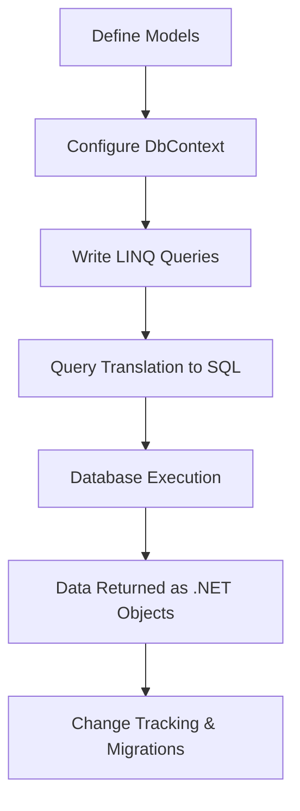
```mermaid
graph TD;
    A[Define Models] --> B[Configure DbContext];
    B --> C[Write LINQ Queries];
    C --> D[Query Translation to SQL];
    D --> E[Database Execution];
    E --> F[Data Returned as .NET Objects];
    F --> G[Change Tracking & Migrations];
```

## 🏁 Conclusion
Entity Framework Core is a powerful ORM for .NET applications that simplifies database interactions, supports multiple databases, and provides high performance. By abstracting database access and leveraging LINQ, it makes database management intuitive and efficient for developers. EF Core is a key tool for modern .NET development, enabling efficient data access in a wide range of applications, from small projects to large-scale enterprise solutions.

## 📚 References
- [📖 Microsoft Documentation](https://docs.microsoft.com/en-us/ef/core/)
- [🔗 EF Core GitHub Repository](https://github.com/dotnet/efcore)

---
# 🚀 .NET CLI (Command Line Interface) in .NET Development
## 📌 Introduction
The **.NET CLI (Command Line Interface)** is a cross-platform tool that allows developers to create, build, run, test, and deploy .NET applications directly from the command line. It eliminates the need for a full IDE, making it a powerful tool for automation, CI/CD pipelines, cloud environments, and lightweight development workflows.
By leveraging .NET CLI, developers can efficiently manage dependencies, execute builds, and deploy applications across different platforms, such as:
- 🖥️ **Windows**
- 🐧 **Linux**
- 🍏 **macOS**

## 🔑 Key Features of .NET CLI
| Feature                 | Description                                                                                                  |
|-------------------------|--------------------------------------------------------------------------------------------------------------|
| 🚀 **Cross-Platform**      | Works on Windows, macOS, and Linux, enabling flexible development.                                           |
| 🔧 **Automation-Friendly** | Easily integrates into CI/CD pipelines and scriptable environments.                                        |
| ⚡ **Lightweight**         | Provides minimal installation compared to full IDEs, ideal for fast setups.                                |
| 📦 **Template-Driven**    | Offers multiple project templates (console, web, class library, etc.) to jumpstart development.           |
| 🏗️ **Extensible**         | Supports additional tools and custom commands via NuGet packages and scripts.                           |
| 🔍 **Dependency Management** | Allows easy addition, removal, and updating of NuGet packages within projects.                          |
| 🛠️ **Testing and Deployment** | Supports unit testing, integration testing, and publishing applications efficiently.                   |

## 📥 Installing .NET CLI
.NET CLI is bundled with the .NET SDK. To check if it's installed, open a terminal and run:

```sh
dotnet --version
```

If .NET SDK is not installed, download it from:
👉 [Download .NET SDK](https://dotnet.microsoft.com/en-us/download)

## 🏗️ Commonly Used .NET CLI Commands
| Command | Description |
|---------|-------------|
| `dotnet --version` | Displays the installed .NET SDK version. |
| `dotnet new <template>` | Creates a new project from a specified template. |
| `dotnet restore` | Restores dependencies and project-specific tools. |
| `dotnet build` | Compiles the project and generates binaries. |
| `dotnet run` | Runs the application from source code. |
| `dotnet test` | Executes unit tests using a test framework. |
| `dotnet publish` | Packages the application for deployment. |
| `dotnet add package <package-name>` | Adds a NuGet package to the project. |
| `dotnet remove package <package-name>` | Removes a NuGet package from the project. |
| `dotnet list package` | Lists installed NuGet packages. |

## 🏗️ Creating, Building, and Running a .NET Application
### 1️⃣ Creating a New .NET Project
To create a new console application, run:

```sh
dotnet new console -o MyConsoleApp
cd MyConsoleApp
```

This generates a directory `MyConsoleApp` with a basic console app structure.

### 2️⃣ Restoring Dependencies
After modifying the `csproj` file or adding dependencies, restore them using:

```sh
dotnet restore
```

### 3️⃣ Building a .NET Project
To compile and build your application, run:

```sh
dotnet build
```

This generates compiled output files in the `bin` directory.

### 4️⃣ Running a .NET Application
To execute a .NET application, use:

```sh
dotnet run
```

## 🛠️ Managing Dependencies
### ➕ Adding a NuGet Package

```sh
dotnet add package Newtonsoft.Json
```

### 🗑️ Removing a Package

```sh
dotnet remove package Newtonsoft.Json
```

### 📦 Listing Installed Packages

```sh
dotnet list package
```

## 🧪 Running Tests
If the project contains unit tests, execute:

```sh
dotnet test
```

This runs all tests in the project and outputs the results to the terminal.

## 🌍 Publishing a .NET Application
To publish a self-contained application for deployment, use:

```sh
dotnet publish -c Release -r win-x64 --self-contained true
```

This generates a publishable binary inside the `publish` directory, ready for deployment.

## 📊 .NET CLI Workflow Diagram

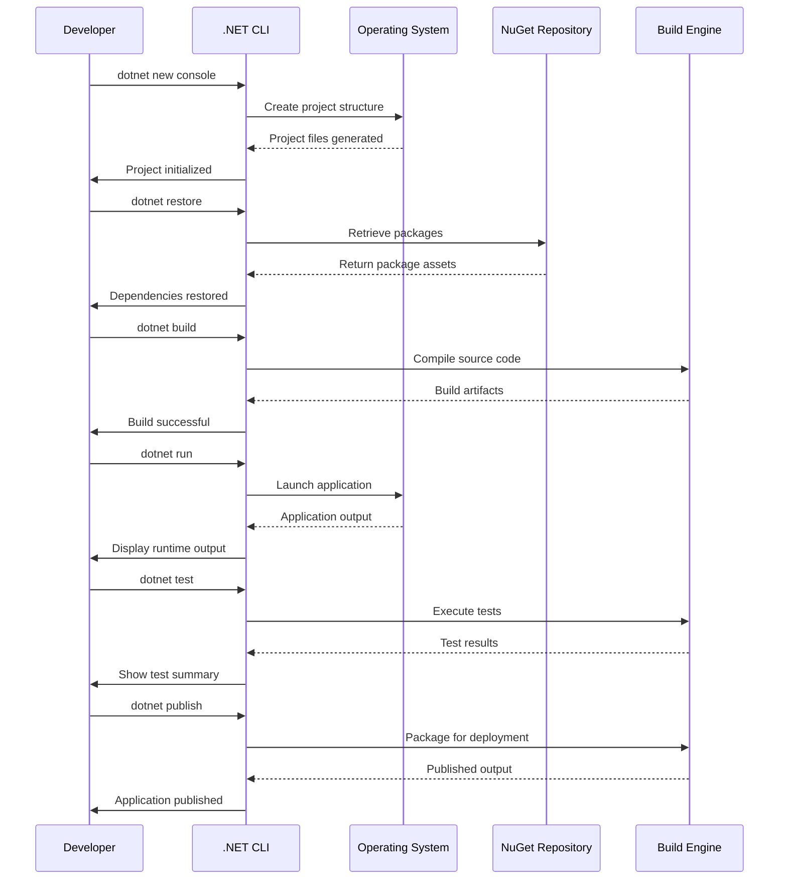
```mermaid
sequenceDiagram
    participant Dev as Developer
    participant CLI as .NET CLI
    participant OS as Operating System
    participant Repo as NuGet Repository
    participant Build as Build Engine

    Dev->>CLI: dotnet new console
    CLI->>OS: Create project structure
    OS-->>CLI: Project files generated
    CLI->>Dev: Project initialized

    Dev->>CLI: dotnet restore
    CLI->>Repo: Retrieve packages
    Repo-->>CLI: Return package assets
    CLI->>Dev: Dependencies restored

    Dev->>CLI: dotnet build
    CLI->>Build: Compile source code
    Build-->>CLI: Build artifacts
    CLI->>Dev: Build successful

    Dev->>CLI: dotnet run
    CLI->>OS: Launch application
    OS-->>CLI: Application output
    CLI->>Dev: Display runtime output

    Dev->>CLI: dotnet test
    CLI->>Build: Execute tests
    Build-->>CLI: Test results
    CLI->>Dev: Show test summary

    Dev->>CLI: dotnet publish
    CLI->>Build: Package for deployment
    Build-->>CLI: Published output
    CLI->>Dev: Application published
```

## 🏁 Conclusion
.NET CLI is a powerful and essential tool for .NET developers. It enables efficient project management, dependency handling, building, testing, and deployment, making it indispensable for modern development workflows. By mastering .NET CLI, developers can streamline development, automate tasks, and enhance productivity across different environments.

## 📚 References
- [📖 Official .NET CLI Documentation](https://docs.microsoft.com/en-us/dotnet/core/tools/)
- [🔗 Download .NET SDK](https://dotnet.microsoft.com/en-us/download)

---
# 🚀 Code First vs Database First Development in .NET
## 📌 Introduction
In **.NET development**, particularly with **Entity Framework Core (EF Core)**, developers have two primary approaches for working with databases:
1. **Code First Development**
2. **Database First Development**
Each approach has distinct benefits and is suited for different scenarios. This guide explores both methodologies, their characteristics, advantages, disadvantages, and practical use cases. By the end, you'll have a clear understanding of when and how to use each approach effectively.

## 🏗️ Code First Development
### 📌 What is Code First?
The **Code First** approach allows developers to define the database schema using **C# entity classes**. EF Core then generates the database structure based on these classes. This approach is ideal when starting a new project without an existing database.

### 🔍 Key Characteristics
- ✅ Database schema is **generated from entity classes**.
- ✅ Developers manage database structure using **migrations**.
- ✅ Ideal for **greenfield projects** (new applications).
- ✅ Changes to the schema are **tracked within the source code**.
- ❌ Requires developers to manage database creation and migration manually.

### 🏗️ How to Use Code First
#### Step 1️⃣: Define Entity Classes
Create a `Product` class representing a table in the database:
```csharp
public class Product
{
    public int Id { get; set; }
    public string Name { get; set; }
    public decimal Price { get; set; }
}
```

#### Step 2️⃣: Create a DbContext
Define a `DbContext` class to manage database connections:

```csharp
public class ApplicationDbContext : DbContext
{
    public DbSet<Product> Products { get; set; }

    protected override void OnConfiguring(DbContextOptionsBuilder options)
    {
        options.UseSqlServer("Server=.;Database=ShopDB;Trusted_Connection=True;");
    }
}
```

#### Step 3️⃣: Apply Migrations and Create the Database
Use the following commands to generate the database schema:

```sh
dotnet ef migrations add InitialCreate
dotnet ef database update
```

#### Step 4️⃣: CRUD Operations
```csharp
using (var context = new ApplicationDbContext())
{
    var product = new Product { Name = "Laptop", Price = 1200.50m };
    context.Products.Add(product);
    context.SaveChanges();
}
```

## 🏛️ Database First Development
### 📌 What is Database First?
The **Database First** approach is used when the database schema **already exists**, and entity classes are generated based on the existing structure. This is useful for integrating legacy databases or when the schema is designed separately.

### 🔍 Key Characteristics
- ✅ The database schema **exists first**, and entity classes are generated from it.
- ✅ Uses **reverse engineering** to create models from the database.
- ✅ Ideal for **working with existing databases**.
- ✅ Reduces the need to manually define migrations.
- ❌ Less flexible, as database changes require **re-scaffolding**.

### 🏗️ How to Use Database First
#### Step 1️⃣: Install EF Core Tools
Run the following command to install Entity Framework Core tools:

```sh
dotnet tool install --global dotnet-ef
```

#### Step 2️⃣: Generate Entity Classes from Database
Use the following command to scaffold entity classes from an existing database:

```sh
dotnet ef dbcontext scaffold "Server=.;Database=ShopDB;Trusted_Connection=True;" Microsoft.EntityFrameworkCore.SqlServer -o Models
```

This generates the `Models` folder with entity classes corresponding to database tables.

#### Step 3️⃣: Use the Generated Context
Once the entity classes are generated, use them in your application:
```csharp
using (var context = new ApplicationDbContext())
{
    var products = context.Products.ToList();
    foreach (var product in products)
    {
        Console.WriteLine($"{product.Id} - {product.Name} - {product.Price}");
    }
}
```

## 🔄 Comparison: Code First vs Database First
| Feature | Code First | Database First |
|---------|------------|---------------|
| **Use Case** | New applications | Existing databases |
| **Schema Management** | Defined in C# classes | Defined in SQL |
| **Database Evolution** | Uses migrations | Manual updates |
| **Flexibility** | High (customizable in code) | Limited to database structure |
| **Tooling Support** | Uses EF migrations | Uses reverse engineering |

## 📊 Workflow Diagrams
### Code First Workflow

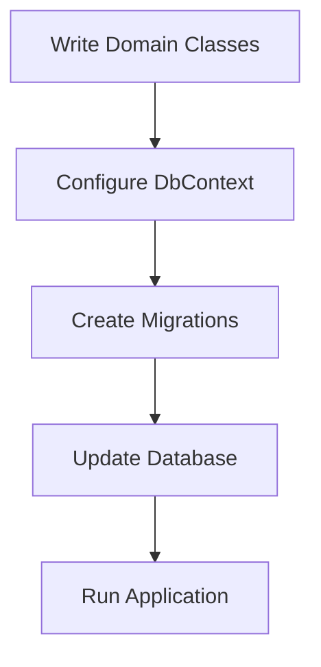
```mermaid
flowchart TD
    A[Write Domain Classes] --> B[Configure DbContext]
    B --> C[Create Migrations]
    C --> D[Update Database]
    D --> E[Run Application]
```

### Database First Workflow

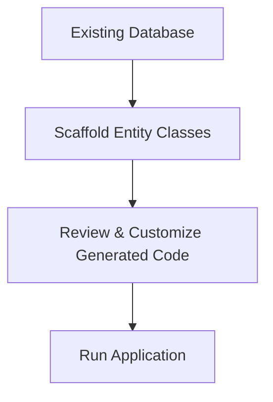
```mermaid
flowchart TD
    A[Existing Database] --> B[Scaffold Entity Classes]
    B --> C[Review & Customize Generated Code]
    C --> D[Run Application]
```

## 🏁 Conclusion
Both **Code First** and **Database First** approaches have advantages depending on the project requirements:
- Use **Code First** when starting a new project and managing schema in C#.
- Use **Database First** when working with an existing database that must remain unchanged.
By understanding these approaches, developers can choose the best strategy to fit their application’s needs.

## 📚 References
- [Microsoft Documentation - EF Core](https://learn.microsoft.com/en-us/ef/core/)
- [Entity Framework Core GitHub Repository](https://github.com/dotnet/efcore)

---
# 🚀 Database Migrations in .NET Development
## 📌 Introduction
**Database migrations** in .NET development, particularly with **Entity Framework Core (EF Core)**, provide a mechanism to manage database schema changes systematically. Instead of manually altering database tables, migrations allow developers to modify and evolve their database structure while ensuring that the database remains in sync with the application’s data model.
Migrations facilitate version control, making it easier to track database changes, roll back modifications if needed, and streamline the deployment process across different environments.

## 🔍 Key Characteristics of Database Migrations
| Feature                 | Description |
|-------------------------|-------------|
| ✅ **Schema Automation** | Apply, modify, or delete tables and columns without manual SQL scripting. |
| 🔄 **Version Control**  | Track database schema changes incrementally, ensuring structured evolution. |
| 🌍 **Multi-Database Support** | Compatible with SQL Server, PostgreSQL, MySQL, SQLite, and more. |
| ⚡ **CI/CD Integration** | Automate database updates in development, staging, and production environments. |
| 🛠 **Rollback Support** | Enables rolling back schema changes to a previous state when needed. |

## 🏗️ Setting Up Migrations in EF Core
### 1️⃣ Install EF Core Tools
Ensure EF Core is installed in your .NET project. If not, install it with the following commands:

```sh
# Install EF Core CLI Tool
dotnet tool install --global dotnet-ef

# Install EF Core SQL Server Provider
dotnet add package Microsoft.EntityFrameworkCore.SqlServer
```

### 2️⃣ Creating an Initial Migration
Define a **DbContext** class representing the database connection:
```csharp
public class ApplicationDbContext : DbContext
{
    public DbSet<Product> Products { get; set; }

    protected override void OnConfiguring(DbContextOptionsBuilder options)
    {
        options.UseSqlServer("Server=.;Database=ShopDB;Trusted_Connection=True;");
    }
}
```

Now, create the first migration:

```sh
dotnet ef migrations add InitialCreate
```

This command generates a **Migrations** folder containing:
- `YYYYMMDDHHMMSS_InitialCreate.cs` – Defines schema changes.
- `ApplicationDbContextModelSnapshot.cs` – Represents the latest schema snapshot.

### 3️⃣ Applying the Migration to the Database
Once a migration is created, apply it using:

```sh
dotnet ef database update
```

This command updates the database schema to match the migration script.

### 4️⃣ Adding New Migrations
If changes are made to the model (e.g., adding a new column `Category` to `Product`):
```csharp
public class Product
{
    public int Id { get; set; }
    public string Name { get; set; }
    public decimal Price { get; set; }
    public string Category { get; set; }  // New column added
}
```
Generate a new migration:

```sh
dotnet ef migrations add AddCategoryColumn
```

Apply the changes to the database:

```sh
dotnet ef database update
```

### 5️⃣ Reverting Migrations
To revert the last migration:

```sh
dotnet ef migrations remove
```

To roll back to a specific migration:

```sh
dotnet ef database update PreviousMigrationName
```

## 📊 Understanding Migration Files
| File | Description |
|------|-------------|
| `YYYYMMDDHHMMSS_MigrationName.cs` | Defines schema changes. |
| `ApplicationDbContextModelSnapshot.cs` | Represents the latest schema snapshot. |
| `MigrationsHistoryTable` | A special table in the database that tracks applied migrations. |

## 🌍 Using Migrations in Production
- 📌 Use **CI/CD pipelines** to automate migrations.
- 📌 Apply migrations **before deploying** the application.
- 📌 Keep **database backups** before running new migrations.
- 📌 Use **transactional migrations** to prevent partial updates in case of errors.

## 🔄 Migration Workflow Diagram (Sequence Diagram)

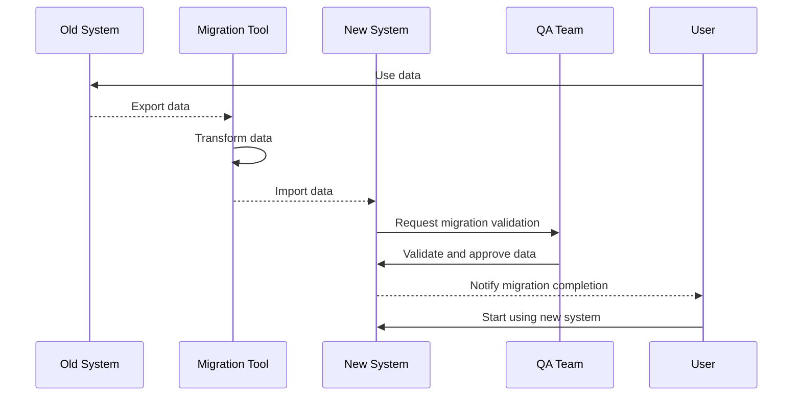
```mermaid
sequenceDiagram
    participant OldSystem as Old System
    participant MigrationTool as Migration Tool
    participant NewSystem as New System
    participant QA as QA Team
    participant User as User

    User->>OldSystem: Use data
    OldSystem-->>MigrationTool: Export data
    MigrationTool->>MigrationTool: Transform data
    MigrationTool-->>NewSystem: Import data
    NewSystem->>QA: Request migration validation
    QA->>NewSystem: Validate and approve data
    NewSystem-->>User: Notify migration completion
    User->>NewSystem: Start using new system
```

## 🏁 Conclusion
Database migrations in .NET development simplify schema changes, allowing applications to evolve without manual database modifications. They enhance version control, ensure consistency across environments, and streamline database updates.

By integrating EF Core migrations into the development workflow, teams can maintain robust and scalable applications while keeping database structures versioned and synchronized.

## 📚 References
- [Microsoft Documentation - Migrations](https://learn.microsoft.com/en-us/ef/core/managing-schemas/migrations/)

---
# 🚀 Seeding Data in Database using .NET Development
## 📌 Introduction
**Seeding data** in .NET development refers to the process of **pre-populating a database** with initial values when the database is created or migrated. This is commonly used to set up reference data, default configurations, or test data to ensure the application has the necessary information when it starts.
Entity Framework Core (EF Core) provides a built-in mechanism for seeding data during migrations, ensuring that required data is available without requiring manual insertion. This document will guide you through various approaches to database seeding using **migrations** and **runtime seeding**.

## 🔍 Key Characteristics of Data Seeding
| Feature | Description |
|---------|-------------|
| ✅ **Automatic Data Insertion** | Ensures data is inserted automatically when the database is created or migrated. |
| 🔄 **Idempotent Execution** | Prevents duplicate records by checking existing data. |
| 🌍 **Supports Multiple Databases** | Works with SQL Server, PostgreSQL, MySQL, SQLite, etc. |
| ⚡ **Useful for Default Data** | Ideal for roles, categories, admin users, etc. |
| 🔧 **Supports Versioning** | Seed data can evolve through migrations. |

## ⚙️ Implementing Data Seeding in EF Core
### 📌 1. Adding Seed Data in the `OnModelCreating` Method
EF Core allows you to seed data by overriding the `OnModelCreating` method in your `DbContext` class.
#### Example: Seeding a `Products` Table
```csharp
public class ApplicationDbContext : DbContext
{
    public DbSet<Product> Products { get; set; }

    protected override void OnModelCreating(ModelBuilder modelBuilder)
    {
        modelBuilder.Entity<Product>().HasData(
            new Product { Id = 1, Name = "Laptop", Price = 1200.00m },
            new Product { Id = 2, Name = "Smartphone", Price = 800.00m },
            new Product { Id = 3, Name = "Tablet", Price = 500.00m }
        );
    }
}
```
### 🔄 2. Applying Migrations
After adding seed data, generate a migration and apply it:

```sh
dotnet ef migrations add SeedProducts
dotnet ef database update
```

This migration ensures that the seed data is inserted into the database.

## ✏️ Seeding Related Entities
If there are relationships between tables, you need to ensure proper foreign key values.
#### Example: Seeding `Categories` and `Products`
```csharp
public class ApplicationDbContext : DbContext
{
    public DbSet<Category> Categories { get; set; }
    public DbSet<Product> Products { get; set; }

    protected override void OnModelCreating(ModelBuilder modelBuilder)
    {
        modelBuilder.Entity<Category>().HasData(
            new Category { Id = 1, Name = "Electronics" },
            new Category { Id = 2, Name = "Appliances" }
        );

        modelBuilder.Entity<Product>().HasData(
            new Product { Id = 1, Name = "Laptop", Price = 1200.00m, CategoryId = 1 },
            new Product { Id = 2, Name = "Washing Machine", Price = 700.00m, CategoryId = 2 }
        );
    }
}
```
This ensures that `Products` reference the `Category` table correctly.

## 📦 Alternative Approach: Seeding Data at Application Startup
Instead of migrations, you can seed data when the application starts using `IServiceProvider`.
### Example: Seeding Users in `Program.cs`
```csharp
using (var scope = app.Services.CreateScope())
{
    var context = scope.ServiceProvider.GetRequiredService<ApplicationDbContext>();
    if (!context.Users.Any())
    {
        context.Users.Add(new User { Id = 1, Name = "Admin", Role = "Administrator" });
        context.SaveChanges();
    }
}
```

This method is useful for dynamic seeding without modifying migrations.
## 📊 Comparison: Migrations vs Runtime Seeding
| Feature | Migrations Seeding | Runtime Seeding |
|---------|----------------|----------------|
| **When Applied?** | During migrations | At application startup |
| **Ensures Data Integrity?** | Yes | Not enforced |
| **Flexible Data Updates?** | Requires migration updates | Can be changed dynamically |
| **Best For** | Static default data | Dynamic or user-configurable data |

## 📊 Data Seeding Workflow Diagram (Sequence Diagram)

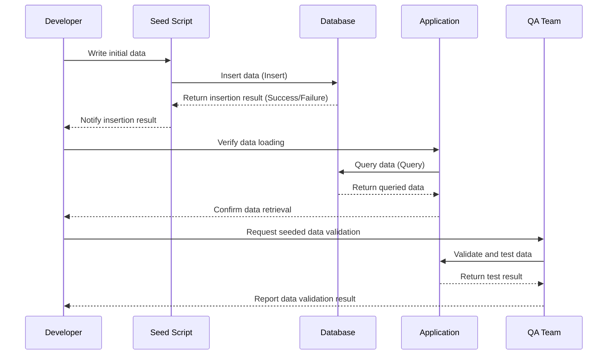
```mermaid
sequenceDiagram
    participant Developer as Developer
    participant SeedScript as Seed Script
    participant Database as Database
    participant App as Application
    participant QA as QA Team

    Developer->>SeedScript: Write initial data
    SeedScript->>Database: Insert data (Insert)
    Database-->>SeedScript: Return insertion result (Success/Failure)
    SeedScript-->>Developer: Notify insertion result
    Developer->>App: Verify data loading
    App->>Database: Query data (Query)
    Database-->>App: Return queried data
    App-->>Developer: Confirm data retrieval
    Developer->>QA: Request seeded data validation
    QA->>App: Validate and test data
    App-->>QA: Return test result
    QA-->>Developer: Report data validation result
```

## 🏁 Conclusion
Seeding data in .NET ensures that applications start with essential data, reducing manual effort and improving consistency. Whether using **EF Core migrations** or **runtime seeding**, the right approach depends on project requirements.
For **static, version-controlled data**, use migrations. For **dynamic, configurable data**, seed during application startup.

---
# 🚀 Data Models in .NET Development
## 📌 Introduction
In **.NET development**, **Data Models** define how data is structured, stored, and manipulated within an application. These models are essential for ensuring data integrity, consistency, and efficiency. **Entity Framework Core (EF Core)** enables developers to interact with databases using C# objects rather than raw SQL queries, streamlining development and maintaining cleaner code.
A well-designed **data model** enhances application scalability, maintainability, and performance by reducing redundancy and optimizing data retrieval.

## 🔍 Key Characteristics of Data Models
| Feature | Description |
|---------|-------------|
| ✅ **Defines Data Structure** | Specifies properties, types, and relationships. |
| ✅ **Ensures Data Integrity** | Uses constraints like primary keys, foreign keys, and validations. |
| ✅ **Facilitates Data Manipulation** | Supports CRUD (Create, Read, Update, Delete) operations. |
| ✅ **Works with ORMs** | Maps objects to database records using frameworks like EF Core. |
| ✅ **Supports Different Database Providers** | Works with SQL Server, MySQL, PostgreSQL, SQLite, etc. |
| ✅ **Enhances Performance** | Optimized queries and indexing strategies improve efficiency. |
| ✅ **Ensures Scalability** | Structures data to support large-scale applications. |

## 📌 Types of Data Models in .NET
### 1️⃣ **Conceptual Data Model**
Represents high-level business entities and relationships, often independent of specific technology or database. This model is typically used in requirement analysis and system design phases.

Example:
```plaintext
Customer → Order → Product
```

### 2️⃣ **Logical Data Model**
Defines entities, attributes, and relationships in more detail but is still independent of database implementation. This model is more structured and acts as a blueprint for physical implementation.

Example:
```plaintext
Customer (Id, Name, Email)
Order (Id, OrderDate, CustomerId)
Product (Id, Name, Price)
```

### 3️⃣ **Physical Data Model**
Maps the logical model to an actual database schema, including table definitions, columns, indexes, and constraints. It determines how data is stored, retrieved, and managed in the database.

Example (SQL Schema):
```sql
CREATE TABLE Customers (
    Id INT PRIMARY KEY,
    Name NVARCHAR(100),
    Email NVARCHAR(255) UNIQUE
);
```

## ⚙️ Implementing Data Models in .NET using EF Core
### 🏗️ 1. Defining a Data Model Class
In **Entity Framework Core**, data models are defined using **C# classes**. Each class represents a table in the database.
#### Example: `Product` Entity
```csharp
public class Product
{
    public int Id { get; set; }
    public string Name { get; set; }
    public decimal Price { get; set; }
    public DateTime CreatedDate { get; set; } // New property added
}
```

### 🔄 2. Creating a DbContext
A `DbContext` class manages the database connection and interactions.
```csharp
public class ApplicationDbContext : DbContext
{
    public DbSet<Product> Products { get; set; }

    protected override void OnConfiguring(DbContextOptionsBuilder options)
    {
        options.UseSqlServer("Server=.;Database=ShopDB;Trusted_Connection=True;");
    }
}
```

### 📌 3. Applying Migrations
To create the database schema based on the data model:

```sh
dotnet ef migrations add InitialCreate
dotnet ef database update
```

This generates a **Products** table in the database.

## 📊 Data Models and Relationships
Data models support relationships like:
### 1️⃣ **One-to-One Relationship**
Example: Each `User` has one `Profile`.
```csharp
public class User
{
    public int Id { get; set; }
    public string Name { get; set; }
    public Profile Profile { get; set; }
}

public class Profile
{
    public int Id { get; set; }
    public string Address { get; set; }
    public int UserId { get; set; }
    public User User { get; set; }
}
```

### 2️⃣ **One-to-Many Relationship**
Example: A `Category` can have multiple `Products`.
```csharp
public class Category
{
    public int Id { get; set; }
    public string Name { get; set; }
    public List<Product> Products { get; set; }
}
```

### 3️⃣ **Many-to-Many Relationship**
Example: A `Student` can enroll in multiple `Courses`.
```csharp
public class Student
{
    public int Id { get; set; }
    public string Name { get; set; }
    public List<Course> Courses { get; set; }
}

public class Course
{
    public int Id { get; set; }
    public string Title { get; set; }
    public List<Student> Students { get; set; }
}
```

## 🔍 Data Annotations vs Fluent API
EF Core provides two ways to configure data models:
| Feature | Data Annotations | Fluent API |
|---------|----------------|------------|
| **Definition** | Uses attributes in entity classes | Uses `OnModelCreating` method |
| **Usage** | Simple configuration | More advanced customization |
| **Example** | `[Required]`, `[Key]`, `[MaxLength(50)]` | `modelBuilder.Entity<Product>().Property(p => p.Name).IsRequired();` |

### 📌 Example: Using Data Annotations
```csharp
public class Product
{
    [Key]
    public int Id { get; set; }
    [Required]
    [MaxLength(100)]
    public string Name { get; set; }
    [Column(TypeName = "decimal(18,2)")]
    public decimal Price { get; set; }
    public DateTime CreatedDate { get; set; }
}
```

### 📌 Example: Using Fluent API
```csharp
protected override void OnModelCreating(ModelBuilder modelBuilder)
{
    modelBuilder.Entity<Product>()
        .Property(p => p.Name)
        .IsRequired()
        .HasMaxLength(100);
}
```

## 🏁 Conclusion
Data models are fundamental in .NET development, defining how data is structured, stored, and managed. Whether using **Entity Framework Core** or raw SQL, a well-designed data model improves application maintainability, performance, and scalability.
Choosing the right modeling approach—**Conceptual, Logical, or Physical**—and configuring relationships properly ensures efficient data handling in modern applications. By implementing best practices such as data integrity constraints, performance optimization, and scalability considerations, developers can build robust and efficient systems.

---
# 🚀 Database Context in .NET Development
## 📌 Introduction
In **.NET development**, **Database Context** (commonly referred to as `DbContext` in **Entity Framework Core**) is the bridge between your application and the database. It allows developers to interact with a database using **C# objects** instead of raw SQL queries. The `DbContext` class is a crucial component of **Entity Framework Core (EF Core)**, providing an abstraction layer for database operations.
A well-configured `DbContext` ensures **efficient data access, transaction management, and scalability**, making it a fundamental aspect of **modern .NET applications**.

## 🔍 Key Characteristics of `DbContext`
| Feature | Description |
|---------|-------------|
| ✅ **Manages Database Connections** | Handles opening and closing database connections. |
| ✅ **Tracks Changes** | Keeps track of entity changes and updates them in the database. |
| ✅ **Provides Query Capabilities** | Allows LINQ-based querying of the database. |
| ✅ **Manages Transactions** | Ensures atomicity of operations. |
| ✅ **Works with Multiple Database Providers** | Supports SQL Server, PostgreSQL, MySQL, SQLite, and more. |
| ✅ **Facilitates Dependency Injection** | Can be injected into services for better code organization. |

## 📌 Defining a Database Context in EF Core
To use a `DbContext`, you must define a class that inherits from `DbContext` and specify **DbSet properties** that represent database tables.
### Example: Defining `ApplicationDbContext`
```csharp
using Microsoft.EntityFrameworkCore;

public class ApplicationDbContext : DbContext
{
    public DbSet<Product> Products { get; set; }
    public DbSet<Category> Categories { get; set; }

    protected override void OnConfiguring(DbContextOptionsBuilder options)
    {
        options.UseSqlServer("Server=.;Database=ShopDB;Trusted_Connection=True;");
    }
}
```
### Explanation:
- The `DbSet<Product>` and `DbSet<Category>` represent tables in the database.
- `OnConfiguring()` method is used to define the **database connection string**.
- `UseSqlServer()` specifies **SQL Server** as the database provider.

## 🔄 Registering `DbContext` in Dependency Injection
To properly manage database context in an **ASP.NET Core application**, register it in the **Dependency Injection (DI) container** within `Program.cs`.
### Example: Adding `DbContext` in `Program.cs`
```csharp
using Microsoft.EntityFrameworkCore;
using Microsoft.Extensions.DependencyInjection;

var builder = WebApplication.CreateBuilder(args);

// Register DbContext with SQL Server
builder.Services.AddDbContext<ApplicationDbContext>(options =>
    options.UseSqlServer(builder.Configuration.GetConnectionString("DefaultConnection")));

var app = builder.Build();
app.Run();
```
### Explanation:
- `AddDbContext<TContext>()` registers the `DbContext` in the dependency injection system.
- The connection string is retrieved from the **configuration file (`appsettings.json`)**.

## 📊 Understanding `DbSet` and Querying Data
The `DbSet<T>` property in `DbContext` represents a table in the database. You can perform **CRUD operations** using LINQ.
### Example: Performing CRUD Operations
#### 1️⃣ **Adding Data**
```csharp
using (var context = new ApplicationDbContext())
{
    var product = new Product { Name = "Laptop", Price = 1200.00m };
    context.Products.Add(product);
    context.SaveChanges();
}
```

#### 2️⃣ **Retrieving Data**
```csharp
using (var context = new ApplicationDbContext())
{
    var products = context.Products.ToList();
    foreach (var product in products)
    {
        Console.WriteLine($"{product.Id}: {product.Name} - ${product.Price}");
    }
}
```

#### 3️⃣ **Updating Data**
```csharp
using (var context = new ApplicationDbContext())
{
    var product = context.Products.FirstOrDefault(p => p.Id == 1);
    if (product != null)
    {
        product.Price = 999.99m;
        context.SaveChanges();
    }
}
```

#### 4️⃣ **Deleting Data**
```csharp
using (var context = new ApplicationDbContext())
{
    var product = context.Products.FirstOrDefault(p => p.Id == 1);
    if (product != null)
    {
        context.Products.Remove(product);
        context.SaveChanges();
    }
}
```

## 🔍 Managing Transactions with `DbContext`
EF Core provides built-in support for **transactions**, allowing multiple operations to be executed atomically.
### Example: Using Transactions
```csharp
using (var context = new ApplicationDbContext())
{
    using var transaction = context.Database.BeginTransaction();
    try
    {
        var product = new Product { Name = "Tablet", Price = 400.00m };
        context.Products.Add(product);
        context.SaveChanges();
        
        var category = new Category { Name = "Electronics" };
        context.Categories.Add(category);
        context.SaveChanges();
        
        transaction.Commit();
    }
    catch
    {
        transaction.Rollback();
    }
}
```
### Explanation:
- `BeginTransaction()` starts a database transaction.
- `Commit()` saves all operations atomically.
- `Rollback()` reverts changes if an error occurs.

## 📌 Best Practices for Using `DbContext`
| Best Practice | Description |
|--------------|-------------|
| **Use Dependency Injection** | Always inject `DbContext` instead of creating new instances manually. |
| **Dispose Context Properly** | Use `using` statements or scoped lifetime to manage context efficiently. |
| **Avoid Long-Lived Contexts** | Keep `DbContext` short-lived to prevent memory leaks. |
| **Use Asynchronous Methods** | Prefer async methods like `SaveChangesAsync()` for better performance. |
| **Optimize Queries** | Retrieve only necessary data using `.Select()` and `.AsNoTracking()`. |

## 📊 Database Context Workflow Diagram

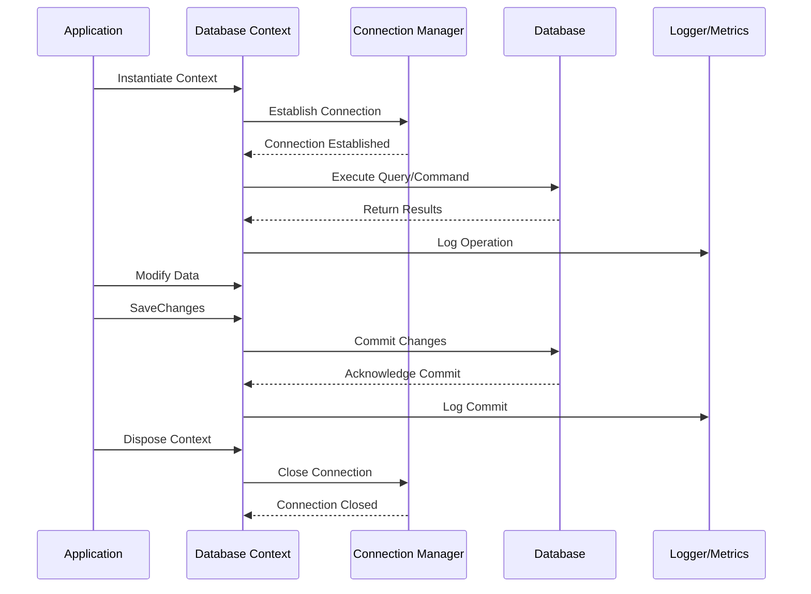
```mermaid
sequenceDiagram
    participant App as Application
    participant DbCtx as Database Context
    participant Conn as Connection Manager
    participant DB as Database
    participant Logger as Logger/Metrics

    App->>DbCtx: Instantiate Context
    DbCtx->>Conn: Establish Connection
    Conn-->>DbCtx: Connection Established
    DbCtx->>DB: Execute Query/Command
    DB-->>DbCtx: Return Results
    DbCtx->>Logger: Log Operation
    App->>DbCtx: Modify Data
    App->>DbCtx: SaveChanges
    DbCtx->>DB: Commit Changes
    DB-->>DbCtx: Acknowledge Commit
    DbCtx->>Logger: Log Commit
    App->>DbCtx: Dispose Context
    DbCtx->>Conn: Close Connection
    Conn-->>DbCtx: Connection Closed
```
### 📌Explanation:
- Instantiation: The application starts by creating a new instance of the Database Context.
- Connection Establishment: The context asks the Connection Manager to open a connection to the Database. Once established, the connection is ready for operations.
- Operations Execution: The Database Context sends commands or queries to the Database, which processes these requests and returns results.
- Logging: Each operation, including query execution and data modifications, is logged by the Logger/Metrics component.
- Data Modification and Commit: When the application modifies data and invokes SaveChanges, the context sends the changes to the Database for commitment. The Database then acknowledges the commit.
- Disposal: After operations are complete, the application disposes of the Database Context, prompting the Connection Manager to close the open connection, ensuring resource cleanup.

## 🏁 Conclusion
The **Database Context (`DbContext`)** is a fundamental part of **Entity Framework Core**, acting as the gateway between the .NET application and the database. It provides **querying, data manipulation, and transaction management** while ensuring efficient database operations.
Understanding how to correctly configure, use, and optimize `DbContext` is crucial for building high-performance and maintainable applications.

---
# 🚀 Database Support in .NET Development
## 📌 Introduction
In .NET development, **Database Support** refers to the built-in capabilities of the .NET framework to interact with various types of databases. .NET provides multiple ways to connect, query, and manipulate databases efficiently. From **ADO.NET** for direct database interactions to **Entity Framework Core (EF Core)** for Object-Relational Mapping (ORM), .NET ensures that developers have robust tools to manage data.
Understanding how .NET supports different databases, their characteristics, and how to use them effectively is crucial for developing **scalable** and **maintainable** applications.

## 🔍 Key Characteristics of Database Support in .NET
| Feature | Description |
|---------|-------------|
| ✅ **Multi-Database Support** | Compatible with relational (SQL) and non-relational (NoSQL) databases. |
| ✅ **Multiple Access Methods** | Supports ADO.NET, Entity Framework Core, and Dapper for database interactions. |
| ✅ **Cross-Platform Compatibility** | .NET Core and .NET 6+ support Linux, Windows, and macOS databases. |
| ✅ **ORM Support** | Provides high-level abstraction via Entity Framework Core. |
| ✅ **Security and Performance Optimization** | Includes features like connection pooling, parameterized queries, and transactions. |

## 📌 Types of Database Support in .NET
### 1️⃣ **Relational Databases (SQL-Based)**
Relational databases store structured data in tables with defined relationships. .NET supports:
- **Microsoft SQL Server**
- **MySQL**
- **PostgreSQL**
- **SQLite**
- **Oracle Database**

### 2️⃣ **NoSQL Databases (Non-Relational)**
NoSQL databases store data in flexible formats such as JSON or key-value pairs. .NET supports:
- **MongoDB**
- **Cassandra**
- **Cosmos DB**
- **Redis**

## ⚙️ Connecting to a Database in .NET
### 🏗️ 1. Using ADO.NET (Low-Level Access)
ADO.NET provides direct control over database connections, commands, and transactions.
#### Example: Connecting to SQL Server
```csharp
using System;
using System.Data.SqlClient;

string connectionString = "Server=localhost;Database=ShopDB;Trusted_Connection=True;";

using (SqlConnection connection = new SqlConnection(connectionString))
{
    connection.Open();
    Console.WriteLine("Database connected successfully.");
}
```

### 🔄 2. Using Entity Framework Core (High-Level ORM)
Entity Framework Core simplifies database interactions by allowing developers to work with objects instead of raw SQL.
#### Example: Defining a DbContext
```csharp
using Microsoft.EntityFrameworkCore;

public class ApplicationDbContext : DbContext
{
    public DbSet<Product> Products { get; set; }

    protected override void OnConfiguring(DbContextOptionsBuilder options)
    {
        options.UseSqlServer("Server=localhost;Database=ShopDB;Trusted_Connection=True;");
    }
}
```

#### Example: Querying Data with EF Core
```csharp
using (var context = new ApplicationDbContext())
{
    var products = context.Products.ToList();
    foreach (var product in products)
    {
        Console.WriteLine($"{product.Id} - {product.Name} - ${product.Price}");
    }
}
```

## 📊 Comparing ADO.NET, EF Core, and Dapper
| Feature | ADO.NET | Entity Framework Core | Dapper |
|---------|--------|----------------------|--------|
| **Abstraction Level** | Low | High | Medium |
| **Performance** | High | Moderate | High |
| **Ease of Use** | Complex | Easy | Moderate |
| **Supports Transactions** | ✅ | ✅ | ✅ |
| **Ideal For** | High-performance scenarios | Rapid development | Optimized queries |

## 🔍 Managing Database Connections Efficiently
To ensure optimal performance and security, follow these best practices:
1. **Use Connection Pooling** – Reduce overhead by reusing existing connections.
2. **Use Parameterized Queries** – Prevent SQL injection attacks.
3. **Manage Transactions** – Ensure atomic operations using `BeginTransaction()`.
4. **Use Lazy Loading Wisely** – Avoid unnecessary data fetching.
5. **Optimize Queries** – Fetch only required data with `.Select()` and `.AsNoTracking()`.

## 📊 .NET Database Support Architecture

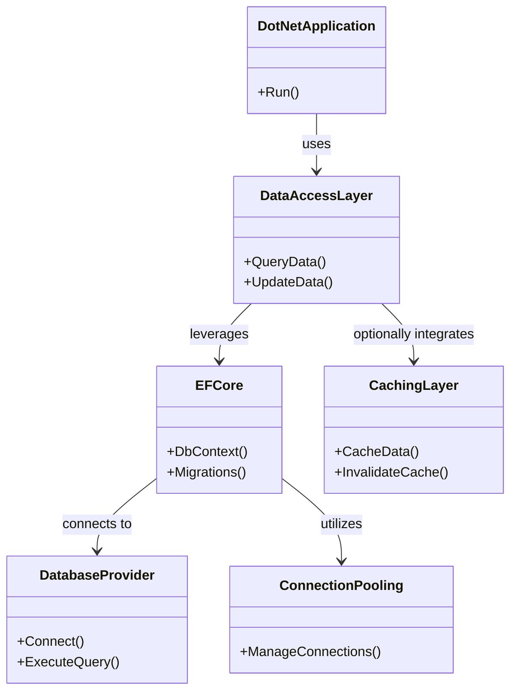
```mermaid
classDiagram
    class DotNetApplication {
      +Run()
    }

    class DataAccessLayer {
      +QueryData()
      +UpdateData()
    }

    class EFCore {
      +DbContext()
      +Migrations()
    }

    class DatabaseProvider {
      +Connect()
      +ExecuteQuery()
    }

    class ConnectionPooling {
      +ManageConnections()
    }

    class CachingLayer {
      +CacheData()
      +InvalidateCache()
    }

    DotNetApplication --> DataAccessLayer : uses
    DataAccessLayer --> EFCore : leverages
    EFCore --> DatabaseProvider : connects to
    EFCore --> ConnectionPooling : utilizes
    DataAccessLayer --> CachingLayer : optionally integrates
```
### 📌Explanation:
- DotNetApplication: Represents the main .NET application that initiates database operations.
- DataAccessLayer: Acts as the intermediary between the application and the database, handling queries and updates.
- EFCore: The ORM that abstracts database operations via the DbContext, also managing migrations.
- DatabaseProvider: Encapsulates specific database technologies (e.g., SQL Server, PostgreSQL) that EF Core connects to.
- ConnectionPooling: Manages the reuse and lifecycle of database connections to optimize performance.
- CachingLayer: Optionally stores frequently accessed data to reduce database load and improve response times.

## 🏁 Conclusion
Database support in .NET is robust and versatile, enabling developers to work with both **relational** and **NoSQL** databases seamlessly. Understanding different database access methods—**ADO.NET** for raw control, **EF Core** for abstraction, and **Dapper** for optimized queries—helps in choosing the right tool for the job.
By following best practices, developers can build **high-performance** and **secure** applications with well-structured database interactions.

---
# 🚀 Migrations in .NET Development
## 📖 Introduction
Migrations in .NET, particularly within **Entity Framework Core (EF Core)**, provide a structured way to manage **database schema changes**. Instead of manually editing SQL scripts, migrations automate and version-control the evolution of your database schema to keep it in sync with your application models.
## 🔍 Key Features of Migrations
| Feature | Description |
|---------|------------|
| ✅ **Automated Schema Management** | Updates the database schema without manual SQL scripts. |
| ✅ **Version Control for Schema** | Each migration is a versioned snapshot of schema changes. |
| ✅ **Rollback Support** | Easily revert to previous versions in case of issues. |
| ✅ **Cross-Database Compatibility** | Works with SQL Server, MySQL, PostgreSQL, SQLite, etc. |
| ✅ **CI/CD Integration** | Ensures database consistency across environments. |

## ⚙️ Setting Up Migrations in EF Core
### 🏗️ 1. Install EF Core Tools
Before creating migrations, install the EF Core CLI:

```sh
dotnet tool install --global dotnet-ef
```

For SQL Server support, add the necessary package:

```sh
dotnet add package Microsoft.EntityFrameworkCore.SqlServer
```

### 📌 2. Define a `DbContext` and Data Model
#### Example: `ApplicationDbContext` with a `Product` Entity
```csharp
using Microsoft.EntityFrameworkCore;

public class ApplicationDbContext : DbContext
{
    public DbSet<Product> Products { get; set; }

    protected override void OnConfiguring(DbContextOptionsBuilder options)
    {
        options.UseSqlServer("Server=localhost;Database=ShopDB;Trusted_Connection=True;");
    }
}

public class Product
{
    public int Id { get; set; }
    public string Name { get; set; }
    public decimal Price { get; set; }
}
```

### 🔄 3. Creating and Applying Migrations
Create an initial migration:

```sh
dotnet ef migrations add InitialCreate
```

Apply the migration to the database:

```sh
dotnet ef database update
```

This executes the migration and updates the database schema.

## ✏️ Modifying Database Schema with Migrations
If you modify the model (e.g., adding a new column), follow these steps:
#### Example: Adding a `Category` Column to `Product`
Modify the `Product` model:
```csharp
public class Product
{
    public int Id { get; set; }
    public string Name { get; set; }
    public decimal Price { get; set; }
    public string Category { get; set; }  // New column added
}
```

Generate a new migration:

```sh
dotnet ef migrations add AddCategoryColumn
```

Update the database:

```sh
dotnet ef database update
```

## 🔄 Reverting Migrations
To remove the last migration before applying it:

```sh
dotnet ef migrations remove
```

To roll back to a specific migration:

```sh
dotnet ef database update PreviousMigrationName
```

## 📊 Understanding Migration Files
Each migration consists of three key files:
| File | Description |
|------|-------------|
| `YYYYMMDDHHMMSS_MigrationName.cs` | Contains schema changes. |
| `ApplicationDbContextModelSnapshot.cs` | Represents the latest schema. |
| `MigrationsHistoryTable` | A database table tracking applied migrations. |

## 📌 Migrations Workflow Diagram

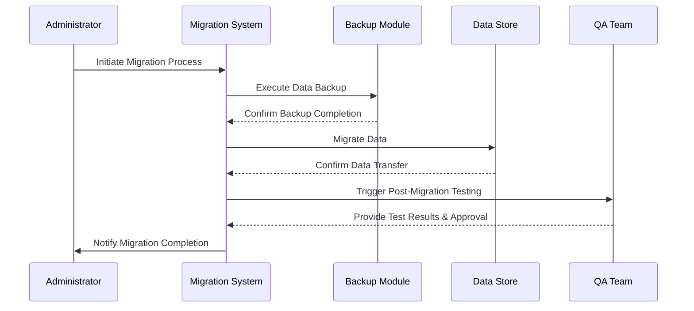
```mermaid
sequenceDiagram
    participant Admin as Administrator
    participant Migrator as Migration System
    participant Backup as Backup Module
    participant Data as Data Store
    participant QA as QA Team

    Admin->>Migrator: Initiate Migration Process
    Migrator->>Backup: Execute Data Backup
    Backup-->>Migrator: Confirm Backup Completion
    Migrator->>Data: Migrate Data
    Data-->>Migrator: Confirm Data Transfer
    Migrator->>QA: Trigger Post-Migration Testing
    QA-->>Migrator: Provide Test Results & Approval
    Migrator->>Admin: Notify Migration Completion
```

### 📌 Explanation:	
- Initiation: The administrator starts the migration process.
- Backup: The migration system calls on the backup module to create a secure backup before any changes.
- Data Migration: Once the backup is confirmed, data is migrated from the old system to the new data store.
- Testing: After the data migration, the system triggers post-migration tests by involving the QA team to validate the success of the migration.
- Completion: Finally, the system notifies the administrator that the migration has been successfully completed.

---
# 🚀 Understanding Up and Down Methods in Database Migrations in .NET Development

## 📖 Introduction

In .NET development, particularly in **Entity Framework Core (EF Core)**, **migrations** allow developers to manage **database schema changes** over time. When a migration is created, it includes two fundamental methods: **Up()** and **Down()**.

These methods define how schema changes are applied and reverted. Understanding their functionality is crucial for **database versioning**, ensuring smooth rollbacks when necessary, and maintaining database integrity.

## 🔍 Key Characteristics of `Up()` and `Down()` Methods
| Feature                 | `Up()` Method | `Down()` Method |
|-------------------------|--------------|---------------|
| **Purpose**            | Apply schema changes (e.g., create tables, modify columns) | Revert schema changes (e.g., drop tables, undo column modifications) |
| **Direction**          | Moves the database schema forward | Rolls back the database schema |
| **Operations**         | Creating tables, adding columns, modifying constraints | Dropping tables, removing columns, reverting constraints |
| **Usage Scenario**     | Deploying new features or updates | Rolling back changes due to errors or testing needs |

## 📌 How `Up()` and `Down()` Methods Work
When a migration is created using EF Core, a **C# migration file** is generated in the **Migrations folder**. This file includes both `Up()` and `Down()` methods.
### Example: Adding a `Products` Table
#### Generated Migration File (`YYYYMMDDHHMMSS_AddProducts.cs`)
```csharp
using Microsoft.EntityFrameworkCore.Migrations;

public partial class AddProducts : Migration
{
    protected override void Up(MigrationBuilder migrationBuilder)
    {
        migrationBuilder.CreateTable(
            name: "Products",
            columns: table => new
            {
                Id = table.Column<int>(nullable: false)
                    .Annotation("SqlServer:Identity", "1, 1"),
                Name = table.Column<string>(nullable: false),
                Price = table.Column<decimal>(nullable: false)
            },
            constraints: table =>
            {
                table.PrimaryKey("PK_Products", x => x.Id);
            });
    }

    protected override void Down(MigrationBuilder migrationBuilder)
    {
        migrationBuilder.DropTable(name: "Products");
    }
}
```

### Explanation:
- **Up() Method**
  - Uses `migrationBuilder.CreateTable()` to create the `Products` table.
  - Defines the schema with `Id`, `Name`, and `Price` columns.
  - Sets `Id` as the primary key.
- **Down() Method**
  - Uses `migrationBuilder.DropTable()` to **remove the table** if the migration is rolled back.

## 🔄 Applying and Reverting Migrations
### 📌 1. Applying Migrations
Once a migration is created, apply it using:

```sh
dotnet ef database update
```

This executes the `Up()` method, modifying the database schema accordingly.

### 📌 2. Rolling Back a Migration
To undo the last migration before applying it:

```sh
dotnet ef migrations remove
```

If the migration has already been applied, roll back the database using:

```sh
dotnet ef database update PreviousMigrationName
```

This executes the `Down()` method, reverting the schema changes.

## 📊 Migration Behavior Summary
| Action | `Up()` Method | `Down()` Method |
|--------|--------------|---------------|
| **Add a Table** | Creates a new table | Drops the table |
| **Add a Column** | Adds a new column | Removes the column |
| **Modify a Column** | Alters column properties | Restores previous column state |
| **Add an Index** | Creates an index | Removes the index |
| **Add a Foreign Key** | Establishes relationships | Drops the foreign key constraint |

##  Migration Workflow Diagram

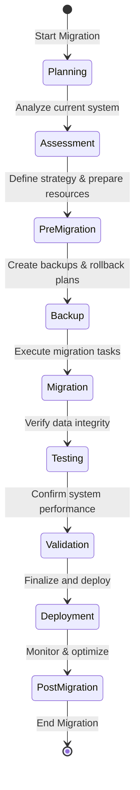
```mermaid
stateDiagram-v2
    [*] --> Planning: Start Migration
    Planning --> Assessment: Analyze current system
    Assessment --> PreMigration: Define strategy & prepare resources
    PreMigration --> Backup: Create backups & rollback plans
    Backup --> Migration: Execute migration tasks
    Migration --> Testing: Verify data integrity
    Testing --> Validation: Confirm system performance
    Validation --> Deployment: Finalize and deploy
    Deployment --> PostMigration: Monitor & optimize
    PostMigration --> [*]: End Migration
```

## 🏁 Conclusion
The **`Up()` and `Down()` methods** in EF Core migrations are fundamental for managing **database schema changes** efficiently. They allow developers to apply and revert schema modifications in a **controlled, versioned manner**.
By mastering these methods, .NET developers can maintain **database integrity**, facilitate **rollbacks when needed**, and ensure **seamless database evolution** across different environments.

---
# 🚀 LINQ Syntax and Database Migrations in .NET Development

## 📌 Introduction
**Language Integrated Query (LINQ)** is a powerful feature in .NET that allows developers to write expressive, type-safe queries against various data sources, such as collections, databases, and XML. LINQ can be written in two primary syntaxes:
1. **Standard Query Syntax (SQL-like Syntax)**
2. **Method Syntax (Fluent Syntax or Lambda Expressions)**
Both syntaxes ultimately compile to the same intermediate representation. This guide explores the differences, usage, and best practices of both approaches.

## 🔍 Key Characteristics of LINQ
| Feature                    | Standard Query Syntax  | Method (Fluent) Syntax |
|---------------------------|-----------------------|------------------------|
| **Readability**            | Resembles SQL, easy for SQL users | Compact, concise, flexible |
| **Complex Operations**     | More readable for grouping and joins | Suitable for chaining multiple operations |
| **Usage Scenario**        | Ideal for structured, SQL-like queries | Preferred for short, fluent expressions |
| **Compilation Process**    | Internally converted to method syntax | Directly written in method form |

### ✅ Benefits of LINQ
- **Unified Query Model:** Works across collections, databases, XML, and more.
- **Type-Safe:** Queries are checked at compile time.
- **Flexible Querying:** Can perform filtering, ordering, grouping, and aggregation.
- **Multiple LINQ Providers:** LINQ to Objects, LINQ to SQL, LINQ to Entities, LINQ to XML, etc.

## 📌 Standard Query Syntax
The **Standard Query Syntax** is similar to SQL and provides a structured, declarative way of writing queries.
### 📌 Example: Querying a List of Products
```csharp
var products = new List<Product>
{
    new Product { Id = 1, Name = "Laptop", Price = 1200 },
    new Product { Id = 2, Name = "Smartphone", Price = 800 },
    new Product { Id = 3, Name = "Tablet", Price = 500 }
};

var query = from p in products
            where p.Price > 600
            orderby p.Price descending
            select new { p.Name, p.Price };

foreach (var item in query)
{
    Console.WriteLine($"{item.Name} - ${item.Price}");
}
```

### 🔎 Explanation:
- `from p in products` → Iterates over the `products` collection.
- `where p.Price > 600` → Filters products with a price greater than 600.
- `orderby p.Price descending` → Sorts products by price in descending order.
- `select new { p.Name, p.Price }` → Projects only `Name` and `Price`.

## 🔄 Method Syntax (Fluent Syntax)
The **Method Syntax** (also called **Lambda Syntax**) uses **extension methods** like `Where()`, `OrderBy()`, and `Select()`.
### 📌 Example: Achieving the Same Result
```csharp
var query = products
    .Where(p => p.Price > 600)
    .OrderByDescending(p => p.Price)
    .Select(p => new { p.Name, p.Price });

foreach (var item in query)
{
    Console.WriteLine($"{item.Name} - ${item.Price}");
}
```

### 🔎 Explanation:
- `Where(p => p.Price > 600)` → Filters elements using a lambda expression.
- `OrderByDescending(p => p.Price)` → Sorts in descending order.
- `Select(p => new { p.Name, p.Price })` → Projects only `Name` and `Price`.

## 📊 Standard Query Syntax vs. Method Syntax
| Feature                    | Standard Query Syntax   | Method Syntax (Fluent) |
|---------------------------|------------------------|------------------------|
| **SQL-Like Familiarity**    | High                   | Moderate               |
| **Complex Joins**           | Easier to read         | Can be more verbose    |
| **Performance**             | Same as method syntax  | Same as query syntax   |
| **Debugging & Readability** | Often clearer for grouping & joins | Preferred for simple operations |

> **Tip:** Some operations (e.g., `Skip()`, `Take()`, `GroupJoin()`) require **Method Syntax**.

## 🌍 Practical Use Cases
1. **Use Standard Query Syntax** for complex queries that involve **joins**, **grouping**, and **aggregation**.
2. **Use Method Syntax** for shorter, more **fluent operations** like filtering and projections.
3. **Mix Both** when necessary, but maintain consistency within a project.

## 📜 LINQ Workflow Diagram

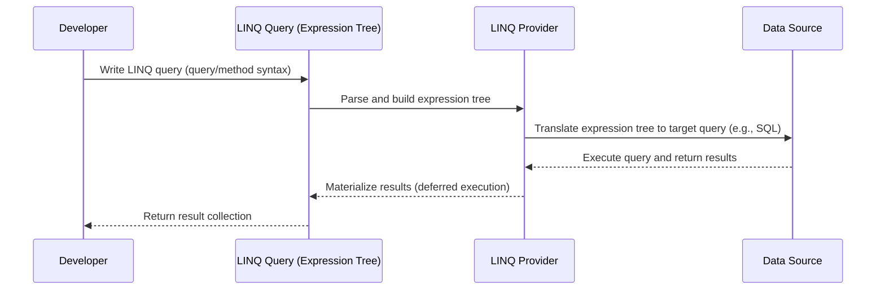
```mermaid
sequenceDiagram
    participant Dev as Developer
    participant Query as LINQ Query (Expression Tree)
    participant Provider as LINQ Provider
    participant Data as Data Source

    Dev->>Query: Write LINQ query (query/method syntax)
    Query->>Provider: Parse and build expression tree
    Provider->>Data: Translate expression tree to target query (e.g., SQL)
    Data-->>Provider: Execute query and return results
    Provider-->>Query: Materialize results (deferred execution)
    Query-->>Dev: Return result collection
```

## 🏁 Conclusion
Both **Standard Query Syntax** and **Method Syntax** are valuable tools in LINQ. While **Standard Query Syntax** is more readable for complex queries, **Method Syntax** is more fluent and widely used for simpler operations. Mastering both approaches allows developers to write efficient, maintainable, and flexible data queries.
By following best practices, developers can enhance readability, maintainability, and performance in their .NET applications.

## 📚 References
- [Microsoft Docs - LINQ (Language Integrated Query)](https://learn.microsoft.com/en-us/dotnet/csharp/linq/)

---
# 🚀 Understanding Synchronous and Asynchronous Programming in .NET Development
## 📌 Introduction
In .NET development, **synchronous** and **asynchronous** programming models determine how code executes and manages resources. Understanding the differences, advantages, and trade-offs of each approach is critical to building efficient, responsive applications.

## 🔍 Key Characteristics
### 🟢 Synchronous Programming
- **Blocking Execution**: A method call must complete before the next statement executes.
- **Thread Occupation**: The calling thread is occupied until the operation finishes.
- **Simplicity**: Easier to read and reason about due to sequential flow.
- **Potential for Performance Bottlenecks**: Long-running tasks can freeze or block an application.

### 🔵 Asynchronous Programming
- **Non-Blocking Execution**: Operations can run concurrently, allowing other tasks to proceed.
- **Better Responsiveness**: UI and services remain responsive during long-running tasks.
- **Complexity**: Requires careful handling of async methods, tasks, and potential race conditions.
- **Optimized Resource Usage**: Frees up threads for other work while waiting for I/O or network operations.

## ⚙️ Synchronous Syntax
When a method is called synchronously, the calling thread is blocked until the operation completes.
###  Example: Synchronous File I/O
```csharp
public void ReadFileSynchronous()
{
    var path = "data.txt";
    string content = File.ReadAllText(path); // Blocks until file is fully read
    Console.WriteLine(content);
}
```
### Explanation
- **`File.ReadAllText(path)`** reads the entire file before returning, blocking the thread.
- **Thread remains busy** until reading is done.

### 🚨 Potential Drawback
- For large files or slow I/O, the application becomes unresponsive.

## 🔄 Asynchronous Syntax
Asynchronous methods in .NET use the **`async`** and **`await`** keywords to free up the calling thread while awaiting long-running operations.
### 📌 Example: Asynchronous File I/O
```csharp
public async Task ReadFileAsynchronous()
{
    var path = "data.txt";
    string content = await File.ReadAllTextAsync(path); // Doesn't block
    Console.WriteLine(content);
}
```
### Explanation
- **`async` keyword** modifies the method signature.
- **`await` suspends** the method execution until the task is complete.
- **Thread is freed** to do other work while waiting for I/O.

### ✅ Benefits
- Keeps UI responsive in desktop or mobile apps.
- Improves scalability in web applications.

## 📊 Comparison: Synchronous vs. Asynchronous
| Aspect               | Synchronous                   | Asynchronous                         |
|----------------------|-------------------------------|--------------------------------------|
| **Execution**        | Blocking                      | Non-blocking                         |
| **Performance**      | May be slower for I/O-bound tasks | Optimized for I/O and network operations |
| **Complexity**       | Easier to read and reason about | Requires understanding async/await   |
| **Common Use Cases** | Simple tasks, CPU-bound ops   | Network calls, file I/O, database queries |
| **Resource Usage**   | Occupies threads until done   | Releases threads during wait times   |

## 🌍 Practical Use Cases
### 🖥️ 1. UI Applications
- **Asynchronous** calls prevent freezing of the user interface.
- Example: **WPF** or **WinForms** calling a web service without blocking the UI.
### 🌐 2. Web Services
- **Async** methods handle more concurrent requests by freeing up threads.
- Example: **ASP.NET Core** uses async controllers to scale under heavy load.
### 📜 3. Console Applications
- **Synchronous** might suffice for quick tasks.
- **Asynchronous** is beneficial for file or network operations.
### 🗄️ 4. Database Queries
- Async queries in **Entity Framework Core** (`ToListAsync()`, `FirstOrDefaultAsync()`) free up threads while waiting on the database.

## 📜 Diagram: Synchronous vs Asynchronous Execution

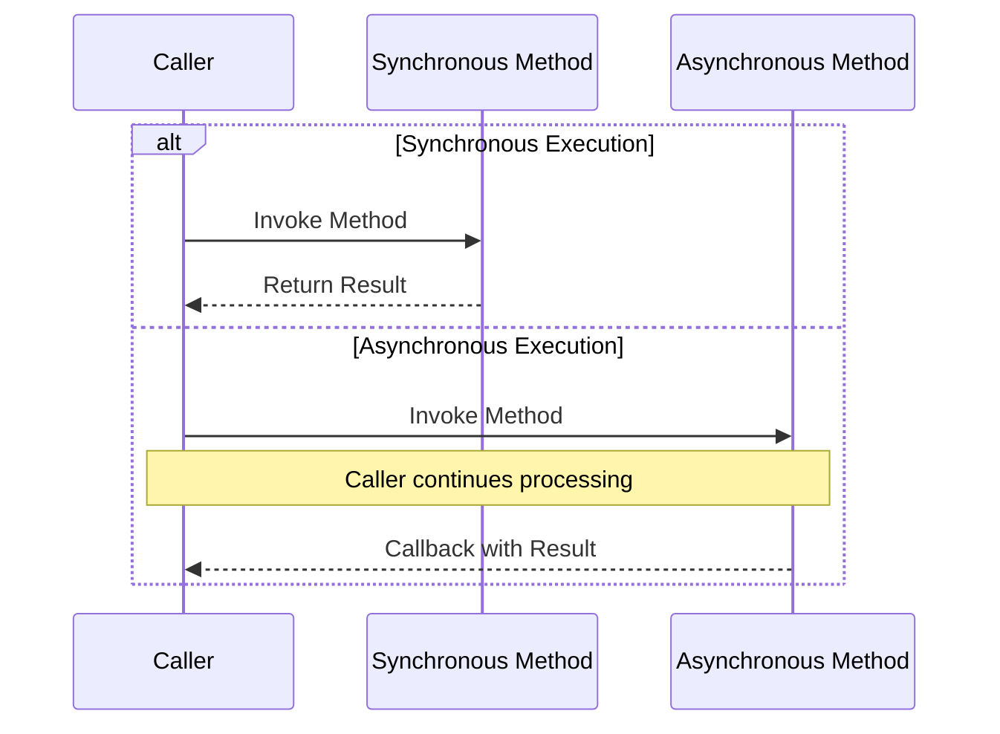
```mermaid
sequenceDiagram
    participant Caller as Caller
    participant Sync as Synchronous Method
    participant Async as Asynchronous Method

    alt Synchronous Execution
        Caller->>Sync: Invoke Method
        Sync-->>Caller: Return Result
    else Asynchronous Execution
        Caller->>Async: Invoke Method
        Note over Caller,Async: Caller continues processing
        Async-->>Caller: Callback with Result
    end
```

### Explanation:
- **Synchronous Flow**: The application waits at each step until the current operation is completed before moving on.
- **Asynchronous Flow**: The operation is initiated and runs in the background. The application can continue executing other tasks until the operation completes.

## 🏁 Conclusion
**Synchronous** and **Asynchronous** syntax serve different needs in .NET development. Synchronous code is simpler but can lead to performance bottlenecks, whereas asynchronous code ensures better responsiveness and resource management, especially for I/O-bound or network-bound operations.
Choosing the right approach depends on the nature of the task and the performance requirements of the application.

## 📚 References
- [Asynchronous Programming in .NET](https://docs.microsoft.com/en-us/dotnet/standard/async)

---
# 🚀 Comparing LINQ Syntax and SQL Syntax in .NET Development
## 📌 Introduction
In .NET development, data operations are a central part of building applications. Two common ways to interact with data are:
- **LINQ (Language Integrated Query)**: A query language built into C# for querying various data sources (objects, databases, XML, etc.).
- **SQL (Structured Query Language)**: A domain-specific language used in managing and querying relational databases.
While both are used for data retrieval and manipulation, they target different layers of an application and have distinct syntactical and conceptual differences. Understanding when to use LINQ versus SQL is essential for writing efficient, maintainable .NET applications.

## 🔍 Key Characteristics
### LINQ Syntax
1. **Language Integrated**: Embedded directly in C#, providing compile-time checks.
2. **Unified Query Model**: Can query objects in memory (LINQ to Objects), databases (LINQ to SQL, EF Core), XML, and more using a similar syntax.
3. **Fluent or Query Syntax**: Supports method-chaining (e.g., `.Where(x => ...)`) or SQL-like expressions (e.g., `from x in collection`).
4. **Strongly Typed**: Accesses entity properties with IntelliSense, reducing runtime errors.

### SQL Syntax
1. **Relational Database-Focused**: Directly targets database objects (tables, columns, etc.).
2. **Text-Based**: Usually written as strings in .NET applications.
3. **Declarative Approach**: Specifies *what* data to fetch rather than *how* to fetch it.
4. **Database Engine Optimizations**: Query plans, indexes, and execution strategies are handled by the database.

## ⚙️ Syntax Comparisons
### Example 1: Simple Selection and Filtering
#### LINQ (C# Query Syntax)
```csharp
var products = from p in dbContext.Products
               where p.Price > 100
               select new { p.Name, p.Price };
```

#### SQL
```sql
SELECT Name, Price
FROM Products
WHERE Price > 100;
```

**Explanation:**
- LINQ uses C# expressions and integrates with EF Core to translate queries into SQL under the hood.
- SQL directly manipulates tables and columns.

### Example 2: Ordering and Projection
#### LINQ (Method Syntax)
```csharp
var products = dbContext.Products
    .Where(p => p.Price > 100)
    .OrderByDescending(p => p.Price)
    .Select(p => new { p.Name, p.Price });
```

#### SQL
```sql
SELECT Name, Price
FROM Products
WHERE Price > 100
ORDER BY Price DESC;
```

**Explanation:**
- LINQ uses **lambda expressions** and fluent methods (`Where`, `OrderByDescending`, `Select`).
- SQL sorts results by `Price` in descending order using `ORDER BY Price DESC`.

## 📊 Core Differences
| Aspect                         | LINQ                                | SQL                                 |
|--------------------------------|-------------------------------------|--------------------------------------|
| **Language Scope**             | C# integrated (compile-time checks) | String-based, database domain-specific |
| **Use Cases**                  | In-memory collections, EF Core, XML | Direct database queries, stored procedures |
| **Query Type**                 | Object-oriented queries             | Table/column-based, set-based        |
| **Runtime**                    | Translated to SQL by EF Core or LINQ provider | Executed directly by database engine |
| **Performance**                | Generally good, but depends on provider translation | High performance, query plan optimizations |
| **Flexibility**                | Unified syntax across data sources  | Focused purely on relational data    |

## 🔄 When to Use LINQ vs SQL
### LINQ
- **Object-Oriented Operations**: Querying in-memory data (`List<T>`, arrays, etc.).
- **Entity Framework Integration**: Translating C# queries to SQL automatically.
- **Consistent Syntax**: Using the same approach for different data sources.
- **Compile-Time Checking**: Catch errors earlier, use IntelliSense for property names.

### SQL
- **Complex Stored Procedures**: Database-centric logic is sometimes best done in SQL.
- **Optimizing Specific Queries**: Fine-tuning queries for performance with specialized indexing.
- **Direct Database Access**: Admin tasks like database backup, indexing, or user management.
- **Legacy Systems**: Existing stored procedures or views that must be used.

## 🌍 Practical Use Cases
1. **LINQ to Entities (EF Core)**: Use LINQ to query tables as strongly typed C# objects, letting EF Core handle the SQL generation.
2. **LINQ to Objects**: Use LINQ for filtering, sorting, and grouping in-memory collections.
3. **Direct SQL Queries**: Useful when writing advanced queries (e.g., window functions, pivot tables) or performing bulk operations.
4. **Hybrid Approach**: Sometimes, a mix of LINQ for simpler queries and stored procedures for complex operations is beneficial.

## 🏁 Conclusion
**LINQ** and **SQL** each offer valuable ways to interact with data in .NET development. **LINQ** excels in strongly typed, object-oriented queries that unify access to multiple data sources, while **SQL** is the go-to solution for direct database manipulation, especially for complex queries and stored procedures.
Developers should become proficient in both, using **LINQ** for rapid, type-safe development and **SQL** for fine-tuned database operations.

## 📚 References
- [Microsoft Docs - LINQ](https://learn.microsoft.com/en-us/dotnet/csharp/linq/)
- [Microsoft Docs - SQL](https://learn.microsoft.com/en-us/sql/)
- [Entity Framework Core Documentation](https://learn.microsoft.com/en-us/ef/core/)

# 🚀 Filtering and Aggregating Data with LINQ in .NET Development
## 📌 Introduction
**Language Integrated Query (LINQ)** provides a powerful, type-safe way to **filter** and **aggregate** data in .NET. Whether you're querying in-memory collections (**LINQ to Objects**), relational databases (**Entity Framework Core**), or other data sources, LINQ offers a uniform syntax for operations like filtering, grouping, aggregating, and more.
This document examines various LINQ filtering techniques and aggregation methods, complete with illustrative examples.

## 🔍 Key Characteristics
### Filtering Data
1. **Selective**: Returns only the elements that satisfy the specified condition.
2. **Declarative**: Focuses on *what* data to retrieve, not *how* to retrieve it.
3. **Efficient**: Can optimize execution when used with databases via **Entity Framework Core**.

### Aggregating Data
1. **Computational**: Summarizes datasets with functions like **Sum**, **Count**, **Min**, **Max**, and **Average**.
2. **Efficient**: Optimized for performance by LINQ providers.
3. **Combinable**: Aggregation functions can be used after filtering or grouping.

## ⚙️ Filtering Data with LINQ
Filtering in LINQ is commonly done using the **`Where()`** method (method syntax) or the **`where`** keyword (query syntax). These allow you to specify **conditions** that elements in a data source must satisfy.
### Example: Simple Filtering
```csharp
var products = new List<Product>
{
    new Product { Id = 1, Name = "Laptop", Price = 1200 },
    new Product { Id = 2, Name = "Smartphone", Price = 800 },
    new Product { Id = 3, Name = "Tablet", Price = 500 },
    new Product { Id = 4, Name = "Keyboard", Price = 50 }
};

// Method Syntax
var expensiveProducts = products.Where(p => p.Price > 600).ToList();

// Query Syntax
var cheapProducts = (from p in products where p.Price < 100 select p).ToList();
```

#### Explanation:
- **`Where(p => p.Price > 600)`**: Filters elements where price is greater than 600.
- **Query syntax** provides an alternative SQL-like approach.

## 🔄 Aggregating Data with LINQ
Aggregation operations compute **summary values** from datasets. Common LINQ aggregation methods include **`Count`**, **`Sum`**, **`Min`**, **`Max`**, and **`Average`**.

### Example: Summation and Counting
```csharp
var totalCost = products.Sum(p => p.Price);  // Sums all product prices
var productCount = products.Count();         // Counts total products
```

### Example: Minimum and Maximum
```csharp
var cheapestProductPrice = products.Min(p => p.Price);
var mostExpensiveProductPrice = products.Max(p => p.Price);
```

### Example: Average
```csharp
var averagePrice = products.Average(p => p.Price);
```

## 📊 Grouping and Aggregation
You can **group** data by a specific key and then aggregate the groups, similar to **`GROUP BY`** in SQL.
### Example: Grouping Products by Price Range
```csharp
var productsByRange = products
    .GroupBy(p => p.Price < 100 ? "Low" : p.Price <= 800 ? "Medium" : "High")
    .Select(g => new
    {
        Range = g.Key,
        Count = g.Count(),
        TotalPrice = g.Sum(p => p.Price)
    });
```

#### Explanation:
- **`GroupBy()`** assigns products into categories (`Low`, `Medium`, `High`).
- **`Select()`** computes aggregated values.

##### Example Output:
```plaintext
Range: Low, Count: 1, TotalPrice: 50
Range: Medium, Count: 2, TotalPrice: 1300
Range: High, Count: 1, TotalPrice: 1200
```

## 🌍 Practical Use Cases
1. **Dashboard Analytics**: Summarizing sales, inventory, or user activities.
2. **Data Validation**: Identifying records meeting specific criteria.
3. **Reporting**: Generating totals and averages for management.
4. **Filtering User Input**: Building dynamic queries based on user selections.

## 🏁 Conclusion
**Filtering** and **aggregating** data with LINQ in .NET simplify tasks such as searching, counting, summing, and grouping. LINQ enables concise, type-safe queries using both **method** and **query syntax**.
When working with large datasets, **Entity Framework Core** optimizes LINQ queries by translating them into SQL. Understanding **LINQ filtering and aggregation** will help developers build efficient, scalable applications.

---
# 🚀 Executing Methods in C#

## 📖 Introduction
In C# (part of the .NET ecosystem), **methods** are fundamental building blocks of functionality. Methods encapsulate logic, making code more modular, reusable, and maintainable. Executing a method involves invoking it, passing any necessary parameters, and potentially receiving a return value. Understanding method execution, different method types, and best practices ensures efficient C# application development.

## 🔍 Key Characteristics of C# Methods
1. **Method Signature**
   - Defines **return type**, **method name**, and **parameter list**.
   - Example: `public int Sum(int x, int y)`

2. **Access Modifiers**
   - Determines the **visibility** of a method (`public`, `private`, `protected`, `internal`).

3. **Static vs. Instance Methods**
   - **Static methods** belong to a class and can be called without an instance.
   - **Instance methods** require an object instance to be invoked.

4. **Method Overloading & Optional Parameters**
   - Methods can have **multiple definitions** (overloading) or **default values** for parameters.

5. **Return Types**
   - Methods can return **void** (no value) or a specific type (e.g., `int`, `string`).

6. **Asynchronous Methods**
   - Declared with `async` and often used with `await`.
   - Helps write non-blocking code (I/O, network calls).

## ⚙️ Declaring and Executing Methods
### 1️⃣ Basic Example
```csharp
public class Calculator
{
    public int Add(int x, int y)
    {
        return x + y;
    }
}

public class Program
{
    public static void Main()
    {
        Calculator calc = new Calculator();
        int result = calc.Add(3, 4);
        Console.WriteLine($"Result is: {result}");
    }
}
```

### 🔄 Explanation
- `Add(int x, int y)` defines a **return type** (`int`) and takes **two parameters**.
- `calc.Add(3, 4)` **invokes** the method.
- The method returns `7`, which is assigned to `result`.

### 2️⃣ Static Method Example
```csharp
public class MathUtilities
{
    public static int Multiply(int x, int y)
    {
        return x * y;
    }
}

public class Program
{
    public static void Main()
    {
        int product = MathUtilities.Multiply(5, 6);
        Console.WriteLine($"Product is: {product}");
    }
}
```

### 🔄 Explanation
- `Multiply` is `static`, so it belongs to the `MathUtilities` class itself.
- It can be called directly via `MathUtilities.Multiply(5, 6)` without an instance.

### 3️⃣ Overloaded Methods
```csharp
public class Printer
{
    public void PrintMessage(string message)
    {
        Console.WriteLine($"Message: {message}");
    }

    public void PrintMessage(string message, int times)
    {
        for (int i = 0; i < times; i++)
        {
            Console.WriteLine($"Message [{i+1}]: {message}");
        }
    }
}
```

### 🔄 Explanation
- `PrintMessage` is **overloaded**: same method name, different parameters.
- The runtime determines which method to call based on the arguments passed.

### 4️⃣ Async Method Execution
```csharp
public class DataService
{
    public async Task<string> GetDataAsync()
    {
        await Task.Delay(1000);
        return "Data retrieved from server";
    }
}

public class Program
{
    public static async Task Main()
    {
        DataService service = new DataService();
        string result = await service.GetDataAsync();
        Console.WriteLine(result);
    }
}
```

### 🔄 Explanation
- `GetDataAsync` is marked `async` and returns `Task<string>`.
- `await` suspends execution until the task completes, keeping the main thread free.

## 📊 How C# Executes Methods Behind the Scenes
| Step | Execution Process |
|------|------------------|
| 1️⃣  | Method is invoked, and parameters are passed. |
| 2️⃣  | The **call stack** stores method execution context. |
| 3️⃣  | Control transfers to the method’s code block. |
| 4️⃣  | If the method has a return value, it is passed back. |
| 5️⃣  | The method call is removed from the **call stack**. |
| 6️⃣  | Execution resumes from where the method was called. |

## 🏁 Conclusion
Method execution is fundamental in **C#** and plays a crucial role in **code modularity, performance, and maintainability**. By understanding method types, execution flow, and best practices, developers can write **efficient, scalable, and maintainable applications**.

---
# 🚀 ToList vs ToListAsync in .NET Development
## 📖 Introduction
In .NET development, particularly when using **Entity Framework Core (EF Core)** or LINQ to manipulate data, developers often face a choice between `ToList()` and `ToListAsync()`. Although they serve a similar purpose—materializing query results into a `List<T>`—they operate differently in terms of **synchronous vs. asynchronous** execution. Understanding these differences helps optimize performance and maintain application responsiveness, especially under heavy I/O or network operations.

## 🔍 Key Characteristics
### `ToList()`
1. **Synchronous Execution**  
   - Blocks the current thread until the query completes.

2. **Immediate Materialization**  
   - Executes the underlying query and loads all records into memory at once.

3. **Potential UI Freezing**  
   - In desktop or mobile apps, calling `ToList()` on the main thread can freeze the UI during long-running operations.

4. **Simple Debugging**  
   - Debugging synchronous code is often more straightforward due to sequential flow.

### `ToListAsync()`
1. **Asynchronous Execution**  
   - Utilizes `async`/`await` keywords, freeing the current thread while waiting for the query to complete.

2. **Responsive UI**  
   - Ideal for UI frameworks like WPF, WinForms, or MAUI to prevent blocking the main thread.

3. **Better Scalability**  
   - Frees resources on the server while awaiting database I/O, improving concurrency.

4. **Requires EF Core**  
   - Asynchronous LINQ methods like `ToListAsync()` are typically found in the `Microsoft.EntityFrameworkCore` namespace.

## 📌 Usage Examples
### 1. Using `ToList()`
```csharp
using (var context = new ApplicationDbContext())
{
    // Synchronous operation
    List<Product> products = context.Products
        .Where(p => p.Price > 100)
        .ToList();

    foreach (var product in products)
    {
        Console.WriteLine($"{product.Name} - ${product.Price}");
    }
}
```

#### Explanation
- The call to `ToList()` blocks the calling thread until the query finishes executing.
- This is acceptable for quick data fetches or console apps where blocking is not critical.

### 2. Using `ToListAsync()`
```csharp
using (var context = new ApplicationDbContext())
{
    // Asynchronous operation
    List<Product> products = await context.Products
        .Where(p => p.Price > 100)
        .ToListAsync();

    foreach (var product in products)
    {
        Console.WriteLine($"{product.Name} - ${product.Price}");
    }
}
```

#### Explanation
- `await` suspends the method until the query completes, but **does not** block the calling thread.
- Suited for ASP.NET Core, WPF, or any environment that benefits from async processing.

## 📊 Comparison Table: `ToList()` vs `ToListAsync()`
| Aspect                 | ToList()                     | ToListAsync()                                  |
|------------------------|------------------------------|------------------------------------------------|
| **Execution Model**    | Synchronous                 | Asynchronous (`async`/`await`)                |
| **Thread Blocking**    | Yes, blocks the calling thread | No, frees thread during I/O wait              |
| **Use Case**           | Small/medium datasets, console or batch apps | Large-scale apps, UI frameworks (WPF, MAUI), web servers |
| **Namespace**          | `System.Linq`                | `Microsoft.EntityFrameworkCore` (EF Core)      |
| **Performance Impact** | Can freeze UI under heavy load | Improves concurrency and responsiveness        |

## 🔄 Diagram: Synchronous vs. Asynchronous Flow

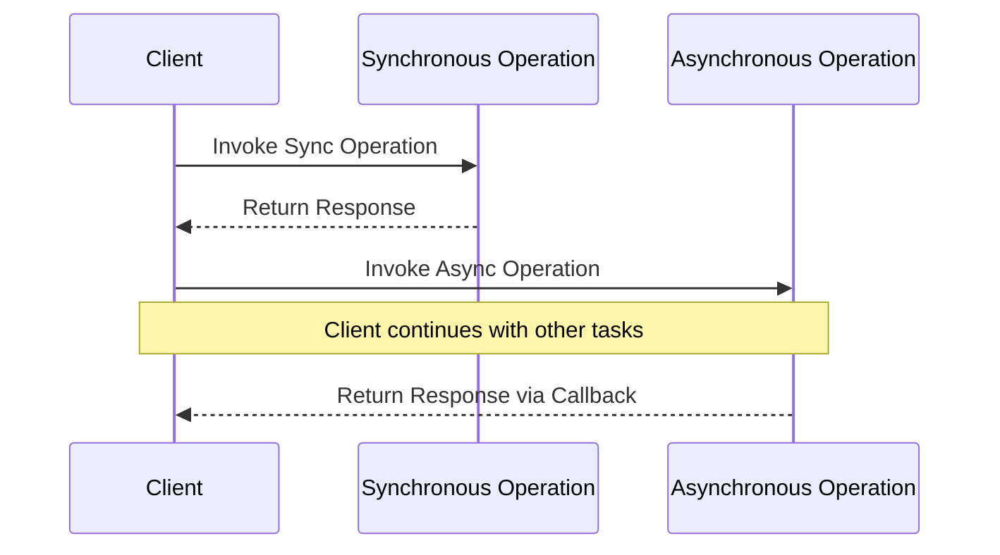
```mermaid
sequenceDiagram
    participant Client as Client
    participant SyncOp as Synchronous Operation
    participant AsyncOp as Asynchronous Operation

    Client->>SyncOp: Invoke Sync Operation
    SyncOp-->>Client: Return Response

    Client->>AsyncOp: Invoke Async Operation
    Note over Client,AsyncOp: Client continues with other tasks
    AsyncOp-->>Client: Return Response via Callback
```

- Synchronous Flow: The client invokes the synchronous operation and waits until the operation completes, receiving the response before moving on.
- Asynchronous Flow: The client invokes the asynchronous operation and continues processing other tasks without waiting. The asynchronous operation later returns a response via a callback mechanism.

## ✅ When to Use Each
1. **Use `ToList()` When**  
   - The query is **small** or **fast**, and blocking is acceptable.  
   - Working in a **non-UI** context (e.g., simple console app).

2. **Use `ToListAsync()` When**  
   - Application requires **responsiveness** (UI threads or web servers).  
   - Potential for **long-running** or **I/O-intensive** operations.  
   - Adhering to asynchronous design patterns in modern .NET.

## 🏁 Conclusion
Both **`ToList()`** and **`ToListAsync()`** serve to materialize query results into a `List<T>` in .NET, but the **key difference** lies in **execution strategy**—**synchronous** vs. **asynchronous**. By leveraging asynchronous methods (`ToListAsync()`), developers can build **responsive UIs**, **scalable web applications**, and generally more efficient solutions that do not block threads during I/O operations.
Selecting the appropriate method depends on **performance requirements**, **application type**, and **code complexity**. In most modern .NET scenarios (e.g., ASP.NET Core or WPF), **asynchronous** approaches are often recommended to improve overall responsiveness and scalability.

## 📚 References
- [Microsoft Docs: Asynchronous Query and Save in EF Core](https://learn.microsoft.com/en-us/ef/core/miscellaneous/configuring-dbcontext#thread-safety)
- [Entity Framework Core Documentation](https://learn.microsoft.com/en-us/ef/core/)
- [Microsoft Docs: Async and Await in C#](https://learn.microsoft.com/en-us/dotnet/csharp/programming-guide/concepts/async/)

---
# 🚀 SaveChanges vs SaveChangesAsync in .NET Development
## 📌 Introduction
In **Entity Framework Core (EF Core)**, changes to your data model (in-memory entities) aren’t persisted to the database until you explicitly call either **`SaveChanges()`** or **`SaveChangesAsync()`**. Both methods serve the same purpose—committing inserts, updates, and deletes—but differ in how they handle **thread blocking** and **asynchronous operations**.
This document explains the differences between these two methods, demonstrates usage examples, and provides insights into when and why you might prefer the asynchronous variant.

## 🔍 Key Characteristics
### SaveChanges()
1. **Synchronous Execution**  
   - Blocks the current thread until the operation completes.

2. **Suitable for Simple or Short Operations**  
   - If the save operation is quick, the blocking might be negligible.

3. **Direct and Easy to Debug**  
   - Synchronous flow can simplify debugging in some scenarios.

### SaveChangesAsync()
1. **Asynchronous Execution**  
   - Frees the calling thread, allowing other tasks to continue.

2. **Supports `async`/`await`**  
   - Integrates seamlessly into asynchronous workflows.

3. **Scalability and Responsiveness**  
   - Ideal for UI frameworks (WPF, MAUI) or server apps (ASP.NET Core) under high load.

## ⚙️ Usage Examples
### 1️⃣ SaveChanges (Synchronous)
```csharp
public class Program
{
    public static void Main()
    {
        using (var context = new ApplicationDbContext())
        {
            // Adding a new product
            var product = new Product { Name = "Laptop", Price = 1200.0m };
            context.Products.Add(product);

            // This blocks the thread until completed
            int recordsAffected = context.SaveChanges();
            Console.WriteLine($"Records Affected: {recordsAffected}");
        }
    }
}
```

#### ✅ Explanation
- The code is **straightforward** and **blocking**.
- Typically used in **console applications** or scenarios where short blocking is acceptable.

### 2️⃣ SaveChangesAsync (Asynchronous)
```csharp
public class Program
{
    public static async Task Main()
    {
        using (var context = new ApplicationDbContext())
        {
            // Adding a new product
            var product = new Product { Name = "Smartphone", Price = 900.0m };
            context.Products.Add(product);

            // Asynchronous call
            int recordsAffected = await context.SaveChangesAsync();
            Console.WriteLine($"Records Affected: {recordsAffected}");
        }
    }
}
```

#### ✅ Explanation
- Uses the **async** keyword and **`await`** operator.
- Suitable for **ASP.NET Core**, **WPF**, or **MAUI** to keep the UI or server thread responsive.
- Non-blocking: while waiting for the database operation, the thread can serve other tasks.

## 📊 Diagram: Synchronous vs Asynchronous Flow

```plaintext
   SaveChanges()        |        SaveChangesAsync()
------------------------|--------------------------------
   [Main Thread]        |   [Main Thread]
       |               |       |
       |  blocks       |   begin async Save
       v               |   no block, thread freed
[Database Operation]    |   [Database Operation]
       |               |       |
       v               |       |
 [Result Returned]      | [Callback, thread resumes]
```

- **SaveChanges()**: The main thread waits until the DB operation completes.
- **SaveChangesAsync()**: The main thread can do other work while the DB operation executes.

## 📌 Table: Comparing SaveChanges and SaveChangesAsync
| Aspect                  | SaveChanges()                       | SaveChangesAsync()                          |
|-------------------------|-------------------------------------|---------------------------------------------|
| **Execution Model**     | Synchronous                         | Asynchronous                                |
| **Thread Blocking**     | Blocks calling thread               | Frees thread during the wait                |
| **Use Case**            | Console apps, small operations      | UI frameworks, web servers (ASP.NET Core)   |
| **Return Type**         | `int` (records affected)            | `Task<int>` (wrapped int)                   |
| **Performance**         | Fine for small/quick saves          | Scales better under high load               |

## ⚖️ When to Use Each
### ✅ Use `SaveChanges()` When:
- The operation is **quick**, and blocking is acceptable.
- You are writing a **console application** or batch processing where responsiveness is not critical.
- Simplicity and ease of debugging are prioritized.

### ✅ Use `SaveChangesAsync()` When:
- The operation is **I/O-bound** (e.g., database updates, web APIs).
- You are working on **ASP.NET Core, WPF, MAUI**, or other UI-based applications where **UI responsiveness** matters.
- You need better **scalability** in high-load environments.

## 🏁 Conclusion
Both **`SaveChanges()`** and **`SaveChangesAsync()`** serve the essential function of committing data changes to the database in EF Core. The **primary difference** lies in **synchronous vs asynchronous** execution. 
In modern .NET applications—especially those with UI or high concurrency needs—**asynchronous** saves often provide **better scalability and user experience**. However, in simple or batch-oriented scenarios, the overhead of async might not be necessary.

## 📚 References
- [Microsoft Docs - Saving Data in EF Core](https://learn.microsoft.com/en-us/ef/core/saving/basic)
- [Async Programming in C#](https://learn.microsoft.com/en-us/dotnet/csharp/async)

---
# 🚀 FirstAsync vs FirstOrDefaultAsync in .NET Development
## 📌 Introduction
In **Entity Framework Core**, both `FirstAsync()` and `FirstOrDefaultAsync()` are asynchronous methods used to **retrieve the first record** that matches a given condition. The key difference lies in how they handle cases where **no elements** match the condition:

- `FirstAsync()` **throws an exception** if **no elements** are found.
- `FirstOrDefaultAsync()` **returns the default value** (e.g., `null` for reference types) instead of throwing an exception.

Choosing the right method depends on **whether an empty result should be considered an error** or a valid scenario.

## 🔍 Key Characteristics
| 🔑 Feature               | 🛏️ `FirstAsync`                      | 🔎 `FirstOrDefaultAsync`              |
| ------------------------ | ------------------------------------ | ------------------------------------- |
| **Behavior If No Match** | Throws `InvalidOperationException`   | Returns `default(T)` (often `null`)   |
| **Common Use Case**      | When at least one record is expected | When zero records is a valid scenario |
| **Query Syntax**         | Asynchronous, `awaitable`            | Asynchronous, `awaitable`             |
| **Return Type**          | `Task<TEntity>`                      | `Task<TEntity>` (can be `null`)       |

## 🏢 Example Scenarios
### 1️⃣ Using `FirstAsync()`
```csharp
using var context = new ApplicationDbContext();

// Throws if no matching product is found
var expensiveProduct = await context.Products
    .Where(p => p.Price > 1000)
    .FirstAsync();

Console.WriteLine($"Found product: {expensiveProduct.Name}");
```

#### 📝 Explanation
- Expects **at least one product** with price > 1000.
- If none exist, an `InvalidOperationException` is thrown.

### 2️⃣ Using `FirstOrDefaultAsync()`
```csharp
using var context = new ApplicationDbContext();

// Returns null if no matching product is found
var budgetProduct = await context.Products
    .Where(p => p.Price < 10)
    .FirstOrDefaultAsync();

if (budgetProduct == null)
{
    Console.WriteLine("No budget products found.");
}
else
{
    Console.WriteLine($"Found product: {budgetProduct.Name}");
}
```

#### 📝 Explanation
- Safely handles the case where **no product** matches the condition.
- No exception is thrown; checks if result is `null`.

## 🔄 Common Usage Patterns
1. **Mandatory Data**: Use `FirstAsync()` when data *must* exist. For instance, if you are certain the database will always have a record.
2. **Optional Data**: Use `FirstOrDefaultAsync()` when **no matching data** is acceptable or expected in certain scenarios.
3. **Error Handling**: With `FirstAsync()`, wrap calls in **try-catch** to handle the `InvalidOperationException` gracefully.
4. **Performance Considerations**: Both methods **limit the query to a single record**, making them efficient for retrieving a single row.

## ⚠️ Potential Pitfalls
1. **Exception Handling**
   - Forgetting that `FirstAsync()` can throw if no results are found.
2. **Null Checks**
   - Failing to handle `null` from `FirstOrDefaultAsync()` can lead to `NullReferenceException`.
3. **Query Logic**
   - If multiple items match, **both** methods return the **first** record according to the query’s ordering or default order.
4. **Asynchronous Overhead**
   - Always ensure you actually need async. In small or non-UI scenarios, synchronous methods might suffice.

## 🌐 Decision Flow Diagram

```plaintext
                           +---------------------------+
                           | Are we sure at least one |
                           | record ALWAYS exists?    |
                           +-----------+---------------+
                                       |
                             YES       |       NO
                           +-----------v---------------+------------+
                           |         FirstAsync        |            |
                           |  (Throws if no record)    |            |
                           +---------------------------+            |
                                                                   |
                                                                   |
                                          +------------------------v-----------------------+
                                          |           FirstOrDefaultAsync                 |
                                          | (Returns default if no record is found)       |
                                          +-----------------------------------------------+
```

## 🏁 Conclusion
Both `FirstAsync()` and `FirstOrDefaultAsync()` are **asynchronous** methods for retrieving a **single record** from the database in EF Core. The key difference is how they handle **no-match scenarios**:
- `FirstAsync()` **throws an exception** when no matching record exists.
- `FirstOrDefaultAsync()` **returns a default value** (`null` for reference types) instead of throwing an error.
Choosing the right method depends on whether **zero results** is a valid outcome for your query.

---
# 🚀 SingleAsync vs SingleOrDefaultAsync in .NET Development
## 🌟 Introduction
In **Entity Framework Core** and other LINQ-based queries, **`SingleAsync()`** and **`SingleOrDefaultAsync()`** are used to **retrieve exactly one record** that meets a given condition. These methods ensure data integrity by enforcing uniqueness, but they handle "no match" and "multiple matches" scenarios differently:

- **`SingleAsync()`** throws an exception if **no elements** or **more than one element** match the condition.
- **`SingleOrDefaultAsync()`** returns `null` (or default for value types) if **no elements** match but still throws an exception if multiple matches exist.

Choosing the right method depends on whether your application can tolerate missing records or needs strict uniqueness.

## 🔍 Key Differences and Characteristics
| 🌟 Feature               | 🎮 `SingleAsync()`                    | 🎮 `SingleOrDefaultAsync()`          |
|------------------------|--------------------------------|--------------------------------|
| **Behavior If No Match** | Throws `InvalidOperationException` | Returns `default(T)` (often `null`) |
| **Behavior If Multiple Matches** | Throws `InvalidOperationException` | Throws `InvalidOperationException` |
| **Return Value** | `Task<T>` (i.e., the entity) | `Task<T>` (can be `null` if no match) |
| **Use Case** | When you **expect exactly one record** | When **zero or one record** is valid |

**Note:** Both methods **throw an exception** if **more than one** record matches the condition.

## 🏢 Example Usage
### 1️⃣ Using `SingleAsync()`
```csharp
using var context = new ApplicationDbContext();

// Throws if no matching order or if multiple orders exist
var order = await context.Orders
    .Where(o => o.OrderId == 123)
    .SingleAsync();

Console.WriteLine($"Order Found: {order.OrderId}");
```

#### 🗒️ Explanation
- If **no** order with `OrderId == 123` exists, `InvalidOperationException` is thrown.
- If **multiple** orders exist with the same ID, an exception is also thrown.

### 2️⃣ Using `SingleOrDefaultAsync()`
```csharp
using var context = new ApplicationDbContext();

// Returns null if no matching order is found
var order = await context.Orders
    .Where(o => o.OrderId == 999)
    .SingleOrDefaultAsync();

if (order == null)
{
    Console.WriteLine("No matching order found.");
}
else
{
    Console.WriteLine($"Order Found: {order.OrderId}");
}
```

#### 🗒️ Explanation
- Returns **`null`** if **no** order has `OrderId == 999`.
- Throws an exception if **multiple** records match.

## 🔄 Comparing with Other LINQ Methods
| Method                 | Ensures **Only One Match** | Allows **Zero Matches** | Returns `null` If No Match | Throws On Multiple Matches |
|------------------------|------------------------|---------------------|----------------------|----------------------|
| `FirstAsync()`         | ❌                      | ✅                   | ❌                      | ❌                      |
| `FirstOrDefaultAsync()`| ❌                      | ✅                   | ✅                      | ❌                      |
| `SingleAsync()`        | ✅                      | ❌                   | ❌                      | ✅                      |
| `SingleOrDefaultAsync()` | ✅                      | ✅                   | ✅                      | ✅                      |

## 🤔 When to Use Which Method?
- **Use `SingleAsync()` when:**
  - **Exactly one** record *must* exist.
  - You want to catch data inconsistency early (e.g., enforcing unique constraints).

- **Use `SingleOrDefaultAsync()` when:**
  - A record **may or may not** exist.
  - You need to avoid exceptions for missing data but still enforce uniqueness.

## ⚠️ Common Pitfalls
1. **Unexpected Exceptions**
   - `SingleAsync()` throws if **no records exist** or **more than one** exists.
   - Ensure your **database constraints** reflect this uniqueness.

2. **Null Reference Handling**
   - With `SingleOrDefaultAsync()`, **always check for `null`** before accessing properties.

3. **Unintended Multiple Matches**
   - Both methods **throw** if more than one record matches.
   - Double-check query filters to avoid surprises.

4. **Asynchronous Overhead**
   - If querying **small data sets**, consider whether async is needed to avoid unnecessary performance overhead.

## 🌍 Diagram: Decision Flow

```plaintext
                            +---------------------------+
                            | Are we sure only 1 record |
                            | should exist?             |
                            +-----------+---------------+
                                        |
                              YES       |       NO
                            +-----------v---------------+------------+
                            |         SingleAsync       |            |
                            |  (Throws if no record)    |            |
                            +---------------------------+            |
                                                                    |
                                                                    |
                                           +------------------------v-----------------------+
                                           |          SingleOrDefaultAsync                 |
                                           | (Returns default if no record is found)      |
                                           +----------------------------------------------+
```

## 🏆 Conclusion
- **`SingleAsync()`** → Ensures **one** match. Throws if **none or many** exist.
- **`SingleOrDefaultAsync()`** → Ensures **0 or 1** match. Returns `null` if **none**, throws if **many**.
These methods are excellent for **data integrity checks** and help enforce **strict uniqueness constraints** in EF Core queries. Choose wisely based on whether **zero valid results** is an acceptable outcome in your application.

## 📚 References
- [Microsoft Docs - SingleAsync](https://docs.microsoft.com/en-us/dotnet/api/microsoft.entityframeworkcore.entityframeworkqueryableextensions.singleasync)
- [Microsoft Docs - SingleOrDefaultAsync](https://docs.microsoft.com/en-us/dotnet/api/microsoft.entityframeworkcore.entityframeworkqueryableextensions.singleordefaultasync)

---
# 🚀 How to Retrieve a Single Record from the Database in .NET
## 📘 Introduction
When developing .NET applications with **Entity Framework Core**, there are scenarios where you need to **fetch a single record** from the database, such as retrieving a user by ID or getting a unique product by SKU. Different methods exist to accomplish this, each with its own characteristics regarding **error handling**, **default values**, and **performance**.
This guide explores the common techniques for retrieving a single record, their typical usage, and best practices.

## ⚙️ Methods to Retrieve One Record
### 1️⃣ **First / FirstOrDefault**
- **`First()`** throws an exception if the sequence is empty.
- **`FirstOrDefault()`** returns the default value (`null` for reference types) if empty.
### 2️⃣ **Single / SingleOrDefault**
- **`Single()`** expects exactly one match, throwing an exception if zero or multiple matches exist.
- **`SingleOrDefault()`** returns `null` (if zero matches) or throws an exception if multiple matches exist.
### 3️⃣ **Find** (Entity Framework Core Specific)
- **`context.Entity.Find(id)`** quickly looks up by primary key.
- Returns `null` if no entity is found.
- Bypasses certain EF query logic and uses the **Change Tracker** if available.
### 4️⃣ **Asynchronous Methods**
- **`FirstAsync / FirstOrDefaultAsync`**
- **`SingleAsync / SingleOrDefaultAsync`**
- Run asynchronously, freeing the calling thread while the database operation is in progress.

## 🏗️ Code Examples
### 1️⃣ Using `FirstOrDefaultAsync`
```csharp
using var context = new ApplicationDbContext();

var product = await context.Products
    .Where(p => p.SKU == "ABC123")
    .FirstOrDefaultAsync();

if (product == null)
{
    Console.WriteLine("Product not found.");
}
else
{
    Console.WriteLine($"Found Product: {product.Name}");
}
```

### 2️⃣ Using `SingleAsync`
```csharp
using var context = new ApplicationDbContext();

// Throws if multiple products have the same SKU or if none is found.
var product = await context.Products
    .Where(p => p.SKU == "XYZ999")
    .SingleAsync();

Console.WriteLine($"Found Product: {product.Name}");
```

### 3️⃣ Using `Find`
```csharp
using var context = new ApplicationDbContext();

// Assuming 'Id' is the primary key for the 'Products' table.
var product = context.Products.Find(1);

if (product == null)
{
    Console.WriteLine("No product found with ID = 1");
}
else
{
    Console.WriteLine($"Found Product: {product.Name}");
}
```

## 📊 Comparison Table
| Method                           | Use Case                                  | If No Match  | If Multiple Matches | Complexity Level |
|----------------------------------|------------------------------------------|--------------|---------------------|------------------|
| `First/FirstAsync`               | Get first match, ignoring rest           | Throws       | Returns first match | Low              |
| `FirstOrDefault/FirstOrDefaultAsync` | Get first match, or `null` if none       | Returns `null` | Returns first match | Low              |
| `Single/SingleAsync`             | Exactly one match expected               | Throws       | Throws              | Moderate         |
| `SingleOrDefault/SingleOrDefaultAsync` | Zero or one match valid                 | Returns `null` | Throws              | Moderate         |
| `Find`                           | Primary key lookup in EF Core            | Returns `null` | Not applicable     | Low              |

## 🌍 Diagram: Decision Flow

```plaintext
    +------------------------------+
    | Are you sure only one match |
    | can exist for this query?   |
    +--------------+---------------+
                   |               
          YES      |      NO       
                   |               
    +--------------v--------------+---------------+
    |   Single / SingleOrDefault  | First / FirstOrDefault |
    |   (throws if multiple)      | (ignores multiple)     |
    +-----------------------------+-------------------------+

    +------------------------+
    | Do you rely on PK?    |
    +-----------+------------+
                |  yes
                v
         Use context.Find()
```

## 🏁 Conclusion
**Retrieving a single record** is a common need in .NET development, especially when using **Entity Framework Core**. The best method depends on whether you expect multiple matches, zero matches, or want a strict guarantee of a single match. Choose **`Single/SingleAsync`** if you want **strict enforcement**, or **`First/FirstAsync`** if you only need one item but can tolerate multiple. Use **`Find`** for **primary key** lookups.
By selecting the **right approach**, you ensure readable, maintainable, and robust data access logic.

---
# 🚀 EF.Functions.Like vs. .Contains() in .NET Development

## 🔍 Introduction
When querying data in **Entity Framework Core (EF Core)**, developers often need to filter records by checking if a certain string is contained within a database column. Two common approaches to accomplish this are:
1. **`EF.Functions.Like`**: Uses a SQL `LIKE` pattern match.
2. **`.Contains()`**: A LINQ method that translates to SQL `LIKE '%value%'` by default.

While both techniques achieve partial string matching, they differ in **characteristics**, **performance considerations**, and **use cases**.

## 🔍 Key Differences
| 🔑 Aspect                          | 🏷️ EF.Functions.Like                                       | 💻 .Contains()                      |
|-----------------------------------|------------------------------------------------------------|------------------------------------|
| **Implementation**                | Directly calls SQL `LIKE`                                  | Translated to SQL `LIKE '%value%'` |
| **Escape Handling**               | Must manually handle wildcards (`%`, `_`) in patterns    | Managed by EF Core automatically   |
| **Null-Safety**                   | Must ensure expression is not `null` to avoid exceptions   | Typically handles `null` gracefully|
| **Use Case**                      | Complex pattern matching (wildcards)                      | Simple substring match             |

## 🏗️ Example Usage
### 1️⃣ Using `EF.Functions.Like`
```csharp
using var context = new ApplicationDbContext();

string pattern = "%Laptop%"; // searching for any record containing 'Laptop'

var results = await context.Products
    .Where(p => EF.Functions.Like(p.Name, pattern))
    .ToListAsync();

foreach (var item in results)
{
    Console.WriteLine(item.Name);
}
```

#### 📝 Explanation:
- **`EF.Functions.Like`** directly translates to SQL `LIKE`.
- You explicitly define your pattern, including `'%value%'` for partial matches.
- Allows advanced usage (e.g., `_` for single character wildcards).

### 2️⃣ Using `.Contains()`
```csharp
using var context = new ApplicationDbContext();

string searchTerm = "Laptop"; // we'll search in product names

var results = await context.Products
    .Where(p => p.Name.Contains(searchTerm))
    .ToListAsync();

foreach (var item in results)
{
    Console.WriteLine(item.Name);
}
```

#### 📝 Explanation:
- **`.Contains()`** is a **LINQ** method that EF translates into `LIKE '%Laptop%'`.
- Easy to read, but limited to simple substring checks.
- Manages escape characters under the hood.

## 🔄 Extended Pattern Matching with EF.Functions.Like
`EF.Functions.Like` supports more advanced pattern matching by leveraging SQL syntax:

| Operator | Meaning                           | Example           | Matches               |
|----------|-----------------------------------|-------------------|-----------------------|
| `%`      | Wildcard (any length of chars)    | `%Laptop%`        | `ULaptopX`, etc.      |
| `_`      | Single character wildcard         | `L_ptop`          | `Laptop`, `Lptop`     |
| `[ ]`    | Character range or set            | `[CM]ar`          | `Car`, `Mar`          |

**Note**: Not all providers fully support bracket expressions.

## 🌍 Diagram: Query Translation Flow

```plaintext
        C# Code (LINQ)                          SQL Command
+------------------------------------+   +----------------------------------+
| 1. Developer writes:               |   | SELECT * FROM Products           |
|    context.Products               |   | WHERE Name LIKE '%Laptop%'       |
|        .Where(p =>                |   +----------------------------------+
|        EF.Functions.Like(         |
|            p.Name, "%Laptop%"))   |
+------------------------+-----------+
                         |
                         v
                EF Core translates   
             EF.Functions.Like -> LIKE
```

## 🏁 Conclusion
1. **`.Contains()`**
   - Simpler to use.
   - Automatically escapes user input.
   - Equivalent to SQL `LIKE '%value%'`.
2. **`EF.Functions.Like`**
   - Explicitly calls SQL `LIKE`.
   - Allows custom patterns (`_`, `%`), advanced wildcard usage.
   - Must handle escaping carefully.
Both approaches **perform substring matches**, but `EF.Functions.Like` offers more control over the pattern. For **simple** cases, **`.Contains()`** is often **easier**. For **complex** patterns, **`EF.Functions.Like`** is the way to go.

## 📚 References
- [Microsoft Docs: EF.Functions.Like](https://learn.microsoft.com/en-us/dotnet/api/microsoft.entityframeworkcore.ef.functions?view=efcore-9.0)
- [Microsoft Docs: String.Contains Method](https://docs.microsoft.com/en-us/dotnet/api/system.string.contains)

---
# 🚀 Understanding Aggregate Methods in .NET Development

## 📊 Introduction
In **.NET**, **aggregate methods** are used to perform computations over a sequence of elements and return a **single cumulative result**. They are commonly used in **LINQ (Language Integrated Query)** for data summarization, analytics, and reporting.
Some commonly used **aggregate methods** include:
- **Sum()** – Calculates the total sum of numeric elements.
- **Count()** – Returns the number of elements in a sequence.
- **Average()** – Computes the mean value.
- **Min() / Max()** – Finds the smallest or largest element.
- **Aggregate()** – A flexible function that applies a custom accumulation logic.
Properly using these methods can **simplify code**, **improve readability**, and **optimize performance** in data processing tasks.

## 🔍 Key Characteristics of Aggregate Methods
| 🛠 Feature           | 🔹 Description |
|----------------------|------------------------------------------------|
| **Single-Value Result** | Aggregates compute a **single value** from a collection. |
| **Simplicity**       | Shortens code compared to manual loops. |
| **Broad Applicability** | Used with in-memory collections (**LINQ to Objects**) and databases (**LINQ to Entities**). |
| **Performance**      | Optimized for database execution when used with **Entity Framework Core (EF Core)**. |
| **Type-Safety**      | Strongly typed in **C#**, reducing runtime errors. |

## 🏗️ Common Aggregate Methods & Examples
### 1️⃣ **Count() / LongCount()** – Counting Elements
- **`Count()`** returns the number of elements.
- **`LongCount()`** returns a 64-bit integer (`long`) for large collections.
```csharp
var numbers = new List<int> {1, 2, 3, 4, 5};
int count = numbers.Count(); // 5
long longCount = numbers.LongCount(); // 5L (long)
```

### 2️⃣ **Sum()** – Summing Values
- Computes the **total sum** of numeric elements.
- Overloads exist for different numeric types.
```csharp
var prices = new List<decimal> {19.99m, 9.99m, 29.99m};
decimal total = prices.Sum(); // 59.97m
```

### 3️⃣ **Average()** – Calculating Mean Value
- Computes the **mean value** of a sequence.
```csharp
var scores = new List<int> {80, 90, 100};
double avg = scores.Average(); // 90.0
```

### 4️⃣ **Min() / Max()** – Finding Min & Max Values
- Finds the **smallest** (`Min`) or **largest** (`Max`) element.
```csharp
var temps = new List<int> { 75, 80, 82, 68, 90 };
int minTemp = temps.Min(); // 68
int maxTemp = temps.Max(); // 90
```

### 5️⃣ **Aggregate()** – Custom Accumulation Logic
- More flexible than other methods but requires a custom accumulator function.
```csharp
var words = new List<string> {"Hello", "World", ".NET"};
string sentence = words.Aggregate((acc, word) => acc + " " + word);
// Output: "Hello World .NET"
```

## 🔄 Applying Aggregate Methods in EF Core Queries
When using **Entity Framework Core**, LINQ aggregate methods are translated into **SQL queries** for efficient database execution.
### Example – Finding Maximum Price in Database
```csharp
using var context = new ApplicationDbContext();

var highestPrice = await context.Products.MaxAsync(p => p.Price);
Console.WriteLine($"Max Price: {highestPrice}");
```

#### 🔹 Explanation
- `.MaxAsync(...)` runs **on the server side**, reducing data transfer.
- Aggregates should be executed **before enumeration** (`ToListAsync()`).

## 📊 Diagram: How Aggregate Works

```plaintext
List of Items
 [1, 2, 3, 4, 5]
       |  
       |  (Aggregate Method) e.g., Sum
       v
Single Value Result
        15
```

1. The input is a **sequence** (in-memory list or EF Core IQueryable).
2. The aggregate method is applied to the sequence.
3. A **single value** (e.g., Sum, Max, etc.) is returned.

## 📌 Best Practices for Aggregate Methods
✅ **Choose the Right Method**
- Use `Sum()`, `Count()`, `Average()`, `Min()`, `Max()` for **basic numeric queries**.
- Use `Aggregate()` for **custom** or **complex** accumulation logic.
✅ **Leverage EF Core Optimizations**
- Execute aggregates **on the database side** for better performance.
- Avoid `.ToList()` before using aggregate methods—let EF Core translate to SQL.
✅ **Handle Empty Sequences**
- Methods like `Sum()` and `Average()` return `0` for empty sequences, while `Aggregate()` **throws an exception** if not handled properly.
```csharp
int sum = numbers.Aggregate(0, (acc, num) => acc + num); // Avoids exception
```
✅ **Performance Considerations**
- Aggregates iterate over **all elements**, so be cautious with **large datasets**.
- Use **indexed queries** in EF Core to optimize performance.

## 📚 Summary Table
| **Method**  | **Description**                                    | **Example**                              |
|-------------|----------------------------------------------------|------------------------------------------|
| `Sum()`     | Computes total sum of numeric values.             | `numbers.Sum()`                          |
| `Average()` | Computes the mean of numeric values.              | `numbers.Average()`                      |
| `Count()`   | Returns the number of elements.                   | `numbers.Count()`                        |
| `Min()`     | Finds the smallest element.                       | `numbers.Min()`                          |
| `Max()`     | Finds the largest element.                        | `numbers.Max()`                          |
| `Aggregate()` | Applies a custom accumulator function.             | `numbers.Aggregate((acc, x) => acc + x)`   |

## 🏁 Conclusion
Aggregate methods in .NET provide a **concise, readable, and efficient** way to summarize data. Whether computing **total sales** using `Sum()`, **finding the highest price** using `Max()`, or **concatenating strings** with `Aggregate()`, these methods help simplify code.
### **Key Takeaways:**
- Use **standard aggregate methods** (`Sum`, `Count`, `Average`, `Min`, `Max`) for **basic calculations**.
- Use **`Aggregate()`** for **custom accumulations** beyond simple numeric operations.
- **In EF Core**, execute aggregates **on the database** whenever possible.
By selecting the right method, you ensure **efficient, scalable, and maintainable** code in your .NET applications! 🚀

## 📚 References
- [Microsoft Docs - LINQ Aggregation Operators](https://learn.microsoft.com/en-us/dax/aggregation-functions-dax)

---
# 🚀 Group By in EF Core .NET Development

## 📊 Introduction
In **Entity Framework Core (EF Core)**, the `GroupBy` method is a powerful tool that allows developers to **partition data into groups** based on a specific key. This method is frequently used for **aggregations**, **reporting**, and **statistical analysis**, enabling operations such as `Count`, `Sum`, and `Average` on grouped data.
This document explains how `GroupBy` works in EF Core, demonstrates practical use cases, and highlights best practices for **optimal performance**.

## 🔍 Key Characteristics
| Feature                  | Description                                                        |
|--------------------------|--------------------------------------------------------------------|
| **Data Partitioning**    | Groups query results into subsets based on a specific key.       |
| **Aggregation Support**  | Enables statistical calculations like sum, average, and count.   |
| **SQL Translation**      | Converts to `GROUP BY` clauses in SQL when applicable.           |
| **Potential Client Execution** | Some queries may fall back to in-memory grouping if not fully translatable to SQL. |

## 🏗️ Basic Example: Grouping by a Single Column
Suppose we have an `Orders` table and we want to count the number of orders per status.
### 🔹 LINQ Query with `GroupBy`
```csharp
using var context = new ApplicationDbContext();

var ordersByStatus = await context.Orders
    .GroupBy(o => o.Status)
    .Select(group => new
    {
        Status = group.Key,
        Count = group.Count()
    })
    .ToListAsync();

foreach (var item in ordersByStatus)
{
    Console.WriteLine($"Status: {item.Status}, Count: {item.Count}");
}
```

### 🔹 SQL Translation
EF Core translates the above LINQ expression into the following SQL query:

```sql
SELECT [o].[Status], COUNT(*) AS [Count]
FROM [Orders] AS [o]
GROUP BY [o].[Status]
```

## 🔄 Grouping by Multiple Columns
If you need to **group by more than one column**, such as `Status` and `CustomerId`, you can use an **anonymous type**:
```csharp
var multiGroup = await context.Orders
    .GroupBy(o => new { o.Status, o.CustomerId })
    .Select(g => new
    {
        Status = g.Key.Status,
        CustomerId = g.Key.CustomerId,
        Total = g.Sum(x => x.Amount)
    })
    .ToListAsync();
```

### 🔹 SQL Translation
```sql
SELECT [o].[Status], [o].[CustomerId], SUM([o].[Amount]) AS [Total]
FROM [Orders] AS [o]
GROUP BY [o].[Status], [o].[CustomerId]
```

## 📊 Diagram: How Group By Works

```plaintext
 [ Orders Table ]
 +----+---------+------------+--------+
 | Id | Status  | CustomerId | Amount |
 +----+---------+------------+--------+
 | 1  | Shipped | 10         | 100.00 |
 | 2  | Pending | 11         | 200.00 |
 | 3  | Shipped | 10         |  50.00 |
 | 4  | Cancelled| 10        | 100.00 |
 +----+---------+------------+--------+
        |
        |  group by (Status)
        v
 [ Groups ]
  Shipped -> ( Id=1, Id=3 )
  Pending -> ( Id=2 )
  Cancelled -> ( Id=4 )
```

## ⚖️ Client vs. Server Evaluation
| **Evaluation**  | **Description**  | **Performance Impact**  |
|----------------|----------------|------------------|
| **Server-Side (SQL)** | The database handles the grouping, reducing data transfer. | ✅ Fast & efficient |
| **Client-Side** | EF Core pulls all data into memory before grouping. | ❌ Can be slow for large datasets |

## ⚠️ Common Pitfalls
1. **Complex Anonymous Objects:** EF Core may struggle to translate deeply nested groupings into SQL.
2. **Partial SQL Translation:** If part of the query isn’t translatable, EF Core may execute the grouping in-memory, impacting performance.
3. **Grouping Large Datasets:** Client-side evaluation on large datasets can significantly slow down applications.
4. **Null Values:** If grouping keys contain `NULL`, they will form separate groups.

## 📌 Conclusion
Grouping data in EF Core is a powerful technique for **data aggregation and summarization**. By structuring queries correctly, developers can ensure **optimized performance** while maintaining **clean and readable** code. Understanding when to use **server-side vs. client-side** grouping is crucial for efficiency.
**Key Takeaways:**
- Use `GroupBy` for partitioning data.
- Keep group keys simple and avoid unnecessary complexity.
- Ensure EF Core translates the query to SQL to prevent performance issues.

---
# 🚀 Understanding Order By in .NET Development
## 📊 Introduction
In .NET development, **Order By** is a fundamental concept used to **sort data** in ascending or descending order, often in conjunction with **LINQ** when querying collections or databases via **Entity Framework Core**. Properly applying sorting logic can greatly enhance user experience, especially in paginated reports or sorted result sets.
This document provides an in-depth look at how to use **Order By** in .NET, its characteristics, and practical examples to guide you toward robust solutions.

## 🔍 Key Characteristics
1. **Sorting Mechanism** – Allows specifying ascending (`.OrderBy`) or descending (`.OrderByDescending`) order.
2. **Multiple Sort Criteria** – Supports **then-by** clauses (e.g., `.ThenBy`, `.ThenByDescending`) for secondary sorting.
3. **LINQ Integration** – Works seamlessly with **LINQ to Objects** and **Entity Framework Core** queries.
4. **Chained Calls** – You can chain multiple `.OrderBy` or `.ThenBy` statements for complex sorting logic.
5. **Server-Side Translation** – In EF Core, sorting is translated to an **ORDER BY** clause in SQL.

## 🏗️ Basic Examples
### 1️⃣ Order By (Ascending)
```csharp
using var context = new ApplicationDbContext();

var productsAsc = await context.Products
    .OrderBy(p => p.Price)
    .ToListAsync();

foreach (var product in productsAsc)
{
    Console.WriteLine($"{product.Name} - ${product.Price}");
}
```

#### 📝 Explanation:
- **`.OrderBy(p => p.Price)`** sorts the results by **price** in ascending order.
- EF Core translates this into SQL like:
  ```sql
  SELECT * FROM Products
  ORDER BY Price ASC;
  ```

### 2️⃣ Order By Descending
```csharp
var productsDesc = await context.Products
    .OrderByDescending(p => p.Rating)
    .ToListAsync();
```

#### 📝 Explanation:
- **`.OrderByDescending(p => p.Rating)`** sorts the results by **rating** from highest to lowest.

### 3️⃣ Multiple Criteria (ThenBy)
```csharp
var multiOrder = await context.Products
    .OrderBy(p => p.Category)
    .ThenByDescending(p => p.Price)
    .ToListAsync();
```

#### 📝 Explanation:
- First sorts by **category** (ascending).
- Within each category, sorts by **price** (descending).

## 📊 Diagram: Sorting Flow

```plaintext
 Unsorted List        LINQ Query with   Sorted List
 [ {Price=10},  ---->   OrderBy()    --->  [{Price=1}, {Price=5}, {Price=10}, ...]
   {Price=5},
   {Price=1} ]
```

1. Start with an **unsorted** list or **IQueryable**.
2. Apply **OrderBy** or **OrderByDescending**.
3. End with a **sorted** result.

## 🏆 Order By in LINQ vs. SQL
| Feature          | LINQ OrderBy                                    | SQL ORDER BY             |
|------------------|------------------------------------------------|--------------------------|
| **Syntax**       | `.OrderBy(x => x.Prop)` or `.ThenBy(...)`      | `ORDER BY column ASC/DESC`  |
| **Data Sources** | **In-memory** collections, EF Core, etc.       | **Database** specifically |
| **Translation**  | EF Core provider generates SQL `ORDER BY`      | Native SQL statements    |
| **Multiple Keys**| Use `.ThenBy(...)` or `.ThenByDescending(...)` | Use commas, e.g. `ORDER BY col1, col2 DESC` |

## 🏁 Conclusion
**Order By** in .NET provides a **straightforward** yet **powerful** way to sort data, whether it’s an **in-memory collection** or **EF Core** query. By using `.OrderBy()` and `.ThenBy()`, you can define flexible, multi-level sorting logic. Understanding when to rely on **ascending** vs. **descending** and how to chain multiple criteria is vital to delivering **well-structured** and **performant** queries.

---
# 🚀 Understanding Skip and Take in EF Core .NET Development

## 📘 Introduction
In **Entity Framework Core** (EF Core), **`Skip`** and **`Take`** are essential methods for **pagination** and **selective data retrieval**. These methods allow you to **bypass** a specified number of records (`Skip`) and **limit** the number of records returned (`Take`). They are crucial for handling large datasets efficiently, especially when displaying paginated results.

## 🔍 Key Characteristics
1. **Pagination** – Enables efficient paging through large datasets.
2. **Performance Optimization** – Fetches only the necessary subset of records.
3. **Query Translation** – EF Core translates `Skip` and `Take` into **SQL OFFSET/FETCH** or equivalent clauses.
4. **Chaining** – Often used with **`OrderBy`** to ensure a **consistent** row order.
5. **Cross-Database Compatibility** – Works with SQL Server, PostgreSQL, MySQL, and other supported databases.

## 🏗️ Basic Examples
### 1️⃣ Pagination Using `Skip` and `Take`
```csharp
using var context = new ApplicationDbContext();

int pageNumber = 2;
int pageSize = 10;

var productsPage2 = await context.Products
    .OrderBy(p => p.Id) // Ensure deterministic order
    .Skip((pageNumber - 1) * pageSize)
    .Take(pageSize)
    .ToListAsync();
```

#### 📝 Explanation
- **`OrderBy(p => p.Id)`** ensures a deterministic row order.
- **`Skip((pageNumber - 1) * pageSize)`** bypasses previous pages.
- **`Take(pageSize)`** fetches only the required records.

### 2️⃣ Using `Skip` Only
```csharp
var skipProducts = await context.Products
    .OrderBy(p => p.Price)
    .Skip(5)
    .ToListAsync();
```

- Skips the **first 5** products and returns the rest.

### 3️⃣ Using `Take` Only
```csharp
var topProducts = await context.Products
    .OrderByDescending(p => p.Rating)
    .Take(3)
    .ToListAsync();
```

- Retrieves only the **top 3** highest-rated products.

## 📊 Diagram: Skip & Take Flow

```plaintext
  [All Rows] ---> [Ordered Rows] ---> Skip(n) ---> Take(m) ---> [Final Subset]
```

## 🏁 Server-Side vs. Client-Side Execution
| Feature             | Server-Side (IQueryable) | Client-Side (In-Memory) |
|---------------------|------------------------|-------------------------|
| **Translation**     | SQL OFFSET/FETCH       | LINQ skipping in code   |
| **Performance**     | High for large datasets | Potentially slow       |
| **Data Transfer**   | Minimal                 | Full dataset fetched   |

## ⚠️ Common Pitfalls
1. **No Ordering Applied**: Without `OrderBy`, results can be inconsistent.
2. **Skipping Too Many Records**: May result in empty results.
3. **Inefficient Client-Side Execution**: Ensure that `Skip` and `Take` are used on **IQueryable** to avoid in-memory filtering.

## 🏁 Conclusion
**Skip** and **Take** in EF Core provide an efficient way to **paginate and limit data retrieval**. By combining them with **`OrderBy`** and **async execution**, you can create scalable solutions for large datasets. Always consider **server-side execution** for optimal performance and avoid client-side filtering where possible.

## 📚 References
- [Microsoft Docs - EF Core Querying](https://learn.microsoft.com/en-us/ef/core/querying/)

---
# 🚀 Projections and Custom Data Types in .NET Development

## 🎨 Introduction
In .NET development, **Projections** refer to the process of transforming data from one shape (e.g., database entities) into another (e.g., DTOs, view models, or custom data structures). This technique is crucial for **decoupling** application layers, **optimizing performance**, and **improving maintainability**. Meanwhile, **Custom Data Types** allow you to define **domain-specific** types that encapsulate logic, enhance readability, and reduce bugs.
This document explores how to leverage **projections** and **custom types** effectively in .NET, with examples demonstrating best practices.

## 🔍 Key Characteristics
1. **Separation of Concerns** – Projections reduce coupling between data persistence and presentation.
2. **Performance Optimization** – Fetch only needed fields, improving query and network efficiency.
3. **Type-Safety** – Custom data types model domain concepts more explicitly.
4. **Maintainability** – Changes in underlying data structures won’t necessarily affect consuming layers if projection is used.
5. **Testability** – Isolated transformation logic simplifies unit testing.

## 🏗️ Projections
### What are Projections?
Projections transform an **entity (or source)** into another form—often a **DTO (Data Transfer Object)** or **ViewModel**. In EF Core, you can use LINQ’s **Select** to **project** database entities into custom shapes.
### Example: Projecting to a DTO
```csharp
public class ProductDto
{
    public string Name { get; set; }
    public decimal Price { get; set; }
    public string CategoryName { get; set; }
}

using var context = new ApplicationDbContext();

var products = await context.Products
    .Select(p => new ProductDto
    {
        Name = p.Name,
        Price = p.Price,
        CategoryName = p.Category.Name
    })
    .ToListAsync();
```

#### 📝 Explanation:
- The **Select** clause **projects** each Product into a **ProductDto**.
- **CategoryName** is pulled from a related entity (Category), but only the **Name** is retrieved.
- Improves **performance** by fetching fewer fields.

## 🌐 Custom Data Types
### Why Use Custom Types?
- Encapsulate **domain logic** (e.g., a `Money` type that ensures currency format consistency).
- Improve **readability** and **intent** (e.g., `EmailAddress` type that validates format).

### Example: A `Money` Value Object
```csharp
public struct Money
{
    public decimal Amount { get; }
    public string Currency { get; }

    public Money(decimal amount, string currency)
    {
        if (amount < 0) throw new ArgumentException("Amount cannot be negative");
        if (string.IsNullOrWhiteSpace(currency)) throw new ArgumentNullException(nameof(currency));

        Amount = amount;
        Currency = currency;
    }

    public override string ToString() => $"{Currency} {Amount:N2}";
}
```

#### 📝 Explanation:
- The **`Money`** struct ensures **valid amounts** and **non-empty** currency codes.
- Centralizes **business logic** in one place.

## 📊 Diagram: Projection and Custom Type Flow

```plaintext
    Database Entities (Product, Category)          
          |           
          |  EF Core + LINQ (Projection)  
          v           
   DTO / ViewModel (subset or rearranged fields)
          |
          |  Additional Domain Logic
          v
   Domain-Specific Custom Types (e.g., Money)
```

1. **Database** holds raw data.
2. **Projection** extracts relevant fields, forming a **DTO** or **ViewModel**.
3. **Custom Types** (e.g., `Money`) enforce domain rules on the projected data.

## 🏁 Conclusion
**Projections** and **Custom Data Types** are essential for **clean architecture** in .NET. By **transforming** database entities into **domain-friendly** shapes and **encapsulating** domain logic into dedicated types, you can build **maintainable**, **scalable**, and **readable** solutions.
Whether it’s a simple **DTO** or a sophisticated **value object**, these techniques **bridge** the gap between raw data storage and business logic, ensuring your application is robust and future-proof.

## 📚 References
- [Microsoft Docs - Value Conversions in EF Core](https://learn.microsoft.com/en-us/ef/core/modeling/value-conversions)
- [Projections in LINQ (MS Docs)](https://learn.microsoft.com/en-us/dotnet/csharp/linq/standard-query-operators/projection-operations)

---
다음은 **.NET 개발에서 DTO(Data Transfer Object)**를 설명하는 교과서 스타일의 문서입니다. ✅ 이 문서는 DTO의 개념, 필요성, 사용법, 코드 예제, 성능 최적화, AutoMapper 적용법 등을 종합적으로 다룹니다. 🚀🎉

---

# 🚀 DTO (Data Transfer Object) in .NET Development

## 📦 Introduction
A **DTO (Data Transfer Object)** is a **simple object** designed to **transport data** between processes, layers, or services without the additional behavior found in **entity** or **domain** models. By focusing only on **data carrying**, DTOs help **decouple** your application layers, enable **flexible mapping**, and **improve maintainability**.
This document dives into **what DTOs are**, **their characteristics**, **when and how to use them**, and common best practices in .NET development.

## 🔍 Key Characteristics of DTOs
1. **Property-Focused** – Typically only contains **public getters/setters**.
2. **No Business Logic** – Avoid placing domain rules or business methods in a DTO.
3. **Serialization-Friendly** – Ideal for **REST APIs**, **web services**, or **message queuing**.
4. **Enhances Security** – Prevents leaking domain model details by exposing only necessary fields.
5. **Easy Mapping** – Tools like **AutoMapper** can simplify mapping from entity to DTO.

## 🏗️ Why Use DTOs?
| 🔹 **Use Case** | 📌 **Description** |
|----------------|----------------------|
| **Layer Separation** | DTOs detach domain/database models from presentation or API layers. |
| **Performance** | Only fetch required fields from the database, reducing payload size. |
| **API Contracts** | DTOs provide stable, versioned **contracts** for API clients. |
| **Security** | DTOs expose only necessary fields, hiding sensitive data. |
| **Maintainability** | DTOs prevent breaking changes in external clients when domain models evolve. |

## 🏠 Simple DTO Example
```csharp
public class ProductDto
{
    public int Id { get; set; }
    public string Name { get; set; }
    public decimal Price { get; set; }
}

public class ProductService
{
    public ProductDto GetProduct(int productId)
    {
        // Typically, you'll fetch entity from DB here (e.g., EF Core)
        // then map to a DTO.
        return new ProductDto
        {
            Id = productId,
            Name = "Example Product",
            Price = 19.99m
        };
    }
}
```

#### 📝 Explanation
- **DTO**: `ProductDto` contains only data fields.
- **Business Logic** remains in **`ProductService`** or domain layer.

## 🌐 Using DTOs with EF Core
### Example: Mapping Entities to DTOs
```csharp
public class ProductEntity
{
    public int Id { get; set; }
    public string Name { get; set; }
    public decimal Price { get; set; }
    public string InternalNotes { get; set; }
}

public class ProductDto
{
    public int Id { get; set; }
    public string Name { get; set; }
    public decimal Price { get; set; }
}

using var context = new ApplicationDbContext();

var products = await context.ProductEntities
    .Select(p => new ProductDto
    {
        Id = p.Id,
        Name = p.Name,
        Price = p.Price,
        // Notice we do NOT expose `InternalNotes`
    })
    .ToListAsync();
```

#### 📝 Explanation
- **Projection** using LINQ ensures only relevant fields are returned.
- **`InternalNotes`** is hidden from external consumption.

## ⚙️ Diagram: Entity → DTO Transformation

```plaintext
    Database Entity (ProductEntity)
        +-----+-------------+-----------+------------------+
        | Id  |  Name       |  Price    |  InternalNotes   |
        +-----+-------------+-----------+------------------+
               |
               |  map (projection)
               v
    DTO (ProductDto)
       +-----+-----------+-----------+
       | Id  |   Name    |   Price   |
       +-----+-----------+-----------+


```

## 📊 Comparing DTOs vs. Domain Models
| Aspect              | DTO                             | Domain Model                                    |
|---------------------|---------------------------------|------------------------------------------------|
| **Purpose**         | Transfer data only              | Encapsulate business logic + data              |
| **State**           | Usually flat, property-based    | Might have invariants, private setters, etc.   |
| **Validation**      | Minimal or none                 | Often includes validation and business rules    |
| **Data Persistence**| Not usually persisted directly  | Typically mapped to the database (via EF Core) |

## 🔄 Automating DTO Mapping with AutoMapper
**Manual Mapping Example:**
```csharp
public ProductDto MapToDto(Product product)
{
    return new ProductDto
    {
        Id = product.Id,
        Name = product.Name,
        Price = product.Price
    };
}
```

**Using AutoMapper:**
1. **Configuration:**
   ```csharp
   var config = new MapperConfiguration(cfg => {
       cfg.CreateMap<Product, ProductDto>();
   });
   IMapper mapper = config.CreateMapper();
   ```
2. **Mapping:**
   ```csharp
   ProductDto productDto = mapper.Map<ProductDto>(product);
   ```

## 🏁 Conclusion
**DTOs** (Data Transfer Objects) are an essential pattern in .NET development, promoting **loose coupling**, **layered architecture**, and **clean data exposure**. By separating raw entity data from external-facing or internal application layers, you ensure that **domain changes** don’t break external clients while also protecting **sensitive** or **irrelevant** details.
Leveraging DTOs effectively can result in **performance gains**, **clearer code**, and **better overall maintainability**.

## 📚 References
- [Microsoft Docs - Data Transfer Objects in ASP.NET Core](https://learn.microsoft.com/en-us/aspnet/core/mvc/models/model-binding?view=aspnetcore-7.0#model-binding-and-custom-types)
- [AutoMapper Documentation](https://docs.automapper.org/en/stable/)

---
다음은 **Tracking vs. No Tracking in .NET Development**을 설명하는 교과서 스타일의 문서입니다. ✅ 이 문서는 **Entity Framework Core (EF Core)**에서 **Tracking과 No Tracking의 차이점**, **사용법**, **성능 비교**, **베스트 프랙티스** 등을 다룹니다. 🚀🎉

---

# 🚀 Tracking vs. No Tracking in .NET Development
## 🔍 Introduction
In **Entity Framework Core (EF Core)**, **tracking** refers to the process by which the `DbContext` monitors changes to entity instances. This enables EF Core to automatically detect modifications and persist those changes back to the database when `SaveChanges()` is called. Conversely, **no-tracking** queries do not keep track of the retrieved entities, which can result in significant performance improvements when you only need to read data without updating it.
This guide explains **what tracking is**, **when to use no-tracking**, **their key differences**, and **best practices** for efficient EF Core usage.

## 🔍 What Is Tracking?
### ✅ **Tracking Queries**
- **Definition:**  
  A tracking query is one where the `DbContext` monitors the state of each entity retrieved from the database. Any changes made to these entities are tracked, and when `SaveChanges()` is invoked, EF Core generates the appropriate SQL commands to update the database.
- **Characteristics:**
  - **Automatic Change Detection:**  
    The context automatically detects modifications to tracked entities.
  - **State Management:**  
    Each entity is associated with a state (e.g., `Unchanged`, `Modified`, `Added`, `Deleted`).
  - **Update Support:**  
    Ideal for scenarios where you intend to **update or delete** the retrieved data.
  - **Performance Overhead:**  
    Tracking adds overhead because the context maintains a snapshot of each entity.

### 🏗️ **Example: Tracking Query**
```csharp
using (var context = new ApplicationDbContext())
{
    // This query is tracked by default.
    var products = context.Products.Where(p => p.Price > 100).ToList();

    // Modify an entity
    var firstProduct = products.First();
    firstProduct.Price = firstProduct.Price + 50;

    // EF Core will detect the change and update the database upon SaveChanges.
    context.SaveChanges();
}
```

#### 📝 **Explanation**
- EF Core **tracks** the retrieved products.
- **Modifications** are detected automatically and persisted when calling `SaveChanges()`.

## ❌ What Is No Tracking?
### 🚀 **No-Tracking Queries**
- **Definition:**  
  No-tracking queries retrieve entities **without** storing them in the `DbContext`'s change tracker. This makes them ideal for **read-only** operations.
- **Characteristics:**
  - **Improved Performance:**  
    Reduced memory usage and faster query execution because the context does not monitor the entities.
  - **Read-Only:**  
    Since entities are **not tracked**, any modifications to them will **not** be saved to the database.
  - **Use Cases:**  
    Best suited for **read-only views**, **reporting**, or **large dataset queries**.

### 🏗️ **Example: No-Tracking Query**
```csharp
using (var context = new ApplicationDbContext())
{
    // AsNoTracking() tells EF Core not to track the returned entities.
    var products = context.Products.AsNoTracking().Where(p => p.Price > 100).ToList();

    // Any modifications here will NOT be saved.
    var firstProduct = products.First();
    firstProduct.Price += 50;

    // context.SaveChanges(); // No effect: The entity is not tracked!
}
```

#### 📝 **Explanation**
- **`.AsNoTracking()`** ensures the retrieved entities are **not monitored**.
- **Modifications** are ignored when calling `SaveChanges()`.

## 📊 Comparison: Tracking vs. No Tracking
| **Feature**            | **Tracking**                                                     | **No Tracking**                                                  |
|------------------------|------------------------------------------------------------------|------------------------------------------------------------------|
| **Change Detection**   | Automatically detects entity modifications.                     | Does not track changes; entities are read-only.                  |
| **Memory Usage**       | Higher (stores state information for each entity).              | Lower (does not store entity state).                             |
| **Use Case**           | Best for **update**, **delete**, and **insert** operations.     | Ideal for **read-only** queries and large datasets.              |
| **Performance**        | Slightly slower due to tracking overhead.                       | Faster, especially for large result sets.                        |
| **Database Updates**   | Changes are **saved** to the database via `SaveChanges()`.      | Changes are **ignored** by EF Core (no effect on `SaveChanges()`). |
| **Default Behavior**   | **Enabled** by default for queries.                             | Requires explicit use of `AsNoTracking()`.                        |

## ⚙️ Diagram: Tracking vs. No Tracking

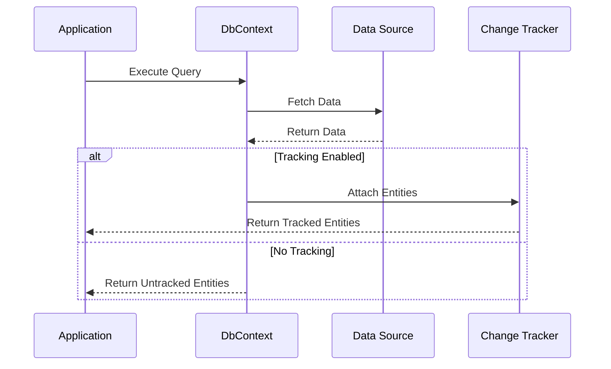
```mermaid
sequenceDiagram
    participant App as Application
    participant DbCtx as DbContext
    participant Data as Data Source
    participant Tracker as Change Tracker

    App->>DbCtx: Execute Query
    DbCtx->>Data: Fetch Data
    Data-->>DbCtx: Return Data
    alt Tracking Enabled
        DbCtx->>Tracker: Attach Entities
        Tracker-->>App: Return Tracked Entities
    else No Tracking
        DbCtx-->>App: Return Untracked Entities
    end
```

- **Tracking Query:** Entities are **monitored**, and changes are **saved** to the database.
- **No Tracking Query:** Entities are **not monitored**, and changes are **ignored**.

## 🏁 When to Use Tracking vs. No Tracking
| **Scenario**                   | **Use Tracking** ✅                     | **Use No Tracking** ❌                    |
|--------------------------------|--------------------------------|--------------------------------|
| **CRUD Operations**            | ✅ Yes - Needed for `SaveChanges()`. | ❌ No - Updates won't persist. |
| **Read-Only Queries**          | ❌ No - Unnecessary overhead.    | ✅ Yes - Faster performance.   |
| **Large Dataset Queries**      | ❌ No - High memory usage.      | ✅ Yes - Efficient query execution. |
| **Detached Objects**           | ❌ No - Won’t work for manual state changes. | ✅ Yes - Good for caching/display. |

## 🎯 Conclusion
**Tracking** in EF Core enables **automatic change detection** and is essential for **modifying and persisting** entity changes. However, it comes with **memory overhead**. In contrast, **No Tracking** queries offer **better performance** for **read-only** scenarios.

## 📚 References
- [Microsoft Docs: Querying Data - Change Tracking](https://learn.microsoft.com/en-us/ef/core/querying/tracking)
- [Microsoft Docs: AsNoTracking Method](https://learn.microsoft.com/en-us/dotnet/api/microsoft.entityframeworkcore.entityframeworkqueryableextensions.asnotracking)
- [Entity Framework Core Performance Considerations](https://learn.microsoft.com/en-us/ef/core/performance/)

---
# 🚀 Understanding IQueryable vs. List in .NET Development
## 📌 Introduction
In .NET, `IQueryable<T>` and `List<T>` serve different purposes when working with collections and data. **IQueryable** is designed for **deferred execution** and **remote querying**, while **List** is an in-memory collection used for **immediate** or **eager** data operations. Understanding the differences is crucial for **performance optimization**, **scalable architecture**, and **efficient data handling** in .NET applications.

## 🔍 What is IQueryable?
### ✅ **Definition:**
`IQueryable<T>` is an interface that enables the construction of LINQ queries that can be executed against different data sources, such as **databases, APIs, or other query providers**.
### 🏗️ **Key Features:**
- **Deferred Execution**: Queries are **not executed immediately**, but only when the data is needed.
- **Remote Querying**: Often used by **Entity Framework Core (EF Core)** to translate LINQ into **SQL queries**.
- **Composable**: Multiple LINQ operations can be chained before execution.
- **Optimized Execution**: The database executes only the required operations, reducing memory usage and improving performance.

### 🏗️ **Example: Using IQueryable in EF Core**
```csharp
using var context = new ApplicationDbContext();

// IQueryable query - not yet executed
IQueryable<Product> queryableProducts = context.Products
    .Where(p => p.Price > 100)
    .OrderByDescending(p => p.Rating);

// Execution happens here
var productList = await queryableProducts.ToListAsync();
Console.WriteLine($"Total Products: {productList.Count}");
```

#### 📝 **Explanation**
- The query is **deferred** until `.ToListAsync()` is called.
- EF Core **translates** the LINQ expression into **SQL** before execution.

## 📌 What is List<T>?
### ✅ **Definition:**
`List<T>` is a concrete **in-memory** collection that holds elements in memory and allows **immediate** data operations.

### 🏗️ **Key Features:**
- **Immediate Execution**: Operations are performed as soon as they are called.
- **In-Memory Collection**: The data is **already loaded** into memory.
- **Fast Iteration**: Once materialized, iterating through a list is **efficient**.
- **Best for Small Data Sets**: Useful for working with final results.

### 🏗️ **Example: Using List<T>**
```csharp
var numbers = new List<int> { 1, 2, 3, 4, 5 };

// No deferred execution
int sum = numbers.Sum();
Console.WriteLine($"Sum of list = {sum}");
```

#### 📝 **Explanation**
- `numbers` is **already in memory**, so there is **no deferred execution**.
- Operations like `.Sum()` happen **immediately**.

## 📊 Comparison: IQueryable vs. List<T>
| **Feature**            | **IQueryable<T>**                                        | **List<T>**                                      |
|------------------------|---------------------------------------------------------|--------------------------------------------------|
| **Execution**         | Deferred until materialized (`.ToList()`, `.First()`)  | Immediate Execution                             |
| **Data Source**       | Remote (DB, API, etc.)                                  | In-memory Collection                            |
| **Query Optimization** | Translates into SQL or optimized query                 | Operations happen on already fetched data       |
| **Performance**       | More efficient for filtering, sorting, paging           | Fast iteration but requires all data to be loaded first |
| **When to Use?**      | Querying large datasets, using EF Core                  | Manipulating already loaded data, small datasets |

## 📜 Diagram: Execution Flow

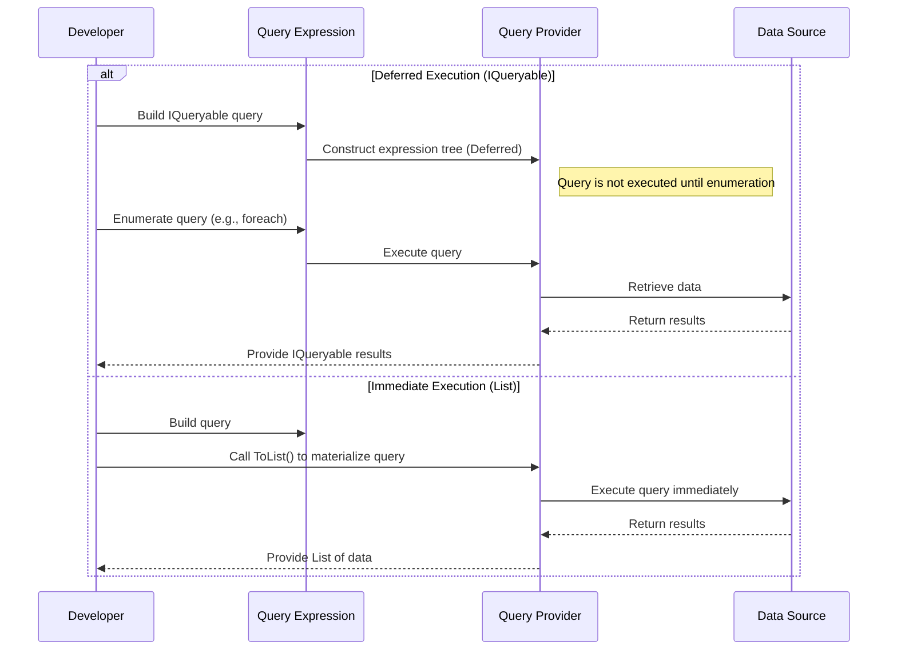
```mermaid
sequenceDiagram
    participant Dev as Developer
    participant Query as Query Expression
    participant Provider as Query Provider
    participant DataSource as Data Source

    alt Deferred Execution (IQueryable)
        Dev->>Query: Build IQueryable query
        Query->>Provider: Construct expression tree (Deferred)
        Note right of Provider: Query is not executed until enumeration
        Dev->>Query: Enumerate query (e.g., foreach)
        Query->>Provider: Execute query
        Provider->>DataSource: Retrieve data
        DataSource-->>Provider: Return results
        Provider-->>Dev: Provide IQueryable results
    else Immediate Execution (List)
        Dev->>Query: Build query
        Dev->>Provider: Call ToList() to materialize query
        Provider->>DataSource: Execute query immediately
        DataSource-->>Provider: Return results
        Provider-->>Dev: Provide List of data
    end
```

- **IQueryable<T>** enables **deferred execution**, allowing query **optimization**.
- **List<T>** is an **already materialized collection**, ready for **in-memory operations**.

## 📦 When to Use Which?
| **Scenario**                 | **Recommended Choice** |
|------------------------------|------------------------|
| Querying a database          | `IQueryable<T>`        |
| Filtering and sorting before execution | `IQueryable<T>` |
| Working with an in-memory collection | `List<T>`        |
| Performing local manipulations | `List<T>`        |
| Avoiding multiple round-trips | `IQueryable<T>` |

## 🎯 Conclusion
- **IQueryable<T>** is ideal for **database queries**, **remote data access**, and **deferred execution**.
- **List<T>** is best for **in-memory operations**, **quick data manipulations**, and **finalized data sets**.
- **Choosing the right approach ensures optimal performance, reduces memory usage, and keeps code maintainable.** 🚀

## 📚 References
- [Microsoft Docs: IQueryable Interface](https://docs.microsoft.com/en-us/dotnet/api/system.linq.iqueryable)
- [Microsoft Docs: LINQ in C#](https://docs.microsoft.com/en-us/dotnet/csharp/linq/)
- [Entity Framework Core Documentation](https://docs.microsoft.com/en-us/ef/core/)

---
# 🚀 Understanding Entity States in .NET Development
## 📦 Introduction
In **Entity Framework Core (EF Core)**, **Entity States** signify how the **DbContext** perceives and manages your entities throughout their lifecycle. These states are fundamental to orchestrating **CRUD** (Create, Read, Update, Delete) operations efficiently, as EF Core relies on them to identify modifications that need to be persisted to the database.
By understanding how entity states transition—such as from `Detached` to `Added`, or `Modified` to `Deleted`—you can design predictable data flows and minimize performance overhead.

## 1. What Are Entity States?
In EF Core, every entity instance tracked by the `DbContext` is assigned a state that indicates its current status in relation to the database. The primary states are:

- **Detached:**  
  The entity is not being tracked by the context. It might have been created manually or removed from the context.

- **Unchanged:**  
  The entity is being tracked by the context, and its values match the values in the database. No modifications have been made since it was loaded.

- **Added:**  
  The entity is new and has been added to the context. It does not yet exist in the database; it will be inserted upon calling `SaveChanges()`.

- **Modified:**  
  The entity exists in the database and has been altered. EF Core tracks the changes, and an update will be issued upon calling `SaveChanges()`.

- **Deleted:**  
  The entity is marked for deletion. It will be removed from the database when `SaveChanges()` is called.

## 2. Characteristics of Entity States
| **State**     | **Description**                                                                                                          | **Usage Scenario**                                     |
|--------------|--------------------------------------------------------------------------------------------------------------------------|--------------------------------------------------------|
| Detached     | Not tracked by the `DbContext`.                                                                                          | New objects not yet added or objects removed from the context. |
| Unchanged    | Tracked by the `DbContext` with no modifications since loading from the database.                                      | Data loaded from the database without changes.         |
| Added        | Tracked by the `DbContext` and scheduled for insertion into the database.                                               | New entities created in the application.               |
| Modified     | Tracked by the `DbContext` and changes have been made compared to the database values.                                   | Existing entities that have been updated.              |
| Deleted      | Tracked by the `DbContext` and marked for removal from the database.                                                     | Entities that are to be removed.                       |

## 3. Entity State Transitions
### 3.1. Change Tracking
EF Core uses a change tracker to monitor the state of entities. This tracker:
- **Automatically detects changes:** When you modify a property on a tracked entity, EF Core marks the entity as `Modified`.
- **Manages state transitions:** When you add a new entity, its state becomes `Added`; when you remove an entity, its state becomes `Deleted`.

### 3.2. SaveChanges() and State Transitions
When you call `SaveChanges()`, EF Core processes entities based on their state:
- **Added:** Inserts new rows into the database.
- **Modified:** Updates existing rows.
- **Deleted:** Removes rows from the database.
- **Unchanged:** No action is taken.
- **Detached:** Not considered since they're not tracked.

After `SaveChanges()` completes, the state of processed entities typically changes to `Unchanged`.

## 4. Practical Example
Consider a scenario where you retrieve, modify, and then delete an entity.
```csharp
using System;
using System.Linq;
using Microsoft.EntityFrameworkCore;

public class Product
{
    public int ProductId { get; set; }
    public string Name { get; set; }
    public decimal Price { get; set; }
}

public class ApplicationDbContext : DbContext
{
    public DbSet<Product> Products { get; set; }
}

public class EntityStateExample
{
    public static void Main()
    {
        using (var context = new ApplicationDbContext())
        {
            // Retrieve an entity (state: Unchanged)
            var product = context.Products.FirstOrDefault(p => p.ProductId == 1);
            Console.WriteLine($"Initial State: {context.Entry(product).State}"); // Output: Unchanged

            // Modify the entity (state changes to Modified)
            product.Price += 50;
            Console.WriteLine($"After Modification: {context.Entry(product).State}"); // Output: Modified

            // Add a new entity (state: Added)
            var newProduct = new Product { Name = "New Product", Price = 200 };
            context.Products.Add(newProduct);
            Console.WriteLine($"New Product State: {context.Entry(newProduct).State}"); // Output: Added

            // Delete an entity (state: Deleted)
            context.Products.Remove(product);
            Console.WriteLine($"After Deletion Mark: {context.Entry(product).State}"); // Output: Deleted

            // Commit changes to the database
            context.SaveChanges();

            // Check state after SaveChanges
            Console.WriteLine($"New Product Post-Save: {context.Entry(newProduct).State}"); // Output: Unchanged
        }
    }
}
```

## 5. Diagram: Entity State Transitions

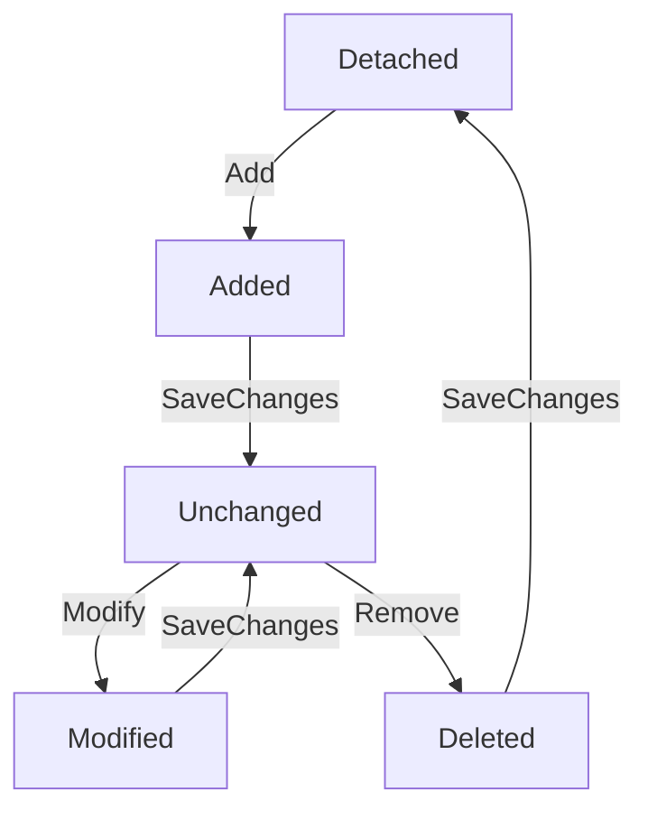
```mermaid
flowchart TD
    A[Detached] -- Add --> B[Added]
    B -- SaveChanges --> C[Unchanged]
    C -- Modify --> D[Modified]
    D -- SaveChanges --> C[Unchanged]
    C -- Remove --> E[Deleted]
    E -- SaveChanges --> A[Detached]
```

- **Explanation:**
  - **Detached to Added:** When a new entity is added to the context.
  - **Added to Unchanged:** After `SaveChanges()`, new entities become unchanged.
  - **Unchanged to Modified:** When an existing entity is updated.
  - **Modified to Unchanged:** After saving changes, modifications are persisted.
  - **Unchanged to Deleted:** When an entity is marked for deletion.
  - **Deleted to Detached:** After `SaveChanges()`, deleted entities are no longer tracked.

## 7. Conclusion
Understanding **Entity States** in EF Core is pivotal for building **predictable**, **maintainable** data layers. By recognizing how states progress—from **Detached** to **Added**, **Unchanged**, **Modified**, or **Deleted**—you can orchestrate **inserts**, **updates**, and **deletes** with greater control. Properly managing states also helps avert unintended database operations, optimizing performance in **enterprise-grade** .NET applications.

---
# 🚀 SaveChanges() and DetectChanges() in .NET Development
## 📘 Introduction
In **Entity Framework Core (EF Core)**, managing the state of entities and persisting changes to the database are fundamental operations. Two key methods that facilitate this process are **SaveChanges()** and **DetectChanges()**. This guide explains in detail what each method does, their characteristics, and how to use them effectively in your application.

## 🔍 Overview
| **Method**       | **Purpose**                                               | **Key Characteristics**                                   |
|-----------------|-----------------------------------------------------------|----------------------------------------------------------|
| `SaveChanges()`  | Persists all changes to the database                     | Calls `DetectChanges()` automatically before execution  |
| `DetectChanges()` | Identifies entity state modifications                   | Updates internal entity states for accurate tracking    |

## 🏗️ Understanding SaveChanges()
### 📌 What is `SaveChanges()`?
- A method on the `DbContext` that commits **all tracked changes** (inserts, updates, and deletes) to the database.
- Aggregates modifications into a **single transaction** to maintain consistency.
- Automatically calls `DetectChanges()` before executing database commands.
### 📌 Example Usage
```csharp
using (var context = new ApplicationDbContext())
{
    var newProduct = new Product { Name = "Smartwatch", Price = 199.99M };
    context.Products.Add(newProduct);
    
    var product = context.Products.FirstOrDefault(p => p.ProductId == 1);
    if (product != null)
    {
        product.Price += 20;
    }
    
    var obsoleteProduct = context.Products.FirstOrDefault(p => p.Name == "Old Phone");
    if (obsoleteProduct != null)
    {
        context.Products.Remove(obsoleteProduct);
    }
    
    int affectedRows = context.SaveChanges();
    Console.WriteLine($"Number of rows affected: {affectedRows}");
}
```

### 📌 How It Works
- **Entities marked as Added → INSERT SQL**
- **Entities marked as Modified → UPDATE SQL**
- **Entities marked as Deleted → DELETE SQL**
- **Unchanged entities → No action**

## 🕵️ Understanding DetectChanges()
### 📌 What is `DetectChanges()`?
- Scans the `DbContext` for **modified, added, or deleted** entities.
- Updates entity states accordingly before saving changes.
- Called automatically by `SaveChanges()`, but can be manually invoked.
### 📌 Example Usage
```csharp
using (var context = new ApplicationDbContext())
{
    var product = context.Products.FirstOrDefault(p => p.ProductId == 1);
    if (product != null)
    {
        product.Price += 50;
        
        context.ChangeTracker.DetectChanges();
        
        var state = context.Entry(product).State;
        Console.WriteLine($"Entity state after modification: {state}"); // Output: Modified
    }
}
```

### 📌 When to Manually Call `DetectChanges()`?
- In **bulk operations**, where frequent automatic change tracking may slow down performance.
- When explicitly modifying entity states in disconnected scenarios.

## 📊 SaveChanges() and DetectChanges() Workflow

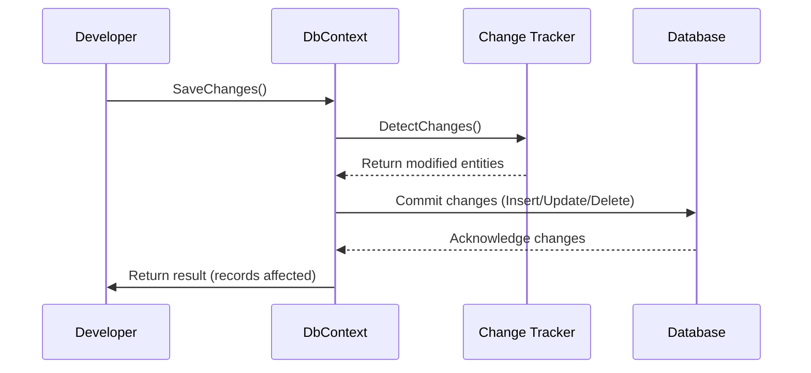
```mermaid
sequenceDiagram
    participant Dev as Developer
    participant DbCtx as DbContext
    participant CT as Change Tracker
    participant DB as Database

    Dev->>DbCtx: SaveChanges()
    DbCtx->>CT: DetectChanges()
    CT-->>DbCtx: Return modified entities
    DbCtx->>DB: Commit changes (Insert/Update/Delete)
    DB-->>DbCtx: Acknowledge changes
    DbCtx->>Dev: Return result (records affected)
```
### 📌 Explanation:
- SaveChanges() Call: The developer invokes SaveChanges() on the DbContext to persist changes.
- DetectChanges() Invocation: Before committing, the DbContext calls DetectChanges() on the Change Tracker, which scans the tracked entities to identify any modifications.
- Change Detection: The Change Tracker returns a list of modified entities (e.g., new, updated, or deleted records).
- Database Commit: The DbContext then commits these changes by performing the appropriate database operations (Insert, Update, or Delete).
- Acknowledgment and Result: Once the database processes the operations and acknowledges the changes, the DbContext returns the result (typically the number of records affected) to the developer.

## 🚀 Best Practices for Efficient Usage
### ✅ Optimize Performance
1. **Bulk Updates**:
   - Disable automatic change tracking for bulk updates.
   ```csharp
   context.ChangeTracker.AutoDetectChangesEnabled = false;
   
   foreach (var item in itemsToUpdate)
   {
       context.Entry(item).State = EntityState.Modified;
   }
   
   context.ChangeTracker.DetectChanges();
   context.SaveChanges();
   
   context.ChangeTracker.AutoDetectChangesEnabled = true;
   ```
   
2. **Use `AsNoTracking()` for Read-Only Queries**:
   - Reduces overhead by skipping change tracking.
   ```csharp
   var products = context.Products.AsNoTracking().Where(p => p.Price > 100).ToList();
   ```

### ✅ When to Use SaveChanges() vs. DetectChanges()
| Scenario              | Recommended Method |
|----------------------|------------------|
| Persisting all entity changes | `SaveChanges()` |
| Manually verifying entity states | `DetectChanges()` |
| Bulk processing updates | `DetectChanges()` manually |
| Read-only queries | `AsNoTracking()` |

## 🏁 Conclusion
- **SaveChanges()** commits all pending changes to the database.
- **DetectChanges()** ensures EF Core accurately tracks modifications.
- Using them effectively **improves performance** and **ensures data consistency** in your .NET applications.

## 📚 References
- [Microsoft Docs: SaveChanges()](https://docs.microsoft.com/en-us/dotnet/api/microsoft.entityframeworkcore.dbcontext.savechanges)
- [Microsoft Docs: DetectChanges()](https://docs.microsoft.com/en-us/dotnet/api/microsoft.entityframeworkcore.changetracking.changetracker.detectchanges)
- [Entity Framework Core Documentation](https://docs.microsoft.com/en-us/ef/core/)

---
# 🚀 Add() vs. AddAsync() in .NET Development
## 📌 Introduction
In **Entity Framework Core (EF Core)**, adding new entities to the `DbContext` is a fundamental operation when inserting data into a database. EF Core provides two primary methods for this: **Add()** and **AddAsync()**. Understanding the difference between these methods is crucial for optimizing performance and ensuring efficient data processing.
This guide explores their **definitions**, **key characteristics**, **use cases**, and **best practices**, supplemented with examples, diagrams, and comparisons.

## 🔍 Key Characteristics
### ✅ `Add()`
- **Definition:**
  - A **synchronous** method that adds an entity to the `DbContext` and marks it as `Added`.
  - The actual insertion occurs when `SaveChanges()` is called.
- **Key Features:**
  - **Synchronous Execution** - Blocks the calling thread.
  - **Immediate State Change** - Entity's state is updated instantly.
  - **Use Case** - Suitable for **simple console apps** or **batch processing** where thread blocking is acceptable.
### 🔄 `AddAsync()`
- **Definition:**
  - The **asynchronous** counterpart to `Add()`, which adds an entity **without blocking the thread**.
- **Key Features:**
  - **Asynchronous Execution** - Returns a `Task` that can be awaited.
  - **Non-Blocking** - Enhances responsiveness in UI applications.
  - **Use Case** - Ideal for **ASP.NET Core**, **high-concurrency applications**, or when **asynchronous database operations** are preferred.

## 📊 Comparison Table
| **Aspect**             | **Add()**                                    | **AddAsync()**                                |
|------------------------|---------------------------------------------|----------------------------------------------|
| **Execution Model**    | Synchronous                                | Asynchronous (`Task<EntityEntry<TEntity>>`) |
| **Thread Blocking**    | Yes                                        | No                                          |
| **Use Case**          | Console apps, batch processing              | UI apps, web servers                        |
| **Underlying I/O**     | Minimal, since adding is in-memory         | Useful if key generation involves I/O       |
| **Paired With**       | `SaveChanges()`                             | `SaveChangesAsync()`                        |

## 🏗️ How to Use Them
### 1️⃣ Using `Add()`
```csharp
using (var context = new ApplicationDbContext())
{
    var product = new Product { Name = "Laptop", Price = 1200.00M };
    
    // Synchronously add the entity
    context.Products.Add(product);
    
    // Commit changes to persist in the database
    context.SaveChanges();
}
```

### 2️⃣ Using `AddAsync()`
```csharp
using System.Threading.Tasks;
using Microsoft.EntityFrameworkCore;

public async Task AddProductAsync()
{
    using (var context = new ApplicationDbContext())
    {
        var product = new Product { Name = "Smartphone", Price = 800.00M };
        
        // Asynchronously add the entity
        await context.Products.AddAsync(product);
        
        // Asynchronously save changes
        await context.SaveChangesAsync();
    }
}
```

## 📌 Diagram: Add() vs. AddAsync() Workflow

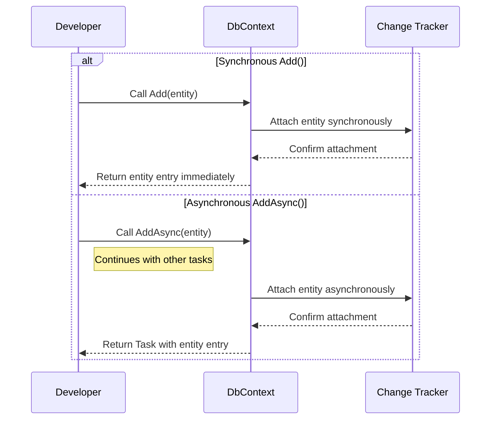
```mermaid
sequenceDiagram
    participant Developer as Developer
    participant DbContext as DbContext
    participant Tracker as Change Tracker

    alt Synchronous Add()
        Developer->>DbContext: Call Add(entity)
        DbContext->>Tracker: Attach entity synchronously
        Tracker-->>DbContext: Confirm attachment
        DbContext-->>Developer: Return entity entry immediately
    else Asynchronous AddAsync()
        Developer->>DbContext: Call AddAsync(entity)
        Note right of Developer: Continues with other tasks
        DbContext->>Tracker: Attach entity asynchronously
        Tracker-->>DbContext: Confirm attachment
        DbContext-->>Developer: Return Task with entity entry
    end
```

### 📌 Explanation:
- Synchronous Add(): When a developer calls the synchronous Add() method, the entity is immediately attached to the DbContext through the Change Tracker. The operation completes in a blocking manner, and the entity entry is returned instantly.
- Asynchronous AddAsync(): When the developer opts for AddAsync(), the entity attachment occurs asynchronously. This non-blocking call allows the developer to continue with other tasks while the operation processes in the background. Ultimately, a Task is returned that, once awaited, provides the attached entity entry.

- **Explanation:**
  - **A to B:** Create a new entity.
  - **B to C:** Add using `Add()` or `AddAsync()`.
  - **C to D:** Entity is marked as *Added*.
  - **D to E:** Call `SaveChanges()` / `SaveChangesAsync()`.
  - **E to F:** Entity is inserted into the database.

## 🔥 Summary
| Feature        | Add() | AddAsync() |
|---------------|------|-----------|
| **Execution** | Synchronous | Asynchronous |
| **Threading** | Blocks execution | Non-blocking |
| **Use Case**  | Small-scale operations | High-performance, UI apps |
| **Pair With** | SaveChanges() | SaveChangesAsync() |

## 📚 References
- [Microsoft Docs: DbSet.AddAsync Method](https://docs.microsoft.com/en-us/dotnet/api/microsoft.entityframeworkcore.dbset-1.addasync)
- [Understanding Asynchronous Programming in C#](https://docs.microsoft.com/en-us/dotnet/csharp/programming-guide/concepts/async/)

---
# 🚀 Efficient Insert Operations in .NET Development
## 📌 Introduction
In **.NET development**, inserting data into a database is a fundamental operation. Depending on the scenario and performance requirements, insert operations can be handled in different ways:
- **Single Insert:** Adding a single record at a time.
- **Loop Insert:** Iteratively adding records in a loop.
- **Batch Insert:** Adding multiple records in a single operation.
- **Bulk Insert:** Optimizing large-scale insertions using specialized libraries.
Understanding these approaches allows developers to optimize performance, minimize database load, and improve application responsiveness.

## 🔍 Key Characteristics of Insert Operations
| **Insert Type**     | **Execution Model** | **Performance** | **Use Case** |
|---------------------|-------------------|-----------------|--------------|
| **Single Insert**  | Synchronous, one entity at a time | Suitable for infrequent inserts | Isolated record insertion (e.g., user registration) |
| **Loop Insert**    | Iterates over collection, inserts individually | Inefficient due to multiple round trips | Small dataset inserts |
| **Batch Insert**   | Multiple entities added, single `SaveChanges()` | More efficient, fewer round trips | Moderate dataset inserts |
| **Bulk Insert**    | Uses specialized libraries for optimized insertion | Best performance for large datasets | Large-scale data imports, ETL |

## 🏗️ Implementing Insert Operations in EF Core
### 1️⃣ Single Insert
```csharp
using (var context = new ApplicationDbContext())
{
    var product = new Product { Name = "Laptop", Price = 1200.00M };
    context.Products.Add(product);
    context.SaveChanges();
}
```
🔹 **Pros:** Simple, easy to implement.
🔹 **Cons:** Not optimal for large-scale insertions.

### 2️⃣ Loop Insert
```csharp
using (var context = new ApplicationDbContext())
{
    var products = new List<Product>
    {
        new Product { Name = "Smartphone", Price = 800.00M },
        new Product { Name = "Tablet", Price = 500.00M }
    };

    foreach (var product in products)
    {
        context.Products.Add(product);
    }
    
    context.SaveChanges();
}
```
🔹 **Pros:** Flexible for dynamically generated data.
🔹 **Cons:** Inefficient if `SaveChanges()` is called inside the loop.

### 3️⃣ Batch Insert
```csharp
using (var context = new ApplicationDbContext())
{
    var products = new List<Product>
    {
        new Product { Name = "Keyboard", Price = 50.00M },
        new Product { Name = "Mouse", Price = 25.00M }
    };

    context.Products.AddRange(products);
    context.SaveChanges();
}
```
🔹 **Pros:** Reduces database round trips, better performance.
🔹 **Cons:** Can still be suboptimal for extremely large datasets.

### 4️⃣ Bulk Insert (Using EFCore.BulkExtensions)
```csharp
using EFCore.BulkExtensions;
using (var context = new ApplicationDbContext())
{
    var largeProductList = GetLargeProductList();
    await context.BulkInsertAsync(largeProductList);
}
```
🔹 **Pros:** Best performance for large-scale insertions.
🔹 **Cons:** Requires third-party libraries.

## 📊 Diagram: Insert Operations Workflow

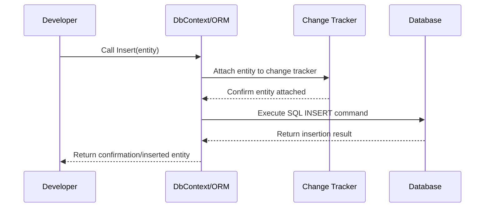
```mermaid
sequenceDiagram
    participant Dev as Developer
    participant DbCtx as DbContext/ORM
    participant Tracker as Change Tracker
    participant DB as Database

    Dev->>DbCtx: Call Insert(entity)
    DbCtx->>Tracker: Attach entity to change tracker
    Tracker-->>DbCtx: Confirm entity attached
    DbCtx->>DB: Execute SQL INSERT command
    DB-->>DbCtx: Return insertion result
    DbCtx-->>Dev: Return confirmation/inserted entity
```
### 📌 Explanation:
- Initiation: The process starts when the Developer calls the Insert operation on the DbContext (or ORM).
- Entity Attachment: The DbContext then attaches the entity to the Change Tracker to monitor its state.
- Command Execution: After the entity is attached, the DbContext executes an SQL INSERT command against the Database.
- Result Handling: The Database returns the result of the insert operation (such as a success indicator or the inserted entity with a generated key), which is then passed back to the Developer.

## 🏁 Conclusion
Choosing the right insert strategy depends on the **dataset size, performance requirements, and application architecture**. While **single inserts** are great for **isolated** transactions, **batch inserts** and **bulk operations** significantly improve performance for **large-scale** data processing. By applying best practices, you can ensure **efficient**, **scalable**, and **optimized** insert operations in .NET applications. 🚀

## 📚 References
- [Microsoft Docs: DbContext.Add Method](https://docs.microsoft.com/en-us/dotnet/api/microsoft.entityframeworkcore.dbcontext.add)
- [EF Core Performance Considerations](https://docs.microsoft.com/en-us/ef/core/performance/)
- [EFCore.BulkExtensions GitHub Repository](https://github.com/borisdj/EFCore.BulkExtensions)

---
# 🚀 Update Operations in .NET Development
## 📌 Introduction
In **.NET Development**, particularly with **Entity Framework Core (EF Core)**, performing **update operations** involves adjusting existing data in the database. Understanding how updates work—both in **tracked** and **no-tracking** scenarios—is vital for building efficient, predictable, and robust data layers. By learning the differences between automatic change tracking and manual or partial updates, you can tailor your approach to specific application requirements.

## 1. Overview
In EF Core, update operations follow these general steps:
1. **Retrieval of Data:**  
   The entity is queried from the database. This can be done with tracking or no-tracking:
   - **Tracking:** The `DbContext` keeps track of the entity’s state.
   - **No-Tracking:** The entity is retrieved without being monitored by the context.
2. **Modification:**  
   The properties of the retrieved entity are modified as needed.
3. **Persisting Changes:**  
   Calling `SaveChanges()` (or `SaveChangesAsync()`) updates the corresponding records in the database.

## 2. Update Operations with Tracking
### 2.1. How It Works
- **Tracking Behavior:**  
  When you query entities with tracking (the default behavior), EF Core monitors the changes to these entities. As you modify the entity properties, EF Core marks them as `Modified`.
- **Automatic Change Detection:**  
  When you call `SaveChanges()`, EF Core automatically detects these changes (using `DetectChanges()`) and generates the appropriate SQL `UPDATE` statements.

### 2.2. Example
```csharp
using (var context = new ApplicationDbContext())
{
    // Retrieve a tracked entity.
    var product = context.Products.FirstOrDefault(p => p.ProductId == 1);
    
    if (product != null)
    {
        // Modify the entity.
        product.Price += 50;
        product.Name = "Updated " + product.Name;
        
        // EF Core tracks these changes automatically.
        context.SaveChanges(); // Updates the record in the database.
    }
}
```

### 2.3. Characteristics
| **Aspect**             | **Tracking Update**                                                             |
|------------------------|---------------------------------------------------------------------------------|
| **Change Detection**   | Automatic via change tracker; modifications are monitored in real-time.         |
| **Ease of Use**        | Simple: modify properties and call `SaveChanges()`.                           |
| **Performance**        | Suitable for moderate workloads; may consume more memory with many tracked entities. |
| **Use Case**           | Ideal when you plan to update data retrieved from the database.                 |

## 3. Update Operations without Tracking
### 3.1. How It Works
- **No-Tracking Behavior:**  
  When entities are retrieved using `AsNoTracking()`, they are not monitored by the `DbContext`. Consequently, changes made to these entities are not automatically detected.
- **Manual Attachment:**  
  To update a no-tracking entity, you must attach it to the context and explicitly mark its state as `Modified`.

### 3.2. Example
```csharp
using (var context = new ApplicationDbContext())
{
    // Retrieve an entity without tracking.
    var product = context.Products.AsNoTracking().FirstOrDefault(p => p.ProductId == 1);
    
    if (product != null)
    {
        // Modify the entity.
        product.Price += 50;
        product.Name = "Updated " + product.Name;
        
        // Attach the entity and mark it as Modified.
        context.Products.Attach(product);
        context.Entry(product).State = EntityState.Modified;
        
        // Persist the changes.
        context.SaveChanges(); // Executes an UPDATE statement.
    }
}
```

### 3.3. Characteristics
| **Aspect**             | **No-Tracking Update**                                                         |
|------------------------|--------------------------------------------------------------------------------|
| **Change Detection**   | Manual: must attach the entity and set its state explicitly to `Modified`.      |
| **Performance**        | Better for read-only queries; extra steps needed for updates may add complexity. |
| **Use Case**           | Useful when working with read-only queries that later need to be updated or for detached entities. |

## 4. Diagram: Update Operation Flow

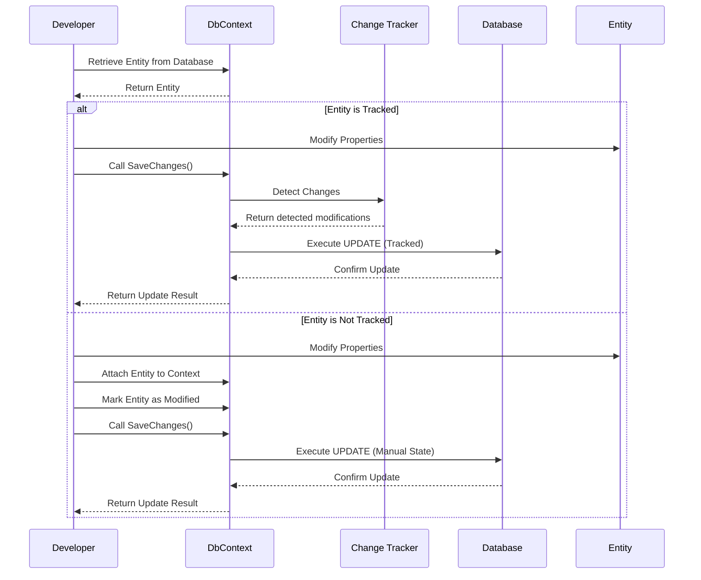
```mermaid
sequenceDiagram
    participant Dev as Developer
    participant DbCtx as DbContext
    participant CT as Change Tracker
    participant DB as Database
    participant Entity as Entity

    Dev->>DbCtx: Retrieve Entity from Database
    DbCtx-->>Dev: Return Entity

    alt Entity is Tracked
        Dev->>Entity: Modify Properties
        Dev->>DbCtx: Call SaveChanges()
        DbCtx->>CT: Detect Changes
        CT-->>DbCtx: Return detected modifications
        DbCtx->>DB: Execute UPDATE (Tracked)
        DB-->>DbCtx: Confirm Update
        DbCtx-->>Dev: Return Update Result
    else Entity is Not Tracked
        Dev->>Entity: Modify Properties
        Dev->>DbCtx: Attach Entity to Context
        Dev->>DbCtx: Mark Entity as Modified
        Dev->>DbCtx: Call SaveChanges()
        DbCtx->>DB: Execute UPDATE (Manual State)
        DB-->>DbCtx: Confirm Update
        DbCtx-->>Dev: Return Update Result
    end
```

- **Explanation:**  
  - For **tracking updates**, the entity is automatically monitored, and calling `SaveChanges()` is sufficient.  
  - For **no-tracking updates**, you must manually attach the entity and mark it as modified before saving changes.

## 5. Summary
- **Tracking Update Operations:**  
  - Retrieve entities normally.
  - Modify properties.
  - Call `SaveChanges()`.
  - EF Core automatically detects changes via the change tracker.
- **No-Tracking Update Operations:**  
  - Retrieve entities using `AsNoTracking()`.
  - Modify properties.
  - Attach the entity to the context and set its state to `Modified`.
  - Call `SaveChanges()` to persist updates.
Understanding the differences between tracking and no-tracking update operations is essential for writing efficient and maintainable .NET applications. Choosing the right approach depends on your specific scenario—whether you prioritize performance for read-only operations or need the simplicity of automatic change tracking for updates.

## 6. Resources and References
- [Microsoft Docs: Change Tracking in EF Core](https://docs.microsoft.com/en-us/ef/core/change-tracking/)
- [Microsoft Docs: AsNoTracking Method](https://docs.microsoft.com/en-us/dotnet/api/microsoft.entityframeworkcore.entityframeworkqueryableextensions.asnotracking)
- [EF Core Performance Considerations](https://docs.microsoft.com/en-us/ef/core/performance/)

---
# 🚀 Delete Operations in .NET Development
In .NET development, deleting data from a database is as important as creating and updating data. Efficient and effective delete operations ensure data integrity and support application requirements such as data cleanup, record removal, or soft deletion. This guide thoroughly explains delete operations, their characteristics, and how to implement them in .NET—particularly using Entity Framework Core (EF Core). We'll cover basic deletion, bulk deletion, and best practices, along with examples, diagrams, and tables for clarity.

## 1. What Are Delete Operations?
**Delete operations** refer to the process of removing data from a database. In EF Core and similar ORMs, this typically involves:
- **Hard Delete:**  
  Permanently removing a record from the database.
- **Soft Delete:**  
  Marking a record as deleted (e.g., setting a flag) without actually removing it, which is useful for audit trails and data recovery.
### Key Aspects:
- **Entity State Management:**  
  When an entity is marked for deletion, its state changes to `Deleted` in the `DbContext`.
- **Execution:**  
  The actual deletion occurs when `SaveChanges()` or `SaveChangesAsync()` is called.
- **Cascading Deletions:**  
  Related entities can be automatically deleted if configured via cascading rules.
- **Bulk Deletions:**  
  Deleting multiple records at once either through looping constructs, `RemoveRange()`, or specialized bulk delete libraries.

## 2. Characteristics of Delete Operations
| **Characteristic**            | **Description**                                                                                           |
|-------------------------------|-----------------------------------------------------------------------------------------------------------|
| **Entity State Change**       | An entity's state is set to `Deleted` when removed from the context.                                      |
| **Transaction Support**       | Delete operations are executed within a transaction when `SaveChanges()` is called, ensuring atomicity.  |
| **Cascading Rules**           | EF Core can cascade delete related entities based on configured relationships (e.g., foreign key constraints).|
| **Performance Considerations**| Bulk deletes can be optimized using `RemoveRange()` or third-party libraries to minimize round trips.  |
| **Soft vs. Hard Delete**      | Soft delete preserves data (by marking it as deleted), while hard delete permanently removes the record.    |

## 3. How to Perform Delete Operations in EF Core
### 3.1. Single (Hard) Delete
#### Example: Deleting a Single Entity
```csharp
using (var context = new ApplicationDbContext())
{
    var product = context.Products.FirstOrDefault(p => p.ProductId == 1);
    
    if (product != null)
    {
        context.Products.Remove(product);
        context.SaveChanges();
    }
}
```
- **Explanation:**  
  The entity is retrieved and then removed using `Remove()`. Calling `SaveChanges()` executes the corresponding SQL `DELETE` statement.

### 3.2. Bulk Delete Using RemoveRange()
#### Example: Bulk Deleting Multiple Entities
```csharp
using (var context = new ApplicationDbContext())
{
    var oldProducts = context.Products.Where(p => p.Price < 50).ToList();
    
    if (oldProducts.Any())
    {
        context.Products.RemoveRange(oldProducts);
        context.SaveChanges();
    }
}
```
- **Explanation:**  
  This approach minimizes database round trips by deleting all matching records in one go.

### 3.3. Soft Delete Implementation
#### Example: Soft Delete Implementation
```csharp
public class Product
{
    public int ProductId { get; set; }
    public string Name { get; set; }
    public decimal Price { get; set; }
    public bool IsDeleted { get; set; }  // Soft delete flag
}

using (var context = new ApplicationDbContext())
{
    var product = context.Products.FirstOrDefault(p => p.ProductId == 1);
    
    if (product != null)
    {
        product.IsDeleted = true;
        context.SaveChanges();
    }
}
```
- **Filtering Out Soft-Deleted Records:**  
  You can use a global query filter in EF Core to automatically exclude soft-deleted records:
```csharp
protected override void OnModelCreating(ModelBuilder modelBuilder)
{
    modelBuilder.Entity<Product>().HasQueryFilter(p => !p.IsDeleted);
}
```

### 3.4. Bulk Delete Using Third-Party Libraries
#### Example: Bulk Delete with EFCore.BulkExtensions
```csharp
using EFCore.BulkExtensions;
using System.Threading.Tasks;

public async Task BulkDeleteOldProductsAsync()
{
    using (var context = new ApplicationDbContext())
    {
        var condition = p => p.Price < 50;
        await context.BulkDeleteAsync(context.Products.Where(condition).ToList());
    }
}
```
- **Explanation:**  
  Bulk deletion methods can significantly reduce execution time by bypassing some of the EF Core change tracking overhead.

## 4. Diagram: Delete Operations Workflow

```mermaid
sequenceDiagram
    participant Dev as Developer
    participant Repo as Repository/ORM
    participant DB as Database

    Dev->>Repo: Retrieve Entity/Entities
    alt Single Delete
        Dev->>Repo: Call Delete(entity)
        Repo->>Repo: Mark entity for deletion
        Dev->>Repo: Call SaveChanges()
        Repo->>DB: Execute DELETE command
        DB-->>Repo: Return deletion confirmation
    else Bulk Delete
        Dev->>Repo: Call BulkDelete (or RemoveRange)
        Repo->>DB: Execute Bulk DELETE command or BulkDeleteAsync()
        DB-->>Repo: Return bulk deletion confirmation
    else Soft Delete
        Dev->>Repo: Set entity's IsDeleted flag (mark as deleted)
        Dev->>Repo: Call SaveChanges() or BulkDeleteAsync()
        Repo->>DB: Execute UPDATE command to mark as deleted
        DB-->>Repo: Return update confirmation
    end
    Repo-->>Dev: Return final deletion result
```
### 📌 Explanation:
- Entity Retrieval: The process begins with the developer retrieving the entity or entities from the repository.
- Decision Path: An alternative path is taken based on the deletion strategy:
- Single Delete: The developer calls a delete method for a single entity. The repository marks the entity for deletion, and after calling SaveChanges(), it sends a DELETE command to the database, which confirms the deletion.
- Bulk Delete: For multiple entities, the developer opts for a bulk delete operation (using methods such as RemoveRange or BulkDeleteAsync()). The repository then executes a bulk deletion command, and the database returns a confirmation.
- Soft Delete: When a soft delete is preferred, the developer updates an entity flag (e.g., setting an IsDeleted property) and calls SaveChanges() or a bulk asynchronous delete method. The repository issues an UPDATE command to mark the entity as deleted rather than removing it, and the database confirms the update.
- Final Confirmation: In all cases, the repository returns the final deletion result to the developer.

## 6. Resources and References
- [Microsoft Docs: EF Core Delete Operations](https://docs.microsoft.com/en-us/ef/core/saving/basic)
- [Microsoft Docs: Global Query Filters](https://docs.microsoft.com/en-us/ef/core/querying/filters)
- [EFCore.BulkExtensions GitHub Repository](https://github.com/borisdj/EFCore.BulkExtensions)
- [Entity Framework Core Documentation](https://docs.microsoft.com/en-us/ef/core/)

## Summary
- **Single Delete:** Use `Remove()` for individual records.
- **Bulk Delete:** Use `RemoveRange()` or third-party libraries for deleting multiple records efficiently.
- **Soft Delete:** Implement soft deletion by marking records as deleted (e.g., using an `IsDeleted` flag) and filtering them out via global query filters.

---
# 🚀 ExecuteUpdate and ExecuteDelete in .NET Development
## 📌 Introduction
In **Entity Framework Core (EF Core) 7** and later, two powerful methods—**`ExecuteUpdate`** and **`ExecuteDelete`**—enable high-performance, set-based update and delete operations directly in the database. These methods allow modifying or removing multiple records in a **single** database round trip, reducing memory overhead and significantly improving efficiency. This guide explores their characteristics, use cases, and implementation with examples, tables, and diagrams.

## 1️⃣ What Are ExecuteUpdate and ExecuteDelete?
| **Method**         | **Functionality**                                                                 |
|--------------------|---------------------------------------------------------------------------------|
| **`ExecuteUpdate`** | Performs a bulk **update** operation on database records using a LINQ predicate. |
| **`ExecuteDelete`** | Deletes multiple records from the database based on a specified condition.      |

### Why Use Them?
✔ **Performance Boost**: Bypasses EF Core's **change tracker**, reducing memory consumption.  
✔ **Efficiency**: Directly translates LINQ expressions into optimized SQL statements.  
✔ **Simplicity**: Provides a declarative syntax for bulk updates/deletes without loading entities.  
✔ **Transactional Integrity**: Operates within transactions, ensuring data consistency.  

## 2️⃣ How to Use ExecuteUpdate
`ExecuteUpdate` allows modifying records **without loading them into memory**. You specify new values using **lambda expressions**.
### Example: Increase Product Prices by 10%
```csharp
using System.Linq;
using System.Threading.Tasks;
using Microsoft.EntityFrameworkCore;

public async Task<int> IncreaseLowPriceProductsAsync(ApplicationDbContext context)
{
    int affectedRows = await context.Products
        .Where(p => p.Price < 100)
        .ExecuteUpdateAsync(setters => setters
            .SetProperty(p => p.Price, p => p.Price * 1.1m)); // Increase price by 10%
    return affectedRows;
}
```

#### SQL Generated:
```sql
UPDATE Products
SET Price = Price * 1.1
WHERE Price < 100;
```

📌 **Note**: The method updates only **specified** properties.

## 3️⃣ How to Use ExecuteDelete
`ExecuteDelete` removes multiple records **without fetching them first**, making it ideal for **bulk deletions**.
### Example: Delete Discontinued Products
```csharp
using System.Linq;
using System.Threading.Tasks;
using Microsoft.EntityFrameworkCore;

public async Task<int> DeleteDiscontinuedProductsAsync(ApplicationDbContext context)
{
    int affectedRows = await context.Products
        .Where(p => p.Discontinued == true)
        .ExecuteDeleteAsync();
    return affectedRows;
}
```

#### SQL Generated:
```sql
DELETE FROM Products
WHERE Discontinued = 1;
```

📌 **Note**: No need to load entities into memory before deleting them.

## 4️⃣ Execution Flow Diagram

```mermaid
flowchart TD
    A[Define IQueryable with Filter Predicate]
    B[Call ExecuteUpdateAsync/ExecuteDeleteAsync]
    C[EF Core Translates to SQL UPDATE/DELETE]
    D[SQL Command Executed on Database]
    E[Return Number of Affected Rows]

    A --> B
    B --> C
    C --> D
    D --> E
```

## 5️⃣ Comparison Table: ExecuteUpdate vs. ExecuteDelete
| **Aspect**                | **ExecuteUpdate**                                   | **ExecuteDelete**                                |
|---------------------------|-----------------------------------------------------|-------------------------------------------------|
| **Operation Type**        | Bulk update of records                            | Bulk deletion of records                       |
| **Execution Model**       | Directly executes an SQL `UPDATE` command         | Directly executes an SQL `DELETE` command      |
| **Change Tracking**       | Bypasses the change tracker; does not load entities | Bypasses the change tracker; does not load entities |
| **Return Value**          | `int` (number of affected rows)                    | `int` (number of affected rows)                |
| **Ideal Use Case**        | Bulk property updates, e.g., adjusting product prices | Bulk removals, e.g., deleting inactive users  |
| **EF Core Version**       | Available in EF Core 7+                           | Available in EF Core 7+                        |

## 6️⃣ Advantages and Limitations
### ✅ **Advantages**
- **🚀 Faster Performance**: No need to load entities before updating/deleting.
- **🔄 Efficient Transactions**: Executes in a single transaction, reducing database overhead.
- **📌 Simple and Declarative**: Use LINQ expressions to define updates/deletions.
### ❌ **Limitations**
- **🚫 No Change Tracking**: Changes are **not** tracked by EF Core.
- **🔍 Limited Complex Logic**: Cannot update relationships or perform entity-level logic.
- **🛑 EF Core 7+ Only**: Not available in older versions.

## 7️⃣ When to Use ExecuteUpdate & ExecuteDelete
| Scenario                          | Recommended Approach |
|----------------------------------|---------------------|
| Update thousands of records at once | ✅ Use `ExecuteUpdate()` |
| Delete large batches of records    | ✅ Use `ExecuteDelete()` |
| Need to trigger EF Core hooks      | ❌ Use `context.Remove()` instead |
| Tracking entity state is necessary  | ❌ Use standard EF Core updates |

## 8️⃣ Resources and References
- [Microsoft Docs: ExecuteUpdate & ExecuteDelete](https://learn.microsoft.com/en-us/ef/core/saving/execute-insert-update-delete)

## 🎯 Conclusion
**ExecuteUpdate** and **ExecuteDelete** are powerful **bulk processing methods** introduced in **EF Core 7**, offering **high-performance updates and deletions** at the database level. By avoiding unnecessary entity tracking, these methods significantly reduce **memory usage** and **database round trips**, making them ideal for **large-scale** data modifications. Use them wisely to **improve efficiency** while ensuring **data integrity** in your .NET applications. 🚀

---
# 🚀 Delete Operation vs. ExecuteDelete Operation in .NET Development
## 📌 Introduction
In .NET development, particularly when using **Entity Framework Core (EF Core)**, deleting records efficiently is crucial for maintaining application performance and data integrity. With EF Core 7, a new method called **`ExecuteDelete()`** was introduced, allowing bulk deletion without loading entities into memory. This document provides an in-depth comparison between traditional delete operations (`Remove()` / `RemoveRange()`) and `ExecuteDelete()`, covering their characteristics, use cases, and best practices.
## 1. Overview
### 🗑 Traditional Delete Operation
- **What It Is:**  
  - Deletes entities by retrieving them first, marking them as deleted (`Remove()` or `RemoveRange()`), and then calling `SaveChanges()`.
- **Key Characteristics:**
  - **Entity Tracking**: Entities are loaded and tracked before deletion.
  - **Transactional**: All deletions occur within a `SaveChanges()` transaction.
  - **Cascade Deletes**: Automatically handled if configured.
  - **Performance Overhead**: Can be slow for bulk deletions since entities must be retrieved into memory.

### ⚡ ExecuteDelete Operation
- **What It Is:**  
  - Directly translates a LINQ query into a `DELETE` SQL statement, bypassing entity tracking and memory loading.
- **Key Characteristics:**
  - **No Entity Tracking**: Entities are not loaded into memory.
  - **High Performance**: Faster for bulk deletions as it operates at the database level.
  - **Simple and Declarative**: Uses LINQ syntax to specify which records should be deleted.
  - **Limited Business Logic Handling**: Cannot handle entity events or cascading logic automatically.

## 2. Comparison Table
| **Aspect**               | **Traditional Delete (`Remove/RemoveRange`)** | **ExecuteDelete (`ExecuteDeleteAsync`)** |
|--------------------------|--------------------------------------------|--------------------------------------------|
| **Execution**           | Loads entities into memory before deleting | Directly executes a bulk `DELETE` SQL command |
| **Entity Tracking**     | Yes, tracked and managed by EF Core | No, bypasses EF Core tracking |
| **Performance**        | Suitable for small-scale deletions | Optimized for large-scale deletions |
| **Transaction Handling** | Managed within `SaveChanges()` transaction | Automatically executed within a transaction |
| **Cascading Deletes**   | Can automatically delete related entities | Must be handled manually if needed |
| **Use Case**            | When business logic or entity tracking is required | When high-performance bulk deletion is needed |

## 3. How to Use Them
### 📌 3.1. Traditional Delete Operation
#### 🔹 Deleting a Single Entity
```csharp
using (var context = new ApplicationDbContext())
{
    var product = context.Products.FirstOrDefault(p => p.ProductId == 1);
    if (product != null)
    {
        context.Products.Remove(product);
        context.SaveChanges();
    }
}
```

#### 🔹 Bulk Deletion Using RemoveRange
```csharp
using (var context = new ApplicationDbContext())
{
    var outdatedProducts = context.Products.Where(p => p.Discontinued).ToList();
    if (outdatedProducts.Any())
    {
        context.Products.RemoveRange(outdatedProducts);
        context.SaveChanges();
    }
}
```

### 📌 3.2. ExecuteDelete Operation
#### 🔹 Bulk Delete Using ExecuteDeleteAsync
```csharp
using System.Threading.Tasks;
using Microsoft.EntityFrameworkCore;

public async Task<int> DeleteDiscontinuedProductsAsync(ApplicationDbContext context)
{
    int affectedRows = await context.Products
        .Where(p => p.Discontinued)
        .ExecuteDeleteAsync();
    return affectedRows;
}
```

## 4. Workflow Diagram

```mermaid
sequenceDiagram
    participant Dev as Developer
    participant DbCtx as DbContext/EF Core
    participant DB as Database

    alt Traditional Delete Operation
        Dev->>DbCtx: Retrieve Entities
        Dev->>DbCtx: Mark for Deletion (Remove/RemoveRange)
        Dev->>DbCtx: Call SaveChanges()
        DbCtx->>DB: Generate DELETE commands per entity
        DB-->>DbCtx: Confirm deletion for each entity
        DbCtx-->>Dev: Return deletion result
    else ExecuteDelete Operation
        Dev->>DbCtx: Define IQueryable with delete criteria
        Dev->>DbCtx: Call ExecuteDelete()/ExecuteDeleteAsync()
        DbCtx->>DB: Translate query to SQL DELETE (Bulk Delete)
        DB-->>DbCtx: Execute bulk delete in database
        DbCtx-->>Dev: Return bulk deletion result
    end
```

### 📌 Explanation:
- Traditional Delete Operation:
- The developer retrieves the entities from the database.
- The entities are marked for deletion using methods such as Remove() or RemoveRange().
- The developer then calls SaveChanges(), causing the DbContext to generate individual DELETE commands for each entity.
- The database confirms each deletion, and the final result is returned to the developer.
- ExecuteDelete Operation:
- The developer defines an IQueryable with specific delete criteria.
- By calling ExecuteDelete() or its asynchronous counterpart, the DbContext translates the criteria into a single SQL DELETE statement that performs a bulk deletion.
- The database executes the bulk delete, and the result is returned to the developer.

## 6. Resources and References
- [Microsoft Docs: ExecuteDeleteAsync Method](https://learn.microsoft.com/de-de/ef/core/saving/execute-insert-update-delete)
- [Microsoft Docs: EF Core Delete Operations](https://docs.microsoft.com/en-us/ef/core/saving/basic)
- [Entity Framework Core Documentation](https://docs.microsoft.com/en-us/ef/core/)
- [EF Core Bulk Operations](https://docs.microsoft.com/en-us/ef/core/performance/)

---
# 🚀 Database Migrations in .NET Development
## 📌 Introduction
**Database migrations** are an essential aspect of modern .NET development, especially when using **Entity Framework Core (EF Core)**. Migrations provide a structured approach to managing and applying schema changes as your application evolves. They allow developers to:
- **Version-control** database changes alongside code.
- **Apply schema updates** without losing existing data.
- **Rollback changes** when necessary.
- **Track applied migrations** using the `__EFMigrationsHistory` table.
- **Replay migrations** to reconstruct the database from scratch.
Migrations help maintain a consistent database schema across different environments (development, staging, production) and teams working collaboratively.

## 🔍 What Are Database Migrations?
A **database migration** is a scripted, incremental change to the database schema that is version-controlled and managed using EF Core. Migrations capture changes to the **DbContext** or entity models and generate a corresponding migration file that describes how to modify the schema.
### 🏗️ Key Characteristics of Migrations
| **Feature**               | **Description**                                                                              |
|---------------------------|----------------------------------------------------------------------------------------------|
| **Version Control**       | Tracks schema changes over time and stores them in migration files.                         |
| **Incremental Updates**   | Allows schema modifications to be applied in small, manageable steps.                        |
| **Transactional**         | Ensures changes are executed within a transaction to maintain database integrity.             |
| **Rollback Capability**   | Enables rolling back schema changes if needed.                                                |
| **Automated History**     | Keeps a record of applied migrations in the `__EFMigrationsHistory` table.                    |
| **Environment Agnostic**  | Can be applied to different databases in various environments (Dev, QA, Prod).                |

## 🔧 How Database Migrations Work in EF Core
### 🏗️ 1. Creating a Migration
When you modify your entity models, you must generate a migration to track the schema changes. This can be done using the CLI or **Package Manager Console** (PMC).

```bash
# Using the .NET CLI
> dotnet ef migrations add AddProductTable
```

This command generates a migration file (e.g., `20240215094500_AddProductTable.cs`) containing **Up()** and **Down()** methods:
```csharp
public partial class AddProductTable : Migration
{
    protected override void Up(MigrationBuilder migrationBuilder)
    {
        migrationBuilder.CreateTable(
            name: "Products",
            columns: table => new
            {
                Id = table.Column<int>(nullable: false)
                    .Annotation("SqlServer:Identity", "1, 1"),
                Name = table.Column<string>(nullable: false),
                Price = table.Column<decimal>(nullable: false)
            },
            constraints: table =>
            {
                table.PrimaryKey("PK_Products", x => x.Id);
            });
    }

    protected override void Down(MigrationBuilder migrationBuilder)
    {
        migrationBuilder.DropTable(name: "Products");
    }
}
```

- **Up()** defines how to apply the schema changes.
- **Down()** specifies how to revert them.

### 🚀 2. Applying Migrations to the Database
After creating a migration, you apply it to the database:

```bash
# Apply all pending migrations to the database
> dotnet ef database update
```

This command executes the **Up()** method in the latest migration and updates the `__EFMigrationsHistory` table.

### 🔄 3. Rolling Back a Migration
To revert to a previous migration, specify the migration name:

```bash
# Rollback to a specific migration
> dotnet ef database update PreviousMigrationName
```

If the migration hasn’t been applied yet, you can **remove** it:

```bash
> dotnet ef migrations remove
```

This command deletes the last migration file **without affecting the database**.

## 📊 Comparison: Migrations vs. Manual SQL Scripts
| **Aspect**               | **EF Core Migrations**                                      | **Manual SQL Scripts**                             |
|--------------------------|-----------------------------------------------------------|--------------------------------------------------|
| **Automation**           | Automates schema changes based on model updates.         | Requires manual SQL writing and execution.       |
| **Version Control**      | Can be stored in source control (Git, SVN, etc.).        | Must be manually maintained in scripts.         |
| **Rollback Support**     | Easily rollback to previous migrations.                  | Requires separate rollback scripts.              |
| **Cross-Platform**       | Works with multiple databases (SQL Server, PostgreSQL).  | Needs different SQL dialects for each DB engine. |
| **Developer Experience** | Simple, declarative syntax in C#.                         | Requires database expertise for SQL scripting.   |

## ⚙️ Diagram: Migration Lifecycle

```mermaid
stateDiagram-v2
    [*] --> Planning: Initiate Migration
    Planning --> Assessment: Evaluate Current Environment
    Assessment --> Backup: Create Backups & Rollback Plan
    Backup --> PreMigration: Prepare Resources & Schedule
    PreMigration --> Migration: Execute Data/System Migration
    Migration --> Testing: Validate Migration Success
    Testing --> Deployment: Deploy New System
    Deployment --> Monitoring: Monitor Performance & Stability
    Monitoring --> Completed: Migration Completed Successfully
```

### 📌 Explanation:
- Planning: The migration process begins with defining objectives, scope, and a strategy.
- Assessment: The current environment is evaluated to identify requirements and potential challenges.
- Backup: Critical data and configurations are backed up to ensure a fallback option in case of issues.
- PreMigration: Necessary preparations are made, including resource allocation and scheduling.
- Migration: The actual migration is executed—this may involve data transfer or system reconfiguration.
- Testing: Post-migration tests are performed to validate that everything functions as expected.
- Deployment: The new system is deployed, making it available for use.
- Monitoring: Continuous monitoring ensures performance, stability, and immediate detection of any issues.
- Completed: The process concludes when the migration is confirmed to be successful.

## 🏁 Conclusion
EF Core migrations are a **powerful, structured** way to manage schema changes in .NET applications. They allow for:
- **Incremental updates** to the database schema.
- **Automated tracking** of applied migrations.
- **Rollback capability** for error recovery.
- **Source-controlled database changes** to ensure consistency across environments.

## 📚 References
- [Microsoft Docs - Migrations in EF Core](https://learn.microsoft.com/en-us/ef/core/managing-schemas/migrations/)
- [EF Core CLI Tools](https://learn.microsoft.com/en-us/ef/core/cli/dotnet/)

---
# 🚀 IEntityTypeConfiguration & ApplyConfigurationsFromAssembly in .NET Development
## 📌 Introduction
In **Entity Framework Core (EF Core)**, configuring entity mappings effectively is crucial for maintaining a scalable and maintainable data model. Instead of configuring entities directly in **DbContext**, EF Core provides **IEntityTypeConfiguration<T>**, which allows us to define entity configurations separately. Additionally, **modelBuilder.ApplyConfigurationsFromAssembly(Assembly.GetExecutingAssembly())** automates the process of applying all these configurations within an assembly.
By using these approaches, we can achieve **modularity, maintainability, and better separation of concerns** in EF Core.

## 🔍 Key Characteristics
| Feature                                  | Description                                              | Benefit                                  |
|-----------------------------------------|----------------------------------------------------------|------------------------------------------|
| **IEntityTypeConfiguration<T>**         | Encapsulates entity configuration in a separate class.   | Improves modularity and separation.     |
| **Configure(EntityTypeBuilder<T>)**     | Defines entity mappings using Fluent API.                | Provides fine-grained control.          |
| **ApplyConfigurationsFromAssembly()**   | Automatically scans and applies configurations.         | Reduces manual setup in DbContext.      |
| **Scalability**                         | Suitable for large projects with multiple entities.      | Keeps DbContext clean and maintainable. |

## 🏗️ Implementing IEntityTypeConfiguration<T>
### 1️⃣ Define an Entity Model
```csharp
public class Product
{
    public int ProductId { get; set; }
    public string Name { get; set; }
    public decimal Price { get; set; }
}
```

### 2️⃣ Create a Configuration Class
```csharp
using Microsoft.EntityFrameworkCore;
using Microsoft.EntityFrameworkCore.Metadata.Builders;

public class ProductConfiguration : IEntityTypeConfiguration<Product>
{
    public void Configure(EntityTypeBuilder<Product> builder)
    {
        builder.ToTable("Products");
        builder.HasKey(p => p.ProductId);
        builder.Property(p => p.Name).IsRequired().HasMaxLength(100);
        builder.Property(p => p.Price).HasColumnType("decimal(18,2)");
    }
}
```

### 3️⃣ Apply Configurations in DbContext
```csharp
using Microsoft.EntityFrameworkCore;
using System.Reflection;

public class ApplicationDbContext : DbContext
{
    public DbSet<Product> Products { get; set; }

    protected override void OnModelCreating(ModelBuilder modelBuilder)
    {
        modelBuilder.ApplyConfigurationsFromAssembly(Assembly.GetExecutingAssembly());
        base.OnModelCreating(modelBuilder);
    }
}
```

## ⚙️ Diagram: Configuration Workflow

```mermaid
sequenceDiagram
    participant Dev as Developer
    participant DM as Domain Model
    participant Conf as Configuration Class
    participant Ctx as DbContext
    participant EF as EF Core

    Dev->>DM: Define Domain Model
    Dev->>Conf: Create Configuration Class
    Conf->>EF: Implement IEntityTypeConfiguration<T>
    Dev->>Ctx: Override OnModelCreating()
    Ctx->>EF: Call ApplyConfigurationsFromAssembly()
    EF-->>Ctx: Scan & Apply Configurations
```

### 📌 Explanation:
- Define Domain Model: The process begins with the developer defining the domain model, which represents the entities in the application.
- Create Configuration Class: Next, the developer creates a configuration class that implements the IEntityTypeConfiguration interface to configure entity properties, relationships, and constraints.
- Override OnModelCreating in DbContext: Within the DbContext, the OnModelCreating method is overridden to include the custom configurations.
- Call ApplyConfigurationsFromAssembly(): The DbContext calls the ApplyConfigurationsFromAssembly() method, which instructs EF Core to scan the specified assembly for all configuration classes and apply them automatically. 

## 📊 Comparison Table: Manual vs. Automated Configuration
| Approach                                  | Manual Configuration                          | Automated Configuration                        |
|-------------------------------------------|----------------------------------------------|----------------------------------------------|
| **Setup Complexity**                      | High - must explicitly configure each entity | Low - automatically applies configurations  |
| **Scalability**                           | Harder to scale for large projects          | Easier to maintain across multiple entities |
| **Maintainability**                       | Requires frequent DbContext modifications   | Minimal DbContext modifications required   |
| **Performance**                           | Slightly slower for large models            | More optimized due to automation           |

## 🏁 Conclusion
By leveraging **IEntityTypeConfiguration<T>** and **ApplyConfigurationsFromAssembly()**, developers can efficiently manage entity configurations in **Entity Framework Core**. This approach provides:
✅ **Better separation of concerns**  
✅ **Improved maintainability**  
✅ **Scalability for large projects**  
✅ **Automatic and consistent application of configurations**  
Using these techniques ensures that your EF Core setup remains **clean, efficient, and scalable**, making it easier to manage schema changes over time.

## 📚 References
- [Microsoft Docs: IEntityTypeConfiguration<T>](https://learn.microsoft.com/en-us/dotnet/api/microsoft.entityframeworkcore.ientitytypeconfiguration-1)
- [Microsoft Docs: ApplyConfigurationsFromAssembly](https://learn.microsoft.com/en-us/dotnet/api/microsoft.entityframeworkcore.modelbuilder.applyconfigurationsfromassembly)
- [Entity Framework Core Documentation](https://learn.microsoft.com/en-us/ef/core/)

---
# 🚀 How to Generate a Migration Script in .NET Development
## 📌 Introduction
Database migration scripts are essential in managing schema changes in .NET applications using **Entity Framework (EF) Core**. These scripts allow developers to **review, version control, and deploy** database updates manually or through automated pipelines. This guide explores how to generate and use migration scripts effectively, including key commands, workflow, and best practices.

## 📌 What is a Migration Script?
A **migration script** is a **SQL file** generated by EF Core based on your migration files. It contains SQL statements such as `CREATE TABLE`, `ALTER TABLE`, `DROP TABLE`, etc., which modify the database schema.
### 🔍 Key Purposes
- **Review and Audit:** Developers and DBAs can inspect the SQL before executing it.
- **Controlled Deployment:** Enables manual execution in production environments.
- **Versioning:** Maintains a history of database changes in source control.
- **Reproducibility:** Can be replayed to create or update a database schema consistently.

## 📊 Characteristics of Migration Scripts
| **Characteristic**           | **Description**                                                                                     |
|------------------------------|-----------------------------------------------------------------------------------------------------|
| **Generated from Migrations** | Created from migration files which represent incremental changes to the database model.           |
| **SQL-Based**                | Contains raw SQL commands that can be executed against the database.                              |
| **Reviewable**               | Developers can inspect the generated SQL before applying it to production.                        |
| **Version Controlled**       | Migration files and generated scripts can be stored in **Git** for tracking changes.             |
| **Reproducible**             | Allows schema to be built from scratch or updated to a specific version.                         |
| **Flexible**                 | Can generate scripts for **all migrations**, or a **specific migration range**.                 |

## 🏗️ How to Generate a Migration Script
EF Core provides a **CLI command** to generate migration scripts:

```bash
dotnet ef migrations script
```

### 🔹 Generating Scripts with Different Options
#### 📌 Generate a Script for All Migrations
```bash
dotnet ef migrations script -o AllMigrations.sql
```
✅ This command generates a **complete** SQL script from the initial migration to the latest.

#### 📌 Generate a Script for a Specific Migration Range
```bash
dotnet ef migrations script InitialCreate Migration20230401 -o PartialMigrations.sql
```
✅ This command creates a **delta script** between two migrations.

- `InitialCreate` → **Starting migration**
- `Migration20230401` → **Target migration**

#### 📌 Generate an Idempotent Script
```bash
dotnet ef migrations script --idempotent -o IdempotentScript.sql
```
✅ **Idempotent scripts** ensure that the script only applies migrations that haven't been executed yet, making them **safe** for repeated execution.

## 🔄 Diagram: Migration Script Generation Workflow

```mermaid
flowchart TD
    A[Define Domain Models / DbContext Changes]
    B[Create Migration Files using dotnet ef migrations add]
    C[Store Migration Files in Source Control]
    D[Generate Migration Script using dotnet ef migrations script]
    E[Review and Audit Generated SQL Script]
    F[Deploy Script to Database]
    G[__EFMigrationsHistory Table Updated]

    A --> B
    B --> C
    C --> D
    D --> E
    E --> F
    F --> G
```

## 📋 How to Use the Generated Script
1. **Manual Execution:** Apply the script using **SQL Server Management Studio (SSMS)** or another database tool.
2. **Automated CI/CD Deployment:** Include the script in DevOps pipelines for controlled execution.
3. **Review & Audit:** Inspect the script before applying changes to production.

## 📌 Migration Script vs Database Update
| **Aspect**                 | **Database Update (CLI)**           | **Migration Script**                                |
|----------------------------|-------------------------------------|----------------------------------------------------|
| **Execution**              | EF Core applies changes automatically | Generates a SQL file for manual execution         |
| **Reviewability**          | Minimal review, EF does internal logic | Full SQL visible for inspection                   |
| **Deployment**             | Quick for local development         | Suited for multi-stage environments               |
| **Reusability**            | Not reusable                        | Can be replayed or edited for selective updates   |

## 🏁 Conclusion
**Generating migration scripts** in EF Core provides **control**, **visibility**, and **flexibility** in managing database schema changes. By leveraging migration scripts effectively, teams can ensure **smooth deployments**, **version-controlled updates**, and **auditable database changes**.

## 📚 References
- [Microsoft Docs: Migrations in EF Core](https://learn.microsoft.com/en-us/ef/core/managing-schemas/migrations/)
- [Microsoft Docs: Managing Migrations](https://learn.microsoft.com/en-us/ef/core/managing-schemas/migrations/managing?tabs=dotnet-core-cli)
- [Entity Framework Core GitHub Repository](https://github.com/dotnet/efcore)

---
# 🚀 Rolling Back Migrations and Database Changes in .NET Development

## 📌 Introduction
In **.NET Development**, particularly with **Entity Framework Core (EF Core)**, **rolling back migrations** refers to reverting database schema changes to a previous state. While applying migrations moves your database schema forward, rolling back allows you to **undo mistakes**, remove unnecessary schema changes, or align your database with previous versions of your code. 
This guide explains **why** rolling back migrations is important, **how** it works, and **best practices** to ensure data integrity during rollbacks.

## 📝 1. What is Rolling Back Migrations?
**Rolling back migrations** involves undoing schema changes that were applied through EF Core migrations. This process is essential in the following scenarios:
- A migration introduces bugs or breaks database functionality.
- Schema changes need to be undone due to design reconsiderations.
- You want to revert your database to a previous version for testing or debugging purposes.
- Ensuring alignment between different environments (development, staging, production).
### **Key Components of Migration Rollbacks:**
- **Migration Files**: Incremental C# files representing schema changes.
- **__EFMigrationsHistory Table**: A special table tracking applied migrations.
- **Update Commands**: CLI or programmatic commands used to apply or revert migrations.

## 📊 2. Characteristics of Rolling Back Migrations
| **Characteristic**             | **Description**                                                                                     |
|--------------------------------|-----------------------------------------------------------------------------------------------------|
| **Version Control**            | Migrations are versioned and stored in source control, allowing tracking of schema history.        |
| **Reversibility**              | Each migration contains a `Down()` method that defines how to reverse changes made in `Up()`.       |
| **Transactional Execution**    | Rollback operations execute within a transaction, ensuring database consistency.                   |
| **History Tracking**           | The `__EFMigrationsHistory` table records applied migrations, enabling EF Core to determine rollback scope. |
| **Selective Rollback**         | You can roll back to a specific migration, reverting only the changes after that point.             |

## 📝 3. How to Roll Back Migrations
### 🔄 3.1. Using the CLI (Command Line Interface)
The most common way to rollback migrations is through the `dotnet ef database update` command.
#### **Example: Rolling Back to a Specific Migration**
Assume your migration history contains:
1. `InitialCreate`
2. `AddProductTable`
3. `UpdateProductPrice`
4. `AddCustomerTable` (**Latest**)
To revert from `AddCustomerTable` back to `UpdateProductPrice`, run:

```bash
dotnet ef database update UpdateProductPrice
```

**What Happens:**
- EF Core determines which migrations to rollback using the `__EFMigrationsHistory` table.
- It executes the `Down()` methods of the rolled-back migrations.
- The database schema reverts to the state at `UpdateProductPrice`.

#### **Example: Rolling Back All Migrations (Resetting the Database)**

```bash
dotnet ef database update 0
```

- The target `0` means all migrations should be undone, effectively resetting the database schema.

### 📝 3.2. Rolling Back Programmatically
In some cases, rolling back migrations might need to be controlled via code. This can be achieved using `Migrate()` in `DbContext.Database`.
#### **Example: Programmatically Rolling Back Migrations**
```csharp
using Microsoft.EntityFrameworkCore;
using System;

public class MigrationService
{
    private readonly ApplicationDbContext _context;

    public MigrationService(ApplicationDbContext context)
    {
        _context = context;
    }

    public void RollbackToMigration(string targetMigration)
    {
        try
        {
            // Roll back to the specified migration
            _context.Database.Migrate(targetMigration);
            Console.WriteLine($"Rolled back to migration: {targetMigration}");
        }
        catch (Exception ex)
        {
            Console.WriteLine($"Error during rollback: {ex.Message}");
        }
    }
}
```
- **Usage:** Call `RollbackToMigration("UpdateProductPrice")` to revert all migrations after that point.

## 🎯 4. Diagram: Migration Rollback Workflow

```mermaid
sequenceDiagram
    participant Admin as Administrator
    participant Migrator as Migration Tool
    participant DB as Database
    participant Backup as Backup System

    Admin->>Migrator: Initiate Rollback Request (target migration)
    Migrator->>DB: Retrieve Migration History
    DB-->>Migrator: Return current migration details
    Migrator->>Migrator: Determine rollback target version
    Migrator->>Backup: Retrieve latest backup (if available)
    Backup-->>Migrator: Provide backup data
    Migrator->>DB: Execute rollback script (reverse migration)
    DB-->>Migrator: Confirm rollback execution
    Migrator->>Admin: Notify Rollback Completed Successfully
```

### 📌 Explanation:
- Initiation: The administrator begins the rollback process by sending a rollback request specifying the target migration version.
- Migration History Retrieval: The migration tool queries the database to retrieve the current migration history and determine the state that needs to be reverted.
- Determination: Based on the migration history, the tool identifies the appropriate target version for rollback.
- Backup Retrieval: If available, the system retrieves a backup from the backup system to ensure data integrity during the rollback.
- Rollback Execution: The migration tool then executes a rollback script (often a reverse migration) to revert the database schema and data to the desired state.
- Confirmation: The database confirms that the rollback has been applied, and the migration tool notifies the administrator of the successful rollback.

## 🛠️ 5. Considerations & Best Practices
| **Scenario**                   | **Potential Outcome & Solution**                    |
|--------------------------------|--------------------------------------------------|
| **Dropping a Table**            | Data is lost unless backed up. Use `Backup/Restore` before rollback. |
| **Removing a Column**           | Column data is lost. Consider marking it as **nullable** instead of dropping it. |
| **Renaming Columns or Tables**  | Data might be lost if not handled carefully. Use migration scripts to preserve data. |
| **Constraint Changes**          | Foreign key constraints might break relationships. Ensure cascading effects are considered. |

## 🎉 7. Summary
Database migrations in EF Core provide a powerful framework for evolving your database schema alongside your application. Understanding how to **roll back** migrations safely ensures that your application remains stable and maintainable.
### **Key Takeaways:**
1. **Migrations are Version Controlled:** Changes are tracked in **source control** and **`__EFMigrationsHistory`**.
2. **Rollback Can Be Selective:** Use **`dotnet ef database update <MigrationName>`** to revert changes after a specific migration.
3. **Database State Is Reversible:** EF Core ensures atomic rollbacks using **`Down()`** methods in migration files.
4. **Best Practices:** Always **backup your database**, **test rollbacks** in staging, and **use small incremental migrations**.

## 📃 6. Resources and References
- [Microsoft Docs: Migrations in EF Core](https://docs.microsoft.com/en-us/ef/core/managing-schemas/migrations/)
- [EF Core Update-Database](https://www.learnentityframeworkcore.com/migrations/update-database)
- [Entity Framework Core Documentation](https://docs.microsoft.com/en-us/ef/core/)
- [EF Core GitHub Repository](https://github.com/dotnet/efcore)

---
# 🚀 EF Bundles in .NET Development
Entity Framework (EF) Bundles are a powerful feature in modern .NET development that optimize database interactions by grouping multiple queries into a single round trip. Introduced in EF Core 7, this feature significantly reduces database latency and enhances performance, particularly for read-heavy applications.

## 1️⃣ Overview
### 🔍 What Are EF Bundles?
EF Bundles allow multiple LINQ queries to be executed as a single composite SQL statement. Instead of making multiple round trips to the database, the queries are bundled together, and the database returns multiple result sets in a single response.
### 💡 Why Use EF Bundles?
- **📉 Reduced Round Trips**: Minimizes network latency by executing queries in a single call.
- **⚡ Improved Performance**: Particularly useful in scenarios with multiple related queries.
- **🧑‍💻 Simplified Code**: Eliminates the need for multiple separate calls within application logic.
- **🔄 Asynchronous Support**: Seamlessly integrates with EF Core's asynchronous query execution.
- **🗂️ Organized Query Execution**: Ensures related queries are executed together, improving consistency.
- **📊 Better Resource Utilization**: Reduces strain on the database server by optimizing query execution.

## 2️⃣ Key Characteristics
| Feature                  | Description |
|--------------------------|-------------|
| **Bundling Queries**     | Groups multiple queries into a single database call |
| **Deferred Execution**   | Executes queries only when materialized (e.g., `ToListAsync()`) |
| **Performance Boost**    | Reduces the number of separate round trips, improving efficiency |
| **Seamless Integration** | Works with existing EF Core LINQ queries without major refactoring |
| **Asynchronous Support** | Fully compatible with EF Core's async methods |
| **Reduced Query Parsing**| The database engine processes fewer distinct query requests, enhancing efficiency |
| **Lower Transaction Overhead** | Reduces transaction locking times and improves concurrency |

## 3️⃣ Implementing EF Bundles
### ❌ Without EF Bundles
Each query makes a separate round trip to the database:
```csharp
var expensiveProducts = await context.Products
    .Where(p => p.Price > 100)
    .ToListAsync();

var activeCustomers = await context.Customers
    .Where(c => c.IsActive)
    .ToListAsync();
```

### ✅ Using EF Bundles
Bundling queries into a single database call:
```csharp
var expensiveProductsQuery = context.Products.Where(p => p.Price > 100);
var activeCustomersQuery = context.Customers.Where(c => c.IsActive);

var bundle = context.Bundle(expensiveProductsQuery, activeCustomersQuery);
var (expensiveProducts, activeCustomers) = await bundle.ExecuteAsync();
```

### 📌 Additional Considerations
- **Ensure Query Compatibility**: Some EF queries may not be supported in bundled execution.
- **Test Performance Gains**: Measure execution speed before and after applying bundling.
- **Monitor Database Load**: Bundling may increase the complexity of SQL execution plans.

## 4️⃣ EF Bundles Workflow Diagram

```mermaid
flowchart TD
    A[Define Query 1: Expensive Products]
    B[Define Query 2: Active Customers]
    C[Bundle Queries using EF Bundles]
    D[Generate Composite SQL Command]
    E[Single Database Round Trip]
    F[Return Multiple Result Sets]
    G[Map Result Sets to Objects]

    A --> C
    B --> C
    C --> D
    D --> E
    E --> F
    F --> G
```

## 5️⃣ Comparison Table
| Aspect                  | Without Bundles | With EF Bundles |
|-------------------------|----------------|----------------|
| **Database Calls**      | Multiple round trips | Single round trip |
| **Latency**            | Higher | Lower |
| **Performance**        | Moderate | Optimized |
| **Code Complexity**    | Higher | Lower |
| **Transaction Handling** | Each query may trigger its own transaction | Queries execute within a shared context |
| **Network Overhead**   | Increased due to multiple calls | Reduced due to batch processing |
| **Error Handling**     | Errors handled per query | Errors may require batch rollback |

## 📌 Summary
EF Bundles offer a streamlined way to optimize database interactions in EF Core applications. By bundling multiple queries into a single round trip, they improve **performance**, **reduce latency**, and **simplify code**. This feature is especially useful for applications that execute multiple related queries frequently.
✅ **Key Takeaways:**
- Reduce multiple query calls into a **single execution**.
- Decrease **network latency** and database **round trips**.
- Ensure **scalability** and **optimized query execution**.
- Improve **code maintainability** by reducing redundancy.

---
# 🚀 EF Bundles in .NET Development
Entity Framework (EF) Bundles are a powerful feature in modern .NET development that optimize database interactions by grouping multiple queries into a single round trip. Introduced in EF Core 7, this feature significantly reduces database latency and enhances performance, particularly for read-heavy applications.

## 1️⃣ Overview
### 🔍 What Are EF Bundles?
EF Bundles allow multiple LINQ queries to be executed as a single composite SQL statement. Instead of making multiple round trips to the database, the queries are bundled together, and the database returns multiple result sets in a single response.
### 💡 Why Use EF Bundles?
- **📉 Reduced Round Trips**: Minimizes network latency by executing queries in a single call.
- **⚡ Improved Performance**: Particularly useful in scenarios with multiple related queries.
- **🧑‍💻 Simplified Code**: Eliminates the need for multiple separate calls within application logic.
- **🔄 Asynchronous Support**: Seamlessly integrates with EF Core's asynchronous query execution.
- **🌍 Scalability**: Efficiently handles large-scale data retrieval in enterprise applications.
- **💾 Optimized Data Fetching**: Reduces database load by executing a single batched query.

## 2️⃣ Key Characteristics
| Feature                  | Description |
|--------------------------|-------------|
| **Bundling Queries**     | Groups multiple queries into a single database call |
| **Deferred Execution**   | Executes queries only when materialized (e.g., `ToListAsync()`) |
| **Performance Boost**    | Reduces the number of separate round trips, improving efficiency |
| **Seamless Integration** | Works with existing EF Core LINQ queries without major refactoring |
| **Asynchronous Support** | Fully compatible with EF Core's async methods |
| **Reduced Network Overhead** | Optimizes bandwidth usage by consolidating queries |
| **Improved Query Optimization** | Enhances database performance by reducing query fragmentation |

## 3️⃣ Implementing EF Bundles
### ❌ Without EF Bundles
Each query makes a separate round trip to the database:
```csharp
var expensiveProducts = await context.Products
    .Where(p => p.Price > 100)
    .ToListAsync();

var activeCustomers = await context.Customers
    .Where(c => c.IsActive)
    .ToListAsync();
```

### ✅ Using EF Bundles
Bundling queries into a single database call:
```csharp
var expensiveProductsQuery = context.Products.Where(p => p.Price > 100);
var activeCustomersQuery = context.Customers.Where(c => c.IsActive);

var bundle = context.Bundle(expensiveProductsQuery, activeCustomersQuery);
var (expensiveProducts, activeCustomers) = await bundle.ExecuteAsync();
```

### 🛠 Best Practices
- **Use EF Bundles for Batch Queries**: Ideal for scenarios where multiple queries fetch related data.
- **Monitor Execution Plans**: Analyze query execution plans to ensure optimal database performance.
- **Ensure Proper Indexing**: Optimized indexes can further enhance bundled query performance.
- **Log Query Performance**: Use logging to monitor bundled query execution times and optimize accordingly.

## 4️⃣ EF Bundles Workflow Diagram

```mermaid
flowchart TD
    A[Define Query 1: Expensive Products]
    B[Define Query 2: Active Customers]
    C[Bundle Queries using EF Bundles]
    D[Generate Composite SQL Command]
    E[Single Database Round Trip]
    F[Return Multiple Result Sets]
    G[Map Result Sets to Objects]

    A --> C
    B --> C
    C --> D
    D --> E
    E --> F
    F --> G
```

## 5️⃣ Comparison Table
| Aspect                  | Without Bundles | With EF Bundles |
|-------------------------|----------------|----------------|
| **Database Calls**      | Multiple round trips | Single round trip |
| **Latency**            | Higher | Lower |
| **Performance**        | Moderate | Optimized |
| **Code Complexity**    | Higher | Lower |
| **Scalability**        | Limited | High |
| **Database Load**      | Increased | Reduced |

## 📌 Summary
EF Bundles offer a streamlined way to optimize database interactions in EF Core applications. By bundling multiple queries into a single round trip, they improve **performance**, **reduce latency**, and **simplify code**. This feature is especially useful for applications that execute multiple related queries frequently.
### ✨ Key Takeaways:
1. **Boosts Performance**: Reduces database round trips, minimizing latency.
2. **Optimized Data Access**: Fetches multiple datasets efficiently.
3. **Enhances Scalability**: Well-suited for large-scale applications.
4. **Asynchronous Execution**: Works seamlessly with EF Core’s async capabilities.
5. **Reduces Network Overhead**: Improves query efficiency by consolidating requests.

---
# 🚀 Applying Migrations at Runtime in .NET Development
Entity Framework Core (EF Core) allows for **runtime database migrations**, enabling applications to automatically apply pending schema updates during execution. This feature enhances deployment automation, ensures consistency, and simplifies database maintenance, making it particularly useful for CI/CD pipelines and cloud-native applications.
## 1️⃣ Overview
### 🔍 What Are Runtime Migrations?
Runtime migrations refer to the **automatic execution of EF Core migrations** when an application starts or at a specific runtime event. Instead of manually executing migration commands (`dotnet ef database update`), the application detects pending migrations and applies them dynamically.
### 💡 Why Use Runtime Migrations?
- **📉 Reduced Manual Work**: Eliminates the need for manual migration execution during deployment.
- **⚡ Continuous Deployment Ready**: Works seamlessly in CI/CD pipelines, keeping databases in sync with application updates.
- **🧑‍💻 Multi-Tenant Support**: Useful for provisioning databases dynamically for different tenants.
- **🔄 Self-Healing Capability**: Ensures database consistency by applying necessary schema changes on startup.

## 2️⃣ Key Characteristics
| Feature                  | Description |
|--------------------------|-------------|
| **Automated Updates**    | Applies pending migrations at application startup. |
| **Consistency**          | Keeps the database schema aligned with application models. |
| **Deployment Simplicity** | Reduces the need for manual database updates. |
| **Potential Risks**      | Requires careful error handling to avoid unexpected failures. |
| **Environment Suitability** | Best suited for development and staging environments; use cautiously in production. |

## 3️⃣ Implementing Runtime Migrations
### ❌ Without Runtime Migrations (Manual Updates)
```csharp
// Manual migration execution before running the application.
dotnet ef database update
```
### ✅ Using `Database.Migrate()` at Runtime
#### Example in a Console Application
```csharp
using Microsoft.EntityFrameworkCore;

public class Program
{
    public static void Main(string[] args)
    {
        using (var context = new ApplicationDbContext())
        {
            // Apply migrations automatically
            context.Database.Migrate();
        }
        Console.WriteLine("Database migrations applied successfully.");
    }
}
```

#### Example in an ASP.NET Core Application (Program.cs)
```csharp
var builder = WebApplication.CreateBuilder(args);

// Register DbContext
builder.Services.AddDbContext<ApplicationDbContext>(options =>
    options.UseSqlServer(builder.Configuration.GetConnectionString("DefaultConnection")));

var app = builder.Build();

// Apply migrations on startup
using (var scope = app.Services.CreateScope())
{
    var context = scope.ServiceProvider.GetRequiredService<ApplicationDbContext>();
    context.Database.Migrate();
}

app.Run();
```

## 4️⃣ Runtime Migration Workflow Diagram

```mermaid
sequenceDiagram
    participant App as Application
    participant MM as Migration Manager
    participant DB as Database
    participant Logger as Logger
    participant Backup as Backup System

    App->>MM: Start Application & Check for Migrations
    MM->>DB: Retrieve Migration History
    DB-->>MM: Return Migration Status
    MM->>MM: Determine Pending Migrations
    alt Pending Migrations Exist
        MM->>Backup: Initiate Backup (Optional)
        Backup-->>MM: Backup Completed
        MM->>DB: Execute Migration Script(s)
        DB-->>MM: Return Migration Result
        MM->>Logger: Log Migration Outcome
        MM->>App: Return Success & Continue Startup
    else No Pending Migrations
        MM->>Logger: Log "No Migrations Found"
        MM->>App: Continue Startup
    end
```

### 📌 Explanation:
- Application Startup: The application starts and checks if any database migrations are pending.
- Retrieve Migration History: The Migration Manager queries the database to get the current migration status.
- Determine Pending Migrations: The Migration Manager assesses whether there are any migrations that need to be applied.
- Optional Backup: If migrations are pending, an optional backup is initiated to safeguard data before applying changes.
- Execute Migrations: The Migration Manager executes the necessary migration scripts against the database.
- Logging: The outcome of the migration process is logged for auditing and troubleshooting purposes.
- Completion: The Migration Manager notifies the application of the successful migration, or if no migrations were needed, the application continues its startup process.

## 5️⃣ Considerations for Production Use
1. **Data Backup**: Always back up the database before applying migrations in production.
2. **Error Handling**: Implement logging to monitor migration failures.
3. **Controlled Execution**: Consider applying migrations manually in production to avoid unintended schema changes.
4. **Performance Impact**: Large migrations may slow down application startup.
5. **Concurrency Issues**: Avoid multiple instances applying migrations simultaneously to prevent conflicts.

## 6️⃣ Comparison Table: Command-Line vs. Runtime Migrations
| Aspect                  | Command-Line (e.g., `dotnet ef`) | Runtime Migrate() |
|-------------------------|---------------------------------|-------------------|
| **Execution**           | Developer manually runs updates | Automatic on startup |
| **Automation**         | Requires scripting in CI/CD    | Fully automated in application |
| **Risk Level**         | Lower, since it's controlled   | Higher, if not managed properly |
| **Ideal Use Case**     | Production and controlled environments | Development, staging, and auto-scaling apps |

## 7️⃣ Resources and References
- [Microsoft Docs: Applying Migrations](https://learn.microsoft.com/en-us/ef/core/managing-schemas/migrations/applying?tabs=dotnet-core-cli)
- [Migration guide: SQL Server to Azure SQL Database](https://learn.microsoft.com/en-us/data-migration/sql-server/database/guide)

---
# 🚀 EnsureCreated() vs MigrateAsync() in .NET Development
Entity Framework Core (EF Core) offers multiple methods to initialize and update database schemas. Two commonly used approaches are `EnsureCreated()` and `MigrateAsync()`, each serving distinct purposes. Understanding their differences is crucial for choosing the right approach for your application.

## 1️⃣ Overview
### 🔍 What Is `EnsureCreated()`?
- **Definition:**
  `EnsureCreated()` ensures that the database exists and, if not, creates it along with all necessary schema objects.
- **Characteristics:**
  - **No Migrations:** Directly creates the schema without using migration files.
  - **Best for Prototyping:** Ideal for testing or single-user applications with a static schema.
  - **Limitations:** Cannot update an existing database schema. If schema changes, the database must be recreated.
  - **Safe for Repeated Calls:** If the database already exists, no action is taken.
### 🔍 What Is `MigrateAsync()`?
- **Definition:**
  `MigrateAsync()` applies all pending migrations to an existing database, ensuring it aligns with the latest model changes.
- **Characteristics:**
  - **Uses Migrations:** Updates the schema incrementally using migration files.
  - **Best for Production:** Suitable for applications where the database schema evolves over time.
  - **Asynchronous Execution:** Enhances application responsiveness.
  - **Tracks Versioning:** Maintains migration history in the `__EFMigrationsHistory` table.

## 2️⃣ Comparison Table
| **Aspect**             | **EnsureCreated()**                                  | **MigrateAsync()**                                  |
|-----------------------|-------------------------------------------------|--------------------------------------------------|
| **Purpose**           | Creates database and schema if not existing.    | Applies pending migrations to update schema.     |
| **Use of Migrations** | 🚫 No - Direct schema creation.                 | ✅ Yes - Uses migration history.                 |
| **Best Use Cases**    | Quick prototyping, testing, single-user apps.    | Production, evolving applications.               |
| **Schema Evolution**  | ❌ Not supported - Requires database recreation.  | ✅ Fully supported with incremental updates.     |
| **Execution Type**    | 🔄 Synchronous - Executes immediately.            | 🔄 Asynchronous - Non-blocking operation.       |
| **Tracking**         | ❌ No migration history recorded.                  | ✅ Tracks applied migrations in history table.   |

## 3️⃣ How to Use Them
### 3.1. Using `EnsureCreated()`
**When to Use:**
- Early development and prototyping.
- When you do **not** need migration history.
**Example:**
```csharp
using (var context = new ApplicationDbContext())
{
    context.Database.EnsureCreated();
    Console.WriteLine("Database created if it did not exist.");
}
```

⚠ **Note:** `EnsureCreated()` is not compatible with migrations. If you plan to use migrations later, avoid calling `EnsureCreated()` as it may cause conflicts.

### 3.2. Using `MigrateAsync()`
**When to Use:**
- When the database schema will **change over time**.
- In production or development environments with **migrations enabled**.
**Example (Asynchronous):**
```csharp
using System;
using System.Threading.Tasks;
using Microsoft.EntityFrameworkCore;

public class Program
{
    public static async Task Main(string[] args)
    {
        using (var context = new ApplicationDbContext())
        {
            await context.Database.MigrateAsync();
            Console.WriteLine("Database migrations applied successfully.");
        }
    }
}
```

**Example in ASP.NET Core Startup:**
```csharp
using Microsoft.AspNetCore.Builder;
using Microsoft.EntityFrameworkCore;
using Microsoft.Extensions.DependencyInjection;

public class Startup
{
    public void Configure(IApplicationBuilder app)
    {
        using (var serviceScope = app.ApplicationServices.CreateScope())
        {
            var context = serviceScope.ServiceProvider.GetRequiredService<ApplicationDbContext>();
            context.Database.MigrateAsync().GetAwaiter().GetResult();
        }
        
        app.UseRouting();
        app.UseEndpoints(endpoints => { endpoints.MapControllers(); });
    }
}
```

## 4️⃣ Diagram: EnsureCreated vs. MigrateAsync Workflow

```mermaid
sequenceDiagram
    participant App as Application
    participant EF as EF Core
    participant DB as Database

    alt EnsureCreated() Workflow
        App->>EF: Call EnsureCreated()
        EF->>DB: Check if database & schema exist
        DB-->>EF: Return status (exists/not exists)
        alt Database does not exist
            EF->>DB: Create database and schema
            DB-->>EF: Confirm creation
        else Database exists
            EF-->>App: Database already exists
        end
        EF-->>App: Return EnsureCreated() result
    else MigrateAsync() Workflow
        App->>EF: Call MigrateAsync()
        EF->>DB: Retrieve migration history
        DB-->>EF: Return applied migrations
        EF->>DB: Compare with available migrations
        alt Pending migrations exist
            EF->>DB: Execute migration scripts
            DB-->>EF: Confirm migration execution
        else No pending migrations
            EF-->>App: Database is up-to-date
        end
        EF-->>App: Return migration outcome
    end
```

### 📌Explanation:
#### EnsureCreated() Workflow:
- The application calls EnsureCreated(), prompting EF Core to check if the database and its schema exist.
- If the database does not exist, EF Core creates it along with the required schema.
- If the database already exists, EF Core simply returns a status indicating readiness.
- This approach is generally used in development or testing scenarios where full migration support is not required.
#### MigrateAsync() Workflow:
- The application calls MigrateAsync(), which retrieves the current migration history from the database.
- EF Core then compares this history with the available migrations in the application.
- If there are pending migrations, EF Core executes the corresponding migration scripts to update the database schema.
- If no migrations are pending, EF Core returns a status indicating that the database is already up-to-date.
- This method is typically used in production scenarios where maintaining schema evolution is crucial. 

## 5️⃣ Summary
| Feature                  | EnsureCreated() | MigrateAsync() |
|--------------------------|----------------|---------------|
| **Best For**            | Prototyping, simple apps | Production, evolving DBs |
| **Schema Updates**      | ❌ No updates allowed | ✅ Schema evolves with migrations |
| **Migration History**   | ❌ No history | ✅ Tracks in `__EFMigrationsHistory` |
| **Execution**           | 🔄 Synchronous | 🔄 Asynchronous |

🚀 **Key Takeaways:**
- `EnsureCreated()` is best for quick, one-time setups but lacks migration support.
- `MigrateAsync()` is essential for real-world applications that require schema updates over time.

## 6️⃣ Resources and References
- [Microsoft Docs: `Database.Migrate()`](https://learn.microsoft.com/en-us/dotnet/api/microsoft.entityframeworkcore.relationaldatabasefacadeextensions.migrate?view=efcore-9.0)
- [Microsoft Docs: `EnsureCreated()`](https://learn.microsoft.com/en-us/dotnet/api/microsoft.entityframeworkcore.infrastructure.databasefacade.ensurecreated?view=efcore-9.0)
- [Entity Framework Core Migrations](https://docs.microsoft.com/en-us/ef/core/managing-schemas/migrations/)

---
# 🚀 Defining Relationships in .NET Development
Entity relationships play a crucial role in .NET development, especially when using **Entity Framework Core (EF Core)** as an Object-Relational Mapping (ORM) framework. Understanding and correctly defining **one-to-one (1:1), one-to-many (1:N), and many-to-many (M:N)** relationships ensures **data integrity**, **efficient querying**, and **scalable application design**.

## 1️⃣ Overview
### 🔍 What Are Relationships in EF Core?
**Relationships** define how different entities (or database tables) connect to each other in an application. They model real-world associations (e.g., a customer has many orders) and establish constraints such as **foreign keys** and **cascading behaviors**.
### 💡 Why Use Relationships?
- **🔗 Data Integrity:** Ensure referential integrity between related entities.
- **📊 Query Optimization:** Use navigation properties to efficiently retrieve related data.
- **🏗️ Model Real-World Structures:** Represent hierarchical data, such as users and their profiles.
- **♻️ Cascading Actions:** Define how changes propagate across related entities (cascade delete, update, etc.).

## 2️⃣ Types of Relationships
### 2.1 One-to-One (1:1)
- **Definition:** Each instance of Entity A relates to **exactly one** instance of Entity B.
- **Example:** A `User` has one `UserProfile`.

### 2.2 One-to-Many (1:N)
- **Definition:** One instance of Entity A relates to **multiple** instances of Entity B, but each instance of B relates to only **one** instance of A.
- **Example:** A `Customer` has many `Orders`.

### 2.3 Many-to-Many (M:N)
- **Definition:** Multiple instances of Entity A relate to multiple instances of Entity B.
- **Example:** A `Student` can enroll in many `Courses`, and a `Course` can have many `Students`.

## 3️⃣ Characteristics of Relationships
| **Characteristic**         | **Description**                                                                                                      |
|----------------------------|----------------------------------------------------------------------------------------------------------------------|
| **Navigation Properties**  | Enable traversal from one entity to another (e.g., `Customer.Orders`).                                                |
| **Foreign Keys**           | Define links between entities in the database (e.g., `Order.CustomerId`).                                             |
| **Cascading Behavior**     | Control how updates or deletions propagate across related entities.                                                    |
| **Multiplicity**           | Specifies the number of instances participating in a relationship (1:1, 1:N, M:N).                                    |
| **Optional vs. Required**  | Relationships can be **optional** (nullable foreign key) or **required** (non-nullable foreign key).                  |

## 4️⃣ How to Configure Relationships in EF Core
### 4.1 One-to-Many Example
**Domain Models:**
```csharp
public class Customer
{
    public int CustomerId { get; set; }
    public string Name { get; set; }
    public List<Order> Orders { get; set; }
}

public class Order
{
    public int OrderId { get; set; }
    public DateTime OrderDate { get; set; }
    public int CustomerId { get; set; }
    public Customer Customer { get; set; }
}
```

**Fluent API Configuration:**
```csharp
protected override void OnModelCreating(ModelBuilder modelBuilder)
{
    modelBuilder.Entity<Customer>()
        .HasMany(c => c.Orders)
        .WithOne(o => o.Customer)
        .HasForeignKey(o => o.CustomerId)
        .IsRequired();
}
```

### 4.2 One-to-One Example
**Domain Models:**
```csharp
public class User
{
    public int UserId { get; set; }
    public string Username { get; set; }
    public UserProfile Profile { get; set; }
}

public class UserProfile
{
    public int UserProfileId { get; set; }
    public string Bio { get; set; }
    public int UserId { get; set; }
    public User User { get; set; }
}
```

**Fluent API Configuration:**
```csharp
protected override void OnModelCreating(ModelBuilder modelBuilder)
{
    modelBuilder.Entity<User>()
        .HasOne(u => u.Profile)
        .WithOne(p => p.User)
        .HasForeignKey<UserProfile>(p => p.UserId);
}
```

### 4.3 Many-to-Many Example (EF Core 5+)
**Domain Models:**
```csharp
public class Student
{
    public int StudentId { get; set; }
    public string Name { get; set; }
    public List<Course> Courses { get; set; }
}

public class Course
{
    public int CourseId { get; set; }
    public string Title { get; set; }
    public List<Student> Students { get; set; }
}
```

**Fluent API Configuration:**
```csharp
protected override void OnModelCreating(ModelBuilder modelBuilder)
{
    modelBuilder.Entity<Student>()
        .HasMany(s => s.Courses)
        .WithMany(c => c.Students);
}
```

## 5️⃣ Diagram: Relationship Types

```mermaid
flowchart TD
    A[One-to-One]
    B[One-to-Many]
    C[Many-to-Many]

    subgraph One-to-One
        A1[User] -- "has one" --> A2[UserProfile]
        A2 -- "belongs to" --> A1
    end

    subgraph One-to-Many
        B1[Customer] -- "has many" --> B2[Order]
        B2 -- "belongs to" --> B1
    end

    subgraph Many-to-Many
        C1[Student] -- "enrolled in" --> C2[Course]
        C2 -- "has many" --> C1
    end
```

## 6️⃣ Fluent API vs. Data Annotations
| **Aspect**         | **Fluent API**                         | **Data Annotations**              |
|-------------------|----------------------------------|----------------------------------|
| **Definition**    | Uses `OnModelCreating()`        | Uses attributes like `[ForeignKey]`  |
| **Customization** | More flexible, fine-grained control | Limited to simple relationships   |
| **Readability**   | Requires additional code        | Embedded in the model class      |

## 7️⃣ Summary
Entity relationships in EF Core define how **tables** connect in a **database schema**. Key takeaways:
- **One-to-One (1:1):** One entity corresponds to exactly one other entity.
- **One-to-Many (1:N):** One entity can have multiple related entities.
- **Many-to-Many (M:N):** Entities are interconnected through a join table.
- **Fluent API** provides greater control, while **Data Annotations** offer a simpler alternative.

## 📚 Resources
- [Microsoft Docs: EF Core Relationships](https://docs.microsoft.com/en-us/ef/core/modeling/relationships)
- [Microsoft Docs: Entity Framework Core Fluent API](https://docs.microsoft.com/en-us/ef/core/modeling/)

---
# 🚀 Navigation Properties in .NET Development
## 📖 Introduction
**Navigation properties** are a key concept in **Entity Framework (EF) Core** that allow developers to define relationships between entities in a database model. They provide a way to traverse and query related entities, making it easier to manage complex data structures while maintaining referential integrity.
In this guide, we will explore:
- What **navigation properties** are.
- Different **types** of relationships and how to implement them.
- How to **load** related data efficiently.
- **Code examples**, **diagrams**, and **best practices** for real-world applications.

## 🔍 1. What Are Navigation Properties?
A **navigation property** is a property in an **entity class** that establishes a relationship between two entities. This allows developers to **navigate** from one entity to its related entities without writing complex SQL queries.
### ✅ Key Benefits of Navigation Properties:
- **Simplified Data Access** → Easily retrieve related data using LINQ queries.
- **Relationship Integrity** → Maintain **foreign key constraints** in the database.
- **Flexible Loading Strategies** → Use **Eager**, **Lazy**, or **Explicit Loading** to control data retrieval.
- **Improved Code Readability** → Allows intuitive object navigation, e.g., `Customer.Orders`.


## 📌 2. Types of Relationships in EF Core
EF Core supports the following types of relationships:
| Relationship Type | Description | Example |
|------------------|-------------|---------|
| **One-to-One (1:1)** | One entity relates to one other entity | A `User` has **one** `UserProfile` |
| **One-to-Many (1:N)** | One entity relates to multiple entities | A `Customer` has **many** `Orders` |
| **Many-to-Many (M:N)** | Multiple entities relate to multiple others | A `Student` enrolls in **many** `Courses`, and vice versa |

## 🏗️ 3. Implementing Navigation Properties in EF Core
### 3.1 One-to-Many Relationship Example
In a **One-to-Many** relationship, one entity can be related to multiple instances of another entity. For example, a `Customer` can have multiple `Orders`, but each `Order` belongs to only one `Customer`.
#### 📌 Defining the Model Classes:
```csharp
public class Customer
{
    public int CustomerId { get; set; }
    public string Name { get; set; }
    
    // Navigation property
    public List<Order> Orders { get; set; } = new();
}

public class Order
{
    public int OrderId { get; set; }
    public DateTime OrderDate { get; set; }
    
    // Foreign key
    public int CustomerId { get; set; }
    
    // Navigation property
    public Customer Customer { get; set; }
}
```

#### 📌 Fluent API Configuration:
```csharp
protected override void OnModelCreating(ModelBuilder modelBuilder)
{
    modelBuilder.Entity<Customer>()
        .HasMany(c => c.Orders)
        .WithOne(o => o.Customer)
        .HasForeignKey(o => o.CustomerId);
}
```

### 3.2 One-to-One Relationship Example
A **One-to-One** relationship exists when an entity has exactly one related entity. A common example is a `User` having a `UserProfile`.
#### 📌 Defining the Model Classes:
```csharp
public class User
{
    public int UserId { get; set; }
    public string Username { get; set; }
    
    // Navigation property
    public UserProfile Profile { get; set; }
}

public class UserProfile
{
    public int UserProfileId { get; set; }
    public string Bio { get; set; }
    
    // Foreign key
    public int UserId { get; set; }
    public User User { get; set; }
}
```

#### 📌 Fluent API Configuration:
```csharp
protected override void OnModelCreating(ModelBuilder modelBuilder)
{
    modelBuilder.Entity<User>()
        .HasOne(u => u.Profile)
        .WithOne(p => p.User)
        .HasForeignKey<UserProfile>(p => p.UserId);
}
```

### 3.3 Many-to-Many Relationship Example
Starting with **EF Core 5**, you can define **Many-to-Many** relationships without explicitly creating a join entity.
#### 📌 Defining the Model Classes:
```csharp
public class Student
{
    public int StudentId { get; set; }
    public string Name { get; set; }
    
    // Navigation property
    public List<Course> Courses { get; set; } = new();
}

public class Course
{
    public int CourseId { get; set; }
    public string Title { get; set; }
    
    // Navigation property
    public List<Student> Students { get; set; } = new();
}
```

#### 📌 Fluent API Configuration:
```csharp
protected override void OnModelCreating(ModelBuilder modelBuilder)
{
    modelBuilder.Entity<Student>()
        .HasMany(s => s.Courses)
        .WithMany(c => c.Students);
}
```

## 🔄 4. Loading Related Data
### 📌 Different Loading Strategies in EF Core
| Loading Strategy | Description | Example |
|------------------|-------------|---------|
| **Eager Loading** | Loads related entities at the same time | `.Include(c => c.Orders)` |
| **Lazy Loading** | Loads related entities **only** when accessed | Requires Proxies |
| **Explicit Loading** | Loads related entities manually via code | `.Entry(c).Collection(o => o.Orders).Load()` |
#### 📌 Example Query with Eager Loading:
```csharp
var customersWithOrders = await context.Customers
                                       .Include(c => c.Orders)
                                       .ToListAsync();
```

## 📊 5. Diagrams: Navigation Properties in Relationships

```mermaid
flowchart TD
    subgraph One-to-Many
        A[Customer] -- has many --> B[Orders]
        B -- belongs to --> A
    end

    subgraph One-to-One
        C[User] -- has one --> D[UserProfile]
        D -- belongs to --> C
    end

    subgraph Many-to-Many
        E[Student] -- enrolls in --> F[Course]
        F -- has many --> E
    end
```

## 📚 7. References
- [Microsoft Docs: EF Core Relationships](https://docs.microsoft.com/en-us/ef/core/modeling/relationships)

## 🏁 Summary
Navigation properties in EF Core allow for **seamless entity relationships** while ensuring **data integrity**. Understanding how to define and load relationships correctly is crucial for **efficient database operations** in .NET applications. With proper configuration and usage, developers can create **scalable and maintainable** applications.

---
# 🚀 One-to-Many Relationship in .NET Development
A **one-to-many relationship** is a fundamental concept in relational database design and is widely used in .NET development with **Entity Framework (EF) Core**. This relationship models scenarios where **one record** in a primary (or "parent") entity is associated with **multiple records** in a related (or "child") entity. Understanding and properly configuring one-to-many relationships is critical for ensuring **data integrity, enforcing referential constraints, and enabling efficient querying.**

## 1️⃣ Overview
### 📌 What Is a One-to-Many Relationship?
A **one-to-many (1:N) relationship** means that:
- A **single instance** of an entity (the **one** side) is related to **multiple instances** of another entity (the **many** side).
- For example, a **Customer** can have multiple **Orders**, but each **Order** belongs to only one **Customer**.
- This is implemented using **foreign keys**, ensuring referential integrity between the tables.
### 🎯 Real-World Examples
- A **Company** has many **Employees**.
- A **Blog** has many **Posts**.
- A **Teacher** has many **Students**.
### 📘 Why Is It Important?
- **Data Integrity:** Prevents orphaned records and enforces parent-child relationships.
- **Efficient Queries:** Enables optimized joins and indexing in relational databases.
- **Simplified Object Navigation:** Supports intuitive data retrieval using **navigation properties**.

## 2️⃣ Characteristics of One-to-Many Relationships
| **Characteristic**        | **Description**                                                                 |
|---------------------------|-----------------------------------------------------------------------------|
| **Parent-Child Structure** | One entity (parent) is linked to multiple entities (children).               |
| **Foreign Key Constraint**| The child entity contains a foreign key referencing the parent entity.        |
| **Navigation Properties** | Both entities can have navigation properties for easy data traversal.         |
| **Cascade Behavior**      | Deleting a parent can optionally delete related children if configured.       |
| **Indexing for Performance** | Foreign key columns should be indexed for efficient queries.               |

## 3️⃣ Defining a One-to-Many Relationship in EF Core
### 🏗️ 3.1. Creating Entity Classes
```csharp
public class Customer
{
    public int CustomerId { get; set; }
    public string Name { get; set; }
    
    // Navigation property: One customer has many orders.
    public List<Order> Orders { get; set; } = new List<Order>();
}

public class Order
{
    public int OrderId { get; set; }
    public DateTime OrderDate { get; set; }
    
    // Foreign key
    public int CustomerId { get; set; }
    
    // Navigation property: Each order belongs to one customer.
    public Customer Customer { get; set; }
}
```

### 🔧 3.2. Configuring with Fluent API
```csharp
using Microsoft.EntityFrameworkCore;

public class ApplicationDbContext : DbContext
{
    public DbSet<Customer> Customers { get; set; }
    public DbSet<Order> Orders { get; set; }

    protected override void OnModelCreating(ModelBuilder modelBuilder)
    {
        modelBuilder.Entity<Customer>()
            .HasMany(c => c.Orders)
            .WithOne(o => o.Customer)
            .HasForeignKey(o => o.CustomerId)
            .IsRequired();
    }
}
```

## 4️⃣ Diagram: One-to-Many Relationship

```mermaid
flowchart TD
    A[Customer] -- has many --> B[Order 1]
    A -- has many --> C[Order 2]
    A -- has many --> D[Order 3]

    B -- belongs to --> A
    C -- belongs to --> A
    D -- belongs to --> A
```

- Each **Customer** has multiple **Orders**, and each **Order** belongs to a single **Customer**.

## 5️⃣ Querying Data with Navigation Properties
### 🔍 5.1. Adding Data
```csharp
using var context = new ApplicationDbContext();

var customer = new Customer { Name = "John Doe" };
customer.Orders.Add(new Order { OrderDate = DateTime.UtcNow });
customer.Orders.Add(new Order { OrderDate = DateTime.UtcNow.AddDays(-1) });

context.Customers.Add(customer);
await context.SaveChangesAsync();
```

### 🔎 5.2. Retrieving Data (Eager Loading)
```csharp
var customerWithOrders = await context.Customers
    .Include(c => c.Orders)
    .FirstOrDefaultAsync(c => c.CustomerId == someId);

Console.WriteLine($"Customer: {customerWithOrders.Name}");
foreach (var order in customerWithOrders.Orders)
{
    Console.WriteLine($"Order #{order.OrderId}, Date: {order.OrderDate}");
}
```

## 6️⃣ Performance Optimization & Best Practices
| **Aspect**               | **Best Practice**                                                   |
|-------------------------|------------------------------------------------------------------|
| **Foreign Key Indexing** | Ensure foreign keys are indexed for faster queries.             |
| **Eager Loading**       | Use `.Include()` to fetch related data efficiently.             |
| **Lazy Loading**        | Enable lazy loading only when necessary to avoid unnecessary queries. |
| **Cascade Delete**      | Configure cascading deletion based on business requirements.     |
| **Batch Inserts**       | Use `AddRange()` to insert multiple related entities efficiently.|

## 📌 Summary
- **One-to-Many Relationships** are a key concept in EF Core, enabling structured relationships between entities.
- **Navigation Properties** allow easy traversal between parent and child entities.
- **Foreign Keys** ensure data integrity and enforce referential constraints.
- **Cascade Behavior** helps manage deletions efficiently.
- **Fluent API & Data Annotations** provide flexibility in defining relationships.
By applying best practices, using efficient querying strategies, and leveraging EF Core’s powerful relationship mapping features, you can design **scalable, high-performance** applications with well-structured data models. 🚀

---
# 🚀 ReferentialAction in .NET Development
## 📌 Introduction
In **.NET Development**, particularly with **Entity Framework Core (EF Core)**, managing relationships between database entities is crucial for maintaining **referential integrity**. One key aspect of this is configuring **Referential Actions**, which determine what happens to **dependent entities** when a **principal entity** is deleted.
The behavior of **referential actions** is specified using **`onDelete: ReferentialAction`**, which is mapped to the `DeleteBehavior` enumeration in EF Core. Understanding and properly configuring this setting is critical for data consistency, performance, and ensuring that database relationships function as expected.
This guide provides an in-depth explanation of `ReferentialAction`, its characteristics, and how to configure it properly in EF Core with examples, diagrams, and best practices.

## 🔍 What is `onDelete: ReferentialAction`?
`onDelete: ReferentialAction` determines how foreign key constraints behave when the **parent (principal) entity** is deleted.
### 💡 Why is it Important?
- **Ensures Data Integrity** – Prevents orphaned records or unintended data loss.
- **Controls Cascade Behavior** – Specifies whether child entities should be **deleted**, **set to null**, or **restricted** from deletion.
- **Improves Database Performance** – Optimizes how deletions are processed, reducing the risk of constraint violations.
- **Aligns Business Rules** – Ensures database behavior follows logical business constraints.

## 🛠 Types of Referential Actions
EF Core allows configuring referential actions via the **DeleteBehavior** enumeration. This setting defines what happens when a principal entity is deleted.
| **ReferentialAction / DeleteBehavior**  | **Description**                                                                                      | **Use Case**                                                                      |
|-----------------------------------------|----------------------------------------------------------------------------------------------------|----------------------------------------------------------------------------------|
| **Cascade (`DeleteBehavior.Cascade`)**  | When a parent entity is deleted, all dependent child entities are automatically deleted.          | When child data should not exist without its parent (e.g., Order and OrderItems). |
| **Restrict (`DeleteBehavior.Restrict`)** | Prevents deletion of the parent entity if any dependent entities exist.                           | When you want to enforce that a parent cannot be deleted if children exist.       |
| **SetNull (`DeleteBehavior.SetNull`)**   | Sets the foreign key in dependent entities to `NULL` when the parent is deleted. (Requires FK to be nullable.) | When a child should retain data but lose its association with the deleted parent. |
| **NoAction (`DeleteBehavior.NoAction`)** | No automatic action is taken by EF Core; the database enforces its default behavior (could cause errors). | When deletion behavior is handled externally or manually.                         |
| **ClientSetNull (`DeleteBehavior.ClientSetNull`)** | Sets the foreign key to `NULL` **only in memory**, but no action is sent to the database. | When you want client-side behavior but don't enforce it on the database.         |

## ⚙️ Configuring Referential Actions in EF Core
### 1️⃣ Using Fluent API
EF Core allows configuring referential actions using the `OnDelete()` method in Fluent API.
#### ✅ Example: Cascade Delete
```csharp
using Microsoft.EntityFrameworkCore;

public class ApplicationDbContext : DbContext
{
    public DbSet<Customer> Customers { get; set; }
    public DbSet<Order> Orders { get; set; }

    protected override void OnModelCreating(ModelBuilder modelBuilder)
    {
        modelBuilder.Entity<Customer>()
            .HasMany(c => c.Orders)
            .WithOne(o => o.Customer)
            .HasForeignKey(o => o.CustomerId)
            .OnDelete(DeleteBehavior.Cascade); // Deletes all orders when a customer is deleted
    }
}
```

#### ✅ Example: SetNull Behavior
```csharp
protected override void OnModelCreating(ModelBuilder modelBuilder)
{
    modelBuilder.Entity<Customer>()
        .HasMany(c => c.Orders)
        .WithOne(o => o.Customer)
        .HasForeignKey(o => o.CustomerId)
        .OnDelete(DeleteBehavior.SetNull); // Sets CustomerId to NULL when Customer is deleted
}
```

> **Important:** `SetNull` requires that the foreign key property (`CustomerId`) is nullable:

```csharp
public class Order
{
    public int OrderId { get; set; }
    public DateTime OrderDate { get; set; }
    public int? CustomerId { get; set; } // Nullable foreign key
    public Customer Customer { get; set; }
}
```

---

## 📊 Referential Action Workflow Diagram

```mermaid
flowchart TD
    A[Customer] -->|has many| B[Order 1]
    A -->|has many| C[Order 2]

    subgraph Cascade Delete
        A -->|Delete Customer| B[Order 1 Deleted]
        A -->|Delete Customer| C[Order 2 Deleted]
    end

    subgraph SetNull Delete
        A -->|Delete Customer| B[Order 1: CustomerId set to NULL]
        A -->|Delete Customer| C[Order 2: CustomerId set to NULL]
    end
```

- **Cascade Delete:** Deleting a `Customer` deletes all `Order` records.
- **SetNull:** Deleting a `Customer` sets `CustomerId` in `Order` records to `NULL`.

## 📌 Best Practices
### ✅ Use the Right Referential Action for the Right Scenario
- **Use `Cascade`** when deleting the parent means that all children should also be removed.
- **Use `SetNull`** when a child entity should remain but lose its reference to the deleted parent.
- **Use `Restrict`** when deletion should not be allowed if dependent entities exist.

### ✅ Always Test Deletion Scenarios
- Before applying `Cascade`, ensure that deleting the parent won’t cause unexpected data loss.
- Ensure `SetNull` only applies to nullable foreign keys.

### ✅ Optimize Performance
- Foreign key relationships should be **indexed** to optimize performance.
- Use **lazy loading** wisely to avoid unnecessary data fetching when dealing with referential constraints.

## 📚 References & Further Reading
- [Microsoft Docs: Delete Behavior in EF Core](https://docs.microsoft.com/en-us/ef/core/saving/cascade-delete)

## 🎯 Summary
In **Entity Framework Core**, `onDelete: ReferentialAction` allows developers to configure **how foreign key constraints behave** when a parent entity is deleted.
- **Cascade Delete:** Automatically deletes dependent entities.
- **SetNull:** Sets the foreign key to `NULL` when the parent is deleted.
- **Restrict:** Prevents deletion if dependent entities exist.
- **NoAction:** No automatic enforcement; database defaults apply.
- **ClientSetNull:** Only nullifies the reference **in memory** without affecting the database.
By carefully choosing and configuring `ReferentialAction`, you can enforce **data integrity**, optimize **database performance**, and align **business rules** with your entity relationships in EF Core.

---
# 🚀 Many-to-Many Relationships in .NET Development
Many-to-many relationships are a core concept in relational database design and play a crucial role in modeling complex data associations in .NET applications, especially when using Entity Framework (EF) Core. This guide explains what many-to-many relationships are, outlines their key characteristics, and demonstrates how to implement and use them effectively with additional details and extended examples.

## 1. What Are Many-to-Many Relationships?
A **many-to-many relationship** occurs when multiple instances of one entity are associated with multiple instances of another entity. For example, in a school system, a **Student** can enroll in multiple **Courses**, and each **Course** can have many **Students**.
### Key Points:
- **Dual Association:** Both entities can have multiple related entities.
- **Join Table:** This relationship is typically implemented in a relational database through a join table (also called an associative or linking table) that contains foreign keys referencing the primary keys of both related entities.
- **Implicit in EF Core 5+:** EF Core 5 and later support many-to-many relationships without explicitly defining a join entity, though you can still define one if you need to store additional information about the relationship.
- **Normalization:** Helps eliminate redundancy and ensure efficient data management.

## 2. Characteristics of Many-to-Many Relationships
| **Characteristic**               | **Description**                                                                                       |
|----------------------------------|-------------------------------------------------------------------------------------------------------|
| **Bidirectional Navigation**     | Both entities have navigation properties to access related data (e.g., `Students` and `Courses`).       |
| **Join Table Usage**             | Underlying database schema uses a join table to map the relationships.                                |
| **Simplicity with EF Core 5+**   | EF Core 5+ allows configuration of many-to-many relationships without explicitly defining a join entity.|
| **Flexibility**                  | Supports additional payload in the join table if a custom join entity is defined.                      |
| **Cascading Behavior**           | Configurable cascading rules determine how deletions are propagated through the relationship.          |
| **Lazy and Eager Loading**       | You can control how related data is loaded using `Include()` for eager loading or proxies for lazy loading.|
| **Indexing for Performance**     | Foreign keys in the join table should be indexed for efficient querying.                              |

## 3. Implementing Many-to-Many Relationships in EF Core
### 3.1. Without a Custom Join Entity (EF Core 5+)
**Domain Models:**
```csharp
public class Student
{
    public int StudentId { get; set; }
    public string Name { get; set; }
    
    // Navigation property: A student can enroll in many courses.
    public List<Course> Courses { get; set; } = new List<Course>();
}

public class Course
{
    public int CourseId { get; set; }
    public string Title { get; set; }
    
    // Navigation property: A course can have many students.
    public List<Student> Students { get; set; } = new List<Student>();
}
```

**Fluent API Configuration (Optional):**
```csharp
protected override void OnModelCreating(ModelBuilder modelBuilder)
{
    modelBuilder.Entity<Student>()
        .HasMany(s => s.Courses)
        .WithMany(c => c.Students)
        .UsingEntity(j => j.ToTable("StudentCourses")); // Custom join table name
}
```

### 3.2. With a Custom Join Entity
If you need to store additional data about the relationship (e.g., enrollment date, grade), define a join entity explicitly.
**Domain Models:**
```csharp
public class Student
{
    public int StudentId { get; set; }
    public string Name { get; set; }
    
    public List<Enrollment> Enrollments { get; set; } = new List<Enrollment>();
}

public class Course
{
    public int CourseId { get; set; }
    public string Title { get; set; }
    
    public List<Enrollment> Enrollments { get; set; } = new List<Enrollment>();
}

public class Enrollment
{
    public int StudentId { get; set; }
    public Student Student { get; set; }
    
    public int CourseId { get; set; }
    public Course Course { get; set; }
    
    public DateTime EnrollmentDate { get; set; }
    public decimal Grade { get; set; }
}
```

**Fluent API Configuration:**
```csharp
protected override void OnModelCreating(ModelBuilder modelBuilder)
{
    modelBuilder.Entity<Enrollment>()
        .HasKey(e => new { e.StudentId, e.CourseId });

    modelBuilder.Entity<Enrollment>()
        .HasOne(e => e.Student)
        .WithMany(s => s.Enrollments)
        .HasForeignKey(e => e.StudentId);

    modelBuilder.Entity<Enrollment>()
        .HasOne(e => e.Course)
        .WithMany(c => c.Enrollments)
        .HasForeignKey(e => e.CourseId);
}
```

## 4. Diagram: Many-to-Many Relationships
### Without Custom Join Entity

```mermaid
classDiagram
    class Student {
      +int Id
      +string Name
    }
    class Course {
      +int Id
      +string Title
    }
    Student "0..*" -- "0..*" Course : EnrolledIn
```

#### Explanation:
- Student and Course: Two primary entities in the relationship.
- Implicit Many-to-Many: The association is represented directly between the two classes via navigation properties.

### With Custom Join Entity

```mermaid
classDiagram
    class Student {
      +int Id
      +string Name
      +List~Enrollment~ Enrollments
    }
    class Course {
      +int Id
      +string Title
      +List~Enrollment~ Enrollments
    }
    class Enrollment {
      +int StudentId
      +int CourseId
      +DateTime EnrollmentDate
      +string Grade
    }
    Student "1" -- "0..*" Enrollment : has
    Course "1" -- "0..*" Enrollment : has
    Enrollment "1" -- "1" Student : belongsTo
    Enrollment "1" -- "1" Course : belongsTo
```

#### Explanation:
- Custom Join Entity (Enrollment): An explicit join entity called Enrollment is introduced to manage the relationship between Student and Course. This entity includes additional properties (like EnrollmentDate and Grade), which provide more context and control over the relationship.
- Navigation Properties: Both Student and Course maintain a collection of Enrollment objects, representing their association with each other.
- Explicit Relationships: The relationships between Student, Course, and Enrollment are clearly defined, with Enrollment serving as the bridge between the two.

## 5. Summary
A many-to-many relationship in .NET development allows you to model associations where multiple entities on one side are related to multiple entities on the other side. This is implemented in EF Core either:
- **Implicitly,** using navigation properties on both sides, with EF Core managing a join table behind the scenes.
- **Explicitly,** by defining a custom join entity (e.g., `Enrollment`) that can include additional fields.
Key benefits include:
- **Flexible Data Modeling:** Accurately represent complex real-world relationships.
- **Efficient Querying:** Simplify access to related data using navigation properties.
- **Data Integrity:** Enforce referential integrity via foreign keys in the join table.
- **Scalability:** Optimized for large datasets when properly indexed.
By configuring many-to-many relationships properly using EF Core's Fluent API and navigation properties, you can create robust and scalable applications.

## 6. References
- [Microsoft Docs: EF Core Relationships](https://docs.microsoft.com/en-us/ef/core/modeling/relationships)
- [Microsoft Docs: Many-to-Many Relationships in EF Core](https://docs.microsoft.com/en-us/ef/core/modeling/relationships/many-to-many)

---
# 🚀 Comprehensive Guide to Configuring the Team Entity in EF Core
## 📘 Introduction
This guide provides a deep dive into configuring the `Team` entity using **Entity Framework Core (EF Core)** Fluent API. The provided code snippet defines a **unique index** on the `Team.Name` property and establishes a **one-to-many relationship** with another entity (e.g., `Match`). 
### ✅ Code Example
```csharp
public void Configure(EntityTypeBuilder<Team> builder)
{
    builder.HasIndex(e => e.Name).IsUnique();
    builder.HasMany(e => e.HomeMatches)
        .WithOne(e => e.HomeTeam)
        .HasForeignKey(e => e.HomeTeamId)
        .IsRequired()
        .OnDelete(DeleteBehavior.Restrict);
}
```
This document will explain each part of the configuration, why it is used, and how it affects the database schema and behavior.

## 📌 Key Configurations Explained
### 🔹 Unique Index on `Name`
```csharp
builder.HasIndex(e => e.Name).IsUnique();
```
- **Purpose**: Ensures that team names are unique.
- **Database Effect**: Creates a `UNIQUE INDEX` constraint on the `Team.Name` column.
- **Benefits**:
  - Prevents duplicate team names.
  - Enhances query performance.
- **Usage Scenario**: Suitable for sports league applications where teams must have unique names.

### 🔹 One-to-Many Relationship with Matches
```csharp
builder.HasMany(e => e.HomeMatches)
    .WithOne(e => e.HomeTeam)
    .HasForeignKey(e => e.HomeTeamId)
    .IsRequired()
    .OnDelete(DeleteBehavior.Restrict);
```
#### Breakdown:
| Configuration | Purpose |
|--------------|---------|
| `HasMany(e => e.HomeMatches)` | A `Team` can have multiple `HomeMatches`. |
| `WithOne(e => e.HomeTeam)` | Each `Match` has a single `HomeTeam`. |
| `HasForeignKey(e => e.HomeTeamId)` | Specifies that `HomeTeamId` is the foreign key in `Match`. |
| `IsRequired()` | Ensures `HomeTeamId` cannot be `NULL`. |
| `OnDelete(DeleteBehavior.Restrict)` | Prevents deleting a `Team` if it has associated `HomeMatches`. |

### 🏗️ Entity Context
#### **Team Entity**
```csharp
public class Team
{
    public int Id { get; set; }
    public string Name { get; set; }
    public List<Match> HomeMatches { get; set; } = new();
}
```
#### **Match Entity**
```csharp
public class Match
{
    public int Id { get; set; }
    public DateTime MatchDate { get; set; }
    public int HomeTeamId { get; set; }
    public Team HomeTeam { get; set; }
}
```

## 🔍 Database Schema Representation
```plaintext
     (Team)                     (Match)
   +-----------+               +-----------+
   | Id (PK)   |   1  ----->   | Id (PK)   |
   | Name (UQ) |               | HomeTeamId (FK, NOT NULL) |
   +-----------+               +-----------+
           ^
           | (one Team)
 (many Matches)

 OnDelete: Restrict => Cannot delete a Team if any Match references it
 Unique Index on Name => Team name is unique
```

## 📊 Table Summary of Configurations
| Configuration | Effect in Database |
|--------------|--------------------|
| `HasIndex(e => e.Name).IsUnique()` | Creates a unique constraint on `Team.Name`. |
| `HasMany(e => e.HomeMatches).WithOne(e => e.HomeTeam)` | Defines a one-to-many relationship. |
| `HasForeignKey(e => e.HomeTeamId)` | Ensures `HomeTeamId` is the foreign key in `Match`. |
| `IsRequired()` | Makes `HomeTeamId` NOT NULL. |
| `OnDelete(DeleteBehavior.Restrict)` | Prevents deletion of `Team` if referenced in `Match`. |

## 🏆 Conclusion
This EF Core Fluent API configuration ensures:
1. **Unique Index on `Team.Name`**: Prevents duplicate team names, ensuring data integrity.
2. **One-to-Many Relationship with `Match`**: Each `Match` must have a valid `HomeTeam`, preventing orphaned records.
3. **Restricted Deletion**: A `Team` cannot be deleted if referenced by `Match` entries, protecting historical data.

---
# 🚀 Comprehensive Guide to Configuring Delete Behavior in EF Core
## 📘 Introduction
This guide provides an in-depth exploration of the `.OnDelete(DeleteBehavior.…)` method in **Entity Framework Core (EF Core)**. It explains how different delete behaviors impact relationships between entities and offers practical examples with Fluent API configurations.
### ✅ Code Example
```csharp
protected override void OnModelCreating(ModelBuilder modelBuilder)
{
    modelBuilder.Entity<Order>()
        .HasOne(o => o.Customer)
        .WithMany(c => c.Orders)
        .HasForeignKey(o => o.CustomerId)
        .OnDelete(DeleteBehavior.Cascade); // or Restrict, SetNull, etc.
}
```
This document will explain each delete behavior, why it is used, and how it affects the database schema and business logic.

## 📌 Key Delete Behaviors Explained
### 🔹 Overview of DeleteBehavior Options
EF Core provides multiple options for handling foreign key relationships when a principal entity is deleted:
| **DeleteBehavior Option**  | **Description**                                                                                                        | **Use Case**                                                  |
|----------------------------|------------------------------------------------------------------------------------------------------------------------|---------------------------------------------------------------|
| **Cascade**                | Automatically deletes all dependent entities when the principal entity is deleted.                                    | When related data should be removed with the parent (e.g., OrderItems for an Order). |
| **Restrict**               | Prevents deletion of the principal entity if there are any related dependents.                                          | When deletion should be blocked if dependents exist.          |
| **SetNull**                | Sets the foreign key in the dependent entities to `NULL` upon deletion of the principal.                                | When you want to disassociate dependents from the deleted parent without removing them. |
| **NoAction**               | No action is taken; the database enforces its default behavior, which may raise an error if dependents exist.           | When you want the database to handle referential integrity, often used with manually maintained constraints. |
| **ClientSetNull**          | Sets the foreign key to `NULL` on the client side during change tracking, without issuing a corresponding command to the database. | When you want client-side behavior but prefer database constraints for deletion. |

## 🏗️ Example Configurations
### 🔹 One-to-Many Relationship with Restrict Delete
**Scenario:** Preventing a `Customer` from being deleted if they have existing `Orders`.
#### **Domain Models:**
```csharp
public class Customer
{
    public int CustomerId { get; set; }
    public string Name { get; set; }
    public ICollection<Order> Orders { get; set; } = new List<Order>();
}

public class Order
{
    public int OrderId { get; set; }
    public DateTime OrderDate { get; set; }
    public int CustomerId { get; set; }
    public Customer Customer { get; set; }
}
```

#### **Fluent API Configuration:**
```csharp
protected override void OnModelCreating(ModelBuilder modelBuilder)
{
    modelBuilder.Entity<Customer>()
        .HasMany(c => c.Orders)
        .WithOne(o => o.Customer)
        .HasForeignKey(o => o.CustomerId)
        .IsRequired()
        .OnDelete(DeleteBehavior.Restrict); // Prevents deletion if orders exist
}
```

### 🔹 One-to-Many Relationship with Cascade Delete
**Scenario:** Ensuring that deleting a `Department` automatically deletes all its associated `Employees`.
#### **Domain Models:**
```csharp
public class Department
{
    public int DepartmentId { get; set; }
    public string DepartmentName { get; set; }
    public ICollection<Employee> Employees { get; set; } = new List<Employee>();
}

public class Employee
{
    public int EmployeeId { get; set; }
    public string Name { get; set; }
    public int DepartmentId { get; set; }
    public Department Department { get; set; }
}
```

#### **Fluent API Configuration:**
```csharp
protected override void OnModelCreating(ModelBuilder modelBuilder)
{
    modelBuilder.Entity<Department>()
        .HasMany(d => d.Employees)
        .WithOne(e => e.Department)
        .HasForeignKey(e => e.DepartmentId)
        .OnDelete(DeleteBehavior.Cascade); // Deletes all employees when a department is deleted
}
```

## 🔍 Diagram: DeleteBehavior Options
```mermaid
flowchart TD
    A[Principal Entity]
    B[Dependent Entity]
    
    subgraph Cascade Delete
        A -->|Delete Customer| B[All related dependents are deleted]
    end
    
    subgraph Restrict Delete
        A -->|Delete Customer| B[Deletion is prevented if dependents exist]
    end
    
    subgraph SetNull Delete
        A -->|Delete Customer| B[Foreign key set to NULL]
    end
    
    subgraph NoAction / ClientSetNull
        A -->|Delete Customer| B[Database does nothing / Client sets FK to NULL]
    end
```

## 🏆 Conclusion
This EF Core Fluent API configuration ensures:
1. **Cascade Delete:** Automatically deletes dependent entities.
2. **Restrict Delete:** Prevents deletion of the principal if dependents exist.
3. **SetNull Delete:** Sets the foreign key in dependents to `NULL` upon deletion of the principal.
4. **NoAction / ClientSetNull:** Delegate delete actions to the database or handle them on the client side.

---
# 🚀 Comprehensive Guide to One-to-One Relationships in EF Core
## 📘 Introduction
One-to-one relationships in **Entity Framework Core (EF Core)** represent a unique association where one entity instance is related to **only one** instance of another entity. This type of relationship is useful for **data organization, security, performance, and normalization**. Understanding how to properly configure one-to-one relationships can lead to a more efficient database design and improved application performance.
### ✅ What Is a One-to-One Relationship?
- **Definition**: A single instance of one entity (the principal) is associated with **exactly one** instance of another entity (the dependent).
- **Purpose**:
  - **Data Organization**: Splitting data across multiple tables.
  - **Normalization**: Reducing redundancy and improving database efficiency.
  - **Performance**: Optimizing queries by loading only necessary data, reducing payload.
- **Key Points**:
  - The dependent entity usually holds the **foreign key**.
  - Can be configured using **Fluent API** or **Data Annotations**.
  - EF Core supports one-to-one relationships **naturally**.
  - Cascading behaviors like `Cascade`, `Restrict`, or `SetNull` determine what happens when the principal entity is deleted.

## 📌 Key Characteristics
| **Characteristic**         | **Description**                                                                                                    |
|----------------------------|--------------------------------------------------------------------------------------------------------------------|
| **Uniqueness**             | Each entity on both sides of the relationship can have only one related entity.                                    |
| **Foreign Key Location**   | The dependent entity typically contains the foreign key that points to the principal entity.                       |
| **Navigation Properties**  | Both entities usually have navigation properties referencing each other.|
| **Optional vs. Required**  | The relationship can be **required** (non-nullable FK) or **optional** (nullable FK).|
| **Cascading Behavior**     | Delete behaviors (`Cascade`, `Restrict`, `SetNull`) can be configured.|
| **Loading Strategy**       | Relationships can be loaded using **Eager**, **Lazy**, or **Explicit** loading based on application needs. |

## 🏗️ Example: User & UserProfile
### 1️⃣ Entity Classes
```csharp
public class User
{
    public int UserId { get; set; }
    public string Username { get; set; }
    public UserProfile Profile { get; set; }
}

public class UserProfile
{
    public int UserProfileId { get; set; }
    public string Bio { get; set; }
    public int UserId { get; set; }
    public User User { get; set; }
}
```

### 2️⃣ Fluent API Configuration
```csharp
protected override void OnModelCreating(ModelBuilder modelBuilder)
{
    modelBuilder.Entity<User>()
        .HasOne(u => u.Profile)
        .WithOne(p => p.User)
        .HasForeignKey<UserProfile>(p => p.UserId)
        .IsRequired();
}
```
#### 📝 Explanation
- `.HasOne(u => u.Profile).WithOne(p => p.User)`: Declares a one-to-one relationship.
- `.HasForeignKey<UserProfile>(p => p.UserId)`: Configures `UserProfile.UserId` as the foreign key.
- `.IsRequired()`: Ensures every `UserProfile` **must** be associated with a `User`.

## 🌐 Diagram: One-to-One Association
```mermaid
flowchart TD
    A[User]
    B[UserProfile]
    A -- "has one" --> B
    B -- "belongs to" --> A
```

### Shared Primary Key Approach
In some cases, `UserProfile.Id` can **share the same primary key** as `User.Id`, ensuring a strict 1:1 mapping.
```csharp
public class UserProfile
{
    [Key]
    public int Id { get; set; }  // same as the User.Id
    public User User { get; set; }
}
```

#### 📝 Explanation
- The `UserProfile` **primary key is the same** as `User.Id`.
- EF requires additional Fluent API configuration to enforce this.

## 📊 Table: One-to-One Options
| Approach                  | Foreign Key Placement           | Additional Notes                                 |
|---------------------------|---------------------------------|-------------------------------------------------|
| **Separate PK**          | Dependent has its own PK + FK   | Easiest to implement (like the `UserProfile` sample).|
| **Shared PK**            | Dependent PK = principal PK     | Requires additional Fluent API configuration.|
| **Cascade or Restrict**  | `.OnDelete(DeleteBehavior.???)` | Controls if child is removed if parent is deleted.|
| **Lazy vs. Eager Loading** | `Include()` or `Proxy` Loading | Determines how data is retrieved at runtime. |

## 🔍 Additional Considerations
- **Performance Optimization**: Avoid unnecessary eager loading when not needed to reduce data retrieval overhead.
- **Data Integrity**: Choose the appropriate **delete behavior** to prevent orphaned records or unintended deletions.
- **Indexing Foreign Keys**: For faster lookups, ensure foreign keys are properly indexed in the database schema.

## 🏆 Conclusion
A **One-to-One Relationship** in EF Core is useful for scenarios where **each record in table A uniquely corresponds to exactly one record in table B**. By defining references using **Fluent API** or **Data Annotations**, you can efficiently model real-world data relationships such as **user-profiles, extended product details, or specialized domain objects**. Additionally, considering **loading strategies, cascading behaviors, and key placement** ensures a well-structured and efficient database design.

## 📚 References
- [Microsoft Docs - One-to-One Relationships](https://learn.microsoft.com/en-us/ef/core/modeling/relationships/one-to-one)

---
# 🚀 Comprehensive Guide to Inserting Related Data in EF Core
## 📘 Introduction
In **Entity Framework Core (EF Core)**, inserting **related data** involves creating records in multiple tables that are linked by **foreign keys** or **navigation properties**. This is a crucial operation when working with **one-to-one, one-to-many, and many-to-many** relationships in a relational database. Understanding how to handle related data properly ensures data integrity and improves performance.
### ✅ Why Insert Related Data?
- **Data Integrity**: Ensures that relationships between tables are maintained.
- **Automatic Foreign Key Assignment**: EF Core assigns foreign keys when using navigation properties.
- **Batch Insertion**: Reduces the number of database roundtrips by inserting multiple related entities at once.
- **Change Tracking**: EF Core manages relationships and inserts records in the correct order.

## 📌 Key Concepts
| **Concept**                 | **Description**                                                                         |
|-----------------------------|-----------------------------------------------------------------------------------------|
| **Foreign Keys (FKs)**      | The child table references the parent’s primary key using a foreign key column.        |
| **Navigation Properties**   | Allow EF Core to automatically handle relationships in memory.                         |
| **Change Tracking**         | EF monitors related entity changes and persists them together when `SaveChanges()` is called. |
| **Cascade Operations**      | Determines whether related records are deleted when a parent record is removed.        |

## 🏗️ Scenario 1: Insert Record with an Existing Foreign Key
### Description
When inserting a child record that references an existing parent, you can manually set the **foreign key** value.
### Example: Adding an `Order` for an Existing `Customer`
```csharp
using var context = new AppDbContext();

// Suppose a Customer with ID=1 already exists
int existingCustomerId = 1;

var order = new Order
{
    OrderDate = DateTime.UtcNow,
    CustomerId = existingCustomerId  // Setting the FK directly
};

context.Orders.Add(order);
await context.SaveChangesAsync();
```
#### 📝 Explanation
- **Foreign Key Approach**: We set the `CustomerId` manually.
- **Efficient for Disconnected Scenarios**: When you receive a foreign key from an API request, this method avoids extra database queries.

## 🏗️ Scenario 2: Insert Parent and Child Together
### Description
When both **parent and child** entities are new, you can assign the child entity to the parent’s **navigation property**.
### Example: Adding a New `Customer` with a `Profile`
```csharp
using var context = new AppDbContext();

var customer = new Customer
{
    Name = "Alice",
    Profile = new Profile { Bio = "Software Engineer" } // One-to-One Relationship
};

context.Customers.Add(customer);
await context.SaveChangesAsync();
```
#### 📝 Explanation
- **Navigation Property Approach**: `Profile` is assigned to `customer.Profile`.
- **EF Core Automatically Handles FK Assignment**: The generated `CustomerId` is automatically set in `Profile`.
- **EF Inserts Parent First, Then Child**: Ensures proper relational integrity.

## 🏗️ Scenario 3: Insert Parent with Multiple Children (One-to-Many)
### Description
Inserting a **parent** entity with multiple **child** entities ensures that all records are added in a single transaction.
### Example: Adding a `Customer` with Multiple `Orders`
```csharp
using var context = new AppDbContext();

var customer = new Customer
{
    Name = "Bob",
    Orders = new List<Order>
    {
        new Order { OrderDate = DateTime.UtcNow },
        new Order { OrderDate = DateTime.UtcNow.AddDays(-1) },
    }
};

context.Customers.Add(customer);
await context.SaveChangesAsync();
```
#### 📝 Explanation
- **Collection Navigation Property**: The `Orders` list is populated with new `Order` entities.
- **EF Core Automatically Sets Foreign Keys**: `Order.CustomerId` is assigned after `Customer` is inserted.
- **Single `SaveChanges()` Call**: Reduces the number of database operations.

## 🌐 Diagram: Insert Flow for Parent with Children
```mermaid
flowchart TD
    A[New Customer]
    B[New Order 1]
    C[New Order 2]
    A --> B
    A --> C
```

## 📊 Summary of Insertion Scenarios
| **Scenario**                  | **Method**                                          | **Advantages**                                      |
|--------------------------------|----------------------------------------------------|----------------------------------------------------|
| Insert Child with FK           | Set `ForeignKeyId` manually                        | No need to load parent entity                     |
| Insert Parent & Child          | Use navigation property (`entity.Property = value`) | Ensures relational integrity, automatic FK assignment |
| Insert Parent with Children    | Assign collection (`entity.Children = List<T>()`)  | Inserts everything in one transaction, efficient |

## ⚙️ Additional Considerations
### 1️⃣ **Primary Key Handling**
- EF assigns the **primary key** to the parent before inserting child records.
- Ensure primary keys are properly configured (`[Key]` or `Fluent API`).
### 2️⃣ **Foreign Key Constraints**
- If using manual FK assignment, ensure the referenced record exists to avoid errors.
- Use **navigation properties** when working within the same `DbContext` instance.
### 3️⃣ **Cascading Deletions**
- Define `.OnDelete(DeleteBehavior.Cascade)` in Fluent API for automatic child deletions.
- Use `.OnDelete(DeleteBehavior.Restrict)` to prevent accidental cascading deletions.
### 4️⃣ **Performance Optimizations**
- **Batch Inserts**: EF Core optimizes bulk insert operations.
- **Use `AsNoTracking()`**: If reading data without modifying it, disable change tracking to improve performance.

## 🏆 Conclusion
When **inserting related data** in EF Core, you can set **foreign keys** manually or rely on **navigation properties** for parent-child relationships. Whether you’re adding a single new `Order` referencing an existing `Customer`, creating a **parent** and **child** together, or populating a **parent** with multiple children, EF Core manages the behind-the-scenes linkages. By leveraging **change tracking and batch processing**, you can efficiently handle complex data insertions.

## 📚 References
- [Microsoft Docs - EF Core Saving Related Data](https://learn.microsoft.com/en-us/ef/core/saving/related-data)

---
# 🚀 Comprehensive Guide to Loading Related Data in EF Core
## 📘 Introduction
When working with **Entity Framework Core (EF Core)**, retrieving **related data** is a fundamental task. EF Core provides **three primary strategies** for loading related entities efficiently:
1. **Eager Loading** 🚀 – Retrieves related data up front with `Include()`.
2. **Explicit Loading** 🎯 – Loads related data manually on demand using `Load()`.
3. **Lazy Loading** 🕰️ – Automatically loads related data when the navigation property is accessed.
Each method has distinct advantages and trade-offs, and choosing the right approach can significantly impact application performance.

## 📌 Key Concepts
| **Concept**               | **Description**                                                                         |
|---------------------------|-----------------------------------------------------------------------------------------|
| **Eager Loading** 🚀     | Loads all related data **immediately** via `Include()`.                                |
| **Explicit Loading** 🎯   | Manually loads related data using `context.Entry(entity).Collection().Load()`.        |
| **Lazy Loading** 🕰️     | Automatically loads related data when the property is accessed (requires configuration).|
| **Performance Impact**    | Proper choice prevents the `N+1` problem and unnecessary data retrieval.              |

## 🏗️ Scenario 1: Eager Loading with `.Include()`
### ✅ Definition
Eager loading fetches **related data** in a **single query** using the `Include()` method. This is ideal when related data is **always needed**.
### 📌 Characteristics
✔ **Single Query** – Retrieves both the main entity and its related entities at once.  
✔ **Minimizes N+1 Problem** – Reduces extra database calls.  
✔ **Potential Overhead** – Can retrieve more data than necessary.  

### 🏗️ Example: Loading `Orders` for `Customers`
```csharp
using var context = new AppDbContext();

var customers = await context.Customers
    .Include(c => c.Orders) // Eagerly load Orders
    .ToListAsync();
```

### 📊 Diagram
```mermaid
flowchart TD
    A[Customer Table] --> B[Order Table]
    A -- "Eager Loading via Include" --> C[Single SQL Query retrieving Customers + Orders]
```

## 🏗️ Scenario 2: Explicit Loading
### ✅ Definition
Explicit loading requires you to **manually load related data** **after** querying the main entity.
### 📌 Characteristics
✔ **On-Demand** – Loads related data only when needed.  
✔ **Multiple Queries** – Additional database queries may be needed.  
✔ **More Control** – Useful when related data is conditionally required.  

### 🏗️ Example: Loading `Orders` for a `Customer`
```csharp
using var context = new AppDbContext();

var customer = await context.Customers
    .FirstOrDefaultAsync(c => c.Id == 1);

// Orders are not loaded yet
await context.Entry(customer)
    .Collection(c => c.Orders)
    .LoadAsync();
```

### 📊 Diagram
```mermaid
flowchart TD
    A[Customer Table]
    B[Order Table]
    A -- "Initial Query (No related data)" --> C[Customer]
    C -- "Explicit Load: Collection(c => c.Orders)" --> D[Separate SQL Query for Orders]
```

## 🏗️ Scenario 3: Lazy Loading
### ✅ Definition
Lazy loading **defers the retrieval of related data** **until it is accessed** for the first time. EF Core supports lazy loading through **proxies** that automatically trigger a query when a navigation property is accessed.
### 📌 Characteristics
✔ **On-Demand** – Data loads only when needed.  
✔ **Transparent** – Simplifies code, but can cause hidden performance issues.  
✔ **Requires Configuration** – Must enable lazy loading proxies.  

### 🏗️ Example: Enabling Lazy Loading
Enable lazy loading in `DbContext`:
```csharp
protected override void OnConfiguring(DbContextOptionsBuilder optionsBuilder)
{
    optionsBuilder
        .UseLazyLoadingProxies()
        .UseSqlServer("YourConnectionString");
}
```

Define navigation properties as **virtual**:
```csharp
public class Customer
{
    public int CustomerId { get; set; }
    public string Name { get; set; }
    
    // Virtual navigation property for lazy loading
    public virtual ICollection<Order> Orders { get; set; }
}
```

Accessing the property triggers **lazy loading**:
```csharp
var customer = await context.Customers.FirstOrDefaultAsync(c => c.CustomerId == 1);

// Accessing Orders triggers a separate SQL query
var orders = customer.Orders;
```

### 📊 Diagram
```mermaid
flowchart TD
    A[Customer Table] --> B[Order Table]
    A -- "Initial Query" --> C[Customer without Orders]
    C -- "Access Virtual Navigation Property" --> D[Lazy Load Orders with Separate Query]
```

## 📊 Comparison Table
| **Aspect**              | **Eager Loading 🚀**                      | **Explicit Loading 🎯**                 | **Lazy Loading 🕰️**                     |
|-------------------------|--------------------------------|--------------------------------|---------------------------------|
| **Query Execution**    | Single query (`Include()`)     | Multiple queries (`Load()`)    | Multiple queries (on demand)  |
| **Control Over Loading** | Automatic                     | Manual                         | Automatic (via property access) |
| **Performance**         | Can retrieve excess data      | Optimized but requires extra queries | Risk of `N+1` query issues    |
| **Use Case**           | When related data is always needed | When related data is optional | When flexibility is required  |

## 🏆 Best Practices
✔ **Use Eager Loading** when related data is frequently needed.  
✔ **Use Explicit Loading** for conditional scenarios or when avoiding unnecessary data retrieval.  
✔ **Use Lazy Loading** cautiously, ensuring it does not introduce performance issues (e.g., `N+1` problem).  
✔ **Profile Queries** using EF Core logging to monitor query execution.  
✔ **Optimize Performance** by selectively combining strategies where appropriate.  

## 🏁 Conclusion
EF Core provides **three distinct methods** for loading related data: **Eager**, **Explicit**, and **Lazy Loading**. Each has its own strengths and weaknesses:
- **Eager Loading (`Include()`)** – Best when related data is always required upfront.
- **Explicit Loading (`Load()`)** – Provides manual control over when and how data is loaded.
- **Lazy Loading (`virtual` properties)** – Offers convenience but requires careful use to avoid performance pitfalls.
By selecting the **right loading strategy** based on your application needs, you can **optimize database queries**, **reduce overhead**, and **improve performance** in your EF Core applications. 🚀

## 📚 References
- [Microsoft Docs - Loading Related Data](https://learn.microsoft.com/en-us/ef/core/querying/related-data)

---
# 🚀 Comprehensive Guide to Eager Loading in EF Core
## 📘 Introduction
**Eager Loading** in **Entity Framework Core (EF Core)** is a technique used to retrieve **related data** in a **single query** to improve performance and simplify data access. By using **`.Include()`** and **`.ThenInclude()`**, eager loading helps avoid the **N+1 query problem** by preloading required entities alongside the main entity.

## 📌 Key Concepts
| **Concept**               | **Description**                                                                         |
|---------------------------|-----------------------------------------------------------------------------------------|
| **Eager Loading** 🚀     | Loads related data **immediately** via `Include()` in the main query.                  |
| **Explicit Loading** 🎯   | Manually loads related data using `context.Entry(entity).Collection().Load()`.        |
| **Lazy Loading** 🕰️     | Automatically loads related data when the property is accessed (requires configuration).|
| **Performance Impact**    | Prevents multiple database round trips, ensuring optimized query execution.             |

## 🏗️ Scenario 1: Eager Loading with `.Include()`
### ✅ Definition
Eager loading fetches **related data** in a **single query** using the `Include()` method. This is ideal when related data is **always needed**.
### 📌 Characteristics
✔ **Single Query** – Retrieves both the main entity and its related entities at once.  
✔ **Minimizes N+1 Problem** – Reduces extra database calls.  
✔ **Potential Overhead** – Can retrieve more data than necessary.  
### 🏗️ Example: Loading `Orders` for `Customers`
```csharp
using var context = new AppDbContext();

var customers = await context.Customers
    .Include(c => c.Orders) // Eagerly load Orders
    .ToListAsync();
```

### 📊 Diagram
```mermaid
flowchart TD
    A[Customer Table] --> B[Order Table]
    A -- "Eager Loading via Include" --> C[Single SQL Query retrieving Customers + Orders]
```

## 🏗️ Scenario 2: Nested Eager Loading with `.ThenInclude()`
### ✅ Definition
When **multiple levels** of relationships exist (e.g., **Orders → OrderItems**), use `.ThenInclude()` to fetch **nested** related data.
### 🏗️ Example: Loading `Orders` and their `OrderItems`
```csharp
using var context = new AppDbContext();

var customers = await context.Customers
    .Include(c => c.Orders)
        .ThenInclude(o => o.OrderItems) // Fetch nested data
    .ToListAsync();
```

### 📊 Diagram
```mermaid
flowchart TD
    A[Customer Table] --> B[Order Table]
    B --> C[OrderItems Table]
    A -- "Include()" --> B
    B -- "ThenInclude()" --> C
```

## 📊 Comparison Table: Loading Strategies
| **Aspect**              | **Eager Loading 🚀**                      | **Explicit Loading 🎯**                 | **Lazy Loading 🕰️**                     |
|-------------------------|--------------------------------|--------------------------------|---------------------------------|
| **Query Execution**    | Single query (`Include()`)     | Multiple queries (`Load()`)    | Multiple queries (on demand)  |
| **Control Over Loading** | Automatic                     | Manual                         | Automatic (via property access) |
| **Performance**         | Best for predictable data access | Flexible but may cause multiple queries | Can cause N+1 query issues    |
| **Use Case**           | When related data is always needed | When related data is optional | When flexibility is required  |

## 🏁 Conclusion
Eager Loading in EF Core is a powerful strategy for **loading related data efficiently** in **a single query**. By utilizing **`.Include()`** and **`.ThenInclude()`**, developers can **optimize database access** and **improve performance** while reducing multiple round trips. However, it is crucial to manage the volume of retrieved data to prevent unnecessary overhead.

## 📚 References
- [Microsoft Docs - Loading Related Data](https://learn.microsoft.com/en-us/ef/core/querying/related-data)

---
# 🚀 Comprehensive Guide to AsSplitQuery(), Include(), and ThenInclude() in EF Core
## 📘 Introduction
**Entity Framework Core (EF Core)** provides powerful methods for **loading related data** efficiently. Three key methods used for eager loading and query optimization are:
1. **`Include()`** – Eagerly loads related entities with a single query.
2. **`ThenInclude()`** – Extends `Include()` to load deeper relationships.
3. **`AsSplitQuery()`** – Splits a query with multiple includes into **separate SQL queries**, reducing the risk of performance issues like **Cartesian explosion**.
Understanding these methods allows developers to **optimize queries, enhance performance, and manage complex relationships** effectively.

## 📌 Key Concepts
| **Concept**               | **Description**                                                                         |
|---------------------------|-----------------------------------------------------------------------------------------|
| **Include()** 🚀         | Loads related data **immediately** via `Include()`.                                    |
| **ThenInclude()** 📂     | Allows **nested relationships** to be loaded within an `Include()`.                     |
| **AsSplitQuery()** 🔀    | Splits queries into **multiple smaller queries** instead of a large joined query.      |
| **Performance Impact**    | Proper use prevents **N+1** problems and minimizes excessive data retrieval.           |

## 🏗️ Scenario 1: Using `Include()`
### ✅ Definition
`Include()` is used to **eagerly load related data** in a single SQL query. It is ideal for loading **directly related** entities.
### 📌 Example: Loading `Orders` for `Customers`
```csharp
using var context = new AppDbContext();

var customers = await context.Customers
    .Include(c => c.Orders) // Eagerly load Orders
    .ToListAsync();
```

### 📊 Diagram
```mermaid
flowchart TD
    A[Customer Table] --> B[Order Table]
    A -- "Include() fetches related data" --> C[Single SQL Query retrieves Customers + Orders]
```

## 🏗️ Scenario 2: Using `ThenInclude()`
### ✅ Definition
`ThenInclude()` is used after `Include()` to **load deeper relationships**, allowing multi-level eager loading.
### 📌 Example: Loading `Orders` and their `OrderItems`
```csharp
using var context = new AppDbContext();

var customers = await context.Customers
    .Include(c => c.Orders)
        .ThenInclude(o => o.OrderItems) // Fetch nested data
    .ToListAsync();
```

### 📊 Diagram
```mermaid
flowchart TD
    A[Customer Table] --> B[Order Table]
    B --> C[OrderItems Table]
    A -- "Include()" --> B
    B -- "ThenInclude()" --> C
```

## 🏗️ Scenario 3: Using `AsSplitQuery()`
### ✅ Definition
By default, EF Core uses **a single large SQL query** for multiple includes, which can lead to performance issues. `AsSplitQuery()` **splits these into multiple queries** to optimize performance.
### 📌 Example: Using `AsSplitQuery()` to Load Related Data
```csharp
using var context = new AppDbContext();

var customerData = await context.Customers
    .Include(c => c.Orders)
        .ThenInclude(o => o.OrderItems)
    .AsSplitQuery() // Executes separate SQL queries
    .FirstOrDefaultAsync(c => c.CustomerId == 1);
```

### 📊 Diagram
```mermaid
sequenceDiagram
    participant App as Application
    participant EF as EF Core
    participant DB as Database

    alt Default Query (Single Query)
        App->>EF: Query Customers with Include(Orders.ThenInclude(OrderItems))
        EF->>DB: Execute one large SQL query (with JOINs)
        DB-->>EF: Return combined result set
        EF->>App: Assemble and return data
    else Split Query (Using AsSplitQuery())
        App->>EF: Query Customers with Include(Orders.ThenInclude(OrderItems)).AsSplitQuery()
        EF->>DB: Execute SQL query for Customers
        DB-->>EF: Return Customer data
        EF->>DB: Execute separate SQL query for Orders
        DB-->>EF: Return Order data
        EF->>DB: Execute separate SQL query for OrderItems
        DB-->>EF: Return OrderItem data
        EF->>App: Assemble and return aggregated data
    end
```

### 📌 Explanation:
- Default Query (Single Query): The application queries for Customers and eagerly loads related Orders and OrderItems using the standard Include/ThenInclude. EF Core translates this into one large SQL query using JOINs to retrieve all data in a single round-trip.
- Split Query (Using AsSplitQuery()): When AsSplitQuery() is applied, EF Core executes multiple SQL queries: one for Customers, one for Orders, and one for OrderItems. These separate queries help to reduce the complexity and potential performance issues associated with a single, large SQL query, especially when dealing with complex relationships or large datasets.

## 📊 Comparison Table: `Include()`, `ThenInclude()`, and `AsSplitQuery()`
| Method                | Purpose                                                         | Usage Scenario                                                 |
|-----------------------|----------------------------------------------------------------|---------------------------------------------------------------|
| **Include()**        | Loads related entities eagerly.                               | Single-level relationships (`Orders` with `Customers`).       |
| **ThenInclude()**    | Loads **nested** relationships after an `Include()`.          | Multi-level relationships (`Orders → OrderItems`).            |
| **AsSplitQuery()**   | Splits queries into **separate** queries for optimization.    | Large queries with multiple includes to reduce redundancy.    |

## 🏁 Conclusion
EF Core provides **three essential methods** to optimize **loading related data**:
- **`Include()`**: Loads related data eagerly in a **single query**.
- **`ThenInclude()`**: Extends `Include()` to **fetch nested relationships**.
- **`AsSplitQuery()`**: Splits a complex query into **multiple queries**, improving performance for **large datasets**.
By leveraging these methods appropriately, developers can ensure **efficient database queries**, **reduce performance bottlenecks**, and **enhance application scalability**.

## 📚 References
- [Microsoft Docs - Loading Related Data](https://learn.microsoft.com/en-us/ef/core/querying/related-data)
- [Microsoft Docs - AsSplitQuery](https://specification.ardalis.com/features/assplitquery.html)

---
# 🚀 Comprehensive Guide to Explicit Loading in EF Core
## 📘 Introduction
**Explicit Loading** is a data retrieval strategy in **Entity Framework Core (EF Core)** that allows developers to manually load related data **after** the main entity has been retrieved. Unlike **Eager Loading**, which loads related data automatically via `.Include()`, and **Lazy Loading**, which loads data on property access, **Explicit Loading** requires explicit method calls (`Load()`, `LoadAsync()`).
This method provides **fine-grained control** over when and how related data is fetched, improving **performance** and preventing unnecessary database queries.

## 📌 Key Characteristics
| **Aspect**               | **Description**                                                                              |
|--------------------------|----------------------------------------------------------------------------------------------|
| **Manual Control**       | Data is **only** loaded when explicitly requested.                                          |
| **Separate Queries**     | Related entities are fetched using additional queries **after** the main entity is loaded.  |
| **No Proxy Needed**      | Unlike Lazy Loading, explicit loading does **not** require dynamic proxies.                  |
| **Optimized Performance** | Helps avoid over-fetching related data when not immediately needed.                         |
| **One Entity at a Time** | Requires explicit calls for each navigation property to be loaded.                          |

## 🏗️ Example 1: Explicit Loading for Collections
### ✅ Scenario: A `Customer` with multiple `Orders`
```csharp
using var context = new AppDbContext();

// Retrieve a Customer entity only
var customer = await context.Customers.FirstOrDefaultAsync(c => c.CustomerId == 1);

if (customer != null)
{
    // Explicitly load related Orders
    await context.Entry(customer)
        .Collection(c => c.Orders)
        .LoadAsync();
    
    Console.WriteLine($"Customer: {customer.Name} has {customer.Orders.Count} orders.");
}
```

### 📊 Diagram: Explicit Loading Flow
```mermaid
sequenceDiagram
    participant Dev as Developer
    participant DbCtx as DbContext/EF Core
    participant DB as Database

    Dev->>DbCtx: Query Primary Entity (e.g., Customer)
    DbCtx-->>Dev: Return Customer (without Orders)
    Dev->>DbCtx: Explicitly Load Navigation Property (Orders)
    DbCtx->>DB: Execute SQL query for Orders
    DB-->>DbCtx: Return Orders data
    DbCtx-->>Dev: Attach Orders to Customer
```

### 📌 Explanation:
- Initial Query: The developer queries for a primary entity (such as a Customer) using the DbContext. Only the primary entity is retrieved, and related navigation properties (like Orders) remain unloaded.
- Explicit Loading Request: When the related data is needed, the developer explicitly requests the loading of the navigation property (for example, using the .Entry().Collection().Load() method).
- Separate Query Execution: EF Core then executes a separate SQL query against the database to retrieve the related data.
- Data Attachment: Once the related data (Orders) is retrieved, EF Core attaches it to the primary entity, making it available for further use.

## 🏗️ Example 2: Explicit Loading for Single References
### ✅ Scenario: A `Customer` with a `Profile`
```csharp
using var context = new AppDbContext();

var customer = await context.Customers.FirstOrDefaultAsync(c => c.CustomerId == 1);

// Explicitly load the related Profile
await context.Entry(customer)
    .Reference(c => c.Profile)
    .LoadAsync();

Console.WriteLine(customer.Profile.Bio);
```

## 🏗️ Example 3: Filtering Related Data with Explicit Loading
### ✅ Scenario: Load only **recent** `Orders` for a `Customer`
```csharp
await context.Entry(customer)
    .Collection(c => c.Orders)
    .Query()
    .Where(o => o.OrderDate > DateTime.UtcNow.AddDays(-30))
    .LoadAsync();
```

**🔹 Explanation:**  
- Uses `.Query()` before `.LoadAsync()` to filter related data.  
- Only loads `Orders` placed in the last 30 days, avoiding unnecessary data fetch.  

## 🌐 Comparison Table: Explicit vs. Eager vs. Lazy Loading
| **Aspect**               | **Explicit Loading 🎯**             | **Eager Loading 🚀**                  | **Lazy Loading 🕰️**               |
|--------------------------|----------------------------------|--------------------------------|--------------------------------|
| **Data Retrieval**       | Manual `.Load()` calls required | Automatically loads with `.Include()` | Automatically loads on property access |
| **Performance Impact**   | Controlled, avoids over-fetching | May load unnecessary data upfront | Can cause hidden `N+1` query issues |
| **Best Use Case**        | Selective, conditional retrieval | When related data is **always needed** | When navigation properties are accessed unpredictably |
| **Requires Proxies?**    | ❌ No                             | ❌ No                               | ✅ Yes (for lazy loading)         |

## 🏁 Conclusion
**Explicit Loading** in EF Core is a powerful tool that allows developers to **manually retrieve** related data **only when necessary**. By leveraging `context.Entry(entity).Collection(...).LoadAsync()` and `context.Entry(entity).Reference(...).LoadAsync()`, developers can improve application **performance**, prevent unnecessary data retrieval, and maintain **fine-grained control** over data access.
- **Eager Loading (`Include()`)** – Best when related data is always required upfront.
- **Explicit Loading (`Load()`)** – Ideal for conditional or performance-sensitive scenarios.
- **Lazy Loading (`virtual` properties)** – Useful when data access patterns are unpredictable.

## 📚 References
- [Microsoft Docs - Explicit Loading in EF Core](https://learn.microsoft.com/en-us/ef/core/querying/related-data/explicit)

---
# 🚀 Comprehensive Guide to Lazy Loading in EF Core
## 📘 Introduction
**Lazy Loading** is a technique in **Entity Framework Core (EF Core)** that defers the loading of related entities until they are accessed. Unlike **Eager Loading**, which retrieves all related entities upfront using `.Include()`, and **Explicit Loading**, which requires explicit method calls like `.Load()`, Lazy Loading dynamically fetches related data only when it is first accessed.
This approach **reduces initial query execution time** and **lowers memory consumption** but must be used carefully to avoid performance issues like the **N+1 query problem**.

## 📌 Key Characteristics
| **Aspect**               | **Description**                                                                                |
|--------------------------|----------------------------------------------------------------------------------------------|
| **On-Demand Retrieval**  | Related entities are fetched only when their navigation properties are accessed.             |
| **Automatic Query Execution** | EF Core triggers additional queries dynamically behind the scenes.                         |
| **Requires Configuration** | Needs Lazy Loading Proxies or `ILazyLoader` dependency injection.                          |
| **Potential for N+1 Issue** | Can result in excessive queries if related data is accessed within loops.                  |
| **Reduced Initial Load** | Improves performance by not retrieving unnecessary related data at query time.               |

## 🏗️ Enabling Lazy Loading in EF Core
### ✅ Step 1: Install Required Package
```bash
dotnet add package Microsoft.EntityFrameworkCore.Proxies
```
### ✅ Step 2: Configure `DbContext`
```csharp
using Microsoft.EntityFrameworkCore;

public class ApplicationDbContext : DbContext
{
    public DbSet<Customer> Customers { get; set; }
    public DbSet<Order> Orders { get; set; }
    
    protected override void OnConfiguring(DbContextOptionsBuilder optionsBuilder)
    {
        optionsBuilder
            .UseLazyLoadingProxies()  // Enable lazy loading
            .UseSqlServer("YourConnectionString");
    }
}
```
### ✅ Step 3: Define Entities with `virtual` Navigation Properties
```csharp
public class Customer
{
    public int CustomerId { get; set; }
    public string Name { get; set; }
    
    // Virtual navigation property to enable lazy loading.
    public virtual ICollection<Order> Orders { get; set; }
}

public class Order
{
    public int OrderId { get; set; }
    public DateTime OrderDate { get; set; }
    
    public int CustomerId { get; set; }
    
    // Virtual navigation property to enable lazy loading.
    public virtual Customer Customer { get; set; }
}
```

## 🏗️ Example: Lazy Loading in Action
```csharp
using var context = new ApplicationDbContext();

// Retrieve a Customer entity without explicitly including Orders.
var customer = await context.Customers.FirstOrDefaultAsync(c => c.CustomerId == 1);

// Orders are not loaded yet. Accessing Orders triggers lazy loading.
foreach (var order in customer.Orders)
{
    Console.WriteLine($"Order ID: {order.OrderId}, Date: {order.OrderDate}");
}
```

### 📊 Diagram: Lazy Loading Flow
```mermaid
sequenceDiagram
    participant Dev as Developer
    participant Proxy as EF Core Lazy Loading Proxy
    participant DB as Database

    Dev->>Proxy: Query Primary Entity (e.g., Customer)
    Proxy-->>Dev: Return Customer (navigation properties not loaded)
    Dev->>Proxy: Access Navigation Property (e.g., Orders)
    Proxy->>DB: Automatically trigger SQL query for Orders
    DB-->>Proxy: Return Orders data
    Proxy-->>Dev: Provide loaded Orders to Customer
```

### 📌 Explanation:
- Initial Query: The developer queries for a primary entity (such as a Customer) via the DbContext. At this point, navigation properties (like Orders) remain unloaded.
- Lazy Loading Trigger: When the developer accesses a navigation property, the EF Core lazy loading proxy intercepts the access and automatically issues a SQL query to fetch the related data from the database.
- Data Retrieval: The database executes the query and returns the related data (Orders) to the proxy.
- Data Attachment: The lazy loading proxy then attaches the retrieved data to the primary entity, making the related data available seamlessly to the developer.


## 🌐 Comparison Table: Lazy vs. Eager vs. Explicit Loading
| **Aspect**               | **Lazy Loading 🕰️**              | **Eager Loading 🚀**                   | **Explicit Loading 🎯**          |
|--------------------------|---------------------------------|----------------------------------|---------------------------------|
| **When Data Loads**      | When accessed dynamically       | Immediately with `.Include()`   | Only when manually called      |
| **Query Execution**      | Multiple queries (on demand)   | Single query upfront            | Separate queries (manual)      |
| **Performance Impact**   | Risk of N+1 queries            | Potential over-fetching         | Most controlled, but manual    |
| **Setup Complexity**     | Requires configuration         | Simple with `.Include()`        | Needs explicit `.Load()` calls |
| **Best Use Case**        | When related data is rarely used | When related data is always needed | Conditional or performance-sensitive scenarios |

## 🏁 Conclusion
Lazy Loading in EF Core is a **convenient technique** that defers related data retrieval **until it is accessed**, optimizing **initial query execution time** and **reducing memory footprint**. However, it must be used **strategically** to prevent excessive database queries.
By understanding the differences between **Lazy**, **Eager**, and **Explicit Loading**, developers can **choose the best strategy** for their application needs and **ensure optimal performance**. 🚀

## 📚 References
- [Microsoft Docs - Lazy Loading in EF Core](https://learn.microsoft.com/en-us/ef/core/querying/related-data/lazy)

---
# 🚀 Comprehensive Guide to `public virtual` in .NET Development
## 📘 Introduction
In **.NET**, the **`public virtual`** keyword combination is frequently encountered in **C#** classes. Declaring a method or property as **virtual** enables **polymorphism**, allowing derived classes to override members and provide their own implementation. Additionally, in **Entity Framework Core (EF Core)**, marking navigation properties as **virtual** enables **lazy loading**.

This guide clarifies what **`public virtual`** is, how it works, and why it’s important for **object-oriented programming (OOP)** and **EF Core development**.

## 📌 Key Characteristics
| **Aspect**               | **Description**                                                                               |
|--------------------------|----------------------------------------------------------------------------------------------|
| **Inheritance**          | Virtual members allow **derived classes** to provide their own **override**.                |
| **Polymorphism**         | Supports **runtime polymorphism**, letting objects behave differently based on their type.  |
| **Lazy Loading (EF Core)** | EF generates **proxy** classes that override **virtual** navigation properties to enable lazy loading. |
| **Extensibility**        | Allows creating base classes with reusable logic that can be customized in subclasses.       |
| **Performance**          | Virtual method calls have a small overhead, but the impact is negligible in most scenarios. |

## 🏗️ How Virtual Members Work in .NET
### ✅ Virtual Methods and Properties
When you declare a method or property as `virtual` in a base class, you allow derived classes to **override** that member to provide a new implementation. 
**Base Class Example:**
```csharp
public class Animal
{
    // A virtual method can be overridden.
    public virtual void Speak()
    {
        Console.WriteLine("The animal makes a sound.");
    }
    
    // A virtual property.
    public virtual string Name { get; set; }
}
```

**Derived Class Example:**
```csharp
public class Dog : Animal
{
    // Override the virtual method to provide a specific implementation.
    public override void Speak()
    {
        Console.WriteLine("The dog barks.");
    }
    
    // Override the virtual property.
    public override string Name { get; set; } = "Dog";
}
```

### 📊 Diagram: Virtual Member Override Flow
```mermaid
sequenceDiagram
    participant Caller as Caller
    participant Base as BaseClass (Virtual Method)
    participant Derived as DerivedClass (Override)

    Caller->>Base: Call VirtualMethod()
    Note right of Base: Base reference holds Derived instance
    Base->>Derived: Dispatch to overridden method
    Derived-->>Caller: Return result from override
```

### 📌 Explanation:
- Caller: Initiates the method call on an instance that is referenced by the base class.
- BaseClass: Contains a virtual method which can be overridden by derived classes.
- DerivedClass: Provides its own implementation by overriding the virtual method.
- Flow: When the caller invokes the virtual method on the base class reference, the runtime dynamically dispatches the call to the overridden method in the derived class, which then executes and returns the result.

- **Explanation:**
  - The base class `Animal` defines a **virtual** method `Speak()`, which can be overridden.
  - The derived class `Dog` provides its own implementation of `Speak()`, modifying the behavior.

## 🏗️ Virtual Members and Lazy Loading in EF Core
EF Core uses **lazy loading proxies** to automatically load related data. For EF Core to generate a proxy, **navigation properties must be virtual**.
### ✅ Example with Lazy Loading
```csharp
public class Customer
{
    public int CustomerId { get; set; }
    public string Name { get; set; }
    
    // Virtual navigation property enables lazy loading.
    public virtual ICollection<Order> Orders { get; set; }
}

public class Order
{
    public int OrderId { get; set; }
    public DateTime OrderDate { get; set; }
    
    public int CustomerId { get; set; }
    
    // Virtual navigation property.
    public virtual Customer Customer { get; set; }
}
```

### ✅ Configuration in `DbContext`
```csharp
protected override void OnConfiguring(DbContextOptionsBuilder optionsBuilder)
{
    optionsBuilder
        .UseLazyLoadingProxies()  // Enables lazy loading via proxies.
        .UseSqlServer("YourConnectionString");
}
```

Without the **`virtual`** keyword, EF Core **cannot override** these properties to inject lazy loading behavior.

### 📊 Diagram: Lazy Loading with Virtual Navigation Properties
```mermaid
flowchart TD
    A[Customer Entity with Virtual Navigation Property]
    B[Lazy Loading Proxy generated for Orders]
    A --> B
```

## 📊 Comparison Table: Virtual vs. Non-Virtual Members
| **Aspect**             | **Virtual Members**                                                      | **Non-Virtual Members**                                      |
|------------------------|--------------------------------------------------------------------------|--------------------------------------------------------------|
| **Overriding**         | Can be overridden in derived classes using `override`.                   | Cannot be overridden; they are fixed in the base class.      |
| **Lazy Loading (EF Core)** | Required for lazy loading via proxies.                                  | Not suitable for lazy loading; EF Core cannot create proxies.|
| **Polymorphism**       | Enables polymorphic behavior and dynamic dispatch at runtime.           | Does not support polymorphism; behavior is static.           |
| **Extensibility**      | Offers greater flexibility for extension and customization.              | More rigid; intended for functionality that should not change. |

## 🏁 Conclusion
The **`public virtual`** keyword in .NET is fundamental for enabling **polymorphism** and **dynamic behavior** in object-oriented programming. It allows methods and properties to be overridden in **derived classes**, which is essential for creating **flexible, extensible applications**.
In **EF Core**, marking navigation properties as **virtual** is crucial for **lazy loading**, where related data is fetched **on-demand** rather than upfront.
By understanding and correctly applying **virtual members**, you can design applications that are **maintainable** and **efficient**, leveraging the full power of **OOP** and **EF Core’s advanced data-loading capabilities**. 🚀

## 📚 References
- [Microsoft Docs: Virtual and Override](https://docs.microsoft.com/en-us/dotnet/csharp/language-reference/keywords/virtual)
- [Microsoft Docs: Inheritance and Polymorphism in C#](https://docs.microsoft.com/en-us/dotnet/csharp/programming-guide/classes-and-structs/inheritance)

---
# 🚀 Comprehensive Guide to Filtering Related Records in EF Core
## 📘 Introduction
Filtering on related records is a powerful feature in **Entity Framework (EF) Core** that allows developers to load only a subset of the related data for an entity. This improves **performance**, reduces **memory usage**, and ensures **query efficiency** by fetching only the necessary data.
In **EF Core 5 and later**, you can use **filtered includes** to apply conditions on related collections within the `.Include()` method. This guide provides a detailed explanation of **how filtering on related records works**, along with **examples, diagrams, and best practices** to help optimize your database queries.

## 📌 Key Characteristics
| **Feature**             | **Description**                                                                 |
|-------------------------|---------------------------------------------------------------------------------|
| **Selective Loading**   | Loads only related records that match a specified condition.                    |
| **Query Isolation**     | The filtering applies only to related entities, leaving the main query intact. |
| **Performance Boost**   | Reduces **data transfer** and **memory consumption**.                           |
| **EF Core 5+ Feature**  | Requires EF Core 5 or newer for **filtered `.Include()`** support.              |
| **Flexible Conditions** | Supports various filters (e.g., `Where()`, `OrderBy()`, `Take()`).             |

## 🏗️ How to Use Filtering on Related Records
### ✅ Example: Loading Teams with Filtered Matches
```csharp
async Task FilteringIncludes()
{
    var teams = await context.Teams
        .Include(t => t.Coach)  // Loads the related Coach entity
        .Include(t => t.HomeMatches.Where(m => m.HomeTeamScore > 0))  // Filters HomeMatches
        .ToListAsync();

    foreach (var team in teams)
    {
        Console.WriteLine($"{team.Name} - {team.Coach.Name}");
        foreach (var match in team.HomeMatches)
        {
            Console.WriteLine($"Score - {match.HomeTeamScore}");
        }
    }
}
```

### 📊 Breakdown of the Code
1. **`.Include(t => t.Coach)`** → Loads the **Coach** navigation property.
2. **`.Include(t => t.HomeMatches.Where(m => m.HomeTeamScore > 0))`** → Loads only **HomeMatches** where `HomeTeamScore > 0`.
3. **`ToListAsync()`** executes the query and returns the filtered results.

### 📍 When to Use Filtering on Related Records
✔ **Retrieving only relevant child data** (e.g., matches where a team scored).  
✔ **Reducing database load** by eliminating unnecessary related data.  
✔ **Avoiding extra filtering logic in application code**.

## 🌐 Diagram: Filtered Include Workflow

```mermaid
flowchart TD
    A[Query Teams from Database]
    B[Include Related Coach Data]
    C[Include Filtered HomeMatches]
    D[Database Executes Query]
    E[Return Teams with Filtered Data]

    A --> B
    A --> C
    B --> D
    C --> D
    D --> E
```

- **Explanation:**
  - **A:** The `Teams` entity is queried.
  - **B:** The `Coach` entity is eagerly loaded.
  - **C:** `HomeMatches` are filtered (`HomeTeamScore > 0`).
  - **D-E:** The database returns **only the relevant data**.

## 📊 Comparison: Approaches to Filtering Related Data
| **Method**                                         | **Description**                                                   | **EF Core Version** |
|---------------------------------------------------|-------------------------------------------------------------------|---------------------|
| **Filtered `.Include()`**                         | Filters child records within `.Include()`                         | 5+                  |
| **Explicit Loading (`context.Entry()`)**         | Loads related entities separately with additional queries        | 3+                  |
| **Manual Projection to DTOs**                    | Fetches only required fields, reducing data load                 | 3+                  |

## 🏁 Conclusion
By **filtering related records** in **EF Core**, you can **optimize query performance** and **reduce unnecessary data retrieval**. This approach ensures that your application retrieves **only the required data**, avoiding excessive database calls and improving **memory efficiency**.

---
# Comprehensive Guide to INNER JOIN vs. LEFT JOIN in .NET Development
Understanding how to join data from multiple tables is a critical skill for both SQL and .NET developers. This guide covers the two most common join types—**INNER JOIN** and **LEFT JOIN** (also known as **LEFT OUTER JOIN**)—with detailed explanations, code examples in SQL and LINQ, diagrams, and tables to illustrate their usage and differences. Whether you are using Entity Framework Core or writing raw SQL, the concepts discussed here will help you shape your queries effectively.
## 1. Introduction
In relational databases and .NET development, join operations allow you to combine rows from two or more tables based on a related column. The two join types covered in this guide are:
- **INNER JOIN:** Returns only the rows that have matching records in both tables.
- **LEFT JOIN:** Returns all rows from the left (primary) table and the matching rows from the right table. If no match exists, the result will contain `NULL` values for the right table’s columns.
These joins are essential for retrieving data accurately, and knowing when to use each can optimize performance and ensure data completeness.

## 2. Definitions and Key Characteristics
### 2.1. INNER JOIN
- **Definition:**  
  An **INNER JOIN** returns only the rows that have matching values in both joined tables. If a row in one table does not have a corresponding match in the other table, it will be excluded from the result set.
- **Usage:**  
  Use an inner join when you only need records that exist in both tables. For instance, if you want to display only customers who have placed orders, an inner join is the right choice.
- **Key Points:**
  - **Matching Rows Only:** Only rows with corresponding entries in both tables are returned.
  - **Result Set Size:** Typically smaller because unmatched rows are omitted.
  - **Use Case Example:** Fetching a list of customers who have orders.

### 2.2. LEFT JOIN (LEFT OUTER JOIN)
- **Definition:**  
  A **LEFT JOIN** returns all rows from the left table and the matched rows from the right table. If there is no match, the corresponding right table columns will contain `NULL`.
- **Usage:**  
  Use a left join when you need all records from the left table regardless of whether there is matching data in the right table. This is particularly useful when you want to see a complete list of records from the primary table.
- **Key Points:**
  - **All Left Rows:** Every row from the left table is included, even if there is no matching row in the right table.
  - **NULL Values on No Match:** Fields from the right table are set to `NULL` when there is no corresponding match.
  - **Result Set Size:** Can be larger because it includes all left table rows.
  - **Use Case Example:** Listing all customers, including those who have not placed any orders.

## 3. Side-by-Side Comparison
The following table summarizes the key differences between INNER JOIN and LEFT JOIN:
| **Characteristic**          | **INNER JOIN**                                         | **LEFT JOIN (LEFT OUTER JOIN)**                                          |
|-----------------------------|--------------------------------------------------------|---------------------------------------------------------------------------|
| **Returned Rows**           | Only rows with matching keys in both tables.         | All rows from the left table; unmatched rows from the right table show `NULL` values. |
| **Data Completeness**       | May exclude records that do not have corresponding matches. | Ensures every record from the left table appears.                         |
| **Usage Scenario**          | When you require complete, related data from both tables. | When you want a complete list of left table records with optional right table data. |
| **Result Set Size**         | Generally smaller due to the exclusion of non-matching rows. | Generally larger since it includes all left table rows.                    |

## 4. SQL and LINQ Examples
### 4.1. SQL Examples
#### 4.1.1. INNER JOIN Example
Suppose you have two tables, `Customers` and `Orders`. The following SQL query returns only those customers who have placed orders:

```sql
SELECT c.CustomerId, c.Name, o.OrderId, o.OrderDate
FROM Customers c
INNER JOIN Orders o ON c.CustomerId = o.CustomerId;
```

**Explanation:**
- **INNER JOIN:** Matches rows from `Customers` and `Orders` on `CustomerId`. Only customers with at least one order appear in the result.

#### 4.1.2. LEFT JOIN Example
This query returns all customers, regardless of whether they have placed an order. For customers without orders, the order-related columns will be `NULL`:

```sql
SELECT c.CustomerId, c.Name, o.OrderId, o.OrderDate
FROM Customers c
LEFT JOIN Orders o ON c.CustomerId = o.CustomerId;
```

**Explanation:**
- **LEFT JOIN:** Retrieves all rows from `Customers`. If a customer does not have a matching order, the columns from `Orders` will be `NULL`.

### 4.2. LINQ Examples in .NET
.NET developers often use LINQ (Language Integrated Query) for data retrieval. Here’s how you can perform INNER and LEFT joins in LINQ.
#### 4.2.1. INNER JOIN in LINQ
Using LINQ's `join` keyword, you can easily perform an inner join:

```csharp
var query = from customer in context.Customers
            join order in context.Orders 
            on customer.CustomerId equals order.CustomerId
            select new 
            {
                CustomerName = customer.Name,
                OrderId = order.OrderId,
                OrderDate = order.OrderDate
            };

var results = await query.ToListAsync();
```

**Explanation:**
- The `join` keyword creates an inner join between `Customers` and `Orders` based on `CustomerId`.
- Only customers with matching orders are selected.

#### 4.2.2. LEFT JOIN in LINQ
LINQ does not have a direct left join operator. Instead, you can simulate a left join using `GroupJoin` and `DefaultIfEmpty()`:

```csharp
var query = from customer in context.Customers
            join order in context.Orders 
            on customer.CustomerId equals order.CustomerId into orderGroup
            from order in orderGroup.DefaultIfEmpty() // returns null if no match exists
            select new 
            {
                CustomerName = customer.Name,
                OrderId = order != null ? order.OrderId : (int?)null,
                OrderDate = order != null ? order.OrderDate : (DateTime?)null
            };

var results = await query.ToListAsync();
```

**Explanation:**
- **GroupJoin:** Groups orders with their corresponding customer.
- **DefaultIfEmpty():** Ensures that if a customer has no orders, a `null` placeholder is returned, thereby simulating a left join.

## 5. Visual Representations
### 5.1. Diagram: INNER JOIN vs. LEFT JOIN

```mermaid
sequenceDiagram
    participant QE as Query Engine
    participant T1 as Table A (Left)
    participant T2 as Table B (Right)

    alt INNER JOIN
        QE->>T1: Retrieve rows from Table A
        QE->>T2: Retrieve rows from Table B matching Table A keys
        T2-->>QE: Return only matching rows
        QE-->>QE: Combine results (only rows with matches)
    else LEFT JOIN
        QE->>T1: Retrieve all rows from Table A
        QE->>T2: Retrieve rows from Table B matching Table A keys
        alt Matching rows exist
            T2-->>QE: Return matching rows
            QE-->>QE: Combine Table A rows with Table B data
        else No match
            QE-->>QE: Combine Table A row with NULLs for Table B columns
        end
    end
```

### Explanation:
- INNER JOIN: The query engine retrieves rows from the left table (Table A) and then retrieves only the matching rows from the right table (Table B). The final result consists solely of rows where a match exists in both tables.
- LEFT JOIN: The query engine retrieves all rows from the left table (Table A) regardless of a match. It then attempts to retrieve matching rows from the right table (Table B). If a match exists, the data is combined; if not, the corresponding columns from Table B are filled with NULL values.

### 5.2. Table: When to Use Each Join
Below is a concise table summarizing scenarios for using INNER JOIN versus LEFT JOIN:
| **Join Type** | **Returns**                                               | **Common Scenario**                                                                      |
|---------------|-----------------------------------------------------------|------------------------------------------------------------------------------------------|
| **INNER JOIN**| Only rows with matching records in both tables.         | When you need data only where there is a match, e.g., customers who have placed orders.    |
| **LEFT JOIN** | All rows from the left table; matching rows from the right table or `NULL` if none exist. | When you need a complete list from the left table, even if some records have no match in the right table. |

## 6. Best Practices and Performance Considerations
### 6.1. Choosing the Right Join
- **INNER JOIN:**
  - Use when you require data from both tables.
  - Ideal for filtering out records that do not have a relationship in both tables.
- **LEFT JOIN:**
  - Use when you need a complete dataset from the primary (left) table.
  - Particularly useful for reports where you want to include all records even if some related data is missing.
### 6.2. Performance Considerations
- **INNER JOINs** typically return fewer rows, which might lead to better performance when the query only requires matched data.
- **LEFT JOINs** can return larger result sets because they include every row from the left table. Ensure that join columns are indexed appropriately to optimize performance.
- When using LINQ for left joins, consider readability and complexity. Sometimes helper methods or more expressive query syntax may be used to make the code clearer.

## 7. Summary and Conclusion
Both **INNER JOIN** and **LEFT JOIN** are essential tools in .NET development for managing relational data:
- **INNER JOIN** is used when you need strictly matching data from both tables.
- **LEFT JOIN** ensures that all records from the primary table are returned, even if there is no match in the secondary table.

## 8. References
- [Microsoft Docs: SQL INNER JOIN](https://learn.microsoft.com/de-de/office/client-developer/access/desktop-database-reference/inner-join-operation-microsoft-access-sql)
- [Microsoft Docs: SQL LEFT JOIN](https://learn.microsoft.com/de-de/office/client-developer/access/desktop-database-reference/left-join-right-join-operations-microsoft-access-sql)
- [Microsoft Docs: LINQ Query Syntax](https://learn.microsoft.com/en-us/dotnet/csharp/linq/get-started/query-expression-basics)
- [Entity Framework Core Documentation](https://docs.microsoft.com/en-us/ef/core/)

---
# Comprehensive Guide to SELECT COALESCE in .NET Development
In .NET development, handling `NULL` values gracefully is essential when working with relational databases. The SQL function **COALESCE** is a powerful tool for this purpose. It returns the first non-null value from a list of expressions, helping developers provide default values and simplify conditional logic in queries. This guide explains what `SELECT COALESCE` is, its key characteristics, and demonstrates its usage with detailed code examples, diagrams, and tables.
## 1. Overview
### What is COALESCE?
- **Definition:**  
  The SQL function `COALESCE(expression1, expression2, ..., expressionN)` evaluates its arguments in order and returns the first non-null value. If all provided expressions are `NULL`, the result is `NULL`.
- **Usage in SELECT Statements:**  
  In a `SELECT` statement, `COALESCE` is used to substitute default values for `NULL` columns. This ensures that applications handle missing or optional data without errors or unexpected behavior.
- **Syntax Example:**
  ```sql
  COALESCE(expression1, expression2, ..., expressionN)
  ```

- **Simple SQL Example:**
  ```sql
  SELECT COALESCE(FirstName, 'N/A') AS DisplayName
  FROM Employees;
  ```
  
  This query returns the value of `FirstName` if it is not `NULL`; otherwise, it returns `'N/A'`.

## 2. Key Characteristics
The following table summarizes the key characteristics of the `COALESCE` function:
| **Characteristic**         | **Description**                                                                                              |
|----------------------------|--------------------------------------------------------------------------------------------------------------|
| **Null Handling**          | Returns the first non-null value from a list of expressions, effectively managing `NULL` values.              |
| **Versatility**            | Can be used in SELECT clauses, WHERE conditions, and JOIN conditions to substitute default values.           |
| **Standard SQL Function**  | Part of the ANSI SQL standard and supported by most relational database systems.                             |
| **Simplifies Logic**       | Reduces the need for complex `CASE` statements when handling `NULL` values in queries.                         |
| **Multiple Expressions**   | Accepts two or more expressions, returning the first that is not `NULL`.                                     |
Additionally, it is important to note that **COALESCE** is analogous to C#’s null-coalescing operator (`??`), which serves a similar purpose at the application level.

## 3. Practical Usage in .NET Development
### 3.1. Using COALESCE in Raw SQL Queries
When using ADO.NET or executing raw SQL commands, incorporating `COALESCE` in your query can ensure that a default value is returned if a column contains `NULL`. Below is an example using ADO.NET:
```csharp
using System;
using System.Data.SqlClient;

string connectionString = "YourConnectionStringHere";
string sqlQuery = @"
    SELECT 
        EmployeeId, 
        COALESCE(FirstName, 'Unknown') AS FirstName,
        COALESCE(LastName, 'Unknown') AS LastName
    FROM Employees;";

using (SqlConnection connection = new SqlConnection(connectionString))
{
    SqlCommand command = new SqlCommand(sqlQuery, connection);
    connection.Open();
    
    using (SqlDataReader reader = command.ExecuteReader())
    {
        while (reader.Read())
        {
            Console.WriteLine($"{reader["EmployeeId"]}: {reader["FirstName"]} {reader["LastName"]}");
        }
    }
}
```

**Explanation:**  
- The query uses `COALESCE` to return `'Unknown'` when either the `FirstName` or `LastName` column is `NULL`.
- This ensures that the output always has a valid string even when data is missing.

### 3.2. Using COALESCE with Entity Framework Core
EF Core allows the execution of raw SQL queries, and you can incorporate `COALESCE` directly into these queries. The following example demonstrates how to use it with EF Core:
```csharp
using Microsoft.EntityFrameworkCore;

var employees = await context.Employees
    .FromSqlInterpolated($@"
        SELECT 
            EmployeeId, 
            COALESCE(FirstName, 'Unknown') AS FirstName,
            COALESCE(LastName, 'Unknown') AS LastName
        FROM Employees")
    .ToListAsync();

foreach (var emp in employees)
{
    Console.WriteLine($"{emp.EmployeeId}: {emp.FirstName} {emp.LastName}");
}
```

**Explanation:**  
- The `FromSqlInterpolated` method executes a raw SQL query that uses `COALESCE` to provide default values.
- Make sure your entity model maps correctly to the result columns.

### 3.3. Simulating COALESCE in LINQ Queries
In LINQ, you can mimic the behavior of `COALESCE` using the C# null-coalescing operator (`??`). Below is an example:
```csharp
var employeeSummaries = await context.Employees
    .Select(e => new 
    {
        e.EmployeeId,
        DisplayName = (e.FirstName ?? "Unknown") + " " + (e.LastName ?? "Unknown")
    })
    .ToListAsync();

foreach (var emp in employeeSummaries)
{
    Console.WriteLine($"{emp.EmployeeId}: {emp.DisplayName}");
}
```

**Explanation:**  
- The null-coalescing operator `??` checks if `FirstName` or `LastName` is `NULL` and replaces it with `"Unknown"` if necessary.
- This provides similar functionality to `COALESCE` but is executed on the client side after the data has been retrieved.

## 4. Diagram: COALESCE Logic

```mermaid
sequenceDiagram
    participant Caller as Application
    participant Coalesce as COALESCE Function
    participant Arg1 as First Expression
    participant Arg2 as Second Expression
    participant Arg3 as Third Expression

    Caller->>Coalesce: Call COALESCE(Arg1, Arg2, Arg3)
    Coalesce->>Arg1: Evaluate First Expression
    Arg1-->>Coalesce: Return value (null?)
    alt Value is not null
        Coalesce-->>Caller: Return Arg1 value
    else Value is null
        Coalesce->>Arg2: Evaluate Second Expression
        Arg2-->>Coalesce: Return value (null?)
        alt Value is not null
            Coalesce-->>Caller: Return Arg2 value
        else Value is null
            Coalesce->>Arg3: Evaluate Third Expression
            Arg3-->>Coalesce: Return value
            Coalesce-->>Caller: Return Arg3 value
        end
    end
```

#### Explanation:
- Function Call: The application calls the COALESCE function with multiple expressions (Arg1, Arg2, Arg3).
- Evaluation Sequence: The COALESCE function evaluates each expression in order. It first evaluates Arg1.
- If Arg1 is not null, it immediately returns Arg1’s value.
- If Arg1 is null, it proceeds to evaluate Arg2.
- If Arg2 is not null, it returns Arg2’s value; otherwise, it evaluates Arg3.
- Finally, if all previous expressions are null, it returns the value of Arg3.

## 5. Additional Comparison: COALESCE vs. ISNULL in T-SQL
SQL Server also provides the `ISNULL` function, which is similar but has some differences. The table below compares the two:
| **Aspect**            | **COALESCE(expression1, expression2, ...)**         | **ISNULL(check, replacement)**               |
|-----------------------|-------------------------------------------------------|----------------------------------------------|
| **Number of Arguments** | Accepts two or more expressions                     | Accepts exactly two arguments                |
| **SQL Standard**      | ANSI SQL standard, widely supported                  | Specific to T-SQL (SQL Server)               |
| **Type Handling**     | Follows type precedence among provided expressions   | Inherits the type from the first argument     |
| **Versatility**       | Can be used in more complex expressions                | Simpler, but less flexible in handling multiple columns |

## 6. Summary and Conclusion
The **COALESCE** function is an essential part of SQL used in .NET development for handling `NULL` values. By returning the first non-null value from a list of expressions, it allows developers to:
- Provide default values directly within SQL queries.
- Simplify query logic by replacing lengthy `CASE` statements.
- Enhance data presentation by ensuring that columns display a valid value even when data is missing.

## 7. References
- [Microsoft Docs - COALESCE (Transact-SQL)](https://learn.microsoft.com/en-us/sql/t-sql/language-elements/coalesce-transact-sql)
- [Microsoft Docs - LINQ Null-Coalescing Operator](https://learn.microsoft.com/en-us/dotnet/csharp/language-reference/operators/null-coalescing-operator)
- [Entity Framework Core Documentation](https://learn.microsoft.com/en-us/ef/core/)
- [SQL Standard & Type Precedence for COALESCE](https://en.wikipedia.org/wiki/Null_(SQL)#COALESCE)

---
Below is a comprehensive, unified explanation of delete behaviors in .NET development with Entity Framework Core. This guide combines the key points from both texts into one detailed document. It explains the concepts, provides code examples, presents diagrams and tables to clarify the differences, and offers best practices—all without using any emojis.

---
# Understanding Delete Behaviors in .NET Development
Delete behaviors in Entity Framework Core (EF Core) are essential for managing how changes in one table affect related tables. When a principal (parent) entity is removed or updated, delete behaviors determine what happens to the dependent (child) entities. Configuring these behaviors properly is critical for maintaining referential integrity and ensuring that the data model behaves as intended.
## 1. Overview
In relational databases, delete behaviors specify the action taken on dependent records when a related principal record is deleted. In EF Core, these behaviors are configured using the Fluent API via the `OnDelete()` method. The most common delete behaviors include:
- **Cascade:** Automatically delete dependent entities when the principal is deleted.
- **Restrict:** Prevent deletion of the principal if any dependent entities exist.
- **SetNull:** Set the foreign key in the dependent entity to `NULL` when the principal is deleted (the foreign key must be nullable).
- **NoAction:** Do not automatically change dependent entities; the database’s default behavior applies.
- **ClientSetNull:** Similar to `SetNull`, but the change is applied on the client side during change tracking rather than directly in the database.

These options allow developers to choose the appropriate strategy based on the requirements of the domain model.
## 2. Key Characteristics
The following table summarizes the characteristics and typical use cases of each delete behavior:
| **Behavior**         | **Action on Delete**                                          | **Typical Use Case**                                                | **Foreign Key Requirement**        |
|----------------------|---------------------------------------------------------------|----------------------------------------------------------------------|------------------------------------|
| **Cascade**          | Automatically deletes all dependent entities.               | When child records should not exist without the parent (e.g., OrderItems for an Order). | None required                      |
| **Restrict**         | Prevents deletion of the principal if any dependents exist.   | When the principal should be preserved if related data exists (e.g., Category with Products). | None required                      |
| **SetNull**          | Sets the foreign key in dependents to `NULL`.                 | When you want to disassociate dependents from the principal while retaining the dependent records. | Foreign key must be nullable       |
| **NoAction**         | Does not automatically change dependents; relies on database defaults. | When you prefer to manage delete actions manually or rely on database-level constraints. | Varies depending on configuration  |
| **ClientSetNull**    | EF Core sets the child’s foreign key to null in memory only.  | Advanced scenarios where client-side change tracking is used to update relationships. | Varies depending on configuration  |

## 3. Configuring Delete Behaviors in EF Core
Delete behaviors are set up during model creation in your `DbContext` using the Fluent API. Below are code examples that demonstrate how to configure different delete behaviors in a one-to-many relationship between a `Customer` (principal) and `Order` (dependent).
### 3.1. Example: Cascade Delete
When using Cascade, deleting a Customer will automatically delete all related Orders.
```csharp
protected override void OnModelCreating(ModelBuilder modelBuilder)
{
    modelBuilder.Entity<Customer>()
        .HasMany(c => c.Orders)
        .WithOne(o => o.Customer)
        .HasForeignKey(o => o.CustomerId)
        .OnDelete(DeleteBehavior.Cascade); // Deletes all related Orders when a Customer is deleted.
    
    base.OnModelCreating(modelBuilder);
}
```
### 3.2. Example: Restrict Delete
Restrict prevents a Customer from being deleted if there are any associated Orders.
```csharp
protected override void OnModelCreating(ModelBuilder modelBuilder)
{
    modelBuilder.Entity<Customer>()
        .HasMany(c => c.Orders)
        .WithOne(o => o.Customer)
        .HasForeignKey(o => o.CustomerId)
        .OnDelete(DeleteBehavior.Restrict); // Prevents deletion of a Customer if Orders exist.
    
    base.OnModelCreating(modelBuilder);
}
```
### 3.3. Example: SetNull Delete
SetNull sets the foreign key in the dependent entity to `NULL` when the principal is deleted.
```csharp
protected override void OnModelCreating(ModelBuilder modelBuilder)
{
    modelBuilder.Entity<Customer>()
        .HasMany(c => c.Orders)
        .WithOne(o => o.Customer)
        .HasForeignKey(o => o.CustomerId)
        .OnDelete(DeleteBehavior.SetNull); // Sets Order.CustomerId to NULL when a Customer is deleted.
    
    base.OnModelCreating(modelBuilder);
}
```

## 4. Diagrams Illustrating Delete Behaviors

```mermaid
flowchart TD
    A[Principal Entity Deleted]
    B1[Cascade: Delete all dependents]
    B2[Restrict: Prevent deletion if dependents exist]
    B3[SetNull: Set dependent foreign keys to NULL]
    B4[NoAction/ClientSetNull: No automatic change]

    A --> B1
    A --> B2
    A --> B3
    A --> B4
```

**Explanation:**
- **Cascade:** Automatically deletes all child records.
- **Restrict:** Disallows deletion of the parent if any child records exist.
- **SetNull:** Changes the foreign key in child records to `NULL`, effectively dissociating them.
- **NoAction/ClientSetNull:** Leaves the dependents unchanged, either relying on database defaults or client-side logic.

A secondary diagram can illustrate a specific relationship scenario:

```plaintext
    Customer (Principal)
          |
          |--- OnDelete(Cascade) ---> All Orders are deleted
          |
          |--- OnDelete(Restrict) ---> Deletion prevented if any Order exists
          |
          |--- OnDelete(SetNull) ---> Orders remain, but CustomerId becomes NULL
```

## 5. Comparison Table of Delete Behaviors
The table below provides a side-by-side comparison of the delete behaviors:
| **Behavior**         | **Action on Delete**                                          | **Effect on Dependent Records**                    | **When to Use**                                             |
|----------------------|---------------------------------------------------------------|----------------------------------------------------|-------------------------------------------------------------|
| **Cascade**          | Automatically deletes dependents.                           | All child records are removed along with the parent. | When child records are not needed without the parent.       |
| **Restrict**         | Prevents deletion of the parent if dependents exist.         | No changes; deletion is blocked.                   | When preserving dependent records is critical.             |
| **SetNull**          | Sets the foreign key in dependents to `NULL`.                | Child records remain but lose their association.    | When you need to retain child records but disassociate them. |
| **NoAction**         | Does nothing automatically; uses database defaults.         | Behavior depends on the underlying database settings. | When you want to manage deletions manually.                 |
| **ClientSetNull**    | EF Core sets the FK to null in memory; no DB command issued.   | Similar to SetNull, but handled in memory.          | Advanced scenarios requiring client-side management.         |

## 6. References
- [Microsoft Docs - Delete Behavior](https://learn.microsoft.com/en-us/ef/core/modeling/relationships/delete-behavior)
- [Microsoft Docs - Fluent API - Relationships](https://learn.microsoft.com/en-us/ef/core/modeling/relationships)
- [Entity Framework Core Documentation](https://learn.microsoft.com/en-us/ef/core/)

---
# Entity Navigation Properties: Explicit vs. Shadow Properties in EF Core
In Entity Framework Core (EF Core), navigation properties are critical for modeling relationships between entities. They allow you to traverse related data without writing raw SQL. There are two primary ways to represent these relationships:
- **Explicit Navigation Properties:** These are defined directly in your entity classes. They appear as public properties in your domain model and provide type-safe, compile-time access to related entities.
- **Shadow Properties:** These do not exist in your CLR classes but are maintained by EF Core in the change tracker. They are useful for storing foreign keys or other metadata without cluttering your domain model.

## 1. Overview
### Explicit Navigation Properties
**Definition:**  
Explicit navigation properties are properties that you define directly in your entity classes. They are part of your C# model and allow you to access related data in a straightforward, type-safe manner.
**Example:**  
For a relationship between a `Customer` and an `Order`, you might define a navigation property in the `Order` class as follows:
```csharp
public class Order
{
    public int OrderId { get; set; }
    public DateTime OrderDate { get; set; }
    
    // Foreign key property (can also be explicit)
    public int CustomerId { get; set; }
    
    // Explicit navigation property for the related Customer.
    public Customer Customer { get; set; }
}
```

### Shadow Properties
**Definition:**  
Shadow properties are properties that exist in the EF Core model but are not defined in the entity class. They are stored in the EF Core change tracker and are particularly useful when you want to avoid adding extra properties to your domain model.
**Example:**  
If you omit the `CustomerId` property from the `Order` class, EF Core can create it as a shadow property based on relationship configuration.
**Accessing Shadow Properties:**
```csharp
var order = await context.Orders.FirstAsync();
// Retrieve the shadow property value for "CustomerId"
var customerId = context.Entry(order).Property("CustomerId").CurrentValue;
Console.WriteLine($"The shadow CustomerId is: {customerId}");
```

## 2. Key Characteristics Comparison
The table below compares the main aspects of explicit navigation properties and shadow properties:
| **Aspect**                | **Explicit Navigation Properties**                                          | **Shadow Properties**                                                    |
|---------------------------|-----------------------------------------------------------------------------|--------------------------------------------------------------------------|
| **Definition Location**   | Defined as part of the entity's C# class.                                   | Not defined in the entity class; maintained in the EF Core model.        |
| **Accessibility**         | Accessed directly via the class (e.g., `order.Customer`).                   | Accessed via the EF Core API (e.g., `Entry(order).Property("CustomerId")`).|
| **Compile-Time Safety**   | Strongly typed and supported by IntelliSense.                             | Must be accessed using string names, which may introduce typos.          |
| **Use Cases**             | Ideal when you need direct, type-safe access to related data.               | Useful for keeping the domain model clean or when the property is used only for internal bookkeeping. |
| **Configuration Method**  | Configured via data annotations or Fluent API in the class definition.      | Configured exclusively via the Fluent API; created automatically by EF Core. |
| **Impact on Domain Model**| Increases the number of properties in the domain model.                     | Keeps the domain model slim by hiding nonessential properties.          |

## 3. How to Use Navigation Properties
### 3.1. Using Explicit Navigation Properties
When you want a clear, maintainable model where related data is directly visible in your code, explicit navigation properties are the best choice. They are defined as public properties in your entity classes.
**Example:**
```csharp
public class Customer
{
    public int CustomerId { get; set; }
    public string Name { get; set; }
    
    // Explicit navigation property: Customer has many Orders.
    public ICollection<Order> Orders { get; set; } = new List<Order>();
}

public class Order
{
    public int OrderId { get; set; }
    public DateTime OrderDate { get; set; }
    
    // Foreign key property explicitly declared.
    public int CustomerId { get; set; }
    
    // Explicit navigation property: Order belongs to one Customer.
    public Customer Customer { get; set; }
}
```

**Usage in a Query:**
```csharp
var orders = await context.Orders
    .Include(o => o.Customer)  // Eagerly loads the related Customer for each Order.
    .ToListAsync();
```

### 3.2. Using Shadow Properties
Shadow properties are configured using the Fluent API. They are not visible in the C# class but are still mapped to the database, allowing you to keep your domain model free of extra foreign key properties.
**Configuring a Shadow Property via Fluent API:**
```csharp
protected override void OnModelCreating(ModelBuilder modelBuilder)
{
    // Define "CustomerId" as a shadow property for the Order entity.
    modelBuilder.Entity<Order>()
        .Property<int>("CustomerId")
        .IsRequired();

    // Configure the relationship using the shadow property.
    modelBuilder.Entity<Order>()
        .HasOne(o => o.Customer)
        .WithMany(c => c.Orders)
        .HasForeignKey("CustomerId");

    base.OnModelCreating(modelBuilder);
}
```

**Accessing a Shadow Property:**
```csharp
var order = await context.Orders.FirstAsync();
var customerId = context.Entry(order).Property("CustomerId").CurrentValue;
Console.WriteLine($"The shadow CustomerId is: {customerId}");
```

## 4. Diagram: Explicit vs. Shadow Properties

```mermaid
classDiagram
    class User {
      +int Id
      +string Name
      +string Email
    }
    note right of User: Explicit Properties:\n- Id, Name, Email\n\nShadow Properties:\n- e.g., LastLoginDate (configured via Fluent API, not declared in the class)
```

### Explanation: 
- Explicit Properties: The User class contains explicit properties (such as Id, Name, and Email) that are directly defined in the code. These properties are visible and accessible through the entity.
- Shadow Properties: Shadow properties (for example, a property like LastLoginDate) are not defined in the User class. Instead, they are configured via the EF Core Fluent API and exist solely in the EF Core model. EF Core tracks these properties behind the scenes, even though they are not part of the entity’s public contract.


A text-based diagram for clarity:

```
[Explicit Navigation Properties]
   Order.cs contains:
       public int CustomerId { get; set; }
       public Customer Customer { get; set; }
   -> Directly accessible and strongly typed.

[Shadow Properties]
   Order.cs does NOT contain CustomerId.
   EF Core creates a shadow property "CustomerId" based on Fluent API.
   -> Accessed via context.Entry(order).Property("CustomerId")
```

## 5. Comparative Table: Explicit vs. Shadow Properties
| Aspect                      | Explicit Navigation / FK         | Shadow Property                          |
|-----------------------------|----------------------------------|------------------------------------------|
| **Visibility**              | Defined as public properties in the entity class. | Hidden; exists only in the EF Core model. |
| **Compile-Time Safety**     | Strongly typed; supported by IntelliSense. | Accessed via string names; risk of typos.  |
| **Configuration**           | Can be configured via data annotations or Fluent API. | Configured exclusively via Fluent API.  |
| **Ease of Use in Queries**  | Directly accessible in LINQ queries (e.g., `order.Customer`). | Must be accessed with `Entry(entity).Property("ShadowProperty")`. |
| **Impact on Domain Model**  | Increases the number of properties in the class. | Keeps the class lean by not exposing extra properties. |
| **Common Use Case**         | Normal domain relationships where clarity is essential. | Situations where you want to hide database details or add properties without modifying the model. |

## 6. Resources and References
- [Microsoft Docs - Relationship navigations in EF Core](https://learn.microsoft.com/en-us/ef/core/modeling/relationships/navigations)
- [Microsoft Docs - Shadow Properties in EF Core](https://learn.microsoft.com/en-us/ef/core/modeling/shadow-properties)
- [Entity Framework Core Documentation](https://learn.microsoft.com/en-us/ef/core/)

---
# Executing Raw SQL Statements in EF Core
## 1. Overview
### What Are Raw SQL Statements in EF Core?
Raw SQL statements are SQL commands written manually by the developer and executed directly against the database. In EF Core, you may choose to use raw SQL when:
- You need to execute queries that are too complex or not efficiently expressed using LINQ.
- You want to take advantage of database-specific features.
- You need to perform bulk operations (such as updates or deletes) efficiently.
- You are integrating legacy SQL code into an EF Core application.

### Key Methods for Executing Raw SQL
EF Core provides specific methods to execute raw SQL commands:
- **Querying Data:**
  - **`FromSqlRaw()`** and **`FromSqlInterpolated()`**:  
    These methods execute raw SQL queries that return entities. They are used on a `DbSet<T>` to map the returned rows to entity instances.
- **Executing Non-Query Commands:**
  - **`ExecuteSqlRaw()`** and **`ExecuteSqlInterpolated()`**:  
    These methods execute SQL commands that do not return result sets (e.g., INSERT, UPDATE, DELETE). They return the number of rows affected.

## 2. Characteristics of Executing Raw SQL
The table below outlines the main characteristics and considerations when using raw SQL in EF Core:
| **Characteristic**           | **Description**                                                                                                                                                      |
|------------------------------|----------------------------------------------------------------------------------------------------------------------------------------------------------------------|
| **Flexibility**              | Allows execution of any SQL command, including complex queries that may not be easily expressed in LINQ.                                                              |
| **Performance Control**      | Provides an opportunity to use database-specific optimizations for performance-critical queries.                                                                     |
| **Security Considerations**  | Requires careful handling to prevent SQL injection. Parameterized queries or interpolated strings are recommended to mitigate these risks.                             |
| **Integration with EF Core** | Results can be mapped directly to entity types, and non-query commands integrate with EF Core’s transaction management and change tracking.                         |
| **Use Cases**                | Ideal for complex queries, bulk operations, or when migrating legacy SQL code into an EF Core project.                                                                 |

## 3. Using Raw SQL Statements in EF Core
### 3.1. Executing Queries That Return Entities
#### Using `FromSqlRaw()`
`FromSqlRaw()` executes a raw SQL query and maps the results to an entity type defined in your `DbSet<T>`. Use this method when you have a full SQL command with parameter placeholders.
**Example:**

```csharp
var products = await context.Products
    .FromSqlRaw("SELECT * FROM Products WHERE Price > {0}", 100)
    .ToListAsync();
```

**Explanation:**  
This query retrieves all products with a price greater than 100. The parameter `{0}` is replaced with the value `100`, which helps protect against SQL injection.
#### Using `FromSqlInterpolated()`
`FromSqlInterpolated()` allows you to write SQL queries using C# string interpolation. It automatically handles parameterization, making your code more concise and safe.
**Example:**
```csharp
decimal minPrice = 100;
var products = await context.Products
    .FromSqlInterpolated($"SELECT * FROM Products WHERE Price > {minPrice}")
    .ToListAsync();
```

**Explanation:**  
Here, the interpolated query automatically binds the `minPrice` parameter, reducing the risk of SQL injection while keeping the code readable.
### 3.2. Executing Non-Query SQL Commands
#### Using `ExecuteSqlRaw()`
`ExecuteSqlRaw()` is used for executing SQL commands that do not return entities, such as bulk updates or deletes. It returns the number of rows affected.
**Example:**
```csharp
int rowsAffected = await context.Database.ExecuteSqlRawAsync(
    "UPDATE Products SET Price = Price * 1.1 WHERE Price < {0}", 100);
Console.WriteLine($"Rows updated: {rowsAffected}");
```

**Explanation:**  
This command increases the price of all products priced under 100 by 10%. The parameter binding ensures that the value is safely inserted into the query.
#### Using `ExecuteSqlInterpolated()`
`ExecuteSqlInterpolated()` functions similarly to `ExecuteSqlRaw()`, but it allows for safe string interpolation.
**Example:**
```csharp
decimal factor = 1.1m;
int rowsAffected = await context.Database.ExecuteSqlInterpolatedAsync(
    $"UPDATE Products SET Price = Price * {factor} WHERE Price < {100}");
Console.WriteLine($"Rows updated: {rowsAffected}");
```
**Explanation:**  
This command uses an interpolated string to update the product prices. The use of interpolation automatically parameterizes the query, ensuring security.

## 4. Diagram: Raw SQL Execution Workflow in EF Core
```mermaid
sequenceDiagram
    participant Dev as Developer
    participant DbCtx as DbContext
    participant Provider as Database Provider
    participant DB as Database

    Dev->>DbCtx: Call ExecuteSqlRaw()/ExecuteSqlInterpolated() with raw SQL
    DbCtx->>Provider: Construct SQL Command with provided raw SQL
    Provider->>DB: Execute SQL Command against Database
    DB-->>Provider: Return query results or affected rows
    Provider-->>DbCtx: Forward execution result
    DbCtx-->>Dev: Return final result to Developer
```

### Explanation:
- Method Call: The workflow begins when the developer calls a raw SQL execution method (such as ExecuteSqlRaw() or ExecuteSqlInterpolated()) on the DbContext with the desired SQL command.
- SQL Command Construction: The DbContext constructs a SQL command using the provided raw SQL and passes it to the underlying database provider.
- Database Execution: The database provider sends the SQL command to the actual database for execution.
- Result Retrieval: Once executed, the database returns either the query results or the number of affected rows back to the provider.
- Result Propagation: The provider then passes the result back to the DbContext, which finally returns it to the developer.

---
# Interacting with Stored Procedures, Views, and User-Defined Functions in EF Core
Entity Framework Core (EF Core) offers advanced functionality beyond simple table mappings. In addition to LINQ-based queries, EF Core supports executing raw SQL commands that interact with database objects such as stored procedures, views, and user-defined functions. Leveraging these features allows you to integrate legacy SQL code, encapsulate complex logic in the database, and create read-only or computed data representations while still benefiting from EF Core’s type safety and change tracking.
In this guide, we cover:
1. Stored Procedures – Executing precompiled SQL routines.
2. Views (Keyless Entities) – Mapping read-only database views to keyless entities.
3. User-Defined Functions (UDFs) – Integrating custom database functions into LINQ queries.

## 1. Stored Procedures
### 1.1. Overview
A stored procedure is a precompiled set of SQL statements stored in the database. They are used to encapsulate complex logic, enhance performance, and provide an additional layer of security by abstracting direct table access.
#### Key Points
- **Precompiled and Optimized:** Stored procedures are compiled once and can be reused, often resulting in faster execution.
- **Encapsulation:** They centralize business logic on the database side.
- **Security:** They restrict direct table access by exposing only the procedures.
- **Reusability:** The same stored procedure can be called from multiple parts of an application or by different applications.

### 1.2. Characteristics Table
| Characteristic       | Description                                                                                         |
|----------------------|-----------------------------------------------------------------------------------------------------|
| Precompiled          | Stored procedures are compiled in advance, reducing runtime overhead.                               |
| Encapsulation        | Business logic is maintained on the database side, isolating complex operations from application code. |
| Security             | Direct table access is restricted; only the stored procedures are exposed.                         |
| Reusability          | Can be invoked from various parts of the application.                                             |
| EF Core Integration  | Executed using methods such as `FromSqlRaw()` or `ExecuteSqlRaw()`.                                  |

### 1.3. Using Stored Procedures in EF Core
#### Executing a Stored Procedure That Returns Entities
Use `FromSqlRaw()` or `FromSqlInterpolated()` on a `DbSet<T>` when the stored procedure returns a result set that matches your entity.
**Example:**
Assume a stored procedure `GetActiveCustomers` exists in the database:
```csharp
var activeCustomers = await context.Customers
    .FromSqlRaw("EXEC GetActiveCustomers")
    .ToListAsync();
```

#### Executing a Non-Query Stored Procedure
For stored procedures that perform actions (INSERT, UPDATE, DELETE) without returning entities, use `ExecuteSqlRaw()`.
**Example:**
```csharp
int rowsAffected = await context.Database.ExecuteSqlRawAsync(
    "EXEC UpdateCustomerStatus @p0, @p1", status, customerId);
Console.WriteLine($"Rows affected: {rowsAffected}");
```

### 1.4. Diagram: Stored Procedures Workflow
```mermaid
sequenceDiagram
    participant Dev as Developer
    participant DbCtx as DbContext/EF Core
    participant DB as Database

    Dev->>DbCtx: Call Stored Procedure Method (e.g., FromSqlRaw, ExecuteSqlRaw)
    DbCtx->>DB: Send Stored Procedure Command
    DB-->>DbCtx: Execute Procedure and Return Results
    DbCtx-->>Dev: Provide Result Set or Output Parameters
```

#### Explanation:
- Method Invocation: The workflow begins when the developer calls a stored procedure method (such as FromSqlRaw() or ExecuteSqlRaw()) through the DbContext.
- Command Dispatch: EF Core constructs the stored procedure command and sends it to the database.
- Execution: The database executes the stored procedure, which may include complex business logic, data manipulations, or aggregations.
- Result Retrieval: After execution, the database returns the result set or output parameters back to EF Core, which then passes these results to the developer.

## 2. Views (Keyless Entities)
### 2.1. Overview
A database view is a virtual table defined by a query. In EF Core, keyless entities are used to map views (or tables without primary keys) to the object model. These entities are typically read-only and are used to encapsulate complex queries or aggregations.
#### Key Points
- **Read-Only:** Views are generally used only for data retrieval.
- **No Primary Key:** Since views may not have a primary key, keyless entities are configured accordingly.
- **Simplified Data Access:** Views can present complex data in a simplified form, reducing the need for elaborate query logic in the application.

### 2.2. Characteristics Table
| Characteristic         | Description                                                                                      |
|------------------------|--------------------------------------------------------------------------------------------------|
| Read-Only              | Keyless entities do not support insert, update, or delete operations.                             |
| No Primary Key         | EF Core treats these entities without primary keys by using `HasNoKey()` configuration.           |
| Simplified Queries     | Views encapsulate complex queries, providing a simplified data representation to the application.|
| Mapping                | Mapped to a SQL view using the `.ToView("ViewName")` method in the model configuration.           |

### 2.3. Using Views in EF Core
#### Defining a Keyless Entity
For example, assume you have a SQL view named `CustomerSummaryView` that aggregates customer data:
```csharp
public class CustomerSummary
{
    public int CustomerId { get; set; }
    public string Name { get; set; }
    public int OrderCount { get; set; }
}

public class ApplicationDbContext : DbContext
{
    public DbSet<CustomerSummary> CustomerSummaries { get; set; }

    protected override void OnModelCreating(ModelBuilder modelBuilder)
    {
        modelBuilder.Entity<CustomerSummary>()
            .HasNoKey()                   // Configure as a keyless entity
            .ToView("CustomerSummaryView"); // Map to the SQL view

        base.OnModelCreating(modelBuilder);
    }
}
```

#### Querying a View
```csharp
var summaries = await context.CustomerSummaries.ToListAsync();
foreach (var summary in summaries)
{
    Console.WriteLine($"{summary.CustomerId} - {summary.Name}: {summary.OrderCount} orders");
}
```

### 2.4. Diagram: Views (Keyless Entities) Workflow

```mermaid
sequenceDiagram
    participant Dev as Developer
    participant DbCtx as DbContext/EF Core
    participant DB as Database
    participant Keyless as Keyless Entity (View)

    Dev->>DbCtx: Query Keyless Entity (View)
    DbCtx->>DB: Translate query to SQL targeting the view
    DB-->>DbCtx: Return result set from the view
    DbCtx->>Keyless: Map results to keyless entity
    Keyless-->>Dev: Return mapped data
```
**Explanation:**  
- Entity Mapping: A keyless entity is configured to map to a database view, often using the HasNoKey() method or the [Keyless] attribute in EF Core. This indicates that the entity is read-only and does not have a primary key.
- Query Execution: The developer queries the keyless entity through the DbContext. EF Core translates this query into a SQL command targeting the underlying database view.
- Data Retrieval: The database executes the SQL command and returns the result set from the view.
- Mapping and Return: EF Core maps the returned data to the keyless entity and passes the data back to the developer.

## 3. User-Defined Functions (UDFs)
### 3.1. Overview
User-defined functions (UDFs) are custom functions defined in the database. They can perform calculations or data transformations that you want to reuse across multiple queries. EF Core allows you to map these functions to C# static methods, enabling you to incorporate them into your LINQ queries.
#### Key Points
- **Encapsulation of Logic:** UDFs encapsulate complex calculations or business logic on the database side.
- **Reusability:** Once defined, a UDF can be used across various queries.
- **Performance:** Offloads computation to the database, which can be optimized for such tasks.
- **EF Core Integration:** UDFs can be mapped using the Fluent API or the `DbFunction` attribute.

### 3.2. Characteristics Table
| Characteristic              | Description                                                                                   |
|-----------------------------|-----------------------------------------------------------------------------------------------|
| Encapsulation of Logic      | Encapsulates complex calculations that can be reused.                                       |
| Reusable                    | Defined once in the database and used across multiple queries.                                |
| Integrated with LINQ        | Can be mapped to C# methods and used directly within LINQ queries.                            |
| Performance                 | Can improve performance by delegating computation to the database engine.                     |

### 3.3. Using User-Defined Functions in EF Core
#### Mapping a UDF
Assume a UDF named `dbo.CalculateDiscount` exists in the database. Map it to a static C# method as follows:
```csharp
public static class DbFunctionsExtensions
{
    [DbFunction("CalculateDiscount", "dbo")]
    public static decimal CalculateDiscount(this DbFunctions _, decimal price)
    {
        // This method has no implementation.
        // EF Core will translate the method call to the corresponding database function.
        throw new NotSupportedException();
    }
}

public class ApplicationDbContext : DbContext
{
    protected override void OnModelCreating(ModelBuilder modelBuilder)
    {
        modelBuilder.HasDbFunction(() => DbFunctionsExtensions.CalculateDiscount(default, default))
            .HasName("CalculateDiscount")
            .HasSchema("dbo");

        base.OnModelCreating(modelBuilder);
    }
}
```

#### Using the Mapped UDF in a LINQ Query
```csharp
var productsWithDiscount = await context.Products
    .Select(p => new 
    {
        p.ProductId,
        p.Name,
        DiscountedPrice = EF.Functions.CalculateDiscount(p.Price)
    })
    .ToListAsync();

foreach (var product in productsWithDiscount)
{
    Console.WriteLine($"{product.Name} - Discounted Price: {product.DiscountedPrice}");
}
```

### 3.4. Diagram: UDF Mapping and Execution

```mermaid
flowchart TD
    A[Database UDF: dbo.CalculateDiscount]
    B[EF Core DbFunction Mapping]
    C[LINQ Query Calls EF.Functions.CalculateDiscount]
    D[SQL Query Invokes UDF]
    E[Results Returned with Discounted Prices]
    
    A --> B
    B --> C
    C --> D
    D --> E
```

**Explanation:**  
- The UDF is defined in the database.
- EF Core maps the UDF to a static method using `DbFunction` and Fluent API configuration.
- When used in a LINQ query, EF Core translates the method call into a SQL function call, returning computed results.

## 4. Summary
EF Core provides advanced mechanisms to interact with various database objects beyond simple table mappings. You can:
- **Execute Stored Procedures:** Run precompiled SQL routines for data retrieval or non-query operations.
- **Map Views as Keyless Entities:** Represent read-only virtual tables (or complex queries) in your object model.
- **Integrate User-Defined Functions:** Map database functions to C# methods, allowing custom computations within LINQ queries.

## 5. Feature Comparison Table
| Feature                     | Purpose                                        | EF Core Approach                                         |
|-----------------------------|------------------------------------------------|----------------------------------------------------------|
| **Stored Procedures**       | Execute precompiled SQL routines               | `FromSqlRaw()`, `FromSqlInterpolated()`, `ExecuteSqlRaw()`|
| **Views (Keyless Entities)**| Map read-only or aggregated data              | `HasNoKey()`, `.ToView("ViewName")`                       |
| **User-Defined Functions**  | Integrate custom database computations         | `[DbFunction]` attribute and Fluent API mapping          |

## 6. References
- [Microsoft Docs - Stored Procedures in EF Core](https://learn.microsoft.com/en-us/ef/core/querying/raw-sql)
- [Microsoft Docs - Keyless Entity Types](https://learn.microsoft.com/en-us/ef/core/modeling/keyless-entity-types)
- [Microsoft Docs - User-Defined Functions in EF Core](https://learn.microsoft.com/en-us/ef/core/querying/user-defined-function-mapping)

---
# How EF Core and ASP.NET Core Work and What They Are
## 1. Entity Framework Core (EF Core)
### 1.1. Definition
**Entity Framework Core (EF Core)** is a modern, open-source object-relational mapper (ORM) for .NET. It allows developers to interact with relational databases using strongly typed C# objects. EF Core eliminates the need for writing extensive data-access code and supports various approaches to database development, including code-first and database-first.
### 1.2. Key Characteristics
- **Cross-Platform and Open Source:**  
  EF Core runs on Windows, Linux, and macOS and is maintained as an open-source project.
- **Code-First and Database-First:**  
  Developers can design their domain models first or generate models from an existing database.
- **LINQ Integration:**  
  Allows queries to be written in C# using LINQ, which is then translated into SQL.
- **Change Tracking:**  
  Automatically tracks changes to entities and manages their state (Added, Modified, Deleted).
- **Migrations:**  
  Supports incremental database schema updates as your model evolves.
- **Provider Agnostic:**  
  Works with multiple database providers (SQL Server, SQLite, PostgreSQL, MySQL, etc.).
### 1.3. How EF Core Works
1. **DbContext:**  
   The primary class that manages the database connection and entity sets (via `DbSet<T>`). It also handles the change tracker.
2. **Model Building:**  
   EF Core builds a model from your entity classes, which is then used to generate or update the database schema.
3. **Query Translation:**  
   LINQ queries against `DbSet<T>` are translated into SQL statements that run against the database.
4. **Change Persistence:**  
   Calling `SaveChanges()` inspects the tracked entities, generates the necessary SQL commands, and applies those changes to the database.
### 1.4. Example: Basic Query with EF Core
```csharp
using (var context = new ApplicationDbContext())
{
    // Retrieve products with a price greater than 100 using LINQ.
    var products = await context.Products
        .Where(p => p.Price > 100)
        .ToListAsync();

    foreach (var product in products)
    {
        Console.WriteLine($"{product.ProductId}: {product.Name} - {product.Price:C}");
    }
}
```

## 2. ASP.NET Core
### 2.1. Definition
**ASP.NET Core** is a high-performance, cross-platform framework for building modern web applications, APIs, and microservices. It is designed to be modular and lightweight while providing a powerful set of features for handling HTTP requests, routing, dependency injection, and middleware.
### 2.2. Key Characteristics
- **Cross-Platform:**  
  Runs on Windows, Linux, and macOS.
- **Modular and Lightweight:**  
  Uses a modular architecture; you add only the packages your application needs.
- **High Performance:**  
  Optimized for speed and scalability, making it suitable for high-load web applications.
- **Built-in Dependency Injection:**  
  Comes with a robust DI framework to manage dependencies across your application.
- **Middleware Pipeline:**  
  Uses a configurable middleware pipeline to process HTTP requests and responses.
- **Unified Development Model:**  
  Supports multiple patterns including MVC (Model-View-Controller), Razor Pages, and Web APIs.
### 2.3. How ASP.NET Core Works
1. **Startup Class:**  
   Contains `ConfigureServices` (for configuring dependency injection, adding services) and `Configure` (for setting up the middleware pipeline and routing).
2. **Middleware Pipeline:**  
   A series of middleware components process each HTTP request. Middleware handles tasks such as authentication, logging, error handling, and routing.
3. **Routing:**  
   Maps incoming HTTP requests to specific controllers or endpoints.
4. **Hosting:**  
   Can be hosted on platforms like Kestrel, IIS, Nginx, or Apache and is well suited for cloud deployment.
### 2.4. Example: Basic ASP.NET Core Startup
```csharp
public class Startup
{
    public void ConfigureServices(IServiceCollection services)
    {
        // Add MVC services.
        services.AddControllersWithViews();

        // Register EF Core DbContext with dependency injection.
        services.AddDbContext<ApplicationDbContext>(options =>
            options.UseSqlServer("YourConnectionString"));
    }

    public void Configure(IApplicationBuilder app, IWebHostEnvironment env)
    {
        if (env.IsDevelopment())
        {
            app.UseDeveloperExceptionPage();
        }
        else
        {
            app.UseExceptionHandler("/Home/Error");
            app.UseHsts();
        }
        
        app.UseHttpsRedirection();
        app.UseStaticFiles();

        app.UseRouting();

        app.UseAuthorization();

        app.UseEndpoints(endpoints =>
        {
            endpoints.MapControllerRoute(
                name: "default",
                pattern: "{controller=Home}/{action=Index}/{id?}");
        });
    }
}
```

## 3. How EF Core and ASP.NET Core Work Together
When building data-driven web applications, EF Core and ASP.NET Core are commonly used in tandem. ASP.NET Core manages HTTP requests and the web server pipeline, while EF Core handles data access and persistence.
### 3.1. Integration Workflow
1. **Dependency Injection:**  
   ASP.NET Core’s DI container registers the EF Core `DbContext` so it can be injected into controllers and services.
2. **Request Processing:**  
   An HTTP request is received and routed to a controller action.
3. **Data Operations:**  
   The controller uses the injected `DbContext` to perform queries or updates via EF Core.
4. **Query Translation and Execution:**  
   EF Core translates LINQ queries into SQL, executes them, and maps the results to objects.
5. **Response Generation:**  
   The controller processes the data and returns an appropriate HTTP response (view or API result).

### 3.2. Example: Sample Controller
```csharp
[ApiController]
[Route("api/[controller]")]
public class CustomersController : ControllerBase
{
    private readonly ApplicationDbContext _context;
    public CustomersController(ApplicationDbContext context)
    {
        _context = context;
    }

    [HttpGet]
    public async Task<IEnumerable<Customer>> Get()
    {
        return await _context.Customers.ToListAsync();
    }

    [HttpPost]
    public async Task<IActionResult> Create(Customer customer)
    {
        _context.Customers.Add(customer);
        await _context.SaveChangesAsync();
        return Ok(customer);
    }
}
```

**Explanation:**  
- The `ApplicationDbContext` is injected into the controller.
- The GET method retrieves customer data.
- The POST method creates a new customer and persists the changes to the database using `SaveChangesAsync()`.

### 3.3. Diagram: Integration of EF Core and ASP.NET Core
**ASP.NET Core Web API Architecture:** 
```mermaid
sequenceDiagram
    participant Client as Client
    participant ApiCtrl as API Controller
    participant Service as Business Service
    participant DbCtx as EF Core DbContext
    participant DB as Database

    Client->>ApiCtrl: HTTP Request (e.g., GET /api/products)
    ApiCtrl->>Service: Process Request
    Service->>DbCtx: Retrieve Data
    DbCtx->>DB: Execute SQL Query
    DB-->>DbCtx: Return Data
    DbCtx-->>Service: Return Data
    Service-->>ApiCtrl: Prepare JSON Response
    ApiCtrl-->>Client: Send JSON Response
```
**Explanation:**  
- Client Request: The client sends an HTTP request to an API Controller.
- Controller Processing: The API Controller forwards the request to a business service for processing.
- Data Access: The service interacts with EF Core (via the DbContext) which executes a SQL query against the database.
- Response Assembly: The retrieved data is passed back up the chain, and the API Controller returns the data as a JSON response to the client.
- Focus: This architecture is focused on serving data in a machine-readable format (JSON/XML) without any server-side view rendering.

**ASP.NET Core MVC Architecture:** 
```mermaid
sequenceDiagram
    participant Browser as Browser
    participant MvcCtrl as MVC Controller
    participant Service as Business Service
    participant DbCtx as EF Core DbContext
    participant DB as Database
    participant ViewEngine as Razor View Engine

    Browser->>MvcCtrl: HTTP Request (e.g., GET /products)
    MvcCtrl->>Service: Process Request
    Service->>DbCtx: Retrieve Data
    DbCtx->>DB: Execute SQL Query
    DB-->>DbCtx: Return Data
    DbCtx-->>Service: Return Data
    Service-->>MvcCtrl: Return Data
    MvcCtrl->>ViewEngine: Pass Data to View
    ViewEngine-->>MvcCtrl: Render HTML
    MvcCtrl-->>Browser: Send HTML Response
```
**Explanation:**  
- Client Request: The browser sends an HTTP request to an MVC Controller.
- Controller and Service: The MVC Controller delegates the processing to a business service, which retrieves data from the database via EF Core.
- View Rendering: The data is then passed to the Razor View Engine, which renders the data into an HTML view.
- Final Response: The rendered HTML is sent back to the browser as the HTTP response.
- Focus: This architecture emphasizes server-side view rendering, providing an interactive web page to the user.

## 4. Comparison Table: EF Core vs. ASP.NET Core
| Aspect                   | EF Core                                             | ASP.NET Core                                     |
|--------------------------|-----------------------------------------------------|--------------------------------------------------|
| **Primary Purpose**      | Object-relational mapping and data access           | Building web applications, APIs, and middleware  |
| **Data Querying**        | Uses LINQ to generate SQL and track changes         | Handles HTTP requests, routing, and middleware   |
| **Configuration**        | Configured via Fluent API, data annotations, migrations | Configured via Startup classes and middleware    |
| **Dependency Injection** | Registered as DbContext in the DI container         | Provides DI container for controllers and services|
| **Platform**             | Cross-platform; supports multiple database providers  | Cross-platform web framework                      |
| **Performance**          | Optimized query generation and change tracking       | Scalable server architecture and high throughput |

## 5. Resources and References
- [Microsoft Docs - Dependency Injection in ASP.NET Core](https://docs.microsoft.com/en-us/aspnet/core/fundamentals/dependency-injection)

---
# IoC Container and Dependency Injection in EF Core .NET Development
## 1. Introduction
In modern .NET development—especially when using ASP.NET Core and EF Core—inversion of control (IoC) and dependency injection (DI) are foundational design patterns. They help build modular applications by managing the creation and lifetime of dependencies externally rather than hard-coding them within classes. This approach promotes loose coupling, easier testing, and greater maintainability.
This chapter explains:
- **Inversion of Control (IoC):** The principle that transfers the control of dependency management from the application code to an external container.
- **Dependency Injection (DI):** A technique for implementing IoC where dependencies are provided (injected) to classes rather than being created by them.
- **IoC Containers in .NET:** How ASP.NET Core’s built-in IoC container is used to register and resolve services like EF Core’s DbContext.
- **Best Practices and Examples:** Detailed code examples, diagrams, and tables that illustrate how to configure and use these patterns in real applications.

## 2. Understanding Inversion of Control (IoC) and Dependency Injection (DI)
### 2.1. Inversion of Control (IoC)
**Definition:**  
Inversion of Control is a design principle where the control flow of a program is inverted compared to traditional procedural programming. Instead of classes creating their own dependencies, an external component (the IoC container) is responsible for constructing and providing them.
**Purpose:**
- **Reduce Coupling:** Classes depend on abstractions rather than concrete implementations.
- **Enhance Reusability:** Dependencies can be swapped out without modifying dependent classes.
- **Improve Testability:** It becomes easier to substitute real dependencies with mocks or stubs in unit tests.

### 2.2. Dependency Injection (DI)
**Definition:**  
Dependency Injection is a pattern that implements IoC by "injecting" dependencies into a class, usually through its constructor, properties, or methods, rather than having the class instantiate its own dependencies.
**Common Forms of DI:**
- **Constructor Injection:** Dependencies are provided as parameters to the class constructor.
- **Property Injection:** Dependencies are assigned through public properties.
- **Method Injection:** Dependencies are passed as parameters to a method when needed.

**Benefits:**
- **Loose Coupling:** Classes interact with interfaces or abstract classes instead of concrete types.
- **Testability:** Easier to substitute dependencies during unit testing.
- **Maintainability:** Centralized configuration in the IoC container simplifies changes to dependency management.

## 3. IoC Containers in .NET
### 3.1. What is an IoC Container?
An IoC container is a framework that manages the creation, lifetime, and resolution of class dependencies. In ASP.NET Core, the built-in container is part of the framework and is used to register services such as EF Core’s DbContext, application services, logging, and more.
**Key Characteristics:**
- **Registration:**  
  Services are registered with specific lifetimes (Transient, Scoped, Singleton).
- **Resolution:**  
  The container automatically creates and injects service instances into classes that depend on them.
- **Lifetime Management:**  
  It controls the scope and lifetime of service instances, which is crucial for resources like database connections.

### 3.2. Example: Service Registration in ASP.NET Core
```csharp
public void ConfigureServices(IServiceCollection services)
{
    // Register the EF Core DbContext with a scoped lifetime (one per HTTP request)
    services.AddDbContext<ApplicationDbContext>(options =>
        options.UseSqlServer(Configuration.GetConnectionString("DefaultConnection")));

    // Register application-specific services
    services.AddScoped<ICustomerService, CustomerService>();

    // Register controllers and views
    services.AddControllersWithViews();
}
```

**Explanation:**
- The `AddDbContext<T>()` method registers the `ApplicationDbContext` with a scoped lifetime.
- `AddScoped<TService, TImplementation>()` is used to register other services so that a new instance is created per HTTP request.

## 4. Dependency Injection in Action
### 4.1. Constructor Injection Example in an ASP.NET Core Controller
Constructor injection is the most common method of DI, ensuring that a class’s dependencies are provided when the class is created.
```csharp
[ApiController]
[Route("api/[controller]")]
public class CustomersController : ControllerBase
{
    private readonly ICustomerService _customerService;

    // The IoC container injects the ICustomerService instance via the constructor.
    public CustomersController(ICustomerService customerService)
    {
        _customerService = customerService;
    }

    [HttpGet]
    public async Task<IActionResult> Index()
    {
        var customers = await _customerService.GetAllCustomersAsync();
        return Ok(customers);
    }
}
```

**Explanation:**
- `CustomersController` does not create an instance of `ICustomerService` itself. Instead, it relies on the IoC container to inject the proper implementation.
- This promotes loose coupling and makes the controller easier to test.

### 4.2. Injecting EF Core DbContext via DI
```csharp
public class CustomerService : ICustomerService
{
    private readonly ApplicationDbContext _context;

    // The DbContext is injected via the constructor.
    public CustomerService(ApplicationDbContext context)
    {
        _context = context;
    }

    public async Task<List<Customer>> GetAllCustomersAsync()
    {
        return await _context.Customers.ToListAsync();
    }
}
```

**Explanation:**
- The `CustomerService` depends on the `ApplicationDbContext` to perform database operations.
- The container takes care of constructing and disposing of the DbContext appropriately.

## 5. Diagram: IoC Container and DI Workflow

```mermaid
flowchart TD
    A[Application Startup]
    B[Configure Services in Startup.cs]
    C[IoC Container Registers Services]
    D[HTTP Request Received]
    E[Controller Requires Dependencies]
    F[IoC Container Resolves Dependencies]
    G[Controller Executes Action]
    
    A --> B
    B --> C
    C --> D
    D --> E
    E --> F
    F --> G
```

**Explanation:**
- At application startup, services are registered in Startup.cs.
- The IoC container stores the service registrations and their lifetimes.
- When an HTTP request arrives, the container resolves and injects the required dependencies into controllers or services.
- The controller executes its action using the injected dependencies.

## 6. Best Practices and Service Lifetimes
### 6.1. Choosing the Right Lifetime
Services in the IoC container can be registered with different lifetimes:
| Lifetime    | Scope                                      | Typical Use Cases                            |
|-------------|--------------------------------------------|----------------------------------------------|
| **Singleton**   | Single instance for the entire application | Logging, configuration, caching services      |
| **Scoped**      | One instance per HTTP request              | EF Core DbContext, business services in web apps|
| **Transient**   | New instance every time it’s requested       | Lightweight, stateless services               |
**Best Practices:**
- **Prefer Constructor Injection:** It ensures dependencies are available at object creation and promotes immutability.
- **Keep Constructors Lean:** Avoid constructors with too many parameters; consider grouping related services if necessary.
- **Inject Interfaces:** Depend on abstractions rather than concrete implementations to allow easy swapping and testing.
- **Avoid the Service Locator Pattern:** Do not manually resolve services within classes; rely on DI for cleaner code and easier maintenance.

## 7. Additional Service Registration Examples
```csharp
services.AddScoped<IMyRepository, MyRepository>();
services.AddSingleton<ILogger, MyLogger>();
services.AddTransient<ISerializer, JsonSerializer>();
```

**Explanation:**
- **Scoped:** One instance per request (suitable for database contexts).
- **Singleton:** A single instance used throughout the application's lifetime.
- **Transient:** A new instance each time the service is requested, ideal for lightweight services.

## 8. Summary
**Inversion of Control (IoC)** and **Dependency Injection (DI)** are critical design patterns in modern .NET development. Using an IoC container:
- Reduces coupling between classes.
- Promotes testability by making it easy to substitute dependencies with mocks.
- Centralizes the configuration of service lifetimes, making it easier to manage resources.
In ASP.NET Core, the built-in IoC container manages services like EF Core’s DbContext and application services. Through constructor injection, dependencies are provided automatically, leading to cleaner, more maintainable, and testable code.

## 9. Resources and References
- [Microsoft Docs - Dependency Injection in ASP.NET Core](https://learn.microsoft.com/en-us/aspnet/core/fundamentals/dependency-injection)
- [Microsoft Docs - EF Core DbContext Lifetime](https://learn.microsoft.com/en-us/ef/core/dbcontext-configuration/)
- [Stackoverflow - What is Inversion of Control?](https://stackoverflow.com/questions/3058/what-is-inversion-of-control)

---
# ASP.NET Core Web API vs. ASP.NET Core Web App (MVC)
Modern .NET development leverages ASP.NET Core to build robust and scalable applications. Two common approaches are:
- **ASP.NET Core Web API:** Focused on exposing data via HTTP endpoints.
- **ASP.NET Core Web App (MVC):** Focused on rendering dynamic HTML views using the Model-View-Controller pattern.
Both application types are built on ASP.NET Core, sharing the same underlying framework and dependency injection mechanisms, but they differ in their primary output and usage scenarios.

## 1. ASP.NET Core Web API
### Definition
ASP.NET Core Web API is designed for building RESTful services that expose data (usually in JSON or XML format) over HTTP. It is ideal for scenarios where your application serves data to a variety of clients such as mobile apps, single-page applications (SPAs), or other microservices.
### Key Characteristics
- **Data-Centric:** Primarily returns data rather than HTML.
- **Stateless:** Typically designed as stateless services.
- **Lightweight:** Minimal overhead; optimized for handling HTTP requests and responses quickly.
- **Interoperability:** Can be consumed by various client applications.
- **Attribute-Based Routing:** Uses attributes like `[ApiController]`, `[HttpGet]`, `[HttpPost]`, etc., for routing and request handling.
- **Security & Versioning:** Often includes token-based authentication and API versioning mechanisms.
### Usage Scenario
- Building RESTful endpoints that deliver JSON data.
- Supporting microservices or headless backends.
### Example Code
```csharp
[ApiController]
[Route("api/[controller]")]
public class ProductsController : ControllerBase
{
    private readonly ApplicationDbContext _context;
    
    public ProductsController(ApplicationDbContext context)
    {
        _context = context;
    }
    
    // GET: api/Products
    [HttpGet]
    public async Task<ActionResult<IEnumerable<Product>>> GetProducts()
    {
        return await _context.Products.ToListAsync();
    }
}
```

**Explanation:**  
This controller uses the `[ApiController]` attribute to enforce best practices like model validation. The `GetProducts` method retrieves product data from the EF Core `DbContext` and returns it as JSON.

## 2. ASP.NET Core Web App (MVC)
### Definition
ASP.NET Core Web App (MVC) uses the Model-View-Controller pattern to build web applications that render dynamic HTML pages. It separates concerns into three parts:
- **Model:** Represents the data and business logic.
- **View:** Handles the user interface.
- **Controller:** Manages user input and interactions, and selects the view to render.
### Key Characteristics
- **Presentation-Focused:** Returns server-rendered HTML views.
- **Separation of Concerns:** Clearly divides responsibilities among models, views, and controllers.
- **Full-Featured:** Supports model binding, validation, and view templating with Razor.
- **State Management:** Can manage user sessions and cookies, enhancing the user experience.
- **Routing:** Uses a conventional routing scheme (e.g., `{controller=Home}/{action=Index}/{id?}`) for mapping URLs to actions.
### Usage Scenario
- Building traditional web applications where the server renders the complete UI.
- Applications where SEO and server-rendered content are important.
### Example Code
**Controller Example:**
```csharp
public class HomeController : Controller
{
    private readonly ApplicationDbContext _context;

    public HomeController(ApplicationDbContext context)
    {
        _context = context;
    }

    // GET: /Home/Index
    public async Task<IActionResult> Index()
    {
        var products = await _context.Products.ToListAsync();
        return View(products);
    }
}
```

**Razor View Example (Index.cshtml):**

```html
@model IEnumerable<Product>

<h1>Products</h1>
<ul>
@foreach (var product in Model)
{
    <li>@product.Name - @product.Price:C</li>
}
</ul>
```

**Explanation:**  
The `HomeController` retrieves product data and passes it to a Razor view that renders an HTML list. This approach is ideal for server-rendered websites.

## 3. Key Differences Between Web API and MVC
| **Aspect**             | **ASP.NET Core Web API**                                       | **ASP.NET Core Web App (MVC)**                              |
|------------------------|----------------------------------------------------------------|-------------------------------------------------------------|
| **Primary Purpose**    | Exposing data via HTTP endpoints (JSON/XML responses).         | Rendering dynamic HTML views for end users.               |
| **Response Type**      | Data-centric responses (typically JSON).                       | View-centric responses (HTML generated via Razor).        |
| **Controller Base**    | Inherits from `ControllerBase` with `[ApiController]`.         | Inherits from `Controller` and uses view rendering methods. |
| **State Management**   | Typically stateless; ideal for microservices.                  | Can manage user sessions, cookies, and stateful interactions.|
| **Routing**            | Attribute-based routing tailored for APIs.                     | Conventional routing with controllers, actions, and views. |

## 4. Integration with EF Core
Both ASP.NET Core Web API and MVC applications commonly use EF Core for data access. The integration involves:
- **Dependency Injection:**  
  The EF Core `DbContext` is registered in the DI container and injected into controllers or services.

- **Data Operations:**  
  EF Core is used to query, update, and persist data. LINQ queries are translated into SQL and executed against the database.

### Example: Injecting DbContext in a Controller (Applicable to Both)
```csharp
public class CustomersController : ControllerBase // For Web API use ControllerBase; for MVC use Controller
{
    private readonly ApplicationDbContext _dbContext;

    public CustomersController(ApplicationDbContext dbContext)
    {
        _dbContext = dbContext;
    }

    [HttpGet]
    public async Task<IActionResult> GetCustomers()
    {
        var customers = await _dbContext.Customers.ToListAsync();
        return Ok(customers); // For Web API, returns JSON; for MVC, you might return a view instead.
    }
}
```

**Explanation:**  
This sample demonstrates how the `ApplicationDbContext` is injected into a controller via constructor injection, enabling the controller to perform database operations using EF Core.

## 5. Diagram: ASP.NET Core Web API vs. MVC Architecture

```mermaid
flowchart TD
    subgraph Web API
        A1[HTTP Request]
        A2[API Controller (ControllerBase)]
        A3[Service/Business Logic]
        A4[EF Core DbContext]
        A5[Database Query]
        A6[JSON Response]
        A1 --> A2
        A2 --> A3
        A3 --> A4
        A4 --> A5
        A5 --> A6
    end

    subgraph MVC Web App
        B1[HTTP Request]
        B2[MVC Controller (Controller)]
        B3[Service/Business Logic]
        B4[EF Core DbContext]
        B5[Database Query]
        B6[Razor View Rendering]
        B7[HTML Response]
        B1 --> B2
        B2 --> B3
        B3 --> B4
        B4 --> B5
        B5 --> B6
        B6 --> B7
    end
```

**Explanation:**  
- In the **Web API** architecture, an HTTP request is processed by an API controller, which uses EF Core to retrieve data and returns it as JSON.
- In the **MVC** architecture, an HTTP request is processed by an MVC controller, data is retrieved using EF Core, and a Razor view renders the HTML output.

## 6. Conclusion
Both **ASP.NET Core Web API** and **ASP.NET Core MVC (Web App)** are built on the ASP.NET Core platform, sharing common features such as dependency injection and middleware. However, they serve different purposes:
- **Web API** is optimized for exposing data through RESTful endpoints (ideal for mobile apps, SPAs, and microservices).
- **MVC Web App** is designed for building server-rendered web applications with rich user interfaces.

## 7. Resources and References
- [Microsoft Docs - ASP.NET Core Web API](https://learn.microsoft.com/en-us/aspnet/core/web-api)
- [Microsoft Docs - ASP.NET Core MVC](https://learn.microsoft.com/en-us/aspnet/core/mvc)

---
# Understanding DbContext and DbContextFactory in EF Core
Entity Framework Core (EF Core) is a powerful object-relational mapper (ORM) that enables .NET developers to work with databases using strongly typed C# objects. Two fundamental components for managing data access in EF Core are the **DbContext** and the **DbContextFactory**. In this chapter, we explain what each is, their key characteristics, how they work, and best practices for using them effectively in .NET applications.
## 1. What is DbContext?
### Definition
**DbContext** is the primary class in EF Core that represents a session with the database. It acts as a bridge between your domain models and the underlying database. The DbContext is responsible for:
- **Querying Data:** Executing LINQ queries to retrieve data.
- **Change Tracking:** Monitoring changes to entities.
- **Persisting Data:** Saving changes back to the database.
- **Configuration:** Configuring the model using the Fluent API or Data Annotations.
### Characteristics
- **Central Hub:** Connects your application’s domain models to the database.
- **Scoped Lifetime:** Typically, a DbContext is scoped to a single unit of work (e.g., one HTTP request in an ASP.NET Core application).
- **Change Tracker:** Automatically tracks the state of entities (Added, Modified, Deleted, Unchanged) and detects changes.
- **Model Configuration:** Maps entities to database tables and configures relationships.
- **Resource Management:** Implements `IDisposable` to properly release database connections and other resources.

### Example Usage
#### DbContext Class Definition
```csharp
public class ApplicationDbContext : DbContext
{
    public DbSet<Product> Products { get; set; }

    public ApplicationDbContext(DbContextOptions<ApplicationDbContext> options)
        : base(options)
    {
    }

    protected override void OnModelCreating(ModelBuilder modelBuilder)
    {
        // Fluent API configuration for the Product entity.
        modelBuilder.Entity<Product>(entity =>
        {
            entity.HasKey(e => e.ProductId);
            entity.Property(e => e.Name)
                  .IsRequired()
                  .HasMaxLength(100);
            entity.Property(e => e.Price)
                  .HasColumnType("decimal(18,2)");
        });
    }
}

public class Product
{
    public int ProductId { get; set; }
    public string Name { get; set; }
    public decimal Price { get; set; }
}
```

#### Using DbContext in a Controller
```csharp
public class ProductsController : Controller
{
    private readonly ApplicationDbContext _context;
    
    public ProductsController(ApplicationDbContext context)
    {
        _context = context;
    }
    
    public async Task<IActionResult> Index()
    {
        var products = await _context.Products.ToListAsync();
        return View(products);
    }
}
```

**Explanation:**  
The `ApplicationDbContext` manages the `Products` table. In the `ProductsController`, the context is injected via the constructor and used to retrieve data from the database.

## 2. What is DbContextFactory?
### Definition
A **DbContextFactory** is a design pattern and service in EF Core that provides a way to create new instances of a DbContext on demand. This is particularly useful when you need to create DbContext instances outside the standard dependency injection (DI) scope, such as in background services, console applications, or scenarios where multiple threads require their own context.
### Characteristics
- **Decouples Creation:** Separates the instantiation of the DbContext from its usage.
- **On-Demand Instantiation:** Allows you to create a new DbContext instance whenever needed.
- **Thread Safety:** Each call to create a context returns a new instance, ensuring that contexts are not shared across threads.
- **Design-Time Support:** EF Core supports `IDesignTimeDbContextFactory<T>` for design-time operations like migrations.
- **DI Integration:** You can register a DbContextFactory in the DI container using `AddDbContextFactory<T>()`.
### Example Usage
#### Implementing IDesignTimeDbContextFactory
This interface is mainly used for design-time tasks such as migrations.
```csharp
public class ApplicationDbContextFactory : IDesignTimeDbContextFactory<ApplicationDbContext>
{
    public ApplicationDbContext CreateDbContext(string[] args)
    {
        var optionsBuilder = new DbContextOptionsBuilder<ApplicationDbContext>();
        optionsBuilder.UseSqlServer("YourConnectionString");
        
        return new ApplicationDbContext(optionsBuilder.Options);
    }
}
```

#### Registering and Using AddDbContextFactory in ASP.NET Core
**Service Registration in Startup.cs:**
```csharp
public void ConfigureServices(IServiceCollection services)
{
    // Register DbContextFactory for on-demand DbContext creation.
    services.AddDbContextFactory<ApplicationDbContext>(options =>
        options.UseSqlServer(Configuration.GetConnectionString("DefaultConnection")));
        
    services.AddControllersWithViews();
}
```

**Using the Factory in a Service:**
```csharp
public class ProductService
{
    private readonly IDbContextFactory<ApplicationDbContext> _contextFactory;

    public ProductService(IDbContextFactory<ApplicationDbContext> contextFactory)
    {
        _contextFactory = contextFactory;
    }

    public async Task<List<Product>> GetProductsAsync()
    {
        // Create a new DbContext instance for this operation.
        using var context = _contextFactory.CreateDbContext();
        return await context.Products.ToListAsync();
    }
}
```

**Explanation:**  
Here, the `IDbContextFactory<ApplicationDbContext>` is injected into the `ProductService`. This allows the service to create new DbContext instances on demand, which is especially useful in scenarios like background processing or multi-threaded applications.

## 3. Diagram: DbContext and DbContextFactory

```mermaid
sequenceDiagram
    participant Dev as Developer
    participant Factory as DbContextFactory
    participant DbCtx as DbContext
    participant DB as Database

    Dev->>Factory: Request DbContext instance
    Factory->>DbCtx: Instantiate new DbContext
    DbCtx->>DB: Open database connection
    DB-->>DbCtx: Confirm connection established
    DbCtx-->>Factory: Return initialized DbContext
    Factory-->>Dev: Provide DbContext instance

    Dev->>DbCtx: Execute CRUD operations
    DbCtx->>DB: Execute SQL commands
    DB-->>DbCtx: Return data or confirmation
    DbCtx-->>Dev: Return operation results
```

**Explanation:**  
- DbContextFactory Role: The developer requests a DbContext instance from the DbContextFactory. The factory is responsible for creating a new instance of DbContext, ensuring it is properly configured and connected to the database.
- DbContext Initialization: Once instantiated, the DbContext opens a connection to the database. After the connection is successfully established, the DbContext instance is returned back to the factory and then provided to the developer.
- Data Operations: The developer uses the provided DbContext to perform CRUD operations. These operations are translated into SQL commands that are executed against the database. The results or confirmation of these operations are then returned to the developer.

## 4. Comparison Table: DbContext vs. DbContextFactory
| Aspect                     | DbContext                                              | DbContextFactory                                               |
|----------------------------|--------------------------------------------------------|----------------------------------------------------------------|
| **Purpose**                | Manages database connections, queries, and tracking.   | Provides on-demand creation of new DbContext instances.         |
| **Lifetime**               | Typically scoped per request (or unit of work).        | Flexible; each call returns a new instance.                     |
| **Usage Scenario**         | Standard web application data operations.             | Background tasks, console apps, Blazor Server, multi-threaded scenarios. |
| **Thread Safety**          | Not thread-safe; should not be shared across threads.   | Each instance is created separately, ensuring thread safety.     |
| **Disposal**               | Managed by DI (automatically disposed at end of scope). | Caller is responsible for disposing the context instance.       |

## 5. Summary
- **DbContext**  
  - Acts as the central class in EF Core for managing data access.
  - Handles querying, change tracking, and persistence.
  - Typically used within a scoped lifetime, such as one per HTTP request in web applications.
- **DbContextFactory**  
  - Provides a method for creating new DbContext instances on demand.
  - Essential in scenarios where a new context is needed outside of the standard DI scope, such as background services or multi-threaded operations.
  - Ensures that each unit of work gets a fresh, thread-safe DbContext instance.

## 6. Resources and References
- [Microsoft Docs: DbContext Class](https://learn.microsoft.com/en-us/ef/core/dbcontext-configuration/)
- [Microsoft Docs: IDesignTimeDbContextFactory<T>](https://learn.microsoft.com/en-us/ef/core/cli/dbcontext-creation)
- [Microsoft Docs: AddDbContextFactory](https://learn.microsoft.com/en-us/ef/core/dbcontext-configuration/#using-a-dbcontext-factory-eg-for-blazor)

---
# Overriding SaveChanges in .NET Development
In Entity Framework Core (EF Core), the `SaveChanges()` and `SaveChangesAsync()` methods are responsible for committing all tracked changes from your DbContext to the database. Overriding these methods allows you to inject custom logic into the persistence process. This custom logic can be used for tasks such as auditing, enforcing business rules, validating entities, implementing soft deletes, and logging.
By overriding SaveChanges, you gain a single point of control that is executed every time data is persisted, ensuring consistency and reducing the need to duplicate cross-cutting concerns throughout your application.

## 1. What Does It Mean to Override SaveChanges?
### Definition
Overriding `SaveChanges()` involves creating a new version of the method in your derived DbContext class. In this custom implementation, you can:
- **Apply Pre-Save Logic:** Modify or validate entities before the changes are persisted.
- **Implement Audit Logging:** Record details about changes (such as timestamps) or log errors.
- **Enforce Business Rules:** Execute additional validation or transformation logic.
- **Customize Error Handling:** Intercept and manage exceptions that occur during saving.
### Why Override SaveChanges?
- **Centralized Control:** Provides a single point to apply consistent logic for every save operation.
- **Enhanced Validation:** Enforce custom business rules or additional data validation.
- **Audit and Logging:** Automatically set audit fields (e.g., timestamps, user IDs) or log all changes.
- **Soft Deletes:** Instead of physically deleting records, mark them as deleted by setting a flag.

## 2. Characteristics of Overriding SaveChanges
The table below summarizes key characteristics and considerations when overriding SaveChanges in EF Core.
| **Aspect**              | **Description**                                                                                  |
|-------------------------|--------------------------------------------------------------------------------------------------|
| **Interception Point**  | Provides a hook before (and optionally after) changes are persisted to the database.             |
| **Pre-Save Processing** | Allows operations such as validation, transformation, and audit logging on entities.             |
| **Error Handling**      | Enables customized exception handling during the save process.                                 |
| **Centralization**      | Offers a single, consistent place to enforce business rules on all database commits.             |
| **Performance Impact**  | Additional logic may affect performance; ensure the overridden method is optimized and tested.   |

## 3. How to Override SaveChanges
There are two primary methods to override: the synchronous `SaveChanges()` and the asynchronous `SaveChangesAsync()`. Below are detailed examples for both.
### 3.1. Overriding SaveChanges (Synchronous)
#### Example: Adding Audit Logging and Timestamps
```csharp
public class ApplicationDbContext : DbContext
{
    public DbSet<Product> Products { get; set; }

    public override int SaveChanges()
    {
        // Pre-save logic: Update audit fields.
        foreach (var entry in ChangeTracker.Entries())
        {
            if (entry.Entity is BaseEntity baseEntity)
            {
                if (entry.State == EntityState.Added)
                {
                    baseEntity.CreatedOn = DateTime.UtcNow;
                }
                else if (entry.State == EntityState.Modified)
                {
                    baseEntity.UpdatedOn = DateTime.UtcNow;
                }
            }
        }
        
        // Optional: Log information before saving.
        Console.WriteLine("Saving changes to the database...");
        
        // Call the base SaveChanges to persist the changes.
        return base.SaveChanges();
    }
}
```

**Explanation:**  
- The `SaveChanges()` method is overridden to iterate over all tracked entities.
- For entities that derive from a common base class (`BaseEntity`), it sets audit fields like `CreatedOn` for new entries and `UpdatedOn` for modified entries.
- Additional logic, such as logging, can be executed before calling `base.SaveChanges()`.

### 3.2. Overriding SaveChangesAsync (Asynchronous)
#### Example: Custom Error Handling with Audit Logic
```csharp
public class ApplicationDbContext : DbContext
{
    public DbSet<Product> Products { get; set; }

    public override async Task<int> SaveChangesAsync(CancellationToken cancellationToken = default)
    {
        // Pre-save logic: Update audit fields.
        foreach (var entry in ChangeTracker.Entries())
        {
            if (entry.Entity is BaseEntity baseEntity)
            {
                if (entry.State == EntityState.Added)
                {
                    baseEntity.CreatedOn = DateTime.UtcNow;
                }
                else if (entry.State == EntityState.Modified)
                {
                    baseEntity.UpdatedOn = DateTime.UtcNow;
                }
            }
        }

        try
        {
            // Save changes asynchronously.
            return await base.SaveChangesAsync(cancellationToken);
        }
        catch (Exception ex)
        {
            // Custom error handling: Log the error details.
            Console.Error.WriteLine($"Error saving changes: {ex.Message}");
            throw;
        }
    }
}
```

**Explanation:**  
- This asynchronous version mirrors the synchronous override by updating audit fields.
- It includes a try-catch block for custom error handling, logging errors, and then re-throwing the exception.

## 4. Diagram: Overriding SaveChanges Workflow

```mermaid
sequenceDiagram
    participant Dev as Developer
    participant Ctx as CustomDbContext
    participant CT as Change Tracker
    participant DB as Database

    Dev->>Ctx: Call SaveChanges()
    Ctx->>CT: Invoke DetectChanges() for entity state evaluation
    CT-->>Ctx: Return list of modified entities
    Ctx->>Ctx: Execute custom pre-save logic (e.g., audit, validation)
    Ctx->>DB: Call base.SaveChanges() to persist changes
    DB-->>Ctx: Return affected rows count
    Ctx-->>Dev: Return final SaveChanges() result
```

**Explanation:**  
- Custom SaveChanges() Invocation: The developer calls SaveChanges() on a custom DbContext where SaveChanges has been overridden.
- Change Detection: The overridden method first calls DetectChanges() on the Change Tracker to evaluate the state of all tracked entities.
- Custom Logic Execution: After retrieving the modified entities, the custom SaveChanges() method performs additional logic such as auditing, validation, or logging before proceeding with the database commit.
- Database Interaction: The method then calls the base implementation (base.SaveChanges()), which translates the changes into SQL commands that are executed against the database.
- Result Return: Finally, the database returns the number of affected rows, and the custom SaveChanges() method passes this result back to the developer.

## 5. Use Cases for Overriding SaveChanges
| **Use Case**       | **Description**                                                                                              |
|--------------------|--------------------------------------------------------------------------------------------------------------|
| **Auditing**       | Automatically set fields like `CreatedOn` and `UpdatedOn` or record user information when entities are added/modified. |
| **Soft Deletes**   | Instead of deleting records, mark them as deleted by setting a flag (e.g., `IsDeleted = true`).                |
| **Custom Validation** | Enforce additional business rules not covered by built-in validation mechanisms before saving data.         |
| **Logging**        | Record details about the changes (which entities were modified, added, or deleted) for debugging or audit trails.   |

## 6. Conclusion
Overriding `SaveChanges()` and `SaveChangesAsync()` in EF Core is a powerful technique for implementing cross-cutting concerns like auditing, validation, and error handling in a centralized way. By intercepting the save process, you ensure that every change to your entities is processed consistently, enhancing the overall robustness and maintainability of your application. Always consider the potential performance impact and thoroughly test any custom logic integrated into these methods.

## 7. Resources and References
- [Microsoft Docs: DbContext.SaveChanges Method](https://learn.microsoft.com/en-us/dotnet/api/microsoft.entityframeworkcore.dbcontext.savechanges)
- [Microsoft Docs: DbContext.SaveChangesAsync Method](https://learn.microsoft.com/en-us/dotnet/api/microsoft.entityframeworkcore.dbcontext.savechangesasync)
- [Microsoft Docs: Change Tracking in EF Core](https://learn.microsoft.com/en-us/ef/core/change-tracking/)

---
# Configurations in EF Core: Data Annotations vs. Fluent API
In Entity Framework Core (EF Core), model configuration is essential for mapping your entity classes to the underlying database schema. This configuration determines how classes, properties, keys, relationships, and constraints are translated into database tables and columns. EF Core offers two primary approaches for configuration:
1. **Data Annotations** – Attributes added directly to your entity classes and properties.
2. **Fluent API** – A programmatic way to configure your model using method chaining within the `OnModelCreating` method of your DbContext.
This chapter explains each approach, compares their features and limitations, and discusses when to use one method over the other.

## 1. Overview of EF Core Configuration
Configuration in EF Core defines:
- **Mapping:** How entity classes correspond to database tables.
- **Keys and Relationships:** Defining primary keys, foreign keys, and relationships between entities.
- **Property Constraints:** Specifying required fields, maximum lengths, column types, and precision.
- **Indexes and Other Settings:** Additional configurations such as indexes and table names.
Both Data Annotations and the Fluent API serve these purposes but differ in syntax, flexibility, and separation of concerns.

## 2. Data Annotations
### Definition
Data Annotations are attributes that you add directly to your entity classes and properties. They reside in the `System.ComponentModel.DataAnnotations` namespace and provide a declarative way to define configuration settings.
### Characteristics
- **Simplicity:**  
  Easy to apply; configuration is written next to the property definitions.
- **Co-located with Model:**  
  Constraints and mapping details appear directly in the entity class.
- **Limited Flexibility:**  
  Suitable for common scenarios but not ideal for complex configurations.
- **Declarative:**  
  Provides straightforward, readable instructions for EF Core.

### Example
```csharp
using System.ComponentModel.DataAnnotations;
using System.ComponentModel.DataAnnotations.Schema;

public class Product
{
    [Key]
    public int Id { get; set; }

    [Required]
    [MaxLength(100)]
    public string Name { get; set; }

    [Column(TypeName = "decimal(16,2)")]
    public decimal Price { get; set; }
    
    // Foreign key property and navigation property
    public int CategoryId { get; set; }
    
    [ForeignKey("CategoryId")]
    public Category Category { get; set; }
}
```

#### Explanation

- **[Key]:** Marks the `Id` property as the primary key.
- **[Required]:** Specifies that the `Name` property must have a value.
- **[MaxLength(100)]:** Limits the maximum length of the `Name` property to 100 characters.
- **[Column(TypeName = "decimal(16,2)")]:** Defines the database column type for the `Price` property.

### Pros & Cons of Data Annotations
| Aspect            | Details                                                        |
|-------------------|----------------------------------------------------------------|
| **Pros**          | Simple to implement; configuration is inline with the model; great for common scenarios. |
| **Cons**          | Limited flexibility for complex configurations; can clutter the model classes with attributes. |

## 3. Fluent API
### Definition
The Fluent API is a code-based configuration approach that allows you to configure your EF Core model in a centralized manner, typically within the `OnModelCreating` method of your DbContext. It provides a fluent, chainable syntax for complex mappings and configurations.
### Characteristics
- **High Flexibility:**  
  Supports advanced configurations like composite keys, many-to-many relationships, and custom mappings.
- **Centralized Configuration:**  
  Keeps configuration separate from the domain model, leading to cleaner entity classes.
- **Override Capability:**  
  Fluent API settings can override data annotation defaults if needed.
- **Chainable Syntax:**  
  Method chaining allows for concise, readable configuration code.

### Example
```csharp
public class ApplicationDbContext : DbContext
{
    public DbSet<Product> Products { get; set; }
    
    protected override void OnModelCreating(ModelBuilder modelBuilder)
    {
        modelBuilder.Entity<Product>(entity =>
        {
            // Define primary key
            entity.HasKey(p => p.Id);
            
            // Configure property constraints
            entity.Property(p => p.Name)
                  .IsRequired()
                  .HasMaxLength(100);
            
            // Configure column type and precision for Price
            entity.Property(p => p.Price)
                  .HasColumnType("decimal(16,2)");
            
            // Configure relationship with Category
            entity.HasOne(p => p.Category)
                  .WithMany(c => c.Products)
                  .HasForeignKey(p => p.CategoryId);
        });
    }
}
```

#### Explanation

- **modelBuilder.Entity<Product>:** Begins configuration for the Product entity.
- **HasKey:** Specifies the primary key.
- **IsRequired/HasMaxLength:** Configures property constraints.
- **HasColumnType:** Sets the database column type.
- **HasOne/WithMany/HasForeignKey:** Configures relationships between entities.

### Pros & Cons of Fluent API
| Aspect            | Details                                                        |
|-------------------|----------------------------------------------------------------|
| **Pros**          | Extremely flexible; ideal for complex configurations; keeps entity classes clean. |
| **Cons**          | Configuration is separated from the model, which can make it less immediately visible; typically requires more code. |

## 4. Comparison: Data Annotations vs. Fluent API
| **Criteria**                 | **Data Annotations**                                      | **Fluent API**                                           |
|------------------------------|-----------------------------------------------------------|----------------------------------------------------------|
| **Definition Location**      | In the entity classes using attributes                  | In the DbContext’s OnModelCreating method or configuration classes |
| **Simplicity**               | Very simple and quick for common scenarios                | More verbose; requires additional code for advanced scenarios        |
| **Flexibility**              | Limited to standard cases                                  | Supports complex configurations (composite keys, many-to-many relationships, etc.) |
| **Separation of Concerns**   | Can clutter entity classes with configuration code         | Keeps entity classes clean by separating mapping logic   |
| **Override Capability**      | Harder to override once applied                           | Fluent settings can override data annotations easily     |

## 5. Diagram: Configuration Approaches in EF Core

```mermaid
flowchart TD
    A[Entity Classes]
    B[Data Annotations]
    C[Fluent API in OnModelCreating]
    
    A --> B[Inline Configuration]
    A --> C[Centralized Configuration]
    B & C --> D[Final Model Mapping]
    D --> E[Database Schema]
```

**Explanation:**  
- **Data Annotations:** Applied directly within the entity classes.
- **Fluent API:** Configured centrally in the DbContext.
- EF Core merges both to create the final model mapping that defines the database schema.

## 6. Combined Approach
It is common to use both Data Annotations and Fluent API together. For example, you might use Data Annotations for basic constraints and Fluent API to override or add complex configuration.
### Combined Example
```csharp
public class Product
{
    [Key]
    public int Id { get; set; }
    
    [Required]
    [StringLength(100)]
    public string Name { get; set; }
    
    public decimal Price { get; set; }
}

// In DbContext:
protected override void OnModelCreating(ModelBuilder modelBuilder)
{
    modelBuilder.Entity<Product>()
        .Property(p => p.Name)
        .HasMaxLength(150) // Overrides the annotation's maximum length
        .IsUnicode(false);

    modelBuilder.Entity<Product>()
        .Property(p => p.Price)
        .HasColumnType("decimal(16,2)");
}
```

**Explanation:**  
- The `Product` entity uses Data Annotations for basic settings.
- The Fluent API in `OnModelCreating` further refines the configuration, overriding the default maximum length and setting additional properties like Unicode support.

## 7. Conclusion
Both Data Annotations and Fluent API are powerful tools for configuring EF Core models. Data Annotations are simple and intuitive, making them ideal for small projects or simple scenarios where configuration requirements are minimal. The Fluent API, on the other hand, offers extensive flexibility and is better suited for complex configurations, ensuring that all mapping logic can be centralized and maintained separately from the domain model.
Choosing the right approach depends on your project's complexity and your team's preferences. In many cases, a combination of both methods provides the best balance between simplicity and flexibility.

## 8. Resources and References
- [Microsoft Docs: Data Annotations in EF Core](https://learn.microsoft.com/en-us/ef/core/modeling/#data-annotations)

---
# Database Transaction Support in .NET Development
Database transaction support is essential in .NET development to ensure data integrity and consistency when executing multiple related operations. In the context of Entity Framework Core (EF Core), transactions allow you to group a set of operations so that they either all succeed or all fail. This guarantees atomicity, consistency, isolation, and durability (ACID properties) in your application.
## 1. What Are Database Transactions?
### Definition
**database transaction** is a sequence of operations performed as a single logical unit of work. For a transaction to be reliable, it must satisfy the following ACID properties:
- **Atomicity:** All operations in a transaction complete successfully, or none do.
- **Consistency:** The database moves from one valid state to another.
- **Isolation:** Concurrent transactions do not interfere with each other.
- **Durability:** Once committed, changes are permanent even if a system failure occurs.

### Why Use Transactions?
- **Data Integrity:** Ensures that partial updates do not leave the database in an inconsistent state.
- **Error Handling:** Automatically rolls back all changes if an error occurs during any operation.
- **Concurrency Control:** Manages how multiple transactions interact with one another.
- **Multi-Step Workflows:** Groups several dependent operations so that they are committed as a single unit.

## 2. Transaction Management in EF Core
EF Core provides several mechanisms to manage transactions, including implicit transactions (wrapped automatically by `SaveChanges()`) and explicit transaction management for grouping multiple operations.
### 2.1. Implicit Transactions
By default, each call to `SaveChanges()` or `SaveChangesAsync()` is wrapped in a transaction. This is sufficient for simple, single-operation scenarios.
**Example: Implicit Transaction**
```csharp
using var context = new ApplicationDbContext();
var product = new Product { Name = "Laptop", Price = 1200m };
context.Products.Add(product);
context.SaveChanges(); // Implicit transaction wraps this call
```

### 2.2. Explicit Transactions
For complex workflows where you need to group multiple calls to `SaveChanges()`, you can explicitly control transactions using the `BeginTransaction()` method.
#### Synchronous Example
```csharp
using (var context = new ApplicationDbContext())
{
    using (var transaction = context.Database.BeginTransaction())
    {
        try
        {
            // Multiple database operations
            context.Products.Add(new Product { Name = "New Product", Price = 50 });
            context.Customers.Add(new Customer { Name = "New Customer" });
            
            context.SaveChanges();

            // Commit the transaction if all operations succeed
            transaction.Commit();
        }
        catch (Exception ex)
        {
            // Roll back the transaction if any operation fails
            transaction.Rollback();
            Console.WriteLine($"Transaction failed: {ex.Message}");
        }
    }
}
```

#### Asynchronous Example
```csharp
using (var context = new ApplicationDbContext())
{
    using (var transaction = await context.Database.BeginTransactionAsync())
    {
        try
        {
            context.Products.Add(new Product { Name = "Async Product", Price = 75 });
            context.Customers.Add(new Customer { Name = "Async Customer" });
            
            await context.SaveChangesAsync();

            // Commit the transaction
            await transaction.CommitAsync();
        }
        catch (Exception ex)
        {
            // Roll back the transaction
            await transaction.RollbackAsync();
            Console.WriteLine($"Transaction failed: {ex.Message}");
        }
    }
}
```

### 2.3. Using Execution Strategies
For applications with high concurrency or transient faults (e.g., cloud applications), EF Core’s execution strategies can be used to automatically retry failed transactions.
```csharp
var strategy = context.Database.CreateExecutionStrategy();
await strategy.ExecuteAsync(async () =>
{
    using (var transaction = await context.Database.BeginTransactionAsync())
    {
        try
        {
            context.Products.Add(new Product { Name = "Resilient Product", Price = 100 });
            await context.SaveChangesAsync();
            
            await transaction.CommitAsync();
        }
        catch
        {
            await transaction.RollbackAsync();
            throw;
        }
    }
});
```

## 3. Diagram: Transaction Workflow in EF Core

```mermaid
sequenceDiagram
    participant Dev as Developer
    participant DbCtx as EF Core DbContext
    participant TX as Transaction
    participant DB as Database

    Dev->>DbCtx: Begin Transaction
    DbCtx->>TX: Create Transaction Object
    TX-->>Dev: Transaction Started
    Dev->>DbCtx: Perform CRUD Operations
    Dev->>DbCtx: Call SaveChanges()
    DbCtx->>DB: Execute SQL Commands within Transaction
    DB-->>DbCtx: Return Operation Results
    alt Successful Operations
        Dev->>TX: Commit Transaction
        TX->>DB: Commit Changes
        DB-->>TX: Confirm Commit
        TX-->>Dev: Transaction Committed
    else Exception Occurred
        Dev->>TX: Rollback Transaction
        TX->>DB: Revert Changes
        DB-->>TX: Confirm Rollback
        TX-->>Dev: Transaction Rolled Back
    end
```

**Explanation:**
- Transaction Initiation: The process starts when the developer calls to begin a transaction via the DbContext. EF Core creates a transaction object which signals the start of a transactional scope.
CRUD Operations and SaveChanges(): Within the transaction, the developer performs one or more CRUD operations. A call to SaveChanges() executes the corresponding SQL commands on the database within the context of the active transaction.
- Commit or Rollback: If all operations succeed, the transaction is committed, ensuring that all changes are permanently applied to the database. If an error occurs during any of the operations, the transaction is rolled back to maintain data integrity, reverting all changes made during the transaction.

## 4. Isolation Levels
Isolation levels determine how a transaction is isolated from the effects of other transactions. Common isolation levels include:
- **Read Committed:** Default in many databases; only committed data is visible.
- **Repeatable Read:** Prevents other transactions from modifying data that is read.
- **Serializable:** Most strict isolation; transactions are completely isolated.
- **Snapshot:** Uses row versioning to minimize blocking.
In EF Core, you can set the isolation level using a `TransactionScope` or provider-specific configurations.

## 5. Comparison Table: Implicit vs. Explicit Transactions
| **Aspect**              | **Implicit Transactions**                      | **Explicit Transactions**                                     |
|-------------------------|------------------------------------------------|---------------------------------------------------------------|
| **Usage**               | Each `SaveChanges()` is automatically wrapped. | Developer manually starts, commits, and rolls back transactions. |
| **Grouping**            | Single operation per call.                     | Multiple `SaveChanges()` calls can be grouped together.        |
| **Control**             | Less control over the transaction scope.       | Full control over transaction boundaries and isolation.        |
| **Simplicity**          | Simpler for basic operations.                  | More code is required, but more suitable for complex workflows.  |

## 6. Conclusion
Database transactions in EF Core are a critical feature for maintaining data consistency and integrity. Implicit transactions provided by EF Core's `SaveChanges()` method are sufficient for simple scenarios. However, for complex workflows involving multiple operations or for scenarios requiring advanced control (such as handling transient errors or using specific isolation levels), explicit transaction management is necessary. By leveraging these transaction management techniques, you can ensure that your application's data remains consistent even in the face of errors or concurrent operations.

## 7. Resources and References
- [Microsoft Docs: Transactions in EF Core](https://learn.microsoft.com/en-us/ef/core/saving/transactions)
- [Microsoft Docs: DatabaseFacade.BeginTransaction Method](https://learn.microsoft.com/en-us/dotnet/api/microsoft.entityframeworkcore.infrastructure.databasefacade.begintransaction?view=efcore-9.0)
- [Microsoft Docs: Execution Strategies](https://learn.microsoft.com/en-us/ef/core/miscellaneous/connection-resiliency)
- [Microsoft Docs: TransactionScope Class](https://learn.microsoft.com/en-us/dotnet/api/system.transactions.transactionscope)

---
# Database Connection Resiliency in .NET Development
Database connection resiliency is critical in modern .NET applications, especially when interacting with remote databases. It is designed to handle transient failures—temporary errors that occur due to network issues, high load, or brief outages—by automatically retrying failed operations. This ensures that your application remains robust and available even when faced with intermittent connectivity problems.
## 1. Overview
### What is Database Connection Resiliency?
A database connection resiliency strategy enables an application or ORM (such as Entity Framework Core) to detect transient failures and automatically retry the failed database operations. This is typically implemented through built-in execution strategies that wrap your database operations in retry logic.
### ACID Properties in Transactions
Database transactions must satisfy the ACID properties:
- **Atomicity:** All operations within a transaction are completed successfully or none are.
- **Consistency:** The database moves from one consistent state to another.
- **Isolation:** Concurrent transactions do not interfere with each other.
- **Durability:** Once a transaction commits, its changes persist even in the event of a failure.
While these properties ensure data integrity, transient faults (such as timeouts or network glitches) may occur. Connection resiliency addresses these issues by retrying operations automatically.
### Why is Connection Resiliency Important?
- **High Availability:** Ensures that applications continue to operate during temporary database outages.
- **Improved User Experience:** Reduces error rates and minimizes downtime caused by transient issues.
- **Cost Efficiency:** Minimizes the need for extensive manual error handling code by automatically handling transient failures.

## 2. Key Characteristics
The following table summarizes the key characteristics of database connection resiliency in EF Core:
| **Characteristic**         | **Description**                                                                                         |
|----------------------------|---------------------------------------------------------------------------------------------------------|
| Automatic Retries          | Implements retry logic for transient failures (e.g., connection timeouts, deadlocks).                   |
| Transient Fault Handling   | Targets temporary errors likely to succeed on a retry.                                                |
| Configurable Policies      | Allows customization of retry count, delay between retries, and exception handling behavior.           |
| Integrated with EF Core    | Built-in execution strategies (e.g., `SqlServerRetryingExecutionStrategy`) handle retries automatically. |
| Asynchronous Support       | Works seamlessly with asynchronous operations to avoid blocking the main thread.                        |

## 3. Implementing Connection Resiliency in EF Core
EF Core provides execution strategies that enable connection resiliency. These strategies automatically retry failed operations based on predefined policies.
### 3.1. Using the Default Execution Strategy
EF Core may automatically enable a retry execution strategy (for example, when using SQL Server). In simple cases, each call to `SaveChanges()` is wrapped in its own implicit transaction with a retry mechanism.
#### Implicit Transaction Example
```csharp
using var context = new ApplicationDbContext();

var product = new Product { Name = "Laptop", Price = 1200m };
context.Products.Add(product);
context.SaveChanges(); // Implicit transaction with retry if transient error occurs
```

### 3.2. Explicitly Using an Execution Strategy
For more complex operations involving multiple steps or transactions, you can explicitly create and use an execution strategy.
#### Asynchronous Explicit Transaction Example
```csharp
var strategy = context.Database.CreateExecutionStrategy();

await strategy.ExecuteAsync(async () =>
{
    using (var transaction = await context.Database.BeginTransactionAsync())
    {
        try
        {
            // Perform multiple operations
            context.Products.Add(new Product { Name = "Resilient Product", Price = 100 });
            await context.SaveChangesAsync();

            // Commit the transaction if all operations succeed
            await transaction.CommitAsync();
        }
        catch
        {
            // Roll back the transaction on failure
            await transaction.RollbackAsync();
            throw;
        }
    }
});
```

**Explanation:**  
- The execution strategy retries the entire delegate if a transient error occurs.
- A transaction is manually started to group multiple operations.
- If any operation fails, the transaction is rolled back, ensuring atomicity.

### 3.3. Configuring Custom Retry Policies
You can customize the retry policy by configuring the execution strategy in your DbContext options. For example, when using SQL Server, you can specify the maximum number of retries and the maximum delay between retries.
#### Example: Configuring Retry Settings in Startup.cs
```csharp
services.AddDbContext<ApplicationDbContext>(options =>
    options.UseSqlServer(
        Configuration.GetConnectionString("DefaultConnection"),
        sqlServerOptions =>
        {
            sqlServerOptions.EnableRetryOnFailure(
                maxRetryCount: 5,
                maxRetryDelay: TimeSpan.FromSeconds(10),
                errorNumbersToAdd: null);
        }));
```

**Explanation:**  
- `EnableRetryOnFailure` sets up the execution strategy with a maximum of 5 retries and a delay of up to 10 seconds between retries.
- You can specify additional SQL error numbers that should be considered transient.

## 4. Diagram: Connection Resiliency Workflow

```mermaid
sequenceDiagram
    participant Dev as Developer
    participant DbCtx as EF Core DbContext
    participant CR as Connection Resiliency Handler
    participant DB as Database

    Dev->>DbCtx: Execute operation (e.g., query or command)
    DbCtx->>DB: Open connection & send SQL command
    alt Connection Successful
        DB-->>DbCtx: Return results
        DbCtx-->>Dev: Provide result to Developer
    else Transient Fault Occurs
        DB-->>DbCtx: Return error (transient fault)
        DbCtx->>CR: Trigger connection resiliency logic
        CR->>DbCtx: Wait & retry operation
        DbCtx->>DB: Re-open connection & re-send SQL command
        DB-->>DbCtx: Return results after retry
        DbCtx-->>Dev: Provide final result to Developer
    end
```

**Explanation:**  
- Initial Execution: The developer initiates a database operation using EF Core. The DbContext opens a connection and sends a SQL command to the database.
- Successful Path: If the connection is successful, the database returns the results directly to the DbContext, which then passes them to the developer.
- Transient Fault Handling: If a transient fault (such as a temporary network issue) occurs, the database returns an error. EF Core then triggers the connection resiliency logic.

## 5. Additional Patterns and Considerations
### Advanced Resiliency Patterns
- **Polly and Circuit Breakers:**  
  Libraries like Polly can define advanced retry and circuit breaker policies. A circuit breaker can temporarily halt retry attempts if failures persist, preventing overload.
- **Context Re-Initialization:**  
  If a DbContext fails mid-transaction, you may need to recreate it to ensure a clean state.
- **Cloud-Specific Settings:**  
  For cloud-based databases (e.g., Azure SQL), follow recommended resiliency settings provided by the service.

### Common Resiliency Settings
| Setting               | Description                              | Example Value                    |
|-----------------------|------------------------------------------|----------------------------------|
| **maxRetryCount**     | Maximum number of retry attempts         | 5                                |
| **maxRetryDelay**     | Maximum delay between retries            | TimeSpan.FromSeconds(10)         |
| **errorNumbersToAdd** | Additional SQL error codes to consider as transient | Custom list (e.g., [4060, 10928]) |

## 6. Conclusion
Database connection resiliency is vital for ensuring that your .NET applications remain stable and responsive despite transient failures. EF Core’s built-in execution strategies enable automatic retries for temporary issues, and you can customize these strategies to suit your needs. Whether you rely on implicit transactions provided by `SaveChanges()` or implement explicit transaction management with custom retry policies, employing connection resiliency techniques is crucial—especially in cloud-based or high-load environments.
By understanding and implementing these patterns, you can enhance your application's robustness, reduce downtime, and provide a better user experience even when facing intermittent connectivity issues.

## 7. Resources and References
- [Microsoft Docs: EF Core Connection Resiliency](https://learn.microsoft.com/en-us/ef/core/miscellaneous/connection-resiliency)
- [Microsoft Docs: CreateExecutionStrategy Method](https://learn.microsoft.com/en-us/dotnet/api/microsoft.entityframeworkcore.infrastructure.databasefacade.createexecutionstrategy?view=efcore-9.0)
- [Microsoft Docs: TransactionScope Class](https://learn.microsoft.com/en-us/dotnet/api/system.transactions.transactionscope)

---
# Global Query Filters in EF Core
Global query filters in Entity Framework Core (EF Core) allow you to apply a LINQ predicate automatically to all queries for a given entity type. This feature is especially useful for scenarios such as soft deletion, multi-tenancy, or applying security restrictions. By defining a global filter in your model configuration, you can ensure that every query automatically respects these conditions without the need to manually add filters in your code.

## 1. Overview
### What Are Global Query Filters?
Global query filters are predicates defined in the model configuration (usually in the `OnModelCreating` method of your `DbContext`) that are automatically applied to all queries involving a specific entity type. Once configured, they add a default `WHERE` clause to every query, ensuring that only the desired rows are returned.
#### Key Points:
- **Automatic Filtering:** The filter is applied to every query for the entity unless explicitly bypassed.
- **Centralized Logic:** The filtering logic is centralized, reducing repetition in your code.
- **Dynamic Conditions:** Filters can use parameters, making them dynamic (for example, filtering by a current tenant or user).
- **Override Capability:** Global filters can be bypassed using methods such as `IgnoreQueryFilters()` when needed.

## 2. Key Characteristics
The following table summarizes the key characteristics of global query filters:
| **Characteristic**         | **Description**                                                                                                   |
|----------------------------|-------------------------------------------------------------------------------------------------------------------|
| **Global Scope**           | Automatically applied to all queries for the specified entity type.                                              |
| **Centralized Configuration** | Defined in one location (usually `OnModelCreating`), ensuring consistent filtering across the application.       |
| **Dynamic Filtering**      | Can utilize parameters, allowing dynamic conditions (e.g., current tenant or user context).                         |
| **Non-Intrusive**          | No need to add filtering logic to each individual query; it works transparently in the background.                  |
| **Override Option**        | Can be bypassed on a per-query basis using methods like `IgnoreQueryFilters()`.                                    |

## 3. How to Use Global Query Filters
Global query filters are set up in the `OnModelCreating` method of your `DbContext`. Below are examples for common scenarios.
### 3.1. Soft Delete Example
In many applications, you may want to mark records as "deleted" without physically removing them from the database. This is typically achieved by having a Boolean property (e.g., `IsDeleted`) in your entity.
#### Entity Definition
```csharp
public class Product
{
    public int ProductId { get; set; }
    public string Name { get; set; }
    public decimal Price { get; set; }
    public bool IsDeleted { get; set; }  // Soft-delete flag
}
```

#### Configuring the Global Query Filter
```csharp
public class ApplicationDbContext : DbContext
{
    public DbSet<Product> Products { get; set; }
    
    protected override void OnModelCreating(ModelBuilder modelBuilder)
    {
        // Apply a global query filter to exclude soft-deleted products.
        modelBuilder.Entity<Product>().HasQueryFilter(p => !p.IsDeleted);
        
        base.OnModelCreating(modelBuilder);
    }
}
```

**Explanation:**  
Every query involving `Products` will now automatically include the condition `WHERE IsDeleted = 0`, ensuring that soft-deleted products are excluded from results.

### 3.2. Multi-Tenancy Example
For multi-tenant applications, you might want to ensure that queries only return data for the current tenant. You can achieve this by adding a tenant identifier to your entities and applying a dynamic filter.
#### Entity Definition
```csharp
public class Product
{
    public int ProductId { get; set; }
    public string Name { get; set; }
    public int TenantId { get; set; }  // Tenant identifier
}
```

#### Configuring a Dynamic Global Query Filter
```csharp
public class ApplicationDbContext : DbContext
{
    // This property is set at runtime based on the current tenant.
    public int CurrentTenantId { get; set; }
    
    public DbSet<Product> Products { get; set; }
    
    protected override void OnModelCreating(ModelBuilder modelBuilder)
    {
        // Apply a global filter to return only products that belong to the current tenant.
        modelBuilder.Entity<Product>().HasQueryFilter(p => p.TenantId == CurrentTenantId);
        
        base.OnModelCreating(modelBuilder);
    }
}
```

**Usage:**  
Before running queries, set `CurrentTenantId` on your context to the tenant value. This will ensure that every query on `Products` returns only those records matching the current tenant.

### 3.3. Bypassing Global Query Filters
There might be cases where you need to retrieve data without the global filters. EF Core provides the `IgnoreQueryFilters()` method for this purpose.
#### Example: Ignoring Global Filters
```csharp
var allProducts = await context.Products
    .IgnoreQueryFilters()
    .ToListAsync();
```

**Explanation:**  
This query returns all products, including those that would normally be excluded by the global query filter.

## 4. Diagram: Global Query Filter Workflow

```mermaid
sequenceDiagram
    participant Dev as Developer
    participant DbCtx as DbContext/EF Core
    participant Filter as Global Query Filter
    participant DB as Database

    Dev->>DbCtx: Query for entities (e.g., Customers)
    DbCtx->>Filter: Apply Global Query Filters (e.g., soft delete, tenant isolation)
    Filter-->>DbCtx: Augment query with filter conditions
    DbCtx->>DB: Execute SQL query with applied filters
    DB-->>DbCtx: Return filtered result set
    DbCtx-->>Dev: Provide filtered data
```

**Explanation:**  
- Query Initiation: The workflow starts when the developer issues a query for entities through the DbContext.
- Filter Application: Before executing the query, the DbContext automatically applies global query filters (configured in the model using methods like HasQueryFilter()) to ensure that only relevant data (for example, non-deleted or tenant-specific records) is retrieved.
- Query Execution: The modified query, now containing the filter conditions, is sent to the database.
- Data Retrieval: The database executes the filtered query and returns the resulting dataset, which is then passed back to the developer.


## 5. Comparison: Global Query Filter vs. Per-Query Filtering
The table below compares global query filters with manually adding a `WHERE` clause in each query:
| **Aspect**                    | **Global Query Filter**                                          | **Per-Query Filter (LINQ .Where)**                          |
|-------------------------------|------------------------------------------------------------------|-------------------------------------------------------------|
| **Scope**                     | Automatically applied to all queries for an entity type.         | Must be manually applied to each query.                     |
| **Maintainability**           | Centralized configuration; adheres to the DRY principle.         | Can lead to repetitive code if applied in multiple places.  |
| **Override Capability**       | Can be bypassed using `.IgnoreQueryFilters()`.                   | No global setting to bypass; each query is independent.     |
| **Use Case**                  | Ideal for soft deletes, multi-tenancy, and global security rules.  | Best for one-off filtering conditions specific to a query.  |

## 6. Conclusion
Global query filters in EF Core provide a powerful, centralized way to enforce consistent filtering conditions across all queries for an entity type. This feature is particularly useful for implementing soft delete functionality, multi-tenancy, and other cross-cutting concerns without cluttering individual queries with repetitive conditions. By defining these filters in the `OnModelCreating` method, you ensure that every query automatically respects the intended data restrictions. Additionally, the ability to override these filters using `.IgnoreQueryFilters()` offers the flexibility needed for specialized queries.
Implementing global query filters enhances code maintainability, improves security, and reduces the risk of data inconsistencies by enforcing uniform filtering rules at the model level.

## 7. Resources and References
- [Microsoft Docs: Global Query Filters](https://learn.microsoft.com/en-us/ef/core/querying/filters)
- [Microsoft Docs: EF Core Querying](https://learn.microsoft.com/en-us/ef/core/querying/)

---
# Temporal Table Support in .NET Development
Temporal tables are a powerful feature in modern relational databases—such as SQL Server 2016 and later—that automatically keep track of data changes over time. In .NET development, particularly with Entity Framework Core (EF Core 6 and later), temporal table support enables you to perform point-in-time analysis, audit data modifications, and query historical data without having to manually manage history tables.

## 1. What Are Temporal Tables?
### Definition
- **temporal table** is a system-versioned table that maintains a full history of data changes. It consists of:
- **current table** that stores the latest data.
- **history table** that stores all previous versions of each row, along with the period during which each version was valid.

### Key Characteristics
- **Automatic History Management:**  
  The database engine automatically moves outdated row versions from the current table to the history table.
- **System-Versioning:**  
  Each row includes period columns (typically named `ValidFrom` and `ValidTo`) that indicate the time span during which the row was valid.
- **Point-in-Time Queries:**  
  You can query the data as it existed at any specific moment, which is ideal for auditing and historical analysis.
- **Minimal Maintenance:**  
  Once configured, the system handles history tracking with little to no additional administrative effort.

## 2. Configuring Temporal Tables in EF Core
EF Core 6 and later include native support for temporal tables, making it easy to enable system-versioning directly in your model configuration.
### 2.1. Basic Setup
Suppose you have a `Product` entity and you want to enable temporal table support.
#### Entity Definition
```csharp
public class Product
{
    public int ProductId { get; set; }
    public string Name { get; set; }
    public decimal Price { get; set; }
}
```

#### DbContext Configuration Using Fluent API
```csharp
public class ApplicationDbContext : DbContext
{
    public DbSet<Product> Products { get; set; }
    
    protected override void OnModelCreating(ModelBuilder modelBuilder)
    {
        // Configure the Product entity as a temporal table
        modelBuilder.Entity<Product>()
            .ToTable("Products", b => b.IsTemporal(
                t =>
                {
                    t.HasPeriodStart("ValidFrom");
                    t.HasPeriodEnd("ValidTo");
                    t.UseHistoryTable("ProductsHistory");
                }));
                
        base.OnModelCreating(modelBuilder);
    }
}
```

**Explanation:**  
- The `ToTable` method is used with a lambda expression that calls `IsTemporal()`.
- `HasPeriodStart("ValidFrom")` and `HasPeriodEnd("ValidTo")` define the period columns that track the validity of each row.
- `UseHistoryTable("ProductsHistory")` specifies the name of the history table.

## 3. Querying Historical Data
EF Core provides methods to query temporal data using built-in temporal query operators.
### 3.1. Point-in-Time Query
Retrieve data as it existed at a specific moment.
```csharp
var asOfDate = new DateTime(2023, 01, 01);
var historicalProducts = await context.Products
    .TemporalAsOf(asOfDate)
    .ToListAsync();
```

**Explanation:**  
- `TemporalAsOf(asOfDate)` returns the state of the `Products` table as of the specified date.

### 3.2. Full History Query
Retrieve all versions of data for an entity.
```csharp
var productHistory = await context.Products
    .TemporalAll()
    .Where(p => p.ProductId == 1)
    .ToListAsync();
```

**Explanation:**  
- `TemporalAll()` returns both current and historical rows for the entity. You can further filter to get the history for a specific product.

### 3.3. Bypassing Temporal Filters
If necessary, you can ignore the temporal query filters (if they exist as part of your model configuration).
```csharp
var allProducts = await context.Products
    .IgnoreQueryFilters()
    .ToListAsync();
```

**Explanation:**  
- `.IgnoreQueryFilters()` overrides any global query filters, including temporal ones, to return all records.

## 4. Diagram: Temporal Table Architecture

```mermaid
flowchart TD
    A[Current Table: Products]
    B[History Table: ProductsHistory]
    C[ValidFrom Column]
    D[ValidTo Column]

    A -- "Holds current data" --> C
    A -- "Holds current data" --> D
    B -- "Stores historical versions" --> C
    B -- "Stores historical versions" --> D
```

**Explanation:**  
- **Current Table:** Stores the latest version of each row along with period columns.
- **History Table:** Automatically maintains previous versions of each row with the same period columns.

## 5. Comparison: Temporal Tables vs. Traditional Tables
| **Aspect**               | **Temporal Tables**                                       | **Traditional Tables**                                   |
|--------------------------|-----------------------------------------------------------|----------------------------------------------------------|
| **History Tracking**     | Automatically tracks all changes with history table.      | Requires manual implementation for history tracking.    |
| **Point-in-Time Queries**| Supports querying data as of a specific time.              | Not natively supported; requires custom logic.          |
| **Maintenance**          | Minimal; system handles data versioning automatically.    | High; history management must be manually maintained.   |
| **Audit and Compliance** | Provides a built-in audit trail for data changes.         | No built-in audit trail available.                      |

## 7. Conclusion
Temporal table support in EF Core allows .NET developers to seamlessly track historical changes in data without complex custom implementations. By enabling system-versioned tables, you can perform point-in-time queries, audit data modifications, and improve overall data integrity. Configured via the Fluent API in the `OnModelCreating` method, temporal tables reduce maintenance overhead and enhance reporting and compliance capabilities. Whether you need to track soft deletes, implement auditing, or analyze historical data, EF Core’s temporal table support offers a robust and integrated solution.

## 8. Resources and References
- [Microsoft Docs: Temporal Tables in SQL Server](https://docs.microsoft.com/en-us/sql/relational-databases/tables/temporal-tables?view=sql-server-ver15)

---
# Handling Data Concurrency Issues in .NET Development
In multi-user and high-load applications, data concurrency issues arise when multiple users or processes try to update the same data simultaneously. In .NET development using Entity Framework Core (EF Core), managing these concurrency conflicts is essential for maintaining data integrity and ensuring a smooth user experience. This chapter explains what data concurrency issues are, the characteristics of concurrency control strategies (both optimistic and pessimistic), and provides practical examples to handle these issues effectively in EF Core.

## 1. Overview
### What Are Data Concurrency Issues?
Data concurrency issues occur when two or more transactions attempt to modify the same data simultaneously. Without proper control, this can result in:
- **Lost Updates:** Changes made by one transaction are overwritten by another.
- **Data Inconsistency:** The database can end up in an inconsistent state.
- **Conflicts:** Simultaneous updates cause conflicts that must be resolved.
### Concurrency Control Approaches in EF Core
EF Core primarily supports **optimistic concurrency**, which assumes conflicts are rare and verifies data consistency only when saving changes. Alternatively, **pessimistic concurrency** locks data during transactions to prevent conflicts, although this approach is less commonly used with EF Core.

## 2. Key Characteristics of Concurrency Handling
The following table summarizes the key characteristics of concurrency control in EF Core:
| **Characteristic**        | **Description**                                                                                              |
|---------------------------|--------------------------------------------------------------------------------------------------------------|
| **Optimistic Concurrency**| Assumes that conflicts are rare; uses a concurrency token (such as a timestamp or row version) to detect changes. |
| **Concurrency Token**     | A designated property (commonly a `byte[]` using `[Timestamp]` or Fluent API configuration) used to track modifications. |
| **Conflict Detection**    | EF Core throws a `DbUpdateConcurrencyException` if it detects that data has been modified by another transaction. |
| **Pessimistic Concurrency**| Locks data during transactions to prevent other updates; generally implemented using raw SQL rather than EF Core’s built-in features. |
| **Resolution Strategies** | Application logic must resolve conflicts—either by merging changes, reloading data, or prompting the user for input. |

## 3. Handling Concurrency in EF Core
### 3.1. Implementing Optimistic Concurrency
Optimistic concurrency is the most common approach in EF Core. This strategy involves adding a concurrency token to your entity so that EF Core can detect when the data has been modified by another process.
#### 3.1.1. Defining a Concurrency Token
**Using Data Annotations:**
```csharp
public class Product
{
    public int ProductId { get; set; }
    public string Name { get; set; }
    public decimal Price { get; set; }
    
    [Timestamp]
    public byte[] RowVersion { get; set; }
}
```

**Using Fluent API:**
```csharp
protected override void OnModelCreating(ModelBuilder modelBuilder)
{
    modelBuilder.Entity<Product>()
        .Property(p => p.RowVersion)
        .IsRowVersion();
}
```

**Explanation:**  
Both methods configure the `RowVersion` property as a concurrency token. When a record is updated, the `RowVersion` is checked to ensure that no other process has modified the data.

#### 3.1.2. Handling Concurrency Exceptions
When a concurrency conflict is detected, EF Core throws a `DbUpdateConcurrencyException`. You can catch this exception and implement a resolution strategy.
```csharp
try
{
    await context.SaveChangesAsync();
}
catch (DbUpdateConcurrencyException ex)
{
    foreach (var entry in ex.Entries)
    {
        if (entry.Entity is Product)
        {
            // Retrieve the current database values
            var databaseValues = await entry.GetDatabaseValuesAsync();
            // Option 1: Overwrite the original values with the current database values
            entry.OriginalValues.SetValues(databaseValues);
            
            // Option 2: Merge the changes manually or prompt the user
            // (This example simply updates the original values to match the database)
        }
        else
        {
            throw;
        }
    }
    // Optionally, retry SaveChangesAsync() after conflict resolution.
}
```

**Explanation:**  
The code catches the concurrency exception and iterates through the conflicting entries. For each entry, it retrieves the current database values and updates the original values, which can allow a retry of the save operation.

### 3.2. Handling Pessimistic Concurrency
While EF Core’s built-in support focuses on optimistic concurrency, you can implement pessimistic concurrency by acquiring locks at the database level using raw SQL.

```sql
BEGIN TRANSACTION;

SELECT *
FROM Products
WHERE ProductId = 1
WITH (UPDLOCK, ROWLOCK);

-- Perform the update operation here

COMMIT TRANSACTION;
```

**Explanation:**  
This SQL snippet demonstrates how to lock a row for update, preventing other users from modifying the data until the transaction is completed.

## 4. Diagram: Concurrency Handling Workflow in EF Core

```mermaid
sequenceDiagram
    participant Dev as Developer
    participant DbCtx as EF Core DbContext
    participant DB as Database
    participant Resolver as Concurrency Resolver

    Dev->>DbCtx: Modify entity & call SaveChanges()
    DbCtx->>DB: Execute UPDATE command
    alt Concurrency Conflict Detected
        DB-->>DbCtx: Return ConcurrencyException
        DbCtx-->>Dev: Propagate ConcurrencyException
        Dev->>Resolver: Catch exception & initiate conflict resolution
        Resolver->>DbCtx: Reload entity values (refresh from DB)
        Resolver->>Dev: Merge changes or prompt user for resolution
        Dev->>DbCtx: Call SaveChanges() again with resolved values
        DbCtx->>DB: Execute updated UPDATE command
        DB-->>DbCtx: Return success confirmation
        DbCtx-->>Dev: Confirm update success
    else No Conflict
        DB-->>DbCtx: Return success response
        DbCtx-->>Dev: Confirm update success
    end
```

**Explanation:**  
- Initial Operation: The developer modifies an entity and calls SaveChanges() on the DbContext. EF Core sends an UPDATE command to the database.
- Conflict Detection: If a concurrency conflict is detected (i.e., another process has modified the same data), the database returns a concurrency exception to EF Core.
- Exception Propagation: EF Core propagates the ConcurrencyException to the developer’s code.
- Conflict Resolution: The developer (or a designated concurrency resolver component) catches the exception and initiates a resolution process, such as reloading the entity’s current values from the database and merging the changes (either automatically or with user input).
- Retry Operation: After resolving the conflict, the developer calls SaveChanges() again. The updated operation is sent to the database, and if successful, the update is confirmed.

## 6. Comparison Table: Optimistic vs. Pessimistic Concurrency
| **Aspect**               | **Optimistic Concurrency**                              | **Pessimistic Concurrency**                              |
|--------------------------|---------------------------------------------------------|----------------------------------------------------------|
| **Locking Behavior**     | No locks during data read; check at SaveChanges time     | Locks records during transaction                        |
| **Performance**          | Generally higher performance in low-conflict scenarios   | Can cause performance issues under high contention       |
| **Conflict Detection**   | Uses a concurrency token (e.g., RowVersion)             | Prevents conflicts by blocking other transactions          |
| **Implementation**       | Supported natively by EF Core                           | Requires manual SQL or additional libraries              |
| **Use Case**             | Suitable for most web applications                      | Best for scenarios where conflicts must be prevented (e.g., banking) |

## 7. Conclusion
Handling data concurrency effectively is crucial in multi-user and high-load applications. EF Core primarily uses optimistic concurrency, where a concurrency token (typically a row version or timestamp) is used to detect conflicts during save operations. When a conflict occurs, EF Core throws a `DbUpdateConcurrencyException`, which must be handled to merge changes or notify users. In rare cases, pessimistic concurrency may be applied using manual locking via raw SQL.

## 8. Resources and References
- [Microsoft Docs: Concurrency in EF Core](https://learn.microsoft.com/en-us/ef/core/saving/concurrency)
- [Microsoft Docs: Handling Concurrency Conflicts](https://learn.microsoft.com/en-us/ef/core/saving/concurrency#resolving-concurrency-conflicts)
- [RowVersion Documentation](https://learn.microsoft.com/en-us/sql/t-sql/data-types/rowversion-transact-sql)

---
# Temporal Query Methods in EF Core
Modern relational databases such as SQL Server 2016 and later support temporal tables—system-versioned tables that automatically keep track of data changes over time. With EF Core 6 and later, you can leverage temporal table support not only to enable auditing and data recovery but also to perform powerful “time travel” queries using specialized temporal query methods. These methods allow you to query the state of your data as it existed at a specific point in time or over a period.

## 1. Overview of Temporal Query Methods
When temporal tables are enabled in your database, EF Core provides a set of temporal query methods that extend the typical LINQ querying experience. The primary temporal query methods include:
- **TemporalAsOf(DateTime pointInTime):**  
  Retrieves data as it existed at a specific point in time.
- **TemporalAll():**  
  Returns all records, both current and historical.
- **TemporalBetween(DateTime start, DateTime end):**  
  Retrieves records that were active at any time during the specified period.
- **TemporalFromTo(DateTime start, DateTime end):**  
  Retrieves records that were valid at any point during the interval, using specific boundary semantics.
- **TemporalContainedIn(DateTime start, DateTime end):**  
  Returns records whose entire validity period is contained within the specified time range.

## 2. Characteristics of Temporal Query Methods
| **Method**              | **Definition**                                                | **Use Case**                                              |
|-------------------------|---------------------------------------------------------------|-----------------------------------------------------------|
| **TemporalAsOf**        | Returns the state of the data as it existed at a specific time. | Point-in-time analysis (e.g., snapshot as of Jan 1, 2023).  |
| **TemporalAll**         | Retrieves all current and historical records.                | Audit trails or full historical analysis.                 |
| **TemporalBetween**     | Retrieves records that were active at any time between two dates. | Identifying records that were active during a period.      |
| **TemporalFromTo**      | Retrieves records valid at any point within a specified interval. | Period-based queries with specific boundary rules.         |
| **TemporalContainedIn** | Retrieves records whose validity period is entirely within a specified interval. | Ensuring continuous validity across a time range.          |

## 3. Configuring Temporal Tables in EF Core
Before you can use temporal query methods, your tables must be configured as temporal tables. EF Core 6 and later support temporal tables natively, and configuration is done via the Fluent API in the `OnModelCreating` method of your `DbContext`.
### 3.1. Example: Configuring a Temporal Table
Consider a simple `Product` entity:
```csharp
public class Product
{
    public int ProductId { get; set; }
    public string Name { get; set; }
    public decimal Price { get; set; }
}
```

Configure the `Product` entity as a temporal table:
```csharp
public class ApplicationDbContext : DbContext
{
    public DbSet<Product> Products { get; set; }
    
    protected override void OnModelCreating(ModelBuilder modelBuilder)
    {
        modelBuilder.Entity<Product>()
            .ToTable("Products", t => t.IsTemporal(
                temporalOptions =>
                {
                    temporalOptions.HasPeriodStart("ValidFrom");
                    temporalOptions.HasPeriodEnd("ValidTo");
                    temporalOptions.UseHistoryTable("ProductsHistory");
                }));
                
        base.OnModelCreating(modelBuilder);
    }
}
```

**Explanation:**  
- The call to `.ToTable("Products", t => t.IsTemporal(...))` marks the table as system-versioned.
- `HasPeriodStart("ValidFrom")` and `HasPeriodEnd("ValidTo")` define the period columns that track row validity.
- `UseHistoryTable("ProductsHistory")` specifies the history table that stores past versions of the data.

### 3.2. Applying Migrations
After configuring your temporal table, run the following commands to add a migration and update the database schema:

```bash
dotnet ef migrations add AddTemporalSupportToProduct
dotnet ef database update
```

EF Core will generate the necessary SQL to create the current table with period columns and the associated history table.

## 4. Querying Temporal Data
Once your table is configured as temporal, EF Core provides several query methods to retrieve historical data.
### 4.1. TemporalAsOf
Retrieve the state of data as it existed at a specific point in time.
```csharp
DateTime asOfDate = new DateTime(2023, 01, 01);
var productsAsOf = await context.Products
    .TemporalAsOf(asOfDate)
    .ToListAsync();
```

**Explanation:**  
`TemporalAsOf(asOfDate)` filters the data to show the state of the `Products` table at the specified date.

### 4.2. TemporalAll
Retrieve both current and historical records.
```csharp
var allProductsHistory = await context.Products
    .TemporalAll()
    .ToListAsync();
```

**Explanation:**  
`TemporalAll()` returns every version of each product, including current and past states.

### 4.3. TemporalBetween
Retrieve records that were valid at any time within a specified period.
```csharp
var productsBetween = await context.Products
    .TemporalBetween(new DateTime(2023, 01, 01), new DateTime(2023, 06, 01))
    .ToListAsync();
```

**Explanation:**  
`TemporalBetween(start, end)` returns records that were active during any portion of the given period.

### 4.4. TemporalFromTo
Retrieve records valid at any point during the specified interval.
```csharp
var productsFromTo = await context.Products
    .TemporalFromTo(new DateTime(2023, 01, 01), new DateTime(2023, 06, 01))
    .ToListAsync();
```

**Explanation:**  
This method functions similarly to `TemporalBetween` but may interpret the boundaries differently depending on the database semantics.

### 4.5. TemporalContainedIn
Retrieve records whose entire validity period is contained within a specific interval.
```csharp
var productsContained = await context.Products
    .TemporalContainedIn(new DateTime(2023, 01, 01), new DateTime(2023, 06, 01))
    .ToListAsync();
```

**Explanation:**  
`TemporalContainedIn(start, end)` returns only those records that were continuously valid throughout the specified time range.

## 5. Diagram: Temporal Query Workflow

```mermaid
sequenceDiagram
    participant Dev as Developer
    participant DbCtx as EF Core DbContext
    participant EF as EF Core Engine
    participant DB as Database

    Dev->>DbCtx: Execute temporal query (e.g., .TemporalAsOf("2023-01-01"))
    DbCtx->>EF: Interpret query with temporal condition
    EF->>DB: Generate SQL with temporal clause (FOR SYSTEM_TIME AS OF)
    DB-->>EF: Return historical data set
    EF-->>DbCtx: Map data to entity models
    DbCtx-->>Dev: Provide temporal query results
```

**Explanation:**  
- Temporal Query Execution: The developer initiates a query using EF Core’s temporal querying capabilities (such as .TemporalAsOf()), specifying the desired point in time.
- Query Translation: The DbContext passes the query to the EF Core engine, which interprets the temporal condition and translates the query into a SQL statement that includes the appropriate temporal clause (e.g., FOR SYSTEM_TIME AS OF).
- Database Processing: The database executes the generated SQL query against a temporal table, retrieving the historical data as of the specified date.
- Mapping and Return: EF Core maps the returned historical data to entity models, and the DbContext provides the final results back to the developer.

## 6. Comparison: Temporal Query Methods
| **Method**                | **Definition**                                                      | **Use Case**                                              |
|---------------------------|----------------------------------------------------------------------|-----------------------------------------------------------|
| **TemporalAsOf**          | Returns the state of data at a specific point in time.               | Point-in-time analysis, e.g., snapshot as of a given date. |
| **TemporalAll**           | Retrieves all versions (current and historical) of the data.         | Full audit trail and complete history analysis.         |
| **TemporalBetween**       | Retrieves records active at any moment between two dates.            | Analyzing data that was active during a period.           |
| **TemporalFromTo**        | Similar to TemporalBetween; uses specific boundaries for the interval.| Period-based queries with defined start and end times.     |
| **TemporalContainedIn**   | Retrieves records whose entire validity period is within a given interval.| Continuous validity queries, ensuring full containment.   |

## 7. Conclusion
Temporal query methods in EF Core empower you to perform sophisticated historical data analysis without manual intervention. By configuring your tables as temporal tables and using methods like `TemporalAsOf`, `TemporalAll`, `TemporalBetween`, `TemporalFromTo`, and `TemporalContainedIn`, you can easily retrieve snapshots of your data, audit changes over time, and support point-in-time recovery.

## 8. Resources and References
- [Microsoft Docs: Temporal Tables in SQL Server](https://docs.microsoft.com/en-us/sql/relational-databases/tables/temporal-tables?view=sql-server-ver15)
- [Microsoft Docs: EF Core Temporal Tables](https://learn.microsoft.com/en-us/sql/relational-databases/tables/temporal-tables?view=sql-server-ver16)

---
# Data Validation with Data Annotations in .NET Development
Data validation is crucial to ensure that your application maintains data integrity and provides clear, user-friendly error messages. In .NET, Data Annotations offer a simple, declarative way to specify validation rules and metadata directly on your model classes. This approach not only simplifies validation logic but also integrates seamlessly with ASP.NET Core MVC and Entity Framework.
## 1. Overview
### What Are Data Annotations?
Data Annotations are attributes defined in the `System.ComponentModel.DataAnnotations` namespace. They allow you to:
- **Define Validation Rules:**  
  Specify constraints such as `[Required]`, `[StringLength]`, `[Range]`, etc., on your model properties.
- **Provide Metadata:**  
  Include display names, formatting options, and custom error messages to enhance user interfaces.
- **Control Model Behavior:**  
  Influence model binding and how Entity Framework maps classes to database tables.
### Why Use Data Annotations?
- **Simplicity:**  
  Validation rules are declared directly on the model properties, keeping your code clear and maintainable.
- **Declarative Syntax:**  
  Attributes make your validation intentions explicit and self-documenting.
- **Seamless Integration:**  
  ASP.NET Core MVC automatically enforces these rules during model binding and provides client-side validation support.

## 2. Characteristics of Data Annotations
| **Characteristic**           | **Description**                                                                                                     |
|------------------------------|---------------------------------------------------------------------------------------------------------------------|
| **Declarative Attributes**   | Validation rules are defined as attributes directly on model properties (e.g., `[Required]`, `[Range]`).            |
| **Built-In Support**         | ASP.NET Core and Entity Framework natively support many common validation attributes.                                |
| **Automatic Integration**    | Client-side and server-side validation are automatically applied during model binding in MVC/Web API.                 |
| **Customizable**             | Custom validation attributes can be created to handle domain-specific rules.                                         |
| **Self-Documenting**         | The annotations serve as documentation for the expected data constraints.                                          |

## 3. Using Data Annotations for Data Validation
Data Annotations can be applied directly to your model classes to enforce validation rules. They are used during model binding to check input and generate error messages if validation fails.
### 3.1. Basic Usage in Model Classes
Consider a simple `Product` model that uses Data Annotations for basic validation:
```csharp
using System;
using System.ComponentModel.DataAnnotations;
using System.ComponentModel.DataAnnotations.Schema;

public class Product
{
    [Key]
    public int ProductId { get; set; }
    
    [Required(ErrorMessage = "Product name is required.")]
    [StringLength(100, ErrorMessage = "Product name cannot exceed 100 characters.")]
    public string Name { get; set; }
    
    [Range(0.01, 10000.00, ErrorMessage = "Price must be between 0.01 and 10,000.00.")]
    public decimal Price { get; set; }
    
    [DataType(DataType.Date)]
    [Display(Name = "Manufacture Date")]
    public DateTime ManufactureDate { get; set; }
}
```

**Explanation:**  
- `[Key]` marks `ProductId` as the primary key.
- `[Required]` ensures `Name` is provided.
- `[StringLength(100)]` restricts the length of `Name` to 100 characters.
- `[Range]` sets the valid range for `Price`.
- `[DataType]` and `[Display]` provide UI-related metadata.

### 3.2. Creating Custom Validation Attributes
For more complex validation, you can create custom attributes.
```csharp
using System;
using System.ComponentModel.DataAnnotations;

public class NotInFutureAttribute : ValidationAttribute
{
    public override bool IsValid(object value)
    {
        if (value is DateTime dateValue)
        {
            return dateValue <= DateTime.Now;
        }
        return true;
    }
}

public class Event
{
    public int EventId { get; set; }
    
    [Required]
    public string Title { get; set; }
    
    [NotInFuture(ErrorMessage = "Event date cannot be in the future.")]
    public DateTime EventDate { get; set; }
}
```

**Explanation:**  
The `NotInFutureAttribute` checks if a given date is not in the future. If the condition fails, it returns a custom error message.

### 3.3. Validating Models in ASP.NET Core
In an ASP.NET Core MVC application, model validation is automatically performed during model binding. Consider the following controller action:
```csharp
public class ProductsController : Controller
{
    [HttpPost]
    public IActionResult Create(Product product)
    {
        if (!ModelState.IsValid)
        {
            // Return the view with validation errors.
            return View(product);
        }
        
        // Save the product to the database.
        // _context.Products.Add(product);
        // _context.SaveChanges();
        
        return RedirectToAction("Index");
    }
}
```

**Explanation:**  
If the model does not meet the validation rules, `ModelState.IsValid` will be false, and the controller can return the view with error messages for user correction.

## 4. Diagram: Data Validation Flow with Data Annotations

```mermaid
flowchart TD
    A[User Submits Form Data]
    B[ASP.NET Core Model Binding]
    C[Validation via Data Annotations]
    D{Is Model Valid?}
    E[Proceed to Save Data]
    F[Return Error Messages to User]
    
    A --> B
    B --> C
    C --> D
    D -- Yes --> E
    D -- No --> F
```

**Explanation:**  
- **A to B:** Data is submitted by the user and bound to a model.
- **C:** Data Annotations validate the input automatically.
- **D:** If the model is valid, processing continues; otherwise, error messages are returned to the user.

## 5. Comparison of Common Data Annotations
| **Attribute**             | **Purpose**                                           | **Example**                                        |
|---------------------------|-------------------------------------------------------|----------------------------------------------------|
| `[Required]`              | Ensures the property is not null or empty.           | `[Required] public string Name { get; set; }`       |
| `[StringLength(100)]`     | Sets a maximum length for a string.                  | `[StringLength(100)] public string Description { get; set; }` |
| `[MaxLength(100)]`        | Specifies the maximum length of a property.          | `[MaxLength(100)] public string Title { get; set; }`  |
| `[Range(0.01, 10000.00)]`  | Validates that a numeric property falls within a range. | `[Range(0.01, 10000.00)] public decimal Price { get; set; }` |
| `[RegularExpression("pattern")]` | Validates the format of a property using a regex. | `[RegularExpression(@"^[a-zA-Z0-9]*$")] public string Code { get; set; }` |
| `[EmailAddress]`          | Validates that the property contains a valid email address. | `[EmailAddress] public string Email { get; set; }`  |
| `[Compare("OtherProperty")]` | Ensures that two properties have matching values.     | `[Compare("Password")] public string ConfirmPassword { get; set; }` |

## 6. Conclusion
Data validation using Data Annotations in .NET provides a straightforward, declarative approach to enforcing business rules and ensuring data integrity. By applying attributes such as `[Required]`, `[StringLength]`, `[Range]`, and custom validation attributes directly on your model properties, you can automatically enforce validation rules both on the server and, in many cases, on the client. This not only simplifies the development process but also leads to more maintainable and robust applications. Additionally, integration with ASP.NET Core's model binding and automatic client-side validation further enhances the overall user experience.

## 7. Resources and References
- [Microsoft Docs: Data Annotations](https://learn.microsoft.com/en-us/dotnet/api/system.componentmodel.dataannotations)
- [ASP.NET Core Model Validation](https://learn.microsoft.com/en-us/aspnet/core/mvc/models/validation)
- [FluentValidation](https://fluentvalidation.net/) (for advanced scenarios)

---
# Pre-Convention Model Configuration in EF Core
In Entity Framework Core (EF Core), model configuration is critical for mapping your domain classes to your database schema accurately. Pre-convention model configuration allows you to define global, type-specific conventions that are applied to all entities and properties before the final model is built. This approach enforces consistency across your model and reduces repetitive configuration code.

## 1. Overview
### What is Pre-Convention Model Configuration?
Pre-convention model configuration is the process of setting up default global rules for how properties are configured in your EF Core model. Instead of decorating each property with data annotations or writing repetitive Fluent API code, you define conventions that apply to all properties of a given type across your model. This is done by overriding the `ConfigureConventions(ModelConfigurationBuilder configurationBuilder)` method in your DbContext.

### Why Use Pre-Convention Model Configuration?
- **Global Consistency:**  
  Automatically applies configuration rules to every property of a specified type, ensuring uniformity across the model.
- **Reduced Boilerplate:**  
  Eliminates the need to repeatedly configure common settings (such as default string lengths or decimal precision) on each entity, thereby adhering to the DRY (Don't Repeat Yourself) principle.
- **Ease of Maintenance:**  
  When a change is required (for example, updating the default maximum string length), you modify the convention in one place rather than editing each property individually.
- **Precedence:**  
  Conventions set in `ConfigureConventions` are applied before explicit configurations (data annotations or Fluent API settings), allowing you to override or complement them as needed.

## 2. Key Characteristics
| **Characteristic**             | **Description**                                                                                                          |
|--------------------------------|--------------------------------------------------------------------------------------------------------------------------|
| **Global Application**         | Applies configuration rules to all properties of a specified type across the entire model.                                |
| **Type-Specific Rules**        | Enables you to define conventions for specific data types (e.g., strings, decimals) without configuring each property individually. |
| **Precedence Over Defaults**   | Conventions are applied before any explicit configurations are made, ensuring consistency while allowing overrides.       |
| **Reduced Boilerplate**        | Minimizes repetitive code by centralizing common configuration settings.                                                |
| **Ease of Maintenance**        | Simplifies updates to default settings, as changes are made in one location rather than scattered across multiple entities. |

## 3. How to Implement Pre-Convention Model Configuration
In EF Core 6 and later, you can override the `ConfigureConventions` method in your DbContext to set global configuration rules.
### 3.1. Example: Configuring Global Conventions
The following example demonstrates how to set default conventions for all string and decimal properties in your model.
```csharp
public class ApplicationDbContext : DbContext
{
    public DbSet<Product> Products { get; set; }
    
    // Override ConfigureConventions to set global default rules.
    protected override void ConfigureConventions(ModelConfigurationBuilder configurationBuilder)
    {
        // For all string properties, set a maximum length of 100.
        configurationBuilder.Properties<string>().HaveMaxLength(100);

        // For all decimal properties, set precision to 16 and scale to 2.
        configurationBuilder.Properties<decimal>().HavePrecision(16, 2);
    }
}

public class Product
{
    public int ProductId { get; set; }
    public string Name { get; set; }
    public decimal Price { get; set; }
}
```

**Explanation:**  
- `configurationBuilder.Properties<string>().HaveMaxLength(100);`  
  This statement ensures that every property of type `string` in the model has a default maximum length of 100 characters, unless overridden by an explicit configuration.
- `configurationBuilder.Properties<decimal>().HavePrecision(16, 2);`  
  This line configures all properties of type `decimal` to have a precision of 16 digits in total with 2 decimal places.

### 3.2. Overriding Conventions for Specific Properties
Even with global conventions in place, you may need to override settings for specific properties. This can be done in the `OnModelCreating` method.
```csharp
protected override void OnModelCreating(ModelBuilder modelBuilder)
{
    // Global conventions applied via ConfigureConventions
    // ...

    // Override the global string length for the Name property of Product.
    modelBuilder.Entity<Product>()
        .Property(p => p.Name)
        .HasMaxLength(200); // Overrides the global setting of 100

    base.OnModelCreating(modelBuilder);
}
```

**Explanation:**  
The above configuration sets a specific maximum length of 200 for the `Name` property of the `Product` entity, overriding the global convention that sets it to 100.

## 4. Diagram: Pre-Convention Model Configuration Workflow

```mermaid
sequenceDiagram
    participant Dev as Developer
    participant MBuilder as ModelBuilder
    participant PreConfig as Pre-Convention Configurator
    participant Conventions as EF Core Conventions
    participant Model as Final Model

    Dev->>MBuilder: Override OnModelCreating()
    MBuilder->>PreConfig: Apply custom pre-convention configurations
    PreConfig-->>MBuilder: Update model metadata (e.g., naming, keys)
    MBuilder->>Conventions: Execute EF Core default conventions
    Conventions-->>MBuilder: Enrich model with convention-based rules
    MBuilder-->>Dev: Finalize model for EF Core operations
```

**Explanation:**  
- OnModelCreating Override: The process starts when the developer overrides the OnModelCreating() method in the DbContext to customize the model configuration.
- Pre-Convention Configuration: Within OnModelCreating(), custom configurations (such as naming conventions, primary keys, or relationship mappings) are applied before EF Core’s default conventions run. This step ensures that specific settings are in place early on.
- Default Conventions: After the pre-convention configurations, EF Core applies its default conventions to further enrich and finalize the model metadata.
- Final Model: The resulting model, combining both custom pre-convention settings and default convention rules, is finalized and ready for use in EF Core operations.

## 5. Comparison: Configuration Approaches
| **Approach**                 | **Description**                                                       | **Example**                                              |
|------------------------------|-----------------------------------------------------------------------|----------------------------------------------------------|
| **Pre-Convention Configuration** | Global, type-specific rules set in ConfigureConventions, applied before model finalization. | `configurationBuilder.Properties<string>().HaveMaxLength(100)` |
| **Data Annotations**         | Attributes placed directly on model properties to specify configuration. | `[MaxLength(100)]` on a string property                   |
| **Fluent API**               | Per-entity or per-property configuration defined in OnModelCreating.   | `.Property(p => p.Name).HasMaxLength(200)`                |

**Benefits of Pre-Convention Configuration:**
- **Centralized Configuration:** Reduces repetitive code and ensures consistency.
- **Ease of Maintenance:** Changing a default value in one place updates all applicable properties.
- **DRY Principle:** Avoids redundancy by not requiring the same configuration on each property.

## 6. Conclusion
Pre-Convention Model Configuration in EF Core provides a powerful way to enforce global rules across your entire data model. By overriding the `ConfigureConventions` method in your DbContext, you can specify default configurations for common property types—such as setting a default maximum string length or decimal precision—thus ensuring consistency, reducing boilerplate code, and simplifying maintenance.

## 7. Resources and References
- [Microsoft Docs: EF Core Model Configuration](https://learn.microsoft.com/en-us/ef/core/modeling/)
- [Microsoft Docs: DbContext.ConfigureConventions(ModelConfigurationBuilder) Method](https://learn.microsoft.com/en-us/dotnet/api/microsoft.entityframeworkcore.dbcontext.configureconventions?view=efcore-9.0)

---
# Support for Database Transactions in .NET Development
Database transactions are essential for ensuring data integrity, consistency, and reliability in any application that interacts with a relational database. In .NET development—especially when using Entity Framework Core (EF Core)—transactions allow you to group multiple operations into a single unit of work. This chapter covers what database transactions are, their key characteristics (including the ACID properties), and best practices for using transactions effectively in EF Core.
## 1. Overview
### What is a Database Transaction?
A **database transaction** is a sequence of operations executed as a single logical unit of work. Transactions ensure that either all operations are successfully committed or none are, thereby preserving data integrity. They adhere to the following ACID properties:
- **Atomicity:** All operations within a transaction succeed or none do.
- **Consistency:** The database transitions from one valid state to another.
- **Isolation:** Concurrent transactions do not interfere with each other.
- **Durability:** Once committed, the changes are permanent even in the event of a failure.

### Why Use Transactions?
Transactions are used to:
- **Ensure Data Integrity:** Prevent partial updates that could corrupt the database.
- **Improve Error Handling:** Automatically roll back changes if an error occurs.
- **Control Concurrency:** Manage how multiple operations interact with the data.
- **Enforce Business Rules:** Guarantee that related operations are applied together.

## 2. Characteristics of Database Transaction Support in EF Core
| **Characteristic**              | **Description**                                                                                         |
|---------------------------------|---------------------------------------------------------------------------------------------------------|
| **Atomic Operations**           | Groups multiple operations so they either all succeed or all fail together.                            |
| **Change Tracking Integration** | EF Core automatically tracks entity changes and applies them as part of the transaction.               |
| **Isolation Levels**            | Supports configuring isolation levels to control the interaction between concurrent transactions.      |
| **Asynchronous Support**        | Transactions can be managed asynchronously using methods such as `BeginTransactionAsync()`.              |
| **Retry and Resiliency**        | Can be combined with execution strategies to automatically retry operations on transient failures.      |

## 3. Using Transactions in EF Core
EF Core supports both implicit and explicit transaction management.
### 3.1. Implicit Transactions
By default, EF Core wraps each call to `SaveChanges()` or `SaveChangesAsync()` in a transaction. This is sufficient for many simple operations.
#### Example: Implicit Transaction
```csharp
using var context = new ApplicationDbContext();

var product = new Product { Name = "Laptop", Price = 1200m };
context.Products.Add(product);
context.SaveChanges(); // Automatically wrapped in a transaction
```

**Explanation:**  
When `SaveChanges()` is called, EF Core automatically creates a transaction. If any operation fails, the transaction is rolled back, ensuring that partial changes are not persisted.

### 3.2. Explicit Transaction Management
For scenarios requiring multiple operations to be grouped into a single unit of work, you can manage transactions explicitly.
#### Synchronous Example
```csharp
using (var context = new ApplicationDbContext())
{
    using (var transaction = context.Database.BeginTransaction())
    {
        try
        {
            context.Products.Add(new Product { Name = "Explicit Product", Price = 75 });
            context.Customers.Add(new Customer { Name = "John Doe" });
            
            context.SaveChanges();
            transaction.Commit();
        }
        catch (Exception ex)
        {
            transaction.Rollback();
            Console.WriteLine($"Transaction failed: {ex.Message}");
        }
    }
}
```

#### Asynchronous Example
```csharp
using (var context = new ApplicationDbContext())
{
    using (var transaction = await context.Database.BeginTransactionAsync())
    {
        try
        {
            context.Products.Add(new Product { Name = "Async Product", Price = 100 });
            context.Customers.Add(new Customer { Name = "Jane Doe" });
            
            await context.SaveChangesAsync();
            await transaction.CommitAsync();
        }
        catch (Exception ex)
        {
            await transaction.RollbackAsync();
            Console.WriteLine($"Transaction failed: {ex.Message}");
        }
    }
}
```

**Explanation:**  
In explicit transactions, you manually begin a transaction, execute multiple operations (possibly across several calls to `SaveChanges()`), and then commit or roll back the transaction based on the success or failure of the operations.

### 3.3. Combining Transactions with Execution Strategies
To handle transient errors in high-load or cloud-based environments, you can combine explicit transactions with EF Core's execution strategies.
```csharp
var strategy = context.Database.CreateExecutionStrategy();

await strategy.ExecuteAsync(async () =>
{
    using (var transaction = await context.Database.BeginTransactionAsync())
    {
        try
        {
            context.Products.Add(new Product { Name = "Resilient Product", Price = 150 });
            await context.SaveChangesAsync();
            await transaction.CommitAsync();
        }
        catch
        {
            await transaction.RollbackAsync();
            throw;
        }
    }
});
```

**Explanation:**  
This example demonstrates how to use an execution strategy that automatically retries the entire transaction if a transient error occurs. This approach enhances the resilience of your database operations.

## 4. Diagram: Transaction Workflow in EF Core

```mermaid
flowchart TD
    A[Begin Transaction]
    B[Perform Multiple Operations]
    C[Call SaveChanges()/SaveChangesAsync()]
    D{Operations Succeed?}
    E[Commit Transaction]
    F[Rollback Transaction]
    
    A --> B
    B --> C
    C --> D
    D -- Yes --> E
    D -- No --> F
```

**Explanation:**  
- **A:** A transaction is explicitly started.
- **B:** Multiple database operations (inserts, updates, deletes) are performed.
- **C:** Changes are saved to the database.
- **D:** The outcome is checked; if successful, the transaction is committed (E); if not, the transaction is rolled back (F).

## 5. Comparison: Implicit vs. Explicit Transactions
| **Aspect**             | **Implicit Transactions**                            | **Explicit Transactions**                                |
|------------------------|------------------------------------------------------|----------------------------------------------------------|
| **Usage**              | Automatically wraps each `SaveChanges()` call        | Manually defined, allowing grouping of multiple operations |
| **Granularity**        | Single operation per call                            | Suitable for multi-step workflows spanning multiple SaveChanges calls |
| **Control**            | Less control; managed by EF Core                     | Full control over when to commit or roll back            |
| **Simplicity**         | Simpler for basic operations                         | Requires additional code, but ideal for complex scenarios |
| **Rollback**           | Automatic rollback on failure during SaveChanges()   | Must manually call rollback in a try-catch block          |

## 6. Conclusion
Database transaction support in .NET, especially when using EF Core, is crucial for ensuring that data operations are executed atomically, maintaining data integrity and consistency. EF Core automatically wraps `SaveChanges()` in a transaction for basic operations, but explicit transaction management gives you finer control for multi-step or complex workflows. Combining explicit transactions with execution strategies further enhances resiliency by handling transient errors. By understanding and applying these techniques, you can build robust and reliable .NET applications that maintain data consistency even under concurrent or error-prone conditions.

## 7. Resources and References
- [Microsoft Docs: Transactions in EF Core](https://docs.microsoft.com/en-us/ef/core/saving/transactions)
- [Microsoft Docs: DatabaseFacade.BeginTransactionAsync Method](https://learn.microsoft.com/en-us/dotnet/api/microsoft.entityframeworkcore.infrastructure.databasefacade.begintransactionasync?view=efcore-9.0)
- [EF Core Execution Strategies](https://docs.microsoft.com/en-us/ef/core/miscellaneous/connection-resiliency)
- [System.Transactions Namespace](https://docs.microsoft.com/en-us/dotnet/api/system.transactions)

---
# Transaction Options in .NET Development
Database transactions are fundamental for ensuring that a series of operations either all succeed or all fail. This guarantees data integrity, consistency, and reliability by adhering to the ACID principles (Atomicity, Consistency, Isolation, Durability). In .NET development—whether using Entity Framework Core (EF Core) or ADO.NET—managing transactions is critical, especially in multi-step or high-concurrency scenarios. This chapter covers the transaction options available in .NET, including both implicit and explicit transactions in EF Core, the use of TransactionScope, savepoints, and distributed transactions.

## 1. Overview of Transactions
### What Is a Database Transaction?
A **database transaction** is a sequence of operations performed as a single logical unit of work. Transactions guarantee that:
- **Atomicity:** All operations within the transaction are executed successfully, or none are.
- **Consistency:** The database transitions from one consistent state to another.
- **Isolation:** Concurrent transactions do not affect each other’s intermediate states.
- **Durability:** Once committed, changes persist even in the event of system failure.

### Why Use Transactions?
Transactions are used to:
- **Ensure Data Integrity:** Prevent partial updates from corrupting the data.
- **Improve Error Handling:** Automatically roll back changes if an error occurs.
- **Manage Concurrency:** Control how multiple simultaneous operations affect the data.
- **Enforce Business Rules:** Ensure that related changes are applied together.

## 2. Transaction Options in .NET
.NET provides multiple ways to work with transactions. The primary options include:
1. **Implicit Transactions:**  
   EF Core automatically wraps each call to `SaveChanges()` or `SaveChangesAsync()` in a transaction.
2. **Explicit Transactions:**  
   You can manually manage transactions using `BeginTransaction()`, `Commit()`, and `Rollback()` methods.
3. **TransactionScope:**  
   An ambient transaction mechanism provided by the System.Transactions namespace that can span multiple operations and even multiple resource managers.
4. **Low-Level ADO.NET Transactions:**  
   Directly manage transactions using `IDbTransaction` for scenarios where you require fine-grained control.
5. **Advanced Features:**  
   - **Savepoints:** Create intermediate rollback points within a transaction.
   - **Distributed Transactions:** Coordinate transactions across multiple databases or resource managers.

## 3. Using Transactions in EF Core
### 3.1. Implicit Transactions
By default, when you call `SaveChanges()` or `SaveChangesAsync()`, EF Core wraps the operation in an implicit transaction. This approach is sufficient for many simple operations.
#### Example: Implicit Transaction
```csharp
using var context = new ApplicationDbContext();

var product = new Product { Name = "Laptop", Price = 1200m };
context.Products.Add(product);
context.SaveChanges(); // Implicit transaction; if SaveChanges fails, changes are rolled back.
```

**Explanation:**  
The implicit transaction automatically ensures that the add operation is either fully committed or rolled back if an error occurs.

### 3.2. Explicit Transaction Management
For complex operations involving multiple steps or multiple calls to `SaveChanges()`, you can explicitly manage transactions.
#### Synchronous Explicit Transaction Example
```csharp
using (var context = new ApplicationDbContext())
{
    using (var transaction = context.Database.BeginTransaction())
    {
        try
        {
            // Perform several operations
            context.Products.Add(new Product { Name = "Explicit Product", Price = 75 });
            context.Customers.Add(new Customer { Name = "John Doe" });
            
            // Save changes for all operations
            context.SaveChanges();
            
            // Commit the transaction if successful
            transaction.Commit();
        }
        catch (Exception ex)
        {
            // Roll back the transaction on failure
            transaction.Rollback();
            Console.WriteLine($"Transaction failed: {ex.Message}");
        }
    }
}
```

#### Asynchronous Explicit Transaction Example
```csharp
using (var context = new ApplicationDbContext())
{
    using (var transaction = await context.Database.BeginTransactionAsync())
    {
        try
        {
            context.Products.Add(new Product { Name = "Async Product", Price = 100 });
            context.Customers.Add(new Customer { Name = "Jane Doe" });
            
            await context.SaveChangesAsync();
            
            // Commit the transaction asynchronously
            await transaction.CommitAsync();
        }
        catch (Exception ex)
        {
            // Roll back the transaction asynchronously on failure
            await transaction.RollbackAsync();
            Console.WriteLine($"Transaction failed: {ex.Message}");
        }
    }
}
```

**Explanation:**  
In explicit transactions, you manually start a transaction, perform multiple operations, and then commit or roll back the transaction depending on whether all operations succeed.

### 3.3. Combining Transactions with Execution Strategies
To handle transient errors (e.g., in cloud environments), you can combine explicit transactions with EF Core’s execution strategies.
```csharp
var strategy = context.Database.CreateExecutionStrategy();

await strategy.ExecuteAsync(async () =>
{
    using (var transaction = await context.Database.BeginTransactionAsync())
    {
        try
        {
            context.Products.Add(new Product { Name = "Resilient Product", Price = 150 });
            await context.SaveChangesAsync();
            await transaction.CommitAsync();
        }
        catch
        {
            await transaction.RollbackAsync();
            throw;
        }
    }
});
```

**Explanation:**  
This pattern uses an execution strategy to automatically retry the entire block if a transient error occurs, enhancing the robustness of your transaction handling.

## 4. Using TransactionScope
`TransactionScope` provides an ambient transaction model that automatically manages commit and rollback when the scope is disposed. It can span multiple DbContext instances or even different resource managers.
#### Example Using TransactionScope
```csharp
using System.Transactions;

using (var scope = new TransactionScope(TransactionScopeAsyncFlowOption.Enabled))
{
    try
    {
        using (var context = new ApplicationDbContext())
        {
            context.Products.Add(new Product { Name = "Product C", Price = 100 });
            await context.SaveChangesAsync();
        }
        // Mark the transaction as complete.
        scope.Complete();
    }
    catch (Exception ex)
    {
        Console.WriteLine($"TransactionScope failed: {ex.Message}");
        // If scope.Complete() is not called, the transaction is automatically rolled back.
    }
}
```

**Explanation:**  
If `Complete()` is called, all operations within the scope are committed; otherwise, they are rolled back automatically.

## 5. ADO.NET Low-Level Transactions
For scenarios where you require even finer control over transactions, you can use low-level ADO.NET transactions.
#### Example Using IDbTransaction
```csharp
using var connection = new SqlConnection("your-connection-string");
await connection.OpenAsync();

using var transaction = connection.BeginTransaction();

try
{
    var command = connection.CreateCommand();
    command.Transaction = transaction;
    command.CommandText = "INSERT INTO Products (Name, Price) VALUES ('Product D', 200)";
    await command.ExecuteNonQueryAsync();

    // Commit the transaction
    transaction.Commit();
}
catch (Exception)
{
    // Roll back the transaction on error
    transaction.Rollback();
    throw;
}
finally
{
    connection.Close();
}
```

**Explanation:**  
This example demonstrates manually controlling a transaction using ADO.NET's `IDbTransaction` interface. This approach is useful when you are not using EF Core or need direct SQL control.

## 6. Additional Transaction Features
### Savepoints
Savepoints allow you to create intermediate checkpoints within a transaction. If an error occurs after a savepoint, you can roll back to that point without aborting the entire transaction.

```sql
SAVE TRANSACTION MySavepoint;
-- Execute some operations
ROLLBACK TRANSACTION MySavepoint;
```

### Distributed Transactions
When your operations span multiple databases or external resources, you might need distributed transactions. Use `TransactionScope` or a distributed transaction coordinator (like MSDTC) to manage such scenarios.

## 7. Diagram: Transaction Options and Workflow

```mermaid
flowchart TD
    A[Start Transaction]
    B[Perform Database Operations]
    C[Call SaveChanges() or Execute Commands]
    D{Success?}
    E[Commit Transaction]
    F[Rollback Transaction]
    G[TransactionScope for Ambient Transactions]
    H[Distributed Transaction for Multi-Resource Operations]
    
    A --> B
    B --> C
    C --> D
    D -- Yes --> E
    D -- No --> F
    subgraph Additional Options
        G
        H
    end
```

**Explanation:**  
- **A to F:** Illustrates the basic flow for explicit transaction management using BeginTransaction, SaveChanges, Commit, and Rollback.
- **G:** Represents using TransactionScope for ambient transactions.
- **H:** Represents using distributed transactions for operations spanning multiple resources.

## 8. Comparison Table: Transaction Options
| **Option**                           | **Description**                                                                                                 | **When to Use**                                             |
|--------------------------------------|-----------------------------------------------------------------------------------------------------------------|-------------------------------------------------------------|
| **Implicit Transactions**            | Each `SaveChanges()` is automatically wrapped in a transaction.                                                | Simple, single-operation scenarios.                        |
| **Explicit Transactions**            | Manually start and manage transactions with `BeginTransaction()`, `Commit()`, and `Rollback()`.                   | Multi-step operations requiring full control.              |
| **TransactionScope**                 | An ambient transaction model that spans multiple operations or resources.                                       | When coordinating multiple DbContexts or external resources. |
| **ADO.NET Transactions**             | Low-level, manual transaction management using `IDbTransaction`.                                                 | When direct SQL control is required or EF Core is not used.   |
| **Savepoints**                       | Intermediate checkpoints within a transaction allowing partial rollbacks.                                        | Complex transactions where partial failure recovery is needed.|
| **Distributed Transactions**         | Transactions that span multiple databases or external systems, managed by a distributed transaction coordinator.   | Multi-database or multi-resource operations.                |

## 9. Resources and References
- [Microsoft Docs: EF Core Transactions](https://docs.microsoft.com/en-us/ef/core/saving/transactions)
- [Microsoft Docs: DatabaseFacade.BeginTransactionAsync Method](https://learn.microsoft.com/en-us/dotnet/api/microsoft.entityframeworkcore.infrastructure.databasefacade.begintransactionasync?view=efcore-9.0)
- [Microsoft Docs: DatabaseFacade.BeginTransaction Method](https://learn.microsoft.com/en-us/dotnet/api/microsoft.entityframeworkcore.infrastructure.databasefacade.begintransaction?view=efcore-9.0)
- [Microsoft Docs: TransactionScope Class](https://docs.microsoft.com/en-us/dotnet/api/system.transactions.transactionscope)
- [System.Transactions Namespace](https://docs.microsoft.com/en-us/dotnet/api/system.transactions)

---
# Lock Objects and Semaphores in .NET Development
In multi-threaded .NET applications, managing access to shared resources is crucial to avoid race conditions, data corruption, and inconsistent states. Two common synchronization primitives used for this purpose are **lock objects** (implemented via the C# `lock` statement) and **semaphores** (or the lightweight `SemaphoreSlim`). This chapter explains these concepts in detail and shows how to use them effectively.

## 1. Overview
Concurrency issues arise when multiple threads attempt to access or modify shared resources simultaneously. Without proper synchronization, these concurrent accesses can lead to race conditions and data corruption.
- **Lock Objects** provide mutual exclusion, ensuring that only one thread can execute a critical section at a time.
- **Semaphores** control access to a resource pool by allowing a specified number of threads to enter a critical section concurrently.
Both approaches are essential for building reliable multi-threaded applications in .NET.

## 2. Lock Objects
### 2.1 What is a Lock Object?
A lock object is a mechanism that ensures mutual exclusion, allowing only one thread at a time to execute a block of code. In C#, this is typically implemented using the `lock` statement, which is syntactic sugar for the `Monitor.Enter` and `Monitor.Exit` methods.
### 2.2 Characteristics
- **Exclusive Access:** Only one thread can enter the critical section.
- **Simple to Use:** The `lock` statement is easy to implement with minimal code.
- **Blocking:** Other threads wait until the lock is released.
- **Best for Short Operations:** Ideal for protecting quick, critical sections.
### 2.3 Example: Using the `lock` Statement
```csharp
public class Counter
{
    private int _count = 0;
    private readonly object _lock = new object();
    
    public void Increment()
    {
        lock (_lock)
        {
            _count++;
        }
    }
    
    public int GetCount()
    {
        lock (_lock)
        {
            return _count;
        }
    }
}
```

**Explanation:**  
The `lock` statement ensures that when one thread is executing the code inside the block, no other thread can enter it. This is critical when updating shared data, such as the `_count` variable.

## 3. Semaphores and SemaphoreSlim
### 3.1 What is a Semaphore?
A semaphore is a synchronization primitive that controls how many threads can access a resource concurrently. Unlike a lock, which only allows one thread, a semaphore permits multiple threads up to a specified count.
### 3.2 Characteristics
- **Count-Based Concurrency:** Allows a fixed number of threads to access a resource concurrently.
- **Resource Pool Management:** Useful for managing access to limited resources (e.g., database connections, file handles).
- **Asynchronous Support:** `SemaphoreSlim` supports asynchronous methods like `WaitAsync()`, making it ideal for modern, async-aware applications.
- **Flexibility:** Suitable for scenarios where multiple threads can safely work concurrently but should be limited in number.

### 3.3 Example: Using SemaphoreSlim
```csharp
public class ResourcePool
{
    private readonly SemaphoreSlim _semaphore = new SemaphoreSlim(3); // Allow up to 3 concurrent accesses

    public async Task AccessResourceAsync(int taskId)
    {
        Console.WriteLine($"Task {taskId} is waiting for access.");
        await _semaphore.WaitAsync();  // Wait until a slot is available
        try
        {
            Console.WriteLine($"Task {taskId} has entered the critical section.");
            await Task.Delay(2000);  // Simulate work
        }
        finally
        {
            _semaphore.Release();  // Release the slot
            Console.WriteLine($"Task {taskId} has released the resource.");
        }
    }
}
```

**Explanation:**  
In this example, up to three tasks can access the critical section concurrently. Additional tasks will wait asynchronously until a slot becomes available. This control mechanism is useful when the resource can handle limited parallelism.

## 4. Comparison: Lock Objects vs. Semaphores
| **Aspect**             | **Lock Object (Monitor)**                          | **Semaphore / SemaphoreSlim**                          |
|------------------------|----------------------------------------------------|--------------------------------------------------------|
| **Concurrency Level**  | Exclusive; only one thread at a time can enter.    | Allows a specified number of threads concurrently.     |
| **Usage**              | Best for protecting a single resource or critical section. | Ideal for managing a pool of resources or limiting concurrency. |
| **Complexity**         | Simpler and more straightforward.                | More flexible with additional configuration options.   |
| **Blocking Behavior**  | Threads are blocked until the lock is released.    | Threads wait if the maximum concurrent count is reached. |
| **Asynchronous Support** | Not inherently asynchronous.                     | Supports asynchronous operations with `WaitAsync()`.   |

## 5. Diagram: Lock Objects and Semaphore Usage

```mermaid
flowchart TD
    A[Start Critical Section]
    B[Lock Object: Single Thread Access]
    C[SemaphoreSlim: Limited Concurrent Access]
    D[Execute Critical Section]
    E[Release Lock / Semaphore]

    A --> B
    A --> C
    B --> D
    C --> D
    D --> E
```

**Explanation:**  
- **Lock Object:** Ensures that only one thread can execute the critical section at any given time.
- **SemaphoreSlim:** Allows a fixed number of threads (as defined by its count) to execute concurrently.
- **Release:** After execution, the thread releases the lock or semaphore, allowing other waiting threads to proceed.

## 7. Conclusion
In .NET development, managing concurrency is critical when multiple threads or tasks access shared resources. **Lock objects** (via the `lock` statement) provide a simple way to ensure exclusive access to a critical section, while **semaphores** (and `SemaphoreSlim`) offer more flexible, count-based control for managing concurrent access to limited resources. By understanding and applying these synchronization primitives appropriately, you can prevent race conditions, ensure data consistency, and build robust multi-threaded applications.

## 8. Resources and References
- [Microsoft Docs - C# lock Statement](https://learn.microsoft.com/en-us/dotnet/csharp/language-reference/keywords/lock-statement)
- [Microsoft Docs - SemaphoreSlim Class](https://learn.microsoft.com/en-us/dotnet/api/system.threading.semaphoreslim)
- [Microsoft Docs - Threading in .NET](https://learn.microsoft.com/en-us/dotnet/standard/threading/)

---
# Global Query Filters in .NET Development
Global query filters (also known as query filters) in Entity Framework Core (EF Core) let you define a condition that is automatically applied to all queries for a given entity type. This feature is invaluable for enforcing business rules consistently—for example, implementing soft deletes, multi-tenancy, or access restrictions—without having to repeat filtering logic in every query.
## 1. Overview
### What Are Global Query Filters?
Global query filters are LINQ predicates that are defined at the model level (typically within the `OnModelCreating` method of your DbContext). Once configured, EF Core automatically appends the filter condition to every query that retrieves the entity. This means that you can enforce rules like "only retrieve active records" without modifying each query manually.
#### Key Use Cases:
- **Soft Deletion:** Automatically exclude rows marked as deleted.
- **Multi-Tenancy:** Restrict data to the current tenant using a tenant identifier.
- **Security/Access Control:** Ensure users only see data they are allowed to view.
- **Archiving:** Hide records that have been archived.

## 2. Characteristics
The following table summarizes the key characteristics of global query filters:
| **Characteristic**          | **Description**                                                                                                  |
|-----------------------------|------------------------------------------------------------------------------------------------------------------|
| **Global Application**      | The filter is applied automatically to all queries for the specified entity type.                               |
| **Declarative Configuration**| Defined centrally in the `OnModelCreating` method using the Fluent API, keeping filtering logic in one place.     |
| **Automatic Inclusion**     | No need to add manual `WHERE` clauses to every query—the filter is merged automatically by EF Core.              |
| **Dynamic Filtering**       | Filters can reference instance properties (e.g., current tenant ID) to apply context-sensitive conditions.         |
| **Override Capability**     | Filters can be bypassed for individual queries using methods like `.IgnoreQueryFilters()`.                         |

## 3. Configuring Global Query Filters in EF Core
Global query filters are set up in the `OnModelCreating` method of your DbContext. Below are detailed examples for common scenarios.
### 3.1. Example: Soft Delete Filter
Suppose you have a `Product` entity with a Boolean property `IsDeleted` indicating whether a record is soft deleted. You can configure a global filter to exclude these records by default.
#### Entity Definition
```csharp
public class Product
{
    public int ProductId { get; set; }
    public string Name { get; set; }
    public decimal Price { get; set; }
    public bool IsDeleted { get; set; } // Soft-delete flag
}
```

#### DbContext Configuration
```csharp
public class ApplicationDbContext : DbContext
{
    public DbSet<Product> Products { get; set; }
    
    protected override void OnModelCreating(ModelBuilder modelBuilder)
    {
        // Apply a global query filter to exclude soft-deleted products.
        modelBuilder.Entity<Product>().HasQueryFilter(p => !p.IsDeleted);
        
        base.OnModelCreating(modelBuilder);
    }
}
```

**Explanation:**  
Every query on the `Products` DbSet will automatically include the condition `WHERE IsDeleted = false`, ensuring that soft-deleted products are excluded from results.

### 3.2. Example: Multi-Tenancy Filter
In a multi-tenant application, you want to restrict data to the current tenant. This is typically achieved by including a `TenantId` property in your entity and configuring a global filter.
#### Entity Definition
```csharp
public class Product
{
    public int ProductId { get; set; }
    public string Name { get; set; }
    public decimal Price { get; set; }
    public int TenantId { get; set; } // Tenant identifier
}
```

#### DbContext Configuration
```csharp
public class ApplicationDbContext : DbContext
{
    // This property is set per request (e.g., via dependency injection).
    public int CurrentTenantId { get; set; }
    
    public DbSet<Product> Products { get; set; }
    
    protected override void OnModelCreating(ModelBuilder modelBuilder)
    {
        // Apply a global filter for multi-tenancy: Only include products belonging to the current tenant.
        modelBuilder.Entity<Product>().HasQueryFilter(p => p.TenantId == CurrentTenantId);
        
        base.OnModelCreating(modelBuilder);
    }
}
```

**Explanation:**  
Before running any queries, ensure that the `CurrentTenantId` property is set appropriately. The filter then automatically restricts all queries to only return products matching the current tenant.

### 3.3. Overriding Global Query Filters
Sometimes, you might want to bypass the global query filter (for instance, for administrative tasks). Use the `.IgnoreQueryFilters()` method to override the filter on a specific query.
#### Example: Ignoring Global Filters
```csharp
var allProducts = await context.Products
    .IgnoreQueryFilters()
    .ToListAsync();
```

**Explanation:**  
The `IgnoreQueryFilters()` method removes the global filter for that query, returning all products regardless of their `IsDeleted` status or `TenantId`.

## 4. Diagram: Global Query Filter Workflow

```mermaid
flowchart TD
    A[Define Entity: Product]
    B[Configure Global Filter in OnModelCreating]
    C[EF Core Automatically Applies Filter to All Queries]
    D[Query: context.Products.ToListAsync()]
    E[Results: Only Non-Filtered Products Returned]
    F[Override: .IgnoreQueryFilters() for Full Data]
    
    A --> B
    B --> C
    C --> D
    D --> E
    D -- If overridden --> F
```

**Explanation:**  
- **A:** You have an entity such as `Product`.
- **B:** In your DbContext's `OnModelCreating`, you configure a global query filter.
- **C:** EF Core automatically appends the filter to every query on the entity.
- **D:** When you run a query, only the filtered data is returned.
- **F:** Using `.IgnoreQueryFilters()` overrides the filter to retrieve all records.

## 5. Comparison: Global Query Filters vs. Per-Query Filtering
The following table compares the use of global query filters with applying filtering conditions manually in each query.
| **Aspect**                   | **Global Query Filter**                                  | **Per-Query Filter (LINQ .Where)**                         |
|------------------------------|---------------------------------------------------------|------------------------------------------------------------|
| **Scope**                    | Automatically applied to all queries for an entity      | Must be explicitly added in each query                     |
| **Consistency**              | Ensures uniform behavior across the entire application   | Risk of inconsistent application if not used consistently  |
| **Maintenance**              | Centralized configuration in `OnModelCreating`           | Can lead to repetitive code if applied in many queries      |
| **Override**                 | Can be bypassed using `.IgnoreQueryFilters()`             | No global filtering mechanism to override                   |
| **Use Case**                 | Ideal for soft deletes, multi-tenancy, and access control | Suitable for one-off conditions or temporary filtering        |

## 6. Conclusion
Global query filters in EF Core allow you to enforce consistent business rules across your entire data model by automatically applying filtering logic to every query for a given entity type. They are particularly useful for implementing features such as soft deletes, multi-tenancy, and data access restrictions without the need to repeat filtering logic in every query. By configuring these filters centrally in the `OnModelCreating` method and using methods like `.IgnoreQueryFilters()` to override them when necessary, you can create a clean, maintainable, and secure data access layer in your .NET applications.

## 7. Resources and References
- [Microsoft Docs: Global Query Filters](https://docs.microsoft.com/en-us/ef/core/querying/filters)
- [Microsoft Docs: Multi-Tenancy in EF Core](https://learn.microsoft.com/en-us/ef/core/miscellaneous/multitenancy)

---
# Database Connection Retry and Timeout Policies in .NET Development
When developing robust .NET applications that interact with remote or cloud-based databases, transient connection issues and long-running operations can lead to failures. Connection retry and timeout policies help mitigate these issues by automatically retrying failed operations and by setting limits on how long the application waits for a response. This chapter explains what these policies are, their key characteristics, and how to implement them effectively using Entity Framework Core (EF Core) and ADO.NET.
## 1. Overview
### What Are Connection Retry and Timeout Policies?
- **Connection Retry Policies:** 
  These strategies automatically reattempt a database operation if it fails due to transient errors such as network glitches, timeouts, or temporary service interruptions. The goal is to improve resilience by allowing the system to recover without manual intervention.
- **Timeout Policies:**  
  Timeout policies define the maximum amount of time the application will wait for a database command to complete before aborting the operation. This prevents operations from hanging indefinitely and helps manage system resources under heavy load.
### Why Are They Important?
- **Resilience:**  
  They ensure that temporary failures do not result in poor user experiences or data inconsistencies.
- **Performance:**  
  Setting timeouts prevents operations from running indefinitely, thus protecting system resources.
- **Operational Continuity:**  
  Automatic retries enable the application to recover from transient faults, which is particularly important in distributed or cloud environments.

## 2. Characteristics
The following table summarizes the key characteristics of connection retry and timeout policies:
| **Characteristic**              | **Connection Retry Policies**                                           | **Timeout Policies**                                               |
|---------------------------------|-------------------------------------------------------------------------|--------------------------------------------------------------------|
| **Purpose**                     | Automatically reattempt operations that fail due to transient errors.  | Limit how long an operation can run before timing out.             |
| **Implementation**              | Typically implemented via execution strategies or retry logic libraries.| Configured at the command or connection level (e.g., EF Core settings).  |
| **Configuration Parameters**    | Maximum retry count, delay between retries, and jitter for randomness.  | Command timeout value (seconds or milliseconds).                   |
| **Behavior on Failure**         | Retries the operation; throws an exception if max retries are exceeded. | Throws a timeout exception if the command does not complete in time.  |
| **Applicability**               | Useful in high-latency or unreliable network environments.              | Useful for long-running queries or when the database is under heavy load. |

## 3. Implementing Retry and Timeout Policies in EF Core
### 3.1. Connection Retry Policies
EF Core supports connection resiliency by using execution strategies. For example, when using SQL Server, you can configure EF Core to automatically retry failed operations due to transient errors.
#### Configuring a SQL Server Retry Policy
```csharp
services.AddDbContext<ApplicationDbContext>(options =>
    options.UseSqlServer(
        Configuration.GetConnectionString("DefaultConnection"),
        sqlServerOptions =>
        {
            // Configure the retry policy: maximum 5 retries, with a maximum delay of 10 seconds between retries.
            sqlServerOptions.EnableRetryOnFailure(
                maxRetryCount: 5,
                maxRetryDelay: TimeSpan.FromSeconds(10),
                errorNumbersToAdd: null);
        }));
```

**Explanation:**  
This configuration instructs EF Core to automatically retry any database operation that fails due to transient errors, up to 5 times with delays up to 10 seconds between retries.

### 3.2. Timeout Policies
Timeout policies define how long EF Core should wait for a command to complete before throwing a timeout exception.
#### Setting a Command Timeout
```csharp
using (var context = new ApplicationDbContext())
{
    // Set the command timeout to 180 seconds.
    context.Database.SetCommandTimeout(180);

    // Execute a long-running operation.
    var products = await context.Products.ToListAsync();
    Console.WriteLine($"Retrieved {products.Count} products.");
}
```

**Explanation:**  
In this example, the command timeout is set to 180 seconds. If a database command takes longer than 180 seconds to complete, EF Core will throw a timeout exception, preventing the application from hanging indefinitely.

## 4. Advanced Retry with Polly
For scenarios that require more advanced retry logic (such as exponential backoff or circuit breakers), you can use third-party libraries like Polly.
#### Example: Using Polly for Retry and Timeout
```csharp
using Polly;
using System.Data.SqlClient;

// Define a retry policy with exponential backoff
var retryPolicy = Policy
    .Handle<SqlException>()
    .Or<TimeoutException>()
    .WaitAndRetry(3, attempt => TimeSpan.FromSeconds(Math.Pow(2, attempt)));

// Execute the EF Core operation under the retry policy
retryPolicy.Execute(() =>
{
    // Execute a database operation
    context.SaveChanges();
});
```

**Explanation:**  
This Polly policy will retry the operation up to 3 times, waiting an exponentially increasing delay between attempts. It catches both SQL exceptions and timeout exceptions.

## 5. Diagram: Retry and Timeout Policy Workflow

```mermaid
flowchart TD
    A[Start Database Operation]
    B[Attempt Command Execution]
    C{Operation Succeeds?}
    D[Return Result]
    E[Transient Failure Detected]
    F[Retry Operation (with Delay)]
    G{Max Retries Exceeded?}
    H[Throw Exception (Retry Failure)]
    I[Operation Exceeds Timeout]
    J[Throw Timeout Exception]

    A --> B
    B -- Success --> D
    B -- Failure (Transient) --> E
    E --> F
    F --> C
    C -- Failure and max retries reached --> G
    G --> H
    B -- Failure (Timeout) --> I
    I --> J
```

**Explanation:**  
- The operation starts (A) and the database command is attempted (B).
- If the operation succeeds, the result is returned (D).
- If a transient failure occurs, the operation is retried with a delay (E → F). If maximum retries are reached, an exception is thrown (G → H).
- If the command exceeds the timeout period, a timeout exception is thrown (I → J).

## 6. Comparison Table: Key Retry and Timeout Settings
| **Setting**            | **Description**                                             | **Example Value**                |
|------------------------|-------------------------------------------------------------|----------------------------------|
| **maxRetryCount**      | Maximum number of retry attempts                            | 5                                |
| **maxRetryDelay**      | Maximum delay between retries                               | TimeSpan.FromSeconds(10)         |
| **CommandTimeout**     | Maximum time to wait for a command to execute               | 180 seconds                      |
| **ConnectionTimeout**  | Maximum time to wait for establishing a DB connection       | "Connection Timeout=30" in connection string |

## 7. Resources and References
- [Microsoft Docs: EF Core Connection Resiliency](https://docs.microsoft.com/en-us/ef/core/miscellaneous/connection-resiliency)
- [Microsoft Docs: DatabaseFacade.SetCommandTimeout Method](https://learn.microsoft.com/en-us/dotnet/api/microsoft.entityframeworkcore.relationaldatabasefacadeextensions.setcommandtimeout?view=efcore-9.0)
- [Microsoft Docs: EnableRetryOnFailure Method](https://learn.microsoft.com/en-us/dotnet/api/microsoft.entityframeworkcore.infrastructure.sqlserverdbcontextoptionsbuilder.enableretryonfailure?view=efcore-9.0)

---
# SQLite Options in EF Core: CommandTimeout, UseQuerySplittingBehavior, and More
When using Entity Framework Core (EF Core) with SQLite as the database provider, you have the ability to fine-tune database interactions through provider-specific settings. These settings—referred to as SQLite options—allow you to control aspects such as command execution timeouts and query behavior. In this chapter, we cover key SQLite options including `CommandTimeout` and `UseQuerySplittingBehavior`, explain their characteristics, and provide detailed examples of how to use them in your .NET applications.

## 1. Overview
SQLite options in EF Core enable you to control how the framework interacts with the SQLite database. They are configured via the options builder when setting up the DbContext connection. Two of the most commonly used options are:
- **CommandTimeout:**  
  Specifies the maximum duration (in seconds) that EF Core will wait for a database command to complete before throwing a timeout exception. This is useful for preventing long-running queries from hanging indefinitely.
- **UseQuerySplittingBehavior:**  
  Determines whether EF Core should split queries that include multiple collection navigations into multiple SQL queries or combine them into a single query with joins. Splitting queries can help reduce data duplication (cartesian explosion) that might occur in single large queries with multiple joins.

## 2. Key SQLite Options and Their Characteristics
The following table summarizes some key SQLite options available in EF Core:
| **Option**                           | **Description**                                                        | **Usage**                                                     |
|--------------------------------------|------------------------------------------------------------------------|---------------------------------------------------------------|
| **CommandTimeout**                   | Sets the maximum time (in seconds) EF Core waits for a command to execute before timing out. | Useful for long-running queries or operations with heavy load. |
| **UseQuerySplittingBehavior**        | Configures whether EF Core uses a single query or splits queries for related collections. | Helps to reduce row duplication in multi-include queries.      |
### Characteristics
- **CommandTimeout:**  
  - **Time Limit:** Controls how long a command can run.  
  - **Performance Tuning:** Prevents long operations from hanging the system.  
  - **Default Behavior:** If not set, the default timeout of the SQLite provider is used.
- **UseQuerySplittingBehavior:**  
  - **SingleQuery vs. SplitQuery:**  
    - **SingleQuery (Default):** EF Core combines related data using joins, which can lead to data duplication.  
    - **SplitQuery:** EF Core splits the query into multiple SQL queries to load related collections separately, reducing duplication but increasing round trips to the database.
  - **Performance Trade-offs:**  
    - SingleQuery is typically faster in simple scenarios but may result in large result sets.  
    - SplitQuery prevents the “Cartesian explosion” in complex queries.

## 3. Implementing SQLite Options in EF Core
### 3.1. Configuring CommandTimeout
To set the command timeout, you configure it when setting up your DbContext in the DI container.
#### Example: Setting a Command Timeout
```csharp
services.AddDbContext<ApplicationDbContext>(options =>
    options.UseSqlite(
        Configuration.GetConnectionString("DefaultConnection"),
        sqliteOptions =>
        {
            // Set the command timeout to 180 seconds.
            sqliteOptions.CommandTimeout(180);
        }));
```

**Explanation:**  
This configuration tells EF Core to wait up to 180 seconds for any database command to complete before timing out. This setting is particularly useful when executing complex or long-running queries.

### 3.2. Configuring UseQuerySplittingBehavior
You can configure the query splitting behavior using the `UseQuerySplittingBehavior` method. This determines whether EF Core executes a single joined query or splits the query into multiple parts when eager loading related collections.
#### Example: Using SplitQuery Mode
```csharp
services.AddDbContext<ApplicationDbContext>(options =>
    options.UseSqlite(
        Configuration.GetConnectionString("DefaultConnection"),
        sqliteOptions =>
        {
            // Use split queries for eager loading to reduce row duplication.
            sqliteOptions.UseQuerySplittingBehavior(QuerySplittingBehavior.SplitQuery);
        }));
```

**Explanation:**  
Setting `UseQuerySplittingBehavior` to `SplitQuery` instructs EF Core to execute separate SQL queries for each collection navigation included in a query. This is especially helpful when joining multiple collections could lead to a large, redundant result set.

### 3.3. Combining Both Options
It is common to configure both `CommandTimeout` and `UseQuerySplittingBehavior` in your DbContext configuration to fine-tune performance and behavior.
#### Combined Example
```csharp
services.AddDbContext<ApplicationDbContext>(options =>
    options.UseSqlite(
        Configuration.GetConnectionString("DefaultConnection"),
        sqliteOptions =>
        {
            // Set a command timeout of 180 seconds.
            sqliteOptions.CommandTimeout(180);
            // Use split queries for complex eager loads.
            sqliteOptions.UseQuerySplittingBehavior(QuerySplittingBehavior.SplitQuery);
        }));
```

**Explanation:**  
This combined configuration ensures that your database commands will not hang indefinitely (by enforcing a 180-second timeout) and that complex queries with multiple includes are split into separate queries to avoid excessive data duplication.

## 4. Diagram: SQLite Options in EF Core

```mermaid
flowchart TD
    A[Configure DbContext with UseSqlite]
    B[Set CommandTimeout (e.g., 180 seconds)]
    C[Set UseQuerySplittingBehavior to SplitQuery]
    D[EF Core Builds SQL Queries Based on Options]
    E[Query Execution]
    F[SingleQuery Mode: One large query with joins]
    G[SplitQuery Mode: Multiple queries for each related collection]

    A --> B
    A --> C
    B --> D
    C --> D
    D --> E
    E -- if SingleQuery --> F
    E -- if SplitQuery --> G
```

**Explanation:**  
- **A:** The DbContext is configured with `UseSqlite`.
- **B & C:** Global options such as `CommandTimeout` and `UseQuerySplittingBehavior` are applied.
- **D:** EF Core generates SQL queries that reflect these settings.
- **E:** During query execution, EF Core uses either a single query with joins or multiple split queries based on the configuration.

## 5. Additional Considerations
- **Provider-Specific Behavior:**  
  Some options may behave differently or have additional settings based on the database provider. Always refer to the latest EF Core and SQLite provider documentation for up-to-date information.
- **Performance Tuning:**  
  Setting an appropriate command timeout is a balancing act; too high may allow long-running queries to consume resources, while too low might cause premature timeouts. Similarly, choose between SingleQuery and SplitQuery based on your specific data and query complexity.
- **Testing:**  
  Thoroughly test your application under load to ensure that your retry and timeout settings are optimized for your environment.

## 6. Comparison Table: Key SQLite Options
| **Option**                           | **Description**                                                        | **Typical Use Case**                                              |
|--------------------------------------|------------------------------------------------------------------------|-------------------------------------------------------------------|
| **CommandTimeout**                   | Maximum time (in seconds) EF Core waits for a command to execute.       | Long-running queries, heavy operations, preventing indefinite waits. |
| **UseQuerySplittingBehavior**        | Determines whether to use a single query or split into multiple queries for related collections. | Avoiding data duplication in complex eager loads; optimizing query performance. |

## 7. Conclusion
SQLite options in EF Core allow you to tailor database interactions to your application's needs. By configuring options like **CommandTimeout** and **UseQuerySplittingBehavior**, you can ensure that your application handles long-running operations gracefully and efficiently retrieves data, even in complex query scenarios. These settings help improve performance, ensure reliability, and maintain a robust user experience.

## 8. Resources and References
- [Microsoft Docs: EF Core and SQLite](https://docs.microsoft.com/en-us/ef/core/providers/sqlite/)
- [Microsoft Docs: CommandTimeout Method](https://learn.microsoft.com/en-us/dotnet/api/system.data.sqlclient.sqlcommand.commandtimeout?view=net-9.0-pp)
- [Microsoft Docs: UseQuerySplittingBehavior](https://docs.microsoft.com/en-us/ef/core/querying/single-split-queries)

---
