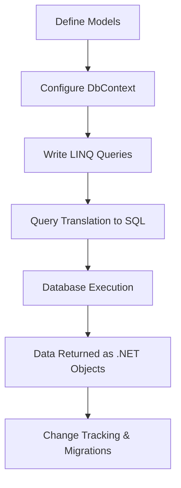
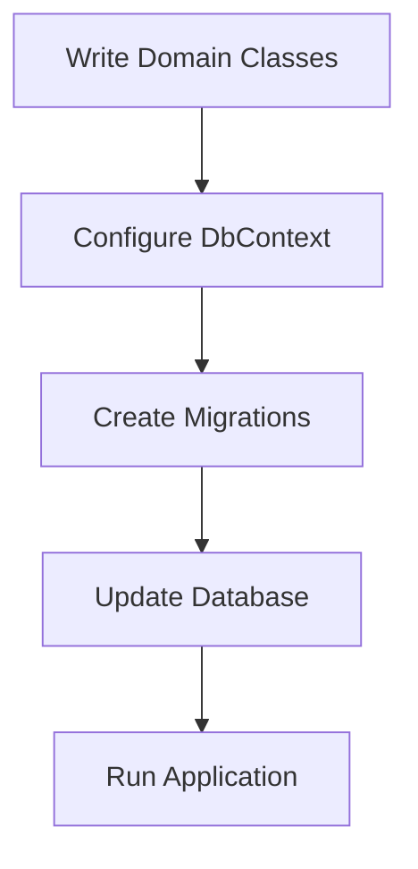
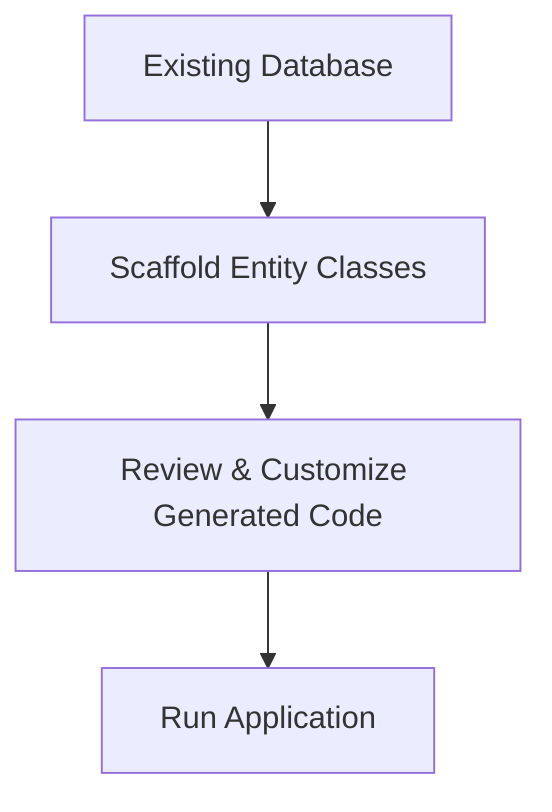
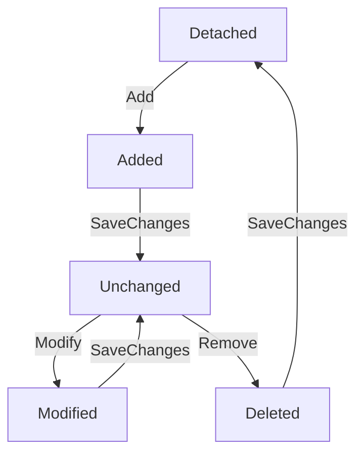

# Entity Framework Core - EF Core

---
# 🚀 Entity Framework Core (EF Core) in .NET Development
## 📌 Introduction
Entity Framework Core (EF Core) is an open-source, lightweight, and cross-platform Object-Relational Mapper (ORM) developed by Microsoft. It simplifies database interactions in .NET applications by allowing developers to work with strongly typed C# objects instead of raw SQL queries. EF Core is the successor to Entity Framework (EF) and provides enhanced performance, flexibility, and scalability.

EF Core eliminates the need for manually writing SQL queries, making data access more maintainable and efficient. By leveraging EF Core, developers can quickly implement CRUD (Create, Read, Update, Delete) operations, complex querying, and database migrations, reducing boilerplate code and improving application performance. With built-in support for multiple database providers, EF Core is widely used for applications ranging from small-scale projects to large enterprise solutions.

## 🔑 Key Features of EF Core
| Feature                  | Description                                                                              |
|--------------------------|------------------------------------------------------------------------------------------|
| 🚀 **Cross-Platform**       | Runs on Windows, Linux, and macOS, making it suitable for cloud and microservices.       |
| 🗄️ **Database Provider Support** | Supports multiple databases (SQL Server, SQLite, PostgreSQL, MySQL, Oracle, etc.).    |
| 🔍 **LINQ Integration**    | Enables queries using C# syntax with type safety, IntelliSense, and compile-time checks. |
| 📊 **Change Tracking**    | Automatically detects and tracks changes in data models, optimizing database operations.  |
| 🔄 **Migrations**         | Simplifies database schema evolution through incremental and version-controlled migrations. |
| ⚡ **High Performance**    | Optimized with query batching, compiled queries, and lazy loading for efficiency.         |
| 🔧 **Extensibility**      | Allows customization via custom conventions, value converters, and interceptors.          |
| 📦 **Dependency Injection** | Easily integrates with ASP.NET Core's DI system for better resource management.          |

## 🏗️ Setting Up EF Core
### 1️⃣ Install EF Core Packages
To use EF Core in a .NET project, install the necessary NuGet packages:

```sh
# Install EF Core
 dotnet add package Microsoft.EntityFrameworkCore

# Install EF Core SQL Server Provider
 dotnet add package Microsoft.EntityFrameworkCore.SqlServer

# Install EF Core SQLite Provider
 dotnet add package Microsoft.EntityFrameworkCore.Sqlite

# Install EF Core PostgreSQL Provider
 dotnet add package Npgsql.EntityFrameworkCore.PostgreSQL
```

### 2️⃣ Define a Model (Entity Class)
A model represents a table in the database. Below is an example entity class for a `Product` table:
```csharp
public class Product
{
    public int Id { get; set; }
    public string Name { get; set; }
    public decimal Price { get; set; }
    public string Category { get; set; } // Added new property
}
```

### 3️⃣ Create a DbContext Class
The `DbContext` class manages database interactions and provides an interface for querying and persisting data:
```csharp
public class ApplicationDbContext : DbContext
{
    public DbSet<Product> Products { get; set; }

    protected override void OnConfiguring(DbContextOptionsBuilder options)
    {
        options.UseSqlServer("Server=.;Database=ShopDB;Trusted_Connection=True;");
    }
}
```

## 🔄 Database Migrations
Migrations allow developers to update database schemas without manually modifying SQL scripts.
- **Create an Initial Migration:**
  ```sh
  dotnet ef migrations add InitialCreate
  ```
- **Apply the Migration to the Database:**
  ```sh
  dotnet ef database update
  ```

By using migrations, schema changes can be tracked in source control, allowing teams to collaborate more efficiently on database modifications.

## ✏️ CRUD Operations in EF Core
### ➕ **Create Data**
```csharp
using (var context = new ApplicationDbContext())
{
    var product = new Product { Name = "Laptop", Price = 1200.50m, Category = "Electronics" };
    context.Products.Add(product);
    context.SaveChanges();
}
```

### 🔍 **Retrieve Data**
```csharp
var products = context.Products.Where(p => p.Category == "Electronics").ToList();
```

### ✏️ **Update Data**
```csharp
var product = context.Products.FirstOrDefault(p => p.Id == 1);
if (product != null)
{
    product.Price = 999.99m;
    context.SaveChanges();
}
```

### 🗑️ **Delete Data**
```csharp
var product = context.Products.FirstOrDefault(p => p.Id == 1);
if (product != null)
{
    context.Products.Remove(product);
    context.SaveChanges();
}
```

---
## 📊 EF Core Workflow



## 🏁 Conclusion
Entity Framework Core is a powerful ORM for .NET applications that simplifies database interactions, supports multiple databases, and provides high performance. By abstracting database access and leveraging LINQ, it makes database management intuitive and efficient for developers. EF Core is a key tool for modern .NET development, enabling efficient data access in a wide range of applications, from small projects to large-scale enterprise solutions.

## 📚 References
- [📖 Microsoft Documentation](https://docs.microsoft.com/en-us/ef/core/)
- [🔗 EF Core GitHub Repository](https://github.com/dotnet/efcore)

---
# 🚀 .NET CLI (Command Line Interface) in .NET Development
## 📌 Introduction
The **.NET CLI (Command Line Interface)** is a cross-platform tool that allows developers to create, build, run, test, and deploy .NET applications directly from the command line. It eliminates the need for a full IDE, making it a powerful tool for automation, CI/CD pipelines, cloud environments, and lightweight development workflows.
By leveraging .NET CLI, developers can efficiently manage dependencies, execute builds, and deploy applications across different platforms, such as:
- 🖥️ **Windows**
- 🐧 **Linux**
- 🍏 **macOS**

## 🔑 Key Features of .NET CLI
| Feature                 | Description                                                                                                  |
|-------------------------|--------------------------------------------------------------------------------------------------------------|
| 🚀 **Cross-Platform**      | Works on Windows, macOS, and Linux, enabling flexible development.                                           |
| 🔧 **Automation-Friendly** | Easily integrates into CI/CD pipelines and scriptable environments.                                        |
| ⚡ **Lightweight**         | Provides minimal installation compared to full IDEs, ideal for fast setups.                                |
| 📦 **Template-Driven**    | Offers multiple project templates (console, web, class library, etc.) to jumpstart development.           |
| 🏗️ **Extensible**         | Supports additional tools and custom commands via NuGet packages and scripts.                           |
| 🔍 **Dependency Management** | Allows easy addition, removal, and updating of NuGet packages within projects.                          |
| 🛠️ **Testing and Deployment** | Supports unit testing, integration testing, and publishing applications efficiently.                   |

## 📥 Installing .NET CLI
.NET CLI is bundled with the .NET SDK. To check if it's installed, open a terminal and run:

```sh
dotnet --version
```

If .NET SDK is not installed, download it from:
👉 [Download .NET SDK](https://dotnet.microsoft.com/en-us/download)

## 🏗️ Commonly Used .NET CLI Commands
| Command | Description |
|---------|-------------|
| `dotnet --version` | Displays the installed .NET SDK version. |
| `dotnet new <template>` | Creates a new project from a specified template. |
| `dotnet restore` | Restores dependencies and project-specific tools. |
| `dotnet build` | Compiles the project and generates binaries. |
| `dotnet run` | Runs the application from source code. |
| `dotnet test` | Executes unit tests using a test framework. |
| `dotnet publish` | Packages the application for deployment. |
| `dotnet add package <package-name>` | Adds a NuGet package to the project. |
| `dotnet remove package <package-name>` | Removes a NuGet package from the project. |
| `dotnet list package` | Lists installed NuGet packages. |

## 🏗️ Creating, Building, and Running a .NET Application
### 1️⃣ Creating a New .NET Project
To create a new console application, run:

```sh
dotnet new console -o MyConsoleApp
cd MyConsoleApp
```

This generates a directory `MyConsoleApp` with a basic console app structure.

### 2️⃣ Restoring Dependencies
After modifying the `csproj` file or adding dependencies, restore them using:

```sh
dotnet restore
```

### 3️⃣ Building a .NET Project
To compile and build your application, run:

```sh
dotnet build
```

This generates compiled output files in the `bin` directory.

### 4️⃣ Running a .NET Application
To execute a .NET application, use:

```sh
dotnet run
```

## 🛠️ Managing Dependencies
### ➕ Adding a NuGet Package

```sh
dotnet add package Newtonsoft.Json
```

### 🗑️ Removing a Package

```sh
dotnet remove package Newtonsoft.Json
```

### 📦 Listing Installed Packages

```sh
dotnet list package
```

## 🧪 Running Tests
If the project contains unit tests, execute:

```sh
dotnet test
```

This runs all tests in the project and outputs the results to the terminal.

## 🌍 Publishing a .NET Application
To publish a self-contained application for deployment, use:

```sh
dotnet publish -c Release -r win-x64 --self-contained true
```

This generates a publishable binary inside the `publish` directory, ready for deployment.

## 📊 .NET CLI Workflow Diagram

```mermaid
flowchart TD
    A[Install .NET SDK] --> B[Create Project (dotnet new)]
    B --> C[Restore Dependencies (dotnet restore)]
    C --> D[Build Project (dotnet build)]
    D --> E[Run Application (dotnet run)]
    E --> F[Test Application (dotnet test)]
    F --> G[Publish Application (dotnet publish)]
```

## 🏁 Conclusion
.NET CLI is a powerful and essential tool for .NET developers. It enables efficient project management, dependency handling, building, testing, and deployment, making it indispensable for modern development workflows. By mastering .NET CLI, developers can streamline development, automate tasks, and enhance productivity across different environments.

## 📚 References
- [📖 Official .NET CLI Documentation](https://docs.microsoft.com/en-us/dotnet/core/tools/)
- [🔗 Download .NET SDK](https://dotnet.microsoft.com/en-us/download)

---
# 🚀 Code First vs Database First Development in .NET
## 📌 Introduction
In **.NET development**, particularly with **Entity Framework Core (EF Core)**, developers have two primary approaches for working with databases:
1. **Code First Development**
2. **Database First Development**
Each approach has distinct benefits and is suited for different scenarios. This guide explores both methodologies, their characteristics, advantages, disadvantages, and practical use cases. By the end, you'll have a clear understanding of when and how to use each approach effectively.

## 🏗️ Code First Development
### 📌 What is Code First?
The **Code First** approach allows developers to define the database schema using **C# entity classes**. EF Core then generates the database structure based on these classes. This approach is ideal when starting a new project without an existing database.

### 🔍 Key Characteristics
- ✅ Database schema is **generated from entity classes**.
- ✅ Developers manage database structure using **migrations**.
- ✅ Ideal for **greenfield projects** (new applications).
- ✅ Changes to the schema are **tracked within the source code**.
- ❌ Requires developers to manage database creation and migration manually.

### 🏗️ How to Use Code First
#### Step 1️⃣: Define Entity Classes
Create a `Product` class representing a table in the database:
```csharp
public class Product
{
    public int Id { get; set; }
    public string Name { get; set; }
    public decimal Price { get; set; }
}
```

#### Step 2️⃣: Create a DbContext
Define a `DbContext` class to manage database connections:

```csharp
public class ApplicationDbContext : DbContext
{
    public DbSet<Product> Products { get; set; }

    protected override void OnConfiguring(DbContextOptionsBuilder options)
    {
        options.UseSqlServer("Server=.;Database=ShopDB;Trusted_Connection=True;");
    }
}
```

#### Step 3️⃣: Apply Migrations and Create the Database
Use the following commands to generate the database schema:

```sh
dotnet ef migrations add InitialCreate
dotnet ef database update
```

#### Step 4️⃣: CRUD Operations
```csharp
using (var context = new ApplicationDbContext())
{
    var product = new Product { Name = "Laptop", Price = 1200.50m };
    context.Products.Add(product);
    context.SaveChanges();
}
```

## 🏛️ Database First Development
### 📌 What is Database First?
The **Database First** approach is used when the database schema **already exists**, and entity classes are generated based on the existing structure. This is useful for integrating legacy databases or when the schema is designed separately.

### 🔍 Key Characteristics
- ✅ The database schema **exists first**, and entity classes are generated from it.
- ✅ Uses **reverse engineering** to create models from the database.
- ✅ Ideal for **working with existing databases**.
- ✅ Reduces the need to manually define migrations.
- ❌ Less flexible, as database changes require **re-scaffolding**.

### 🏗️ How to Use Database First
#### Step 1️⃣: Install EF Core Tools
Run the following command to install Entity Framework Core tools:

```sh
dotnet tool install --global dotnet-ef
```

#### Step 2️⃣: Generate Entity Classes from Database
Use the following command to scaffold entity classes from an existing database:

```sh
dotnet ef dbcontext scaffold "Server=.;Database=ShopDB;Trusted_Connection=True;" Microsoft.EntityFrameworkCore.SqlServer -o Models
```

This generates the `Models` folder with entity classes corresponding to database tables.

#### Step 3️⃣: Use the Generated Context
Once the entity classes are generated, use them in your application:
```csharp
using (var context = new ApplicationDbContext())
{
    var products = context.Products.ToList();
    foreach (var product in products)
    {
        Console.WriteLine($"{product.Id} - {product.Name} - {product.Price}");
    }
}
```

## 🔄 Comparison: Code First vs Database First
| Feature | Code First | Database First |
|---------|------------|---------------|
| **Use Case** | New applications | Existing databases |
| **Schema Management** | Defined in C# classes | Defined in SQL |
| **Database Evolution** | Uses migrations | Manual updates |
| **Flexibility** | High (customizable in code) | Limited to database structure |
| **Tooling Support** | Uses EF migrations | Uses reverse engineering |

## 📊 Workflow Diagrams
### Code First Workflow



### Database First Workflow



## 🏁 Conclusion
Both **Code First** and **Database First** approaches have advantages depending on the project requirements:
- Use **Code First** when starting a new project and managing schema in C#.
- Use **Database First** when working with an existing database that must remain unchanged.
By understanding these approaches, developers can choose the best strategy to fit their application’s needs.

## 📚 References
- [Microsoft Documentation - EF Core](https://learn.microsoft.com/en-us/ef/core/)
- [Entity Framework Core GitHub Repository](https://github.com/dotnet/efcore)

---
# 🚀 Database Migrations in .NET Development
## 📌 Introduction
**Database migrations** in .NET development, particularly with **Entity Framework Core (EF Core)**, provide a mechanism to manage database schema changes systematically. Instead of manually altering database tables, migrations allow developers to modify and evolve their database structure while ensuring that the database remains in sync with the application’s data model.
Migrations facilitate version control, making it easier to track database changes, roll back modifications if needed, and streamline the deployment process across different environments.

## 🔍 Key Characteristics of Database Migrations
| Feature                 | Description |
|-------------------------|-------------|
| ✅ **Schema Automation** | Apply, modify, or delete tables and columns without manual SQL scripting. |
| 🔄 **Version Control**  | Track database schema changes incrementally, ensuring structured evolution. |
| 🌍 **Multi-Database Support** | Compatible with SQL Server, PostgreSQL, MySQL, SQLite, and more. |
| ⚡ **CI/CD Integration** | Automate database updates in development, staging, and production environments. |
| 🛠 **Rollback Support** | Enables rolling back schema changes to a previous state when needed. |

## 🏗️ Setting Up Migrations in EF Core
### 1️⃣ Install EF Core Tools
Ensure EF Core is installed in your .NET project. If not, install it with the following commands:

```sh
# Install EF Core CLI Tool
dotnet tool install --global dotnet-ef

# Install EF Core SQL Server Provider
dotnet add package Microsoft.EntityFrameworkCore.SqlServer
```

### 2️⃣ Creating an Initial Migration
Define a **DbContext** class representing the database connection:
```csharp
public class ApplicationDbContext : DbContext
{
    public DbSet<Product> Products { get; set; }

    protected override void OnConfiguring(DbContextOptionsBuilder options)
    {
        options.UseSqlServer("Server=.;Database=ShopDB;Trusted_Connection=True;");
    }
}
```

Now, create the first migration:

```sh
dotnet ef migrations add InitialCreate
```

This command generates a **Migrations** folder containing:
- `YYYYMMDDHHMMSS_InitialCreate.cs` – Defines schema changes.
- `ApplicationDbContextModelSnapshot.cs` – Represents the latest schema snapshot.

### 3️⃣ Applying the Migration to the Database
Once a migration is created, apply it using:

```sh
dotnet ef database update
```

This command updates the database schema to match the migration script.

### 4️⃣ Adding New Migrations
If changes are made to the model (e.g., adding a new column `Category` to `Product`):
```csharp
public class Product
{
    public int Id { get; set; }
    public string Name { get; set; }
    public decimal Price { get; set; }
    public string Category { get; set; }  // New column added
}
```
Generate a new migration:

```sh
dotnet ef migrations add AddCategoryColumn
```

Apply the changes to the database:

```sh
dotnet ef database update
```

### 5️⃣ Reverting Migrations
To revert the last migration:

```sh
dotnet ef migrations remove
```

To roll back to a specific migration:

```sh
dotnet ef database update PreviousMigrationName
```

## 📊 Understanding Migration Files
| File | Description |
|------|-------------|
| `YYYYMMDDHHMMSS_MigrationName.cs` | Defines schema changes. |
| `ApplicationDbContextModelSnapshot.cs` | Represents the latest schema snapshot. |
| `MigrationsHistoryTable` | A special table in the database that tracks applied migrations. |

## 🌍 Using Migrations in Production
- 📌 Use **CI/CD pipelines** to automate migrations.
- 📌 Apply migrations **before deploying** the application.
- 📌 Keep **database backups** before running new migrations.
- 📌 Use **transactional migrations** to prevent partial updates in case of errors.

## 🔄 Migration Workflow Diagram

```mermaid
flowchart TD
    A[Define/Modify Domain Models] --> B[Create Migration (dotnet ef migrations add)]
    B --> C[Review Generated Migration Code]
    C --> D[Apply Migration (dotnet ef database update)]
    D --> E[Database Schema Updated]
    E --> F[Run Application]
```

## 🏁 Conclusion
Database migrations in .NET development simplify schema changes, allowing applications to evolve without manual database modifications. They enhance version control, ensure consistency across environments, and streamline database updates.

By integrating EF Core migrations into the development workflow, teams can maintain robust and scalable applications while keeping database structures versioned and synchronized.

## 📚 References
- [Microsoft Documentation - Migrations](https://learn.microsoft.com/en-us/ef/core/managing-schemas/migrations/)

---
# 🚀 Seeding Data in Database using .NET Development
## 📌 Introduction
**Seeding data** in .NET development refers to the process of **pre-populating a database** with initial values when the database is created or migrated. This is commonly used to set up reference data, default configurations, or test data to ensure the application has the necessary information when it starts.
Entity Framework Core (EF Core) provides a built-in mechanism for seeding data during migrations, ensuring that required data is available without requiring manual insertion. This document will guide you through various approaches to database seeding using **migrations** and **runtime seeding**.

## 🔍 Key Characteristics of Data Seeding
| Feature | Description |
|---------|-------------|
| ✅ **Automatic Data Insertion** | Ensures data is inserted automatically when the database is created or migrated. |
| 🔄 **Idempotent Execution** | Prevents duplicate records by checking existing data. |
| 🌍 **Supports Multiple Databases** | Works with SQL Server, PostgreSQL, MySQL, SQLite, etc. |
| ⚡ **Useful for Default Data** | Ideal for roles, categories, admin users, etc. |
| 🔧 **Supports Versioning** | Seed data can evolve through migrations. |

## ⚙️ Implementing Data Seeding in EF Core
### 📌 1. Adding Seed Data in the `OnModelCreating` Method
EF Core allows you to seed data by overriding the `OnModelCreating` method in your `DbContext` class.
#### Example: Seeding a `Products` Table
```csharp
public class ApplicationDbContext : DbContext
{
    public DbSet<Product> Products { get; set; }

    protected override void OnModelCreating(ModelBuilder modelBuilder)
    {
        modelBuilder.Entity<Product>().HasData(
            new Product { Id = 1, Name = "Laptop", Price = 1200.00m },
            new Product { Id = 2, Name = "Smartphone", Price = 800.00m },
            new Product { Id = 3, Name = "Tablet", Price = 500.00m }
        );
    }
}
```
### 🔄 2. Applying Migrations
After adding seed data, generate a migration and apply it:

```sh
dotnet ef migrations add SeedProducts
dotnet ef database update
```

This migration ensures that the seed data is inserted into the database.

## ✏️ Seeding Related Entities
If there are relationships between tables, you need to ensure proper foreign key values.
#### Example: Seeding `Categories` and `Products`
```csharp
public class ApplicationDbContext : DbContext
{
    public DbSet<Category> Categories { get; set; }
    public DbSet<Product> Products { get; set; }

    protected override void OnModelCreating(ModelBuilder modelBuilder)
    {
        modelBuilder.Entity<Category>().HasData(
            new Category { Id = 1, Name = "Electronics" },
            new Category { Id = 2, Name = "Appliances" }
        );

        modelBuilder.Entity<Product>().HasData(
            new Product { Id = 1, Name = "Laptop", Price = 1200.00m, CategoryId = 1 },
            new Product { Id = 2, Name = "Washing Machine", Price = 700.00m, CategoryId = 2 }
        );
    }
}
```
This ensures that `Products` reference the `Category` table correctly.

## 📦 Alternative Approach: Seeding Data at Application Startup
Instead of migrations, you can seed data when the application starts using `IServiceProvider`.
### Example: Seeding Users in `Program.cs`
```csharp
using (var scope = app.Services.CreateScope())
{
    var context = scope.ServiceProvider.GetRequiredService<ApplicationDbContext>();
    if (!context.Users.Any())
    {
        context.Users.Add(new User { Id = 1, Name = "Admin", Role = "Administrator" });
        context.SaveChanges();
    }
}
```

This method is useful for dynamic seeding without modifying migrations.
## 📊 Comparison: Migrations vs Runtime Seeding
| Feature | Migrations Seeding | Runtime Seeding |
|---------|----------------|----------------|
| **When Applied?** | During migrations | At application startup |
| **Ensures Data Integrity?** | Yes | Not enforced |
| **Flexible Data Updates?** | Requires migration updates | Can be changed dynamically |
| **Best For** | Static default data | Dynamic or user-configurable data |

## 📊 Data Seeding Workflow Diagram

```mermaid
flowchart TD
    A[Define Entity Models] --> B[Configure DbContext with HasData]
    B --> C[Add Migration (dotnet ef migrations add)]
    C --> D[Update Database (dotnet ef database update)]
    D --> E[Database is Created/Updated with Seed Data]
    E --> F[Application Runs with Baseline Data]
```

## 🏁 Conclusion
Seeding data in .NET ensures that applications start with essential data, reducing manual effort and improving consistency. Whether using **EF Core migrations** or **runtime seeding**, the right approach depends on project requirements.
For **static, version-controlled data**, use migrations. For **dynamic, configurable data**, seed during application startup.

---
# 🚀 Data Models in .NET Development
## 📌 Introduction
In **.NET development**, **Data Models** define how data is structured, stored, and manipulated within an application. These models are essential for ensuring data integrity, consistency, and efficiency. **Entity Framework Core (EF Core)** enables developers to interact with databases using C# objects rather than raw SQL queries, streamlining development and maintaining cleaner code.
A well-designed **data model** enhances application scalability, maintainability, and performance by reducing redundancy and optimizing data retrieval.

## 🔍 Key Characteristics of Data Models
| Feature | Description |
|---------|-------------|
| ✅ **Defines Data Structure** | Specifies properties, types, and relationships. |
| ✅ **Ensures Data Integrity** | Uses constraints like primary keys, foreign keys, and validations. |
| ✅ **Facilitates Data Manipulation** | Supports CRUD (Create, Read, Update, Delete) operations. |
| ✅ **Works with ORMs** | Maps objects to database records using frameworks like EF Core. |
| ✅ **Supports Different Database Providers** | Works with SQL Server, MySQL, PostgreSQL, SQLite, etc. |
| ✅ **Enhances Performance** | Optimized queries and indexing strategies improve efficiency. |
| ✅ **Ensures Scalability** | Structures data to support large-scale applications. |

## 📌 Types of Data Models in .NET
### 1️⃣ **Conceptual Data Model**
Represents high-level business entities and relationships, often independent of specific technology or database. This model is typically used in requirement analysis and system design phases.

Example:
```plaintext
Customer → Order → Product
```

### 2️⃣ **Logical Data Model**
Defines entities, attributes, and relationships in more detail but is still independent of database implementation. This model is more structured and acts as a blueprint for physical implementation.

Example:
```plaintext
Customer (Id, Name, Email)
Order (Id, OrderDate, CustomerId)
Product (Id, Name, Price)
```

### 3️⃣ **Physical Data Model**
Maps the logical model to an actual database schema, including table definitions, columns, indexes, and constraints. It determines how data is stored, retrieved, and managed in the database.

Example (SQL Schema):
```sql
CREATE TABLE Customers (
    Id INT PRIMARY KEY,
    Name NVARCHAR(100),
    Email NVARCHAR(255) UNIQUE
);
```

## ⚙️ Implementing Data Models in .NET using EF Core
### 🏗️ 1. Defining a Data Model Class
In **Entity Framework Core**, data models are defined using **C# classes**. Each class represents a table in the database.
#### Example: `Product` Entity
```csharp
public class Product
{
    public int Id { get; set; }
    public string Name { get; set; }
    public decimal Price { get; set; }
    public DateTime CreatedDate { get; set; } // New property added
}
```

### 🔄 2. Creating a DbContext
A `DbContext` class manages the database connection and interactions.
```csharp
public class ApplicationDbContext : DbContext
{
    public DbSet<Product> Products { get; set; }

    protected override void OnConfiguring(DbContextOptionsBuilder options)
    {
        options.UseSqlServer("Server=.;Database=ShopDB;Trusted_Connection=True;");
    }
}
```

### 📌 3. Applying Migrations
To create the database schema based on the data model:

```sh
dotnet ef migrations add InitialCreate
dotnet ef database update
```

This generates a **Products** table in the database.

## 📊 Data Models and Relationships
Data models support relationships like:
### 1️⃣ **One-to-One Relationship**
Example: Each `User` has one `Profile`.
```csharp
public class User
{
    public int Id { get; set; }
    public string Name { get; set; }
    public Profile Profile { get; set; }
}

public class Profile
{
    public int Id { get; set; }
    public string Address { get; set; }
    public int UserId { get; set; }
    public User User { get; set; }
}
```

### 2️⃣ **One-to-Many Relationship**
Example: A `Category` can have multiple `Products`.
```csharp
public class Category
{
    public int Id { get; set; }
    public string Name { get; set; }
    public List<Product> Products { get; set; }
}
```

### 3️⃣ **Many-to-Many Relationship**
Example: A `Student` can enroll in multiple `Courses`.
```csharp
public class Student
{
    public int Id { get; set; }
    public string Name { get; set; }
    public List<Course> Courses { get; set; }
}

public class Course
{
    public int Id { get; set; }
    public string Title { get; set; }
    public List<Student> Students { get; set; }
}
```

## 🔍 Data Annotations vs Fluent API
EF Core provides two ways to configure data models:
| Feature | Data Annotations | Fluent API |
|---------|----------------|------------|
| **Definition** | Uses attributes in entity classes | Uses `OnModelCreating` method |
| **Usage** | Simple configuration | More advanced customization |
| **Example** | `[Required]`, `[Key]`, `[MaxLength(50)]` | `modelBuilder.Entity<Product>().Property(p => p.Name).IsRequired();` |

### 📌 Example: Using Data Annotations
```csharp
public class Product
{
    [Key]
    public int Id { get; set; }
    [Required]
    [MaxLength(100)]
    public string Name { get; set; }
    [Column(TypeName = "decimal(18,2)")]
    public decimal Price { get; set; }
    public DateTime CreatedDate { get; set; }
}
```

### 📌 Example: Using Fluent API
```csharp
protected override void OnModelCreating(ModelBuilder modelBuilder)
{
    modelBuilder.Entity<Product>()
        .Property(p => p.Name)
        .IsRequired()
        .HasMaxLength(100);
}
```

## 🏁 Conclusion
Data models are fundamental in .NET development, defining how data is structured, stored, and managed. Whether using **Entity Framework Core** or raw SQL, a well-designed data model improves application maintainability, performance, and scalability.
Choosing the right modeling approach—**Conceptual, Logical, or Physical**—and configuring relationships properly ensures efficient data handling in modern applications. By implementing best practices such as data integrity constraints, performance optimization, and scalability considerations, developers can build robust and efficient systems.

---
# 🚀 Database Context in .NET Development
## 📌 Introduction
In **.NET development**, **Database Context** (commonly referred to as `DbContext` in **Entity Framework Core**) is the bridge between your application and the database. It allows developers to interact with a database using **C# objects** instead of raw SQL queries. The `DbContext` class is a crucial component of **Entity Framework Core (EF Core)**, providing an abstraction layer for database operations.
A well-configured `DbContext` ensures **efficient data access, transaction management, and scalability**, making it a fundamental aspect of **modern .NET applications**.

## 🔍 Key Characteristics of `DbContext`
| Feature | Description |
|---------|-------------|
| ✅ **Manages Database Connections** | Handles opening and closing database connections. |
| ✅ **Tracks Changes** | Keeps track of entity changes and updates them in the database. |
| ✅ **Provides Query Capabilities** | Allows LINQ-based querying of the database. |
| ✅ **Manages Transactions** | Ensures atomicity of operations. |
| ✅ **Works with Multiple Database Providers** | Supports SQL Server, PostgreSQL, MySQL, SQLite, and more. |
| ✅ **Facilitates Dependency Injection** | Can be injected into services for better code organization. |

## 📌 Defining a Database Context in EF Core
To use a `DbContext`, you must define a class that inherits from `DbContext` and specify **DbSet properties** that represent database tables.
### Example: Defining `ApplicationDbContext`
```csharp
using Microsoft.EntityFrameworkCore;

public class ApplicationDbContext : DbContext
{
    public DbSet<Product> Products { get; set; }
    public DbSet<Category> Categories { get; set; }

    protected override void OnConfiguring(DbContextOptionsBuilder options)
    {
        options.UseSqlServer("Server=.;Database=ShopDB;Trusted_Connection=True;");
    }
}
```
### Explanation:
- The `DbSet<Product>` and `DbSet<Category>` represent tables in the database.
- `OnConfiguring()` method is used to define the **database connection string**.
- `UseSqlServer()` specifies **SQL Server** as the database provider.

## 🔄 Registering `DbContext` in Dependency Injection
To properly manage database context in an **ASP.NET Core application**, register it in the **Dependency Injection (DI) container** within `Program.cs`.
### Example: Adding `DbContext` in `Program.cs`
```csharp
using Microsoft.EntityFrameworkCore;
using Microsoft.Extensions.DependencyInjection;

var builder = WebApplication.CreateBuilder(args);

// Register DbContext with SQL Server
builder.Services.AddDbContext<ApplicationDbContext>(options =>
    options.UseSqlServer(builder.Configuration.GetConnectionString("DefaultConnection")));

var app = builder.Build();
app.Run();
```
### Explanation:
- `AddDbContext<TContext>()` registers the `DbContext` in the dependency injection system.
- The connection string is retrieved from the **configuration file (`appsettings.json`)**.

## 📊 Understanding `DbSet` and Querying Data
The `DbSet<T>` property in `DbContext` represents a table in the database. You can perform **CRUD operations** using LINQ.
### Example: Performing CRUD Operations
#### 1️⃣ **Adding Data**
```csharp
using (var context = new ApplicationDbContext())
{
    var product = new Product { Name = "Laptop", Price = 1200.00m };
    context.Products.Add(product);
    context.SaveChanges();
}
```

#### 2️⃣ **Retrieving Data**
```csharp
using (var context = new ApplicationDbContext())
{
    var products = context.Products.ToList();
    foreach (var product in products)
    {
        Console.WriteLine($"{product.Id}: {product.Name} - ${product.Price}");
    }
}
```

#### 3️⃣ **Updating Data**
```csharp
using (var context = new ApplicationDbContext())
{
    var product = context.Products.FirstOrDefault(p => p.Id == 1);
    if (product != null)
    {
        product.Price = 999.99m;
        context.SaveChanges();
    }
}
```

#### 4️⃣ **Deleting Data**
```csharp
using (var context = new ApplicationDbContext())
{
    var product = context.Products.FirstOrDefault(p => p.Id == 1);
    if (product != null)
    {
        context.Products.Remove(product);
        context.SaveChanges();
    }
}
```

## 🔍 Managing Transactions with `DbContext`
EF Core provides built-in support for **transactions**, allowing multiple operations to be executed atomically.
### Example: Using Transactions
```csharp
using (var context = new ApplicationDbContext())
{
    using var transaction = context.Database.BeginTransaction();
    try
    {
        var product = new Product { Name = "Tablet", Price = 400.00m };
        context.Products.Add(product);
        context.SaveChanges();
        
        var category = new Category { Name = "Electronics" };
        context.Categories.Add(category);
        context.SaveChanges();
        
        transaction.Commit();
    }
    catch
    {
        transaction.Rollback();
    }
}
```
### Explanation:
- `BeginTransaction()` starts a database transaction.
- `Commit()` saves all operations atomically.
- `Rollback()` reverts changes if an error occurs.

## 📌 Best Practices for Using `DbContext`
| Best Practice | Description |
|--------------|-------------|
| **Use Dependency Injection** | Always inject `DbContext` instead of creating new instances manually. |
| **Dispose Context Properly** | Use `using` statements or scoped lifetime to manage context efficiently. |
| **Avoid Long-Lived Contexts** | Keep `DbContext` short-lived to prevent memory leaks. |
| **Use Asynchronous Methods** | Prefer async methods like `SaveChangesAsync()` for better performance. |
| **Optimize Queries** | Retrieve only necessary data using `.Select()` and `.AsNoTracking()`. |

## 📊 Database Context Workflow Diagram

```mermaid
flowchart LR
    A[Application Code] --> B[Domain Models (Entities)]
    B --> C[Database Context (DbContext)]
    C --> D[LINQ Queries/Operations]
    D --> E[Database (SQL Server, SQLite, etc.)]
```

## 🏁 Conclusion
The **Database Context (`DbContext`)** is a fundamental part of **Entity Framework Core**, acting as the gateway between the .NET application and the database. It provides **querying, data manipulation, and transaction management** while ensuring efficient database operations.
Understanding how to correctly configure, use, and optimize `DbContext` is crucial for building high-performance and maintainable applications.

---
# 🚀 Database Support in .NET Development
## 📌 Introduction
In .NET development, **Database Support** refers to the built-in capabilities of the .NET framework to interact with various types of databases. .NET provides multiple ways to connect, query, and manipulate databases efficiently. From **ADO.NET** for direct database interactions to **Entity Framework Core (EF Core)** for Object-Relational Mapping (ORM), .NET ensures that developers have robust tools to manage data.
Understanding how .NET supports different databases, their characteristics, and how to use them effectively is crucial for developing **scalable** and **maintainable** applications.

## 🔍 Key Characteristics of Database Support in .NET
| Feature | Description |
|---------|-------------|
| ✅ **Multi-Database Support** | Compatible with relational (SQL) and non-relational (NoSQL) databases. |
| ✅ **Multiple Access Methods** | Supports ADO.NET, Entity Framework Core, and Dapper for database interactions. |
| ✅ **Cross-Platform Compatibility** | .NET Core and .NET 6+ support Linux, Windows, and macOS databases. |
| ✅ **ORM Support** | Provides high-level abstraction via Entity Framework Core. |
| ✅ **Security and Performance Optimization** | Includes features like connection pooling, parameterized queries, and transactions. |

## 📌 Types of Database Support in .NET
### 1️⃣ **Relational Databases (SQL-Based)**
Relational databases store structured data in tables with defined relationships. .NET supports:
- **Microsoft SQL Server**
- **MySQL**
- **PostgreSQL**
- **SQLite**
- **Oracle Database**

### 2️⃣ **NoSQL Databases (Non-Relational)**
NoSQL databases store data in flexible formats such as JSON or key-value pairs. .NET supports:
- **MongoDB**
- **Cassandra**
- **Cosmos DB**
- **Redis**

## ⚙️ Connecting to a Database in .NET
### 🏗️ 1. Using ADO.NET (Low-Level Access)
ADO.NET provides direct control over database connections, commands, and transactions.
#### Example: Connecting to SQL Server
```csharp
using System;
using System.Data.SqlClient;

string connectionString = "Server=localhost;Database=ShopDB;Trusted_Connection=True;";

using (SqlConnection connection = new SqlConnection(connectionString))
{
    connection.Open();
    Console.WriteLine("Database connected successfully.");
}
```

### 🔄 2. Using Entity Framework Core (High-Level ORM)
Entity Framework Core simplifies database interactions by allowing developers to work with objects instead of raw SQL.
#### Example: Defining a DbContext
```csharp
using Microsoft.EntityFrameworkCore;

public class ApplicationDbContext : DbContext
{
    public DbSet<Product> Products { get; set; }

    protected override void OnConfiguring(DbContextOptionsBuilder options)
    {
        options.UseSqlServer("Server=localhost;Database=ShopDB;Trusted_Connection=True;");
    }
}
```

#### Example: Querying Data with EF Core
```csharp
using (var context = new ApplicationDbContext())
{
    var products = context.Products.ToList();
    foreach (var product in products)
    {
        Console.WriteLine($"{product.Id} - {product.Name} - ${product.Price}");
    }
}
```

## 📊 Comparing ADO.NET, EF Core, and Dapper
| Feature | ADO.NET | Entity Framework Core | Dapper |
|---------|--------|----------------------|--------|
| **Abstraction Level** | Low | High | Medium |
| **Performance** | High | Moderate | High |
| **Ease of Use** | Complex | Easy | Moderate |
| **Supports Transactions** | ✅ | ✅ | ✅ |
| **Ideal For** | High-performance scenarios | Rapid development | Optimized queries |

## 🔍 Managing Database Connections Efficiently
To ensure optimal performance and security, follow these best practices:
1. **Use Connection Pooling** – Reduce overhead by reusing existing connections.
2. **Use Parameterized Queries** – Prevent SQL injection attacks.
3. **Manage Transactions** – Ensure atomic operations using `BeginTransaction()`.
4. **Use Lazy Loading Wisely** – Avoid unnecessary data fetching.
5. **Optimize Queries** – Fetch only required data with `.Select()` and `.AsNoTracking()`.

## 📊 .NET Database Support Architecture

```mermaid
flowchart TD
    A[.NET Application] --> B[Data Access Layer]
    B --> C[ADO.NET / ORM Frameworks]
    C --> D[Database Providers (SQL Server, SQLite, etc.)]
    D --> E[Underlying Database Engine]
```

## 🏁 Conclusion
Database support in .NET is robust and versatile, enabling developers to work with both **relational** and **NoSQL** databases seamlessly. Understanding different database access methods—**ADO.NET** for raw control, **EF Core** for abstraction, and **Dapper** for optimized queries—helps in choosing the right tool for the job.
By following best practices, developers can build **high-performance** and **secure** applications with well-structured database interactions.

---
# 🚀 Migrations in .NET Development
## 📖 Introduction
Migrations in .NET, particularly within **Entity Framework Core (EF Core)**, provide a structured way to manage **database schema changes**. Instead of manually editing SQL scripts, migrations automate and version-control the evolution of your database schema to keep it in sync with your application models.
## 🔍 Key Features of Migrations
| Feature | Description |
|---------|------------|
| ✅ **Automated Schema Management** | Updates the database schema without manual SQL scripts. |
| ✅ **Version Control for Schema** | Each migration is a versioned snapshot of schema changes. |
| ✅ **Rollback Support** | Easily revert to previous versions in case of issues. |
| ✅ **Cross-Database Compatibility** | Works with SQL Server, MySQL, PostgreSQL, SQLite, etc. |
| ✅ **CI/CD Integration** | Ensures database consistency across environments. |

## ⚙️ Setting Up Migrations in EF Core
### 🏗️ 1. Install EF Core Tools
Before creating migrations, install the EF Core CLI:

```sh
dotnet tool install --global dotnet-ef
```

For SQL Server support, add the necessary package:

```sh
dotnet add package Microsoft.EntityFrameworkCore.SqlServer
```

### 📌 2. Define a `DbContext` and Data Model
#### Example: `ApplicationDbContext` with a `Product` Entity
```csharp
using Microsoft.EntityFrameworkCore;

public class ApplicationDbContext : DbContext
{
    public DbSet<Product> Products { get; set; }

    protected override void OnConfiguring(DbContextOptionsBuilder options)
    {
        options.UseSqlServer("Server=localhost;Database=ShopDB;Trusted_Connection=True;");
    }
}

public class Product
{
    public int Id { get; set; }
    public string Name { get; set; }
    public decimal Price { get; set; }
}
```

### 🔄 3. Creating and Applying Migrations
Create an initial migration:

```sh
dotnet ef migrations add InitialCreate
```

Apply the migration to the database:

```sh
dotnet ef database update
```

This executes the migration and updates the database schema.

## ✏️ Modifying Database Schema with Migrations
If you modify the model (e.g., adding a new column), follow these steps:
#### Example: Adding a `Category` Column to `Product`
Modify the `Product` model:
```csharp
public class Product
{
    public int Id { get; set; }
    public string Name { get; set; }
    public decimal Price { get; set; }
    public string Category { get; set; }  // New column added
}
```

Generate a new migration:

```sh
dotnet ef migrations add AddCategoryColumn
```

Update the database:

```sh
dotnet ef database update
```

## 🔄 Reverting Migrations
To remove the last migration before applying it:

```sh
dotnet ef migrations remove
```

To roll back to a specific migration:

```sh
dotnet ef database update PreviousMigrationName
```

## 📊 Understanding Migration Files
Each migration consists of three key files:
| File | Description |
|------|-------------|
| `YYYYMMDDHHMMSS_MigrationName.cs` | Contains schema changes. |
| `ApplicationDbContextModelSnapshot.cs` | Represents the latest schema. |
| `MigrationsHistoryTable` | A database table tracking applied migrations. |

## 📌 Migrations Workflow Diagram

```mermaid
flowchart TD
    A[Modify Domain Models] --> B[Generate Migration (dotnet ef migrations add)]
    B --> C[Review Generated Migration Code]
    C --> D[Apply Migration (dotnet ef database update)]
    D --> E[Updated Database Schema]
```

## 🌍 Best Practices for Migrations
- **Commit Migrations** – Always commit migration files to version control.
- **Review Generated Code** – Check migration files for correctness before applying them.
- **Use Descriptive Names** – Name migrations clearly (e.g., `AddCustomerEmail`).
- **Automate in CI/CD** – Run migrations automatically before deployment.
- **Backup Database** – Always backup before running migrations.

---
# 🚀 Understanding Up and Down Methods in Database Migrations in .NET Development

## 📖 Introduction

In .NET development, particularly in **Entity Framework Core (EF Core)**, **migrations** allow developers to manage **database schema changes** over time. When a migration is created, it includes two fundamental methods: **Up()** and **Down()**.

These methods define how schema changes are applied and reverted. Understanding their functionality is crucial for **database versioning**, ensuring smooth rollbacks when necessary, and maintaining database integrity.

## 🔍 Key Characteristics of `Up()` and `Down()` Methods
| Feature                 | `Up()` Method | `Down()` Method |
|-------------------------|--------------|---------------|
| **Purpose**            | Apply schema changes (e.g., create tables, modify columns) | Revert schema changes (e.g., drop tables, undo column modifications) |
| **Direction**          | Moves the database schema forward | Rolls back the database schema |
| **Operations**         | Creating tables, adding columns, modifying constraints | Dropping tables, removing columns, reverting constraints |
| **Usage Scenario**     | Deploying new features or updates | Rolling back changes due to errors or testing needs |

## 📌 How `Up()` and `Down()` Methods Work
When a migration is created using EF Core, a **C# migration file** is generated in the **Migrations folder**. This file includes both `Up()` and `Down()` methods.
### Example: Adding a `Products` Table
#### Generated Migration File (`YYYYMMDDHHMMSS_AddProducts.cs`)
```csharp
using Microsoft.EntityFrameworkCore.Migrations;

public partial class AddProducts : Migration
{
    protected override void Up(MigrationBuilder migrationBuilder)
    {
        migrationBuilder.CreateTable(
            name: "Products",
            columns: table => new
            {
                Id = table.Column<int>(nullable: false)
                    .Annotation("SqlServer:Identity", "1, 1"),
                Name = table.Column<string>(nullable: false),
                Price = table.Column<decimal>(nullable: false)
            },
            constraints: table =>
            {
                table.PrimaryKey("PK_Products", x => x.Id);
            });
    }

    protected override void Down(MigrationBuilder migrationBuilder)
    {
        migrationBuilder.DropTable(name: "Products");
    }
}
```

### Explanation:
- **Up() Method**
  - Uses `migrationBuilder.CreateTable()` to create the `Products` table.
  - Defines the schema with `Id`, `Name`, and `Price` columns.
  - Sets `Id` as the primary key.
- **Down() Method**
  - Uses `migrationBuilder.DropTable()` to **remove the table** if the migration is rolled back.

## 🔄 Applying and Reverting Migrations
### 📌 1. Applying Migrations
Once a migration is created, apply it using:

```sh
dotnet ef database update
```

This executes the `Up()` method, modifying the database schema accordingly.

### 📌 2. Rolling Back a Migration
To undo the last migration before applying it:

```sh
dotnet ef migrations remove
```

If the migration has already been applied, roll back the database using:

```sh
dotnet ef database update PreviousMigrationName
```

This executes the `Down()` method, reverting the schema changes.

## 📊 Migration Behavior Summary
| Action | `Up()` Method | `Down()` Method |
|--------|--------------|---------------|
| **Add a Table** | Creates a new table | Drops the table |
| **Add a Column** | Adds a new column | Removes the column |
| **Modify a Column** | Alters column properties | Restores previous column state |
| **Add an Index** | Creates an index | Removes the index |
| **Add a Foreign Key** | Establishes relationships | Drops the foreign key constraint |

##  Migration Workflow Diagram

```mermaid
flowchart TD
    A[Modify Domain Models] --> B[Generate Migration (dotnet ef migrations add)]
    B --> C[Review Generated Migration Code]
    C --> D[Apply Migration (dotnet ef database update)]
    D --> E[Updated Database Schema]
    E --> F[Revert Changes?]
    F -- Yes --> G[Execute Down() Method]
    G --> H[Reverted to Previous Schema]
```

## 🏁 Conclusion
The **`Up()` and `Down()` methods** in EF Core migrations are fundamental for managing **database schema changes** efficiently. They allow developers to apply and revert schema modifications in a **controlled, versioned manner**.
By mastering these methods, .NET developers can maintain **database integrity**, facilitate **rollbacks when needed**, and ensure **seamless database evolution** across different environments.

---
# 🚀 LINQ Syntax and Database Migrations in .NET Development

## 📌 Introduction
**Language Integrated Query (LINQ)** is a powerful feature in .NET that allows developers to write expressive, type-safe queries against various data sources, such as collections, databases, and XML. LINQ can be written in two primary syntaxes:
1. **Standard Query Syntax (SQL-like Syntax)**
2. **Method Syntax (Fluent Syntax or Lambda Expressions)**
Both syntaxes ultimately compile to the same intermediate representation. This guide explores the differences, usage, and best practices of both approaches.

## 🔍 Key Characteristics of LINQ
| Feature                    | Standard Query Syntax  | Method (Fluent) Syntax |
|---------------------------|-----------------------|------------------------|
| **Readability**            | Resembles SQL, easy for SQL users | Compact, concise, flexible |
| **Complex Operations**     | More readable for grouping and joins | Suitable for chaining multiple operations |
| **Usage Scenario**        | Ideal for structured, SQL-like queries | Preferred for short, fluent expressions |
| **Compilation Process**    | Internally converted to method syntax | Directly written in method form |

### ✅ Benefits of LINQ
- **Unified Query Model:** Works across collections, databases, XML, and more.
- **Type-Safe:** Queries are checked at compile time.
- **Flexible Querying:** Can perform filtering, ordering, grouping, and aggregation.
- **Multiple LINQ Providers:** LINQ to Objects, LINQ to SQL, LINQ to Entities, LINQ to XML, etc.

## 📌 Standard Query Syntax
The **Standard Query Syntax** is similar to SQL and provides a structured, declarative way of writing queries.
### 📌 Example: Querying a List of Products
```csharp
var products = new List<Product>
{
    new Product { Id = 1, Name = "Laptop", Price = 1200 },
    new Product { Id = 2, Name = "Smartphone", Price = 800 },
    new Product { Id = 3, Name = "Tablet", Price = 500 }
};

var query = from p in products
            where p.Price > 600
            orderby p.Price descending
            select new { p.Name, p.Price };

foreach (var item in query)
{
    Console.WriteLine($"{item.Name} - ${item.Price}");
}
```

### 🔎 Explanation:
- `from p in products` → Iterates over the `products` collection.
- `where p.Price > 600` → Filters products with a price greater than 600.
- `orderby p.Price descending` → Sorts products by price in descending order.
- `select new { p.Name, p.Price }` → Projects only `Name` and `Price`.

## 🔄 Method Syntax (Fluent Syntax)
The **Method Syntax** (also called **Lambda Syntax**) uses **extension methods** like `Where()`, `OrderBy()`, and `Select()`.
### 📌 Example: Achieving the Same Result
```csharp
var query = products
    .Where(p => p.Price > 600)
    .OrderByDescending(p => p.Price)
    .Select(p => new { p.Name, p.Price });

foreach (var item in query)
{
    Console.WriteLine($"{item.Name} - ${item.Price}");
}
```

### 🔎 Explanation:
- `Where(p => p.Price > 600)` → Filters elements using a lambda expression.
- `OrderByDescending(p => p.Price)` → Sorts in descending order.
- `Select(p => new { p.Name, p.Price })` → Projects only `Name` and `Price`.

## 📊 Standard Query Syntax vs. Method Syntax
| Feature                    | Standard Query Syntax   | Method Syntax (Fluent) |
|---------------------------|------------------------|------------------------|
| **SQL-Like Familiarity**    | High                   | Moderate               |
| **Complex Joins**           | Easier to read         | Can be more verbose    |
| **Performance**             | Same as method syntax  | Same as query syntax   |
| **Debugging & Readability** | Often clearer for grouping & joins | Preferred for simple operations |

> **Tip:** Some operations (e.g., `Skip()`, `Take()`, `GroupJoin()`) require **Method Syntax**.

## 🌍 Practical Use Cases
1. **Use Standard Query Syntax** for complex queries that involve **joins**, **grouping**, and **aggregation**.
2. **Use Method Syntax** for shorter, more **fluent operations** like filtering and projections.
3. **Mix Both** when necessary, but maintain consistency within a project.

## 📜 LINQ Workflow Diagram
```mermaid
flowchart TD
    A[Data Source (Collection, DB, XML)]
    B[Standard LINQ Syntax]
    C[Method LINQ Syntax]
    D[Execution & Compilation]
    E[Optimized Query Execution]

    A --> B
    A --> C
    B --> D
    C --> D
    D --> E
```
> Both **Standard Query Syntax** and **Method Syntax** are compiled into the same execution pipeline.

## 🏁 Conclusion
Both **Standard Query Syntax** and **Method Syntax** are valuable tools in LINQ. While **Standard Query Syntax** is more readable for complex queries, **Method Syntax** is more fluent and widely used for simpler operations. Mastering both approaches allows developers to write efficient, maintainable, and flexible data queries.
By following best practices, developers can enhance readability, maintainability, and performance in their .NET applications.

## 📚 References
- [Microsoft Docs - LINQ (Language Integrated Query)](https://learn.microsoft.com/en-us/dotnet/csharp/linq/)

---
# 🚀 Understanding Synchronous and Asynchronous Programming in .NET Development

## 📌 Introduction
In .NET development, **synchronous** and **asynchronous** programming models determine how code executes and manages resources. Understanding the differences, advantages, and trade-offs of each approach is critical to building efficient, responsive applications.

## 🔍 Key Characteristics
### 🟢 Synchronous Programming
- **Blocking Execution**: A method call must complete before the next statement executes.
- **Thread Occupation**: The calling thread is occupied until the operation finishes.
- **Simplicity**: Easier to read and reason about due to sequential flow.
- **Potential for Performance Bottlenecks**: Long-running tasks can freeze or block an application.

### 🔵 Asynchronous Programming
- **Non-Blocking Execution**: Operations can run concurrently, allowing other tasks to proceed.
- **Better Responsiveness**: UI and services remain responsive during long-running tasks.
- **Complexity**: Requires careful handling of async methods, tasks, and potential race conditions.
- **Optimized Resource Usage**: Frees up threads for other work while waiting for I/O or network operations.

## ⚙️ Synchronous Syntax
When a method is called synchronously, the calling thread is blocked until the operation completes.
###  Example: Synchronous File I/O
```csharp
public void ReadFileSynchronous()
{
    var path = "data.txt";
    string content = File.ReadAllText(path); // Blocks until file is fully read
    Console.WriteLine(content);
}
```
### Explanation
- **`File.ReadAllText(path)`** reads the entire file before returning, blocking the thread.
- **Thread remains busy** until reading is done.

### 🚨 Potential Drawback
- For large files or slow I/O, the application becomes unresponsive.

## 🔄 Asynchronous Syntax
Asynchronous methods in .NET use the **`async`** and **`await`** keywords to free up the calling thread while awaiting long-running operations.
### 📌 Example: Asynchronous File I/O
```csharp
public async Task ReadFileAsynchronous()
{
    var path = "data.txt";
    string content = await File.ReadAllTextAsync(path); // Doesn't block
    Console.WriteLine(content);
}
```
### Explanation
- **`async` keyword** modifies the method signature.
- **`await` suspends** the method execution until the task is complete.
- **Thread is freed** to do other work while waiting for I/O.

### ✅ Benefits
- Keeps UI responsive in desktop or mobile apps.
- Improves scalability in web applications.

## 📊 Comparison: Synchronous vs. Asynchronous
| Aspect               | Synchronous                   | Asynchronous                         |
|----------------------|-------------------------------|--------------------------------------|
| **Execution**        | Blocking                      | Non-blocking                         |
| **Performance**      | May be slower for I/O-bound tasks | Optimized for I/O and network operations |
| **Complexity**       | Easier to read and reason about | Requires understanding async/await   |
| **Common Use Cases** | Simple tasks, CPU-bound ops   | Network calls, file I/O, database queries |
| **Resource Usage**   | Occupies threads until done   | Releases threads during wait times   |

## 🌍 Practical Use Cases
### 🖥️ 1. UI Applications
- **Asynchronous** calls prevent freezing of the user interface.
- Example: **WPF** or **WinForms** calling a web service without blocking the UI.
### 🌐 2. Web Services
- **Async** methods handle more concurrent requests by freeing up threads.
- Example: **ASP.NET Core** uses async controllers to scale under heavy load.
### 📜 3. Console Applications
- **Synchronous** might suffice for quick tasks.
- **Asynchronous** is beneficial for file or network operations.
### 🗄️ 4. Database Queries
- Async queries in **Entity Framework Core** (`ToListAsync()`, `FirstOrDefaultAsync()`) free up threads while waiting on the database.

## 📜 Diagram: Synchronous vs Asynchronous Execution

```mermaid
flowchart TD
    A[Synchronous Execution Start] --> B[Operation Execution (Blocking)]
    B --> C[Operation Completion]
    C --> D[Next Operation]

    E[Asynchronous Execution Start] --> F[Initiate Operation (Non-Blocking)]
    F --> G[Operation Continues in Background]
    G --> H[Operation Completion]
    H --> I[Resumes Awaiting Code]
```

### Explanation:
- **Synchronous Flow**: The application waits at each step until the current operation is completed before moving on.
- **Asynchronous Flow**: The operation is initiated and runs in the background. The application can continue executing other tasks until the operation completes.

## 🏁 Conclusion
**Synchronous** and **Asynchronous** syntax serve different needs in .NET development. Synchronous code is simpler but can lead to performance bottlenecks, whereas asynchronous code ensures better responsiveness and resource management, especially for I/O-bound or network-bound operations.
Choosing the right approach depends on the nature of the task and the performance requirements of the application.

## 📚 References
- [Asynchronous Programming in .NET](https://docs.microsoft.com/en-us/dotnet/standard/async)

---
# 🚀 Comparing LINQ Syntax and SQL Syntax in .NET Development

## 📌 Introduction
In .NET development, data operations are a central part of building applications. Two common ways to interact with data are:
- **LINQ (Language Integrated Query)**: A query language built into C# for querying various data sources (objects, databases, XML, etc.).
- **SQL (Structured Query Language)**: A domain-specific language used in managing and querying relational databases.
While both are used for data retrieval and manipulation, they target different layers of an application and have distinct syntactical and conceptual differences. Understanding when to use LINQ versus SQL is essential for writing efficient, maintainable .NET applications.

## 🔍 Key Characteristics
### LINQ Syntax
1. **Language Integrated**: Embedded directly in C#, providing compile-time checks.
2. **Unified Query Model**: Can query objects in memory (LINQ to Objects), databases (LINQ to SQL, EF Core), XML, and more using a similar syntax.
3. **Fluent or Query Syntax**: Supports method-chaining (e.g., `.Where(x => ...)`) or SQL-like expressions (e.g., `from x in collection`).
4. **Strongly Typed**: Accesses entity properties with IntelliSense, reducing runtime errors.

### SQL Syntax
1. **Relational Database-Focused**: Directly targets database objects (tables, columns, etc.).
2. **Text-Based**: Usually written as strings in .NET applications.
3. **Declarative Approach**: Specifies *what* data to fetch rather than *how* to fetch it.
4. **Database Engine Optimizations**: Query plans, indexes, and execution strategies are handled by the database.

## ⚙️ Syntax Comparisons
### Example 1: Simple Selection and Filtering
#### LINQ (C# Query Syntax)
```csharp
var products = from p in dbContext.Products
               where p.Price > 100
               select new { p.Name, p.Price };
```

#### SQL
```sql
SELECT Name, Price
FROM Products
WHERE Price > 100;
```

**Explanation:**
- LINQ uses C# expressions and integrates with EF Core to translate queries into SQL under the hood.
- SQL directly manipulates tables and columns.

### Example 2: Ordering and Projection
#### LINQ (Method Syntax)
```csharp
var products = dbContext.Products
    .Where(p => p.Price > 100)
    .OrderByDescending(p => p.Price)
    .Select(p => new { p.Name, p.Price });
```

#### SQL
```sql
SELECT Name, Price
FROM Products
WHERE Price > 100
ORDER BY Price DESC;
```

**Explanation:**
- LINQ uses **lambda expressions** and fluent methods (`Where`, `OrderByDescending`, `Select`).
- SQL sorts results by `Price` in descending order using `ORDER BY Price DESC`.

## 📊 Core Differences
| Aspect                         | LINQ                                | SQL                                 |
|--------------------------------|-------------------------------------|--------------------------------------|
| **Language Scope**             | C# integrated (compile-time checks) | String-based, database domain-specific |
| **Use Cases**                  | In-memory collections, EF Core, XML | Direct database queries, stored procedures |
| **Query Type**                 | Object-oriented queries             | Table/column-based, set-based        |
| **Runtime**                    | Translated to SQL by EF Core or LINQ provider | Executed directly by database engine |
| **Performance**                | Generally good, but depends on provider translation | High performance, query plan optimizations |
| **Flexibility**                | Unified syntax across data sources  | Focused purely on relational data    |

## 🔄 When to Use LINQ vs SQL
### LINQ
- **Object-Oriented Operations**: Querying in-memory data (`List<T>`, arrays, etc.).
- **Entity Framework Integration**: Translating C# queries to SQL automatically.
- **Consistent Syntax**: Using the same approach for different data sources.
- **Compile-Time Checking**: Catch errors earlier, use IntelliSense for property names.

### SQL
- **Complex Stored Procedures**: Database-centric logic is sometimes best done in SQL.
- **Optimizing Specific Queries**: Fine-tuning queries for performance with specialized indexing.
- **Direct Database Access**: Admin tasks like database backup, indexing, or user management.
- **Legacy Systems**: Existing stored procedures or views that must be used.

## 🌍 Practical Use Cases
1. **LINQ to Entities (EF Core)**: Use LINQ to query tables as strongly typed C# objects, letting EF Core handle the SQL generation.
2. **LINQ to Objects**: Use LINQ for filtering, sorting, and grouping in-memory collections.
3. **Direct SQL Queries**: Useful when writing advanced queries (e.g., window functions, pivot tables) or performing bulk operations.
4. **Hybrid Approach**: Sometimes, a mix of LINQ for simpler queries and stored procedures for complex operations is beneficial.

## 🏁 Conclusion
**LINQ** and **SQL** each offer valuable ways to interact with data in .NET development. **LINQ** excels in strongly typed, object-oriented queries that unify access to multiple data sources, while **SQL** is the go-to solution for direct database manipulation, especially for complex queries and stored procedures.
Developers should become proficient in both, using **LINQ** for rapid, type-safe development and **SQL** for fine-tuned database operations.

## 📚 References
- [Microsoft Docs - LINQ](https://learn.microsoft.com/en-us/dotnet/csharp/linq/)
- [Microsoft Docs - SQL](https://learn.microsoft.com/en-us/sql/)
- [Entity Framework Core Documentation](https://learn.microsoft.com/en-us/ef/core/)

# 🚀 Filtering and Aggregating Data with LINQ in .NET Development
## 📌 Introduction
**Language Integrated Query (LINQ)** provides a powerful, type-safe way to **filter** and **aggregate** data in .NET. Whether you're querying in-memory collections (**LINQ to Objects**), relational databases (**Entity Framework Core**), or other data sources, LINQ offers a uniform syntax for operations like filtering, grouping, aggregating, and more.
This document examines various LINQ filtering techniques and aggregation methods, complete with illustrative examples.

## 🔍 Key Characteristics
### Filtering Data
1. **Selective**: Returns only the elements that satisfy the specified condition.
2. **Declarative**: Focuses on *what* data to retrieve, not *how* to retrieve it.
3. **Efficient**: Can optimize execution when used with databases via **Entity Framework Core**.

### Aggregating Data
1. **Computational**: Summarizes datasets with functions like **Sum**, **Count**, **Min**, **Max**, and **Average**.
2. **Efficient**: Optimized for performance by LINQ providers.
3. **Combinable**: Aggregation functions can be used after filtering or grouping.

## ⚙️ Filtering Data with LINQ
Filtering in LINQ is commonly done using the **`Where()`** method (method syntax) or the **`where`** keyword (query syntax). These allow you to specify **conditions** that elements in a data source must satisfy.
### Example: Simple Filtering
```csharp
var products = new List<Product>
{
    new Product { Id = 1, Name = "Laptop", Price = 1200 },
    new Product { Id = 2, Name = "Smartphone", Price = 800 },
    new Product { Id = 3, Name = "Tablet", Price = 500 },
    new Product { Id = 4, Name = "Keyboard", Price = 50 }
};

// Method Syntax
var expensiveProducts = products.Where(p => p.Price > 600).ToList();

// Query Syntax
var cheapProducts = (from p in products where p.Price < 100 select p).ToList();
```

#### Explanation:
- **`Where(p => p.Price > 600)`**: Filters elements where price is greater than 600.
- **Query syntax** provides an alternative SQL-like approach.

## 🔄 Aggregating Data with LINQ
Aggregation operations compute **summary values** from datasets. Common LINQ aggregation methods include **`Count`**, **`Sum`**, **`Min`**, **`Max`**, and **`Average`**.

### Example: Summation and Counting
```csharp
var totalCost = products.Sum(p => p.Price);  // Sums all product prices
var productCount = products.Count();         // Counts total products
```

### Example: Minimum and Maximum
```csharp
var cheapestProductPrice = products.Min(p => p.Price);
var mostExpensiveProductPrice = products.Max(p => p.Price);
```

### Example: Average
```csharp
var averagePrice = products.Average(p => p.Price);
```

## 📊 Grouping and Aggregation
You can **group** data by a specific key and then aggregate the groups, similar to **`GROUP BY`** in SQL.
### Example: Grouping Products by Price Range
```csharp
var productsByRange = products
    .GroupBy(p => p.Price < 100 ? "Low" : p.Price <= 800 ? "Medium" : "High")
    .Select(g => new
    {
        Range = g.Key,
        Count = g.Count(),
        TotalPrice = g.Sum(p => p.Price)
    });
```

#### Explanation:
- **`GroupBy()`** assigns products into categories (`Low`, `Medium`, `High`).
- **`Select()`** computes aggregated values.

##### Example Output:
```plaintext
Range: Low, Count: 1, TotalPrice: 50
Range: Medium, Count: 2, TotalPrice: 1300
Range: High, Count: 1, TotalPrice: 1200
```

## 🌍 Practical Use Cases
1. **Dashboard Analytics**: Summarizing sales, inventory, or user activities.
2. **Data Validation**: Identifying records meeting specific criteria.
3. **Reporting**: Generating totals and averages for management.
4. **Filtering User Input**: Building dynamic queries based on user selections.

## 🏁 Conclusion
**Filtering** and **aggregating** data with LINQ in .NET simplify tasks such as searching, counting, summing, and grouping. LINQ enables concise, type-safe queries using both **method** and **query syntax**.
When working with large datasets, **Entity Framework Core** optimizes LINQ queries by translating them into SQL. Understanding **LINQ filtering and aggregation** will help developers build efficient, scalable applications.

---
# 🚀 Executing Methods in C#

## 📖 Introduction
In C# (part of the .NET ecosystem), **methods** are fundamental building blocks of functionality. Methods encapsulate logic, making code more modular, reusable, and maintainable. Executing a method involves invoking it, passing any necessary parameters, and potentially receiving a return value. Understanding method execution, different method types, and best practices ensures efficient C# application development.

## 🔍 Key Characteristics of C# Methods
1. **Method Signature**
   - Defines **return type**, **method name**, and **parameter list**.
   - Example: `public int Sum(int x, int y)`

2. **Access Modifiers**
   - Determines the **visibility** of a method (`public`, `private`, `protected`, `internal`).

3. **Static vs. Instance Methods**
   - **Static methods** belong to a class and can be called without an instance.
   - **Instance methods** require an object instance to be invoked.

4. **Method Overloading & Optional Parameters**
   - Methods can have **multiple definitions** (overloading) or **default values** for parameters.

5. **Return Types**
   - Methods can return **void** (no value) or a specific type (e.g., `int`, `string`).

6. **Asynchronous Methods**
   - Declared with `async` and often used with `await`.
   - Helps write non-blocking code (I/O, network calls).

## ⚙️ Declaring and Executing Methods
### 1️⃣ Basic Example
```csharp
public class Calculator
{
    public int Add(int x, int y)
    {
        return x + y;
    }
}

public class Program
{
    public static void Main()
    {
        Calculator calc = new Calculator();
        int result = calc.Add(3, 4);
        Console.WriteLine($"Result is: {result}");
    }
}
```

### 🔄 Explanation
- `Add(int x, int y)` defines a **return type** (`int`) and takes **two parameters**.
- `calc.Add(3, 4)` **invokes** the method.
- The method returns `7`, which is assigned to `result`.

### 2️⃣ Static Method Example
```csharp
public class MathUtilities
{
    public static int Multiply(int x, int y)
    {
        return x * y;
    }
}

public class Program
{
    public static void Main()
    {
        int product = MathUtilities.Multiply(5, 6);
        Console.WriteLine($"Product is: {product}");
    }
}
```

### 🔄 Explanation
- `Multiply` is `static`, so it belongs to the `MathUtilities` class itself.
- It can be called directly via `MathUtilities.Multiply(5, 6)` without an instance.

### 3️⃣ Overloaded Methods
```csharp
public class Printer
{
    public void PrintMessage(string message)
    {
        Console.WriteLine($"Message: {message}");
    }

    public void PrintMessage(string message, int times)
    {
        for (int i = 0; i < times; i++)
        {
            Console.WriteLine($"Message [{i+1}]: {message}");
        }
    }
}
```

### 🔄 Explanation
- `PrintMessage` is **overloaded**: same method name, different parameters.
- The runtime determines which method to call based on the arguments passed.

### 4️⃣ Async Method Execution
```csharp
public class DataService
{
    public async Task<string> GetDataAsync()
    {
        await Task.Delay(1000);
        return "Data retrieved from server";
    }
}

public class Program
{
    public static async Task Main()
    {
        DataService service = new DataService();
        string result = await service.GetDataAsync();
        Console.WriteLine(result);
    }
}
```

### 🔄 Explanation
- `GetDataAsync` is marked `async` and returns `Task<string>`.
- `await` suspends execution until the task completes, keeping the main thread free.

## 📊 How C# Executes Methods Behind the Scenes
| Step | Execution Process |
|------|------------------|
| 1️⃣  | Method is invoked, and parameters are passed. |
| 2️⃣  | The **call stack** stores method execution context. |
| 3️⃣  | Control transfers to the method’s code block. |
| 4️⃣  | If the method has a return value, it is passed back. |
| 5️⃣  | The method call is removed from the **call stack**. |
| 6️⃣  | Execution resumes from where the method was called. |

## 🏁 Conclusion
Method execution is fundamental in **C#** and plays a crucial role in **code modularity, performance, and maintainability**. By understanding method types, execution flow, and best practices, developers can write **efficient, scalable, and maintainable applications**.

---
# 🚀 ToList vs ToListAsync in .NET Development
## 📖 Introduction
In .NET development, particularly when using **Entity Framework Core (EF Core)** or LINQ to manipulate data, developers often face a choice between `ToList()` and `ToListAsync()`. Although they serve a similar purpose—materializing query results into a `List<T>`—they operate differently in terms of **synchronous vs. asynchronous** execution. Understanding these differences helps optimize performance and maintain application responsiveness, especially under heavy I/O or network operations.

## 🔍 Key Characteristics
### `ToList()`
1. **Synchronous Execution**  
   - Blocks the current thread until the query completes.

2. **Immediate Materialization**  
   - Executes the underlying query and loads all records into memory at once.

3. **Potential UI Freezing**  
   - In desktop or mobile apps, calling `ToList()` on the main thread can freeze the UI during long-running operations.

4. **Simple Debugging**  
   - Debugging synchronous code is often more straightforward due to sequential flow.

### `ToListAsync()`
1. **Asynchronous Execution**  
   - Utilizes `async`/`await` keywords, freeing the current thread while waiting for the query to complete.

2. **Responsive UI**  
   - Ideal for UI frameworks like WPF, WinForms, or MAUI to prevent blocking the main thread.

3. **Better Scalability**  
   - Frees resources on the server while awaiting database I/O, improving concurrency.

4. **Requires EF Core**  
   - Asynchronous LINQ methods like `ToListAsync()` are typically found in the `Microsoft.EntityFrameworkCore` namespace.

## 📌 Usage Examples
### 1. Using `ToList()`
```csharp
using (var context = new ApplicationDbContext())
{
    // Synchronous operation
    List<Product> products = context.Products
        .Where(p => p.Price > 100)
        .ToList();

    foreach (var product in products)
    {
        Console.WriteLine($"{product.Name} - ${product.Price}");
    }
}
```

#### Explanation
- The call to `ToList()` blocks the calling thread until the query finishes executing.
- This is acceptable for quick data fetches or console apps where blocking is not critical.

### 2. Using `ToListAsync()`
```csharp
using (var context = new ApplicationDbContext())
{
    // Asynchronous operation
    List<Product> products = await context.Products
        .Where(p => p.Price > 100)
        .ToListAsync();

    foreach (var product in products)
    {
        Console.WriteLine($"{product.Name} - ${product.Price}");
    }
}
```

#### Explanation
- `await` suspends the method until the query completes, but **does not** block the calling thread.
- Suited for ASP.NET Core, WPF, or any environment that benefits from async processing.

## 📊 Comparison Table: `ToList()` vs `ToListAsync()`
| Aspect                 | ToList()                     | ToListAsync()                                  |
|------------------------|------------------------------|------------------------------------------------|
| **Execution Model**    | Synchronous                 | Asynchronous (`async`/`await`)                |
| **Thread Blocking**    | Yes, blocks the calling thread | No, frees thread during I/O wait              |
| **Use Case**           | Small/medium datasets, console or batch apps | Large-scale apps, UI frameworks (WPF, MAUI), web servers |
| **Namespace**          | `System.Linq`                | `Microsoft.EntityFrameworkCore` (EF Core)      |
| **Performance Impact** | Can freeze UI under heavy load | Improves concurrency and responsiveness        |

## 🔄 Diagram: Synchronous vs. Asynchronous Flow

```mermaid
flowchart TD
    A[Start Query Execution] --> B[Call ToList()]
    B --> C[Block Calling Thread]
    C --> D[Query Executes and Returns List]
    D --> E[Resume Execution]

    F[Start Query Execution] --> G[Call ToListAsync()]
    G --> H[Return Task and Free Calling Thread]
    H --> I[Await Completion]
    I --> J[Query Executes and Returns List]
    J --> K[Resume Awaiting Code]
```

## ✅ When to Use Each
1. **Use `ToList()` When**  
   - The query is **small** or **fast**, and blocking is acceptable.  
   - Working in a **non-UI** context (e.g., simple console app).

2. **Use `ToListAsync()` When**  
   - Application requires **responsiveness** (UI threads or web servers).  
   - Potential for **long-running** or **I/O-intensive** operations.  
   - Adhering to asynchronous design patterns in modern .NET.

## 🏁 Conclusion
Both **`ToList()`** and **`ToListAsync()`** serve to materialize query results into a `List<T>` in .NET, but the **key difference** lies in **execution strategy**—**synchronous** vs. **asynchronous**. By leveraging asynchronous methods (`ToListAsync()`), developers can build **responsive UIs**, **scalable web applications**, and generally more efficient solutions that do not block threads during I/O operations.
Selecting the appropriate method depends on **performance requirements**, **application type**, and **code complexity**. In most modern .NET scenarios (e.g., ASP.NET Core or WPF), **asynchronous** approaches are often recommended to improve overall responsiveness and scalability.

## 📚 References
- [Microsoft Docs: Asynchronous Query and Save in EF Core](https://learn.microsoft.com/en-us/ef/core/miscellaneous/configuring-dbcontext#thread-safety)
- [Entity Framework Core Documentation](https://learn.microsoft.com/en-us/ef/core/)
- [Microsoft Docs: Async and Await in C#](https://learn.microsoft.com/en-us/dotnet/csharp/programming-guide/concepts/async/)

---
# 🚀 SaveChanges vs SaveChangesAsync in .NET Development
## 📌 Introduction
In **Entity Framework Core (EF Core)**, changes to your data model (in-memory entities) aren’t persisted to the database until you explicitly call either **`SaveChanges()`** or **`SaveChangesAsync()`**. Both methods serve the same purpose—committing inserts, updates, and deletes—but differ in how they handle **thread blocking** and **asynchronous operations**.
This document explains the differences between these two methods, demonstrates usage examples, and provides insights into when and why you might prefer the asynchronous variant.

## 🔍 Key Characteristics
### SaveChanges()
1. **Synchronous Execution**  
   - Blocks the current thread until the operation completes.

2. **Suitable for Simple or Short Operations**  
   - If the save operation is quick, the blocking might be negligible.

3. **Direct and Easy to Debug**  
   - Synchronous flow can simplify debugging in some scenarios.

### SaveChangesAsync()
1. **Asynchronous Execution**  
   - Frees the calling thread, allowing other tasks to continue.

2. **Supports `async`/`await`**  
   - Integrates seamlessly into asynchronous workflows.

3. **Scalability and Responsiveness**  
   - Ideal for UI frameworks (WPF, MAUI) or server apps (ASP.NET Core) under high load.

## ⚙️ Usage Examples
### 1️⃣ SaveChanges (Synchronous)
```csharp
public class Program
{
    public static void Main()
    {
        using (var context = new ApplicationDbContext())
        {
            // Adding a new product
            var product = new Product { Name = "Laptop", Price = 1200.0m };
            context.Products.Add(product);

            // This blocks the thread until completed
            int recordsAffected = context.SaveChanges();
            Console.WriteLine($"Records Affected: {recordsAffected}");
        }
    }
}
```

#### ✅ Explanation
- The code is **straightforward** and **blocking**.
- Typically used in **console applications** or scenarios where short blocking is acceptable.

### 2️⃣ SaveChangesAsync (Asynchronous)
```csharp
public class Program
{
    public static async Task Main()
    {
        using (var context = new ApplicationDbContext())
        {
            // Adding a new product
            var product = new Product { Name = "Smartphone", Price = 900.0m };
            context.Products.Add(product);

            // Asynchronous call
            int recordsAffected = await context.SaveChangesAsync();
            Console.WriteLine($"Records Affected: {recordsAffected}");
        }
    }
}
```

#### ✅ Explanation
- Uses the **async** keyword and **`await`** operator.
- Suitable for **ASP.NET Core**, **WPF**, or **MAUI** to keep the UI or server thread responsive.
- Non-blocking: while waiting for the database operation, the thread can serve other tasks.

## 📊 Diagram: Synchronous vs Asynchronous Flow

```plaintext
   SaveChanges()        |        SaveChangesAsync()
------------------------|--------------------------------
   [Main Thread]        |   [Main Thread]
       |               |       |
       |  blocks       |   begin async Save
       v               |   no block, thread freed
[Database Operation]    |   [Database Operation]
       |               |       |
       v               |       |
 [Result Returned]      | [Callback, thread resumes]
```

- **SaveChanges()**: The main thread waits until the DB operation completes.
- **SaveChangesAsync()**: The main thread can do other work while the DB operation executes.

## 📌 Table: Comparing SaveChanges and SaveChangesAsync
| Aspect                  | SaveChanges()                       | SaveChangesAsync()                          |
|-------------------------|-------------------------------------|---------------------------------------------|
| **Execution Model**     | Synchronous                         | Asynchronous                                |
| **Thread Blocking**     | Blocks calling thread               | Frees thread during the wait                |
| **Use Case**            | Console apps, small operations      | UI frameworks, web servers (ASP.NET Core)   |
| **Return Type**         | `int` (records affected)            | `Task<int>` (wrapped int)                   |
| **Performance**         | Fine for small/quick saves          | Scales better under high load               |

## ⚖️ When to Use Each
### ✅ Use `SaveChanges()` When:
- The operation is **quick**, and blocking is acceptable.
- You are writing a **console application** or batch processing where responsiveness is not critical.
- Simplicity and ease of debugging are prioritized.

### ✅ Use `SaveChangesAsync()` When:
- The operation is **I/O-bound** (e.g., database updates, web APIs).
- You are working on **ASP.NET Core, WPF, MAUI**, or other UI-based applications where **UI responsiveness** matters.
- You need better **scalability** in high-load environments.

## 🏁 Conclusion
Both **`SaveChanges()`** and **`SaveChangesAsync()`** serve the essential function of committing data changes to the database in EF Core. The **primary difference** lies in **synchronous vs asynchronous** execution. 
In modern .NET applications—especially those with UI or high concurrency needs—**asynchronous** saves often provide **better scalability and user experience**. However, in simple or batch-oriented scenarios, the overhead of async might not be necessary.

## 📚 References
- [Microsoft Docs - Saving Data in EF Core](https://learn.microsoft.com/en-us/ef/core/saving/basic)
- [Async Programming in C#](https://learn.microsoft.com/en-us/dotnet/csharp/async)

---
# 🚀 FirstAsync vs FirstOrDefaultAsync in .NET Development
## 📌 Introduction
In **Entity Framework Core**, both `FirstAsync()` and `FirstOrDefaultAsync()` are asynchronous methods used to **retrieve the first record** that matches a given condition. The key difference lies in how they handle cases where **no elements** match the condition:

- `FirstAsync()` **throws an exception** if **no elements** are found.
- `FirstOrDefaultAsync()` **returns the default value** (e.g., `null` for reference types) instead of throwing an exception.

Choosing the right method depends on **whether an empty result should be considered an error** or a valid scenario.

## 🔍 Key Characteristics
| 🔑 Feature               | 🛏️ `FirstAsync`                      | 🔎 `FirstOrDefaultAsync`              |
| ------------------------ | ------------------------------------ | ------------------------------------- |
| **Behavior If No Match** | Throws `InvalidOperationException`   | Returns `default(T)` (often `null`)   |
| **Common Use Case**      | When at least one record is expected | When zero records is a valid scenario |
| **Query Syntax**         | Asynchronous, `awaitable`            | Asynchronous, `awaitable`             |
| **Return Type**          | `Task<TEntity>`                      | `Task<TEntity>` (can be `null`)       |

## 🏢 Example Scenarios
### 1️⃣ Using `FirstAsync()`
```csharp
using var context = new ApplicationDbContext();

// Throws if no matching product is found
var expensiveProduct = await context.Products
    .Where(p => p.Price > 1000)
    .FirstAsync();

Console.WriteLine($"Found product: {expensiveProduct.Name}");
```

#### 📝 Explanation
- Expects **at least one product** with price > 1000.
- If none exist, an `InvalidOperationException` is thrown.

### 2️⃣ Using `FirstOrDefaultAsync()`
```csharp
using var context = new ApplicationDbContext();

// Returns null if no matching product is found
var budgetProduct = await context.Products
    .Where(p => p.Price < 10)
    .FirstOrDefaultAsync();

if (budgetProduct == null)
{
    Console.WriteLine("No budget products found.");
}
else
{
    Console.WriteLine($"Found product: {budgetProduct.Name}");
}
```

#### 📝 Explanation
- Safely handles the case where **no product** matches the condition.
- No exception is thrown; checks if result is `null`.

## 🔄 Common Usage Patterns
1. **Mandatory Data**: Use `FirstAsync()` when data *must* exist. For instance, if you are certain the database will always have a record.
2. **Optional Data**: Use `FirstOrDefaultAsync()` when **no matching data** is acceptable or expected in certain scenarios.
3. **Error Handling**: With `FirstAsync()`, wrap calls in **try-catch** to handle the `InvalidOperationException` gracefully.
4. **Performance Considerations**: Both methods **limit the query to a single record**, making them efficient for retrieving a single row.

## ⚠️ Potential Pitfalls
1. **Exception Handling**
   - Forgetting that `FirstAsync()` can throw if no results are found.
2. **Null Checks**
   - Failing to handle `null` from `FirstOrDefaultAsync()` can lead to `NullReferenceException`.
3. **Query Logic**
   - If multiple items match, **both** methods return the **first** record according to the query’s ordering or default order.
4. **Asynchronous Overhead**
   - Always ensure you actually need async. In small or non-UI scenarios, synchronous methods might suffice.

## 🌐 Decision Flow Diagram

```plaintext
                           +---------------------------+
                           | Are we sure at least one |
                           | record ALWAYS exists?    |
                           +-----------+---------------+
                                       |
                             YES       |       NO
                           +-----------v---------------+------------+
                           |         FirstAsync        |            |
                           |  (Throws if no record)    |            |
                           +---------------------------+            |
                                                                   |
                                                                   |
                                          +------------------------v-----------------------+
                                          |           FirstOrDefaultAsync                 |
                                          | (Returns default if no record is found)       |
                                          +-----------------------------------------------+
```

## 🏁 Conclusion
Both `FirstAsync()` and `FirstOrDefaultAsync()` are **asynchronous** methods for retrieving a **single record** from the database in EF Core. The key difference is how they handle **no-match scenarios**:
- `FirstAsync()` **throws an exception** when no matching record exists.
- `FirstOrDefaultAsync()` **returns a default value** (`null` for reference types) instead of throwing an error.
Choosing the right method depends on whether **zero results** is a valid outcome for your query.

---
# 🚀 SingleAsync vs SingleOrDefaultAsync in .NET Development
## 🌟 Introduction
In **Entity Framework Core** and other LINQ-based queries, **`SingleAsync()`** and **`SingleOrDefaultAsync()`** are used to **retrieve exactly one record** that meets a given condition. These methods ensure data integrity by enforcing uniqueness, but they handle "no match" and "multiple matches" scenarios differently:

- **`SingleAsync()`** throws an exception if **no elements** or **more than one element** match the condition.
- **`SingleOrDefaultAsync()`** returns `null` (or default for value types) if **no elements** match but still throws an exception if multiple matches exist.

Choosing the right method depends on whether your application can tolerate missing records or needs strict uniqueness.

## 🔍 Key Differences and Characteristics
| 🌟 Feature               | 🎮 `SingleAsync()`                    | 🎮 `SingleOrDefaultAsync()`          |
|------------------------|--------------------------------|--------------------------------|
| **Behavior If No Match** | Throws `InvalidOperationException` | Returns `default(T)` (often `null`) |
| **Behavior If Multiple Matches** | Throws `InvalidOperationException` | Throws `InvalidOperationException` |
| **Return Value** | `Task<T>` (i.e., the entity) | `Task<T>` (can be `null` if no match) |
| **Use Case** | When you **expect exactly one record** | When **zero or one record** is valid |

**Note:** Both methods **throw an exception** if **more than one** record matches the condition.

## 🏢 Example Usage
### 1️⃣ Using `SingleAsync()`
```csharp
using var context = new ApplicationDbContext();

// Throws if no matching order or if multiple orders exist
var order = await context.Orders
    .Where(o => o.OrderId == 123)
    .SingleAsync();

Console.WriteLine($"Order Found: {order.OrderId}");
```

#### 🗒️ Explanation
- If **no** order with `OrderId == 123` exists, `InvalidOperationException` is thrown.
- If **multiple** orders exist with the same ID, an exception is also thrown.

### 2️⃣ Using `SingleOrDefaultAsync()`
```csharp
using var context = new ApplicationDbContext();

// Returns null if no matching order is found
var order = await context.Orders
    .Where(o => o.OrderId == 999)
    .SingleOrDefaultAsync();

if (order == null)
{
    Console.WriteLine("No matching order found.");
}
else
{
    Console.WriteLine($"Order Found: {order.OrderId}");
}
```

#### 🗒️ Explanation
- Returns **`null`** if **no** order has `OrderId == 999`.
- Throws an exception if **multiple** records match.

## 🔄 Comparing with Other LINQ Methods
| Method                 | Ensures **Only One Match** | Allows **Zero Matches** | Returns `null` If No Match | Throws On Multiple Matches |
|------------------------|------------------------|---------------------|----------------------|----------------------|
| `FirstAsync()`         | ❌                      | ✅                   | ❌                      | ❌                      |
| `FirstOrDefaultAsync()`| ❌                      | ✅                   | ✅                      | ❌                      |
| `SingleAsync()`        | ✅                      | ❌                   | ❌                      | ✅                      |
| `SingleOrDefaultAsync()` | ✅                      | ✅                   | ✅                      | ✅                      |

## 🤔 When to Use Which Method?
- **Use `SingleAsync()` when:**
  - **Exactly one** record *must* exist.
  - You want to catch data inconsistency early (e.g., enforcing unique constraints).

- **Use `SingleOrDefaultAsync()` when:**
  - A record **may or may not** exist.
  - You need to avoid exceptions for missing data but still enforce uniqueness.

## ⚠️ Common Pitfalls
1. **Unexpected Exceptions**
   - `SingleAsync()` throws if **no records exist** or **more than one** exists.
   - Ensure your **database constraints** reflect this uniqueness.

2. **Null Reference Handling**
   - With `SingleOrDefaultAsync()`, **always check for `null`** before accessing properties.

3. **Unintended Multiple Matches**
   - Both methods **throw** if more than one record matches.
   - Double-check query filters to avoid surprises.

4. **Asynchronous Overhead**
   - If querying **small data sets**, consider whether async is needed to avoid unnecessary performance overhead.

## 🌍 Diagram: Decision Flow

```plaintext
                            +---------------------------+
                            | Are we sure only 1 record |
                            | should exist?             |
                            +-----------+---------------+
                                        |
                              YES       |       NO
                            +-----------v---------------+------------+
                            |         SingleAsync       |            |
                            |  (Throws if no record)    |            |
                            +---------------------------+            |
                                                                    |
                                                                    |
                                           +------------------------v-----------------------+
                                           |          SingleOrDefaultAsync                 |
                                           | (Returns default if no record is found)      |
                                           +----------------------------------------------+
```

## 🏆 Conclusion
- **`SingleAsync()`** → Ensures **one** match. Throws if **none or many** exist.
- **`SingleOrDefaultAsync()`** → Ensures **0 or 1** match. Returns `null` if **none**, throws if **many**.
These methods are excellent for **data integrity checks** and help enforce **strict uniqueness constraints** in EF Core queries. Choose wisely based on whether **zero valid results** is an acceptable outcome in your application.

## 📚 References
- [Microsoft Docs - SingleAsync](https://docs.microsoft.com/en-us/dotnet/api/microsoft.entityframeworkcore.entityframeworkqueryableextensions.singleasync)
- [Microsoft Docs - SingleOrDefaultAsync](https://docs.microsoft.com/en-us/dotnet/api/microsoft.entityframeworkcore.entityframeworkqueryableextensions.singleordefaultasync)

---
# 🚀 How to Retrieve a Single Record from the Database in .NET
## 📘 Introduction
When developing .NET applications with **Entity Framework Core**, there are scenarios where you need to **fetch a single record** from the database, such as retrieving a user by ID or getting a unique product by SKU. Different methods exist to accomplish this, each with its own characteristics regarding **error handling**, **default values**, and **performance**.
This guide explores the common techniques for retrieving a single record, their typical usage, and best practices.

## ⚙️ Methods to Retrieve One Record
### 1️⃣ **First / FirstOrDefault**
- **`First()`** throws an exception if the sequence is empty.
- **`FirstOrDefault()`** returns the default value (`null` for reference types) if empty.
### 2️⃣ **Single / SingleOrDefault**
- **`Single()`** expects exactly one match, throwing an exception if zero or multiple matches exist.
- **`SingleOrDefault()`** returns `null` (if zero matches) or throws an exception if multiple matches exist.
### 3️⃣ **Find** (Entity Framework Core Specific)
- **`context.Entity.Find(id)`** quickly looks up by primary key.
- Returns `null` if no entity is found.
- Bypasses certain EF query logic and uses the **Change Tracker** if available.
### 4️⃣ **Asynchronous Methods**
- **`FirstAsync / FirstOrDefaultAsync`**
- **`SingleAsync / SingleOrDefaultAsync`**
- Run asynchronously, freeing the calling thread while the database operation is in progress.

## 🏗️ Code Examples
### 1️⃣ Using `FirstOrDefaultAsync`
```csharp
using var context = new ApplicationDbContext();

var product = await context.Products
    .Where(p => p.SKU == "ABC123")
    .FirstOrDefaultAsync();

if (product == null)
{
    Console.WriteLine("Product not found.");
}
else
{
    Console.WriteLine($"Found Product: {product.Name}");
}
```

### 2️⃣ Using `SingleAsync`
```csharp
using var context = new ApplicationDbContext();

// Throws if multiple products have the same SKU or if none is found.
var product = await context.Products
    .Where(p => p.SKU == "XYZ999")
    .SingleAsync();

Console.WriteLine($"Found Product: {product.Name}");
```

### 3️⃣ Using `Find`
```csharp
using var context = new ApplicationDbContext();

// Assuming 'Id' is the primary key for the 'Products' table.
var product = context.Products.Find(1);

if (product == null)
{
    Console.WriteLine("No product found with ID = 1");
}
else
{
    Console.WriteLine($"Found Product: {product.Name}");
}
```

## 📊 Comparison Table
| Method                           | Use Case                                  | If No Match  | If Multiple Matches | Complexity Level |
|----------------------------------|------------------------------------------|--------------|---------------------|------------------|
| `First/FirstAsync`               | Get first match, ignoring rest           | Throws       | Returns first match | Low              |
| `FirstOrDefault/FirstOrDefaultAsync` | Get first match, or `null` if none       | Returns `null` | Returns first match | Low              |
| `Single/SingleAsync`             | Exactly one match expected               | Throws       | Throws              | Moderate         |
| `SingleOrDefault/SingleOrDefaultAsync` | Zero or one match valid                 | Returns `null` | Throws              | Moderate         |
| `Find`                           | Primary key lookup in EF Core            | Returns `null` | Not applicable     | Low              |

## 🌍 Diagram: Decision Flow

```plaintext
    +------------------------------+
    | Are you sure only one match |
    | can exist for this query?   |
    +--------------+---------------+
                   |               
          YES      |      NO       
                   |               
    +--------------v--------------+---------------+
    |   Single / SingleOrDefault  | First / FirstOrDefault |
    |   (throws if multiple)      | (ignores multiple)     |
    +-----------------------------+-------------------------+

    +------------------------+
    | Do you rely on PK?    |
    +-----------+------------+
                |  yes
                v
         Use context.Find()
```

## 🏁 Conclusion
**Retrieving a single record** is a common need in .NET development, especially when using **Entity Framework Core**. The best method depends on whether you expect multiple matches, zero matches, or want a strict guarantee of a single match. Choose **`Single/SingleAsync`** if you want **strict enforcement**, or **`First/FirstAsync`** if you only need one item but can tolerate multiple. Use **`Find`** for **primary key** lookups.
By selecting the **right approach**, you ensure readable, maintainable, and robust data access logic.

---
# 🚀 EF.Functions.Like vs. .Contains() in .NET Development

## 🔍 Introduction
When querying data in **Entity Framework Core (EF Core)**, developers often need to filter records by checking if a certain string is contained within a database column. Two common approaches to accomplish this are:
1. **`EF.Functions.Like`**: Uses a SQL `LIKE` pattern match.
2. **`.Contains()`**: A LINQ method that translates to SQL `LIKE '%value%'` by default.

While both techniques achieve partial string matching, they differ in **characteristics**, **performance considerations**, and **use cases**.

## 🔍 Key Differences
| 🔑 Aspect                          | 🏷️ EF.Functions.Like                                       | 💻 .Contains()                      |
|-----------------------------------|------------------------------------------------------------|------------------------------------|
| **Implementation**                | Directly calls SQL `LIKE`                                  | Translated to SQL `LIKE '%value%'` |
| **Escape Handling**               | Must manually handle wildcards (`%`, `_`) in patterns    | Managed by EF Core automatically   |
| **Null-Safety**                   | Must ensure expression is not `null` to avoid exceptions   | Typically handles `null` gracefully|
| **Use Case**                      | Complex pattern matching (wildcards)                      | Simple substring match             |

## 🏗️ Example Usage
### 1️⃣ Using `EF.Functions.Like`
```csharp
using var context = new ApplicationDbContext();

string pattern = "%Laptop%"; // searching for any record containing 'Laptop'

var results = await context.Products
    .Where(p => EF.Functions.Like(p.Name, pattern))
    .ToListAsync();

foreach (var item in results)
{
    Console.WriteLine(item.Name);
}
```

#### 📝 Explanation:
- **`EF.Functions.Like`** directly translates to SQL `LIKE`.
- You explicitly define your pattern, including `'%value%'` for partial matches.
- Allows advanced usage (e.g., `_` for single character wildcards).

### 2️⃣ Using `.Contains()`
```csharp
using var context = new ApplicationDbContext();

string searchTerm = "Laptop"; // we'll search in product names

var results = await context.Products
    .Where(p => p.Name.Contains(searchTerm))
    .ToListAsync();

foreach (var item in results)
{
    Console.WriteLine(item.Name);
}
```

#### 📝 Explanation:
- **`.Contains()`** is a **LINQ** method that EF translates into `LIKE '%Laptop%'`.
- Easy to read, but limited to simple substring checks.
- Manages escape characters under the hood.

## 🔄 Extended Pattern Matching with EF.Functions.Like
`EF.Functions.Like` supports more advanced pattern matching by leveraging SQL syntax:

| Operator | Meaning                           | Example           | Matches               |
|----------|-----------------------------------|-------------------|-----------------------|
| `%`      | Wildcard (any length of chars)    | `%Laptop%`        | `ULaptopX`, etc.      |
| `_`      | Single character wildcard         | `L_ptop`          | `Laptop`, `Lptop`     |
| `[ ]`    | Character range or set            | `[CM]ar`          | `Car`, `Mar`          |

**Note**: Not all providers fully support bracket expressions.

## 🌍 Diagram: Query Translation Flow

```plaintext
        C# Code (LINQ)                          SQL Command
+------------------------------------+   +----------------------------------+
| 1. Developer writes:               |   | SELECT * FROM Products           |
|    context.Products               |   | WHERE Name LIKE '%Laptop%'       |
|        .Where(p =>                |   +----------------------------------+
|        EF.Functions.Like(         |
|            p.Name, "%Laptop%"))   |
+------------------------+-----------+
                         |
                         v
                EF Core translates   
             EF.Functions.Like -> LIKE
```

## 🏁 Conclusion
1. **`.Contains()`**
   - Simpler to use.
   - Automatically escapes user input.
   - Equivalent to SQL `LIKE '%value%'`.
2. **`EF.Functions.Like`**
   - Explicitly calls SQL `LIKE`.
   - Allows custom patterns (`_`, `%`), advanced wildcard usage.
   - Must handle escaping carefully.
Both approaches **perform substring matches**, but `EF.Functions.Like` offers more control over the pattern. For **simple** cases, **`.Contains()`** is often **easier**. For **complex** patterns, **`EF.Functions.Like`** is the way to go.

## 📚 References
- [Microsoft Docs: EF.Functions.Like](https://learn.microsoft.com/en-us/dotnet/api/microsoft.entityframeworkcore.ef.functions?view=efcore-9.0)
- [Microsoft Docs: String.Contains Method](https://docs.microsoft.com/en-us/dotnet/api/system.string.contains)

---
# 🚀 Understanding Aggregate Methods in .NET Development

## 📊 Introduction
In **.NET**, **aggregate methods** are used to perform computations over a sequence of elements and return a **single cumulative result**. They are commonly used in **LINQ (Language Integrated Query)** for data summarization, analytics, and reporting.
Some commonly used **aggregate methods** include:
- **Sum()** – Calculates the total sum of numeric elements.
- **Count()** – Returns the number of elements in a sequence.
- **Average()** – Computes the mean value.
- **Min() / Max()** – Finds the smallest or largest element.
- **Aggregate()** – A flexible function that applies a custom accumulation logic.
Properly using these methods can **simplify code**, **improve readability**, and **optimize performance** in data processing tasks.

## 🔍 Key Characteristics of Aggregate Methods
| 🛠 Feature           | 🔹 Description |
|----------------------|------------------------------------------------|
| **Single-Value Result** | Aggregates compute a **single value** from a collection. |
| **Simplicity**       | Shortens code compared to manual loops. |
| **Broad Applicability** | Used with in-memory collections (**LINQ to Objects**) and databases (**LINQ to Entities**). |
| **Performance**      | Optimized for database execution when used with **Entity Framework Core (EF Core)**. |
| **Type-Safety**      | Strongly typed in **C#**, reducing runtime errors. |

## 🏗️ Common Aggregate Methods & Examples
### 1️⃣ **Count() / LongCount()** – Counting Elements
- **`Count()`** returns the number of elements.
- **`LongCount()`** returns a 64-bit integer (`long`) for large collections.
```csharp
var numbers = new List<int> {1, 2, 3, 4, 5};
int count = numbers.Count(); // 5
long longCount = numbers.LongCount(); // 5L (long)
```

### 2️⃣ **Sum()** – Summing Values
- Computes the **total sum** of numeric elements.
- Overloads exist for different numeric types.
```csharp
var prices = new List<decimal> {19.99m, 9.99m, 29.99m};
decimal total = prices.Sum(); // 59.97m
```

### 3️⃣ **Average()** – Calculating Mean Value
- Computes the **mean value** of a sequence.
```csharp
var scores = new List<int> {80, 90, 100};
double avg = scores.Average(); // 90.0
```

### 4️⃣ **Min() / Max()** – Finding Min & Max Values
- Finds the **smallest** (`Min`) or **largest** (`Max`) element.
```csharp
var temps = new List<int> { 75, 80, 82, 68, 90 };
int minTemp = temps.Min(); // 68
int maxTemp = temps.Max(); // 90
```

### 5️⃣ **Aggregate()** – Custom Accumulation Logic
- More flexible than other methods but requires a custom accumulator function.
```csharp
var words = new List<string> {"Hello", "World", ".NET"};
string sentence = words.Aggregate((acc, word) => acc + " " + word);
// Output: "Hello World .NET"
```

## 🔄 Applying Aggregate Methods in EF Core Queries
When using **Entity Framework Core**, LINQ aggregate methods are translated into **SQL queries** for efficient database execution.
### Example – Finding Maximum Price in Database
```csharp
using var context = new ApplicationDbContext();

var highestPrice = await context.Products.MaxAsync(p => p.Price);
Console.WriteLine($"Max Price: {highestPrice}");
```

#### 🔹 Explanation
- `.MaxAsync(...)` runs **on the server side**, reducing data transfer.
- Aggregates should be executed **before enumeration** (`ToListAsync()`).

## 📊 Diagram: How Aggregate Works

```plaintext
List of Items
 [1, 2, 3, 4, 5]
       |  
       |  (Aggregate Method) e.g., Sum
       v
Single Value Result
        15
```

1. The input is a **sequence** (in-memory list or EF Core IQueryable).
2. The aggregate method is applied to the sequence.
3. A **single value** (e.g., Sum, Max, etc.) is returned.

## 📌 Best Practices for Aggregate Methods
✅ **Choose the Right Method**
- Use `Sum()`, `Count()`, `Average()`, `Min()`, `Max()` for **basic numeric queries**.
- Use `Aggregate()` for **custom** or **complex** accumulation logic.
✅ **Leverage EF Core Optimizations**
- Execute aggregates **on the database side** for better performance.
- Avoid `.ToList()` before using aggregate methods—let EF Core translate to SQL.
✅ **Handle Empty Sequences**
- Methods like `Sum()` and `Average()` return `0` for empty sequences, while `Aggregate()` **throws an exception** if not handled properly.
```csharp
int sum = numbers.Aggregate(0, (acc, num) => acc + num); // Avoids exception
```
✅ **Performance Considerations**
- Aggregates iterate over **all elements**, so be cautious with **large datasets**.
- Use **indexed queries** in EF Core to optimize performance.

## 📚 Summary Table
| **Method**  | **Description**                                    | **Example**                              |
|-------------|----------------------------------------------------|------------------------------------------|
| `Sum()`     | Computes total sum of numeric values.             | `numbers.Sum()`                          |
| `Average()` | Computes the mean of numeric values.              | `numbers.Average()`                      |
| `Count()`   | Returns the number of elements.                   | `numbers.Count()`                        |
| `Min()`     | Finds the smallest element.                       | `numbers.Min()`                          |
| `Max()`     | Finds the largest element.                        | `numbers.Max()`                          |
| `Aggregate()` | Applies a custom accumulator function.             | `numbers.Aggregate((acc, x) => acc + x)`   |

## 🏁 Conclusion
Aggregate methods in .NET provide a **concise, readable, and efficient** way to summarize data. Whether computing **total sales** using `Sum()`, **finding the highest price** using `Max()`, or **concatenating strings** with `Aggregate()`, these methods help simplify code.
### **Key Takeaways:**
- Use **standard aggregate methods** (`Sum`, `Count`, `Average`, `Min`, `Max`) for **basic calculations**.
- Use **`Aggregate()`** for **custom accumulations** beyond simple numeric operations.
- **In EF Core**, execute aggregates **on the database** whenever possible.
By selecting the right method, you ensure **efficient, scalable, and maintainable** code in your .NET applications! 🚀

## 📚 References
- [Microsoft Docs - LINQ Aggregation Operators](https://learn.microsoft.com/en-us/dax/aggregation-functions-dax)

---
# 🚀 Group By in EF Core .NET Development

## 📊 Introduction
In **Entity Framework Core (EF Core)**, the `GroupBy` method is a powerful tool that allows developers to **partition data into groups** based on a specific key. This method is frequently used for **aggregations**, **reporting**, and **statistical analysis**, enabling operations such as `Count`, `Sum`, and `Average` on grouped data.
This document explains how `GroupBy` works in EF Core, demonstrates practical use cases, and highlights best practices for **optimal performance**.

## 🔍 Key Characteristics
| Feature                  | Description                                                        |
|--------------------------|--------------------------------------------------------------------|
| **Data Partitioning**    | Groups query results into subsets based on a specific key.       |
| **Aggregation Support**  | Enables statistical calculations like sum, average, and count.   |
| **SQL Translation**      | Converts to `GROUP BY` clauses in SQL when applicable.           |
| **Potential Client Execution** | Some queries may fall back to in-memory grouping if not fully translatable to SQL. |

## 🏗️ Basic Example: Grouping by a Single Column
Suppose we have an `Orders` table and we want to count the number of orders per status.
### 🔹 LINQ Query with `GroupBy`
```csharp
using var context = new ApplicationDbContext();

var ordersByStatus = await context.Orders
    .GroupBy(o => o.Status)
    .Select(group => new
    {
        Status = group.Key,
        Count = group.Count()
    })
    .ToListAsync();

foreach (var item in ordersByStatus)
{
    Console.WriteLine($"Status: {item.Status}, Count: {item.Count}");
}
```

### 🔹 SQL Translation
EF Core translates the above LINQ expression into the following SQL query:

```sql
SELECT [o].[Status], COUNT(*) AS [Count]
FROM [Orders] AS [o]
GROUP BY [o].[Status]
```

## 🔄 Grouping by Multiple Columns
If you need to **group by more than one column**, such as `Status` and `CustomerId`, you can use an **anonymous type**:
```csharp
var multiGroup = await context.Orders
    .GroupBy(o => new { o.Status, o.CustomerId })
    .Select(g => new
    {
        Status = g.Key.Status,
        CustomerId = g.Key.CustomerId,
        Total = g.Sum(x => x.Amount)
    })
    .ToListAsync();
```

### 🔹 SQL Translation
```sql
SELECT [o].[Status], [o].[CustomerId], SUM([o].[Amount]) AS [Total]
FROM [Orders] AS [o]
GROUP BY [o].[Status], [o].[CustomerId]
```

## 📊 Diagram: How Group By Works

```plaintext
 [ Orders Table ]
 +----+---------+------------+--------+
 | Id | Status  | CustomerId | Amount |
 +----+---------+------------+--------+
 | 1  | Shipped | 10         | 100.00 |
 | 2  | Pending | 11         | 200.00 |
 | 3  | Shipped | 10         |  50.00 |
 | 4  | Cancelled| 10        | 100.00 |
 +----+---------+------------+--------+
        |
        |  group by (Status)
        v
 [ Groups ]
  Shipped -> ( Id=1, Id=3 )
  Pending -> ( Id=2 )
  Cancelled -> ( Id=4 )
```

## ⚖️ Client vs. Server Evaluation
| **Evaluation**  | **Description**  | **Performance Impact**  |
|----------------|----------------|------------------|
| **Server-Side (SQL)** | The database handles the grouping, reducing data transfer. | ✅ Fast & efficient |
| **Client-Side** | EF Core pulls all data into memory before grouping. | ❌ Can be slow for large datasets |

## ⚠️ Common Pitfalls
1. **Complex Anonymous Objects:** EF Core may struggle to translate deeply nested groupings into SQL.
2. **Partial SQL Translation:** If part of the query isn’t translatable, EF Core may execute the grouping in-memory, impacting performance.
3. **Grouping Large Datasets:** Client-side evaluation on large datasets can significantly slow down applications.
4. **Null Values:** If grouping keys contain `NULL`, they will form separate groups.

## 📌 Conclusion
Grouping data in EF Core is a powerful technique for **data aggregation and summarization**. By structuring queries correctly, developers can ensure **optimized performance** while maintaining **clean and readable** code. Understanding when to use **server-side vs. client-side** grouping is crucial for efficiency.
**Key Takeaways:**
- Use `GroupBy` for partitioning data.
- Keep group keys simple and avoid unnecessary complexity.
- Ensure EF Core translates the query to SQL to prevent performance issues.

---
# 🚀 Understanding Order By in .NET Development
## 📊 Introduction
In .NET development, **Order By** is a fundamental concept used to **sort data** in ascending or descending order, often in conjunction with **LINQ** when querying collections or databases via **Entity Framework Core**. Properly applying sorting logic can greatly enhance user experience, especially in paginated reports or sorted result sets.
This document provides an in-depth look at how to use **Order By** in .NET, its characteristics, and practical examples to guide you toward robust solutions.

## 🔍 Key Characteristics
1. **Sorting Mechanism** – Allows specifying ascending (`.OrderBy`) or descending (`.OrderByDescending`) order.
2. **Multiple Sort Criteria** – Supports **then-by** clauses (e.g., `.ThenBy`, `.ThenByDescending`) for secondary sorting.
3. **LINQ Integration** – Works seamlessly with **LINQ to Objects** and **Entity Framework Core** queries.
4. **Chained Calls** – You can chain multiple `.OrderBy` or `.ThenBy` statements for complex sorting logic.
5. **Server-Side Translation** – In EF Core, sorting is translated to an **ORDER BY** clause in SQL.

## 🏗️ Basic Examples
### 1️⃣ Order By (Ascending)
```csharp
using var context = new ApplicationDbContext();

var productsAsc = await context.Products
    .OrderBy(p => p.Price)
    .ToListAsync();

foreach (var product in productsAsc)
{
    Console.WriteLine($"{product.Name} - ${product.Price}");
}
```

#### 📝 Explanation:
- **`.OrderBy(p => p.Price)`** sorts the results by **price** in ascending order.
- EF Core translates this into SQL like:
  ```sql
  SELECT * FROM Products
  ORDER BY Price ASC;
  ```

### 2️⃣ Order By Descending
```csharp
var productsDesc = await context.Products
    .OrderByDescending(p => p.Rating)
    .ToListAsync();
```

#### 📝 Explanation:
- **`.OrderByDescending(p => p.Rating)`** sorts the results by **rating** from highest to lowest.

### 3️⃣ Multiple Criteria (ThenBy)
```csharp
var multiOrder = await context.Products
    .OrderBy(p => p.Category)
    .ThenByDescending(p => p.Price)
    .ToListAsync();
```

#### 📝 Explanation:
- First sorts by **category** (ascending).
- Within each category, sorts by **price** (descending).

## 📊 Diagram: Sorting Flow

```plaintext
 Unsorted List        LINQ Query with   Sorted List
 [ {Price=10},  ---->   OrderBy()    --->  [{Price=1}, {Price=5}, {Price=10}, ...]
   {Price=5},
   {Price=1} ]
```

1. Start with an **unsorted** list or **IQueryable**.
2. Apply **OrderBy** or **OrderByDescending**.
3. End with a **sorted** result.

## 🏆 Order By in LINQ vs. SQL
| Feature          | LINQ OrderBy                                    | SQL ORDER BY             |
|------------------|------------------------------------------------|--------------------------|
| **Syntax**       | `.OrderBy(x => x.Prop)` or `.ThenBy(...)`      | `ORDER BY column ASC/DESC`  |
| **Data Sources** | **In-memory** collections, EF Core, etc.       | **Database** specifically |
| **Translation**  | EF Core provider generates SQL `ORDER BY`      | Native SQL statements    |
| **Multiple Keys**| Use `.ThenBy(...)` or `.ThenByDescending(...)` | Use commas, e.g. `ORDER BY col1, col2 DESC` |

## 🏁 Conclusion
**Order By** in .NET provides a **straightforward** yet **powerful** way to sort data, whether it’s an **in-memory collection** or **EF Core** query. By using `.OrderBy()` and `.ThenBy()`, you can define flexible, multi-level sorting logic. Understanding when to rely on **ascending** vs. **descending** and how to chain multiple criteria is vital to delivering **well-structured** and **performant** queries.

---
# 🚀 Understanding Skip and Take in EF Core .NET Development

## 📘 Introduction
In **Entity Framework Core** (EF Core), **`Skip`** and **`Take`** are essential methods for **pagination** and **selective data retrieval**. These methods allow you to **bypass** a specified number of records (`Skip`) and **limit** the number of records returned (`Take`). They are crucial for handling large datasets efficiently, especially when displaying paginated results.

## 🔍 Key Characteristics
1. **Pagination** – Enables efficient paging through large datasets.
2. **Performance Optimization** – Fetches only the necessary subset of records.
3. **Query Translation** – EF Core translates `Skip` and `Take` into **SQL OFFSET/FETCH** or equivalent clauses.
4. **Chaining** – Often used with **`OrderBy`** to ensure a **consistent** row order.
5. **Cross-Database Compatibility** – Works with SQL Server, PostgreSQL, MySQL, and other supported databases.

## 🏗️ Basic Examples
### 1️⃣ Pagination Using `Skip` and `Take`
```csharp
using var context = new ApplicationDbContext();

int pageNumber = 2;
int pageSize = 10;

var productsPage2 = await context.Products
    .OrderBy(p => p.Id) // Ensure deterministic order
    .Skip((pageNumber - 1) * pageSize)
    .Take(pageSize)
    .ToListAsync();
```

#### 📝 Explanation
- **`OrderBy(p => p.Id)`** ensures a deterministic row order.
- **`Skip((pageNumber - 1) * pageSize)`** bypasses previous pages.
- **`Take(pageSize)`** fetches only the required records.

### 2️⃣ Using `Skip` Only
```csharp
var skipProducts = await context.Products
    .OrderBy(p => p.Price)
    .Skip(5)
    .ToListAsync();
```

- Skips the **first 5** products and returns the rest.

### 3️⃣ Using `Take` Only
```csharp
var topProducts = await context.Products
    .OrderByDescending(p => p.Rating)
    .Take(3)
    .ToListAsync();
```

- Retrieves only the **top 3** highest-rated products.

## 📊 Diagram: Skip & Take Flow

```plaintext
  [All Rows] ---> [Ordered Rows] ---> Skip(n) ---> Take(m) ---> [Final Subset]
```

## 🏁 Server-Side vs. Client-Side Execution
| Feature             | Server-Side (IQueryable) | Client-Side (In-Memory) |
|---------------------|------------------------|-------------------------|
| **Translation**     | SQL OFFSET/FETCH       | LINQ skipping in code   |
| **Performance**     | High for large datasets | Potentially slow       |
| **Data Transfer**   | Minimal                 | Full dataset fetched   |

## ⚠️ Common Pitfalls
1. **No Ordering Applied**: Without `OrderBy`, results can be inconsistent.
2. **Skipping Too Many Records**: May result in empty results.
3. **Inefficient Client-Side Execution**: Ensure that `Skip` and `Take` are used on **IQueryable** to avoid in-memory filtering.

## 🏁 Conclusion
**Skip** and **Take** in EF Core provide an efficient way to **paginate and limit data retrieval**. By combining them with **`OrderBy`** and **async execution**, you can create scalable solutions for large datasets. Always consider **server-side execution** for optimal performance and avoid client-side filtering where possible.

## 📚 References
- [Microsoft Docs - EF Core Querying](https://learn.microsoft.com/en-us/ef/core/querying/)

---
# 🚀 Projections and Custom Data Types in .NET Development

## 🎨 Introduction
In .NET development, **Projections** refer to the process of transforming data from one shape (e.g., database entities) into another (e.g., DTOs, view models, or custom data structures). This technique is crucial for **decoupling** application layers, **optimizing performance**, and **improving maintainability**. Meanwhile, **Custom Data Types** allow you to define **domain-specific** types that encapsulate logic, enhance readability, and reduce bugs.
This document explores how to leverage **projections** and **custom types** effectively in .NET, with examples demonstrating best practices.

## 🔍 Key Characteristics
1. **Separation of Concerns** – Projections reduce coupling between data persistence and presentation.
2. **Performance Optimization** – Fetch only needed fields, improving query and network efficiency.
3. **Type-Safety** – Custom data types model domain concepts more explicitly.
4. **Maintainability** – Changes in underlying data structures won’t necessarily affect consuming layers if projection is used.
5. **Testability** – Isolated transformation logic simplifies unit testing.

## 🏗️ Projections
### What are Projections?
Projections transform an **entity (or source)** into another form—often a **DTO (Data Transfer Object)** or **ViewModel**. In EF Core, you can use LINQ’s **Select** to **project** database entities into custom shapes.
### Example: Projecting to a DTO
```csharp
public class ProductDto
{
    public string Name { get; set; }
    public decimal Price { get; set; }
    public string CategoryName { get; set; }
}

using var context = new ApplicationDbContext();

var products = await context.Products
    .Select(p => new ProductDto
    {
        Name = p.Name,
        Price = p.Price,
        CategoryName = p.Category.Name
    })
    .ToListAsync();
```

#### 📝 Explanation:
- The **Select** clause **projects** each Product into a **ProductDto**.
- **CategoryName** is pulled from a related entity (Category), but only the **Name** is retrieved.
- Improves **performance** by fetching fewer fields.

## 🌐 Custom Data Types
### Why Use Custom Types?
- Encapsulate **domain logic** (e.g., a `Money` type that ensures currency format consistency).
- Improve **readability** and **intent** (e.g., `EmailAddress` type that validates format).

### Example: A `Money` Value Object
```csharp
public struct Money
{
    public decimal Amount { get; }
    public string Currency { get; }

    public Money(decimal amount, string currency)
    {
        if (amount < 0) throw new ArgumentException("Amount cannot be negative");
        if (string.IsNullOrWhiteSpace(currency)) throw new ArgumentNullException(nameof(currency));

        Amount = amount;
        Currency = currency;
    }

    public override string ToString() => $"{Currency} {Amount:N2}";
}
```

#### 📝 Explanation:
- The **`Money`** struct ensures **valid amounts** and **non-empty** currency codes.
- Centralizes **business logic** in one place.

## 📊 Diagram: Projection and Custom Type Flow

```plaintext
    Database Entities (Product, Category)          
          |           
          |  EF Core + LINQ (Projection)  
          v           
   DTO / ViewModel (subset or rearranged fields)
          |
          |  Additional Domain Logic
          v
   Domain-Specific Custom Types (e.g., Money)
```

1. **Database** holds raw data.
2. **Projection** extracts relevant fields, forming a **DTO** or **ViewModel**.
3. **Custom Types** (e.g., `Money`) enforce domain rules on the projected data.

## 🏁 Conclusion
**Projections** and **Custom Data Types** are essential for **clean architecture** in .NET. By **transforming** database entities into **domain-friendly** shapes and **encapsulating** domain logic into dedicated types, you can build **maintainable**, **scalable**, and **readable** solutions.
Whether it’s a simple **DTO** or a sophisticated **value object**, these techniques **bridge** the gap between raw data storage and business logic, ensuring your application is robust and future-proof.

## 📚 References
- [Microsoft Docs - Value Conversions in EF Core](https://learn.microsoft.com/en-us/ef/core/modeling/value-conversions)
- [Projections in LINQ (MS Docs)](https://learn.microsoft.com/en-us/dotnet/csharp/linq/standard-query-operators/projection-operations)

---
다음은 **.NET 개발에서 DTO(Data Transfer Object)**를 설명하는 교과서 스타일의 문서입니다. ✅ 이 문서는 DTO의 개념, 필요성, 사용법, 코드 예제, 성능 최적화, AutoMapper 적용법 등을 종합적으로 다룹니다. 🚀🎉

---

# 🚀 DTO (Data Transfer Object) in .NET Development

## 📦 Introduction
A **DTO (Data Transfer Object)** is a **simple object** designed to **transport data** between processes, layers, or services without the additional behavior found in **entity** or **domain** models. By focusing only on **data carrying**, DTOs help **decouple** your application layers, enable **flexible mapping**, and **improve maintainability**.
This document dives into **what DTOs are**, **their characteristics**, **when and how to use them**, and common best practices in .NET development.

## 🔍 Key Characteristics of DTOs
1. **Property-Focused** – Typically only contains **public getters/setters**.
2. **No Business Logic** – Avoid placing domain rules or business methods in a DTO.
3. **Serialization-Friendly** – Ideal for **REST APIs**, **web services**, or **message queuing**.
4. **Enhances Security** – Prevents leaking domain model details by exposing only necessary fields.
5. **Easy Mapping** – Tools like **AutoMapper** can simplify mapping from entity to DTO.

## 🏗️ Why Use DTOs?
| 🔹 **Use Case** | 📌 **Description** |
|----------------|----------------------|
| **Layer Separation** | DTOs detach domain/database models from presentation or API layers. |
| **Performance** | Only fetch required fields from the database, reducing payload size. |
| **API Contracts** | DTOs provide stable, versioned **contracts** for API clients. |
| **Security** | DTOs expose only necessary fields, hiding sensitive data. |
| **Maintainability** | DTOs prevent breaking changes in external clients when domain models evolve. |

## 🏠 Simple DTO Example
```csharp
public class ProductDto
{
    public int Id { get; set; }
    public string Name { get; set; }
    public decimal Price { get; set; }
}

public class ProductService
{
    public ProductDto GetProduct(int productId)
    {
        // Typically, you'll fetch entity from DB here (e.g., EF Core)
        // then map to a DTO.
        return new ProductDto
        {
            Id = productId,
            Name = "Example Product",
            Price = 19.99m
        };
    }
}
```

#### 📝 Explanation
- **DTO**: `ProductDto` contains only data fields.
- **Business Logic** remains in **`ProductService`** or domain layer.

## 🌐 Using DTOs with EF Core
### Example: Mapping Entities to DTOs
```csharp
public class ProductEntity
{
    public int Id { get; set; }
    public string Name { get; set; }
    public decimal Price { get; set; }
    public string InternalNotes { get; set; }
}

public class ProductDto
{
    public int Id { get; set; }
    public string Name { get; set; }
    public decimal Price { get; set; }
}

using var context = new ApplicationDbContext();

var products = await context.ProductEntities
    .Select(p => new ProductDto
    {
        Id = p.Id,
        Name = p.Name,
        Price = p.Price,
        // Notice we do NOT expose `InternalNotes`
    })
    .ToListAsync();
```

#### 📝 Explanation
- **Projection** using LINQ ensures only relevant fields are returned.
- **`InternalNotes`** is hidden from external consumption.

## ⚙️ Diagram: Entity → DTO Transformation

```plaintext
    Database Entity (ProductEntity)
        +-----+-------------+-----------+------------------+
        | Id  |  Name       |  Price    |  InternalNotes   |
        +-----+-------------+-----------+------------------+
               |
               |  map (projection)
               v
    DTO (ProductDto)
       +-----+-----------+-----------+
       | Id  |   Name    |   Price   |
       +-----+-----------+-----------+


```

## 📊 Comparing DTOs vs. Domain Models
| Aspect              | DTO                             | Domain Model                                    |
|---------------------|---------------------------------|------------------------------------------------|
| **Purpose**         | Transfer data only              | Encapsulate business logic + data              |
| **State**           | Usually flat, property-based    | Might have invariants, private setters, etc.   |
| **Validation**      | Minimal or none                 | Often includes validation and business rules    |
| **Data Persistence**| Not usually persisted directly  | Typically mapped to the database (via EF Core) |

## 🔄 Automating DTO Mapping with AutoMapper
**Manual Mapping Example:**
```csharp
public ProductDto MapToDto(Product product)
{
    return new ProductDto
    {
        Id = product.Id,
        Name = product.Name,
        Price = product.Price
    };
}
```

**Using AutoMapper:**
1. **Configuration:**
   ```csharp
   var config = new MapperConfiguration(cfg => {
       cfg.CreateMap<Product, ProductDto>();
   });
   IMapper mapper = config.CreateMapper();
   ```
2. **Mapping:**
   ```csharp
   ProductDto productDto = mapper.Map<ProductDto>(product);
   ```

## 🏁 Conclusion
**DTOs** (Data Transfer Objects) are an essential pattern in .NET development, promoting **loose coupling**, **layered architecture**, and **clean data exposure**. By separating raw entity data from external-facing or internal application layers, you ensure that **domain changes** don’t break external clients while also protecting **sensitive** or **irrelevant** details.
Leveraging DTOs effectively can result in **performance gains**, **clearer code**, and **better overall maintainability**.

## 📚 References
- [Microsoft Docs - Data Transfer Objects in ASP.NET Core](https://learn.microsoft.com/en-us/aspnet/core/mvc/models/model-binding?view=aspnetcore-7.0#model-binding-and-custom-types)
- [AutoMapper Documentation](https://docs.automapper.org/en/stable/)

---
다음은 **Tracking vs. No Tracking in .NET Development**을 설명하는 교과서 스타일의 문서입니다. ✅ 이 문서는 **Entity Framework Core (EF Core)**에서 **Tracking과 No Tracking의 차이점**, **사용법**, **성능 비교**, **베스트 프랙티스** 등을 다룹니다. 🚀🎉

---

# 🚀 Tracking vs. No Tracking in .NET Development
## 🔍 Introduction
In **Entity Framework Core (EF Core)**, **tracking** refers to the process by which the `DbContext` monitors changes to entity instances. This enables EF Core to automatically detect modifications and persist those changes back to the database when `SaveChanges()` is called. Conversely, **no-tracking** queries do not keep track of the retrieved entities, which can result in significant performance improvements when you only need to read data without updating it.
This guide explains **what tracking is**, **when to use no-tracking**, **their key differences**, and **best practices** for efficient EF Core usage.

## 🔍 What Is Tracking?
### ✅ **Tracking Queries**
- **Definition:**  
  A tracking query is one where the `DbContext` monitors the state of each entity retrieved from the database. Any changes made to these entities are tracked, and when `SaveChanges()` is invoked, EF Core generates the appropriate SQL commands to update the database.
- **Characteristics:**
  - **Automatic Change Detection:**  
    The context automatically detects modifications to tracked entities.
  - **State Management:**  
    Each entity is associated with a state (e.g., `Unchanged`, `Modified`, `Added`, `Deleted`).
  - **Update Support:**  
    Ideal for scenarios where you intend to **update or delete** the retrieved data.
  - **Performance Overhead:**  
    Tracking adds overhead because the context maintains a snapshot of each entity.

### 🏗️ **Example: Tracking Query**
```csharp
using (var context = new ApplicationDbContext())
{
    // This query is tracked by default.
    var products = context.Products.Where(p => p.Price > 100).ToList();

    // Modify an entity
    var firstProduct = products.First();
    firstProduct.Price = firstProduct.Price + 50;

    // EF Core will detect the change and update the database upon SaveChanges.
    context.SaveChanges();
}
```

#### 📝 **Explanation**
- EF Core **tracks** the retrieved products.
- **Modifications** are detected automatically and persisted when calling `SaveChanges()`.

## ❌ What Is No Tracking?
### 🚀 **No-Tracking Queries**
- **Definition:**  
  No-tracking queries retrieve entities **without** storing them in the `DbContext`'s change tracker. This makes them ideal for **read-only** operations.
- **Characteristics:**
  - **Improved Performance:**  
    Reduced memory usage and faster query execution because the context does not monitor the entities.
  - **Read-Only:**  
    Since entities are **not tracked**, any modifications to them will **not** be saved to the database.
  - **Use Cases:**  
    Best suited for **read-only views**, **reporting**, or **large dataset queries**.

### 🏗️ **Example: No-Tracking Query**
```csharp
using (var context = new ApplicationDbContext())
{
    // AsNoTracking() tells EF Core not to track the returned entities.
    var products = context.Products.AsNoTracking().Where(p => p.Price > 100).ToList();

    // Any modifications here will NOT be saved.
    var firstProduct = products.First();
    firstProduct.Price += 50;

    // context.SaveChanges(); // No effect: The entity is not tracked!
}
```

#### 📝 **Explanation**
- **`.AsNoTracking()`** ensures the retrieved entities are **not monitored**.
- **Modifications** are ignored when calling `SaveChanges()`.

## 📊 Comparison: Tracking vs. No Tracking
| **Feature**            | **Tracking**                                                     | **No Tracking**                                                  |
|------------------------|------------------------------------------------------------------|------------------------------------------------------------------|
| **Change Detection**   | Automatically detects entity modifications.                     | Does not track changes; entities are read-only.                  |
| **Memory Usage**       | Higher (stores state information for each entity).              | Lower (does not store entity state).                             |
| **Use Case**           | Best for **update**, **delete**, and **insert** operations.     | Ideal for **read-only** queries and large datasets.              |
| **Performance**        | Slightly slower due to tracking overhead.                       | Faster, especially for large result sets.                        |
| **Database Updates**   | Changes are **saved** to the database via `SaveChanges()`.      | Changes are **ignored** by EF Core (no effect on `SaveChanges()`). |
| **Default Behavior**   | **Enabled** by default for queries.                             | Requires explicit use of `AsNoTracking()`.                        |

## ⚙️ Diagram: Tracking vs. No Tracking

```mermaid
flowchart TD
    A[Start Query] --> B[Execute Query in DbContext]
    B --> C[Entities Retrieved]
    C --> D[Tracking Query] --> E[Entities Tracked in Change Tracker]
    C --> F[No Tracking Query] --> G[Entities Not Tracked]
    E --> H[Modify Entities & Call SaveChanges()]
    G --> I[Entities remain unchanged, no updates made]
```

- **Tracking Query:** Entities are **monitored**, and changes are **saved** to the database.
- **No Tracking Query:** Entities are **not monitored**, and changes are **ignored**.

## 🏁 When to Use Tracking vs. No Tracking
| **Scenario**                   | **Use Tracking** ✅                     | **Use No Tracking** ❌                    |
|--------------------------------|--------------------------------|--------------------------------|
| **CRUD Operations**            | ✅ Yes - Needed for `SaveChanges()`. | ❌ No - Updates won't persist. |
| **Read-Only Queries**          | ❌ No - Unnecessary overhead.    | ✅ Yes - Faster performance.   |
| **Large Dataset Queries**      | ❌ No - High memory usage.      | ✅ Yes - Efficient query execution. |
| **Detached Objects**           | ❌ No - Won’t work for manual state changes. | ✅ Yes - Good for caching/display. |

## 🎯 Conclusion
**Tracking** in EF Core enables **automatic change detection** and is essential for **modifying and persisting** entity changes. However, it comes with **memory overhead**. In contrast, **No Tracking** queries offer **better performance** for **read-only** scenarios.

## 📚 References
- [Microsoft Docs: Querying Data - Change Tracking](https://learn.microsoft.com/en-us/ef/core/querying/tracking)
- [Microsoft Docs: AsNoTracking Method](https://learn.microsoft.com/en-us/dotnet/api/microsoft.entityframeworkcore.entityframeworkqueryableextensions.asnotracking)
- [Entity Framework Core Performance Considerations](https://learn.microsoft.com/en-us/ef/core/performance/)

---
# 🚀 Understanding IQueryable vs. List in .NET Development
## 📌 Introduction
In .NET, `IQueryable<T>` and `List<T>` serve different purposes when working with collections and data. **IQueryable** is designed for **deferred execution** and **remote querying**, while **List** is an in-memory collection used for **immediate** or **eager** data operations. Understanding the differences is crucial for **performance optimization**, **scalable architecture**, and **efficient data handling** in .NET applications.

## 🔍 What is IQueryable?
### ✅ **Definition:**
`IQueryable<T>` is an interface that enables the construction of LINQ queries that can be executed against different data sources, such as **databases, APIs, or other query providers**.
### 🏗️ **Key Features:**
- **Deferred Execution**: Queries are **not executed immediately**, but only when the data is needed.
- **Remote Querying**: Often used by **Entity Framework Core (EF Core)** to translate LINQ into **SQL queries**.
- **Composable**: Multiple LINQ operations can be chained before execution.
- **Optimized Execution**: The database executes only the required operations, reducing memory usage and improving performance.

### 🏗️ **Example: Using IQueryable in EF Core**
```csharp
using var context = new ApplicationDbContext();

// IQueryable query - not yet executed
IQueryable<Product> queryableProducts = context.Products
    .Where(p => p.Price > 100)
    .OrderByDescending(p => p.Rating);

// Execution happens here
var productList = await queryableProducts.ToListAsync();
Console.WriteLine($"Total Products: {productList.Count}");
```

#### 📝 **Explanation**
- The query is **deferred** until `.ToListAsync()` is called.
- EF Core **translates** the LINQ expression into **SQL** before execution.

## 📌 What is List<T>?
### ✅ **Definition:**
`List<T>` is a concrete **in-memory** collection that holds elements in memory and allows **immediate** data operations.

### 🏗️ **Key Features:**
- **Immediate Execution**: Operations are performed as soon as they are called.
- **In-Memory Collection**: The data is **already loaded** into memory.
- **Fast Iteration**: Once materialized, iterating through a list is **efficient**.
- **Best for Small Data Sets**: Useful for working with final results.

### 🏗️ **Example: Using List<T>**
```csharp
var numbers = new List<int> { 1, 2, 3, 4, 5 };

// No deferred execution
int sum = numbers.Sum();
Console.WriteLine($"Sum of list = {sum}");
```

#### 📝 **Explanation**
- `numbers` is **already in memory**, so there is **no deferred execution**.
- Operations like `.Sum()` happen **immediately**.

## 📊 Comparison: IQueryable vs. List<T>
| **Feature**            | **IQueryable<T>**                                        | **List<T>**                                      |
|------------------------|---------------------------------------------------------|--------------------------------------------------|
| **Execution**         | Deferred until materialized (`.ToList()`, `.First()`)  | Immediate Execution                             |
| **Data Source**       | Remote (DB, API, etc.)                                  | In-memory Collection                            |
| **Query Optimization** | Translates into SQL or optimized query                 | Operations happen on already fetched data       |
| **Performance**       | More efficient for filtering, sorting, paging           | Fast iteration but requires all data to be loaded first |
| **When to Use?**      | Querying large datasets, using EF Core                  | Manipulating already loaded data, small datasets |

## 📜 Diagram: Execution Flow

```mermaid
flowchart TD
    A[Define IQueryable Query]
    B[Build Expression Tree (Deferred)]
    C[Materialize Query (e.g., ToList())]
    D[Resulting List<T> in Memory]

    A --> B
    B --> C
    C --> D
```

- **IQueryable<T>** enables **deferred execution**, allowing query **optimization**.
- **List<T>** is an **already materialized collection**, ready for **in-memory operations**.

## 📦 When to Use Which?
| **Scenario**                 | **Recommended Choice** |
|------------------------------|------------------------|
| Querying a database          | `IQueryable<T>`        |
| Filtering and sorting before execution | `IQueryable<T>` |
| Working with an in-memory collection | `List<T>`        |
| Performing local manipulations | `List<T>`        |
| Avoiding multiple round-trips | `IQueryable<T>` |

## 🎯 Conclusion
- **IQueryable<T>** is ideal for **database queries**, **remote data access**, and **deferred execution**.
- **List<T>** is best for **in-memory operations**, **quick data manipulations**, and **finalized data sets**.
- **Choosing the right approach ensures optimal performance, reduces memory usage, and keeps code maintainable.** 🚀

## 📚 References
- [Microsoft Docs: IQueryable Interface](https://docs.microsoft.com/en-us/dotnet/api/system.linq.iqueryable)
- [Microsoft Docs: LINQ in C#](https://docs.microsoft.com/en-us/dotnet/csharp/linq/)
- [Entity Framework Core Documentation](https://docs.microsoft.com/en-us/ef/core/)

---
# 🚀 Understanding IQueryable vs. List in .NET Development
## 📌 Introduction
In .NET, `IQueryable<T>` and `List<T>` serve different purposes when working with collections and data. **IQueryable** is designed for **deferred execution** and **remote querying**, while **List** is an in-memory collection used for **immediate** or **eager** data operations. Understanding the differences is crucial for **performance optimization**, **scalable architecture**, and **efficient data handling** in .NET applications.

## 🔍 What is IQueryable?
### ✅ **Definition:**
`IQueryable<T>` is an interface that enables the construction of LINQ queries that can be executed against different data sources, such as **databases, APIs, or other query providers**.
### 🏗️ **Key Features:**
- **Deferred Execution**: Queries are **not executed immediately**, but only when the data is needed.
- **Remote Querying**: Often used by **Entity Framework Core (EF Core)** to translate LINQ into **SQL queries**.
- **Composable**: Multiple LINQ operations can be chained before execution.
- **Optimized Execution**: The database executes only the required operations, reducing memory usage and improving performance.

### 🏗️ **Example: Using IQueryable in EF Core**
```csharp
using var context = new ApplicationDbContext();

// IQueryable query - not yet executed
IQueryable<Product> queryableProducts = context.Products
    .Where(p => p.Price > 100)
    .OrderByDescending(p => p.Rating);

// Execution happens here
var productList = await queryableProducts.ToListAsync();
Console.WriteLine($"Total Products: {productList.Count}");
```

#### 📝 **Explanation**
- The query is **deferred** until `.ToListAsync()` is called.
- EF Core **translates** the LINQ expression into **SQL** before execution.

## 📌 What is List<T>?
### ✅ **Definition:**
`List<T>` is a concrete **in-memory** collection that holds elements in memory and allows **immediate** data operations.
### 🏗️ **Key Features:**
- **Immediate Execution**: Operations are performed as soon as they are called.
- **In-Memory Collection**: The data is **already loaded** into memory.
- **Fast Iteration**: Once materialized, iterating through a list is **efficient**.
- **Best for Small Data Sets**: Useful for working with final results.

### 🏗️ **Example: Using List<T>**
```csharp
var numbers = new List<int> { 1, 2, 3, 4, 5 };

// No deferred execution
int sum = numbers.Sum();
Console.WriteLine($"Sum of list = {sum}");
```

#### 📝 **Explanation**
- `numbers` is **already in memory**, so there is **no deferred execution**.
- Operations like `.Sum()` happen **immediately**.

## 📊 Comparison: IQueryable vs. List<T>
| **Feature**            | **IQueryable<T>**                                        | **List<T>**                                      |
|------------------------|---------------------------------------------------------|--------------------------------------------------|
| **Execution**         | Deferred until materialized (`.ToList()`, `.First()`)  | Immediate Execution                             |
| **Data Source**       | Remote (DB, API, etc.)                                  | In-memory Collection                            |
| **Query Optimization** | Translates into SQL or optimized query                 | Operations happen on already fetched data       |
| **Performance**       | More efficient for filtering, sorting, paging           | Fast iteration but requires all data to be loaded first |
| **When to Use?**      | Querying large datasets, using EF Core                  | Manipulating already loaded data, small datasets |

## 📜 Diagram: Execution Flow

```mermaid
flowchart TD
    A[Define IQueryable Query]
    B[Build Expression Tree (Deferred)]
    C[Materialize Query (e.g., ToList())]
    D[Resulting List<T> in Memory]

    A --> B
    B --> C
    C --> D
```

- **IQueryable<T>** enables **deferred execution**, allowing query **optimization**.
- **List<T>** is an **already materialized collection**, ready for **in-memory operations**.

## 📦 When to Use Which?
| **Scenario**                 | **Recommended Choice** |
|------------------------------|------------------------|
| Querying a database          | `IQueryable<T>`        |
| Filtering and sorting before execution | `IQueryable<T>` |
| Working with an in-memory collection | `List<T>`        |
| Performing local manipulations | `List<T>`        |
| Avoiding multiple round-trips | `IQueryable<T>` |

## 🎯 Conclusion
- **IQueryable<T>** is ideal for **database queries**, **remote data access**, and **deferred execution**.
- **List<T>** is best for **in-memory operations**, **quick data manipulations**, and **finalized data sets**.
- **Choosing the right approach ensures optimal performance, reduces memory usage, and keeps code maintainable.** 🚀

---
# 🚀 Understanding Entity States in .NET Development
## 📦 Introduction
In **Entity Framework Core (EF Core)**, **Entity States** signify how the **DbContext** perceives and manages your entities throughout their lifecycle. These states are fundamental to orchestrating **CRUD** (Create, Read, Update, Delete) operations efficiently, as EF Core relies on them to identify modifications that need to be persisted to the database.
By understanding how entity states transition—such as from `Detached` to `Added`, or `Modified` to `Deleted`—you can design predictable data flows and minimize performance overhead.

## 1. What Are Entity States?
In EF Core, every entity instance tracked by the `DbContext` is assigned a state that indicates its current status in relation to the database. The primary states are:

- **Detached:**  
  The entity is not being tracked by the context. It might have been created manually or removed from the context.

- **Unchanged:**  
  The entity is being tracked by the context, and its values match the values in the database. No modifications have been made since it was loaded.

- **Added:**  
  The entity is new and has been added to the context. It does not yet exist in the database; it will be inserted upon calling `SaveChanges()`.

- **Modified:**  
  The entity exists in the database and has been altered. EF Core tracks the changes, and an update will be issued upon calling `SaveChanges()`.

- **Deleted:**  
  The entity is marked for deletion. It will be removed from the database when `SaveChanges()` is called.

## 2. Characteristics of Entity States
| **State**     | **Description**                                                                                                          | **Usage Scenario**                                     |
|--------------|--------------------------------------------------------------------------------------------------------------------------|--------------------------------------------------------|
| Detached     | Not tracked by the `DbContext`.                                                                                          | New objects not yet added or objects removed from the context. |
| Unchanged    | Tracked by the `DbContext` with no modifications since loading from the database.                                      | Data loaded from the database without changes.         |
| Added        | Tracked by the `DbContext` and scheduled for insertion into the database.                                               | New entities created in the application.               |
| Modified     | Tracked by the `DbContext` and changes have been made compared to the database values.                                   | Existing entities that have been updated.              |
| Deleted      | Tracked by the `DbContext` and marked for removal from the database.                                                     | Entities that are to be removed.                       |

## 3. Entity State Transitions
### 3.1. Change Tracking
EF Core uses a change tracker to monitor the state of entities. This tracker:
- **Automatically detects changes:** When you modify a property on a tracked entity, EF Core marks the entity as `Modified`.
- **Manages state transitions:** When you add a new entity, its state becomes `Added`; when you remove an entity, its state becomes `Deleted`.

### 3.2. SaveChanges() and State Transitions
When you call `SaveChanges()`, EF Core processes entities based on their state:
- **Added:** Inserts new rows into the database.
- **Modified:** Updates existing rows.
- **Deleted:** Removes rows from the database.
- **Unchanged:** No action is taken.
- **Detached:** Not considered since they're not tracked.

After `SaveChanges()` completes, the state of processed entities typically changes to `Unchanged`.

## 4. Practical Example
Consider a scenario where you retrieve, modify, and then delete an entity.
```csharp
using System;
using System.Linq;
using Microsoft.EntityFrameworkCore;

public class Product
{
    public int ProductId { get; set; }
    public string Name { get; set; }
    public decimal Price { get; set; }
}

public class ApplicationDbContext : DbContext
{
    public DbSet<Product> Products { get; set; }
}

public class EntityStateExample
{
    public static void Main()
    {
        using (var context = new ApplicationDbContext())
        {
            // Retrieve an entity (state: Unchanged)
            var product = context.Products.FirstOrDefault(p => p.ProductId == 1);
            Console.WriteLine($"Initial State: {context.Entry(product).State}"); // Output: Unchanged

            // Modify the entity (state changes to Modified)
            product.Price += 50;
            Console.WriteLine($"After Modification: {context.Entry(product).State}"); // Output: Modified

            // Add a new entity (state: Added)
            var newProduct = new Product { Name = "New Product", Price = 200 };
            context.Products.Add(newProduct);
            Console.WriteLine($"New Product State: {context.Entry(newProduct).State}"); // Output: Added

            // Delete an entity (state: Deleted)
            context.Products.Remove(product);
            Console.WriteLine($"After Deletion Mark: {context.Entry(product).State}"); // Output: Deleted

            // Commit changes to the database
            context.SaveChanges();

            // Check state after SaveChanges
            Console.WriteLine($"New Product Post-Save: {context.Entry(newProduct).State}"); // Output: Unchanged
        }
    }
}
```

## 5. Diagram: Entity State Transitions



- **Explanation:**
  - **Detached to Added:** When a new entity is added to the context.
  - **Added to Unchanged:** After `SaveChanges()`, new entities become unchanged.
  - **Unchanged to Modified:** When an existing entity is updated.
  - **Modified to Unchanged:** After saving changes, modifications are persisted.
  - **Unchanged to Deleted:** When an entity is marked for deletion.
  - **Deleted to Detached:** After `SaveChanges()`, deleted entities are no longer tracked.

## 7. Conclusion
Understanding **Entity States** in EF Core is pivotal for building **predictable**, **maintainable** data layers. By recognizing how states progress—from **Detached** to **Added**, **Unchanged**, **Modified**, or **Deleted**—you can orchestrate **inserts**, **updates**, and **deletes** with greater control. Properly managing states also helps avert unintended database operations, optimizing performance in **enterprise-grade** .NET applications.

---
# 🚀 SaveChanges() and DetectChanges() in .NET Development: A Comprehensive Guide
## 📘 Introduction
In **Entity Framework Core (EF Core)**, managing the state of entities and persisting changes to the database are fundamental operations. Two key methods that facilitate this process are **SaveChanges()** and **DetectChanges()**. This guide explains in detail what each method does, their characteristics, and how to use them effectively in your application.

## 🔍 Overview
| **Method**       | **Purpose**                                               | **Key Characteristics**                                   |
|-----------------|-----------------------------------------------------------|----------------------------------------------------------|
| `SaveChanges()`  | Persists all changes to the database                     | Calls `DetectChanges()` automatically before execution  |
| `DetectChanges()` | Identifies entity state modifications                   | Updates internal entity states for accurate tracking    |

## 🏗️ Understanding SaveChanges()
### 📌 What is `SaveChanges()`?
- A method on the `DbContext` that commits **all tracked changes** (inserts, updates, and deletes) to the database.
- Aggregates modifications into a **single transaction** to maintain consistency.
- Automatically calls `DetectChanges()` before executing database commands.
### 📌 Example Usage
```csharp
using (var context = new ApplicationDbContext())
{
    var newProduct = new Product { Name = "Smartwatch", Price = 199.99M };
    context.Products.Add(newProduct);
    
    var product = context.Products.FirstOrDefault(p => p.ProductId == 1);
    if (product != null)
    {
        product.Price += 20;
    }
    
    var obsoleteProduct = context.Products.FirstOrDefault(p => p.Name == "Old Phone");
    if (obsoleteProduct != null)
    {
        context.Products.Remove(obsoleteProduct);
    }
    
    int affectedRows = context.SaveChanges();
    Console.WriteLine($"Number of rows affected: {affectedRows}");
}
```

### 📌 How It Works
- **Entities marked as Added → INSERT SQL**
- **Entities marked as Modified → UPDATE SQL**
- **Entities marked as Deleted → DELETE SQL**
- **Unchanged entities → No action**

## 🕵️ Understanding DetectChanges()
### 📌 What is `DetectChanges()`?
- Scans the `DbContext` for **modified, added, or deleted** entities.
- Updates entity states accordingly before saving changes.
- Called automatically by `SaveChanges()`, but can be manually invoked.
### 📌 Example Usage
```csharp
using (var context = new ApplicationDbContext())
{
    var product = context.Products.FirstOrDefault(p => p.ProductId == 1);
    if (product != null)
    {
        product.Price += 50;
        
        context.ChangeTracker.DetectChanges();
        
        var state = context.Entry(product).State;
        Console.WriteLine($"Entity state after modification: {state}"); // Output: Modified
    }
}
```

### 📌 When to Manually Call `DetectChanges()`?
- In **bulk operations**, where frequent automatic change tracking may slow down performance.
- When explicitly modifying entity states in disconnected scenarios.

## 📊 SaveChanges() and DetectChanges() Workflow

```mermaid
flowchart TD
    A[Start with a DbContext]
    B[Entity Operations (Add, Update, Delete)]
    C[Call SaveChanges()]
    D[Automatically calls DetectChanges()]
    E[Change Tracker Updates Entity States]
    F[Generate SQL Commands based on States]
    G[Execute SQL Commands within a Transaction]
    H[Return number of rows affected]
    
    A --> B
    B --> C
    C --> D
    D --> E
    E --> F
    F --> G
    G --> H
```

## 🚀 Best Practices for Efficient Usage
### ✅ Optimize Performance
1. **Bulk Updates**:
   - Disable automatic change tracking for bulk updates.
   ```csharp
   context.ChangeTracker.AutoDetectChangesEnabled = false;
   
   foreach (var item in itemsToUpdate)
   {
       context.Entry(item).State = EntityState.Modified;
   }
   
   context.ChangeTracker.DetectChanges();
   context.SaveChanges();
   
   context.ChangeTracker.AutoDetectChangesEnabled = true;
   ```
   
2. **Use `AsNoTracking()` for Read-Only Queries**:
   - Reduces overhead by skipping change tracking.
   ```csharp
   var products = context.Products.AsNoTracking().Where(p => p.Price > 100).ToList();
   ```

### ✅ When to Use SaveChanges() vs. DetectChanges()
| Scenario              | Recommended Method |
|----------------------|------------------|
| Persisting all entity changes | `SaveChanges()` |
| Manually verifying entity states | `DetectChanges()` |
| Bulk processing updates | `DetectChanges()` manually |
| Read-only queries | `AsNoTracking()` |

## 🏁 Conclusion
- **SaveChanges()** commits all pending changes to the database.
- **DetectChanges()** ensures EF Core accurately tracks modifications.
- Using them effectively **improves performance** and **ensures data consistency** in your .NET applications.

## 📚 References
- [Microsoft Docs: SaveChanges()](https://docs.microsoft.com/en-us/dotnet/api/microsoft.entityframeworkcore.dbcontext.savechanges)
- [Microsoft Docs: DetectChanges()](https://docs.microsoft.com/en-us/dotnet/api/microsoft.entityframeworkcore.changetracking.changetracker.detectchanges)
- [Entity Framework Core Documentation](https://docs.microsoft.com/en-us/ef/core/)

---
# 🚀 Add() vs. AddAsync() in .NET Development: A Comprehensive Guide

## 📌 Introduction
In **Entity Framework Core (EF Core)**, adding new entities to the `DbContext` is a fundamental operation when inserting data into a database. EF Core provides two primary methods for this: **Add()** and **AddAsync()**. Understanding the difference between these methods is crucial for optimizing performance and ensuring efficient data processing.
This guide explores their **definitions**, **key characteristics**, **use cases**, and **best practices**, supplemented with examples, diagrams, and comparisons.

## 🔍 Key Characteristics
### ✅ `Add()`
- **Definition:**
  - A **synchronous** method that adds an entity to the `DbContext` and marks it as `Added`.
  - The actual insertion occurs when `SaveChanges()` is called.
- **Key Features:**
  - **Synchronous Execution** - Blocks the calling thread.
  - **Immediate State Change** - Entity's state is updated instantly.
  - **Use Case** - Suitable for **simple console apps** or **batch processing** where thread blocking is acceptable.
### 🔄 `AddAsync()`
- **Definition:**
  - The **asynchronous** counterpart to `Add()`, which adds an entity **without blocking the thread**.
- **Key Features:**
  - **Asynchronous Execution** - Returns a `Task` that can be awaited.
  - **Non-Blocking** - Enhances responsiveness in UI applications.
  - **Use Case** - Ideal for **ASP.NET Core**, **high-concurrency applications**, or when **asynchronous database operations** are preferred.

## 📊 Comparison Table
| **Aspect**             | **Add()**                                    | **AddAsync()**                                |
|------------------------|---------------------------------------------|----------------------------------------------|
| **Execution Model**    | Synchronous                                | Asynchronous (`Task<EntityEntry<TEntity>>`) |
| **Thread Blocking**    | Yes                                        | No                                          |
| **Use Case**          | Console apps, batch processing              | UI apps, web servers                        |
| **Underlying I/O**     | Minimal, since adding is in-memory         | Useful if key generation involves I/O       |
| **Paired With**       | `SaveChanges()`                             | `SaveChangesAsync()`                        |

## 🏗️ How to Use Them
### 1️⃣ Using `Add()`
```csharp
using (var context = new ApplicationDbContext())
{
    var product = new Product { Name = "Laptop", Price = 1200.00M };
    
    // Synchronously add the entity
    context.Products.Add(product);
    
    // Commit changes to persist in the database
    context.SaveChanges();
}
```

### 2️⃣ Using `AddAsync()`
```csharp
using System.Threading.Tasks;
using Microsoft.EntityFrameworkCore;

public async Task AddProductAsync()
{
    using (var context = new ApplicationDbContext())
    {
        var product = new Product { Name = "Smartphone", Price = 800.00M };
        
        // Asynchronously add the entity
        await context.Products.AddAsync(product);
        
        // Asynchronously save changes
        await context.SaveChangesAsync();
    }
}
```

## 📌 Diagram: Add() vs. AddAsync() Workflow

```mermaid
flowchart TD
    A[Start]
    B[Create Entity Instance]
    C[Call Add() / AddAsync()]
    D[Entity Marked as 'Added' in DbContext]
    E[Call SaveChanges() / SaveChangesAsync()]
    F[Entity Inserted into Database]
    
    A --> B
    B --> C
    C --> D
    D --> E
    E --> F
```

- **Explanation:**
  - **A to B:** Create a new entity.
  - **B to C:** Add using `Add()` or `AddAsync()`.
  - **C to D:** Entity is marked as *Added*.
  - **D to E:** Call `SaveChanges()` / `SaveChangesAsync()`.
  - **E to F:** Entity is inserted into the database.

## 🔥 Summary
| Feature        | Add() | AddAsync() |
|---------------|------|-----------|
| **Execution** | Synchronous | Asynchronous |
| **Threading** | Blocks execution | Non-blocking |
| **Use Case**  | Small-scale operations | High-performance, UI apps |
| **Pair With** | SaveChanges() | SaveChangesAsync() |

## 📚 References
- [Microsoft Docs: DbSet.AddAsync Method](https://docs.microsoft.com/en-us/dotnet/api/microsoft.entityframeworkcore.dbset-1.addasync)
- [Understanding Asynchronous Programming in C#](https://docs.microsoft.com/en-us/dotnet/csharp/programming-guide/concepts/async/)

---
# 🚀 Efficient Insert Operations in .NET Development
## 📌 Introduction
In **.NET development**, inserting data into a database is a fundamental operation. Depending on the scenario and performance requirements, insert operations can be handled in different ways:
- **Single Insert:** Adding a single record at a time.
- **Loop Insert:** Iteratively adding records in a loop.
- **Batch Insert:** Adding multiple records in a single operation.
- **Bulk Insert:** Optimizing large-scale insertions using specialized libraries.
Understanding these approaches allows developers to optimize performance, minimize database load, and improve application responsiveness.

## 🔍 Key Characteristics of Insert Operations
| **Insert Type**     | **Execution Model** | **Performance** | **Use Case** |
|---------------------|-------------------|-----------------|--------------|
| **Single Insert**  | Synchronous, one entity at a time | Suitable for infrequent inserts | Isolated record insertion (e.g., user registration) |
| **Loop Insert**    | Iterates over collection, inserts individually | Inefficient due to multiple round trips | Small dataset inserts |
| **Batch Insert**   | Multiple entities added, single `SaveChanges()` | More efficient, fewer round trips | Moderate dataset inserts |
| **Bulk Insert**    | Uses specialized libraries for optimized insertion | Best performance for large datasets | Large-scale data imports, ETL |

## 🏗️ Implementing Insert Operations in EF Core
### 1️⃣ Single Insert
```csharp
using (var context = new ApplicationDbContext())
{
    var product = new Product { Name = "Laptop", Price = 1200.00M };
    context.Products.Add(product);
    context.SaveChanges();
}
```
🔹 **Pros:** Simple, easy to implement.
🔹 **Cons:** Not optimal for large-scale insertions.

### 2️⃣ Loop Insert
```csharp
using (var context = new ApplicationDbContext())
{
    var products = new List<Product>
    {
        new Product { Name = "Smartphone", Price = 800.00M },
        new Product { Name = "Tablet", Price = 500.00M }
    };

    foreach (var product in products)
    {
        context.Products.Add(product);
    }
    
    context.SaveChanges();
}
```
🔹 **Pros:** Flexible for dynamically generated data.
🔹 **Cons:** Inefficient if `SaveChanges()` is called inside the loop.

### 3️⃣ Batch Insert
```csharp
using (var context = new ApplicationDbContext())
{
    var products = new List<Product>
    {
        new Product { Name = "Keyboard", Price = 50.00M },
        new Product { Name = "Mouse", Price = 25.00M }
    };

    context.Products.AddRange(products);
    context.SaveChanges();
}
```
🔹 **Pros:** Reduces database round trips, better performance.
🔹 **Cons:** Can still be suboptimal for extremely large datasets.

### 4️⃣ Bulk Insert (Using EFCore.BulkExtensions)
```csharp
using EFCore.BulkExtensions;
using (var context = new ApplicationDbContext())
{
    var largeProductList = GetLargeProductList();
    await context.BulkInsertAsync(largeProductList);
}
```
🔹 **Pros:** Best performance for large-scale insertions.
🔹 **Cons:** Requires third-party libraries.

## 📊 Diagram: Insert Operations Workflow

```mermaid
flowchart TD
    A[Start] --> B[Prepare Data]
    B --> C[Choose Insertion Method]
    C --> D1[Single Insert]
    C --> D2[Loop Insert]
    C --> D3[Batch Insert]
    C --> D4[Bulk Insert]
    D1 --> E[Add Entity to DbContext]
    D2 --> E
    D3 --> E
    D4 --> E
    E --> F[Call SaveChanges() or BulkInsertAsync()]
    F --> G[Data Persisted to Database]
```

## 🏁 Conclusion
Choosing the right insert strategy depends on the **dataset size, performance requirements, and application architecture**. While **single inserts** are great for **isolated** transactions, **batch inserts** and **bulk operations** significantly improve performance for **large-scale** data processing. By applying best practices, you can ensure **efficient**, **scalable**, and **optimized** insert operations in .NET applications. 🚀

## 📚 References
- [Microsoft Docs: DbContext.Add Method](https://docs.microsoft.com/en-us/dotnet/api/microsoft.entityframeworkcore.dbcontext.add)
- [EF Core Performance Considerations](https://docs.microsoft.com/en-us/ef/core/performance/)
- [EFCore.BulkExtensions GitHub Repository](https://github.com/borisdj/EFCore.BulkExtensions)

---
# 🚀 Update Operations in .NET Development
## 📌 Introduction
In **.NET Development**, particularly with **Entity Framework Core (EF Core)**, performing **update operations** involves adjusting existing data in the database. Understanding how updates work—both in **tracked** and **no-tracking** scenarios—is vital for building efficient, predictable, and robust data layers. By learning the differences between automatic change tracking and manual or partial updates, you can tailor your approach to specific application requirements.

## 1. Overview
In EF Core, update operations follow these general steps:
1. **Retrieval of Data:**  
   The entity is queried from the database. This can be done with tracking or no-tracking:
   - **Tracking:** The `DbContext` keeps track of the entity’s state.
   - **No-Tracking:** The entity is retrieved without being monitored by the context.
2. **Modification:**  
   The properties of the retrieved entity are modified as needed.
3. **Persisting Changes:**  
   Calling `SaveChanges()` (or `SaveChangesAsync()`) updates the corresponding records in the database.

## 2. Update Operations with Tracking
### 2.1. How It Works
- **Tracking Behavior:**  
  When you query entities with tracking (the default behavior), EF Core monitors the changes to these entities. As you modify the entity properties, EF Core marks them as `Modified`.
- **Automatic Change Detection:**  
  When you call `SaveChanges()`, EF Core automatically detects these changes (using `DetectChanges()`) and generates the appropriate SQL `UPDATE` statements.

### 2.2. Example
```csharp
using (var context = new ApplicationDbContext())
{
    // Retrieve a tracked entity.
    var product = context.Products.FirstOrDefault(p => p.ProductId == 1);
    
    if (product != null)
    {
        // Modify the entity.
        product.Price += 50;
        product.Name = "Updated " + product.Name;
        
        // EF Core tracks these changes automatically.
        context.SaveChanges(); // Updates the record in the database.
    }
}
```

### 2.3. Characteristics
| **Aspect**             | **Tracking Update**                                                             |
|------------------------|---------------------------------------------------------------------------------|
| **Change Detection**   | Automatic via change tracker; modifications are monitored in real-time.         |
| **Ease of Use**        | Simple: modify properties and call `SaveChanges()`.                           |
| **Performance**        | Suitable for moderate workloads; may consume more memory with many tracked entities. |
| **Use Case**           | Ideal when you plan to update data retrieved from the database.                 |

## 3. Update Operations without Tracking
### 3.1. How It Works
- **No-Tracking Behavior:**  
  When entities are retrieved using `AsNoTracking()`, they are not monitored by the `DbContext`. Consequently, changes made to these entities are not automatically detected.
- **Manual Attachment:**  
  To update a no-tracking entity, you must attach it to the context and explicitly mark its state as `Modified`.

### 3.2. Example
```csharp
using (var context = new ApplicationDbContext())
{
    // Retrieve an entity without tracking.
    var product = context.Products.AsNoTracking().FirstOrDefault(p => p.ProductId == 1);
    
    if (product != null)
    {
        // Modify the entity.
        product.Price += 50;
        product.Name = "Updated " + product.Name;
        
        // Attach the entity and mark it as Modified.
        context.Products.Attach(product);
        context.Entry(product).State = EntityState.Modified;
        
        // Persist the changes.
        context.SaveChanges(); // Executes an UPDATE statement.
    }
}
```

### 3.3. Characteristics
| **Aspect**             | **No-Tracking Update**                                                         |
|------------------------|--------------------------------------------------------------------------------|
| **Change Detection**   | Manual: must attach the entity and set its state explicitly to `Modified`.      |
| **Performance**        | Better for read-only queries; extra steps needed for updates may add complexity. |
| **Use Case**           | Useful when working with read-only queries that later need to be updated or for detached entities. |

## 4. Diagram: Update Operation Flow

```mermaid
flowchart TD
    A[Retrieve Entity from Database]
    B[Is Entity Tracked?]
    C[Yes: Entity is Tracked]
    D[Modify Entity Properties]
    E[Call SaveChanges()]
    F[EF Core Detects Changes & Executes UPDATE]
    G[No: Entity is Not Tracked (AsNoTracking)]
    H[Modify Entity Properties]
    I[Attach Entity to Context]
    J[Mark Entity as Modified]
    K[Call SaveChanges()]
    L[EF Core Executes UPDATE Based on Manual State]

    A --> B
    B -- Yes --> C
    C --> D
    D --> E
    E --> F
    B -- No --> G
    G --> H
    H --> I
    I --> J
    J --> K
    K --> L
```

- **Explanation:**  
  - For **tracking updates**, the entity is automatically monitored, and calling `SaveChanges()` is sufficient.  
  - For **no-tracking updates**, you must manually attach the entity and mark it as modified before saving changes.

## 5. Summary
- **Tracking Update Operations:**  
  - Retrieve entities normally.
  - Modify properties.
  - Call `SaveChanges()`.
  - EF Core automatically detects changes via the change tracker.
- **No-Tracking Update Operations:**  
  - Retrieve entities using `AsNoTracking()`.
  - Modify properties.
  - Attach the entity to the context and set its state to `Modified`.
  - Call `SaveChanges()` to persist updates.
Understanding the differences between tracking and no-tracking update operations is essential for writing efficient and maintainable .NET applications. Choosing the right approach depends on your specific scenario—whether you prioritize performance for read-only operations or need the simplicity of automatic change tracking for updates.

## 6. Resources and References
- [Microsoft Docs: Change Tracking in EF Core](https://docs.microsoft.com/en-us/ef/core/change-tracking/)
- [Microsoft Docs: AsNoTracking Method](https://docs.microsoft.com/en-us/dotnet/api/microsoft.entityframeworkcore.entityframeworkqueryableextensions.asnotracking)
- [EF Core Performance Considerations](https://docs.microsoft.com/en-us/ef/core/performance/)

---
# 🚀 Delete Operations in .NET Development: A Comprehensive Guide
In .NET development, deleting data from a database is as important as creating and updating data. Efficient and effective delete operations ensure data integrity and support application requirements such as data cleanup, record removal, or soft deletion. This guide thoroughly explains delete operations, their characteristics, and how to implement them in .NET—particularly using Entity Framework Core (EF Core). We'll cover basic deletion, bulk deletion, and best practices, along with examples, diagrams, and tables for clarity.

## 1. What Are Delete Operations?
**Delete operations** refer to the process of removing data from a database. In EF Core and similar ORMs, this typically involves:
- **Hard Delete:**  
  Permanently removing a record from the database.
- **Soft Delete:**  
  Marking a record as deleted (e.g., setting a flag) without actually removing it, which is useful for audit trails and data recovery.
### Key Aspects:
- **Entity State Management:**  
  When an entity is marked for deletion, its state changes to `Deleted` in the `DbContext`.
- **Execution:**  
  The actual deletion occurs when `SaveChanges()` or `SaveChangesAsync()` is called.
- **Cascading Deletions:**  
  Related entities can be automatically deleted if configured via cascading rules.
- **Bulk Deletions:**  
  Deleting multiple records at once either through looping constructs, `RemoveRange()`, or specialized bulk delete libraries.

## 2. Characteristics of Delete Operations
| **Characteristic**            | **Description**                                                                                           |
|-------------------------------|-----------------------------------------------------------------------------------------------------------|
| **Entity State Change**       | An entity's state is set to `Deleted` when removed from the context.                                      |
| **Transaction Support**       | Delete operations are executed within a transaction when `SaveChanges()` is called, ensuring atomicity.  |
| **Cascading Rules**           | EF Core can cascade delete related entities based on configured relationships (e.g., foreign key constraints).|
| **Performance Considerations**| Bulk deletes can be optimized using `RemoveRange()` or third-party libraries to minimize round trips.  |
| **Soft vs. Hard Delete**      | Soft delete preserves data (by marking it as deleted), while hard delete permanently removes the record.    |

## 3. How to Perform Delete Operations in EF Core
### 3.1. Single (Hard) Delete
#### Example: Deleting a Single Entity
```csharp
using (var context = new ApplicationDbContext())
{
    var product = context.Products.FirstOrDefault(p => p.ProductId == 1);
    
    if (product != null)
    {
        context.Products.Remove(product);
        context.SaveChanges();
    }
}
```
- **Explanation:**  
  The entity is retrieved and then removed using `Remove()`. Calling `SaveChanges()` executes the corresponding SQL `DELETE` statement.

### 3.2. Bulk Delete Using RemoveRange()
#### Example: Bulk Deleting Multiple Entities
```csharp
using (var context = new ApplicationDbContext())
{
    var oldProducts = context.Products.Where(p => p.Price < 50).ToList();
    
    if (oldProducts.Any())
    {
        context.Products.RemoveRange(oldProducts);
        context.SaveChanges();
    }
}
```
- **Explanation:**  
  This approach minimizes database round trips by deleting all matching records in one go.

### 3.3. Soft Delete Implementation
#### Example: Soft Delete Implementation
```csharp
public class Product
{
    public int ProductId { get; set; }
    public string Name { get; set; }
    public decimal Price { get; set; }
    public bool IsDeleted { get; set; }  // Soft delete flag
}

using (var context = new ApplicationDbContext())
{
    var product = context.Products.FirstOrDefault(p => p.ProductId == 1);
    
    if (product != null)
    {
        product.IsDeleted = true;
        context.SaveChanges();
    }
}
```
- **Filtering Out Soft-Deleted Records:**  
  You can use a global query filter in EF Core to automatically exclude soft-deleted records:
```csharp
protected override void OnModelCreating(ModelBuilder modelBuilder)
{
    modelBuilder.Entity<Product>().HasQueryFilter(p => !p.IsDeleted);
}
```

### 3.4. Bulk Delete Using Third-Party Libraries
#### Example: Bulk Delete with EFCore.BulkExtensions
```csharp
using EFCore.BulkExtensions;
using System.Threading.Tasks;

public async Task BulkDeleteOldProductsAsync()
{
    using (var context = new ApplicationDbContext())
    {
        var condition = p => p.Price < 50;
        await context.BulkDeleteAsync(context.Products.Where(condition).ToList());
    }
}
```
- **Explanation:**  
  Bulk deletion methods can significantly reduce execution time by bypassing some of the EF Core change tracking overhead.

## 4. Diagram: Delete Operations Workflow

```mermaid
flowchart TD
    A[Start: Retrieve Entity/Entities]
    B[Decision: Single vs. Bulk Delete]
    C[Single Delete]
    D[Bulk Delete (RemoveRange / BulkExtensions)]
    E[Option: Soft Delete (Mark as Deleted)]
    F[Call SaveChanges() or BulkDeleteAsync()]
    G[Entity(ies) Deleted from Database or Marked as Deleted]

    A --> B
    B -- Single --> C
    B -- Bulk --> D
    B -- Soft Delete --> E
    C --> F
    D --> F
    E --> F
    F --> G
```

## 6. Resources and References
- [Microsoft Docs: EF Core Delete Operations](https://docs.microsoft.com/en-us/ef/core/saving/basic)
- [Microsoft Docs: Global Query Filters](https://docs.microsoft.com/en-us/ef/core/querying/filters)
- [EFCore.BulkExtensions GitHub Repository](https://github.com/borisdj/EFCore.BulkExtensions)
- [Entity Framework Core Documentation](https://docs.microsoft.com/en-us/ef/core/)

## Summary
- **Single Delete:** Use `Remove()` for individual records.
- **Bulk Delete:** Use `RemoveRange()` or third-party libraries for deleting multiple records efficiently.
- **Soft Delete:** Implement soft deletion by marking records as deleted (e.g., using an `IsDeleted` flag) and filtering them out via global query filters.

---
# 🚀 ExecuteUpdate and ExecuteDelete in .NET Development: A Comprehensive Guide
## 📌 Introduction
In **Entity Framework Core (EF Core) 7** and later, two powerful methods—**`ExecuteUpdate`** and **`ExecuteDelete`**—enable high-performance, set-based update and delete operations directly in the database. These methods allow modifying or removing multiple records in a **single** database round trip, reducing memory overhead and significantly improving efficiency. This guide explores their characteristics, use cases, and implementation with examples, tables, and diagrams.

## 1️⃣ What Are ExecuteUpdate and ExecuteDelete?
| **Method**         | **Functionality**                                                                 |
|--------------------|---------------------------------------------------------------------------------|
| **`ExecuteUpdate`** | Performs a bulk **update** operation on database records using a LINQ predicate. |
| **`ExecuteDelete`** | Deletes multiple records from the database based on a specified condition.      |

### Why Use Them?
✔ **Performance Boost**: Bypasses EF Core's **change tracker**, reducing memory consumption.  
✔ **Efficiency**: Directly translates LINQ expressions into optimized SQL statements.  
✔ **Simplicity**: Provides a declarative syntax for bulk updates/deletes without loading entities.  
✔ **Transactional Integrity**: Operates within transactions, ensuring data consistency.  

## 2️⃣ How to Use ExecuteUpdate
`ExecuteUpdate` allows modifying records **without loading them into memory**. You specify new values using **lambda expressions**.
### Example: Increase Product Prices by 10%
```csharp
using System.Linq;
using System.Threading.Tasks;
using Microsoft.EntityFrameworkCore;

public async Task<int> IncreaseLowPriceProductsAsync(ApplicationDbContext context)
{
    int affectedRows = await context.Products
        .Where(p => p.Price < 100)
        .ExecuteUpdateAsync(setters => setters
            .SetProperty(p => p.Price, p => p.Price * 1.1m)); // Increase price by 10%
    return affectedRows;
}
```

#### SQL Generated:
```sql
UPDATE Products
SET Price = Price * 1.1
WHERE Price < 100;
```

📌 **Note**: The method updates only **specified** properties.

## 3️⃣ How to Use ExecuteDelete
`ExecuteDelete` removes multiple records **without fetching them first**, making it ideal for **bulk deletions**.
### Example: Delete Discontinued Products
```csharp
using System.Linq;
using System.Threading.Tasks;
using Microsoft.EntityFrameworkCore;

public async Task<int> DeleteDiscontinuedProductsAsync(ApplicationDbContext context)
{
    int affectedRows = await context.Products
        .Where(p => p.Discontinued == true)
        .ExecuteDeleteAsync();
    return affectedRows;
}
```

#### SQL Generated:
```sql
DELETE FROM Products
WHERE Discontinued = 1;
```

📌 **Note**: No need to load entities into memory before deleting them.

## 4️⃣ Execution Flow Diagram

```mermaid
flowchart TD
    A[Define IQueryable with Filter Predicate]
    B[Call ExecuteUpdateAsync/ExecuteDeleteAsync]
    C[EF Core Translates to SQL UPDATE/DELETE]
    D[SQL Command Executed on Database]
    E[Return Number of Affected Rows]

    A --> B
    B --> C
    C --> D
    D --> E
```

## 5️⃣ Comparison Table: ExecuteUpdate vs. ExecuteDelete
| **Aspect**                | **ExecuteUpdate**                                   | **ExecuteDelete**                                |
|---------------------------|-----------------------------------------------------|-------------------------------------------------|
| **Operation Type**        | Bulk update of records                            | Bulk deletion of records                       |
| **Execution Model**       | Directly executes an SQL `UPDATE` command         | Directly executes an SQL `DELETE` command      |
| **Change Tracking**       | Bypasses the change tracker; does not load entities | Bypasses the change tracker; does not load entities |
| **Return Value**          | `int` (number of affected rows)                    | `int` (number of affected rows)                |
| **Ideal Use Case**        | Bulk property updates, e.g., adjusting product prices | Bulk removals, e.g., deleting inactive users  |
| **EF Core Version**       | Available in EF Core 7+                           | Available in EF Core 7+                        |

## 6️⃣ Advantages and Limitations
### ✅ **Advantages**
- **🚀 Faster Performance**: No need to load entities before updating/deleting.
- **🔄 Efficient Transactions**: Executes in a single transaction, reducing database overhead.
- **📌 Simple and Declarative**: Use LINQ expressions to define updates/deletions.
### ❌ **Limitations**
- **🚫 No Change Tracking**: Changes are **not** tracked by EF Core.
- **🔍 Limited Complex Logic**: Cannot update relationships or perform entity-level logic.
- **🛑 EF Core 7+ Only**: Not available in older versions.

## 7️⃣ When to Use ExecuteUpdate & ExecuteDelete
| Scenario                          | Recommended Approach |
|----------------------------------|---------------------|
| Update thousands of records at once | ✅ Use `ExecuteUpdate()` |
| Delete large batches of records    | ✅ Use `ExecuteDelete()` |
| Need to trigger EF Core hooks      | ❌ Use `context.Remove()` instead |
| Tracking entity state is necessary  | ❌ Use standard EF Core updates |

## 8️⃣ Resources and References
- [Microsoft Docs: ExecuteUpdate & ExecuteDelete](https://learn.microsoft.com/en-us/ef/core/saving/execute-insert-update-delete)

## 🎯 Conclusion
**ExecuteUpdate** and **ExecuteDelete** are powerful **bulk processing methods** introduced in **EF Core 7**, offering **high-performance updates and deletions** at the database level. By avoiding unnecessary entity tracking, these methods significantly reduce **memory usage** and **database round trips**, making them ideal for **large-scale** data modifications. Use them wisely to **improve efficiency** while ensuring **data integrity** in your .NET applications. 🚀

---
# 🚀 Delete Operation vs. ExecuteDelete Operation in .NET Development: A Comprehensive Guide
## 📌 Introduction
In .NET development, particularly when using **Entity Framework Core (EF Core)**, deleting records efficiently is crucial for maintaining application performance and data integrity. With EF Core 7, a new method called **`ExecuteDelete()`** was introduced, allowing bulk deletion without loading entities into memory. This document provides an in-depth comparison between traditional delete operations (`Remove()` / `RemoveRange()`) and `ExecuteDelete()`, covering their characteristics, use cases, and best practices.
## 1. Overview
### 🗑 Traditional Delete Operation
- **What It Is:**  
  - Deletes entities by retrieving them first, marking them as deleted (`Remove()` or `RemoveRange()`), and then calling `SaveChanges()`.
- **Key Characteristics:**
  - **Entity Tracking**: Entities are loaded and tracked before deletion.
  - **Transactional**: All deletions occur within a `SaveChanges()` transaction.
  - **Cascade Deletes**: Automatically handled if configured.
  - **Performance Overhead**: Can be slow for bulk deletions since entities must be retrieved into memory.

### ⚡ ExecuteDelete Operation
- **What It Is:**  
  - Directly translates a LINQ query into a `DELETE` SQL statement, bypassing entity tracking and memory loading.
- **Key Characteristics:**
  - **No Entity Tracking**: Entities are not loaded into memory.
  - **High Performance**: Faster for bulk deletions as it operates at the database level.
  - **Simple and Declarative**: Uses LINQ syntax to specify which records should be deleted.
  - **Limited Business Logic Handling**: Cannot handle entity events or cascading logic automatically.

## 2. Comparison Table
| **Aspect**               | **Traditional Delete (`Remove/RemoveRange`)** | **ExecuteDelete (`ExecuteDeleteAsync`)** |
|--------------------------|--------------------------------------------|--------------------------------------------|
| **Execution**           | Loads entities into memory before deleting | Directly executes a bulk `DELETE` SQL command |
| **Entity Tracking**     | Yes, tracked and managed by EF Core | No, bypasses EF Core tracking |
| **Performance**        | Suitable for small-scale deletions | Optimized for large-scale deletions |
| **Transaction Handling** | Managed within `SaveChanges()` transaction | Automatically executed within a transaction |
| **Cascading Deletes**   | Can automatically delete related entities | Must be handled manually if needed |
| **Use Case**            | When business logic or entity tracking is required | When high-performance bulk deletion is needed |

## 3. How to Use Them
### 📌 3.1. Traditional Delete Operation
#### 🔹 Deleting a Single Entity
```csharp
using (var context = new ApplicationDbContext())
{
    var product = context.Products.FirstOrDefault(p => p.ProductId == 1);
    if (product != null)
    {
        context.Products.Remove(product);
        context.SaveChanges();
    }
}
```

#### 🔹 Bulk Deletion Using RemoveRange
```csharp
using (var context = new ApplicationDbContext())
{
    var outdatedProducts = context.Products.Where(p => p.Discontinued).ToList();
    if (outdatedProducts.Any())
    {
        context.Products.RemoveRange(outdatedProducts);
        context.SaveChanges();
    }
}
```

### 📌 3.2. ExecuteDelete Operation
#### 🔹 Bulk Delete Using ExecuteDeleteAsync
```csharp
using System.Threading.Tasks;
using Microsoft.EntityFrameworkCore;

public async Task<int> DeleteDiscontinuedProductsAsync(ApplicationDbContext context)
{
    int affectedRows = await context.Products
        .Where(p => p.Discontinued)
        .ExecuteDeleteAsync();
    return affectedRows;
}
```

## 4. Workflow Diagram

```mermaid
flowchart TD
    A[Start]
    B[Retrieve Entities]
    C[Mark for Deletion using Remove()/RemoveRange()]
    D[Call SaveChanges()]
    E[Entities Deleted from Database]

    A --> B
    B --> C
    C --> D
    D --> E

    F[Start]
    G[Define IQueryable with Delete Criteria]
    H[Call ExecuteDelete()/ExecuteDeleteAsync()]
    I[EF Core Translates Query to SQL DELETE]
    J[Bulk Delete Executed in Database]
    
    F --> G
    G --> H
    H --> I
    I --> J
```

## 5. Best Practices & Considerations
### ✅ When to Use **Traditional Delete** (`Remove()` / `RemoveRange()`)
- When you need **business logic** to be executed before deletion.
- When **cascade deletes** need to be managed automatically by EF Core.
- When deleting **a small number of entities** where performance is not a concern.
### ✅ When to Use **ExecuteDelete**
- When **deleting a large number of records** efficiently.
- When **entities do not need to be loaded** into memory.
- When **change tracking and business logic execution** are **not required**.
- When **bulk delete operations** need to be performed within a single **SQL statement**.

## 6. Resources and References
- [Microsoft Docs: ExecuteDeleteAsync Method](https://learn.microsoft.com/de-de/ef/core/saving/execute-insert-update-delete)
- [Microsoft Docs: EF Core Delete Operations](https://docs.microsoft.com/en-us/ef/core/saving/basic)
- [Entity Framework Core Documentation](https://docs.microsoft.com/en-us/ef/core/)
- [EF Core Bulk Operations](https://docs.microsoft.com/en-us/ef/core/performance/)

---
# 🚀 Database Migrations in .NET Development: A Comprehensive Guide
## 📌 Introduction
**Database migrations** are an essential aspect of modern .NET development, especially when using **Entity Framework Core (EF Core)**. Migrations provide a structured approach to managing and applying schema changes as your application evolves. They allow developers to:
- **Version-control** database changes alongside code.
- **Apply schema updates** without losing existing data.
- **Rollback changes** when necessary.
- **Track applied migrations** using the `__EFMigrationsHistory` table.
- **Replay migrations** to reconstruct the database from scratch.
Migrations help maintain a consistent database schema across different environments (development, staging, production) and teams working collaboratively.

## 🔍 What Are Database Migrations?
A **database migration** is a scripted, incremental change to the database schema that is version-controlled and managed using EF Core. Migrations capture changes to the **DbContext** or entity models and generate a corresponding migration file that describes how to modify the schema.
### 🏗️ Key Characteristics of Migrations
| **Feature**               | **Description**                                                                              |
|---------------------------|----------------------------------------------------------------------------------------------|
| **Version Control**       | Tracks schema changes over time and stores them in migration files.                         |
| **Incremental Updates**   | Allows schema modifications to be applied in small, manageable steps.                        |
| **Transactional**         | Ensures changes are executed within a transaction to maintain database integrity.             |
| **Rollback Capability**   | Enables rolling back schema changes if needed.                                                |
| **Automated History**     | Keeps a record of applied migrations in the `__EFMigrationsHistory` table.                    |
| **Environment Agnostic**  | Can be applied to different databases in various environments (Dev, QA, Prod).                |

## 🔧 How Database Migrations Work in EF Core
### 🏗️ 1. Creating a Migration
When you modify your entity models, you must generate a migration to track the schema changes. This can be done using the CLI or **Package Manager Console** (PMC).

```bash
# Using the .NET CLI
> dotnet ef migrations add AddProductTable
```

This command generates a migration file (e.g., `20240215094500_AddProductTable.cs`) containing **Up()** and **Down()** methods:
```csharp
public partial class AddProductTable : Migration
{
    protected override void Up(MigrationBuilder migrationBuilder)
    {
        migrationBuilder.CreateTable(
            name: "Products",
            columns: table => new
            {
                Id = table.Column<int>(nullable: false)
                    .Annotation("SqlServer:Identity", "1, 1"),
                Name = table.Column<string>(nullable: false),
                Price = table.Column<decimal>(nullable: false)
            },
            constraints: table =>
            {
                table.PrimaryKey("PK_Products", x => x.Id);
            });
    }

    protected override void Down(MigrationBuilder migrationBuilder)
    {
        migrationBuilder.DropTable(name: "Products");
    }
}
```

- **Up()** defines how to apply the schema changes.
- **Down()** specifies how to revert them.

### 🚀 2. Applying Migrations to the Database
After creating a migration, you apply it to the database:

```bash
# Apply all pending migrations to the database
> dotnet ef database update
```

This command executes the **Up()** method in the latest migration and updates the `__EFMigrationsHistory` table.

### 🔄 3. Rolling Back a Migration
To revert to a previous migration, specify the migration name:

```bash
# Rollback to a specific migration
> dotnet ef database update PreviousMigrationName
```

If the migration hasn’t been applied yet, you can **remove** it:

```bash
> dotnet ef migrations remove
```

This command deletes the last migration file **without affecting the database**.

## 📊 Comparison: Migrations vs. Manual SQL Scripts
| **Aspect**               | **EF Core Migrations**                                      | **Manual SQL Scripts**                             |
|--------------------------|-----------------------------------------------------------|--------------------------------------------------|
| **Automation**           | Automates schema changes based on model updates.         | Requires manual SQL writing and execution.       |
| **Version Control**      | Can be stored in source control (Git, SVN, etc.).        | Must be manually maintained in scripts.         |
| **Rollback Support**     | Easily rollback to previous migrations.                  | Requires separate rollback scripts.              |
| **Cross-Platform**       | Works with multiple databases (SQL Server, PostgreSQL).  | Needs different SQL dialects for each DB engine. |
| **Developer Experience** | Simple, declarative syntax in C#.                         | Requires database expertise for SQL scripting.   |

## ⚙️ Diagram: Migration Lifecycle

```mermaid
flowchart TD
    A[Modify Entity Models or DbContext] -->|dotnet ef migrations add| B[Generate Migration Files]
    B -->|dotnet ef database update| C[Apply Changes to Database]
    C --> D[__EFMigrationsHistory Table Updated]
    D -->|Rollback (if needed)| E[dotnet ef database update PreviousMigration]
```

- **A → B**: Developer modifies entity models and creates a migration.
- **B → C**: Migration is applied to the database.
- **C → D**: The applied migration is recorded in `__EFMigrationsHistory`.
- **D → E**: If necessary, migrations can be rolled back to a previous version.

## 🏁 Conclusion
EF Core migrations are a **powerful, structured** way to manage schema changes in .NET applications. They allow for:
- **Incremental updates** to the database schema.
- **Automated tracking** of applied migrations.
- **Rollback capability** for error recovery.
- **Source-controlled database changes** to ensure consistency across environments.

## 📚 References
- [Microsoft Docs - Migrations in EF Core](https://learn.microsoft.com/en-us/ef/core/managing-schemas/migrations/)
- [EF Core CLI Tools](https://learn.microsoft.com/en-us/ef/core/cli/dotnet/)

---
# 🚀 IEntityTypeConfiguration & ApplyConfigurationsFromAssembly in .NET Development
## 📌 Introduction
In **Entity Framework Core (EF Core)**, configuring entity mappings effectively is crucial for maintaining a scalable and maintainable data model. Instead of configuring entities directly in **DbContext**, EF Core provides **IEntityTypeConfiguration<T>**, which allows us to define entity configurations separately. Additionally, **modelBuilder.ApplyConfigurationsFromAssembly(Assembly.GetExecutingAssembly())** automates the process of applying all these configurations within an assembly.
By using these approaches, we can achieve **modularity, maintainability, and better separation of concerns** in EF Core.

## 🔍 Key Characteristics
| Feature                                  | Description                                              | Benefit                                  |
|-----------------------------------------|----------------------------------------------------------|------------------------------------------|
| **IEntityTypeConfiguration<T>**         | Encapsulates entity configuration in a separate class.   | Improves modularity and separation.     |
| **Configure(EntityTypeBuilder<T>)**     | Defines entity mappings using Fluent API.                | Provides fine-grained control.          |
| **ApplyConfigurationsFromAssembly()**   | Automatically scans and applies configurations.         | Reduces manual setup in DbContext.      |
| **Scalability**                         | Suitable for large projects with multiple entities.      | Keeps DbContext clean and maintainable. |

## 🏗️ Implementing IEntityTypeConfiguration<T>
### 1️⃣ Define an Entity Model
```csharp
public class Product
{
    public int ProductId { get; set; }
    public string Name { get; set; }
    public decimal Price { get; set; }
}
```

### 2️⃣ Create a Configuration Class
```csharp
using Microsoft.EntityFrameworkCore;
using Microsoft.EntityFrameworkCore.Metadata.Builders;

public class ProductConfiguration : IEntityTypeConfiguration<Product>
{
    public void Configure(EntityTypeBuilder<Product> builder)
    {
        builder.ToTable("Products");
        builder.HasKey(p => p.ProductId);
        builder.Property(p => p.Name).IsRequired().HasMaxLength(100);
        builder.Property(p => p.Price).HasColumnType("decimal(18,2)");
    }
}
```

### 3️⃣ Apply Configurations in DbContext
```csharp
using Microsoft.EntityFrameworkCore;
using System.Reflection;

public class ApplicationDbContext : DbContext
{
    public DbSet<Product> Products { get; set; }

    protected override void OnModelCreating(ModelBuilder modelBuilder)
    {
        modelBuilder.ApplyConfigurationsFromAssembly(Assembly.GetExecutingAssembly());
        base.OnModelCreating(modelBuilder);
    }
}
```

## ⚙️ Diagram: Configuration Workflow

```mermaid
flowchart TD
    A[Define Domain Model] --> B[Create Configuration Class]
    B --> C[Implement IEntityTypeConfiguration<T>]
    C --> D[Override OnModelCreating in DbContext]
    D --> E[Call ApplyConfigurationsFromAssembly()]
    E --> F[EF Core Scans and Applies Configurations]
```

- **Explanation:**
  1. The entity model (`Product`) is defined.
  2. A configuration class (`ProductConfiguration`) is created.
  3. The class implements `IEntityTypeConfiguration<T>`.
  4. `ApplyConfigurationsFromAssembly()` is used in `DbContext` to automatically apply configurations.
  5. EF Core scans and applies all configurations.

## 📊 Comparison Table: Manual vs. Automated Configuration
| Approach                                  | Manual Configuration                          | Automated Configuration                        |
|-------------------------------------------|----------------------------------------------|----------------------------------------------|
| **Setup Complexity**                      | High - must explicitly configure each entity | Low - automatically applies configurations  |
| **Scalability**                           | Harder to scale for large projects          | Easier to maintain across multiple entities |
| **Maintainability**                       | Requires frequent DbContext modifications   | Minimal DbContext modifications required   |
| **Performance**                           | Slightly slower for large models            | More optimized due to automation           |

## 🏁 Conclusion
By leveraging **IEntityTypeConfiguration<T>** and **ApplyConfigurationsFromAssembly()**, developers can efficiently manage entity configurations in **Entity Framework Core**. This approach provides:
✅ **Better separation of concerns**  
✅ **Improved maintainability**  
✅ **Scalability for large projects**  
✅ **Automatic and consistent application of configurations**  
Using these techniques ensures that your EF Core setup remains **clean, efficient, and scalable**, making it easier to manage schema changes over time.

## 📚 References
- [Microsoft Docs: IEntityTypeConfiguration<T>](https://learn.microsoft.com/en-us/dotnet/api/microsoft.entityframeworkcore.ientitytypeconfiguration-1)
- [Microsoft Docs: ApplyConfigurationsFromAssembly](https://learn.microsoft.com/en-us/dotnet/api/microsoft.entityframeworkcore.modelbuilder.applyconfigurationsfromassembly)
- [Entity Framework Core Documentation](https://learn.microsoft.com/en-us/ef/core/)

---
# 🚀 How to Generate a Migration Script in .NET Development
## 📌 Introduction
Database migration scripts are essential in managing schema changes in .NET applications using **Entity Framework (EF) Core**. These scripts allow developers to **review, version control, and deploy** database updates manually or through automated pipelines. This guide explores how to generate and use migration scripts effectively, including key commands, workflow, and best practices.

## 📌 What is a Migration Script?
A **migration script** is a **SQL file** generated by EF Core based on your migration files. It contains SQL statements such as `CREATE TABLE`, `ALTER TABLE`, `DROP TABLE`, etc., which modify the database schema.
### 🔍 Key Purposes
- **Review and Audit:** Developers and DBAs can inspect the SQL before executing it.
- **Controlled Deployment:** Enables manual execution in production environments.
- **Versioning:** Maintains a history of database changes in source control.
- **Reproducibility:** Can be replayed to create or update a database schema consistently.

## 📊 Characteristics of Migration Scripts
| **Characteristic**           | **Description**                                                                                     |
|------------------------------|-----------------------------------------------------------------------------------------------------|
| **Generated from Migrations** | Created from migration files which represent incremental changes to the database model.           |
| **SQL-Based**                | Contains raw SQL commands that can be executed against the database.                              |
| **Reviewable**               | Developers can inspect the generated SQL before applying it to production.                        |
| **Version Controlled**       | Migration files and generated scripts can be stored in **Git** for tracking changes.             |
| **Reproducible**             | Allows schema to be built from scratch or updated to a specific version.                         |
| **Flexible**                 | Can generate scripts for **all migrations**, or a **specific migration range**.                 |

## 🏗️ How to Generate a Migration Script
EF Core provides a **CLI command** to generate migration scripts:

```bash
dotnet ef migrations script
```

### 🔹 Generating Scripts with Different Options
#### 📌 Generate a Script for All Migrations
```bash
dotnet ef migrations script -o AllMigrations.sql
```
✅ This command generates a **complete** SQL script from the initial migration to the latest.

#### 📌 Generate a Script for a Specific Migration Range
```bash
dotnet ef migrations script InitialCreate Migration20230401 -o PartialMigrations.sql
```
✅ This command creates a **delta script** between two migrations.

- `InitialCreate` → **Starting migration**
- `Migration20230401` → **Target migration**

#### 📌 Generate an Idempotent Script
```bash
dotnet ef migrations script --idempotent -o IdempotentScript.sql
```
✅ **Idempotent scripts** ensure that the script only applies migrations that haven't been executed yet, making them **safe** for repeated execution.

## 🔄 Diagram: Migration Script Generation Workflow

```mermaid
flowchart TD
    A[Define Domain Models / DbContext Changes]
    B[Create Migration Files using dotnet ef migrations add]
    C[Store Migration Files in Source Control]
    D[Generate Migration Script using dotnet ef migrations script]
    E[Review and Audit Generated SQL Script]
    F[Deploy Script to Database]
    G[__EFMigrationsHistory Table Updated]

    A --> B
    B --> C
    C --> D
    D --> E
    E --> F
    F --> G
```

## 📋 How to Use the Generated Script
1. **Manual Execution:** Apply the script using **SQL Server Management Studio (SSMS)** or another database tool.
2. **Automated CI/CD Deployment:** Include the script in DevOps pipelines for controlled execution.
3. **Review & Audit:** Inspect the script before applying changes to production.

## 📌 Migration Script vs Database Update
| **Aspect**                 | **Database Update (CLI)**           | **Migration Script**                                |
|----------------------------|-------------------------------------|----------------------------------------------------|
| **Execution**              | EF Core applies changes automatically | Generates a SQL file for manual execution         |
| **Reviewability**          | Minimal review, EF does internal logic | Full SQL visible for inspection                   |
| **Deployment**             | Quick for local development         | Suited for multi-stage environments               |
| **Reusability**            | Not reusable                        | Can be replayed or edited for selective updates   |

## 🏁 Conclusion
**Generating migration scripts** in EF Core provides **control**, **visibility**, and **flexibility** in managing database schema changes. By leveraging migration scripts effectively, teams can ensure **smooth deployments**, **version-controlled updates**, and **auditable database changes**.

## 📚 References
- [Microsoft Docs: Migrations in EF Core](https://learn.microsoft.com/en-us/ef/core/managing-schemas/migrations/)
- [Microsoft Docs: Managing Migrations](https://learn.microsoft.com/en-us/ef/core/managing-schemas/migrations/managing?tabs=dotnet-core-cli)
- [Entity Framework Core GitHub Repository](https://github.com/dotnet/efcore)

---
# 🚀 Rolling Back Migrations and Database Changes in .NET Development

## 📌 Introduction
In **.NET Development**, particularly with **Entity Framework Core (EF Core)**, **rolling back migrations** refers to reverting database schema changes to a previous state. While applying migrations moves your database schema forward, rolling back allows you to **undo mistakes**, remove unnecessary schema changes, or align your database with previous versions of your code. 
This guide explains **why** rolling back migrations is important, **how** it works, and **best practices** to ensure data integrity during rollbacks.

## 📝 1. What is Rolling Back Migrations?
**Rolling back migrations** involves undoing schema changes that were applied through EF Core migrations. This process is essential in the following scenarios:
- A migration introduces bugs or breaks database functionality.
- Schema changes need to be undone due to design reconsiderations.
- You want to revert your database to a previous version for testing or debugging purposes.
- Ensuring alignment between different environments (development, staging, production).
### **Key Components of Migration Rollbacks:**
- **Migration Files**: Incremental C# files representing schema changes.
- **__EFMigrationsHistory Table**: A special table tracking applied migrations.
- **Update Commands**: CLI or programmatic commands used to apply or revert migrations.

## 📊 2. Characteristics of Rolling Back Migrations
| **Characteristic**             | **Description**                                                                                     |
|--------------------------------|-----------------------------------------------------------------------------------------------------|
| **Version Control**            | Migrations are versioned and stored in source control, allowing tracking of schema history.        |
| **Reversibility**              | Each migration contains a `Down()` method that defines how to reverse changes made in `Up()`.       |
| **Transactional Execution**    | Rollback operations execute within a transaction, ensuring database consistency.                   |
| **History Tracking**           | The `__EFMigrationsHistory` table records applied migrations, enabling EF Core to determine rollback scope. |
| **Selective Rollback**         | You can roll back to a specific migration, reverting only the changes after that point.             |

## 📝 3. How to Roll Back Migrations
### 🔄 3.1. Using the CLI (Command Line Interface)
The most common way to rollback migrations is through the `dotnet ef database update` command.
#### **Example: Rolling Back to a Specific Migration**
Assume your migration history contains:
1. `InitialCreate`
2. `AddProductTable`
3. `UpdateProductPrice`
4. `AddCustomerTable` (**Latest**)
To revert from `AddCustomerTable` back to `UpdateProductPrice`, run:

```bash
dotnet ef database update UpdateProductPrice
```

**What Happens:**
- EF Core determines which migrations to rollback using the `__EFMigrationsHistory` table.
- It executes the `Down()` methods of the rolled-back migrations.
- The database schema reverts to the state at `UpdateProductPrice`.

#### **Example: Rolling Back All Migrations (Resetting the Database)**

```bash
dotnet ef database update 0
```

- The target `0` means all migrations should be undone, effectively resetting the database schema.

### 📝 3.2. Rolling Back Programmatically
In some cases, rolling back migrations might need to be controlled via code. This can be achieved using `Migrate()` in `DbContext.Database`.
#### **Example: Programmatically Rolling Back Migrations**
```csharp
using Microsoft.EntityFrameworkCore;
using System;

public class MigrationService
{
    private readonly ApplicationDbContext _context;

    public MigrationService(ApplicationDbContext context)
    {
        _context = context;
    }

    public void RollbackToMigration(string targetMigration)
    {
        try
        {
            // Roll back to the specified migration
            _context.Database.Migrate(targetMigration);
            Console.WriteLine($"Rolled back to migration: {targetMigration}");
        }
        catch (Exception ex)
        {
            Console.WriteLine($"Error during rollback: {ex.Message}");
        }
    }
}
```
- **Usage:** Call `RollbackToMigration("UpdateProductPrice")` to revert all migrations after that point.

## 🎯 4. Diagram: Migration Rollback Workflow

```mermaid
flowchart TD
    A[Start with Current Database Schema]
    B[__EFMigrationsHistory Table Lists Applied Migrations]
    C[Specify Target Migration (e.g., UpdateProductPrice)]
    D[EF Core Determines Migrations to Revert]
    E[Execute Down() Methods for Migrations After Target]
    F[Database Schema Reverts to Target State]
    G[__EFMigrationsHistory Table Updated]

    A --> B
    B --> C
    C --> D
    D --> E
    E --> F
    F --> G
```

## 🛠️ 5. Considerations & Best Practices
| **Scenario**                   | **Potential Outcome & Solution**                    |
|--------------------------------|--------------------------------------------------|
| **Dropping a Table**            | Data is lost unless backed up. Use `Backup/Restore` before rollback. |
| **Removing a Column**           | Column data is lost. Consider marking it as **nullable** instead of dropping it. |
| **Renaming Columns or Tables**  | Data might be lost if not handled carefully. Use migration scripts to preserve data. |
| **Constraint Changes**          | Foreign key constraints might break relationships. Ensure cascading effects are considered. |

## 🎉 7. Summary
Database migrations in EF Core provide a powerful framework for evolving your database schema alongside your application. Understanding how to **roll back** migrations safely ensures that your application remains stable and maintainable.
### **Key Takeaways:**
1. **Migrations are Version Controlled:** Changes are tracked in **source control** and **`__EFMigrationsHistory`**.
2. **Rollback Can Be Selective:** Use **`dotnet ef database update <MigrationName>`** to revert changes after a specific migration.
3. **Database State Is Reversible:** EF Core ensures atomic rollbacks using **`Down()`** methods in migration files.
4. **Best Practices:** Always **backup your database**, **test rollbacks** in staging, and **use small incremental migrations**.

## 📃 6. Resources and References
- [Microsoft Docs: Migrations in EF Core](https://docs.microsoft.com/en-us/ef/core/managing-schemas/migrations/)
- [EF Core Update-Database](https://www.learnentityframeworkcore.com/migrations/update-database)
- [Entity Framework Core Documentation](https://docs.microsoft.com/en-us/ef/core/)
- [EF Core GitHub Repository](https://github.com/dotnet/efcore)

---
# 🚀 EF Bundles in .NET Development: A Comprehensive Guide
Entity Framework (EF) Bundles are a powerful feature in modern .NET development that optimize database interactions by grouping multiple queries into a single round trip. Introduced in EF Core 7, this feature significantly reduces database latency and enhances performance, particularly for read-heavy applications.

## 1️⃣ Overview
### 🔍 What Are EF Bundles?
EF Bundles allow multiple LINQ queries to be executed as a single composite SQL statement. Instead of making multiple round trips to the database, the queries are bundled together, and the database returns multiple result sets in a single response.
### 💡 Why Use EF Bundles?
- **📉 Reduced Round Trips**: Minimizes network latency by executing queries in a single call.
- **⚡ Improved Performance**: Particularly useful in scenarios with multiple related queries.
- **🧑‍💻 Simplified Code**: Eliminates the need for multiple separate calls within application logic.
- **🔄 Asynchronous Support**: Seamlessly integrates with EF Core's asynchronous query execution.
- **🗂️ Organized Query Execution**: Ensures related queries are executed together, improving consistency.
- **📊 Better Resource Utilization**: Reduces strain on the database server by optimizing query execution.

## 2️⃣ Key Characteristics
| Feature                  | Description |
|--------------------------|-------------|
| **Bundling Queries**     | Groups multiple queries into a single database call |
| **Deferred Execution**   | Executes queries only when materialized (e.g., `ToListAsync()`) |
| **Performance Boost**    | Reduces the number of separate round trips, improving efficiency |
| **Seamless Integration** | Works with existing EF Core LINQ queries without major refactoring |
| **Asynchronous Support** | Fully compatible with EF Core's async methods |
| **Reduced Query Parsing**| The database engine processes fewer distinct query requests, enhancing efficiency |
| **Lower Transaction Overhead** | Reduces transaction locking times and improves concurrency |

## 3️⃣ Implementing EF Bundles
### ❌ Without EF Bundles
Each query makes a separate round trip to the database:
```csharp
var expensiveProducts = await context.Products
    .Where(p => p.Price > 100)
    .ToListAsync();

var activeCustomers = await context.Customers
    .Where(c => c.IsActive)
    .ToListAsync();
```

### ✅ Using EF Bundles
Bundling queries into a single database call:
```csharp
var expensiveProductsQuery = context.Products.Where(p => p.Price > 100);
var activeCustomersQuery = context.Customers.Where(c => c.IsActive);

var bundle = context.Bundle(expensiveProductsQuery, activeCustomersQuery);
var (expensiveProducts, activeCustomers) = await bundle.ExecuteAsync();
```

### 📌 Additional Considerations
- **Ensure Query Compatibility**: Some EF queries may not be supported in bundled execution.
- **Test Performance Gains**: Measure execution speed before and after applying bundling.
- **Monitor Database Load**: Bundling may increase the complexity of SQL execution plans.

## 4️⃣ EF Bundles Workflow Diagram

```mermaid
flowchart TD
    A[Define Query 1: Expensive Products]
    B[Define Query 2: Active Customers]
    C[Bundle Queries using EF Bundles]
    D[Generate Composite SQL Command]
    E[Single Database Round Trip]
    F[Return Multiple Result Sets]
    G[Map Result Sets to Objects]

    A --> C
    B --> C
    C --> D
    D --> E
    E --> F
    F --> G
```

## 5️⃣ Comparison Table
| Aspect                  | Without Bundles | With EF Bundles |
|-------------------------|----------------|----------------|
| **Database Calls**      | Multiple round trips | Single round trip |
| **Latency**            | Higher | Lower |
| **Performance**        | Moderate | Optimized |
| **Code Complexity**    | Higher | Lower |
| **Transaction Handling** | Each query may trigger its own transaction | Queries execute within a shared context |
| **Network Overhead**   | Increased due to multiple calls | Reduced due to batch processing |
| **Error Handling**     | Errors handled per query | Errors may require batch rollback |

## 📌 Summary
EF Bundles offer a streamlined way to optimize database interactions in EF Core applications. By bundling multiple queries into a single round trip, they improve **performance**, **reduce latency**, and **simplify code**. This feature is especially useful for applications that execute multiple related queries frequently.
✅ **Key Takeaways:**
- Reduce multiple query calls into a **single execution**.
- Decrease **network latency** and database **round trips**.
- Ensure **scalability** and **optimized query execution**.
- Improve **code maintainability** by reducing redundancy.

---
# 🚀 EF Bundles in .NET Development: A Comprehensive Guide
Entity Framework (EF) Bundles are a powerful feature in modern .NET development that optimize database interactions by grouping multiple queries into a single round trip. Introduced in EF Core 7, this feature significantly reduces database latency and enhances performance, particularly for read-heavy applications.

## 1️⃣ Overview
### 🔍 What Are EF Bundles?
EF Bundles allow multiple LINQ queries to be executed as a single composite SQL statement. Instead of making multiple round trips to the database, the queries are bundled together, and the database returns multiple result sets in a single response.
### 💡 Why Use EF Bundles?
- **📉 Reduced Round Trips**: Minimizes network latency by executing queries in a single call.
- **⚡ Improved Performance**: Particularly useful in scenarios with multiple related queries.
- **🧑‍💻 Simplified Code**: Eliminates the need for multiple separate calls within application logic.
- **🔄 Asynchronous Support**: Seamlessly integrates with EF Core's asynchronous query execution.
- **🌍 Scalability**: Efficiently handles large-scale data retrieval in enterprise applications.
- **💾 Optimized Data Fetching**: Reduces database load by executing a single batched query.

## 2️⃣ Key Characteristics
| Feature                  | Description |
|--------------------------|-------------|
| **Bundling Queries**     | Groups multiple queries into a single database call |
| **Deferred Execution**   | Executes queries only when materialized (e.g., `ToListAsync()`) |
| **Performance Boost**    | Reduces the number of separate round trips, improving efficiency |
| **Seamless Integration** | Works with existing EF Core LINQ queries without major refactoring |
| **Asynchronous Support** | Fully compatible with EF Core's async methods |
| **Reduced Network Overhead** | Optimizes bandwidth usage by consolidating queries |
| **Improved Query Optimization** | Enhances database performance by reducing query fragmentation |

## 3️⃣ Implementing EF Bundles
### ❌ Without EF Bundles
Each query makes a separate round trip to the database:
```csharp
var expensiveProducts = await context.Products
    .Where(p => p.Price > 100)
    .ToListAsync();

var activeCustomers = await context.Customers
    .Where(c => c.IsActive)
    .ToListAsync();
```

### ✅ Using EF Bundles
Bundling queries into a single database call:
```csharp
var expensiveProductsQuery = context.Products.Where(p => p.Price > 100);
var activeCustomersQuery = context.Customers.Where(c => c.IsActive);

var bundle = context.Bundle(expensiveProductsQuery, activeCustomersQuery);
var (expensiveProducts, activeCustomers) = await bundle.ExecuteAsync();
```

### 🛠 Best Practices
- **Use EF Bundles for Batch Queries**: Ideal for scenarios where multiple queries fetch related data.
- **Monitor Execution Plans**: Analyze query execution plans to ensure optimal database performance.
- **Ensure Proper Indexing**: Optimized indexes can further enhance bundled query performance.
- **Log Query Performance**: Use logging to monitor bundled query execution times and optimize accordingly.

## 4️⃣ EF Bundles Workflow Diagram

```mermaid
flowchart TD
    A[Define Query 1: Expensive Products]
    B[Define Query 2: Active Customers]
    C[Bundle Queries using EF Bundles]
    D[Generate Composite SQL Command]
    E[Single Database Round Trip]
    F[Return Multiple Result Sets]
    G[Map Result Sets to Objects]

    A --> C
    B --> C
    C --> D
    D --> E
    E --> F
    F --> G
```

## 5️⃣ Comparison Table
| Aspect                  | Without Bundles | With EF Bundles |
|-------------------------|----------------|----------------|
| **Database Calls**      | Multiple round trips | Single round trip |
| **Latency**            | Higher | Lower |
| **Performance**        | Moderate | Optimized |
| **Code Complexity**    | Higher | Lower |
| **Scalability**        | Limited | High |
| **Database Load**      | Increased | Reduced |

## 📌 Summary
EF Bundles offer a streamlined way to optimize database interactions in EF Core applications. By bundling multiple queries into a single round trip, they improve **performance**, **reduce latency**, and **simplify code**. This feature is especially useful for applications that execute multiple related queries frequently.
### ✨ Key Takeaways:
1. **Boosts Performance**: Reduces database round trips, minimizing latency.
2. **Optimized Data Access**: Fetches multiple datasets efficiently.
3. **Enhances Scalability**: Well-suited for large-scale applications.
4. **Asynchronous Execution**: Works seamlessly with EF Core’s async capabilities.
5. **Reduces Network Overhead**: Improves query efficiency by consolidating requests.

---
# 🚀 Applying Migrations at Runtime in .NET Development: A Comprehensive Guide
Entity Framework Core (EF Core) allows for **runtime database migrations**, enabling applications to automatically apply pending schema updates during execution. This feature enhances deployment automation, ensures consistency, and simplifies database maintenance, making it particularly useful for CI/CD pipelines and cloud-native applications.
## 1️⃣ Overview
### 🔍 What Are Runtime Migrations?
Runtime migrations refer to the **automatic execution of EF Core migrations** when an application starts or at a specific runtime event. Instead of manually executing migration commands (`dotnet ef database update`), the application detects pending migrations and applies them dynamically.
### 💡 Why Use Runtime Migrations?
- **📉 Reduced Manual Work**: Eliminates the need for manual migration execution during deployment.
- **⚡ Continuous Deployment Ready**: Works seamlessly in CI/CD pipelines, keeping databases in sync with application updates.
- **🧑‍💻 Multi-Tenant Support**: Useful for provisioning databases dynamically for different tenants.
- **🔄 Self-Healing Capability**: Ensures database consistency by applying necessary schema changes on startup.

## 2️⃣ Key Characteristics
| Feature                  | Description |
|--------------------------|-------------|
| **Automated Updates**    | Applies pending migrations at application startup. |
| **Consistency**          | Keeps the database schema aligned with application models. |
| **Deployment Simplicity** | Reduces the need for manual database updates. |
| **Potential Risks**      | Requires careful error handling to avoid unexpected failures. |
| **Environment Suitability** | Best suited for development and staging environments; use cautiously in production. |

## 3️⃣ Implementing Runtime Migrations
### ❌ Without Runtime Migrations (Manual Updates)
```csharp
// Manual migration execution before running the application.
dotnet ef database update
```
### ✅ Using `Database.Migrate()` at Runtime
#### Example in a Console Application
```csharp
using Microsoft.EntityFrameworkCore;

public class Program
{
    public static void Main(string[] args)
    {
        using (var context = new ApplicationDbContext())
        {
            // Apply migrations automatically
            context.Database.Migrate();
        }
        Console.WriteLine("Database migrations applied successfully.");
    }
}
```

#### Example in an ASP.NET Core Application (Program.cs)
```csharp
var builder = WebApplication.CreateBuilder(args);

// Register DbContext
builder.Services.AddDbContext<ApplicationDbContext>(options =>
    options.UseSqlServer(builder.Configuration.GetConnectionString("DefaultConnection")));

var app = builder.Build();

// Apply migrations on startup
using (var scope = app.Services.CreateScope())
{
    var context = scope.ServiceProvider.GetRequiredService<ApplicationDbContext>();
    context.Database.Migrate();
}

app.Run();
```

## 4️⃣ Runtime Migration Workflow Diagram

```mermaid
flowchart TD
    A[Application Startup]
    B[Create DbContext Instance]
    C[Check for Pending Migrations]
    D{Pending Migrations?}
    E[Apply Migrations using Migrate()]
    F[Update __EFMigrationsHistory Table]
    G[Proceed with Application Execution]

    A --> B
    B --> C
    C --> D
    D -- Yes --> E
    D -- No --> G
    E --> F
    F --> G
```

## 5️⃣ Considerations for Production Use
1. **Data Backup**: Always back up the database before applying migrations in production.
2. **Error Handling**: Implement logging to monitor migration failures.
3. **Controlled Execution**: Consider applying migrations manually in production to avoid unintended schema changes.
4. **Performance Impact**: Large migrations may slow down application startup.
5. **Concurrency Issues**: Avoid multiple instances applying migrations simultaneously to prevent conflicts.

## 6️⃣ Comparison Table: Command-Line vs. Runtime Migrations
| Aspect                  | Command-Line (e.g., `dotnet ef`) | Runtime Migrate() |
|-------------------------|---------------------------------|-------------------|
| **Execution**           | Developer manually runs updates | Automatic on startup |
| **Automation**         | Requires scripting in CI/CD    | Fully automated in application |
| **Risk Level**         | Lower, since it's controlled   | Higher, if not managed properly |
| **Ideal Use Case**     | Production and controlled environments | Development, staging, and auto-scaling apps |

## 7️⃣ Resources and References
- [Microsoft Docs: Applying Migrations](https://learn.microsoft.com/en-us/ef/core/managing-schemas/migrations/applying?tabs=dotnet-core-cli)
- [Migration guide: SQL Server to Azure SQL Database](https://learn.microsoft.com/en-us/data-migration/sql-server/database/guide)

---
# 🚀 EnsureCreated() vs MigrateAsync() in .NET Development: A Comprehensive Guide
Entity Framework Core (EF Core) offers multiple methods to initialize and update database schemas. Two commonly used approaches are `EnsureCreated()` and `MigrateAsync()`, each serving distinct purposes. Understanding their differences is crucial for choosing the right approach for your application.

## 1️⃣ Overview
### 🔍 What Is `EnsureCreated()`?
- **Definition:**
  `EnsureCreated()` ensures that the database exists and, if not, creates it along with all necessary schema objects.
- **Characteristics:**
  - **No Migrations:** Directly creates the schema without using migration files.
  - **Best for Prototyping:** Ideal for testing or single-user applications with a static schema.
  - **Limitations:** Cannot update an existing database schema. If schema changes, the database must be recreated.
  - **Safe for Repeated Calls:** If the database already exists, no action is taken.
### 🔍 What Is `MigrateAsync()`?
- **Definition:**
  `MigrateAsync()` applies all pending migrations to an existing database, ensuring it aligns with the latest model changes.
- **Characteristics:**
  - **Uses Migrations:** Updates the schema incrementally using migration files.
  - **Best for Production:** Suitable for applications where the database schema evolves over time.
  - **Asynchronous Execution:** Enhances application responsiveness.
  - **Tracks Versioning:** Maintains migration history in the `__EFMigrationsHistory` table.

## 2️⃣ Comparison Table
| **Aspect**             | **EnsureCreated()**                                  | **MigrateAsync()**                                  |
|-----------------------|-------------------------------------------------|--------------------------------------------------|
| **Purpose**           | Creates database and schema if not existing.    | Applies pending migrations to update schema.     |
| **Use of Migrations** | 🚫 No - Direct schema creation.                 | ✅ Yes - Uses migration history.                 |
| **Best Use Cases**    | Quick prototyping, testing, single-user apps.    | Production, evolving applications.               |
| **Schema Evolution**  | ❌ Not supported - Requires database recreation.  | ✅ Fully supported with incremental updates.     |
| **Execution Type**    | 🔄 Synchronous - Executes immediately.            | 🔄 Asynchronous - Non-blocking operation.       |
| **Tracking**         | ❌ No migration history recorded.                  | ✅ Tracks applied migrations in history table.   |

## 3️⃣ How to Use Them
### 3.1. Using `EnsureCreated()`
**When to Use:**
- Early development and prototyping.
- When you do **not** need migration history.
**Example:**
```csharp
using (var context = new ApplicationDbContext())
{
    context.Database.EnsureCreated();
    Console.WriteLine("Database created if it did not exist.");
}
```

⚠ **Note:** `EnsureCreated()` is not compatible with migrations. If you plan to use migrations later, avoid calling `EnsureCreated()` as it may cause conflicts.

### 3.2. Using `MigrateAsync()`
**When to Use:**
- When the database schema will **change over time**.
- In production or development environments with **migrations enabled**.
**Example (Asynchronous):**
```csharp
using System;
using System.Threading.Tasks;
using Microsoft.EntityFrameworkCore;

public class Program
{
    public static async Task Main(string[] args)
    {
        using (var context = new ApplicationDbContext())
        {
            await context.Database.MigrateAsync();
            Console.WriteLine("Database migrations applied successfully.");
        }
    }
}
```

**Example in ASP.NET Core Startup:**
```csharp
using Microsoft.AspNetCore.Builder;
using Microsoft.EntityFrameworkCore;
using Microsoft.Extensions.DependencyInjection;

public class Startup
{
    public void Configure(IApplicationBuilder app)
    {
        using (var serviceScope = app.ApplicationServices.CreateScope())
        {
            var context = serviceScope.ServiceProvider.GetRequiredService<ApplicationDbContext>();
            context.Database.MigrateAsync().GetAwaiter().GetResult();
        }
        
        app.UseRouting();
        app.UseEndpoints(endpoints => { endpoints.MapControllers(); });
    }
}
```

## 4️⃣ Diagram: EnsureCreated vs. MigrateAsync Workflow

```mermaid
flowchart TD
    A[Application Startup]
    B[Initialize DbContext]
    C{Database Exists?}
    D[No: Create Database & Schema]
    E[Yes: Do Nothing (EnsureCreated)]
    F[Apply Migrations with MigrateAsync]
    G[Update __EFMigrationsHistory]
    H[Database Schema Updated]

    A --> B
    B --> C
    C -- No --> D
    C -- Yes --> E
    D --> H
    E --> H
    B --> F
    F --> G
    G --> H
```

- **Explanation:**
  - **EnsureCreated:** Checks if the database exists; if not, it creates it directly from the model.
  - **MigrateAsync:** Applies pending migrations and updates the schema history.

## 5️⃣ Summary
| Feature                  | EnsureCreated() | MigrateAsync() |
|--------------------------|----------------|---------------|
| **Best For**            | Prototyping, simple apps | Production, evolving DBs |
| **Schema Updates**      | ❌ No updates allowed | ✅ Schema evolves with migrations |
| **Migration History**   | ❌ No history | ✅ Tracks in `__EFMigrationsHistory` |
| **Execution**           | 🔄 Synchronous | 🔄 Asynchronous |

🚀 **Key Takeaways:**
- `EnsureCreated()` is best for quick, one-time setups but lacks migration support.
- `MigrateAsync()` is essential for real-world applications that require schema updates over time.

## 6️⃣ Resources and References
- [Microsoft Docs: `Database.Migrate()`](https://learn.microsoft.com/en-us/dotnet/api/microsoft.entityframeworkcore.relationaldatabasefacadeextensions.migrate?view=efcore-9.0)
- [Microsoft Docs: `EnsureCreated()`](https://learn.microsoft.com/en-us/dotnet/api/microsoft.entityframeworkcore.infrastructure.databasefacade.ensurecreated?view=efcore-9.0)
- [Entity Framework Core Migrations](https://docs.microsoft.com/en-us/ef/core/managing-schemas/migrations/)

---
# 🚀 Defining Relationships in .NET Development: A Comprehensive Guide
Entity relationships play a crucial role in .NET development, especially when using **Entity Framework Core (EF Core)** as an Object-Relational Mapping (ORM) framework. Understanding and correctly defining **one-to-one (1:1), one-to-many (1:N), and many-to-many (M:N)** relationships ensures **data integrity**, **efficient querying**, and **scalable application design**.

## 1️⃣ Overview
### 🔍 What Are Relationships in EF Core?
**Relationships** define how different entities (or database tables) connect to each other in an application. They model real-world associations (e.g., a customer has many orders) and establish constraints such as **foreign keys** and **cascading behaviors**.
### 💡 Why Use Relationships?
- **🔗 Data Integrity:** Ensure referential integrity between related entities.
- **📊 Query Optimization:** Use navigation properties to efficiently retrieve related data.
- **🏗️ Model Real-World Structures:** Represent hierarchical data, such as users and their profiles.
- **♻️ Cascading Actions:** Define how changes propagate across related entities (cascade delete, update, etc.).

## 2️⃣ Types of Relationships
### 2.1 One-to-One (1:1)
- **Definition:** Each instance of Entity A relates to **exactly one** instance of Entity B.
- **Example:** A `User` has one `UserProfile`.

### 2.2 One-to-Many (1:N)
- **Definition:** One instance of Entity A relates to **multiple** instances of Entity B, but each instance of B relates to only **one** instance of A.
- **Example:** A `Customer` has many `Orders`.

### 2.3 Many-to-Many (M:N)
- **Definition:** Multiple instances of Entity A relate to multiple instances of Entity B.
- **Example:** A `Student` can enroll in many `Courses`, and a `Course` can have many `Students`.

## 3️⃣ Characteristics of Relationships
| **Characteristic**         | **Description**                                                                                                      |
|----------------------------|----------------------------------------------------------------------------------------------------------------------|
| **Navigation Properties**  | Enable traversal from one entity to another (e.g., `Customer.Orders`).                                                |
| **Foreign Keys**           | Define links between entities in the database (e.g., `Order.CustomerId`).                                             |
| **Cascading Behavior**     | Control how updates or deletions propagate across related entities.                                                    |
| **Multiplicity**           | Specifies the number of instances participating in a relationship (1:1, 1:N, M:N).                                    |
| **Optional vs. Required**  | Relationships can be **optional** (nullable foreign key) or **required** (non-nullable foreign key).                  |

## 4️⃣ How to Configure Relationships in EF Core
### 4.1 One-to-Many Example
**Domain Models:**
```csharp
public class Customer
{
    public int CustomerId { get; set; }
    public string Name { get; set; }
    public List<Order> Orders { get; set; }
}

public class Order
{
    public int OrderId { get; set; }
    public DateTime OrderDate { get; set; }
    public int CustomerId { get; set; }
    public Customer Customer { get; set; }
}
```

**Fluent API Configuration:**
```csharp
protected override void OnModelCreating(ModelBuilder modelBuilder)
{
    modelBuilder.Entity<Customer>()
        .HasMany(c => c.Orders)
        .WithOne(o => o.Customer)
        .HasForeignKey(o => o.CustomerId)
        .IsRequired();
}
```

### 4.2 One-to-One Example
**Domain Models:**
```csharp
public class User
{
    public int UserId { get; set; }
    public string Username { get; set; }
    public UserProfile Profile { get; set; }
}

public class UserProfile
{
    public int UserProfileId { get; set; }
    public string Bio { get; set; }
    public int UserId { get; set; }
    public User User { get; set; }
}
```

**Fluent API Configuration:**
```csharp
protected override void OnModelCreating(ModelBuilder modelBuilder)
{
    modelBuilder.Entity<User>()
        .HasOne(u => u.Profile)
        .WithOne(p => p.User)
        .HasForeignKey<UserProfile>(p => p.UserId);
}
```

### 4.3 Many-to-Many Example (EF Core 5+)
**Domain Models:**
```csharp
public class Student
{
    public int StudentId { get; set; }
    public string Name { get; set; }
    public List<Course> Courses { get; set; }
}

public class Course
{
    public int CourseId { get; set; }
    public string Title { get; set; }
    public List<Student> Students { get; set; }
}
```

**Fluent API Configuration:**
```csharp
protected override void OnModelCreating(ModelBuilder modelBuilder)
{
    modelBuilder.Entity<Student>()
        .HasMany(s => s.Courses)
        .WithMany(c => c.Students);
}
```

## 5️⃣ Diagram: Relationship Types

```mermaid
flowchart TD
    A[One-to-One]
    B[One-to-Many]
    C[Many-to-Many]

    subgraph One-to-One
        A1[User] -- "has one" --> A2[UserProfile]
        A2 -- "belongs to" --> A1
    end

    subgraph One-to-Many
        B1[Customer] -- "has many" --> B2[Order]
        B2 -- "belongs to" --> B1
    end

    subgraph Many-to-Many
        C1[Student] -- "enrolled in" --> C2[Course]
        C2 -- "has many" --> C1
    end
```

## 6️⃣ Fluent API vs. Data Annotations
| **Aspect**         | **Fluent API**                         | **Data Annotations**              |
|-------------------|----------------------------------|----------------------------------|
| **Definition**    | Uses `OnModelCreating()`        | Uses attributes like `[ForeignKey]`  |
| **Customization** | More flexible, fine-grained control | Limited to simple relationships   |
| **Readability**   | Requires additional code        | Embedded in the model class      |

## 7️⃣ Summary
Entity relationships in EF Core define how **tables** connect in a **database schema**. Key takeaways:
- **One-to-One (1:1):** One entity corresponds to exactly one other entity.
- **One-to-Many (1:N):** One entity can have multiple related entities.
- **Many-to-Many (M:N):** Entities are interconnected through a join table.
- **Fluent API** provides greater control, while **Data Annotations** offer a simpler alternative.

## 📚 Resources
- [Microsoft Docs: EF Core Relationships](https://docs.microsoft.com/en-us/ef/core/modeling/relationships)
- [Microsoft Docs: Entity Framework Core Fluent API](https://docs.microsoft.com/en-us/ef/core/modeling/)

---
# 🚀 Navigation Properties in .NET Development: A Comprehensive Guide
## 📖 Introduction
**Navigation properties** are a key concept in **Entity Framework (EF) Core** that allow developers to define relationships between entities in a database model. They provide a way to traverse and query related entities, making it easier to manage complex data structures while maintaining referential integrity.
In this guide, we will explore:
- What **navigation properties** are.
- Different **types** of relationships and how to implement them.
- How to **load** related data efficiently.
- **Code examples**, **diagrams**, and **best practices** for real-world applications.

## 🔍 1. What Are Navigation Properties?
A **navigation property** is a property in an **entity class** that establishes a relationship between two entities. This allows developers to **navigate** from one entity to its related entities without writing complex SQL queries.
### ✅ Key Benefits of Navigation Properties:
- **Simplified Data Access** → Easily retrieve related data using LINQ queries.
- **Relationship Integrity** → Maintain **foreign key constraints** in the database.
- **Flexible Loading Strategies** → Use **Eager**, **Lazy**, or **Explicit Loading** to control data retrieval.
- **Improved Code Readability** → Allows intuitive object navigation, e.g., `Customer.Orders`.


## 📌 2. Types of Relationships in EF Core
EF Core supports the following types of relationships:
| Relationship Type | Description | Example |
|------------------|-------------|---------|
| **One-to-One (1:1)** | One entity relates to one other entity | A `User` has **one** `UserProfile` |
| **One-to-Many (1:N)** | One entity relates to multiple entities | A `Customer` has **many** `Orders` |
| **Many-to-Many (M:N)** | Multiple entities relate to multiple others | A `Student` enrolls in **many** `Courses`, and vice versa |

## 🏗️ 3. Implementing Navigation Properties in EF Core
### 3.1 One-to-Many Relationship Example
In a **One-to-Many** relationship, one entity can be related to multiple instances of another entity. For example, a `Customer` can have multiple `Orders`, but each `Order` belongs to only one `Customer`.
#### 📌 Defining the Model Classes:
```csharp
public class Customer
{
    public int CustomerId { get; set; }
    public string Name { get; set; }
    
    // Navigation property
    public List<Order> Orders { get; set; } = new();
}

public class Order
{
    public int OrderId { get; set; }
    public DateTime OrderDate { get; set; }
    
    // Foreign key
    public int CustomerId { get; set; }
    
    // Navigation property
    public Customer Customer { get; set; }
}
```

#### 📌 Fluent API Configuration:
```csharp
protected override void OnModelCreating(ModelBuilder modelBuilder)
{
    modelBuilder.Entity<Customer>()
        .HasMany(c => c.Orders)
        .WithOne(o => o.Customer)
        .HasForeignKey(o => o.CustomerId);
}
```

### 3.2 One-to-One Relationship Example
A **One-to-One** relationship exists when an entity has exactly one related entity. A common example is a `User` having a `UserProfile`.
#### 📌 Defining the Model Classes:
```csharp
public class User
{
    public int UserId { get; set; }
    public string Username { get; set; }
    
    // Navigation property
    public UserProfile Profile { get; set; }
}

public class UserProfile
{
    public int UserProfileId { get; set; }
    public string Bio { get; set; }
    
    // Foreign key
    public int UserId { get; set; }
    public User User { get; set; }
}
```

#### 📌 Fluent API Configuration:
```csharp
protected override void OnModelCreating(ModelBuilder modelBuilder)
{
    modelBuilder.Entity<User>()
        .HasOne(u => u.Profile)
        .WithOne(p => p.User)
        .HasForeignKey<UserProfile>(p => p.UserId);
}
```

### 3.3 Many-to-Many Relationship Example
Starting with **EF Core 5**, you can define **Many-to-Many** relationships without explicitly creating a join entity.
#### 📌 Defining the Model Classes:
```csharp
public class Student
{
    public int StudentId { get; set; }
    public string Name { get; set; }
    
    // Navigation property
    public List<Course> Courses { get; set; } = new();
}

public class Course
{
    public int CourseId { get; set; }
    public string Title { get; set; }
    
    // Navigation property
    public List<Student> Students { get; set; } = new();
}
```

#### 📌 Fluent API Configuration:
```csharp
protected override void OnModelCreating(ModelBuilder modelBuilder)
{
    modelBuilder.Entity<Student>()
        .HasMany(s => s.Courses)
        .WithMany(c => c.Students);
}
```

## 🔄 4. Loading Related Data
### 📌 Different Loading Strategies in EF Core
| Loading Strategy | Description | Example |
|------------------|-------------|---------|
| **Eager Loading** | Loads related entities at the same time | `.Include(c => c.Orders)` |
| **Lazy Loading** | Loads related entities **only** when accessed | Requires Proxies |
| **Explicit Loading** | Loads related entities manually via code | `.Entry(c).Collection(o => o.Orders).Load()` |
#### 📌 Example Query with Eager Loading:
```csharp
var customersWithOrders = await context.Customers
                                       .Include(c => c.Orders)
                                       .ToListAsync();
```

## 📊 5. Diagrams: Navigation Properties in Relationships

```mermaid
flowchart TD
    subgraph One-to-Many
        A[Customer] -- has many --> B[Orders]
        B -- belongs to --> A
    end

    subgraph One-to-One
        C[User] -- has one --> D[UserProfile]
        D -- belongs to --> C
    end

    subgraph Many-to-Many
        E[Student] -- enrolls in --> F[Course]
        F -- has many --> E
    end
```

## 📚 7. References
- [Microsoft Docs: EF Core Relationships](https://docs.microsoft.com/en-us/ef/core/modeling/relationships)

## 🏁 Summary
Navigation properties in EF Core allow for **seamless entity relationships** while ensuring **data integrity**. Understanding how to define and load relationships correctly is crucial for **efficient database operations** in .NET applications. With proper configuration and usage, developers can create **scalable and maintainable** applications.

---
# 🚀 One-to-Many Relationship in .NET Development: A Comprehensive Guide
A **one-to-many relationship** is a fundamental concept in relational database design and is widely used in .NET development with **Entity Framework (EF) Core**. This relationship models scenarios where **one record** in a primary (or "parent") entity is associated with **multiple records** in a related (or "child") entity. Understanding and properly configuring one-to-many relationships is critical for ensuring **data integrity, enforcing referential constraints, and enabling efficient querying.**

## 1️⃣ Overview
### 📌 What Is a One-to-Many Relationship?
A **one-to-many (1:N) relationship** means that:
- A **single instance** of an entity (the **one** side) is related to **multiple instances** of another entity (the **many** side).
- For example, a **Customer** can have multiple **Orders**, but each **Order** belongs to only one **Customer**.
- This is implemented using **foreign keys**, ensuring referential integrity between the tables.
### 🎯 Real-World Examples
- A **Company** has many **Employees**.
- A **Blog** has many **Posts**.
- A **Teacher** has many **Students**.
### 📘 Why Is It Important?
- **Data Integrity:** Prevents orphaned records and enforces parent-child relationships.
- **Efficient Queries:** Enables optimized joins and indexing in relational databases.
- **Simplified Object Navigation:** Supports intuitive data retrieval using **navigation properties**.

## 2️⃣ Characteristics of One-to-Many Relationships
| **Characteristic**        | **Description**                                                                 |
|---------------------------|-----------------------------------------------------------------------------|
| **Parent-Child Structure** | One entity (parent) is linked to multiple entities (children).               |
| **Foreign Key Constraint**| The child entity contains a foreign key referencing the parent entity.        |
| **Navigation Properties** | Both entities can have navigation properties for easy data traversal.         |
| **Cascade Behavior**      | Deleting a parent can optionally delete related children if configured.       |
| **Indexing for Performance** | Foreign key columns should be indexed for efficient queries.               |

## 3️⃣ Defining a One-to-Many Relationship in EF Core
### 🏗️ 3.1. Creating Entity Classes
```csharp
public class Customer
{
    public int CustomerId { get; set; }
    public string Name { get; set; }
    
    // Navigation property: One customer has many orders.
    public List<Order> Orders { get; set; } = new List<Order>();
}

public class Order
{
    public int OrderId { get; set; }
    public DateTime OrderDate { get; set; }
    
    // Foreign key
    public int CustomerId { get; set; }
    
    // Navigation property: Each order belongs to one customer.
    public Customer Customer { get; set; }
}
```

### 🔧 3.2. Configuring with Fluent API
```csharp
using Microsoft.EntityFrameworkCore;

public class ApplicationDbContext : DbContext
{
    public DbSet<Customer> Customers { get; set; }
    public DbSet<Order> Orders { get; set; }

    protected override void OnModelCreating(ModelBuilder modelBuilder)
    {
        modelBuilder.Entity<Customer>()
            .HasMany(c => c.Orders)
            .WithOne(o => o.Customer)
            .HasForeignKey(o => o.CustomerId)
            .IsRequired();
    }
}
```

## 4️⃣ Diagram: One-to-Many Relationship

```mermaid
flowchart TD
    A[Customer] -- has many --> B[Order 1]
    A -- has many --> C[Order 2]
    A -- has many --> D[Order 3]

    B -- belongs to --> A
    C -- belongs to --> A
    D -- belongs to --> A
```

- Each **Customer** has multiple **Orders**, and each **Order** belongs to a single **Customer**.

## 5️⃣ Querying Data with Navigation Properties
### 🔍 5.1. Adding Data
```csharp
using var context = new ApplicationDbContext();

var customer = new Customer { Name = "John Doe" };
customer.Orders.Add(new Order { OrderDate = DateTime.UtcNow });
customer.Orders.Add(new Order { OrderDate = DateTime.UtcNow.AddDays(-1) });

context.Customers.Add(customer);
await context.SaveChangesAsync();
```

### 🔎 5.2. Retrieving Data (Eager Loading)
```csharp
var customerWithOrders = await context.Customers
    .Include(c => c.Orders)
    .FirstOrDefaultAsync(c => c.CustomerId == someId);

Console.WriteLine($"Customer: {customerWithOrders.Name}");
foreach (var order in customerWithOrders.Orders)
{
    Console.WriteLine($"Order #{order.OrderId}, Date: {order.OrderDate}");
}
```

## 6️⃣ Performance Optimization & Best Practices
| **Aspect**               | **Best Practice**                                                   |
|-------------------------|------------------------------------------------------------------|
| **Foreign Key Indexing** | Ensure foreign keys are indexed for faster queries.             |
| **Eager Loading**       | Use `.Include()` to fetch related data efficiently.             |
| **Lazy Loading**        | Enable lazy loading only when necessary to avoid unnecessary queries. |
| **Cascade Delete**      | Configure cascading deletion based on business requirements.     |
| **Batch Inserts**       | Use `AddRange()` to insert multiple related entities efficiently.|

## 📌 Summary
- **One-to-Many Relationships** are a key concept in EF Core, enabling structured relationships between entities.
- **Navigation Properties** allow easy traversal between parent and child entities.
- **Foreign Keys** ensure data integrity and enforce referential constraints.
- **Cascade Behavior** helps manage deletions efficiently.
- **Fluent API & Data Annotations** provide flexibility in defining relationships.
By applying best practices, using efficient querying strategies, and leveraging EF Core’s powerful relationship mapping features, you can design **scalable, high-performance** applications with well-structured data models. 🚀

---