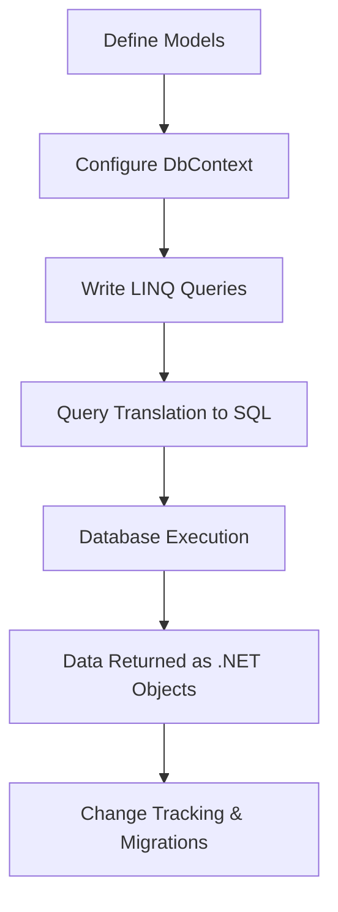
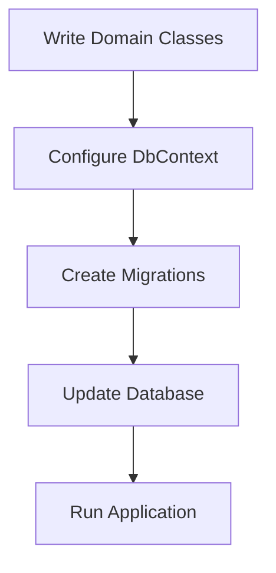
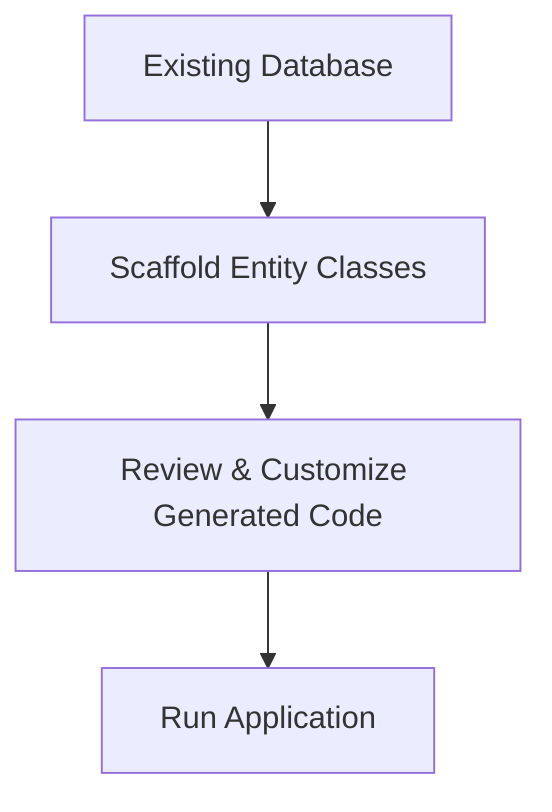

# EntityFrameworkCore

---
# 🚀 Entity Framework Core (EF Core) in .NET Development
## 📌 Introduction
Entity Framework Core (EF Core) is an open-source, lightweight, and cross-platform Object-Relational Mapper (ORM) developed by Microsoft. It simplifies database interactions in .NET applications by allowing developers to work with strongly typed C# objects instead of raw SQL queries. EF Core is the successor to Entity Framework (EF) and provides enhanced performance, flexibility, and scalability.

EF Core eliminates the need for manually writing SQL queries, making data access more maintainable and efficient. By leveraging EF Core, developers can quickly implement CRUD (Create, Read, Update, Delete) operations, complex querying, and database migrations, reducing boilerplate code and improving application performance. With built-in support for multiple database providers, EF Core is widely used for applications ranging from small-scale projects to large enterprise solutions.

## 🔑 Key Features of EF Core
| Feature                  | Description                                                                              |
|--------------------------|------------------------------------------------------------------------------------------|
| 🚀 **Cross-Platform**       | Runs on Windows, Linux, and macOS, making it suitable for cloud and microservices.       |
| 🗄️ **Database Provider Support** | Supports multiple databases (SQL Server, SQLite, PostgreSQL, MySQL, Oracle, etc.).    |
| 🔍 **LINQ Integration**    | Enables queries using C# syntax with type safety, IntelliSense, and compile-time checks. |
| 📊 **Change Tracking**    | Automatically detects and tracks changes in data models, optimizing database operations.  |
| 🔄 **Migrations**         | Simplifies database schema evolution through incremental and version-controlled migrations. |
| ⚡ **High Performance**    | Optimized with query batching, compiled queries, and lazy loading for efficiency.         |
| 🔧 **Extensibility**      | Allows customization via custom conventions, value converters, and interceptors.          |
| 📦 **Dependency Injection** | Easily integrates with ASP.NET Core's DI system for better resource management.          |

## 🏗️ Setting Up EF Core
### 1️⃣ Install EF Core Packages
To use EF Core in a .NET project, install the necessary NuGet packages:

```sh
# Install EF Core
 dotnet add package Microsoft.EntityFrameworkCore

# Install EF Core SQL Server Provider
 dotnet add package Microsoft.EntityFrameworkCore.SqlServer

# Install EF Core SQLite Provider
 dotnet add package Microsoft.EntityFrameworkCore.Sqlite

# Install EF Core PostgreSQL Provider
 dotnet add package Npgsql.EntityFrameworkCore.PostgreSQL
```

### 2️⃣ Define a Model (Entity Class)
A model represents a table in the database. Below is an example entity class for a `Product` table:
```csharp
public class Product
{
    public int Id { get; set; }
    public string Name { get; set; }
    public decimal Price { get; set; }
    public string Category { get; set; } // Added new property
}
```

### 3️⃣ Create a DbContext Class
The `DbContext` class manages database interactions and provides an interface for querying and persisting data:
```csharp
public class ApplicationDbContext : DbContext
{
    public DbSet<Product> Products { get; set; }

    protected override void OnConfiguring(DbContextOptionsBuilder options)
    {
        options.UseSqlServer("Server=.;Database=ShopDB;Trusted_Connection=True;");
    }
}
```

## 🔄 Database Migrations
Migrations allow developers to update database schemas without manually modifying SQL scripts.
- **Create an Initial Migration:**
  ```sh
  dotnet ef migrations add InitialCreate
  ```
- **Apply the Migration to the Database:**
  ```sh
  dotnet ef database update
  ```

By using migrations, schema changes can be tracked in source control, allowing teams to collaborate more efficiently on database modifications.

## ✏️ CRUD Operations in EF Core
### ➕ **Create Data**
```csharp
using (var context = new ApplicationDbContext())
{
    var product = new Product { Name = "Laptop", Price = 1200.50m, Category = "Electronics" };
    context.Products.Add(product);
    context.SaveChanges();
}
```

### 🔍 **Retrieve Data**
```csharp
var products = context.Products.Where(p => p.Category == "Electronics").ToList();
```

### ✏️ **Update Data**
```csharp
var product = context.Products.FirstOrDefault(p => p.Id == 1);
if (product != null)
{
    product.Price = 999.99m;
    context.SaveChanges();
}
```

### 🗑️ **Delete Data**
```csharp
var product = context.Products.FirstOrDefault(p => p.Id == 1);
if (product != null)
{
    context.Products.Remove(product);
    context.SaveChanges();
}
```

---
## 📊 EF Core Workflow



## 🏁 Conclusion
Entity Framework Core is a powerful ORM for .NET applications that simplifies database interactions, supports multiple databases, and provides high performance. By abstracting database access and leveraging LINQ, it makes database management intuitive and efficient for developers. EF Core is a key tool for modern .NET development, enabling efficient data access in a wide range of applications, from small projects to large-scale enterprise solutions.

## 📚 References
- [📖 Microsoft Documentation](https://docs.microsoft.com/en-us/ef/core/)
- [🔗 EF Core GitHub Repository](https://github.com/dotnet/efcore)

---
# 🚀 .NET CLI (Command Line Interface) in .NET Development
## 📌 Introduction
The **.NET CLI (Command Line Interface)** is a cross-platform tool that allows developers to create, build, run, test, and deploy .NET applications directly from the command line. It eliminates the need for a full IDE, making it a powerful tool for automation, CI/CD pipelines, cloud environments, and lightweight development workflows.
By leveraging .NET CLI, developers can efficiently manage dependencies, execute builds, and deploy applications across different platforms, such as:
- 🖥️ **Windows**
- 🐧 **Linux**
- 🍏 **macOS**

## 🔑 Key Features of .NET CLI
| Feature                 | Description                                                                                                  |
|-------------------------|--------------------------------------------------------------------------------------------------------------|
| 🚀 **Cross-Platform**      | Works on Windows, macOS, and Linux, enabling flexible development.                                           |
| 🔧 **Automation-Friendly** | Easily integrates into CI/CD pipelines and scriptable environments.                                        |
| ⚡ **Lightweight**         | Provides minimal installation compared to full IDEs, ideal for fast setups.                                |
| 📦 **Template-Driven**    | Offers multiple project templates (console, web, class library, etc.) to jumpstart development.           |
| 🏗️ **Extensible**         | Supports additional tools and custom commands via NuGet packages and scripts.                           |
| 🔍 **Dependency Management** | Allows easy addition, removal, and updating of NuGet packages within projects.                          |
| 🛠️ **Testing and Deployment** | Supports unit testing, integration testing, and publishing applications efficiently.                   |

## 📥 Installing .NET CLI
.NET CLI is bundled with the .NET SDK. To check if it's installed, open a terminal and run:

```sh
dotnet --version
```

If .NET SDK is not installed, download it from:
👉 [Download .NET SDK](https://dotnet.microsoft.com/en-us/download)

## 🏗️ Commonly Used .NET CLI Commands
| Command | Description |
|---------|-------------|
| `dotnet --version` | Displays the installed .NET SDK version. |
| `dotnet new <template>` | Creates a new project from a specified template. |
| `dotnet restore` | Restores dependencies and project-specific tools. |
| `dotnet build` | Compiles the project and generates binaries. |
| `dotnet run` | Runs the application from source code. |
| `dotnet test` | Executes unit tests using a test framework. |
| `dotnet publish` | Packages the application for deployment. |
| `dotnet add package <package-name>` | Adds a NuGet package to the project. |
| `dotnet remove package <package-name>` | Removes a NuGet package from the project. |
| `dotnet list package` | Lists installed NuGet packages. |

## 🏗️ Creating, Building, and Running a .NET Application
### 1️⃣ Creating a New .NET Project
To create a new console application, run:

```sh
dotnet new console -o MyConsoleApp
cd MyConsoleApp
```

This generates a directory `MyConsoleApp` with a basic console app structure.

### 2️⃣ Restoring Dependencies
After modifying the `csproj` file or adding dependencies, restore them using:

```sh
dotnet restore
```

### 3️⃣ Building a .NET Project
To compile and build your application, run:

```sh
dotnet build
```

This generates compiled output files in the `bin` directory.

### 4️⃣ Running a .NET Application
To execute a .NET application, use:

```sh
dotnet run
```

## 🛠️ Managing Dependencies
### ➕ Adding a NuGet Package

```sh
dotnet add package Newtonsoft.Json
```

### 🗑️ Removing a Package

```sh
dotnet remove package Newtonsoft.Json
```

### 📦 Listing Installed Packages

```sh
dotnet list package
```

## 🧪 Running Tests
If the project contains unit tests, execute:

```sh
dotnet test
```

This runs all tests in the project and outputs the results to the terminal.

## 🌍 Publishing a .NET Application
To publish a self-contained application for deployment, use:

```sh
dotnet publish -c Release -r win-x64 --self-contained true
```

This generates a publishable binary inside the `publish` directory, ready for deployment.

## 📊 .NET CLI Workflow Diagram

```mermaid
flowchart TD
    A[Install .NET SDK] --> B[Create Project (dotnet new)]
    B --> C[Restore Dependencies (dotnet restore)]
    C --> D[Build Project (dotnet build)]
    D --> E[Run Application (dotnet run)]
    E --> F[Test Application (dotnet test)]
    F --> G[Publish Application (dotnet publish)]
```

## 🏁 Conclusion
.NET CLI is a powerful and essential tool for .NET developers. It enables efficient project management, dependency handling, building, testing, and deployment, making it indispensable for modern development workflows. By mastering .NET CLI, developers can streamline development, automate tasks, and enhance productivity across different environments.

## 📚 References
- [📖 Official .NET CLI Documentation](https://docs.microsoft.com/en-us/dotnet/core/tools/)
- [🔗 Download .NET SDK](https://dotnet.microsoft.com/en-us/download)

---
# 🚀 Code First vs Database First Development in .NET
## 📌 Introduction
In **.NET development**, particularly with **Entity Framework Core (EF Core)**, developers have two primary approaches for working with databases:
1. **Code First Development**
2. **Database First Development**
Each approach has distinct benefits and is suited for different scenarios. This guide explores both methodologies, their characteristics, advantages, disadvantages, and practical use cases. By the end, you'll have a clear understanding of when and how to use each approach effectively.

## 🏗️ Code First Development
### 📌 What is Code First?
The **Code First** approach allows developers to define the database schema using **C# entity classes**. EF Core then generates the database structure based on these classes. This approach is ideal when starting a new project without an existing database.

### 🔍 Key Characteristics
- ✅ Database schema is **generated from entity classes**.
- ✅ Developers manage database structure using **migrations**.
- ✅ Ideal for **greenfield projects** (new applications).
- ✅ Changes to the schema are **tracked within the source code**.
- ❌ Requires developers to manage database creation and migration manually.

### 🏗️ How to Use Code First
#### Step 1️⃣: Define Entity Classes
Create a `Product` class representing a table in the database:
```csharp
public class Product
{
    public int Id { get; set; }
    public string Name { get; set; }
    public decimal Price { get; set; }
}
```

#### Step 2️⃣: Create a DbContext
Define a `DbContext` class to manage database connections:

```csharp
public class ApplicationDbContext : DbContext
{
    public DbSet<Product> Products { get; set; }

    protected override void OnConfiguring(DbContextOptionsBuilder options)
    {
        options.UseSqlServer("Server=.;Database=ShopDB;Trusted_Connection=True;");
    }
}
```

#### Step 3️⃣: Apply Migrations and Create the Database
Use the following commands to generate the database schema:

```sh
dotnet ef migrations add InitialCreate
dotnet ef database update
```

#### Step 4️⃣: CRUD Operations
```csharp
using (var context = new ApplicationDbContext())
{
    var product = new Product { Name = "Laptop", Price = 1200.50m };
    context.Products.Add(product);
    context.SaveChanges();
}
```

## 🏛️ Database First Development
### 📌 What is Database First?
The **Database First** approach is used when the database schema **already exists**, and entity classes are generated based on the existing structure. This is useful for integrating legacy databases or when the schema is designed separately.

### 🔍 Key Characteristics
- ✅ The database schema **exists first**, and entity classes are generated from it.
- ✅ Uses **reverse engineering** to create models from the database.
- ✅ Ideal for **working with existing databases**.
- ✅ Reduces the need to manually define migrations.
- ❌ Less flexible, as database changes require **re-scaffolding**.

### 🏗️ How to Use Database First
#### Step 1️⃣: Install EF Core Tools
Run the following command to install Entity Framework Core tools:

```sh
dotnet tool install --global dotnet-ef
```

#### Step 2️⃣: Generate Entity Classes from Database
Use the following command to scaffold entity classes from an existing database:

```sh
dotnet ef dbcontext scaffold "Server=.;Database=ShopDB;Trusted_Connection=True;" Microsoft.EntityFrameworkCore.SqlServer -o Models
```

This generates the `Models` folder with entity classes corresponding to database tables.

#### Step 3️⃣: Use the Generated Context
Once the entity classes are generated, use them in your application:
```csharp
using (var context = new ApplicationDbContext())
{
    var products = context.Products.ToList();
    foreach (var product in products)
    {
        Console.WriteLine($"{product.Id} - {product.Name} - {product.Price}");
    }
}
```

## 🔄 Comparison: Code First vs Database First
| Feature | Code First | Database First |
|---------|------------|---------------|
| **Use Case** | New applications | Existing databases |
| **Schema Management** | Defined in C# classes | Defined in SQL |
| **Database Evolution** | Uses migrations | Manual updates |
| **Flexibility** | High (customizable in code) | Limited to database structure |
| **Tooling Support** | Uses EF migrations | Uses reverse engineering |

## 📊 Workflow Diagrams
### Code First Workflow



### Database First Workflow



## 🏁 Conclusion
Both **Code First** and **Database First** approaches have advantages depending on the project requirements:
- Use **Code First** when starting a new project and managing schema in C#.
- Use **Database First** when working with an existing database that must remain unchanged.
By understanding these approaches, developers can choose the best strategy to fit their application’s needs.

## 📚 References
- [Microsoft Documentation - EF Core](https://learn.microsoft.com/en-us/ef/core/)
- [Entity Framework Core GitHub Repository](https://github.com/dotnet/efcore)

---
# 🚀 Database Migrations in .NET Development
## 📌 Introduction
**Database migrations** in .NET development, particularly with **Entity Framework Core (EF Core)**, provide a mechanism to manage database schema changes systematically. Instead of manually altering database tables, migrations allow developers to modify and evolve their database structure while ensuring that the database remains in sync with the application’s data model.
Migrations facilitate version control, making it easier to track database changes, roll back modifications if needed, and streamline the deployment process across different environments.

## 🔍 Key Characteristics of Database Migrations
| Feature                 | Description |
|-------------------------|-------------|
| ✅ **Schema Automation** | Apply, modify, or delete tables and columns without manual SQL scripting. |
| 🔄 **Version Control**  | Track database schema changes incrementally, ensuring structured evolution. |
| 🌍 **Multi-Database Support** | Compatible with SQL Server, PostgreSQL, MySQL, SQLite, and more. |
| ⚡ **CI/CD Integration** | Automate database updates in development, staging, and production environments. |
| 🛠 **Rollback Support** | Enables rolling back schema changes to a previous state when needed. |

## 🏗️ Setting Up Migrations in EF Core
### 1️⃣ Install EF Core Tools
Ensure EF Core is installed in your .NET project. If not, install it with the following commands:

```sh
# Install EF Core CLI Tool
dotnet tool install --global dotnet-ef

# Install EF Core SQL Server Provider
dotnet add package Microsoft.EntityFrameworkCore.SqlServer
```

### 2️⃣ Creating an Initial Migration
Define a **DbContext** class representing the database connection:
```csharp
public class ApplicationDbContext : DbContext
{
    public DbSet<Product> Products { get; set; }

    protected override void OnConfiguring(DbContextOptionsBuilder options)
    {
        options.UseSqlServer("Server=.;Database=ShopDB;Trusted_Connection=True;");
    }
}
```

Now, create the first migration:

```sh
dotnet ef migrations add InitialCreate
```

This command generates a **Migrations** folder containing:
- `YYYYMMDDHHMMSS_InitialCreate.cs` – Defines schema changes.
- `ApplicationDbContextModelSnapshot.cs` – Represents the latest schema snapshot.

### 3️⃣ Applying the Migration to the Database
Once a migration is created, apply it using:

```sh
dotnet ef database update
```

This command updates the database schema to match the migration script.

### 4️⃣ Adding New Migrations
If changes are made to the model (e.g., adding a new column `Category` to `Product`):
```csharp
public class Product
{
    public int Id { get; set; }
    public string Name { get; set; }
    public decimal Price { get; set; }
    public string Category { get; set; }  // New column added
}
```
Generate a new migration:

```sh
dotnet ef migrations add AddCategoryColumn
```

Apply the changes to the database:

```sh
dotnet ef database update
```

### 5️⃣ Reverting Migrations
To revert the last migration:

```sh
dotnet ef migrations remove
```

To roll back to a specific migration:

```sh
dotnet ef database update PreviousMigrationName
```

## 📊 Understanding Migration Files
| File | Description |
|------|-------------|
| `YYYYMMDDHHMMSS_MigrationName.cs` | Defines schema changes. |
| `ApplicationDbContextModelSnapshot.cs` | Represents the latest schema snapshot. |
| `MigrationsHistoryTable` | A special table in the database that tracks applied migrations. |

## 🌍 Using Migrations in Production
- 📌 Use **CI/CD pipelines** to automate migrations.
- 📌 Apply migrations **before deploying** the application.
- 📌 Keep **database backups** before running new migrations.
- 📌 Use **transactional migrations** to prevent partial updates in case of errors.

## 🔄 Migration Workflow Diagram

```mermaid
flowchart TD
    A[Define/Modify Domain Models] --> B[Create Migration (dotnet ef migrations add)]
    B --> C[Review Generated Migration Code]
    C --> D[Apply Migration (dotnet ef database update)]
    D --> E[Database Schema Updated]
    E --> F[Run Application]
```

## 🏁 Conclusion
Database migrations in .NET development simplify schema changes, allowing applications to evolve without manual database modifications. They enhance version control, ensure consistency across environments, and streamline database updates.

By integrating EF Core migrations into the development workflow, teams can maintain robust and scalable applications while keeping database structures versioned and synchronized.

## 📚 References
- [Microsoft Documentation - Migrations](https://learn.microsoft.com/en-us/ef/core/managing-schemas/migrations/)

---
# 🚀 Seeding Data in Database using .NET Development
## 📌 Introduction
**Seeding data** in .NET development refers to the process of **pre-populating a database** with initial values when the database is created or migrated. This is commonly used to set up reference data, default configurations, or test data to ensure the application has the necessary information when it starts.
Entity Framework Core (EF Core) provides a built-in mechanism for seeding data during migrations, ensuring that required data is available without requiring manual insertion. This document will guide you through various approaches to database seeding using **migrations** and **runtime seeding**.

## 🔍 Key Characteristics of Data Seeding
| Feature | Description |
|---------|-------------|
| ✅ **Automatic Data Insertion** | Ensures data is inserted automatically when the database is created or migrated. |
| 🔄 **Idempotent Execution** | Prevents duplicate records by checking existing data. |
| 🌍 **Supports Multiple Databases** | Works with SQL Server, PostgreSQL, MySQL, SQLite, etc. |
| ⚡ **Useful for Default Data** | Ideal for roles, categories, admin users, etc. |
| 🔧 **Supports Versioning** | Seed data can evolve through migrations. |

## ⚙️ Implementing Data Seeding in EF Core
### 📌 1. Adding Seed Data in the `OnModelCreating` Method
EF Core allows you to seed data by overriding the `OnModelCreating` method in your `DbContext` class.
#### Example: Seeding a `Products` Table
```csharp
public class ApplicationDbContext : DbContext
{
    public DbSet<Product> Products { get; set; }

    protected override void OnModelCreating(ModelBuilder modelBuilder)
    {
        modelBuilder.Entity<Product>().HasData(
            new Product { Id = 1, Name = "Laptop", Price = 1200.00m },
            new Product { Id = 2, Name = "Smartphone", Price = 800.00m },
            new Product { Id = 3, Name = "Tablet", Price = 500.00m }
        );
    }
}
```
### 🔄 2. Applying Migrations
After adding seed data, generate a migration and apply it:

```sh
dotnet ef migrations add SeedProducts
dotnet ef database update
```

This migration ensures that the seed data is inserted into the database.

## ✏️ Seeding Related Entities
If there are relationships between tables, you need to ensure proper foreign key values.
#### Example: Seeding `Categories` and `Products`
```csharp
public class ApplicationDbContext : DbContext
{
    public DbSet<Category> Categories { get; set; }
    public DbSet<Product> Products { get; set; }

    protected override void OnModelCreating(ModelBuilder modelBuilder)
    {
        modelBuilder.Entity<Category>().HasData(
            new Category { Id = 1, Name = "Electronics" },
            new Category { Id = 2, Name = "Appliances" }
        );

        modelBuilder.Entity<Product>().HasData(
            new Product { Id = 1, Name = "Laptop", Price = 1200.00m, CategoryId = 1 },
            new Product { Id = 2, Name = "Washing Machine", Price = 700.00m, CategoryId = 2 }
        );
    }
}
```
This ensures that `Products` reference the `Category` table correctly.

## 📦 Alternative Approach: Seeding Data at Application Startup
Instead of migrations, you can seed data when the application starts using `IServiceProvider`.
### Example: Seeding Users in `Program.cs`
```csharp
using (var scope = app.Services.CreateScope())
{
    var context = scope.ServiceProvider.GetRequiredService<ApplicationDbContext>();
    if (!context.Users.Any())
    {
        context.Users.Add(new User { Id = 1, Name = "Admin", Role = "Administrator" });
        context.SaveChanges();
    }
}
```

This method is useful for dynamic seeding without modifying migrations.
## 📊 Comparison: Migrations vs Runtime Seeding
| Feature | Migrations Seeding | Runtime Seeding |
|---------|----------------|----------------|
| **When Applied?** | During migrations | At application startup |
| **Ensures Data Integrity?** | Yes | Not enforced |
| **Flexible Data Updates?** | Requires migration updates | Can be changed dynamically |
| **Best For** | Static default data | Dynamic or user-configurable data |

## 📊 Data Seeding Workflow Diagram

```mermaid
flowchart TD
    A[Define Entity Models] --> B[Configure DbContext with HasData]
    B --> C[Add Migration (dotnet ef migrations add)]
    C --> D[Update Database (dotnet ef database update)]
    D --> E[Database is Created/Updated with Seed Data]
    E --> F[Application Runs with Baseline Data]
```

## 🏁 Conclusion
Seeding data in .NET ensures that applications start with essential data, reducing manual effort and improving consistency. Whether using **EF Core migrations** or **runtime seeding**, the right approach depends on project requirements.
For **static, version-controlled data**, use migrations. For **dynamic, configurable data**, seed during application startup.

---
# 🚀 Data Models in .NET Development
## 📌 Introduction
In **.NET development**, **Data Models** define how data is structured, stored, and manipulated within an application. These models are essential for ensuring data integrity, consistency, and efficiency. **Entity Framework Core (EF Core)** enables developers to interact with databases using C# objects rather than raw SQL queries, streamlining development and maintaining cleaner code.
A well-designed **data model** enhances application scalability, maintainability, and performance by reducing redundancy and optimizing data retrieval.

## 🔍 Key Characteristics of Data Models
| Feature | Description |
|---------|-------------|
| ✅ **Defines Data Structure** | Specifies properties, types, and relationships. |
| ✅ **Ensures Data Integrity** | Uses constraints like primary keys, foreign keys, and validations. |
| ✅ **Facilitates Data Manipulation** | Supports CRUD (Create, Read, Update, Delete) operations. |
| ✅ **Works with ORMs** | Maps objects to database records using frameworks like EF Core. |
| ✅ **Supports Different Database Providers** | Works with SQL Server, MySQL, PostgreSQL, SQLite, etc. |
| ✅ **Enhances Performance** | Optimized queries and indexing strategies improve efficiency. |
| ✅ **Ensures Scalability** | Structures data to support large-scale applications. |

## 📌 Types of Data Models in .NET
### 1️⃣ **Conceptual Data Model**
Represents high-level business entities and relationships, often independent of specific technology or database. This model is typically used in requirement analysis and system design phases.

Example:
```plaintext
Customer → Order → Product
```

### 2️⃣ **Logical Data Model**
Defines entities, attributes, and relationships in more detail but is still independent of database implementation. This model is more structured and acts as a blueprint for physical implementation.

Example:
```plaintext
Customer (Id, Name, Email)
Order (Id, OrderDate, CustomerId)
Product (Id, Name, Price)
```

### 3️⃣ **Physical Data Model**
Maps the logical model to an actual database schema, including table definitions, columns, indexes, and constraints. It determines how data is stored, retrieved, and managed in the database.

Example (SQL Schema):
```sql
CREATE TABLE Customers (
    Id INT PRIMARY KEY,
    Name NVARCHAR(100),
    Email NVARCHAR(255) UNIQUE
);
```

## ⚙️ Implementing Data Models in .NET using EF Core
### 🏗️ 1. Defining a Data Model Class
In **Entity Framework Core**, data models are defined using **C# classes**. Each class represents a table in the database.
#### Example: `Product` Entity
```csharp
public class Product
{
    public int Id { get; set; }
    public string Name { get; set; }
    public decimal Price { get; set; }
    public DateTime CreatedDate { get; set; } // New property added
}
```

### 🔄 2. Creating a DbContext
A `DbContext` class manages the database connection and interactions.
```csharp
public class ApplicationDbContext : DbContext
{
    public DbSet<Product> Products { get; set; }

    protected override void OnConfiguring(DbContextOptionsBuilder options)
    {
        options.UseSqlServer("Server=.;Database=ShopDB;Trusted_Connection=True;");
    }
}
```

### 📌 3. Applying Migrations
To create the database schema based on the data model:

```sh
dotnet ef migrations add InitialCreate
dotnet ef database update
```

This generates a **Products** table in the database.

## 📊 Data Models and Relationships
Data models support relationships like:
### 1️⃣ **One-to-One Relationship**
Example: Each `User` has one `Profile`.
```csharp
public class User
{
    public int Id { get; set; }
    public string Name { get; set; }
    public Profile Profile { get; set; }
}

public class Profile
{
    public int Id { get; set; }
    public string Address { get; set; }
    public int UserId { get; set; }
    public User User { get; set; }
}
```

### 2️⃣ **One-to-Many Relationship**
Example: A `Category` can have multiple `Products`.
```csharp
public class Category
{
    public int Id { get; set; }
    public string Name { get; set; }
    public List<Product> Products { get; set; }
}
```

### 3️⃣ **Many-to-Many Relationship**
Example: A `Student` can enroll in multiple `Courses`.
```csharp
public class Student
{
    public int Id { get; set; }
    public string Name { get; set; }
    public List<Course> Courses { get; set; }
}

public class Course
{
    public int Id { get; set; }
    public string Title { get; set; }
    public List<Student> Students { get; set; }
}
```

## 🔍 Data Annotations vs Fluent API
EF Core provides two ways to configure data models:
| Feature | Data Annotations | Fluent API |
|---------|----------------|------------|
| **Definition** | Uses attributes in entity classes | Uses `OnModelCreating` method |
| **Usage** | Simple configuration | More advanced customization |
| **Example** | `[Required]`, `[Key]`, `[MaxLength(50)]` | `modelBuilder.Entity<Product>().Property(p => p.Name).IsRequired();` |

### 📌 Example: Using Data Annotations
```csharp
public class Product
{
    [Key]
    public int Id { get; set; }
    [Required]
    [MaxLength(100)]
    public string Name { get; set; }
    [Column(TypeName = "decimal(18,2)")]
    public decimal Price { get; set; }
    public DateTime CreatedDate { get; set; }
}
```

### 📌 Example: Using Fluent API
```csharp
protected override void OnModelCreating(ModelBuilder modelBuilder)
{
    modelBuilder.Entity<Product>()
        .Property(p => p.Name)
        .IsRequired()
        .HasMaxLength(100);
}
```

## 🏁 Conclusion
Data models are fundamental in .NET development, defining how data is structured, stored, and managed. Whether using **Entity Framework Core** or raw SQL, a well-designed data model improves application maintainability, performance, and scalability.
Choosing the right modeling approach—**Conceptual, Logical, or Physical**—and configuring relationships properly ensures efficient data handling in modern applications. By implementing best practices such as data integrity constraints, performance optimization, and scalability considerations, developers can build robust and efficient systems.

---
# 🚀 Database Context in .NET Development
## 📌 Introduction
In **.NET development**, **Database Context** (commonly referred to as `DbContext` in **Entity Framework Core**) is the bridge between your application and the database. It allows developers to interact with a database using **C# objects** instead of raw SQL queries. The `DbContext` class is a crucial component of **Entity Framework Core (EF Core)**, providing an abstraction layer for database operations.
A well-configured `DbContext` ensures **efficient data access, transaction management, and scalability**, making it a fundamental aspect of **modern .NET applications**.

## 🔍 Key Characteristics of `DbContext`
| Feature | Description |
|---------|-------------|
| ✅ **Manages Database Connections** | Handles opening and closing database connections. |
| ✅ **Tracks Changes** | Keeps track of entity changes and updates them in the database. |
| ✅ **Provides Query Capabilities** | Allows LINQ-based querying of the database. |
| ✅ **Manages Transactions** | Ensures atomicity of operations. |
| ✅ **Works with Multiple Database Providers** | Supports SQL Server, PostgreSQL, MySQL, SQLite, and more. |
| ✅ **Facilitates Dependency Injection** | Can be injected into services for better code organization. |

## 📌 Defining a Database Context in EF Core
To use a `DbContext`, you must define a class that inherits from `DbContext` and specify **DbSet properties** that represent database tables.
### Example: Defining `ApplicationDbContext`
```csharp
using Microsoft.EntityFrameworkCore;

public class ApplicationDbContext : DbContext
{
    public DbSet<Product> Products { get; set; }
    public DbSet<Category> Categories { get; set; }

    protected override void OnConfiguring(DbContextOptionsBuilder options)
    {
        options.UseSqlServer("Server=.;Database=ShopDB;Trusted_Connection=True;");
    }
}
```
### Explanation:
- The `DbSet<Product>` and `DbSet<Category>` represent tables in the database.
- `OnConfiguring()` method is used to define the **database connection string**.
- `UseSqlServer()` specifies **SQL Server** as the database provider.

## 🔄 Registering `DbContext` in Dependency Injection
To properly manage database context in an **ASP.NET Core application**, register it in the **Dependency Injection (DI) container** within `Program.cs`.
### Example: Adding `DbContext` in `Program.cs`
```csharp
using Microsoft.EntityFrameworkCore;
using Microsoft.Extensions.DependencyInjection;

var builder = WebApplication.CreateBuilder(args);

// Register DbContext with SQL Server
builder.Services.AddDbContext<ApplicationDbContext>(options =>
    options.UseSqlServer(builder.Configuration.GetConnectionString("DefaultConnection")));

var app = builder.Build();
app.Run();
```
### Explanation:
- `AddDbContext<TContext>()` registers the `DbContext` in the dependency injection system.
- The connection string is retrieved from the **configuration file (`appsettings.json`)**.

## 📊 Understanding `DbSet` and Querying Data
The `DbSet<T>` property in `DbContext` represents a table in the database. You can perform **CRUD operations** using LINQ.
### Example: Performing CRUD Operations
#### 1️⃣ **Adding Data**
```csharp
using (var context = new ApplicationDbContext())
{
    var product = new Product { Name = "Laptop", Price = 1200.00m };
    context.Products.Add(product);
    context.SaveChanges();
}
```

#### 2️⃣ **Retrieving Data**
```csharp
using (var context = new ApplicationDbContext())
{
    var products = context.Products.ToList();
    foreach (var product in products)
    {
        Console.WriteLine($"{product.Id}: {product.Name} - ${product.Price}");
    }
}
```

#### 3️⃣ **Updating Data**
```csharp
using (var context = new ApplicationDbContext())
{
    var product = context.Products.FirstOrDefault(p => p.Id == 1);
    if (product != null)
    {
        product.Price = 999.99m;
        context.SaveChanges();
    }
}
```

#### 4️⃣ **Deleting Data**
```csharp
using (var context = new ApplicationDbContext())
{
    var product = context.Products.FirstOrDefault(p => p.Id == 1);
    if (product != null)
    {
        context.Products.Remove(product);
        context.SaveChanges();
    }
}
```

## 🔍 Managing Transactions with `DbContext`
EF Core provides built-in support for **transactions**, allowing multiple operations to be executed atomically.
### Example: Using Transactions
```csharp
using (var context = new ApplicationDbContext())
{
    using var transaction = context.Database.BeginTransaction();
    try
    {
        var product = new Product { Name = "Tablet", Price = 400.00m };
        context.Products.Add(product);
        context.SaveChanges();
        
        var category = new Category { Name = "Electronics" };
        context.Categories.Add(category);
        context.SaveChanges();
        
        transaction.Commit();
    }
    catch
    {
        transaction.Rollback();
    }
}
```
### Explanation:
- `BeginTransaction()` starts a database transaction.
- `Commit()` saves all operations atomically.
- `Rollback()` reverts changes if an error occurs.

## 📌 Best Practices for Using `DbContext`
| Best Practice | Description |
|--------------|-------------|
| **Use Dependency Injection** | Always inject `DbContext` instead of creating new instances manually. |
| **Dispose Context Properly** | Use `using` statements or scoped lifetime to manage context efficiently. |
| **Avoid Long-Lived Contexts** | Keep `DbContext` short-lived to prevent memory leaks. |
| **Use Asynchronous Methods** | Prefer async methods like `SaveChangesAsync()` for better performance. |
| **Optimize Queries** | Retrieve only necessary data using `.Select()` and `.AsNoTracking()`. |

## 📊 Database Context Workflow Diagram

```mermaid
flowchart LR
    A[Application Code] --> B[Domain Models (Entities)]
    B --> C[Database Context (DbContext)]
    C --> D[LINQ Queries/Operations]
    D --> E[Database (SQL Server, SQLite, etc.)]
```

## 🏁 Conclusion
The **Database Context (`DbContext`)** is a fundamental part of **Entity Framework Core**, acting as the gateway between the .NET application and the database. It provides **querying, data manipulation, and transaction management** while ensuring efficient database operations.
Understanding how to correctly configure, use, and optimize `DbContext` is crucial for building high-performance and maintainable applications.

---
# 🚀 Database Support in .NET Development
## 📌 Introduction
In .NET development, **Database Support** refers to the built-in capabilities of the .NET framework to interact with various types of databases. .NET provides multiple ways to connect, query, and manipulate databases efficiently. From **ADO.NET** for direct database interactions to **Entity Framework Core (EF Core)** for Object-Relational Mapping (ORM), .NET ensures that developers have robust tools to manage data.
Understanding how .NET supports different databases, their characteristics, and how to use them effectively is crucial for developing **scalable** and **maintainable** applications.

## 🔍 Key Characteristics of Database Support in .NET
| Feature | Description |
|---------|-------------|
| ✅ **Multi-Database Support** | Compatible with relational (SQL) and non-relational (NoSQL) databases. |
| ✅ **Multiple Access Methods** | Supports ADO.NET, Entity Framework Core, and Dapper for database interactions. |
| ✅ **Cross-Platform Compatibility** | .NET Core and .NET 6+ support Linux, Windows, and macOS databases. |
| ✅ **ORM Support** | Provides high-level abstraction via Entity Framework Core. |
| ✅ **Security and Performance Optimization** | Includes features like connection pooling, parameterized queries, and transactions. |

## 📌 Types of Database Support in .NET
### 1️⃣ **Relational Databases (SQL-Based)**
Relational databases store structured data in tables with defined relationships. .NET supports:
- **Microsoft SQL Server**
- **MySQL**
- **PostgreSQL**
- **SQLite**
- **Oracle Database**

### 2️⃣ **NoSQL Databases (Non-Relational)**
NoSQL databases store data in flexible formats such as JSON or key-value pairs. .NET supports:
- **MongoDB**
- **Cassandra**
- **Cosmos DB**
- **Redis**

## ⚙️ Connecting to a Database in .NET
### 🏗️ 1. Using ADO.NET (Low-Level Access)
ADO.NET provides direct control over database connections, commands, and transactions.
#### Example: Connecting to SQL Server
```csharp
using System;
using System.Data.SqlClient;

string connectionString = "Server=localhost;Database=ShopDB;Trusted_Connection=True;";

using (SqlConnection connection = new SqlConnection(connectionString))
{
    connection.Open();
    Console.WriteLine("Database connected successfully.");
}
```

### 🔄 2. Using Entity Framework Core (High-Level ORM)
Entity Framework Core simplifies database interactions by allowing developers to work with objects instead of raw SQL.
#### Example: Defining a DbContext
```csharp
using Microsoft.EntityFrameworkCore;

public class ApplicationDbContext : DbContext
{
    public DbSet<Product> Products { get; set; }

    protected override void OnConfiguring(DbContextOptionsBuilder options)
    {
        options.UseSqlServer("Server=localhost;Database=ShopDB;Trusted_Connection=True;");
    }
}
```

#### Example: Querying Data with EF Core
```csharp
using (var context = new ApplicationDbContext())
{
    var products = context.Products.ToList();
    foreach (var product in products)
    {
        Console.WriteLine($"{product.Id} - {product.Name} - ${product.Price}");
    }
}
```

## 📊 Comparing ADO.NET, EF Core, and Dapper
| Feature | ADO.NET | Entity Framework Core | Dapper |
|---------|--------|----------------------|--------|
| **Abstraction Level** | Low | High | Medium |
| **Performance** | High | Moderate | High |
| **Ease of Use** | Complex | Easy | Moderate |
| **Supports Transactions** | ✅ | ✅ | ✅ |
| **Ideal For** | High-performance scenarios | Rapid development | Optimized queries |

## 🔍 Managing Database Connections Efficiently
To ensure optimal performance and security, follow these best practices:
1. **Use Connection Pooling** – Reduce overhead by reusing existing connections.
2. **Use Parameterized Queries** – Prevent SQL injection attacks.
3. **Manage Transactions** – Ensure atomic operations using `BeginTransaction()`.
4. **Use Lazy Loading Wisely** – Avoid unnecessary data fetching.
5. **Optimize Queries** – Fetch only required data with `.Select()` and `.AsNoTracking()`.

## 📊 .NET Database Support Architecture

```mermaid
flowchart TD
    A[.NET Application] --> B[Data Access Layer]
    B --> C[ADO.NET / ORM Frameworks]
    C --> D[Database Providers (SQL Server, SQLite, etc.)]
    D --> E[Underlying Database Engine]
```

## 🏁 Conclusion
Database support in .NET is robust and versatile, enabling developers to work with both **relational** and **NoSQL** databases seamlessly. Understanding different database access methods—**ADO.NET** for raw control, **EF Core** for abstraction, and **Dapper** for optimized queries—helps in choosing the right tool for the job.
By following best practices, developers can build **high-performance** and **secure** applications with well-structured database interactions.
