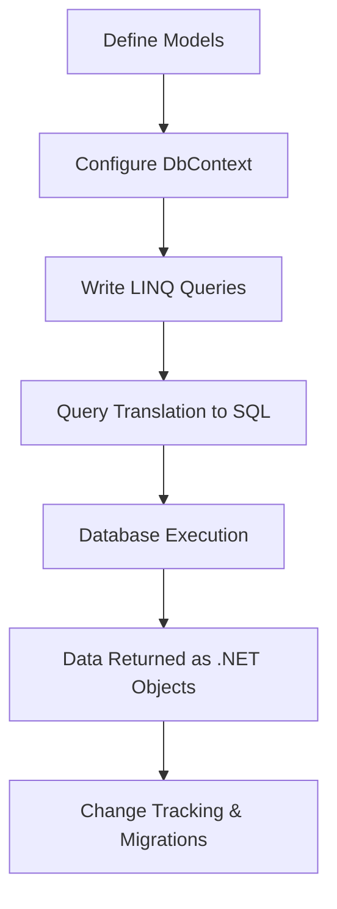

# EntityFrameworkCore

# 🚀 Entity Framework Core (EF Core) in .NET Development
## 📌 Introduction
Entity Framework Core (EF Core) is an open-source, lightweight, and cross-platform Object-Relational Mapper (ORM) developed by Microsoft. It simplifies database interactions in .NET applications by allowing developers to work with strongly typed C# objects instead of raw SQL queries. EF Core is the successor to Entity Framework (EF) and provides enhanced performance, flexibility, and scalability.

EF Core eliminates the need for manually writing SQL queries, making data access more maintainable and efficient. By leveraging EF Core, developers can quickly implement CRUD (Create, Read, Update, Delete) operations, complex querying, and database migrations, reducing boilerplate code and improving application performance. With built-in support for multiple database providers, EF Core is widely used for applications ranging from small-scale projects to large enterprise solutions.

## 🔑 Key Features of EF Core
| Feature                  | Description                                                                              |
|--------------------------|------------------------------------------------------------------------------------------|
| 🚀 **Cross-Platform**       | Runs on Windows, Linux, and macOS, making it suitable for cloud and microservices.       |
| 🗄️ **Database Provider Support** | Supports multiple databases (SQL Server, SQLite, PostgreSQL, MySQL, Oracle, etc.).    |
| 🔍 **LINQ Integration**    | Enables queries using C# syntax with type safety, IntelliSense, and compile-time checks. |
| 📊 **Change Tracking**    | Automatically detects and tracks changes in data models, optimizing database operations.  |
| 🔄 **Migrations**         | Simplifies database schema evolution through incremental and version-controlled migrations. |
| ⚡ **High Performance**    | Optimized with query batching, compiled queries, and lazy loading for efficiency.         |
| 🔧 **Extensibility**      | Allows customization via custom conventions, value converters, and interceptors.          |
| 📦 **Dependency Injection** | Easily integrates with ASP.NET Core's DI system for better resource management.          |

## 🏗️ Setting Up EF Core
### 1️⃣ Install EF Core Packages
To use EF Core in a .NET project, install the necessary NuGet packages:

```sh
# Install EF Core
 dotnet add package Microsoft.EntityFrameworkCore

# Install EF Core SQL Server Provider
 dotnet add package Microsoft.EntityFrameworkCore.SqlServer

# Install EF Core SQLite Provider
 dotnet add package Microsoft.EntityFrameworkCore.Sqlite

# Install EF Core PostgreSQL Provider
 dotnet add package Npgsql.EntityFrameworkCore.PostgreSQL
```

### 2️⃣ Define a Model (Entity Class)
A model represents a table in the database. Below is an example entity class for a `Product` table:

```csharp
public class Product
{
    public int Id { get; set; }
    public string Name { get; set; }
    public decimal Price { get; set; }
    public string Category { get; set; } // Added new property
}
```

### 3️⃣ Create a DbContext Class
The `DbContext` class manages database interactions and provides an interface for querying and persisting data:

```csharp
public class ApplicationDbContext : DbContext
{
    public DbSet<Product> Products { get; set; }

    protected override void OnConfiguring(DbContextOptionsBuilder options)
    {
        options.UseSqlServer("Server=.;Database=ShopDB;Trusted_Connection=True;");
    }
}
```

## 🔄 Database Migrations
Migrations allow developers to update database schemas without manually modifying SQL scripts.

- **Create an Initial Migration:**
  ```sh
  dotnet ef migrations add InitialCreate
  ```
- **Apply the Migration to the Database:**
  ```sh
  dotnet ef database update
  ```

By using migrations, schema changes can be tracked in source control, allowing teams to collaborate more efficiently on database modifications.

## ✏️ CRUD Operations in EF Core
### ➕ **Create Data**
```csharp
using (var context = new ApplicationDbContext())
{
    var product = new Product { Name = "Laptop", Price = 1200.50m, Category = "Electronics" };
    context.Products.Add(product);
    context.SaveChanges();
}
```

### 🔍 **Retrieve Data**
```csharp
var products = context.Products.Where(p => p.Category == "Electronics").ToList();
```

### ✏️ **Update Data**
```csharp
var product = context.Products.FirstOrDefault(p => p.Id == 1);
if (product != null)
{
    product.Price = 999.99m;
    context.SaveChanges();
}
```

### 🗑️ **Delete Data**
```csharp
var product = context.Products.FirstOrDefault(p => p.Id == 1);
if (product != null)
{
    context.Products.Remove(product);
    context.SaveChanges();
}
```

---
## 📊 EF Core Workflow



## 🏁 Conclusion
Entity Framework Core is a powerful ORM for .NET applications that simplifies database interactions, supports multiple databases, and provides high performance. By abstracting database access and leveraging LINQ, it makes database management intuitive and efficient for developers. EF Core is a key tool for modern .NET development, enabling efficient data access in a wide range of applications, from small projects to large-scale enterprise solutions.

## 📚 References
- [📖 Microsoft Documentation](https://docs.microsoft.com/en-us/ef/core/)
- [🔗 EF Core GitHub Repository](https://github.com/dotnet/efcore)

